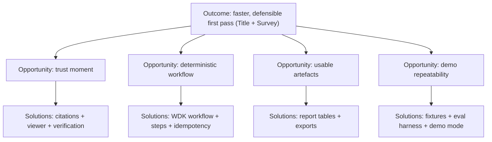

# Opportunity Solution Tree (PoC)

This is a lightweight opportunity/solution map to keep strategy and delivery coherent.
It’s a working doc; update it when we learn something meaningful.

## Desired outcome (north star)
US CRE practitioners can produce a defensible “first pass” Title + Survey analysis faster, with explicit evidence and explicit uncertainty.

## Current top opportunities (initial)
1) Make verification fast (trust moment)
- Citation chips that jump to highlighted evidence
- Locked citations + snippet hashing
- Fail-closed verification + actionable failure states

2) Make the workflow deterministic and repeatable
- Explicit workflow controller (not agent loops)
- Stable question set v1 + row schemas
- Idempotent runs + provenance

3) Make outputs usable as artefacts
- Report tables that map to real deliverables (B-I, B-II, survey issues)
- Exports (CSV + one Word memo)

4) Make demos non-brittle
- Fixture packs + `/truth` for evals
- Demo mode controls + safe reset + operator checklist

## Map (rough)

## Canonical references
- Initiative map: `docs/00-strategy/initiatives/initiative-overview-001-002-003.md`
- Architecture overview: `docs/03-architecture/00_overview.md`
