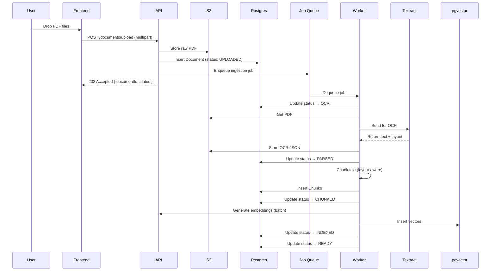
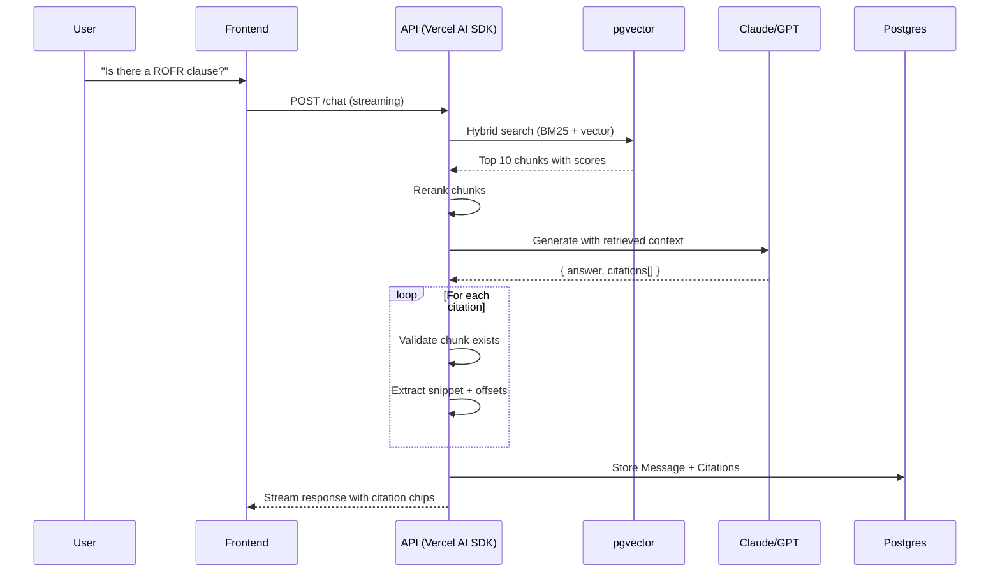

# US Commercial Real Estate Legal Due Diligence Copilot PoC
## Deep Architecture Document

**Version**: 1.0  
**Date**: January 2026  
**Author**: Architecture Design

---

## Executive Summary

This document provides a complete, implementable architecture for a minimal-but-production-grade Proof of Concept (PoC) that replicates the core experience of Orbital's Copilot product, focused exclusively on US commercial real estate legal due diligence.

**Key differentiators from generic "chat with PDF" solutions:**
- Trust and auditability: every claim is grounded with citations
- Workflow-first: embedded in the legal diligence workflow, not a general assistant
- Artefacts: outputs that match what lawyers already produce
- Evaluation-driven: systematic measurement, not vibe-based prompting

---

## Orbital's "4 Agents" Approach: Research Summary

### Source Material

From Orbital's tech blog post ["The Road to Autonomy"](https://tech.orbitalwitness.com/posts/2025-06-07-road-to-autonomy/) (June 2025), authored by Gus Levinson (AI Engineer):

> "Rather than a single AI doing everything, Copilot is an agentic system: a coordinated team of AI agents, each specialising in different tasks."

### The Four Agents

| Agent | Role | What It Does |
|-------|------|--------------|
| **Orchestration** | Planner & Coordinator | Receives user requests, creates execution plans, determines which specialist agents to deploy and in what sequence |
| **Summary** | Document Analyst | Tackles document analysis end-to-end; synthesises and summarises content |
| **Retrieval** | Evidence Finder | Searches through uploaded files for specific passages that answer nuanced questions |
| **Research** | Context Provider | Provides insights into industry standards and compares scenarios against established practices |

### Key Design Principles (from Orbital's public materials)

1. **Flexible scaffolding**: The system is designed to swap agents in/out as models improve
2. **Clear goals**: Each agent has a defined objective via system prompt
3. **Memory persistence**: Agents retain context across multi-step tasks
4. **Tool-equipped**: Agents can call specialised tools (search, extract, cite, etc.)
5. **Autonomous operation**: Users set goals and step back; agents handle research, reasoning, and decision-making

### Citation
Microsoft Customer Story confirms: "Our customers can't just output an answer; we have to give customers complete transparency about how we got to that answer, with links to all the source documentation and how the underlying AI Agent came to that conclusion based on what legal information it read."

---

## 1. Product Slice and Core User Journeys

### Primary Personas

| Persona | Context | Key Needs |
|---------|---------|-----------|
| **Junior Associate** | Law firm, 2-4 years PQE, handles bulk of doc review | Speed to first draft, defensible citations, clear issue flagging |
| **Paralegal** | Law firm or in-house, prepares diligence summaries | Structured extraction, checklist completion, export to firm templates |
| **In-house Counsel** | Corporate legal, reviews outside counsel work | Quick verification, risk summary, board-ready output |

### US Commercial Real Estate Due Diligence Context

Typical document pack for a commercial acquisition:
- **Title commitment** (ALTA format)
- **Survey** (ALTA/NSPS certified)
- **Existing leases** (NNN, gross, ground)
- **Easement agreements**
- **CC&Rs** (covenants, conditions, restrictions)
- **Title exception documents** (referenced in Schedule B)
- **Estoppel certificates**
- **SNDAs** (subordination, non-disturbance, attornment)
- **Environmental reports** (Phase I/II summaries)

### Core User Journeys

#### Journey A: Quick Start Report Generation

**User Goal**: Upload docs → run automated "Title & Survey Review" → get structured report table

**Step-by-Step Flow**:

```
┌─────────────────────────────────────────────────────────────────┐
│ 1. User creates new Matter: "123 Main St Acquisition"          │
├─────────────────────────────────────────────────────────────────┤
│ 2. User uploads doc pack (drag & drop multiple PDFs)           │
│    - Title commitment                                           │
│    - ALTA survey                                                │
│    - Schedule B exception docs                                  │
├─────────────────────────────────────────────────────────────────┤
│ 3. System shows: "Processing 8 documents..."                   │
│    - OCR if needed                                              │
│    - Parse & chunk                                              │
│    - Embed & index                                              │
│    - Status: ████████░░ 6/8 complete                           │
├─────────────────────────────────────────────────────────────────┤
│ 4. User clicks "Quick Start: Title & Survey Review"            │
├─────────────────────────────────────────────────────────────────┤
│ 5. System runs agentic workflow:                               │
│    - Orchestrator plans extraction sequence                     │
│    - Summary agent analyses title commitment                    │
│    - Retrieval agent finds exception doc details               │
│    - Research agent checks standard exceptions                  │
├─────────────────────────────────────────────────────────────────┤
│ 6. Report table populates progressively:                       │
│    ┌────────────────┬──────────────┬────────────┬───────────┐  │
│    │ Item           │ Finding      │ Risk       │ Citation  │  │
│    ├────────────────┼──────────────┼────────────┼───────────┤  │
│    │ Property Addr  │ 123 Main St  │ -          │ [TC p.1]  │  │
│    │ Vesting        │ Fee Simple   │ Low        │ [TC p.2]  │  │
│    │ Exception #1   │ Utility Esmt │ Standard   │ [E1 p.3]  │  │
│    │ Exception #2   │ ROW 1987     │ Review     │ [E2 p.1]  │  │
│    │ Survey Gap     │ +/- 0.02 ac  │ Low        │ [SV p.4]  │  │
│    └────────────────┴──────────────┴────────────┴───────────┘  │
├─────────────────────────────────────────────────────────────────┤
│ 7. Each row shows status: Draft → Needs Review → Verified      │
└─────────────────────────────────────────────────────────────────┘
```

**System Behaviour**:
- Documents must reach "ready" state before quick start can run
- Orchestrator creates a plan based on doc types detected
- Each report row is generated with citation(s)
- Rows marked "Draft" until user reviews

**Failure Modes**:
- Document fails OCR → surface error, allow retry with different settings
- Key document missing (no title commitment) → warn user, proceed with available docs
- Extraction confidence low → mark row as "Needs Review" with explanation

**UI Guardrails**:
- Banner: "AI-generated first pass. All findings require lawyer verification."
- Risk column uses conservative defaults (flag unclear items as "Review")
- "Not found in documents" shown explicitly rather than omitting

---

#### Journey B: Chat with Citations → Save to Report

**User Goal**: Ask specific question → get answer with citations → optionally add finding to report

**Step-by-Step Flow**:

```
┌─────────────────────────────────────────────────────────────────┐
│ User types: "Is there a right of first refusal on the lease?"  │
├─────────────────────────────────────────────────────────────────┤
│ System:                                                         │
│ ┌─────────────────────────────────────────────────────────────┐ │
│ │ Yes, Section 14.2 of the Office Lease grants Tenant a      │ │
│ │ Right of First Refusal on adjacent Suite 200, subject to   │ │
│ │ matching terms within 10 business days.                    │ │
│ │                                                             │ │
│ │ [📎 Office Lease, p.23-24]  [📎 Amendment 1, p.3]          │ │
│ │                                                             │ │
│ │ [+ Add to Report]                                          │ │
│ └─────────────────────────────────────────────────────────────┘ │
├─────────────────────────────────────────────────────────────────┤
│ User clicks [+ Add to Report]                                   │
├─────────────────────────────────────────────────────────────────┤
│ Modal: "Add to Report"                                          │
│ ┌─────────────────────────────────────────────────────────────┐ │
│ │ Category: [Lease Terms ▼]                                   │ │
│ │ Item: Right of First Refusal                               │ │
│ │ Finding: [editable text box with AI answer]                │ │
│ │ Risk Level: [Low ▼]                                        │ │
│ │ [Cancel]  [Add Row]                                        │ │
│ └─────────────────────────────────────────────────────────────┘ │
├─────────────────────────────────────────────────────────────────┤
│ Row appears in Report table with citations linked              │
└─────────────────────────────────────────────────────────────────┘
```

**System Behaviour**:
- Retrieval agent finds relevant chunks
- Summary agent synthesises answer
- Citations are generated with page/section references
- User can edit finding text before adding to report

**Failure Modes**:
- No relevant evidence found → "I couldn't find information about this in the provided documents. Consider uploading [specific doc type] or rephrasing."
- Ambiguous question → "Could you clarify: are you asking about the Office Lease or the Ground Lease?"
- Conflicting information → "I found potentially conflicting provisions: [show both with citations]"

**UI Guardrails**:
- Citations are mandatory; if none found, cannot add to report
- User must actively click to add (no auto-population from chat)
- Edit history preserved on report rows

---

#### Journey C: Citation → Document Viewer

**User Goal**: Click citation → see exact clause highlighted in document

**Step-by-Step Flow**:

```
┌─────────────────────────────────────────────────────────────────┐
│ User clicks citation chip: [📎 Office Lease, p.23-24]          │
├─────────────────────────────────────────────────────────────────┤
│ Document viewer opens (or focuses if already open):            │
│ ┌─────────────────────────────────────────────────────────────┐ │
│ │ ◄ ►  Office Lease.pdf    Page 23 of 47                     │ │
│ ├─────────────────────────────────────────────────────────────┤ │
│ │                                                             │ │
│ │ 14.1 Assignment and Subletting...                          │ │
│ │                                                             │ │
│ │ ┌─────────────────────────────────────────────────────────┐ │ │
│ │ │ 14.2 RIGHT OF FIRST REFUSAL. Landlord hereby grants    │ │ │
│ │ │ Tenant a right of first refusal ("ROFR") to lease      │ │ │
│ │ │ Suite 200 on the second floor of the Building...       │ │ │
│ │ │ [HIGHLIGHTED IN YELLOW]                                 │ │ │
│ │ └─────────────────────────────────────────────────────────┘ │ │
│ │                                                             │ │
│ │ 14.3 Continuing Obligations...                             │ │
│ └─────────────────────────────────────────────────────────────┘ │
├─────────────────────────────────────────────────────────────────┤
│ Sidebar shows:                                                  │
│ - Citing claim: "Right of First Refusal on adjacent Suite 200" │
│ - Jump links to other citations for this answer                │
└─────────────────────────────────────────────────────────────────┘
```

**System Behaviour**:
- Citation contains: doc_id, page_start, page_end, text_offset_start, text_offset_end
- Viewer scrolls to page and highlights text span
- If bounding box available (from OCR), use visual highlight
- If text-only, use character offset highlight

**Failure Modes**:
- Document not yet processed → show loading spinner, then jump
- Text offset invalid (doc re-processed) → jump to page only, flag stale citation
- Document deleted → show error, offer to remove stale citations

**UI Guardrails**:
- Highlight is temporary (fades after 5s) to not obstruct reading
- User can pin highlight to keep it visible
- "Citation may be stale" warning if doc has been re-uploaded

---

#### Journey D: Export to DOCX

**User Goal**: Export report table as formatted Word document for client delivery

**Step-by-Step Flow**:

```
┌─────────────────────────────────────────────────────────────────┐
│ User clicks [Export ▼] → "Title Report (.docx)"                │
├─────────────────────────────────────────────────────────────────┤
│ Export configuration modal:                                     │
│ ┌─────────────────────────────────────────────────────────────┐ │
│ │ Template: [Standard Title Report ▼]                        │ │
│ │ Include: ☑ Property Summary  ☑ Exception Analysis          │ │
│ │          ☑ Risk Matrix  ☐ Full Citation Text               │ │
│ │ Format:  ○ Executive Summary  ● Detailed Report            │ │
│ │                                                             │ │
│ │ [Cancel]  [Generate Document]                              │ │
│ └─────────────────────────────────────────────────────────────┘ │
├─────────────────────────────────────────────────────────────────┤
│ System generates DOCX:                                          │
│ - Applies template formatting                                   │
│ - Inserts report rows as styled table                          │
│ - Converts citations to footnotes/endnotes                     │
│ - Adds disclaimer header                                        │
├─────────────────────────────────────────────────────────────────┤
│ Download starts automatically                                   │
│ Toast: "Report exported. Contains 12 findings, 24 citations."  │
└─────────────────────────────────────────────────────────────────┘
```

**System Behaviour**:
- Uses docx-js library for generation
- Templates are pre-configured with firm-appropriate styling
- Citations become clickable footnotes with source references
- All rows marked "Draft" get visual indicator

**Failure Modes**:
- Report empty → disable export, show message
- Some rows missing citations → warn user, allow export with disclaimer
- Generation fails → show error, offer retry

**UI Guardrails**:
- Watermark: "AI-GENERATED DRAFT - REQUIRES REVIEW"
- Export includes generation timestamp and model version
- Audit trail: who exported, when, which rows were verified

---

#### Journey E: Property Visualiser (Optional Wow Factor)

**User Goal**: See approximate property boundaries from legal description

**Step-by-Step Flow**:

```
┌─────────────────────────────────────────────────────────────────┐
│ User clicks "Visualise Property" on survey document            │
├─────────────────────────────────────────────────────────────────┤
│ System extracts legal description:                             │
│ "Beginning at the NW corner of Lot 12, Block 3..."            │
├─────────────────────────────────────────────────────────────────┤
│ Map view opens:                                                 │
│ ┌─────────────────────────────────────────────────────────────┐ │
│ │  [Satellite/Map toggle]                                     │ │
│ │  ┌─────────────────────────────────────────────────────┐   │ │
│ │  │                                                     │   │ │
│ │  │    ┌──────────────┐                                │   │ │
│ │  │    │ ░░░░░░░░░░░░ │  ← Approximate boundary       │   │ │
│ │  │    │ ░░ SUBJECT ░░│    (dashed line, semi-        │   │ │
│ │  │    │ ░░ PROPERTY ░│     transparent fill)         │   │ │
│ │  │    │ ░░░░░░░░░░░░ │                                │   │ │
│ │  │    └──────────────┘                                │   │ │
│ │  │                                                     │   │ │
│ │  └─────────────────────────────────────────────────────┘   │ │
│ │                                                             │ │
│ │  ⚠️ APPROXIMATE ONLY - verify against certified survey    │ │
│ └─────────────────────────────────────────────────────────────┘ │
└─────────────────────────────────────────────────────────────────┘
```

**System Behaviour**:
- Parse metes & bounds or lot/block description
- Geocode starting point
- Plot boundary polygon
- Overlay on map (satellite imagery)

**Failure Modes**:
- Unparseable legal description → show raw text, explain limitation
- Ambiguous reference point → show multiple possible locations
- No survey uploaded → prompt to upload

**UI Guardrails**:
- ALWAYS show disclaimer: "Approximate visualisation only"
- Dashed boundary line (not solid)
- Cannot be exported/used as official document
- Link to original survey document for verification

---

## 2. Information Architecture and State Model

### Entity Relationship Diagram

```
┌─────────────────────────────────────────────────────────────────────────────┐
│                           MATTER / FOLDER                                    │
│  ┌─────────────┐                                                            │
│  │   Matter    │                                                            │
│  │ ─────────── │                                                            │
│  │ id          │                                                            │
│  │ name        │                                                            │
│  │ property_   │                                                            │
│  │   address   │                                                            │
│  │ created_at  │                                                            │
│  │ updated_at  │                                                            │
│  │ status      │                                                            │
│  └──────┬──────┘                                                            │
│         │ 1:N                                                                │
│         ▼                                                                    │
│  ┌─────────────┐    1:N    ┌─────────────┐    1:N    ┌─────────────┐       │
│  │  Document   │──────────▶│  DocVersion │──────────▶│    Chunk    │       │
│  │ ─────────── │           │ ─────────── │           │ ─────────── │       │
│  │ id          │           │ id          │           │ id          │       │
│  │ matter_id   │           │ document_id │           │ version_id  │       │
│  │ filename    │           │ version_num │           │ content     │       │
│  │ doc_type    │           │ file_path   │           │ page_num    │       │
│  │ status      │           │ ocr_text    │           │ section     │       │
│  │ uploaded_at │           │ created_at  │           │ start_offset│       │
│  └─────────────┘           │ status      │           │ end_offset  │       │
│                            └─────────────┘           │ heading     │       │
│                                                      │ embedding   │◀──┐   │
│                                                      └─────────────┘   │   │
│                                                                        │   │
│         ┌──────────────────────────────────────────────────────────────┘   │
│         │ vector index                                                      │
│         ▼                                                                    │
│  ┌─────────────┐                                                            │
│  │  Embedding  │  (stored in pgvector or separate index)                   │
│  │ ─────────── │                                                            │
│  │ chunk_id    │                                                            │
│  │ vector      │                                                            │
│  │ model_ver   │                                                            │
│  └─────────────┘                                                            │
└─────────────────────────────────────────────────────────────────────────────┘

┌─────────────────────────────────────────────────────────────────────────────┐
│                           CHAT & INTERACTION                                 │
│                                                                              │
│  ┌─────────────┐    1:N    ┌─────────────┐    1:N    ┌─────────────┐       │
│  │ ChatThread  │──────────▶│   Message   │──────────▶│  ToolCall   │       │
│  │ ─────────── │           │ ─────────── │           │ ─────────── │       │
│  │ id          │           │ id          │           │ id          │       │
│  │ matter_id   │           │ thread_id   │           │ message_id  │       │
│  │ created_at  │           │ role        │           │ tool_name   │       │
│  │ title       │           │ content     │           │ input       │       │
│  └─────────────┘           │ citations   │           │ output      │       │
│                            │ created_at  │           │ duration_ms │       │
│                            └─────────────┘           └─────────────┘       │
│                                                                              │
└─────────────────────────────────────────────────────────────────────────────┘

┌─────────────────────────────────────────────────────────────────────────────┐
│                           AGENT RUNS                                         │
│                                                                              │
│  ┌─────────────┐    1:N    ┌─────────────┐                                  │
│  │     Run     │──────────▶│  RunStep    │                                  │
│  │ ─────────── │           │ ─────────── │                                  │
│  │ id          │           │ id          │                                  │
│  │ matter_id   │           │ run_id      │                                  │
│  │ run_type    │           │ agent_name  │                                  │
│  │ status      │           │ action      │                                  │
│  │ started_at  │           │ input       │                                  │
│  │ completed_at│           │ output      │                                  │
│  │ error       │           │ status      │                                  │
│  │ model_ver   │           │ started_at  │                                  │
│  │ prompt_ver  │           │ tokens_used │                                  │
│  └──────┬──────┘           └─────────────┘                                  │
│         │ 1:N                                                                │
│         ▼                                                                    │
│  ┌─────────────┐                                                            │
│  │ ReportRow   │                                                            │
│  │ ─────────── │                                                            │
│  │ id          │                                                            │
│  │ run_id      │  (nullable - can be created from chat)                    │
│  │ matter_id   │                                                            │
│  │ category    │                                                            │
│  │ item_name   │                                                            │
│  │ finding     │                                                            │
│  │ risk_level  │                                                            │
│  │ status      │  (draft/needs_review/verified/flagged)                    │
│  │ citations   │  (JSONB array of Citation objects)                        │
│  │ created_at  │                                                            │
│  │ verified_by │                                                            │
│  │ verified_at │                                                            │
│  └─────────────┘                                                            │
│                                                                              │
└─────────────────────────────────────────────────────────────────────────────┘
```

### State Machines

#### Document Ingestion Pipeline States

```
                    ┌──────────────────────────────────────────────────────┐
                    │                                                      │
                    ▼                                                      │
┌──────────┐   ┌──────────┐   ┌──────────┐   ┌──────────┐   ┌──────────┐ │
│ UPLOADED │──▶│   OCR    │──▶│  PARSED  │──▶│ CHUNKED  │──▶│ EMBEDDED │ │
└──────────┘   └────┬─────┘   └────┬─────┘   └────┬─────┘   └────┬─────┘ │
                    │              │              │              │        │
                    │              │              │              ▼        │
                    │              │              │         ┌──────────┐  │
                    │              │              │         │ INDEXED  │  │
                    │              │              │         └────┬─────┘  │
                    │              │              │              │        │
                    │              │              │              ▼        │
                    │              │              │         ┌──────────┐  │
                    │              │              └────────▶│  READY   │  │
                    │              │                        └──────────┘  │
                    │              │                                      │
                    │              ▼                                      │
                    │         ┌──────────┐                               │
                    └────────▶│  FAILED  │───────────────────────────────┘
                              └──────────┘        (retry)
```

#### Agent Run States

```
┌──────────┐   ┌─────────────┐   ┌──────────┐   ┌────────────┐   ┌──────────┐
│  QUEUED  │──▶│ RETRIEVING  │──▶│ DRAFTING │──▶│ VALIDATING │──▶│ COMPLETE │
└──────────┘   └──────┬──────┘   └────┬─────┘   └─────┬──────┘   └──────────┘
                      │               │               │
                      │               │               │
                      ▼               ▼               ▼
                 ┌──────────────────────────────────────┐
                 │              FAILED                  │
                 │  (with error classification:         │
                 │   retrieval_empty, llm_error,        │
                 │   validation_failed, timeout)        │
                 └──────────────────────────────────────┘
```

#### Report Row Review States

```
┌─────────┐   ┌──────────────┐   ┌──────────┐   ┌─────────┐
│  DRAFT  │──▶│ NEEDS_REVIEW │──▶│ VERIFIED │   │ FLAGGED │
└────┬────┘   └───────┬──────┘   └──────────┘   └────▲────┘
     │                │                              │
     │                └──────────────────────────────┘
     │                         (user flags issue)
     │
     └─────────────────────────────────────────────────┐
```

### Durable vs Ephemeral State

| State Type | Storage | Examples | Rationale |
|------------|---------|----------|-----------|
| **Durable** | Postgres | Matters, Documents, Chunks, ReportRows, Messages, Runs, Citations | Must survive restarts, forms audit trail |
| **Durable** | Object Storage (S3) | PDF files, OCR output, Export files | Large binary content |
| **Durable** | Vector Index | Embeddings | Expensive to regenerate |
| **Ephemeral** | Redis/Memory | Active run state, streaming response buffer, retrieval cache | Performance optimization, rebuilt on restart |
| **Ephemeral** | Client | UI state, current view position, unsaved edits | Browser manages |

---

## 3. System Architecture

### Architecture Option A: "Fastest Credible PoC"

**Stack**: Next.js + Vercel AI SDK + Postgres/pgvector + S3 + BullMQ

```
┌─────────────────────────────────────────────────────────────────────────────┐
│                              FRONTEND                                        │
│  ┌─────────────────────────────────────────────────────────────────────┐   │
│  │                         Next.js App                                  │   │
│  │  ┌──────────┐  ┌──────────┐  ┌──────────┐  ┌──────────────────────┐│   │
│  │  │ Matters  │  │   Chat   │  │  Report  │  │    Doc Viewer        ││   │
│  │  │   List   │  │  Panel   │  │  Table   │  │  (PDF.js + highlights)││   │
│  │  └──────────┘  └──────────┘  └──────────┘  └──────────────────────┘│   │
│  │                                                                      │   │
│  │  State: Zustand/Jotai   │   Streaming: Vercel AI SDK useChat()    │   │
│  └─────────────────────────────────────────────────────────────────────┘   │
└────────────────────────────────────┬────────────────────────────────────────┘
                                     │ HTTPS
                                     ▼
┌─────────────────────────────────────────────────────────────────────────────┐
│                              BACKEND                                         │
│  ┌─────────────────────────────────────────────────────────────────────┐   │
│  │                    Next.js API Routes / tRPC                         │   │
│  │  ┌────────────┐  ┌────────────┐  ┌────────────┐  ┌────────────┐   │   │
│  │  │ /folders   │  │ /documents │  │   /chat    │  │   /runs    │   │   │
│  │  │   CRUD     │  │   upload   │  │  streaming │  │  quickstart│   │   │
│  │  └────────────┘  └────────────┘  └────────────┘  └────────────┘   │   │
│  │  ┌────────────┐  ┌────────────┐  ┌────────────┐                   │   │
│  │  │  /report   │  │ /citations │  │  /exports  │                   │   │
│  │  │   rows     │  │   viewer   │  │    docx    │                   │   │
│  │  └────────────┘  └────────────┘  └────────────┘                   │   │
│  └─────────────────────────────────────────────────────────────────────┘   │
│                                                                              │
│  ┌─────────────────────────────────────────────────────────────────────┐   │
│  │                    Vercel AI SDK Core                                │   │
│  │  ┌──────────────────────────────────────────────────────────────┐  │   │
│  │  │  streamText() / generateObject() with tool definitions       │  │   │
│  │  │  ┌─────────────┐ ┌─────────────┐ ┌─────────────┐            │  │   │
│  │  │  │ retrieve    │ │  cite       │ │  extract    │            │  │   │
│  │  │  │ _evidence   │ │  _source    │ │  _field     │            │  │   │
│  │  │  └─────────────┘ └─────────────┘ └─────────────┘            │  │   │
│  │  └──────────────────────────────────────────────────────────────┘  │   │
│  └─────────────────────────────────────────────────────────────────────┘   │
└────────────────────────────────────┬────────────────────────────────────────┘
                                     │
         ┌───────────────────────────┼───────────────────────────┐
         │                           │                           │
         ▼                           ▼                           ▼
┌─────────────────┐    ┌─────────────────────────┐    ┌─────────────────┐
│    PostgreSQL   │    │      Object Storage     │    │   Background    │
│   + pgvector    │    │         (S3)            │    │     Worker      │
│  ─────────────  │    │   ─────────────────     │    │   ──────────    │
│  - Matters      │    │   - PDF files           │    │   BullMQ +      │
│  - Documents    │    │   - OCR output JSON     │    │   Redis         │
│  - Chunks       │    │   - Export files        │    │                 │
│  - Messages     │    │                         │    │   Jobs:         │
│  - Runs         │    │                         │    │   - ocr         │
│  - ReportRows   │    │   (pre-signed URLs)    │    │   - parse       │
│  - Embeddings   │◀───┤                         │    │   - chunk       │
│    (pgvector)   │    │                         │    │   - embed       │
└─────────────────┘    └─────────────────────────┘    │   - index       │
         ▲                                            └────────┬────────┘
         │                                                     │
         │              ┌──────────────────────────────────────┘
         │              │
         │              ▼
         │    ┌─────────────────────────┐
         │    │     OCR Service         │
         │    │   ─────────────────     │
         └────┤   AWS Textract or       │
              │   Azure Doc Intelligence│
              │   (via API)             │
              └─────────────────────────┘

External:
┌─────────────────────────────────────────────────────────────────────────────┐
│                         LLM Providers                                        │
│  ┌──────────────────┐  ┌──────────────────┐  ┌──────────────────┐          │
│  │   Anthropic      │  │     OpenAI       │  │    (Fallback)    │          │
│  │   Claude 4.5     │  │     GPT-5.2      │  │                  │          │
│  └──────────────────┘  └──────────────────┘  └──────────────────┘          │
└─────────────────────────────────────────────────────────────────────────────┘

Observability:
┌─────────────────────────────────────────────────────────────────────────────┐
│  ┌──────────────────┐  ┌──────────────────┐  ┌──────────────────┐          │
│  │    Langfuse      │  │     Sentry       │  │   Prometheus     │          │
│  │   (LLM tracing)  │  │    (errors)      │  │    (metrics)     │          │
│  └──────────────────┘  └──────────────────┘  └──────────────────┘          │
└─────────────────────────────────────────────────────────────────────────────┘
```

### Recommended Architecture: Option A

**Justification**:

| Factor | Why Option A |
|--------|--------------|
| **RAG implementation** | pgvector is simple, integrated |
| **Team familiarity** | Standard stack |
| **Production path** | Clear scaling story |
| **Eval harness integration** | Direct DB queries |

**Key simplifications for PoC**:
- Single Next.js app (no separate backend service)
- pgvector in same Postgres instance (no separate vector DB)
- BullMQ with embedded Redis (or Upstash for serverless)
- Single LLM provider initially (add fallback later)

---

## 4. Data Flow and APIs

### 4.1 Document Ingestion Flow



### 4.2 Chat/RAG Flow with Citations



### 4.3 API Surface

| Method | Path | Description |
|--------|------|-------------|
| POST | /api/matters | Create new matter |
| GET | /api/matters | List matters |
| GET | /api/matters/:id | Get matter details |
| POST | /api/documents/upload | Upload documents to matter |
| GET | /api/documents/:id | Get document status/metadata |
| POST | /api/runs/title-survey | Start Title & Survey quick start |
| GET | /api/runs/:id | Get run status and steps |
| GET | /api/report/:matterId | Get report rows for matter |
| POST | /api/report/rows | Create report row (from chat) |
| POST | /api/chat | Chat with matter (streaming) |
| GET | /api/citations/:id | Get citation details for viewer |
| POST | /api/exports/docx | Generate DOCX export |

---

## 5. Agentic Design

### 5.1 The Four Agents: Responsibilities and Boundaries

#### Orchestrator Agent

**Role**: Planner and coordinator. Receives user requests, creates execution plans, routes to specialist agents.

| Does | Never Does |
|------|------------|
| Parse user intent | Execute tool calls directly |
| Determine doc types needed | Generate final user-facing content |
| Plan multi-step workflows | Access external APIs |
| Decide agent sequence | Store data to DB |
| Handle re-planning on failures | Make up information |

#### Summary Agent

**Role**: Document analyst. Reads and synthesises document content, extracts structured information.

| Does | Never Does |
|------|------------|
| Read full document sections | Search across multiple docs |
| Extract key terms/dates/parties | Compare to industry standards |
| Summarise complex clauses | Generate unsupported claims |
| Identify unusual provisions | Ignore citation requirements |
| Flag ambiguities for review | Make legal recommendations |

#### Retrieval Agent

**Role**: Evidence finder. Searches across document pack to find specific passages.

| Does | Never Does |
|------|------------|
| Execute semantic search | Synthesise or summarise |
| Execute keyword search | Generate new content |
| Rerank results by relevance | Make legal interpretations |
| Cross-reference across docs | Access docs outside matter |
| Return chunks with citations | Return without citations |

#### Research Agent

**Role**: Context provider. Provides industry knowledge and compares against standards.

| Does | Never Does |
|------|------------|
| Identify standard vs non-standard provisions | Access external web sources |
| Compare clauses to market norms | Provide legal advice |
| Explain industry practices | Replace lawyer judgment |
| Flag deviations from standards | Access other client data |

### 5.2 Orchestration Approach

**Chosen Pattern**: Tool-calling loop with Vercel AI SDK

```typescript
async function runOrchestration(matterId: string, userRequest: string) {
  // 1. Plan
  const plan = await orchestratorAgent.plan(matterId, userRequest);
  
  // 2. Execute steps
  const results = [];
  for (const step of plan.steps) {
    const agent = getAgent(step.agent);
    const stepResult = await agent.execute(step.task, step.context);
    results.push(stepResult);
    
    // Check if re-planning needed
    if (stepResult.needsReplan) {
      const newPlan = await orchestratorAgent.replan(plan, stepResult);
      plan.steps = newPlan.steps;
    }
  }
  
  // 3. Compile results
  return compileResults(results);
}
```

### 5.3 Guardrails

#### Prompt Injection Defence
- Input sanitisation: Strip potential prompt injection patterns
- Structured output enforcement: Always use JSON schema validation
- Citation validation: Verify cited text actually exists in document

#### "Not Found" Behaviour
- If evidence isn't found, say so explicitly
- Retrieval threshold (score < 0.7) triggers "not found" response

#### Cite-or-Refuse Policy
- Every factual claim in output must have a citation
- No citation = no claim

---

## 6. RAG and Grounding Strategy

### 6.1 OCR Plan

**Primary**: AWS Textract

| Feature | Why Textract |
|---------|--------------|
| Layout detection | Preserves document structure |
| Confidence scores | Per-word confidence for filtering |
| Bounding boxes | Enables visual highlighting |
| Table extraction | Critical for schedule parsing |
| Cost | ~$1.50 per 1000 pages |

### 6.2 Chunking Strategy

**Approach**: Layout-aware chunking with clause boundaries

**Parameters**:
- Target chunk size: 512 tokens
- Overlap: 50 tokens
- Never split mid-sentence
- Keep heading with first chunk of section

### 6.3 Retrieval Strategy

**Approach**: Hybrid search with reranking

1. Query rewriting for legal domain
2. Parallel search (vector + BM25)
3. Reciprocal Rank Fusion
4. Rerank with cross-encoder
5. MMR for diversity

### 6.4 Model Routing

| Factor | Claude Opus 4.5 | GPT-5.2 | Recommendation |
|--------|-------------|---------|----------------|
| Extraction accuracy | Excellent | Excellent | Tie |
| Long context | 200K | 128K | Claude if docs are long |
| Tool calling | Very reliable | Very reliable | Tie |
| Legal reasoning | Strong, conservative | Strong | Slight edge to Claude |
| Cost (output) | $75/1M | $30/1M | GPT cheaper |

**Recommended**: Claude for complex reasoning, GPT for high-volume tasks.

---

## 7. Evals, QA, and Monitoring

### 7.1 Eval Harness Design

**Golden Dataset Structure**:
- 3-5 sample doc packs
- Questions with expected answers and citations
- Extraction fields with expected values

### 7.2 Eval Checks

| Check | Type |
|-------|------|
| Citation exists | Unit |
| Snippet in chunk | Unit |
| Schema validation | Unit |
| Must-contain keywords | Unit |
| LLM judge score | Integration |
| Recall@K | Retrieval |
| Citation hit rate | Retrieval |

### 7.3 CI Gating

| Check | Blocks Deploy |
|-------|---------------|
| Citation exists | ✓ |
| Snippet in chunk | ✓ |
| Schema validation | ✓ |
| Recall@5 > 0.8 | ✓ |
| Citation hit rate > 0.9 | ✓ |
| LLM judge overall pass | Report only |
| Latency P95 < 30s | Report only |

### 7.4 Production Monitoring

**Sampled Traces**: 10% of all runs, 100% of failures

**Metrics**:
- run.duration_ms
- run.cost_usd
- run.citation_coverage
- run.not_found_rate
- report_row.user_edits
- run.failure_count by failure_point

---

## 8. Tech Choices Comparison

### 8.1 AI/LLM Frameworks

| Framework | Fit for This PoC |
|-----------|------------------|
| **Vercel AI SDK** | ✅ Recommended - clean, minimal, good streaming |
| LangChain | ⚠️ Overkill for PoC |
| LlamaIndex | ⚠️ Good for RAG-only |
| LangGraph | ⚠️ Consider if workflows get complex |

### 8.2 Data/State Platforms

| Platform | Fit for This PoC |
|----------|------------------|
| **Postgres + pgvector** | ✅ Recommended - integrated vector search |
| Convex | ⚠️ Great for speed, but vector search complexity |
| Supabase | ⚠️ Good alternative to raw Postgres |

### 8.3 Recommended Stack

```
Frontend:        Next.js 14 + Tailwind + shadcn/ui
State:           Zustand + React Query
API:             tRPC or Next.js API Routes
Database:        Postgres + pgvector (Neon or Supabase)
Object Storage:  S3 or Supabase Storage
Job Queue:       BullMQ + Redis
LLM Framework:   Vercel AI SDK
LLM Providers:   Anthropic (primary) + OpenAI (fallback)
OCR:             AWS Textract
PDF Viewer:      PDF.js
Observability:   Langfuse + Sentry
```

---

## 9. Implementation Plan

### 9.1 Build Sequence

```
Week 1: Foundation + Upload
├── Day 1-2: Project setup, DB schema, basic UI shell
├── Day 3: Document upload + S3 storage
├── Day 4: PDF text extraction (text-based PDFs)
├── Day 5: Basic viewer (PDF.js integration)

Week 2: RAG + Chat
├── Day 6: Chunking + embedding pipeline
├── Day 7: pgvector setup + retrieval
├── Day 8: Chat UI + streaming responses
├── Day 9: Citation generation + viewer highlighting
├── Day 10: Citation jump-to-source

Week 3: Agents + Report
├── Day 11: Agent scaffolding
├── Day 12: Title & Survey quick start flow
├── Day 13: Report table UI + row management
├── Day 14: Add-to-report from chat
├── Day 15: Research agent + risk classification

Week 4: Export + Evals + Polish
├── Day 16: DOCX export generation
├── Day 17: Eval harness setup
├── Day 18: Golden dataset creation
├── Day 19: CI integration + monitoring
├── Day 20: Demo polish + bug fixes
```

### 9.2 Demo Checkpoints

| Checkpoint | Capability | Date |
|------------|------------|------|
| Alpha 1 | Upload → view → basic chat | End Week 1 |
| Alpha 2 | Chat with citations → click to source | End Week 2 |
| Alpha 3 | Quick start → report table | Mid Week 3 |
| Beta | Full flow including export | End Week 3 |
| Demo Ready | Polished with evals | End Week 4 |

---

## 10. Appendix: Database Schema

```sql
-- Core entities
CREATE TABLE matters (
  id UUID PRIMARY KEY DEFAULT gen_random_uuid(),
  name VARCHAR(255) NOT NULL,
  property_address TEXT,
  status VARCHAR(20) DEFAULT 'active',
  created_at TIMESTAMP DEFAULT NOW(),
  updated_at TIMESTAMP DEFAULT NOW()
);

CREATE TABLE documents (
  id UUID PRIMARY KEY DEFAULT gen_random_uuid(),
  matter_id UUID NOT NULL REFERENCES matters(id) ON DELETE CASCADE,
  filename VARCHAR(255) NOT NULL,
  file_path TEXT NOT NULL,
  doc_type VARCHAR(50),
  status VARCHAR(20) DEFAULT 'uploaded',
  page_count INTEGER,
  created_at TIMESTAMP DEFAULT NOW(),
  updated_at TIMESTAMP DEFAULT NOW()
);

CREATE TABLE document_versions (
  id UUID PRIMARY KEY DEFAULT gen_random_uuid(),
  document_id UUID NOT NULL REFERENCES documents(id) ON DELETE CASCADE,
  version_num INTEGER NOT NULL,
  file_path TEXT NOT NULL,
  ocr_output_path TEXT,
  full_text TEXT,
  created_at TIMESTAMP DEFAULT NOW(),
  UNIQUE(document_id, version_num)
);

CREATE TABLE chunks (
  id UUID PRIMARY KEY DEFAULT gen_random_uuid(),
  version_id UUID NOT NULL REFERENCES document_versions(id) ON DELETE CASCADE,
  content TEXT NOT NULL,
  page_num INTEGER NOT NULL,
  section_heading TEXT,
  start_offset INTEGER NOT NULL,
  end_offset INTEGER NOT NULL,
  chunk_type VARCHAR(20) DEFAULT 'paragraph',
  metadata JSONB DEFAULT '{}',
  embedding vector(3072),
  created_at TIMESTAMP DEFAULT NOW()
);

-- Vector index
CREATE INDEX chunks_embedding_idx ON chunks 
USING ivfflat (embedding vector_cosine_ops)
WITH (lists = 100);

-- Full-text search index
CREATE INDEX chunks_content_fts_idx ON chunks 
USING gin(to_tsvector('english', content));

-- Chat
CREATE TABLE chat_threads (
  id UUID PRIMARY KEY DEFAULT gen_random_uuid(),
  matter_id UUID NOT NULL REFERENCES matters(id) ON DELETE CASCADE,
  title VARCHAR(255),
  created_at TIMESTAMP DEFAULT NOW()
);

CREATE TABLE messages (
  id UUID PRIMARY KEY DEFAULT gen_random_uuid(),
  thread_id UUID NOT NULL REFERENCES chat_threads(id) ON DELETE CASCADE,
  role VARCHAR(20) NOT NULL,
  content TEXT NOT NULL,
  citations JSONB DEFAULT '[]',
  tool_calls JSONB DEFAULT '[]',
  created_at TIMESTAMP DEFAULT NOW()
);

-- Runs
CREATE TABLE runs (
  id UUID PRIMARY KEY DEFAULT gen_random_uuid(),
  matter_id UUID NOT NULL REFERENCES matters(id) ON DELETE CASCADE,
  run_type VARCHAR(50) NOT NULL,
  status VARCHAR(20) DEFAULT 'queued',
  started_at TIMESTAMP,
  completed_at TIMESTAMP,
  error TEXT,
  prompt_versions JSONB,
  model_config JSONB,
  created_at TIMESTAMP DEFAULT NOW()
);

CREATE TABLE run_steps (
  id UUID PRIMARY KEY DEFAULT gen_random_uuid(),
  run_id UUID NOT NULL REFERENCES runs(id) ON DELETE CASCADE,
  step_num INTEGER NOT NULL,
  agent_name VARCHAR(50) NOT NULL,
  action VARCHAR(100) NOT NULL,
  input JSONB,
  output JSONB,
  status VARCHAR(20) DEFAULT 'pending',
  started_at TIMESTAMP,
  completed_at TIMESTAMP,
  tokens_used INTEGER,
  UNIQUE(run_id, step_num)
);

-- Report
CREATE TABLE report_rows (
  id UUID PRIMARY KEY DEFAULT gen_random_uuid(),
  matter_id UUID NOT NULL REFERENCES matters(id) ON DELETE CASCADE,
  run_id UUID REFERENCES runs(id),
  category VARCHAR(100) NOT NULL,
  item_name VARCHAR(255) NOT NULL,
  finding TEXT NOT NULL,
  risk_level VARCHAR(20),
  status VARCHAR(20) DEFAULT 'draft',
  citations JSONB DEFAULT '[]',
  created_at TIMESTAMP DEFAULT NOW(),
  updated_at TIMESTAMP DEFAULT NOW(),
  verified_by VARCHAR(255),
  verified_at TIMESTAMP
);

-- Exports
CREATE TABLE artefact_exports (
  id UUID PRIMARY KEY DEFAULT gen_random_uuid(),
  matter_id UUID NOT NULL REFERENCES matters(id) ON DELETE CASCADE,
  export_type VARCHAR(50) NOT NULL,
  template_id VARCHAR(50),
  file_path TEXT NOT NULL,
  row_ids UUID[],
  created_at TIMESTAMP DEFAULT NOW(),
  created_by VARCHAR(255)
);

-- Evals
CREATE TABLE eval_cases (
  id UUID PRIMARY KEY DEFAULT gen_random_uuid(),
  name VARCHAR(255) NOT NULL,
  doc_pack JSONB NOT NULL,
  questions JSONB NOT NULL,
  expected_extractions JSONB,
  created_at TIMESTAMP DEFAULT NOW()
);

CREATE TABLE eval_runs (
  id UUID PRIMARY KEY DEFAULT gen_random_uuid(),
  case_id UUID NOT NULL REFERENCES eval_cases(id),
  prompt_versions JSONB,
  model_config JSONB,
  results JSONB,
  scores JSONB,
  ran_at TIMESTAMP DEFAULT NOW()
);

CREATE TABLE prompt_versions (
  id UUID PRIMARY KEY DEFAULT gen_random_uuid(),
  agent_name VARCHAR(50) NOT NULL,
  version INTEGER NOT NULL,
  content TEXT NOT NULL,
  created_at TIMESTAMP DEFAULT NOW(),
  is_active BOOLEAN DEFAULT FALSE,
  UNIQUE(agent_name, version)
);

-- Indexes
CREATE INDEX documents_matter_id_idx ON documents(matter_id);
CREATE INDEX documents_status_idx ON documents(status);
CREATE INDEX chunks_version_id_idx ON chunks(version_id);
CREATE INDEX messages_thread_id_idx ON messages(thread_id);
CREATE INDEX runs_matter_id_idx ON runs(matter_id);
CREATE INDEX report_rows_matter_id_idx ON report_rows(matter_id);
```

---

## Summary

This architecture document provides a complete, implementable design for a US Commercial Real Estate Legal Due Diligence Copilot PoC. Key decisions:

1. **Stack**: Next.js + Vercel AI SDK + Postgres/pgvector (simplest production-grade path)
2. **Agents**: Four-agent design (Orchestrator, Summary, Retrieval, Research) with tool-calling loop orchestration
3. **RAG**: Hybrid search (vector + BM25), layout-aware chunking, mandatory citations
4. **Trust**: Every claim must have a citation; explicit "not found" behaviour; draft status by default
5. **Evals**: Golden dataset + unit checks + LLM-as-judge, integrated into CI

Total estimated build time: 4 weeks for a senior engineer, with demo-ready checkpoint at end of week 3.
