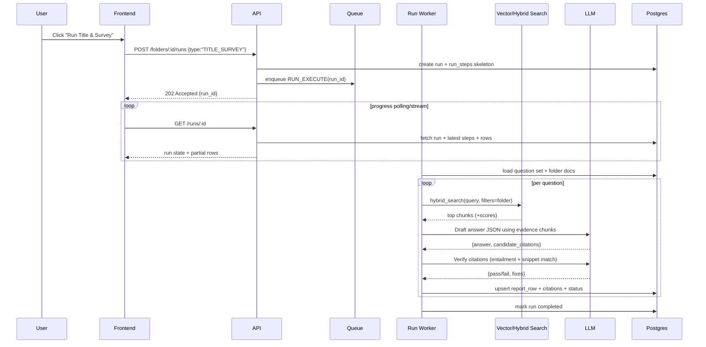
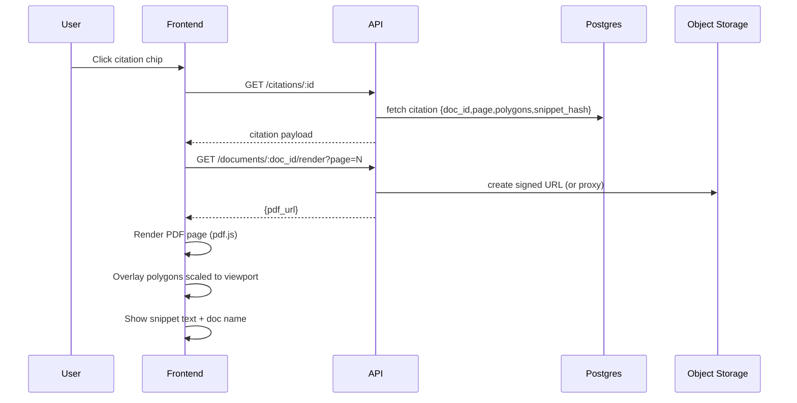

## What Orbital publicly says Copilot does and the underlying need it solves

### The headline promise

Orbital positions Copilot as an “AI real estate lawyer/attorney” that helps law firms speed up property due diligence, with transparency and auditability rather than vibes. ([Orbital Witness Tech Blog][1])

### The “4 agents” approach they describe

Orbital’s tech blog describes Copilot as an **agentic system** with four specialist agents:

* **Orchestration agent**: receives user request, makes a plan, decides which agents to run and in what order
* **Summary agent**: “document analysis end-to-end”
* **Retrieval agent**: searches uploaded files for specific passages answering nuanced questions
* **Research agent**: provides insights into industry standards and compares scenarios to established practices ([Orbital Witness Tech Blog][1])

**Underlying need:** lawyers don’t just want a single chat response. They need multi-step work: plan → gather evidence across many docs → reconcile → output a deliverable they can defend. ([Orbital Witness Tech Blog][1])

### Capabilities they talk about (mapped to needs)

Below is the simplest “capability → need → PoC interpretation” mapping I’d use.

* **Bulk upload + extract insights + accelerate review (claims like “up to 70%”)**
  Need: the doc pack is huge and time is scarce, but errors are expensive.
  PoC: ingestion + indexing + “Title & Survey Quick Start” report table with progress and partial results. ([orbital.tech][2])

* **Answer complex questions with “full transparency” and show how conclusions are reached**
  Need: trust boundary. Lawyers must verify quickly, especially in regulated work.
  PoC: every material answer must have clause-level citations + evidence snippets; otherwise “not found in provided docs”. ([orbital.tech][2])

* **Draft structured deliverables (issue lists, objection letters, memos), customised to firm tone**
  Need: “lovable = artefacts”. Output must drop into Word workflows.
  PoC: generate a structured diligence table + export .docx using a template and the table as data. ([orbital.tech][2])

* **“Restore” documents where OCR fails (blurry scans, handwriting, complex layouts)**
  Need: real estate packs are messy; clean text and layout matter for clause-level work.
  PoC: layout-aware parsing (OCR/provider) + store page text + geometry so citations can highlight. ([orbital.tech][2])

* **Property visualisation (metes & bounds / PLSS) + overlays + exports**
  Need: bridge “words on paper” to physical land risk, earlier in the deal, in one place.
  PoC (stretch): parse legal description segments → approximate polygon on map with citations + big “approximate” disclaimer. ([orbital.tech][3])

* **Not a rebranded ChatGPT: deal with long, interdependent docs and “breadcrumbs” across a pack**
  Need: RAG has to be workflow-aware (definitions, cross-refs, exceptions, exhibits).
  PoC: hybrid retrieval + reranking + multi-hop retrieval + definition resolver tool. ([Orbital Witness Tech Blog][4])

And yes, they’re very explicit that model improvements (especially vision) unlock analysing complex drawings and visual docs directly. ([Orbital Witness Tech Blog][1])

---

## Architecture principles for the PoC

* **Evidence-first**: no evidence, no claim. “Not found” is a valid output.
* **Artefacts-first UX**: report table is the centre of gravity; chat is a tool to update it.
* **KISS / YAGNI**: single-tenant PoC, minimal infra surface area, but production-minded plumbing (jobs, retries, idempotency, traces).
* **Deterministic-ish orchestration**: explicit step machine, structured outputs (JSON schemas), verification pass before marking a row “ready”.
* **Make failure obvious**: per-row status, “missing docs” checklist, citation mismatch errors are surfaced not hidden.

---

# 1) Core user journeys

## Journey A: Upload docs → Index → “Title & Survey” Quick Start → report table

### UX steps

1. User creates a folder/matter.
2. User drags a doc pack into the folder (PDFs mainly).
3. UI shows per-document processing status (queued → parsing → indexed).
4. When folder is “ready”, user clicks **Quick Start: Title & Survey**.
5. UI shows run progress:

   * steps: “Selecting questions” → “Searching documents” → “Drafting answers” → “Verifying citations”
   * table populates incrementally row-by-row
6. User opens any row, sees:

   * answer
   * evidence snippets used (1–3)
   * citation chips (doc, page)
   * confidence/status + review toggle + notes
7. User clicks a citation chip and is taken to the doc viewer at the right page with highlight overlay.

### System actions + state transitions

* Upload triggers `DocumentCreated` events.
* Ingestion worker:

  * stores raw file to object storage
  * extracts text + layout per page
  * chunks with metadata
  * embeds + indexes
* Folder state: `empty → ingesting → indexed → ready`
* Quick Start run:

  * run state: `created → running → partial → completed`
  * report row states: `generated → needs_review → reviewed`

### Output: baseline report schema

Minimum report table columns:

* `question`
* `answer`
* `citations[]` (clickable)
* `confidence/status`
* `reviewed`
* `notes`

---

## Journey B: Click citation → doc viewer jump + highlight

### UX steps

1. User clicks a citation chip (e.g., “Commitment.pdf p. 12”).
2. Viewer opens that PDF page.
3. Highlight overlay is drawn over the exact clause area.
4. Sidebar shows the evidence snippet text + snippet hash (tiny trust signal).
5. User can “copy snippet”, “open surrounding context”, “flag citation wrong”.

### System actions

* UI requests:

  * the PDF render URL (or a signed URL)
  * highlight geometry for that citation (page + polygons)
  * canonical snippet text (for display + mismatch detection)
* Viewer renders page with pdf.js and scales polygons to viewport.

---

## Journey C: Freeform chat with citations and optional report updates

### UX steps

1. User opens chat inside a folder.
2. User asks: “What are the survey exceptions that materially impact the property?”
3. Assistant responds with:

   * concise answer
   * 2–5 citations (chips)
   * “Docs searched” list (doc names)
   * CTA: “Add to report” / “Update row 7”
4. If user confirms or the assistant has permission, it updates report rows (new rows or edits existing).

### System actions

* Chat endpoint streams tokens.
* Tool calls:

  * `search_chunks` (hybrid)
  * `fetch_snippet` (authoritative snippet + geometry)
  * `update_report_rows` (DB write)
  * `create_artefact` (optional docx draft)

---

## Journey D: Export .docx from report table

### UX steps

1. User clicks “Export Word draft”.
2. Chooses a template: “Title & Survey memo (basic)” (PoC has 1 template).
3. Export runs in background, user sees “Generating…”
4. Artefact appears with timestamp + download link.

### System actions

* Export service pulls:

  * report rows + citations
  * optionally embeds evidence excerpts in an appendix
* Generates docx and stores it, records artefact metadata.

---

## Journey E (stretch): Property visualiser from metes-and-bounds / PLSS

### UX steps

1. User opens “Property visualiser”.
2. Picks a source doc (deed / exhibit) and highlights the legal description, or asks “find the legal description”.
3. System extracts segments (bearing/distance) with citations.
4. Viewer shows an approximate polygon on a map + segment list.
5. User clicks a segment → citation jump to source text.

### System actions

* Parsing pipeline:

  * extract candidate spans (RAG)
  * parse bearings/distances
  * build polyline/polygon
  * store geometry + citations
* Big disclaimer everywhere: “approximate, not a survey”.

Orbital’s own positioning of this feature is exactly this “words-to-land” consolidation and early orientation value. ([orbital.tech][3])

---

## Failure journeys you must explicitly design

### Missing docs

* Symptom: required question cannot be answered (“survey not provided”).
* Behaviour:

  * answer = “Not found in provided documents.”
  * status = `missing_input`
  * suggestion = “Upload: Title Commitment, Survey, ALTA endorsement schedule…”

### OCR / extraction failure

* Symptom: document pages produce low-confidence text, or no text.
* Behaviour:

  * mark document `needs_ocr_review`
  * show “text extraction quality” meter per doc
  * allow re-run OCR with stronger mode (expensive)

### Retrieval miss

* Symptom: answer exists but retriever can’t find it.
* Behaviour:

  * fallback strategies: query rewrite, section-targeted search, definition resolver, page-level search
  * if still none: “not found” + log `retrieval_miss`

### Citation mismatch

* Symptom: cited snippet does not entail the claim, or geometry points to wrong place.
* Behaviour:

  * row status = `citation_failed`
  * UI shows “citation check failed”
  * block export unless user overrides (PoC: allow override with checkbox)

---

# 2) System architecture

## High-level component map

### Frontend

* Next.js App Router
* Tailwind for UI
* Doc viewer: PDF.js + highlight overlay layer
* Report table: TanStack Table + inline row drawer
* State:

  * server state: TanStack Query
  * local UI state: Zustand (optional, keep minimal)
  * streaming chat: Vercel AI SDK hooks

### API (single service for PoC)

* Next.js route handlers for:

  * folder CRUD
  * uploads (pre-signed URLs)
  * runs
  * chat streaming
  * citation geometry fetch
  * export triggers

### Worker(s)

* Ingestion worker (queue consumer)
* Run worker (Quick Start pipeline)
* Export worker (docx generation)
* Optional: property visualiser worker

### Storage & search

* Postgres (Supabase) for:

  * metadata
  * report rows
  * run steps
  * citations
  * evals
* Object storage (S3/Supabase Storage) for raw PDFs + artefacts
* Vector store:

  * pgvector in Postgres for PoC (simplest)
  * hybrid search: pgvector + Postgres full-text tsvector
  * optional reranker (LLM or small cross-encoder service)

### Observability

* Structured logs + trace IDs
* Store every LLM call with:

  * model, prompt version, tool calls, retrieved chunk IDs, cost, latency
* Minimal dashboard:

  * run failures by taxonomy
  * avg ingestion time per page
  * citation failure rate

Orbital’s own engineering content strongly signals a real infra posture (Kubernetes/Azure/GitOps/Python/Next.js/Postgres), but for this PoC we’ll keep deployment lighter while keeping the same conceptual separation (web, worker, data). ([Orbital Witness Tech Blog][5])

---

## Mermaid diagram A: Component diagram

```mermaid
flowchart LR
  subgraph FE[Frontend (Next.js + Tailwind)]
    UI[Folder UI / Report UI / Chat UI]
    PDFV[PDF Viewer (pdf.js + highlight overlay)]
  end

  subgraph API[API (Next.js Route Handlers)]
    Folders[Folders API]
    Uploads[Upload API]
    Runs[Runs API]
    Chat[Chat Streaming API]
    CitAPI[Citations API]
    ExportAPI[Export API]
  end

  subgraph Workers[Workers]
    Ingest[Ingestion Worker]
    Runner[Quick Start Run Worker]
    Exporter[Docx Export Worker]
    Vis[Property Visualiser Worker]
  end

  subgraph Data[Data Stores]
    PG[(Postgres + pgvector)]
    OBJ[(Object Storage)]
  end

  subgraph LLM[LLM Providers]
    OAI[OpenAI GPT-5.2 / Thinking]
    CLAUDE[Claude Opus 4.5]
  end

  UI --> API
  PDFV --> CitAPI

  Uploads --> OBJ
  Uploads --> PG

  Ingest --> OBJ
  Ingest --> PG
  Runner --> PG
  Exporter --> PG
  Exporter --> OBJ
  Vis --> PG

  Chat --> LLM
  Runner --> LLM
  Ingest --> LLM

  PG <--> API
  OBJ <--> API
```

---

## Mermaid diagram B: Sequence for “Title & Survey Quick Start”



---

## Mermaid diagram C: Sequence for “Citation click to highlight”



---

# 3) State model and data model

## State machines

### Folder state

* `empty` (no docs)
* `ingesting` (at least one doc queued/processing)
* `indexed` (all docs indexed)
* `ready` (indexed + health checks passed)

Transition triggers:

* upload doc → `ingesting`
* all docs `indexed=true` → `indexed`
* validation pass ok (vector index counts match, page counts match) → `ready`

### Run state

* `created`
* `running`
* `partial` (some rows written)
* `completed`
* `failed`
* `cancelled` (optional)

### Report row state

* `generated` (model produced answer)
* `citation_failed` (verification failed)
* `needs_review` (passes verification but unreviewed)
* `reviewed` (user confirmed)

---

## Concrete schema (Postgres)

### folders

* `id uuid pk`
* `name text`
* `created_at timestamptz`
* `state text` (`empty/ingesting/indexed/ready`)
* `latest_index_version text` (e.g. `idx_2026_01_28_01`)

### documents

* `id uuid pk`
* `folder_id uuid fk`
* `filename text`
* `mime text`
* `bytes int`
* `sha256 text unique` (idempotency)
* `storage_key text`
* `page_count int`
* `parse_status text` (`queued/parsing/parsed/failed`)
* `ocr_status text` (`not_needed/running/done/failed`)
* `extraction_quality float` (0..1)
* `created_at timestamptz`

### document_pages (optional but helps citations)

* `id uuid pk`
* `document_id uuid fk`
* `page_number int`
* `text text` (canonical page text)
* `tokens int`
* `layout_json jsonb` (lines/words + polygons)
* `image_key text null` (optional rendered image tile)
* `created_at timestamptz`

### chunks

* `id uuid pk`
* `document_id uuid fk`
* `page_start int`
* `page_end int`
* `chunk_index int`
* `text text`
* `tsv tsvector` (for full-text search)
* `metadata jsonb` (doc_type, section_heading, parties, dates)
* `snippet_hash text` (stable hash of text)
* `created_at timestamptz`

### embeddings

If using pgvector inline, store on `chunks`:

* `embedding vector(1536/3072/…)`

Or separate:

* `chunk_id uuid pk/fk`
* `embedding vector(...)`

### chats

* `id uuid pk`
* `folder_id uuid fk`
* `title text`
* `created_at timestamptz`

### messages

* `id uuid pk`
* `chat_id uuid fk`
* `role text` (`user/assistant/tool/system`)
* `content text`
* `tool_name text null`
* `tool_payload jsonb null`
* `created_at timestamptz`

### runs

* `id uuid pk`
* `folder_id uuid fk`
* `type text` (`TITLE_SURVEY`)
* `state text`
* `created_at timestamptz`
* `started_at timestamptz null`
* `completed_at timestamptz null`
* `error jsonb null`
* `agent_bundle_version text` (more below)

### run_steps

* `id uuid pk`
* `run_id uuid fk`
* `step_type text` (`plan/retrieve/draft/verify/write`)
* `state text`
* `started_at timestamptz`
* `completed_at timestamptz`
* `metrics jsonb` (latency, tokens, cost)
* `error jsonb null`

### report_rows

* `id uuid pk`
* `folder_id uuid fk`
* `run_id uuid fk null` (row source)
* `question_id text`
* `question text`
* `answer text`
* `status text` (`needs_review/reviewed/citation_failed/missing_input`)
* `confidence float` (0..1)
* `reviewed boolean`
* `notes text null`
* `updated_at timestamptz`

### citations

* `id uuid pk`
* `report_row_id uuid fk`
* `document_id uuid fk`
* `page_number int`
* `polygons jsonb` (list of bounding boxes or polygons)
* `text_offsets jsonb null` (fallback if no polygons)
* `snippet text` (short evidence snippet)
* `snippet_hash text`
* `created_at timestamptz`

### artefacts

* `id uuid pk`
* `folder_id uuid fk`
* `type text` (`docx_report`)
* `storage_key text`
* `created_at timestamptz`
* `source_run_id uuid null`
* `metadata jsonb` (template version etc)

### eval_runs

* `id uuid pk`
* `name text`
* `created_at timestamptz`
* `config jsonb` (models, prompts)
* `results jsonb` (scores + breakdown)

---

## Versioning for auditability (non-negotiable)

Create an `agent_bundle_version` string that’s stamped everywhere:

* `prompts/orchestrator@v3`
* `prompts/drafter@v7`
* `retrieval_pipeline@v4`
* `chunking@v2`
* `embedding_model@text-emb-vX`
* `llm_router@v1`

Store this on:

* `runs.agent_bundle_version`
* `messages.tool_payload` (for chat traces)
* `report_rows` (optional `provenance jsonb`)

This is the minimum you need so you can answer: “what produced this answer and why”.

---

# 4) Data flow and RAG pipeline

## Ingestion pipeline (PDF-first)

### Goals

* Produce **searchable text** and **highlightable geometry**.
* Be robust to messy scans.
* Keep it simple and idempotent.

### Strategy

1. **Upload**

   * store raw PDF in object storage
   * compute `sha256` and dedupe (if same file uploaded twice, reuse processing)

2. **Parse + layout extraction**
   Choose one of:

   * **Option A (simplest for citations): layout OCR for all PDFs**
     Use a layout-aware OCR provider (Azure Document Intelligence / AWS Textract / similar) so every page yields:

     * lines/words with polygons
     * reading order
     * confidence
   * **Option B (cheaper): detect text-layer PDFs, only OCR scans**

     * if PDF has text layer, extract text + coords via pdf.js
     * if scanned, run OCR provider
       This is more engineering because you now support two coordinate systems.

**PoC recommendation:** Option A for consistency. You’re building “trust UX” not optimising OCR cost.

Orbital explicitly calls out that layout structure matters when feeding text into LLMs (headings, clause structure etc). ([microsoft.com][6])

3. **Chunking for legal docs**

* Chunk unit should align to “citeable” structure:

  * prefer clause/section-based splitting if headings detected
  * fallback: sliding window with overlap
* Suggested chunk targets:

  * 350–800 tokens per chunk
  * 10–15% overlap
* Chunk metadata you want early:

  * `doc_type` (commitment, survey, deed, easement, lease…)
  * `section_heading`
  * `page_start/page_end`
  * `detected_parties`, `effective_date` (best effort)

4. **Indexing**

* Store chunks in Postgres with:

  * full text `tsvector` for lexical search
  * `embedding` vector for semantic search
* Build a “document dictionary” table:

  * doc name → doc_type guess
  * page count
  * extraction quality

---

## Retrieval pipeline (hybrid + rerank + multi-hop)

### Baseline retrieval

* Hybrid query:

  * semantic: pgvector cosine similarity
  * lexical: Postgres FTS BM25-ish ranking
* Filter:

  * folder_id
  * doc_type (when known)
  * page ranges (optional)

### Reranking

* Lightweight rerank options:

  * LLM rerank (top 30 → pick top 8 with reasons)
  * or a small cross-encoder reranker service (more work)

**PoC recommendation:** LLM rerank for top-N only. Keep it cheap by using a smaller/faster model.

### Multi-hop retrieval patterns you actually need

* **Definition resolver**: “Defined Terms” lookup.
* **Exception item follow**: commitment exceptions referenced by schedule/endorsement.
* **Exhibit chase**: “See Exhibit B” patterns.

Implement as tools, not as “hope the model does it”:

* `find_defined_term(term, doc_filter?)`
* `follow_reference(ref_string)` (e.g., Exhibit A, Schedule B-II item 12)

---

## Answer synthesis (evidence-first, structured outputs)

### Required behaviour

* If evidence is empty or weak → “Not found in provided documents.”
* Answers are **structured JSON first**, then rendered to UI.
* Citations point to stored chunk/page geometry, not just “doc name”.

### JSON schema for a report row (example)

```json
{
  "question_id": "TS-03",
  "question": "List easements that materially affect the property and whether they appear on the survey.",
  "answer": "The Commitment lists a 20' utility easement along the north boundary (Schedule B-II, Item 12). The survey depicts an overhead utility line within that strip, suggesting it impacts the site. No other material easements were found in the provided documents.",
  "citations": [
    {
      "document_id": "doc_123",
      "page_number": 12,
      "snippet": "Schedule B-II, Item 12: ... 20 foot utility easement along the north line ...",
      "snippet_hash": "sha256:abc..."
    },
    {
      "document_id": "doc_456",
      "page_number": 2,
      "snippet": "Survey shows overhead utility line ... north boundary ...",
      "snippet_hash": "sha256:def..."
    }
  ],
  "confidence": 0.78,
  "status": "needs_review",
  "docs_searched": ["Commitment.pdf", "ALTA_Survey.pdf"]
}
```

---

## Citation correctness (how you stop fake citations)

This is where most PoCs die.

### Technique: “citation locking”

1. Drafting agent proposes citations by chunk IDs (not by free text).
2. System resolves chunk IDs → authoritative snippet text + geometry.
3. Verification agent checks:

   * the snippet actually contains the quoted claim (string/regex checks)
   * entailment: does snippet support the claim?
   * page/geometry is plausible (bbox exists, page exists)
4. If fail:

   * either rewrite answer with correct citations
   * or downgrade row to `citation_failed` / `missing_input`

This is basically “trust UX enforcement” as a pipeline invariant.

---

# 5) Multi-agent design (4 agents)

Orbital publicly describes four agents as Orchestration, Summary, Retrieval, Research. ([Orbital Witness Tech Blog][1])
For the PoC, I’d keep **four**, but shift the 4th into **Verification** because citations are existential. And I’d implement “research/standards” as a tool-backed capability (static KB) inside the drafter.

## Orchestrator Agent (Planner + controller)

**Responsibilities**

* Turn user intent into a plan.
* Decide: Quick Start pipeline vs freeform chat.
* Choose which tools/agents to call and enforce constraints.
* Owns final answer arbitration (but only after verifier passes).

**Inputs**

* user request
* folder metadata (doc types, extraction quality, what’s indexed)
* optional: report table context

**Outputs**

* explicit plan (run steps)
* tool calls
* final user-facing response envelope

**Tool permissions**

* can call: `get_folder_state`, `list_documents`, `start_run`, `search_chunks`, `fetch_snippet`, `update_report_rows`
* cannot: directly draft final legal conclusions without passing verification

**Failure modes**

* infinite loops: cap tool calls and steps
* overreach: tries to answer without evidence, gets blocked by guardrails

**Guardrails**

* “cite-or-not-found”
* “no long reasoning”
* always return “docs searched” list

---

## Retrieval Agent (Evidence gatherer)

**Responsibilities**

* Generate retrieval queries (including rewrites).
* Run hybrid search.
* Do multi-hop retrieval (defined terms, exhibits, schedule references).
* Return ranked evidence bundles.

**Inputs**

* question
* constraints (doc types, jurisdiction, preferred docs)

**Outputs**

* `evidence_bundle`:

  * chunk IDs
  * rationale
  * coverage score
  * doc list searched

**Tools**

* `hybrid_search`
* `find_defined_term`
* `follow_reference`
* `fetch_snippet` (read-only)

**Failure modes**

* pulls irrelevant chunks (mitigate via rerank + filters)
* misses key doc type (mitigate via doc-type classifier and fallback broad search)

---

## Drafting Agent (Report writer)

**Responsibilities**

* Produce structured answers + proposed citations from evidence bundles.
* Keep answers short, lawyer-friendly, and template-like.
* Mark uncertainty explicitly.

**Inputs**

* question
* evidence bundle
* optional: standards KB snippets (ALTA/NSPS basics)

**Outputs**

* JSON row proposal: `answer + candidate citations + confidence + docs_searched`

**Tools**

* none ideally (pure function over evidence)
* optional read-only: `get_standards_snippet(topic)` from static KB

**Failure modes**

* hallucination: blocked because it can only write from evidence
* over-verbosity: enforce max tokens and a style rubric

---

## Verification Agent (Citation + consistency QA)

**Responsibilities**

* Verify that each citation supports the answer.
* Check contradictions across evidence snippets.
* Enforce “not found” if evidence doesn’t support the claim.

**Inputs**

* drafted row JSON
* authoritative snippets fetched by system

**Outputs**

* pass/fail with reasons
* corrected citations (if possible)
* revised answer (if needed)
* status:

  * `needs_review` if pass
  * `citation_failed` if fail
  * `missing_input` if no evidence

**Tools**

* `fetch_snippet` (authoritative)
* `compare_snippets` (entailment/contradiction prompt)
* no write access

**Failure modes**

* too strict, rejects good answers (tune rubric)
* too lax, accepts weak entailment (use conservative thresholds)

---

## Orchestration pattern (safe, deterministic-ish)

Use an explicit state machine, not a “free-running agent loop”.

* Step 1: Orchestrator creates plan: `{questions[], retrieval_settings, drafting_settings, verify_settings}`
* Step 2: For each question:

  * Retrieval Agent gathers evidence
  * Drafting Agent writes row JSON
  * Verification Agent validates
  * System writes row with status
* Step 3: Orchestrator returns run summary and next actions

This is the “human-in-the-loop, evidence-first” pattern that matches Orbital’s own emphasis on transparency and the idea that customers should treat outputs like junior lawyer work that needs checking. ([microsoft.com][6])

---

# 6) API design (REST + streaming)

I’ll describe REST endpoints that map cleanly to Next.js route handlers. You can swap to tRPC if you prefer, but REST is easiest to demo and debug.

## POST /folders

**Request**

```json
{ "name": "Deal - 18 West 18th Street" }
```

**Response**

```json
{ "id": "folder_abc", "state": "empty", "created_at": "2026-01-28T12:00:00Z" }
```

---

## POST /folders/:id/documents (upload init)

**Request**

```json
{
  "filename": "TitleCommitment.pdf",
  "mime": "application/pdf",
  "bytes": 4829931,
  "sha256": "..."
}
```

**Response**

```json
{
  "document_id": "doc_123",
  "upload_url": "https://signed-url...",
  "storage_key": "folders/folder_abc/docs/doc_123.pdf"
}
```

Client uploads directly to storage, then calls:

## POST /documents/:id/complete

**Request**

```json
{ "storage_key": "folders/folder_abc/docs/doc_123.pdf" }
```

**Response**

```json
{ "document_id": "doc_123", "parse_status": "queued" }
```

---

## POST /folders/:id/runs (quick start)

**Request**

```json
{
  "type": "TITLE_SURVEY",
  "settings": {
    "question_set_version": "ts_qset_v1",
    "max_questions": 25
  }
}
```

**Response**

```json
{ "run_id": "run_789", "state": "created" }
```

---

## GET /runs/:id

**Response**

```json
{
  "run_id": "run_789",
  "state": "partial",
  "progress": { "done": 7, "total": 25 },
  "latest_rows": [
    {
      "report_row_id": "row_1",
      "question_id": "TS-01",
      "status": "needs_review",
      "confidence": 0.82
    }
  ],
  "errors": []
}
```

---

## GET /folders/:id/report

**Response**

```json
{
  "folder_id": "folder_abc",
  "rows": [
    {
      "id": "row_1",
      "question": "Identify the insured property and legal description.",
      "answer": "...",
      "status": "needs_review",
      "reviewed": false,
      "citations": [
        { "citation_id": "cit_55", "doc_id": "doc_123", "page": 1 }
      ]
    }
  ]
}
```

---

## POST /chat/stream (SSE or fetch streaming)

Use Vercel AI SDK streaming format.

**Request**

```json
{
  "folder_id": "folder_abc",
  "chat_id": "chat_1",
  "message": "Summarise the title exceptions that affect development.",
  "options": { "update_report": true }
}
```

**Streaming behaviour**

* assistant streams text
* tool call events emitted
* final message includes:

  * `citations[]`
  * `docs_searched[]`
  * optional `report_row_updates[]`

---

## GET /citations/:id

**Response**

```json
{
  "citation_id": "cit_55",
  "document_id": "doc_123",
  "page_number": 12,
  "polygons": [
    [[0.12,0.34],[0.78,0.34],[0.78,0.41],[0.12,0.41]]
  ],
  "snippet": "Schedule B-II, Item 12: ...",
  "snippet_hash": "sha256:abc..."
}
```

---

## GET /documents/:id/render?page=12

**Response**

```json
{
  "document_id": "doc_123",
  "page_number": 12,
  "pdf_url": "https://signed-url...",
  "page_width": 612,
  "page_height": 792
}
```

---

## POST /export/docx

**Request**

```json
{
  "folder_id": "folder_abc",
  "template_id": "title_survey_basic_v1",
  "include_appendix": true
}
```

**Response**

```json
{ "artefact_id": "art_9", "state": "queued" }
```

---

# 7) Framework comparison + recommended stack

## Vercel AI SDK

**Strengths (for this PoC)**

* Streaming chat + tool calls + UI hooks out of the box.
* Dead simple to build an “LLM product” UX quickly (chat + side panels).
* Fits Next.js deployment patterns nicely.

**Weaknesses / risks**

* You still need to engineer the *workflow* and *citation correctness* yourself.
* If you go too “agentic”, you can create spaghetti tool calls unless you enforce step machines.

**PoC pick:** Yes, use it. It’s the fastest path to a credible experience.

---

## LangChain vs LangGraph

**LangChain**

* Strength: lots of RAG primitives and integrations.
* Weakness: can become untyped and magical, harder to audit.

**LangGraph**

* Strength: explicit graphs/state machines, better for deterministic-ish orchestration.
* Weakness: more conceptual overhead, and you can overbuild for a PoC.

**PoC pick:** if you’re disciplined, you don’t need either. Implement the 4-agent pipeline as a typed step machine (it’s ~300–600 lines).
**If you want a framework:** LangGraph is the better fit because you need explicit states and retries.

---

## LlamaIndex

**Strengths**

* Strong document indexing and retrieval abstractions.
* Helpful for quick prototypes.

**Weaknesses**

* You’ll still customise heavily for clause-level citations + geometry + verification.
* Risk of fighting abstractions when you need exact provenance.

**PoC pick:** optional. I’d skip and build minimal RAG yourself to stay in control.

---

## OpenAI Responses / Agents-style APIs

If you’re using OpenAI, the model+tooling story is strong, and GPT‑5.2 supports agentic workflows and long context (docs say 400k context window for GPT‑5.2). ([OpenAI Platform][7])
But you still want your own orchestration and audit trail because the product requirement is trust and traceability.

---

## Backend acceleration: Convex vs Supabase/Postgres vs FastAPI

### Convex

* Strength: real-time state, easy reactive UI, fast iteration.
* Weakness: vector + hybrid search story is not as straightforward as Postgres+pgvector; export jobs and heavy ingestion can get awkward.

### Supabase/Postgres

* Strength: boring, works, easy to host, pgvector + SQL joins are perfect for citations.
* Weakness: you must implement queues/workers yourself.

### FastAPI (custom)

* Strength: Python ecosystem for PDF/OCR is best-in-class.
* Weakness: two-stack complexity if your FE is Next.js.

**PoC pick (fastest credible):**

* **Next.js + Vercel AI SDK + Supabase Postgres (pgvector) + object storage + a simple worker queue.**
* Keep worker in Node/TS if you can, but don’t be dogmatic. If OCR/layout parsing is easier in Python, run a tiny Python worker.

---

## LLM choice for legal diligence (GPT‑5.2 vs Claude Opus 4.5)

### GPT‑5.2 (and GPT‑5.2 Thinking)

* OpenAI describes GPT‑5.2 as a flagship model for coding and agentic tasks with long context, plus “Thinking” variants for deeper reasoning. ([OpenAI Platform][7])
* OpenAI also explicitly positions GPT‑5.2 Thinking as its strongest vision model yet. That matters for scanned PDFs, plats, plans, stamps, messy layouts. ([OpenAI][8])

### Claude Opus 4.5

* Anthropic positions Opus 4.5 as their newest model, strong for agents and deep work. ([Anthropic][9])
* Opus pricing and knobs (like “effort”) may help tune cost/quality tradeoffs. ([Claude API Docs][10])

**PoC recommendation**

* Use a **router**:

  * **Drafting + retrieval rerank**: cheaper/faster model (GPT‑5.2 Instant or similar tier)
  * **Verification**: higher-accuracy model (GPT‑5.2 Thinking or Opus 4.5 with higher effort)
  * **Vision fallback** (bad OCR pages): GPT‑5.2 Thinking
* And keep it configurable per run so you can demo “swap models without rewriting product”, which matches Orbital’s own “swap members in and out as models evolve” philosophy. ([Orbital Witness Tech Blog][1])

---

# 8) Evals and quality system (mandatory)

## What you measure

### 1) Retrieval quality

* **Recall@K** on a golden set (did we retrieve the right clause/chunk?)
* **Doc coverage**: did we search the right doc types?

### 2) Citation validity

* **Snippet match**: cited snippet contains the key phrase/term (code-based)
* **Entailment check**: LLM judge rubric: “Does snippet support claim?” (pass/fail)

### 3) Answer correctness

* Rubric-based judge:

  * correct
  * partially correct
  * incorrect
  * correctly “not found”
* Penalise confident wrong answers more than “not found”.

### 4) Format correctness

* JSON schema validation (hard gate)

### 5) Regression gates

* CI job runs eval pack on every change to:

  * prompts
  * retrieval settings
  * chunking
  * model routing

---

## Golden set creation workflow (practical)

1. Collect 5–10 representative doc packs (public samples are fine for PoC).
2. For each pack, label:

   * 20–40 title/survey questions
   * expected answer bullets
   * the exact clause location (doc/page)
3. Store labels as JSON:

```json
{
  "folder_fixture": "pack_03",
  "question_id": "TS-07",
  "expected": {
    "answer_contains": ["access", "easement"],
    "citations": [{ "doc": "Commitment.pdf", "page": 14 }]
  }
}
```

---

## Automated evaluators

* Code evaluators:

  * schema validation
  * citation page exists
  * snippet hash matches stored text
* LLM judge evaluators:

  * entailment (citation validity)
  * correctness rubric
* Calibrate LLM judge with small human-labelled set (20–50 items).

---

## Point-of-first-failure taxonomy

Log every failure to one bucket:

* `OCR_FAIL`
* `LAYOUT_FAIL`
* `CHUNKING_FAIL`
* `RETRIEVAL_MISS`
* `RERANK_BAD`
* `DRAFT_HALLUCINATION`
* `CITATION_MISMATCH`
* `VERIFICATION_FALSE_PASS`
* `EXPORT_FAIL`

And show a simple dashboard of counts and rates.

---

# 9) Implementation plan (MVP → wow)

## Milestone 1: Folder + documents + viewer (2–4 days)

* Folder list/create
* Upload → storage
* Basic doc list
* PDF viewer (pdf.js) without highlights

## Milestone 2: Ingestion + indexing (3–6 days)

* Worker queue
* OCR/layout extraction pipeline
* Chunk + embed + store in pgvector
* Folder state transitions and progress UI

## Milestone 3: Quick Start report table with citations (4–8 days)

* Fixed question set v1 (25 Qs)
* Run worker generates rows incrementally
* Store citations with polygons/snippet hashes
* Report table UI with row drawer

## Milestone 4: Citation click-to-highlight (2–4 days)

* Citations API returns geometry
* Viewer overlay highlights polygons
* “flag citation wrong” button

## Milestone 5: Chat with tools + update report (3–6 days)

* Vercel AI SDK chat streaming
* Tooling: `search_chunks`, `fetch_snippet`, `update_report_rows`
* “Add to report” action

## Milestone 6: Export .docx (2–4 days)

* Basic doc template
* Export worker generates docx
* Artefact list + download

## Milestone 7 (stretch): Property visualiser (5–10 days)

* Extract legal description span with citations
* Parse bearings/distances (best effort)
* Render on map (Leaflet/Mapbox)
* Segment click → citation jump

Orbital’s own Property Visualizer narrative shows exactly why this is a wow feature for title/survey workflows. ([orbital.tech][3])

---

## Pseudocode skeletons

### Ingestion worker

```ts
async function ingestDocument(documentId: string) {
  const doc = await db.documents.get(documentId);
  if (doc.parse_status === "parsed") return; // idempotent

  await db.documents.update(documentId, { parse_status: "parsing" });

  const pdf = await storage.get(doc.storage_key);

  // 1) Layout extraction (OCR provider)
  const pages = await ocrProvider.analysePdfLayout(pdf);

  // 2) Persist page text + geometry
  for (const page of pages) {
    await db.document_pages.upsert({
      document_id: documentId,
      page_number: page.number,
      text: page.text,
      layout_json: page.layout,
      tokens: estimateTokens(page.text),
    });
  }

  // 3) Chunking
  const chunks = chunkLegal(pages);
  for (const chunk of chunks) {
    const emb = await embed(chunk.text);
    await db.chunks.insert({ ...chunk, embedding: emb, tsv: toTSV(chunk.text) });
  }

  await db.documents.update(documentId, { parse_status: "parsed" });
}
```

### Retrieval tool

```ts
async function search_chunks(folderId: string, query: string, filters?: any) {
  const q1 = await pgvectorSearch(folderId, query, filters);
  const q2 = await fullTextSearch(folderId, query, filters);
  const merged = hybridMerge(q1, q2);
  const reranked = await llmRerank(query, merged.slice(0, 30));
  return reranked.slice(0, 8);
}
```

### 4-agent orchestrator (run worker)

```ts
async function runTitleSurvey(runId: string) {
  const plan = await orchestrator.plan(runId);

  for (const q of plan.questions) {
    const evidence = await retriever.gather({ runId, question: q });
    const draft = await drafter.draft({ question: q, evidence });
    const verdict = await verifier.verify(draft);

    await db.report_rows.upsert(toRow(verdict));
    await db.citations.upsert(toCitations(verdict));
  }

  await db.runs.update(runId, { state: "completed" });
}
```

### Streaming chat endpoint (Next.js + AI SDK)

```ts
export async function POST(req: Request) {
  const { folder_id, message } = await req.json();

  return streamText({
    model: router.pick("chat"),
    messages: buildMessages(folder_id, message),
    tools: {
      search_chunks,
      fetch_snippet,
      update_report_rows,
    },
    onFinish: async (final) => logTrace(final),
  });
}
```

### Docx export service

```ts
async function exportDocx(folderId: string, templateId: string) {
  const rows = await db.report_rows.list(folderId);
  const docxBuffer = await renderDocxTemplate(templateId, rows);
  const key = await storage.put(docxBuffer);
  await db.artefacts.insert({ folder_id: folderId, type: "docx_report", storage_key: key });
}
```

### Eval runner CLI

```py
def run_eval_pack(pack_id, model_config):
    fixtures = load_pack(pack_id)
    results = []
    for item in fixtures:
        out = run_question(item.folder, item.question, model_config)
        results.append(score(out, item.expected))
    write_report(results)
    gate(results)
```

---

# 10) Explicit trade-offs and assumptions

## Assumptions

* Input docs are mostly PDFs, mixed quality, some scanned.
* Clause-level highlighting is feasible via layout extraction geometry.
* PoC can use managed OCR and LLM APIs (no on-prem requirements).
* Single shared PoC environment, no auth/RBAC, no tenancy.

## Trade-offs (deliberate)

* **Use OCR/layout for all PDFs** to simplify highlight geometry and reduce edge cases.
* **Keep vector store in Postgres (pgvector)** to avoid extra infra and make joins easy for citations.
* **Use a strict verification step** even if it slows runs. Trust is the product.
* **No deep customisation / firm templates** beyond one docx template.
* **Research agent**: implemented as a static KB tool (YAGNI) rather than a full web-search agent, to avoid non-grounded external citations.

## Not building (by design)

* Workspaces, SSO, RBAC, multi-tenant admin, billing
* Integrations (iManage, NetDocs, SharePoint)
* Full-blown monitoring UI (but we log traces + run basic dashboards)

---

# Recommended PoC architecture (decisive)

## Stack

* **Frontend:** Next.js (App Router) + Tailwind + TanStack Table + pdf.js viewer + Vercel AI SDK for streaming chat/tool calls
* **Backend:** Next.js route handlers (REST) + a worker process (Node/TS)
* **DB:** Supabase Postgres + pgvector + tsvector
* **Storage:** Supabase Storage or S3 (raw PDFs + docx artefacts)
* **Queue:** Upstash Redis + BullMQ (or Supabase queue equivalent)
* **LLM routing:**

  * GPT‑5.2 Instant for cheap drafting/rewrite/rerank
  * GPT‑5.2 Thinking for verification + vision fallback ([OpenAI][8])
  * optional Claude Opus 4.5 as alternate verifier if you want model diversity ([Anthropic][9])
* **OCR/layout:** Azure Document Intelligence (or Textract), applied consistently to enable highlights
* **Evals:** offline eval runner (Python) + CI gate + stored traces

## Why this is the fastest credible path

* It delivers the core wedge Orbital markets: **Title & Survey report + citations + export + property visualiser stretch**. ([orbital.tech][2])
* It matches the agentic positioning (planner + specialists) while keeping the system deterministic enough to trust. ([Orbital Witness Tech Blog][1])
* It keeps infra boring but real: jobs, retries, idempotency, audit trail.

If you want, I can also give you:

* a concrete **Title & Survey question set v1** (25–40 questions)
* the exact **prompt contracts** for each agent (system prompts + tool schemas)
* and a Next.js repo layout (folders/files) that maps 1:1 to this architecture.

[1]: https://tech.orbitalwitness.com/posts/2025-06-07-road-to-autonomy/ "https://tech.orbitalwitness.com/posts/2025-06-07-road-to-autonomy/"
[2]: https://www.orbital.tech/copilot-us "https://www.orbital.tech/copilot-us"
[3]: https://www.orbital.tech/blog/property-visualizer "https://www.orbital.tech/blog/property-visualizer"
[4]: https://tech.orbitalwitness.com/posts/2024-01-10-we-built-an-ai-agent-that-thinks-like-a-real-estate-lawyer/ "https://tech.orbitalwitness.com/posts/2024-01-10-we-built-an-ai-agent-that-thinks-like-a-real-estate-lawyer/"
[5]: https://tech.orbitalwitness.com/posts/2021-11-12-inside-the-risk-engines-tech-stack/ "https://tech.orbitalwitness.com/posts/2021-11-12-inside-the-risk-engines-tech-stack/"
[6]: https://www.microsoft.com/en/customers/story/19230-orbital-witness-azure "https://www.microsoft.com/en/customers/story/19230-orbital-witness-azure"
[7]: https://platform.openai.com/docs/models/gpt-5.2 "https://platform.openai.com/docs/models/gpt-5.2"
[8]: https://openai.com/index/introducing-gpt-5-2/ "https://openai.com/index/introducing-gpt-5-2/"
[9]: https://www.anthropic.com/news/claude-opus-4-5 "https://www.anthropic.com/news/claude-opus-4-5"
[10]: https://docs.anthropic.com/en/docs/about-claude/pricing "https://docs.anthropic.com/en/docs/about-claude/pricing"
