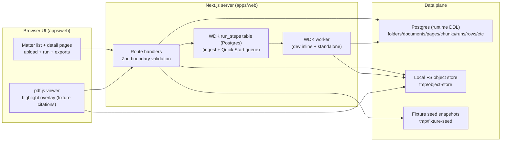

# Current PoC Runtime (Implemented Today)

This document describes what is actually implemented in the repo today. It exists to prevent “docs imply WDK/OCR/RAG exists” confusion while the target architecture continues to evolve.

Target architecture docs remain in `docs/03-architecture/*` (e.g. WDK durable steps, OCR/layout geometry, retrieve/draft/lock pipeline). Treat those as **target** unless this doc says a component exists in the current PoC.

## High-level summary

Current PoC is:
- Next.js App Router (`apps/web`) using Node runtime route handlers
- Postgres via `postgres` driver with runtime DDL (`apps/web/lib/db.server.ts`)
- Local filesystem “object store” under `tmp/object-store` (`apps/web/lib/objectStore.server.ts`)
- WDK durable workflows/steps for document ingest and Quick Start runs (`runs` + `run_steps`) with a worker loop (`apps/web/lib/wdk/wdkWorker.server.ts`)
  - In dev (`pnpm dev`): ingest enqueue kicks an inline WDK worker drainer (same process)
  - Outside dev: run the worker process (`pnpm --filter @orbital-poc/web worker`)
- Legacy durable jobs runtime (the `execute_run` worker loop) has been removed; Quick Start must not enqueue jobs and is WDK-only.
- PDF extraction via `pdfjs-dist` text extraction (not OCR; no geometry) (`apps/web/lib/ingest/ingestProcessor.server.ts`)
- Fixture-backed “evidence” for demos (seed snapshots under `tmp/fixture-seed`) used by citations, trace export, and spike export flows (`apps/web/lib/fixtureSeed.server.ts`, `scripts/fixtures/seed.ts`)

## Current component map

## What “ingest” means today
- Upload writes the raw PDF to the local FS object store via signed headers.
- Ingest starts a WDK workflow (`runs.type = 'ingest_document'`) and schedules a WDK step (`run_steps.step_type = 'ingest_document.process'`).
- Ingest is processed by the WDK worker; it does not enqueue a legacy `jobs` row.
- The worker reads the PDF bytes from local FS and extracts per-page text using pdf.js.
- Extracted text is persisted to:
  - `document_pages.text` (per page)
  - `chunks.text` (currently 1 chunk per page)
- Layout/citations geometry is not produced. `document_pages.layout_json.has_geometry = false`.
- `documents.ocr_status` currently represents “extraction done” for this path; extraction method is tracked in `documents.metadata_json`.

Code:
- `apps/web/lib/ingest/ingestQueue.server.ts` (start ingest workflow)
- `apps/web/workflows/ingestDocumentWorkflow.server.ts` (workflow start + step scheduling)
- `apps/web/steps/ingestDocumentProcess.step.server.ts` (step handler)
- `apps/web/lib/ingest/ingestProcessor.server.ts` (processing logic)
- `apps/web/lib/objectStore.server.ts`

## What “Quick Start run” means today
- Runs are executed via WDK steps (`run_steps`) processed by the WDK worker.
- `POST /folders/:id/runs` schedules one queued per-question step (`step_type='quick_start_title_survey.write_row_v0'`) and logs `orchestration: \"wdk\"`.
- Current run implementation writes placeholder terminal `report_rows` for each question.
- It does not do retrieval, drafting, locking citations, or verification against real data.

Code:
- `apps/web/app/(api)/folders/[id]/runs/route.ts` (run creation + step scheduling)
- `apps/web/workflows/quickStartTitleSurveyWorkflow.server.ts` (per-question step scheduling)
- `apps/web/steps/quickStartWriteRowV0.step.server.ts` (row writing)
- `apps/web/test/foldersRunsRoute.wdk.int.test.ts` (WDK scheduling + idempotency + “no execute_run jobs”)

## Evidence and citations (current state)
Evidence-first UX exists for fixture packs only:
- `GET /citations/:id` resolves citations from seed snapshots (`tmp/fixture-seed`) and returns polygons/snippets for viewer overlay.
- Trace export (`GET /runs/:id/trace`) is synthesized from seed snapshots; it does not read persisted `runs/run_steps/...` execution artifacts.
- CSV export under `/spikes/export/csv` uses seed snapshots and deterministic integrity checks; it is not the target production export pipeline.

Code:
- `apps/web/lib/fixtureSeed.server.ts`
- `apps/web/app/(api)/citations/[id]/route.ts`
- `apps/web/app/(api)/runs/[id]/trace/route.ts`
- `apps/web/app/(api)/spikes/export/csv/route.ts`
- `scripts/fixtures/seed.ts`

## Environment and gating (current)
- Object store signing:
  - Set `OBJECT_STORE_SIGNING_SECRET` for stable signed URLs.
  - Dev-only escape hatch: set `ALLOW_DEV_OBJECT_STORE_SECRET=1` to use a per-process fallback secret.
- Many API routes are dev-only today via `assertDevOnlyApi()` (returning `404` outside dev):
  - `apps/web/lib/devOnlyApi.server.ts`
- Spike routes are additionally gated by `SPIKES_ENABLED=1`:
  - `apps/web/lib/spikes.server.ts`
- Trace export is gated by `FEATURE_TRACE_EXPORT=1` and an admin token (`ORBITAL_ADMIN_TOKEN`) with an explicit dev-only bypass.

## Known drift vs target architecture
The largest gaps relative to target docs:
- No OCR/layout provider and no geometry-backed citations.
- No retrieval/draft/lock pipeline; current runs write placeholder rows.
- “Evidence-first” is implemented for fixture/demo mode, not for real uploaded documents.

If you are implementing features, prefer grounding changes in code reality first (this doc), then updating the target docs as the target evolves.

## Planned closures (near-term)

This doc stays “implemented today”. For the intended sequence of upcoming refactors/features (including “WDK now”, Quick Start refactor, retrieval, and chat), see:
- `docs/04-projects/02-features/0011_chat_interface/plan.program-sequencing.md`

Key planned closures (not implemented yet, at time of writing):
- Make citations DB-backed for real uploaded documents (with fixture fallback only where explicitly gated).
  - Ship behind `FEATURE_CITATIONS_API` (default off until RH3 evidence is recorded).
- Implement hybrid retrieval (lexical + semantic) as the retrieval substrate enabling grounded chat and evidence-first features beyond fixtures.
