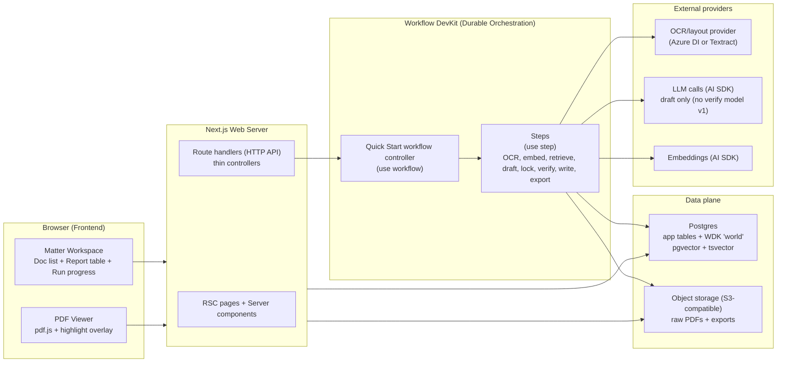
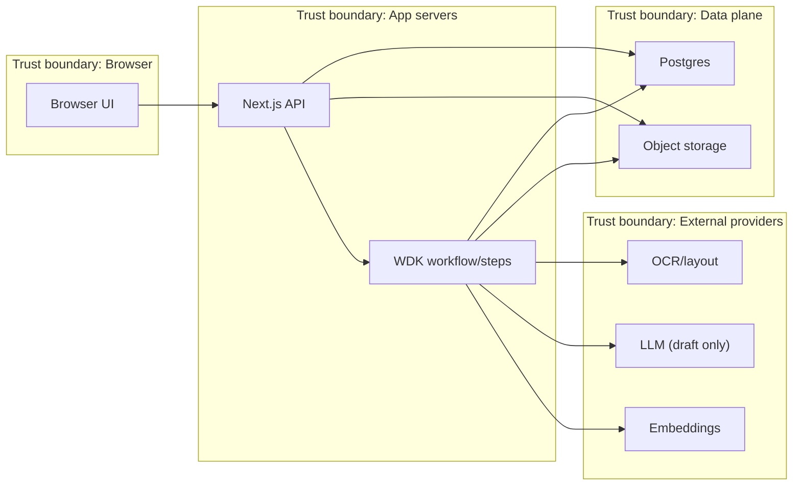
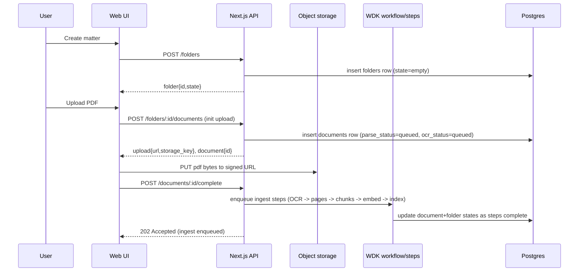
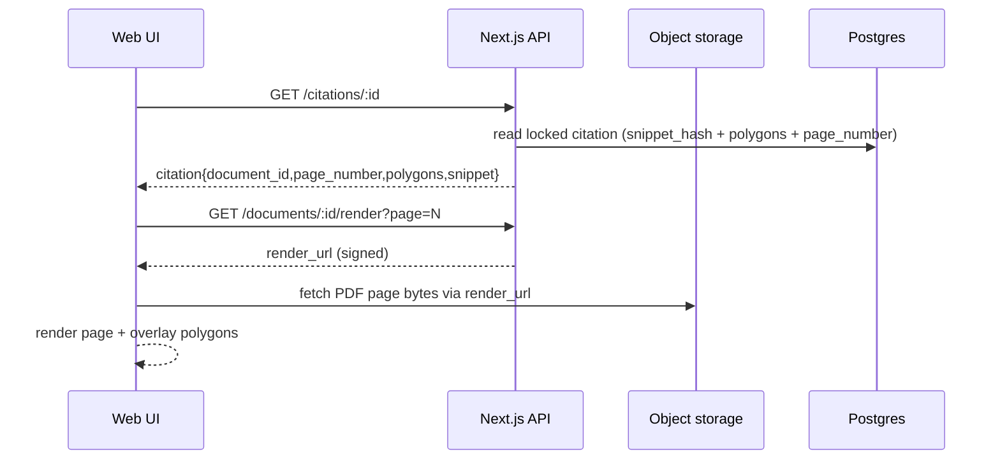

# System architecture

> Note: This document describes the **target** architecture. For what is implemented today, see
> `docs/03-architecture/07_current_poc_runtime.md`.

This doc is the canonical high-level map of the Orbital Copilot PoC **target** runtime. It should stay stable while code is added.

Goals (PoC)
- Evidence-first UX: click `citation_id` -> see highlighted PDF evidence.
- Deterministic-ish runs: row-by-row progress, resumability, retries, explicit side effects.
- Thin API layer: mostly triggers workflows and reads state.
- Production-minded plumbing, PoC-sized surface area (single-tenant; minimal infra).

Non-goals (for now)
- Multi-tenant admin, SSO/RBAC, billing.
- External web research inside a run (ADR-0007).
- Microservices decomposition (one app + worker is the baseline).

## Glossary
- Folder: DB/API name for a workspace container. UI calls it a Matter.
- Run: one execution of a Quick Start workflow for a folder.
- Step: a single side-effect boundary. Target execution is durable via Workflow DevKit (WDK); current PoC execution is in-process and documented in `docs/03-architecture/07_current_poc_runtime.md`.
- Index version: identifies the retrieval substrate built for a folder (chunks + indices).
- Agent bundle version: pins prompts + schemas + logic used by a run (git SHA is fine for PoC).
- Question set version: pins the question set used by a run (see `docs/03-architecture/20_state_model.md` and `docs/03-architecture/30_data_model.md`).
- Citation locking: resolving candidate chunk IDs into immutable citation records with snippet/hash/geometry (ADR-0001).

## High-level component map

Conventions:
- The meaning of `(use workflow)` / `(use step)` is defined in `docs/03-architecture/06_frameworks_agents_rag_evals.md`.

Target (aspirational):

Notes:
- Target: WDK owns durability, retries, resumability, and step-level progress events (ADR-0005).
- Current: ingest and quick-start execution is in-process (non-durable) and does not yet implement the retrieve/draft/lock pipeline. See `docs/03-architecture/07_current_poc_runtime.md`.
- Domain logic should live outside the WDK integration layer (eg `packages/core`) and be called from steps.
- This repo started docs-first; keep the same conceptual boundaries even if directories differ.

## Data flow + trust boundaries

Safety notes:
- Provider calls are adapted and mediated; persist only canonical outputs, never raw provider payloads.
- Signed URLs are short-lived; only storage keys and stable metadata are persisted.
- Export is gated on locked citations + fail-closed verification (ADR-0001/0002).

## Ownership and boundaries

### Browser / frontend
Responsibilities:
- Matter workspace UI: upload documents, show ingest/run status, show report rows, show export links.
- PDF rendering with highlight overlay (render page from object storage; overlay locked citation polygons).

Must not:
- Fetch data via client-side effects by default (server-first; see `apps/web/AGENTS.md`).
- Invent trust: the UI should reflect row statuses and export gating rules from `docs/03-architecture/20_state_model.md`.

### Web/API (Next.js route handlers)
Responsibilities:
- Validate external inputs with Zod at the boundary (request bodies, route params).
- Translate domain errors into the safe error envelope (`docs/03-architecture/50_api_surface.md`, ADR-0008).
- Trigger workflows (start run, enqueue ingest/export) and read state for the UI.
- Provide signed URLs for PDF rendering and artefact downloads.

Must not:
- Implement heavy/long-running work inline (OCR, embeddings, LLM calls).
- Leak provider payloads or stack traces to clients.

### Workflow runtime + workers (WDK)
Responsibilities:
- Orchestrate the row-by-row flow for Quick Start:
  `retrieve -> draft -> lock -> verify -> write` (ADR-0005).
- Encapsulate non-deterministic side effects in explicit steps (ADR-0005).
- Guarantee idempotent replays/retries at the step boundary (see `docs/03-architecture/06_frameworks_agents_rag_evals.md`).

### Data plane (Postgres + object storage)
Responsibilities:
- Postgres is the source of truth for state: folders, documents, chunks, runs, steps, report rows, citations, artefacts (`docs/03-architecture/30_data_model.md`).
- Object storage holds raw PDFs and exported artefacts (ADR-0010).

Invariant:
- A claim is only "exportable" when its citations are locked and verification passes (ADR-0001/0002).

### External providers
Responsibilities:
- OCR/layout provider produces canonical per-page text + geometry (ADR-0003; ADR-0012).
- LLM + embeddings calls go through AI SDK and are routed/configured via env (ADR-0013).
- Verification v1 is integrity-only (no entailment model); do not call a "verify" model in PoC v1 (ADR-0017).

## Key sequences

### Create matter -> upload -> ingest -> indexed/ready

State rules live in `docs/03-architecture/20_state_model.md`. Data persistence rules live in `docs/03-architecture/30_data_model.md`.

### View a citation highlight

### Quick Start run (row-by-row)
High-level loop (details in `docs/03-architecture/40_rag_and_agents.md`):
1) Retrieve evidence: hybrid search returns chunk IDs (ADR-0004).
2) Draft structured row JSON from evidence only (candidate citations are chunk IDs).
3) Lock citations: create immutable `citations` rows and replace candidate IDs with `citation_id`s (ADR-0001).
4) Verify: fail-closed; any mismatch sets `citation_failed` (ADR-0002).
5) Write: persist `report_rows` and update progress.

### Export artefacts
Export is a step-driven process (can be immediate or async):
- default is to block export if any row is `citation_failed` unless an explicit override is provided (see `docs/03-architecture/20_state_model.md` and `docs/03-architecture/50_api_surface.md`).

## Deployment topology (PoC)

### Local dev (expected once scaffold exists)
- Web server: Next.js dev server.
- Worker: WDK worker process.
- Postgres: docker compose mode or Sprite mode (ADR-0011, ADR-0022).
- Object storage: local filesystem (ultra-simple) or MinIO for S3 parity (ADR-0010).

### Single VM (Hetzner-first; ADR-0009)
Baseline deployment shape:
- One VM running:
  - Next.js server (web/API)
  - WDK worker(s)
  - Postgres (with backups)
  - Optional MinIO (or managed S3-compatible storage)

Rationale:
- Keeps network latencies simple and avoids serverless connection pitfalls while the PoC is stabilising.

### Optional: Vercel for previews (later)
If/when we move web/API to Vercel:
- Keep WDK worker + Postgres off-Vercel (worker on VM or managed runtime).
- Add connection pooling and hard timeouts/limits.

## Scaling and failure modes (design notes)
- Backpressure: ingest and runs should be queued and rate-limited per folder to avoid stampedes (OCR + embeddings are the expensive knobs).
- Retries: step retries must not duplicate `report_rows` or `citations` (idempotency keys in `run_steps`).
- Cost control: cap evidence chunks per question, cap tokens, log usage per run (see `docs/03-architecture/60_observability_and_evals.md`).
- Consistency: the UI should always render from persisted state; do not show "draft" answers without locked citations.

## Open questions to pin (candidate ADRs)
- Embeddings posture: model choice, dimension standardization, and re-embed triggers (`docs/03-architecture/00_overview.md`).
- Auth posture for the PoC (what is protected in demo environments) (`docs/03-architecture/00_overview.md`).
- Data handling posture: retention windows, export redaction defaults, and log/snapshot hygiene (`docs/03-architecture/00_overview.md`).
