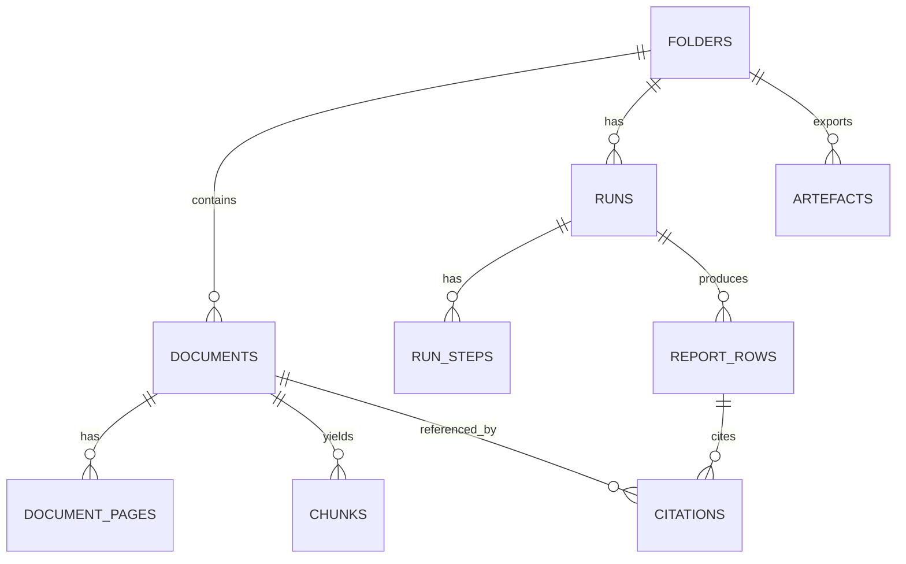

# Data model (Postgres + pgvector)

This is the canonical DB shape for the PoC “trust spine”: ingest → retrieve → draft → verify → report rows with locked citations.

## ERD

## Trust spine tables (minimum viable)

### `folders`
- `id`, `name`, `state`, `created_at`, `updated_at`
- `latest_index_version` (string; bumps on re-ingest/re-index)

### `documents`
- `id`, `folder_id`, `filename`, `mime`, `bytes`
- `sha256` (dedupe), `storage_key`, `page_count`
- `parse_status`, `ocr_status`, `extraction_quality`
- `error_json` (safe ingest failure details)

### `document_pages`
- `id`, `document_id`, `page_number`
- `text` (canonical)
- `layout_json` (tokens/lines/blocks + polygons)

### `chunks`
- `id`, `document_id`
- `index_version` (string; matches `folders.latest_index_version` at time of build)
- `page_start`, `page_end`, `chunk_index`
- `text`, `metadata_json`, `tsv`, `embedding`
- `snippet_hash` (see “Hashing rule” below)

### `runs`
- `id`, `folder_id`, `type`, `state`
- `index_version` (pins retrieval substrate used by the run)
- `agent_bundle_version` (pins prompts + schemas)
- timestamps + `error_json` (safe failure details)

### `run_steps`
- `id`, `run_id`, `step_type`, `state`, `attempt`
- `metrics_json`, `error_json`
- timestamps

### `report_rows`
- `id`, `folder_id`, `run_id`, `question_id`, `question`
- `answer`, `status`, `notes`
- `provenance_json` (minimum: retrieved chunk IDs + scores, models + prompt hashes, verification verdict + reason codes)
- timestamps

### `citations`
Citations are **locked** and **immutable** once created. They store enough to highlight evidence without re-running retrieval or re-reading chunks.
- `id`, `report_row_id`
- `chunk_id` (nullable; stored for debugging/replay)
- `document_id`, `page_number`
- `polygons`, `snippet`, `snippet_hash`
- `index_version` (string; pins the chunking/indexing version the citation came from)
- timestamps

### `artefacts`
- `id`, `folder_id`, `type`, `storage_key`
- `source_run_id`, `metadata_json`
- timestamps

## Hashing rule (snippet_hash)
We use `snippet_hash` to detect citation drift.

PoC rule:
- `snippet_hash = sha256(normalise(snippet))`
- `normalise()` must:
  - trim leading/trailing whitespace
  - convert CRLF → LF
  - collapse all whitespace runs to a single space

This rule must be implemented once (e.g. in `packages/core/citations`) and reused everywhere.

## Indices and constraints (recommended)
- unique `(documents.folder_id, documents.sha256)` (avoid duplicates within a matter, allow reuse across matters)
- unique `(report_rows.run_id, report_rows.question_id)` (rows are per run)
- unique `(chunks.document_id, chunks.index_version, chunks.chunk_index)`

- GIN on `chunks.tsv`
- pgvector index on `chunks.embedding`
- index `citations.report_row_id`
- index `runs.folder_id`
