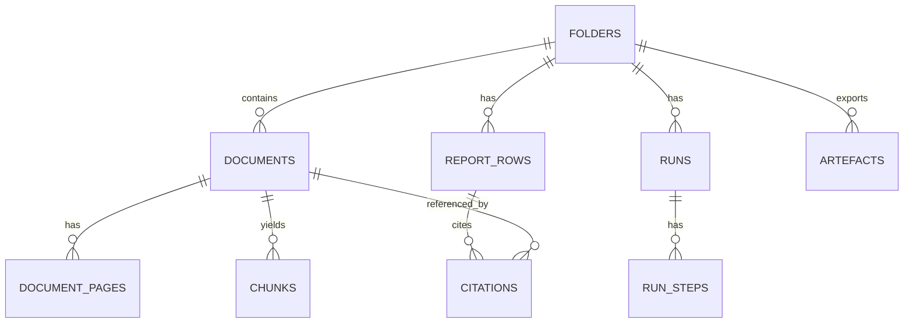

# Data model (Postgres + pgvector)

## ERD

## Trust spine tables (minimum viable)

### `folders`
- `id`, `name`, `state`, `created_at`, `latest_index_version`

### `documents`
- `id`, `folder_id`, `filename`, `mime`, `bytes`
- `sha256` (dedupe), `storage_key`, `page_count`
- `parse_status`, `ocr_status`, `extraction_quality`

### `document_pages`
- `document_id`, `page_number`
- `text` (canonical)
- `layout_json` (tokens/lines/blocks + polygons)

### `chunks`
- `id`, `document_id`, `page_start`, `page_end`, `chunk_index`
- `text`, `metadata`, `tsv`, `embedding`, `snippet_hash`

### `runs`
- `id`, `folder_id`, `type`, `state`
- `agent_bundle_version`
- timestamps + error json

### `run_steps`
- `run_id`, `step_type`, `state`
- metrics json, error json

### `report_rows`
- `folder_id`, `run_id`, `question_id`, `question`
- `answer`, `status`, `reviewed`, `notes`
- optional provenance json (retrieved chunk IDs, model/prompt versions)

### `citations`
- `report_row_id`, `document_id`, `page_number`
- `polygons`, `snippet`, `snippet_hash`

### `artefacts`
- `folder_id`, `type`, `storage_key`, `source_run_id`, `metadata`

## Indices and constraints (recommended)
- unique `documents.sha256`
- unique `(report_rows.folder_id, report_rows.question_id)`
- GIN on `chunks.tsv`
- pgvector index on `chunks.embedding`
- index `citations.report_row_id`
