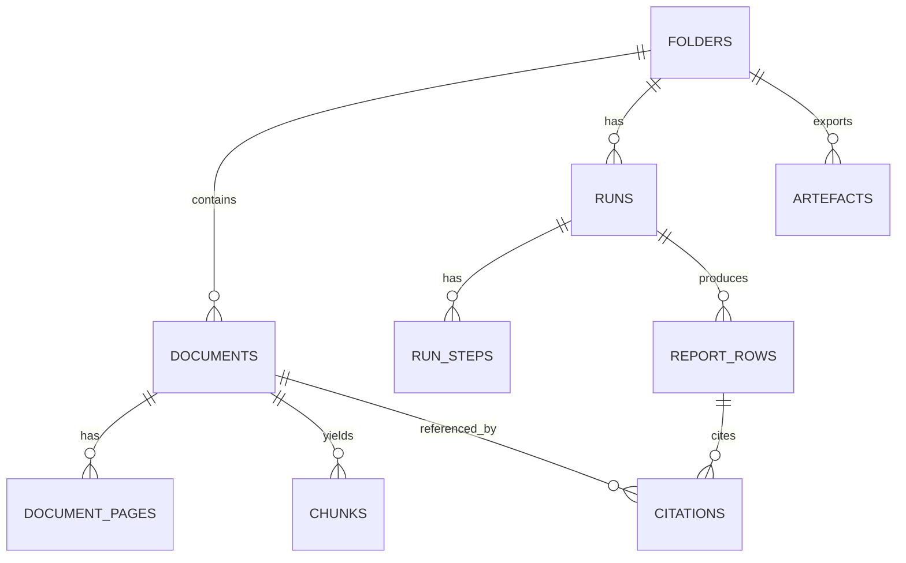

# Data model (Postgres + pgvector)

This is the canonical DB shape for the PoC “trust spine”: ingest → retrieve → draft → verify → report rows with locked citations.

Design rules (PoC)
- Postgres is the source of truth for state and auditability (ADR-0011 accepted).
- Prefer append-only records for "what happened" (runs, steps, report_rows, citations, artefacts).
- Citations are immutable once created (ADR-0001).
- Retrieval substrate is versioned. A new ingest/re-index bumps `folders.latest_index_version` and produces new `chunks` rows for that version.
- Everything that materially affects outputs should be pinnable on a run: `index_version`, `agent_bundle_version`, `question_set_version` (`docs/03-architecture/20_state_model.md`).

## ERD


## Encoding conventions (recommended)
- IDs are opaque strings (optionally prefixed, eg `fld_`, `doc_`, `run_`, `row_`, `cit_`).
- Timestamps are `timestamptz` in UTC.
- JSON columns are `jsonb` and must be "safe": no provider payload dumps, no stack traces, no raw PDF bytes.
- Arrays should be explicit JSON arrays; avoid comma-separated strings.

## Data sensitivity (explicit)
This system stores extracted document text in Postgres (e.g. `document_pages.text`, `chunks.text`, `citations.snippet`) and raw PDFs in object storage.
Treat both as confidential customer data.

Minimum PoC posture:
- Encrypt storage and database volumes at rest where possible.
- Backups are sensitive (DB dumps contain extracted text).
- Do not log raw extracted text or raw PDF bytes.
- Provider calls (OCR/LLM/embeddings) may transmit document content externally; disclose and gate by config.

## Trust spine tables (minimum viable)

### `folders`
- `id`, `name`, `state`, `created_at`, `updated_at`
- `latest_index_version` (string; bumps on re-ingest/re-index)

Recommended constraints:
- `state` should be constrained to the folder state machine values (`docs/03-architecture/20_state_model.md`).

### `documents`
- `id`, `folder_id`, `filename`, `mime`, `bytes`
- `sha256` (dedupe), `storage_key`, `page_count`
- `parse_status`, `ocr_status`, `extraction_quality`
- `error_json` (safe ingest failure details)

Recommended constraints:
- FK `documents.folder_id -> folders.id` (ON DELETE CASCADE or RESTRICT; choose intentionally).
- Unique `(documents.folder_id, documents.sha256)` to avoid duplicates within a matter.

### `document_pages`
- `id`, `document_id`, `page_number`
- `text` (canonical)
- `layout_json` (tokens/lines/blocks + polygons)

Recommended constraints:
- FK `document_pages.document_id -> documents.id`.
- Unique `(document_pages.document_id, document_pages.page_number)`.

### `chunks`
- `id`, `document_id`
- `index_version` (string; matches `folders.latest_index_version` at time of build)
- `page_start`, `page_end`, `chunk_index`
- `text`, `metadata_json`, `tsv`, `embedding`
- `text_hash` (hash of `chunks.text` using the canonical hashing rule below)

Notes:
- `tsv` is the lexical index (tsvector). Consider a generated column if you want to avoid drift.
- `embedding` is a pgvector column. It must match the chosen embedding model dimension (open decision; pin in fixtures/evals).
- In PoC v1, citation locking uses `chunks.text` as the citation snippet by default, so `citations.snippet_hash` will usually equal `chunks.text_hash`.
- Chunking rules and required metadata fields are pinned in ADR-0015.

Recommended constraints:
- FK `chunks.document_id -> documents.id`.
- Unique `(chunks.document_id, chunks.index_version, chunks.chunk_index)`.

### `runs`
- `id`, `folder_id`, `type`, `state`
- `index_version` (pins retrieval substrate used by the run)
- `agent_bundle_version` (pins prompts + schemas)
- `question_set_version` (pins the exact question set used by the run; required for “completed” invariants)
- timestamps + `error_json` (safe failure details)

Recommended constraints:
- FK `runs.folder_id -> folders.id`.
- `state` constrained to the run state machine (`docs/03-architecture/20_state_model.md`).
- Consider a partial index for "latest run per folder" queries.

### `run_steps`
- `id`, `run_id`, `step_type`, `state`, `attempt`
- `step_key` (deterministic idempotency key; eg `ingest:doc_123:ocr` or `quick_start:BII-01:verify`)
- `metrics_json`, `error_json`
- timestamps

Recommended constraints:
- FK `run_steps.run_id -> runs.id`.
- Unique `(run_steps.run_id, run_steps.step_key)` so retries short-circuit safely.
- `state` constrained to the step state machine (`docs/03-architecture/20_state_model.md`).

### `report_rows`
- `id`, `folder_id`, `run_id`, `question_id`, `question`
- `answer`, `status`, `notes`
- `payload_schema_version` (string, nullable; e.g. `list_payload_v0`)
- `payload_json` (jsonb, nullable; structured row payload for list-shaped artefacts)
- `provenance_json` (minimum: retrieved chunk IDs + scores, models + prompt hashes, verification verdict + reason codes)
- timestamps

Recommended constraints:
- FK `report_rows.run_id -> runs.id`.
- FK `report_rows.folder_id -> folders.id`.
- Unique `(report_rows.run_id, report_rows.question_id)`.
- `status` constrained to the report row statuses (`docs/03-architecture/20_state_model.md`).

### `citations`
Citations are **locked** and **immutable** once created. They store enough to highlight evidence without re-running retrieval or re-reading chunks.
- `id`, `report_row_id`
- `chunk_id` (nullable; stored for debugging/replay)
- `document_id`, `page_number`
- `polygons`, `snippet`, `snippet_hash`
- `index_version` (string; pins the chunking/indexing version the citation came from)
- timestamps

Recommended constraints:
- FK `citations.report_row_id -> report_rows.id`.
- FK `citations.document_id -> documents.id`.
- `snippet_hash` is required and must be computed with the canonical rule below.
- **Invariant:** exportable citations MUST include valid `polygons`. Missing/invalid polygons fail closed and must set `citation_failed`.

#### Citation polygon coordinate system (polygons)
`citations.polygons` is a list of polygons. Each polygon is a list of points `[x, y]`.

Canonical coordinate space (PoC v1):
- Points are **normalised floats** in the range `[0..1]`.
- Origin is **top-left** of the PDF page’s **viewBox**.
- `x` increases to the right, `y` increases down.
- Points are ordered clockwise (recommended; not required for rendering).
- This coordinate space is independent of zoom. Rendering applies the current pdf.js viewport transform.

Viewer mapping (pdf.js):
- Let `viewBox = [xMin, yMin, xMax, yMax]` from the pdf.js page.
- Convert a point `[xNorm, yNorm]` to PDF points:
  - `xPdf = xMin + xNorm * (xMax - xMin)`
  - `yPdf = yMax - yNorm * (yMax - yMin)` (invert Y because `yNorm` is top-left origin)
- Convert to viewport pixels:
  - `[xPx, yPx] = viewport.convertToViewportPoint(xPdf, yPdf)`

Validation (fail-closed):
- Every point must be within `[0..1]`.
- Polygons must be non-empty.
- If any validation fails (including missing polygons), treat the citation as invalid and fail closed (`citation_failed`).

### `artefacts`
- `id`, `folder_id`, `type`, `storage_key`
- `source_run_id`, `metadata_json`
- timestamps

Notes:
- Do not persist signed `download_url` values in the DB; persist `storage_key` + metadata and generate fresh signed URLs on demand.
- Recommended `metadata_json` fields (PoC):
  - `kind` (e.g. `requirements_tracker`, `exceptions_table`, `survey_issues`, `memo`)
  - `filename`
  - `schema_version` (for CSVs)
  - `unsafe` / `unsafe_override` (if demo-only unsafe exports are ever allowed)

## Provenance JSON (recommended shape)
`report_rows.provenance_json` should be structured enough to support:
- replay ("what evidence did we use?")
- debugging ("which step failed, why?")
- evals ("what was Recall@K, what was verified?")

Minimal example (shape only; evolve as needed):
```json
{
  "retrieval": {
    "index_version": "v1",
    "query": "List Schedule B-II exceptions...",
    "chunks": [
      { "chunk_id": "chk_123", "score": 12.34 },
      { "chunk_id": "chk_456", "score": 10.98 }
    ]
  },
  "draft": {
    "model": "anthropic/claude-sonnet-4.5",
    "prompt_hash": "sha256:..."
  },
  "lock": {
    "locked_citation_ids": ["cit_123", "cit_124"]
  },
  "verify": {
    "model": "openai/gpt-5",
    "verdict": "pass",
    "reason_code": null
  }
}
```

## Hashing rule (snippet_hash)
We use `snippet_hash` to detect citation drift.

PoC rule:
- `snippet_hash = "sha256:" + sha256_hex(normalise(snippet))`
- `sha256_hex(...)` is lower-case hex.
- Input must be UTF-8 text; hashing is performed on UTF-8 bytes after normalisation.
- `normalise()` must:
  - trim leading/trailing whitespace
  - convert CRLF → LF
  - collapse all whitespace (including newlines/tabs) to a single space

This rule must be implemented once (e.g. in `packages/core/citations`) and reused everywhere.

## Indices and constraints (recommended)
- Unique and FK constraints:
  - unique `(documents.folder_id, documents.sha256)`
  - unique `(report_rows.run_id, report_rows.question_id)`
  - unique `(chunks.document_id, chunks.index_version, chunks.chunk_index)`
  - unique `(run_steps.run_id, run_steps.step_key)`

- Indexing:
  - GIN on `chunks.tsv`
  - pgvector index on `chunks.embedding`
  - index `citations.report_row_id`
  - index `runs.folder_id`
  - index `documents.folder_id`

## Immutability and replay (important)
- `citations` must be treated as immutable after insert. If you need to "fix" a citation, create a new citation and update the report row to reference the new ID (and record why in provenance).
- Chunk drift is handled by versioning: new chunking/indexing should create a new `index_version`, not mutate existing chunks.
