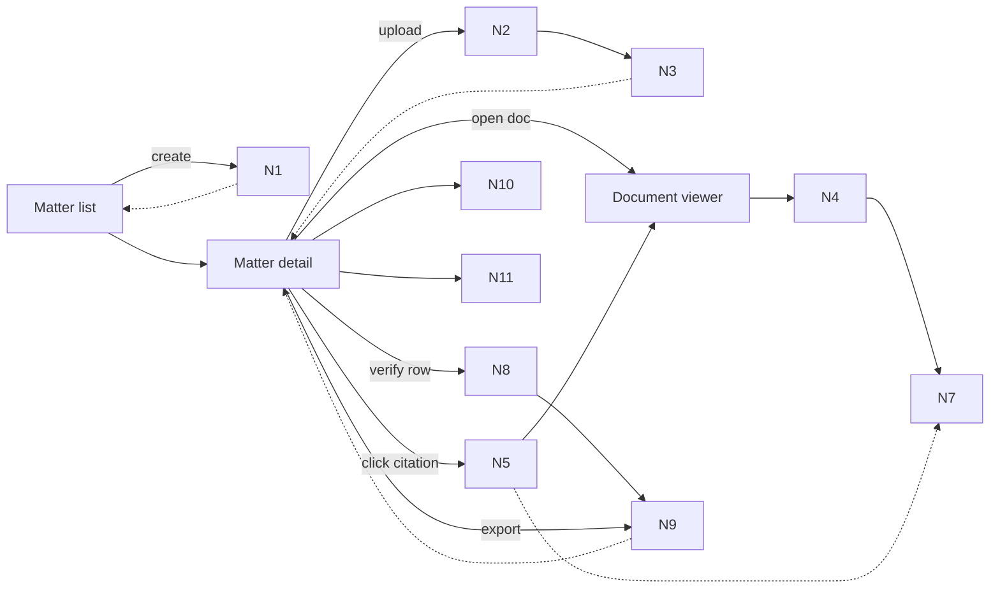

# Breadboard Pack — Trust substrate

## Context

- Appetite: TBD
- Problem: No baseline surface exists for viewing evidence, attaching citations, verifying claims, or showing failures. Trust must be established before any AI-driven work can be credible.
- Success: Matter + viewer works end-to-end; citations are real; verification is fail-closed; failures and provenance are explicit.
- Constraints: No auth/RBAC, no retrieval/generation beyond verification, no OCR geometry beyond anchor JSON, no external web research.

## Current state

### What exists today

- Seed packs in `docs/08-example-data`.
- Anchor scaffolding in `/layout/*.anchors.json`.
- No confirmed matter/document UI surface in the web app.

### Current flow (breadboard)

- _N/A_ (baseline surface does not exist yet).

## Proposed solution

### Proposed flow (breadboard)

- _Matter list (entry)_
  - Create matter
  - -> Matter detail
- _Matter detail_
  - Upload documents
  - Document list + statuses
  - Report rows (seeded)
  - Citation chips
  - -> Document viewer
- _Document viewer_
  - Page navigation + zoom
  - Highlight overlay
  - Snippet + hash display
  - -> Back to Matter detail
- _Verification + failure UX_
  - Status badges per row
  - Export gate (blocked when citation_failed)
  - Missing docs checklist
  - Doc quality warnings
  - Flag citation wrong
- _Trace export (admin)_
  - Export run trace JSON

### Elements

- Matter list + detail views
- Upload pipeline + document list with statuses
- PDF viewer (pdf.js) with page nav + zoom
- Citation chips + highlight overlay
- Verification status + export gate
- Failure taxonomy + warnings
- Provenance capture + trace export

## UI affordances

| # | Component / place | Affordance | Control | Wires out | Reads |
|---|---|---|---|---|---|
| U1 | Matter list | Create matter button | click | N1 create matter |  |
| U2 | Matter create modal | Name/description form + submit | type/click | N1 create matter |  |
| U3 | Matter detail | Upload dropzone + progress | drop/click | N2 upload pipeline | N3 doc status |
| U4 | Matter detail | Document list + status pills | click | N4 open viewer | N3 doc status |
| U5 | Matter detail | Report rows table | render |  | N9 row status |
| U6 | Matter detail | Citation chips per row | click | N5 fetch citation + N4 jump to page |  |
| U7 | Viewer | Page nav + zoom | click/scroll | N4 page render | N4 page state |
| U8 | Viewer | Highlight overlay + snippet | render | N7 map bbox to viewport | N5 citation payload |
| U9 | Matter detail | Export button + block state | click | N9 status gate | N9 row status |
| U10 | Matter detail | Missing docs checklist | render |  | N10 failure taxonomy |
| U11 | Matter detail | Doc quality warning | render |  | N3 doc metadata |
| U12 | Matter detail | Flag citation wrong action | click | N10 log feedback | N5 citation payload |
| U13 | Admin/trace | Export trace JSON | click | N11 trace export | N11 provenance store |

## Code affordances

| # | Component / service | Affordance | Control | Wires out / returns |
|---|---|---|---|---|
| N1 | Matter API | `POST /matters` | call | creates matter ID |
| N2 | Upload service | direct-to-storage upload + progress | call | writes file + emits status |
| N3 | Doc processing store | doc status read/write | read/write | updates list state |
| N4 | PDF viewer | render page + jump/zoom | call | returns rendered canvas |
| N5 | Citations API | `GET /citations/:id` | call | returns citation payload |
| N6 | Anchor loader | map anchor IDs to geometry | call | returns polygons |
| N7 | Highlight renderer | PDF->viewport transform | call | returns overlay geometry |
| N8 | Verification pipeline | code checks + LLM entailment | call | returns verdict |
| N9 | Row status machine | state transitions | write | sets `needs_review` / `citation_failed` |
| N10 | Failure logger | taxonomy + structured logs | write | emits failure events |
| N11 | Provenance store | trace schema + export | write/call | returns run trace JSON |

## Wiring diagram

- Legend:
  - **Solid** = calls / triggers / writes
  - **Dashed** = returns / store reads

## Parts list (BOM)

| Part | Name | Mechanism |
|---|---|---|
| F1 | Matter + upload baseline | Create matter, upload docs, show status list |
| F2 | PDF viewer | pdf.js viewer with page nav + zoom |
| F3 | Citation UI | Chips + jump-to-page + highlight overlay |
| F4 | Citation model + API | Canonical citation schema + `GET /citations/:id` |
| F5 | Verification gate | Status machine + verifier + export block |
| F6 | Failure UX | Missing docs + quality warnings + flag action |
| F7 | Provenance trace | Capture model/prompt/inputs + trace export |

## Fit check: requirements × concept

| Req | Requirement | Status | Fit |
|---|---|---|---|
| R1 | Matter creation + upload + view | core goal | ✅ |
| R2 | Citation chips + click-to-highlight | core goal | ⚠️ (depends on transform spike) |
| R3 | Canonical citation API | must-have | ✅ |
| R4 | Fail-closed verification | must-have | ⚠️ (depends on verifier spike) |
| R5 | Failure UX (missing docs, quality) | must-have | ⚠️ (depends on heuristics spike) |
| R6 | Provenance + trace export | must-have | ✅ |

### Unsolved

- R2: Can we reliably map anchor geometry across zoom levels?
- R4: Can we achieve high-precision verification without false passes?
- R5: Can missing-doc detection be accurate on noisy packs?

## Rabbit holes, cuts, and no-gos

### Rabbit holes

- PDF highlight coordinate transforms across zoom.
- Snippet canonicalisation + hash stability.
- Verification precision/latency trade-offs.

### Cuts / scope trims

- No OCR geometry extraction beyond anchor scaffolding.
- No advanced trace UI (endpoint/export only).

### Out of bounds / no-gos

- Auth/RBAC, integrations, external research.

## Optional: Extract vs duplicate analysis

Not applicable (no comparable existing feature).
