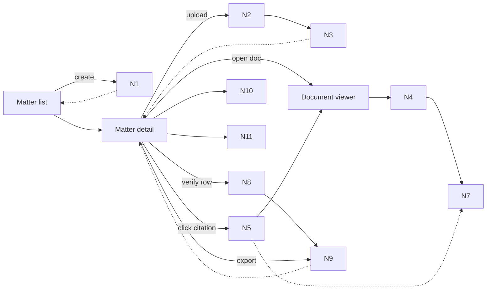

# Breadboard Pack — 0001 Trust Substrate

## Context

- Appetite: TBD
- Problem: No baseline surface exists for viewing evidence, attaching citations, verifying claims, or showing failures. Trust must be established before any AI-driven work can be credible.
- Success: Matter + viewer works end-to-end; citations are real; verification is fail-closed; failures and provenance are explicit.
- Constraints: No auth/RBAC, no external web research, no full Quick Start generation (this is the trust substrate it depends on).
  - Highlight overlay spike (RH2) is anchors-first to validate mapping math quickly.
  - OCR/layout extraction remains the default ingest posture for PDFs (ADR-0003).
- Canonical references:
  - State invariants: `docs/03-architecture/20_state_model.md`
  - API contracts: `docs/03-architecture/50_api_surface.md`
  - Trust ADRs: `docs/03-architecture/DECISIONS.md`

## Current state

### What exists today

- Seed packs in `docs/08-example-data`.
- Anchor scaffolding in `docs/08-example-data/*/layout/*.anchors.json`.
- Web app scaffolding exists, but there is no confirmed Matter/Document/Viewer UI or API yet.

### Current flow (breadboard)

- _N/A_ (baseline surface does not exist yet).

## Proposed solution

### Proposed flow (breadboard)

- _Matter list (entry UI; API/DB calls it Folder)_
  - Create matter (folder)
  - -> Matter detail
- _Matter detail_
  - Upload documents
  - Document list + statuses
  - Report rows (seeded)
  - Citation chips
  - -> Document viewer
- _Document viewer_
  - Page navigation + zoom
  - Highlight overlay
  - Snippet + hash display
  - -> Back to Matter detail
- _Verification + failure UX_
  - Status badges per row
  - Export gate (blocked when citation_failed)
  - Missing docs checklist
  - Doc quality warnings
  - Flag citation wrong
- _Trace export (admin)_
  - Export run trace JSON

### Elements

- Matter list + detail views (folder CRUD)
- Upload pipeline + document list with ingest statuses
- PDF viewer (pdf.js) with page nav + zoom
- Citation chips + highlight overlay
- Verification status + export gate
- Failure taxonomy + warnings
- Provenance capture + trace export

## UI affordances

| # | Component / place | Affordance | Control | Wires out | Reads |
|---|---|---|---|---|---|
| U1 | Matter list | Create matter button | click | N1 create matter |  |
| U2 | Matter create modal | Name/description form + submit | type/click | N1 create matter |  |
| U3 | Matter detail | Upload dropzone + progress | drop/click | N2 upload pipeline | N3 doc status |
| U4 | Matter detail | Document list + status pills | click | N4 open viewer | N3 doc status |
| U5 | Matter detail | Report rows table | render |  | N9 row status |
| U6 | Matter detail | Citation chips per row | click | N5 fetch citation + N4 jump to page |  |
| U7 | Viewer | Page nav + zoom | click/scroll | N4 page render | N4 page state |
| U8 | Viewer | Highlight overlay + snippet | render | N7 map bbox to viewport | N5 citation payload |
| U9 | Matter detail | Export button + block state | click | N9 status gate | N9 row status |
| U10 | Matter detail | Missing docs checklist | render |  | N10 failure taxonomy |
| U11 | Matter detail | Doc quality warning | render |  | N3 doc metadata |
| U12 | Matter detail | Flag citation wrong action | click | N10 log feedback | N5 citation payload |
| U13 | Admin/trace | Export trace JSON | click | N11 trace export | N11 provenance store |

## Code affordances

| # | Component / service | Affordance | Control | Wires out / returns |
|---|---|---|---|---|
| N1 | Folders API (Matter CRUD) | `POST /folders` | call | creates `folder_id` |
| N2 | Upload service | init upload + put to storage + complete | call | `POST /folders/:id/documents` → upload target; `POST /documents/:id/complete` enqueues ingest |
| N3 | Documents store | ingest status + quality metadata | read/write | drives list state (`parse_status`, `ocr_status`, `extraction_quality`) |
| N4 | Viewer render contract | render URL + viewer state | call | `GET /documents/:id/render?page=N` returns `render_url`; viewer handles page nav + zoom |
| N5 | Citations API | `GET /citations/:id` | call | locked citation payload `{document_id,page_number,polygons,snippet,snippet_hash}` |
| N6 | Anchor fixture loader | map fixture anchor IDs to polygons | call | returns polygons for highlight scaffold |
| N7 | Highlight renderer | anchor polygons → viewport CSS pixels | call | Maps normalised anchors (`[0..1]`, origin top-left of page viewBox) → PDF points using `viewBox` (invert Y), then uses `viewport.convertToViewportPoint()` to get CSS px. Returns overlay geometry for rendering. |
| N8 | Verification pipeline | code checks + (optional) entailment | call | returns verdict + failure reason code |
| N9 | Row status machine | status invariants + export gate | write | sets row status + blocks export by default on `citation_failed` |
| N10 | Failure logger | taxonomy + structured logs | write | emits safe failure events |
| N11 | Provenance store | minimal trace schema + export | write/call | returns run trace JSON |

## Viewer architecture (Next.js App Router)

This is a minimal, clean server/client boundary that keeps pdf.js imperative work on the client while fetching data server-first.

- `app/(app)/matters/[folderId]/page.tsx` (Server): fetch folder + docs + seeded report rows; render citation chips as `<Link>` to the viewer.
- `app/(app)/viewer/[documentId]/page.tsx` (Server): read `searchParams` (`page`, optional `citation`, optional `zoom`), server-fetch `render_url` and (if present) locked citation payload; pass minimal props to client viewer.
- `PdfViewerClient` (Client): owns pdf.js load/render and page/zoom/rotation state; renders canvas + overlay; surfaces explicit failure states.
- `HighlightOverlaySvg` (Client): maps polygons to viewport CSS pixels (pure util) and renders an `<svg>` overlay sized to `viewport.width/height`.

### Fail-closed behaviour (viewer)
- If a citation is present but any invariants fail (doc mismatch, page out of range, polygons invalid/out of range, `render_url` unavailable), do not render an overlay. Show an explicit `citation_failed` UI state and emit a safe failure log.

## Wiring diagram

- Legend:
  - **Solid** = calls / triggers / writes
  - **Dashed** = returns / store reads

## Parts list (BOM)

| Part | Name | Mechanism |
|---|---|---|
| F1 | Matter + upload baseline | Create matter, upload docs, show status list |
| F2 | PDF viewer | pdf.js viewer with page nav + zoom |
| F3 | Citation UI | Chips + jump-to-page + highlight overlay |
| F4 | Citation model + API | Canonical citation schema + `GET /citations/:id` |
| F5 | Verification gate | Status machine + verifier + export block |
| F6 | Failure UX | Missing docs + quality warnings + flag action |
| F7 | Provenance trace | Capture model/prompt/inputs + trace export |

## Fit check: requirements × concept

| Req | Requirement | Status | Fit |
|---|---|---|---|
| R1 | Matter creation + upload + view | core goal | ✅ |
| R2 | Citation chips + click-to-highlight | core goal | ⚠️ (depends on transform spike) |
| R3 | Canonical citation API | must-have | ✅ |
| R4 | Fail-closed verification | must-have | ⚠️ (depends on verifier spike) |
| R5 | Failure UX (missing docs, quality) | must-have | ⚠️ (depends on heuristics spike) |
| R6 | Provenance + trace export | must-have | ✅ |

### Unsolved

- R2: Can we reliably map anchor geometry across zoom levels?
- R4: Can we achieve high-precision verification without false passes?
- R5: Can missing-doc detection be accurate on noisy packs?

## Rabbit holes, cuts, and no-gos

### Rabbit holes

- PDF highlight coordinate transforms across zoom.
- Snippet canonicalisation + hash stability.
- Verification precision/latency trade-offs.

### Cuts / scope trims

- Do not require perfect OCR-derived highlight geometry before we can prove the trust UX. Use anchor fixtures first, then swap to OCR-derived geometry behind the same contracts.
- No advanced trace UI (endpoint/export only).

### Out of bounds / no-gos

- Auth/RBAC, integrations, external research.

## Optional: Extract vs duplicate analysis

Not applicable (no comparable existing feature).

## PRD slicing (record only; slice PRDs after spikes are closed)
Per `docs/00-strategy/initiatives/prd-slicing-rules.md`, slices should map to parts (F#) and affordances (U#/N#):
- Slice A (F1, U1–U4, N1–N3): Matter (folder) CRUD + upload pipeline + doc list statuses
- Slice B (F2, U7, N4): PDF viewer + render URL contract
- Slice C (F3, U6–U8, N5–N7): Citation chips + jump-to-highlight (anchors-first)
- Slice D (F4, N5): Citation locking + hashing util + citations API
- Slice E (F5–F6, U9–U12, N8–N10): Status machine + export gate + failure journeys
- Slice F (F7, U13, N11): Provenance capture + trace export

Notes:
- A draft `prd-overall.md`/`prd-overall.json` overall (spine) PRD may exist in this dossier for handoff, but implementation should happen via thin slice PRDs once spikes are closed and the perimeter is re-locked.
- Slice PRDs for 0001 live under `prds/` (see `prds/README.md`).
