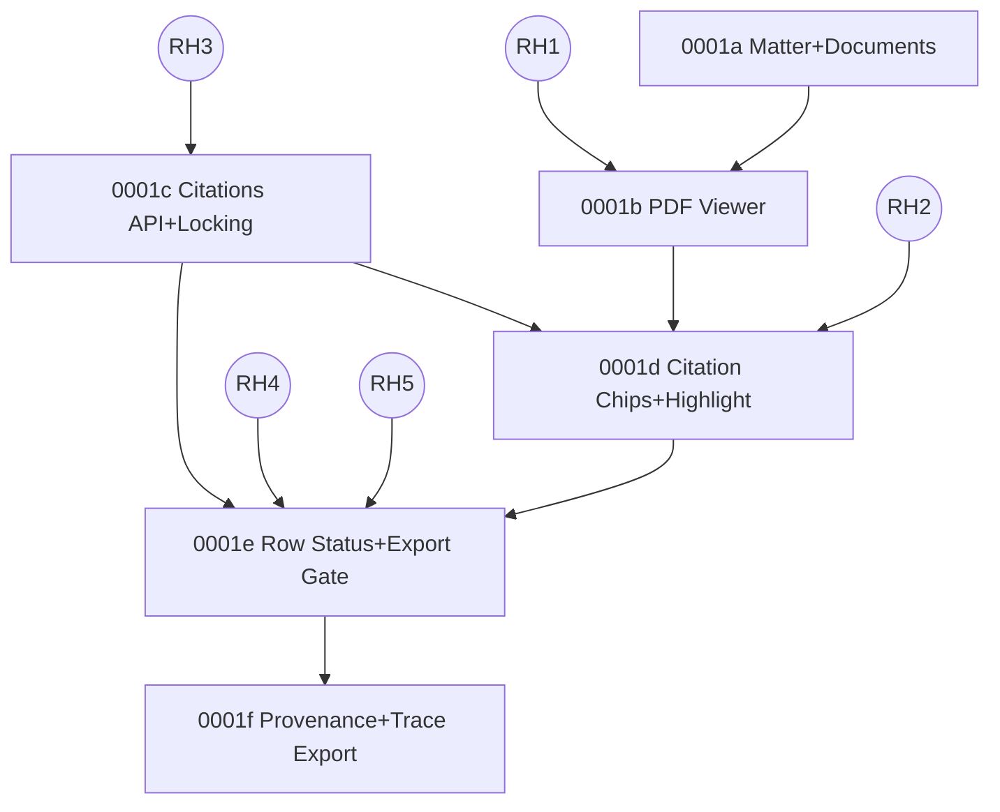

# Plan: 0001 Trust Substrate (From JSON PRDs)

Last updated: 2026-02-07

This plan is derived from the JSON PRDs in this dossier and is optimized for running parallel Ralph loops / agents with minimal overlap.

## Inputs (JSON PRDs)

- `docs/04-projects/02-features/0001_trust-substrate/prd-overall.json`
- `docs/04-projects/02-features/0001_trust-substrate/prds/0001a_matter-documents/prd.json`
- `docs/04-projects/02-features/0001_trust-substrate/prds/0001b_pdf-viewer/prd.json`
- `docs/04-projects/02-features/0001_trust-substrate/prds/0001c_citations-api-locking/prd.json`
- `docs/04-projects/02-features/0001_trust-substrate/prds/0001d_citation-chip-highlight/prd.json`
- `docs/04-projects/02-features/0001_trust-substrate/prds/0001e_row-status-export-failures/prd.json`
- `docs/04-projects/02-features/0001_trust-substrate/prds/0001f_provenance-trace-export/prd.json`

Canonical contracts (do not drift):

- API surface: `docs/03-architecture/50_api_surface.md`
- State model + invariants: `docs/03-architecture/20_state_model.md`
- Data model: `docs/03-architecture/30_data_model.md`
- Trust ADRs: `docs/03-architecture/DECISIONS.md`

## Goal

1. Make dependencies between stories explicit (in-slice, cross-slice, and spike gates).
2. Define ownership boundaries (paths + contracts) so multiple agents can ship in parallel with minimal merge/contract conflicts.

## Security Posture (Non-Negotiables)

These rules apply across all lanes (spikes, API, UI, exports), even in PoC/no-auth setups.

- Signed URLs (`render_url`, `download_url`): generate on demand with short TTL (target 5–15 minutes); never persist in DB; never include in provenance or trace exports; never log; treat `X-Amz-*` query params as secrets.
- Admin-token gating (ADR-0018/ADR-0019): require `X-Orbital-Admin-Token` to match env `ORBITAL_ADMIN_TOKEN`; missing/mismatched returns `403` with the standard error envelope; token must never be stored, returned, or logged.
- Dev-only endpoints: must live under `/spikes/*`, be dev-environment gated, and return `404` outside dev; validate inputs with Zod; avoid filesystem traversal patterns.
- Trace/provenance redaction: trace exports are shareable artifacts; default export must contain only ids, timings, counts, code enums, and hashes (no raw PDF bytes, extracted text, prompts, provider payloads/headers, file paths, signed URLs, auth tokens, or PII).
- Storage/logging posture: Postgres-stored extracted text is sensitive; object storage holds raw PDFs and artefacts; logs/traces/analytics must redact tokens and signed URLs and avoid raw document content.

## Next.js App Router Boundaries (Server-First)

- Default to RSC for route shells under `apps/web/app/(app)/**`. Client components are small “islands”.
- Client components talk to the server via Route Handlers under `apps/web/app/(api)/**/route.ts` (and/or Server Actions treated like public endpoints).
- pdf.js is client-only: keep all pdf.js imports behind a dedicated client-component boundary and use dynamic import.
- Avoid passing large payloads through RSC props (polygons, page text, etc). Prefer ids + client/server fetch as appropriate.

## Spike Gates (Blocked-By Dependencies)

These gates come from `risksDependencies.blockedBy` and block slices from being “GO”.

| Gate | Blocks slice(s) | Primary harness/code today | Evidence location |
|---|---|---|---|
| `RH1` pdf.js perf on scans | `0001b` | `apps/web/app/(app)/spikes/rh1-pdf-perf/*`, `apps/web/app/(api)/spikes/local-pdf/route.ts` | `docs/04-projects/02-features/0001_trust-substrate/spike-proofs/` + `spike-investigation.md` |
| `RH2` overlay transforms | `0001d` | `apps/web/app/(app)/spikes/rh2-overlay/*`, `packages/core/src/geometry/*` | `spike-proofs/` + `spike-investigation.md` |
| `RH3` snippet hash stability | `0001c` | `packages/core/src/citations/snippet.ts`, `packages/core/src/spikes/rh3_snippet_hash_harness.ts` | `spike-proofs/` + `spike-investigation.md` |
| `RH4` verification precision/latency | `0001e` | `apps/web/app/(api)/spikes/rh4-verify/route.ts`, `packages/core/src/verify/verifier.ts`, `docs/04-projects/02-features/0001_trust-substrate/fixtures/rh4_verification_cases.json` | `spike-proofs/` + `spike-investigation.md` |
| `RH5` missing-doc heuristics | `0001e` | `packages/core/src/missing-docs/*` (plus a harness to execute/record) | `spike-proofs/` + `spike-investigation.md` |

## Gate Pass Criteria (Perf + Evidence)

This section is intentionally redundant with PRDs so spike closure is consistent.

RH1 PASS (pdf.js perf on scans) requires:

- Range precondition: the target PDF URL returns `Accept-Ranges: bytes` and honors `Range: bytes=0-10` with `206 Partial Content` (record header proof).
- Define `totalMs` as time from “request page N” to `renderTask.promise` resolve (exclude initial PDF load).
- Serial test (N=20, 100% zoom): `p95(totalMs) < 1000ms` and `max(totalMs) < 1500ms`.
- Spam test (N=30 @ 200ms): `maxLongTaskMs < 250ms` and final requested page completes `< 1500ms` after its request timestamp.
- Cancellation requirement: `>= 70%` intermediate renders are cancelled (define cancellation rate from harness output).
- Evidence committed: downloaded run JSON(s) + summary table in `spike-investigation.md`.
- Important: Range proof must be for the actual URL used by the viewer (`render_url` target), not just `/spikes/local-pdf`.

RH2 PASS (overlay transforms) requires:

- pack_01: one commitment anchor and one survey anchor align at 100% zoom.
- Cut: highlight overlay is verified at 100% zoom only (ADR-0020). Viewer enforces 100% zoom while highlight is active.
- Rotation: at least one rotated/scanned case in pack_07, or an explicit cut/patch is recorded.
- Fail-closed proof: invalid polygon and wrong page show explicit failure UI and render no overlay.
- Evidence committed: screenshots with HUD + bbox log JSON.

RH3 PASS (snippet hash stability) requires:

- `hashSnippet()` and `normaliseSnippet()` are single-sourced (core) and unit tested.
- Harness `packages/core/src/spikes/rh3_snippet_hash_harness.ts` run twice yields identical hashes across runs for the same extracted snippets.
- Evidence committed: the two JSON outputs + a stability note/table in `spike-investigation.md`.

RH4 PASS (verification precision/latency) requires:

- Dataset: `docs/04-projects/02-features/0001_trust-substrate/fixtures/rh4_verification_cases.json` (>= 20 bad examples).
- Pass criteria (integrity-only): `false_passes = 0`.
- Latency budget: `p95 <= 8s` per row on dev machine (record p50/p95/max).
- Evidence committed: results summary + raw results JSON (and any rubric/prompt notes if used later).

RH5 PASS (missing-doc heuristics) requires:

- `pack_02_missing_rea`: flags `REA.pdf` as missing with an actionable checklist.
- `pack_01_clean`: false positives are zero (`FP=0`).
- Only high-confidence candidates shown by default (`confidence >= 0.8`).
- Evidence committed: harness output + a short note describing signals and candidate confidence.

## Dependency Graph (Slices + Gates)

## Story Dependency Matrix (Single Source Of Truth)

Story IDs repeat across slices; always refer to them as `0001x.US-00y`.

Owner lanes (used only for coordination):

- Lane 0: spikes + harnesses only
- Lane 1: DB + shared server primitives (single owner)
- Lane 2: matter + documents
- Lane 3: viewer
- Lane 4: citations API + locking contract
- Lane 5: chips + highlight overlay UX
- Lane 6: row status + export gate + failure journeys
- Lane 7: provenance + trace export

| Unit | Title | Owner lane | Prereqs (stories) | Gate prereqs | Contract prereqs | Verification (minimal) |
|---|---|---:|---|---|---|---|
| `0001a.US-001` | Create and open a Matter | 2 |  |  | `folders` table + `GET/POST /folders` + `GET /folders/:id` | V-repo + UI smoke (create/open matter) |
| `0001a.US-002` | Upload PDFs and observe ingest status | 2 | `0001a.US-001` |  | `documents` table + `POST /folders/:id/documents` + `POST /documents/:id/complete` + `GET /folders/:id/documents` | V-repo + UI smoke (upload + observe statuses) |
| `0001b.US-001` | Open and view a PDF | 3 | `0001a.US-002` | `RH1` | `GET /documents/:id/render?page=N` (page is viewer state; render_url is whole PDF) | V-web + UI smoke (open viewer); rerun RH1 if pdf.js wiring changed |
| `0001b.US-002` | Page navigation and zoom stays responsive on scans | 3 | `0001b.US-001` | `RH1` | Range support + cancellation semantics measurable via harness | V-web + UI smoke (spam nav/zoom); rerun RH1 |
| `0001c.US-001` | Fetch a locked citation by ID | 4 |  | `RH3` | citations table + immutability rules + `GET /citations/:id` reads locked rows | V-repo + dev server sanity check (`GET /citations/:id`) |
| `0001c.US-002` | Canonical snippet hashing is stable | 4 |  | `RH3` | `packages/core/src/citations/snippet.ts` is canonical and reused everywhere | V-core + RH3 harness (run twice, compare outputs) |
| `0001d.US-001` | Click citation chip -> open viewer at cited evidence | 5 | `0001b.US-001`, `0001c.US-001` | `RH2` | viewer accepts `page` + `citation`; citation payload drives overlay render; fail-closed UI states exist | V-web + UI smoke (chip -> viewer); rerun RH2 if overlay touched |
| `0001d.US-002` | Evidence highlights align across zoom + rotation | 5 | `0001d.US-001` | `RH2` | polygon mapping util + zoom/rotation proof (or ADR-0020 cut/patch recorded) | V-web + UI smoke (zoom+rotation); rerun RH2 |
| `0001e.US-001` | Missing docs yields missing_input with checklist | 6 |  | `RH5` | runs/report persistence exists (`runs`, `report_rows`, `GET /folders/:id/report?run_id=…`); missing-doc checklist shape + invariants for `missing_input` | V-repo + UI smoke; `pnpm fixtures:assert-row-invariants` (strict when reason codes change) |
| `0001e.US-002` | Bad evidence yields citation_failed and blocks export | 6 | `0001e.US-001`, `0001c.US-001`, `0001c.US-002` | `RH4` | server-enforced export gate returns `EXPORT_BLOCKED` and checks `runs.state=completed`; unsafe override (ADR-0019) is admin-token gated + demo-flag gated and labels artefacts unsafe | V-repo + UI smoke; invariants script; rerun RH4 if verifier changes |
| `0001e.US-003` | needs_review -> reviewed is explicit and persisted | 6 | `0001e.US-002` |  | persisted row status transition (`needs_review -> reviewed`) with invariants enforced | V-repo + UI smoke; invariants script |
| `0001f.US-001` | Download run trace JSON | 7 |  |  | runs/run_steps/report_rows persisted with provenance; `GET /runs/:id/trace` admin-token gated + safe allowlist trace schema + `FEATURE_TRACE_EXPORT` flag | V-repo + dev server sanity check; trace redaction review |

## Work Lanes (Ownership Boundaries)

Use these to keep parallel work low-conflict.

| Lane | Owns paths | Owns contracts |
|---:|---|---|
| 0 | `apps/web/app/(app)/spikes/**`, `apps/web/app/(api)/spikes/**`, `packages/core/src/spikes/**`, `docs/04-projects/02-features/0001_trust-substrate/spike-proofs/**` | spike evidence + Pass/Cut/Patch decisions |
| 1 | DB/migrations tooling + shared server DB utilities + signed URL policy | DB schema + constraints + transactions; shared “safe error” + schema reuse; signed URL helper/policy |
| 2 | matter/doc UI and endpoints | `folders` + `documents` endpoints and UI surfaces |
| 3 | viewer UI surfaces | pdf.js integration boundary + viewer UX contract |
| 4 | citations core + endpoint | hashing + locked citation payload contract |
| 5 | overlay mapping + viewer overlay UI | overlay mapping + fail-closed UX |
| 6 | status/export core + endpoints + UI | row status invariants + export gate + failure journeys |
| 7 | trace export endpoint + UI | admin-only trace export + redaction rules |

## API Route Ownership Split (Recommended)

This is the “min-overlap” split for target (non-spike) route handlers under `apps/web/app/(api)/**`. Adjust names as you implement, but keep the boundaries.

| Lane | Own these route handler subtrees |
|---:|---|
| 2 | `apps/web/app/(api)/folders/**`, `apps/web/app/(api)/documents/**` |
| 4 | `apps/web/app/(api)/citations/**` |
| 6 | `apps/web/app/(api)/export/**` |
| 7 | `apps/web/app/(api)/runs/**` (trace export endpoint only) |

## Lane 1 Deliverables (DB + Shared Server Primitives, Single Owner)

These must land before dependent lanes can safely implement their stories.

- Migration mechanism decision: where migrations live, how to apply/rollback in dev, and how to serialize migration changes (single owner).
- Initial schema + constraints aligned with `docs/03-architecture/30_data_model.md` (at minimum: `folders`, `documents`, `runs`, `run_steps`, `report_rows`, `citations`).
- Constraints that prevent corruption and retries from duplicating state: unique `(run_steps.run_id, run_steps.step_key)` and unique `(report_rows.run_id, report_rows.question_id)`.
- FK integrity between `runs`, `run_steps`, `report_rows`, `citations`, `documents`, and `folders` (choose ON DELETE behavior intentionally).
- “Citations are immutable” is enforced by convention and reviewed as a contract (no update semantics; fixes are insert-new + update refs + provenance).
- Transaction/atomicity conventions for risky writes: lock citations + write row refs; run completion; export gating + artefact creation.
- A single-sourced signed-URL helper/policy for `render_url` and `download_url` (short TTL; never persisted; never logged; never in trace/provenance).

## Scheduling Rules (Parallel Work With Minimal Overlap)

- Lane 1 (migrations + shared DB primitives) is single-owner. Do not run parallel agents that touch migrations or the shared DB access layer.
- API routes can be parallelized by subtree ownership, but do not touch files owned by another lane without explicit coordination.
- Lane 0 can run in parallel with Lane 1 if it only touches harnesses and evidence, not production contracts.
- A story can merge only when its matrix prerequisites are satisfied and gate outcomes are recorded in `spike-investigation.md`.
- Any change touching pdf.js integration must re-run RH1 harness; any change touching overlay transforms must re-run RH2 harness.
- Any change touching verifier/missing-doc status logic must re-run RH4/RH5 evidence and `pnpm fixtures:assert-row-invariants` where applicable.

## Data Integrity Invariants (Must Hold; Block Merge If Broken)

Source of truth:

- `docs/03-architecture/20_state_model.md`
- `docs/03-architecture/30_data_model.md`
- `docs/03-architecture/60_observability_and_evals.md`

Run completion invariants:

- `runs.state = completed` only when every question in the pinned `question_set_version` has exactly one `report_rows` record.
- Every `report_rows.status` is terminal: `needs_review|reviewed|missing_input|citation_failed`.

Report row invariants:

- `needs_review|reviewed` rows must have `>= 1` locked `citation_id`.
- `missing_input` must use exact answer string `Not found in provided documents.` and must have zero citations.
- `citation_failed` must include a safe `reason_code` in provenance.

Citation invariants:

- Citations are locked + immutable after insert; fixes create new citation records.
- Exportable citations must have valid `polygons` (fail closed if missing/invalid).
- `snippet_hash` must match the canonical hashing rule (single-sourced in core).

## Verification Ladder (Mandatory)

Follow the repo’s `verify` ladder: smallest scope first; widen only if failures suggest shared impact. If you cannot verify, end the loop NO-GO with the smallest unblock request.

Command profiles (run in ladder order):

- V-repo (cross-package or unsure): `pnpm lint && pnpm typecheck && pnpm test && pnpm build`
- V-web (apps/web only): `pnpm --filter @legaltech-poc/web lint && pnpm --filter @legaltech-poc/web typecheck && pnpm --filter @legaltech-poc/web build`
- V-core (packages/core only): `pnpm --filter @legaltech-poc/core typecheck && pnpm --filter @legaltech-poc/core test && pnpm --filter @legaltech-poc/core build`

Optional (only when relevant):

- Docs/fixture pack references changed: `pnpm fixtures:verify-pack-names`
- Row status invariants/reason codes touched: `pnpm fixtures:assert-row-invariants -- --snapshot <path/to/snapshot.json> --strict-reason-codes`
- Truth comparison required: `pnpm fixtures:compare-truth -- --snapshot <path/to/snapshot.json>`

Note: `pnpm verify` exists but does not include `typecheck` today. Do not treat it as sufficient for TS changes.

UI smoke (required for UI/user-flow changes):

- Start: `pnpm dev`
- Exercise the touched route end-to-end, including one sad path.
- Confirm no obvious console/network errors.

## Definition of Done (Per Story Loop)

- Dependencies: story prerequisites and gate prerequisites are satisfied per the matrix.
- Contracts: changes align with `docs/03-architecture/*` (API, state model, data model).
- Verification: a `## Verification` section is included with PASS/NO-GO (commands run + UI smoke evidence when applicable).
- Spike-gated stories: evidence artefacts committed under `spike-proofs/` and a decision recorded in `spike-investigation.md`.
- Security: signed URLs are not persisted and not logged; admin-only endpoints return `403` without a valid admin token; trace export is redacted by default and reviewed for PII/secrets; dev-only endpoints are `404` outside dev.
- Unsafe override (ADR-0019): if `unsafe_override=true` is supported, it is API-only, admin-token gated, and also gated behind explicit demo flags; unsafe exports are visibly labelled and recorded in artefact metadata.
