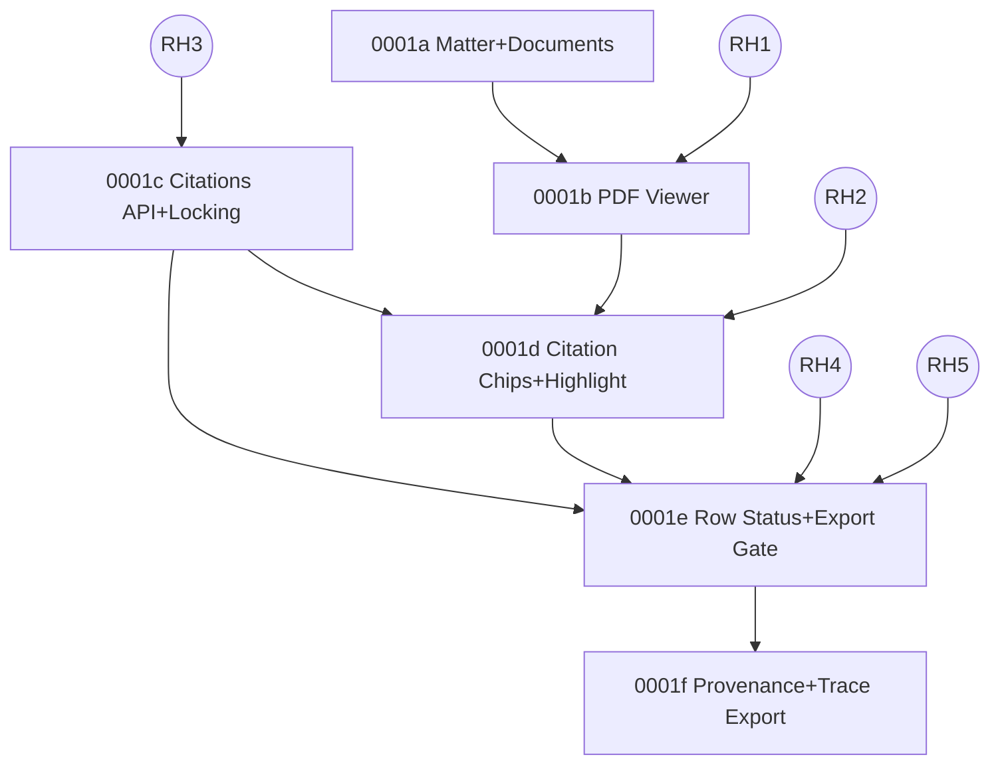

# Plan: 0001 Trust Substrate (From JSON PRDs)

Last updated: 2026-02-07

This plan is derived from the JSON PRDs in this dossier and is optimized for running parallel Ralph loops / agents with minimal overlap.

## Inputs (JSON PRDs)

- `docs/04-projects/02-features/0001_trust-substrate/prd-overall.json`
- `docs/04-projects/02-features/0001_trust-substrate/prds/0001a_matter-documents/prd.json`
- `docs/04-projects/02-features/0001_trust-substrate/prds/0001b_pdf-viewer/prd.json`
- `docs/04-projects/02-features/0001_trust-substrate/prds/0001c_citations-api-locking/prd.json`
- `docs/04-projects/02-features/0001_trust-substrate/prds/0001d_citation-chip-highlight/prd.json`
- `docs/04-projects/02-features/0001_trust-substrate/prds/0001e_row-status-export-failures/prd.json`
- `docs/04-projects/02-features/0001_trust-substrate/prds/0001f_provenance-trace-export/prd.json`

Key canonical contracts:

- API surface: `docs/03-architecture/50_api_surface.md`
- State model + invariants: `docs/03-architecture/20_state_model.md`
- Data model: `docs/03-architecture/30_data_model.md`
- Trust ADRs: `docs/03-architecture/DECISIONS.md`

## Goal

1. Make dependencies between stories explicit (in-slice, cross-slice, and spike gates).
2. Define “work lanes” with clean ownership boundaries so multiple agents can ship in parallel without stomping each other.

## Story Inventory (Slice PRDs)

These are the implementable slice PRDs under `prds/*/prd.json`. Story IDs repeat across slices, so always refer to them as `0001x.US-00y`.

| Slice | Story | Title | Depends On (in-slice) |
|---|---|---|---|
| `0001a` | `US-001` | Create and open a Matter |  |
| `0001a` | `US-002` | Upload PDFs and observe ingest status | `US-001` |
| `0001b` | `US-001` | Open and view a PDF |  |
| `0001b` | `US-002` | Page navigation and zoom stays responsive on scans | `US-001` |
| `0001c` | `US-001` | Fetch a locked citation by ID |  |
| `0001c` | `US-002` | Canonical snippet hashing is stable |  |
| `0001d` | `US-001` | Click citation chip -> open viewer at cited evidence |  |
| `0001d` | `US-002` | Evidence highlights align across zoom + rotation | `US-001` |
| `0001e` | `US-001` | Missing docs yields missing_input with checklist |  |
| `0001e` | `US-002` | Bad evidence yields citation_failed and blocks export | `US-001` |
| `0001e` | `US-003` | needs_review -> reviewed is explicit and persisted | `US-002` |
| `0001f` | `US-001` | Download run trace JSON |  |

## Story Inventory (Overall Spine PRD)

The overall PRD is a single end-to-end chain:

| Spine story | Depends on (spine) | Slice(s) that realize it |
|---|---|---|
| `overall.US-001` Matter baseline |  | `0001a.US-001` |
| `overall.US-002` Upload PDFs + ingest status | `overall.US-001` | `0001a.US-002` |
| `overall.US-003` View PDF (page nav + zoom) | `overall.US-002` | `0001b.US-001` + `0001b.US-002` |
| `overall.US-004` Locked citation object + hashing | `overall.US-003` | `0001c.US-001` + `0001c.US-002` |
| `overall.US-005` Citation chip -> highlight | `overall.US-004` | `0001d.US-001` + `0001d.US-002` |
| `overall.US-006` Row status + export gate | `overall.US-005` | `0001e.US-001` + `0001e.US-002` + `0001e.US-003` |
| `overall.US-007` Failure journeys + provenance export | `overall.US-006` | `0001e.*` + `0001f.US-001` |

## Spike Gates (Blocked-By Dependencies)

These are PRD-level gates (from `risksDependencies.blockedBy`) that block slices from being “GO”:

| Gate | Blocks slice(s) | Primary code/harness location(s) today |
|---|---|---|
| `RH1` pdf.js perf on scans | `0001b` | `apps/web/app/(app)/spikes/rh1-pdf-perf/*`, `apps/web/app/(api)/spikes/local-pdf/route.ts` |
| `RH2` overlay transforms | `0001d` | `apps/web/app/(app)/spikes/rh2-overlay/*`, `packages/core/src/geometry/*` |
| `RH3` snippet hash stability | `0001c` | `packages/core/src/citations/snippet.ts`, `packages/core/src/spikes/rh3_snippet_hash_harness.ts` |
| `RH4` verification precision/latency | `0001e` | `apps/web/app/(api)/spikes/rh4-verify/route.ts`, `packages/core/src/verify/verifier.ts`, `docs/04-projects/02-features/0001_trust-substrate/fixtures/rh4_verification_cases.json` |
| `RH5` missing-doc heuristics | `0001e` | `packages/core/src/missing-docs/*` (plus a harness to be executed/recorded) |

Spike execution + evidence must be recorded in:

- `docs/04-projects/02-features/0001_trust-substrate/spike-investigation.md`
- `docs/04-projects/02-features/0001_trust-substrate/spike-proofs/` (artefacts)

## Cross-Slice Dependencies (What Actually Couples Work)

PRD-level dependencies (from `risksDependencies.dependencies`) translated into concrete coupling points:

| Slice | Hard dependencies | Notes for parallel work |
|---|---|---|
| `0001a` Matter + docs | Postgres schema, object storage, OCR/layout adapter | Own the “Folder/Document” schema and endpoints first to unblock everything else. |
| `0001b` Viewer | `0001a` document ingestion provides `page_count`; storage render contract | Viewer and overlay harness both touch pdf.js wiring; keep one “pdf.js integration owner”. |
| `0001c` Citations API | citations schema; stable `document_id/page_number` identity | Implement hashing + schema once in `packages/core`; do not duplicate hashing rules in web app. |
| `0001d` Chips + overlay | `0001b` viewer; `0001c` citations API | UI wiring can progress in parallel with API work if the API response shape is stable (mock/fixture OK). |
| `0001e` Status + export gate | locked citations (ADR-0001); persisted report rows + runs; verifier + missing-doc heuristics | This slice couples product UX + hard server enforcement. Keep one owner for status invariants + export enforcement. |
| `0001f` Trace export | persisted runs + run_steps + report_rows provenance | Pairs naturally with `0001e` since it reads the same data. |

## Dependency Graph (Slices + Gates)

## Story-Level Dependency Matrix (Runnable Units)

This is the “agent scheduling” view: what must be true before a given story loop can safely merge.

Legend:

- `Gate:` must have a spike decision recorded (Pass, Cut, or Patch) and linked in `spike-investigation.md`.
- `Contract:` another loop must have landed the contract (API/db/core util) that this story consumes.

| Story (runnable unit) | Prereqs (stories) | Gate prereqs | Contract prereqs |
|---|---|---|---|
| `0001a.US-001` |  |  | API+DB contract for `folders` |
| `0001a.US-002` | `0001a.US-001` |  | API+DB contract for `documents` + upload init/complete + ingest statuses |
| `0001b.US-001` | `0001a.US-002` | Gate: `RH1` | Contract: `GET /documents/:id/render?page=N` (render_url semantics) |
| `0001b.US-002` | `0001b.US-001` | Gate: `RH1` | Contract: Range support + render cancellation semantics measured in harness |
| `0001c.US-001` |  | Gate: `RH3` | API+DB contract for locked citation payload (`GET /citations/:id`) |
| `0001c.US-002` |  | Gate: `RH3` | Contract: canonical `hashSnippet()` implementation is single-sourced |
| `0001d.US-001` | `0001b.US-001`, `0001c.US-001` | Gate: `RH2` | Contract: viewer accepts `page` + `citation` params; citation payload -> overlay render |
| `0001d.US-002` | `0001d.US-001` | Gate: `RH2` | Contract: polygon mapping util + fail-closed semantics proven (zoom/rotation) |
| `0001e.US-001` |  | Gate: `RH5` | Contract: missing-doc checklist shape + row invariants (`missing_input`) |
| `0001e.US-002` | `0001e.US-001`, `0001c.US-001`, `0001c.US-002` | Gate: `RH4` | Contract: server-enforced export gate returning `EXPORT_BLOCKED` |
| `0001e.US-003` | `0001e.US-002` |  | Contract: persisted row status transitions (`needs_review -> reviewed`) |
| `0001f.US-001` |  |  | Contract: `GET /runs/:id/trace` (ADR-0018) + safe trace schema |

Important: `0001e` and `0001f` also implicitly require the “run/report row persistence spine” (tables + APIs per `docs/03-architecture/*`). If those aren’t in place yet, treat that as a prerequisite foundation loop (owned by the same lane that owns DB/API).

## Work Lanes (Min Overlap)

The goal is to let multiple loops run concurrently while minimizing file/contract conflicts.

### Lane 0: Spike Closure (RH1-RH5)

Ownership boundary:

- Harness UI under `apps/web/app/(app)/spikes/*`
- Dev-only endpoints under `apps/web/app/(api)/spikes/*`
- Core utilities under `packages/core/src/*`
- Evidence under `docs/04-projects/02-features/0001_trust-substrate/spike-proofs/*`

Runnable units:

- `RH1`: run `/spikes/rh1-pdf-perf`, capture serial+spam artefacts (JSON + screenshots), record Pass/Patch/Cut.
- `RH2`: run `/spikes/rh2-overlay`, capture 50/100/150 + rotation + fail-closed artefacts, record Pass/Patch/Cut.
- `RH3`: run `packages/core/src/spikes/rh3_snippet_hash_harness.ts` twice, save outputs, record stability table.
- `RH4`: run verifier harness on `fixtures/rh4_verification_cases.json`, record false-pass=0 and latency, record Pass/Patch/Cut.
- `RH5`: run missing-doc heuristic harness against `pack_02_missing_rea` vs `pack_01_clean`, record FP=0, record Pass/Patch/Cut.

This lane can run in parallel with Lane 1, as long as it does not change the production contracts (only spike/harness code).

### Lane 1: DB + API Contract Backbone (Shared Foundation)

If multiple agents touch DB/API, you will get merge conflicts. Treat this lane as a single owner lane.

Ownership boundary:

- Target API endpoints live under `apps/web/app/api/**` (never under `/spikes/*`).
- Shared request/response Zod schemas live under `packages/core/src/**` and are imported into route handlers.

Deliverables that unblock many stories:

- Postgres connectivity and a migration story aligned with `docs/03-architecture/30_data_model.md`.
- Stable Zod schemas for:
  - folder/document identifiers and payloads
  - citation payload (`GET /citations/:id`)
  - report row shell + status invariants
  - standard error envelope (already exists in core; keep it single-source)

### Lane 2: 0001a Matter + Documents (Real, Not Fixtures)

Stories:

- `0001a.US-001` create/open matter
- `0001a.US-002` upload PDFs + ingest status

Hard dependencies:

- Lane 1 (DB/API backbone)

Coupling points to avoid overlap:

- Own `folders` + `documents` tables/migrations in one place.
- Define the canonical place for “state derivation” logic (derive from facts, keep monotonic transitions per `docs/03-architecture/20_state_model.md`).

### Lane 3: 0001b PDF Viewer (Render Contract + UX)

Stories:

- `0001b.US-001` open and view a PDF
- `0001b.US-002` performance + cancellation + Range requirement

Hard dependencies:

- `0001a.US-002` (documents exist and have `page_count`)
- Gate: `RH1` (or record a cut/patch)

Coupling points to avoid overlap:

- One “pdf.js integration owner” defines:
  - worker wiring
  - render cancellation behavior
  - canvas sizing rules (DPR, CSS pixels vs backing store)
  - the shared viewer component API consumed by overlay/highlight work

### Lane 4: 0001c Citations API + Locking Contract

Stories:

- `0001c.US-001` `GET /citations/:id` locked payload
- `0001c.US-002` canonical snippet hashing is stable

Hard dependencies:

- Gate: `RH3` (or record a cut/patch)

Coupling points to avoid overlap:

- `hashSnippet()` lives in `packages/core/src/citations/snippet.ts` only.
- Citation polygon coordinate spec is already implemented in core; do not introduce alternate mapping.

### Lane 5: 0001d Citation Chips + Click-to-Highlight

Stories:

- `0001d.US-001` chips -> open viewer at cited evidence
- `0001d.US-002` highlight alignment across zoom/rotation (fail closed)

Hard dependencies:

- `0001b.US-001` viewer can open a doc
- `0001c.US-001` citation payload endpoint exists
- Gate: `RH2` (or record cut/patch, e.g., “verified at 100% zoom only”, ADR-0020)

Coupling points to avoid overlap:

- Viewer surface area: agree on prop/URL contract for `page`, `citation`, `zoom`, `rotation`.
- Overlay surface area: treat overlay rendering as a “plugin” consuming `{viewBox, viewport, polygons}`.

### Lane 6: 0001e Row Statuses + Export Gate + Failure Journeys

Stories:

- `0001e.US-001` missing_input + checklist
- `0001e.US-002` citation_failed + export blocked (server-enforced)
- `0001e.US-003` reviewed transition persisted

Hard dependencies:

- Gate: `RH4`, `RH5` (or record cut/patch outcomes)
- `0001c` citation hashing contract (for mismatch detection)
- DB/API backbone for runs/report rows (Lane 1)

Coupling points to avoid overlap:

- One owner for the row status machine invariants and enforcement:
  - `missing_input` exact string + zero citations
  - `needs_review|reviewed` require >=1 locked citation
  - `citation_failed` requires safe reason codes
- Export gating must be enforced in the API boundary (not only UI).

### Lane 7: 0001f Provenance + Run Trace Export

Story:

- `0001f.US-001` download trace JSON (`GET /runs/:id/trace`, ADR-0018)

Hard dependencies:

- Runs/run_steps/report_rows persistence exists

Coupling points to avoid overlap:

- Trace schema must be “safe by default” (no raw PDF bytes, no provider payload dumps, avoid full extracted text).
- Treat this endpoint as admin-only (admin token) and avoid leaking signed URLs (ADR-0018).

## Suggested Parallel Schedule (Topological + Low Conflict)

This is a practical ordering that still allows concurrency.

1. Lane 1 (DB/API backbone) starts immediately and stays a single-owner lane.
2. Lane 0 (spikes) runs in parallel:
   - `RH3` can run in parallel with `RH1`/`RH2` since it touches core hashing + harness.
   - `RH4`/`RH5` can run in parallel but should not “invent” new statuses or reason codes (must align with `docs/03-architecture`).
3. Once Lane 1 lands the `folders/documents` contract, Lane 2 can land `0001a` stories.
4. Once `0001a.US-002` exists and `RH1` is closed, Lane 3 can land `0001b` stories.
5. Once `RH3` is closed, Lane 4 can land `0001c` stories.
6. Once `0001b` + `0001c` exist and `RH2` is closed (or cut), Lane 5 can land `0001d` stories.
7. Once `RH4`/`RH5` are closed (or cut/patch) and run/report persistence exists, Lane 6 can land `0001e` stories.
8. Lane 7 can land `0001f` alongside Lane 6 (same persistence dependencies).

## “Overlap Traps” (Things to Avoid)

- Two agents touching DB migrations at once.
- Duplicating hashing logic outside `packages/core`.
- Letting dev-only tracer bullets under `/matters` or `/spikes/*` silently become production paths.
- Adding new row statuses instead of storing per-item detail in payload/provenance.
- Implementing export gating only in UI (must be server-enforced).

## Definition of Done (Per Story Loop)

Each story loop should end with:

- Contract correctness vs `docs/03-architecture/*` (API, state model, data model).
- Fixture-driven verification on the relevant pack(s) mentioned in the PRD.
- If it is a spike-gated slice: evidence artefacts committed under `spike-proofs/` and a decision recorded in `spike-investigation.md`.

