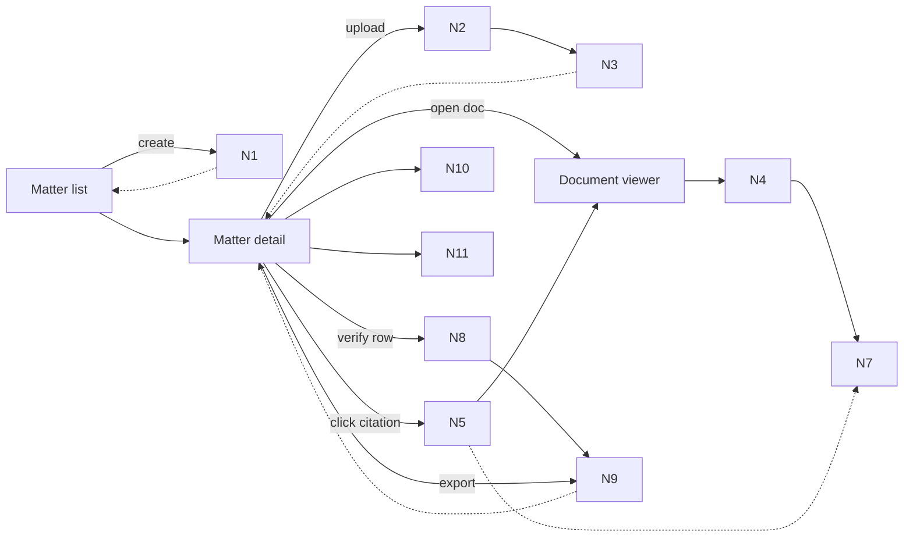
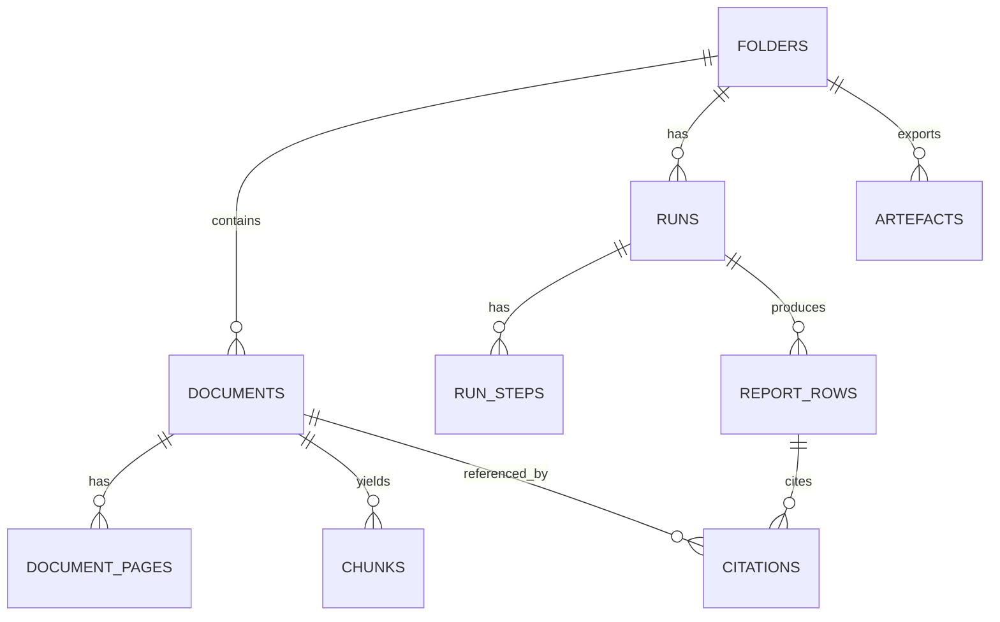

# Oracle Bundle (manual paste)

## Prompt
You are a senior engineer helping close the open rabbit holes (spikes) RH1–RH5 for Orbital PoC dossier:
- docs/04-projects/02-features/0001_trust-substrate/

Objective
Produce an execution-ready spike-closure playbook so an engineer can run each spike, collect evidence, and make a GO/NO-GO decision (or apply a Cut/Patch) with minimal wasted work.

Non-negotiable constraints / guardrails
- Next.js App Router + TypeScript (pnpm workspaces).
- Server-first data fetching; pdf.js viewer is client-only.
- Validate external inputs with Zod; API errors must use the safe error envelope (no internal leaks).
- Fail-closed is non-negotiable (ADR-0002): never render “best effort” highlights or allow export when invariants fail.
- No external web research inside product runs (ADR-0007). (You may reference external pdf.js docs/issues only as implementation guidance for these spikes.)

What I need from you
1) For each spike RH1..RH5, provide:
- Minimal build surface (what code to write, and suggested file paths).
- Step-by-step execution plan.
- Evidence to capture to consider the spike “closed” (screenshots, timing tables, logs, small JSON dumps).
- Clear pass/fail thresholds aligned to the success criteria in spike-investigation.md.
- Common pitfalls + mitigations.
- If PASS: what to proceed with in the slice PRDs.
- If FAIL: propose the smallest honest Cut or Patch that still preserves the trust UX principles. Be explicit about what acceptance criteria would change.

2) Provide a “Spike report template” section for each RH that can be pasted into docs/04-projects/02-features/0001_trust-substrate/spike-investigation.md (fields: date, environment, steps, results, decision, follow-ups, links to evidence).

3) Call out any inconsistencies or missing details in the current spike plans / risk register that would block execution. Propose concrete edits.

Context notes
- RH2 already has a prior Oracle response in docs/04-projects/02-features/0001_trust-substrate/tmp-oracle/oracle_response_0001.md. Build on it; avoid rehash unless you’re correcting/adding missing edge cases.

Data notes (not attached due to size limits)
- RH1 performance test PDFs (in repo; >1MB so not attached in this bundle):
  - docs/08-example-data/pack_07_scans_rotated_low_quality/docs/TitleCommitment_SCANNED_ROTATED.pdf
  - docs/08-example-data/pack_07_scans_rotated_low_quality/docs/ALTA_Survey_SCANNED_ROTATED.pdf
- Anchor fixture JSON and golden questions ARE attached.

Output format
- Use headings per spike: “RH1 …”, “RH2 …”, etc.
- Use checklists and small code snippets where helpful.
- Be opinionated; if you recommend a Cut/Patch, say exactly what it buys us and what we lose.

## Included files
- docs/04-projects/02-features/0001_trust-substrate/brief.md
- docs/04-projects/02-features/0001_trust-substrate/breadboard-pack.md
- docs/04-projects/02-features/0001_trust-substrate/risk-register.md
- docs/04-projects/02-features/0001_trust-substrate/spike-investigation.md
- docs/04-projects/02-features/0001_trust-substrate/prd.md
- docs/04-projects/02-features/0001_trust-substrate/prds/README.md
- docs/04-projects/02-features/0001_trust-substrate/tmp-oracle/oracle_response_0001.md
- docs/03-architecture/DECISIONS.md
- docs/03-architecture/20_state_model.md
- docs/03-architecture/30_data_model.md
- docs/03-architecture/40_rag_and_agents.md
- docs/03-architecture/50_api_surface.md
- docs/03-architecture/60_observability_and_evals.md
- docs/03-architecture/06_frameworks_agents_rag_evals.md
- apps/web/AGENTS.md
- docs/08-example-data/packs_summary.md
- docs/08-example-data/pack_01_clean/truth/golden_questions.json
- docs/08-example-data/pack_02_missing_rea/truth/golden_questions.json
- docs/08-example-data/pack_01_clean/layout/TitleCommitment.anchors.json
- docs/08-example-data/pack_01_clean/layout/ALTA_Survey.anchors.json
- docs/08-example-data/pack_07_scans_rotated_low_quality/layout/TitleCommitment.anchors.json
- docs/08-example-data/pack_07_scans_rotated_low_quality/layout/ALTA_Survey.anchors.json

---

## File: docs/04-projects/02-features/0001_trust-substrate/brief.md

````md
# Brief: 0001 Trust Substrate (Initiative 1)

## Context (why this, why now)
Trust UX is the product. Before any “Quick Start” generation is credible, we need an evidence layer that:
- stores citations as locked, immutable objects
- lets a reviewer click a citation chip and see the highlighted clause in a PDF viewer
- fails closed when evidence can’t be verified
- makes failure states explicit and actionable

This work is the foundation for Initiatives 002 (Quick Start engine) and 003 (demo-grade outputs). If trust fails, everything else is noise.

## Goals
- A user can create a **Matter** (API/DB: `folder`), upload PDFs, and view them reliably.
- Citations are first-class, immutable objects (`citation_id` references only).
- Clicking a citation opens the right document + page and overlays a highlight polygon with snippet + snippet hash.
- Row-level statuses are terminal for the workflow (`needs_review|reviewed|missing_input|citation_failed`) and export is blocked by default when any row is `citation_failed`.
- Failures are explicit and actionable: missing docs checklist, doc quality warnings, citation mismatch details.
- Minimum viable provenance exists so we can answer: “why did this row exist?”

## Non-goals
- Auth/RBAC, integrations, sharing, multi-tenant admin.
- External web research inside runs.
- A full retrieval/generation “Quick Start” (this dossier establishes the trust primitives it will use).
- Legal/materiality judgement.
- Fancy monitoring dashboards (structured logs + trace IDs only).

## Perimeter lock (in scope)
- **Matter (folder) baseline:** create folder, upload documents, list docs, view PDFs in a viewer with page navigation + zoom.
- **Citation UX scaffold:** seeded report rows + citation chips that jump to viewer and highlight evidence using fixture anchors (`docs/08-example-data/*/layout/*.anchors.json`).
- **Citation contract:** canonical, locked citation object + `GET /citations/:id` (snippet + `snippet_hash` + polygons + page).
- **Row status + gate:** status machine and “export blocked” behaviour when any row is `citation_failed` (code checks first; entailment verifier as a follow-on slice).
- **Failure journeys:** `missing_input` behaviour + missing-doc checklist, extraction quality warnings, citation mismatch UX, “flag citation wrong”.
- **Provenance + trace export:** minimal run trace export (developer-facing; no UI beyond a download button).
- **Fail-closed highlight behaviour:** highlights must only render when citation invariants hold (doc/page/polygons/snippet_hash); otherwise show explicit `citation_failed` and render no “best effort” overlay.

## Explicit out of scope
- Requiring perfect OCR-derived highlight geometry before we can prove the "trust moment".
  - We still treat OCR/layout extraction as the default ingest posture (ADR-0003).
  - For the highlight overlay spike (RH2), we use fixture anchors first to validate the mapping math, then swap to OCR-derived geometry later behind the same contracts.
- Any agent loops or free-form chat.
- Anything that requires per-firm templates or customization.

## Acceptance signals (fixture-driven)
- `pack_01_clean`
  - viewer renders; page nav is responsive
  - seeded row shows citation chips; click chip highlights correct region and shows snippet + `snippet_hash`
  - highlight remains aligned at 50/100/150% zoom (or we explicitly cut to “highlights verified at 100% only”)
- `pack_02_missing_rea`
  - rows that depend on missing docs are `missing_input` and include a missing-doc checklist
  - `missing_input` rows use the exact answer string: `Not found in provided documents.` and have zero citations (state model invariant)
- `pack_07_scans_rotated_low_quality`
  - viewer remains usable on scanned/rotated PDFs
  - doc quality warnings are visible (even if quality is initially stubbed)
  - highlight remains aligned on a rotated/scanned page (or we explicitly cut/patch with an honest evidence fallback)
- One deliberate bad citation (mismatching `snippet_hash`) yields `citation_failed` and export is blocked by default.

## Constraints / guardrails (must align with `docs/03-architecture`)
- Terminology: **Folder** is API/DB; UI calls it **Matter**. (`docs/03-architecture/20_state_model.md`)
- Evidence-first + citation locking (ADR-0001) and fail-closed verification (ADR-0002). (`docs/03-architecture/DECISIONS.md`)
- No external web research (ADR-0007).
- API error envelope; do not leak internals. (`docs/03-architecture/50_api_surface.md`, `docs/03-architecture/AGENTS.md`)
- State invariants are non-negotiable:
  - `missing_input` rows must have answer exactly `Not found in provided documents.` and zero citations.
  - exports are blocked by default when any row is `citation_failed` (and may also require `runs.state = completed`, per API surface).
- Validate inputs at boundaries with Zod; client/server module boundaries must remain clean. (`apps/web/AGENTS.md`)

## Risks / unknowns (treatments)
See `risk-register.md`. Biggest rabbit holes:
- pdf.js performance on scanned packs (`pack_07_scans_rotated_low_quality`)
- highlight overlay coordinate transforms across zoom
- snippet normalisation + stable hashing rules in practice
- verification precision (false passes) vs latency/cost
- missing-doc detection heuristics

## Open questions
- Appetite/timebox: are we shaping the full trust substrate perimeter above, or do we want to cut to “trust moment only” (viewer + click-to-highlight) first?
- Storage access pattern for pdf.js: signed URLs vs proxy endpoint?
- Verification v1: code checks only, or include an entailment model from day one?
- Minimum trace schema: what is required vs nice-to-have?

## PRD slices (to create only *after* spikes)
Per `docs/00-strategy/initiatives/prd-slicing-rules.md`, we will slice PRDs from the breadboard parts once spikes are closed:
1) Folder (matter) CRUD + upload + document list (baseline UI)
2) PDF viewer (page nav + zoom) + render URL endpoint
3) Citation chip UI + jump-to-page + highlight overlay (anchors-first)
4) Citation contract: lock + `GET /citations/:id` + snippet hashing util
5) Status machine + export gate + failure journeys UX
6) Provenance + run trace export (developer-facing)

Note:
- A draft `prd.md`/`prd.json` spine may exist in this dossier for handoff, but implementation should happen via thin slice PRDs once spikes are closed and the perimeter is re-locked.
- Slice PRDs for 0001 live under `prds/` (see `prds/README.md`).

## Shaping decision (GO/NO-GO)
NO-GO until spike items in `spike-investigation.md` are executed and outcomes are recorded, and the perimeter above is re-confirmed based on spike outcomes.

Oracle pass status:
- RH2 (highlight overlay): oracle review captured in `tmp-oracle/oracle_response_0001.md` (2026-02-06). Spike execution still pending.

````

---

## File: docs/04-projects/02-features/0001_trust-substrate/breadboard-pack.md

````md
# Breadboard Pack — 0001 Trust Substrate

## Context

- Appetite: TBD
- Problem: No baseline surface exists for viewing evidence, attaching citations, verifying claims, or showing failures. Trust must be established before any AI-driven work can be credible.
- Success: Matter + viewer works end-to-end; citations are real; verification is fail-closed; failures and provenance are explicit.
- Constraints: No auth/RBAC, no external web research, no full Quick Start generation (this is the trust substrate it depends on).
  - Highlight overlay spike (RH2) is anchors-first to validate mapping math quickly.
  - OCR/layout extraction remains the default ingest posture for PDFs (ADR-0003).
- Canonical references:
  - State invariants: `docs/03-architecture/20_state_model.md`
  - API contracts: `docs/03-architecture/50_api_surface.md`
  - Trust ADRs: `docs/03-architecture/DECISIONS.md`

## Current state

### What exists today

- Seed packs in `docs/08-example-data`.
- Anchor scaffolding in `docs/08-example-data/*/layout/*.anchors.json`.
- Web app scaffolding exists, but there is no confirmed Matter/Document/Viewer UI or API yet.

### Current flow (breadboard)

- _N/A_ (baseline surface does not exist yet).

## Proposed solution

### Proposed flow (breadboard)

- _Matter list (entry UI; API/DB calls it Folder)_
  - Create matter (folder)
  - -> Matter detail
- _Matter detail_
  - Upload documents
  - Document list + statuses
  - Report rows (seeded)
  - Citation chips
  - -> Document viewer
- _Document viewer_
  - Page navigation + zoom
  - Highlight overlay
  - Snippet + hash display
  - -> Back to Matter detail
- _Verification + failure UX_
  - Status badges per row
  - Export gate (blocked when citation_failed)
  - Missing docs checklist
  - Doc quality warnings
  - Flag citation wrong
- _Trace export (admin)_
  - Export run trace JSON

### Elements

- Matter list + detail views (folder CRUD)
- Upload pipeline + document list with ingest statuses
- PDF viewer (pdf.js) with page nav + zoom
- Citation chips + highlight overlay
- Verification status + export gate
- Failure taxonomy + warnings
- Provenance capture + trace export

## UI affordances

| # | Component / place | Affordance | Control | Wires out | Reads |
|---|---|---|---|---|---|
| U1 | Matter list | Create matter button | click | N1 create matter |  |
| U2 | Matter create modal | Name/description form + submit | type/click | N1 create matter |  |
| U3 | Matter detail | Upload dropzone + progress | drop/click | N2 upload pipeline | N3 doc status |
| U4 | Matter detail | Document list + status pills | click | N4 open viewer | N3 doc status |
| U5 | Matter detail | Report rows table | render |  | N9 row status |
| U6 | Matter detail | Citation chips per row | click | N5 fetch citation + N4 jump to page |  |
| U7 | Viewer | Page nav + zoom | click/scroll | N4 page render | N4 page state |
| U8 | Viewer | Highlight overlay + snippet | render | N7 map bbox to viewport | N5 citation payload |
| U9 | Matter detail | Export button + block state | click | N9 status gate | N9 row status |
| U10 | Matter detail | Missing docs checklist | render |  | N10 failure taxonomy |
| U11 | Matter detail | Doc quality warning | render |  | N3 doc metadata |
| U12 | Matter detail | Flag citation wrong action | click | N10 log feedback | N5 citation payload |
| U13 | Admin/trace | Export trace JSON | click | N11 trace export | N11 provenance store |

## Code affordances

| # | Component / service | Affordance | Control | Wires out / returns |
|---|---|---|---|---|
| N1 | Folders API (Matter CRUD) | `POST /folders` | call | creates `folder_id` |
| N2 | Upload service | init upload + put to storage + complete | call | `POST /folders/:id/documents` → upload target; `POST /documents/:id/complete` enqueues ingest |
| N3 | Documents store | ingest status + quality metadata | read/write | drives list state (`parse_status`, `ocr_status`, `extraction_quality`) |
| N4 | Viewer render contract | render URL + viewer state | call | `GET /documents/:id/render?page=N` returns `render_url`; viewer handles page nav + zoom |
| N5 | Citations API | `GET /citations/:id` | call | locked citation payload `{document_id,page_number,polygons,snippet,snippet_hash}` |
| N6 | Anchor fixture loader | map fixture anchor IDs to polygons | call | returns polygons for highlight scaffold |
| N7 | Highlight renderer | anchor polygons → viewport CSS pixels | call | maps normalised anchors (`[0..1]`, origin top-left) → viewport CSS px via `viewBox` + `viewport.convertToViewportPoint()`; returns overlay geometry for rendering |
| N8 | Verification pipeline | code checks + (optional) entailment | call | returns verdict + failure reason code |
| N9 | Row status machine | status invariants + export gate | write | sets row status + blocks export by default on `citation_failed` |
| N10 | Failure logger | taxonomy + structured logs | write | emits safe failure events |
| N11 | Provenance store | minimal trace schema + export | write/call | returns run trace JSON |

## Viewer architecture (Next.js App Router)

This is a minimal, clean server/client boundary that keeps pdf.js imperative work on the client while fetching data server-first.

- `app/(app)/matters/[folderId]/page.tsx` (Server): fetch folder + docs + seeded report rows; render citation chips as `<Link>` to the viewer.
- `app/(app)/viewer/[documentId]/page.tsx` (Server): read `searchParams` (`page`, optional `citation`, optional `zoom`), server-fetch `render_url` and (if present) locked citation payload; pass minimal props to client viewer.
- `PdfViewerClient` (Client): owns pdf.js load/render and page/zoom/rotation state; renders canvas + overlay; surfaces explicit failure states.
- `HighlightOverlaySvg` (Client): maps polygons to viewport CSS pixels (pure util) and renders an `<svg>` overlay sized to `viewport.width/height`.

### Fail-closed behaviour (viewer)
- If a citation is present but any invariants fail (doc mismatch, page out of range, polygons invalid/out of range, `render_url` unavailable), do not render an overlay. Show an explicit `citation_failed` UI state and emit a safe failure log.

## Wiring diagram

- Legend:
  - **Solid** = calls / triggers / writes
  - **Dashed** = returns / store reads



## Parts list (BOM)

| Part | Name | Mechanism |
|---|---|---|
| F1 | Matter + upload baseline | Create matter, upload docs, show status list |
| F2 | PDF viewer | pdf.js viewer with page nav + zoom |
| F3 | Citation UI | Chips + jump-to-page + highlight overlay |
| F4 | Citation model + API | Canonical citation schema + `GET /citations/:id` |
| F5 | Verification gate | Status machine + verifier + export block |
| F6 | Failure UX | Missing docs + quality warnings + flag action |
| F7 | Provenance trace | Capture model/prompt/inputs + trace export |

## Fit check: requirements × concept

| Req | Requirement | Status | Fit |
|---|---|---|---|
| R1 | Matter creation + upload + view | core goal | ✅ |
| R2 | Citation chips + click-to-highlight | core goal | ⚠️ (depends on transform spike) |
| R3 | Canonical citation API | must-have | ✅ |
| R4 | Fail-closed verification | must-have | ⚠️ (depends on verifier spike) |
| R5 | Failure UX (missing docs, quality) | must-have | ⚠️ (depends on heuristics spike) |
| R6 | Provenance + trace export | must-have | ✅ |

### Unsolved

- R2: Can we reliably map anchor geometry across zoom levels?
- R4: Can we achieve high-precision verification without false passes?
- R5: Can missing-doc detection be accurate on noisy packs?

## Rabbit holes, cuts, and no-gos

### Rabbit holes

- PDF highlight coordinate transforms across zoom.
- Snippet canonicalisation + hash stability.
- Verification precision/latency trade-offs.

### Cuts / scope trims

- Do not require perfect OCR-derived highlight geometry before we can prove the trust UX. Use anchor fixtures first, then swap to OCR-derived geometry behind the same contracts.
- No advanced trace UI (endpoint/export only).

### Out of bounds / no-gos

- Auth/RBAC, integrations, external research.

## Optional: Extract vs duplicate analysis

Not applicable (no comparable existing feature).

## PRD slicing (record only; slice PRDs after spikes are closed)
Per `docs/00-strategy/initiatives/prd-slicing-rules.md`, slices should map to parts (F#) and affordances (U#/N#):
- Slice A (F1, U1–U4, N1–N3): Matter (folder) CRUD + upload pipeline + doc list statuses
- Slice B (F2, U7, N4): PDF viewer + render URL contract
- Slice C (F3, U6–U8, N5–N7): Citation chips + jump-to-highlight (anchors-first)
- Slice D (F4, N5): Citation locking + hashing util + citations API
- Slice E (F5–F6, U9–U12, N8–N10): Status machine + export gate + failure journeys
- Slice F (F7, U13, N11): Provenance capture + trace export

Notes:
- A draft `prd.md`/`prd.json` “spine” may exist in this dossier for handoff, but implementation should happen via thin slice PRDs once spikes are closed and the perimeter is re-locked.
- Slice PRDs for 0001 live under `prds/` (see `prds/README.md`).

````

---

## File: docs/04-projects/02-features/0001_trust-substrate/risk-register.md

````md
# Risk register (rabbit holes)

Treatments must be one of: `Cut` / `Patch` / `Spike` / `Out-of-bounds`.

| ID | Rabbit hole | Category | Packs to prove | Treatment | Mitigation (concrete) | Status |
|---|---|---|---|---|---|---|
| RH1 | pdf.js performance on scanned/rotated PDFs (page jumps, zoom) | technical | `pack_07_scans_rotated_low_quality` | Spike | Build a minimal viewer + page-jump harness; measure render times; patch with skeletons + progressive rendering if needed. | open |
| RH2 | Highlight overlay coordinate transforms across zoom levels | technical | `pack_01_clean`, `pack_07_scans_rotated_low_quality` | Spike | Pick a single coordinate spec (normalised [0..1], origin top-left) + implement mapping util: norm -> PDF points via page `viewBox` -> `viewport.convertToViewportPoint()`; render overlay in viewport CSS pixels (not canvas backing store). Prove invariance at 50/100/150% zoom + rotation + fail-closed cases. Fallback (Cut): lock citation highlight to 100% zoom. Fallback (Patch): render+crop “evidence card” instead of live overlay alignment. | open |
| RH3 | Snippet normalisation + stable `snippet_hash` rule works in practice | data | `pack_01_clean` | Spike | Implement canonical `normalise()` exactly per `docs/03-architecture/30_data_model.md` (trim; CRLF->LF; collapse whitespace runs to a single space) and reuse it everywhere (ideally `packages/core`). Validate hash stability across repeated runs with the same source snippet. | open |
| RH4 | Verification avoids false passes at acceptable latency/cost | technical | negative set across `pack_01_clean`, `pack_02_missing_rea` | Spike | Start with code checks; if entailment is required, tune for precision-first (0 false passes target) and accept more `citation_failed`. | open |
| RH5 | Missing-doc detection heuristics are reliable (low false positives) | data | `pack_02_missing_rea` vs `pack_01_clean` | Spike | Heuristics: referenced instrument IDs/filenames → docs present; patch with manual confirm UX if heuristics are noisy. | open |
| RH6 | Provenance/log volume and PII risk | security/design | all | Patch | Keep trace schema minimal, safe, and redacted by default; store opaque IDs + hashes, not raw provider payloads. | open |
| RH7 | Storage access pattern for pdf.js (signed URLs vs proxy) | dependency/security | all | Patch | Decide one contract early; prefer signed render URLs (`GET /documents/:id/render?page=N`) and avoid proxying raw PDFs through the app unless needed. | open |
| RH8 | Client/server boundary mistakes with viewer + APIs (Next.js App Router) | architecture | all | Patch | Enforce `client-only`/`server-only` boundaries; viewer is client; APIs validate with Zod and return safe error envelopes. | open |

## Notes
- Per `docs/00-strategy/initiatives/prd-slicing-rules.md`, slice PRDs should not be created until Spike items are closed (or explicitly Cut/Out-of-bounds).
- A draft `prd.md`/`prd.json` “spine” can exist pre-spike, but treat it as blocked until spikes are closed and perimeter is re-locked.
- Oracle review is mandatory per Spike (bundle + notes captured in `spike-investigation.md`).

````

---

## File: docs/04-projects/02-features/0001_trust-substrate/spike-investigation.md

````md
# Spike investigation — Trust substrate

> Status: planned only. No spikes executed yet.
> Oracle pass: RH2 highlight overlay reviewed (2026-02-06). See `tmp-oracle/oracle_response_0001.md`.

## Spike plan — PDF viewer performance on noisy scans

### Question
Can pdf.js render and page-jump on scanned/rotated PDFs (e.g. `docs/08-example-data/pack_07_scans_rotated_low_quality/docs/TitleCommitment_SCANNED_ROTATED.pdf`) without UI freezing?

### Context
- Feature / concept: 1.1 Matter + document viewer baseline
- Related requirement(s): R1
- Why now: baseline UX depends on acceptable navigation performance

### Success criteria
Proof looks like:
- Page jump completes in <1s per jump on dev machine
- Viewer remains responsive during rapid navigation

### Timebox
- Start: TBD
- Hard stop: TBD (2–4 hours)

### Scope
Include:
- Minimal viewer page with pdf.js rendering
- Programmatic page-jump test harness

Exclude:
- Highlight overlays, citations, verification

### Approach
- Step 1: Load the scanned PDF in a minimal viewer page
- Step 2: Implement page-jump control + measure render times
- Step 3: Record timing + responsiveness results

### Artefacts
Keep:
- Notes + timing table
- Minimal viewer branch or snippet

Throw away:
- Any UI polish beyond functional test

### Expected outcomes
- If straight shot: proceed with pdf.js viewer baseline
- If tangle: patch by limiting max page size or adding loading skeletons
- If fog: consider alternative viewer or async render strategy

---

## Spike plan — Highlight overlay transform across zoom

### Question
Can we map anchor geometry to the viewer viewport correctly at 50%, 100%, and 150% zoom?

### Context
- Feature / concept: 1.2 Citation chips -> click-to-highlight
- Related requirement(s): R2
- Why now: highlight alignment is core trust affordance

### Success criteria
Proof looks like:
- Highlight aligns on at least one commitment PDF and one survey PDF
- Alignment remains correct at 50%, 100%, 150% zoom

### Timebox
- Start: TBD
- Hard stop: TBD (4–6 hours)

### Scope
Include:
- One PDF with anchors
- Overlay renderer with bbox/polygon support

Exclude:
- Citation chips UI and data model

### Key decisions (pre-spike)
- Canonical polygon spec (fixtures + locked citations): normalised page coordinates in `[0..1]`, origin top-left, relative to the unrotated page `viewBox`.
- Mapping: normalised -> PDF points via `viewBox` -> viewport CSS pixels via `viewport.convertToViewportPoint()`. Overlay is rendered in `viewport.width/height` CSS pixels (never canvas backing store pixels).
- Fail-closed: if any invariants break (doc mismatch, page out of range, invalid polygons, render URL missing), do not draw a “best effort” highlight.

### Approach (fixture-backed mini-eval)
1. Build a dev-only spike harness route:
   - `app/(app)/__spikes/rh2-overlay/page.tsx`
   - Controls: pack selector (`pack_01_clean`, `pack_07_scans_rotated_low_quality`), doc selector, page number (1-indexed), anchor id, zoom 50/100/150, rotation 0/90/180/270.
   - Debug HUD: pack/doc/page/anchor, `scale`, `totalRotation`, `viewport.width/height`, `canvas.width/height` and CSS size, `devicePixelRatio`.

2. Implement the pure mapping util (unit-testable):
   - `xPdf = xMin + xNorm * (xMax - xMin)`
   - `yPdf = yMax - yNorm * (yMax - yMin)` (top-left normalised -> bottom-left PDF)
   - `[xCss, yCss] = viewport.convertToViewportPoint(xPdf, yPdf)`

3. Prove alignment at 100% (pack_01):
   - One commitment page anchor + one survey anchor.
   - Evidence: screenshot at 100% with HUD visible.

4. Prove zoom invariance (50/100/150):
   - For each case: screenshot at 50/100/150 with HUD visible.
   - Compute overlay bbox (min/max x/y in CSS px) and assert:
     - `bbox50 ~= bbox100 * 0.5` (within ~1–2 CSS px)
     - `bbox150 ~= bbox100 * 1.5` (within ~1–2 CSS px)

5. Prove rotation correctness (pack_07):
   - Ensure page-intrinsic rotation (`page.rotate`) and user rotation are handled consistently.
   - Evidence: screenshots at rotation=0 and rotation=90 (or whatever reproduces the pack_07 orientation).

6. Prove fail-closed:
   - Inject one deliberate bad anchor (out of `[0..1]`) and one wrong page number.
   - Evidence: screenshot of explicit failure UI + logged safe error code.

### Artefacts
Keep:
- Screenshots (50/100/150 + rotation + fail-closed) with HUD visible.
- A small JSON log dump (bbox numbers + HUD values).
- Notes on pitfalls encountered (DPR, rotation, `viewBox` origin, CSS transforms).

Throw away:
- Full citation UI integration

### Evidence capture tooling (options)
- Manual: Chrome DevTools node screenshots (fastest).
- Automated: Playwright (preferred if already wired in repo).
- `browser-use` (CLI, persistent session): good for scripted screenshots with a stable open->state->click/input loop.
  - Workflow: `open` -> `state` -> act by index -> `screenshot` -> re-`state` after any navigation/submit.
  - Sessions: use `--session rh2` so the browser persists across commands.
  - Example (headful):
    ```bash
    browser-use --session rh2 --browser chromium --headed open http://localhost:3000/__spikes/rh2-overlay
    browser-use --session rh2 state
    browser-use --session rh2 screenshot
    ```
  - If `browser-use` is not available locally, follow `.agents/skills/00-utilities/browser-use/SKILL.md` (uvx one-off vs permanent install).
- `agent-browser` (CLI): good for scripted screenshots if installable (snapshot + `@e1` refs). Requires npm install + a Chromium download; can also point at a system Chrome via an executable-path setting. Note: `agent-browser` is not currently installed and npm registry access may be blocked in this environment.

### Expected outcomes
- If straight shot: proceed with overlay layer
- If tangle: cut to “highlight verified at 100% zoom only” (lock zoom while citation is active)
- If fog: patch to “evidence crop card” (render-and-crop bbox instead of live overlay alignment)

### Oracle pass
- Bundle: `tmp-oracle/oracle-bundle_0001_trust-substrate_RH2_highlight-overlay.md`
- Response: `tmp-oracle/oracle_response_0001.md` (coordinate spaces + mapping + spike plan + pitfalls + fallbacks)

---

## Spike plan — Canonical snippet + hash stability

### Question
Does the canonical `normalise()` rule for `snippet_hash` (defined in `docs/03-architecture/30_data_model.md`) produce stable hashes for citations in practice?

### Context
- Feature / concept: 1.3 Citation data model + API
- Related requirement(s): R3
- Why now: hash stability is required for verification and idempotency

### Success criteria
Proof looks like:
- Hash remains stable across two reprocessing runs
- Snippet is human-readable and matches displayed text

### Timebox
- Start: TBD
- Hard stop: TBD (2–4 hours)

### Scope
Include:
- Two PDFs with known snippets
- Implement canonical normalisation once and reuse it everywhere

Exclude:
- LLM verification

### Approach
- Step 1: Extract candidate snippets + normalize
- Step 2: Compute hashes across runs
- Step 3: Compare stability and human readability

### Artefacts
Keep:
- Normalization rules
- Hash stability table

Throw away:
- Any full ingestion pipeline work

### Expected outcomes
- If straight shot: codify normalization + hash util
- If tangle: patch by pinning to anchor_id + snippet_hash (keep both), or by storing chunk_id + index_version as the authoritative reference
- If fog: restrict to anchor JSON only

---

## Spike plan — Verification precision (false passes)

### Question
Can we achieve zero false passes on 20 hand-curated bad examples at acceptable latency?

### Context
- Feature / concept: 1.4 Verification gate
- Related requirement(s): R4
- Why now: trust depends on fail-closed verification

### Success criteria
Proof looks like:
- 0 false passes on curated bad set
- Latency per row within acceptable budget (TBD)

### Timebox
- Start: TBD
- Hard stop: TBD (1–2 days)

### Scope
Include:
- Small curated dataset across packs
- One verification prompt + rubric

Exclude:
- Full UI integration

### Approach
- Step 1: Build curated set (good vs bad)
- Step 2: Run verifier and record outcomes
- Step 3: Adjust rubric/prompt for precision

### Artefacts
Keep:
- Curated dataset list
- Prompt + rubric
- Results summary

Throw away:
- Any production infrastructure

### Expected outcomes
- If straight shot: proceed with verifier + gate
- If tangle: patch to stricter heuristic checks before LLM
- If fog: cut verification to code-based checks only

---

## Spike plan — Missing-doc detection heuristics

### Question
Can we reliably detect “referenced but missing” docs in `pack_02_missing_rea` without false flags on `pack_01_clean`?

### Context
- Feature / concept: 1.5 Failure journeys
- Related requirement(s): R5
- Why now: missing-doc UX depends on accurate detection

### Success criteria
Proof looks like:
- Missing docs identified in `pack_02_missing_rea`
- No false missing-doc flags in `pack_01_clean`

### Timebox
- Start: TBD
- Hard stop: TBD (4–6 hours)

### Scope
Include:
- Simple doc matching heuristics
- Two packs for evaluation

Exclude:
- Full ingestion + retrieval

### Approach
- Step 1: Define matching heuristics (title/filename/token match)
- Step 2: Evaluate against both packs
- Step 3: Record false positives/negatives

### Artefacts
Keep:
- Heuristic definitions + results table

Throw away:
- Production ingestion changes

### Expected outcomes
- If straight shot: implement missing-doc checklist
- If tangle: patch to manual user-confirmed missing docs
- If fog: cut missing-doc detection to admin-only

---

## Spike reports (pending)

No spike reports yet (spikes not executed). After each spike, add a report section. Oracle pass is required per spike; RH2 oracle pass is already captured.

## Oracle bundles
Keep oracle bundles/notes in `tmp-oracle/` so they are git-tracked and easy to re-run/review.

- RH2 bundle: `tmp-oracle/oracle-bundle_0001_trust-substrate_RH2_highlight-overlay.md`
- RH2 response: `tmp-oracle/oracle_response_0001.md`

````

---

## File: docs/04-projects/02-features/0001_trust-substrate/prd.md

````md
# PRD: 0001 Trust Substrate (Evidence Viewer + Click-to-Highlight)

Owner: marc
Status: Draft (Blocked by RH1-RH5 spikes)
Date: 2026-02-07
Slug: 0001-trust-substrate

## Introduction / Overview

### Problem
Orbital's product UX must be trustworthy before any "Quick Start" generation is credible. Today we don't have an evidence layer that can:
- present source PDFs reliably
- lock citations as immutable objects
- let a reviewer click a citation and see the clause highlighted
- fail closed when evidence cannot be verified (no "almost right" trust leakage)
- make failure states explicit and actionable

### Goal
Ship a fixture-driven evidence surface where a reviewer can click a citation chip and see the correct clause highlighted with a snippet + `snippet_hash`, and where failures are explicit and block export by default.

### Slice
This dossier is an initiative-level PRD spine. Implementation should happen via thin slices (see `breadboard-pack.md`), but the end state is a single "trust moment" flow:
Matter (Folder) -> citation chip -> PDF viewer -> verified highlight overlay + snippet/hash, with fail-closed behavior and export gating.

Slice PRDs (implementation-ready):
- See `prds/README.md` for thin slice PRDs derived from the breadboard parts list.

### Primary Observable Effect
- Reviewers can open a Matter, navigate its documents, and inspect evidence.
- Clicking a citation opens the right document/page and overlays a highlight that stays aligned across zoom/rotation (or we explicitly cut/patch with an honest fallback).
- When citation invariants fail, the UI shows `citation_failed`, renders no overlay, and blocks export by default.

### In Scope
- Matter (Folder) baseline: create folder, upload PDFs, list docs, open viewer.
- PDF viewer: page navigation + zoom (pdf.js).
- Citation contract: locked citation object + `GET /citations/:id` with polygons + snippet + `snippet_hash`.
- Click-to-highlight UX scaffold: seeded report rows + citation chips that jump to viewer and render highlight using fixture anchors (`docs/08-example-data/*/layout/*.anchors.json`).
- Row statuses + export gate: export blocked by default when any row is `citation_failed`.
- Failure journeys: missing-doc checklist, citation mismatch details, "flag citation wrong".
- Provenance: minimal run trace export (developer-facing).

## Goals
- Establish a credible "trust moment" in fixture packs (`pack_01_clean`, `pack_02_missing_rea`, `pack_07_scans_rotated_low_quality`).
- Make trust failures explicit and actionable (no silent failure, no best-effort highlights).
- Keep server/client boundaries clean (server-first fetching; viewer is client-only).

## User Stories

### US-001: Matter baseline (Folder CRUD + detail surface)
As a reviewer, I want to create and open a Matter so that I can review evidence for a specific deal.

#### Acceptance Criteria
- AC-001: I can create a Matter (API/DB: `folder`) and see it in a Matter list.
- AC-002: I can open a Matter detail page that shows a document list and a seeded report table.

#### Verification
- Pack/fixture/script: `docs/08-example-data/pack_01_clean/`
- Manual checks: create Matter, open Matter detail, confirm seeded report rows render.

### US-002: Upload PDFs and show ingest status
As a reviewer, I want to upload PDFs into a Matter so that the evidence is available in the viewer.

#### Acceptance Criteria
- AC-003: I can upload a PDF into a Matter and see it appear in the document list.
- AC-004: The document list shows ingest status and basic quality metadata fields (even if stubbed).

#### Verification
- Pack/fixture/script: `docs/08-example-data/pack_01_clean/`, `docs/08-example-data/pack_07_scans_rotated_low_quality/`
- Manual checks: upload both a clean PDF and a scanned/rotated PDF; confirm both are viewable.

### US-003: View a PDF (page nav + zoom) via render contract
As a reviewer, I want a reliable PDF viewer with page navigation and zoom so that I can inspect the underlying evidence.

#### Acceptance Criteria
- AC-005: Viewer renders the correct PDF and can navigate to any page.
- AC-006: Zoom controls re-render consistently (no CSS-scaling drift) and the viewer stays responsive on `pack_07` scans.
- AC-007: Viewer obtains `render_url` via `GET /documents/:id/render?page=N` (server contract, 1-indexed `page`) rather than hardcoding storage paths.

#### Verification
- Pack/fixture/script: `docs/08-example-data/pack_07_scans_rotated_low_quality/`
- Manual checks: rapidly page-jump; confirm UI remains responsive and render time is acceptable (see RH1).

### US-004: Locked citation object + hashing contract
As a reviewer, I want each citation to be a locked object with a snippet + `snippet_hash` so that evidence is immutable and verifiable.

#### Acceptance Criteria
- AC-008: `GET /citations/:id` returns locked payload `{document_id,page_number,polygons,snippet,snippet_hash}`.
- AC-009: `snippet_hash` uses canonical normalisation rules (single implementation reused everywhere) and is stable across repeated processing (see RH3).

#### Verification
- Pack/fixture/script: `docs/08-example-data/pack_01_clean/`
- Manual checks: open a citation in UI; confirm snippet and hash are displayed and match API payload.

### US-005: Citation chip -> jump-to-highlight (anchors-first, fail-closed)
As a reviewer, I want to click a citation chip and see the referenced clause highlighted so that I can trust the report row.

#### Acceptance Criteria
- AC-010: Clicking a citation chip opens the viewer at the correct document + page.
- AC-011: Highlight overlay maps locked polygons to viewport CSS pixels correctly at 50/100/150% zoom (or the UI explicitly enforces the chosen honest fallback).
- AC-012: On rotated/scanned pages (`pack_07`), highlight remains aligned (or the UI explicitly enforces the chosen honest fallback).
- AC-013: If citation invariants fail (doc mismatch, invalid polygons, wrong page, `snippet_hash` mismatch), the UI renders no overlay and shows explicit `citation_failed` details.

#### Verification
- Pack/fixture/script: anchors from `docs/08-example-data/*/layout/*.anchors.json`
- Manual checks: use the RH2 spike harness plan; capture screenshots at 50/100/150 with HUD visible.

### US-006: Row status machine + export gate (fail closed)
As a reviewer, I want report rows to have terminal statuses and exports to be blocked when evidence fails so that we never ship untrusted output.

#### Acceptance Criteria
- AC-014: Rows can be in terminal statuses: `needs_review|reviewed|missing_input|citation_failed` and statuses are visible in the report table.
- AC-015: One deliberate bad citation produces `citation_failed` and export is blocked by default when any row is `citation_failed`.

#### Verification
- Pack/fixture/script: include at least one deliberate bad citation fixture (`snippet_hash` mismatch) in `pack_01_clean` flow.
- Manual checks: verify export is blocked with explicit reason.

### US-007: Failure journeys + provenance export
As a reviewer, I want missing-doc and quality failures to be actionable, and as a developer I want a trace export so that failures can be debugged without guesswork.

#### Acceptance Criteria
- AC-016: In `pack_02_missing_rea`, rows that depend on missing docs are `missing_input` and show an actionable missing-doc checklist.
- AC-016a: `missing_input` rows use the exact answer string `Not found in provided documents.` and have zero citations (state model invariant).
- AC-017: The UI can export a minimal run trace JSON (developer-facing) with safe redaction defaults (opaque IDs + hashes, no raw provider payloads).
- AC-018: "Flag citation wrong" action logs a safe feedback event with citation_id + reason code.

#### Verification
- Pack/fixture/script: `docs/08-example-data/pack_02_missing_rea/`
- Manual checks: verify missing-doc checklist appears; download trace export; verify feedback action produces a log/event.

## Functional Requirements

- FR-001: The UI must call the entity a "Matter", but API/DB terminology remains "Folder" (`folder_id`).
- FR-002: All external inputs at route/API boundaries must be validated with Zod and return the safe error envelope (no internal leak).
- FR-003: The PDF viewer must render in a client component; server components fetch `render_url` and citation payloads server-first.
- FR-004: Canonical polygon coordinate spec:
  - store citation polygons as normalised `[0..1]` page coordinates, origin top-left, relative to unrotated page `viewBox`.
  - map to viewport CSS pixels via `viewBox` -> `viewport.convertToViewportPoint()`.
- FR-005: Highlight overlay must be rendered in viewport CSS pixel space (`viewport.width/height`), not canvas backing store pixels.
- FR-006: Fail-closed highlight: if any citation invariants fail, render no overlay and show explicit `citation_failed` state.
- FR-007: Row status machine must block export by default when any row is `citation_failed`.
- FR-007a: Export is only allowed when `runs.state = completed` (PoC default), and returns `EXPORT_BLOCKED` when any row is `citation_failed` unless an explicit demo-only override is enabled.
- FR-008: Failure journeys must be user-visible (missing docs, citation mismatch details, doc quality warnings).
- FR-009: Provenance trace export must be minimal and safe (redact by default; hashes/IDs preferred).

## Non-Goals (Out of Scope)
- Auth/RBAC, sharing, multi-tenant admin.
- External web research inside runs.
- Full Quick Start generation (Initiative 0002).
- Legal/materiality judgement.
- Requiring perfect OCR-derived highlight geometry before we can prove the trust UX.
  - OCR/layout extraction remains the default ingest posture for PDFs (ADR-0003).
  - We use fixture anchors first to validate highlight overlay mapping, then swap to OCR-derived geometry behind the same contracts.

## Design Considerations (Optional)
- Viewer UI states: loading skeleton, render error, page-out-of-range, citation_failed panel, citation details panel (snippet + hash).
- Accessibility: citation chips must be keyboard navigable; viewer controls must be accessible; error states must be readable (no color-only).

## Technical Considerations (Optional)
- Viewer architecture: see `breadboard-pack.md` and oracle notes `tmp-oracle/oracle_response_0001.md` (RH2).
- Coordinate math: treat `devicePixelRatio`, `page.rotate`, and non-zero `viewBox` origins as first-class (common drift sources).
- Evidence capture for RH2: prefer automation only if installable in this environment; otherwise commit manual screenshots with HUD visible.

## Failure States & UX

No silent failures. Examples:
- Missing doc(s): detect -> row `missing_input` -> show checklist -> allow upload/retry.
- Citation invariant failure (`snippet_hash` mismatch, invalid polygons, wrong page): detect -> row `citation_failed` -> show details + "flag citation wrong" -> block export by default.
- Viewer render failure (`render_url` unavailable): show explicit error panel with safe error code + retry.

## Metrics / Logging
- Success signals:
  - `citation_click_to_highlight_success_rate` (target: 100% on fixture packs)
  - `export_block_rate_due_to_citation_failed` (should match deliberate bad fixtures; no false positives on clean fixtures)
- Debug signals:
  - structured logs for `citation_overlay_rendered`, `citation_overlay_failed` (reason code), `viewer_page_render_ms`, `export_blocked`

## Rollback / Disable Plan
- Feature flag: `FEATURE_TRUST_SUBSTRATE` (default: off until spikes closed)
- Safe fallback behavior: when disabled, hide export and citation highlight features (no partial trust UX).

## Risks & Dependencies
- Spikes (must close or cut/patch):
  - RH1 pdf.js perf on scans
  - RH2 highlight overlay transforms across zoom/rotation
  - RH3 snippet normalisation/hash stability
  - RH4 verifier precision (0 false passes target) vs latency/cost
  - RH5 missing-doc heuristics false positives
- Security/design: provenance volume + PII risk (RH6).
- Contract choice: signed render URLs vs proxy (RH7).

## Success Metrics
- Fixture-driven demo passes:
  - `pack_01_clean`: citation click-to-highlight works; deliberate bad citation blocks export.
  - `pack_02_missing_rea`: missing-doc checklist shown; export behavior consistent.
  - `pack_07_scans_rotated_low_quality`: viewer remains usable; evidence is inspectable; highlight is honest (aligned or explicitly cut/patch).

## Open Questions
- Appetite/timebox: full perimeter now vs cut to "trust moment only" first?
- Storage access pattern for pdf.js: signed URLs vs proxy endpoint?
- Verification v1: code checks only, or include entailment model from day one?
- Canonical evidence capture approach for RH2 regression: manual screenshots vs automated harness (Playwright/agent-browser/etc)?

## Sources
- `docs/04-projects/02-features/0001_trust-substrate/brief.md`
- `docs/04-projects/02-features/0001_trust-substrate/breadboard-pack.md`
- `docs/04-projects/02-features/0001_trust-substrate/risk-register.md`
- `docs/04-projects/02-features/0001_trust-substrate/spike-investigation.md`
- `docs/04-projects/02-features/0001_trust-substrate/tmp-oracle/oracle_response_0001.md` (RH2)

## Appendix: Shaping Notes (Optional)

### RH2 mapping summary (anchors-first)
- Store polygons as normalised `[0..1]` coords (origin top-left).
- Convert to PDF points using page `viewBox` and invert Y into PDF's bottom-left origin.
- Convert to viewport CSS pixels using `viewport.convertToViewportPoint()`.
- Render overlay in viewport CSS pixel space (`viewport.width/height`), not canvas backing pixels.

### RH2 honest fallbacks (if alignment is too hard)
- Cut: lock citation highlight to 100% zoom ("verified at 100% only").
- Patch: "evidence crop card" (render page offscreen and crop bbox) instead of live overlay alignment.

````

---

## File: docs/04-projects/02-features/0001_trust-substrate/prds/README.md

````md
# 0001 Trust Substrate: Slice PRDs

These are thin slice PRDs derived from the breadboard parts list (`breadboard-pack.md`) and aligned to the canonical architecture contracts under `docs/03-architecture/`.

Implementation order is expected to follow dependencies and spike closures (see `spike-investigation.md`).

## Slices
- 0001a Matter + Documents (F1, U1-U4, N1-N3): `prds/0001a_matter-documents/prd.md`
- 0001b PDF Viewer (F2, U7, N4): `prds/0001b_pdf-viewer/prd.md` (blocked by RH1)
- 0001c Citations API + Locking Contract (F4, N5): `prds/0001c_citations-api-locking/prd.md` (blocked by RH3)
- 0001d Citation Chips + Click-to-Highlight (F3, U6-U8, N5-N7): `prds/0001d_citation-chip-highlight/prd.md` (blocked by RH2)
- 0001e Row Statuses + Export Gate + Failure Journeys (F5-F6, U9-U12, N8-N10): `prds/0001e_row-status-export-failures/prd.md` (blocked by RH4/RH5)
- 0001f Provenance + Run Trace Export (F7, U13, N11): `prds/0001f_provenance-trace-export/prd.md`


````

---

## File: docs/04-projects/02-features/0001_trust-substrate/tmp-oracle/oracle_response_0001.md

````md
## RH2: pdf.js coordinate spaces and the mapping you actually want

You’ve already got the right instinct in the packet: anchors-first, fixture-driven, and **fail closed** if we can’t prove alignment. RH2 is mainly about making sure we never “almost highlight” and accidentally create false trust.

### The 4 coordinate spaces that get people

1. **PDF user space (a.k.a. PDF points)**

* Units are “points” (1/72 inch).
* Origin is **bottom-left**.
* Y axis goes **up**.
* Page size / crop is represented as a `viewBox` like `[xMin, yMin, xMax, yMax]`.

2. **PageViewport space (pdf.js viewport)**

* Created via `page.getViewport({ scale, rotation })`.
* Has:

  * `viewport.width`, `viewport.height` in **CSS pixels** at the chosen scale.
  * `viewport.transform` a 2D transform matrix mapping **PDF points → viewport CSS pixels**.
  * helper fns like `viewport.convertToViewportPoint(xPdf, yPdf)` and `convertToViewportRectangle`. ([DeepWiki][1])
* Crucially, the viewport accounts for scale + rotation and also flips the coordinate system so top-left behaves like canvas/CSS. ([mozilla.github.io][2])

3. **Canvas backing store pixels (device pixels)**

* For sharp rendering, pdf.js commonly does:

  * `canvas.width = viewport.width * devicePixelRatio`
  * `canvas.style.width = viewport.width`
* So the drawing buffer is bigger than its CSS box. That is correct. ([mozilla.github.io][2])

4. **DOM/CSS overlay space**

* Your overlay `<div>`/`<svg>` is positioned in **CSS pixels**.
* If your overlay is aligned to the canvas *CSS size*, you must use `viewport.width/height` (not `canvas.width/height`).

### Rotation, the “gotcha”

`page.getViewport`’s `rotation` parameter defaults to the page’s built-in rotation if omitted. But **if you pass rotation explicitly**, you’re overriding it, so you must include the built-in page rotation in your “total rotation” if you want “what the user sees”. ([comme4000.blob.core.windows.net][3])

Practical rule:

* If you **never** pass `rotation`, pdf.js uses the page’s intrinsic rotation automatically.
* If you **do** pass `rotation`, do `rotation: (page.rotate + userRotation) % 360` (or equivalent).

### The correct mapping: anchor polygons → CSS pixels (zoom + rotation safe)

Your API example polygons look normalised (`0.1`, `0.2`, etc). That’s good for fixture anchors too. The cleanest “anchors-first” spec that stays stable across page sizes is:

* **Store anchor/citation polygons as normalised page coordinates in [0..1], origin top-left, relative to the unrotated page viewBox.**

  * `xNorm = 0` is left edge, `xNorm = 1` is right edge.
  * `yNorm = 0` is top edge, `yNorm = 1` is bottom edge.

Then at render time:

1. Build the viewport for the current zoom/rotation:

* `const viewport = page.getViewport({ scale, rotation: totalRotation })`

2. Convert each normalised point `(xNorm, yNorm)` into **PDF points** `(xPdf, yPdf)` using the page `viewBox`:

* `xPdf = xMin + xNorm * (xMax - xMin)`
* Because your normalised Y is top-left but PDF Y is bottom-left:

  * `yPdf = yMax - yNorm * (yMax - yMin)`

3. Convert PDF points to viewport CSS pixels:

* `[xCss, yCss] = viewport.convertToViewportPoint(xPdf, yPdf)`

4. Render the polygon in an overlay that is exactly `viewport.width × viewport.height` CSS pixels, positioned at `top:0, left:0` over the canvas.

Under the hood, `convertToViewportPoint` is basically applying the viewport transform matrix:

* `xCss = a*xPdf + c*yPdf + e`
* `yCss = b*xPdf + d*yPdf + f`
  where `[a,b,c,d,e,f] = viewport.transform` (rotation + scale + flip + offset). ([mozilla.github.io][2])

#### Minimal TS-ish mapping util (anchors-first)

(Keep this as a pure function so it can live in `packages/core` and be unit tested.)

```ts
type Vec2 = [number, number]; // [x, y]
type Polygon = Vec2[];        // closed or not, doesn't matter for drawing

type ViewBox = [number, number, number, number]; // [xMin, yMin, xMax, yMax]

function normToPdfPoint([xN, yN]: Vec2, viewBox: ViewBox): Vec2 {
  const [xMin, yMin, xMax, yMax] = viewBox;
  const w = xMax - xMin;
  const h = yMax - yMin;

  const xPdf = xMin + xN * w;
  const yPdf = yMax - yN * h; // top-left normalised → bottom-left PDF

  return [xPdf, yPdf];
}

function polygonNormToViewportCss(
  polygon: Polygon,
  viewport: {
    viewBox: ViewBox;
    convertToViewportPoint(x: number, y: number): Vec2;
  }
): Polygon {
  return polygon.map((pN) => {
    const [xPdf, yPdf] = normToPdfPoint(pN, viewport.viewBox);
    return viewport.convertToViewportPoint(xPdf, yPdf);
  });
}
```

If later you decide to store polygons directly in PDF points (totally valid), you drop the `normToPdfPoint` step and just call `convertToViewportPoint`.

### What “correct” looks like at zoom

If the overlay is in viewport CSS pixels, then:

* At 50% (scale 0.5), your mapped CSS points should be ~half of the 100% values.
* At 150% (scale 1.5), they should be ~1.5×.
  Any systematic drift that scales with `devicePixelRatio` means you’re accidentally mixing CSS pixels with backing-store pixels. ([mozilla.github.io][2])

---

## Minimal Next.js App Router architecture (clean boundaries, server-first)

This stays aligned with:

* “viewer is client” (pdf.js is imperative interop)
* “server-first fetching”
* “Zod at boundaries”
* “citation locking + fail closed”
  from your `apps/web/AGENTS.md` and the Trust ADRs.

### Routes (UI)

**Matter detail (report table + citation chips)**

* `app/(app)/matters/[folderId]/page.tsx` (Server Component)

  * fetch folder + docs + seeded report rows (server)
  * render citation chips as `<Link>` to the viewer (no client data fetch needed)

**Viewer**

* `app/(app)/viewer/[documentId]/page.tsx` (Server Component)

  * reads `searchParams`:

    * `page=12`
    * `citation=cit_123` (optional)
    * `zoom=1` (optional for debugging)
  * server-fetch:

    * `render_url` (signed PDF URL) using your render contract (`GET /documents/:id/render?page=N`)
    * if `citation` present: `GET /citations/:id` for locked polygons/snippet/hash
  * passes the minimal props into a client viewer

### Components

**Client**

* `PdfViewerClient` (`"use client"`)

  * owns:

    * pdf.js document load
    * current page, zoom, rotation state
    * imperative rendering to canvas
  * emits:

    * `viewport` object for current page render
    * a stable `pageContainerRef` to attach overlays

* `PdfPageCanvas` (internal to `PdfViewerClient`)

  * renders the page to `<canvas>`
  * sets `canvas.style.width/height = viewport.width/height` (CSS px)
  * sets `canvas.width/height = viewport.width/height * devicePixelRatio` (backing store) ([mozilla.github.io][2])

* `HighlightOverlaySvg`

  * receives:

    * `viewport` (or just `viewport.width/height` + `convertToViewportPoint` + `viewBox`)
    * `citation.polygons`
  * computes CSS points using the pure mapping util
  * renders `<svg width={viewport.width} height={viewport.height}>` absolutely positioned at (0,0) over the canvas

**Server**

* Data access helpers (db, storage signing) are `server-only`
* Route handlers validate inputs with Zod and return the safe error envelope (`docs/03-architecture/50_api_surface.md`)

### Route handlers (API contract preserved)

Use route groups so the API paths can match your spec without polluting the UI tree:

* `app/(api)/citations/[id]/route.ts` → `/citations/:id`
* `app/(api)/documents/[id]/render/route.ts` → `/documents/:id/render`
* etc.

### Fail-closed behaviour in the viewer (important)

If a citation is present in the URL but:

* doc id mismatch
* page out of range
* polygons invalid (NaNs, empty, outside [0..1] if that’s your spec)
* render_url unavailable

Then:

* **do not draw a “best effort” overlay**
* show an explicit “citation_failed” panel (or at spike stage, a clear error block) and log a safe failure event.

That matches ADR-0002 and avoids accidental trust leakage.

---

## RH2 spike plan (anchors-first) with pass/fail checks + evidence capture

You want this to look like a fixture-backed mini-eval, not a vibes-based demo.

### Setup: pick fixtures

Minimum set (matches your success criteria and risk register):

* `pack_01_clean`: one commitment PDF page anchor + one survey PDF page anchor
* `pack_07_scans_rotated_low_quality`: at least one rotated/scanned anchor (even if the anchor is coarser)

### Build a dedicated spike harness page

Create a dev-only route:

* `app/(app)/__spikes/rh2-overlay/page.tsx`

  * gated behind `process.env.NODE_ENV === "development"` so it doesn’t ship accidentally

UI controls:

* pack selector (01 vs 07)
* document selector (commitment vs survey)
* page number selector
* anchor selector (anchor id from `*.anchors.json`)
* zoom buttons: 50%, 100%, 150%
* rotation toggle: 0/90/180/270 (even if you don’t ship rotation controls later, this catches page.rotate edge cases)

And a debug HUD overlay that prints:

* pack/doc/page/anchor id
* `scale`, `totalRotation`
* `viewport.width/height`
* `canvas.width/height` and `canvas.style.width/height`
* `devicePixelRatio`

### Step-by-step execution

1. **Wire pdf.js render (no overlay yet)**

* Render a single page at `scale=1`.
* Confirm:

  * canvas CSS size equals `viewport.width/height`
  * canvas backing store equals `viewport.width/height * dpr`

Evidence:

* screenshot of the spike harness with the debug HUD visible

2. **Load anchors (fixtures) and draw overlay at 100%**

* Parse `*.anchors.json`
* Draw the selected polygon in an SVG overlay
* Confirm visual alignment (manual check) on the chosen clause

Pass/Fail (100%):

* Pass if the polygon cleanly covers the clause (no consistent offset)
* Fail if it is mirrored, flipped vertically, or offset by a fixed amount (usually origin mismatch)

Evidence:

* screenshot at 100% for each doc (commitment + survey)

3. **Zoom invariance test (50% and 150%)**
   For each anchor test case:

* Set zoom to 50%
* Capture screenshot
* Set zoom to 150%
* Capture screenshot
* Toggle back to 100% (this catches state drift bugs)

Pass/Fail (zoom):

* Pass if:

  1. overlay stays glued to the same clause across 50/100/150 (visual)
  2. and the measured geometry scales correctly:

     * `overlayBBoxAt50 ≈ overlayBBoxAt100 * 0.5` (within ~1–2 CSS px)
     * `overlayBBoxAt150 ≈ overlayBBoxAt100 * 1.5` (within ~1–2 CSS px)

How to measure `overlayBBox`:

* compute min/max x/y from mapped CSS points
* log the bbox to console and render it in the HUD as numbers

Evidence:

* 3 screenshots per case: 50/100/150
* plus a small JSON log file dump (or copy/paste) with bbox numbers

4. **Rotation test (especially pack_07)**

* Render the rotated/scanned doc page
* Apply rotation control (or just ensure you’re respecting `page.rotate`)
* Confirm overlay still lands in the right place

Pass/Fail (rotation):

* Pass if the highlight remains correct after rotation changes
* Fail if the highlight only works at rotation=0 or only when you omit rotation

Evidence:

* screenshot for rotation=0 and rotation=90 (or whatever reproduces the pack_07 behaviour)

5. **Fail-closed tests (deliberate break)**
   Inject one deliberate bad anchor:

* out-of-range points (like `[-0.2, 1.3]`)
* wrong page number

Pass/Fail (fail-closed):

* Pass if overlay does not render and you show an explicit failure state
* Fail if you render something anyway

Evidence:

* screenshot of failure UI + the logged error code

### Capturing evidence (recommended)

Two options, pick one:

**Option A: fast/manual (good enough for a spike)**

* Chrome DevTools → “Capture node screenshot” of the page container at each zoom
* Paste into `docs/97-throwaway/spike-evidence/rh2/`
* Add a tiny `rh2_results.md` with the screenshot filenames + the HUD values

**Option B: automated (preferred, fixture-driven)**

* Use Playwright to script:

  * open spike URL
  * select pack/doc/page/anchor
  * set zoom 50/100/150
  * take screenshots to `docs/97-throwaway/spike-evidence/rh2/*.png`
* Also write `metrics.json` containing the HUD values and bbox logs.

This turns RH2 from “we think it works” into something you can regression-check later when OCR geometry replaces fixtures.

---

## Common pitfalls (and what they look like when they bite)

### 1) devicePixelRatio confusion

Symptom:

* overlay is consistently offset or scaled wrong on Retina screens only

Cause:

* using `canvas.width/height` (device pixels) as if they were CSS pixels

Fix:

* overlay sizes/coordinates must be based on `viewport.width/height` and `convertToViewportPoint`, which operate in viewport/CSS units, not backing-store pixels. ([mozilla.github.io][2])

### 2) Top-left vs bottom-left origin mismatch

Symptom:

* overlay appears vertically flipped

Cause:

* treating normalised Y as bottom-left when it was authored as top-left (or vice versa)

Fix:

* pick one canonical spec (I’d pick “top-left normalised”) and do the explicit `yPdf = yMax - yNorm*h` conversion.

### 3) Ignoring non-zero viewBox origins

Symptom:

* overlay is offset by a constant amount on some PDFs but not others

Cause:

* assuming viewBox starts at (0,0)

Fix:

* always use `[xMin,yMin,xMax,yMax]` from the viewBox, not just width/height.

### 4) Page rotation being overridden accidentally

Symptom:

* highlight works on normal PDFs but fails on rotated scans
* or it works until you add a rotation control

Cause:

* passing `rotation` to `getViewport` without including the page’s built-in rotation

Fix:

* either omit rotation and let pdf.js default it, or compute `totalRotation` explicitly. ([comme4000.blob.core.windows.net][3])

### 5) CSS transforms applied to the page container

Symptom:

* overlay drifts as you zoom because the canvas is being CSS-scaled but overlay is recomputed (or vice versa)

Fix:

* pick one zoom strategy:

  * re-render at the new scale and recompute overlay from the new viewport (simplest)
  * or CSS-scale the whole page container and do not recompute overlay (harder to keep crisp)

### 6) Mixing pdf.js “viewer” layers vs custom rendering

Symptom:

* alignment works in a minimal demo but breaks when you integrate text layer / selection / scroll container

Cause:

* pdf.js viewer has its own scaling and transforms for canvas/text/annotation layers

Fix:

* for RH2 spike, keep it custom and single-page.
* if you later adopt pdf.js viewer classes, attach the overlay inside the page div that pdf.js transforms, so it inherits transforms.

### 7) Browser zoom and DPI scaling edge cases

There are open reports where coordinate conversions appear off under certain DPI scaling scenarios and versions. So treat browser zoom and OS scaling as part of your “known limitations” list for the PoC until you test it. ([GitHub][4])

---

## Two fallback cuts/patches if overlay alignment gets gnarly but you still need a trust moment

These both preserve the “don’t lie with highlights” principle.

### Fallback 1 (Cut): “Evidence mode” locks zoom to 100% for citations

Behaviour:

* normal viewer can zoom freely
* but when a citation is active (user clicked a chip), you snap to **100%** and disable zoom (or show “Highlight only verified at 100%” and require reset)

Why it works:

* you remove the zoom invariance requirement while still delivering click-to-highlight
* it’s honest and fail-closed (no pretending it works at other zoom levels)

How to message it:

* “Highlight alignment is only verified at 100% zoom in this PoC. Reset zoom to inspect evidence.”

### Fallback 2 (Patch): Evidence crop card (render-and-crop instead of overlay alignment)

Behaviour:

* when a citation is selected:

  * you render the page offscreen at a fixed scale (say 2.0)
  * map polygon → viewport CSS coords
  * compute bbox, crop the rendered canvas to that bbox
  * show a **cropped image** of the clause next to the PDF, plus snippet + snippet_hash

Why it works:

* the trust moment becomes “here is the exact clause image + hash”, which is very legible
* you’re no longer fighting perfect overlay synchronisation with scroll/zoom/rotation in the main viewer
* if cropping fails, you fail closed and show an explicit error

And it still respects citation locking:

* you’re using the locked polygon + snippet/hash, not re-deriving evidence from the PDF text layer.

---

If you implement the mapping exactly as above (normalised top-left → PDF points via viewBox → `convertToViewportPoint`) and keep overlay space in CSS pixels, RH2 usually becomes “boring maths” rather than a rabbit hole. The rest of the work is mostly about not letting any hidden CSS transforms or DPR scaling sneak in.

[1]: https://deepwiki.com/mozilla/pdf.js/3.7-display-utilities "https://deepwiki.com/mozilla/pdf.js/3.7-display-utilities"
[2]: https://mozilla.github.io/pdf.js/examples/ "https://mozilla.github.io/pdf.js/examples/"
[3]: https://comme4000.blob.core.windows.net/cnts/pdf.js-gh-pages/api/draft/PDFPageProxy.html "https://comme4000.blob.core.windows.net/cnts/pdf.js-gh-pages/api/draft/PDFPageProxy.html"
[4]: https://github.com/mozilla/pdf.js/issues/20604 "https://github.com/mozilla/pdf.js/issues/20604"

````

---

## File: docs/03-architecture/DECISIONS.md

````md
# Architecture decisions (ADRs)

Append-only log of architecture decisions for Orbital Copilot PoC. Add new ADRs at the end and link the PR.

## ADR format (minimal)

```md
## ADR-0000: Title
- Status: proposed | accepted | superseded | deprecated
- Date: YYYY-MM-DD

Context
- Why are we making this decision?

Decision
- What did we decide?

Consequences
- What does this enable/force?
- What are the risks/trade-offs?

Links
- PR:
- Related docs:
```

---

## ADR-0001: Evidence-first outputs with citation IDs and locking
- Status: accepted
- Date: 2026-02-06

Context
- Trust UX is the product: every material claim needs inspectable evidence.

Decision
- Drafting produces structured rows with **candidate citations as chunk IDs** (no free-text citations).
- We **lock** citations by creating immutable `citations` records containing `{snippet, snippet_hash, geometry}`.
- Report rows refer to citations by `citation_id` only.

Consequences
- We can highlight evidence even if chunking/indexing changes later.
- Provenance is sufficient for debugging and replay without re-running the model.

Links
- Related docs: `docs/03-architecture/40_rag_and_agents.md`, `docs/03-architecture/30_data_model.md`

## ADR-0002: Verification is fail-closed
- Status: accepted
- Date: 2026-02-06

Context
- A plausible answer without valid evidence is worse than “not found”.

Decision
- Any citation lock mismatch or verification failure sets row status to `citation_failed`.
- `citation_failed` rows are non-exportable by default.

Consequences
- Reduces false trust at the cost of more “blocked” outputs early.
- Forces us to invest in retrieval + citation integrity.

Links
- Related docs: `docs/03-architecture/20_state_model.md`, `docs/03-architecture/60_observability_and_evals.md`

## ADR-0003: OCR/layout extraction is the default for all PDFs
- Status: accepted
- Date: 2026-02-06

Context
- Scans are common in CRE diligence packs; highlights require geometry.

Decision
- Every uploaded PDF is processed with OCR/layout extraction and persisted to `document_pages` as canonical text + polygons.

Consequences
- More ingest cost/latency, but consistent highlighting and chunking.
- Enables citation hashing and geometric overlays as first-class features.

Links
- Related docs: `docs/03-architecture/05_tech_stack_and_dev_workflow.md`, `docs/03-architecture/30_data_model.md`

## ADR-0004: Hybrid retrieval returning chunk IDs (lexical + vector)
- Status: accepted
- Date: 2026-02-06

Context
- CRE packs mix boilerplate and highly specific clauses; we need both recall and precision.

Decision
- Retrieval is hybrid (tsvector + embeddings) and returns **chunk IDs** (with scores) rather than prose.
- Optional rerank can be added, but must not change the “IDs-only” contract.

Consequences
- Retrieval becomes measurable (Recall@K, drift detection).
- Downstream steps can be schema-driven and deterministic.

Links
- Related docs: `docs/03-architecture/40_rag_and_agents.md`, `docs/03-architecture/60_observability_and_evals.md`

## ADR-0005: Deterministic-ish orchestration via Workflow DevKit steps
- Status: accepted
- Date: 2026-02-06

Context
- We need resumability, retries, and row-by-row progress without “agent loops”.

Decision
- Quick Start is implemented as a WDK workflow that coordinates explicit steps (`retrieve → draft → lock → verify → write`).
- Use `"use workflow"` / `"use step"` directives to make side-effect boundaries explicit.

Consequences
- Workflows remain predictable; side effects are isolated and observable.
- Keeps WDK integration thin (domain logic stays in `packages/core`).

Links
- Related docs: `docs/03-architecture/06_frameworks_agents_rag_evals.md`, `docs/03-architecture/10_system_architecture.md`

## ADR-0006: Fixture-driven evals are first-class
- Status: accepted
- Date: 2026-02-06

Context
- Demos fail when extraction/retrieval drifts; fixtures let us regress deterministically.

Decision
- Maintain synthetic packs with `/docs`, `/truth`, `/layout`.
- Run `fixture:eval` to produce per-pack eval reports and a cross-pack summary.
- Start as report-only, then gate CI on hard trust metrics (schema + citation integrity).

Consequences
- Faster iteration with fewer demo regressions.
- Forces us to encode “expected failure journeys” as fixtures.

Links
- Related docs: `docs/03-architecture/05_tech_stack_and_dev_workflow.md`, `docs/03-architecture/60_observability_and_evals.md`

## ADR-0007: No external web research inside PoC runs
- Status: accepted
- Date: 2026-02-06

Context
- PoC must be defensible based on provided diligence documents only.

Decision
- Quick Start uses only the uploaded pack for retrieval and reasoning.

Consequences
- Clear provenance and a simpler security posture.
- Some questions will legitimately resolve to `missing_input`.

Links
- Related docs: `docs/03-architecture/00_overview.md`, `docs/03-architecture/06_frameworks_agents_rag_evals.md`

## ADR-0008: Explicit error envelope for APIs
- Status: accepted
- Date: 2026-02-06

Context
- Clients need stable contracts; we must not leak internal errors/provider payloads.

Decision
- Standardise non-2xx responses on a single JSON error envelope with safe `code`, `message`, optional `details`, and optional `trace_id`.

Consequences
- Frontend can implement consistent error handling.
- Makes observability and support workflows simpler.

Links
- Related docs: `docs/03-architecture/50_api_surface.md`, `docs/03-architecture/AGENTS.md`

## ADR-0009: Deployment posture is Hetzner-first (single VM) until proven otherwise
- Status: proposed
- Date: 2026-02-06

Context
- The PoC needs durable orchestration (WDK) and long-running side effects (OCR/embeddings/LLM calls).
- A single-VM deployment reduces moving parts and avoids serverless DB connection pitfalls.

Decision
- Default deployment target is a Hetzner VM running the Next.js server + WDK worker + Postgres (and optionally MinIO).
- Vercel stays optional for later (e.g. preview deploys) once the runtime shape is stable.

Consequences
- Faster path to a stable demo and simpler debugging.
- We own basic ops (TLS, process supervision, backups, monitoring).

Links
- Related docs: `docs/03-architecture/10_system_architecture.md`, `docs/03-architecture/05_tech_stack_and_dev_workflow.md`
- Investigation: `docs/98-tmp/2026-02-06_infra-investigation/deployment.md`

## ADR-0010: Use S3-compatible object storage as the baseline
- Status: proposed
- Date: 2026-02-06

Context
- We need to store raw PDFs and exports and serve pages to pdf.js reliably.
- We want portability between local dev and Hetzner deployment (and optionally Vercel).

Decision
- Use S3-compatible object storage as the baseline contract.
- Local dev: MinIO (or local filesystem for ultra-simple early dev).
- Deployment: prefer managed S3-compatible storage unless explicitly "single VM only".

Consequences
- Standard tooling (AWS SDK) and a clean signed-URL story.
- If we self-host storage (MinIO), we must own backups and durability.

Links
- Related docs: `docs/03-architecture/05_tech_stack_and_dev_workflow.md`
- Investigation: `docs/98-tmp/2026-02-06_infra-investigation/storage.md`

## ADR-0011: Postgres is the primary datastore (local compose; Hetzner in deploy)
- Status: proposed
- Date: 2026-02-06

Context
- Postgres is already the planned "truth store" (rows, runs, steps, citations) and supports pgvector + tsvector.
- The PoC is single-tenant and can start with a single Postgres instance.

Decision
- Local dev: Postgres via Docker Compose (or Supabase local).
- Deployment: self-host Postgres on the Hetzner VM with automated backups and monitoring.

Consequences
- Simple data plane and predictable latency.
- If we later put the web/API on Vercel, we must add connection pooling and strict limits.

Links
- Related docs: `docs/03-architecture/05_tech_stack_and_dev_workflow.md`, `docs/03-architecture/30_data_model.md`

## ADR-0012: OCR/layout extraction is abstracted behind a single provider adapter
- Status: proposed
- Date: 2026-02-06

Context
- Highlight overlays require geometry.
- We want to keep the provider choice reversible (Azure Document Intelligence vs AWS Textract).

Decision
- Default provider: Azure Document Intelligence (Layout), unless an AWS-first posture is chosen.
- Implement a single OCR adapter interface returning a canonical per-page schema.

Consequences
- Provider swaps are a bounded change (mostly isolated to the adapter).
- We can tune for cost/quality without rewriting downstream chunking/citations.

Links
- Related docs: `docs/03-architecture/05_tech_stack_and_dev_workflow.md`, `docs/03-architecture/40_rag_and_agents.md`
- Investigation: `docs/98-tmp/2026-02-06_infra-investigation/ocr.md`

## ADR-0013: LLM + embeddings calls go through AI SDK; gateway is default
- Status: proposed
- Date: 2026-02-06

Context
- We need to route between "fast draft" and "strong verify" models and keep observability consistent.
- We want one interface across:
  - streaming UX in Next.js route handlers
  - durable side effects in worker steps (WDK)
- A gateway can simplify auth, provider swaps, and consistent telemetry.

Decision
- Standardize on AI SDK (`ai`) as the only “public API” for LLM + embeddings calls in this repo.
- Default to Vercel AI Gateway (via AI SDK gateway provider) so auth + model routing are consistent across web + worker.
- Keep a small internal router interface (draft, verify, embed) but implement it via AI SDK.
- Direct provider SDKs (OpenAI SDK, Anthropic SDK, etc) are only allowed with an explicit reason (eg missing feature, debugging, or a provider-specific capability).

Consequences
- Consistent auth, retries, and observability patterns for all model calls.
- Model selection becomes an env/config concern (eg `LLM_MODEL_CHAT`, `LLM_MODEL_SUMMARY`, `EMBED_MODEL`), not scattered code changes.
- Gateway auth becomes part of the minimum env contract (eg `AI_GATEWAY_API_KEY` locally/Hetzner; Vercel OIDC where available).

Links
- Related docs: `docs/03-architecture/05_tech_stack_and_dev_workflow.md`
- Investigation: `docs/98-tmp/2026-02-06_infra-investigation/llm-gateways.md`

## ADR-0014: Create a minimal runnable scaffold to validate the architecture
- Status: proposed
- Date: 2026-02-06

Context
- Current repo is docs-first; we need a tracer-bullet implementation to validate the UX (pdf viewer + citations) and workflow plumbing.

Decision
- Add a minimal pnpm workspace scaffold:
  - `apps/web`: Next.js App Router app
  - `packages/core`: Zod schemas + core contracts
  - `docker-compose.yml`: local Postgres + MinIO (optional)
  - wire `pnpm dev`, `pnpm build`, `pnpm test`, `pnpm lint`

Consequences
- Onboarding becomes concrete and repeatable.
- Risk: scaffolding can become premature if we haven't committed to building the PoC; keep it intentionally thin.

Links
- Related docs: `docs/03-architecture/05_tech_stack_and_dev_workflow.md`, `docs/03-architecture/06_frameworks_agents_rag_evals.md`

````

---

## File: docs/03-architecture/20_state_model.md

````md
# State model

This doc defines the state machines and invariants for the PoC. Keep this as the canonical reference and link to it from other docs.

## Principles (why these states exist)
- Prefer monotonic state machines: a state should only move "forward" unless a user explicitly retries/restarts.
- States can be stored for UI convenience, but they must be derivable from persisted facts and remain consistent.
- Fail safe: if we cannot prove an answer is supported by locked evidence, we do not export it (ADR-0002).
- Keep states small and explicit. Avoid "magic" implied meaning in free-form JSON.

## Terminology
- **Folder** is the DB/API name for a workspace container. In the UI we call it a **Matter**.
- A **Run** is one execution of a Quick Start workflow for a folder.
- A **Report row** is the persisted output for a `(run_id, question_id)` pair.
- A **Citation** is an immutable, locked evidence object (snippet + hash + geometry) referenced by `citation_id` (ADR-0001).
- States are stored on rows for convenience, but must remain consistent with the invariants below.

## Version pinning (cross-cutting invariants)
Runs must pin the versions they executed with (see `docs/03-architecture/30_data_model.md`):
- `index_version`: which retrieval substrate (chunks + indices) was used.
- `agent_bundle_version`: prompts + schemas + step logic version (git SHA is fine for PoC).
- `question_set_version`: which question set was used.

Why:
- Replays and evals need to answer: "what code + schema + questions produced this row?"

## Folder state (`folders.state`)
States:
- `empty`
- `ingesting`
- `indexed`
- `ready`
- `failed` (terminal until a new ingest attempt is started)

Invariants (must hold):
- `empty`
  - folder has zero documents
- `ingesting`
  - at least one document is not in terminal ingest state (`parse_status != parsed` OR `ocr_status != done`)
  - OR derived retrieval substrate (chunks/indexes) is not built for `folders.latest_index_version`
- `indexed`
  - all documents are in terminal ingest state (`parse_status = parsed` AND `ocr_status = done`)
  - chunks exist for each document for `folders.latest_index_version`
  - folder is runnable (Quick Start can start), even if some docs are low quality
- `ready`
  - all `indexed` invariants hold
  - AND folder health checks pass (see below)
- `failed`
  - one or more documents have terminal `failed` ingest status OR a folder-level indexing job failed

Folder “ready” health checks (PoC defaults):
- no documents are `parse_status = failed` or `ocr_status = failed`
- for every document: `extraction_quality >= 0.60` (configurable; keep the threshold in eval fixtures)
- for every document: `page_count` is set AND `document_pages` count matches `page_count`

Allowed transitions (monotonic, except for retry):
- `empty` → `ingesting` (first upload starts)
- `ingesting` → `indexed` (all docs ingested + chunked + indexed for latest_index_version)
- `indexed` → `ready` (health checks pass)
- `ingesting|indexed|ready` → `failed` (non-recoverable ingest/index error)
- `failed` → `ingesting` (explicit retry/re-ingest; bumps `latest_index_version`)

Notes:
- Quick Start can start in `indexed` as well as `ready` (the "ready checks" are demo quality gates, not a hard requirement to run).
- `folders.state` should be explainable in the UI. If we introduce a new state, also define:
  - the user-facing label
  - the primary remediation action (retry, re-upload, contact support)

## Document state (`documents.parse_status`, `documents.ocr_status`)
Parse status:
- `queued` → `parsing` → `parsed` | `failed`

OCR status:
- `queued` → `running` → `done` | `failed`

Invariants (must hold):
- If `parse_status` is `parsing|parsed` then `storage_key` must be set and the raw PDF must exist in object storage.
- If `parse_status` is `parsed` then `page_count` must be set (>= 1).
- If `ocr_status` is `done` then `document_pages` must exist for every page with `text` and `layout_json`.
- `extraction_quality` is only meaningful when `ocr_status = done` (else set NULL or 0 and do not use it for decisions).

## Run state
Runs are the execution record for a single Quick Start attempt. Runs must pin the versions they executed with (see `docs/03-architecture/30_data_model.md`).

States:
- `created` (row exists, workflow not started)
- `running` (workflow is active)
- `completed` (workflow finished and wrote a terminal row for every question)
- `partial` (workflow stopped early but wrote at least one row)
- `failed` (workflow stopped early and wrote zero trustworthy rows)
- `cancelled` (optional; user-cancel)

Invariants (must hold):
- `completed`
  - for the question set version used by the run: exactly one `report_rows` record exists per `question_id`
  - every report row is in a terminal status (`needs_review|reviewed|missing_input|citation_failed`)
- `partial`
  - at least one report row exists
  - at least one `question_id` is missing a row (run stopped before finishing)
- `failed`
  - zero report rows exist OR all produced rows are explicitly marked non-exportable (e.g. `citation_failed`)

Allowed transitions:
- `created` → `running`
- `running` → `completed|partial|failed|cancelled`

## Run step state (`run_steps.state`)
Run steps are the durable execution log of side effects (OCR, embed, retrieve, draft, lock, verify, write, export). Steps make retries and resumability observable.

States:
- `queued` (scheduled but not started)
- `running`
- `succeeded` (terminal)
- `failed` (terminal)

Invariants (must hold):
- A step must be idempotent: retries must not duplicate `report_rows` or `citations`.
- A step attempt counter increments on each retry; attempt `1` is the first execution.
- `metrics_json` should be safe and structured (timings, token/cost usage, chunk counts). No raw PDF text.
- `error_json` must be safe to show to a user when needed (no provider payloads; no stack traces).

## Report row state (`report_rows.status`)
Statuses (terminal for the workflow):
- `needs_review` (verification passed; user may review)
- `reviewed` (user confirmed)
- `missing_input` (no supporting evidence in provided docs)
- `citation_failed` (verification failed or citation lock mismatch)

Invariants (must hold):
- Rows are scoped to a run: exactly one row per `(run_id, question_id)`.
- `needs_review|reviewed`
  - row has >= 1 citation
  - every citation is **locked** (stores snippet + hash + geometry) and is associated to this row
- `missing_input`
  - `answer` must be exactly: `Not found in provided documents.`
  - citations list must be empty
  - `notes` (or provenance) must include an actionable missing-doc checklist
- `citation_failed`
  - citations may exist, but the row is non-exportable by default
  - store a safe failure reason code in provenance (e.g. `CITATION_MISMATCH`, `ENTAILMENT_FAIL`)

User-driven transitions:
- `needs_review` → `reviewed` (only via explicit user action)

Export gating (PoC defaults):
- Exports are only allowed when `runs.state = completed` (PoC default).
- If any row in the selected run is `citation_failed`, export returns `EXPORT_BLOCKED` unless `unsafe_override = true` is provided.
  - Unsafe override is intended to be demo-only. See `docs/03-architecture/50_api_surface.md` for the HTTP contract and guardrails.

Notes:
- Do not invent new `report_rows.status` values. If you need additional per-item classification (eg survey issue `unknown`), store it inside the row payload/provenance, not by adding row statuses.
- The UI must reflect gating truthfully: "blocked" is a first-class state, not an exception.

## Suggested invariant checks (SQL; run in debug/evals)
These are optional, but they make "broken windows" obvious.

1) Report rows are 1:1 per run/question
```sql
select run_id, question_id, count(*) as n
from report_rows
group by run_id, question_id
having count(*) > 1;
```

2) `missing_input` rows have no citations and exact string answer
```sql
select rr.id
from report_rows rr
left join citations c on c.report_row_id = rr.id
where rr.status = 'missing_input'
group by rr.id, rr.answer
having rr.answer <> 'Not found in provided documents.' or count(c.id) > 0;
```

3) Export gating sanity: runs marked `completed` must have only terminal row statuses
```sql
select r.id
from runs r
join report_rows rr on rr.run_id = r.id
where r.state = 'completed'
  and rr.status not in ('needs_review', 'reviewed', 'missing_input', 'citation_failed')
group by r.id;
```

````

---

## File: docs/03-architecture/30_data_model.md

````md
# Data model (Postgres + pgvector)

This is the canonical DB shape for the PoC “trust spine”: ingest → retrieve → draft → verify → report rows with locked citations.

Design rules (PoC)
- Postgres is the source of truth for state and auditability (ADR-0011 proposed).
- Prefer append-only records for "what happened" (runs, steps, report_rows, citations, artefacts).
- Citations are immutable once created (ADR-0001).
- Retrieval substrate is versioned. A new ingest/re-index bumps `folders.latest_index_version` and produces new `chunks` rows for that version.
- Everything that materially affects outputs should be pinnable on a run: `index_version`, `agent_bundle_version`, `question_set_version` (`docs/03-architecture/20_state_model.md`).

## ERD


## Encoding conventions (recommended)
- IDs are opaque strings (optionally prefixed, eg `fld_`, `doc_`, `run_`, `row_`, `cit_`).
- Timestamps are `timestamptz` in UTC.
- JSON columns are `jsonb` and must be "safe": no provider payload dumps, no stack traces, no raw PDF bytes.
- Arrays should be explicit JSON arrays; avoid comma-separated strings.

## Trust spine tables (minimum viable)

### `folders`
- `id`, `name`, `state`, `created_at`, `updated_at`
- `latest_index_version` (string; bumps on re-ingest/re-index)

Recommended constraints:
- `state` should be constrained to the folder state machine values (`docs/03-architecture/20_state_model.md`).

### `documents`
- `id`, `folder_id`, `filename`, `mime`, `bytes`
- `sha256` (dedupe), `storage_key`, `page_count`
- `parse_status`, `ocr_status`, `extraction_quality`
- `error_json` (safe ingest failure details)

Recommended constraints:
- FK `documents.folder_id -> folders.id` (ON DELETE CASCADE or RESTRICT; choose intentionally).
- Unique `(documents.folder_id, documents.sha256)` to avoid duplicates within a matter.

### `document_pages`
- `id`, `document_id`, `page_number`
- `text` (canonical)
- `layout_json` (tokens/lines/blocks + polygons)

Recommended constraints:
- FK `document_pages.document_id -> documents.id`.
- Unique `(document_pages.document_id, document_pages.page_number)`.

### `chunks`
- `id`, `document_id`
- `index_version` (string; matches `folders.latest_index_version` at time of build)
- `page_start`, `page_end`, `chunk_index`
- `text`, `metadata_json`, `tsv`, `embedding`
- `snippet_hash` (see “Hashing rule” below)

Notes:
- `tsv` is the lexical index (tsvector). Consider a generated column if you want to avoid drift.
- `embedding` is a pgvector column. It must match the chosen embedding model dimension (open decision; pin in fixtures/evals).

Recommended constraints:
- FK `chunks.document_id -> documents.id`.
- Unique `(chunks.document_id, chunks.index_version, chunks.chunk_index)`.

### `runs`
- `id`, `folder_id`, `type`, `state`
- `index_version` (pins retrieval substrate used by the run)
- `agent_bundle_version` (pins prompts + schemas)
- `question_set_version` (pins the exact question set used by the run; required for “completed” invariants)
- timestamps + `error_json` (safe failure details)

Recommended constraints:
- FK `runs.folder_id -> folders.id`.
- `state` constrained to the run state machine (`docs/03-architecture/20_state_model.md`).
- Consider a partial index for "latest run per folder" queries.

### `run_steps`
- `id`, `run_id`, `step_type`, `state`, `attempt`
- `step_key` (deterministic idempotency key; eg `ingest:doc_123:ocr` or `quick_start:BII-01:verify`)
- `metrics_json`, `error_json`
- timestamps

Recommended constraints:
- FK `run_steps.run_id -> runs.id`.
- Unique `(run_steps.run_id, run_steps.step_key)` so retries short-circuit safely.
- `state` constrained to the step state machine (`docs/03-architecture/20_state_model.md`).

### `report_rows`
- `id`, `folder_id`, `run_id`, `question_id`, `question`
- `answer`, `status`, `notes`
- `provenance_json` (minimum: retrieved chunk IDs + scores, models + prompt hashes, verification verdict + reason codes)
- timestamps

Recommended constraints:
- FK `report_rows.run_id -> runs.id`.
- FK `report_rows.folder_id -> folders.id`.
- Unique `(report_rows.run_id, report_rows.question_id)`.
- `status` constrained to the report row statuses (`docs/03-architecture/20_state_model.md`).

### `citations`
Citations are **locked** and **immutable** once created. They store enough to highlight evidence without re-running retrieval or re-reading chunks.
- `id`, `report_row_id`
- `chunk_id` (nullable; stored for debugging/replay)
- `document_id`, `page_number`
- `polygons`, `snippet`, `snippet_hash`
- `index_version` (string; pins the chunking/indexing version the citation came from)
- timestamps

Recommended constraints:
- FK `citations.report_row_id -> report_rows.id`.
- FK `citations.document_id -> documents.id`.
- `snippet_hash` is required and must be computed with the canonical rule below.

### `artefacts`
- `id`, `folder_id`, `type`, `storage_key`
- `source_run_id`, `metadata_json`
- timestamps

Notes:
- Do not persist signed `download_url` values in the DB; persist `storage_key` + metadata and generate fresh signed URLs on demand.
- Recommended `metadata_json` fields (PoC):
  - `kind` (e.g. `requirements_tracker`, `exceptions_table`, `survey_issues`, `memo`)
  - `filename`
  - `schema_version` (for CSVs)
  - `unsafe` / `unsafe_override` (if demo-only unsafe exports are ever allowed)

## Provenance JSON (recommended shape)
`report_rows.provenance_json` should be structured enough to support:
- replay ("what evidence did we use?")
- debugging ("which step failed, why?")
- evals ("what was Recall@K, what was verified?")

Minimal example (shape only; evolve as needed):
```json
{
  "retrieval": {
    "index_version": "v1",
    "query": "List Schedule B-II exceptions...",
    "chunks": [
      { "chunk_id": "chk_123", "score": 12.34 },
      { "chunk_id": "chk_456", "score": 10.98 }
    ]
  },
  "draft": {
    "model": "anthropic/claude-sonnet-4.5",
    "prompt_hash": "sha256:..."
  },
  "lock": {
    "locked_citation_ids": ["cit_123", "cit_124"]
  },
  "verify": {
    "model": "openai/gpt-5",
    "verdict": "pass",
    "reason_code": null
  }
}
```

## Hashing rule (snippet_hash)
We use `snippet_hash` to detect citation drift.

PoC rule:
- `snippet_hash = sha256(normalise(snippet))`
- `normalise()` must:
  - trim leading/trailing whitespace
  - convert CRLF → LF
  - collapse all whitespace runs to a single space

This rule must be implemented once (e.g. in `packages/core/citations`) and reused everywhere.

## Indices and constraints (recommended)
- Unique and FK constraints:
  - unique `(documents.folder_id, documents.sha256)`
  - unique `(report_rows.run_id, report_rows.question_id)`
  - unique `(chunks.document_id, chunks.index_version, chunks.chunk_index)`
  - unique `(run_steps.run_id, run_steps.step_key)`

- Indexing:
  - GIN on `chunks.tsv`
  - pgvector index on `chunks.embedding`
  - index `citations.report_row_id`
  - index `runs.folder_id`
  - index `documents.folder_id`

## Immutability and replay (important)
- `citations` must be treated as immutable after insert. If you need to "fix" a citation, create a new citation and update the report row to reference the new ID (and record why in provenance).
- Chunk drift is handled by versioning: new chunking/indexing should create a new `index_version`, not mutate existing chunks.

````

---

## File: docs/03-architecture/40_rag_and_agents.md

````md
# RAG + agents (Quick Start)

This doc describes the end-to-end "evidence-first" pipeline for Quick Start. It is intentionally implementation-oriented.

Canonical related docs:
- `docs/03-architecture/06_frameworks_agents_rag_evals.md` (WDK conventions and why)
- `docs/03-architecture/20_state_model.md` (statuses + invariants)
- `docs/03-architecture/30_data_model.md` (tables + hashing + immutability rules)
- `docs/03-architecture/60_observability_and_evals.md` (failure taxonomy + eval posture)

## Why RAG exists here
RAG is the mechanism that makes “evidence-first” possible:
- It finds evidence in the uploaded pack.
- It turns evidence into stable references (chunk IDs).
- It enables citation locking and verification (ADR-0001/0002).

## Non-negotiable invariants (PoC defaults)
- Retrieval returns **IDs**, not prose (ADR-0004). Steps pass around `chunk_id`s and `citation_id`s, not paragraphs.
- Drafting produces structured outputs with **candidate citations as chunk IDs** (ADR-0001).
- Citations are **locked** and **immutable** once created (ADR-0001).
- Verification is **fail-closed** (ADR-0002).
- No external web research inside a run (ADR-0007).

## Ingestion (RAG substrate)
PoC default: OCR everything for consistent geometry
- store per-page text + polygons (`document_pages.layout_json`)
- chunk into citable units
- index:
  - lexical (tsvector)
  - semantic (pgvector)

Implementation notes:
- OCR/layout is abstracted behind one adapter interface (ADR-0012 proposed).
- Chunking must be deterministic for a given `(document_id, index_version)`; if you change chunking logic, bump the folder `index_version`.

## Chunking (what makes a chunk citable)
Chunking is an open decision we should pin, but the baseline requirements are:
- A chunk must map back to a document page range (`page_start`, `page_end`) and stable evidence geometry.
- A chunk must be retrievable by ID alone (no dependency on an LLM re-run).
- Chunk metadata must be sufficient for filtering/rerank later (doc type, section hints, etc).

Minimum metadata (suggested):
- `document_id`, `page_start`, `page_end`, `chunk_index`
- optional `doc_type` (title commitment, survey, instrument, other)
- optional section anchors (eg "Schedule B-II")

## Retrieval (per question)
Contract:
- Input: `{ folder_id, index_version, question_id, question_text, filters? }`
- Output: ordered list of hits `{ chunk_id, score, document_id, page_start, page_end }`

Algorithm (PoC default):
- Hybrid search (tsvector + pgvector) scoped to `index_version`.
- Apply filters (eg doc_type) if present.
- Optional rerank (but preserve the "IDs-only" contract).

Hard rules:
- Return chunk IDs, not prose.
- Include scores for observability/evals (Recall@K and debug).
- Cap K for cost and stability (eg K=10 by default; pin per fixture suite).

## Drafting (from evidence only)
Contract:
- Input: `{ question_id, question_text, evidence: [{chunk_id, snippet, ...}] }`
- Output: structured row JSON:
  - `answer` (string or structured JSON-as-string; decide per artefact)
  - `notes` (optional)
  - `candidate_citation_chunk_ids: string[]`

Hard rules:
- The draft must be derived from the provided evidence only.
- If the evidence set cannot support an answer, the draft must output the exact string:
  `Not found in provided documents.` (and provide an actionable missing-doc checklist in notes/provenance).

## Citation locking (creates immutable citations)
Locking converts "candidate chunk IDs" into immutable citation records.

Contract:
- Input: `{ index_version, candidate_chunk_ids: string[] }`
- Output:
  - `citations[]` persisted: `{ citation_id, document_id, page_number, polygons, snippet, snippet_hash, index_version, chunk_id? }`
  - mapping `chunk_id -> citation_id` used to rewrite the report row

Hard rules:
- `snippet_hash` must follow the canonical hashing rule in `docs/03-architecture/30_data_model.md`.
- Store enough geometry to render highlights without re-running retrieval.
- Do not persist "signed URLs" or transient provider URLs; only keys and stable metadata.

Failure modes:
- `CITATION_MISMATCH`: chunk resolves to a different snippet than expected, or hash check fails.
- `RETRIEVAL_MISS`: candidate chunk IDs do not exist for this `index_version`.

## Verification (fail-closed)
Verification is two layers:
1) Deterministic integrity checks
  - row JSON validates against the Zod schema (hard gate)
  - every `citation_id` resolves and has polygons + snippet_hash
2) Entailment judgement (conservative)
  - cited snippet supports the claim in the answer

Output mapping (see `docs/03-architecture/20_state_model.md`):
- `needs_review`: integrity checks pass and entailment passes.
- `missing_input`: answer is exactly `Not found in provided documents.` and there are zero citations.
- `citation_failed`: anything else that fails (hash mismatch, missing polygons, entailment fail, schema fail).

Reason codes should align with the failure taxonomy in `docs/03-architecture/60_observability_and_evals.md`.

## Agent mapping (PoC implementation)
This is the "4 agents" story implemented as a constrained workflow (ADR-0005):
- Orchestrator: WDK workflow controller (`"use workflow"`)
- Retrieval agent: retrieval step(s) (`"use step"`)
- Drafting agent: drafting step (`"use step"`)
- Verification agent: lock + verify steps (`"use step"`)
- Research agent: out-of-scope (no external web; ADR-0007)

## Idempotency and determinism (step-level rules)
Because WDK can replay/retry, each step must be safely repeatable:
- Use a deterministic `step_key` stored in `run_steps` (see `docs/03-architecture/30_data_model.md`).
- Steps must not create duplicate `report_rows` or `citations`.
- Any "randomness" (sampling temperature, top_p) should be pinned/recorded in provenance.

## Open decisions to pin (candidate ADRs)
- Chunk sizing/overlap and what counts as a "citable unit".
- Whether rerank is enabled by default and what model it uses.
- What the report row payload schemas are for each artefact type (CSV vs JSON vs hybrid).

````

---

## File: docs/03-architecture/50_api_surface.md

````md
# API surface (PoC)

This doc is the canonical HTTP contract for the PoC. Keep it small, but explicit.

See also:
- State machines + invariants: `docs/03-architecture/20_state_model.md`
- Persistence + hashing rules: `docs/03-architecture/30_data_model.md`

## Conventions
- All request/response bodies are JSON unless noted.
- IDs are opaque strings.
- Timestamps are ISO 8601.
- For POST endpoints that create work, support an optional `Idempotency-Key` header.

### Versioning (PoC)
For now, paths are unversioned. Treat this document as "v1". If we need breaking changes later, introduce `/v2` explicitly.

### Auth (PoC)
Auth is an open decision (`docs/03-architecture/00_overview.md`). The contract still defines:
- `UNAUTHENTICATED`: missing/invalid auth
- `UNAUTHORISED`: authenticated but not allowed

PoC default assumption: single-tenant; environments may run without auth in local/dev, but production-minded deployments should turn auth on.

### Correlation and tracing
- The server should generate/propagate a `trace_id` per request and include it in the error envelope (and optionally as a response header).
- Workflow runs should record the `trace_id` that created them in `runs`/`run_steps` metadata (implementation detail, but required for debugging).

## Error envelope (required)
All non-2xx responses must use the same envelope (no stack traces, no internal provider payloads):

```json
{
  "error": {
    "code": "VALIDATION_ERROR",
    "message": "Human readable summary",
    "details": { "field": "optional safe detail" },
    "trace_id": "optional-trace-id"
  }
}
```

Minimum error codes (PoC):
- `VALIDATION_ERROR`
- `UNAUTHENTICATED` / `UNAUTHORISED`
- `NOT_FOUND`
- `CONFLICT`
- `RATE_LIMITED`
- `EXPORT_BLOCKED` (default when any row is `citation_failed`)
- `INTERNAL`

## Folder + documents

### GET /folders
List matters (folders). This is the minimal "home screen" API.

Response:
```json
{
  "folders": [
    {
      "id": "fld_123",
      "name": "123 Main St - Title + Survey",
      "state": "ready",
      "latest_index_version": "v1",
      "created_at": "2026-02-07T00:00:00Z"
    }
  ]
}
```

### POST /folders
Create a new matter (folder).

Request:
```json
{ "name": "123 Main St - Title + Survey" }
```

Response:
```json
{
  "folder": {
    "id": "fld_123",
    "name": "123 Main St - Title + Survey",
    "state": "empty",
    "latest_index_version": "v1"
  }
}
```

### GET /folders/:id
Fetch a folder.

Response:
```json
{
  "folder": {
    "id": "fld_123",
    "name": "123 Main St - Title + Survey",
    "state": "ingesting",
    "latest_index_version": "v1",
    "created_at": "2026-02-07T00:00:00Z",
    "updated_at": "2026-02-07T00:01:23Z"
  }
}
```

### POST /folders/:id/documents (init upload)
Initialise a document upload and return a storage target (signed URL or similar).

Request:
```json
{ "filename": "Title Commitment.pdf", "mime": "application/pdf", "bytes": 10485760 }
```

Response (shape only; storage fields depend on provider):
```json
{
  "document": {
    "id": "doc_123",
    "folder_id": "fld_123",
    "filename": "Title Commitment.pdf",
    "parse_status": "queued",
    "ocr_status": "queued"
  },
  "upload": {
    "storage_key": "folders/fld_123/documents/doc_123.pdf",
    "url": "https://…",
    "method": "PUT",
    "headers": { "Content-Type": "application/pdf" }
  }
}
```

### POST /documents/:id/complete
Mark the upload complete and enqueue ingest (parse + OCR + indexing).

Request:
```json
{ "storage_key": "folders/fld_123/documents/doc_123.pdf" }
```

Response:
```json
{ "document": { "id": "doc_123", "parse_status": "queued", "ocr_status": "queued" } }
```

### GET /folders/:id/documents
List documents in a folder.

Response:
```json
{
  "documents": [
    {
      "id": "doc_123",
      "filename": "Title Commitment.pdf",
      "parse_status": "parsed",
      "ocr_status": "done",
      "extraction_quality": 0.82,
      "page_count": 142
    }
  ]
}
```

### GET /documents/:id/render?page=N
Return a signed URL suitable for pdf.js to render page `N` (1-indexed).

Response:
```json
{
  "document_id": "doc_123",
  "page": 1,
  "render_url": "https://…"
}
```

## Runs + report

### POST /folders/:id/runs (Quick Start)
Start a Quick Start run for a folder.

Preconditions:
- Folder state must be `indexed` or `ready`.
  - If `empty|ingesting`, return `409` with `error.code = "CONFLICT"` and a message like: `Folder is not runnable yet.`
  - If `failed`, return `409` with guidance to retry ingest/re-index.

Request:
```json
{ "type": "quick_start_title_survey" }
```

Response:
```json
{
  "run": {
    "id": "run_123",
    "folder_id": "fld_123",
    "state": "running",
    "index_version": "v1",
    "agent_bundle_version": "git:abc123",
    "question_set_version": "qs:v1"
  }
}
```

### GET /runs/:id (progress)
Response:
```json
{
  "run": {
    "id": "run_123",
    "state": "running",
    "index_version": "v1",
    "agent_bundle_version": "git:abc123",
    "question_set_version": "qs:v1",
    "progress": { "questions_total": 42, "questions_done": 11 },
    "failure_counts": { "RETRIEVAL_MISS": 2, "CITATION_MISMATCH": 1 }
  }
}
```

### GET /folders/:id/report?run_id=…
Return report rows for a specific run. If `run_id` is omitted, return the latest run for the folder.

Response:
```json
{
  "run": {
    "id": "run_123",
    "state": "completed",
    "index_version": "v1",
    "agent_bundle_version": "git:abc123",
    "question_set_version": "qs:v1"
  },
  "rows": [
    {
      "id": "row_123",
      "question_id": "BII-01",
      "question": "List Schedule B-II exceptions…",
      "answer": "…",
      "status": "needs_review",
      "citation_ids": ["cit_123", "cit_124"],
      "notes": null
    }
  ]
}
```

## Citations

### GET /citations/:id
Return locked geometry + snippet for a citation ID.

Response:
```json
{
  "citation": {
    "id": "cit_123",
    "document_id": "doc_123",
    "page_number": 12,
    "polygons": [[[0.1, 0.2], [0.4, 0.2], [0.4, 0.25], [0.1, 0.25]]],
    "snippet": "…",
    "snippet_hash": "sha256:…"
  }
}
```

## Export

### POST /export/csv
Export a run to a CSV artefact.

Preconditions:
- `runs.state` must be `completed` (PoC default)
  - else return `409` with `error.code = "CONFLICT"` and a safe message (e.g. `Run is not completed yet.`)
- Default behaviour is to block if any row is `citation_failed`.
  - Return a non-2xx response with `error.code = "EXPORT_BLOCKED"`.

Request:
```json
{
  "folder_id": "fld_123",
  "run_id": "run_123",
  "kind": "requirements_tracker",
  "unsafe_override": false
}
```

Response:
```json
{
  "artefact": {
    "id": "art_123",
    "type": "csv",
    "kind": "requirements_tracker",
    "filename": "requirements_tracker.csv",
    "storage_key": "folders/fld_123/artefacts/art_123.csv",
    "source_run_id": "run_123",
    "created_at": "2026-02-07T00:00:00Z",
    "download_url": "https://…"
  }
}
```

Notes:
- `kind` (CSV) must be one of:
  - `requirements_tracker`
  - `exceptions_table`
  - `survey_issues`
- `unsafe_override` is reserved for demo-only “unsafe” exports. If `unsafe_override=true` is provided when demo mode is not enabled, return `403` with `error.code = "UNAUTHORISED"`.
- If an unsafe export is ever allowed, it must be visibly labelled and recorded in artefact metadata (see `docs/03-architecture/20_state_model.md` + `docs/03-architecture/30_data_model.md`).

### POST /export/docx
Export a run to a Word artefact (.docx).

Preconditions:
- `runs.state` must be `completed` (PoC default) else `409 CONFLICT` as above.
- Default behaviour is to block if any row is `citation_failed` (`EXPORT_BLOCKED`).

Request:
```json
{
  "folder_id": "fld_123",
  "run_id": "run_123",
  "kind": "memo",
  "unsafe_override": false
}
```

Response:
```json
{
  "artefact": {
    "id": "art_456",
    "type": "docx",
    "kind": "memo",
    "filename": "memo.docx",
    "storage_key": "folders/fld_123/artefacts/art_456.docx",
    "source_run_id": "run_123",
    "created_at": "2026-02-07T00:00:00Z",
    "download_url": "https://…"
  }
}
```

### GET /folders/:id/artefacts
List exported artefacts for a folder.

Response:
```json
{
  "artefacts": [
    {
      "id": "art_123",
      "type": "csv",
      "kind": "requirements_tracker",
      "filename": "requirements_tracker.csv",
      "storage_key": "folders/fld_123/artefacts/art_123.csv",
      "source_run_id": "run_123",
      "created_at": "2026-02-07T00:00:00Z",
      "download_url": "https://…"
    }
  ]
}
```

Notes:
- `download_url` values are ephemeral signed URLs. Do not persist them in the DB; generate on demand.

````

---

## File: docs/03-architecture/60_observability_and_evals.md

````md
# Observability and evals

This PoC lives or dies on debuggability and demo reliability. "Trust UX" requires that we can:
- explain what happened (runs + steps + rows)
- prove evidence integrity (citations + hashing)
- detect regressions quickly (fixture-driven evals)

See also:
- Failure-first state rules: `docs/03-architecture/20_state_model.md`
- Data + provenance shape: `docs/03-architecture/30_data_model.md`
- API error envelope + trace_id: `docs/03-architecture/50_api_surface.md`

## Correlation model (what IDs tie the system together)
Use these identifiers consistently across logs, DB provenance, and (where safe) UI debug panels:
- `trace_id`: per inbound request (API) and per workflow start. Include in error envelopes.
- `folder_id`: the Matter.
- `run_id`: one Quick Start attempt.
- `step_key`: deterministic idempotency key for a step execution.
- `question_id`: the row being processed.
- `citation_id`: locked evidence object (user-visible).

Rule of thumb:
- A log line without `{trace_id, run_id, step_key}` is usually not actionable.

## What we log
Run-level:
- run_id, folder_id, state, started/completed timestamps
- index_version, agent_bundle_version, question_set_version
- step timings and retry counts
- failure taxonomy counts (see below)

Row-level:
- question_id
- retrieved chunk IDs (and scores if available)
- verification verdict and reason codes
- final status and citation IDs

LLM calls:
- model, prompt version hash
- tokens, latency, cost
- retrieved chunk IDs used

### Logging safety (non-negotiable)
- Do not log raw PDF bytes.
- Avoid logging full extracted document text.
- For debugging, prefer stable identifiers (`chunk_id`, `citation_id`, `snippet_hash`) over raw content.
- `error_json` must be safe to show to a user when needed (no stack traces, no provider payload dumps).

### Structured log shape (suggested)
Use JSON logs with consistent keys:
```json
{
  "level": "info",
  "event": "run.step.completed",
  "trace_id": "trc_...",
  "folder_id": "fld_...",
  "run_id": "run_...",
  "step_key": "quick_start:BII-01:verify",
  "question_id": "BII-01",
  "duration_ms": 1234,
  "failure_code": null
}
```

## Failure taxonomy
Use these codes in:
- `runs.error_json` / `run_steps.error_json` (safe, human-readable)
- eval reports (`fixture:eval`)
- UI summaries

Baseline codes:
- OCR_FAIL, LAYOUT_FAIL, CHUNKING_FAIL
- RETRIEVAL_MISS, RERANK_BAD
- CITATION_MISMATCH, ENTAILMENT_FAIL, VERIFICATION_FALSE_PASS
- EXPORT_FAIL

Notes:
- `VERIFICATION_FALSE_PASS` is an eval-only "red flag" for cases where verification passes but the golden truth says it should not.
- Prefer adding new codes over reusing an existing code with broader meaning; taxonomy drift makes dashboards useless.

## Baseline metrics + thresholds (PoC defaults)
Start with a small set that directly supports “trust UX”.

Hard gates (must be 100% for a demo pack to pass):
- **Schema validity:** every produced report row validates against the Zod schema.
- **Citation integrity:** for every citation_id used by a `needs_review|reviewed` row:
  - cited page exists
  - polygons exist
  - `snippet_hash` matches canonical snippet hashing rule
- **Failure journeys:** fixture packs designed to fail must fail in the expected way:
  - missing docs → `missing_input`
  - bad citation → `citation_failed`

Report-only (track, don’t gate yet):
- **Retrieval Recall@K** on golden questions (start at K=10). Suggested initial target: `>= 0.85` per pack.
- **Extraction quality distribution:** min/mean/p95 of `documents.extraction_quality` (watch for regressions when changing OCR/layout).
- **End-to-end duration:** ingest time and run time (p50/p95), for demo predictability.
- **Cost per run:** tokens and estimated $ (track before optimising).

## How metrics are used
- Phase 0 (default): `fixture:eval` always produces a JSON report + summary table. CI posts the summary (report-only).
- Phase 1: CI gates on the “hard gates” above (schema + citation integrity + failure journeys).
- Phase 2: CI additionally gates on retrieval Recall@K thresholds once packs and chunking stabilise.

The goal is to move as little as possible into gating until the fixture suite is stable, but never compromise on citation integrity.

## Evals (fixture-driven)
Inputs:
- synthetic packs with `/docs`, `/truth`, `/layout`
- golden questions JSON per pack

Minimum checks:
1) extraction correctness vs `/truth`
2) citation validity: page exists, polygons exist, snippet hash matches
3) retrieval recall@K on golden questions
4) failure journeys:
   - missing docs → `missing_input`
   - bad citation → `citation_failed`

Outputs:
- per-pack eval report JSON
- summary table across packs
- optional CI gate when stable

### Eval report JSON (suggested)
Example shape (not a strict schema yet):
```json
{
  "pack_id": "pack_01_clean",
  "versions": {
    "index_version": "v1",
    "agent_bundle_version": "git:abc123",
    "question_set_version": "qs:v1"
  },
  "hard_gates": {
    "schema_validity": { "pass": true, "failures": 0 },
    "citation_integrity": { "pass": true, "failures": 0 },
    "failure_journeys": { "pass": true, "failures": 0 }
  },
  "metrics": {
    "retrieval_recall_at_k": { "k": 10, "value": 0.9 },
    "run_duration_ms": { "p50": 120000, "p95": 180000 },
    "tokens_total": 123456
  },
  "taxonomy_counts": {
    "RETRIEVAL_MISS": 2,
    "CITATION_MISMATCH": 0
  }
}
```

## Debug playbook (fast path)
When a run fails or export is blocked, prefer a deterministic investigation:
1) Identify the failure taxonomy code and the step_key where it occurred.
2) Inspect the persisted provenance and citations for that row.
3) Use fixtures to reproduce the failure deterministically, then fix the smallest broken link.

Suggested SQL pivots (examples; adapt to actual schema/migrations):
```sql
-- Recent failed steps for a run
select step_key, step_type, state, attempt, error_json
from run_steps
where run_id = 'run_123' and state = 'failed'
order by created_at desc;
```

````

---

## File: docs/03-architecture/06_frameworks_agents_rag_evals.md

````md
# Frameworks, agents, RAG, and evals

This doc answers:
- why we picked Workflow DevKit for orchestration
- what we do (and do not) use agent frameworks for
- where RAG fits in the system
- how evals are wired in for demo reliability

## Framework selection

### Chosen for PoC: Workflow DevKit (WDK)
Why:
- Our core requirement is a durable, resumable, deterministic-ish workflow:
  `retrieve → draft → lock → verify → write` per row
- WDK naturally models this with workflows and steps:
  - workflow is the deterministic controller
  - steps encapsulate non-deterministic side effects (OCR, embeddings, LLM calls, DB writes)
- It supports incremental progress which maps to “table populates row-by-row”

Risk:
- WDK is early-stage, so keep integration thin:
  - keep domain logic in `packages/core`
  - treat WDK as orchestration and durability, not as the place where business rules live

### WDK conventions in this repo
WDK is the durable orchestration runtime we refer to as `workflow` in code. It provides:
- a **workflow** function (deterministic controller) that can be resumed/replayed
- **step** functions that perform side effects (OCR, embeddings, LLM calls, DB writes)
- a Postgres-backed “world” for state, retries, and progress events

Conventions we follow (to keep the integration thin and predictable):
- Workflow entrypoints must start with the directive string literal **`"use workflow"`** as the first statement in the async function body.
- Step implementations must start with **`"use step"`** as the first statement in the async function body.
- Workflows do **not** perform side effects directly (no network/LLM/OCR/DB writes). They only call steps and assemble results.
- Steps are responsible for idempotency (safe re-run). Where the provider call cannot be naturally idempotent, store a deterministic idempotency key in `run_steps` and short-circuit on repeats.
- Step inputs/outputs must be JSON-serialisable and validated with Zod schemas from `packages/core/schemas`.

Why the directives matter:
- they make it obvious (in code review) whether a function is allowed to do side effects
- they reduce drift into “free-running agents” by forcing work to be split into explicit steps

See also: `docs/03-architecture/20_state_model.md` (state invariants) and `docs/03-architecture/30_data_model.md` (provenance + replay).

### Alternatives (when you might choose them)
- Mastra: integrated TS framework for agents, workflows, RAG, evals. Strong if you want one unified AI platform.
  - For this PoC, it risks overreach unless you keep Quick Start as a workflow graph rather than agent loops.
- LangGraph.js: good if you want graphs/state machines as the primary abstraction.
  - In our setup WDK already owns orchestration, so LangGraph can become duplicate complexity.
- OpenAI Agents SDK: good for interactive tool-using assistants.
  - For Quick Start we prefer a strict workflow. Agents SDK can still be used later for a chat slice.

---

## Where “agents” fit in this PoC
We keep the 4-agent mental model as a product narrative, but implement it as constrained functions under the workflow’s control.

### Orchestrator (workflow controller)
- Encoded as the WDK workflow
- Loads question set v1
- Runs per-question loop with strict ordering and budgets
- Owns progress and run steps

### Retrieval agent (evidence gatherer)
- Implemented as a step: `retrieve_evidence_step(question_id, filters)`
- Output: chunk IDs + scores + docs_searched

### Drafting agent (row writer)
- Implemented as a step: `draft_row_step(question_id, evidence_chunk_ids)`
- Output: structured row JSON with candidate citations as chunk IDs (not free text)

### Verification agent (citation QA)
- Implemented as a step: `verify_row_step(row_json, locked_citations)`
- Output: pass/fail + corrected answer if needed
- Fail-closed is the default

Research agent:
- Out of scope for PoC (no external web research)
- If needed, implement as a static internal snippet tool, not web browsing

---

## Where RAG fits (end-to-end)
RAG is the engine inside Quick Start. It spans ingestion and runtime.

### Ingestion (creates retrieval substrate)
- OCR/layout extraction → canonical per-page text + geometry
- Chunking → citable chunks with metadata
- Indexing:
  - lexical search via tsvector
  - semantic search via pgvector embeddings

### Runtime (per question)
1) Retrieve: hybrid search + rerank returns chunk IDs
2) Draft: generate row JSON using only retrieved evidence
3) Lock citations: resolve chunk IDs → authoritative snippet + hash + geometry
4) Verify: hash checks + entailment check
5) Write: store report row + citations + status

Key invariant:
- if we cannot retrieve evidence, the system must output “Not found in provided documents.” and set `missing_input`

---

## Evals (fixture-driven, tied to /truth)
Evals are first-class because trust is the product. The synthetic packs allow repeatable regression testing.

### Minimum eval suite
1) Extraction correctness (per pack)
- Requirements count and key fields match `/truth/expected_requirements_tracker.csv`
- Exceptions count and key fields match `/truth/expected_exceptions_table.csv`
- Survey issues match `/truth/expected_survey_issues.csv` (allow “unknown” where designed)

2) Retrieval quality (golden questions)
- Recall@K: do we retrieve the expected chunk/page for each question in `golden_questions.json`?

3) Citation validity
- Code checks:
  - cited page exists
  - polygons exist
  - snippet_hash matches canonical snippet
- Judge checks (optional but recommended):
  - entailment: snippet supports claim, conservative rubric

4) Failure journeys
- `pack_02_missing_rea` should reliably produce `missing_input` rows with a missing-doc checklist
- at least one deliberately corrupted citation should produce `citation_failed`

### How evals run
- `fixture:eval pack_x` produces:
  - per-pack JSON report with pass/fail and metrics
  - failure taxonomy counts
- `fixture:eval:all` produces a summary table across packs
- CI can start as “report only” then become “gate on thresholds”

---

## What we scaffold vs what must be real
Scaffold early:
- use `/layout/*.anchors.json` for highlighting before OCR geometry is perfect
- seed some rows from `/truth` to validate viewer UX

Must be real early:
- citation object contract and snippet hashing rules
- fail-closed verification and row status transitions
- missing-doc behaviour and explicit “not found” outputs

````

---

## File: apps/web/AGENTS.md

````md
# Web app (apps/web)
Next.js App Router web application.

## Stack
- Next.js App Router + TypeScript
- Tailwind + shadcn/ui + Radix (icons: `lucide-react`)
- Forms: React Hook Form + Zod
- Tests: Vitest + Testing Library (MSW for mocks)

## Guardrails (high leverage)
- Server-first: fetch on the server (RSC / route handlers / server actions). Avoid client-side data fetching effects.
- Treat `useEffect` as an escape hatch (imperative interop only) — not for data fetching, derived state, prop→state, or URL sync.
- Never import server-only into client components (use `server-only` / `client-only` boundaries).
- Validate external inputs with Zod and map errors to safe user-facing messages.
- AI SDK flows: use Workflow DevKit (`workflow`) and add `"use workflow"` in async TS fns for durability, reliability, observability.
  - Conventions for `"use workflow"` / steps are defined in `docs/03-architecture/06_frameworks_agents_rag_evals.md`.

## Frontend skills
- `frontend-design`: build distinctive UI.
- `web-design-guidelines`: audit UI against web interface guidelines.
- `baseline-ui`: enforce UI baseline; prevent design slop.
- `fixing-accessibility`: a11y fixes and audits.
- `fixing-metadata`: SEO/social metadata fixes.
- `fixing-motion-performance`: animation perf fixes.
- `react-best-practices`: React/Next.js performance best practices.
- `composition-patterns`: React composition patterns for scalable component APIs.
- `test-browser`: browser smoke for changed UI paths.
- `rams`: backup UI critique via the `rams` skill (prefer ui-skills first).

````

---

## File: docs/08-example-data/packs_summary.md

````md
# Synthetic PoC Test Packs Summary

| Pack | State | Scenario | Edge cases | Missing docs | Docs |
|---|---|---|---|---|---:|
| `pack_01_clean` | NY | Complete happy-path pack (title + full exception docs + survey) with both text-layer and scanned copies. | baseline;scanned_copies | - | 10 |
| `pack_02_missing_rea` | TX | Commitment references an REA in Schedule B-II but the REA PDF is intentionally missing (tests missing-input handling). | missing_exception_doc | REA.pdf | 6 |
| `pack_03_mismatch_and_cert_gap` | FL | Survey area note conflicts with record description and survey certification omits lender (tests escalation + QC). | survey_legal_desc_mismatch;survey_cert_missing_lender | - | 5 |
| `pack_04_multi_parcel` | IL | Two-parcel site (multi-parcel legal description + survey shows two parcels); one easement burdens only Parcel 2. | multi_parcel;parcel_scoping | - | 6 |
| `pack_05_partial_release` | CA | Deed of Trust exception with a provided Partial Release (release applies to a portion only); tests lien + release logic and 'needs review' flags. | partial_release;lien_clearance_complexity | - | 6 |
| `pack_06_overlapping_easements` | GA | Multiple utility easements with similar naming and different instrument numbers; one instrument references a missing Exhibit B attachment; tests disambiguation and missing-attachment handling. | overlapping_similar_exceptions;missing_attachment | Utility_Easement_10ft_ExhibitB.pdf | 5 |
| `pack_07_scans_rotated_low_quality` | NJ | OCR torture pack: scanned-only commitment + survey with rotated pages and blur; tests extraction-quality metering and rerun OCR flows. | scanned_rotated;low_quality_ocr | - | 7 |
| `pack_08_defined_terms_and_cross_refs` | WA | CC&Rs/REA with defined terms and exhibit chase (e.g., 'Easement Area' defined elsewhere; REA references Exhibit C site plan); tests multi-hop retrieval and definition resolver. | defined_terms;exhibit_chase | - | 6 |
````

---

## File: docs/08-example-data/pack_01_clean/truth/golden_questions.json

````json
[
  {
    "question_id": "TS-01",
    "question": "Who is the Proposed Insured?",
    "expected_answer_contains": [
      "18W18 Acquisition LLC"
    ],
    "expected_citations": [
      {
        "doc": "TitleCommitment.pdf",
        "anchor": "SCHED_A_PROPOSED_INSURED"
      }
    ]
  },
  {
    "question_id": "TS-02",
    "question": "What is the Insured Estate?",
    "expected_answer_contains": [
      "Fee Simple"
    ],
    "expected_citations": [
      {
        "doc": "TitleCommitment.pdf",
        "anchor": "SCHED_A_INSURED_ESTATE"
      }
    ]
  },
  {
    "question_id": "TS-03",
    "question": "List Schedule B-I requirements.",
    "expected_answer_contains": [
      "1"
    ],
    "expected_citations": [
      {
        "doc": "TitleCommitment.pdf",
        "anchor": "SCHEDULE_BI_HEADER"
      }
    ]
  },
  {
    "question_id": "TS-04",
    "question": "List the recorded exceptions in Schedule B-II.",
    "expected_answer_contains": [
      "12",
      "Utility Easement"
    ],
    "expected_citations": [
      {
        "doc": "TitleCommitment.pdf",
        "anchor": "SCHEDULE_BII_HEADER"
      }
    ]
  },
  {
    "question_id": "TS-05",
    "question": "Who is the survey certified to?",
    "expected_answer_contains": [
      "18W18 Acquisition LLC"
    ],
    "expected_citations": [
      {
        "doc": "ALTA_Survey.pdf",
        "anchor": "SURVEY_CERT_PARTIES"
      }
    ]
  },
  {
    "question_id": "TS-06",
    "question": "Are there any encroachments or protrusions noted on the survey?",
    "expected_answer_contains": [
      "encroaches"
    ],
    "expected_citations": [
      {
        "doc": "ALTA_Survey.pdf",
        "anchor": "SURVEY_ENC_01"
      }
    ]
  }
]
````

---

## File: docs/08-example-data/pack_02_missing_rea/truth/golden_questions.json

````json
[
  {
    "question_id": "TS-01",
    "question": "Who is the Proposed Insured?",
    "expected_answer_contains": [
      "Commerce Street Buyer LLC"
    ],
    "expected_citations": [
      {
        "doc": "TitleCommitment.pdf",
        "anchor": "SCHED_A_PROPOSED_INSURED"
      }
    ]
  },
  {
    "question_id": "TS-02",
    "question": "What is the Insured Estate?",
    "expected_answer_contains": [
      "Fee Simple"
    ],
    "expected_citations": [
      {
        "doc": "TitleCommitment.pdf",
        "anchor": "SCHED_A_INSURED_ESTATE"
      }
    ]
  },
  {
    "question_id": "TS-03",
    "question": "List Schedule B-I requirements.",
    "expected_answer_contains": [
      "1"
    ],
    "expected_citations": [
      {
        "doc": "TitleCommitment.pdf",
        "anchor": "SCHEDULE_BI_HEADER"
      }
    ]
  },
  {
    "question_id": "TS-04",
    "question": "List the recorded exceptions in Schedule B-II.",
    "expected_answer_contains": [
      "10",
      "Utility Easement"
    ],
    "expected_citations": [
      {
        "doc": "TitleCommitment.pdf",
        "anchor": "SCHEDULE_BII_HEADER"
      }
    ]
  },
  {
    "question_id": "TS-05",
    "question": "Who is the survey certified to?",
    "expected_answer_contains": [
      "Commerce Street Buyer LLC"
    ],
    "expected_citations": [
      {
        "doc": "ALTA_Survey.pdf",
        "anchor": "SURVEY_CERT_PARTIES"
      }
    ]
  },
  {
    "question_id": "TS-08",
    "question": "Is any referenced exception document missing from the pack?",
    "expected_answer_contains": [
      "REA.pdf"
    ],
    "expected_citations": [
      {
        "doc": "TitleCommitment.pdf",
        "anchor": "SCHEDULE_BII_HEADER"
      }
    ]
  }
]
````

---

## File: docs/08-example-data/pack_01_clean/layout/TitleCommitment.anchors.json

````json
{
  "COMMITMENT_HEADER": {
    "page": 1,
    "bbox": [
      0.08823529411764706,
      0.9090909090909091,
      0.5733333333333334,
      0.9333333333333333
    ]
  },
  "COMMITMENT_DATE": {
    "page": 1,
    "bbox": [
      0.08823529411764706,
      0.8818181818181818,
      0.35522875816993466,
      0.896969696969697
    ]
  },
  "ORDER_NO": {
    "page": 1,
    "bbox": [
      0.5,
      0.8818181818181818,
      0.6743464052287581,
      0.896969696969697
    ]
  },
  "COMPANY_LINE": {
    "page": 1,
    "bbox": [
      0.08823529411764706,
      0.8636363636363636,
      0.495016339869281,
      0.8787878787878788
    ]
  },
  "PROPERTY_LINE": {
    "page": 1,
    "bbox": [
      0.08823529411764706,
      0.8454545454545455,
      0.4651307189542483,
      0.8606060606060606
    ]
  },
  "COUNTY_STATE": {
    "page": 1,
    "bbox": [
      0.08823529411764706,
      0.8318181818181819,
      0.35068627450980394,
      0.846969696969697
    ]
  },
  "SYNTHETIC_NOTE": {
    "page": 1,
    "bbox": [
      0.08823529411764706,
      0.8,
      0.6088676470588236,
      0.8136363636363636
    ]
  },
  "SCHEDULE_A_HEADER": {
    "page": 1,
    "bbox": [
      0.08823529411764706,
      0.7545454545454545,
      0.21568627450980393,
      0.7727272727272727
    ]
  },
  "SCHED_A_PROPOSED_INSURED": {
    "page": 1,
    "bbox": [
      0.08823529411764706,
      0.7318181818181818,
      0.41428104575163405,
      0.746969696969697
    ]
  },
  "SCHED_A_POLICY_AMOUNT": {
    "page": 1,
    "bbox": [
      0.08823529411764706,
      0.7136363636363637,
      0.31076797385620913,
      0.7287878787878789
    ]
  },
  "SCHED_A_INSURED_ESTATE": {
    "page": 1,
    "bbox": [
      0.08823529411764706,
      0.6954545454545455,
      0.30348039215686273,
      0.7106060606060607
    ]
  },
  "SCHED_A_VESTED_OWNER": {
    "page": 1,
    "bbox": [
      0.08823529411764706,
      0.6772727272727274,
      0.35795751633986933,
      0.6924242424242425
    ]
  },
  "SCHED_A_LAND_DESC": {
    "page": 1,
    "bbox": [
      0.08823529411764706,
      0.6590909090909093,
      0.5686764705882353,
      0.6742424242424244
    ]
  },
  "SCHEDULE_BI_HEADER": {
    "page": 2,
    "bbox": [
      0.08823529411764706,
      0.9090909090909091,
      0.4738627450980393,
      0.9272727272727272
    ]
  },
  "BI_REQ_01": {
    "page": 2,
    "bbox": [
      0.08823529411764706,
      0.8863636363636364,
      0.9909640522875818,
      0.9015151515151515
    ]
  },
  "BI_REQ_02": {
    "page": 2,
    "bbox": [
      0.08823529411764706,
      0.8663636363636363,
      0.9737908496732026,
      0.8815151515151515
    ]
  },
  "BI_REQ_03": {
    "page": 2,
    "bbox": [
      0.08823529411764706,
      0.8463636363636363,
      0.902875816993464,
      0.8615151515151515
    ]
  },
  "BI_REQ_04": {
    "page": 2,
    "bbox": [
      0.08823529411764706,
      0.8263636363636362,
      1.0672712418300654,
      0.8415151515151514
    ]
  },
  "BI_REQ_05": {
    "page": 2,
    "bbox": [
      0.08823529411764706,
      0.8063636363636362,
      0.722156862745098,
      0.8215151515151513
    ]
  },
  "SCHEDULE_BII_HEADER": {
    "page": 3,
    "bbox": [
      0.08823529411764706,
      0.9090909090909091,
      0.44774509803921564,
      0.9272727272727272
    ]
  },
  "BII_EX_12": {
    "page": 3,
    "bbox": [
      0.08823529411764706,
      0.8863636363636364,
      0.6658660130718954,
      0.9015151515151515
    ]
  },
  "BII_EX_13": {
    "page": 3,
    "bbox": [
      0.08823529411764706,
      0.8663636363636363,
      0.7094607843137255,
      0.8815151515151515
    ]
  },
  "BII_EX_14": {
    "page": 3,
    "bbox": [
      0.08823529411764706,
      0.8463636363636363,
      0.678562091503268,
      0.8615151515151515
    ]
  },
  "BII_EX_15": {
    "page": 3,
    "bbox": [
      0.08823529411764706,
      0.8263636363636362,
      0.8365849673202614,
      0.8415151515151514
    ]
  },
  "BII_EX_16": {
    "page": 3,
    "bbox": [
      0.08823529411764706,
      0.8063636363636362,
      0.7158333333333333,
      0.8215151515151513
    ]
  },
  "EXHIBIT_A_HEADER": {
    "page": 4,
    "bbox": [
      0.08823529411764706,
      0.9090909090909091,
      0.4085294117647059,
      0.9272727272727272
    ]
  },
  "EXHIBIT_A_LINE_01": {
    "page": 4,
    "bbox": [
      0.08823529411764706,
      0.8818181818181818,
      0.24432352941176472,
      0.8954545454545454
    ]
  }
}
````

---

## File: docs/08-example-data/pack_01_clean/layout/ALTA_Survey.anchors.json

````json
{
  "SURVEY_HEADER": {
    "page": 1,
    "bbox": [
      0.08823529411764706,
      0.9090909090909091,
      0.6093235294117647,
      0.9303030303030303
    ]
  },
  "SURVEY_PROPERTY": {
    "page": 1,
    "bbox": [
      0.08823529411764706,
      0.8818181818181818,
      0.4651307189542483,
      0.896969696969697
    ]
  },
  "SURVEY_COUNTY_STATE": {
    "page": 1,
    "bbox": [
      0.08823529411764706,
      0.8636363636363636,
      0.35068627450980394,
      0.8787878787878788
    ]
  },
  "SURVEY_DATE": {
    "page": 1,
    "bbox": [
      0.08823529411764706,
      0.8454545454545455,
      0.3316503267973856,
      0.8606060606060606
    ]
  },
  "SURVEY_TABLEA_HEADER": {
    "page": 1,
    "bbox": [
      0.08823529411764706,
      0.8181818181818182,
      0.3978529411764706,
      0.834848484848485
    ]
  },
  "SURVEY_TABLEA_LIST": {
    "page": 1,
    "bbox": [
      0.08823529411764706,
      0.7981818181818181,
      0.4151960784313726,
      0.8133333333333332
    ]
  },
  "SURVEY_NOTES_HEADER": {
    "page": 1,
    "bbox": [
      0.08823529411764706,
      0.7663636363636362,
      0.13816666666666666,
      0.783030303030303
    ]
  },
  "SURVEY_NOTE_01": {
    "page": 1,
    "bbox": [
      0.08823529411764706,
      0.7463636363636362,
      0.7085759803921569,
      0.7607575757575756
    ]
  },
  "SURVEY_NOTE_02": {
    "page": 1,
    "bbox": [
      0.08823529411764706,
      0.7299999999999999,
      0.5679232026143791,
      0.7443939393939392
    ]
  },
  "SURVEY_SKETCH_HDR": {
    "page": 2,
    "bbox": [
      0.08823529411764706,
      0.9272727272727272,
      0.4194117647058824,
      0.9454545454545454
    ]
  },
  "SURVEY_CALLOUT_UTILITY": {
    "page": 2,
    "bbox": [
      0.08823529411764706,
      0.2109090909090909,
      0.5605343137254902,
      0.2253030303030303
    ]
  },
  "SURVEY_CALLOUT_ACCESS": {
    "page": 2,
    "bbox": [
      0.08823529411764706,
      0.19323232323232323,
      0.6093227124183007,
      0.20762626262626263
    ]
  },
  "SURVEY_CALLOUT_ENCROACH": {
    "page": 2,
    "bbox": [
      0.08823529411764706,
      0.17555555555555555,
      0.4574934640522876,
      0.18994949494949495
    ]
  },
  "SURVEY_CERT_HDR": {
    "page": 3,
    "bbox": [
      0.08823529411764706,
      0.9090909090909091,
      0.23964705882352938,
      0.9272727272727272
    ]
  },
  "SURVEY_CERT_PARTIES": {
    "page": 3,
    "bbox": [
      0.08823529411764706,
      0.8863636363636364,
      0.8396821895424836,
      0.9007575757575758
    ]
  },
  "SURVEY_ENC_HDR": {
    "page": 3,
    "bbox": [
      0.08823529411764706,
      0.8636363636363636,
      0.35293627450980397,
      0.8803030303030304
    ]
  },
  "SURVEY_ENC_01": {
    "page": 3,
    "bbox": [
      0.08823529411764706,
      0.8436363636363636,
      0.7279330065359477,
      0.8580303030303029
    ]
  }
}
````

---

## File: docs/08-example-data/pack_07_scans_rotated_low_quality/layout/TitleCommitment.anchors.json

````json
{
  "COMMITMENT_HEADER": {
    "page": 1,
    "bbox": [
      0.08823529411764706,
      0.9090909090909091,
      0.5733333333333334,
      0.9333333333333333
    ]
  },
  "COMMITMENT_DATE": {
    "page": 1,
    "bbox": [
      0.08823529411764706,
      0.8818181818181818,
      0.3624836601307189,
      0.896969696969697
    ]
  },
  "ORDER_NO": {
    "page": 1,
    "bbox": [
      0.5,
      0.8818181818181818,
      0.6688888888888889,
      0.896969696969697
    ]
  },
  "COMPANY_LINE": {
    "page": 1,
    "bbox": [
      0.08823529411764706,
      0.8636363636363636,
      0.495016339869281,
      0.8787878787878788
    ]
  },
  "PROPERTY_LINE": {
    "page": 1,
    "bbox": [
      0.08823529411764706,
      0.8454545454545455,
      0.43694444444444447,
      0.8606060606060606
    ]
  },
  "COUNTY_STATE": {
    "page": 1,
    "bbox": [
      0.08823529411764706,
      0.8318181818181819,
      0.3334477124183006,
      0.846969696969697
    ]
  },
  "SYNTHETIC_NOTE": {
    "page": 1,
    "bbox": [
      0.08823529411764706,
      0.8,
      0.6088676470588236,
      0.8136363636363636
    ]
  },
  "SCHEDULE_A_HEADER": {
    "page": 1,
    "bbox": [
      0.08823529411764706,
      0.7545454545454545,
      0.21568627450980393,
      0.7727272727272727
    ]
  },
  "SCHED_A_PROPOSED_INSURED": {
    "page": 1,
    "bbox": [
      0.08823529411764706,
      0.7318181818181818,
      0.41245098039215683,
      0.746969696969697
    ]
  },
  "SCHED_A_POLICY_AMOUNT": {
    "page": 1,
    "bbox": [
      0.08823529411764706,
      0.7136363636363637,
      0.31076797385620913,
      0.7287878787878789
    ]
  },
  "SCHED_A_INSURED_ESTATE": {
    "page": 1,
    "bbox": [
      0.08823529411764706,
      0.6954545454545455,
      0.30348039215686273,
      0.7106060606060607
    ]
  },
  "SCHED_A_VESTED_OWNER": {
    "page": 1,
    "bbox": [
      0.08823529411764706,
      0.6772727272727274,
      0.4097222222222222,
      0.6924242424242425
    ]
  },
  "SCHED_A_LAND_DESC": {
    "page": 1,
    "bbox": [
      0.08823529411764706,
      0.6590909090909093,
      0.5404901960784314,
      0.6742424242424244
    ]
  },
  "SCHEDULE_BI_HEADER": {
    "page": 2,
    "bbox": [
      0.08823529411764706,
      0.9090909090909091,
      0.4738627450980393,
      0.9272727272727272
    ]
  },
  "BI_REQ_01": {
    "page": 2,
    "bbox": [
      0.08823529411764706,
      0.8863636363636364,
      0.35614379084967324,
      0.9015151515151515
    ]
  },
  "BI_REQ_02": {
    "page": 2,
    "bbox": [
      0.08823529411764706,
      0.8663636363636363,
      0.4733006535947712,
      0.8815151515151515
    ]
  },
  "BI_REQ_03": {
    "page": 2,
    "bbox": [
      0.08823529411764706,
      0.8463636363636363,
      0.5223692810457516,
      0.8615151515151515
    ]
  },
  "SCHEDULE_BII_HEADER": {
    "page": 3,
    "bbox": [
      0.08823529411764706,
      0.9090909090909091,
      0.44774509803921564,
      0.9272727272727272
    ]
  },
  "BII_EX_04": {
    "page": 3,
    "bbox": [
      0.08823529411764706,
      0.8863636363636364,
      0.7258169934640524,
      0.9015151515151515
    ]
  },
  "BII_EX_05": {
    "page": 3,
    "bbox": [
      0.08823529411764706,
      0.8663636363636363,
      0.6731045751633988,
      0.8815151515151515
    ]
  },
  "EXHIBIT_A_HEADER": {
    "page": 4,
    "bbox": [
      0.08823529411764706,
      0.9090909090909091,
      0.4085294117647059,
      0.9272727272727272
    ]
  },
  "EXHIBIT_A_LINE_01": {
    "page": 4,
    "bbox": [
      0.08823529411764706,
      0.8818181818181818,
      0.24432352941176472,
      0.8954545454545454
    ]
  }
}
````

---

## File: docs/08-example-data/pack_07_scans_rotated_low_quality/layout/ALTA_Survey.anchors.json

````json
{
  "SURVEY_HEADER": {
    "page": 1,
    "bbox": [
      0.08823529411764706,
      0.9090909090909091,
      0.6093235294117647,
      0.9303030303030303
    ]
  },
  "SURVEY_PROPERTY": {
    "page": 1,
    "bbox": [
      0.08823529411764706,
      0.8818181818181818,
      0.43694444444444447,
      0.896969696969697
    ]
  },
  "SURVEY_COUNTY_STATE": {
    "page": 1,
    "bbox": [
      0.08823529411764706,
      0.8636363636363636,
      0.3334477124183006,
      0.8787878787878788
    ]
  },
  "SURVEY_DATE": {
    "page": 1,
    "bbox": [
      0.08823529411764706,
      0.8454545454545455,
      0.33890522875817,
      0.8606060606060606
    ]
  },
  "SURVEY_TABLEA_HEADER": {
    "page": 1,
    "bbox": [
      0.08823529411764706,
      0.8181818181818182,
      0.3978529411764706,
      0.834848484848485
    ]
  },
  "SURVEY_TABLEA_LIST": {
    "page": 1,
    "bbox": [
      0.08823529411764706,
      0.7981818181818181,
      0.2735294117647059,
      0.8133333333333332
    ]
  },
  "SURVEY_NOTES_HEADER": {
    "page": 1,
    "bbox": [
      0.08823529411764706,
      0.7663636363636362,
      0.13816666666666666,
      0.783030303030303
    ]
  },
  "SURVEY_NOTE_01": {
    "page": 1,
    "bbox": [
      0.08823529411764706,
      0.7463636363636362,
      0.3979942810457517,
      0.7607575757575756
    ]
  },
  "SURVEY_SKETCH_HDR": {
    "page": 2,
    "bbox": [
      0.08823529411764706,
      0.9272727272727272,
      0.4194117647058824,
      0.9454545454545454
    ]
  },
  "SURVEY_CALLOUT_UTILITY": {
    "page": 2,
    "bbox": [
      0.08823529411764706,
      0.2109090909090909,
      0.5605343137254902,
      0.2253030303030303
    ]
  },
  "SURVEY_CALLOUT_ACCESS": {
    "page": 2,
    "bbox": [
      0.08823529411764706,
      0.19323232323232323,
      0.6093227124183007,
      0.20762626262626263
    ]
  },
  "SURVEY_CALLOUT_ENCROACH": {
    "page": 2,
    "bbox": [
      0.08823529411764706,
      0.17555555555555555,
      0.4574934640522876,
      0.18994949494949495
    ]
  },
  "SURVEY_CERT_HDR": {
    "page": 3,
    "bbox": [
      0.08823529411764706,
      0.9090909090909091,
      0.23964705882352938,
      0.9272727272727272
    ]
  },
  "SURVEY_CERT_PARTIES": {
    "page": 3,
    "bbox": [
      0.08823529411764706,
      0.8863636363636364,
      0.6256993464052287,
      0.9007575757575758
    ]
  },
  "SURVEY_ENC_HDR": {
    "page": 3,
    "bbox": [
      0.08823529411764706,
      0.8636363636363636,
      0.35293627450980397,
      0.8803030303030304
    ]
  },
  "SURVEY_ENC_01": {
    "page": 3,
    "bbox": [
      0.08823529411764706,
      0.8436363636363636,
      0.7189297385620915,
      0.8580303030303029
    ]
  }
}
````

---
