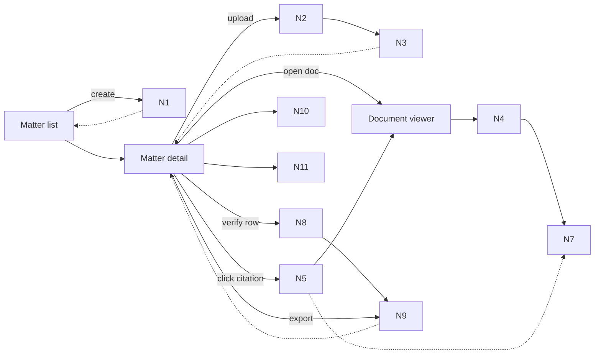
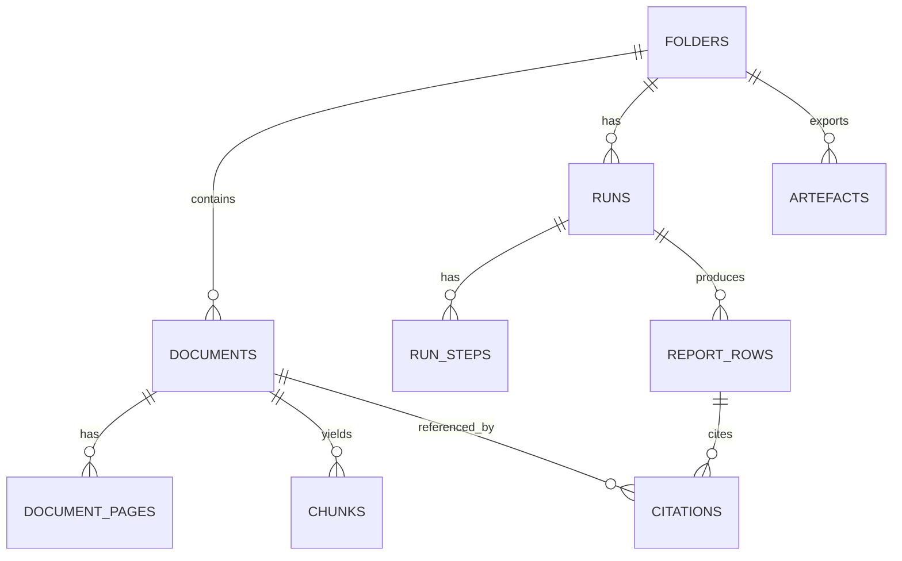

# Oracle Bundle (manual paste)

## Prompt
Review this shaping packet for Orbital Copilot PoC dossier `0001_trust-substrate` (Trust Substrate). Focus on Spike `RH2`: highlight overlay transform across zoom for citation click-to-highlight (anchors-first scaffold).

Please:
- Explain pdf.js coordinate spaces and the correct mapping from anchor polygons to CSS pixels across zoom and rotation.
- Recommend a minimal Next.js App Router component architecture for viewer + overlay with clean server/client boundaries.
- Give a step-by-step spike plan with concrete pass/fail checks (50/100/150% zoom) and how to capture evidence (screenshots/metrics).
- List common pitfalls (devicePixelRatio, rotation, canvas vs DOM, CSS transforms).
- Propose 2 fallback cuts/patches if alignment is too hard but we still need a trust moment.

Stay aligned to repo docs: evidence-first citation locking, fail-closed posture, fixture packs.

## Included files
- docs/04-projects/02-features/0001_trust-substrate/brief.md
- docs/04-projects/02-features/0001_trust-substrate/breadboard-pack.md
- docs/04-projects/02-features/0001_trust-substrate/risk-register.md
- docs/04-projects/02-features/0001_trust-substrate/spike-investigation.md
- docs/03-architecture/00_overview.md
- docs/03-architecture/10_system_architecture.md
- docs/03-architecture/50_api_surface.md
- docs/03-architecture/30_data_model.md
- docs/03-architecture/decisions.md
- docs/08-example-data/packs_summary.md
- apps/web/AGENTS.md

---

## File: docs/04-projects/02-features/0001_trust-substrate/brief.md

````md
# Brief: 0001 Trust Substrate (Initiative 1)

## Context (why this, why now)
Trust UX is the product. Before any “Quick Start” generation is credible, we need an evidence layer that:
- stores citations as locked, immutable objects
- lets a reviewer click a citation chip and see the highlighted clause in a PDF viewer
- fails closed when evidence can’t be verified
- makes failure states explicit and actionable

This work is the foundation for Initiatives 002 (Quick Start engine) and 003 (demo-grade outputs). If trust fails, everything else is noise.

## Goals
- A user can create a **Matter** (API/DB: `folder`), upload PDFs, and view them reliably.
- Citations are first-class, immutable objects (`citation_id` references only).
- Clicking a citation opens the right document + page and overlays a highlight polygon with snippet + snippet hash.
- Row-level statuses are terminal for the workflow (`needs_review|reviewed|missing_input|citation_failed`) and export is blocked by default when any row is `citation_failed`.
- Failures are explicit and actionable: missing docs checklist, doc quality warnings, citation mismatch details.
- Minimum viable provenance exists so we can answer: “why did this row exist?”

## Non-goals
- Auth/RBAC, integrations, sharing, multi-tenant admin.
- External web research inside runs.
- A full retrieval/generation “Quick Start” (this dossier establishes the trust primitives it will use).
- Legal/materiality judgement.
- Fancy monitoring dashboards (structured logs + trace IDs only).

## Perimeter lock (in scope)
- **Matter (folder) baseline:** create folder, upload documents, list docs, view PDFs in a viewer with page navigation + zoom.
- **Citation UX scaffold:** seeded report rows + citation chips that jump to viewer and highlight evidence using fixture anchors (`docs/08-example-data/*/layout/*.anchors.json`).
- **Citation contract:** canonical, locked citation object + `GET /citations/:id` (snippet + `snippet_hash` + polygons + page).
- **Row status + gate:** status machine and “export blocked” behaviour when any row is `citation_failed` (code checks first; entailment verifier as a follow-on slice).
- **Failure journeys:** `missing_input` behaviour + missing-doc checklist, extraction quality warnings, citation mismatch UX, “flag citation wrong”.
- **Provenance + trace export:** minimal run trace export (developer-facing; no UI beyond a download button).

## Explicit out of scope
- OCR geometry extraction beyond fixture anchors (we still honour ADR-0003, but the *highlight scaffold* is anchors-first until OCR is wired).
- Any agent loops or free-form chat.
- Anything that requires per-firm templates or customization.

## Acceptance signals (fixture-driven)
- `pack_01_clean`
  - viewer renders; page nav is responsive
  - seeded row shows citation chips; click chip highlights correct region and shows snippet + `snippet_hash`
- `pack_02_missing_rea`
  - rows that depend on missing docs are `missing_input` and include a missing-doc checklist
- `pack_07_scans_rotated_low_quality`
  - viewer remains usable on scanned/rotated PDFs
  - doc quality warnings are visible (even if quality is initially stubbed)
- One deliberate bad citation (mismatching `snippet_hash`) yields `citation_failed` and export is blocked by default.

## Constraints / guardrails (must align with `docs/03-architecture`)
- Terminology: **Folder** is API/DB; UI calls it **Matter**. (`docs/03-architecture/20_state_model.md`)
- Evidence-first + citation locking (ADR-0001) and fail-closed verification (ADR-0002). (`docs/03-architecture/decisions.md`)
- No external web research (ADR-0007).
- API error envelope; do not leak internals. (`docs/03-architecture/50_api_surface.md`, `docs/03-architecture/AGENTS.md`)
- Validate inputs at boundaries with Zod; client/server module boundaries must remain clean. (`apps/web/AGENTS.md`)

## Risks / unknowns (treatments)
See `risk-register.md`. Biggest rabbit holes:
- pdf.js performance on scanned packs (`pack_07_scans_rotated_low_quality`)
- highlight overlay coordinate transforms across zoom
- snippet normalisation + stable hashing rules in practice
- verification precision (false passes) vs latency/cost
- missing-doc detection heuristics

## Open questions
- Appetite/timebox: are we shaping the full trust substrate perimeter above, or do we want to cut to “trust moment only” (viewer + click-to-highlight) first?
- Storage access pattern for pdf.js: signed URLs vs proxy endpoint?
- Verification v1: code checks only, or include an entailment model from day one?
- Minimum trace schema: what is required vs nice-to-have?

## PRD slices (to create only *after* spikes)
Per `docs/00-strategy/initiatives/prd-slicing-rules.md`, we will slice PRDs from the breadboard parts once spikes are closed:
1) Folder (matter) CRUD + upload + document list (baseline UI)
2) PDF viewer (page nav + zoom) + render URL endpoint
3) Citation chip UI + jump-to-page + highlight overlay (anchors-first)
4) Citation contract: lock + `GET /citations/:id` + snippet hashing util
5) Status machine + export gate + failure journeys UX
6) Provenance + run trace export (developer-facing)

## Shaping decision (GO/NO-GO)
NO-GO until spike items in `spike-investigation.md` are executed and oracle-reviewed, and the perimeter above is re-confirmed based on spike outcomes.

````

---

## File: docs/04-projects/02-features/0001_trust-substrate/breadboard-pack.md

````md
# Breadboard Pack — 0001 Trust Substrate

## Context

- Appetite: TBD
- Problem: No baseline surface exists for viewing evidence, attaching citations, verifying claims, or showing failures. Trust must be established before any AI-driven work can be credible.
- Success: Matter + viewer works end-to-end; citations are real; verification is fail-closed; failures and provenance are explicit.
- Constraints: No auth/RBAC, no external web research, no full Quick Start generation (this is the trust substrate it depends on), anchors-first highlights until OCR wiring is ready.
- Canonical references:
  - State invariants: `docs/03-architecture/20_state_model.md`
  - API contracts: `docs/03-architecture/50_api_surface.md`
  - Trust ADRs: `docs/03-architecture/decisions.md`

## Current state

### What exists today

- Seed packs in `docs/08-example-data`.
- Anchor scaffolding in `docs/08-example-data/*/layout/*.anchors.json`.
- Web app scaffolding exists, but there is no confirmed Matter/Document/Viewer UI or API yet.

### Current flow (breadboard)

- _N/A_ (baseline surface does not exist yet).

## Proposed solution

### Proposed flow (breadboard)

- _Matter list (entry UI; API/DB calls it Folder)_
  - Create matter (folder)
  - -> Matter detail
- _Matter detail_
  - Upload documents
  - Document list + statuses
  - Report rows (seeded)
  - Citation chips
  - -> Document viewer
- _Document viewer_
  - Page navigation + zoom
  - Highlight overlay
  - Snippet + hash display
  - -> Back to Matter detail
- _Verification + failure UX_
  - Status badges per row
  - Export gate (blocked when citation_failed)
  - Missing docs checklist
  - Doc quality warnings
  - Flag citation wrong
- _Trace export (admin)_
  - Export run trace JSON

### Elements

- Matter list + detail views (folder CRUD)
- Upload pipeline + document list with ingest statuses
- PDF viewer (pdf.js) with page nav + zoom
- Citation chips + highlight overlay
- Verification status + export gate
- Failure taxonomy + warnings
- Provenance capture + trace export

## UI affordances

| # | Component / place | Affordance | Control | Wires out | Reads |
|---|---|---|---|---|---|
| U1 | Matter list | Create matter button | click | N1 create matter |  |
| U2 | Matter create modal | Name/description form + submit | type/click | N1 create matter |  |
| U3 | Matter detail | Upload dropzone + progress | drop/click | N2 upload pipeline | N3 doc status |
| U4 | Matter detail | Document list + status pills | click | N4 open viewer | N3 doc status |
| U5 | Matter detail | Report rows table | render |  | N9 row status |
| U6 | Matter detail | Citation chips per row | click | N5 fetch citation + N4 jump to page |  |
| U7 | Viewer | Page nav + zoom | click/scroll | N4 page render | N4 page state |
| U8 | Viewer | Highlight overlay + snippet | render | N7 map bbox to viewport | N5 citation payload |
| U9 | Matter detail | Export button + block state | click | N9 status gate | N9 row status |
| U10 | Matter detail | Missing docs checklist | render |  | N10 failure taxonomy |
| U11 | Matter detail | Doc quality warning | render |  | N3 doc metadata |
| U12 | Matter detail | Flag citation wrong action | click | N10 log feedback | N5 citation payload |
| U13 | Admin/trace | Export trace JSON | click | N11 trace export | N11 provenance store |

## Code affordances

| # | Component / service | Affordance | Control | Wires out / returns |
|---|---|---|---|---|
| N1 | Folders API (Matter CRUD) | `POST /folders` | call | creates `folder_id` |
| N2 | Upload service | init upload + put to storage + complete | call | `POST /folders/:id/documents` → upload target; `POST /documents/:id/complete` enqueues ingest |
| N3 | Documents store | ingest status + quality metadata | read/write | drives list state (`parse_status`, `ocr_status`, `extraction_quality`) |
| N4 | Viewer render contract | render URL + viewer state | call | `GET /documents/:id/render?page=N` returns `render_url`; viewer handles page nav + zoom |
| N5 | Citations API | `GET /citations/:id` | call | locked citation payload `{document_id,page_number,polygons,snippet,snippet_hash}` |
| N6 | Anchor fixture loader | map fixture anchor IDs to polygons | call | returns polygons for highlight scaffold |
| N7 | Highlight renderer | PDF space → viewport transform | call | returns overlay geometry for rendering |
| N8 | Verification pipeline | code checks + (optional) entailment | call | returns verdict + failure reason code |
| N9 | Row status machine | status invariants + export gate | write | sets row status + blocks export by default on `citation_failed` |
| N10 | Failure logger | taxonomy + structured logs | write | emits safe failure events |
| N11 | Provenance store | minimal trace schema + export | write/call | returns run trace JSON |

## Wiring diagram

- Legend:
  - **Solid** = calls / triggers / writes
  - **Dashed** = returns / store reads



## Parts list (BOM)

| Part | Name | Mechanism |
|---|---|---|
| F1 | Matter + upload baseline | Create matter, upload docs, show status list |
| F2 | PDF viewer | pdf.js viewer with page nav + zoom |
| F3 | Citation UI | Chips + jump-to-page + highlight overlay |
| F4 | Citation model + API | Canonical citation schema + `GET /citations/:id` |
| F5 | Verification gate | Status machine + verifier + export block |
| F6 | Failure UX | Missing docs + quality warnings + flag action |
| F7 | Provenance trace | Capture model/prompt/inputs + trace export |

## Fit check: requirements × concept

| Req | Requirement | Status | Fit |
|---|---|---|---|
| R1 | Matter creation + upload + view | core goal | ✅ |
| R2 | Citation chips + click-to-highlight | core goal | ⚠️ (depends on transform spike) |
| R3 | Canonical citation API | must-have | ✅ |
| R4 | Fail-closed verification | must-have | ⚠️ (depends on verifier spike) |
| R5 | Failure UX (missing docs, quality) | must-have | ⚠️ (depends on heuristics spike) |
| R6 | Provenance + trace export | must-have | ✅ |

### Unsolved

- R2: Can we reliably map anchor geometry across zoom levels?
- R4: Can we achieve high-precision verification without false passes?
- R5: Can missing-doc detection be accurate on noisy packs?

## Rabbit holes, cuts, and no-gos

### Rabbit holes

- PDF highlight coordinate transforms across zoom.
- Snippet canonicalisation + hash stability.
- Verification precision/latency trade-offs.

### Cuts / scope trims

- No OCR geometry extraction beyond anchor scaffolding.
- No advanced trace UI (endpoint/export only).

### Out of bounds / no-gos

- Auth/RBAC, integrations, external research.

## Optional: Extract vs duplicate analysis

Not applicable (no comparable existing feature).

## PRD slicing (record only; do not create PRDs until spikes are closed)
Per `docs/00-strategy/initiatives/prd-slicing-rules.md`, slices should map to parts (F#) and affordances (U#/N#):
- Slice A (F1, U1–U4, N1–N3): Matter (folder) CRUD + upload pipeline + doc list statuses
- Slice B (F2, U7, N4): PDF viewer + render URL contract
- Slice C (F3, U6–U8, N5–N7): Citation chips + jump-to-highlight (anchors-first)
- Slice D (F4, N5): Citation locking + hashing util + citations API
- Slice E (F5–F6, U9–U12, N8–N10): Status machine + export gate + failure journeys
- Slice F (F7, U13, N11): Provenance capture + trace export

````

---

## File: docs/04-projects/02-features/0001_trust-substrate/risk-register.md

````md
# Risk register (rabbit holes)

Treatments must be one of: `Cut` / `Patch` / `Spike` / `Out-of-bounds`.

| ID | Rabbit hole | Category | Packs to prove | Treatment | Mitigation (concrete) | Status |
|---|---|---|---|---|---|---|
| RH1 | pdf.js performance on scanned/rotated PDFs (page jumps, zoom) | technical | `pack_07_scans_rotated_low_quality` | Spike | Build a minimal viewer + page-jump harness; measure render times; patch with skeletons + progressive rendering if needed. | open |
| RH2 | Highlight overlay coordinate transforms across zoom levels | technical | `pack_01_clean`, `pack_07_scans_rotated_low_quality` | Spike | Prototype bbox/polygon overlay with 50/100/150% zoom; if unstable cut to bbox-only or page-level highlight. | open |
| RH3 | Snippet normalisation + stable `snippet_hash` rule works in practice | data | `pack_01_clean` | Spike | Implement canonical `normalise()` per `docs/03-architecture/30_data_model.md`; validate stability on repeated runs with the same source snippet. | open |
| RH4 | Verification avoids false passes at acceptable latency/cost | technical | negative set across `pack_01_clean`, `pack_02_missing_rea` | Spike | Start with code checks; if entailment is required, tune for precision-first (0 false passes target) and accept more `citation_failed`. | open |
| RH5 | Missing-doc detection heuristics are reliable (low false positives) | data | `pack_02_missing_rea` vs `pack_01_clean` | Spike | Heuristics: referenced instrument IDs/filenames → docs present; patch with manual confirm UX if heuristics are noisy. | open |
| RH6 | Provenance/log volume and PII risk | security/design | all | Patch | Keep trace schema minimal, safe, and redacted by default; store opaque IDs + hashes, not raw provider payloads. | open |
| RH7 | Storage access pattern for pdf.js (signed URLs vs proxy) | dependency/security | all | Patch | Decide one contract early; prefer signed render URLs (`GET /documents/:id/render?page=N`) and avoid proxying raw PDFs through the app unless needed. | open |
| RH8 | Client/server boundary mistakes with viewer + APIs (Next.js App Router) | architecture | all | Patch | Enforce `client-only`/`server-only` boundaries; viewer is client; APIs validate with Zod and return safe error envelopes. | open |

## Notes
- Per `docs/00-strategy/initiatives/prd-slicing-rules.md`, PRDs should not be created until Spike items are closed (or explicitly Cut/Out-of-bounds).
- Oracle review is mandatory per Spike (bundle + notes captured in `spike-investigation.md`).

````

---

## File: docs/04-projects/02-features/0001_trust-substrate/spike-investigation.md

````md
# Spike investigation — Trust substrate

> Status: planned only. No spikes executed yet. Oracle pass pending for each spike.

## Spike plan — PDF viewer performance on noisy scans

### Question
Can pdf.js render and page-jump on scanned/rotated PDFs (e.g. `docs/08-example-data/pack_07_scans_rotated_low_quality/docs/TitleCommitment_SCANNED_ROTATED.pdf`) without UI freezing?

### Context
- Feature / concept: 1.1 Matter + document viewer baseline
- Related requirement(s): R1
- Why now: baseline UX depends on acceptable navigation performance

### Success criteria
Proof looks like:
- Page jump completes in <1s per jump on dev machine
- Viewer remains responsive during rapid navigation

### Timebox
- Start: TBD
- Hard stop: TBD (2–4 hours)

### Scope
Include:
- Minimal viewer page with pdf.js rendering
- Programmatic page-jump test harness

Exclude:
- Highlight overlays, citations, verification

### Approach
- Step 1: Load the scanned PDF in a minimal viewer page
- Step 2: Implement page-jump control + measure render times
- Step 3: Record timing + responsiveness results

### Artefacts
Keep:
- Notes + timing table
- Minimal viewer branch or snippet

Throw away:
- Any UI polish beyond functional test

### Expected outcomes
- If straight shot: proceed with pdf.js viewer baseline
- If tangle: patch by limiting max page size or adding loading skeletons
- If fog: consider alternative viewer or async render strategy

---

## Spike plan — Highlight overlay transform across zoom

### Question
Can we map anchor geometry to the viewer viewport correctly at 50%, 100%, and 150% zoom?

### Context
- Feature / concept: 1.2 Citation chips -> click-to-highlight
- Related requirement(s): R2
- Why now: highlight alignment is core trust affordance

### Success criteria
Proof looks like:
- Highlight aligns on at least one commitment PDF and one survey PDF
- Alignment remains correct at 50%, 100%, 150% zoom

### Timebox
- Start: TBD
- Hard stop: TBD (4–6 hours)

### Scope
Include:
- One PDF with anchors
- Overlay renderer with bbox/polygon support

Exclude:
- Citation chips UI and data model

### Approach
- Step 1: Load anchors and PDF page
- Step 2: Implement transform math to viewport
- Step 3: Validate alignment across zoom

### Artefacts
Keep:
- Transform notes + screenshot evidence
- Minimal overlay component

Throw away:
- Full citation UI integration

### Expected outcomes
- If straight shot: proceed with overlay layer
- If tangle: patch to bbox-only or limit zoom levels
- If fog: re-scope to page-level highlights only

### Oracle pass (planned)
Generate a bundle and run an oracle review focused on coordinate spaces, transform math, and test strategy.

---

## Spike plan — Canonical snippet + hash stability

### Question
Does the canonical `normalise()` rule for `snippet_hash` (defined in `docs/03-architecture/30_data_model.md`) produce stable hashes for citations in practice?

### Context
- Feature / concept: 1.3 Citation data model + API
- Related requirement(s): R3
- Why now: hash stability is required for verification and idempotency

### Success criteria
Proof looks like:
- Hash remains stable across two reprocessing runs
- Snippet is human-readable and matches displayed text

### Timebox
- Start: TBD
- Hard stop: TBD (2–4 hours)

### Scope
Include:
- Two PDFs with known snippets
- Implement canonical normalisation once and reuse it everywhere

Exclude:
- LLM verification

### Approach
- Step 1: Extract candidate snippets + normalize
- Step 2: Compute hashes across runs
- Step 3: Compare stability and human readability

### Artefacts
Keep:
- Normalization rules
- Hash stability table

Throw away:
- Any full ingestion pipeline work

### Expected outcomes
- If straight shot: codify normalization + hash util
- If tangle: patch by pinning to anchor_id + snippet_hash (keep both), or by storing chunk_id + index_version as the authoritative reference
- If fog: restrict to anchor JSON only

---

## Spike plan — Verification precision (false passes)

### Question
Can we achieve zero false passes on 20 hand-curated bad examples at acceptable latency?

### Context
- Feature / concept: 1.4 Verification gate
- Related requirement(s): R4
- Why now: trust depends on fail-closed verification

### Success criteria
Proof looks like:
- 0 false passes on curated bad set
- Latency per row within acceptable budget (TBD)

### Timebox
- Start: TBD
- Hard stop: TBD (1–2 days)

### Scope
Include:
- Small curated dataset across packs
- One verification prompt + rubric

Exclude:
- Full UI integration

### Approach
- Step 1: Build curated set (good vs bad)
- Step 2: Run verifier and record outcomes
- Step 3: Adjust rubric/prompt for precision

### Artefacts
Keep:
- Curated dataset list
- Prompt + rubric
- Results summary

Throw away:
- Any production infrastructure

### Expected outcomes
- If straight shot: proceed with verifier + gate
- If tangle: patch to stricter heuristic checks before LLM
- If fog: cut verification to code-based checks only

---

## Spike plan — Missing-doc detection heuristics

### Question
Can we reliably detect “referenced but missing” docs in `pack_02_missing_rea` without false flags on `pack_01_clean`?

### Context
- Feature / concept: 1.5 Failure journeys
- Related requirement(s): R5
- Why now: missing-doc UX depends on accurate detection

### Success criteria
Proof looks like:
- Missing docs identified in `pack_02_missing_rea`
- No false missing-doc flags in `pack_01_clean`

### Timebox
- Start: TBD
- Hard stop: TBD (4–6 hours)

### Scope
Include:
- Simple doc matching heuristics
- Two packs for evaluation

Exclude:
- Full ingestion + retrieval

### Approach
- Step 1: Define matching heuristics (title/filename/token match)
- Step 2: Evaluate against both packs
- Step 3: Record false positives/negatives

### Artefacts
Keep:
- Heuristic definitions + results table

Throw away:
- Production ingestion changes

### Expected outcomes
- If straight shot: implement missing-doc checklist
- If tangle: patch to manual user-confirmed missing docs
- If fog: cut missing-doc detection to admin-only

---

## Spike reports (pending)

No spike reports yet. After each spike, add a report section and run an oracle pass.

## Oracle bundles
When you run an oracle pass, create a `--render` bundle in `tmp/oracle-bundles/` so it can be pasted into ChatGPT Pro.

- RH2 (highlight overlay transform): `tmp/oracle-bundles/oracle_bundle_0001_trust-substrate_RH2_highlight-overlay.md`

````

---

## File: docs/03-architecture/00_overview.md

````md
# Orbital Copilot PoC Architecture
US CRE Title + Survey Quick Start (evidence-first, artefact-first)

## Purpose
Define a production-minded (but PoC-sized) architecture for a law-firm workflow that ingests a US CRE diligence pack and produces defensible artefacts with clause-level evidence.

Optimised for:
- Title commitment (Schedule A / B-I / B-II)
- Exception instruments (easements, REAs, CC&Rs, mortgages, plats)
- ALTA/NSPS survey (draft or final)
- Trust UX: click citation → see highlighted evidence in the PDF

## Product scope (what we will build)
A matter workspace that supports:
1) Upload + ingest a doc pack (PDF-first)
2) Run “Quick Start: Title + Survey”
3) Generate 3 artefacts (as report tables first, export later):
   - Schedule B-I Requirements tracker
   - Schedule B-II Exceptions table (linked to underlying instruments)
   - Survey reconciliation issues list (title ↔ survey)

Every material claim must have citations or “Not found in provided documents.”

## Non-goals (explicit)
- No legal advice / materiality decisions / negotiation posture
- No external web research inside the PoC run
- No integrations (iManage/NetDocs/SharePoint)
- No multi-tenant admin, SSO/RBAC, billing
- No property visualiser / boundary plotting (stretch only)

## Key architectural decisions (PoC defaults)
- Evidence-first with citation locking: citations are IDs, not free text
- Fail-closed verification: citation mismatch → row is `citation_failed`
- Artefacts-first UX: report table is the centre of gravity
- OCR/layout for all PDFs (PoC default): consistent geometry for highlights
- Hybrid retrieval (RAG): lexical + vector search, rerank, then draft from evidence
- Deterministic-ish orchestration: explicit step machine, not free-running agents
- Fixture-driven reliability: synthetic packs + truth files used in CI-style evals

Canonical ADRs for these defaults live in `docs/03-architecture/decisions.md` (append-only).

## Where RAG fits
RAG is the engine inside Quick Start:
- Ingestion creates canonical page text + geometry, then chunks + indexes
- Retrieval returns chunk IDs (hybrid lexical + vector)
- Drafting uses only retrieved evidence
- Verification locks citations and fails closed when evidence does not support the claim

## Where evals fit
Evals are first-class because trust is the product:
- Compare outputs against `/truth` in the synthetic packs
- Validate citation integrity (hash + page + geometry)
- Spot retrieval misses and false passes before demos

## Tech stack and framework choices
See:
- `docs/03-architecture/05_tech_stack_and_dev_workflow.md` for stack, dev workflow, and fixtures
- `docs/03-architecture/06_frameworks_agents_rag_evals.md` for framework options and why we chose Workflow DevKit

````

---

## File: docs/03-architecture/10_system_architecture.md

````md
# System architecture

## High-level component map (with Workflow DevKit)

```mermaid
flowchart LR
  subgraph FE[Frontend]
    UI[Matter Workspace\nDoc list + Report table + Run progress]
    PDFV[PDF Viewer\npdf.js + highlight overlay]
  end

  subgraph API[API (Next.js route handlers)]
    FOLDERS[Folders API]
    DOCS[Documents API\n(upload + render URL)]
    RUNS[Runs API\n(start + progress)]
    CITS[Citations API\n(resolve citation)]
    EXPORT[Export API]
  end

  subgraph WDK[Workflow DevKit Runtime]
    WF[QuickStartWorkflow\n(use workflow)]
    STEP[Steps\n(use step)\nOCR, embed, retrieve, draft, verify, write]
    WORLD[(WDK Postgres World)]
  end

  subgraph DATA[Data plane]
    PG[(Postgres\nrows + citations + runs\npgvector + tsvector)]
    OBJ[(Object storage\nraw PDFs + exports)]
  end

  subgraph EXT[Providers]
    OCR[Layout OCR]
    LLM[LLM Router]
    EMB[Embeddings]
  end

  UI --> API
  PDFV --> CITS

  API --> PG
  API --> OBJ

  RUNS --> WF
  DOCS --> STEP
  EXPORT --> STEP

  WF --> STEP
  STEP --> WORLD
  WORLD --> PG

  STEP --> OCR
  STEP --> LLM
  STEP --> EMB
  STEP --> OBJ
```

Notes:
- WDK owns durability, retries, and resumability.
- The API is thin and mostly triggers workflows and reads state.
- Domain logic lives in shared packages called by steps.

Conventions:
- The meaning of `(use workflow)` / `(use step)` in the diagram is defined in `docs/03-architecture/06_frameworks_agents_rag_evals.md`.

---

## Key sequences

### Upload → ingest → ready
1) User uploads PDFs
2) Document rows created in Postgres and raw PDFs stored in object storage
3) Ingestion steps run:
   - OCR/layout extraction per page
   - persist canonical text + geometry
   - chunk + embed + index
4) Folder transitions to `ready` when checks pass

### Quick Start run (row-by-row)
Workflow controls a per-question loop:
- retrieve (hybrid)
- draft (structured JSON)
- lock citations (chunk IDs → snippet/hash/geometry)
- verify (fail-closed)
- write row (status + citations)

---

## Deployment posture (PoC)
- Single-tenant environment
- Next.js app plus WDK runtime plus Postgres and object storage
- Minimal observability: structured logs + trace IDs + run failure taxonomy

````

---

## File: docs/03-architecture/50_api_surface.md

````md
# API surface (PoC)

This doc is the canonical HTTP contract for the PoC. Keep it small, but explicit.

## Conventions
- All request/response bodies are JSON unless noted.
- IDs are opaque strings.
- Timestamps are ISO 8601.
- For POST endpoints that create work, support an optional `Idempotency-Key` header.

## Error envelope (required)
All non-2xx responses must use the same envelope (no stack traces, no internal provider payloads):

```json
{
  "error": {
    "code": "VALIDATION_ERROR",
    "message": "Human readable summary",
    "details": { "field": "optional safe detail" },
    "trace_id": "optional-trace-id"
  }
}
```

Minimum error codes (PoC):
- `VALIDATION_ERROR`
- `UNAUTHENTICATED` / `UNAUTHORISED`
- `NOT_FOUND`
- `CONFLICT`
- `RATE_LIMITED`
- `EXPORT_BLOCKED` (default when any row is `citation_failed`)
- `INTERNAL`

## Folder + documents

### POST /folders
Create a new matter (folder).

Request:
```json
{ "name": "123 Main St - Title + Survey" }
```

Response:
```json
{
  "folder": {
    "id": "fld_123",
    "name": "123 Main St - Title + Survey",
    "state": "empty",
    "latest_index_version": "v1"
  }
}
```

### POST /folders/:id/documents (init upload)
Initialise a document upload and return a storage target (signed URL or similar).

Request:
```json
{ "filename": "Title Commitment.pdf", "mime": "application/pdf", "bytes": 10485760 }
```

Response (shape only; storage fields depend on provider):
```json
{
  "document": {
    "id": "doc_123",
    "folder_id": "fld_123",
    "filename": "Title Commitment.pdf",
    "parse_status": "queued",
    "ocr_status": "queued"
  },
  "upload": {
    "storage_key": "folders/fld_123/documents/doc_123.pdf",
    "url": "https://…",
    "method": "PUT",
    "headers": { "Content-Type": "application/pdf" }
  }
}
```

### POST /documents/:id/complete
Mark the upload complete and enqueue ingest (parse + OCR + indexing).

Request:
```json
{ "storage_key": "folders/fld_123/documents/doc_123.pdf" }
```

Response:
```json
{ "document": { "id": "doc_123", "parse_status": "queued", "ocr_status": "queued" } }
```

### GET /folders/:id/documents
List documents in a folder.

Response:
```json
{
  "documents": [
    {
      "id": "doc_123",
      "filename": "Title Commitment.pdf",
      "parse_status": "parsed",
      "ocr_status": "done",
      "extraction_quality": 0.82,
      "page_count": 142
    }
  ]
}
```

### GET /documents/:id/render?page=N
Return a signed URL suitable for pdf.js to render page `N` (1-indexed).

Response:
```json
{
  "document_id": "doc_123",
  "page": 1,
  "render_url": "https://…"
}
```

## Runs + report

### POST /folders/:id/runs (Quick Start)
Start a Quick Start run for a folder.

Request:
```json
{ "type": "quick_start_title_survey" }
```

Response:
```json
{
  "run": {
    "id": "run_123",
    "folder_id": "fld_123",
    "state": "running",
    "index_version": "v1",
    "agent_bundle_version": "git:abc123"
  }
}
```

### GET /runs/:id (progress)
Response:
```json
{
  "run": {
    "id": "run_123",
    "state": "running",
    "progress": { "questions_total": 42, "questions_done": 11 },
    "failure_counts": { "RETRIEVAL_MISS": 2, "CITATION_MISMATCH": 1 }
  }
}
```

### GET /folders/:id/report?run_id=…
Return report rows for a specific run. If `run_id` is omitted, return the latest run for the folder.

Response:
```json
{
  "run_id": "run_123",
  "rows": [
    {
      "id": "row_123",
      "question_id": "BII-01",
      "question": "List Schedule B-II exceptions…",
      "answer": "…",
      "status": "needs_review",
      "citation_ids": ["cit_123", "cit_124"],
      "notes": null
    }
  ]
}
```

## Citations

### GET /citations/:id
Return locked geometry + snippet for a citation ID.

Response:
```json
{
  "citation": {
    "id": "cit_123",
    "document_id": "doc_123",
    "page_number": 12,
    "polygons": [[[0.1, 0.2], [0.4, 0.2], [0.4, 0.25], [0.1, 0.25]]],
    "snippet": "…",
    "snippet_hash": "sha256:…"
  }
}
```

## Export

### POST /export/csv
### POST /export/docx
Export a run. Default behaviour is to block if any row is `citation_failed`.

Request:
```json
{ "folder_id": "fld_123", "run_id": "run_123" }
```

Response:
```json
{
  "artefact": {
    "id": "art_123",
    "type": "csv",
    "storage_key": "folders/fld_123/artefacts/art_123.csv",
    "download_url": "https://…"
  }
}
```

### GET /folders/:id/artefacts
List exported artefacts for a folder.

````

---

## File: docs/03-architecture/30_data_model.md

````md
# Data model (Postgres + pgvector)

This is the canonical DB shape for the PoC “trust spine”: ingest → retrieve → draft → verify → report rows with locked citations.

## ERD


## Trust spine tables (minimum viable)

### `folders`
- `id`, `name`, `state`, `created_at`, `updated_at`
- `latest_index_version` (string; bumps on re-ingest/re-index)

### `documents`
- `id`, `folder_id`, `filename`, `mime`, `bytes`
- `sha256` (dedupe), `storage_key`, `page_count`
- `parse_status`, `ocr_status`, `extraction_quality`
- `error_json` (safe ingest failure details)

### `document_pages`
- `id`, `document_id`, `page_number`
- `text` (canonical)
- `layout_json` (tokens/lines/blocks + polygons)

### `chunks`
- `id`, `document_id`
- `index_version` (string; matches `folders.latest_index_version` at time of build)
- `page_start`, `page_end`, `chunk_index`
- `text`, `metadata_json`, `tsv`, `embedding`
- `snippet_hash` (see “Hashing rule” below)

### `runs`
- `id`, `folder_id`, `type`, `state`
- `index_version` (pins retrieval substrate used by the run)
- `agent_bundle_version` (pins prompts + schemas)
- timestamps + `error_json` (safe failure details)

### `run_steps`
- `id`, `run_id`, `step_type`, `state`, `attempt`
- `metrics_json`, `error_json`
- timestamps

### `report_rows`
- `id`, `folder_id`, `run_id`, `question_id`, `question`
- `answer`, `status`, `notes`
- `provenance_json` (minimum: retrieved chunk IDs + scores, models + prompt hashes, verification verdict + reason codes)
- timestamps

### `citations`
Citations are **locked** and **immutable** once created. They store enough to highlight evidence without re-running retrieval or re-reading chunks.
- `id`, `report_row_id`
- `chunk_id` (nullable; stored for debugging/replay)
- `document_id`, `page_number`
- `polygons`, `snippet`, `snippet_hash`
- `index_version` (string; pins the chunking/indexing version the citation came from)
- timestamps

### `artefacts`
- `id`, `folder_id`, `type`, `storage_key`
- `source_run_id`, `metadata_json`
- timestamps

## Hashing rule (snippet_hash)
We use `snippet_hash` to detect citation drift.

PoC rule:
- `snippet_hash = sha256(normalise(snippet))`
- `normalise()` must:
  - trim leading/trailing whitespace
  - convert CRLF → LF
  - collapse all whitespace runs to a single space

This rule must be implemented once (e.g. in `packages/core/citations`) and reused everywhere.

## Indices and constraints (recommended)
- unique `(documents.folder_id, documents.sha256)` (avoid duplicates within a matter, allow reuse across matters)
- unique `(report_rows.run_id, report_rows.question_id)` (rows are per run)
- unique `(chunks.document_id, chunks.index_version, chunks.chunk_index)`

- GIN on `chunks.tsv`
- pgvector index on `chunks.embedding`
- index `citations.report_row_id`
- index `runs.folder_id`

````

---

## File: docs/03-architecture/decisions.md

````md
# Architecture decisions (ADRs)

Append-only log of architecture decisions for Orbital Copilot PoC. Add new ADRs at the end and link the PR.

## ADR format (minimal)

```md
## ADR-0000: Title
- Status: proposed | accepted | superseded | deprecated
- Date: YYYY-MM-DD

Context
- Why are we making this decision?

Decision
- What did we decide?

Consequences
- What does this enable/force?
- What are the risks/trade-offs?

Links
- PR:
- Related docs:
```

---

## ADR-0001: Evidence-first outputs with citation IDs and locking
- Status: accepted
- Date: 2026-02-06

Context
- Trust UX is the product: every material claim needs inspectable evidence.

Decision
- Drafting produces structured rows with **candidate citations as chunk IDs** (no free-text citations).
- We **lock** citations by creating immutable `citations` records containing `{snippet, snippet_hash, geometry}`.
- Report rows refer to citations by `citation_id` only.

Consequences
- We can highlight evidence even if chunking/indexing changes later.
- Provenance is sufficient for debugging and replay without re-running the model.

Links
- Related docs: `docs/03-architecture/40_rag_and_agents.md`, `docs/03-architecture/30_data_model.md`

## ADR-0002: Verification is fail-closed
- Status: accepted
- Date: 2026-02-06

Context
- A plausible answer without valid evidence is worse than “not found”.

Decision
- Any citation lock mismatch or verification failure sets row status to `citation_failed`.
- `citation_failed` rows are non-exportable by default.

Consequences
- Reduces false trust at the cost of more “blocked” outputs early.
- Forces us to invest in retrieval + citation integrity.

Links
- Related docs: `docs/03-architecture/20_state_model.md`, `docs/03-architecture/60_observability_and_evals.md`

## ADR-0003: OCR/layout extraction is the default for all PDFs
- Status: accepted
- Date: 2026-02-06

Context
- Scans are common in CRE diligence packs; highlights require geometry.

Decision
- Every uploaded PDF is processed with OCR/layout extraction and persisted to `document_pages` as canonical text + polygons.

Consequences
- More ingest cost/latency, but consistent highlighting and chunking.
- Enables citation hashing and geometric overlays as first-class features.

Links
- Related docs: `docs/03-architecture/05_tech_stack_and_dev_workflow.md`, `docs/03-architecture/30_data_model.md`

## ADR-0004: Hybrid retrieval returning chunk IDs (lexical + vector)
- Status: accepted
- Date: 2026-02-06

Context
- CRE packs mix boilerplate and highly specific clauses; we need both recall and precision.

Decision
- Retrieval is hybrid (tsvector + embeddings) and returns **chunk IDs** (with scores) rather than prose.
- Optional rerank can be added, but must not change the “IDs-only” contract.

Consequences
- Retrieval becomes measurable (Recall@K, drift detection).
- Downstream steps can be schema-driven and deterministic.

Links
- Related docs: `docs/03-architecture/40_rag_and_agents.md`, `docs/03-architecture/60_observability_and_evals.md`

## ADR-0005: Deterministic-ish orchestration via Workflow DevKit steps
- Status: accepted
- Date: 2026-02-06

Context
- We need resumability, retries, and row-by-row progress without “agent loops”.

Decision
- Quick Start is implemented as a WDK workflow that coordinates explicit steps (`retrieve → draft → lock → verify → write`).
- Use `"use workflow"` / `"use step"` directives to make side-effect boundaries explicit.

Consequences
- Workflows remain predictable; side effects are isolated and observable.
- Keeps WDK integration thin (domain logic stays in `packages/core`).

Links
- Related docs: `docs/03-architecture/06_frameworks_agents_rag_evals.md`, `docs/03-architecture/10_system_architecture.md`

## ADR-0006: Fixture-driven evals are first-class
- Status: accepted
- Date: 2026-02-06

Context
- Demos fail when extraction/retrieval drifts; fixtures let us regress deterministically.

Decision
- Maintain synthetic packs with `/docs`, `/truth`, `/layout`.
- Run `fixture:eval` to produce per-pack eval reports and a cross-pack summary.
- Start as report-only, then gate CI on hard trust metrics (schema + citation integrity).

Consequences
- Faster iteration with fewer demo regressions.
- Forces us to encode “expected failure journeys” as fixtures.

Links
- Related docs: `docs/03-architecture/05_tech_stack_and_dev_workflow.md`, `docs/03-architecture/60_observability_and_evals.md`

## ADR-0007: No external web research inside PoC runs
- Status: accepted
- Date: 2026-02-06

Context
- PoC must be defensible based on provided diligence documents only.

Decision
- Quick Start uses only the uploaded pack for retrieval and reasoning.

Consequences
- Clear provenance and a simpler security posture.
- Some questions will legitimately resolve to `missing_input`.

Links
- Related docs: `docs/03-architecture/00_overview.md`, `docs/03-architecture/06_frameworks_agents_rag_evals.md`

## ADR-0008: Explicit error envelope for APIs
- Status: accepted
- Date: 2026-02-06

Context
- Clients need stable contracts; we must not leak internal errors/provider payloads.

Decision
- Standardise non-2xx responses on a single JSON error envelope with safe `code`, `message`, optional `details`, and optional `trace_id`.

Consequences
- Frontend can implement consistent error handling.
- Makes observability and support workflows simpler.

Links
- Related docs: `docs/03-architecture/50_api_surface.md`, `docs/03-architecture/AGENTS.md`

## ADR-0009: Deployment posture is Hetzner-first (single VM) until proven otherwise
- Status: accepted
- Date: 2026-02-06

Context
- The PoC needs durable orchestration (WDK) and long-running side effects (OCR/embeddings/LLM calls).
- A single-VM deployment reduces moving parts and avoids serverless DB connection pitfalls.

Decision
- Default deployment target is a Hetzner VM running the Next.js server + WDK worker + Postgres (and optionally MinIO).
- Vercel stays optional for later (e.g. preview deploys) once the runtime shape is stable.

Consequences
- Faster path to a stable demo and simpler debugging.
- We own basic ops (TLS, process supervision, backups, monitoring).

Links
- Related docs: `docs/03-architecture/10_system_architecture.md`, `docs/03-architecture/05_tech_stack_and_dev_workflow.md`
- Investigation: `docs/98-tmp/2026-02-06_infra-investigation/deployment.md`

## ADR-0010: Use S3-compatible object storage as the baseline
- Status: proposed
- Date: 2026-02-06

Context
- We need to store raw PDFs and exports and serve pages to pdf.js reliably.
- We want portability between local dev and Hetzner deployment (and optionally Vercel).

Decision
- Use S3-compatible object storage as the baseline contract.
- Local dev: MinIO (or local filesystem for ultra-simple early dev).
- Deployment: prefer managed S3-compatible storage unless explicitly "single VM only".

Consequences
- Standard tooling (AWS SDK) and a clean signed-URL story.
- If we self-host storage (MinIO), we must own backups and durability.

Links
- Related docs: `docs/03-architecture/05_tech_stack_and_dev_workflow.md`
- Investigation: `docs/98-tmp/2026-02-06_infra-investigation/storage.md`

## ADR-0011: Postgres is the primary datastore (local compose; Hetzner in deploy)
- Status: accepted
- Date: 2026-02-06

Context
- Postgres is already the planned "truth store" (rows, runs, steps, citations) and supports pgvector + tsvector.
- The PoC is single-tenant and can start with a single Postgres instance.

Decision
- Local dev: Postgres via Docker Compose (or Supabase local).
- Deployment: self-host Postgres on the Hetzner VM with automated backups and monitoring.

Consequences
- Simple data plane and predictable latency.
- If we later put the web/API on Vercel, we must add connection pooling and strict limits.

Links
- Related docs: `docs/03-architecture/05_tech_stack_and_dev_workflow.md`, `docs/03-architecture/30_data_model.md`

## ADR-0012: OCR/layout extraction is abstracted behind a single provider adapter
- Status: proposed
- Date: 2026-02-06

Context
- Highlight overlays require geometry.
- We want to keep the provider choice reversible (Azure Document Intelligence vs AWS Textract).

Decision
- Default provider: Azure Document Intelligence (Layout), unless an AWS-first posture is chosen.
- Implement a single OCR adapter interface returning a canonical per-page schema.

Consequences
- Provider swaps are a bounded change (mostly isolated to the adapter).
- We can tune for cost/quality without rewriting downstream chunking/citations.

Links
- Related docs: `docs/03-architecture/05_tech_stack_and_dev_workflow.md`, `docs/03-architecture/40_rag_and_agents.md`
- Investigation: `docs/98-tmp/2026-02-06_infra-investigation/ocr.md`

## ADR-0013: LLM access is via an internal router; gateway is optional
- Status: accepted
- Date: 2026-02-06

Context
- We need to route between "fast draft" and "strong verify" models and keep observability consistent.
- Introducing a gateway too early can add another debugging layer; but it can also simplify auth and logging.

Decision
- Define a small internal LLM router interface (draft, verify, embed) and keep it provider-agnostic.
- Start with direct provider keys; add a gateway (Vercel AI Gateway, Cloudflare AI Gateway, or LiteLLM Proxy) if/when friction justifies it.

Consequences
- Low lock-in and a clear place to add logging, retries, and budgets.
- Gateway adoption later is additive (swap base URL / auth), not architectural surgery.

Links
- Related docs: `docs/03-architecture/05_tech_stack_and_dev_workflow.md`
- Investigation: `docs/98-tmp/2026-02-06_infra-investigation/llm-gateways.md`

## ADR-0014: Create a minimal runnable scaffold to validate the architecture
- Status: proposed
- Date: 2026-02-06

Context
- Current repo is docs-first; we need a tracer-bullet implementation to validate the UX (pdf viewer + citations) and workflow plumbing.

Decision
- Add a minimal pnpm workspace scaffold:
  - `apps/web`: Next.js App Router app
  - `packages/core`: Zod schemas + core contracts
  - `docker-compose.yml`: local Postgres + MinIO (optional)
  - wire `pnpm dev`, `pnpm build`, `pnpm test`, `pnpm lint`

Consequences
- Onboarding becomes concrete and repeatable.
- Risk: scaffolding can become premature if we haven't committed to building the PoC; keep it intentionally thin.

Links
- Related docs: `docs/03-architecture/05_tech_stack_and_dev_workflow.md`, `docs/03-architecture/06_frameworks_agents_rag_evals.md`

## ADR-0015: Use Vercel for web deployments, keep durable worker off serverless
- Status: proposed
- Date: 2026-02-06

Context
- We want Vercel for fast preview deployments (UI iteration speed).
- The PoC also needs durable/background work (WDK steps for OCR/embeddings/LLM/DB writes) that is easier to run predictably on a VM.

Decision
- Deploy the Next.js web app to Vercel for UI and thin HTTP APIs.
- Run the durable workflow worker on a Hetzner VM.
- Data plane should be reachable from both environments:
  - Postgres: managed (simplest) or Hetzner-hosted (if we also run a backend API on Hetzner and keep DB private).
  - Object storage: S3-compatible.

Consequences
- Best-of-both: fast UI deploys and predictable background execution.
- Adds one operational surface area (Hetzner worker). Keep it minimal: one Compose service and a small deploy script.

Links
- Related docs: `docs/03-architecture/10_system_architecture.md`, `docs/03-architecture/06_frameworks_agents_rag_evals.md`
- Investigation: `docs/98-tmp/2026-02-06_infra-investigation/deployment.md`, `docs/98-tmp/2026-02-06_infra-investigation/recommended-stack.md`

````

---

## File: docs/08-example-data/packs_summary.md

````md
# Synthetic PoC Test Packs Summary

| Pack | State | Scenario | Edge cases | Missing docs | Docs |
|---|---|---|---|---|---:|
| `pack_01_clean` | NY | Complete happy-path pack (title + full exception docs + survey) with both text-layer and scanned copies. | baseline;scanned_copies | - | 10 |
| `pack_02_missing_rea` | TX | Commitment references an REA in Schedule B-II but the REA PDF is intentionally missing (tests missing-input handling). | missing_exception_doc | REA.pdf | 6 |
| `pack_03_mismatch_and_cert_gap` | FL | Survey area note conflicts with record description and survey certification omits lender (tests escalation + QC). | survey_legal_desc_mismatch;survey_cert_missing_lender | - | 5 |
| `pack_04_multi_parcel` | IL | Two-parcel site (multi-parcel legal description + survey shows two parcels); one easement burdens only Parcel 2. | multi_parcel;parcel_scoping | - | 6 |
| `pack_05_partial_release` | CA | Deed of Trust exception with a provided Partial Release (release applies to a portion only); tests lien + release logic and 'needs review' flags. | partial_release;lien_clearance_complexity | - | 6 |
| `pack_06_overlapping_easements` | GA | Multiple utility easements with similar naming and different instrument numbers; one instrument references a missing Exhibit B attachment; tests disambiguation and missing-attachment handling. | overlapping_similar_exceptions;missing_attachment | Utility_Easement_10ft_ExhibitB.pdf | 5 |
| `pack_07_scans_rotated_low_quality` | NJ | OCR torture pack: scanned-only commitment + survey with rotated pages and blur; tests extraction-quality metering and rerun OCR flows. | scanned_rotated;low_quality_ocr | - | 7 |
| `pack_08_defined_terms_and_cross_refs` | WA | CC&Rs/REA with defined terms and exhibit chase (e.g., 'Easement Area' defined elsewhere; REA references Exhibit C site plan); tests multi-hop retrieval and definition resolver. | defined_terms;exhibit_chase | - | 6 |
````

---

## File: apps/web/AGENTS.md

````md
# Web app (apps/web)
Next.js App Router web application.

## Stack
- Next.js App Router + TypeScript
- Tailwind + shadcn/ui + Radix (icons: `lucide-react`)
- Forms: React Hook Form + Zod
- Tests: Vitest + Testing Library (MSW for mocks)

## Guardrails (high leverage)
- Server-first: fetch on the server (RSC / route handlers / server actions). Avoid client-side data fetching effects.
- Treat `useEffect` as an escape hatch (imperative interop only) — not for data fetching, derived state, prop→state, or URL sync.
- Never import server-only into client components (use `server-only` / `client-only` boundaries).
- Validate external inputs with Zod and map errors to safe user-facing messages.
- AI SDK flows: use Workflow DevKit (`workflow`) and add `"use workflow"` in async TS fns for durability, reliability, observability.
  - Conventions for `"use workflow"` / steps are defined in `docs/03-architecture/06_frameworks_agents_rag_evals.md`.

## Frontend skills
- `frontend-design`: build distinctive UI.
- `web-design-guidelines`: audit UI against web interface guidelines.
- `baseline-ui`: enforce UI baseline; prevent design slop.
- `fixing-accessibility`: a11y fixes and audits.
- `fixing-metadata`: SEO/social metadata fixes.
- `fixing-motion-performance`: animation perf fixes.
- `react-best-practices`: React/Next.js performance best practices.
- `composition-patterns`: React composition patterns for scalable component APIs.
- `test-browser`: browser smoke for changed UI paths.
- `rams`: backup UI critique via the `rams` skill (prefer ui-skills first).

````
