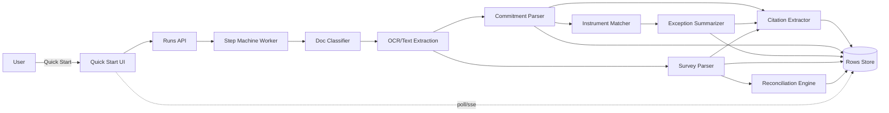

# Breadboard Pack — Quick Start Engine (Initiative 002)

## Context

- Appetite: TBD
- Problem: No deterministic, testable pipeline from Title + Survey to a first-pass report.
- Success: Target packs produce stable, citation-backed rows with visible run progress.
- Constraints: Fixed question set, no web research, no strategy decisions, OCR everything.
- Acceptance packs: `pack_01_clean`, `pack_04_multi_parcel_complex`, `pack_05_duplicate_instrument_exhibit_missing`, `pack_06_noisy_scans_rotated_page`, `pack_03_mismatch_and_cert_gap`, `pack_02_missing_rea`.

## Current state

- Manual reading of commitment + survey.
- No deterministic run or incremental row output.

## Global wiring diagram (reference)

- Legend:
  - **Solid** = calls / triggers / writes
  - **Dashed** = returns / store reads

---

# Breadboard 2.1 — Question set v1 + schema freeze

## Goal

Freeze v1 question set (<=25) and stable row schema; expose fixed columns and row drawer UI.

## Places and affordances

- Place: Quick Start setup modal
- Affordance: View fixed question set and schema version
- Place: Row table
- Affordance: View columns + status + confidence
- Place: Row drawer
- Affordance: View answer + citations + notes

## UI affordances

| # | Component / place | Affordance | Control | Wires out | Reads |
|---|---|---|---|---|---|
| U1 | Setup modal | Question set preview | render | none | question_set_v1 |
| U2 | Setup modal | Schema version label | render | none | schema_version |
| U3 | Row table | Fixed columns + status | render | none | row data |
| U4 | Row drawer | Answer + citations | render | open viewer | citations |
| U5 | Row drawer | Needs review toggle | click | update row | row status |

## Code affordances

| # | Component / service | Affordance | Control | Wires out / returns |
|---|---|---|---|---|
| N1 | Question set registry | getQuestionSetV1 | read | question list |
| N2 | Schema versioning | getSchemaVersion | read | schema_version |
| N3 | Row schema validator | validateRow | call | validation errors |
| N4 | Row rendering | mapRowToColumns | call | UI-ready row |

## Parts list (BOM)

| Part | Name | Mechanism |
|---|---|---|
| F2.1.1 | Question set JSON + versioning | Store v1 questions with IDs and version tag. |
| F2.1.2 | Row schema + migrations | Define row fields and migration hooks. |
| F2.1.3 | Table + row drawer layout | Fixed columns and drawer view for citations. |

## Fit check

| Req | Requirement | Status | Fit |
|---|---|---|---|
| R2.1.1 | <=25 questions with IDs | core goal | ✅ |
| R2.1.2 | Stable row schema | core goal | ✅ |
| R2.1.3 | UI shows fixed columns + drawer | must-have | ✅ |

## Rabbit holes, cuts, no-gos

- Rabbit hole: Practitioner alignment on question set (spike).
- Cut: No dynamic question editing in v1.
- Out of bounds: Strategy decisions.

---

# Breadboard 2.2 — Commitment parsing (Schedule A / B-I / B-II)

## Goal

Extract requirements and exceptions lists with item numbers from commitment PDFs for target packs.

## Places and affordances

- Place: Step machine worker
- Affordance: Classify commitment docs and route to parser
- Place: Row table
- Affordance: Show parser confidence and allow override notes

## UI affordances

| # | Component / place | Affordance | Control | Wires out | Reads |
|---|---|---|---|---|---|
| U1 | Row table | Parser confidence badge | render | none | row confidence |
| U2 | Row drawer | Override note field | type | update row | row data |

## Code affordances

| # | Component / service | Affordance | Control | Wires out / returns |
|---|---|---|---|---|
| N1 | Doc classifier | classifyCommitment | call | doc type |
| N2 | OCR pipeline | extractCommitmentText | call | text blocks |
| N3 | Commitment parser | parseScheduleA | call | schedule facts |
| N4 | Commitment parser | parseBIRequirements | call | requirements list |
| N5 | Commitment parser | parseBIIExceptions | call | exceptions list |
| N6 | Confidence scorer | scoreParsing | call | confidence flag |

## Parts list (BOM)

| Part | Name | Mechanism |
|---|---|---|
| F2.2.1 | Doc-type classifier + routing | Route commitment docs to the parser. |
| F2.2.2 | B-I extraction | Parse requirements list with item numbers. |
| F2.2.3 | B-II extraction | Parse exceptions list with item numbers and refs. |
| F2.2.4 | Parser confidence UI | Surface uncertainty + override notes. |

## Fit check

| Req | Requirement | Status | Fit |
|---|---|---|---|
| R2.2.1 | Requirements list for target packs | core goal | ⚠️ spike |
| R2.2.2 | Exceptions list with refs | core goal | ⚠️ spike |
| R2.2.3 | Confidence flag | must-have | ✅ |

## Rabbit holes, cuts, no-gos

- Rabbit hole: Noisy scans and format variance (spike).
- Cut: Universal format coverage.
- Out of bounds: Deep semantic interpretation.

---

# Breadboard 2.3 — Exception → instrument matching + summaries

## Goal

Link exceptions to the correct instrument PDFs, extract short summaries with citations, and flag ambiguity.

## Places and affordances

- Place: Row table
- Affordance: Needs review badge for ambiguous matches
- Place: Row drawer
- Affordance: Show exception summary + citations
- Place: Ambiguity picker (modal or inline)
- Affordance: User selects correct instrument

## UI affordances

| # | Component / place | Affordance | Control | Wires out | Reads |
|---|---|---|---|---|---|
| U1 | Row table | Needs review badge | render | open ambiguity UI | match status |
| U2 | Row drawer | Exception summary + citations | render | open viewer | citations |
| U3 | Ambiguity UI | Select instrument | click | update match | candidate list |

## Code affordances

| # | Component / service | Affordance | Control | Wires out / returns |
|---|---|---|---|---|
| N1 | Instrument matcher | matchException | call | match candidates |
| N2 | Exception summarizer | summarizeInstrument | call | summary + citations |
| N3 | Risk tagger | tagExceptionRisk | call | risk tags |
| N4 | Ambiguity handler | markNeedsReview | write | status update |

## Parts list (BOM)

| Part | Name | Mechanism |
|---|---|---|
| F2.3.1 | Instrument matching service | Match by instrument # and book/page heuristics. |
| F2.3.2 | Exception summary extractor | Short summary with citations. |
| F2.3.3 | Risk tagging rubric | Access/use/parking/utility/monetary/boundary tags. |
| F2.3.4 | Ambiguity UI | Surface multiple matches + user selection. |

## Fit check

| Req | Requirement | Status | Fit |
|---|---|---|---|
| R2.3.1 | Correct matching on pack_01_clean | core goal | ⚠️ spike |
| R2.3.2 | Duplicate/missing exhibit flags | core goal | ⚠️ spike |
| R2.3.3 | Summary includes citations | core goal | ⚠️ spike |

## Rabbit holes, cuts, no-gos

- Rabbit hole: False matches across packs (spike).
- Cut: Deep semantic understanding of easement scope.
- Out of bounds: Materiality scoring.

---

# Breadboard 2.4 — Survey parsing with citations

## Goal

Extract certification parties and textual callouts from survey documents with citations.

## Places and affordances

- Place: Row drawer
- Affordance: Survey callouts with citations
- Place: Row table
- Affordance: Survey quality indicator (needs review)

## UI affordances

| # | Component / place | Affordance | Control | Wires out | Reads |
|---|---|---|---|---|---|
| U1 | Row table | Quality indicator | render | none | quality flag |
| U2 | Row drawer | Callout list + citations | render | open viewer | citations |

## Code affordances

| # | Component / service | Affordance | Control | Wires out / returns |
|---|---|---|---|---|
| N1 | Doc classifier | classifySurvey | call | doc type |
| N2 | OCR pipeline | extractSurveyText | call | text blocks |
| N3 | Survey parser | parseCertification | call | parties + dates |
| N4 | Survey parser | parseCallouts | call | callout list |
| N5 | Quality scorer | scoreSurveyExtraction | call | quality flag |

## Parts list (BOM)

| Part | Name | Mechanism |
|---|---|---|
| F2.4.1 | Survey doc-type routing | Identify survey docs and send to parser. |
| F2.4.2 | Certification extraction | Parties, surveyor, date. |
| F2.4.3 | Callout extraction | Encroachments/easements/access text + citations. |
| F2.4.4 | Quality indicator | Needs-review flag when signal is weak. |

## Fit check

| Req | Requirement | Status | Fit |
|---|---|---|---|
| R2.4.1 | Non-empty survey extract for pack_01_clean | core goal | ⚠️ spike |
| R2.4.2 | Flags cert gap for pack_03_mismatch_and_cert_gap | core goal | ⚠️ spike |
| R2.4.3 | Works on noisy scans | core goal | ⚠️ spike |

## Rabbit holes, cuts, no-gos

- Rabbit hole: OCR signal quality on survey scans (spike).
- Cut: Visual/geometry parsing.
- Out of bounds: Property visualizer.

---

# Breadboard 2.5 — Title ↔ survey reconciliation

## Goal

Cross-check commitment exceptions against survey depiction and produce reconciliation issues with citations or "unknown".

## Places and affordances

- Place: Reconciliation issues list
- Affordance: Filter by depicted / not depicted / unknown
- Place: Row drawer
- Affordance: Show both title and survey citations

## UI affordances

| # | Component / place | Affordance | Control | Wires out | Reads |
|---|---|---|---|---|---|
| U1 | Issues list | Status filter | click | filter list | issues store |
| U2 | Issues list | Unknown badge | render | none | issue status |
| U3 | Row drawer | Dual citations | render | open viewer | citations |

## Code affordances

| # | Component / service | Affordance | Control | Wires out / returns |
|---|---|---|---|---|
| N1 | Reconciliation engine | reconcileException | call | issue record |
| N2 | Evidence scorer | scoreEvidence | call | depicted/unknown |
| N3 | Issue generator | buildIssuesList | call | issues list |

## Parts list (BOM)

| Part | Name | Mechanism |
|---|---|---|
| F2.5.1 | Reconciliation rules engine | Map exception types to survey checks. |
| F2.5.2 | Issues list generator | Create structured issue rows with citations. |
| F2.5.3 | Reconciliation UI | Filters, statuses, notes. |
| F2.5.4 | Unknown handling + guidance | Prefer unknown when evidence is weak. |

## Fit check

| Req | Requirement | Status | Fit |
|---|---|---|---|
| R2.5.1 | Depicted vs not depicted for pack_01_clean | core goal | ⚠️ spike |
| R2.5.2 | Flags incomplete plotting for pack_05_duplicate_instrument_exhibit_missing | core goal | ⚠️ spike |
| R2.5.3 | Unknown state when uncertain | core goal | ⚠️ spike |

## Rabbit holes, cuts, no-gos

- Rabbit hole: False positives in "not depicted" (spike).
- Cut: Geometry overlays.
- Out of bounds: Semantic easement scope interpretation.

---

# Breadboard 2.6 — Run orchestration + incremental report population

## Goal

Run a deterministic step machine that writes rows incrementally and surfaces progress.

## Places and affordances

- Place: Run progress view
- Affordance: Step indicator + restart run
- Place: Row table
- Affordance: Incremental row updates with status

## UI affordances

| # | Component / place | Affordance | Control | Wires out | Reads |
|---|---|---|---|---|---|
| U1 | Run progress view | Step indicator | render | none | run state |
| U2 | Run progress view | Restart run | click | restart run | run state |
| U3 | Row table | Incremental updates | render | none | rows store |

## Code affordances

| # | Component / service | Affordance | Control | Wires out / returns |
|---|---|---|---|---|
| N1 | Runs API | createRun | call | run state |
| N2 | Step machine worker | advanceStep | call | parser routing |
| N3 | Row upsert | upsertRow | write | idempotent rows |
| N4 | Provenance stamping | stampRow | write | snippet hash |
| N5 | UI update channel | pollRun / sse | observe | run state + rows |

## Parts list (BOM)

| Part | Name | Mechanism |
|---|---|---|
| F2.6.1 | Runs API + state model | created/running/partial/completed/failed. |
| F2.6.2 | Worker job runner + steps | Deterministic step model. |
| F2.6.3 | Incremental UI updates | Polling or SSE for row updates. |
| F2.6.4 | Row upsert + provenance | Idempotent writes by question_id. |

## Fit check

| Req | Requirement | Status | Fit |
|---|---|---|---|
| R2.6.1 | Step progress visible | core goal | ✅ |
| R2.6.2 | Rows appear progressively | core goal | ✅ |
| R2.6.3 | Idempotent restart | core goal | ⚠️ spike |
| R2.6.4 | pack_02_missing_rea fails safely | must-have | ✅ |

## Rabbit holes, cuts, no-gos

- Rabbit hole: Idempotent restarts (spike).
- Cut: Long-running agent loops.
- Out of bounds: Freeform chat.
