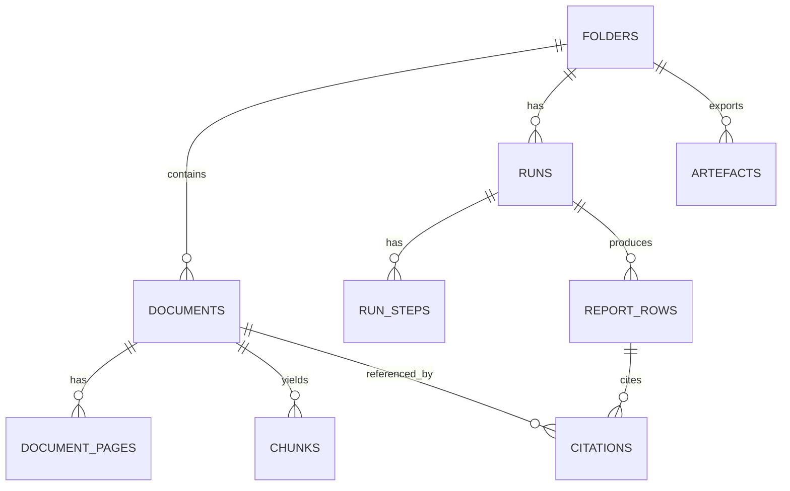

🧿 oracle 0.8.5 — Turns prompt spaghetti into ship-ready sauce.
[SYSTEM]
You are Oracle, a focused one-shot problem solver. Emphasize direct answers and cite any files referenced.

[USER]
# Oracle prompt: Close RH (spikes) for Initiative 0002

You are reviewing the shaping packet for **Initiative 0002: Quick Start Engine** (Title + Survey -> 3 artefacts).

## Context
- `risk-register.md` lists RH-2.1..RH-2.19 (rabbit holes). Most are treated as **Spikes** with matching spike sections in `spike-investigation.md`.
- `spike-investigation.md` contains the spike plans + report stubs. Assume these spikes have **not** been run yet (reports are mostly empty).
- We also have a PRD spine + thin PRD slices, but the initiative is **NO-GO** until key spikes close.

## Goal
Help us **close the rabbit holes** by making each spike:
- executable (smallest pack set, smallest harness)
- measurable (crisp pass/fail against `/truth`, no “eyeballing”)
- closable (explicit closure criteria + required committed artefacts + required doc updates)

## Constraints (must follow)
- Align with `docs/03-architecture/*` and `docs/03-architecture/DECISIONS.md`:
  - evidence-first + immutable citations (ID-only references)
  - verification is fail-closed (`citation_failed` with reason code taxonomy)
  - WDK boundaries (`"use workflow"` controller, `"use step"` side effects) and deterministic `step_key`
  - report-row status invariants in `docs/03-architecture/20_state_model.md` (do **not** invent new row statuses)
- Fixture pack names are canonical from `docs/08-example-data/packs_summary.md`.
- List-shaped artefacts (B-I / B-II / issues) may have **item-level states** inside payload items, but **must not** add new report-row statuses.
- Keep everything implementable and specific. Avoid generic advice.

## What to produce
1) **Closure table**: for each RH row in `risk-register.md`, output:
   - RH id
   - spike(s) that close it (or Patch/Cut recommendation)
   - *closure criteria* (explicit checkboxes)
   - artefacts to commit (exact file paths)
   - exact doc edits required (file paths; what to change)
2) **Spike edits**: specific edits to `spike-investigation.md` to make each spike runnable:
   - smallest pack set
   - comparator rules (what fields count, what normalisation is allowed)
   - what “proof” to capture (links to diffs, screenshots, scripts, etc.)
3) **Question set v1 proposal**:
   - propose `question_set_v1.json` with `<=25` questions, built from the attached `truth/golden_questions.json` across packs
   - include stable `question_id`s, groupings, and mark which 3 questions are list-shaped artefacts
   - define a concrete `question_set_version` string format and pinning semantics (end-to-end)
4) **SP-2.7 payload representation decision**:
   - pick one option (1-4) and justify it
   - propose a minimal `list_payload_v0` schema (JSON / Zod-ish) that can represent the attached `expected_*.csv` columns
   - include 1 short example payload item for: B-I requirement, B-II exception, survey issue
5) **GO checklist**:
   - update the initiative GO/NO-GO checklist (what must be true to flip to GO and start `wf-plan`)

### File: docs/04-projects/02-features/0002_quick-start-engine/brief.md
```md
# Project Brief (1-2 pager)

**Initiative 002: Quick Start Engine (Title + Survey -> 3 artefacts)**

- Dossier: `docs/04-projects/02-features/0002_quick-start-engine/`
- Status: Draft
- Last updated: 2026-02-07
- Owner:

Source docs (canonical):
- `docs/00-strategy/initiatives/initiative-overview-001-002-003.md`
- `docs/00-strategy/initiatives/002-quick-start-engine.md`
- `docs/03-architecture/00_overview.md`
- `docs/03-architecture/20_state_model.md`
- `docs/03-architecture/30_data_model.md`
- `docs/03-architecture/DECISIONS.md`

Dependencies:
- Initiative 001 ("trust substrate") must exist for citation locking, fail-closed verification, and viewer jump-to-evidence.

---

## Problem

We do not have a deterministic, testable path from a diligence pack (title commitment + exception instruments + survey) to a first-pass report that practitioners can trust. Manual analysis is slow, inconsistent, and difficult to validate against fixture "truth" data.

## Why it matters

This is the product wedge: a fast first pass that is evidence-backed and repeatable. Without a deterministic pipeline and eval anchors, we will drift into demo-only outputs that cannot be hardened.

## What we are building (PoC scope)

A "Quick Start: Title + Survey" run that produces a fixed question set v1 (<=25 rows). Three rows are list-shaped artefacts (rendered as tables in the report UI; export later):
1) Schedule B-I requirements tracker
2) Schedule B-II exceptions table linked to underlying instrument PDFs
3) Survey reconciliation issues list (title <-> survey)

Key trust posture (from `docs/03-architecture/*`):
- Evidence-first: every material claim needs locked citations
- Evidence references are IDs only (ADR-0001): drafting uses candidate `chunk_id`s; rows refer to locked `citation_id`s (no free-text citations)
- Verification is fail-closed: any mismatch -> `citation_failed`
- `missing_input` is a valid output and must follow invariants:
  - `answer` is exactly: `Not found in provided documents.`
  - citations are empty
  - `notes` (or provenance) includes an actionable missing-doc checklist
- Deterministic-ish orchestration via Workflow DevKit (workflow + steps)
- APIs must return the safe error envelope with `trace_id` on non-2xx (ADR-0008); do not leak internal errors/provider payloads

## Acceptance packs (fixtures)

Use fixture packs under `docs/08-example-data/` as the acceptance anchor (see `docs/08-example-data/packs_summary.md`):
- `pack_01_clean` (baseline happy path)
- `pack_02_missing_rea` (missing exception doc -> missing-input journey)
- `pack_03_mismatch_and_cert_gap` (survey cert gap + mismatch flags)
- `pack_04_multi_parcel` (multi-parcel scoping)
- `pack_05_partial_release` (lien/release complexity; needs-review flags)
- `pack_06_overlapping_easements` (disambiguation + missing attachment)
- `pack_07_scans_rotated_low_quality` (OCR torture; extraction-quality metering)
- `pack_08_defined_terms_and_cross_refs` (defined terms + exhibit chase)

## Goals

1. Deterministic, testable outputs for the fixture packs (start with `pack_01_clean` + `pack_02_missing_rea`).
2. Evidence-backed rows: citations are locked and verifiable; no "plausible but unprovable" answers.
3. A run UX that shows progress and produces incremental row updates with correct terminal statuses.

## Non-goals (explicit cuts)

- Freeform chat or open-ended research (no external web research inside runs).
- Legal advice, negotiation posture, or "materiality" decisions.
- Universal coverage of all title company formats or survey styles.
- Geometry overlays for easements (we link to evidence; we do not render corridors).

## Perimeter (in/out)

In scope:
- Question set v1 (<=25) with stable IDs and a stable row schema.
- Commitment parsing for Schedule A / B-I / B-II for fixture packs.
- Exception -> instrument matching with ambiguity surfaced at item-level as `match_status: ambiguous` with candidates listed (never silent).
- Survey extraction focused on certification + text callouts first.
- Reconciliation that prefers item-level `unknown` (row stays `needs_review`) over incorrect item-level `not_depicted`.
- WDK workflow orchestration: `retrieve -> draft -> lock citations -> verify -> write row`.

Out of scope:
- "Research agent" browsing.
- Auto strategy decisions (cure vs endorse vs accept).
- Deep semantic interpretation of easement scope.

## Key flows

See `breadboard-pack.md` for places/affordances/connections.
- Start run -> view run progress -> table populates -> open row drawer -> click citation -> jump to highlighted evidence

## Risks and unknowns (top)

See `risk-register.md` and `spike-investigation.md`.
Biggest items to resolve before PRDs:
- How we represent table-shaped artefacts (B-I/B-II/issues) within the report-row model without breaking status + citation invariants
- Parsing robustness on `pack_07_scans_rotated_low_quality`
- Exception matching + missing-attachment handling on `pack_06_overlapping_easements`
- Reconciliation honesty: bias to item-level `unknown` (row stays `needs_review`) rather than wrong item-level `not_depicted`
- Run idempotency: stable `snippet_hash` + no duplicate rows on restart

## Open questions

- Appetite/timebox for Initiative 002 shaping vs implementation.
- Who is the "practitioner" for the question-set spike (and how quickly can we get feedback)?
- Do we treat B-I/B-II/issues as three "big rows", or do we introduce a first-class "artefact table row" model?
- What is the initial question set v1 derived from (start with `golden_questions.json` per pack, then merge)?

## Shaping decision

- Decision: NO-GO for implementation (pending spikes; `prd.md`/`prd.json` exist as draft scaffolding only)
- GO when:
  - We have a credible question set v1
  - We have a clear artefact representation decision (rows vs tables)
  - We can pass the fixture-driven spikes on parsing/matching/survey extraction/idempotency
```

### File: docs/04-projects/02-features/0002_quick-start-engine/breadboard-pack.md
````md
# Breadboard Pack - Quick Start Engine (Initiative 002)

This pack is the wiring diagram and parts list for Initiative 002. It is intentionally "how it works" rather than "what to build first" (PRDs come after spikes).

## Context

- Canonical strategy: `docs/00-strategy/initiatives/002-quick-start-engine.md`
- Canonical architecture:
  - `docs/03-architecture/00_overview.md`
  - `docs/03-architecture/06_frameworks_agents_rag_evals.md` (WDK conventions)
  - `docs/03-architecture/20_state_model.md` (status invariants)
  - `docs/03-architecture/30_data_model.md` (citation locking + hashing)
  - `docs/03-architecture/DECISIONS.md` (ADRs)

Dependencies:
- Initiative 001 ("trust substrate") provides viewer, citation locking, and fail-closed verification primitives. Initiative 002 consumes them.

Constraints (non-negotiable):
- No external web research inside runs.
- OCR/layout extraction is the default for all PDFs.
- Draft -> lock citations -> verify is the required trust spine.

Acceptance packs (fixtures):
- `pack_01_clean`
- `pack_02_missing_rea`
- `pack_03_mismatch_and_cert_gap`
- `pack_04_multi_parcel`
- `pack_05_partial_release`
- `pack_06_overlapping_easements`
- `pack_07_scans_rotated_low_quality`
- `pack_08_defined_terms_and_cross_refs`

## Global wiring diagram (reference)

Legend:
- Solid = triggers/writes
- Dashed = reads/observes

```mermaid
flowchart LR
  U[User] -->|Start Quick Start| UI[Quick Start UI\n(Matter workspace)]
  UI -->|POST /folders/:id/runs| API[Runs API\n(Next.js route handler)]

  API -->|start| WF[WDK workflow\nQuickStartTitleSurveyWorkflow]
  WF -->|loop question_id| RET[Step: retrieve_evidence]
  RET --> DRAFT[Step: draft_row_json]
  DRAFT --> LOCK[Step: lock_citations\n(chunk_id -> citation_id)]
  LOCK --> VERIFY[Step: verify_row\n(fail-closed)]
  VERIFY --> WRITE[Step: write_report_row]

  WRITE --> PG[(Postgres\nruns, run_steps,\nreport_rows, citations)]
  UI -. "GET /runs/:id + GET /folders/:id/report?run_id=... (poll/SSE)" .-> API
  API -. read .-> PG

  UI -->|open row drawer| CITS_API[Citations API]
  CITS_API -->|GET /citations/:id| PG
  UI --> PDFV[PDF Viewer\n(pdf.js + highlight overlay)]
```

Notes:
- Ingestion (OCR/layout, chunking, indexing) is a prerequisite substrate and is not redefined here.
- For list-shaped outputs (requirements/exceptions/issues), keep a stable report-row "shell" but attach a structured payload with a stable item-level contract (versioned). Item-level states must not reuse report-row statuses.
- Canonical API contracts live in `docs/03-architecture/50_api_surface.md` (prefer matching those endpoint shapes over inventing new ones here).

---

# Breadboard 2.1 - Question set v1 + report schema freeze

## Goal

Freeze question set v1 (<=25) and a stable row shell schema so we can build deterministic steps and evals without scope creep.

## Places and affordances

- Place: Quick Start setup
  - Affordance: see the question set version and what this run will produce
- Place: Report table
  - Affordance: stable columns (question, status, updated_at) with row drawer for details
- Place: Row drawer
  - Affordance: answer, citations, and a single "Mark as reviewed" action (user-driven transition)

## UI affordances

| # | Place | Affordance | Control | Writes | Reads |
|---|---|---|---|---|---|
| U1 | Setup | Question set version label (pinned per run) | render | - | run record + question set registry |
| U2 | Setup | "Start run" CTA | click | create run | folder state |
| U3 | Table | Row status badge | render | - | report rows |
| U4 | Drawer | Citation list + click-to-jump | click | - | citations |
| U5 | Drawer | Mark as reviewed | click | row status -> reviewed | row |

## Code affordances

| # | Component/service | Affordance | Control | Notes |
|---|---|---|---|---|
| N1 | Question set registry | `getQuestionSetV1()` | read | Start with `golden_questions.json` per pack, then unify. |
| N2 | Row schema validator | `validateRow(row)` | call | Hard gate: invalid schema is a run failure (not silent). |
| N3 | Row renderer | `renderRow(row)` | call | For list-shaped answers, render a table view from structured payload. |
| N4 | Status invariants | `assertRowStatus(row)` | call | Must match `docs/03-architecture/20_state_model.md`. |

## Parts list (BOM)

| Part | Name | Mechanism |
|---|---|---|
| F2.1.1 | Question set v1 | JSON list with stable `question_id`s and a version tag. |
| F2.1.2 | Stable row shell schema | `{question_id, question, answer, citation_ids[], status, notes?, payload_json?, payload_schema_version?, provenance_json}`. |
| F2.1.3 | UI table + row drawer | Fixed columns, drawer detail, mark reviewed action. |

### Row invariants (always enforce)

From `docs/03-architecture/20_state_model.md`:
- `needs_review|reviewed`: row has >= 1 locked citation.
- `missing_input`: `answer` is exactly `Not found in provided documents.` and citations are empty; `notes` (or provenance) includes an actionable missing-doc checklist.
- `citation_failed`: include a safe reason code in provenance (e.g. `CITATION_MISMATCH`, `ENTAILMENT_FAIL`).

### List payload contract v0 (for B-I/B-II/issues)

Regardless of storage location (SP-2.7), list-shaped artefacts should share a stable, versioned item contract:
- `payload_schema_version`: string (e.g. `list_payload_v0`)
- `payload_json.items[]`:
  - `item_id`: string (stable/deterministic for diffing and idempotency)
  - `citation_ids[]`: locked citation IDs for any claimed fields on the item
  - Optional item-level fields:
    - `match_status`: `matched|ambiguous|missing_doc|missing_attachment`
    - `item_classification`: `depicted|not_depicted|unknown`
    - `notes?`
Item-level states do not change the report-row status machine.

## Fit check

| Requirement | Fixture anchor | Fit |
|---|---|---|
| <=25 stable questions | `golden_questions.json` across packs | ⚠️ spike (practitioner alignment) |
| Stable status machine | `docs/03-architecture/20_state_model.md` | ✅ |
| List-shaped outputs renderable | `expected_*` CSVs in `/truth` | ⚠️ design spike (payload representation) |

Cuts / out of bounds:
- No editable question sets in v1.
- No "confidence" used as a correctness signal (only UX hint).

---

# Breadboard 2.2 - Commitment parsing (Schedule A / B-I / B-II extraction)

## Goal

Extract Schedule A facts, B-I requirements list, and B-II exceptions list for fixture packs, matching `/truth` key fields (not wording).

## Places and affordances

- Place: Run progress
  - Affordance: "Parsing commitment" step shows progress and failure reasons
- Place: Requirements tracker (rendered from row payload)
  - Affordance: list of items with `bi_item`, owner placeholder, and citations
- Place: Exceptions table (rendered from row payload)
  - Affordance: list of items with `bii_item`, instrument refs, and citations

## Code affordances

| # | Component/service | Affordance | Control | Notes |
|---|---|---|---|---|
| N1 | Doc classifier | `classifyCommitment(document)` | step | Must be auditable; unknown -> `needs_review` (not silent ignore). |
| N2 | Commitment parser | `parseCommitment(text)` | step | Output is structured and schema-validated. |
| N3 | Item normalizer | `normalizeItemFields()` | pure | Dates, instrument numbers, item numbers. |
| N4 | Citation seeding | `seedSectionCitations()` | step | Allowed only to support section existence (e.g. “Schedule B-II”), never as the sole evidence for item content. If item-local evidence can’t be locked, downgrade the item to `unknown` rather than fabricating fields. |

## Parts list (BOM)

| Part | Name | Mechanism |
|---|---|---|
| F2.2.1 | Schedule A extraction | Proposed insured, insured estate, legal desc basics (as required by question set). |
| F2.2.2 | B-I extraction | `bi_item`, requirement text, owner placeholder. |
| F2.2.3 | B-II extraction | `bii_item`, type, instrument refs (instrument_no, recorded). |
| F2.2.4 | Uncertainty surfacing | When parsing is weak: row status remains `needs_review` with reason code (no hallucinated rows). |

## Fit check

| Requirement | Packs | Fit |
|---|---|---|
| B-I key fields match truth | `pack_01_clean`, `pack_04_multi_parcel` | ⚠️ spike |
| B-II key fields match truth | `pack_01_clean`, `pack_06_overlapping_easements` | ⚠️ spike |
| Works on scan torture pack | `pack_07_scans_rotated_low_quality` | ⚠️ spike (quality gating) |

Cuts / out of bounds:
- Not solving every title company format.
- No semantic interpretation of requirement meaning.

---

# Breadboard 2.3 - Exception instruments matching + per-instrument summary extraction

## Goal

Link exceptions to the correct instrument PDFs, extract short summaries + risk tags with citations, and surface ambiguity or missing docs explicitly.

## Places and affordances

- Place: Exceptions table row
  - Affordance: matched doc name + match state badge (`matched`, `ambiguous`, `missing_doc`)
- Place: Exception detail drawer
  - Affordance: summary, risk tags, citations, and candidate docs when ambiguous (resolution is out of scope for v1)

## Code affordances

| # | Component/service | Affordance | Control | Notes |
|---|---|---|---|---|
| N1 | Instrument matcher | `matchExceptionToDoc(exception, docs)` | step | Uses deterministic heuristics; never auto-picks when confidence is low. |
| N2 | Reference follower | `followReference(refString)` | step | For `pack_08_defined_terms_and_cross_refs` style exhibit chase. |
| N3 | Summary extractor | `summarizeInstrument(doc)` | step | Structured JSON output; citations must be lockable. |
| N4 | Missing attachment detector | `detectMissingAttachment(doc)` | step | For instruments referencing exhibits not present. |

## Parts list (BOM)

| Part | Name | Mechanism |
|---|---|---|
| F2.3.1 | Matching heuristics | instrument number, book/page, filename, and "defined terms" reference chain (bounded). |
| F2.3.2 | Ambiguity UI | Show candidates + guidance (no user selection in v1; keep row `needs_review`). |
| F2.3.3 | Missing-doc journey | If instrument doc absent (e.g. `pack_02_missing_rea`): item is `missing_doc` and row includes a missing-doc checklist. |
| F2.3.4 | Missing-attachment flag | If exhibit referenced but not provided: flag `missing_attachment` and keep going. |

## Fit check

| Requirement | Packs | Fit |
|---|---|---|
| Correct matches on happy path | `pack_01_clean` | ⚠️ spike |
| Disambiguation for overlaps | `pack_06_overlapping_easements` | ⚠️ spike |
| Missing exception doc handled | `pack_02_missing_rea` | ✅ (fixture exists) |
| Exhibit chase bounded | `pack_08_defined_terms_and_cross_refs` | ⚠️ spike |

Cuts / out of bounds:
- No deep semantic "scope" interpretation.
- No materiality scoring.

---

# Breadboard 2.4 - Survey parsing (certification + key callouts) with citations

## Goal

Extract survey certification parties and at least a baseline set of text callouts (encroachments/easements/access) with citations.

## Places and affordances

- Place: Survey extract row
  - Affordance: certification parties + callouts list
- Place: Quality indicator
  - Affordance: extraction quality badge and "needs manual review" when OCR is weak

## Code affordances

| # | Component/service | Affordance | Control | Notes |
|---|---|---|---|---|
| N1 | Survey classifier | `classifySurvey(document)` | step | Must tolerate scan-only PDFs. |
| N2 | Survey parser | `parseSurvey(layout)` | step | Focus on text callouts first; graphics are out of scope. |
| N3 | Quality scorer | `scoreSurveyExtraction()` | pure | Drives `needs_review` and UX copy. |

## Fit check

| Requirement | Packs | Fit |
|---|---|---|
| Certification extracted | `pack_01_clean` | ⚠️ spike |
| Cert gap flagged | `pack_03_mismatch_and_cert_gap` | ⚠️ spike |
| Works on scan torture pack | `pack_07_scans_rotated_low_quality` | ⚠️ spike |

Cuts / out of bounds:
- No property visualizer.
- No attempt to infer geometry-only labels without text support.

---

# Breadboard 2.5 - Title <-> survey reconciliation (honest issues list)

## Goal

Cross-check exception items against survey evidence and produce a reconciliation issues list that prefers "unknown/needs_review" over incorrect "not depicted".

Important alignment:
- The state machine for report rows remains `needs_review|reviewed|missing_input|citation_failed`.
- "depicted/not depicted/unknown" is an item-level classification inside the issues payload, not a new report-row status.

## Places and affordances

- Place: Issues list table (rendered from row payload)
  - Affordance: filters by classification and shows dual citations (instrument + survey)
- Place: Issue detail drawer
  - Affordance: guidance copy for "unknown" and what evidence is missing

## Code affordances

| # | Component/service | Affordance | Control | Notes |
|---|---|---|---|---|
| N1 | Reconciliation rules | `classifyIssue(exception, survey)` | pure | Deterministic rules first; model only as fallback with strict schema. |
| N2 | Evidence thresholding | `evidenceStrength()` | pure | When below threshold -> classify `unknown` and keep row `needs_review`. |
| N3 | Guidance generator | `buildGuidance()` | pure | "What to do next" copy for the drawer. |

## Fit check

| Requirement | Packs | Fit |
|---|---|---|
| Basic issues exist | `pack_01_clean` | ⚠️ spike |
| Mismatch/cert gap triggers issues | `pack_03_mismatch_and_cert_gap` | ⚠️ spike |
| Unknown bias works | `pack_07_scans_rotated_low_quality` | ⚠️ spike |

Cuts / out of bounds:
- No geometry overlays.
- No semantic interpretation of easement scope.

---

# Breadboard 2.6 - Run orchestration + incremental report population (WDK)

## Goal

Implement a WDK workflow that executes deterministic-ish steps per `question_id` and writes terminal report rows incrementally with progress events.

## Places and affordances

- Place: Run progress view
  - Affordance: step indicator and safe restart
- Place: Report table
  - Affordance: rows appear progressively during run

## Code affordances

| # | Component/service | Affordance | Control | Notes |
|---|---|---|---|---|
| N1 | Runs API | `POST /folders/:id/runs` | handler | Pins `index_version` + `agent_bundle_version` + `question_set_version`. Support `Idempotency-Key` and record `trace_id` for correlation (see `docs/03-architecture/50_api_surface.md`, `docs/03-architecture/60_observability_and_evals.md`). |
| N2 | Workflow controller | QuickStart workflow | workflow | Must start with `"use workflow"` and contain no side effects. |
| N3 | Steps | retrieve/draft/lock/verify/write | step | Must start with `"use step"`; steps own idempotency via a deterministic `step_key` stored in `run_steps`. |
| N4 | Row upsert invariant | unique `(run_id, question_id)` | DB constraint | Prevents duplicates on restart. |
| N5 | Status + export gating | fail-closed | policy | `citation_failed` rows are non-exportable by default. |

## Fit check

| Requirement | Packs | Fit |
|---|---|---|
| Rows stream in during run | `pack_01_clean` | ✅ |
| Missing-doc run fails safely | `pack_02_missing_rea` | ✅ |
| Restart is idempotent | any | ⚠️ spike |

Cuts / out of bounds:
- No free-running agent loops.
- No freeform chat.
````

### File: docs/04-projects/02-features/0002_quick-start-engine/risk-register.md
```md
# Risk register (rabbit holes)

Use this during shaping to capture tail risks and choose mitigations (Cut / Patch / Spike / Out-of-bounds).

Key rule (per `docs/00-strategy/initiatives/001-003_dependency_plan.md`):
- Breadboards + risk register + spikes come before PRDs.

| ID | Risk (write as a question) | Type | Why its risky | Treatment | Next step | Status |
|---|---|---|---|---|---|---|
| RH-2.1 | Does question set v1 (<=25) match practitioner expectations? | product | Wrong questions -> wrong artefacts even if extraction is "correct". | Spike | SP-2.1 practitioner review | open |
| RH-2.2 | How do we represent table-shaped artefacts (B-I/B-II/issues) inside the report-row model without breaking status + citation invariants? | design/tech | If we pick the wrong payload model, we either can't render or we lose traceability/citations. | Spike | SP-2.7 payload representation decision | open |
| RH-2.3 | Can commitment parsing match `/truth` key fields across clean + scan packs? | tech | OCR + format variance can silently degrade item extraction. | Spike | SP-2.2 parsing spike on packs incl `pack_07_scans_rotated_low_quality` | open |
| RH-2.4 | Can exception -> instrument matching avoid false matches and surface ambiguity/missing docs explicitly? | tech/data | Silent mismatches undermine trust more than missing outputs. | Spike | SP-2.3 matching spike on `pack_06_overlapping_easements` + `pack_02_missing_rea` | open |
| RH-2.5 | Can survey extraction reliably find certification parties + baseline callouts on scan packs? | tech | Surveys are messy; OCR noise can cause hallucinated callouts if we're not strict. | Spike | SP-2.4 survey spike on `pack_07_scans_rotated_low_quality` | open |
| RH-2.6 | Can reconciliation stay honest (bias to unknown/needs_review instead of incorrect "not depicted")? | product/tech | A confident wrong "not depicted" is worse than an "unknown". | Spike | SP-2.5 reconciliation honesty spike | open |
| RH-2.7 | Run idempotency: do restarts avoid duplicate rows and keep stable `snippet_hash`? | tech | Retries are normal; drift kills trust and breaks evals. | Spike | SP-2.6 idempotency + hashing spike | open |
| RH-2.8 | Missing attachment inside a provided instrument doc: do we detect and flag without blocking the run? | data | Missing exhibits can produce fabricated summaries unless explicitly flagged. | Spike | SP-2.3B overlaps + missing attachment | open |
| RH-2.9 | Too many `citation_failed` rows early: do we have a usable failure UX without "turning off" trust? | product/ux | Fail-closed is required; if UX is unusable, users will demand unsafe shortcuts. | Patch | Failure reason codes + guidance copy in drawer | open |
| RH-2.10 | Pack naming/fixtures drift: are strategy docs and code/evals aligned to `docs/08-example-data/*`? | process | Misnamed packs/truth files cause wasted work and false pass/fail in spikes. | Patch | Treat `packs_summary.md` + directory names as canonical; update other docs when needed | open |
| RH-2.11 | Retrieval recall: do we reliably retrieve the expected evidence chunks for golden questions before drafting? | tech | If retrieval is weak, everything degenerates into `missing_input` (or unsafe guesses), and you'll misdiagnose it as parsing failure. | Spike | SP-2.8 retrieval Recall@K | open |
| RH-2.12 | Run determinism: do runs pin `question_set_version` so “completed” invariants are enforceable and comparisons are stable? | tech/process | If question sets drift, “completed” becomes meaningless and evals become non-reproducible. | Patch | Add `runs.question_set_version` to canonical data model docs + propagate through breadboards/PRDs | open |
| RH-2.13 | Per-row failure handling vs run-level failure: can a run still reach `completed` with `citation_failed` rows (and sane UX)? | product/tech | If any per-row failure crashes the whole run, you'll get lots of `partial` runs and unstable evals. | Spike | Fold into SP-2.6: force one row to `citation_failed` and prove workflow continues and run can still reach `completed` | open |
| RH-2.14 | Multi-parcel scoping representation: can payloads represent parcel scoping without inventing new report-row statuses? | domain/design | `pack_04_multi_parcel` forces scoping; if payload can't express it, truth matching and UX will be messy. | Spike | SP-2.10 multi-parcel scoping representation | open |
| RH-2.15 | Bounded exhibit chase: can we follow defined terms/exhibits deterministically (depth, cycles) and log evidence? | tech/domain | Unbounded chase creates nondeterminism; bounded chase needs an explicit contract and reason codes. | Spike | SP-2.3C defined terms / exhibit chase boundedness | open |
| RH-2.16 | Human-in-the-loop ambiguity resolution: if users resolve ambiguity, how do we re-verify without mutating immutable citations? | product/tech | This touches run semantics, verification, and UX; implied “choose correct doc” is a footgun without explicit mechanics. | Spike | SP-2.13 human-in-the-loop ambiguity resolution semantics (optional; v1 cut) | open |
| RH-2.17 | Verification semantics for list-shaped rows: what gets verified, and what happens on partial item failure? | tech | Without a clear policy, spikes will “pass” while violating trust invariants or failing whole rows unnecessarily. | Spike | SP-2.11 list verification semantics | open |
| RH-2.18 | Run start gating vs folder state: can Quick Start run on `indexed` folders (with warnings) without blocking on `ready`? | product/tech | Scan packs may never be `ready`; if UI blocks runs until `ready`, you can't test scan torture behaviour. | Patch | SP-2.12 run gating vs folder state (`indexed` runnable + warning UX) | open |
| RH-2.19 | Truth comparator normalisation rules: are diff rules defined once (dates, instrument refs, item numbering) so spikes stay crisp? | process/tech | Without a normalisation contract, spikes devolve into arguing about diffs. | Patch | Write comparator spec + implement normalisers used in spikes/evals | open |

Notes:
- Status for report rows must follow `docs/03-architecture/20_state_model.md` (do not invent new row statuses).
- "Unknown" belongs as an item-level classification inside a row payload, not as a report-row status.
```

### File: docs/04-projects/02-features/0002_quick-start-engine/spike-investigation.md
````md
# Spike investigation - Quick Start Engine (Initiative 002)

This doc captures planned spikes for the rabbit holes in `risk-register.md`.

How to use:
- Each spike has a plan and a report stub.
- After running a spike: fill in the report stub and update `brief.md`, `breadboard-pack.md`, and `risk-register.md`.
- Keep spikes small: isolate failure modes and use the smallest pack set that proves the point.

Fixture sources:
- Pack list (canonical): `docs/08-example-data/packs_summary.md`
- Truth comparators: `docs/08-example-data/<pack>/truth/*`
- Viewer anchors: `docs/08-example-data/<pack>/layout/*.anchors.json`

## Proof contract (apply to every spike)

From `docs/03-architecture/20_state_model.md`:
- For any row with status `needs_review|reviewed`:
  - Must have `>= 1` locked citation, and verification must pass.
- For any row with status `missing_input`:
  - `answer` must be exactly `Not found in provided documents.`
  - citations must be empty
  - `notes` (or provenance) must include an actionable missing-doc checklist
- For any row with status `citation_failed`:
  - provenance must include a safe reason code from the failure taxonomy (prefer: `RETRIEVAL_MISS`, `CITATION_MISMATCH`, `ENTAILMENT_FAIL`) (see `docs/03-architecture/60_observability_and_evals.md`)

For list-shaped artefacts (B-I/B-II/issues):
- Any item that asserts a concrete field must include item-level `citation_ids[]` for that field.
- Item-level states (e.g. `match_status`, `depicted/not_depicted/unknown`) must not invent new report-row statuses.

Observability expectations (for spike proof capture):
- Correlate failures using `{trace_id, run_id, step_key, question_id}` (see `docs/03-architecture/60_observability_and_evals.md`).
- Retrieval provenance includes retrieved `chunk_id`s + scores and (where safe) `docs_searched` (see `docs/03-architecture/40_rag_and_agents.md`).
- Step inputs/outputs are JSON-serialisable and validated with Zod at the step boundary (see `docs/03-architecture/06_frameworks_agents_rag_evals.md`).

## Proof capture tooling (optional, but recommended)

To avoid Playwright/Chrome DevTools for quick UI automation and screenshots, prefer `agent-browser`:
```bash
pnpm dlx agent-browser install
pnpm dlx agent-browser --headed open http://localhost:3000
pnpm dlx agent-browser snapshot -i
pnpm dlx agent-browser screenshot --full docs/04-projects/02-features/0002_quick-start-engine/tmp/run.png
```

Alternative (persistent sessions, index-based): `browser-use`:
```bash
uvx "browser-use[cli]" open http://localhost:3000
uvx "browser-use[cli]" state
uvx "browser-use[cli]" screenshot
```

---

# SP-2.1 Practitioner question set review

## Question
Does question set v1 (<=25) match how a senior associate wants to consume a "first pass" title + survey report?

## Why now
If question set v1 is wrong, Initiative 002 can "work" while producing the wrong artefacts.

## Success criteria (proof)
- Practitioner says: "Yes, I'd use this table as a first pass."
- Questions total: `<=25`.
- 3 (and only 3) list-shaped artefacts:
  - B-I requirements tracker
  - B-II exceptions table
  - Reconciliation issues list
- Any added question must be offset by deletions to stay `<=25`.

## Deliverable
- A committed artefact capturing the frozen question set:
  - `docs/04-projects/02-features/0002_quick-start-engine/specs/question_set_v1.json` (preferred)
  - plus a short note of cuts/changes in this spike report stub

## Timebox
- <= 0.5 day (one pass)

## Approach
1. Start from the union of `golden_questions.json` across packs.
2. Present the output shapes (scalar vs list-shaped).
3. Record feedback and apply cuts/reorder/rename (no scope expansion beyond 25).

## Oracle notes
- Pending.

## Report (fill after running)
- Outcome:
- Practitioner notes (paraphrased):
- Question set version chosen:
- Cuts/patches:

---

# SP-2.8 Retrieval Recall@K (golden questions)

## Question
Before tuning parsing/matching, do we reliably retrieve the expected evidence chunks for golden questions (Recall@K)?

## Packs
- `pack_01_clean`

## Success criteria (proof)
- For each question in `docs/08-example-data/pack_01_clean/truth/golden_questions.json`:
  - retrieval returns at least one chunk overlapping the expected anchor page range (use `layout/*.anchors.json`)
- Report Recall@K for K=10 and K=25.
- Record misses with `{question_id, doc, page}` and the top retrieved chunks.

## Timebox
- <= 0.5 day

## Approach
1. Use the current retrieval pipeline with pinned `index_version`.
2. Compute Recall@K against anchors (small helper script is fine).
3. Decide: Patch retrieval vs accept baseline and move on.

## Oracle notes
- Pending.

## Report (fill after running)
- Outcome:
- Recall@10:
- Recall@25:
- Misses logged:
- Cuts/patches:

---

# SP-2.2A Commitment parsing baseline (clean)

## Question
Can we extract Schedule A facts, B-I requirements, and B-II exceptions matching `/truth` key fields on the clean pack?

## Packs
- `pack_01_clean`

## Success criteria (proof)
- Requirements tracker matches `truth/expected_requirements_tracker.csv` on:
  - exact item count
  - exact item numbers (and any truth key fields defined in the comparator)
- Exceptions table matches `truth/expected_exceptions_table.csv` on:
  - exact item count
  - exact item numbers
  - instrument reference fields normalised to a single canonical form (declare the normalisation once)
- Precision rule: 0 false positives (no extra items not present in truth by item number).

## Timebox
- <= 0.5 day

## Approach
1. Use truth CSVs as comparator (diffs, not eyeballing).
2. Record failures precisely (item numbering drift, date formats, instrument ref parsing).
3. Decide: Patch normalisers vs Cut formats.

## Oracle notes
- Pending.

## Report (fill after running)
- Outcome:
- Proof links:
- Normalisation decisions:
- Cuts/patches:

---

# SP-2.2B Multi-parcel parsing behaviour

## Question
Can the requirements/exceptions payload represent parcel scoping without inventing new report-row statuses?

## Packs
- `pack_04_multi_parcel`

## Success criteria (proof)
- At least one extracted requirement or exception item is explicitly scoped (e.g. Parcel 2) when truth indicates it.
- No silent “applies to all parcels” default unless evidence says so.
- Any parcel assignment cites item-local text (not headers).

## Timebox
- <= 0.5 day

## Oracle notes
- Pending.

## Report (fill after running)
- Outcome:
- Proof links:
- Payload field chosen for scoping:
- Cuts/patches:

---

# SP-2.2C Scan torture honesty gating

## Question
On scan torture packs, can we avoid hallucinations and still produce a usable row outcome?

## Packs
- `pack_07_scans_rotated_low_quality`

## Success criteria (proof)
Either:
1. Extracts items with 0 false positives and attaches citations, OR
2. The row is `missing_input` with:
  - exact answer string
  - zero citations
  - checklist that calls out low extraction quality remediation (rotate, re-scan, higher DPI, etc.)

And:
- Record a single threshold decision that triggers (1) vs (2) (no new statuses).

## Timebox
- <= 0.5 day

## Oracle notes
- Pending.

## Report (fill after running)
- Outcome:
- Threshold decision:
- Checklist copy:
- Cuts/patches:

---

# SP-2.3A Matching baseline + missing exception doc

## Question
Can we avoid false matches and surface missing-doc behaviour explicitly?

## Packs
- `pack_01_clean`
- `pack_02_missing_rea`

## Success criteria (proof)
- `pack_01_clean`: for exception items with truth-linked instruments:
  - `match_status: matched` and cites evidence for the match, OR
  - `match_status: ambiguous` with candidates listed (never silent auto-pick)
- `pack_02_missing_rea`:
  - the missing REA is surfaced as item-level `match_status: missing_doc`
  - notes include an actionable missing-doc checklist (include filename `REA.pdf`)
  - only use `missing_input` when an answer truly cannot be supported

## Timebox
- <= 0.5 day

## Oracle notes
- Pending.

## Report (fill after running)
- Outcome:
- Proof links:
- Matching rules:
- Cuts/patches:

---

# SP-2.3B Overlaps + missing attachment detection

## Question
Can we surface ambiguity and detect missing attachments without fabricating summaries?

## Packs
- `pack_06_overlapping_easements`

## Success criteria (proof)
- At least one ambiguous case is surfaced as:
  - item-level `match_status: ambiguous` with >=2 candidates
  - row remains `needs_review` (with citations) and requires manual resolution later
- Missing attachment is detected and recorded as item-level `match_status: missing_attachment` (or equivalent) with:
  - a citation to the clause referencing the exhibit/attachment
  - checklist includes expected missing attachment filename `Utility_Easement_10ft_ExhibitB.pdf` (from `docs/08-example-data/packs_summary.md`)
  - no fabricated summary of missing content

## Timebox
- <= 0.5 day

## Oracle notes
- Pending.

## Report (fill after running)
- Outcome:
- Proof links:
- Missing-attachment detector rule:
- Cuts/patches:

---

# SP-2.3C Defined terms / exhibit chase boundedness

## Question
Can we follow defined terms / exhibit references in a bounded, deterministic, auditable way?

## Packs
- `pack_08_defined_terms_and_cross_refs`

## Success criteria (proof)
- Reference following is bounded and logged:
  - `max_depth` chosen and recorded (2 or 3)
  - cycles terminate with a reason code like `REFERENCE_CYCLE` in provenance
  - chain recorded in provenance as ordered `{from_ref, to_doc, to_chunk_id}`
- If the definition target cannot be supported with a locked citation, return `missing_input` honestly.

## Timebox
- <= 0.5 day

## Oracle notes
- Pending.

## Report (fill after running)
- Outcome:
- Proof links:
- max_depth:
- Reason codes observed:
- Cuts/patches:

---

# SP-2.4A Survey extraction baseline + cert gap

## Question
Can we reliably extract certification parties and baseline text callouts with citations (and flag cert gaps)?

## Packs
- `pack_01_clean`
- `pack_03_mismatch_and_cert_gap`

## Success criteria (proof)
- Certification extraction outputs a structured set of parties (whatever truth supports), each backed by lockable citations.
- `pack_03_mismatch_and_cert_gap`: missing lender is flagged as a machine-readable issue code (e.g. `CERT_MISSING_LENDER`) with citation to the certification block.

## Timebox
- <= 0.5 day

## Oracle notes
- Pending.

## Report (fill after running)
- Outcome:
- Proof links:
- Issue codes used:
- Cuts/patches:

---

# SP-2.4B Survey scan torture behaviour

## Question
On scan torture, can we avoid made-up callouts and still produce a usable row outcome?

## Packs
- `pack_07_scans_rotated_low_quality`

## Success criteria (proof)
Either:
1. Emits callouts where each has >=1 locked citation, OR
2. Row is `missing_input` with remediation checklist (rotate/re-scan/etc).

## Timebox
- <= 0.5 day

## Oracle notes
- Pending.

## Report (fill after running)
- Outcome:
- Checklist copy:
- Cuts/patches:

---

# SP-2.5 Reconciliation honesty policy (unknown bias)

## Question
Can we keep reconciliation honest by biasing to item-level `unknown` instead of incorrect item-level `not_depicted`?

## Packs
- `pack_03_mismatch_and_cert_gap`
- `pack_07_scans_rotated_low_quality`

## Success criteria (proof)
- Item classification is one of: `depicted|not_depicted|unknown` (item-level only).
- Hard rule: `not_depicted` requires positive evidence of absence (define narrowly and cite it). Otherwise it must be `unknown`.
- If this cannot be made safe, cut v1 to `depicted|unknown` only and document it.

## Timebox
- <= 0.5 day

## Oracle notes
- Pending.

## Report (fill after running)
- Outcome:
- Evidence rules:
- Cut decision (if any):

---

# SP-2.6 Run idempotency + snippet_hash stability

## Question
On restart/retry, do we avoid duplicate rows and keep stable citation `snippet_hash` values (same pinned versions)?

## Packs
- `pack_01_clean`

## Success criteria (proof)
- After two runs with the same pinned versions (`index_version`, `agent_bundle_version`, `question_set_version`), the following are byte-identical after normalisation:
  - row status values
  - payload/answer (canonicalised)
  - ordered list of `citation.snippet_hash` values per row
- Allowed differences: timestamps, run IDs, DB IDs.
- Negative test: deliberately corrupt one locked citation (fixture/test hook) and confirm:
  - affected row becomes `citation_failed` with reason `CITATION_MISMATCH`
  - workflow continues processing remaining questions
  - run can still reach `completed` (exports remain blocked by default)

## Timebox
- <= 0.5 day

## Oracle notes
- Pending.

## Report (fill after running)
- Outcome:
- Proof links:
- Normalisation function used:
- Idempotency keys:

---

# SP-2.7 Payload representation decision (rows vs tables)

## Question
Where do we store and version the structured payload for list-shaped artefacts (B-I/B-II/issues) so UI can render it and evals can compare it?

Constraints:
- Must obey the report-row status invariants in `docs/03-architecture/20_state_model.md`.
- Citations must be lockable/immutable and attached to rows, and ideally to item-level entries.

## Packs
- `pack_01_clean`
- `pack_03_mismatch_and_cert_gap` (issues payload truth)

Notes:
- Multi-parcel scoping is covered separately by SP-2.10.

## Options to decide between
1. Store structured payload in `report_rows.provenance_json` and render from it in UI.
2. Store structured payload as JSON in `report_rows.answer` (string) and treat `answer` as machine-readable.
3. Introduce first-class artefact tables and keep report rows as summaries.
4. Add `report_rows.payload_json` (JSONB) + `payload_schema_version` columns (keep `answer` human-readable and provenance debug-only).

## Success criteria (proof)
- Can represent truth comparators faithfully (key fields + item numbering) for the chosen packs.
- Payload supports:
  - stable `item_id` per item (for diffing + idempotency)
  - item-level `citation_ids[]`
  - item-level states (`match_status`, `depicted/not_depicted/unknown`) without inventing new row statuses
- API response exposes `citation_ids[]` and UI renders from locked citations only (no chunk IDs).

## Timebox
- <= 0.5 day

## Oracle notes
- Pending.

## Report (fill after running)
- Decision:
- Why:
- Schema/UX implications:

---

# SP-2.9 Row invariant audit helper

## Question
Can we automatically assert report-row invariants so spikes can’t “pass” while violating the trust spine?

## Packs
- none (validator)

## Success criteria (proof)
A CLI or test helper that given a `run_id` asserts:
- Unique `(run_id, question_id)`
- `missing_input`: exact answer string + zero citations + checklist present
- `needs_review|reviewed`: >=1 locked citation
- `citation_failed`: has reason code

## Timebox
- <= 0.5 day

## Oracle notes
- Pending.

## Report (fill after running)
- Outcome:
- Tool location:
- Usage:

---

# SP-2.10 Multi-parcel scoping representation (focused)

## Question
Do we have a concrete scoping representation and UI rendering that stays within the row invariants?

## Packs
- `pack_04_multi_parcel`

## Success criteria (proof)
- At least one extracted item is scoped and displayed in the UI (e.g. “Parcel 2 only”) without inventing new report-row statuses.
- Item scoping is backed by lockable citations.

## Timebox
- <= 0.5 day

## Oracle notes
- Pending.

## Report (fill after running)
- Outcome:
- Proof links:
- Field + rendering decision:

---

# SP-2.11 Verification semantics for list-shaped rows

## Question
For a list payload (items with multiple claimed fields), what is the smallest safe verification policy that preserves fail-closed posture without creating unnecessary whole-row `citation_failed` outcomes?

## Packs
- `pack_01_clean`

## Success criteria (proof)
- A written v1 verification policy for list payloads that defines:
  - unit of verification (item-level fields, not just the row shell)
  - behavior on partial failures (choose one and justify):
    - downgrade unsupported fields/items to `unknown` (and re-verify), OR
    - fail the entire row as `citation_failed`
  - required provenance fields + reason codes for auditability
- The policy is consistent with the row invariants in `docs/03-architecture/20_state_model.md` and the fail-closed posture in ADR-0002.
- If a “downgrade/repair” path is chosen, the step boundary is explicit: where the repair occurs (draft vs verify) and how citations remain immutable (no mutation of existing `citation_id`s).

## Timebox
- <= 0.5 day

## Oracle notes
- Pending.

## Report (fill after running)
- Outcome:
- Policy chosen:
- Cut/patch decisions:

---

# SP-2.12 Run gating vs folder state (`indexed` runnable + warning UX)

## Question
Can Quick Start run on `indexed` folders even when `ready` health checks fail, with explicit warning UX and no blocking?

## Packs
- `pack_07_scans_rotated_low_quality`

## Success criteria (proof)
- Run start is allowed when `folders.state in {indexed, ready}` (matches `docs/03-architecture/20_state_model.md` and `docs/03-architecture/50_api_surface.md`).
- UI shows an explicit “quality warning” state when folder is `indexed` but not `ready` (e.g. low extraction quality) while still allowing the run to start.
- The warning UX is safe and actionable (no internal errors/provider payloads; points to remediation like re-scan/rotate/re-upload).

## Timebox
- <= 0.25 day

## Oracle notes
- Pending.

## Report (fill after running)
- Outcome:
- Warning copy:
- Cuts/patches:

---

# SP-2.13 Human-in-the-loop ambiguity resolution semantics (optional; v1 cut)

## Question
If/when a user resolves an ambiguous match, how do we re-run verification without mutating immutable citations and without hand-wavy “choose correct doc” behavior?

## Packs
- `pack_06_overlapping_easements`

## Success criteria (proof)
- A concrete mechanism is chosen and documented (one of):
  - new run type (e.g. `quick_start_repair`) that re-runs a single `question_id`, OR
  - a new run with an override that pins the user selection as input
- Existing citations remain immutable; the resolution produces new locked citations and a newly verified output (no in-place mutation).
- UX/auditability: the system can show what changed (original ambiguous output vs resolved output) and why.

## Timebox
- <= 0.5 day

## Oracle notes
- Pending.

## Report (fill after running)
- Outcome:
- Mechanism chosen:
- Data model implications:
````

### File: docs/04-projects/02-features/0002_quick-start-engine/prd.md
```md
# PRD: 0002 Quick Start Engine (PRD Spine + Slices)

Owner:
Status: Draft (NO-GO until key spikes close)
Date: 2026-02-07
Slug: 0002-quick-start-engine

## Summary

Implement the deterministic-ish “Quick Start: Title + Survey” run that turns a fixture pack into three evidence-backed artefacts:
1. Schedule B-I requirements tracker
2. Schedule B-II exceptions table (linked to instruments)
3. Survey reconciliation issues list (title ↔ survey)

This `prd.md` is an initiative-level spine. Implementation should happen via the thin slice PRDs listed below.

## Non-negotiable constraints (from architecture)

From `docs/03-architecture/*` and `docs/03-architecture/DECISIONS.md`:
- Evidence-first (ADR-0001): drafting uses candidate `chunk_id`s; rows refer to locked `citation_id`s only.
- Verification is fail-closed (ADR-0002): mismatch/entailment fail → `citation_failed`; blocked from export by default.
- OCR/layout extraction is default for all PDFs (ADR-0003) for geometry highlights.
- Retrieval returns IDs (ADR-0004): chunk IDs + scores; provenance stores IDs, not prose.
- Orchestration via WDK (ADR-0005): `"use workflow"` controller; `"use step"` side effects; step idempotency via deterministic `step_key`.
- Fixtures + evals are first-class (ADR-0006): success is measurable vs `/truth`.
- No external web research inside runs (ADR-0007).
- APIs use a safe error envelope with `trace_id` (ADR-0008); never leak internal errors/provider payloads.

## Dependencies

- Initiative 0001 “trust substrate” must exist for:
  - citation locking + immutable citations
  - click-to-jump PDF viewer highlights
  - report-row status invariants and export gating UX

## Acceptance anchors (fixtures)

Canonical pack list: `docs/08-example-data/packs_summary.md`.

Primary near-term anchors for implementation slices:
- `pack_01_clean`
- `pack_02_missing_rea`
- `pack_03_mismatch_and_cert_gap`
- `pack_07_scans_rotated_low_quality`

## Slice PRDs (thin, executable)

1. `prds/prd-slice-01-run-skeleton.md`
  - Runs API + version pinning + WDK workflow skeleton + incremental UI progress, with strict invariants.
2. `prds/prd-slice-02-row-payload-contract.md`
  - Decide and implement list payload storage + schema versioning + UI rendering contract for artefact tables.
3. `prds/prd-slice-03-commitment-parsing-pack-01-clean.md`
  - Commitment parsing baseline for `pack_01_clean` producing B-I + B-II payloads matching truth key fields.
4. `prds/prd-slice-04-exception-matching-pack-01-02.md`
  - Exception → instrument matching baseline + missing-doc journey on `pack_02_missing_rea`; ambiguity surfaced without “silent pick”.
5. `prds/prd-slice-05-survey-extraction-pack-01-03.md`
  - Survey extraction baseline + certification gap issue on `pack_03_mismatch_and_cert_gap` with locked citations.
6. `prds/prd-slice-06-reconciliation-honesty-pack-03-07.md`
  - Reconciliation issues list with an honesty policy (bias to item-level `unknown`; `not_depicted` requires positive evidence of absence).

## Open questions (spike-owned)

- Payload representation decision (SP-2.7): where structured artefact payload lives (and how API exposes it).
- Retrieval Recall@K baseline (SP-2.8): are we retrieving the right evidence before drafting?
- Scan torture honesty policy: when to downgrade to `missing_input` vs emit `unknown` items safely.
- Human-in-the-loop ambiguity resolution: if we later allow selection, it must re-verify and must not mutate immutable citations.

## Sources

- `brief.md`: `docs/04-projects/02-features/0002_quick-start-engine/brief.md`
- `breadboard-pack.md`: `docs/04-projects/02-features/0002_quick-start-engine/breadboard-pack.md`
- `risk-register.md`: `docs/04-projects/02-features/0002_quick-start-engine/risk-register.md`
- `spike-investigation.md`: `docs/04-projects/02-features/0002_quick-start-engine/spike-investigation.md`
```

### File: docs/04-projects/02-features/0002_quick-start-engine/prds/prd-slice-01-run-skeleton.md
```md
# PRD: Initiative 0002 (Slice 1) Run Skeleton + Version Pinning + Incremental Progress

Owner:
Status: DRAFT (NO-GO until SP-2.1/2.7 contracts are frozen)
Date: 2026-02-07
Slug: 0002-s1-run-skeleton

## Introduction / Overview

### Problem
We need a durable, resumable, observable Quick Start run surface (API + workflow + UI) before we can safely iterate on parsing/matching/extraction logic.

### Goal
Ship the canonical run API + WDK workflow skeleton that:
- pins versions (`index_version`, `agent_bundle_version`, `question_set_version`)
- writes rows incrementally with correct terminal statuses and invariants
- is fully debuggable (trace_id, step_key, reason codes)

### Slice
Implement the *run skeleton* only:
- Question set v1 is loaded and pinned per run.
- Workflow executes the step machine (`retrieve -> draft -> lock -> verify -> write`) but may return placeholder `missing_input` rows until parsing/matching slices ship.

### Primary Observable Effect
On a Matter built from a fixture pack, a user can click "Quick Start: Title + Survey" and see:
- a running progress indicator (questions_total/questions_done)
- rows appearing in the report table as each question completes
- stable, terminal statuses per row

### In Scope
- API endpoints (canonical): `POST /folders/:id/runs`, `GET /runs/:id`, `GET /folders/:id/report?run_id=...`
- Error envelope + `trace_id` on non-2xx (ADR-0008)
- Run + step correlation: `{trace_id, run_id, step_key, question_id}` (observability doc)
- WDK workflow/step boundaries (`"use workflow"`, `"use step"`) and deterministic step idempotency via `step_key`
- Unique `(run_id, question_id)` enforcement (no duplicate rows on retries)

## Goals

- A run can start, progress, and complete deterministically on fixture Matters without producing duplicate rows.
- Every produced row obeys `docs/03-architecture/20_state_model.md` invariants.
- Debugging is possible from persisted state and logs (no “black box” runs).

## User Stories

### US-001: Start Quick Start run and observe progress
As a user, I can start a Quick Start run and watch progress so I know it’s working and can inspect partial results.

#### Acceptance Criteria
- AC-001: `POST /folders/:id/runs` only allows start when `folders.state in {indexed, ready}`; otherwise returns `409` with `error.code="CONFLICT"` and the standard error envelope including `trace_id`.
- AC-002: The created run pins `index_version`, `agent_bundle_version`, and `question_set_version` and returns them in the response.
- AC-003: `GET /runs/:id` returns progress counts and failure taxonomy counts (shape per `docs/03-architecture/50_api_surface.md`).

#### Verification
- Packs: `docs/08-example-data/pack_01_clean`, `docs/08-example-data/pack_02_missing_rea`
- Manual: start run from UI; observe progress updates; refresh mid-run and confirm state is consistent.

### US-002: Rows appear incrementally and always obey invariants
As a user, I can see rows appear in the report table as they finish, and every row is in a terminal status with correct evidence behavior.

#### Acceptance Criteria
- AC-004: `GET /folders/:id/report?run_id=...` returns rows for the selected run; UI never reads Postgres directly.
- AC-005: `completed` runs have exactly one row per `question_id` for the run’s `question_set_version`.
- AC-006: If a row is `missing_input`, `answer` is exactly `Not found in provided documents.`, citations are empty, and `notes` (or provenance) includes an actionable checklist.
- AC-007: If a row is `citation_failed`, provenance includes a safe taxonomy reason code (e.g. `CITATION_MISMATCH`, `ENTAILMENT_FAIL`).
- AC-008: Row-level failures do not crash the run: if a question yields `citation_failed`, the workflow continues and the run can still reach `completed` after writing terminal rows for all questions (exports remain blocked by default).

#### Verification
- Packs: `pack_01_clean`, `pack_02_missing_rea`
- Automated: DB constraint for unique `(run_id, question_id)`; row invariant audit helper (if present).

## Functional Requirements

- FR-001: API layer validates external inputs with Zod and returns the safe error envelope (ADR-0008).
- FR-002: `POST /folders/:id/runs` supports `Idempotency-Key` (for safe retries).
- FR-003: Workflow controller contains no side effects; all side effects occur in steps.
- FR-004: Steps record a deterministic `step_key` in `run_steps` and short-circuit repeats.
- FR-005: Workflow and steps use the WDK directive string literal as the first statement (`"use workflow"`, `"use step"`).
- FR-006: Logs/events are correlate-able with `{trace_id, run_id, step_key, question_id}` and avoid raw PDF/text logging (logging safety rules).

## Non-Goals (Out of Scope)

- Correct parsing/matching/extraction outputs (handled in later slices).
- Any external web research inside runs (ADR-0007).

## Failure States & UX

- Folder not runnable (`empty|ingesting|failed`): disable CTA + show safe error reason (no stack traces).
- Run step failure: run becomes `partial` with a visible failure banner; completed rows remain inspectable.
- Row failure: write a terminal `citation_failed` row with reason code and continue to the next question; run may still reach `completed`.

## Metrics / Logging

- `run_duration_ms` (p50/p95), retries per step, counts by row status, counts by failure taxonomy code.

## Rollback / Disable Plan

- Feature flag: `quick_start_enabled` (default off until slice 2+ ship).

## Sources

- `docs/03-architecture/50_api_surface.md` (canonical endpoints + error envelope)
- `docs/03-architecture/06_frameworks_agents_rag_evals.md` (WDK conventions)
- `docs/03-architecture/20_state_model.md` (row/run invariants)
- `docs/03-architecture/60_observability_and_evals.md` (taxonomy + correlation)
- Dossier breadboard: `docs/04-projects/02-features/0002_quick-start-engine/breadboard-pack.md`
```

### File: docs/04-projects/02-features/0002_quick-start-engine/prds/prd-slice-02-row-payload-contract.md
```md
# PRD: Initiative 0002 (Slice 2) Row Payload Contract + Artefact Table Rendering

Owner:
Status: DRAFT (Blocked until SP-2.7 decision is confirmed)
Date: 2026-02-07
Slug: 0002-s2-row-payload-contract

## Introduction / Overview

### Problem
The Quick Start UX is “artefacts-first”, but the canonical report row model is a flat `{answer, citation_ids[], status}` shell. Without a stable, versioned structured payload contract, we can’t:
- render B-I/B-II/issues as tables deterministically
- diff outputs for evals
- keep item-level evidence honest without inventing new row statuses

### Goal
Introduce a versioned, list-shaped payload contract for artefact rows and make it renderable in the UI from locked citations only.

### Slice
Ship the payload contract + storage + API exposure + UI rendering for list-shaped artefacts.

### Primary Observable Effect
In the report table, list-shaped artefact rows render as tables backed by structured `payload_json` (not prose parsing), with item-level citations that jump-to-evidence.

### In Scope
- A single, stable “list payload v0” schema with:
  - stable `item_id`
  - item-level `citation_ids[]`
  - optional item-level states (`match_status`, `item_classification`) that do not change report-row statuses
- Storage + versioning for structured payload (see Decision below)
- API returns payload + schema version alongside the existing row shell
- UI renders artefact tables from payload (table view + row drawer)

## Decision (proposed for this slice)

Implement Option 4 from SP-2.7:
- Add `report_rows.payload_json` (JSONB) and `report_rows.payload_schema_version` (string)
- Keep `report_rows.answer` as a human-readable summary string
- Keep `report_rows.provenance_json` as debug-only (do not rely on it as a product contract)

If this decision changes during SP-2.7, update this PRD accordingly before implementation.

## Goals

- List-shaped artefacts can be rendered deterministically from structured payload (no prose parsing).
- Payload is stable and versioned for eval comparators and UI.
- Item-level evidence is honest: unsupported fields/items are downgraded (no fabrication).

## User Stories

### US-001: Artefact rows have a versioned list payload
As a user, I want B-I/B-II/issues to be structured so that the UI can render them as tables and evals can compare them reliably.

#### Acceptance Criteria
- AC-001: Artefact rows include `payload_schema_version = "list_payload_v0"` and `payload_json.items[]`.
- AC-002: Each item has a stable `item_id` and item-level `citation_ids[]` for any claimed fields.
- AC-003: Item-level states (e.g. `match_status`, `depicted/not_depicted/unknown`) do not invent new report-row statuses.

#### Verification
- Packs: `pack_01_clean` (seeded payload acceptable for this slice)
- Automated: Zod schema validation for payload_json; JSON round-trip stability.

### US-002: UI renders artefact tables from payload and locked citations
As a user, I can view B-I/B-II/issues as tables, open a row drawer, and click citations to jump to evidence.

#### Acceptance Criteria
- AC-004: UI renders artefact rows from `payload_json` only (no parsing `answer` prose).
- AC-005: Clicking an item’s citation chip uses locked citations (`GET /citations/:id`) and highlights evidence in the viewer (dependency: Initiative 0001).
- AC-006: If payload is missing or invalid, UI shows a safe error state (no internal leak) and the row remains inspectable.

#### Verification
- Manual: seeded fixture run shows tables render; citations click-to-highlight.

## Functional Requirements

- FR-001: Payload schemas live in `packages/core/schemas` (Zod) and are validated at the step boundary (see `docs/03-architecture/06_frameworks_agents_rag_evals.md`).
- FR-002: Add DB columns `report_rows.payload_json` (JSONB) and `report_rows.payload_schema_version` (string).
- FR-003: `GET /folders/:id/report?run_id=...` includes payload fields (nullable) in each row response, without breaking existing clients.
- FR-004: Item-level citations are locked `citation_id`s only; no chunk IDs are exposed to the UI (ADR-0001).
- FR-005: Error handling uses the standard error envelope with `trace_id` (ADR-0008).

## Non-Goals (Out of Scope)

- Defining the final set of fields for each artefact (that’s owned by parsing/matching/survey slices and truth comparators).
- Any human-in-the-loop editing or mutation of row content.

## Failure States & UX

- Invalid payload schema: show “row payload invalid” banner with safe `error.code=INTERNAL` and `trace_id`.
- Missing payload for an artefact row: show “payload not available yet” guidance; do not attempt prose parsing.

## Metrics / Logging

- Count of payload schema validation failures (hard gate in evals).
- UI render failures by payload_schema_version (should be 0 for v0).

## Rollback / Disable Plan

- Feature flag: `artefact_table_rendering_enabled` (default off until seeded payload renders correctly).

## Sources

- SP-2.7: `docs/04-projects/02-features/0002_quick-start-engine/spike-investigation.md`
- State invariants: `docs/03-architecture/20_state_model.md`
- API contract: `docs/03-architecture/50_api_surface.md`
- Evidence-first ADRs: `docs/03-architecture/DECISIONS.md` (ADR-0001, ADR-0002)
```

### File: docs/04-projects/02-features/0002_quick-start-engine/prds/prd-slice-03-commitment-parsing-pack-01-clean.md
```md
# PRD: Initiative 0002 (Slice 3) Commitment Parsing Baseline (pack_01_clean)

Owner:
Status: DRAFT (Blocked until Slice 2 payload contract is in place)
Date: 2026-02-07
Slug: 0002-s3-commitment-parsing-pack-01-clean

## Introduction / Overview

### Problem
We need deterministic, fixture-verifiable extraction of commitment structure (B-I requirements + B-II exceptions) before we can claim the Quick Start artefacts are real.

### Goal
For `pack_01_clean`, produce B-I + B-II structured payloads that match `/truth` key fields with locked citations and fail-closed verification.

### Slice
Implement commitment parsing for the clean pack only:
- Identify the commitment doc(s)
- Extract B-I and B-II items into the list payload contract
- Attach lockable citations per item and verify fail-closed

### Primary Observable Effect
On `pack_01_clean`, the report table shows:
- a B-I requirements tracker artefact row with items matching truth key fields
- a B-II exceptions table artefact row with items matching truth key fields
Both rows are `needs_review` with lockable citations; no extra hallucinated items.

### In Scope
- `pack_01_clean` only
- Output comparison vs:
  - `truth/expected_requirements_tracker.csv`
  - `truth/expected_exceptions_table.csv`
- Item normalisation rules for:
  - item numbering
  - instrument reference canonical form (when present in truth)

## Goals

- 0 false positives: never emit an item that is not present in truth by item number.
- Evidence-backed items: claimed fields have lockable citations; verification passes.
- Comparator-driven proof: diffs vs truth are computed, not eyeballed.

## User Stories

### US-001: Extract B-I requirements tracker (clean pack)
As a user, I can see a B-I requirements tracker table derived from the commitment and backed by evidence.

#### Acceptance Criteria
- AC-001: For `pack_01_clean`, extracted requirements item count equals truth item count.
- AC-002: For `pack_01_clean`, every extracted item has the correct truth item number and required key fields as defined by the comparator.
- AC-003: Precision rule: no extra items not present in truth by item number.
- AC-004: Each extracted item has item-level `citation_ids[]` that lock and verify (no header-only evidence for item content).

#### Verification
- Pack: `docs/08-example-data/pack_01_clean`
- Automated: comparator script diffs payload vs `truth/expected_requirements_tracker.csv`; row invariant audit; citation integrity checks.

### US-002: Extract B-II exceptions table (clean pack)
As a user, I can see a B-II exceptions table derived from the commitment and backed by evidence.

#### Acceptance Criteria
- AC-005: For `pack_01_clean`, extracted exceptions item count equals truth item count.
- AC-006: For `pack_01_clean`, every extracted exception has the correct item number and required key fields as defined by the comparator.
- AC-007: Instrument references are normalised to a single canonical form (declared once and reused everywhere).
- AC-008: Each extracted exception item has item-level `citation_ids[]` that lock and verify.

#### Verification
- Pack: `pack_01_clean`
- Automated: comparator script diffs payload vs `truth/expected_exceptions_table.csv`; citation integrity checks.

## Functional Requirements

- FR-001: Retrieval returns chunk IDs + scores (ADR-0004) and stores retrieved IDs/scores in row provenance (debug-only).
- FR-002: Drafting output includes candidate citations as chunk IDs (ADR-0001), which are then locked into immutable citations before verification.
- FR-003: Verification is fail-closed (ADR-0002). Any mismatch yields `citation_failed` with taxonomy reason code.
- FR-004: Step boundaries follow WDK conventions (`"use workflow"`, `"use step"`), and step inputs/outputs are JSON-serialisable and Zod-validated.
- FR-005: The list payload contract from Slice 2 is used (`payload_schema_version=list_payload_v0`, stable `item_id`).
- FR-006: Any model calls (draft/verify/embed) go through AI SDK (gateway default) per ADR-0013 (proposed); do not call provider SDKs directly without an explicit reason.

## Non-Goals (Out of Scope)

- Scan torture behavior (`pack_07_scans_rotated_low_quality`).
- Multi-parcel scoping (`pack_04_multi_parcel`).
- Exception → instrument PDF matching (Slice 4).

## Failure States & UX

- If evidence cannot be locked for an item field, downgrade that field/item to `unknown` rather than fabricating it; keep row `needs_review`.
- If verification fails for the row, row becomes `citation_failed` with reason code and guidance.

## Metrics / Logging

- Comparator pass rate for B-I and B-II on pack_01_clean.
- Failure taxonomy counts (`RETRIEVAL_MISS`, `ENTAILMENT_FAIL`, `CITATION_MISMATCH`).

## Rollback / Disable Plan

- Feature flag: `quick_start_commitment_parsing_enabled` (default off until pack_01_clean passes).

## Sources

- Architecture: `docs/03-architecture/40_rag_and_agents.md`, `docs/03-architecture/20_state_model.md`, `docs/03-architecture/60_observability_and_evals.md`
- Dossier spikes: SP-2.2A in `docs/04-projects/02-features/0002_quick-start-engine/spike-investigation.md`
```

### File: docs/04-projects/02-features/0002_quick-start-engine/prds/prd-slice-04-exception-matching-pack-01-02.md
```md
# PRD: Initiative 0002 (Slice 4) Exception → Instrument Matching (pack_01_clean + pack_02_missing_rea)

Owner:
Status: DRAFT (Depends on Slice 3 exceptions extraction)
Date: 2026-02-07
Slug: 0002-s4-exception-matching-pack-01-02

## Introduction / Overview

### Problem
Even if we extract a correct B-II exceptions list, it’s not useful unless each exception can be linked to the correct instrument PDF (or explicitly marked missing/ambiguous) without silent false matches.

### Goal
For `pack_01_clean` and `pack_02_missing_rea`, deterministically match exceptions to instrument docs and surface missing/ambiguous states explicitly, backed by locked citations.

### Slice
Implement matching baseline + missing-doc journey:
- Deterministic matching rules (instrument number, book/page, filename hints)
- Item-level `match_status` with candidates (no silent auto-pick)
- Missing-doc checklist behavior for `pack_02_missing_rea`

### Primary Observable Effect
In the B-II exceptions table:
- Each exception item shows a match badge (`matched|ambiguous|missing_doc`) and matched doc name (or candidates list)
- Missing docs show an actionable checklist

### In Scope
- Packs:
  - `pack_01_clean`
  - `pack_02_missing_rea`
- Item-level match states:
  - `matched|ambiguous|missing_doc`
- Candidate display (no selection/persistence in v1)

## Goals

- No silent false matches: ambiguous cases are surfaced, not auto-picked.
- Missing-doc journey is explicit and actionable.
- Matching evidence is inspectable (citations point to the reference fields used for matching).

## User Stories

### US-001: Match exceptions to instrument PDFs (clean pack)
As a user, I can click an exception item and see which instrument it matched to, with evidence.

#### Acceptance Criteria
- AC-001: For `pack_01_clean`, exception items with truth-linked instruments resolve to `match_status=matched`.
- AC-002: Each matched item includes citations that support the match (e.g. instrument no / recording reference).
- AC-003: No silent auto-pick: if >1 candidate matches, the item is `match_status=ambiguous` with candidates listed.

#### Verification
- Pack: `docs/08-example-data/pack_01_clean`
- Automated: spot-check candidate lists vs expected; ensure no items are marked matched when multiple candidates exist.

### US-002: Surface missing-doc journey (pack_02_missing_rea)
As a user, I see missing instrument docs called out explicitly with a checklist so I can fix the pack.

#### Acceptance Criteria
- AC-004: For `pack_02_missing_rea`, exceptions referencing the missing REA are `match_status=missing_doc`.
- AC-005: Row notes include an actionable checklist, including the expected filename when known (e.g. `REA.pdf`).
- AC-006: Row status uses `missing_input` only when an answer truly cannot be supported; otherwise row remains `needs_review` with item-level missing states.

#### Verification
- Pack: `docs/08-example-data/pack_02_missing_rea`
- Manual: verify checklist copy is actionable and specific (no generic “upload doc” only).

## Functional Requirements

- FR-001: Matching runs as a workflow step (`"use step"`) and is idempotent via deterministic `step_key`.
- FR-002: Item-level match state is stored in the list payload (not as a report-row status).
- FR-003: Evidence-first: matching references are backed by locked citations; if citations can’t be locked, downgrade to `ambiguous` or `missing_doc` (no fabricated match).
- FR-004: Errors use the standard error envelope with `trace_id` (ADR-0008) and avoid leaking provider payloads.
- FR-005: Reason codes align with the failure taxonomy when matching fails in a row-blocking way (e.g. `RETRIEVAL_MISS`).

## Non-Goals (Out of Scope)

- Missing attachment detection (`pack_06_overlapping_easements`) and exhibit chase (`pack_08_defined_terms_and_cross_refs`) (handled in later slices/spikes).
- Human-in-the-loop “choose correct doc” persistence (v1 cut; must re-verify and must not mutate immutable citations if added later).

## Failure States & UX

- Ambiguous match: show candidates + guidance; keep row `needs_review`.
- Missing doc: show checklist; keep row inspectable; allow upload + re-run.

## Rollback / Disable Plan

- Feature flag: `exception_matching_enabled` (default off until `pack_01_clean` and `pack_02_missing_rea` pass).

## Sources

- Matching spikes: SP-2.3A in `docs/04-projects/02-features/0002_quick-start-engine/spike-investigation.md`
- State invariants: `docs/03-architecture/20_state_model.md`
- RAG pipeline: `docs/03-architecture/40_rag_and_agents.md`
```

### File: docs/04-projects/02-features/0002_quick-start-engine/prds/prd-slice-05-survey-extraction-pack-01-03.md
```md
# PRD: Initiative 0002 (Slice 5) Survey Extraction Baseline + Cert Gap (pack_01_clean + pack_03_mismatch_and_cert_gap)

Owner:
Status: DRAFT
Date: 2026-02-07
Slug: 0002-s5-survey-extraction-pack-01-03

## Introduction / Overview

### Problem
Survey reconciliation is only as honest as the underlying survey extraction. If we can’t reliably extract certification parties and baseline text callouts with evidence, reconciliation will drift into hallucinations.

### Goal
For `pack_01_clean` and `pack_03_mismatch_and_cert_gap`, extract:
- certification parties (including lender presence/absence where truth supports it)
- baseline text callouts (where truth supports them)
with locked citations and fail-closed verification.

### Slice
Implement survey extraction baseline:
- Survey doc classification/routing
- Structured output for certification + callouts in list payload
- `CERT_MISSING_LENDER` (or equivalent) issue code for cert gap pack

### Primary Observable Effect
In the survey artefact row drawer:
- certification section shows extracted parties with citations
- issues include a cert gap issue code for `pack_03_mismatch_and_cert_gap` with evidence

### In Scope
- Packs:
  - `pack_01_clean`
  - `pack_03_mismatch_and_cert_gap`
- Outputs compared to `truth/expected_survey_issues.csv` where applicable (key fields, not wording)

## Goals

- No invented callouts: if evidence can’t be locked, downgrade or fail safely.
- Cert gap is explicit and machine-readable (issue code), not just prose.
- Outputs are fixture-verifiable and support later reconciliation safely.

## User Stories

### US-001: Extract certification parties with citations
As a user, I can see certification parties (where present) backed by evidence so I can trust the survey extraction.

#### Acceptance Criteria
- AC-001: For `pack_01_clean`, certification parties extracted match truth key fields where truth supports them.
- AC-002: Each extracted party field has lockable citations; row is `needs_review` when verification passes.

#### Verification
- Packs: `pack_01_clean`
- Automated: comparator against truth key fields; citation integrity checks.

### US-002: Flag certification gap as structured issue code
As a user, I see a structured cert gap issue (missing lender) backed by evidence, not a vague note.

#### Acceptance Criteria
- AC-003: For `pack_03_mismatch_and_cert_gap`, missing lender certification is surfaced as a structured issue code (e.g. `CERT_MISSING_LENDER`) with citation to the certification block.
- AC-004: No fabricated “lender name” is emitted when lender is missing; field is absent/unknown.

#### Verification
- Pack: `pack_03_mismatch_and_cert_gap`
- Manual: open row drawer and confirm issue code + evidence jump.

## Functional Requirements

- FR-001: Survey extraction runs in steps (`"use step"`) and records deterministic `step_key` and provenance (retrieved chunk IDs + scores) safely.
- FR-002: Candidate citations are chunk IDs; citations are locked and immutable before verification (ADR-0001).
- FR-003: Verification is fail-closed (ADR-0002) and uses taxonomy reason codes from `docs/03-architecture/60_observability_and_evals.md`.
- FR-004: Model calls (draft/verify/embed) go through AI SDK (ADR-0013 proposed) and do not leak provider payloads to clients/logs.
- FR-005: On low-quality behavior where no citations can be locked, row must fall back safely to `missing_input` with remediation checklist (no invented callouts).

## Non-Goals (Out of Scope)

- Scan torture survey behavior (`pack_07_scans_rotated_low_quality`) beyond the safe fallback policy (handled in a follow-up slice/spike).
- Geometry-only callouts without text support.

## Rollback / Disable Plan

- Feature flag: `survey_extraction_enabled` (default off until `pack_01_clean` and `pack_03_mismatch_and_cert_gap` pass).

## Sources

- Survey spikes: SP-2.4A in `docs/04-projects/02-features/0002_quick-start-engine/spike-investigation.md`
- Architecture: `docs/03-architecture/40_rag_and_agents.md`, `docs/03-architecture/60_observability_and_evals.md`
```

### File: docs/04-projects/02-features/0002_quick-start-engine/prds/prd-slice-06-reconciliation-honesty-pack-03-07.md
```md
# PRD: Initiative 0002 (Slice 6) Reconciliation Issues List Honesty Policy (pack_03_mismatch_and_cert_gap + pack_07_scans_rotated_low_quality)

Owner:
Status: DRAFT (Depends on Slice 4 + Slice 5)
Date: 2026-02-07
Slug: 0002-s6-reconciliation-honesty-pack-03-07

## Introduction / Overview

### Problem
Reconciliation is high-trust and high-risk. A confident but wrong “not depicted” claim is worse than “unknown”. We need an explicit, evidence-thresholded policy that keeps outputs honest under uncertainty.

### Goal
Generate a reconciliation issues list with item-level classifications and strict evidence rules:
- bias to item-level `unknown` when evidence is weak
- only emit item-level `not_depicted` when there is *positive evidence of absence* (narrowly defined and cited)

### Slice
Ship the reconciliation issues list generator + UI guidance copy under the list payload contract, proven on:
- `pack_03_mismatch_and_cert_gap` (forces mismatch issues)
- `pack_07_scans_rotated_low_quality` (forces uncertainty)

### Primary Observable Effect
In the reconciliation issues artefact row drawer:
- issues are classified as `depicted|not_depicted|unknown`
- “unknown” issues include guidance about what evidence is missing
- the row remains `needs_review` (unless it truly must be `missing_input` or `citation_failed`)

### In Scope
- Explicit evidence thresholds and downgrade rules
- Item-level classification only (no new report-row statuses)
- Guidance copy generation for “unknown”

## Goals

- No hallucinated negatives: `not_depicted` is rare and requires strong evidence.
- Under scan/noisy evidence, issues downgrade to `unknown` or `missing_input` safely.
- Outputs remain verifiable (locked citations) and fail-closed.

## User Stories

### US-001: Produce honest reconciliation classifications (unknown bias)
As a user, I can trust that “not depicted” is only emitted when strongly supported, and uncertainty is surfaced as “unknown”.

#### Acceptance Criteria
- AC-001: Reconciliation items use item-level classification `depicted|not_depicted|unknown`.
- AC-002: `not_depicted` requires positive evidence of absence that is narrowly defined and cited (e.g. an explicit survey statement that a condition is absent).
- AC-003: When evidence is weak or ambiguous, items are downgraded to `unknown` (no fabricated “not shown”).

#### Verification
- Packs: `pack_03_mismatch_and_cert_gap`, `pack_07_scans_rotated_low_quality`
- Manual: review a small set of issues and confirm evidence thresholds are applied consistently.

### US-002: Unknown issues are actionable (guidance copy)
As a user, when an issue is “unknown”, I see what evidence is missing and what to do next.

#### Acceptance Criteria
- AC-004: Issue drawer includes guidance copy explaining what evidence is missing (survey callout text, instrument match, etc).
- AC-005: Guidance does not leak internal errors/provider payloads and avoids vague “try again” copy; it points to concrete remediation (upload missing exhibit, improve scan quality, etc).

#### Verification
- Manual: run on `pack_07_scans_rotated_low_quality` and confirm guidance is specific to the observed failure mode.

## Functional Requirements

- FR-001: Reconciliation runs as steps (`"use step"`) and is idempotent; step outputs are JSON-serialisable and Zod-validated.
- FR-002: Issues payload uses list payload contract v0 with stable `item_id` and item-level `citation_ids[]` for claimed fields.
- FR-003: Cross-evidence citations (instrument clause + survey callout) are required for “depicted” classifications when the claim spans both sources; if either can’t be locked, downgrade to `unknown`.
- FR-004: Verification is fail-closed and uses taxonomy reason codes (e.g. `ENTAILMENT_FAIL`, `CITATION_MISMATCH`).
- FR-005: On low-quality scan behavior where no citations can be locked, row must fall back safely to `missing_input` with remediation checklist.
- FR-006: If any model fallback is used, it must run via AI SDK (gateway default) with strict schemas and safe telemetry; determinism-first rules remain the default.

## Non-Goals (Out of Scope)

- Geometry overlays or corridor plotting.
- Human-in-the-loop mutation of existing citations/rows.

## Rollback / Disable Plan

- Feature flag: `reconciliation_enabled` (default off until `pack_03` and `pack_07` pass).

## Sources

- Reconciliation spike: SP-2.5 in `docs/04-projects/02-features/0002_quick-start-engine/spike-investigation.md`
- State invariants: `docs/03-architecture/20_state_model.md`
- Failure taxonomy: `docs/03-architecture/60_observability_and_evals.md`
```

### File: docs/04-projects/02-features/0002_quick-start-engine/tmp-handoffs/handoff_2026-02-07_01-05-12_quick-start-prd-slices.md
````md
# Handoff: 0002 Quick Start Engine PRD Slices + Architecture Alignment

Time: 2026-02-07 01:05:12 (local)

## 1) Scope/status
- Goal: Update 0002 dossier shaping docs to align with `docs/03-architecture/*` + `docs/03-architecture/DECISIONS.md` (ADRs), and split Initiative 0002 into multiple thin PRDs with schema-valid JSON PRDs.
- Done:
  - Updated shaping packet:
    - `docs/04-projects/02-features/0002_quick-start-engine/brief.md`
    - `docs/04-projects/02-features/0002_quick-start-engine/breadboard-pack.md`
    - `docs/04-projects/02-features/0002_quick-start-engine/risk-register.md`
    - `docs/04-projects/02-features/0002_quick-start-engine/spike-investigation.md`
  - Architecture alignment highlights:
    - Evidence-first + ID-only citations (ADR-0001): candidate `chunk_id` -> lock -> row refers to `citation_id` only.
    - Fail-closed verification (ADR-0002): mismatches -> `citation_failed` w/ taxonomy reason codes.
    - WDK boundaries (ADR-0005): `"use workflow"` controller + `"use step"` side effects; step idempotency via deterministic `step_key`.
    - API + error envelope (ADR-0008): safe errors w/ `trace_id`; UI reads state through API, not DB.
    - Observability: correlate failures using `{trace_id, run_id, step_key, question_id}`.
  - Created PRD spine + slice PRDs (each has a matching JSON PRD that validates against `docs/04-projects/_templates/json-prd.schema.json`):
    - `docs/04-projects/02-features/0002_quick-start-engine/prd.md`
    - `docs/04-projects/02-features/0002_quick-start-engine/prd.json`
    - `docs/04-projects/02-features/0002_quick-start-engine/prds/prd-slice-01-run-skeleton.md` (+ `.json`)
    - `docs/04-projects/02-features/0002_quick-start-engine/prds/prd-slice-02-row-payload-contract.md` (+ `.json`)
    - `docs/04-projects/02-features/0002_quick-start-engine/prds/prd-slice-03-commitment-parsing-pack-01-clean.md` (+ `.json`)
    - `docs/04-projects/02-features/0002_quick-start-engine/prds/prd-slice-04-exception-matching-pack-01-02.md` (+ `.json`)
    - `docs/04-projects/02-features/0002_quick-start-engine/prds/prd-slice-05-survey-extraction-pack-01-03.md` (+ `.json`)
    - `docs/04-projects/02-features/0002_quick-start-engine/prds/prd-slice-06-reconciliation-honesty-pack-03-07.md` (+ `.json`)
  - Proof capture tooling notes added to spikes:
    - `agent-browser` (`pnpm dlx agent-browser ...`)
    - `browser-use` (`uvx "browser-use[cli]" ...`)
- Pending:
  - Run spikes and fill report stubs (especially SP-2.1 question set + SP-2.7 payload representation).
  - Create/commit `question_set_v1.json` (owned by SP-2.1) and pin `question_set_version` semantics end-to-end.
  - If moving to execution: run `wf-plan` off the slice PRDs.
- Blockers: None in docs. Implementation depends on Initiative 0001 trust substrate primitives (viewer/citations/verification UX).

## 2) Working tree
`git status -sb`:
```text
## main...origin/main [ahead 1]
?? docs/04-projects/02-features/0003_demo-grade-outputs/tmp-handoffs/handoff_2026-02-07_01-05-10_0003-prd-dossiers.md
```

Local commits not pushed:
```text
d50f50e docs(projects): add 0002 handoff note
```

Latest commit:
```text
d50f50e docs(projects): add 0002 handoff note
5e33d22 docs(projects): update 0002 PRD slices and spike notes
```

## 3) Branch/PR
- Branch: `main` (ahead of `origin/main` by 1 commit).
- PR: none.
- CI: not checked in this session.

## 4) Running processes
- tmux: none (`tmux ls` returned "no tmux sessions").
- dev servers: none running.

## 5) Tests/checks
- Ran:
  - JSON PRD schema validation via `python3` + `jsonschema` against `docs/04-projects/_templates/json-prd.schema.json` (PASS).
- Not run:
  - `pnpm` checks (`lint`, `test`, `build`) or `scripts/verify*` (docs-only work).

## 6) Next steps
1. Read the spine and slice PRDs, confirm slice ordering and any missing seams:
   - `docs/04-projects/02-features/0002_quick-start-engine/prd.md`
2. Run spikes SP-2.1 and SP-2.7 first; they gate most downstream build work:
   - `docs/04-projects/02-features/0002_quick-start-engine/spike-investigation.md`
3. Create `question_set_v1.json` and decide/pin `question_set_version` string format for `runs.question_set_version`.
4. Choose UI proof capture tool for spikes:
   - `pnpm dlx agent-browser ...` (simplest)
   - `uvx "browser-use[cli]" ...` (persistent sessions; writes to `~/.cache/uv`)

## 7) Risks/gotchas
- Human-in-the-loop ambiguity resolution is explicitly cut for v1; if reintroduced later it must re-verify and must not mutate locked citations.
- `browser-use` via `uvx` will write to `~/.cache/uv` and download dependencies; in sandboxed agent contexts this may require escalation.
- ADR-0013 (AI SDK) is still marked proposed; treat as guidance unless/until implementation locks it in.
````

### File: docs/04-projects/02-features/0002_quick-start-engine/tmp-handoffs/handoff_2026-02-06_17-34-56_quick-start-engine-shaping.md
````md
# Handoff: Initiative 002 shaping packet refresh

Time: 2026-02-06 17:34:56 (local)

## 1) Scope/status
- Goal: Re-run `wf-shape` for Initiative 002 ("Quick Start Engine") using `docs/03-architecture/*` + strategy docs, and remove `prd.md`/`prd.json` until brief/breadboard/risks/spikes are ready.
- Done:
  - Updated shaping packet under `docs/04-projects/02-features/0002_quick-start-engine/`:
    - `brief.md`
    - `breadboard-pack.md`
    - `risk-register.md`
    - `spike-investigation.md`
  - Corrected acceptance pack names to match `docs/08-example-data/packs_summary.md`.
  - Deleted `docs/04-projects/02-features/0002_quick-start-engine/prd.md` and `prd.json`.
  - Commit created: `aac0a09` ("shape(0002): refresh packet; remove prd files").
- Pending:
  - Run the spikes in `docs/04-projects/02-features/0002_quick-start-engine/spike-investigation.md` and fill the report stubs.
  - After each spike: run an Oracle pass (per `wf-shape` expectations) and update the shaping docs.
- Blockers: none.

## 2) Working tree
`git status -sb`:
```text
## main...origin/main [ahead 8]
 M .agents/skills/00-utilities/brand-dna-extractor/SKILL.md
 M .agents/skills/00-utilities/brand-dna-extractor/assets/sample_config.json
 M .agents/skills/00-utilities/oracle/SKILL.md
 M .agents/skills/02-shape/wf-shape/SKILL.md
 M .gitignore
 M docs/03-architecture/DECISIONS.md
 M docs/AGENTS.md
?? docs/02-guidelines/inspiration/brand-dna-2026-02-06/brand_guidelines.md
?? docs/02-guidelines/inspiration/brand-dna-2026-02-06/design_tokens.json
?? docs/02-guidelines/inspiration/brand-dna-2026-02-06/prompt_library.json
?? docs/02-guidelines/inspiration/brand-dna-2026-02-06/web-app-design-language.md
?? docs/96-engineering-tutor-learnings/
?? docs/97-throwaway/
```

Local commits not pushed:
```text
5d2271c (HEAD -> main) shape(0003): re-shape packet; remove prd files
aac0a09 shape(0002): refresh packet; remove prd files
5f8c56a shape(0001): refresh packet; remove prd files
088bf39 Draft onboarding research plan
af4d61c chore: ignore .env files
57ee581 docs(agents): update engineering-tutor skill
34ac585 docs: add start-here links; prune brand-dna artefacts
0962e11 docs: add onboarding checklist
```

## 3) Branch/PR
- Branch: `main` (ahead of `origin/main` by 8 commits).
- PR: none.
- CI: not checked.

## 4) Running processes
- tmux: none (`tmux ls` returned "no tmux sessions").

## 5) Tests/checks
- Not run in this thread: unit tests, typecheck, lint, or `scripts/verify.sh`.

## 6) Next steps
1. Start a fresh thread and run `pickup` for dossier: `docs/04-projects/02-features/0002_quick-start-engine/`.
2. Run spikes in order (suggested): SP-2.7 payload representation -> SP-2.2 parsing -> SP-2.3 matching -> SP-2.4 survey -> SP-2.5 reconciliation -> SP-2.6 idempotency -> SP-2.1 practitioner review.
3. After each spike, fill the report stub and update `brief.md` / `breadboard-pack.md` / `risk-register.md`.
4. If you want an Oracle "manual paste" bundle for ChatGPT Pro:
  - Oracle CLI render (ready to paste): `docs/04-projects/02-features/0002_quick-start-engine/tmp-oracle/oracle-bundle_0002_quick-start-engine_wf-shape_2026-02-06_oracle-cli.md`
  - Manual fallback: `docs/04-projects/02-features/0002_quick-start-engine/tmp-oracle/oracle-bundle_0002_quick-start-engine_wf-shape_2026-02-06.md`
5. Once GO criteria in `brief.md` are met, proceed to `wf-plan` (or create PRDs if explicitly desired).

## 7) Risks/gotchas
- The repo is not clean and `main` has multiple local commits ahead of `origin/main`; be careful not to accidentally commit unrelated doc/skill changes when continuing work.
- Initiative 002 depends on Initiative 001 trust substrate primitives (citation locking, fail-closed verification, viewer jump-to-evidence); don't weaken those contracts to "make progress".
- "unknown" is an item-level classification inside list-shaped payloads; do not invent new report-row statuses (must stay aligned with `docs/03-architecture/20_state_model.md`).
````

### File: docs/03-architecture/DECISIONS.md
````md
# Architecture decisions (ADRs)

Append-only log of architecture decisions for Orbital Copilot PoC. Add new ADRs at the end and link the PR.

## ADR format (minimal)

```md
## ADR-0000: Title
- Status: proposed | accepted | superseded | deprecated
- Date: YYYY-MM-DD

Context
- Why are we making this decision?

Decision
- What did we decide?

Consequences
- What does this enable/force?
- What are the risks/trade-offs?

Links
- PR:
- Related docs:
```

---

## ADR-0001: Evidence-first outputs with citation IDs and locking
- Status: accepted
- Date: 2026-02-06

Context
- Trust UX is the product: every material claim needs inspectable evidence.

Decision
- Drafting produces structured rows with **candidate citations as chunk IDs** (no free-text citations).
- We **lock** citations by creating immutable `citations` records containing `{snippet, snippet_hash, geometry}`.
- Report rows refer to citations by `citation_id` only.

Consequences
- We can highlight evidence even if chunking/indexing changes later.
- Provenance is sufficient for debugging and replay without re-running the model.

Links
- Related docs: `docs/03-architecture/40_rag_and_agents.md`, `docs/03-architecture/30_data_model.md`

## ADR-0002: Verification is fail-closed
- Status: accepted
- Date: 2026-02-06

Context
- A plausible answer without valid evidence is worse than “not found”.

Decision
- Any citation lock mismatch or verification failure sets row status to `citation_failed`.
- `citation_failed` rows are non-exportable by default.

Consequences
- Reduces false trust at the cost of more “blocked” outputs early.
- Forces us to invest in retrieval + citation integrity.

Links
- Related docs: `docs/03-architecture/20_state_model.md`, `docs/03-architecture/60_observability_and_evals.md`

## ADR-0003: OCR/layout extraction is the default for all PDFs
- Status: accepted
- Date: 2026-02-06

Context
- Scans are common in CRE diligence packs; highlights require geometry.

Decision
- Every uploaded PDF is processed with OCR/layout extraction and persisted to `document_pages` as canonical text + polygons.

Consequences
- More ingest cost/latency, but consistent highlighting and chunking.
- Enables citation hashing and geometric overlays as first-class features.

Links
- Related docs: `docs/03-architecture/05_tech_stack_and_dev_workflow.md`, `docs/03-architecture/30_data_model.md`

## ADR-0004: Hybrid retrieval returning chunk IDs (lexical + vector)
- Status: accepted
- Date: 2026-02-06

Context
- CRE packs mix boilerplate and highly specific clauses; we need both recall and precision.

Decision
- Retrieval is hybrid (tsvector + embeddings) and returns **chunk IDs** (with scores) rather than prose.
- Optional rerank can be added, but must not change the “IDs-only” contract.

Consequences
- Retrieval becomes measurable (Recall@K, drift detection).
- Downstream steps can be schema-driven and deterministic.

Links
- Related docs: `docs/03-architecture/40_rag_and_agents.md`, `docs/03-architecture/60_observability_and_evals.md`

## ADR-0005: Deterministic-ish orchestration via Workflow DevKit steps
- Status: accepted
- Date: 2026-02-06

Context
- We need resumability, retries, and row-by-row progress without “agent loops”.

Decision
- Quick Start is implemented as a WDK workflow that coordinates explicit steps (`retrieve → draft → lock → verify → write`).
- Use `"use workflow"` / `"use step"` directives to make side-effect boundaries explicit.

Consequences
- Workflows remain predictable; side effects are isolated and observable.
- Keeps WDK integration thin (domain logic stays in `packages/core`).

Links
- Related docs: `docs/03-architecture/06_frameworks_agents_rag_evals.md`, `docs/03-architecture/10_system_architecture.md`

## ADR-0006: Fixture-driven evals are first-class
- Status: accepted
- Date: 2026-02-06

Context
- Demos fail when extraction/retrieval drifts; fixtures let us regress deterministically.

Decision
- Maintain synthetic packs with `/docs`, `/truth`, `/layout`.
- Run `fixture:eval` to produce per-pack eval reports and a cross-pack summary.
- Start as report-only, then gate CI on hard trust metrics (schema + citation integrity).

Consequences
- Faster iteration with fewer demo regressions.
- Forces us to encode “expected failure journeys” as fixtures.

Links
- Related docs: `docs/03-architecture/05_tech_stack_and_dev_workflow.md`, `docs/03-architecture/60_observability_and_evals.md`

## ADR-0007: No external web research inside PoC runs
- Status: accepted
- Date: 2026-02-06

Context
- PoC must be defensible based on provided diligence documents only.

Decision
- Quick Start uses only the uploaded pack for retrieval and reasoning.

Consequences
- Clear provenance and a simpler security posture.
- Some questions will legitimately resolve to `missing_input`.

Links
- Related docs: `docs/03-architecture/00_overview.md`, `docs/03-architecture/06_frameworks_agents_rag_evals.md`

## ADR-0008: Explicit error envelope for APIs
- Status: accepted
- Date: 2026-02-06

Context
- Clients need stable contracts; we must not leak internal errors/provider payloads.

Decision
- Standardise non-2xx responses on a single JSON error envelope with safe `code`, `message`, optional `details`, and optional `trace_id`.

Consequences
- Frontend can implement consistent error handling.
- Makes observability and support workflows simpler.

Links
- Related docs: `docs/03-architecture/50_api_surface.md`, `docs/03-architecture/AGENTS.md`

## ADR-0009: Deployment posture is Hetzner-first (single VM) until proven otherwise
- Status: proposed
- Date: 2026-02-06

Context
- The PoC needs durable orchestration (WDK) and long-running side effects (OCR/embeddings/LLM calls).
- A single-VM deployment reduces moving parts and avoids serverless DB connection pitfalls.

Decision
- Default deployment target is a Hetzner VM running the Next.js server + WDK worker + Postgres (and optionally MinIO).
- Vercel stays optional for later (e.g. preview deploys) once the runtime shape is stable.

Consequences
- Faster path to a stable demo and simpler debugging.
- We own basic ops (TLS, process supervision, backups, monitoring).

Links
- Related docs: `docs/03-architecture/10_system_architecture.md`, `docs/03-architecture/05_tech_stack_and_dev_workflow.md`
- Investigation: `docs/98-tmp/2026-02-06_infra-investigation/deployment.md`

## ADR-0010: Use S3-compatible object storage as the baseline
- Status: proposed
- Date: 2026-02-06

Context
- We need to store raw PDFs and exports and serve pages to pdf.js reliably.
- We want portability between local dev and Hetzner deployment (and optionally Vercel).

Decision
- Use S3-compatible object storage as the baseline contract.
- Local dev: MinIO (or local filesystem for ultra-simple early dev).
- Deployment: prefer managed S3-compatible storage unless explicitly "single VM only".

Consequences
- Standard tooling (AWS SDK) and a clean signed-URL story.
- If we self-host storage (MinIO), we must own backups and durability.

Links
- Related docs: `docs/03-architecture/05_tech_stack_and_dev_workflow.md`
- Investigation: `docs/98-tmp/2026-02-06_infra-investigation/storage.md`

## ADR-0011: Postgres is the primary datastore (local compose; Hetzner in deploy)
- Status: proposed
- Date: 2026-02-06

Context
- Postgres is already the planned "truth store" (rows, runs, steps, citations) and supports pgvector + tsvector.
- The PoC is single-tenant and can start with a single Postgres instance.

Decision
- Local dev: Postgres via Docker Compose (or Supabase local).
- Deployment: self-host Postgres on the Hetzner VM with automated backups and monitoring.

Consequences
- Simple data plane and predictable latency.
- If we later put the web/API on Vercel, we must add connection pooling and strict limits.

Links
- Related docs: `docs/03-architecture/05_tech_stack_and_dev_workflow.md`, `docs/03-architecture/30_data_model.md`

## ADR-0012: OCR/layout extraction is abstracted behind a single provider adapter
- Status: proposed
- Date: 2026-02-06

Context
- Highlight overlays require geometry.
- We want to keep the provider choice reversible (Azure Document Intelligence vs AWS Textract).

Decision
- Default provider: Azure Document Intelligence (Layout), unless an AWS-first posture is chosen.
- Implement a single OCR adapter interface returning a canonical per-page schema.

Consequences
- Provider swaps are a bounded change (mostly isolated to the adapter).
- We can tune for cost/quality without rewriting downstream chunking/citations.

Links
- Related docs: `docs/03-architecture/05_tech_stack_and_dev_workflow.md`, `docs/03-architecture/40_rag_and_agents.md`
- Investigation: `docs/98-tmp/2026-02-06_infra-investigation/ocr.md`

## ADR-0013: LLM + embeddings calls go through AI SDK; gateway is default
- Status: proposed
- Date: 2026-02-06

Context
- We need to route between "fast draft" and "strong verify" models and keep observability consistent.
- We want one interface across:
  - streaming UX in Next.js route handlers
  - durable side effects in worker steps (WDK)
- A gateway can simplify auth, provider swaps, and consistent telemetry.

Decision
- Standardize on AI SDK (`ai`) as the only “public API” for LLM + embeddings calls in this repo.
- Default to Vercel AI Gateway (via AI SDK gateway provider) so auth + model routing are consistent across web + worker.
- Keep a small internal router interface (draft, verify, embed) but implement it via AI SDK.
- Direct provider SDKs (OpenAI SDK, Anthropic SDK, etc) are only allowed with an explicit reason (eg missing feature, debugging, or a provider-specific capability).

Consequences
- Consistent auth, retries, and observability patterns for all model calls.
- Model selection becomes an env/config concern (eg `LLM_MODEL_CHAT`, `LLM_MODEL_SUMMARY`, `EMBED_MODEL`), not scattered code changes.
- Gateway auth becomes part of the minimum env contract (eg `AI_GATEWAY_API_KEY` locally/Hetzner; Vercel OIDC where available).

Links
- Related docs: `docs/03-architecture/05_tech_stack_and_dev_workflow.md`
- Investigation: `docs/98-tmp/2026-02-06_infra-investigation/llm-gateways.md`

## ADR-0014: Create a minimal runnable scaffold to validate the architecture
- Status: proposed
- Date: 2026-02-06

Context
- Current repo is docs-first; we need a tracer-bullet implementation to validate the UX (pdf viewer + citations) and workflow plumbing.

Decision
- Add a minimal pnpm workspace scaffold:
  - `apps/web`: Next.js App Router app
  - `packages/core`: Zod schemas + core contracts
  - `docker-compose.yml`: local Postgres + MinIO (optional)
  - wire `pnpm dev`, `pnpm build`, `pnpm test`, `pnpm lint`

Consequences
- Onboarding becomes concrete and repeatable.
- Risk: scaffolding can become premature if we haven't committed to building the PoC; keep it intentionally thin.

Links
- Related docs: `docs/03-architecture/05_tech_stack_and_dev_workflow.md`, `docs/03-architecture/06_frameworks_agents_rag_evals.md`
````

### File: docs/03-architecture/06_frameworks_agents_rag_evals.md
```md
# Frameworks, agents, RAG, and evals

This doc answers:
- why we picked Workflow DevKit for orchestration
- what we do (and do not) use agent frameworks for
- where RAG fits in the system
- how evals are wired in for demo reliability

## Framework selection

### Chosen for PoC: Workflow DevKit (WDK)
Why:
- Our core requirement is a durable, resumable, deterministic-ish workflow:
  `retrieve → draft → lock → verify → write` per row
- WDK naturally models this with workflows and steps:
  - workflow is the deterministic controller
  - steps encapsulate non-deterministic side effects (OCR, embeddings, LLM calls, DB writes)
- It supports incremental progress which maps to “table populates row-by-row”

Risk:
- WDK is early-stage, so keep integration thin:
  - keep domain logic in `packages/core`
  - treat WDK as orchestration and durability, not as the place where business rules live

### WDK conventions in this repo
WDK is the durable orchestration runtime we refer to as `workflow` in code. It provides:
- a **workflow** function (deterministic controller) that can be resumed/replayed
- **step** functions that perform side effects (OCR, embeddings, LLM calls, DB writes)
- a Postgres-backed “world” for state, retries, and progress events

Conventions we follow (to keep the integration thin and predictable):
- Workflow entrypoints must start with the directive string literal **`"use workflow"`** as the first statement in the async function body.
- Step implementations must start with **`"use step"`** as the first statement in the async function body.
- Workflows do **not** perform side effects directly (no network/LLM/OCR/DB writes). They only call steps and assemble results.
- Steps are responsible for idempotency (safe re-run). Where the provider call cannot be naturally idempotent, store a deterministic idempotency key in `run_steps` and short-circuit on repeats.
- Step inputs/outputs must be JSON-serialisable and validated with Zod schemas from `packages/core/schemas`.

Why the directives matter:
- they make it obvious (in code review) whether a function is allowed to do side effects
- they reduce drift into “free-running agents” by forcing work to be split into explicit steps

See also: `docs/03-architecture/20_state_model.md` (state invariants) and `docs/03-architecture/30_data_model.md` (provenance + replay).

### Alternatives (when you might choose them)
- Mastra: integrated TS framework for agents, workflows, RAG, evals. Strong if you want one unified AI platform.
  - For this PoC, it risks overreach unless you keep Quick Start as a workflow graph rather than agent loops.
- LangGraph.js: good if you want graphs/state machines as the primary abstraction.
  - In our setup WDK already owns orchestration, so LangGraph can become duplicate complexity.
- OpenAI Agents SDK: good for interactive tool-using assistants.
  - For Quick Start we prefer a strict workflow. Agents SDK can still be used later for a chat slice.

---

## Where “agents” fit in this PoC
We keep the 4-agent mental model as a product narrative, but implement it as constrained functions under the workflow’s control.

### Orchestrator (workflow controller)
- Encoded as the WDK workflow
- Loads question set v1
- Runs per-question loop with strict ordering and budgets
- Owns progress and run steps

### Retrieval agent (evidence gatherer)
- Implemented as a step: `retrieve_evidence_step(question_id, filters)`
- Output: chunk IDs + scores + docs_searched

### Drafting agent (row writer)
- Implemented as a step: `draft_row_step(question_id, evidence_chunk_ids)`
- Output: structured row JSON with candidate citations as chunk IDs (not free text)

### Verification agent (citation QA)
- Implemented as a step: `verify_row_step(row_json, locked_citations)`
- Output: pass/fail + corrected answer if needed
- Fail-closed is the default

Research agent:
- Out of scope for PoC (no external web research)
- If needed, implement as a static internal snippet tool, not web browsing

---

## Where RAG fits (end-to-end)
RAG is the engine inside Quick Start. It spans ingestion and runtime.

### Ingestion (creates retrieval substrate)
- OCR/layout extraction → canonical per-page text + geometry
- Chunking → citable chunks with metadata
- Indexing:
  - lexical search via tsvector
  - semantic search via pgvector embeddings

### Runtime (per question)
1) Retrieve: hybrid search + rerank returns chunk IDs
2) Draft: generate row JSON using only retrieved evidence
3) Lock citations: resolve chunk IDs → authoritative snippet + hash + geometry
4) Verify: hash checks + entailment check
5) Write: store report row + citations + status

Key invariant:
- if we cannot retrieve evidence, the system must output “Not found in provided documents.” and set `missing_input`

---

## Evals (fixture-driven, tied to /truth)
Evals are first-class because trust is the product. The synthetic packs allow repeatable regression testing.

### Minimum eval suite
1) Extraction correctness (per pack)
- Requirements count and key fields match `/truth/expected_requirements_tracker.csv`
- Exceptions count and key fields match `/truth/expected_exceptions_table.csv`
- Survey issues match `/truth/expected_survey_issues.csv` (allow “unknown” where designed)

2) Retrieval quality (golden questions)
- Recall@K: do we retrieve the expected chunk/page for each question in `golden_questions.json`?

3) Citation validity
- Code checks:
  - cited page exists
  - polygons exist
  - snippet_hash matches canonical snippet
- Judge checks (optional but recommended):
  - entailment: snippet supports claim, conservative rubric

4) Failure journeys
- `pack_02_missing_rea` should reliably produce `missing_input` rows with a missing-doc checklist
- at least one deliberately corrupted citation should produce `citation_failed`

### How evals run
- `fixture:eval pack_x` produces:
  - per-pack JSON report with pass/fail and metrics
  - failure taxonomy counts
- `fixture:eval:all` produces a summary table across packs
- CI can start as “report only” then become “gate on thresholds”

---

## What we scaffold vs what must be real
Scaffold early:
- use `/layout/*.anchors.json` for highlighting before OCR geometry is perfect
- seed some rows from `/truth` to validate viewer UX

Must be real early:
- citation object contract and snippet hashing rules
- fail-closed verification and row status transitions
- missing-doc behaviour and explicit “not found” outputs
```

### File: docs/03-architecture/20_state_model.md
````md
# State model

This doc defines the state machines and invariants for the PoC. Keep this as the canonical reference and link to it from other docs.

## Principles (why these states exist)
- Prefer monotonic state machines: a state should only move "forward" unless a user explicitly retries/restarts.
- States can be stored for UI convenience, but they must be derivable from persisted facts and remain consistent.
- Fail safe: if we cannot prove an answer is supported by locked evidence, we do not export it (ADR-0002).
- Keep states small and explicit. Avoid "magic" implied meaning in free-form JSON.

## Terminology
- **Folder** is the DB/API name for a workspace container. In the UI we call it a **Matter**.
- A **Run** is one execution of a Quick Start workflow for a folder.
- A **Report row** is the persisted output for a `(run_id, question_id)` pair.
- A **Citation** is an immutable, locked evidence object (snippet + hash + geometry) referenced by `citation_id` (ADR-0001).
- States are stored on rows for convenience, but must remain consistent with the invariants below.

## Version pinning (cross-cutting invariants)
Runs must pin the versions they executed with (see `docs/03-architecture/30_data_model.md`):
- `index_version`: which retrieval substrate (chunks + indices) was used.
- `agent_bundle_version`: prompts + schemas + step logic version (git SHA is fine for PoC).
- `question_set_version`: which question set was used.

Why:
- Replays and evals need to answer: "what code + schema + questions produced this row?"

## Folder state (`folders.state`)
States:
- `empty`
- `ingesting`
- `indexed`
- `ready`
- `failed` (terminal until a new ingest attempt is started)

Invariants (must hold):
- `empty`
  - folder has zero documents
- `ingesting`
  - at least one document is not in terminal ingest state (`parse_status != parsed` OR `ocr_status != done`)
  - OR derived retrieval substrate (chunks/indexes) is not built for `folders.latest_index_version`
- `indexed`
  - all documents are in terminal ingest state (`parse_status = parsed` AND `ocr_status = done`)
  - chunks exist for each document for `folders.latest_index_version`
  - folder is runnable (Quick Start can start), even if some docs are low quality
- `ready`
  - all `indexed` invariants hold
  - AND folder health checks pass (see below)
- `failed`
  - one or more documents have terminal `failed` ingest status OR a folder-level indexing job failed

Folder “ready” health checks (PoC defaults):
- no documents are `parse_status = failed` or `ocr_status = failed`
- for every document: `extraction_quality >= 0.60` (configurable; keep the threshold in eval fixtures)
- for every document: `page_count` is set AND `document_pages` count matches `page_count`

Allowed transitions (monotonic, except for retry):
- `empty` → `ingesting` (first upload starts)
- `ingesting` → `indexed` (all docs ingested + chunked + indexed for latest_index_version)
- `indexed` → `ready` (health checks pass)
- `ingesting|indexed|ready` → `failed` (non-recoverable ingest/index error)
- `failed` → `ingesting` (explicit retry/re-ingest; bumps `latest_index_version`)

Notes:
- Quick Start can start in `indexed` as well as `ready` (the "ready checks" are demo quality gates, not a hard requirement to run).
- `folders.state` should be explainable in the UI. If we introduce a new state, also define:
  - the user-facing label
  - the primary remediation action (retry, re-upload, contact support)

## Document state (`documents.parse_status`, `documents.ocr_status`)
Parse status:
- `queued` → `parsing` → `parsed` | `failed`

OCR status:
- `queued` → `running` → `done` | `failed`

Invariants (must hold):
- If `parse_status` is `parsing|parsed` then `storage_key` must be set and the raw PDF must exist in object storage.
- If `parse_status` is `parsed` then `page_count` must be set (>= 1).
- If `ocr_status` is `done` then `document_pages` must exist for every page with `text` and `layout_json`.
- `extraction_quality` is only meaningful when `ocr_status = done` (else set NULL or 0 and do not use it for decisions).

## Run state
Runs are the execution record for a single Quick Start attempt. Runs must pin the versions they executed with (see `docs/03-architecture/30_data_model.md`).

States:
- `created` (row exists, workflow not started)
- `running` (workflow is active)
- `completed` (workflow finished and wrote a terminal row for every question)
- `partial` (workflow stopped early but wrote at least one row)
- `failed` (workflow stopped early and wrote zero trustworthy rows)
- `cancelled` (optional; user-cancel)

Invariants (must hold):
- `completed`
  - for the question set version used by the run: exactly one `report_rows` record exists per `question_id`
  - every report row is in a terminal status (`needs_review|reviewed|missing_input|citation_failed`)
- `partial`
  - at least one report row exists
  - at least one `question_id` is missing a row (run stopped before finishing)
- `failed`
  - zero report rows exist OR all produced rows are explicitly marked non-exportable (e.g. `citation_failed`)

Allowed transitions:
- `created` → `running`
- `running` → `completed|partial|failed|cancelled`

## Run step state (`run_steps.state`)
Run steps are the durable execution log of side effects (OCR, embed, retrieve, draft, lock, verify, write, export). Steps make retries and resumability observable.

States:
- `queued` (scheduled but not started)
- `running`
- `succeeded` (terminal)
- `failed` (terminal)

Invariants (must hold):
- A step must be idempotent: retries must not duplicate `report_rows` or `citations`.
- A step attempt counter increments on each retry; attempt `1` is the first execution.
- `metrics_json` should be safe and structured (timings, token/cost usage, chunk counts). No raw PDF text.
- `error_json` must be safe to show to a user when needed (no provider payloads; no stack traces).

## Report row state (`report_rows.status`)
Statuses (terminal for the workflow):
- `needs_review` (verification passed; user may review)
- `reviewed` (user confirmed)
- `missing_input` (no supporting evidence in provided docs)
- `citation_failed` (verification failed or citation lock mismatch)

Invariants (must hold):
- Rows are scoped to a run: exactly one row per `(run_id, question_id)`.
- `needs_review|reviewed`
  - row has >= 1 citation
  - every citation is **locked** (stores snippet + hash + geometry) and is associated to this row
- `missing_input`
  - `answer` must be exactly: `Not found in provided documents.`
  - citations list must be empty
  - `notes` (or provenance) must include an actionable missing-doc checklist
- `citation_failed`
  - citations may exist, but the row is non-exportable by default
  - store a safe failure reason code in provenance (e.g. `CITATION_MISMATCH`, `ENTAILMENT_FAIL`)

User-driven transitions:
- `needs_review` → `reviewed` (only via explicit user action)

Export gating (PoC defaults):
- Exports are only allowed when `runs.state = completed` (PoC default).
- If any row in the selected run is `citation_failed`, export returns `EXPORT_BLOCKED` unless `unsafe_override = true` is provided.
  - Unsafe override is intended to be demo-only. See `docs/03-architecture/50_api_surface.md` for the HTTP contract and guardrails.

Notes:
- Do not invent new `report_rows.status` values. If you need additional per-item classification (eg survey issue `unknown`), store it inside the row payload/provenance, not by adding row statuses.
- The UI must reflect gating truthfully: "blocked" is a first-class state, not an exception.

## Suggested invariant checks (SQL; run in debug/evals)
These are optional, but they make "broken windows" obvious.

1) Report rows are 1:1 per run/question
```sql
select run_id, question_id, count(*) as n
from report_rows
group by run_id, question_id
having count(*) > 1;
```

2) `missing_input` rows have no citations and exact string answer
```sql
select rr.id
from report_rows rr
left join citations c on c.report_row_id = rr.id
where rr.status = 'missing_input'
group by rr.id, rr.answer
having rr.answer <> 'Not found in provided documents.' or count(c.id) > 0;
```

3) Export gating sanity: runs marked `completed` must have only terminal row statuses
```sql
select r.id
from runs r
join report_rows rr on rr.run_id = r.id
where r.state = 'completed'
  and rr.status not in ('needs_review', 'reviewed', 'missing_input', 'citation_failed')
group by r.id;
```
````

### File: docs/03-architecture/30_data_model.md
````md
# Data model (Postgres + pgvector)

This is the canonical DB shape for the PoC “trust spine”: ingest → retrieve → draft → verify → report rows with locked citations.

Design rules (PoC)
- Postgres is the source of truth for state and auditability (ADR-0011 proposed).
- Prefer append-only records for "what happened" (runs, steps, report_rows, citations, artefacts).
- Citations are immutable once created (ADR-0001).
- Retrieval substrate is versioned. A new ingest/re-index bumps `folders.latest_index_version` and produces new `chunks` rows for that version.
- Everything that materially affects outputs should be pinnable on a run: `index_version`, `agent_bundle_version`, `question_set_version` (`docs/03-architecture/20_state_model.md`).

## ERD


## Encoding conventions (recommended)
- IDs are opaque strings (optionally prefixed, eg `fld_`, `doc_`, `run_`, `row_`, `cit_`).
- Timestamps are `timestamptz` in UTC.
- JSON columns are `jsonb` and must be "safe": no provider payload dumps, no stack traces, no raw PDF bytes.
- Arrays should be explicit JSON arrays; avoid comma-separated strings.

## Trust spine tables (minimum viable)

### `folders`
- `id`, `name`, `state`, `created_at`, `updated_at`
- `latest_index_version` (string; bumps on re-ingest/re-index)

Recommended constraints:
- `state` should be constrained to the folder state machine values (`docs/03-architecture/20_state_model.md`).

### `documents`
- `id`, `folder_id`, `filename`, `mime`, `bytes`
- `sha256` (dedupe), `storage_key`, `page_count`
- `parse_status`, `ocr_status`, `extraction_quality`
- `error_json` (safe ingest failure details)

Recommended constraints:
- FK `documents.folder_id -> folders.id` (ON DELETE CASCADE or RESTRICT; choose intentionally).
- Unique `(documents.folder_id, documents.sha256)` to avoid duplicates within a matter.

### `document_pages`
- `id`, `document_id`, `page_number`
- `text` (canonical)
- `layout_json` (tokens/lines/blocks + polygons)

Recommended constraints:
- FK `document_pages.document_id -> documents.id`.
- Unique `(document_pages.document_id, document_pages.page_number)`.

### `chunks`
- `id`, `document_id`
- `index_version` (string; matches `folders.latest_index_version` at time of build)
- `page_start`, `page_end`, `chunk_index`
- `text`, `metadata_json`, `tsv`, `embedding`
- `snippet_hash` (see “Hashing rule” below)

Notes:
- `tsv` is the lexical index (tsvector). Consider a generated column if you want to avoid drift.
- `embedding` is a pgvector column. It must match the chosen embedding model dimension (open decision; pin in fixtures/evals).

Recommended constraints:
- FK `chunks.document_id -> documents.id`.
- Unique `(chunks.document_id, chunks.index_version, chunks.chunk_index)`.

### `runs`
- `id`, `folder_id`, `type`, `state`
- `index_version` (pins retrieval substrate used by the run)
- `agent_bundle_version` (pins prompts + schemas)
- `question_set_version` (pins the exact question set used by the run; required for “completed” invariants)
- timestamps + `error_json` (safe failure details)

Recommended constraints:
- FK `runs.folder_id -> folders.id`.
- `state` constrained to the run state machine (`docs/03-architecture/20_state_model.md`).
- Consider a partial index for "latest run per folder" queries.

### `run_steps`
- `id`, `run_id`, `step_type`, `state`, `attempt`
- `step_key` (deterministic idempotency key; eg `ingest:doc_123:ocr` or `quick_start:BII-01:verify`)
- `metrics_json`, `error_json`
- timestamps

Recommended constraints:
- FK `run_steps.run_id -> runs.id`.
- Unique `(run_steps.run_id, run_steps.step_key)` so retries short-circuit safely.
- `state` constrained to the step state machine (`docs/03-architecture/20_state_model.md`).

### `report_rows`
- `id`, `folder_id`, `run_id`, `question_id`, `question`
- `answer`, `status`, `notes`
- `provenance_json` (minimum: retrieved chunk IDs + scores, models + prompt hashes, verification verdict + reason codes)
- timestamps

Recommended constraints:
- FK `report_rows.run_id -> runs.id`.
- FK `report_rows.folder_id -> folders.id`.
- Unique `(report_rows.run_id, report_rows.question_id)`.
- `status` constrained to the report row statuses (`docs/03-architecture/20_state_model.md`).

### `citations`
Citations are **locked** and **immutable** once created. They store enough to highlight evidence without re-running retrieval or re-reading chunks.
- `id`, `report_row_id`
- `chunk_id` (nullable; stored for debugging/replay)
- `document_id`, `page_number`
- `polygons`, `snippet`, `snippet_hash`
- `index_version` (string; pins the chunking/indexing version the citation came from)
- timestamps

Recommended constraints:
- FK `citations.report_row_id -> report_rows.id`.
- FK `citations.document_id -> documents.id`.
- `snippet_hash` is required and must be computed with the canonical rule below.

### `artefacts`
- `id`, `folder_id`, `type`, `storage_key`
- `source_run_id`, `metadata_json`
- timestamps

Notes:
- Do not persist signed `download_url` values in the DB; persist `storage_key` + metadata and generate fresh signed URLs on demand.
- Recommended `metadata_json` fields (PoC):
  - `kind` (e.g. `requirements_tracker`, `exceptions_table`, `survey_issues`, `memo`)
  - `filename`
  - `schema_version` (for CSVs)
  - `unsafe` / `unsafe_override` (if demo-only unsafe exports are ever allowed)

## Provenance JSON (recommended shape)
`report_rows.provenance_json` should be structured enough to support:
- replay ("what evidence did we use?")
- debugging ("which step failed, why?")
- evals ("what was Recall@K, what was verified?")

Minimal example (shape only; evolve as needed):
```json
{
  "retrieval": {
    "index_version": "v1",
    "query": "List Schedule B-II exceptions...",
    "chunks": [
      { "chunk_id": "chk_123", "score": 12.34 },
      { "chunk_id": "chk_456", "score": 10.98 }
    ]
  },
  "draft": {
    "model": "anthropic/claude-sonnet-4.5",
    "prompt_hash": "sha256:..."
  },
  "lock": {
    "locked_citation_ids": ["cit_123", "cit_124"]
  },
  "verify": {
    "model": "openai/gpt-5",
    "verdict": "pass",
    "reason_code": null
  }
}
```

## Hashing rule (snippet_hash)
We use `snippet_hash` to detect citation drift.

PoC rule:
- `snippet_hash = sha256(normalise(snippet))`
- `normalise()` must:
  - trim leading/trailing whitespace
  - convert CRLF → LF
  - collapse all whitespace runs to a single space

This rule must be implemented once (e.g. in `packages/core/citations`) and reused everywhere.

## Indices and constraints (recommended)
- Unique and FK constraints:
  - unique `(documents.folder_id, documents.sha256)`
  - unique `(report_rows.run_id, report_rows.question_id)`
  - unique `(chunks.document_id, chunks.index_version, chunks.chunk_index)`
  - unique `(run_steps.run_id, run_steps.step_key)`

- Indexing:
  - GIN on `chunks.tsv`
  - pgvector index on `chunks.embedding`
  - index `citations.report_row_id`
  - index `runs.folder_id`
  - index `documents.folder_id`

## Immutability and replay (important)
- `citations` must be treated as immutable after insert. If you need to "fix" a citation, create a new citation and update the report row to reference the new ID (and record why in provenance).
- Chunk drift is handled by versioning: new chunking/indexing should create a new `index_version`, not mutate existing chunks.
````

### File: docs/03-architecture/40_rag_and_agents.md
```md
# RAG + agents (Quick Start)

This doc describes the end-to-end "evidence-first" pipeline for Quick Start. It is intentionally implementation-oriented.

Canonical related docs:
- `docs/03-architecture/06_frameworks_agents_rag_evals.md` (WDK conventions and why)
- `docs/03-architecture/20_state_model.md` (statuses + invariants)
- `docs/03-architecture/30_data_model.md` (tables + hashing + immutability rules)
- `docs/03-architecture/60_observability_and_evals.md` (failure taxonomy + eval posture)

## Why RAG exists here
RAG is the mechanism that makes “evidence-first” possible:
- It finds evidence in the uploaded pack.
- It turns evidence into stable references (chunk IDs).
- It enables citation locking and verification (ADR-0001/0002).

## Non-negotiable invariants (PoC defaults)
- Retrieval returns **IDs**, not prose (ADR-0004). Steps pass around `chunk_id`s and `citation_id`s, not paragraphs.
- Drafting produces structured outputs with **candidate citations as chunk IDs** (ADR-0001).
- Citations are **locked** and **immutable** once created (ADR-0001).
- Verification is **fail-closed** (ADR-0002).
- No external web research inside a run (ADR-0007).

## Ingestion (RAG substrate)
PoC default: OCR everything for consistent geometry
- store per-page text + polygons (`document_pages.layout_json`)
- chunk into citable units
- index:
  - lexical (tsvector)
  - semantic (pgvector)

Implementation notes:
- OCR/layout is abstracted behind one adapter interface (ADR-0012 proposed).
- Chunking must be deterministic for a given `(document_id, index_version)`; if you change chunking logic, bump the folder `index_version`.

## Chunking (what makes a chunk citable)
Chunking is an open decision we should pin, but the baseline requirements are:
- A chunk must map back to a document page range (`page_start`, `page_end`) and stable evidence geometry.
- A chunk must be retrievable by ID alone (no dependency on an LLM re-run).
- Chunk metadata must be sufficient for filtering/rerank later (doc type, section hints, etc).

Minimum metadata (suggested):
- `document_id`, `page_start`, `page_end`, `chunk_index`
- optional `doc_type` (title commitment, survey, instrument, other)
- optional section anchors (eg "Schedule B-II")

## Retrieval (per question)
Contract:
- Input: `{ folder_id, index_version, question_id, question_text, filters? }`
- Output: ordered list of hits `{ chunk_id, score, document_id, page_start, page_end }`

Algorithm (PoC default):
- Hybrid search (tsvector + pgvector) scoped to `index_version`.
- Apply filters (eg doc_type) if present.
- Optional rerank (but preserve the "IDs-only" contract).

Hard rules:
- Return chunk IDs, not prose.
- Include scores for observability/evals (Recall@K and debug).
- Cap K for cost and stability (eg K=10 by default; pin per fixture suite).

## Drafting (from evidence only)
Contract:
- Input: `{ question_id, question_text, evidence: [{chunk_id, snippet, ...}] }`
- Output: structured row JSON:
  - `answer` (string or structured JSON-as-string; decide per artefact)
  - `notes` (optional)
  - `candidate_citation_chunk_ids: string[]`

Hard rules:
- The draft must be derived from the provided evidence only.
- If the evidence set cannot support an answer, the draft must output the exact string:
  `Not found in provided documents.` (and provide an actionable missing-doc checklist in notes/provenance).

## Citation locking (creates immutable citations)
Locking converts "candidate chunk IDs" into immutable citation records.

Contract:
- Input: `{ index_version, candidate_chunk_ids: string[] }`
- Output:
  - `citations[]` persisted: `{ citation_id, document_id, page_number, polygons, snippet, snippet_hash, index_version, chunk_id? }`
  - mapping `chunk_id -> citation_id` used to rewrite the report row

Hard rules:
- `snippet_hash` must follow the canonical hashing rule in `docs/03-architecture/30_data_model.md`.
- Store enough geometry to render highlights without re-running retrieval.
- Do not persist "signed URLs" or transient provider URLs; only keys and stable metadata.

Failure modes:
- `CITATION_MISMATCH`: chunk resolves to a different snippet than expected, or hash check fails.
- `RETRIEVAL_MISS`: candidate chunk IDs do not exist for this `index_version`.

## Verification (fail-closed)
Verification is two layers:
1) Deterministic integrity checks
  - row JSON validates against the Zod schema (hard gate)
  - every `citation_id` resolves and has polygons + snippet_hash
2) Entailment judgement (conservative)
  - cited snippet supports the claim in the answer

Output mapping (see `docs/03-architecture/20_state_model.md`):
- `needs_review`: integrity checks pass and entailment passes.
- `missing_input`: answer is exactly `Not found in provided documents.` and there are zero citations.
- `citation_failed`: anything else that fails (hash mismatch, missing polygons, entailment fail, schema fail).

Reason codes should align with the failure taxonomy in `docs/03-architecture/60_observability_and_evals.md`.

## Agent mapping (PoC implementation)
This is the "4 agents" story implemented as a constrained workflow (ADR-0005):
- Orchestrator: WDK workflow controller (`"use workflow"`)
- Retrieval agent: retrieval step(s) (`"use step"`)
- Drafting agent: drafting step (`"use step"`)
- Verification agent: lock + verify steps (`"use step"`)
- Research agent: out-of-scope (no external web; ADR-0007)

## Idempotency and determinism (step-level rules)
Because WDK can replay/retry, each step must be safely repeatable:
- Use a deterministic `step_key` stored in `run_steps` (see `docs/03-architecture/30_data_model.md`).
- Steps must not create duplicate `report_rows` or `citations`.
- Any "randomness" (sampling temperature, top_p) should be pinned/recorded in provenance.

## Open decisions to pin (candidate ADRs)
- Chunk sizing/overlap and what counts as a "citable unit".
- Whether rerank is enabled by default and what model it uses.
- What the report row payload schemas are for each artefact type (CSV vs JSON vs hybrid).
```

### File: docs/03-architecture/50_api_surface.md
````md
# API surface (PoC)

This doc is the canonical HTTP contract for the PoC. Keep it small, but explicit.

See also:
- State machines + invariants: `docs/03-architecture/20_state_model.md`
- Persistence + hashing rules: `docs/03-architecture/30_data_model.md`

## Conventions
- All request/response bodies are JSON unless noted.
- IDs are opaque strings.
- Timestamps are ISO 8601.
- For POST endpoints that create work, support an optional `Idempotency-Key` header.

### Versioning (PoC)
For now, paths are unversioned. Treat this document as "v1". If we need breaking changes later, introduce `/v2` explicitly.

### Auth (PoC)
Auth is an open decision (`docs/03-architecture/00_overview.md`). The contract still defines:
- `UNAUTHENTICATED`: missing/invalid auth
- `UNAUTHORISED`: authenticated but not allowed

PoC default assumption: single-tenant; environments may run without auth in local/dev, but production-minded deployments should turn auth on.

### Correlation and tracing
- The server should generate/propagate a `trace_id` per request and include it in the error envelope (and optionally as a response header).
- Workflow runs should record the `trace_id` that created them in `runs`/`run_steps` metadata (implementation detail, but required for debugging).

## Error envelope (required)
All non-2xx responses must use the same envelope (no stack traces, no internal provider payloads):

```json
{
  "error": {
    "code": "VALIDATION_ERROR",
    "message": "Human readable summary",
    "details": { "field": "optional safe detail" },
    "trace_id": "optional-trace-id"
  }
}
```

Minimum error codes (PoC):
- `VALIDATION_ERROR`
- `UNAUTHENTICATED` / `UNAUTHORISED`
- `NOT_FOUND`
- `CONFLICT`
- `RATE_LIMITED`
- `EXPORT_BLOCKED` (default when any row is `citation_failed`)
- `INTERNAL`

## Folder + documents

### GET /folders
List matters (folders). This is the minimal "home screen" API.

Response:
```json
{
  "folders": [
    {
      "id": "fld_123",
      "name": "123 Main St - Title + Survey",
      "state": "ready",
      "latest_index_version": "v1",
      "created_at": "2026-02-07T00:00:00Z"
    }
  ]
}
```

### POST /folders
Create a new matter (folder).

Request:
```json
{ "name": "123 Main St - Title + Survey" }
```

Response:
```json
{
  "folder": {
    "id": "fld_123",
    "name": "123 Main St - Title + Survey",
    "state": "empty",
    "latest_index_version": "v1"
  }
}
```

### GET /folders/:id
Fetch a folder.

Response:
```json
{
  "folder": {
    "id": "fld_123",
    "name": "123 Main St - Title + Survey",
    "state": "ingesting",
    "latest_index_version": "v1",
    "created_at": "2026-02-07T00:00:00Z",
    "updated_at": "2026-02-07T00:01:23Z"
  }
}
```

### POST /folders/:id/documents (init upload)
Initialise a document upload and return a storage target (signed URL or similar).

Request:
```json
{ "filename": "Title Commitment.pdf", "mime": "application/pdf", "bytes": 10485760 }
```

Response (shape only; storage fields depend on provider):
```json
{
  "document": {
    "id": "doc_123",
    "folder_id": "fld_123",
    "filename": "Title Commitment.pdf",
    "parse_status": "queued",
    "ocr_status": "queued"
  },
  "upload": {
    "storage_key": "folders/fld_123/documents/doc_123.pdf",
    "url": "https://…",
    "method": "PUT",
    "headers": { "Content-Type": "application/pdf" }
  }
}
```

### POST /documents/:id/complete
Mark the upload complete and enqueue ingest (parse + OCR + indexing).

Request:
```json
{ "storage_key": "folders/fld_123/documents/doc_123.pdf" }
```

Response:
```json
{ "document": { "id": "doc_123", "parse_status": "queued", "ocr_status": "queued" } }
```

### GET /folders/:id/documents
List documents in a folder.

Response:
```json
{
  "documents": [
    {
      "id": "doc_123",
      "filename": "Title Commitment.pdf",
      "parse_status": "parsed",
      "ocr_status": "done",
      "extraction_quality": 0.82,
      "page_count": 142
    }
  ]
}
```

### GET /documents/:id/render?page=N
Return a signed URL suitable for pdf.js to render page `N` (1-indexed).

Response:
```json
{
  "document_id": "doc_123",
  "page": 1,
  "render_url": "https://…"
}
```

## Runs + report

### POST /folders/:id/runs (Quick Start)
Start a Quick Start run for a folder.

Preconditions:
- Folder state must be `indexed` or `ready`.
  - If `empty|ingesting`, return `409` with `error.code = "CONFLICT"` and a message like: `Folder is not runnable yet.`
  - If `failed`, return `409` with guidance to retry ingest/re-index.

Request:
```json
{ "type": "quick_start_title_survey" }
```

Response:
```json
{
  "run": {
    "id": "run_123",
    "folder_id": "fld_123",
    "state": "running",
    "index_version": "v1",
    "agent_bundle_version": "git:abc123",
    "question_set_version": "qs:v1"
  }
}
```

### GET /runs/:id (progress)
Response:
```json
{
  "run": {
    "id": "run_123",
    "state": "running",
    "index_version": "v1",
    "agent_bundle_version": "git:abc123",
    "question_set_version": "qs:v1",
    "progress": { "questions_total": 42, "questions_done": 11 },
    "failure_counts": { "RETRIEVAL_MISS": 2, "CITATION_MISMATCH": 1 }
  }
}
```

### GET /folders/:id/report?run_id=…
Return report rows for a specific run. If `run_id` is omitted, return the latest run for the folder.

Response:
```json
{
  "run": {
    "id": "run_123",
    "state": "completed",
    "index_version": "v1",
    "agent_bundle_version": "git:abc123",
    "question_set_version": "qs:v1"
  },
  "rows": [
    {
      "id": "row_123",
      "question_id": "BII-01",
      "question": "List Schedule B-II exceptions…",
      "answer": "…",
      "status": "needs_review",
      "citation_ids": ["cit_123", "cit_124"],
      "notes": null
    }
  ]
}
```

## Citations

### GET /citations/:id
Return locked geometry + snippet for a citation ID.

Response:
```json
{
  "citation": {
    "id": "cit_123",
    "document_id": "doc_123",
    "page_number": 12,
    "polygons": [[[0.1, 0.2], [0.4, 0.2], [0.4, 0.25], [0.1, 0.25]]],
    "snippet": "…",
    "snippet_hash": "sha256:…"
  }
}
```

## Export

### POST /export/csv
Export a run to a CSV artefact.

Preconditions:
- `runs.state` must be `completed` (PoC default)
  - else return `409` with `error.code = "CONFLICT"` and a safe message (e.g. `Run is not completed yet.`)
- Default behaviour is to block if any row is `citation_failed`.
  - Return a non-2xx response with `error.code = "EXPORT_BLOCKED"`.

Request:
```json
{
  "folder_id": "fld_123",
  "run_id": "run_123",
  "kind": "requirements_tracker",
  "unsafe_override": false
}
```

Response:
```json
{
  "artefact": {
    "id": "art_123",
    "type": "csv",
    "kind": "requirements_tracker",
    "filename": "requirements_tracker.csv",
    "storage_key": "folders/fld_123/artefacts/art_123.csv",
    "source_run_id": "run_123",
    "created_at": "2026-02-07T00:00:00Z",
    "download_url": "https://…"
  }
}
```

Notes:
- `kind` (CSV) must be one of:
  - `requirements_tracker`
  - `exceptions_table`
  - `survey_issues`
- `unsafe_override` is reserved for demo-only “unsafe” exports. If `unsafe_override=true` is provided when demo mode is not enabled, return `403` with `error.code = "UNAUTHORISED"`.
- If an unsafe export is ever allowed, it must be visibly labelled and recorded in artefact metadata (see `docs/03-architecture/20_state_model.md` + `docs/03-architecture/30_data_model.md`).

### POST /export/docx
Export a run to a Word artefact (.docx).

Preconditions:
- `runs.state` must be `completed` (PoC default) else `409 CONFLICT` as above.
- Default behaviour is to block if any row is `citation_failed` (`EXPORT_BLOCKED`).

Request:
```json
{
  "folder_id": "fld_123",
  "run_id": "run_123",
  "kind": "memo",
  "unsafe_override": false
}
```

Response:
```json
{
  "artefact": {
    "id": "art_456",
    "type": "docx",
    "kind": "memo",
    "filename": "memo.docx",
    "storage_key": "folders/fld_123/artefacts/art_456.docx",
    "source_run_id": "run_123",
    "created_at": "2026-02-07T00:00:00Z",
    "download_url": "https://…"
  }
}
```

### GET /folders/:id/artefacts
List exported artefacts for a folder.

Response:
```json
{
  "artefacts": [
    {
      "id": "art_123",
      "type": "csv",
      "kind": "requirements_tracker",
      "filename": "requirements_tracker.csv",
      "storage_key": "folders/fld_123/artefacts/art_123.csv",
      "source_run_id": "run_123",
      "created_at": "2026-02-07T00:00:00Z",
      "download_url": "https://…"
    }
  ]
}
```

Notes:
- `download_url` values are ephemeral signed URLs. Do not persist them in the DB; generate on demand.
````

### File: docs/03-architecture/60_observability_and_evals.md
````md
# Observability and evals

This PoC lives or dies on debuggability and demo reliability. "Trust UX" requires that we can:
- explain what happened (runs + steps + rows)
- prove evidence integrity (citations + hashing)
- detect regressions quickly (fixture-driven evals)

See also:
- Failure-first state rules: `docs/03-architecture/20_state_model.md`
- Data + provenance shape: `docs/03-architecture/30_data_model.md`
- API error envelope + trace_id: `docs/03-architecture/50_api_surface.md`

## Correlation model (what IDs tie the system together)
Use these identifiers consistently across logs, DB provenance, and (where safe) UI debug panels:
- `trace_id`: per inbound request (API) and per workflow start. Include in error envelopes.
- `folder_id`: the Matter.
- `run_id`: one Quick Start attempt.
- `step_key`: deterministic idempotency key for a step execution.
- `question_id`: the row being processed.
- `citation_id`: locked evidence object (user-visible).

Rule of thumb:
- A log line without `{trace_id, run_id, step_key}` is usually not actionable.

## What we log
Run-level:
- run_id, folder_id, state, started/completed timestamps
- index_version, agent_bundle_version, question_set_version
- step timings and retry counts
- failure taxonomy counts (see below)

Row-level:
- question_id
- retrieved chunk IDs (and scores if available)
- verification verdict and reason codes
- final status and citation IDs

LLM calls:
- model, prompt version hash
- tokens, latency, cost
- retrieved chunk IDs used

### Logging safety (non-negotiable)
- Do not log raw PDF bytes.
- Avoid logging full extracted document text.
- For debugging, prefer stable identifiers (`chunk_id`, `citation_id`, `snippet_hash`) over raw content.
- `error_json` must be safe to show to a user when needed (no stack traces, no provider payload dumps).

### Structured log shape (suggested)
Use JSON logs with consistent keys:
```json
{
  "level": "info",
  "event": "run.step.completed",
  "trace_id": "trc_...",
  "folder_id": "fld_...",
  "run_id": "run_...",
  "step_key": "quick_start:BII-01:verify",
  "question_id": "BII-01",
  "duration_ms": 1234,
  "failure_code": null
}
```

## Failure taxonomy
Use these codes in:
- `runs.error_json` / `run_steps.error_json` (safe, human-readable)
- eval reports (`fixture:eval`)
- UI summaries

Baseline codes:
- OCR_FAIL, LAYOUT_FAIL, CHUNKING_FAIL
- RETRIEVAL_MISS, RERANK_BAD
- CITATION_MISMATCH, ENTAILMENT_FAIL, VERIFICATION_FALSE_PASS
- EXPORT_FAIL

Notes:
- `VERIFICATION_FALSE_PASS` is an eval-only "red flag" for cases where verification passes but the golden truth says it should not.
- Prefer adding new codes over reusing an existing code with broader meaning; taxonomy drift makes dashboards useless.

## Baseline metrics + thresholds (PoC defaults)
Start with a small set that directly supports “trust UX”.

Hard gates (must be 100% for a demo pack to pass):
- **Schema validity:** every produced report row validates against the Zod schema.
- **Citation integrity:** for every citation_id used by a `needs_review|reviewed` row:
  - cited page exists
  - polygons exist
  - `snippet_hash` matches canonical snippet hashing rule
- **Failure journeys:** fixture packs designed to fail must fail in the expected way:
  - missing docs → `missing_input`
  - bad citation → `citation_failed`

Report-only (track, don’t gate yet):
- **Retrieval Recall@K** on golden questions (start at K=10). Suggested initial target: `>= 0.85` per pack.
- **Extraction quality distribution:** min/mean/p95 of `documents.extraction_quality` (watch for regressions when changing OCR/layout).
- **End-to-end duration:** ingest time and run time (p50/p95), for demo predictability.
- **Cost per run:** tokens and estimated $ (track before optimising).

## How metrics are used
- Phase 0 (default): `fixture:eval` always produces a JSON report + summary table. CI posts the summary (report-only).
- Phase 1: CI gates on the “hard gates” above (schema + citation integrity + failure journeys).
- Phase 2: CI additionally gates on retrieval Recall@K thresholds once packs and chunking stabilise.

The goal is to move as little as possible into gating until the fixture suite is stable, but never compromise on citation integrity.

## Evals (fixture-driven)
Inputs:
- synthetic packs with `/docs`, `/truth`, `/layout`
- golden questions JSON per pack

Minimum checks:
1) extraction correctness vs `/truth`
2) citation validity: page exists, polygons exist, snippet hash matches
3) retrieval recall@K on golden questions
4) failure journeys:
   - missing docs → `missing_input`
   - bad citation → `citation_failed`

Outputs:
- per-pack eval report JSON
- summary table across packs
- optional CI gate when stable

### Eval report JSON (suggested)
Example shape (not a strict schema yet):
```json
{
  "pack_id": "pack_01_clean",
  "versions": {
    "index_version": "v1",
    "agent_bundle_version": "git:abc123",
    "question_set_version": "qs:v1"
  },
  "hard_gates": {
    "schema_validity": { "pass": true, "failures": 0 },
    "citation_integrity": { "pass": true, "failures": 0 },
    "failure_journeys": { "pass": true, "failures": 0 }
  },
  "metrics": {
    "retrieval_recall_at_k": { "k": 10, "value": 0.9 },
    "run_duration_ms": { "p50": 120000, "p95": 180000 },
    "tokens_total": 123456
  },
  "taxonomy_counts": {
    "RETRIEVAL_MISS": 2,
    "CITATION_MISMATCH": 0
  }
}
```

## Debug playbook (fast path)
When a run fails or export is blocked, prefer a deterministic investigation:
1) Identify the failure taxonomy code and the step_key where it occurred.
2) Inspect the persisted provenance and citations for that row.
3) Use fixtures to reproduce the failure deterministically, then fix the smallest broken link.

Suggested SQL pivots (examples; adapt to actual schema/migrations):
```sql
-- Recent failed steps for a run
select step_key, step_type, state, attempt, error_json
from run_steps
where run_id = 'run_123' and state = 'failed'
order by created_at desc;
```
````

### File: docs/08-example-data/packs_summary.md
```md
# Synthetic PoC Test Packs Summary

| Pack | State | Scenario | Edge cases | Missing docs | Docs |
|---|---|---|---|---|---:|
| `pack_01_clean` | NY | Complete happy-path pack (title + full exception docs + survey) with both text-layer and scanned copies. | baseline;scanned_copies | - | 10 |
| `pack_02_missing_rea` | TX | Commitment references an REA in Schedule B-II but the REA PDF is intentionally missing (tests missing-input handling). | missing_exception_doc | REA.pdf | 6 |
| `pack_03_mismatch_and_cert_gap` | FL | Survey area note conflicts with record description and survey certification omits lender (tests escalation + QC). | survey_legal_desc_mismatch;survey_cert_missing_lender | - | 5 |
| `pack_04_multi_parcel` | IL | Two-parcel site (multi-parcel legal description + survey shows two parcels); one easement burdens only Parcel 2. | multi_parcel;parcel_scoping | - | 6 |
| `pack_05_partial_release` | CA | Deed of Trust exception with a provided Partial Release (release applies to a portion only); tests lien + release logic and 'needs review' flags. | partial_release;lien_clearance_complexity | - | 6 |
| `pack_06_overlapping_easements` | GA | Multiple utility easements with similar naming and different instrument numbers; one instrument references a missing Exhibit B attachment; tests disambiguation and missing-attachment handling. | overlapping_similar_exceptions;missing_attachment | Utility_Easement_10ft_ExhibitB.pdf | 5 |
| `pack_07_scans_rotated_low_quality` | NJ | OCR torture pack: scanned-only commitment + survey with rotated pages and blur; tests extraction-quality metering and rerun OCR flows. | scanned_rotated;low_quality_ocr | - | 7 |
| `pack_08_defined_terms_and_cross_refs` | WA | CC&Rs/REA with defined terms and exhibit chase (e.g., 'Easement Area' defined elsewhere; REA references Exhibit C site plan); tests multi-hop retrieval and definition resolver. | defined_terms;exhibit_chase | - | 6 |
```

### File: docs/08-example-data/pack_01_clean/truth/expected_exceptions_table.csv
```
bii_item,type,instrument_no,recorded,doc,risk_tags,status,citation_doc,citation_anchor
12,Utility Easement,2018-195028,"January 01, 2018",Utility_Easement.pdf,utilities,needs_review,TitleCommitment.pdf,BII_EX_12
13,Ingress/Egress Easement,2019-202947,"April 08, 2019",Ingress_Egress_Easement.pdf,access,needs_review,TitleCommitment.pdf,BII_EX_13
14,Declaration of CC&Rs,2020-210866,"July 15, 2020",CCRs.pdf,use_restriction,needs_review,TitleCommitment.pdf,BII_EX_14
15,Reciprocal Easement Agreement (REA),2021-218785,"October 22, 2021",REA.pdf,parking;shared_costs,needs_review,TitleCommitment.pdf,BII_EX_15
16,Memorandum of Lease,2022-226704,"January 01, 2022",Memorandum_of_Lease.pdf,tenant_rights,needs_review,TitleCommitment.pdf,BII_EX_16
```

### File: docs/08-example-data/pack_01_clean/truth/expected_requirements_tracker.csv
```
bi_item,requirement,owner,status,citation_doc,citation_anchor
1,Payment of the full consideration to the Company for the policy(ies) to be issued and all applicable premiums and charges.,Buyer,open,TitleCommitment.pdf,BI_REQ_01
2,"Satisfactory evidence that all real property taxes and assessments due and payable as of July 15, 2027 have been paid.",Seller,open,TitleCommitment.pdf,BI_REQ_02
3,Execution and delivery of a Warranty Deed from the vested owner to the Proposed Insured in recordable form.,Seller,open,TitleCommitment.pdf,BI_REQ_03
4,Payoff and release of Deed of Trust recorded as Instrument No. 2019-345678 (or such other evidence as the Company may require).,Seller/Title,open,TitleCommitment.pdf,BI_REQ_04
5,Affidavit and Indemnity Agreement (gap affidavit) in form acceptable to the Company.,Seller,open,TitleCommitment.pdf,BI_REQ_05
```

### File: docs/08-example-data/pack_01_clean/truth/expected_survey_issues.csv
```
issue_type,description,impact,suggested_fix,citation_doc,citation_anchor
encroachment,Chain-link fence encroaches approx. 0.4' over the north boundary line near the NW corner.,"May require cure, endorsement, or risk acceptance.","Confirm materiality; consider survey revision, boundary agreement, or endorsement evidence package.",ALTA_Survey.pdf,SURVEY_ENC_01
```

### File: docs/08-example-data/pack_01_clean/truth/golden_questions.json
```json
[
  {
    "question_id": "TS-01",
    "question": "Who is the Proposed Insured?",
    "expected_answer_contains": [
      "18W18 Acquisition LLC"
    ],
    "expected_citations": [
      {
        "doc": "TitleCommitment.pdf",
        "anchor": "SCHED_A_PROPOSED_INSURED"
      }
    ]
  },
  {
    "question_id": "TS-02",
    "question": "What is the Insured Estate?",
    "expected_answer_contains": [
      "Fee Simple"
    ],
    "expected_citations": [
      {
        "doc": "TitleCommitment.pdf",
        "anchor": "SCHED_A_INSURED_ESTATE"
      }
    ]
  },
  {
    "question_id": "TS-03",
    "question": "List Schedule B-I requirements.",
    "expected_answer_contains": [
      "1"
    ],
    "expected_citations": [
      {
        "doc": "TitleCommitment.pdf",
        "anchor": "SCHEDULE_BI_HEADER"
      }
    ]
  },
  {
    "question_id": "TS-04",
    "question": "List the recorded exceptions in Schedule B-II.",
    "expected_answer_contains": [
      "12",
      "Utility Easement"
    ],
    "expected_citations": [
      {
        "doc": "TitleCommitment.pdf",
        "anchor": "SCHEDULE_BII_HEADER"
      }
    ]
  },
  {
    "question_id": "TS-05",
    "question": "Who is the survey certified to?",
    "expected_answer_contains": [
      "18W18 Acquisition LLC"
    ],
    "expected_citations": [
      {
        "doc": "ALTA_Survey.pdf",
        "anchor": "SURVEY_CERT_PARTIES"
      }
    ]
  },
  {
    "question_id": "TS-06",
    "question": "Are there any encroachments or protrusions noted on the survey?",
    "expected_answer_contains": [
      "encroaches"
    ],
    "expected_citations": [
      {
        "doc": "ALTA_Survey.pdf",
        "anchor": "SURVEY_ENC_01"
      }
    ]
  }
]
```

### File: docs/08-example-data/pack_02_missing_rea/truth/expected_exceptions_table.csv
```
bii_item,type,instrument_no,recorded,doc,risk_tags,status,citation_doc,citation_anchor
10,Utility Easement,2016-971090,"July 15, 2020",Utility_Easement.pdf,utilities,needs_review,TitleCommitment.pdf,BII_EX_10
11,Declaration of CC&Rs,2017-979009,"October 22, 2021",CCRs.pdf,use_restriction,needs_review,TitleCommitment.pdf,BII_EX_11
12,Reciprocal Easement Agreement (REA),2018-986928,"January 01, 2022",REA.pdf,parking;shared_costs,missing_input,TitleCommitment.pdf,BII_EX_12
13,Mechanic's Lien,2021-778899,"September 14, 2021",Mechanics_Lien.pdf,monetary_lien,needs_review,TitleCommitment.pdf,BII_EX_13
```

### File: docs/08-example-data/pack_02_missing_rea/truth/expected_requirements_tracker.csv
```
bi_item,requirement,owner,status,citation_doc,citation_anchor
1,Payment of premium and charges.,Buyer,open,TitleCommitment.pdf,BI_REQ_01
2,Execution and delivery of Special Warranty Deed in recordable form.,Seller,open,TitleCommitment.pdf,BI_REQ_02
3,Payoff and release of Mechanic's Lien recorded as Instrument No. 2021-778899.,Seller/Title,open,TitleCommitment.pdf,BI_REQ_03
4,Owner's Affidavit and Indemnity (gap) acceptable to the Company.,Seller,open,TitleCommitment.pdf,BI_REQ_04
```

### File: docs/08-example-data/pack_02_missing_rea/truth/expected_survey_issues.csv
```
issue_type,description,impact,suggested_fix,citation_doc,citation_anchor
missing_input,Referenced document is missing from the diligence pack: REA.pdf,Cannot summarise / reconcile this exception without the underlying instrument/exhibit.,"Request the missing PDF/exhibit from the title company/seller, then re-run the row.",TitleCommitment.pdf,SCHEDULE_BII_HEADER
```

### File: docs/08-example-data/pack_02_missing_rea/truth/golden_questions.json
```json
[
  {
    "question_id": "TS-01",
    "question": "Who is the Proposed Insured?",
    "expected_answer_contains": [
      "Commerce Street Buyer LLC"
    ],
    "expected_citations": [
      {
        "doc": "TitleCommitment.pdf",
        "anchor": "SCHED_A_PROPOSED_INSURED"
      }
    ]
  },
  {
    "question_id": "TS-02",
    "question": "What is the Insured Estate?",
    "expected_answer_contains": [
      "Fee Simple"
    ],
    "expected_citations": [
      {
        "doc": "TitleCommitment.pdf",
        "anchor": "SCHED_A_INSURED_ESTATE"
      }
    ]
  },
  {
    "question_id": "TS-03",
    "question": "List Schedule B-I requirements.",
    "expected_answer_contains": [
      "1"
    ],
    "expected_citations": [
      {
        "doc": "TitleCommitment.pdf",
        "anchor": "SCHEDULE_BI_HEADER"
      }
    ]
  },
  {
    "question_id": "TS-04",
    "question": "List the recorded exceptions in Schedule B-II.",
    "expected_answer_contains": [
      "10",
      "Utility Easement"
    ],
    "expected_citations": [
      {
        "doc": "TitleCommitment.pdf",
        "anchor": "SCHEDULE_BII_HEADER"
      }
    ]
  },
  {
    "question_id": "TS-05",
    "question": "Who is the survey certified to?",
    "expected_answer_contains": [
      "Commerce Street Buyer LLC"
    ],
    "expected_citations": [
      {
        "doc": "ALTA_Survey.pdf",
        "anchor": "SURVEY_CERT_PARTIES"
      }
    ]
  },
  {
    "question_id": "TS-08",
    "question": "Is any referenced exception document missing from the pack?",
    "expected_answer_contains": [
      "REA.pdf"
    ],
    "expected_citations": [
      {
        "doc": "TitleCommitment.pdf",
        "anchor": "SCHEDULE_BII_HEADER"
      }
    ]
  }
]
```

### File: docs/08-example-data/pack_03_mismatch_and_cert_gap/truth/expected_exceptions_table.csv
```
bii_item,type,instrument_no,recorded,doc,risk_tags,status,citation_doc,citation_anchor
21,Ingress/Egress Easement,2017-950099,"April 08, 2023",Ingress_Egress_Easement.pdf,access,needs_review,TitleCommitment.pdf,BII_EX_21
22,Declaration of CC&Rs,2018-958018,"July 15, 2018",CCRs.pdf,use_restriction,needs_review,TitleCommitment.pdf,BII_EX_22
```

### File: docs/08-example-data/pack_03_mismatch_and_cert_gap/truth/expected_requirements_tracker.csv
```
bi_item,requirement,owner,status,citation_doc,citation_anchor
1,Payment of premium and charges.,Buyer,open,TitleCommitment.pdf,BI_REQ_01
2,Execution and delivery of Warranty Deed in recordable form.,Seller,open,TitleCommitment.pdf,BI_REQ_02
3,Satisfactory evidence of authority for signatory execution (entity authorisation).,Seller,open,TitleCommitment.pdf,BI_REQ_03
```

### File: docs/08-example-data/pack_03_mismatch_and_cert_gap/truth/expected_survey_issues.csv
```
issue_type,description,impact,suggested_fix,citation_doc,citation_anchor
encroachment,Concrete sidewalk encroaches approx. 0.8' over the east boundary line.,"May require cure, endorsement, or risk acceptance.","Confirm materiality; consider survey revision, boundary agreement, or endorsement evidence package.",ALTA_Survey.pdf,SURVEY_ENC_01
legal_description_mismatch,Survey notes inconsistency between record description and measured dimensions/area.,Potential title/survey mismatch; may block deed drafting and policy issuance until resolved.,Request surveyor/ title to reconcile record description; obtain corrected legal description or survey revision.,ALTA_Survey.pdf,SURVEY_RECORD_MISMATCH
survey_certification_gap,Survey certification does not include lender as a certified party.,May not satisfy lender/title underwriting requirements; could require re-issue of survey certification.,Request updated certification including lender and title insurer as required.,ALTA_Survey.pdf,SURVEY_CERT_PARTIES
```

### File: docs/08-example-data/pack_03_mismatch_and_cert_gap/truth/golden_questions.json
```json
[
  {
    "question_id": "TS-01",
    "question": "Who is the Proposed Insured?",
    "expected_answer_contains": [
      "Biscayne Buyer LLC"
    ],
    "expected_citations": [
      {
        "doc": "TitleCommitment.pdf",
        "anchor": "SCHED_A_PROPOSED_INSURED"
      }
    ]
  },
  {
    "question_id": "TS-02",
    "question": "What is the Insured Estate?",
    "expected_answer_contains": [
      "Fee Simple"
    ],
    "expected_citations": [
      {
        "doc": "TitleCommitment.pdf",
        "anchor": "SCHED_A_INSURED_ESTATE"
      }
    ]
  },
  {
    "question_id": "TS-03",
    "question": "List Schedule B-I requirements.",
    "expected_answer_contains": [
      "1"
    ],
    "expected_citations": [
      {
        "doc": "TitleCommitment.pdf",
        "anchor": "SCHEDULE_BI_HEADER"
      }
    ]
  },
  {
    "question_id": "TS-04",
    "question": "List the recorded exceptions in Schedule B-II.",
    "expected_answer_contains": [
      "21",
      "Ingress/Egress Easement"
    ],
    "expected_citations": [
      {
        "doc": "TitleCommitment.pdf",
        "anchor": "SCHEDULE_BII_HEADER"
      }
    ]
  },
  {
    "question_id": "TS-05",
    "question": "Who is the survey certified to?",
    "expected_answer_contains": [
      "Biscayne Buyer LLC"
    ],
    "expected_citations": [
      {
        "doc": "ALTA_Survey.pdf",
        "anchor": "SURVEY_CERT_PARTIES"
      }
    ]
  },
  {
    "question_id": "TS-06",
    "question": "Are there any encroachments or protrusions noted on the survey?",
    "expected_answer_contains": [
      "encroaches"
    ],
    "expected_citations": [
      {
        "doc": "ALTA_Survey.pdf",
        "anchor": "SURVEY_ENC_01"
      }
    ]
  },
  {
    "question_id": "TS-07",
    "question": "Does the survey flag any mismatch with the record description?",
    "expected_answer_contains": [
      "inconsistent"
    ],
    "expected_citations": [
      {
        "doc": "ALTA_Survey.pdf",
        "anchor": "SURVEY_RECORD_MISMATCH"
      }
    ]
  }
]
```

### File: docs/08-example-data/pack_04_multi_parcel/truth/expected_exceptions_table.csv
```
bii_item,type,instrument_no,recorded,doc,risk_tags,status,citation_doc,citation_anchor
7,Utility Easement (Parcel 1),2023-623033,"October 22, 2023",Utility_Easement_Parcel1.pdf,utilities,needs_review,TitleCommitment.pdf,BII_EX_07
8,Access Easement (Parcel 2 only),2024-630952,"January 01, 2018",Access_Easement_Parcel2.pdf,access,needs_review,TitleCommitment.pdf,BII_EX_08
9,Plat Map,2025-638871,"April 08, 2019",Plat_Map.pdf,boundary,needs_review,TitleCommitment.pdf,BII_EX_09
```

### File: docs/08-example-data/pack_04_multi_parcel/truth/expected_requirements_tracker.csv
```
bi_item,requirement,owner,status,citation_doc,citation_anchor
1,Payment of premium and charges.,Buyer,open,TitleCommitment.pdf,BI_REQ_01
2,Execution and delivery of Warranty Deed covering Parcels 1 and 2 in recordable form.,Seller,open,TitleCommitment.pdf,BI_REQ_02
3,Satisfactory evidence that all taxes due and payable have been paid.,Seller,open,TitleCommitment.pdf,BI_REQ_03
```

### File: docs/08-example-data/pack_04_multi_parcel/truth/expected_survey_issues.csv
```
issue_type,description,impact,suggested_fix,citation_doc,citation_anchor
multi_parcel_check,Property consists of multiple parcels; verify exceptions and survey features are correctly parcel-scoped.,Risk of applying the wrong exception to the wrong parcel or missing a parcel-specific easement.,Tag each exception by parcel; confirm deed/legal description covers both parcels.,ALTA_Survey.pdf,SURVEY_CALLOUT_ACCESS_P2
```

### File: docs/08-example-data/pack_04_multi_parcel/truth/golden_questions.json
```json
[
  {
    "question_id": "TS-01",
    "question": "Who is the Proposed Insured?",
    "expected_answer_contains": [
      "Lake Street Acquisitions LLC"
    ],
    "expected_citations": [
      {
        "doc": "TitleCommitment.pdf",
        "anchor": "SCHED_A_PROPOSED_INSURED"
      }
    ]
  },
  {
    "question_id": "TS-02",
    "question": "What is the Insured Estate?",
    "expected_answer_contains": [
      "Fee Simple"
    ],
    "expected_citations": [
      {
        "doc": "TitleCommitment.pdf",
        "anchor": "SCHED_A_INSURED_ESTATE"
      }
    ]
  },
  {
    "question_id": "TS-03",
    "question": "List Schedule B-I requirements.",
    "expected_answer_contains": [
      "1"
    ],
    "expected_citations": [
      {
        "doc": "TitleCommitment.pdf",
        "anchor": "SCHEDULE_BI_HEADER"
      }
    ]
  },
  {
    "question_id": "TS-04",
    "question": "List the recorded exceptions in Schedule B-II.",
    "expected_answer_contains": [
      "7",
      "Utility Easement (Parcel 1)"
    ],
    "expected_citations": [
      {
        "doc": "TitleCommitment.pdf",
        "anchor": "SCHEDULE_BII_HEADER"
      }
    ]
  },
  {
    "question_id": "TS-05",
    "question": "Who is the survey certified to?",
    "expected_answer_contains": [
      "Lake Street Acquisitions LLC"
    ],
    "expected_citations": [
      {
        "doc": "ALTA_Survey.pdf",
        "anchor": "SURVEY_CERT_PARTIES"
      }
    ]
  }
]
```

### File: docs/08-example-data/pack_05_partial_release/truth/expected_exceptions_table.csv
```
bii_item,type,instrument_no,recorded,doc,risk_tags,status,citation_doc,citation_anchor
5,Deed of Trust,2019-123987,"March 18, 2019",Deed_of_Trust.pdf,monetary_lien,needs_review,TitleCommitment.pdf,BII_EX_05
6,Partial Release of Deed of Trust,2022-507014,"July 15, 2020",Partial_Release.pdf,monetary_lien,needs_review,TitleCommitment.pdf,BII_EX_06
7,Utility Easement,2023-514933,"October 22, 2021",Utility_Easement.pdf,utilities,needs_review,TitleCommitment.pdf,BII_EX_07
```

### File: docs/08-example-data/pack_05_partial_release/truth/expected_requirements_tracker.csv
```
bi_item,requirement,owner,status,citation_doc,citation_anchor
1,Payment of premium and charges.,Buyer,open,TitleCommitment.pdf,BI_REQ_01
2,Execution and delivery of Grant Deed in recordable form.,Seller,open,TitleCommitment.pdf,BI_REQ_02
3,Payoff and reconveyance of Deed of Trust recorded as Instrument No. 2019-123987.,Seller/Title,open,TitleCommitment.pdf,BI_REQ_03
```

### File: docs/08-example-data/pack_05_partial_release/truth/expected_survey_issues.csv
```
issue_type,description,impact,suggested_fix,citation_doc,citation_anchor
encroachment,Portion of loading dock canopy extends approx. 1.2' into a recorded utility easement area along the east line.,"May require cure, endorsement, or risk acceptance.","Confirm materiality; consider survey revision, boundary agreement, or endorsement evidence package.",ALTA_Survey.pdf,SURVEY_ENC_01
partial_release_scope,Partial Release is provided; release appears limited to 'Portion A' only.,Lien may still encumber remaining property; clearance strategy may require payoff/reconveyance or additional releases.,Confirm lien coverage after partial release; obtain full reconveyance or confirm remaining encumbered area is acceptable.,Partial_Release.pdf,RELEASE_PORTION_A
```

### File: docs/08-example-data/pack_05_partial_release/truth/golden_questions.json
```json
[
  {
    "question_id": "TS-01",
    "question": "Who is the Proposed Insured?",
    "expected_answer_contains": [
      "Alameda Buyer LLC"
    ],
    "expected_citations": [
      {
        "doc": "TitleCommitment.pdf",
        "anchor": "SCHED_A_PROPOSED_INSURED"
      }
    ]
  },
  {
    "question_id": "TS-02",
    "question": "What is the Insured Estate?",
    "expected_answer_contains": [
      "Fee Simple"
    ],
    "expected_citations": [
      {
        "doc": "TitleCommitment.pdf",
        "anchor": "SCHED_A_INSURED_ESTATE"
      }
    ]
  },
  {
    "question_id": "TS-03",
    "question": "List Schedule B-I requirements.",
    "expected_answer_contains": [
      "1"
    ],
    "expected_citations": [
      {
        "doc": "TitleCommitment.pdf",
        "anchor": "SCHEDULE_BI_HEADER"
      }
    ]
  },
  {
    "question_id": "TS-04",
    "question": "List the recorded exceptions in Schedule B-II.",
    "expected_answer_contains": [
      "5",
      "Deed of Trust"
    ],
    "expected_citations": [
      {
        "doc": "TitleCommitment.pdf",
        "anchor": "SCHEDULE_BII_HEADER"
      }
    ]
  },
  {
    "question_id": "TS-05",
    "question": "Who is the survey certified to?",
    "expected_answer_contains": [
      "Alameda Buyer LLC"
    ],
    "expected_citations": [
      {
        "doc": "ALTA_Survey.pdf",
        "anchor": "SURVEY_CERT_PARTIES"
      }
    ]
  },
  {
    "question_id": "TS-06",
    "question": "Are there any encroachments or protrusions noted on the survey?",
    "expected_answer_contains": [
      "encroaches"
    ],
    "expected_citations": [
      {
        "doc": "ALTA_Survey.pdf",
        "anchor": "SURVEY_ENC_01"
      }
    ]
  }
]
```

### File: docs/08-example-data/pack_06_overlapping_easements/truth/expected_exceptions_table.csv
```
bii_item,type,instrument_no,recorded,doc,risk_tags,status,citation_doc,citation_anchor
12,Utility Easement (20'),2018-446428,"January 01, 2018",Utility_Easement_20ft.pdf,utilities,needs_review,TitleCommitment.pdf,BII_EX_12
13,Utility Easement (10'),2019-454347,"April 08, 2019",Utility_Easement_10ft.pdf,utilities,needs_review,TitleCommitment.pdf,BII_EX_13
14,Easement Exhibit B (missing attachment),,,Utility_Easement_10ft_ExhibitB.pdf,missing_attachment,missing_input,TitleCommitment.pdf,BII_EX_14
```

### File: docs/08-example-data/pack_06_overlapping_easements/truth/expected_requirements_tracker.csv
```
bi_item,requirement,owner,status,citation_doc,citation_anchor
1,Payment of premium and charges.,Buyer,open,TitleCommitment.pdf,BI_REQ_01
2,Execution and delivery of Warranty Deed in recordable form.,Seller,open,TitleCommitment.pdf,BI_REQ_02
```

### File: docs/08-example-data/pack_06_overlapping_easements/truth/expected_survey_issues.csv
```
issue_type,description,impact,suggested_fix,citation_doc,citation_anchor
missing_input,Referenced document is missing from the diligence pack: Utility_Easement_10ft_ExhibitB.pdf,Cannot summarise / reconcile this exception without the underlying instrument/exhibit.,"Request the missing PDF/exhibit from the title company/seller, then re-run the row.",TitleCommitment.pdf,SCHEDULE_BII_HEADER
```

### File: docs/08-example-data/pack_06_overlapping_easements/truth/golden_questions.json
```json
[
  {
    "question_id": "TS-01",
    "question": "Who is the Proposed Insured?",
    "expected_answer_contains": [
      "Peachtree Buyer LLC"
    ],
    "expected_citations": [
      {
        "doc": "TitleCommitment.pdf",
        "anchor": "SCHED_A_PROPOSED_INSURED"
      }
    ]
  },
  {
    "question_id": "TS-02",
    "question": "What is the Insured Estate?",
    "expected_answer_contains": [
      "Fee Simple"
    ],
    "expected_citations": [
      {
        "doc": "TitleCommitment.pdf",
        "anchor": "SCHED_A_INSURED_ESTATE"
      }
    ]
  },
  {
    "question_id": "TS-03",
    "question": "List Schedule B-I requirements.",
    "expected_answer_contains": [
      "1"
    ],
    "expected_citations": [
      {
        "doc": "TitleCommitment.pdf",
        "anchor": "SCHEDULE_BI_HEADER"
      }
    ]
  },
  {
    "question_id": "TS-04",
    "question": "List the recorded exceptions in Schedule B-II.",
    "expected_answer_contains": [
      "12",
      "Utility Easement (20')"
    ],
    "expected_citations": [
      {
        "doc": "TitleCommitment.pdf",
        "anchor": "SCHEDULE_BII_HEADER"
      }
    ]
  },
  {
    "question_id": "TS-05",
    "question": "Who is the survey certified to?",
    "expected_answer_contains": [
      "Peachtree Buyer LLC"
    ],
    "expected_citations": [
      {
        "doc": "ALTA_Survey.pdf",
        "anchor": "SURVEY_CERT_PARTIES"
      }
    ]
  },
  {
    "question_id": "TS-08",
    "question": "Is any referenced exception document missing from the pack?",
    "expected_answer_contains": [
      "Utility_Easement_10ft_ExhibitB.pdf"
    ],
    "expected_citations": [
      {
        "doc": "TitleCommitment.pdf",
        "anchor": "SCHEDULE_BII_HEADER"
      }
    ]
  }
]
```

### File: docs/08-example-data/pack_07_scans_rotated_low_quality/truth/expected_exceptions_table.csv
```
bii_item,type,instrument_no,recorded,doc,risk_tags,status,citation_doc,citation_anchor
4,Ingress/Egress Easement,2020-274976,"January 01, 2020",Ingress_Egress_Easement.pdf,access,needs_review,TitleCommitment.pdf,BII_EX_04
5,Declaration of CC&Rs,2021-282895,"April 08, 2021",CCRs.pdf,use_restriction,needs_review,TitleCommitment.pdf,BII_EX_05
```

### File: docs/08-example-data/pack_07_scans_rotated_low_quality/truth/expected_requirements_tracker.csv
```
bi_item,requirement,owner,status,citation_doc,citation_anchor
1,Payment of premium and charges.,Buyer,open,TitleCommitment.pdf,BI_REQ_01
2,Execution and delivery of Deed in recordable form.,Seller,open,TitleCommitment.pdf,BI_REQ_02
3,Affidavit and Indemnity (gap) acceptable to the Company.,Seller,open,TitleCommitment.pdf,BI_REQ_03
```

### File: docs/08-example-data/pack_07_scans_rotated_low_quality/truth/expected_survey_issues.csv
```
issue_type,description,impact,suggested_fix,citation_doc,citation_anchor
encroachment,Overhead balcony projection shown encroaching over a recorded access easement area.,"May require cure, endorsement, or risk acceptance.","Confirm materiality; consider survey revision, boundary agreement, or endorsement evidence package.",ALTA_Survey.pdf,SURVEY_ENC_01
ocr_quality,Scanned/rotated PDF copies may require enhanced OCR mode for reliable clause extraction.,Higher citation failure risk if text extraction is poor.,Re-run OCR in 'strong' mode; allow manual page rotation correction.,TitleCommitment_SCANNED_ROTATED.pdf,COMMITMENT_HEADER
```

### File: docs/08-example-data/pack_07_scans_rotated_low_quality/truth/golden_questions.json
```json
[
  {
    "question_id": "TS-01",
    "question": "Who is the Proposed Insured?",
    "expected_answer_contains": [
      "River Street Buyer LLC"
    ],
    "expected_citations": [
      {
        "doc": "TitleCommitment.pdf",
        "anchor": "SCHED_A_PROPOSED_INSURED"
      }
    ]
  },
  {
    "question_id": "TS-02",
    "question": "What is the Insured Estate?",
    "expected_answer_contains": [
      "Fee Simple"
    ],
    "expected_citations": [
      {
        "doc": "TitleCommitment.pdf",
        "anchor": "SCHED_A_INSURED_ESTATE"
      }
    ]
  },
  {
    "question_id": "TS-03",
    "question": "List Schedule B-I requirements.",
    "expected_answer_contains": [
      "1"
    ],
    "expected_citations": [
      {
        "doc": "TitleCommitment.pdf",
        "anchor": "SCHEDULE_BI_HEADER"
      }
    ]
  },
  {
    "question_id": "TS-04",
    "question": "List the recorded exceptions in Schedule B-II.",
    "expected_answer_contains": [
      "4",
      "Ingress/Egress Easement"
    ],
    "expected_citations": [
      {
        "doc": "TitleCommitment.pdf",
        "anchor": "SCHEDULE_BII_HEADER"
      }
    ]
  },
  {
    "question_id": "TS-05",
    "question": "Who is the survey certified to?",
    "expected_answer_contains": [
      "River Street Buyer LLC"
    ],
    "expected_citations": [
      {
        "doc": "ALTA_Survey.pdf",
        "anchor": "SURVEY_CERT_PARTIES"
      }
    ]
  },
  {
    "question_id": "TS-06",
    "question": "Are there any encroachments or protrusions noted on the survey?",
    "expected_answer_contains": [
      "encroaches"
    ],
    "expected_citations": [
      {
        "doc": "ALTA_Survey.pdf",
        "anchor": "SURVEY_ENC_01"
      }
    ]
  }
]
```

### File: docs/08-example-data/pack_08_defined_terms_and_cross_refs/truth/expected_exceptions_table.csv
```
bii_item,type,instrument_no,recorded,doc,risk_tags,status,citation_doc,citation_anchor
18,Declaration of CC&Rs,2024-277742,"July 15, 2020",CCRs_DefinedTerms.pdf,use_restriction,needs_review,TitleCommitment.pdf,BII_EX_18
19,Reciprocal Easement Agreement (REA),2025-285661,"October 22, 2021",REA_CrossRefs.pdf,parking;shared_costs,needs_review,TitleCommitment.pdf,BII_EX_19
20,REA Exhibit C Site Plan,,,REA_ExhibitC_SitePlan.pdf,exhibit,needs_review,TitleCommitment.pdf,BII_EX_20
```

### File: docs/08-example-data/pack_08_defined_terms_and_cross_refs/truth/expected_requirements_tracker.csv
```
bi_item,requirement,owner,status,citation_doc,citation_anchor
1,Payment of premium and charges.,Buyer,open,TitleCommitment.pdf,BI_REQ_01
2,Execution and delivery of Statutory Warranty Deed in recordable form.,Seller,open,TitleCommitment.pdf,BI_REQ_02
```

### File: docs/08-example-data/pack_08_defined_terms_and_cross_refs/truth/expected_survey_issues.csv
```

```

### File: docs/08-example-data/pack_08_defined_terms_and_cross_refs/truth/golden_questions.json
```json
[
  {
    "question_id": "TS-01",
    "question": "Who is the Proposed Insured?",
    "expected_answer_contains": [
      "Pine Street Buyer LLC"
    ],
    "expected_citations": [
      {
        "doc": "TitleCommitment.pdf",
        "anchor": "SCHED_A_PROPOSED_INSURED"
      }
    ]
  },
  {
    "question_id": "TS-02",
    "question": "What is the Insured Estate?",
    "expected_answer_contains": [
      "Fee Simple"
    ],
    "expected_citations": [
      {
        "doc": "TitleCommitment.pdf",
        "anchor": "SCHED_A_INSURED_ESTATE"
      }
    ]
  },
  {
    "question_id": "TS-03",
    "question": "List Schedule B-I requirements.",
    "expected_answer_contains": [
      "1"
    ],
    "expected_citations": [
      {
        "doc": "TitleCommitment.pdf",
        "anchor": "SCHEDULE_BI_HEADER"
      }
    ]
  },
  {
    "question_id": "TS-04",
    "question": "List the recorded exceptions in Schedule B-II.",
    "expected_answer_contains": [
      "18",
      "Declaration of CC&Rs"
    ],
    "expected_citations": [
      {
        "doc": "TitleCommitment.pdf",
        "anchor": "SCHEDULE_BII_HEADER"
      }
    ]
  },
  {
    "question_id": "TS-05",
    "question": "Who is the survey certified to?",
    "expected_answer_contains": [
      "Pine Street Buyer LLC"
    ],
    "expected_citations": [
      {
        "doc": "ALTA_Survey.pdf",
        "anchor": "SURVEY_CERT_PARTIES"
      }
    ]
  }
]
```

### File: docs/08-example-data/pack_01_clean/layout/ALTA_Survey.anchors.json
```json
{
  "SURVEY_HEADER": {
    "page": 1,
    "bbox": [
      0.08823529411764706,
      0.9090909090909091,
      0.6093235294117647,
      0.9303030303030303
    ]
  },
  "SURVEY_PROPERTY": {
    "page": 1,
    "bbox": [
      0.08823529411764706,
      0.8818181818181818,
      0.4651307189542483,
      0.896969696969697
    ]
  },
  "SURVEY_COUNTY_STATE": {
    "page": 1,
    "bbox": [
      0.08823529411764706,
      0.8636363636363636,
      0.35068627450980394,
      0.8787878787878788
    ]
  },
  "SURVEY_DATE": {
    "page": 1,
    "bbox": [
      0.08823529411764706,
      0.8454545454545455,
      0.3316503267973856,
      0.8606060606060606
    ]
  },
  "SURVEY_TABLEA_HEADER": {
    "page": 1,
    "bbox": [
      0.08823529411764706,
      0.8181818181818182,
      0.3978529411764706,
      0.834848484848485
    ]
  },
  "SURVEY_TABLEA_LIST": {
    "page": 1,
    "bbox": [
      0.08823529411764706,
      0.7981818181818181,
      0.4151960784313726,
      0.8133333333333332
    ]
  },
  "SURVEY_NOTES_HEADER": {
    "page": 1,
    "bbox": [
      0.08823529411764706,
      0.7663636363636362,
      0.13816666666666666,
      0.783030303030303
    ]
  },
  "SURVEY_NOTE_01": {
    "page": 1,
    "bbox": [
      0.08823529411764706,
      0.7463636363636362,
      0.7085759803921569,
      0.7607575757575756
    ]
  },
  "SURVEY_NOTE_02": {
    "page": 1,
    "bbox": [
      0.08823529411764706,
      0.7299999999999999,
      0.5679232026143791,
      0.7443939393939392
    ]
  },
  "SURVEY_SKETCH_HDR": {
    "page": 2,
    "bbox": [
      0.08823529411764706,
      0.9272727272727272,
      0.4194117647058824,
      0.9454545454545454
    ]
  },
  "SURVEY_CALLOUT_UTILITY": {
    "page": 2,
    "bbox": [
      0.08823529411764706,
      0.2109090909090909,
      0.5605343137254902,
      0.2253030303030303
    ]
  },
  "SURVEY_CALLOUT_ACCESS": {
    "page": 2,
    "bbox": [
      0.08823529411764706,
      0.19323232323232323,
      0.6093227124183007,
      0.20762626262626263
    ]
  },
  "SURVEY_CALLOUT_ENCROACH": {
    "page": 2,
    "bbox": [
      0.08823529411764706,
      0.17555555555555555,
      0.4574934640522876,
      0.18994949494949495
    ]
  },
  "SURVEY_CERT_HDR": {
    "page": 3,
    "bbox": [
      0.08823529411764706,
      0.9090909090909091,
      0.23964705882352938,
      0.9272727272727272
    ]
  },
  "SURVEY_CERT_PARTIES": {
    "page": 3,
    "bbox": [
      0.08823529411764706,
      0.8863636363636364,
      0.8396821895424836,
      0.9007575757575758
    ]
  },
  "SURVEY_ENC_HDR": {
    "page": 3,
    "bbox": [
      0.08823529411764706,
      0.8636363636363636,
      0.35293627450980397,
      0.8803030303030304
    ]
  },
  "SURVEY_ENC_01": {
    "page": 3,
    "bbox": [
      0.08823529411764706,
      0.8436363636363636,
      0.7279330065359477,
      0.8580303030303029
    ]
  }
}
```

### File: docs/08-example-data/pack_01_clean/layout/CCRs.anchors.json
```json
{
  "DOC_TITLE": {
    "page": 1,
    "bbox": [
      0.08823529411764706,
      0.9090909090909091,
      0.15050326797385621,
      0.9303030303030303
    ]
  },
  "DOC_SYNTHETIC": {
    "page": 1,
    "bbox": [
      0.08823529411764706,
      0.8818181818181818,
      0.5013071895424837,
      0.896969696969697
    ]
  },
  "SECTION_RECORDING_INFORMATION": {
    "page": 1,
    "bbox": [
      0.08823529411764706,
      0.8454545454545455,
      0.28096895424836604,
      0.8621212121212122
    ]
  },
  "REC_INFO": {
    "page": 1,
    "bbox": [
      0.08823529411764706,
      0.8254545454545454,
      0.7330555555555556,
      0.8398484848484848
    ]
  },
  "SECTION_USE_RESTRICTIONS": {
    "page": 1,
    "bbox": [
      0.08823529411764706,
      0.7909090909090909,
      0.23006699346405227,
      0.8075757575757576
    ]
  },
  "USE_PROHIBITED": {
    "page": 1,
    "bbox": [
      0.08823529411764706,
      0.7709090909090909,
      0.5231086601307189,
      0.7853030303030302
    ]
  },
  "ARCH_APPROVAL": {
    "page": 1,
    "bbox": [
      0.08823529411764706,
      0.7545454545454544,
      0.7085449346405229,
      0.7689393939393938
    ]
  },
  "SECTION_PARKING": {
    "page": 1,
    "bbox": [
      0.08823529411764706,
      0.7199999999999999,
      0.15416339869281045,
      0.7366666666666666
    ]
  },
  "PARKING_USE": {
    "page": 1,
    "bbox": [
      0.08823529411764706,
      0.6999999999999998,
      0.6990759803921569,
      0.7143939393939392
    ]
  }
}
```

### File: docs/08-example-data/pack_01_clean/layout/Ingress_Egress_Easement.anchors.json
```json
{
  "DOC_TITLE": {
    "page": 1,
    "bbox": [
      0.08823529411764706,
      0.9090909090909091,
      0.3666797385620915,
      0.9303030303030303
    ]
  },
  "DOC_SYNTHETIC": {
    "page": 1,
    "bbox": [
      0.08823529411764706,
      0.8818181818181818,
      0.5013071895424837,
      0.896969696969697
    ]
  },
  "SECTION_RECORDING_INFORMATION": {
    "page": 1,
    "bbox": [
      0.08823529411764706,
      0.8454545454545455,
      0.28096895424836604,
      0.8621212121212122
    ]
  },
  "REC_INFO": {
    "page": 1,
    "bbox": [
      0.08823529411764706,
      0.8254545454545454,
      0.7365016339869281,
      0.8398484848484848
    ]
  },
  "SECTION_GRANT": {
    "page": 1,
    "bbox": [
      0.08823529411764706,
      0.7909090909090909,
      0.13617156862745097,
      0.8075757575757576
    ]
  },
  "ACCESS_GRANT": {
    "page": 1,
    "bbox": [
      0.08823529411764706,
      0.7709090909090909,
      0.7542908496732027,
      0.7853030303030302
    ]
  },
  "SECTION_MAINTENANCE": {
    "page": 1,
    "bbox": [
      0.08823529411764706,
      0.687272727272727,
      0.1971029411764706,
      0.7039393939393938
    ]
  },
  "MAINT_COSTS": {
    "page": 1,
    "bbox": [
      0.08823529411764706,
      0.667272727272727,
      0.762906045751634,
      0.6816666666666664
    ]
  },
  "SECTION_TERMINATION": {
    "page": 1,
    "bbox": [
      0.08823529411764706,
      0.6327272727272725,
      0.1910996732026144,
      0.6493939393939392
    ]
  },
  "RUNS_WITH_LAND": {
    "page": 1,
    "bbox": [
      0.08823529411764706,
      0.6127272727272725,
      0.7508758169934641,
      0.6271212121212119
    ]
  }
}
```

### File: docs/08-example-data/pack_01_clean/layout/Memorandum_of_Lease.anchors.json
```json
{
  "DOC_TITLE": {
    "page": 1,
    "bbox": [
      0.08823529411764706,
      0.9090909090909091,
      0.33737581699346403,
      0.9303030303030303
    ]
  },
  "DOC_SYNTHETIC": {
    "page": 1,
    "bbox": [
      0.08823529411764706,
      0.8818181818181818,
      0.5013071895424837,
      0.896969696969697
    ]
  },
  "SECTION_RECORDING_INFORMATION": {
    "page": 1,
    "bbox": [
      0.08823529411764706,
      0.8454545454545455,
      0.28096895424836604,
      0.8621212121212122
    ]
  },
  "REC_INFO": {
    "page": 1,
    "bbox": [
      0.08823529411764706,
      0.8254545454545454,
      0.760670751633987,
      0.8398484848484848
    ]
  },
  "SECTION_PARTIES_AND_PREMISES": {
    "page": 1,
    "bbox": [
      0.08823529411764706,
      0.7909090909090909,
      0.2700588235294118,
      0.8075757575757576
    ]
  },
  "LEASE_PARTIES": {
    "page": 1,
    "bbox": [
      0.08823529411764706,
      0.7709090909090909,
      0.48510866013071896,
      0.7853030303030302
    ]
  },
  "LEASE_PREMISES": {
    "page": 1,
    "bbox": [
      0.08823529411764706,
      0.7545454545454544,
      0.6144918300653595,
      0.7689393939393938
    ]
  },
  "SECTION_TERM": {
    "page": 1,
    "bbox": [
      0.08823529411764706,
      0.7199999999999999,
      0.1321813725490196,
      0.7366666666666666
    ]
  },
  "LEASE_TERM": {
    "page": 1,
    "bbox": [
      0.08823529411764706,
      0.6999999999999998,
      0.6110767973856209,
      0.7143939393939392
    ]
  },
  "RENEWAL_OPTIONS": {
    "page": 1,
    "bbox": [
      0.08823529411764706,
      0.6836363636363634,
      0.5575383986928105,
      0.6980303030303028
    ]
  },
  "SECTION_PURCHASE_RIGHTS": {
    "page": 1,
    "bbox": [
      0.08823529411764706,
      0.6490909090909088,
      0.23006699346405227,
      0.6657575757575755
    ]
  },
  "LEASE_ROFR": {
    "page": 1,
    "bbox": [
      0.08823529411764706,
      0.6290909090909089,
      0.7482369281045752,
      0.6434848484848482
    ]
  }
}
```

### File: docs/08-example-data/pack_01_clean/layout/REA.anchors.json
```json
{
  "DOC_TITLE": {
    "page": 1,
    "bbox": [
      0.08823529411764706,
      0.9090909090909091,
      0.13652614379084968,
      0.9303030303030303
    ]
  },
  "DOC_SYNTHETIC": {
    "page": 1,
    "bbox": [
      0.08823529411764706,
      0.8818181818181818,
      0.5013071895424837,
      0.896969696969697
    ]
  },
  "SECTION_RECORDING_INFORMATION": {
    "page": 1,
    "bbox": [
      0.08823529411764706,
      0.8454545454545455,
      0.28096895424836604,
      0.8621212121212122
    ]
  },
  "REC_INFO": {
    "page": 1,
    "bbox": [
      0.08823529411764706,
      0.8254545454545454,
      0.760670751633987,
      0.8398484848484848
    ]
  },
  "SECTION_SHARED_ACCESS_AND_PARKING": {
    "page": 1,
    "bbox": [
      0.08823529411764706,
      0.7909090909090909,
      0.32498692810457513,
      0.8075757575757576
    ]
  },
  "COMMON_AREA_EASE": {
    "page": 1,
    "bbox": [
      0.08823529411764706,
      0.7709090909090909,
      0.7680906862745098,
      0.7853030303030302
    ]
  },
  "PARKING_SHARED": {
    "page": 1,
    "bbox": [
      0.08823529411764706,
      0.738181818181818,
      0.6533921568627451,
      0.7525757575757573
    ]
  },
  "SECTION_COST_SHARING": {
    "page": 1,
    "bbox": [
      0.08823529411764706,
      0.7036363636363635,
      0.20008660130718955,
      0.7203030303030302
    ]
  },
  "CAM_SPLIT": {
    "page": 1,
    "bbox": [
      0.08823529411764706,
      0.6836363636363634,
      0.8077671568627451,
      0.6980303030303028
    ]
  },
  "SECTION_APPROVALS": {
    "page": 1,
    "bbox": [
      0.08823529411764706,
      0.6327272727272725,
      0.17612745098039215,
      0.6493939393939392
    ]
  },
  "MODIFY_CONSENT": {
    "page": 1,
    "bbox": [
      0.08823529411764706,
      0.6127272727272725,
      0.7456135620915033,
      0.6271212121212119
    ]
  }
}
```

### File: docs/08-example-data/pack_01_clean/layout/TitleCommitment.anchors.json
```json
{
  "COMMITMENT_HEADER": {
    "page": 1,
    "bbox": [
      0.08823529411764706,
      0.9090909090909091,
      0.5733333333333334,
      0.9333333333333333
    ]
  },
  "COMMITMENT_DATE": {
    "page": 1,
    "bbox": [
      0.08823529411764706,
      0.8818181818181818,
      0.35522875816993466,
      0.896969696969697
    ]
  },
  "ORDER_NO": {
    "page": 1,
    "bbox": [
      0.5,
      0.8818181818181818,
      0.6743464052287581,
      0.896969696969697
    ]
  },
  "COMPANY_LINE": {
    "page": 1,
    "bbox": [
      0.08823529411764706,
      0.8636363636363636,
      0.495016339869281,
      0.8787878787878788
    ]
  },
  "PROPERTY_LINE": {
    "page": 1,
    "bbox": [
      0.08823529411764706,
      0.8454545454545455,
      0.4651307189542483,
      0.8606060606060606
    ]
  },
  "COUNTY_STATE": {
    "page": 1,
    "bbox": [
      0.08823529411764706,
      0.8318181818181819,
      0.35068627450980394,
      0.846969696969697
    ]
  },
  "SYNTHETIC_NOTE": {
    "page": 1,
    "bbox": [
      0.08823529411764706,
      0.8,
      0.6088676470588236,
      0.8136363636363636
    ]
  },
  "SCHEDULE_A_HEADER": {
    "page": 1,
    "bbox": [
      0.08823529411764706,
      0.7545454545454545,
      0.21568627450980393,
      0.7727272727272727
    ]
  },
  "SCHED_A_PROPOSED_INSURED": {
    "page": 1,
    "bbox": [
      0.08823529411764706,
      0.7318181818181818,
      0.41428104575163405,
      0.746969696969697
    ]
  },
  "SCHED_A_POLICY_AMOUNT": {
    "page": 1,
    "bbox": [
      0.08823529411764706,
      0.7136363636363637,
      0.31076797385620913,
      0.7287878787878789
    ]
  },
  "SCHED_A_INSURED_ESTATE": {
    "page": 1,
    "bbox": [
      0.08823529411764706,
      0.6954545454545455,
      0.30348039215686273,
      0.7106060606060607
    ]
  },
  "SCHED_A_VESTED_OWNER": {
    "page": 1,
    "bbox": [
      0.08823529411764706,
      0.6772727272727274,
      0.35795751633986933,
      0.6924242424242425
    ]
  },
  "SCHED_A_LAND_DESC": {
    "page": 1,
    "bbox": [
      0.08823529411764706,
      0.6590909090909093,
      0.5686764705882353,
      0.6742424242424244
    ]
  },
  "SCHEDULE_BI_HEADER": {
    "page": 2,
    "bbox": [
      0.08823529411764706,
      0.9090909090909091,
      0.4738627450980393,
      0.9272727272727272
    ]
  },
  "BI_REQ_01": {
    "page": 2,
    "bbox": [
      0.08823529411764706,
      0.8863636363636364,
      0.9909640522875818,
      0.9015151515151515
    ]
  },
  "BI_REQ_02": {
    "page": 2,
    "bbox": [
      0.08823529411764706,
      0.8663636363636363,
      0.9737908496732026,
      0.8815151515151515
    ]
  },
  "BI_REQ_03": {
    "page": 2,
    "bbox": [
      0.08823529411764706,
      0.8463636363636363,
      0.902875816993464,
      0.8615151515151515
    ]
  },
  "BI_REQ_04": {
    "page": 2,
    "bbox": [
      0.08823529411764706,
      0.8263636363636362,
      1.0672712418300654,
      0.8415151515151514
    ]
  },
  "BI_REQ_05": {
    "page": 2,
    "bbox": [
      0.08823529411764706,
      0.8063636363636362,
      0.722156862745098,
      0.8215151515151513
    ]
  },
  "SCHEDULE_BII_HEADER": {
    "page": 3,
    "bbox": [
      0.08823529411764706,
      0.9090909090909091,
      0.44774509803921564,
      0.9272727272727272
    ]
  },
  "BII_EX_12": {
    "page": 3,
    "bbox": [
      0.08823529411764706,
      0.8863636363636364,
      0.6658660130718954,
      0.9015151515151515
    ]
  },
  "BII_EX_13": {
    "page": 3,
    "bbox": [
      0.08823529411764706,
      0.8663636363636363,
      0.7094607843137255,
      0.8815151515151515
    ]
  },
  "BII_EX_14": {
    "page": 3,
    "bbox": [
      0.08823529411764706,
      0.8463636363636363,
      0.678562091503268,
      0.8615151515151515
    ]
  },
  "BII_EX_15": {
    "page": 3,
    "bbox": [
      0.08823529411764706,
      0.8263636363636362,
      0.8365849673202614,
      0.8415151515151514
    ]
  },
  "BII_EX_16": {
    "page": 3,
    "bbox": [
      0.08823529411764706,
      0.8063636363636362,
      0.7158333333333333,
      0.8215151515151513
    ]
  },
  "EXHIBIT_A_HEADER": {
    "page": 4,
    "bbox": [
      0.08823529411764706,
      0.9090909090909091,
      0.4085294117647059,
      0.9272727272727272
    ]
  },
  "EXHIBIT_A_LINE_01": {
    "page": 4,
    "bbox": [
      0.08823529411764706,
      0.8818181818181818,
      0.24432352941176472,
      0.8954545454545454
    ]
  }
}
```

### File: docs/08-example-data/pack_01_clean/layout/Utility_Easement.anchors.json
```json
{
  "DOC_TITLE": {
    "page": 1,
    "bbox": [
      0.08823529411764706,
      0.9090909090909091,
      0.26620915032679743,
      0.9303030303030303
    ]
  },
  "DOC_SYNTHETIC": {
    "page": 1,
    "bbox": [
      0.08823529411764706,
      0.8818181818181818,
      0.5013071895424837,
      0.896969696969697
    ]
  },
  "SECTION_RECORDING_INFORMATION": {
    "page": 1,
    "bbox": [
      0.08823529411764706,
      0.8454545454545455,
      0.28096895424836604,
      0.8621212121212122
    ]
  },
  "REC_INFO": {
    "page": 1,
    "bbox": [
      0.08823529411764706,
      0.8254545454545454,
      0.760670751633987,
      0.8398484848484848
    ]
  },
  "SECTION_GRANT_OF_EASEMENT": {
    "page": 1,
    "bbox": [
      0.08823529411764706,
      0.7909090909090909,
      0.24804084967320258,
      0.8075757575757576
    ]
  },
  "GRANT_CLAUSE": {
    "page": 1,
    "bbox": [
      0.08823529411764706,
      0.7709090909090909,
      0.7614313725490197,
      0.7853030303030302
    ]
  },
  "SECTION_RESTRICTIONS": {
    "page": 1,
    "bbox": [
      0.08823529411764706,
      0.687272727272727,
      0.1921062091503268,
      0.7039393939393938
    ]
  },
  "NO_STRUCTURES": {
    "page": 1,
    "bbox": [
      0.08823529411764706,
      0.667272727272727,
      0.7395906862745099,
      0.6816666666666664
    ]
  },
  "SECTION_RELOCATION": {
    "page": 1,
    "bbox": [
      0.08823529411764706,
      0.5836363636363634,
      0.18011764705882352,
      0.6003030303030301
    ]
  },
  "RELOCATION_RIGHT": {
    "page": 1,
    "bbox": [
      0.08823529411764706,
      0.5636363636363635,
      0.6856331699346405,
      0.5780303030303028
    ]
  },
  "SECTION_EXHIBIT_B": {
    "page": 1,
    "bbox": [
      0.08823529411764706,
      0.4963636363636363,
      0.16613398692810458,
      0.513030303030303
    ]
  },
  "EXHIBIT_B_NOTE": {
    "page": 1,
    "bbox": [
      0.08823529411764706,
      0.4763636363636363,
      0.5403390522875817,
      0.49075757575757567
    ]
  }
}
```
