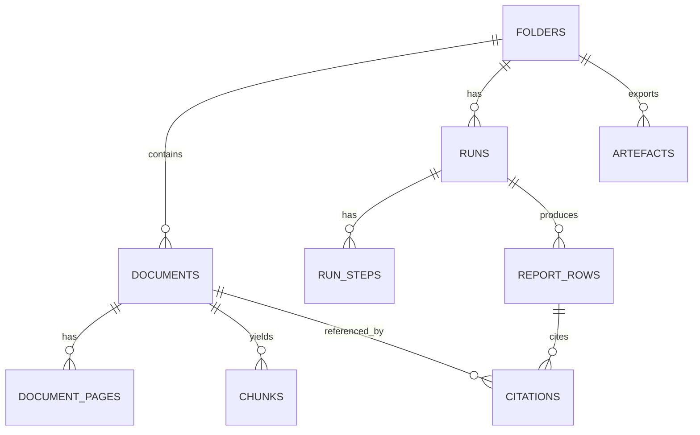

🧿 oracle 0.8.5 — Quiet prompt, thunderous answers.
[SYSTEM]
You are Oracle, a focused one-shot problem solver. Emphasize direct answers and cite any files referenced.

[USER]
Review this shaping packet for Initiative 002 (Quick Start Engine: Title + Survey -> 3 artefacts).

Goal: improve the shaping artefacts (brief, breadboard, risk register, spikes) so the packet is de-risked and ready for PRD creation later.

Constraints (must follow):
- Align with docs/03-architecture decisions: citation locking + immutable citations, verification is fail-closed, WDK workflow/step boundaries, and the report-row status invariants.
- Fixture packs and names must match docs/08-example-data/packs_summary.md (treat that as canonical).
- Do NOT create or propose prd.md or prd.json yet.

What to produce:
1) Top 10 issues/gaps/inconsistencies you see (each with the exact file path + the specific edit you would make).
2) Any missing rabbit holes or better Cut/Patch/Spike treatments.
3) Edits to the spike plans: tighten success criteria, choose the smallest pack set per spike, and add any missing spikes.
4) A concrete GO/NO-GO checklist for when we can start writing PRDs.

Keep suggestions implementable and specific (avoid generic advice).

### File: docs/04-projects/02-features/0002_quick-start-engine/brief.md
```md
# Project Brief (1-2 pager)

**Initiative 002: Quick Start Engine (Title + Survey -> 3 artefacts)**

- Dossier: `docs/04-projects/02-features/0002_quick-start-engine/`
- Status: Draft
- Last updated: 2026-02-06
- Owner:

Source docs (canonical):
- `docs/00-strategy/initiatives/initiative-overview-001-002-003.md`
- `docs/00-strategy/initiatives/002-quick-start-engine.md`
- `docs/03-architecture/00_overview.md`
- `docs/03-architecture/20_state_model.md`
- `docs/03-architecture/30_data_model.md`
- `docs/03-architecture/DECISIONS.md`

Dependencies:
- Initiative 001 ("trust substrate") must exist for citation locking, fail-closed verification, and viewer jump-to-evidence.

---

## Problem

We do not have a deterministic, testable path from a diligence pack (title commitment + exception instruments + survey) to a first-pass report that practitioners can trust. Manual analysis is slow, inconsistent, and difficult to validate against fixture "truth" data.

## Why it matters

This is the product wedge: a fast first pass that is evidence-backed and repeatable. Without a deterministic pipeline and eval anchors, we will drift into demo-only outputs that cannot be hardened.

## What we are building (PoC scope)

A "Quick Start: Title + Survey" run that produces three artefacts (as report-table outputs first, export later):
1) Schedule B-I requirements tracker
2) Schedule B-II exceptions table linked to underlying instrument PDFs
3) Survey reconciliation issues list (title <-> survey)

Key trust posture (from `docs/03-architecture/*`):
- Evidence-first: every material claim needs locked citations
- Verification is fail-closed: any mismatch -> `citation_failed`
- `missing_input` is a valid output and must use the exact string: `Not found in provided documents.`
- Deterministic-ish orchestration via Workflow DevKit (workflow + steps)

## Acceptance packs (fixtures)

Use fixture packs under `docs/08-example-data/` as the acceptance anchor (see `docs/08-example-data/packs_summary.md`):
- `pack_01_clean` (baseline happy path)
- `pack_02_missing_rea` (missing exception doc -> missing-input journey)
- `pack_03_mismatch_and_cert_gap` (survey cert gap + mismatch flags)
- `pack_04_multi_parcel` (multi-parcel scoping)
- `pack_05_partial_release` (lien/release complexity; needs-review flags)
- `pack_06_overlapping_easements` (disambiguation + missing attachment)
- `pack_07_scans_rotated_low_quality` (OCR torture; extraction-quality metering)
- `pack_08_defined_terms_and_cross_refs` (defined terms + exhibit chase)

## Goals

1. Deterministic, testable outputs for the fixture packs (start with `pack_01_clean` + one failure pack).
2. Evidence-backed rows: citations are locked and verifiable; no "plausible but unprovable" answers.
3. A run UX that shows progress and produces incremental row updates with correct terminal statuses.

## Non-goals (explicit cuts)

- Freeform chat or open-ended research (no external web research inside runs).
- Legal advice, negotiation posture, or "materiality" decisions.
- Universal coverage of all title company formats or survey styles.
- Geometry overlays for easements (we link to evidence; we do not render corridors).

## Perimeter (in/out)

In scope:
- Question set v1 (<=25) with stable IDs and a stable row schema.
- Commitment parsing for Schedule A / B-I / B-II for fixture packs.
- Exception -> instrument matching with ambiguity surfaced as `needs_review` (never silent).
- Survey extraction focused on certification + text callouts first.
- Reconciliation that prefers "unknown/needs_review" over incorrect "not depicted".
- WDK workflow orchestration: `retrieve -> draft -> lock citations -> verify -> write row`.

Out of scope:
- "Research agent" browsing.
- Auto strategy decisions (cure vs endorse vs accept).
- Deep semantic interpretation of easement scope.

## Key flows

See `breadboard-pack.md` for places/affordances/connections.
- Start run -> view run progress -> table populates -> open row drawer -> click citation -> jump to highlighted evidence

## Risks and unknowns (top)

See `risk-register.md` and `spike-investigation.md`.
Biggest items to resolve before PRDs:
- How we represent table-shaped artefacts (B-I/B-II/issues) within the report-row model without breaking status + citation invariants
- Parsing robustness on `pack_07_scans_rotated_low_quality`
- Exception matching + missing-attachment handling on `pack_06_overlapping_easements`
- Reconciliation honesty: bias to `needs_review` rather than wrong "not depicted"
- Run idempotency: stable `snippet_hash` + no duplicate rows on restart

## Open questions

- Appetite/timebox for Initiative 002 shaping vs implementation.
- Who is the "practitioner" for the question-set spike (and how quickly can we get feedback)?
- Do we treat B-I/B-II/issues as three "big rows", or do we introduce a first-class "artefact table row" model?
- What is the initial question set v1 derived from (start with `golden_questions.json` per pack, then merge)?

## Shaping decision

- Decision: NO-GO (pending spikes; do not generate PRDs yet)
- GO when:
  - We have a credible question set v1
  - We have a clear artefact representation decision (rows vs tables)
  - We can pass the fixture-driven spikes on parsing/matching/survey extraction/idempotency
```

### File: docs/04-projects/02-features/0002_quick-start-engine/breadboard-pack.md
````md
# Breadboard Pack - Quick Start Engine (Initiative 002)

This pack is the wiring diagram and parts list for Initiative 002. It is intentionally "how it works" rather than "what to build first" (PRDs come after spikes).

## Context

- Canonical strategy: `docs/00-strategy/initiatives/002-quick-start-engine.md`
- Canonical architecture:
  - `docs/03-architecture/00_overview.md`
  - `docs/03-architecture/06_frameworks_agents_rag_evals.md` (WDK conventions)
  - `docs/03-architecture/20_state_model.md` (status invariants)
  - `docs/03-architecture/30_data_model.md` (citation locking + hashing)
  - `docs/03-architecture/DECISIONS.md` (ADRs)

Dependencies:
- Initiative 001 ("trust substrate") provides viewer, citation locking, and fail-closed verification primitives. Initiative 002 consumes them.

Constraints (non-negotiable):
- No external web research inside runs.
- OCR/layout extraction is the default for all PDFs.
- Draft -> lock citations -> verify is the required trust spine.

Acceptance packs (fixtures):
- `pack_01_clean`
- `pack_02_missing_rea`
- `pack_03_mismatch_and_cert_gap`
- `pack_04_multi_parcel`
- `pack_05_partial_release`
- `pack_06_overlapping_easements`
- `pack_07_scans_rotated_low_quality`
- `pack_08_defined_terms_and_cross_refs`

## Global wiring diagram (reference)

Legend:
- Solid = triggers/writes
- Dashed = reads/observes

```mermaid
flowchart LR
  U[User] -->|Start Quick Start| UI[Quick Start UI\n(Matter workspace)]
  UI -->|POST /folders/:id/runs| API[Runs API\n(Next.js route handler)]

  API -->|start| WF[WDK workflow\nQuickStartTitleSurveyWorkflow]
  WF -->|loop question_id| RET[Step: retrieve_evidence]
  RET --> DRAFT[Step: draft_row_json]
  DRAFT --> LOCK[Step: lock_citations\n(chunk_id -> citation_id)]
  LOCK --> VERIFY[Step: verify_row\n(fail-closed)]
  VERIFY --> WRITE[Step: write_report_row]

  WRITE --> PG[(Postgres\nruns, run_steps,\nreport_rows, citations)]
  UI -. poll/SSE .-> PG

  UI -->|open row drawer| CITS_API[Citations API]
  CITS_API -->|GET /citations/:id| PG
  UI --> PDFV[PDF Viewer\n(pdf.js + highlight overlay)]
```

Notes:
- Ingestion (OCR/layout, chunking, indexing) is a prerequisite substrate and is not redefined here.
- For list-shaped outputs (requirements/exceptions/issues), we should keep a stable "row shell" but allow the row's payload to include a list of items, each with its own citations.

---

# Breadboard 2.1 - Question set v1 + report schema freeze

## Goal

Freeze question set v1 (<=25) and a stable row shell schema so we can build deterministic steps and evals without scope creep.

## Places and affordances

- Place: Quick Start setup
  - Affordance: see the question set version and what this run will produce
- Place: Report table
  - Affordance: stable columns (question, status, updated_at) with row drawer for details
- Place: Row drawer
  - Affordance: answer, citations, and a single "Mark as reviewed" action (user-driven transition)

## UI affordances

| # | Place | Affordance | Control | Writes | Reads |
|---|---|---|---|---|---|
| U1 | Setup | Question set version label | render | - | question set registry |
| U2 | Setup | "Start run" CTA | click | create run | folder state |
| U3 | Table | Row status badge | render | - | report rows |
| U4 | Drawer | Citation list + click-to-jump | click | - | citations |
| U5 | Drawer | Mark as reviewed | click | row status -> reviewed | row |

## Code affordances

| # | Component/service | Affordance | Control | Notes |
|---|---|---|---|---|
| N1 | Question set registry | `getQuestionSetV1()` | read | Start with `golden_questions.json` per pack, then unify. |
| N2 | Row schema validator | `validateRow(row)` | call | Hard gate: invalid schema is a run failure (not silent). |
| N3 | Row renderer | `renderRow(row)` | call | For list-shaped answers, render a table view from structured payload. |
| N4 | Status invariants | `assertRowStatus(row)` | call | Must match `docs/03-architecture/20_state_model.md`. |

## Parts list (BOM)

| Part | Name | Mechanism |
|---|---|---|
| F2.1.1 | Question set v1 | JSON list with stable `question_id`s and a version tag. |
| F2.1.2 | Stable row shell schema | `{question_id, question, answer, citation_ids[], status, notes?}` plus a home for structured payload. |
| F2.1.3 | UI table + row drawer | Fixed columns, drawer detail, mark reviewed action. |

## Fit check

| Requirement | Fixture anchor | Fit |
|---|---|---|
| <=25 stable questions | `golden_questions.json` across packs | ⚠️ spike (practitioner alignment) |
| Stable status machine | `docs/03-architecture/20_state_model.md` | ✅ |
| List-shaped outputs renderable | `expected_*` CSVs in `/truth` | ⚠️ design spike (payload representation) |

Cuts / out of bounds:
- No editable question sets in v1.
- No "confidence" used as a correctness signal (only UX hint).

---

# Breadboard 2.2 - Commitment parsing (Schedule A / B-I / B-II extraction)

## Goal

Extract Schedule A facts, B-I requirements list, and B-II exceptions list for fixture packs, matching `/truth` key fields (not wording).

## Places and affordances

- Place: Run progress
  - Affordance: "Parsing commitment" step shows progress and failure reasons
- Place: Requirements tracker (rendered from row payload)
  - Affordance: list of items with `bi_item`, owner placeholder, and citations
- Place: Exceptions table (rendered from row payload)
  - Affordance: list of items with `bii_item`, instrument refs, and citations

## Code affordances

| # | Component/service | Affordance | Control | Notes |
|---|---|---|---|---|
| N1 | Doc classifier | `classifyCommitment(document)` | step | Must be auditable; unknown -> `needs_review` (not silent ignore). |
| N2 | Commitment parser | `parseCommitment(text)` | step | Output is structured and schema-validated. |
| N3 | Item normalizer | `normalizeItemFields()` | pure | Dates, instrument numbers, item numbers. |
| N4 | Citation seeding | `seedCitationsFromHeaderAnchors()` | step | At minimum, cite section headers even if item-level citation is weak. |

## Parts list (BOM)

| Part | Name | Mechanism |
|---|---|---|
| F2.2.1 | Schedule A extraction | Proposed insured, insured estate, legal desc basics (as required by question set). |
| F2.2.2 | B-I extraction | `bi_item`, requirement text, owner placeholder. |
| F2.2.3 | B-II extraction | `bii_item`, type, instrument refs (instrument_no, recorded). |
| F2.2.4 | Uncertainty surfacing | When parsing is weak: row status remains `needs_review` with reason code (no hallucinated rows). |

## Fit check

| Requirement | Packs | Fit |
|---|---|---|
| B-I key fields match truth | `pack_01_clean`, `pack_04_multi_parcel` | ⚠️ spike |
| B-II key fields match truth | `pack_01_clean`, `pack_06_overlapping_easements` | ⚠️ spike |
| Works on scan torture pack | `pack_07_scans_rotated_low_quality` | ⚠️ spike (quality gating) |

Cuts / out of bounds:
- Not solving every title company format.
- No semantic interpretation of requirement meaning.

---

# Breadboard 2.3 - Exception instruments matching + per-instrument summary extraction

## Goal

Link exceptions to the correct instrument PDFs, extract short summaries + risk tags with citations, and surface ambiguity or missing docs explicitly.

## Places and affordances

- Place: Exceptions table row
  - Affordance: matched doc name + match state badge (`matched`, `ambiguous`, `missing_doc`)
- Place: Exception detail drawer
  - Affordance: summary, risk tags, citations, and "choose correct doc" when ambiguous

## Code affordances

| # | Component/service | Affordance | Control | Notes |
|---|---|---|---|---|
| N1 | Instrument matcher | `matchExceptionToDoc(exception, docs)` | step | Uses deterministic heuristics; never auto-picks when confidence is low. |
| N2 | Reference follower | `followReference(refString)` | step | For `pack_08_defined_terms_and_cross_refs` style exhibit chase. |
| N3 | Summary extractor | `summarizeInstrument(doc)` | step | Structured JSON output; citations must be lockable. |
| N4 | Missing attachment detector | `detectMissingAttachment(doc)` | step | For instruments referencing exhibits not present. |

## Parts list (BOM)

| Part | Name | Mechanism |
|---|---|---|
| F2.3.1 | Matching heuristics | instrument number, book/page, filename, and "defined terms" reference chain (bounded). |
| F2.3.2 | Ambiguity UI | Show candidates; user selection is persisted. |
| F2.3.3 | Missing-doc journey | If instrument doc absent (e.g. `pack_02_missing_rea`): item is `missing_doc` and row includes a missing-doc checklist. |
| F2.3.4 | Missing-attachment flag | If exhibit referenced but not provided: flag `missing_attachment` and keep going. |

## Fit check

| Requirement | Packs | Fit |
|---|---|---|
| Correct matches on happy path | `pack_01_clean` | ⚠️ spike |
| Disambiguation for overlaps | `pack_06_overlapping_easements` | ⚠️ spike |
| Missing exception doc handled | `pack_02_missing_rea` | ✅ (fixture exists) |
| Exhibit chase bounded | `pack_08_defined_terms_and_cross_refs` | ⚠️ spike |

Cuts / out of bounds:
- No deep semantic "scope" interpretation.
- No materiality scoring.

---

# Breadboard 2.4 - Survey parsing (certification + key callouts) with citations

## Goal

Extract survey certification parties and at least a baseline set of text callouts (encroachments/easements/access) with citations.

## Places and affordances

- Place: Survey extract row
  - Affordance: certification parties + callouts list
- Place: Quality indicator
  - Affordance: extraction quality badge and "needs manual review" when OCR is weak

## Code affordances

| # | Component/service | Affordance | Control | Notes |
|---|---|---|---|---|
| N1 | Survey classifier | `classifySurvey(document)` | step | Must tolerate scan-only PDFs. |
| N2 | Survey parser | `parseSurvey(layout)` | step | Focus on text callouts first; graphics are out of scope. |
| N3 | Quality scorer | `scoreSurveyExtraction()` | pure | Drives `needs_review` and UX copy. |

## Fit check

| Requirement | Packs | Fit |
|---|---|---|
| Certification extracted | `pack_01_clean` | ⚠️ spike |
| Cert gap flagged | `pack_03_mismatch_and_cert_gap` | ⚠️ spike |
| Works on scan torture pack | `pack_07_scans_rotated_low_quality` | ⚠️ spike |

Cuts / out of bounds:
- No property visualizer.
- No attempt to infer geometry-only labels without text support.

---

# Breadboard 2.5 - Title <-> survey reconciliation (honest issues list)

## Goal

Cross-check exception items against survey evidence and produce a reconciliation issues list that prefers "unknown/needs_review" over incorrect "not depicted".

Important alignment:
- The state machine for report rows remains `needs_review|reviewed|missing_input|citation_failed`.
- "depicted/not depicted/unknown" is an item-level classification inside the issues payload, not a new report-row status.

## Places and affordances

- Place: Issues list table (rendered from row payload)
  - Affordance: filters by classification and shows dual citations (instrument + survey)
- Place: Issue detail drawer
  - Affordance: guidance copy for "unknown" and what evidence is missing

## Code affordances

| # | Component/service | Affordance | Control | Notes |
|---|---|---|---|---|
| N1 | Reconciliation rules | `classifyIssue(exception, survey)` | pure | Deterministic rules first; model only as fallback with strict schema. |
| N2 | Evidence thresholding | `evidenceStrength()` | pure | When below threshold -> classify `unknown` and keep row `needs_review`. |
| N3 | Guidance generator | `buildGuidance()` | pure | "What to do next" copy for the drawer. |

## Fit check

| Requirement | Packs | Fit |
|---|---|---|
| Basic issues exist | `pack_01_clean` | ⚠️ spike |
| Mismatch/cert gap triggers issues | `pack_03_mismatch_and_cert_gap` | ⚠️ spike |
| Unknown bias works | `pack_07_scans_rotated_low_quality` | ⚠️ spike |

Cuts / out of bounds:
- No geometry overlays.
- No semantic interpretation of easement scope.

---

# Breadboard 2.6 - Run orchestration + incremental report population (WDK)

## Goal

Implement a WDK workflow that executes deterministic-ish steps per `question_id` and writes terminal report rows incrementally with progress events.

## Places and affordances

- Place: Run progress view
  - Affordance: step indicator and safe restart
- Place: Report table
  - Affordance: rows appear progressively during run

## Code affordances

| # | Component/service | Affordance | Control | Notes |
|---|---|---|---|---|
| N1 | Runs API | `POST /folders/:id/runs` | handler | Pins `index_version` + `agent_bundle_version`. |
| N2 | Workflow controller | QuickStart workflow | workflow | Must start with `"use workflow"` and contain no side effects. |
| N3 | Steps | retrieve/draft/lock/verify/write | step | Must start with `"use step"`; steps own idempotency. |
| N4 | Row upsert invariant | unique `(run_id, question_id)` | DB constraint | Prevents duplicates on restart. |
| N5 | Status + export gating | fail-closed | policy | `citation_failed` rows are non-exportable by default. |

## Fit check

| Requirement | Packs | Fit |
|---|---|---|
| Rows stream in during run | `pack_01_clean` | ✅ |
| Missing-doc run fails safely | `pack_02_missing_rea` | ✅ |
| Restart is idempotent | any | ⚠️ spike |

Cuts / out of bounds:
- No free-running agent loops.
- No freeform chat.
````

### File: docs/04-projects/02-features/0002_quick-start-engine/risk-register.md
```md
# Risk register (rabbit holes)

Use this during shaping to capture tail risks and choose mitigations (Cut / Patch / Spike / Out-of-bounds).

Key rule (per `docs/00-strategy/initiatives/001-003_depedency_plan.md`):
- Breadboards + risk register + spikes come before PRDs.

| ID | Risk (write as a question) | Type | Why its risky | Treatment | Next step | Status |
|---|---|---|---|---|---|---|
| RH-2.1 | Does question set v1 (<=25) match practitioner expectations? | product | Wrong questions -> wrong artefacts even if extraction is "correct". | Spike | SP-2.1 practitioner review | open |
| RH-2.2 | How do we represent table-shaped artefacts (B-I/B-II/issues) inside the report-row model without breaking status + citation invariants? | design/tech | If we pick the wrong payload model, we either can't render or we lose traceability/citations. | Spike | SP-2.7 payload representation decision | open |
| RH-2.3 | Can commitment parsing match `/truth` key fields across clean + scan packs? | tech | OCR + format variance can silently degrade item extraction. | Spike | SP-2.2 parsing spike on packs incl `pack_07_scans_rotated_low_quality` | open |
| RH-2.4 | Can exception -> instrument matching avoid false matches and surface ambiguity/missing docs explicitly? | tech/data | Silent mismatches undermine trust more than missing outputs. | Spike | SP-2.3 matching spike on `pack_06_overlapping_easements` + `pack_02_missing_rea` | open |
| RH-2.5 | Can survey extraction reliably find certification parties + baseline callouts on scan packs? | tech | Surveys are messy; OCR noise can cause hallucinated callouts if we're not strict. | Spike | SP-2.4 survey spike on `pack_07_scans_rotated_low_quality` | open |
| RH-2.6 | Can reconciliation stay honest (bias to unknown/needs_review instead of incorrect "not depicted")? | product/tech | A confident wrong "not depicted" is worse than an "unknown". | Spike | SP-2.5 reconciliation honesty spike | open |
| RH-2.7 | Run idempotency: do restarts avoid duplicate rows and keep stable `snippet_hash`? | tech | Retries are normal; drift kills trust and breaks evals. | Spike | SP-2.6 idempotency + hashing spike | open |
| RH-2.8 | Missing attachment inside a provided instrument doc: do we detect and flag without blocking the run? | data | Missing exhibits can produce fabricated summaries unless explicitly flagged. | Patch | Add missing-attachment detector + UX copy | open |
| RH-2.9 | Too many `citation_failed` rows early: do we have a usable failure UX without "turning off" trust? | product/ux | Fail-closed is required; if UX is unusable, users will demand unsafe shortcuts. | Patch | Failure reason codes + guidance copy in drawer | open |
| RH-2.10 | Pack naming/fixtures drift: are strategy docs and code/evals aligned to `docs/08-example-data/*`? | process | Misnamed packs/truth files cause wasted work and false pass/fail in spikes. | Patch | Treat `packs_summary.md` + directory names as canonical; update other docs when needed | open |

Notes:
- Status for report rows must follow `docs/03-architecture/20_state_model.md` (do not invent new row statuses).
- "Unknown" belongs as an item-level classification inside a row payload, not as a report-row status.
```

### File: docs/04-projects/02-features/0002_quick-start-engine/spike-investigation.md
```md
# Spike investigation - Quick Start Engine (Initiative 002)

This doc captures planned spikes for the rabbit holes in `risk-register.md`.

How to use:
- Each spike has a plan and a small report stub.
- After running a spike: fill in the report stub and update `brief.md`, `breadboard-pack.md`, and `risk-register.md`.
- Do not write PRDs until the spike outcomes remove the biggest rabbit holes (see `brief.md` GO criteria).

Fixture sources:
- Pack list (canonical): `docs/08-example-data/packs_summary.md`
- Truth comparators: `docs/08-example-data/<pack>/truth/*`
- Viewer anchors: `docs/08-example-data/<pack>/layout/*.anchors.json`

---

# SP-2.1 Practitioner question set review

## Question
Does question set v1 (<=25) match how a senior associate wants to consume a "first pass" title + survey report?

## Why now
If question set v1 is wrong, the rest of Initiative 002 can "work" while producing the wrong artefacts.

## Success criteria (proof)
- Practitioner says: "Yes, I'd use this table as a first pass."
- >=80% of questions survive with only wording/order edits.
- Any missing must-haves are either:
  - added by cutting elsewhere to keep <=25, or
  - explicitly pushed to "later" with rationale.

## Timebox
- <= 0.5 day (one pass)

## Approach
1) Start from the union of `golden_questions.json` across packs.
2) Present the output shapes:
  - scalar rows (Schedule A facts, etc.)
  - list-shaped artefacts (B-I/B-II/issues) rendered as tables.
3) Record feedback and apply cuts/reorder/rename (no scope expansion beyond 25).

## Artefacts to keep
- Notes + updated question-set diff.

## Oracle notes
- Pending.

## Report (fill after running)
- Outcome:
- Proof links:
- Cuts/patches:

---

# SP-2.2 Commitment parsing (clean + multi-parcel + scan torture)

## Question
Can we extract Schedule A facts, B-I requirements, and B-II exceptions matching `/truth` key fields across clean + multi-parcel + scan torture packs?

## Packs
- `pack_01_clean`
- `pack_04_multi_parcel`
- `pack_07_scans_rotated_low_quality`

## Success criteria (proof)
- For `pack_01_clean` and `pack_04_multi_parcel`, key fields match truth CSVs (not wording):
  - `truth/expected_requirements_tracker.csv`
  - `truth/expected_exceptions_table.csv`
- For `pack_07_scans_rotated_low_quality`:
  - either key fields match truth within an explicitly recorded tolerance, or
  - output stays honest as `needs_review` with reason codes (no hallucinated items).

## Timebox
- <= 1 day

## Approach
1) Use truth CSVs as comparator (diffs, not eyeballing).
2) Record failures precisely: missing headers, item numbering drift, date formats, instrument ref extraction.
3) Decide treatment: Patch heuristics vs Cut formats vs Out-of-bounds.

## Oracle notes
- Pending.

## Report (fill after running)
- Outcome:
- Proof links:
- Parsing heuristics:
- Cuts/patches:

---

# SP-2.3 Exception -> instrument matching + missing doc/attachment handling

## Question
Can we avoid false matches, surface ambiguity, and handle missing docs/attachments explicitly?

## Packs
- `pack_01_clean` (happy path matches)
- `pack_02_missing_rea` (missing exception doc)
- `pack_06_overlapping_easements` (disambiguation + missing attachment)
- `pack_08_defined_terms_and_cross_refs` (defined terms + exhibit chase)

## Success criteria (proof)
- No false matches on the above packs.
- Ambiguity surfaces as `needs_review` and requires user selection (never silent auto-pick).
- Missing exception doc:
  - produces an explicit missing-doc checklist in row notes/provenance, and
  - uses `missing_input` when an answer truly cannot be supported.
- Missing attachment:
  - detected and flagged (no fabricated summaries).

## Timebox
- <= 1 day

## Approach
1) Start with deterministic matching (instrument number, book/page, filename).
2) Add bounded reference following for exhibit chase (max depth; record the chain).
3) Catalog ambiguous cases and the minimal UI affordance to resolve them.

## Oracle notes
- Pending.

## Report (fill after running)
- Outcome:
- Proof links:
- Matching rules:
- Ambiguity UX notes:

---

# SP-2.4 Survey extraction (certification + baseline callouts)

## Question
Can we reliably extract certification parties and baseline text callouts with citations on scan packs?

## Packs
- `pack_01_clean`
- `pack_03_mismatch_and_cert_gap`
- `pack_07_scans_rotated_low_quality`

## Success criteria (proof)
- Matches `truth/expected_survey_issues.csv` on major callouts where present (not wording).
- Flags the missing lender certification party in `pack_03_mismatch_and_cert_gap`.
- On scan torture:
  - either extracts >=3 callouts with citations, or
  - stays honest as `needs_review` + guidance (no made-up callouts).

## Timebox
- <= 1 day

## Approach
1) Focus on text callouts and certification blocks first; ignore pure graphics.
2) Compare against truth and `golden_questions.json`.
3) Decide extraction quality threshold behavior (ready vs needs_review).

## Oracle notes
- Pending.

## Report (fill after running)
- Outcome:
- Proof links:
- Threshold decisions:
- Cuts/patches:

---

# SP-2.5 Reconciliation honesty (unknown bias)

## Question
Can we keep reconciliation honest by biasing to "unknown/needs_review" instead of incorrect "not depicted"?

## Packs
- `pack_01_clean`
- `pack_03_mismatch_and_cert_gap`
- `pack_07_scans_rotated_low_quality`

## Success criteria (proof)
- When evidence is weak, item classification is `unknown` (item-level) and report row stays `needs_review`.
- Drawer guidance copy explains what evidence is missing and what to do next.

## Timebox
- <= 0.5 day

## Approach
1) Define explicit evidence thresholds for depicted/not depicted/unknown.
2) Prove thresholds on scan torture.
3) If we cannot keep it honest, cut reconciliation to "unknown only" in v1.

## Oracle notes
- Pending.

## Report (fill after running)
- Outcome:
- Proof links:
- Threshold decisions:
- Cuts/patches:

---

# SP-2.6 Run idempotency + snippet_hash stability

## Question
On restart/retry, do we avoid duplicate rows and keep stable citation `snippet_hash` values (same `index_version`)?

## Success criteria (proof)
- Unique `(run_id, question_id)` holds and no duplicates appear after restart.
- Citation locking produces stable `snippet_hash` values across reruns (same inputs + pinned versions).
- Failure taxonomy counts are stable across reruns (no new "mystery failures").

## Timebox
- <= 0.5 day

## Approach
1) Run `pack_01_clean` twice with pinned versions.
2) Compare row payloads + citation hashes + eval reports.
3) Identify nondeterminism sources and patch with deterministic idempotency keys.

## Oracle notes
- Pending.

## Report (fill after running)
- Outcome:
- Proof links:
- Idempotency keys:

---

# SP-2.7 Payload representation decision (rows vs tables)

## Question
Where do we store and version the structured payload for list-shaped artefacts (B-I/B-II/issues) so UI can render it and evals can compare it?

Constraints:
- Must obey the report-row status invariants in `docs/03-architecture/20_state_model.md`.
- Citations must be lockable/immutable and attached to rows (and ideally to item-level entries).

## Options to decide between
1) Store structured payload in `report_rows.provenance_json` and render from it in UI.
2) Store structured payload as JSON in `report_rows.answer` (string) and treat `answer` as machine-readable.
3) Introduce first-class artefact tables and keep report rows as summaries.

## Success criteria (proof)
- Can represent `truth/expected_requirements_tracker.csv` and `truth/expected_exceptions_table.csv` faithfully:
  - item fields
  - item-level citations
  - item-level status (without inventing new report-row statuses)
- Does not weaken fail-closed verification or citation locking.

## Timebox
- <= 0.5 day

## Report (fill after running)
- Decision:
- Why:
- Follow-up schema/UX implications:
```

### File: docs/00-strategy/initiatives/initiative-overview-001-002-003.md
```md
# Initiative map — Orbital Copilot PoC (US CRE Title + Survey Quick Start)

## Assumptions used for this breakdown (can be changed later)
- **Export target:** Title & Survey memo (not objection/cure letter)
- **OCR approach:** OCR everything (consistent geometry)
- **Verification strictness:** Conservative fail-closed
- **Audience:** internal demo + 1 friendly practitioner
- **Timebox:** 2-week PoC mindset (but shaping items are still independent)

## Initiatives
- 001: Trust substrate (citations, viewer, verification, failure states)
- 002: Quick Start engine (Title Commitment + Exception instruments + Survey → 3 artefacts)
- 003: Demo-grade outputs and repeatability (exports, eval harness, regression safety)

# Initiative map — Orbital Copilot PoC (US CRE Title + Survey Quick Start)

## Assumptions used for this breakdown (can be changed later)
- **Export target:** Title & Survey memo (not objection/cure letter)
- **OCR approach:** OCR everything (consistent geometry)
- **Verification strictness:** Conservative fail-closed
- **Audience:** internal demo + 1 friendly practitioner
- **Timebox:** 2-week PoC mindset (but shaping items are still independent)

---

## Initiative 1: Trust substrate (citations, viewer, verification, failure states)

**Objective**  
Deliver the “trust moment” end-to-end: citation chips that jump to highlighted evidence in a PDF viewer, with strict “cite-or-not-found” behaviour and row-level failure states.

**Why it’s coherent**  
This is one tight user promise. If it fails, everything else is noise. Grouping UI + data model + verification here prevents the classic failure mode of building content generation before trust.

**Key dependencies**  
- Minimal “matter” container (folder) + document storage + doc viewer
- Basic persistence for citations and rows (can be lightweight in PoC)

**Primary risks it burns down**  
- Citation correctness (and how we fail)
- Geometry/highlighting reliability (even on ugly PDFs)
- “Not found” and missing-doc journeys actually being usable

---

## Initiative 2: Quick Start engine (Title Commitment + Exception instruments + Survey → 3 artefacts)

**Objective**  
Implement the deterministic-ish pipeline that turns a pack into:
1) B-I Requirements tracker  
2) B-II Exceptions table linked to instruments  
3) Survey reconciliation issues list  
All outputs are evidence-backed and written into the report table.

**Why it’s coherent**  
It’s the core product wedge. And it’s mostly “workflow logic” that can be iterated independently once trust substrate exists.

**Key dependencies**  
- Trust substrate (Initiative 1) for citations, verification, viewer
- Pack ingestion/indexing and retrieval primitives (can start scaffolded)

**Primary risks it burns down**  
- Commitment parsing robustness (Schedule A/B-I/B-II structure varies)
- Linking exceptions → instruments (recording refs and exhibit chase)
- Survey extraction and reconciliation is messy and easy to over-promise

---

## Initiative 3: Demo-grade outputs and repeatability (exports, eval harness, regression safety)

**Objective**  
Make the PoC demoable and testable: exports (CSV + Word), golden-set driven evals, and “demo reliability” controls.

**Why it’s coherent**  
These are finishing moves that protect against context rot and brittle demos. They should not contaminate core workflow logic, but they are essential for confidence.

**Key dependencies**  
- Initiative 1 and 2 outputs exist (rows + citations + statuses)

**Primary risks it burns down**  
- “It works on my laptop” syndrome
- Regression in citations/retrieval that no-one notices until demo day
- Export producing unusable junk that lawyers reject instantly
```

### File: docs/00-strategy/initiatives/002-quick-start-engine.md
```md
# Initiative 2: Quick Start engine (Title + Survey → 3 artefacts)

## 2.1 Question set v1 + report schema freeze (what rows exist, what columns exist)
**Scope**  
Define the PoC question set and row schema so engineering can build deterministic pipelines without scope creep.

**Done means**  
- Question set v1 (20–25 max) exists with IDs and expected outputs mapping to:
  - B-I requirements extraction
  - B-II exceptions table
  - Survey issues list
- Schema is stable: `{question_id, question, answer, citations[], status, confidence?, docs_searched[]}`

**Cut-lines / de-scopes**  
- No “research agent” web browsing.  
- No auto strategy decisions (cure vs endorse vs accept). Only prompts / flags.

**Risks/unknowns and treatment**  
- Question set too broad becomes untestable: **Cut** (cap to 25).  
- Misaligned with real lawyer expectations: **Spike** (1 practitioner review).

**Suggested spikes**  
- “Do these 25 questions match how a senior associate reads a commitment?” Pass if practitioner says “yes, I’d use this table”.

**Natural PRD seams**  
1) PRD: Question set JSON + versioning  
2) PRD: Report row schema + migrations  
3) PRD: UI table columns + row drawer layout

---

## 2.2 Commitment parsing (Schedule A / B-I / B-II extraction)
**Scope**  
Extract Schedule A facts and generate Requirements + Exceptions indices from commitment PDFs.

**Done means**  
- For `pack_01_clean` and `pack_04_multi_parcel_complex`, parser outputs:
  - Requirements list with item numbers
  - Exceptions list with item numbers + recording refs where present
- Output matches `/truth/expected_requirements_tracker.csv` and `/truth/expected_exceptions_table.csv` at least on key fields (not wording).

**Cut-lines / de-scopes**  
- Not solving every title company formatting variant. PoC aims at “good enough for these packs” with a clear “parser uncertainty” flag.

**Risks/unknowns and treatment**  
- Formatting variability across commitments: **Spike** (pattern robustness).  
- Scanned commitments: **Patch** (OCR everything assumption helps).

**Suggested spikes**  
- “Can we parse B-I/B-II reliably from scanned PDFs?” Pass if `pack_06_noisy_scans_rotated_page` yields the right item counts within ±1.

**Natural PRD seams**  
1) PRD: Commitment doc-type classifier + parser routing  
2) PRD: B-I extraction logic (items, requirement text, owner placeholder)  
3) PRD: B-II extraction logic (items, instrument refs, doc request list)  
4) PRD: ‘Parser confidence’ UI and override notes

---

## 2.3 Exception instruments matching + per-instrument summary extraction
**Scope**  
Link each exception item to the correct instrument PDF and extract a short summary + risk tags, with citations.

**Done means**  
- `pack_01_clean` exceptions link to their correct PDFs (by instrument number).  
- `pack_05_duplicate_instrument_exhibit_missing` shows ambiguity handling (duplicate instrument number flagged; missing exhibit flagged).  
- For each exception summary row, citations point to the instrument clause location.

**Cut-lines / de-scopes**  
- No deep semantic understanding of easement scope. Keep summaries short and evidence-backed.  
- No auto “materiality”.

**Risks/unknowns and treatment**  
- Exception → instrument matching fails silently: **Spike** (matching heuristics).  
- Missing exhibits inside a provided PDF: **Patch** (flag and continue).

**Suggested spikes**  
- “What matching rules minimise false matches?” Pass if no false matches across 8 packs, and ambiguous cases surface as “needs_review”.

**Natural PRD seams**  
1) PRD: Instrument matching service (instrument number, book/page heuristics)  
2) PRD: Exception summary extractor (structured JSON + citations)  
3) PRD: Risk tagging rubric (access/use/parking/utility/monetary/boundary)  
4) PRD: Ambiguity UI (multiple matches) + user selection

---

## 2.4 Survey parsing (certification, key callouts, encroachments, access) with citations
**Scope**  
Extract survey facts needed for reconciliation: certification parties, labelled easements, access callouts, encroachments, legal description notes.

**Done means**  
- `pack_01_clean` yields a non-empty survey extract that matches `/truth/expected_survey_issues.csv` on major callouts.  
- `pack_03_mismatch_and_cert_gap` flags missing certification party and legal desc mismatch.  
- Works on scanned survey too (since OCR everything).

**Cut-lines / de-scopes**  
- Not interpreting graphics perfectly. We focus on text callouts and obvious labels first.  
- No property visualiser.

**Risks/unknowns and treatment**  
- Surveys are heavily visual and OCR can be messy: **Spike** (can we get sufficient signal).  
- Rotated scanned page: **Patch** (auto-rotate or tolerate with weaker extraction).

**Suggested spikes**  
- “Can we extract certification parties and at least 3 callouts reliably?” Pass if extracted on `pack_06_noisy_scans_rotated_page` and `pack_01_clean`.

**Natural PRD seams**  
1) PRD: Survey doc-type classifier + extraction routing  
2) PRD: Certification extraction (parties, surveyor, date)  
3) PRD: Callout extraction (encroachment/easement/access strings + citations)  
4) PRD: Survey extraction quality indicator + ‘needs manual review’ flag

---

## 2.5 Title ↔ survey reconciliation (easements shown/not shown, access, mismatch flags)
**Scope**  
Cross-check commitment exceptions against survey depiction and produce a survey reconciliation issues list.

**Done means**  
- `pack_01_clean` shows “easements depicted” vs “not depicted” for a subset, consistent with truth.  
- `pack_05_duplicate_instrument_exhibit_missing` flags “survey notes incomplete plotting”.  
- Issues list includes citations to both (instrument clause + survey callout) where possible.

**Cut-lines / de-scopes**  
- Not doing precise geometry overlays of easement corridors. Just evidence-backed flags and links.

**Risks/unknowns and treatment**  
- False positives (saying something is not shown when it is): **Spike** (calibrate).  
- Over-reliance on text callouts misses visual-only survey labels: **Patch** (allow “unknown”).

**Suggested spikes**  
- “Can we keep reconciliation honest?” Pass if we can produce an ‘unknown’ state rather than incorrect ‘not shown’ when uncertain.

**Natural PRD seams**  
1) PRD: Reconciliation rules engine (exception types → what to check on survey)  
2) PRD: Issues list generator (structured, citation-backed)  
3) PRD: UI for reconciliation issues (filtering, status, notes)  
4) PRD: ‘Unknown’ handling and guidance copy

---

## 2.6 Run orchestration and incremental report population (step machine)
**Scope**  
Implement the Quick Start run worker that executes the pipeline deterministically and writes rows incrementally with step progress.

**Done means**  
- User clicks “Quick Start: Title & Survey” and sees steps: selecting questions → searching docs → drafting answers → verifying citations.  
- Rows appear progressively and have correct statuses.  
- Run completes on `pack_01_clean` and surfaces failures on `pack_02_missing_rea` without crashing.

**Cut-lines / de-scopes**  
- No freeform chat.  
- No long-running agent loops. This is fixed question set with fixed steps.

**Risks/unknowns and treatment**  
- Spaghetti orchestration: **Cut** (force explicit step machine).  
- Retry/idempotency issues: **Patch** (idempotent writes by question_id).

**Suggested spikes**  
- “Can we make runs idempotent?” Pass if restarting a run doesn’t duplicate rows and doesn’t change stable snippet hashes.

**Natural PRD seams**  
1) PRD: Runs API + run state model (created/running/partial/completed/failed)  
2) PRD: Worker job runner + step model  
3) PRD: Incremental UI updates (polling or server-sent events)  
4) PRD: Row upsert behaviour + provenance stamping
```

### File: docs/00-strategy/initiatives/001-003_depedency_plan.md
```md
# Dependency graph and ordering recommendation

## Process rule
Breadboard + risk register + spikes come before PRDs. Each breadboard yields one or more PRDs after spikes are resolved.

## Earliest demoable vertical slice (day-1 demo)
Goal: show the trust UX without waiting for parsing/retrieval/LLM.

Slice: seeded report table + citation chips + click-to-highlight using `/layout/*.anchors.json`.
- Comes from shaping items: 1.1 + 1.2 + 1.3 (scaffolded).
- Data source: `/truth` + `/layout`.
- What it proves: “I can verify in 10 seconds” behaviour.

Note: Do not PRD-slice this demo until the breadboards for 1.1–1.3 are complete and the highlight + snippet hashing spikes are resolved.

## Suggested shaping order (breadboards + spikes)
1) 1.1 Matter + viewer baseline
2) 1.2 Click-to-highlight (anchors)
3) 1.3 Citations API + snippet hashing
4) 1.4 Verification gate (fail-closed)
5) 1.5 Failure journeys UX
6) 1.6 Provenance + traceability
7) 2.1 Question set + schema freeze
8) 2.6 Run orchestration skeleton (rows from fixtures)
9) 2.2 Commitment parsing
10) 2.3 Exception instruments matching + summaries
11) 2.4 Survey parsing
12) 2.5 Reconciliation logic
13) 3.1 CSV export
14) 3.2 Word export
15) 3.3 Eval harness
16) 3.4 Demo reliability pack

## Suggested PRD creation order (after shaping)
1) Viewer baseline PRDs (matter CRUD, upload, doc list, viewer)
2) Citation chips + highlight overlay PRDs
3) Citation model + API PRDs (schema, fetch API, snippet hashing)
4) Verification gate PRDs (status machine, checks, entailment)
5) Failure journeys PRDs (missing docs, quality warnings, flag action)
6) Provenance PRDs (trace schema, export endpoint)
7) Initiative 2 PRDs (qset, parsing, reconciliation, orchestration)
8) Initiative 3 PRDs (exports, eval harness, demo reliability)

## Dependencies (simple view)
- 1.1 is prerequisite for everything user-facing.
- 1.2 requires 1.1.
- 1.3 requires 1.1.
- 1.4 requires 1.3.
- 1.5 depends on 1.4 (to surface real failures).
- 2.6 (run orchestration) depends on 1.3 + 1.4 and 2.1.
- 2.2/2.3/2.4/2.5 feed into 2.6’s row writes.
- 3.1/3.2 depend on report rows existing (2.6) and statuses (1.4).
- 3.3 depends on stable outputs (2.x).
- 3.4 is optional but makes demo repeatable.

## Biggest rabbit holes to isolate as shaping spikes
- Highlight geometry transforms (viewer overlay accuracy).
- Survey parsing reliability (text vs visual callouts).
- Exception-to-instrument matching (duplicate instrument numbers, missing exhibits).
- Verification rubric (avoiding false passes).
```

### File: docs/03-architecture/00_overview.md
```md
# Orbital Copilot PoC Architecture
US CRE Title + Survey Quick Start (evidence-first, artefact-first)

## Purpose
Define a production-minded (but PoC-sized) architecture for a law-firm workflow that ingests a US CRE diligence pack and produces defensible artefacts with clause-level evidence.

Optimised for:
- Title commitment (Schedule A / B-I / B-II)
- Exception instruments (easements, REAs, CC&Rs, mortgages, plats)
- ALTA/NSPS survey (draft or final)
- Trust UX: click citation → see highlighted evidence in the PDF

## Product scope (what we will build)
A matter workspace that supports:
1) Upload + ingest a doc pack (PDF-first)
2) Run “Quick Start: Title + Survey”
3) Generate 3 artefacts (as report tables first, export later):
   - Schedule B-I Requirements tracker
   - Schedule B-II Exceptions table (linked to underlying instruments)
   - Survey reconciliation issues list (title ↔ survey)

Every material claim must have citations or “Not found in provided documents.”

## Non-goals (explicit)
- No legal advice / materiality decisions / negotiation posture
- No external web research inside the PoC run
- No integrations (iManage/NetDocs/SharePoint)
- No multi-tenant admin, SSO/RBAC, billing
- No property visualiser / boundary plotting (stretch only)

## Key architectural decisions (PoC defaults)
- Evidence-first with citation locking: citations are IDs, not free text
- Fail-closed verification: citation mismatch → row is `citation_failed`
- Artefacts-first UX: report table is the centre of gravity
- OCR/layout for all PDFs (PoC default): consistent geometry for highlights
- Hybrid retrieval (RAG): lexical + vector search, rerank, then draft from evidence
- Deterministic-ish orchestration: explicit step machine, not free-running agents
- Fixture-driven reliability: synthetic packs + truth files used in CI-style evals

Canonical ADRs for these defaults live in `docs/03-architecture/DECISIONS.md` (append-only).

## Where RAG fits
RAG is the engine inside Quick Start:
- Ingestion creates canonical page text + geometry, then chunks + indexes
- Retrieval returns chunk IDs (hybrid lexical + vector)
- Drafting uses only retrieved evidence
- Verification locks citations and fails closed when evidence does not support the claim

## Where evals fit
Evals are first-class because trust is the product:
- Compare outputs against `/truth` in the synthetic packs
- Validate citation integrity (hash + page + geometry)
- Spot retrieval misses and false passes before demos

## Tech stack and framework choices
See:
- `docs/03-architecture/05_tech_stack_and_dev_workflow.md` for stack, dev workflow, and fixtures
- `docs/03-architecture/06_frameworks_agents_rag_evals.md` for framework options and why we chose Workflow DevKit
```

### File: docs/03-architecture/06_frameworks_agents_rag_evals.md
```md
# Frameworks, agents, RAG, and evals

This doc answers:
- why we picked Workflow DevKit for orchestration
- what we do (and do not) use agent frameworks for
- where RAG fits in the system
- how evals are wired in for demo reliability

## Framework selection

### Chosen for PoC: Workflow DevKit (WDK)
Why:
- Our core requirement is a durable, resumable, deterministic-ish workflow:
  `retrieve → draft → verify → write` per row
- WDK naturally models this with workflows and steps:
  - workflow is the deterministic controller
  - steps encapsulate non-deterministic side effects (OCR, embeddings, LLM calls, DB writes)
- It supports incremental progress which maps to “table populates row-by-row”

Risk:
- WDK is early-stage, so keep integration thin:
  - keep domain logic in `packages/core`
  - treat WDK as orchestration and durability, not as the place where business rules live

### WDK conventions in this repo
WDK is the durable orchestration runtime we refer to as `workflow` in code. It provides:
- a **workflow** function (deterministic controller) that can be resumed/replayed
- **step** functions that perform side effects (OCR, embeddings, LLM calls, DB writes)
- a Postgres-backed “world” for state, retries, and progress events

Conventions we follow (to keep the integration thin and predictable):
- Workflow entrypoints must start with the directive string literal **`"use workflow"`** as the first statement in the async function body.
- Step implementations must start with **`"use step"`** as the first statement in the async function body.
- Workflows do **not** perform side effects directly (no network/LLM/OCR/DB writes). They only call steps and assemble results.
- Steps are responsible for idempotency (safe re-run). Where the provider call cannot be naturally idempotent, store a deterministic idempotency key in `run_steps` and short-circuit on repeats.
- Step inputs/outputs must be JSON-serialisable and validated with Zod schemas from `packages/core/schemas`.

Why the directives matter:
- they make it obvious (in code review) whether a function is allowed to do side effects
- they reduce drift into “free-running agents” by forcing work to be split into explicit steps

See also: `docs/03-architecture/20_state_model.md` (state invariants) and `docs/03-architecture/30_data_model.md` (provenance + replay).

### Alternatives (when you might choose them)
- Mastra: integrated TS framework for agents, workflows, RAG, evals. Strong if you want one unified AI platform.
  - For this PoC, it risks overreach unless you keep Quick Start as a workflow graph rather than agent loops.
- LangGraph.js: good if you want graphs/state machines as the primary abstraction.
  - In our setup WDK already owns orchestration, so LangGraph can become duplicate complexity.
- OpenAI Agents SDK: good for interactive tool-using assistants.
  - For Quick Start we prefer a strict workflow. Agents SDK can still be used later for a chat slice.

---

## Where “agents” fit in this PoC
We keep the 4-agent mental model as a product narrative, but implement it as constrained functions under the workflow’s control.

### Orchestrator (workflow controller)
- Encoded as the WDK workflow
- Loads question set v1
- Runs per-question loop with strict ordering and budgets
- Owns progress and run steps

### Retrieval agent (evidence gatherer)
- Implemented as a step: `retrieve_evidence_step(question_id, filters)`
- Output: chunk IDs + scores + docs_searched

### Drafting agent (row writer)
- Implemented as a step: `draft_row_step(question_id, evidence_chunk_ids)`
- Output: structured row JSON with candidate citations as chunk IDs (not free text)

### Verification agent (citation QA)
- Implemented as a step: `verify_row_step(row_json, locked_citations)`
- Output: pass/fail + corrected answer if needed
- Fail-closed is the default

Research agent:
- Out of scope for PoC (no external web research)
- If needed, implement as a static internal snippet tool, not web browsing

---

## Where RAG fits (end-to-end)
RAG is the engine inside Quick Start. It spans ingestion and runtime.

### Ingestion (creates retrieval substrate)
- OCR/layout extraction → canonical per-page text + geometry
- Chunking → citable chunks with metadata
- Indexing:
  - lexical search via tsvector
  - semantic search via pgvector embeddings

### Runtime (per question)
1) Retrieve: hybrid search + rerank returns chunk IDs
2) Draft: generate row JSON using only retrieved evidence
3) Lock citations: resolve chunk IDs → authoritative snippet + hash + geometry
4) Verify: hash checks + entailment check
5) Write: store report row + citations + status

Key invariant:
- if we cannot retrieve evidence, the system must output “Not found in provided documents.” and set `missing_input`

---

## Evals (fixture-driven, tied to /truth)
Evals are first-class because trust is the product. The synthetic packs allow repeatable regression testing.

### Minimum eval suite
1) Extraction correctness (per pack)
- Requirements count and key fields match `/truth/expected_requirements_tracker.csv`
- Exceptions count and key fields match `/truth/expected_exceptions_table.csv`
- Survey issues match `/truth/expected_survey_issues.csv` (allow “unknown” where designed)

2) Retrieval quality (golden questions)
- Recall@K: do we retrieve the expected chunk/page for each question in `golden_questions.json`?

3) Citation validity
- Code checks:
  - cited page exists
  - polygons exist
  - snippet_hash matches canonical snippet
- Judge checks (optional but recommended):
  - entailment: snippet supports claim, conservative rubric

4) Failure journeys
- `pack_02_missing_rea` should reliably produce `missing_input` rows with a missing-doc checklist
- at least one deliberately corrupted citation should produce `citation_failed`

### How evals run
- `fixture:eval pack_x` produces:
  - per-pack JSON report with pass/fail and metrics
  - failure taxonomy counts
- `fixture:eval:all` produces a summary table across packs
- CI can start as “report only” then become “gate on thresholds”

---

## What we scaffold vs what must be real
Scaffold early:
- use `/layout/*.anchors.json` for highlighting before OCR geometry is perfect
- seed some rows from `/truth` to validate viewer UX

Must be real early:
- citation object contract and snippet hashing rules
- fail-closed verification and row status transitions
- missing-doc behaviour and explicit “not found” outputs
```

### File: docs/03-architecture/20_state_model.md
```md
# State model

This doc defines the state machines and invariants for the PoC. Keep this as the canonical reference and link to it from other docs.

## Terminology
- **Folder** is the DB/API name for a workspace container. In the UI we call it a **Matter**.
- States are stored on rows for convenience, but must remain consistent with the invariants below.

## Folder state (`folders.state`)
States:
- `empty`
- `ingesting`
- `indexed`
- `ready`
- `failed` (terminal until a new ingest attempt is started)

Invariants (must hold):
- `empty`
  - folder has zero documents
- `ingesting`
  - at least one document is not in terminal ingest state (`parse_status != parsed` OR `ocr_status != done`)
  - OR derived retrieval substrate (chunks/indexes) is not built for `folders.latest_index_version`
- `indexed`
  - all documents are in terminal ingest state (`parse_status = parsed` AND `ocr_status = done`)
  - chunks exist for each document for `folders.latest_index_version`
  - folder is runnable (Quick Start can start), even if some docs are low quality
- `ready`
  - all `indexed` invariants hold
  - AND folder health checks pass (see below)
- `failed`
  - one or more documents have terminal `failed` ingest status OR a folder-level indexing job failed

Folder “ready” health checks (PoC defaults):
- no documents are `parse_status = failed` or `ocr_status = failed`
- for every document: `extraction_quality >= 0.60` (configurable; keep the threshold in eval fixtures)
- for every document: `page_count` is set AND `document_pages` count matches `page_count`

Allowed transitions (monotonic, except for retry):
- `empty` → `ingesting` (first upload starts)
- `ingesting` → `indexed` (all docs ingested + chunked + indexed for latest_index_version)
- `indexed` → `ready` (health checks pass)
- `ingesting|indexed|ready` → `failed` (non-recoverable ingest/index error)
- `failed` → `ingesting` (explicit retry/re-ingest; bumps `latest_index_version`)

## Document state (`documents.parse_status`, `documents.ocr_status`)
Parse status:
- `queued` → `parsing` → `parsed` | `failed`

OCR status:
- `queued` → `running` → `done` | `failed`

Invariants (must hold):
- If `parse_status` is `parsing|parsed` then `storage_key` must be set and the raw PDF must exist in object storage.
- If `parse_status` is `parsed` then `page_count` must be set (>= 1).
- If `ocr_status` is `done` then `document_pages` must exist for every page with `text` and `layout_json`.
- `extraction_quality` is only meaningful when `ocr_status = done` (else set NULL or 0 and do not use it for decisions).

## Run state
Runs are the execution record for a single Quick Start attempt. Runs must pin the versions they executed with (see `docs/03-architecture/30_data_model.md`).

States:
- `created` (row exists, workflow not started)
- `running` (workflow is active)
- `completed` (workflow finished and wrote a terminal row for every question)
- `partial` (workflow stopped early but wrote at least one row)
- `failed` (workflow stopped early and wrote zero trustworthy rows)
- `cancelled` (optional; user-cancel)

Invariants (must hold):
- `completed`
  - for the question set version used by the run: exactly one `report_rows` record exists per `question_id`
  - every report row is in a terminal status (`needs_review|reviewed|missing_input|citation_failed`)
- `partial`
  - at least one report row exists
  - at least one `question_id` is missing a row (run stopped before finishing)
- `failed`
  - zero report rows exist OR all produced rows are explicitly marked non-exportable (e.g. `citation_failed`)

Allowed transitions:
- `created` → `running`
- `running` → `completed|partial|failed|cancelled`

## Report row state (`report_rows.status`)
Statuses (terminal for the workflow):
- `needs_review` (verification passed; user may review)
- `reviewed` (user confirmed)
- `missing_input` (no supporting evidence in provided docs)
- `citation_failed` (verification failed or citation lock mismatch)

Invariants (must hold):
- Rows are scoped to a run: exactly one row per `(run_id, question_id)`.
- `needs_review|reviewed`
  - row has >= 1 citation
  - every citation is **locked** (stores snippet + hash + geometry) and is associated to this row
- `missing_input`
  - `answer` must be exactly: `Not found in provided documents.`
  - citations list must be empty
  - `notes` (or provenance) must include an actionable missing-doc checklist
- `citation_failed`
  - citations may exist, but the row is non-exportable by default
  - store a safe failure reason code in provenance (e.g. `CITATION_MISMATCH`, `ENTAILMENT_FAIL`)

User-driven transitions:
- `needs_review` → `reviewed` (only via explicit user action)

Export gating (PoC defaults):
- If any row in the selected run is `citation_failed`, export returns an error unless an explicit override flag is provided.
```

### File: docs/03-architecture/30_data_model.md
````md
# Data model (Postgres + pgvector)

This is the canonical DB shape for the PoC “trust spine”: ingest → retrieve → draft → verify → report rows with locked citations.

## ERD


## Trust spine tables (minimum viable)

### `folders`
- `id`, `name`, `state`, `created_at`, `updated_at`
- `latest_index_version` (string; bumps on re-ingest/re-index)

### `documents`
- `id`, `folder_id`, `filename`, `mime`, `bytes`
- `sha256` (dedupe), `storage_key`, `page_count`
- `parse_status`, `ocr_status`, `extraction_quality`
- `error_json` (safe ingest failure details)

### `document_pages`
- `id`, `document_id`, `page_number`
- `text` (canonical)
- `layout_json` (tokens/lines/blocks + polygons)

### `chunks`
- `id`, `document_id`
- `index_version` (string; matches `folders.latest_index_version` at time of build)
- `page_start`, `page_end`, `chunk_index`
- `text`, `metadata_json`, `tsv`, `embedding`
- `snippet_hash` (see “Hashing rule” below)

### `runs`
- `id`, `folder_id`, `type`, `state`
- `index_version` (pins retrieval substrate used by the run)
- `agent_bundle_version` (pins prompts + schemas)
- timestamps + `error_json` (safe failure details)

### `run_steps`
- `id`, `run_id`, `step_type`, `state`, `attempt`
- `metrics_json`, `error_json`
- timestamps

### `report_rows`
- `id`, `folder_id`, `run_id`, `question_id`, `question`
- `answer`, `status`, `notes`
- `provenance_json` (minimum: retrieved chunk IDs + scores, models + prompt hashes, verification verdict + reason codes)
- timestamps

### `citations`
Citations are **locked** and **immutable** once created. They store enough to highlight evidence without re-running retrieval or re-reading chunks.
- `id`, `report_row_id`
- `chunk_id` (nullable; stored for debugging/replay)
- `document_id`, `page_number`
- `polygons`, `snippet`, `snippet_hash`
- `index_version` (string; pins the chunking/indexing version the citation came from)
- timestamps

### `artefacts`
- `id`, `folder_id`, `type`, `storage_key`
- `source_run_id`, `metadata_json`
- timestamps

## Hashing rule (snippet_hash)
We use `snippet_hash` to detect citation drift.

PoC rule:
- `snippet_hash = sha256(normalise(snippet))`
- `normalise()` must:
  - trim leading/trailing whitespace
  - convert CRLF → LF
  - collapse all whitespace runs to a single space

This rule must be implemented once (e.g. in `packages/core/citations`) and reused everywhere.

## Indices and constraints (recommended)
- unique `(documents.folder_id, documents.sha256)` (avoid duplicates within a matter, allow reuse across matters)
- unique `(report_rows.run_id, report_rows.question_id)` (rows are per run)
- unique `(chunks.document_id, chunks.index_version, chunks.chunk_index)`

- GIN on `chunks.tsv`
- pgvector index on `chunks.embedding`
- index `citations.report_row_id`
- index `runs.folder_id`
````

### File: docs/03-architecture/DECISIONS.md
````md
# Architecture decisions (ADRs)

Append-only log of architecture decisions for Orbital Copilot PoC. Add new ADRs at the end and link the PR.

## ADR format (minimal)

```md
## ADR-0000: Title
- Status: proposed | accepted | superseded | deprecated
- Date: YYYY-MM-DD

Context
- Why are we making this decision?

Decision
- What did we decide?

Consequences
- What does this enable/force?
- What are the risks/trade-offs?

Links
- PR:
- Related docs:
```

---

## ADR-0001: Evidence-first outputs with citation IDs and locking
- Status: accepted
- Date: 2026-02-06

Context
- Trust UX is the product: every material claim needs inspectable evidence.

Decision
- Drafting produces structured rows with **candidate citations as chunk IDs** (no free-text citations).
- We **lock** citations by creating immutable `citations` records containing `{snippet, snippet_hash, geometry}`.
- Report rows refer to citations by `citation_id` only.

Consequences
- We can highlight evidence even if chunking/indexing changes later.
- Provenance is sufficient for debugging and replay without re-running the model.

Links
- Related docs: `docs/03-architecture/40_rag_and_agents.md`, `docs/03-architecture/30_data_model.md`

## ADR-0002: Verification is fail-closed
- Status: accepted
- Date: 2026-02-06

Context
- A plausible answer without valid evidence is worse than “not found”.

Decision
- Any citation lock mismatch or verification failure sets row status to `citation_failed`.
- `citation_failed` rows are non-exportable by default.

Consequences
- Reduces false trust at the cost of more “blocked” outputs early.
- Forces us to invest in retrieval + citation integrity.

Links
- Related docs: `docs/03-architecture/20_state_model.md`, `docs/03-architecture/60_observability_and_evals.md`

## ADR-0003: OCR/layout extraction is the default for all PDFs
- Status: accepted
- Date: 2026-02-06

Context
- Scans are common in CRE diligence packs; highlights require geometry.

Decision
- Every uploaded PDF is processed with OCR/layout extraction and persisted to `document_pages` as canonical text + polygons.

Consequences
- More ingest cost/latency, but consistent highlighting and chunking.
- Enables citation hashing and geometric overlays as first-class features.

Links
- Related docs: `docs/03-architecture/05_tech_stack_and_dev_workflow.md`, `docs/03-architecture/30_data_model.md`

## ADR-0004: Hybrid retrieval returning chunk IDs (lexical + vector)
- Status: accepted
- Date: 2026-02-06

Context
- CRE packs mix boilerplate and highly specific clauses; we need both recall and precision.

Decision
- Retrieval is hybrid (tsvector + embeddings) and returns **chunk IDs** (with scores) rather than prose.
- Optional rerank can be added, but must not change the “IDs-only” contract.

Consequences
- Retrieval becomes measurable (Recall@K, drift detection).
- Downstream steps can be schema-driven and deterministic.

Links
- Related docs: `docs/03-architecture/40_rag_and_agents.md`, `docs/03-architecture/60_observability_and_evals.md`

## ADR-0005: Deterministic-ish orchestration via Workflow DevKit steps
- Status: accepted
- Date: 2026-02-06

Context
- We need resumability, retries, and row-by-row progress without “agent loops”.

Decision
- Quick Start is implemented as a WDK workflow that coordinates explicit steps (`retrieve → draft → lock → verify → write`).
- Use `"use workflow"` / `"use step"` directives to make side-effect boundaries explicit.

Consequences
- Workflows remain predictable; side effects are isolated and observable.
- Keeps WDK integration thin (domain logic stays in `packages/core`).

Links
- Related docs: `docs/03-architecture/06_frameworks_agents_rag_evals.md`, `docs/03-architecture/10_system_architecture.md`

## ADR-0006: Fixture-driven evals are first-class
- Status: accepted
- Date: 2026-02-06

Context
- Demos fail when extraction/retrieval drifts; fixtures let us regress deterministically.

Decision
- Maintain synthetic packs with `/docs`, `/truth`, `/layout`.
- Run `fixture:eval` to produce per-pack eval reports and a cross-pack summary.
- Start as report-only, then gate CI on hard trust metrics (schema + citation integrity).

Consequences
- Faster iteration with fewer demo regressions.
- Forces us to encode “expected failure journeys” as fixtures.

Links
- Related docs: `docs/03-architecture/05_tech_stack_and_dev_workflow.md`, `docs/03-architecture/60_observability_and_evals.md`

## ADR-0007: No external web research inside PoC runs
- Status: accepted
- Date: 2026-02-06

Context
- PoC must be defensible based on provided diligence documents only.

Decision
- Quick Start uses only the uploaded pack for retrieval and reasoning.

Consequences
- Clear provenance and a simpler security posture.
- Some questions will legitimately resolve to `missing_input`.

Links
- Related docs: `docs/03-architecture/00_overview.md`, `docs/03-architecture/06_frameworks_agents_rag_evals.md`

## ADR-0008: Explicit error envelope for APIs
- Status: accepted
- Date: 2026-02-06

Context
- Clients need stable contracts; we must not leak internal errors/provider payloads.

Decision
- Standardise non-2xx responses on a single JSON error envelope with safe `code`, `message`, optional `details`, and optional `trace_id`.

Consequences
- Frontend can implement consistent error handling.
- Makes observability and support workflows simpler.

Links
- Related docs: `docs/03-architecture/50_api_surface.md`, `docs/03-architecture/AGENTS.md`

## ADR-0009: Deployment posture is Hetzner-first (single VM) until proven otherwise
- Status: accepted
- Date: 2026-02-06

Context
- The PoC needs durable orchestration (WDK) and long-running side effects (OCR/embeddings/LLM calls).
- A single-VM deployment reduces moving parts and avoids serverless DB connection pitfalls.

Decision
- Default deployment target is a Hetzner VM running the Next.js server + WDK worker + Postgres (and optionally MinIO).
- Vercel stays optional for later (e.g. preview deploys) once the runtime shape is stable.

Consequences
- Faster path to a stable demo and simpler debugging.
- We own basic ops (TLS, process supervision, backups, monitoring).

Links
- Related docs: `docs/03-architecture/10_system_architecture.md`, `docs/03-architecture/05_tech_stack_and_dev_workflow.md`
- Investigation: `docs/98-tmp/2026-02-06_infra-investigation/deployment.md`

## ADR-0010: Use S3-compatible object storage as the baseline
- Status: proposed
- Date: 2026-02-06

Context
- We need to store raw PDFs and exports and serve pages to pdf.js reliably.
- We want portability between local dev and Hetzner deployment (and optionally Vercel).

Decision
- Use S3-compatible object storage as the baseline contract.
- Local dev: MinIO (or local filesystem for ultra-simple early dev).
- Deployment: prefer managed S3-compatible storage unless explicitly "single VM only".

Consequences
- Standard tooling (AWS SDK) and a clean signed-URL story.
- If we self-host storage (MinIO), we must own backups and durability.

Links
- Related docs: `docs/03-architecture/05_tech_stack_and_dev_workflow.md`
- Investigation: `docs/98-tmp/2026-02-06_infra-investigation/storage.md`

## ADR-0011: Postgres is the primary datastore (local compose; Hetzner in deploy)
- Status: accepted
- Date: 2026-02-06

Context
- Postgres is already the planned "truth store" (rows, runs, steps, citations) and supports pgvector + tsvector.
- The PoC is single-tenant and can start with a single Postgres instance.

Decision
- Local dev: Postgres via Docker Compose (or Supabase local).
- Deployment: self-host Postgres on the Hetzner VM with automated backups and monitoring.

Consequences
- Simple data plane and predictable latency.
- If we later put the web/API on Vercel, we must add connection pooling and strict limits.

Links
- Related docs: `docs/03-architecture/05_tech_stack_and_dev_workflow.md`, `docs/03-architecture/30_data_model.md`

## ADR-0012: OCR/layout extraction is abstracted behind a single provider adapter
- Status: proposed
- Date: 2026-02-06

Context
- Highlight overlays require geometry.
- We want to keep the provider choice reversible (Azure Document Intelligence vs AWS Textract).

Decision
- Default provider: Azure Document Intelligence (Layout), unless an AWS-first posture is chosen.
- Implement a single OCR adapter interface returning a canonical per-page schema.

Consequences
- Provider swaps are a bounded change (mostly isolated to the adapter).
- We can tune for cost/quality without rewriting downstream chunking/citations.

Links
- Related docs: `docs/03-architecture/05_tech_stack_and_dev_workflow.md`, `docs/03-architecture/40_rag_and_agents.md`
- Investigation: `docs/98-tmp/2026-02-06_infra-investigation/ocr.md`

## ADR-0013: LLM access is via an internal router; gateway is optional
- Status: accepted
- Date: 2026-02-06

Context
- We need to route between "fast draft" and "strong verify" models and keep observability consistent.
- Introducing a gateway too early can add another debugging layer; but it can also simplify auth and logging.

Decision
- Define a small internal LLM router interface (draft, verify, embed) and keep it provider-agnostic.
- Start with direct provider keys; add a gateway (Vercel AI Gateway, Cloudflare AI Gateway, or LiteLLM Proxy) if/when friction justifies it.

Consequences
- Low lock-in and a clear place to add logging, retries, and budgets.
- Gateway adoption later is additive (swap base URL / auth), not architectural surgery.

Links
- Related docs: `docs/03-architecture/05_tech_stack_and_dev_workflow.md`
- Investigation: `docs/98-tmp/2026-02-06_infra-investigation/llm-gateways.md`

## ADR-0014: Create a minimal runnable scaffold to validate the architecture
- Status: proposed
- Date: 2026-02-06

Context
- Current repo is docs-first; we need a tracer-bullet implementation to validate the UX (pdf viewer + citations) and workflow plumbing.

Decision
- Add a minimal pnpm workspace scaffold:
  - `apps/web`: Next.js App Router app
  - `packages/core`: Zod schemas + core contracts
  - `docker-compose.yml`: local Postgres + MinIO (optional)
  - wire `pnpm dev`, `pnpm build`, `pnpm test`, `pnpm lint`

Consequences
- Onboarding becomes concrete and repeatable.
- Risk: scaffolding can become premature if we haven't committed to building the PoC; keep it intentionally thin.

Links
- Related docs: `docs/03-architecture/05_tech_stack_and_dev_workflow.md`, `docs/03-architecture/06_frameworks_agents_rag_evals.md`

## ADR-0015: Use Vercel for web deployments, keep durable worker off serverless
- Status: proposed
- Date: 2026-02-06

Context
- We want Vercel for fast preview deployments (UI iteration speed).
- The PoC also needs durable/background work (WDK steps for OCR/embeddings/LLM/DB writes) that is easier to run predictably on a VM.

Decision
- Deploy the Next.js web app to Vercel for UI and thin HTTP APIs.
- Run the durable workflow worker on a Hetzner VM.
- Data plane should be reachable from both environments:
  - Postgres: managed (simplest) or Hetzner-hosted (if we also run a backend API on Hetzner and keep DB private).
  - Object storage: S3-compatible.

Consequences
- Best-of-both: fast UI deploys and predictable background execution.
- Adds one operational surface area (Hetzner worker). Keep it minimal: one Compose service and a small deploy script.

Links
- Related docs: `docs/03-architecture/10_system_architecture.md`, `docs/03-architecture/06_frameworks_agents_rag_evals.md`
- Investigation: `docs/98-tmp/2026-02-06_infra-investigation/deployment.md`, `docs/98-tmp/2026-02-06_infra-investigation/recommended-stack.md`
````

### File: docs/08-example-data/packs_summary.md
```md
# Synthetic PoC Test Packs Summary

| Pack | State | Scenario | Edge cases | Missing docs | Docs |
|---|---|---|---|---|---:|
| `pack_01_clean` | NY | Complete happy-path pack (title + full exception docs + survey) with both text-layer and scanned copies. | baseline;scanned_copies | - | 10 |
| `pack_02_missing_rea` | TX | Commitment references an REA in Schedule B-II but the REA PDF is intentionally missing (tests missing-input handling). | missing_exception_doc | REA.pdf | 6 |
| `pack_03_mismatch_and_cert_gap` | FL | Survey area note conflicts with record description and survey certification omits lender (tests escalation + QC). | survey_legal_desc_mismatch;survey_cert_missing_lender | - | 5 |
| `pack_04_multi_parcel` | IL | Two-parcel site (multi-parcel legal description + survey shows two parcels); one easement burdens only Parcel 2. | multi_parcel;parcel_scoping | - | 6 |
| `pack_05_partial_release` | CA | Deed of Trust exception with a provided Partial Release (release applies to a portion only); tests lien + release logic and 'needs review' flags. | partial_release;lien_clearance_complexity | - | 6 |
| `pack_06_overlapping_easements` | GA | Multiple utility easements with similar naming and different instrument numbers; one instrument references a missing Exhibit B attachment; tests disambiguation and missing-attachment handling. | overlapping_similar_exceptions;missing_attachment | Utility_Easement_10ft_ExhibitB.pdf | 5 |
| `pack_07_scans_rotated_low_quality` | NJ | OCR torture pack: scanned-only commitment + survey with rotated pages and blur; tests extraction-quality metering and rerun OCR flows. | scanned_rotated;low_quality_ocr | - | 7 |
| `pack_08_defined_terms_and_cross_refs` | WA | CC&Rs/REA with defined terms and exhibit chase (e.g., 'Easement Area' defined elsewhere; REA references Exhibit C site plan); tests multi-hop retrieval and definition resolver. | defined_terms;exhibit_chase | - | 6 |
```
