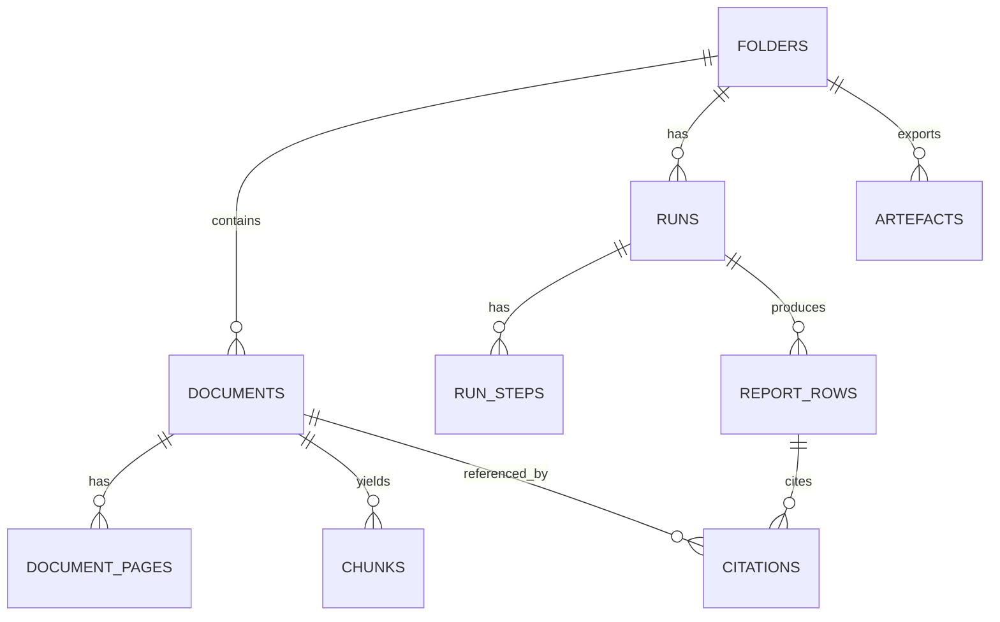

<file_map>
/Users/marc/Code/personal-projects/orbital-poc
├── docs
│   ├── 00-strategy
│   │   ├── initiatives
│   │   │   ├── 001-003_dependency_plan.md *
│   │   │   ├── 002-quick-start-engine.md *
│   │   │   ├── 001-003_handoff.md
│   │   │   ├── 001-trust-substrate.md
│   │   │   ├── 003-polishing-for-demo-and-non-func-hardening.md
│   │   │   ├── initiative-overview-001-002-003.md
│   │   │   └── prd-slicing-rules.md
│   │   ├── opportunity-solution-tree.md
│   │   ├── product-principles.md
│   │   ├── product-strategy-1-pager.md
│   │   ├── product-strategy-detailed.md
│   │   ├── roadmap.md
│   │   └── segmentation-notes.md
│   ├── 03-architecture
│   │   ├── 00_overview.md *
│   │   ├── 06_frameworks_agents_rag_evals.md *
│   │   ├── 20_state_model.md *
│   │   ├── 30_data_model.md *
│   │   ├── 40_rag_and_agents.md *
│   │   ├── 50_api_surface.md *
│   │   ├── 60_observability_and_evals.md *
│   │   ├── DECISIONS.md *
│   │   ├── .gitkeep
│   │   ├── 01_onboarding_checklist.md
│   │   ├── 05_tech_stack_and_dev_workflow.md
│   │   ├── 10_system_architecture.md
│   │   ├── AGENTS.md
│   │   └── INVESTIGATION.md
│   ├── 04-projects
│   │   ├── 02-features
│   │   │   ├── 0002_quick-start-engine
│   │   │   │   ├── prds
│   │   │   │   │   ├── 0002a_run-skeleton
│   │   │   │   │   │   ├── prd.json *
│   │   │   │   │   │   └── prd.md *
│   │   │   │   │   ├── 0002b_row-payload-contract
│   │   │   │   │   │   ├── prd.json *
│   │   │   │   │   │   └── prd.md *
│   │   │   │   │   ├── 0002c_commitment-parsing-pack-01-clean
│   │   │   │   │   │   ├── prd.json *
│   │   │   │   │   │   └── prd.md *
│   │   │   │   │   ├── 0002d_exception-matching-pack-01-02
│   │   │   │   │   │   ├── prd.json *
│   │   │   │   │   │   └── prd.md *
│   │   │   │   │   ├── 0002e_survey-extraction-pack-01-03
│   │   │   │   │   │   ├── prd.json *
│   │   │   │   │   │   └── prd.md *
│   │   │   │   │   ├── 0002f_reconciliation-honesty-pack-03-07
│   │   │   │   │   │   ├── prd.json *
│   │   │   │   │   │   └── prd.md *
│   │   │   │   │   └── README.md *
│   │   │   │   ├── specs
│   │   │   │   │   ├── README.md *
│   │   │   │   │   ├── comparator_spec_v0.md *
│   │   │   │   │   ├── failure_ux_copy_v0.md *
│   │   │   │   │   ├── list_payload_v0.schema.md *
│   │   │   │   │   ├── list_verification_policy_v1.md *
│   │   │   │   │   └── question_set_v1.json *
│   │   │   │   ├── spike-proofs
│   │   │   │   │   ├── README.md *
│   │   │   │   │   ├── RH-2.16_cut_note.md *
│   │   │   │   │   └── SP-2.7_decision.md *
│   │   │   │   ├── breadboard-pack.md *
│   │   │   │   ├── brief.md *
│   │   │   │   ├── plan.md *
│   │   │   │   ├── prd-overall.json *
│   │   │   │   ├── prd-overall.md *
│   │   │   │   ├── prd.json *
│   │   │   │   ├── prd.md *
│   │   │   │   ├── risk-register.md *
│   │   │   │   ├── spike-investigation.md *
│   │   │   │   ├── ...
│   │   │   ├── 0001_trust-substrate
│   │   │   │   └── ...
│   │   │   ├── 0003_demo-grade-outputs
│   │   │   │   └── ...
│   │   │   ├── 0004_csv-export
│   │   │   │   └── ...
│   │   │   ├── 0005_word-export
│   │   │   │   └── ...
│   │   │   ├── 0006_eval-harness
│   │   │   │   └── ...
│   │   │   ├── 0007_demo-reliability
│   │   │   │   └── ...
│   │   │   └── .gitkeep
│   │   ├── 01-experiments-prototypes
│   │   │   └── .gitkeep
│   │   ├── 03-fixes
│   │   │   └── .gitkeep
│   │   ├── 04-refactors
│   │   │   └── .gitkeep
│   │   ├── 05-migrations
│   │   │   └── .gitkeep
│   │   ├── _templates
│   │   │   ├── .gitkeep
│   │   │   ├── README.md
│   │   │   ├── breadboard.md
│   │   │   ├── json-prd.schema.json
│   │   │   ├── pack.md
│   │   │   ├── prd.md
│   │   │   ├── release-checklist.md
│   │   │   └── spike-plan.md
│   │   ├── .gitkeep
│   │   ├── AGENTS.md
│   │   └── README.md
│   ├── 01-insights
│   │   ├── capabilities
│   │   │   ├── .gitkeep
│   │   │   ├── PoC-architecture-brainstorming2_chatGPT.md
│   │   │   ├── PoC-architecture-brainstorming3_claude.md
│   │   │   ├── PoC-architecture-brainstorming_chatGPT.md
│   │   │   └── README.md
│   │   ├── competitors
│   │   │   ├── .gitkeep
│   │   │   ├── competitor_overview_chatGPT.md
│   │   │   └── competitor_overview_claude.md
│   │   ├── customers
│   │   │   ├── product-metrics
│   │   │   │   └── ...
│   │   │   ├── user-calls
│   │   │   │   └── ...
│   │   │   └── .gitkeep
│   │   ├── tech-and-market
│   │   │   ├── .gitkeep
│   │   │   └── US-CRE-due-diligence_codex.md
│   │   └── .gitkeep
│   ├── 02-guidelines
│   │   ├── archive
│   │   │   ├── brand-preview.html
│   │   │   ├── design-system-v1-warm-light.html
│   │   │   ├── design-system-v2-dark-editorial.html
│   │   │   ├── design-system-v3-orange-energy.html
│   │   │   ├── design-system-v4-soft-cyan.html
│   │   │   ├── design-system-v5-purple-accent.html
│   │   │   └── design-system-v6-earthy-organic.html
│   │   ├── inspiration
│   │   │   ├── brand-dna-2026-02-06
│   │   │   │   └── ...
│   │   │   ├── tailwind
│   │   │   │   └── ...
│   │   │   ├── .gitkeep
│   │   │   ├── README.md
│   │   │   ├── brand_guidelines.md
│   │   │   ├── design_tokens.json
│   │   │   └── prompt_library.json
│   │   ├── v1-warm-editorial
│   │   │   ├── design-system.html
│   │   │   ├── tailwind.preset.ts +
│   │   │   └── tokens.css
│   │   ├── v2-refined-neutral
│   │   │   ├── design-system.html
│   │   │   ├── tailwind.preset.ts +
│   │   │   └── tokens.css
│   │   ├── v3-deep-ink
│   │   │   └── tokens.css
│   │   ├── v4-frost-and-fire
│   │   ├── .gitkeep
│   │   ├── AGENTS.md
│   │   ├── brand-guidelines.md
│   │   ├── brand-tone.md
│   │   └── design-system-final-v1.html
│   ├── 05-reviews-audits
│   │   ├── .gitkeep
│   │   └── governance.md
│   ├── 06-release
│   │   ├── postmortems
│   │   │   └── .gitkeep
│   │   ├── .gitkeep
│   │   ├── AGENTS.md
│   │   └── CHANGELOG.md
│   ├── 08-example-data
│   │   ├── pack_01_clean
│   │   │   ├── docs
│   │   │   │   └── ...
│   │   │   ├── layout
│   │   │   │   └── ...
│   │   │   ├── truth
│   │   │   │   └── ...
│   │   │   └── manifest.json
│   │   ├── pack_02_missing_rea
│   │   │   ├── docs
│   │   │   │   └── ...
│   │   │   ├── layout
│   │   │   │   └── ...
│   │   │   ├── truth
│   │   │   │   └── ...
│   │   │   └── manifest.json
│   │   ├── pack_03_mismatch_and_cert_gap
│   │   │   ├── docs
│   │   │   │   └── ...
│   │   │   ├── layout
│   │   │   │   └── ...
│   │   │   ├── truth
│   │   │   │   └── ...
│   │   │   └── manifest.json
│   │   ├── pack_04_multi_parcel
│   │   │   ├── docs
│   │   │   │   └── ...
│   │   │   ├── layout
│   │   │   │   └── ...
│   │   │   ├── truth
│   │   │   │   └── ...
│   │   │   └── manifest.json
│   │   ├── pack_05_partial_release
│   │   │   ├── docs
│   │   │   │   └── ...
│   │   │   ├── layout
│   │   │   │   └── ...
│   │   │   ├── truth
│   │   │   │   └── ...
│   │   │   └── manifest.json
│   │   ├── pack_06_overlapping_easements
│   │   │   ├── docs
│   │   │   │   └── ...
│   │   │   ├── layout
│   │   │   │   └── ...
│   │   │   ├── truth
│   │   │   │   └── ...
│   │   │   └── manifest.json
│   │   ├── pack_07_scans_rotated_low_quality
│   │   │   ├── docs
│   │   │   │   └── ...
│   │   │   ├── layout
│   │   │   │   └── ...
│   │   │   ├── truth
│   │   │   │   └── ...
│   │   │   └── manifest.json
│   │   ├── pack_08_defined_terms_and_cross_refs
│   │   │   ├── docs
│   │   │   │   └── ...
│   │   │   ├── layout
│   │   │   │   └── ...
│   │   │   ├── truth
│   │   │   │   └── ...
│   │   │   └── manifest.json
│   │   ├── pack_09_bad_citation
│   │   │   ├── docs
│   │   │   │   └── ...
│   │   │   ├── layout
│   │   │   │   └── ...
│   │   │   ├── produced
│   │   │   │   └── ...
│   │   │   ├── truth
│   │   │   │   └── ...
│   │   │   └── manifest.json
│   │   ├── README.md
│   │   ├── packs_summary.csv
│   │   └── packs_summary.md
│   ├── 96-engineering-tutor-learnings
│   │   ├── 2026-02-06_brand-dna-web-app-design-language.md
│   │   ├── 2026-02-07_orbital-architecture-decisions-and-overview.md
│   │   └── 2026-02-07_trust-substrate-verification-overrides-and-rh2-fallbacks.md
│   ├── 98-tmp
│   │   ├── 2026-02-06_infra-investigation
│   │   │   ├── README.md
│   │   │   ├── deployment.md
│   │   │   ├── llm-gateways.md
│   │   │   ├── ocr.md
│   │   │   ├── oracle_bundles.md
│   │   │   ├── recommended-stack.md
│   │   │   └── storage.md
│   │   ├── handoffs
│   │   │   └── handoff_2026-02-06_17-35-25_shape-split-commits.md
│   │   ├── oracle
│   │   │   ├── oracle-bundles
│   │   │   │   └── ...
│   │   │   └── oracle-prompt_demo-architecture-alignment_2026-02-07.md
│   │   ├── .gitkeep
│   │   ├── README.md
│   │   ├── oracle-03-architecture-review-manual.md
│   │   ├── oracle-prompt_0002-response.md
│   │   ├── oracle-prompt_trust-substrate_2026-02-07.md
│   │   └── oracle-prompt_trust-substrate_2026-02-07_v2.md
│   ├── 99-archive
│   │   └── .gitkeep
│   ├── AGENTS.md
│   └── LEARNINGS.md
├── .agents
│   ├── backup
│   │   └── 2026-02-08T12-17-42-189Z
│   │       └── manifest.json
│   ├── hooks
│   │   ├── git
│   │   │   ├── commit-msg
│   │   │   ├── post-merge
│   │   │   ├── pre-commit
│   │   │   ├── pre-push
│   │   │   └── prepare-commit-msg
│   │   └── README.md
│   ├── skills
│   │   ├── 00-utilities
│   │   │   ├── agent-browser
│   │   │   │   └── ...
│   │   │   ├── agentation
│   │   │   │   └── ...
│   │   │   ├── ask-questions-if-underspecified
│   │   │   │   └── ...
│   │   │   ├── beautiful-mermaid
│   │   │   │   └── ...
│   │   │   ├── brand-dna-extractor
│   │   │   │   └── ...
│   │   │   ├── browser-use
│   │   │   │   └── ...
│   │   │   ├── commit
│   │   │   │   └── ...
│   │   │   ├── create-cli
│   │   │   │   └── ...
│   │   │   ├── dev-browser
│   │   │   │   └── ...
│   │   │   ├── docs-list
│   │   │   │   └── ...
│   │   │   ├── engineering-tutor
│   │   │   │   └── ...
│   │   │   ├── every-style-editor
│   │   │   │   └── ...
│   │   │   ├── file-todos
│   │   │   │   └── ...
│   │   │   ├── firecrawl
│   │   │   │   └── ...
│   │   │   ├── framework-docs-researcher
│   │   │   │   └── ...
│   │   │   ├── handoff
│   │   │   │   └── ...
│   │   │   ├── landpr
│   │   │   │   └── ...
│   │   │   ├── markdown-converter
│   │   │   │   └── ...
│   │   │   ├── nano-banana-pro
│   │   │   │   └── ...
│   │   │   ├── openai-image-gen
│   │   │   │   └── ...
│   │   │   ├── oracle
│   │   │   │   └── ...
│   │   │   ├── parallel-web-tools
│   │   │   │   └── ...
│   │   │   ├── pickup
│   │   │   │   └── ...
│   │   │   └── video-transcript-downloader
│   │   │       └── ...
│   │   ├── 02-shape
│   │   │   ├── breadboarding
│   │   │   │   └── ...
│   │   │   ├── brief
│   │   │   │   └── ...
│   │   │   ├── create-json-prd
│   │   │   │   └── ...
│   │   │   ├── create-prd
│   │   │   │   └── ...
│   │   │   ├── spike-investigation
│   │   │   │   └── ...
│   │   │   └── wf-shape
│   │   │       └── ...
│   │   ├── 03-plan
│   │   │   ├── best-practices-researcher
│   │   │   │   └── ...
│   │   │   ├── bug-reproduction-validator
│   │   │   │   └── ...
│   │   │   ├── deepen-plan
│   │   │   │   └── ...
│   │   │   ├── plan-review
│   │   │   │   └── ...
│   │   │   ├── repo-research-analyst
│   │   │   │   └── ...
│   │   │   ├── reproduce-bug
│   │   │   │   └── ...
│   │   │   ├── spec-flow-analyzer
│   │   │   │   └── ...
│   │   │   ├── triage
│   │   │   │   └── ...
│   │   │   └── wf-plan
│   │   │       └── ...
│   │   ├── 04-develop
│   │   │   ├── 00-frontend-general
│   │   │   │   └── ...
│   │   │   ├── 01-ui-skills-dot-com
│   │   │   │   └── ...
│   │   │   ├── pr-comment-resolver
│   │   │   │   └── ...
│   │   │   ├── use-ai-sdk
│   │   │   │   └── ...
│   │   │   ├── verify
│   │   │   │   └── ...
│   │   │   ├── wf-develop
│   │   │   │   └── ...
│   │   │   └── wf-ralph
│   │   │       └── ...
│   │   ├── 05-review
│   │   │   ├── agent-native-architecture
│   │   │   │   └── ...
│   │   │   ├── agent-native-reviewer
│   │   │   │   └── ...
│   │   │   ├── architecture-strategist
│   │   │   │   └── ...
│   │   │   ├── code-simplicity-reviewer
│   │   │   │   └── ...
│   │   │   ├── data-integrity-guardian
│   │   │   │   └── ...
│   │   │   ├── data-migration-expert
│   │   │   │   └── ...
│   │   │   ├── git-history-analyzer
│   │   │   │   └── ...
│   │   │   ├── kieran-python-reviewer
│   │   │   │   └── ...
│   │   │   ├── kieran-typescript-reviewer
│   │   │   │   └── ...
│   │   │   ├── pattern-recognition-specialist
│   │   │   │   └── ...
│   │   │   ├── performance-oracle
│   │   │   │   └── ...
│   │   │   ├── security
│   │   │   │   └── ...
│   │   │   ├── security-sentinel
│   │   │   │   └── ...
│   │   │   ├── test-browser
│   │   │   │   └── ...
│   │   │   └── wf-review
│   │   │       └── ...
│   │   ├── 06-release
│   │   │   ├── changelog
│   │   │   │   └── ...
│   │   │   ├── deployment-verification-agent
│   │   │   │   └── ...
│   │   │   └── wf-release
│   │   │       └── ...
│   │   ├── 07-compound
│   │   │   └── compound-docs
│   │   │       └── ...
│   │   ├── 10-audit
│   │   │   └── agent-native-audit
│   │   │       └── ...
│   │   └── 98-skill-maintenance
│   │       ├── create-agent-skills
│   │       │   └── ...
│   │       ├── heal-skill
│   │       │   └── ...
│   │       ├── modular-skills-architect
│   │       │   └── ...
│   │       └── skill-creator
│   │           └── ...
│   └── register.json
├── .claude
│   └── skills
├── .gemini
├── .github
├── apps
│   └── web
│       ├── app
│       │   ├── (api)
│       │   │   └── ...
│       │   ├── (app)
│       │   │   └── ...
│       │   ├── globals.css
│       │   ├── layout.tsx +
│       │   └── page.tsx +
│       ├── lib
│       │   ├── devOnly.ts +
│       │   └── fixtureSeed.server.ts +
│       ├── types
│       │   └── pdfjs-dist.d.ts
│       ├── .eslintrc.json
│       ├── AGENTS.md
│       ├── next-env.d.ts
│       ├── next.config.js +
│       ├── package.json
│       ├── postcss.config.js +
│       ├── tailwind.config.ts +
│       ├── tsconfig.json
│       └── tsconfig.tsbuildinfo
├── packages
│   ├── core
│   │   ├── src
│   │   │   ├── citations
│   │   │   │   └── ...
│   │   │   ├── geometry
│   │   │   │   └── ...
│   │   │   ├── missing-docs
│   │   │   │   └── ...
│   │   │   ├── spikes
│   │   │   │   └── ...
│   │   │   ├── verify
│   │   │   │   └── ...
│   │   │   ├── index.ts +
│   │   │   ├── safe-error.ts +
│   │   │   └── server.ts +
│   │   ├── package.json
│   │   ├── tsconfig.build.json
│   │   └── tsconfig.json
│   └── .gitkeep
├── scripts
│   ├── db
│   │   └── init.sql
│   ├── fixtures
│   │   ├── lib
│   │   │   ├── args.ts +
│   │   │   ├── csv.ts +
│   │   │   ├── fs.ts +
│   │   │   ├── geometry.ts +
│   │   │   └── snapshot.ts +
│   │   ├── README.md
│   │   ├── assert_row_invariants.ts +
│   │   ├── compare_truth.ts +
│   │   ├── seed.ts +
│   │   └── verify_pack_names.ts +
│   ├── ast-grep.sh
│   ├── build.sh
│   ├── install_codex_skills_copy.sh
│   ├── install_git_hooks.sh
│   ├── knip.sh
│   ├── lint.sh
│   ├── test.sh
│   ├── typecheck.sh
│   └── verify.sh
├── tmp
│   └── .gitkeep
├── .gitignore
├── .sprite
├── AGENTS.md
├── LICENSE
├── README.md
├── docker-compose.yml
├── package.json
├── pnpm-lock.yaml
└── pnpm-workspace.yaml


(* denotes selected files)
(+ denotes code-map available)
Config: depth cap 3.
</file_map>
<file_contents>
File: /Users/marc/Code/personal-projects/orbital-poc/docs/04-projects/02-features/0002_quick-start-engine/prds/0002f_reconciliation-honesty-pack-03-07/prd.md
```md
# PRD: Initiative 0002 (Slice 6) Reconciliation Issues List Honesty Policy (pack_03_mismatch_and_cert_gap + pack_07_scans_rotated_low_quality)

Owner:
Status: DRAFT (Depends on Slice 4 + Slice 5)
Date: 2026-02-07
Slug: 0002-s6-reconciliation-honesty-pack-03-07

## Introduction / Overview

### Problem
Reconciliation is high-trust and high-risk. A confident but wrong “not depicted” claim is worse than “unknown”. We need an explicit, evidence-thresholded policy that keeps outputs honest under uncertainty.

### Goal
Generate a reconciliation issues list with item-level classifications and strict evidence rules:
- bias to item-level `unknown` when evidence is weak
- only emit item-level `not_depicted` when there is *positive evidence of absence* (narrowly defined and cited)

### Slice
Ship the reconciliation issues list generator + UI guidance copy under the list payload contract, proven on:
- `pack_03_mismatch_and_cert_gap` (forces mismatch issues)
- `pack_07_scans_rotated_low_quality` (forces uncertainty)

### Primary Observable Effect
In the reconciliation issues artefact row drawer:
- issues are classified as `depicted|not_depicted|unknown`
- “unknown” issues include guidance about what evidence is missing
- the row remains `needs_review` (unless it truly must be `missing_input` or `citation_failed`)

### In Scope
- Explicit evidence thresholds and downgrade rules
- Item-level classification only (no new report-row statuses)
- Guidance copy generation for “unknown”

## Goals

- No hallucinated negatives: `not_depicted` is rare and requires strong evidence.
- Under scan/noisy evidence, issues downgrade to `unknown` or `missing_input` safely.
- Outputs remain verifiable (locked citations) and fail-closed.

## User Stories

### US-001: Produce honest reconciliation classifications (unknown bias)
As a user, I can trust that “not depicted” is only emitted when strongly supported, and uncertainty is surfaced as “unknown”.

#### Acceptance Criteria
- AC-001: Reconciliation items use item-level classification `depicted|not_depicted|unknown`.
- AC-002: `not_depicted` requires positive evidence of absence that is narrowly defined and cited (e.g. an explicit survey statement that a condition is absent).
- AC-003: When evidence is weak or ambiguous, items are downgraded to `unknown` (no fabricated “not shown”).

#### Verification
- Packs: `pack_03_mismatch_and_cert_gap`, `pack_07_scans_rotated_low_quality`
- Manual: review a small set of issues and confirm evidence thresholds are applied consistently.

### US-002: Unknown issues are actionable (guidance copy)
As a user, when an issue is “unknown”, I see what evidence is missing and what to do next.

#### Acceptance Criteria
- AC-004: Issue drawer includes guidance copy explaining what evidence is missing (survey callout text, instrument match, etc).
- AC-005: Guidance does not leak internal errors/provider payloads and avoids vague “try again” copy; it points to concrete remediation (upload missing exhibit, improve scan quality, etc).

#### Verification
- Manual: run on `pack_07_scans_rotated_low_quality` and confirm guidance is specific to the observed failure mode.

## Functional Requirements

- FR-001: Reconciliation runs as steps (`"use step"`) and is idempotent; step outputs are JSON-serialisable and Zod-validated.
- FR-002: Issues payload uses list payload contract v0 with stable `item_id` and item-level `citation_ids[]` for claimed fields.
- FR-003: Cross-evidence citations (instrument clause + survey callout) are required for “depicted” classifications when the claim spans both sources; if either can’t be locked, downgrade to `unknown`.
- FR-004: Verification is fail-closed and uses taxonomy reason codes (e.g. `NO_CITATIONS`, `CITATION_MISMATCH`).
- FR-005: On low-quality scan behavior where no citations can be locked, row must fall back safely to `missing_input` with remediation checklist.
- FR-006: If any model fallback is used, it must run via AI SDK (gateway default) with strict schemas and safe telemetry; determinism-first rules remain the default.

## Non-Goals (Out of Scope)

- Geometry overlays or corridor plotting.
- Human-in-the-loop mutation of existing citations/rows.

## Rollback / Disable Plan

- Feature flag: `reconciliation_enabled` (default off until `pack_03` and `pack_07` pass).

## Sources

- Reconciliation spike: SP-2.5 in `docs/04-projects/02-features/0002_quick-start-engine/spike-investigation.md`
- State invariants: `docs/03-architecture/20_state_model.md`
- Failure taxonomy: `docs/03-architecture/60_observability_and_evals.md`

```

File: /Users/marc/Code/personal-projects/orbital-poc/docs/04-projects/02-features/0002_quick-start-engine/spike-proofs/SP-2.7_decision.md
```md
# SP-2.7 Payload Representation Decision

Decision:
- Option 4: store structured payload in `report_rows.payload_json` (JSONB) + `report_rows.payload_schema_version` (string).
- Keep `report_rows.answer` human-readable and keep `report_rows.provenance_json` debug-only.

Schema:
- `payload_schema_version = "list_payload_v0"`
- Canonical schema doc: `docs/04-projects/02-features/0002_quick-start-engine/specs/list_payload_v0.schema.md`

Docs updated:
- `docs/03-architecture/30_data_model.md` (report_rows includes payload columns)
- `docs/03-architecture/50_api_surface.md` (report rows include payload fields)

Why:
- UI renders tables from a versioned contract (no prose parsing).
- Evals compare stable JSON payloads.
- Provenance stays non-contractual (debug-only).


```

File: /Users/marc/Code/personal-projects/orbital-poc/docs/00-strategy/initiatives/002-quick-start-engine.md
```md
# Initiative 2: Quick Start engine (Title + Survey → 3 artefacts)

## 2.1 Question set v1 + report schema freeze (what rows exist, what columns exist)
**Scope**  
Define the PoC question set and row schema so engineering can build deterministic pipelines without scope creep.

**Done means**  
- Question set v1 (20–25 max) exists with IDs and expected outputs mapping to:
  - B-I requirements extraction
  - B-II exceptions table
  - Survey issues list
- Schema is stable (v1): `{ question_id, question, answer, citation_ids: string[], status, notes?, payload_json?, payload_schema_version?, provenance_json }`
  - `citation_ids` are locked `citations.id` values (never free-text).
  - `docs_searched` lives under `provenance_json.retrieval.docs_searched` (not in the row shell).
  - No `confidence` field in v1 (UX can show "needs_review reasons" from provenance instead).

**Cut-lines / de-scopes**  
- No “research agent” web browsing.  
- No auto strategy decisions (cure vs endorse vs accept). Only prompts / flags.

**Risks/unknowns and treatment**  
- Question set too broad becomes untestable: **Cut** (cap to 25).  
- Misaligned with real lawyer expectations: **Spike** (1 practitioner review).

**Suggested spikes**  
- “Do these 25 questions match how a senior associate reads a commitment?” Pass if practitioner says “yes, I’d use this table”.

**Natural PRD seams**  
1) PRD: Question set JSON + versioning  
2) PRD: Report row schema + migrations  
3) PRD: UI table columns + row drawer layout

---

## 2.2 Commitment parsing (Schedule A / B-I / B-II extraction)
**Scope**  
Extract Schedule A facts and generate Requirements + Exceptions indices from commitment PDFs.

**Done means**  
- For `pack_01_clean` and `pack_04_multi_parcel`, parser outputs:
  - Requirements list with item numbers
  - Exceptions list with item numbers + recording refs where present
- Output matches `/truth/expected_requirements_tracker.csv` and `/truth/expected_exceptions_table.csv` at least on key fields (not wording).

**Cut-lines / de-scopes**  
- Not solving every title company formatting variant. PoC aims at “good enough for these packs” with a clear “parser uncertainty” flag.

**Risks/unknowns and treatment**  
- Formatting variability across commitments: **Spike** (pattern robustness).  
- Scanned commitments: **Patch** (OCR everything assumption helps).

**Suggested spikes**  
- “Can we parse B-I/B-II reliably from scanned PDFs without hallucinations?” Use `pack_07_scans_rotated_low_quality` and pass if:
  - either items are extracted with 0 false positives and lockable citations, or
  - the row is `missing_input` with an actionable remediation checklist (rotate/re-scan/higher DPI).

**Natural PRD seams**  
1) PRD: Commitment doc-type classifier + parser routing  
2) PRD: B-I extraction logic (items, requirement text, owner placeholder)  
3) PRD: B-II extraction logic (items, instrument refs, doc request list)  
4) PRD: ‘Parser confidence’ UI and override notes

---

## 2.3 Exception instruments matching + per-instrument summary extraction
**Scope**  
Link each exception item to the correct instrument PDF and extract a short summary + risk tags, with citations.

**Done means**  
- `pack_01_clean` exceptions link to their correct PDFs (by instrument number).  
- `pack_06_overlapping_easements` shows ambiguity handling (similar exceptions + disambiguation) and missing attachment flagged.  
- For each exception summary row, citations point to the instrument clause location.

**Cut-lines / de-scopes**  
- No deep semantic understanding of easement scope. Keep summaries short and evidence-backed.  
- No auto “materiality”.

**Risks/unknowns and treatment**  
- Exception → instrument matching fails silently: **Spike** (matching heuristics).  
- Missing exhibits inside a provided PDF: **Patch** (flag and continue).

**Suggested spikes**  
- “What matching rules minimise false matches?” Pass if no false matches across the canonical packs, and ambiguous cases surface as item-level `match_status: ambiguous` (row stays `needs_review`) with candidates listed (never silent auto-pick).

**Natural PRD seams**  
1) PRD: Instrument matching service (instrument number, book/page heuristics)  
2) PRD: Exception summary extractor (structured JSON + citations)  
3) PRD: Risk tagging rubric (access/use/parking/utility/monetary/boundary)  
4) PRD: Ambiguity UI (multiple matches) + user selection

---

## 2.4 Survey parsing (certification, key callouts, encroachments, access) with citations
**Scope**  
Extract survey facts needed for reconciliation: certification parties, labelled easements, access callouts, encroachments, legal description notes.

**Done means**  
- `pack_01_clean` yields a non-empty survey extract that matches `/truth/expected_survey_issues.csv` on major callouts.  
- `pack_03_mismatch_and_cert_gap` flags missing certification party and legal desc mismatch.  
- Works on scanned survey too (since OCR everything).

**Cut-lines / de-scopes**  
- Not interpreting graphics perfectly. We focus on text callouts and obvious labels first.  
- No property visualiser.

**Risks/unknowns and treatment**  
- Surveys are heavily visual and OCR can be messy: **Spike** (can we get sufficient signal).  
- Rotated scanned page: **Patch** (auto-rotate or tolerate with weaker extraction).

**Suggested spikes**  
- “Can we extract certification parties and at least 3 callouts reliably?” Use `pack_07_scans_rotated_low_quality` + `pack_01_clean`; pass if:
  - callouts emitted all have citations, or
  - row stays honest as `missing_input` with remediation checklist (no invented callouts).

**Natural PRD seams**  
1) PRD: Survey doc-type classifier + extraction routing  
2) PRD: Certification extraction (parties, surveyor, date)  
3) PRD: Callout extraction (encroachment/easement/access strings + citations)  
4) PRD: Survey extraction quality indicator + ‘needs manual review’ flag

---

## 2.5 Title ↔ survey reconciliation (easements shown/not shown, access, mismatch flags)
**Scope**  
Cross-check commitment exceptions against survey depiction and produce a survey reconciliation issues list.

**Done means**  
- `pack_01_clean` shows “easements depicted” vs “not depicted” for a subset, consistent with truth.  
- `pack_03_mismatch_and_cert_gap` flags survey certification omission (missing lender) and survey vs record mismatch.  
- Issues list includes citations to both (instrument clause + survey callout) where possible.

**Cut-lines / de-scopes**  
- Not doing precise geometry overlays of easement corridors. Just evidence-backed flags and links.

**Risks/unknowns and treatment**  
- False positives (saying something is not shown when it is): **Spike** (calibrate).  
- Over-reliance on text callouts misses visual-only survey labels: **Patch** (allow “unknown”).

**Suggested spikes**  
- “Can we keep reconciliation honest?” Pass if we can produce an ‘unknown’ state rather than incorrect ‘not shown’ when uncertain.

**Natural PRD seams**  
1) PRD: Reconciliation rules engine (exception types → what to check on survey)  
2) PRD: Issues list generator (structured, citation-backed)  
3) PRD: UI for reconciliation issues (filtering, status, notes)  
4) PRD: ‘Unknown’ handling and guidance copy

---

## 2.6 Run orchestration and incremental report population (step machine)
**Scope**  
Implement the Quick Start run worker that executes the pipeline deterministically and writes rows incrementally with step progress.

**Done means**  
- User clicks “Quick Start: Title & Survey” and sees steps: selecting questions → searching docs → drafting answers → verifying citations.  
- Rows appear progressively and have correct statuses.  
- Run completes on `pack_01_clean` and surfaces failures on `pack_02_missing_rea` without crashing.

**Cut-lines / de-scopes**  
- No freeform chat.  
- No long-running agent loops. This is fixed question set with fixed steps.

**Risks/unknowns and treatment**  
- Spaghetti orchestration: **Cut** (force explicit step machine).  
- Retry/idempotency issues: **Patch** (idempotent writes by question_id).

**Suggested spikes**  
- “Can we make runs idempotent?” Pass if restarting a run doesn’t duplicate rows and doesn’t change stable snippet hashes.

**Natural PRD seams**  
1) PRD: Runs API + run state model (created/running/partial/completed/failed)  
2) PRD: Worker job runner + step model  
3) PRD: Incremental UI updates (polling or server-sent events)  
4) PRD: Row upsert behaviour + provenance stamping

```

File: /Users/marc/Code/personal-projects/orbital-poc/docs/03-architecture/DECISIONS.md
```md
# Architecture decisions (ADRs)

Append-only log of architecture decisions for Orbital Copilot PoC. Add new ADRs at the end and link the PR.
Doc-sync rule: when an ADR is added or changed, update the relevant downstream docs in the same PR (or add a dated note in `docs/03-architecture/INVESTIGATION.md` describing the drift and owner).

## ADR format (minimal)

```md
## ADR-0000: Title
- Status: proposed | accepted | superseded | deprecated
- Date: YYYY-MM-DD

Context
- Why are we making this decision?

Decision
- What did we decide?

Consequences
- What does this enable/force?
- What are the risks/trade-offs?

Links
- PR:
- Related docs:
```

---

## ADR-0001: Evidence-first outputs with citation IDs and locking
- Status: accepted
- Date: 2026-02-06

Context
- Trust UX is the product: every material claim needs inspectable evidence.

Decision
- Drafting produces structured rows with **candidate citations as chunk IDs** (no free-text citations).
- We **lock** citations by creating immutable `citations` records containing `{snippet, snippet_hash, geometry}`.
- Report rows refer to citations by `citation_id` only.

Consequences
- We can highlight evidence even if chunking/indexing changes later.
- Provenance is sufficient for debugging and replay without re-running the model.

Links
- Related docs: `docs/03-architecture/40_rag_and_agents.md`, `docs/03-architecture/30_data_model.md`

## ADR-0002: Verification is fail-closed
- Status: accepted
- Date: 2026-02-06

Context
- A plausible answer without valid evidence is worse than “not found”.

Decision
- Any citation lock mismatch or verification failure sets row status to `citation_failed`.
- `citation_failed` rows are non-exportable by default.

Consequences
- Reduces false trust at the cost of more “blocked” outputs early.
- Forces us to invest in retrieval + citation integrity.

Links
- Related docs: `docs/03-architecture/20_state_model.md`, `docs/03-architecture/60_observability_and_evals.md`

## ADR-0003: OCR/layout extraction is the default for all PDFs
- Status: accepted
- Date: 2026-02-06

Context
- Scans are common in CRE diligence packs; highlights require geometry.

Decision
- Every uploaded PDF is processed with OCR/layout extraction and persisted to `document_pages` as canonical text + polygons.

Consequences
- More ingest cost/latency, but consistent highlighting and chunking.
- Enables citation hashing and geometric overlays as first-class features.

Links
- Related docs: `docs/03-architecture/05_tech_stack_and_dev_workflow.md`, `docs/03-architecture/30_data_model.md`

## ADR-0004: Hybrid retrieval returning chunk IDs (lexical + vector)
- Status: accepted
- Date: 2026-02-06

Context
- CRE packs mix boilerplate and highly specific clauses; we need both recall and precision.

Decision
- Retrieval is hybrid (tsvector + embeddings) and returns **chunk IDs** (with scores) rather than prose.
- Optional rerank can be added, but must not change the “IDs-only” contract.

Consequences
- Retrieval becomes measurable (Recall@K, drift detection).
- Downstream steps can be schema-driven and deterministic.

Links
- Related docs: `docs/03-architecture/40_rag_and_agents.md`, `docs/03-architecture/60_observability_and_evals.md`

## ADR-0005: Deterministic-ish orchestration via Workflow DevKit steps
- Status: accepted
- Date: 2026-02-06

Context
- We need resumability, retries, and row-by-row progress without “agent loops”.

Decision
- Quick Start is implemented as a WDK workflow that coordinates explicit steps (`retrieve → draft → lock → verify → write`).
- Use `"use workflow"` / `"use step"` directives to make side-effect boundaries explicit.

Consequences
- Workflows remain predictable; side effects are isolated and observable.
- Keeps WDK integration thin (domain logic stays in `packages/core`).

Links
- Related docs: `docs/03-architecture/06_frameworks_agents_rag_evals.md`, `docs/03-architecture/10_system_architecture.md`

## ADR-0006: Fixture-driven evals are first-class
- Status: accepted
- Date: 2026-02-06

Context
- Demos fail when extraction/retrieval drifts; fixtures let us regress deterministically.

Decision
- Maintain synthetic packs with `/docs`, `/truth`, `/layout`.
- Run `fixture:eval` to produce per-pack eval reports and a cross-pack summary.
- Start as report-only, then gate CI on hard trust metrics (schema + citation integrity).

Consequences
- Faster iteration with fewer demo regressions.
- Forces us to encode “expected failure journeys” as fixtures.

Links
- Related docs: `docs/03-architecture/05_tech_stack_and_dev_workflow.md`, `docs/03-architecture/60_observability_and_evals.md`

## ADR-0007: No external web research inside PoC runs
- Status: accepted
- Date: 2026-02-06

Context
- PoC must be defensible based on provided diligence documents only.

Decision
- Quick Start uses only the uploaded pack for retrieval and reasoning.

Consequences
- Clear provenance and a simpler security posture.
- Some questions will legitimately resolve to `missing_input`.

Links
- Related docs: `docs/03-architecture/00_overview.md`, `docs/03-architecture/06_frameworks_agents_rag_evals.md`

## ADR-0008: Explicit error envelope for APIs
- Status: accepted
- Date: 2026-02-06

Context
- Clients need stable contracts; we must not leak internal errors/provider payloads.

Decision
- Standardise non-2xx responses on a single JSON error envelope with safe `code`, `message`, optional `details`, and optional `trace_id`.

Consequences
- Frontend can implement consistent error handling.
- Makes observability and support workflows simpler.

Links
- Related docs: `docs/03-architecture/50_api_surface.md`, `docs/03-architecture/AGENTS.md`

## ADR-0009: Deployment posture is Hetzner-first (single VM) until proven otherwise
- Status: accepted
- Date: 2026-02-06

Context
- The PoC needs durable orchestration (WDK) and long-running side effects (OCR/embeddings/LLM calls).
- A single-VM deployment reduces moving parts and avoids serverless DB connection pitfalls.

Decision
- Default deployment target is a Hetzner VM running the Next.js server + WDK worker + Postgres (and optionally MinIO).
- Vercel stays optional for later once the runtime shape is stable.
- We may deploy the web app (`apps/web`) to Vercel in the future (including preview deployments), while keeping worker + Postgres on the VM.

Consequences
- Faster path to a stable demo and simpler debugging.
- We own basic ops (TLS, process supervision, backups, monitoring).

Links
- Related docs: `docs/03-architecture/10_system_architecture.md`, `docs/03-architecture/05_tech_stack_and_dev_workflow.md`
- Investigation: `docs/98-tmp/2026-02-06_infra-investigation/deployment.md`

## ADR-0010: Use S3-compatible object storage as the baseline
- Status: accepted
- Date: 2026-02-06

Context
- We need to store raw PDFs and exports and serve pages to pdf.js reliably.
- We want portability between local dev and Hetzner deployment (and optionally Vercel).

Decision
- Use S3-compatible object storage as the baseline contract.
- Local dev: MinIO (or local filesystem for ultra-simple early dev).
- Deployment: prefer managed S3-compatible storage unless explicitly "single VM only".

Consequences
- Standard tooling (AWS SDK) and a clean signed-URL story.
- If we self-host storage (MinIO), we must own backups and durability.

Links
- Related docs: `docs/03-architecture/05_tech_stack_and_dev_workflow.md`
- Investigation: `docs/98-tmp/2026-02-06_infra-investigation/storage.md`

## ADR-0011: Postgres is the primary datastore (local dev; Hetzner in deploy)
- Status: accepted
- Date: 2026-02-06

Context
- Postgres is already the planned "truth store" (rows, runs, steps, citations) and supports pgvector + tsvector.
- The PoC is single-tenant and can start with a single Postgres instance.

Decision
- Local dev: Postgres via Docker Compose or Sprite (ADR-0022).
- Deployment: self-host Postgres on the Hetzner VM with automated backups and monitoring.

Consequences
- Simple data plane and predictable latency.
- If we later put the web/API on Vercel, we must add connection pooling and strict limits.

Links
- Related docs: `docs/03-architecture/05_tech_stack_and_dev_workflow.md`, `docs/03-architecture/30_data_model.md`

## ADR-0012: OCR/layout extraction is abstracted behind a single provider adapter
- Status: accepted
- Date: 2026-02-06

Context
- Highlight overlays require geometry.
- We want to keep the provider choice reversible (Azure Document Intelligence vs AWS Textract).

Decision
- Default provider: Azure Document Intelligence (Layout), unless an AWS-first posture is chosen.
- Implement a single OCR adapter interface returning a canonical per-page schema.

Consequences
- Provider swaps are a bounded change (mostly isolated to the adapter).
- We can tune for cost/quality without rewriting downstream chunking/citations.

Links
- Related docs: `docs/03-architecture/05_tech_stack_and_dev_workflow.md`, `docs/03-architecture/40_rag_and_agents.md`
- Investigation: `docs/98-tmp/2026-02-06_infra-investigation/ocr.md`

## ADR-0013: LLM + embeddings calls go through AI SDK; gateway is default
- Status: accepted
- Date: 2026-02-06

Context
- We need to route between "fast draft" and "strong verify" models and keep observability consistent.
- We want one interface across:
  - streaming UX in Next.js route handlers
  - durable side effects in worker steps (WDK)
- A gateway can simplify auth, provider swaps, and consistent telemetry.

Decision
- Standardize on AI SDK (`ai`) as the only “public API” for LLM + embeddings calls in this repo.
- Default to Vercel AI Gateway (via AI SDK gateway provider) so auth + model routing are consistent across web + worker.
- Keep a small internal router interface (draft, verify, embed) but implement it via AI SDK.
- Direct provider SDKs (OpenAI SDK, Anthropic SDK, etc) are only allowed with an explicit reason (eg missing feature, debugging, or a provider-specific capability).

Consequences
- Consistent auth, retries, and observability patterns for all model calls.
- Model selection becomes an env/config concern (eg `LLM_MODEL_CHAT`, `LLM_MODEL_SUMMARY`, `EMBED_MODEL`), not scattered code changes.
- Gateway auth becomes part of the minimum env contract (eg `AI_GATEWAY_API_KEY` locally/Hetzner; Vercel OIDC where available).

Links
- Related docs: `docs/03-architecture/05_tech_stack_and_dev_workflow.md`
- Investigation: `docs/98-tmp/2026-02-06_infra-investigation/llm-gateways.md`

## ADR-0014: Create a minimal runnable scaffold to validate the architecture
- Status: accepted
- Date: 2026-02-06

Context
- Current repo is docs-first; we need a tracer-bullet implementation to validate the UX (pdf viewer + citations) and workflow plumbing.

Decision
- Add a minimal pnpm workspace scaffold:
  - `apps/web`: Next.js App Router app
  - `packages/core`: Zod schemas + core contracts
  - `docker-compose.yml`: local Postgres (pgvector) (MinIO optional later)
  - wire `pnpm dev`, `pnpm build`, `pnpm test`, `pnpm lint`

Consequences
- Onboarding becomes concrete and repeatable.
- Risk: scaffolding can become premature if we haven't committed to building the PoC; keep it intentionally thin.

Links
- Related docs: `docs/03-architecture/05_tech_stack_and_dev_workflow.md`, `docs/03-architecture/06_frameworks_agents_rag_evals.md`


## ADR-0015: Deterministic page-bounded chunking (line window v1) + index_version bump rules
- Status: accepted
- Date: 2026-02-07

Context
- Retrieval returns chunk IDs (ADR-0004) and drafting cites candidate chunk IDs (ADR-0001).
- Click-to-highlight UX requires that chunks map cleanly to page geometry (ADR-0003).
- Without a pinned chunking strategy, “what is a citable unit?” and “when do we bump index_version?” will drift and break evals.

Decision
- Citable unit:
  - Retrieval returns `chunk_id`s only.
  - Drafting outputs `candidate_citation_chunk_ids: string[]` only.
  - Citation locking resolves `chunk_id` -> immutable `citation_id` (ADR-0001).
- Chunk scope (PoC default):
  - Chunks are **page-bounded**: `page_start = page_end = page_number`.
  - A chunk never spans multiple pages.
- Chunk sizing defaults (PoC):
  - Build chunks from OCR/layout “lines” in `document_pages.layout_json`.
  - Hard limits:
    - `max_lines = 20`
    - `max_chars = 1500`
    - `overlap_lines = 4` (overlap is within a page only)
- Boundary rules:
  - Never split inside an OCR line.
  - Prefer splitting on blank lines.
  - Treat section headers as hard boundaries (e.g. lines matching: `/^(SCHEDULE|EXHIBIT|SECTION)\b/i`, or ALL-CAPS lines above a minimum length).
- Chunk metadata (required fields in `chunks.metadata_json`):
  - `chunker_id`: `line_window_v1`
  - `chunk_params`: `{ max_lines, max_chars, overlap_lines, header_regexes_version }`
  - `page_number`
  - `line_start` / `line_end` (inclusive line indices in the canonical OCR line list)
  - Optional: `doc_type`, `section_hint`
- Index version bumping:
  - `index_version` identifies the retrieval substrate for a folder (chunks + indices).
  - We MUST bump `folders.latest_index_version` when ANY of the following changes:
    - OCR canonicalisation schema or adapter version (ADR-0012)
    - chunker_id or chunk_params
    - lexical indexing config (tsvector build rules)
    - embedding model ID or embedding dimension
  - Fail-closed safety:
    - Each chunk row stores the `chunker_id` + `chunk_params` used to build it.
    - The ingestion/indexing pipeline must refuse to write chunks for an existing `index_version` if the current chunker_id/params do not match the stored metadata (failure code: `CHUNKING_FAIL`).

Consequences
- Highlight overlays become straightforward because a citation’s polygons are always on a single page.
- Chunk IDs remain stable within an `index_version`, and drift is handled by versioning rather than mutation.
- Trade-off: cross-page clauses require retrieving multiple chunks; we accept this for PoC simplicity.

Links
- PR:
- Related docs:
  - `docs/03-architecture/40_rag_and_agents.md`
  - `docs/03-architecture/30_data_model.md`
  - `docs/03-architecture/20_state_model.md`


## ADR-0016: File-backed, immutable question sets with run pinning and completed invariants
- Status: accepted
- Date: 2026-02-07

Context
- Runs must pin `question_set_version` so we can replay and evaluate outputs deterministically (`docs/03-architecture/20_state_model.md`, `docs/03-architecture/30_data_model.md`).
- If question sets are editable in-place, “completed” becomes ambiguous and fixture truth comparisons drift.
- PoC constraint: single-tenant, minimal infra. We want determinism and code review over dynamic configurability.

Decision
- Storage (v1):
  - Question sets live in-repo as JSON files (source of truth), not in the database.
  - Each version is an immutable file. Do not edit an existing version file; create a new version file.
  - Suggested location:
    - `packages/core/question-sets/<question_set_id>/qs_<version>.json`
- File schema (required fields):
  - `question_set_id` (e.g. `quick_start_title_survey`)
  - `question_set_version` (e.g. `qs:quick_start_title_survey:v1`)
  - `created_at` (ISO date)
  - `questions[]` with:
    - `question_id` (stable identifier, e.g. `BII-01`)
    - `question` (string)
    - optional `artefact_kind` (`requirements_tracker|exceptions_table|survey_issues`)
    - optional `row_schema_id` (pins the row payload schema)
- Run pinning:
  - At run creation, the server selects a question set version for the run type and persists:
    - `runs.question_set_version` = the selected version string
  - `runs.question_set_version` MUST NOT change after creation.
- Completed invariants (mechanics):
  - A run can only enter `runs.state = completed` when:
    - For the pinned `question_set_version`, there is exactly one `report_rows` record per `question_id` in that set.
    - Every `report_rows.status` is terminal (`needs_review|reviewed|missing_input|citation_failed`).
  - Any mismatch (missing question IDs, extra rows, or duplicate rows) is a fail-closed run failure (failure code: `INVARIANT_FAIL`).

Consequences
- Deterministic replays: “what questions did we run?” is answerable from the run record.
- Fixtures and eval truth files can stabilise against explicit question IDs.
- Trade-off: no UI-editable question sets in v1. That is intentional.

Links
- PR:
- Related docs:
  - `docs/03-architecture/20_state_model.md`
  - `docs/03-architecture/30_data_model.md`
  - `docs/03-architecture/50_api_surface.md`


## ADR-0017: Verification v1 is integrity-only (no entailment model)
- Status: accepted
- Date: 2026-02-07

Context
- We must fail closed on trust breaks (ADR-0002), but "verification" can mean different things:
  - integrity/invariants (deterministic checks)
  - semantic entailment (model-based "does evidence support the claim?")
- Introducing entailment early expands the failure surface (false blocks / false passes) without fixture-eval confidence.

Decision
- Verification v1 is integrity-only:
  - citation lock integrity (locked `citation_id`s exist and match `snippet_hash` rules)
  - geometry sanity (page bounds, normalised polygon ranges, page identity)
  - row/run invariants required for export gating (ADR-0002)
- We do **not** include an entailment/verifier model in v1.
  - If we add entailment later, it must be fixture-eval'd and introduced behind explicit gates.

Consequences
- Deterministic, cheap verification with clear debug paths.
- Does not catch "valid evidence, wrong interpretation" errors; reviewer inspection remains the semantic backstop.

Links
- PR:
- Related docs:
  - `docs/03-architecture/20_state_model.md`
  - `docs/03-architecture/30_data_model.md`
  - `docs/03-architecture/60_observability_and_evals.md`


## ADR-0018: Run trace export is `GET /runs/:id/trace` and is admin-token gated
- Status: accepted
- Date: 2026-02-07

Context
- When exports are blocked or rows fail closed, we need a deterministic, debuggable trace without re-running workflows.
- PoC environments may run without full auth; trace export must be treated as admin-only by default.

Decision
- Add a developer-facing trace export endpoint:
  - `GET /runs/:id/trace` returns a JSON trace for the run (minimal + safe by default).
- Access control (PoC v1):
  - Require `X-Orbital-Admin-Token` header to match env `ORBITAL_ADMIN_TOKEN`.
  - Missing/mismatched token returns `403` with the standard error envelope (ADR-0008).
- Safety:
  - No raw PDF bytes.
  - Avoid full extracted document text.
  - No raw provider payload dumps.
  - Prefer opaque IDs + hashes.

Consequences
- Debugging is faster and more repeatable (trace + IDs is enough).
- Operators must manage an admin token even in “no auth” PoC environments.

Links
- PR:
- Related docs:
  - `docs/03-architecture/50_api_surface.md`
  - `docs/03-architecture/60_observability_and_evals.md`


## ADR-0019: Unsafe export override is API-only and gated behind demo flags + admin token
- Status: accepted
- Date: 2026-02-07

Context
- Default posture is fail-closed export blocking when trust breaks (ADR-0002).
- Demos sometimes need an explicit "unsafe export" bypass to show the shape of outputs.

Decision
- `unsafe_override=true` is allowed only when ALL are true:
  - `DEMO_MODE=1`
  - `ALLOW_UNSAFE_EXPORTS=1`
  - `X-Orbital-Admin-Token` matches env `ORBITAL_ADMIN_TOKEN` (ADR-0018)
- UI policy (PoC v1):
  - No unsafe override affordance in the Trust Substrate UI; unsafe override is API-only.
- Unsafe export labelling:
  - Artefacts created via unsafe override must be visibly labelled (eg filename suffix `.UNSAFE`) and recorded in artefact metadata.

Consequences
- Preserves default trust posture while enabling controlled demo escape hatches.
- Slightly more flag complexity, but failures remain explicit and safe by default.

Links
- PR:
- Related docs:
  - `docs/03-architecture/50_api_surface.md`
  - `docs/03-architecture/20_state_model.md`


## ADR-0020: RH2 overlay is "verified at 100% zoom only" in PoC v1; regression proof is artifact-based
- Status: accepted
- Date: 2026-02-07

Context
- Misaligned highlight overlays are trust leakage (they look "precise" while being wrong).
- Overlay alignment across zoom/rotation/scanned packs can be gnarly; we need an honest fallback.

Decision
- PoC v1 overlay posture:
  - Highlight overlays are treated as verified only at `zoom=100%`.
  - If zoom is not 100%, we do not render the overlay and show an explicit, honest message explaining the constraint.
- Regression posture:
  - Capture proof artifacts (screenshots + bbox/HUD logs) for fixture packs.
  - Automation may be used to produce artifacts, but v1 does not require automated pixel-diff assertions.

Consequences
- Protects the trust moment while keeping RH2 scope bounded.
- Adds some reviewer friction (must go to 100% to inspect the overlay).

Links
- PR:
- Related docs:
  - `docs/04-projects/02-features/0001_trust-substrate/prd-overall.md`
  - `docs/04-projects/02-features/0001_trust-substrate/prds/0001d_citation-chip-highlight/prd.md`


## ADR-0021: Data handling posture (storage, provider boundaries, and redaction defaults)
- Status: proposed
- Date: 2026-02-07

Context
- We need explicit, shared rules for where data lives, what leaves the system, and how we avoid accidental leakage in logs/telemetry.

Decision
- Storage boundaries (PoC v1):
  - Postgres holds product state + auditability primitives: folders, runs, questions, report rows, citations, errors (sanitized), and metadata.
  - Postgres also stores extracted document text (e.g. `document_pages.text`, `chunks.text`, `citations.snippet`) and must be treated as sensitive.
  - Object storage holds raw PDFs and exported artefacts; we do not store signed URLs.
  - Provider request/response payloads are not persisted by default.
- Provider boundaries (data leaving the system):
  - OCR/layout provider receives PDF bytes and returns text + geometry; we do not transmit customer exports or run traces.
  - LLM/embedding providers receive only the minimum required text for the current step (question text + candidate chunk text + limited system instructions).
  - Object storage providers (S3-compatible) only see object bytes and keys.
- Telemetry/logging redaction defaults:
  - Never log raw PDFs, full extracted document text, or full provider payloads.
  - Log only opaque IDs, hashes, counts, timings, and failure codes.
  - Admin tokens and signed URLs are treated as secrets and must never be logged.
- Signed URL posture:
  - Signed URLs are generated on demand with a short TTL (target 5–15 minutes) and are never persisted.
  - Logs may include `storage_key` and expiry metadata, but must not include the signed URL.
- Encryption + backups:
  - Encrypt object storage and database volumes at rest where possible.
  - Backups (DB dumps, object snapshots) are sensitive and must be protected like primary data.
- Admin token handling:
  - `ORBITAL_ADMIN_TOKEN` is env-only, never stored in DB, never returned in responses, and never logged.
  - Token checks gate admin-only endpoints (e.g., trace export) per ADR-0018/0019.

Consequences
- Forces minimal data exposure to providers and logs.
- Requires explicit redaction discipline in logging and telemetry paths.

Links
- PR:
- Related docs:
  - `docs/03-architecture/50_api_surface.md`
  - `docs/03-architecture/60_observability_and_evals.md`
  - `docs/03-architecture/30_data_model.md`

## ADR-0022: Docker Compose usage (local services) and Sprite as a dev sandbox (both supported)
- Status: accepted
- Date: 2026-02-08

Context
- We need a single, boring way to bring up local dependencies (especially Postgres + pgvector) without turning the entire app into a container-first workflow.
- Some contributors may prefer a more isolated local dev sandbox than "run services with compose, run app on host".

Decision
- We support two local dev modes:
  - Docker Compose mode: use Compose for **local dependency services** (currently `docker-compose.yml` provisions Postgres: pg16 + pgvector); run the app/worker on the host for day-to-day development.
  - Sprite mode: use Sprite as a **local dev sandbox** to run the same dev setup in a more isolated/reproducible environment.
- We do not require containerizing the web app / worker for development, but Sprite mode may choose to do so as an implementation detail of the sandbox.

Consequences
- Local onboarding can match preference:
  - Compose is the simplest path when you only need Postgres running quickly.
  - Sprite is the best path when you want stronger isolation/reproducibility.
- We keep production deployment/containerization decisions separate from local dev ergonomics.

Links
- PR:
- Related docs:
  - `docker-compose.yml`
  - `docs/03-architecture/01_onboarding_checklist.md`
  - `docs/03-architecture/05_tech_stack_and_dev_workflow.md`

```

File: /Users/marc/Code/personal-projects/orbital-poc/docs/04-projects/02-features/0002_quick-start-engine/brief.md
```md
# Project Brief (1-2 pager)

**Initiative 002: Quick Start Engine (Title + Survey -> 3 artefacts)**

- Dossier: `docs/04-projects/02-features/0002_quick-start-engine/`
- Status: Draft
- Last updated: 2026-02-07
- Owner:

Source docs (canonical):
- `docs/00-strategy/initiatives/initiative-overview-001-002-003.md`
- `docs/00-strategy/initiatives/002-quick-start-engine.md`
- `docs/03-architecture/00_overview.md`
- `docs/03-architecture/20_state_model.md`
- `docs/03-architecture/30_data_model.md`
- `docs/03-architecture/DECISIONS.md`

Dependencies:
- Initiative 001 ("trust substrate") must exist for citation locking, fail-closed verification, and viewer jump-to-evidence.

---

## Problem

We do not have a deterministic, testable path from a diligence pack (title commitment + exception instruments + survey) to a first-pass report that practitioners can trust. Manual analysis is slow, inconsistent, and difficult to validate against fixture "truth" data.

## Why it matters

This is the product wedge: a fast first pass that is evidence-backed and repeatable. Without a deterministic pipeline and eval anchors, we will drift into demo-only outputs that cannot be hardened.

## What we are building (PoC scope)

A "Quick Start: Title + Survey" run that produces a fixed question set v1 (<=25 rows). Three rows are list-shaped artefacts (rendered as tables in the report UI; export later):
1) Schedule B-I requirements tracker
2) Schedule B-II exceptions table linked to underlying instrument PDFs
3) Survey reconciliation issues list (title <-> survey)

Key trust posture (from `docs/03-architecture/*`):
- Evidence-first: every material claim needs locked citations
- Evidence references are IDs only (ADR-0001): drafting uses candidate `chunk_id`s; rows refer to locked `citation_id`s (no free-text citations)
- Verification is fail-closed: any mismatch -> `citation_failed`
- `missing_input` is a valid output and must follow invariants:
  - `answer` is exactly: `Not found in provided documents.`
  - citations are empty
  - `notes` (or provenance) includes an actionable missing-doc checklist
- Deterministic-ish orchestration via Workflow DevKit (workflow + steps)
- APIs must return the safe error envelope with `trace_id` on non-2xx (ADR-0008); do not leak internal errors/provider payloads

## Acceptance packs (fixtures)

Use fixture packs under `docs/08-example-data/` as the acceptance anchor (see `docs/08-example-data/packs_summary.md`):
- `pack_01_clean` (baseline happy path)
- `pack_02_missing_rea` (missing exception doc -> missing-input journey)
- `pack_03_mismatch_and_cert_gap` (survey cert gap + mismatch flags)
- `pack_04_multi_parcel` (multi-parcel scoping)
- `pack_05_partial_release` (lien/release complexity; needs-review flags)
- `pack_06_overlapping_easements` (disambiguation + missing attachment)
- `pack_07_scans_rotated_low_quality` (OCR torture; extraction-quality metering)
- `pack_08_defined_terms_and_cross_refs` (defined terms + exhibit chase)

## Goals

1. Deterministic, testable outputs for the fixture packs (start with `pack_01_clean` + `pack_02_missing_rea`).
2. Evidence-backed rows: citations are locked and verifiable; no "plausible but unprovable" answers.
3. A run UX that shows progress and produces incremental row updates with correct terminal statuses.

## Non-goals (explicit cuts)

- Freeform chat or open-ended research (no external web research inside runs).
- Legal advice, negotiation posture, or "materiality" decisions.
- Universal coverage of all title company formats or survey styles.
- Geometry overlays for easements (we link to evidence; we do not render corridors).
- Human-in-the-loop ambiguity resolution / selection persistence (v1 shows candidates only; no "choose correct doc" flow).

## Perimeter (in/out)

In scope:
- Question set v1 (<=25) with stable IDs and a stable row schema.
- Commitment parsing for Schedule A / B-I / B-II for fixture packs.
- Exception -> instrument matching with ambiguity surfaced at item-level as `match_status: ambiguous` with candidates listed (never silent).
- Survey extraction focused on certification + text callouts first.
- Reconciliation that prefers item-level `unknown` (row stays `needs_review`) over incorrect item-level `not_depicted`.
- WDK workflow orchestration: `retrieve -> draft -> lock citations -> verify -> write row`.

Out of scope:
- "Research agent" browsing.
- Auto strategy decisions (cure vs endorse vs accept).
- Deep semantic interpretation of easement scope.

## Key flows

See `breadboard-pack.md` for places/affordances/connections.
- Start run -> view run progress -> table populates -> open row drawer -> click citation -> jump to highlighted evidence

## Risks and unknowns (top)

See `risk-register.md` and `spike-investigation.md`.
Biggest items to resolve before PRDs:
- How we represent table-shaped artefacts (B-I/B-II/issues) within the report-row model without breaking status + citation invariants
- Parsing robustness on `pack_07_scans_rotated_low_quality`
- Exception matching + missing-attachment handling on `pack_06_overlapping_easements`
- Reconciliation honesty: bias to item-level `unknown` (row stays `needs_review`) rather than wrong item-level `not_depicted`
- Run idempotency: stable `snippet_hash` + no duplicate rows on restart

## Open questions

- Appetite/timebox for Initiative 002 shaping vs implementation.
- Who is the "practitioner" for the question-set spike (and how quickly can we get feedback)?
- Do we treat B-I/B-II/issues as three "big rows", or do we introduce a first-class "artefact table row" model?
- What is the initial question set v1 derived from (start with `golden_questions.json` per pack, then merge)?

## Shaping decision

- Decision: NO-GO for implementation (pending spikes; `prd.md`/`prd.json` exist as draft scaffolding only)
- GO when (all must be true):

Contracts frozen:
- [ ] Question set v1 frozen: `docs/04-projects/02-features/0002_quick-start-engine/specs/question_set_v1.json` committed, `<=25`, exactly 3 list-shaped rows (`TS-03`, `TS-04`, `TS-09`), practitioner review captured.
- [ ] Payload storage decision frozen: SP-2.7 selects Option 4; `docs/04-projects/02-features/0002_quick-start-engine/specs/list_payload_v0.schema.md` committed; canonical architecture docs updated (`docs/03-architecture/30_data_model.md`, `docs/03-architecture/50_api_surface.md`).
- [ ] Comparator spec v0 exists and all spikes reference it: `docs/04-projects/02-features/0002_quick-start-engine/specs/comparator_spec_v0.md`.

Fixture-verifiable spikes passed (proof artefacts committed):
- [ ] SP-2.8 Retrieval Recall@K baseline on `pack_01_clean` is measured, misses logged, and there is an explicit decision (patch vs accept).
- [ ] SP-2.2A Commitment parsing on `pack_01_clean` passes CSV comparators for requirements + exceptions with 0 false positives.
- [ ] SP-2.3A Exception matching passes on `pack_01_clean` and missing-doc journey passes on `pack_02_missing_rea` (checklist includes `REA.pdf`).
- [ ] SP-2.4A Survey extraction passes on `pack_01_clean` + `pack_03_mismatch_and_cert_gap` (cert gap issue code + citation).
- [ ] SP-2.5 Reconciliation honesty policy is written + tested; `not_depicted` rule is safe (or cut to `depicted|unknown` and documented).
- [ ] SP-2.6 Idempotency + snippet_hash stability passes, including the negative test proving workflow continues and run can reach `completed` with one `citation_failed` row.
- [ ] SP-2.11 List verification semantics are pinned (policy doc committed) and consistent with fail-closed + immutable citations.

Explicit cuts / deferrals recorded:
- [ ] RH-2.16 (human-in-loop ambiguity resolution) is marked cut for v1 in this brief and in `docs/04-projects/02-features/0002_quick-start-engine/risk-register.md`.

```

File: /Users/marc/Code/personal-projects/orbital-poc/docs/04-projects/02-features/0002_quick-start-engine/prds/0002c_commitment-parsing-pack-01-clean/prd.md
```md
# PRD: Initiative 0002 (Slice 3) Commitment Parsing Baseline (pack_01_clean)

Owner:
Status: DRAFT (Blocked until Slice 2 payload contract is in place)
Date: 2026-02-07
Slug: 0002-s3-commitment-parsing-pack-01-clean

## Introduction / Overview

### Problem
We need deterministic, fixture-verifiable extraction of commitment structure (B-I requirements + B-II exceptions) before we can claim the Quick Start artefacts are real.

### Goal
For `pack_01_clean`, produce B-I + B-II structured payloads that match `/truth` key fields with locked citations and fail-closed verification.

### Slice
Implement commitment parsing for the clean pack only:
- Identify the commitment doc(s)
- Extract B-I and B-II items into the list payload contract
- Attach lockable citations per item and verify fail-closed

### Primary Observable Effect
On `pack_01_clean`, the report table shows:
- a B-I requirements tracker artefact row with items matching truth key fields
- a B-II exceptions table artefact row with items matching truth key fields
Both rows are `needs_review` with lockable citations; no extra hallucinated items.

### In Scope
- `pack_01_clean` only
- Output comparison vs:
  - `truth/expected_requirements_tracker.csv`
  - `truth/expected_exceptions_table.csv`
- Item normalisation rules for:
  - item numbering
  - instrument reference canonical form (when present in truth)

## Goals

- 0 false positives: never emit an item that is not present in truth by item number.
- Evidence-backed items: claimed fields have lockable citations; verification passes.
- Comparator-driven proof: diffs vs truth are computed, not eyeballed.

## User Stories

### US-001: Extract B-I requirements tracker (clean pack)
As a user, I can see a B-I requirements tracker table derived from the commitment and backed by evidence.

#### Acceptance Criteria
- AC-001: For `pack_01_clean`, extracted requirements item count equals truth item count.
- AC-002: For `pack_01_clean`, every extracted item has the correct truth item number and required key fields as defined by the comparator.
- AC-003: Precision rule: no extra items not present in truth by item number.
- AC-004: Each extracted item has item-level `citation_ids[]` that lock and verify (no header-only evidence for item content).

#### Verification
- Pack: `docs/08-example-data/pack_01_clean`
- Automated: comparator script diffs payload vs `truth/expected_requirements_tracker.csv` (rules single-sourced in `docs/04-projects/02-features/0002_quick-start-engine/specs/comparator_spec_v0.md`); row invariant audit; citation integrity checks.

### US-002: Extract B-II exceptions table (clean pack)
As a user, I can see a B-II exceptions table derived from the commitment and backed by evidence.

#### Acceptance Criteria
- AC-005: For `pack_01_clean`, extracted exceptions item count equals truth item count.
- AC-006: For `pack_01_clean`, every extracted exception has the correct item number and required key fields as defined by the comparator.
- AC-007: Instrument references are normalised to a single canonical form (declared once and reused everywhere).
- AC-008: Each extracted exception item has item-level `citation_ids[]` that lock and verify.

#### Verification
- Pack: `pack_01_clean`
- Automated: comparator script diffs payload vs `truth/expected_exceptions_table.csv` (rules single-sourced in `docs/04-projects/02-features/0002_quick-start-engine/specs/comparator_spec_v0.md`); citation integrity checks.

## Functional Requirements

- FR-001: Retrieval returns chunk IDs + scores (ADR-0004) and stores retrieved IDs/scores in row provenance (debug-only).
- FR-002: Drafting output includes candidate citations as chunk IDs (ADR-0001), which are then locked into immutable citations before verification.
- FR-003: Verification is fail-closed (ADR-0002). Any mismatch yields `citation_failed` with taxonomy reason code.
- FR-004: Step boundaries follow WDK conventions (`"use workflow"`, `"use step"`), and step inputs/outputs are JSON-serialisable and Zod-validated.
- FR-005: The list payload contract from Slice 2 is used (`payload_schema_version=list_payload_v0`, stable `item_id`).
- FR-006: Any model calls (draft/verify/embed) go through AI SDK (gateway default) per ADR-0013 (proposed); do not call provider SDKs directly without an explicit reason.

## Non-Goals (Out of Scope)

- Scan torture behavior (`pack_07_scans_rotated_low_quality`).
- Multi-parcel scoping (`pack_04_multi_parcel`).
- Exception → instrument PDF matching (Slice 4).

## Failure States & UX

- If evidence cannot be locked for an item field, downgrade that field/item to `unknown` rather than fabricating it; keep row `needs_review`.
- If verification fails for the row, row becomes `citation_failed` with reason code and guidance.

## Metrics / Logging

- Comparator pass rate for B-I and B-II on pack_01_clean.
- Failure taxonomy counts (`RETRIEVAL_MISS`, `NO_CITATIONS`, `CITATION_MISMATCH`).

## Rollback / Disable Plan

- Feature flag: `quick_start_commitment_parsing_enabled` (default off until pack_01_clean passes).

## Sources

- Architecture: `docs/03-architecture/40_rag_and_agents.md`, `docs/03-architecture/20_state_model.md`, `docs/03-architecture/60_observability_and_evals.md`
- Dossier spikes: SP-2.2A in `docs/04-projects/02-features/0002_quick-start-engine/spike-investigation.md`
- Comparator spec: `docs/04-projects/02-features/0002_quick-start-engine/specs/comparator_spec_v0.md`

```

File: /Users/marc/Code/personal-projects/orbital-poc/docs/04-projects/02-features/0002_quick-start-engine/specs/README.md
```md
# 0002 Quick Start Engine: Specs (Pinned Contracts)

Overall PRD (initiative-level overview): `../prd-overall.md`
Slice PRDs (implementation units): `../prds/README.md`

This folder contains pinned, shared spec artefacts referenced across the 0002 spine/slices/spikes.

## Files
- Comparator rules (deterministic PASS/FAIL + normalisation): `comparator_spec_v0.md`
- Failure UX copy (reason-code -> guidance): `failure_ux_copy_v0.md`
- List payload contract (versioned schema): `list_payload_v0.schema.md`
- List verification semantics (v1 policy): `list_verification_policy_v1.md`
- Frozen question set + pinning/version semantics: `question_set_v1.json`

```

File: /Users/marc/Code/personal-projects/orbital-poc/docs/04-projects/02-features/0002_quick-start-engine/prds/0002a_run-skeleton/prd.md
```md
# PRD: Initiative 0002 (Slice 1) Run Skeleton + Version Pinning + Incremental Progress

Owner:
Status: DRAFT (NO-GO until SP-2.1/2.7 contracts are frozen)
Date: 2026-02-07
Slug: 0002-s1-run-skeleton

## Introduction / Overview

### Problem
We need a durable, resumable, observable Quick Start run surface (API + workflow + UI) before we can safely iterate on parsing/matching/extraction logic.

### Goal
Ship the canonical run API + WDK workflow skeleton that:
- pins versions (`index_version`, `agent_bundle_version`, `question_set_version`)
- writes rows incrementally with correct terminal statuses and invariants
- is fully debuggable (trace_id, step_key, reason codes)

### Slice
Implement the *run skeleton* only:
- Question set v1 is loaded and pinned per run.
- Workflow executes the step machine (`retrieve -> draft -> lock -> verify -> write`) but may return placeholder `missing_input` rows until parsing/matching slices ship.

### Primary Observable Effect
On a Matter built from a fixture pack, a user can click "Quick Start: Title + Survey" and see:
- a running progress indicator (questions_total/questions_done)
- rows appearing in the report table as each question completes
- stable, terminal statuses per row

### In Scope
- API endpoints (canonical): `POST /folders/:id/runs`, `GET /runs/:id`, `GET /folders/:id/report?run_id=...`
- Error envelope + `trace_id` on non-2xx (ADR-0008)
- Run + step correlation: `{trace_id, run_id, step_key, question_id}` (observability doc)
- WDK workflow/step boundaries (`"use workflow"`, `"use step"`) and deterministic step idempotency via `step_key`
- Unique `(run_id, question_id)` enforcement (no duplicate rows on retries)

## Goals

- A run can start, progress, and complete deterministically on fixture Matters without producing duplicate rows.
- Every produced row obeys `docs/03-architecture/20_state_model.md` invariants.
- Debugging is possible from persisted state and logs (no “black box” runs).

## User Stories

### US-001: Start Quick Start run and observe progress
As a user, I can start a Quick Start run and watch progress so I know it’s working and can inspect partial results.

#### Acceptance Criteria
- AC-001: `POST /folders/:id/runs` only allows start when `folders.state in {indexed, ready}`; otherwise returns `409` with `error.code="CONFLICT"` and the standard error envelope including `trace_id`.
- AC-002: The created run pins `index_version`, `agent_bundle_version`, and `question_set_version` and returns them in the response.
- AC-003: `GET /runs/:id` returns progress counts and failure taxonomy counts (shape per `docs/03-architecture/50_api_surface.md`).

#### Verification
- Packs: `docs/08-example-data/pack_01_clean`, `docs/08-example-data/pack_02_missing_rea`
- Manual: start run from UI; observe progress updates; refresh mid-run and confirm state is consistent.

### US-002: Rows appear incrementally and always obey invariants
As a user, I can see rows appear in the report table as they finish, and every row is in a terminal status with correct evidence behavior.

#### Acceptance Criteria
- AC-004: `GET /folders/:id/report?run_id=...` returns rows for the selected run; UI never reads Postgres directly.
- AC-005: `completed` runs have exactly one row per `question_id` for the run’s `question_set_version`.
- AC-006: If a row is `missing_input`, `answer` is exactly `Not found in provided documents.`, citations are empty, and `notes` (or provenance) includes an actionable checklist.
- AC-007: If a row is `citation_failed`, provenance includes a safe taxonomy reason code (e.g. `CITATION_MISMATCH`, `NO_CITATIONS`).
- AC-008: Row-level failures do not crash the run: if a question yields `citation_failed`, the workflow continues and the run can still reach `completed` after writing terminal rows for all questions (exports remain blocked by default).

#### Verification
- Packs: `pack_01_clean`, `pack_02_missing_rea`
- Automated: DB constraint for unique `(run_id, question_id)`; row invariant audit helper (if present).

## Functional Requirements

- FR-001: API layer validates external inputs with Zod and returns the safe error envelope (ADR-0008).
- FR-002: `POST /folders/:id/runs` supports `Idempotency-Key` (for safe retries).
- FR-003: Workflow controller contains no side effects; all side effects occur in steps.
- FR-004: Steps record a deterministic `step_key` in `run_steps` and short-circuit repeats.
- FR-005: Workflow and steps use the WDK directive string literal as the first statement (`"use workflow"`, `"use step"`).
- FR-006: Logs/events are correlate-able with `{trace_id, run_id, step_key, question_id}` and avoid raw PDF/text logging (logging safety rules).

## Non-Goals (Out of Scope)

- Correct parsing/matching/extraction outputs (handled in later slices).
- Any external web research inside runs (ADR-0007).

## Failure States & UX

- Folder not runnable (`empty|ingesting|failed`): disable CTA + show safe error reason (no stack traces).
- Run step failure: run becomes `partial` with a visible failure banner; completed rows remain inspectable.
- Row failure: write a terminal `citation_failed` row with reason code and continue to the next question; run may still reach `completed`.

## Metrics / Logging

- `run_duration_ms` (p50/p95), retries per step, counts by row status, counts by failure taxonomy code.

## Rollback / Disable Plan

- Feature flag: `quick_start_enabled` (default off until slice 2+ ship).

## Sources

- `docs/03-architecture/50_api_surface.md` (canonical endpoints + error envelope)
- `docs/03-architecture/06_frameworks_agents_rag_evals.md` (WDK conventions)
- `docs/03-architecture/20_state_model.md` (row/run invariants)
- `docs/03-architecture/60_observability_and_evals.md` (taxonomy + correlation)
- Dossier breadboard: `docs/04-projects/02-features/0002_quick-start-engine/breadboard-pack.md`

```

File: /Users/marc/Code/personal-projects/orbital-poc/docs/03-architecture/60_observability_and_evals.md
```md
# Observability and evals

This PoC lives or dies on debuggability and demo reliability. "Trust UX" requires that we can:
- explain what happened (runs + steps + rows)
- prove evidence integrity (citations + hashing)
- detect regressions quickly (fixture-driven evals)

See also:
- Failure-first state rules: `docs/03-architecture/20_state_model.md`
- Data + provenance shape: `docs/03-architecture/30_data_model.md`
- API error envelope + trace_id: `docs/03-architecture/50_api_surface.md`

## Correlation model (what IDs tie the system together)
Use these identifiers consistently across logs, DB provenance, and (where safe) UI debug panels:
- `trace_id`: per inbound request (API) and per workflow start. Include in error envelopes.
- `folder_id`: the Matter.
- `run_id`: one Quick Start attempt.
- `step_key`: deterministic idempotency key for a step execution.
- `question_id`: the row being processed.
- `citation_id`: locked evidence object (user-visible).

Rule of thumb:
- A log line without `{trace_id, run_id, step_key}` is usually not actionable.

## What we log
Run-level:
- run_id, folder_id, state, started/completed timestamps
- index_version, agent_bundle_version, question_set_version
- step timings and retry counts
- failure taxonomy counts (see below)

Row-level:
- question_id
- retrieved chunk IDs (and scores if available)
- verification verdict and reason codes
- final status and citation IDs

LLM calls:
- model, prompt version hash
- tokens, latency, cost
- retrieved chunk IDs used

### Logging safety (non-negotiable)
- Do not log raw PDF bytes.
- Avoid logging full extracted document text.
- For debugging, prefer stable identifiers (`chunk_id`, `citation_id`, `snippet_hash`) over raw content.
- `error_json` must be safe to show to a user when needed (no stack traces, no provider payload dumps).

### Telemetry redaction defaults
Default to redacting or hashing all user content and model I/O in logs, traces, and exports.
- Always redact: raw document text, extracted OCR text, model prompts, model responses, embeddings, provider headers, auth tokens, file paths, and any user PII.
- Prefer: stable identifiers, snippet hashes, page numbers, and aggregate metrics.
- If a snippet is required for debugging, include the minimum excerpt and attach a `snippet_hash` so it can be verified offline.

### Trace export redaction rules
Trace exports are shareable artifacts and must be safe-by-default.
- Redaction profile: `default` (no raw content, no prompts, no model outputs).
- Allowed fields: ids (`trace_id`, `run_id`, `step_key`, `question_id`), timings, counts, code enums (`failure_code`, `reason_code`), and hashes.
- Optional “debug” profile (explicitly gated): allow short snippets only if a reviewer opts in and the export is stored in a restricted location.

### Structured log shape (suggested)
Use JSON logs with consistent keys:
```json
{
  "level": "info",
  "event": "run.step.completed",
  "trace_id": "trc_...",
  "folder_id": "fld_...",
  "run_id": "run_...",
  "step_key": "quick_start:BII-01:verify",
  "question_id": "BII-01",
  "duration_ms": 1234,
  "failure_code": null
}
```

## Failure taxonomy (tiers + code sources)
We track two tiers to avoid mixing step failures with row verification outcomes.

Tier 1: step-level `failure_code`
- Scope: `run_steps.error_json` + run-level counters.
- Meaning: a step execution failed or produced unusable output.
- Examples (current): `OCR_FAIL`, `LAYOUT_FAIL`, `CHUNKING_FAIL`, `RETRIEVAL_MISS`, `RERANK_BAD`, `EXPORT_FAIL`.

Tier 2: row-level `reason_code`
- Scope: `report_rows.provenance_json.reason_code` when `row_status=citation_failed`.
- Meaning: deterministic verification failed for that row (safe for UI + exports).
- Current verifier/fixture codes (v1):
  - `VALIDATION_ERROR` (bad input or malformed row payloads)
  - `MISSING_INPUT_INVARIANT` (missing_input answers must have zero citations)
  - `NO_CITATIONS` (row has no evidence)
  - `CITATION_MISMATCH` (snippet/hash mismatch or wrong snippet)
  - `NO_ANCHORS_FILE` (fixture anchor list missing)
  - `ANCHOR_NOT_FOUND` (fixture anchor missing)

Mapping rules (to prevent drift):
- `failure_code` is for step execution failures (Tier 1). It must never be stored in row provenance.
- `reason_code` is for row-level verification outcomes (Tier 2). It must never be used as a step failure counter.
- If a CSV export schema uses a header named `failure_code`, that column must still carry the Tier 2 row `reason_code` (not Tier 1 step failure codes).

Reserved (not baseline; future use only):
- Entailment codes (`ENTAILMENT_*`) are explicitly reserved for a future semantic verifier and should not be used as baseline fixtures or dashboards.
- `VERIFICATION_FALSE_PASS` is eval-only and should never appear in row provenance.

Notes:
- Prefer adding new codes over reusing an existing code with broader meaning; taxonomy drift makes dashboards useless.

## Baseline metrics + thresholds (PoC defaults)
Start with a small set that directly supports “trust UX”.

Hard gates (must be 100% for a demo pack to pass):
- **Schema validity:** every produced report row validates against the Zod schema.
- **Citation integrity:** for every citation_id used by a `needs_review|reviewed` row:
  - cited page exists
  - polygons exist
  - `snippet_hash` matches canonical snippet hashing rule
- **Failure journeys:** fixture packs designed to fail must fail in the expected way:
  - missing docs → `missing_input`
  - bad citation → `citation_failed`
- **Export truth match (Initiative 0003 only):** when export features are in scope, generated CSV outputs must match `/truth` exactly (deterministic headers + row ordering).

Report-only (track, don’t gate yet):
- **Retrieval Recall@K** on golden questions (start at K=10). Suggested initial target: `>= 0.85` per pack.
- **Extraction quality distribution:** min/mean/p95 of `documents.extraction_quality` (watch for regressions when changing OCR/layout).
- **End-to-end duration:** ingest time and run time (p50/p95), for demo predictability.
- **Cost per run:** tokens and estimated $ (track before optimising).

## How metrics are used
- Phase 0 (default): `fixture:eval` always produces a JSON report + summary table. CI posts the summary (report-only).
- Phase 1: CI gates on the “hard gates” above (schema + citation integrity + failure journeys).
- Phase 1 (Initiative 0003): include export truth match in hard gating when export features are in scope.
- Phase 2: CI additionally gates on retrieval Recall@K thresholds once packs and chunking stabilise.

The goal is to move as little as possible into gating until the fixture suite is stable, but never compromise on citation integrity.

## Evals (fixture-driven)
Inputs:
- fixture pack manifest at `docs/08-example-data/<pack_id>/manifest.json` (required; eval runners must read manifests, not infer)
- synthetic packs with `/docs`, `/truth`, `/layout`
- golden questions JSON per pack
Callout:
- Any demo pack loader must also be manifest-driven (read manifest, fail if missing, no inference).

Minimum checks:
1) extraction correctness vs `/truth`
2) citation validity: page exists, polygons exist, snippet hash matches
3) retrieval recall@K on golden questions
4) failure journeys:
   - missing docs → `missing_input`
   - bad citation → `citation_failed`
5) export truth match (Initiative 0003 only): generated CSV outputs match `/truth` exactly (deterministic headers + row ordering)

Outputs:
- per-pack eval report JSON
- summary table across packs
- optional CI gate when stable

### Eval report JSON (suggested)
Example shape (not a strict schema yet):
```json
{
  "pack_id": "pack_01_clean",
  "versions": {
    "index_version": "v1",
    "agent_bundle_version": "git:abc123",
    "question_set_version": "qs:quick_start_title_survey:v1"
  },
  "hard_gates": {
    "schema_validity": { "pass": true, "failures": 0 },
    "citation_integrity": { "pass": true, "failures": 0 },
    "failure_journeys": { "pass": true, "failures": 0 },
    "export_truth_match": { "pass": true, "failures": 0 }
  },
  "metrics": {
    "retrieval_recall_at_k": { "k": 10, "value": 0.9 },
    "run_duration_ms": { "p50": 120000, "p95": 180000 },
    "tokens_total": 123456
  },
  "taxonomy_counts": {
    "RETRIEVAL_MISS": 2,
    "CITATION_MISMATCH": 0
  }
}
```

## Alignment checklist (docs + scripts)
These references should match the tiered taxonomy and v1 reason codes above:
- `packages/core/src/verify/verifier.ts`
- `packages/core/src/verify/verifier.schemas.ts`
- `scripts/fixtures/assert_row_invariants.ts`
- `scripts/fixtures/seed.ts`
- `docs/03-architecture/20_state_model.md`
- `docs/03-architecture/30_data_model.md`
- `docs/03-architecture/40_rag_and_agents.md`
- `docs/03-architecture/50_api_surface.md`
- `docs/04-projects/02-features/0002_quick-start-engine/specs/failure_ux_copy_v0.md`
- `docs/04-projects/02-features/0002_quick-start-engine/specs/list_verification_policy_v1.md`
- `docs/04-projects/02-features/0002_quick-start-engine/breadboard-pack.md`
- `docs/04-projects/02-features/0002_quick-start-engine/spike-investigation.md`
- `docs/04-projects/02-features/0003_demo-grade-outputs/prd.md`
- `docs/04-projects/02-features/0004_csv-export/prd.md`
- `docs/08-example-data/pack_09_bad_citation/truth/expected_failure_journeys.json`

## Debug playbook (fast path)
When a run fails or export is blocked, prefer a deterministic investigation:
1) Identify the failure taxonomy code and the step_key where it occurred.
2) Inspect the persisted provenance and citations for that row.
3) Use fixtures to reproduce the failure deterministically, then fix the smallest broken link.

Suggested SQL pivots (examples; adapt to actual schema/migrations):
```sql
-- Recent failed steps for a run
select step_key, step_type, state, attempt, error_json
from run_steps
where run_id = 'run_123' and state = 'failed'
order by created_at desc;
```

```

File: /Users/marc/Code/personal-projects/orbital-poc/docs/04-projects/02-features/0002_quick-start-engine/prds/README.md
```md
# 0002 Quick Start Engine: Slice PRDs

Overall PRD (initiative-level overview): `../prd-overall.md`

Consolidated PRD (single-loop input): `../prd.md`

These are thin slice PRDs derived from the breadboard parts list (`../breadboard-pack.md`) and aligned to the canonical architecture contracts under `docs/03-architecture/`.

## Slices
- Slice 01: Run skeleton + version pinning: `0002a_run-skeleton/prd.md`
- Slice 02: Row payload contract + artefact table rendering: `0002b_row-payload-contract/prd.md`
- Slice 03: Commitment parsing baseline (pack_01_clean): `0002c_commitment-parsing-pack-01-clean/prd.md`
- Slice 04: Exception matching + missing-doc journey (pack_01_clean, pack_02_missing_rea): `0002d_exception-matching-pack-01-02/prd.md`
- Slice 05: Survey extraction + cert gap issue (pack_01_clean, pack_03_mismatch_and_cert_gap): `0002e_survey-extraction-pack-01-03/prd.md`
- Slice 06: Reconciliation honesty policy (pack_03_mismatch_and_cert_gap, pack_07_scans_rotated_low_quality): `0002f_reconciliation-honesty-pack-03-07/prd.md`

## Notes
- Each slice has both `prd.md` and `prd.json` (same basename).
- Supporting pinned contracts/specs live in `../specs/`.

```

File: /Users/marc/Code/personal-projects/orbital-poc/docs/04-projects/02-features/0002_quick-start-engine/plan.md
```md
# Plan: 0002 Quick Start Engine (Consolidated PRD Execution Plan)

Last updated: 2026-02-08

This plan is derived from the consolidated PRD at `docs/04-projects/02-features/0002_quick-start-engine/prd.json` and is optimized for running a single Ralph loop (single PRD), while still keeping slice boundaries explicit to reduce merge and contract conflicts.

## Enhancement Summary (deepen-plan)

Deepened on: 2026-02-08
Sections deepened:
- Spike gates + pass criteria translated into slice blockers
- Slice dependency graph + execution notes aligned to `docs/03-architecture/*`
- Minimal verification ladder per slice (fixtures-first)

Primary sources used (repo-grounded):
- Canonical architecture contracts: `docs/03-architecture/*`
- Shaping packet: `docs/04-projects/02-features/0002_quick-start-engine/brief.md`, `breadboard-pack.md`, `risk-register.md`, `spike-investigation.md`
- Pinned dossier specs: `docs/04-projects/02-features/0002_quick-start-engine/specs/*`

## Inputs

- Consolidated PRD: `docs/04-projects/02-features/0002_quick-start-engine/prd.md`
- Consolidated JSON PRD: `docs/04-projects/02-features/0002_quick-start-engine/prd.json`
- Spine overview (for cross-check): `docs/04-projects/02-features/0002_quick-start-engine/prd-overall.md`
- Slice PRDs (thin executable units): `docs/04-projects/02-features/0002_quick-start-engine/prds/`

Pinned contracts (do not drift):
- Architecture overview: `docs/03-architecture/00_overview.md`
- Trust ADRs: `docs/03-architecture/DECISIONS.md`
- WDK conventions: `docs/03-architecture/06_frameworks_agents_rag_evals.md`
- State model + invariants: `docs/03-architecture/20_state_model.md`
- Data model: `docs/03-architecture/30_data_model.md`
- RAG + agents posture: `docs/03-architecture/40_rag_and_agents.md`
- API surface + safe error envelope: `docs/03-architecture/50_api_surface.md`
- Observability + taxonomy: `docs/03-architecture/60_observability_and_evals.md`

Pinned dossier specs (do not drift):
- List payload schema (v0): `docs/04-projects/02-features/0002_quick-start-engine/specs/list_payload_v0.schema.md`
- Comparator rules (single source): `docs/04-projects/02-features/0002_quick-start-engine/specs/comparator_spec_v0.md`
- Failure UX copy (reason codes -> next actions): `docs/04-projects/02-features/0002_quick-start-engine/specs/failure_ux_copy_v0.md`
- List verification policy (pinned semantics): `docs/04-projects/02-features/0002_quick-start-engine/specs/list_verification_policy_v1.md`

## Goal

1. Make dependencies between slices and spike gates explicit.
2. Define ownership boundaries (paths + contracts) so implementation can proceed with minimal accidental drift from `docs/03-architecture/*`.
3. Preserve the trust posture: evidence-first, fail-closed verification, deterministic orchestration, fixtures-first evaluation.

## Section Manifest (What This Plan Covers)

Section 1: Inputs + pinned contracts - what must not drift
Section 2: Non-negotiables - trust posture rules that override convenience
Section 3: Spike gates - concrete NO-GO blockers per slice
Section 4: Dependency graph - slice ordering and parallelizable work
Section 5: Slice-by-slice execution notes - architecture-aligned implementation constraints
Section 6: Minimal verification ladder - smallest proofs to keep feedback loops tight

## Non-Negotiables (Trust Posture)

- Evidence-first: drafting uses candidate `chunk_id`s; product rows refer only to locked `citation_id`s (ADR-0001).
- Fail-closed: integrity/invariant failures yield `citation_failed`; export is blocked by default when any `citation_failed` exists (ADR-0002).
- No external web research inside runs (ADR-0007).
- Missing docs: `missing_input` must use exact answer string and an actionable checklist; citations must be empty.
- Item-level uncertainty belongs in payload, not row statuses:
  - item-level: `match_status` (`matched|ambiguous|missing_doc|missing_attachment`)
  - item-level: `item_classification` (`depicted|not_depicted|unknown`)

## Spike Gates (Blocked-By Dependencies)

Implementation should not be treated as “GO” until these are closed with committed proofs.

| Gate | Blocks | Evidence location | Notes |
|---|---|---|---|
| SP-2.1 practitioner question set review | all slices | `docs/04-projects/02-features/0002_quick-start-engine/spike-proofs/` + `spike-investigation.md` | Freeze `question_set_v1.json` (<=25, exactly 3 list-shaped rows). |
| SP-2.7 payload decision | slices 0002b+ | `spike-proofs/` + `specs/list_payload_v0.schema.md` | Option 4 is the assumed decision; re-lock before implementing storage/API/UI. |
| SP-2.8 retrieval Recall@K | slices 0002c+ | `spike-proofs/` | Avoid misdiagnosing retrieval misses as parsing failures. |
| SP-2.2A commitment parsing baseline | slice 0002c | `spike-proofs/` | Proof is comparator diffs vs truth CSVs. |
| SP-2.3A exception matching baseline | slice 0002d | `spike-proofs/` | Must prove “no silent auto-pick” and missing-doc checklist on pack_02. |
| SP-2.4A survey extraction baseline | slice 0002e | `spike-proofs/` | Cert gap issue code + citation on pack_03. |
| SP-2.5 reconciliation honesty policy | slice 0002f | `spike-proofs/` | not_depicted requires positive evidence of absence; otherwise unknown. |
| SP-2.6 idempotency + failure continuation | slice 0002a | `spike-proofs/` | Prove completed can occur with one citation_failed row and no duplicates. |
| SP-2.11 list verification semantics | slices 0002b+ | `specs/list_verification_policy_v1.md` | Must align with fail-closed + immutable citations. |

## Dependency Graph (Slices)

```mermaid
graph TD
  S1[0002a Run skeleton]
  S2[0002b Row payload contract + rendering]
  S3[0002c Commitment parsing (pack_01_clean)]
  S4[0002d Exception -> instrument matching (pack_01_clean + pack_02_missing_rea)]
  S5[0002e Survey extraction (pack_01_clean + pack_03)]
  S6[0002f Reconciliation honesty (pack_03 + pack_07)]

  S1 --> S2
  S2 --> S3
  S3 --> S4
  S2 --> S5
  S4 --> S6
  S5 --> S6
```

## Slice-by-Slice Execution Notes (Architecture-Aligned)

### 0002a Run Skeleton (US-001..US-002)

Research insights (repo-grounded):
- Prefer the canonical endpoints + error envelope in `docs/03-architecture/50_api_surface.md`; avoid inventing new run/report shapes.
- WDK conventions are non-negotiable: `"use workflow"` has no side effects; `"use step"` owns side effects; step idempotency is via deterministic `step_key` (`docs/03-architecture/06_frameworks_agents_rag_evals.md`).
- Invariants must be enforced at write time (not only in UI): `docs/03-architecture/20_state_model.md`.
- Correlation keys are required in logs/events: `{trace_id, run_id, step_key, question_id}` (`docs/03-architecture/60_observability_and_evals.md`).

Implementation checklist (thin, no drift):
- Confirm folder-state gating policy (indexed vs ready) matches `risk-register.md` item RH-2.18.
- Ensure uniqueness constraints exist/are enforced:
  - unique `(run_id, question_id)` for report rows
  - unique `(run_id, step_key)` for run steps
- Ensure placeholder behavior is honest: missing extraction yields `missing_input` with exact answer string and actionable checklist.

### 0002b Row Payload Contract (US-002)

Research insights (repo-grounded):
- Schema contract must be single-sourced as Zod + doc:
  - Zod boundary validations at step boundaries (`docs/03-architecture/06_frameworks_agents_rag_evals.md`)
  - Schema doc pinned in `specs/list_payload_v0.schema.md`
- Rendering must not parse prose in `report_rows.answer`. Payload is the product contract.

Implementation checklist:
- Implement Option 4 storage contract (SP-2.7) and ensure API returns payload fields without breaking existing clients.
- UI behavior on missing/invalid payload must be safe and explicit; never attempt a “best effort” parse of answer text.

### 0002c Commitment Parsing (US-003)

Research insights (repo-grounded):
- Comparator rules must remain single-sourced in `specs/comparator_spec_v0.md`. If you change rules, you update the spec first, then update tooling and PRDs.
- Precision rule is the quality bar: 0 false positives by item number. Prefer omitting/downgrading to unknown over guessing.

Implementation checklist:
- Pin normalization rules once (item numbering, instrument refs). Do not re-implement per slice.
- Ensure candidate citations are locked before verification and become immutable references in payload items.

### 0002d Exception Matching (US-004)

Research insights (repo-grounded):
- “No silent auto-pick” is a hard product trust constraint: ambiguity is a first-class output state and must remain explicit.
- Missing-doc journey is product-critical: checklist must be actionable (e.g. expected filename for pack_02).

Implementation checklist:
- Encode `match_status` in item-level payload (not row status).
- Ensure matching evidence is inspectable (citations to the fields used for matching).

### 0002e Survey Extraction (US-005)

Research insights (repo-grounded):
- Survey extraction is a hallucination risk: treat low-quality scans as a reason to downgrade or output missing_input; never invent callouts.
- Cert gap must be machine-readable (issue code) and evidence-backed.

Implementation checklist:
- Keep outputs fixture-verifiable (truth key fields, not prose).
- Ensure failure reason codes line up with `docs/03-architecture/60_observability_and_evals.md`.

### 0002f Reconciliation Honesty (US-006)

Research insights (repo-grounded):
- not_depicted is strictly stronger than unknown and requires explicit positive evidence of absence.
- When evidence spans both title + survey, require cross-evidence citations; if either cannot lock, downgrade.

Implementation checklist:
- Keep item-level `item_classification` in payload only; row status remains terminal (`needs_review|reviewed|missing_input|citation_failed`).
- Guidance copy must be specific and map to observed failure mode; reference `specs/failure_ux_copy_v0.md`.

## Minimal Verification Ladder (Per Slice)

- Before any implementation: confirm spike gates are closed or explicitly accept NO-GO risk.
- For each slice story:
  - Use fixture packs listed in `prd.json` as the acceptance anchors.
  - Produce deterministic diffs against `/truth` where applicable.
  - Re-run row invariant audits whenever status logic or payload schemas change.

```

File: /Users/marc/Code/personal-projects/orbital-poc/docs/04-projects/02-features/0002_quick-start-engine/specs/list_verification_policy_v1.md
```md
# List Verification Policy v1 (Initiative 0002)

This doc pins the *intended* verification semantics for list-shaped artefact rows (B-I/B-II/issues).
It should be validated and refined by SP-2.11.

ADR-0017 scope note: v1 verification is **integrity-only**. Semantic correctness is a reviewer responsibility.
Runtime entailment checks are out of scope for v1 (future/eval-only).

Constraints:
- Fail-closed posture (ADR-0002): unsupported claims must not survive.
- Immutable locked citations (ADR-0001): once a `citation_id` exists, it is not mutated.
- Row status invariants remain unchanged (`docs/03-architecture/20_state_model.md`).

## Unit of verification

Verify at the **item** level (integrity-only):
- Any item that contains one or more material claims must have at least one locked citation attached to the same item (`item.citation_ids.length > 0`).
- "Display-only" fields (e.g. `notes`) may be excluded from the definition of a "material claim".
- This check does **not** assert semantic correctness or entailment of the claim by the cited text.

Notes:
- `list_payload_v0` only supports item-level `citation_ids` and does not provide per-field citation attachment. Field-level verification is therefore out of scope for v1 and should be introduced with a schema revision (e.g. `list_payload_v1`) if/when required.

## Partial failures (decision pending SP-2.11)

Two viable policies:

1. **Strict policy (simplest):** any failed integrity check => entire row becomes `citation_failed`.
2. **Repair policy (preferred if safe):** verifier is allowed to downgrade or remove unsupported items (e.g. set `item_classification="unknown"`, drop an item that cannot be backed by citations) and re-verify, so the row can remain verifiable without fabricating claims.

SP-2.11 should choose one policy explicitly and record:
- what counts as a "material claim"
- how downgrades/removals are represented in `payload_json`
- how provenance records downgrade/repair actions (safe reason codes)

## Required provenance (minimum)

When verification runs, provenance must include (safe):
- verifier implementation version (e.g. git SHA) + mode (e.g. `deterministic-only`)
- verdict (`pass|fail`)
- reason code on failure (`CITATION_MISMATCH`, `MISSING_CITATION`, etc)
- optional downgrade/repair actions taken (if policy 2 is chosen)

```

File: /Users/marc/Code/personal-projects/orbital-poc/docs/04-projects/02-features/0002_quick-start-engine/prds/0002d_exception-matching-pack-01-02/prd.md
```md
# PRD: Initiative 0002 (Slice 4) Exception → Instrument Matching (pack_01_clean + pack_02_missing_rea)

Owner:
Status: DRAFT (Depends on Slice 3 exceptions extraction)
Date: 2026-02-07
Slug: 0002-s4-exception-matching-pack-01-02

## Introduction / Overview

### Problem
Even if we extract a correct B-II exceptions list, it’s not useful unless each exception can be linked to the correct instrument PDF (or explicitly marked missing/ambiguous) without silent false matches.

### Goal
For `pack_01_clean` and `pack_02_missing_rea`, deterministically match exceptions to instrument docs and surface missing/ambiguous states explicitly, backed by locked citations.

### Slice
Implement matching baseline + missing-doc journey:
- Deterministic matching rules (instrument number, book/page, filename hints)
- Item-level `match_status` with candidates (no silent auto-pick)
- Missing-doc checklist behavior for `pack_02_missing_rea`

### Primary Observable Effect
In the B-II exceptions table:
- Each exception item shows a match badge (`matched|ambiguous|missing_doc`) and matched doc name (or candidates list)
- Missing docs show an actionable checklist

### In Scope
- Packs:
  - `pack_01_clean`
  - `pack_02_missing_rea`
- Item-level match states:
  - `matched|ambiguous|missing_doc`
- Candidate display (no selection/persistence in v1)

## Goals

- No silent false matches: ambiguous cases are surfaced, not auto-picked.
- Missing-doc journey is explicit and actionable.
- Matching evidence is inspectable (citations point to the reference fields used for matching).

## User Stories

### US-001: Match exceptions to instrument PDFs (clean pack)
As a user, I can click an exception item and see which instrument it matched to, with evidence.

#### Acceptance Criteria
- AC-001: For `pack_01_clean`, exception items with truth-linked instruments resolve to `match_status=matched`.
- AC-002: Each matched item includes citations that support the match (e.g. instrument no / recording reference).
- AC-003: No silent auto-pick: if >1 candidate matches, the item is `match_status=ambiguous` with candidates listed.

#### Verification
- Pack: `docs/08-example-data/pack_01_clean`
- Automated: spot-check candidate lists vs expected; ensure no items are marked matched when multiple candidates exist.

### US-002: Surface missing-doc journey (pack_02_missing_rea)
As a user, I see missing instrument docs called out explicitly with a checklist so I can fix the pack.

#### Acceptance Criteria
- AC-004: For `pack_02_missing_rea`, exceptions referencing the missing REA are `match_status=missing_doc`.
- AC-005: Row notes include an actionable checklist, including the expected filename when known (e.g. `REA.pdf`).
- AC-006: Row status uses `missing_input` only when an answer truly cannot be supported; otherwise row remains `needs_review` with item-level missing states.

#### Verification
- Pack: `docs/08-example-data/pack_02_missing_rea`
- Manual: verify checklist copy is actionable and specific (no generic “upload doc” only).

## Functional Requirements

- FR-001: Matching runs as a workflow step (`"use step"`) and is idempotent via deterministic `step_key`.
- FR-002: Item-level match state is stored in the list payload (not as a report-row status).
- FR-003: Evidence-first: matching references are backed by locked citations; if citations can’t be locked, downgrade to `ambiguous` or `missing_doc` (no fabricated match).
- FR-004: Errors use the standard error envelope with `trace_id` (ADR-0008) and avoid leaking provider payloads.
- FR-005: Reason codes align with the failure taxonomy when matching fails in a row-blocking way (e.g. `RETRIEVAL_MISS`).

## Non-Goals (Out of Scope)

- Missing attachment detection (`pack_06_overlapping_easements`) and exhibit chase (`pack_08_defined_terms_and_cross_refs`) (handled in later slices/spikes).
- Human-in-the-loop “choose correct doc” persistence (v1 cut; must re-verify and must not mutate immutable citations if added later).

## Failure States & UX

- Ambiguous match: show candidates + guidance; keep row `needs_review`.
- Missing doc: show checklist; keep row inspectable; allow upload + re-run.

## Rollback / Disable Plan

- Feature flag: `exception_matching_enabled` (default off until `pack_01_clean` and `pack_02_missing_rea` pass).

## Sources

- Matching spikes: SP-2.3A in `docs/04-projects/02-features/0002_quick-start-engine/spike-investigation.md`
- State invariants: `docs/03-architecture/20_state_model.md`
- RAG pipeline: `docs/03-architecture/40_rag_and_agents.md`

```

File: /Users/marc/Code/personal-projects/orbital-poc/docs/04-projects/02-features/0002_quick-start-engine/specs/list_payload_v0.schema.md
```md
# List Payload v0 (Initiative 0002)

This is the stable, versioned contract for list-shaped artefacts produced by Initiative 0002:
- Schedule B-I requirements tracker
- Schedule B-II exceptions table
- Survey reconciliation issues list

Row status invariants remain unchanged: report rows can only be `needs_review|reviewed|missing_input|citation_failed`.
Item-level states live inside the payload and must not invent new report-row statuses.

## Schema (Zod-ish / TypeScript)

```ts
// payload_schema_version = "list_payload_v0"

export type ListPayloadV0 = {
  kind: "requirements_tracker" | "exceptions_table" | "survey_issues";
  items: Array<RequirementsItemV0 | ExceptionItemV0 | SurveyIssueItemV0>;
};

export type BaseItemV0 = {
  item_id: string;        // deterministic for diffing + idempotency
  citation_ids: string[]; // locked citations only (ADR-0001)
  notes?: string | null;
};

export type ParcelScopeV0 =
  | { scope: "all" }
  | { scope: "parcels"; parcels: number[]; citation_ids: string[] };

export type RequirementsItemV0 = BaseItemV0 & {
  kind: "requirements_tracker_item";
  bi_item: number;
  requirement: string;
  owner: string;
  item_status: "open" | "closed" | "waived"; // item-level only
  parcel_scope?: ParcelScopeV0;
};

export type ExceptionMatchStatusV0 =
  | "matched"
  | "ambiguous"
  | "missing_doc"
  | "missing_attachment";

export type ExceptionItemV0 = BaseItemV0 & {
  kind: "exceptions_table_item";
  bii_item: number;
  type: string;
  instrument_no?: string | null;
  recorded_date?: string | null; // ISO YYYY-MM-DD
  doc?: string | null;           // expected filename
  risk_tags?: string[];          // normalised lower-case tags
  match_status: ExceptionMatchStatusV0;
  candidates?: Array<{ doc: string; instrument_no?: string | null }>;
  parcel_scope?: ParcelScopeV0;

  // Truth CSVs include an item-level "status". Keep this item-level and map from match_status.
  item_status: "needs_review" | "missing_input";
};

export type SurveyIssueItemV0 = BaseItemV0 & {
  kind: "survey_issue_item";
  issue_type: string; // e.g. encroachment, ocr_quality, missing_input
  description: string;
  impact?: string | null;
  suggested_fix?: string | null;

  // optional linkage for reconciliation
  related_exception_item_id?: string | null;
  item_classification?: "depicted" | "not_depicted" | "unknown"; // item-level only
};
```

## Deterministic `item_id` rules

Keep item IDs boring and stable:
- Requirements: `bi:<bi_item>`
- Exceptions: `bii:<bii_item>`
- Issues:
  - Prefer anchor-derived IDs when available: `issue:<issue_type>:<doc>:<anchor>`
  - Otherwise: `issue:<issue_type>:sha256:<desc_hash_12>`

## Notes

- `citation_ids` must refer only to locked `citations.id` values; never expose chunk IDs to the UI.
- "Missing doc" and "missing attachment" are item-level states (e.g. `match_status`) that may require row-level `missing_input` depending on what the question/row can honestly answer.

## Example payload items

These are illustrative only; truth comparators for packs define the concrete expected columns/values.

### B-I requirement item

```json
{
  "kind": "requirements_tracker_item",
  "item_id": "bi:1",
  "bi_item": 1,
  "requirement": "Payment of the full consideration to the Company for the policy(ies) to be issued and all applicable premiums and charges.",
  "owner": "Buyer",
  "item_status": "open",
  "citation_ids": ["cit_..."]
}
```

### B-II exception item

```json
{
  "kind": "exceptions_table_item",
  "item_id": "bii:15",
  "bii_item": 15,
  "type": "Reciprocal Easement Agreement (REA)",
  "instrument_no": "2021-218785",
  "recorded_date": "2021-10-22",
  "doc": "REA.pdf",
  "risk_tags": ["parking", "shared_costs"],
  "match_status": "matched",
  "item_status": "needs_review",
  "citation_ids": ["cit_..."]
}
```

### Survey issue item

```json
{
  "kind": "survey_issue_item",
  "item_id": "issue:encroachment:ALTA_Survey.pdf:SURVEY_ENC_01",
  "issue_type": "encroachment",
  "description": "Chain-link fence encroaches approx. 0.4' over the north boundary line near the NW corner.",
  "impact": "May require cure, endorsement, or risk acceptance.",
  "suggested_fix": "Confirm materiality; consider survey revision, boundary agreement, or endorsement evidence package.",
  "citation_ids": ["cit_..."]
}
```

```

File: /Users/marc/Code/personal-projects/orbital-poc/docs/04-projects/02-features/0002_quick-start-engine/specs/question_set_v1.json
```json
{
  "question_set_id": "qs_0002_v1",
  "question_set_version_format": "qs:0002:v{major}.{minor}:sha256:{canonical_json_sha256}",
  "questions": [
    {
      "question_id": "TS-01",
      "group": "title_schedule_a",
      "question": "Who is the Proposed Insured?",
      "response_kind": "scalar_text"
    },
    {
      "question_id": "TS-02",
      "group": "title_schedule_a",
      "question": "What is the Insured Estate?",
      "response_kind": "scalar_text"
    },
    {
      "question_id": "TS-03",
      "group": "artefacts",
      "question": "List Schedule B-I requirements.",
      "response_kind": "list_payload",
      "artefact_kind": "requirements_tracker",
      "payload_schema_version": "list_payload_v0"
    },
    {
      "question_id": "TS-04",
      "group": "artefacts",
      "question": "List the recorded exceptions in Schedule B-II.",
      "response_kind": "list_payload",
      "artefact_kind": "exceptions_table",
      "payload_schema_version": "list_payload_v0"
    },
    {
      "question_id": "TS-05",
      "group": "survey",
      "question": "Who is the survey certified to?",
      "response_kind": "scalar_text"
    },
    {
      "question_id": "TS-06",
      "group": "survey",
      "question": "Are there any encroachments or protrusions noted on the survey?",
      "response_kind": "scalar_text"
    },
    {
      "question_id": "TS-07",
      "group": "survey",
      "question": "Does the survey flag any mismatch with the record description?",
      "response_kind": "scalar_text"
    },
    {
      "question_id": "TS-08",
      "group": "reconciliation",
      "question": "Is any referenced exception document missing from the pack?",
      "response_kind": "scalar_text"
    },
    {
      "question_id": "TS-09",
      "group": "artefacts",
      "question": "List survey reconciliation issues and QC flags (title <-> survey), including missing-doc, cert-gap, mismatch, encroachments, and scan-quality warnings.",
      "response_kind": "list_payload",
      "artefact_kind": "survey_issues",
      "payload_schema_version": "list_payload_v0"
    }
  ],
  "list_shaped_question_ids": ["TS-03", "TS-04", "TS-09"],
  "notes": {
    "pinning": {
      "runs.question_set_version": "Set to qs:0002:v1.0:sha256:{canonical_json_sha256} at run start; stored on run; must be returned by GET /runs/:id and in report responses.",
      "canonicalisation": "Before hashing, serialise JSON with stable key ordering and no insignificant whitespace; then sha256 the bytes."
    }
  }
}


```

File: /Users/marc/Code/personal-projects/orbital-poc/docs/03-architecture/50_api_surface.md
```md
# API surface (PoC)

This doc is the canonical HTTP contract for the PoC. Keep it small, but explicit.

Important: This is the **target** API surface. During development we may ship dev-only spike endpoints, but they must live under `/spikes/*`, be gated behind `SPIKES_ENABLED=1`, and return `404` unless spikes are explicitly enabled.

See also:
- State machines + invariants: `docs/03-architecture/20_state_model.md`
- Persistence + hashing rules: `docs/03-architecture/30_data_model.md`

## Conventions
- All request/response bodies are JSON unless noted.
- IDs are opaque strings.
- Timestamps are ISO 8601.
- For POST endpoints that create work, support an optional `Idempotency-Key` header.
  - Spike endpoints must live under `/spikes/*` and are never part of the target contract.

### Versioning (PoC)
For now, paths are unversioned. Treat this document as "v1". If we need breaking changes later, introduce `/v2` explicitly.

### Auth (PoC)
Auth is an open decision (`docs/03-architecture/00_overview.md`). The contract still defines:
- `UNAUTHENTICATED`: missing/invalid auth
- `UNAUTHORISED`: authenticated but not allowed

PoC default assumption: single-tenant; environments may run without auth in local/dev, but production-minded deployments should turn auth on.

Non-negotiable rules for shared/demo environments:
- No unauthenticated access to PDFs or extracted text.
- All download/render URLs must be signed with a short TTL.
- Never log auth tokens or signed URLs (server logs, traces, analytics, or error reports).

### Admin token (PoC)
Some developer-facing endpoints are "admin-only" even in a no-auth PoC environment. PoC v1 contract:
- Require `X-Orbital-Admin-Token` header to match env `ORBITAL_ADMIN_TOKEN`.
- If missing/mismatched, return `403` with `error.code = "UNAUTHORISED"` (standard error envelope).

### Correlation and tracing
- The server should generate/propagate a `trace_id` per request and include it in the error envelope and as an `X-Trace-Id` response header.
- Workflow runs should record the `trace_id` that created them in `runs`/`run_steps` metadata (implementation detail, but required for debugging).

## Error envelope (required)
All non-2xx responses must use the same envelope (no stack traces, no internal provider payloads):

```json
{
  "error": {
    "code": "VALIDATION_ERROR",
    "message": "Human readable summary",
    "details": { "field": "optional safe detail" },
    "trace_id": "optional-trace-id"
  }
}
```

Minimum error codes (PoC):
- `VALIDATION_ERROR`
- `UNAUTHENTICATED` / `UNAUTHORISED`
- `NOT_FOUND`
- `CONFLICT`
- `RATE_LIMITED`
- `EXPORT_BLOCKED` (default when any row is `citation_failed`)
- `INTERNAL`

Internal vs external errors:
- External errors are safe for clients and must map to a stable `error.code` above with a human-readable `message`.
- Internal errors (unexpected exceptions, provider failures, stack traces) must be mapped to `error.code = "INTERNAL"` with a safe message. Log the internal detail server-side only (never return it to the client).

HTTP status mapping (PoC default):
- `VALIDATION_ERROR` -> `400`
- `UNAUTHENTICATED` -> `401`
- `UNAUTHORISED` -> `403`
- `NOT_FOUND` -> `404`
- `CONFLICT` -> `409`
- `RATE_LIMITED` -> `429`
- `EXPORT_BLOCKED` -> `409`
- `INTERNAL` -> `500`

## Demo controls (dev-only)

These endpoints are dev-only and must follow the spike endpoint conventions:
- Paths live under `/spikes/*`.
- They are gated behind `SPIKES_ENABLED=1` and return `404` unless spikes are explicitly enabled.

### POST /spikes/demo/load-pack (admin)
Load a known fixture pack from `docs/08-example-data/` and seed a fresh folder ("matter") with documents only.

Access control (PoC v1):
- Requires `X-Orbital-Admin-Token` header matching env `ORBITAL_ADMIN_TOKEN` (see Admin token (PoC) above).

Feature flags:
- Requires `SPIKES_ENABLED=1` and `DEMO_MODE=1`.
  - Otherwise return `404` with `error.code = "NOT_FOUND"`.

Request:
```json
{ "pack_id": "pack_01_clean" }
```

Response:
```json
{ "folder_id": "fld_123" }
```

Notes:
- `pack_id` must be allowlisted. Do not accept filesystem paths.
- Loader must read `docs/08-example-data/<pack_id>/manifest.json` and fail if missing; do not infer pack structure from directory listing.
- Never return local filesystem paths or signed URLs from this endpoint.

## Folder + documents

### GET /folders
List matters (folders). This is the minimal "home screen" API.

Response:
```json
{
  "folders": [
    {
      "id": "fld_123",
      "name": "123 Main St - Title + Survey",
      "state": "ready",
      "latest_index_version": "v1",
      "created_at": "2026-02-07T00:00:00Z"
    }
  ]
}
```

### POST /folders
Create a new matter (folder).

Request:
```json
{ "name": "123 Main St - Title + Survey" }
```

Response:
```json
{
  "folder": {
    "id": "fld_123",
    "name": "123 Main St - Title + Survey",
    "state": "empty",
    "latest_index_version": "v1"
  }
}
```

### GET /folders/:id
Fetch a folder.

Response:
```json
{
  "folder": {
    "id": "fld_123",
    "name": "123 Main St - Title + Survey",
    "state": "ingesting",
    "latest_index_version": "v1",
    "created_at": "2026-02-07T00:00:00Z",
    "updated_at": "2026-02-07T00:01:23Z"
  }
}
```

### POST /folders/:id/documents (init upload)
Initialise a document upload and return a storage target (signed URL or similar).

Request:
```json
{ "filename": "Title Commitment.pdf", "mime": "application/pdf", "bytes": 10485760 }
```

Response (shape only; storage fields depend on provider):
```json
{
  "document": {
    "id": "doc_123",
    "folder_id": "fld_123",
    "filename": "Title Commitment.pdf",
    "parse_status": "queued",
    "ocr_status": "queued"
  },
  "upload": {
    "storage_key": "folders/fld_123/documents/doc_123.pdf",
    "url": "https://…",
    "method": "PUT",
    "headers": { "Content-Type": "application/pdf" }
  }
}
```

### POST /documents/:id/complete
Mark the upload complete and enqueue ingest (parse + OCR + indexing).

Request:
```json
{ "storage_key": "folders/fld_123/documents/doc_123.pdf" }
```

Response:
```json
{ "document": { "id": "doc_123", "parse_status": "queued", "ocr_status": "queued" } }
```

### GET /folders/:id/documents
List documents in a folder.

Response:
```json
{
  "documents": [
    {
      "id": "doc_123",
      "filename": "Title Commitment.pdf",
      "parse_status": "parsed",
      "ocr_status": "done",
      "extraction_quality": 0.82,
      "page_count": 142
    }
  ]
}
```

### GET /documents/:id/render?page=N
Return a signed URL suitable for pdf.js to render the PDF.

Note (PoC v1 semantics):
- `render_url` is a signed URL to the **whole PDF** (what pdf.js loads).
- The `page` query param is **1-indexed** and is used for initial viewer state (and optional validation).
- This endpoint does not rasterise pages server-side.
- If we ever add server-rendered images, introduce a new endpoint (e.g. `/documents/:id/pages/:n.png`) rather than changing this contract.

Response:
```json
{
  "document_id": "doc_123",
  "page": 1,
  "render_url": "https://…"
}
```

## Runs + report

### POST /folders/:id/runs (Quick Start)
Start a Quick Start run for a folder.

Preconditions:
- Folder state must be `indexed` or `ready`.
  - If `empty|ingesting`, return `409` with `error.code = "CONFLICT"` and a message like: `Folder is not runnable yet.`
  - If `failed`, return `409` with guidance to retry ingest/re-index.

Request:
```json
{ "type": "quick_start_title_survey" }
```

Response:
```json
{
  "run": {
    "id": "run_123",
    "folder_id": "fld_123",
    "state": "running",
    "index_version": "v1",
    "agent_bundle_version": "git:abc123",
    "question_set_version": "qs:0002:v1.0:sha256:..."
  }
}
```

### GET /runs/:id (progress)
Response:
```json
{
  "run": {
    "id": "run_123",
    "state": "running",
    "index_version": "v1",
    "agent_bundle_version": "git:abc123",
    "question_set_version": "qs:0002:v1.0:sha256:...",
    "progress": { "questions_total": 9, "questions_done": 3 },
    "failure_counts": { "RETRIEVAL_MISS": 2, "CITATION_MISMATCH": 1 }
  }
}
```

### GET /folders/:id/report?run_id=…
Return report rows for a specific run. If `run_id` is omitted, return the latest run for the folder.

Response:
```json
{
  "run": {
    "id": "run_123",
    "state": "completed",
    "index_version": "v1",
    "agent_bundle_version": "git:abc123",
    "question_set_version": "qs:0002:v1.0:sha256:..."
  },
  "rows": [
    {
      "id": "row_123",
      "question_id": "TS-04",
      "question": "List the recorded exceptions in Schedule B-II.",
      "answer": "Extracted exceptions table (see payload).",
      "status": "needs_review",
      "citation_ids": ["cit_123", "cit_124"],
      "payload_schema_version": "list_payload_v0",
      "payload_json": {
        "kind": "exceptions_table",
        "items": [
          {
            "kind": "exceptions_table_item",
            "item_id": "bii:15",
            "bii_item": 15,
            "type": "Reciprocal Easement Agreement (REA)",
            "instrument_no": "2021-218785",
            "recorded_date": "2021-10-22",
            "doc": "REA.pdf",
            "risk_tags": ["parking", "shared_costs"],
            "match_status": "matched",
            "item_status": "needs_review",
            "citation_ids": ["cit_123"]
          }
        ]
      },
      "notes": null
    }
  ]
}
```

### GET /runs/:id/trace (admin)
Return a minimal, safe-by-default run trace JSON for debugging.

Access control (PoC v1):
- Requires `X-Orbital-Admin-Token` header matching env `ORBITAL_ADMIN_TOKEN` (see Admin token (PoC) above).

Safety:
- No raw PDF bytes.
- Avoid full extracted document text.
- No raw provider payload dumps.
- Prefer opaque IDs + hashes.

Response (shape only; exact contents may evolve but must remain safe):
```json
{
  "trace": {
    "run": {
      "id": "run_123",
      "folder_id": "fld_123",
      "state": "completed",
      "index_version": "v1",
      "agent_bundle_version": "git:abc123",
      "question_set_version": "qs:0002:v1.0:sha256:..."
    },
    "steps": [
      {
        "step_key": "retrieve",
        "step_type": "workflow_step",
        "state": "succeeded",
        "attempt": 1,
        "duration_ms": 123,
        "metrics_json": {},
        "error_json": null
      }
    ],
    "rows": [
      {
        "question_id": "TS-04",
        "status": "needs_review",
        "citation_ids": ["cit_123"],
        "provenance_json": {}
      }
    ]
  }
}
```

## Citations

### GET /citations/:id
Return locked geometry + snippet for a citation ID.

Response:
```json
{
  "citation": {
    "id": "cit_123",
    "document_id": "doc_123",
    "page_number": 12,
    "polygons": [[[0.1, 0.2], [0.4, 0.2], [0.4, 0.25], [0.1, 0.25]]],
    "snippet": "…",
    "snippet_hash": "sha256:…"
  }
}
```

## Export

### POST /export/csv
Export a run to a CSV artefact.

Preconditions:
- `runs.state` must be `completed` (PoC default)
  - else return `409` with `error.code = "CONFLICT"` and a safe message (e.g. `Run is not completed yet.`)
- Default behaviour is to block if any row is `citation_failed`.
  - Return a non-2xx response with `error.code = "EXPORT_BLOCKED"`.

Request:
```json
{
  "folder_id": "fld_123",
  "run_id": "run_123",
  "kind": "requirements_tracker",
  "unsafe_override": false
}
```

Response:
```json
{
  "artefact": {
    "id": "art_123",
    "type": "csv",
    "kind": "requirements_tracker",
    "filename": "requirements_tracker.csv",
    "storage_key": "folders/fld_123/artefacts/art_123.csv",
    "source_run_id": "run_123",
    "created_at": "2026-02-07T00:00:00Z",
    "download_url": "https://…"
  }
}
```

Notes:
- `kind` (CSV) must be one of:
  - `requirements_tracker`
  - `exceptions_table`
  - `survey_issues`
- Naming collision: there is a current dev-only exporter using `/export/csv`. Prefer to keep this as the target path and move the dev-only exporter under `/spikes/export/csv` (or similar), with dev-only gating and `404` outside dev.
- `unsafe_override` is reserved for demo-only "unsafe" exports:
  - Allowed only when `DEMO_MODE=1` and `ALLOW_UNSAFE_EXPORTS=1` and the request includes a valid admin token (see Admin token (PoC) above).
  - Otherwise return `403` with `error.code = "UNAUTHORISED"`.
- If an unsafe export is ever allowed, it must be visibly labelled and recorded in artefact metadata (see `docs/03-architecture/20_state_model.md` + `docs/03-architecture/30_data_model.md`).

### POST /export/docx
Export a run to a Word artefact (.docx).

Preconditions:
- `runs.state` must be `completed` (PoC default) else `409 CONFLICT` as above.
- Default behaviour is to block if any row is `citation_failed` (`EXPORT_BLOCKED`).

Request:
```json
{
  "folder_id": "fld_123",
  "run_id": "run_123",
  "kind": "memo",
  "unsafe_override": false
}
```

Response:
```json
{
  "artefact": {
    "id": "art_456",
    "type": "docx",
    "kind": "memo",
    "filename": "memo.docx",
    "storage_key": "folders/fld_123/artefacts/art_456.docx",
    "source_run_id": "run_123",
    "created_at": "2026-02-07T00:00:00Z",
    "download_url": "https://…"
  }
}
```

Notes:
- `unsafe_override` semantics match `POST /export/csv` (demo-only, gated behind `DEMO_MODE=1` + `ALLOW_UNSAFE_EXPORTS=1` + admin token).

### GET /folders/:id/artefacts
List exported artefacts for a folder.

Response:
```json
{
  "artefacts": [
    {
      "id": "art_123",
      "type": "csv",
      "kind": "requirements_tracker",
      "filename": "requirements_tracker.csv",
      "storage_key": "folders/fld_123/artefacts/art_123.csv",
      "source_run_id": "run_123",
      "created_at": "2026-02-07T00:00:00Z",
      "download_url": "https://…"
    }
  ]
}
```

Notes:
- `download_url` values are ephemeral signed URLs. Do not persist them in the DB; generate on demand.

```

File: /Users/marc/Code/personal-projects/orbital-poc/docs/03-architecture/06_frameworks_agents_rag_evals.md
```md
# Frameworks, agents, RAG, and evals

This doc answers:
- why we picked Workflow DevKit for orchestration
- what we do (and do not) use agent frameworks for
- where RAG fits in the system
- how evals are wired in for demo reliability

## Framework selection

### Chosen for PoC: Workflow DevKit (WDK)
Why:
- Our core requirement is a durable, resumable, deterministic-ish workflow:
  `retrieve → draft → lock → verify → write` per row
- WDK naturally models this with workflows and steps:
  - workflow is the deterministic controller
  - steps encapsulate non-deterministic side effects (OCR, embeddings, LLM calls, DB writes)
- It supports incremental progress which maps to “table populates row-by-row”

Risk:
- WDK is early-stage, so keep integration thin:
  - keep domain logic in `packages/core`
  - treat WDK as orchestration and durability, not as the place where business rules live

### WDK conventions in this repo
WDK is the durable orchestration runtime we refer to as `workflow` in code. It provides:
- a **workflow** function (deterministic controller) that can be resumed/replayed
- **step** functions that perform side effects (OCR, embeddings, LLM calls, DB writes)
- a Postgres-backed “world” for state, retries, and progress events

Conventions we follow (to keep the integration thin and predictable):
- Workflow entrypoints must start with the directive string literal **`"use workflow"`** as the first statement in the async function body.
- Step implementations must start with **`"use step"`** as the first statement in the async function body.
- Workflows do **not** perform side effects directly (no network/LLM/OCR/DB writes). They only call steps and assemble results.
- Steps are responsible for idempotency (safe re-run). Where the provider call cannot be naturally idempotent, store a deterministic idempotency key in `run_steps` and short-circuit on repeats.
- Step inputs/outputs must be JSON-serialisable and validated with Zod schemas from `packages/core/schemas`.

Why the directives matter:
- they make it obvious (in code review) whether a function is allowed to do side effects
- they reduce drift into “free-running agents” by forcing work to be split into explicit steps

See also: `docs/03-architecture/20_state_model.md` (state invariants) and `docs/03-architecture/30_data_model.md` (provenance + replay).

### Alternatives (when you might choose them)
- Mastra: integrated TS framework for agents, workflows, RAG, evals. Strong if you want one unified AI platform.
  - For this PoC, it risks overreach unless you keep Quick Start as a workflow graph rather than agent loops.
- LangGraph.js: good if you want graphs/state machines as the primary abstraction.
  - In our setup WDK already owns orchestration, so LangGraph can become duplicate complexity.
- OpenAI Agents SDK: good for interactive tool-using assistants.
  - For Quick Start we prefer a strict workflow. Agents SDK can still be used later for a chat slice.

---

## Where “agents” fit in this PoC
We keep the 4-agent mental model as a product narrative, but implement it as constrained functions under the workflow’s control.

### Orchestrator (workflow controller)
- Encoded as the WDK workflow
- Loads question set v1
- Runs per-question loop with strict ordering and budgets
- Owns progress and run steps

### Retrieval agent (evidence gatherer)
- Implemented as a step: `retrieve_evidence_step(question_id, filters)`
- Output: chunk IDs + scores + docs_searched

### Drafting agent (row writer)
- Implemented as a step: `draft_row_step(question_id, evidence_chunk_ids)`
- Output: structured row JSON with candidate citations as chunk IDs (not free text)

### Verification agent (citation QA)
- Implemented as a step: `verify_row_step(row_json, locked_citations)`
- Output: pass/fail + reason codes (integrity-only in v1)
- Fail-closed is the default

Research agent:
- Out of scope for PoC (no external web research)
- If needed, implement as a static internal snippet tool, not web browsing

---

## Where RAG fits (end-to-end)
RAG is the engine inside Quick Start. It spans ingestion and runtime.

### Ingestion (creates retrieval substrate)
- OCR/layout extraction → canonical per-page text + geometry
- Chunking → citable chunks with metadata
- Indexing:
  - lexical search via tsvector
  - semantic search via pgvector embeddings

### Runtime (per question)
1) Retrieve: hybrid search + rerank returns chunk IDs (IDs-only contract)
2) Hydrate: resolve chunk IDs → authoritative snippet + hash + geometry
3) Draft: generate row JSON using only hydrated evidence (no free-text citations)
4) Lock citations: map draft citations → locked citation IDs + hashes
5) Verify: deterministic integrity checks (hash + geometry + invariants) (ADR-0017)
6) Write: store report row + citations + status

Key invariant:
- if we cannot retrieve evidence, the system must output “Not found in provided documents.” and set `missing_input`

---

## Evals (fixture-driven, tied to /truth)
Evals are first-class because trust is the product. The synthetic packs allow repeatable regression testing.

### Minimum eval suite
1) Extraction correctness (per pack)
- Requirements count and key fields match `/truth/expected_requirements_tracker.csv`
- Exceptions count and key fields match `/truth/expected_exceptions_table.csv`
- Survey issues match `/truth/expected_survey_issues.csv` (allow “unknown” where designed)

2) Retrieval quality (golden questions)
- Recall@K: do we retrieve the expected chunk/page for each question in `golden_questions.json`?

3) Citation validity
- Code checks:
  - cited page exists
  - polygons exist
  - snippet_hash matches canonical snippet
- Judge checks (eval-only, not part of runtime verification):
  - entailment: snippet supports claim, conservative rubric

4) Failure journeys
- `pack_02_missing_rea` should reliably produce `missing_input` rows with a missing-doc checklist
- at least one deliberately corrupted citation should produce `citation_failed`

### How evals run
- `fixture:eval pack_x` produces:
  - per-pack JSON report with pass/fail and metrics
  - failure taxonomy counts
- `fixture:eval:all` produces a summary table across packs
- CI can start as “report only” then become “gate on thresholds”

---

## What we scaffold vs what must be real
Scaffold early:
- use `/layout/*.anchors.json` for highlighting before OCR geometry is perfect
- seed some rows from `/truth` to validate viewer UX

Must be real early:
- citation object contract and snippet hashing rules
- fail-closed verification and row status transitions
- missing-doc behaviour and explicit “not found” outputs

```

File: /Users/marc/Code/personal-projects/orbital-poc/docs/04-projects/02-features/0002_quick-start-engine/prds/0002e_survey-extraction-pack-01-03/prd.md
```md
# PRD: Initiative 0002 (Slice 5) Survey Extraction Baseline + Cert Gap (pack_01_clean + pack_03_mismatch_and_cert_gap)

Owner:
Status: DRAFT
Date: 2026-02-07
Slug: 0002-s5-survey-extraction-pack-01-03

## Introduction / Overview

### Problem
Survey reconciliation is only as honest as the underlying survey extraction. If we can’t reliably extract certification parties and baseline text callouts with evidence, reconciliation will drift into hallucinations.

### Goal
For `pack_01_clean` and `pack_03_mismatch_and_cert_gap`, extract:
- certification parties (including lender presence/absence where truth supports it)
- baseline text callouts (where truth supports them)
with locked citations and fail-closed verification.

### Slice
Implement survey extraction baseline:
- Survey doc classification/routing
- Structured output for certification + callouts in list payload
- `CERT_MISSING_LENDER` (or equivalent) issue code for cert gap pack

### Primary Observable Effect
In the survey artefact row drawer:
- certification section shows extracted parties with citations
- issues include a cert gap issue code for `pack_03_mismatch_and_cert_gap` with evidence

### In Scope
- Packs:
  - `pack_01_clean`
  - `pack_03_mismatch_and_cert_gap`
- Outputs compared to `truth/expected_survey_issues.csv` where applicable (key fields, not wording)
  - Comparator rules are single-sourced in `docs/04-projects/02-features/0002_quick-start-engine/specs/comparator_spec_v0.md`.

## Goals

- No invented callouts: if evidence can’t be locked, downgrade or fail safely.
- Cert gap is explicit and machine-readable (issue code), not just prose.
- Outputs are fixture-verifiable and support later reconciliation safely.

## User Stories

### US-001: Extract certification parties with citations
As a user, I can see certification parties (where present) backed by evidence so I can trust the survey extraction.

#### Acceptance Criteria
- AC-001: For `pack_01_clean`, certification parties extracted match truth key fields where truth supports them.
- AC-002: Each extracted party field has lockable citations; row is `needs_review` when verification passes.

#### Verification
- Packs: `pack_01_clean`
- Automated: comparator against truth key fields (rules single-sourced in `docs/04-projects/02-features/0002_quick-start-engine/specs/comparator_spec_v0.md`); citation integrity checks.

### US-002: Flag certification gap as structured issue code
As a user, I see a structured cert gap issue (missing lender) backed by evidence, not a vague note.

#### Acceptance Criteria
- AC-003: For `pack_03_mismatch_and_cert_gap`, missing lender certification is surfaced as a structured issue code (e.g. `CERT_MISSING_LENDER`) with citation to the certification block.
- AC-004: No fabricated “lender name” is emitted when lender is missing; field is absent/unknown.

#### Verification
- Pack: `pack_03_mismatch_and_cert_gap`
- Manual: open row drawer and confirm issue code + evidence jump.

## Functional Requirements

- FR-001: Survey extraction runs in steps (`"use step"`) and records deterministic `step_key` and provenance (retrieved chunk IDs + scores) safely.
- FR-002: Candidate citations are chunk IDs; citations are locked and immutable before verification (ADR-0001).
- FR-003: Verification is fail-closed (ADR-0002) and uses taxonomy reason codes from `docs/03-architecture/60_observability_and_evals.md`.
- FR-004: Model calls (draft/verify/embed) go through AI SDK (ADR-0013 proposed) and do not leak provider payloads to clients/logs.
- FR-005: On low-quality behavior where no citations can be locked, row must fall back safely to `missing_input` with remediation checklist (no invented callouts).

## Non-Goals (Out of Scope)

- Scan torture survey behavior (`pack_07_scans_rotated_low_quality`) beyond the safe fallback policy (handled in a follow-up slice/spike).
- Geometry-only callouts without text support.

## Rollback / Disable Plan

- Feature flag: `survey_extraction_enabled` (default off until `pack_01_clean` and `pack_03_mismatch_and_cert_gap` pass).

## Sources

- Survey spikes: SP-2.4A in `docs/04-projects/02-features/0002_quick-start-engine/spike-investigation.md`
- Architecture: `docs/03-architecture/40_rag_and_agents.md`, `docs/03-architecture/60_observability_and_evals.md`
- Comparator spec: `docs/04-projects/02-features/0002_quick-start-engine/specs/comparator_spec_v0.md`

```

File: /Users/marc/Code/personal-projects/orbital-poc/docs/04-projects/02-features/0002_quick-start-engine/specs/comparator_spec_v0.md
```md
# Comparator Spec v0 (Initiative 0002)

This spec defines the deterministic PASS/FAIL comparison used by Initiative 0002 spikes.

Goals:
- No eyeballing diffs
- One normalisation contract (single source of truth)
- Explicit citation-to-anchor checks (fail-closed)

Truth sources:
- `docs/08-example-data/<pack>/truth/*.csv`
- `docs/08-example-data/<pack>/layout/*.anchors.json`

Tooling:
- Comparator CLI: `scripts/fixtures/compare_truth.ts`
- Row invariant audit CLI: `scripts/fixtures/assert_row_invariants.ts`

## Input artefact: Spike snapshot JSON (shape)

Every spike that claims a truth match must emit a snapshot JSON containing, at minimum:
- Pinned versions: `{ index_version, agent_bundle_version, question_set_version }`
- Report rows for the spike question IDs:
  - `{ question_id, status, answer, citation_ids, payload_schema_version?, payload_json?, provenance_json? }`
- A citation materialisation map:
  - `{ citation_id -> { document_filename, page_number, polygons, snippet_hash } }`

## Normalisation (apply everywhere)

These are logic-level rules; implementers should keep one implementation and reuse it.

- `norm_ws(s)`: trim; CRLF->LF; collapse whitespace runs to a single space
- `norm_int(s)`: parse int; reject non-numeric (hard fail)
- `norm_instrument_no(s)`: uppercase; remove spaces; keep `[A-Z0-9-]` only
- `norm_date(s)`: parse common forms; output ISO `YYYY-MM-DD`; empty => `null`
- `norm_tags(s)`: split on `;`; trim; lowercase; sort; join with `;`

## `normalise_row_for_idempotency_v0()` (SP-2.6)

This is the canonical normalisation used when comparing two runs for idempotency:
- Sort report rows by `question_id`.
- For list payload rows, sort `payload_json.items` by `item_id`.
- Apply `norm_ws` to all human-readable strings that are compared (at minimum: `answer`, and key payload strings like `requirement`, `type`, `description`).
- Sort deterministic lists before comparing (at minimum: `citation_ids`, and derived `snippet_hash` lists).
- Drop non-semantic fields (timestamps, DB IDs other than `question_id` and `item_id`).

## Citation-to-anchor check (measurable, fail-closed)

Truth rows typically reference a `(doc, anchor)` pair via the golden questions and/or expected CSVs.
For each produced item that asserts a concrete field, the comparator must assert that at least one
locked `citation_id` maps to evidence that overlaps the referenced anchor:

Requirements:
- `citation.document_filename == truth.doc`
- `citation.page_number == anchors[truth.anchor].page`
- Citation polygon overlaps the anchor bbox.

Overlap rule (recommended simplest):
- Compute the citation polygon bounding box.
- Compute the bbox center `(cx, cy)`.
- PASS if `(cx, cy)` is inside `anchors[anchor].bbox`.
- Otherwise FAIL.

If a comparator fails due to a citation mismatch, the spike proof output must record that as a
`CITATION_MISMATCH`-class failure (even if the run itself did not set `citation_failed`).

## Item-level status mapping (do not confuse row statuses)

Expected CSVs may include an item-level `status` column. Treat it as item-level only and map:
- `match_status in {missing_doc, missing_attachment}` => `item_status == "missing_input"`
- `match_status in {matched, ambiguous}` => `item_status == "needs_review"`

Report-row statuses remain the fixed set from `docs/03-architecture/20_state_model.md`.

## Deterministic output contract

The comparator must emit:
- `pass: boolean`
- `failing_rows: [...]` (stable ordering)
- A deterministic diff artefact (JSON; optional CSV)

```

File: /Users/marc/Code/personal-projects/orbital-poc/docs/04-projects/02-features/0002_quick-start-engine/risk-register.md
```md
# Risk register (rabbit holes)

Use this during shaping to capture tail risks and choose mitigations (Cut / Patch / Spike / Out-of-bounds).

Key rule (per `docs/00-strategy/initiatives/001-003_dependency_plan.md`):
- Breadboards + risk register + spikes come before PRDs.

| ID | Risk (write as a question) | Type | Why its risky | Treatment | Next step | Status |
|---|---|---|---|---|---|---|
| RH-2.1 | Does question set v1 (<=25) match practitioner expectations? | product | Wrong questions -> wrong artefacts even if extraction is "correct". | Spike | SP-2.1 practitioner review | open |
| RH-2.2 | How do we represent table-shaped artefacts (B-I/B-II/issues) inside the report-row model without breaking status + citation invariants? | design/tech | If we pick the wrong payload model, we either can't render or we lose traceability/citations. | Spike | SP-2.7 validates Option 4 + `list_payload_v0` against truth (see `docs/04-projects/02-features/0002_quick-start-engine/spike-proofs/SP-2.7_decision.md`) | open |
| RH-2.3 | Can commitment parsing match `/truth` key fields across clean + scan packs? | tech | OCR + format variance can silently degrade item extraction. | Spike | SP-2.2 parsing spike on packs incl `pack_07_scans_rotated_low_quality` | open |
| RH-2.4 | Can exception -> instrument matching avoid false matches and surface ambiguity/missing docs explicitly? | tech/data | Silent mismatches undermine trust more than missing outputs. | Spike | SP-2.3 matching spike on `pack_06_overlapping_easements` + `pack_02_missing_rea` | open |
| RH-2.5 | Can survey extraction reliably find certification parties + baseline callouts on scan packs? | tech | Surveys are messy; OCR noise can cause hallucinated callouts if we're not strict. | Spike | SP-2.4 survey spike on `pack_07_scans_rotated_low_quality` | open |
| RH-2.6 | Can reconciliation stay honest (bias to unknown/needs_review instead of incorrect "not depicted")? | product/tech | A confident wrong "not depicted" is worse than an "unknown". | Spike | SP-2.5 reconciliation honesty spike | open |
| RH-2.7 | Run idempotency: do restarts avoid duplicate rows and keep stable `snippet_hash`? | tech | Retries are normal; drift kills trust and breaks evals. | Spike | SP-2.6 idempotency + hashing spike | open |
| RH-2.8 | Missing attachment inside a provided instrument doc: do we detect and flag without blocking the run? | data | Missing exhibits can produce fabricated summaries unless explicitly flagged. | Spike | SP-2.3B overlaps + missing attachment | open |
| RH-2.9 | Too many `citation_failed` rows early: do we have a usable failure UX without "turning off" trust? | product/ux | Fail-closed is required; if UX is unusable, users will demand unsafe shortcuts. | Patch | Draft guidance copy in `docs/04-projects/02-features/0002_quick-start-engine/specs/failure_ux_copy_v0.md`, then wire drawer UX to reason codes + next actions | open |
| RH-2.10 | Pack naming/fixtures drift: are strategy docs and code/evals aligned to `docs/08-example-data/*`? | process | Misnamed packs/truth files cause wasted work and false pass/fail in spikes. | Patch | Audit proof: `docs/04-projects/02-features/0002_quick-start-engine/spike-proofs/RH-2.10_pack_name_audit.txt`; enforced by `scripts/verify.sh` (calls `scripts/fixtures/verify_pack_names.ts`) | closed |
| RH-2.11 | Retrieval recall: do we reliably retrieve the expected evidence chunks for golden questions before drafting? | tech | If retrieval is weak, everything degenerates into `missing_input` (or unsafe guesses), and you'll misdiagnose it as parsing failure. | Spike | SP-2.8 retrieval Recall@K | open |
| RH-2.12 | Run determinism: do runs pin `question_set_version` so “completed” invariants are enforceable and comparisons are stable? | tech/process | If question sets drift, “completed” becomes meaningless and evals become non-reproducible. | Patch | Docs updated; see `docs/04-projects/02-features/0002_quick-start-engine/spike-proofs/RH-2.12_pin_audit.md` | closed |
| RH-2.13 | Per-row failure handling vs run-level failure: can a run still reach `completed` with `citation_failed` rows (and sane UX)? | product/tech | If any per-row failure crashes the whole run, you'll get lots of `partial` runs and unstable evals. | Spike | Fold into SP-2.6: force one row to `citation_failed` and prove workflow continues and run can still reach `completed` | open |
| RH-2.14 | Multi-parcel scoping representation: can payloads represent parcel scoping without inventing new report-row statuses? | domain/design | `pack_04_multi_parcel` forces scoping; if payload can't express it, truth matching and UX will be messy. | Spike | SP-2.10 multi-parcel scoping representation | open |
| RH-2.15 | Bounded exhibit chase: can we follow defined terms/exhibits deterministically (depth, cycles) and log evidence? | tech/domain | Unbounded chase creates nondeterminism; bounded chase needs an explicit contract and reason codes. | Spike | SP-2.3C defined terms / exhibit chase boundedness | open |
| RH-2.16 | Human-in-the-loop ambiguity resolution: if users resolve ambiguity, how do we re-verify without mutating immutable citations? | product/tech | This touches run semantics, verification, and UX; implied “choose correct doc” is a footgun without explicit mechanics. | Cut (v1) | Explicitly cut the "choose correct doc" flow for v1; see `docs/04-projects/02-features/0002_quick-start-engine/spike-proofs/RH-2.16_cut_note.md` | closed |
| RH-2.17 | Verification semantics for list-shaped rows: what gets verified, and what happens on partial item failure? | tech | Without a clear policy, spikes will “pass” while violating trust invariants or failing whole rows unnecessarily. | Spike | SP-2.11 list verification semantics | open |
| RH-2.18 | Run start gating vs folder state: can Quick Start run on `indexed` folders (with warnings) without blocking on `ready`? | product/tech | Scan packs may never be `ready`; if UI blocks runs until `ready`, you can't test scan torture behaviour. | Patch | SP-2.12 run gating vs folder state (`indexed` runnable + warning UX) | open |
| RH-2.19 | Truth comparator normalisation rules: are diff rules defined once (dates, instrument refs, item numbering) so spikes stay crisp? | process/tech | Without a normalisation contract, spikes devolve into arguing about diffs. | Patch | Spec: `docs/04-projects/02-features/0002_quick-start-engine/specs/comparator_spec_v0.md`; tooling: `scripts/fixtures/compare_truth.ts` + `scripts/fixtures/assert_row_invariants.ts` | open |

Notes:
- Status for report rows must follow `docs/03-architecture/20_state_model.md` (do not invent new row statuses).
- "Unknown" belongs as an item-level classification inside a row payload, not as a report-row status.

```

File: /Users/marc/Code/personal-projects/orbital-poc/docs/04-projects/02-features/0002_quick-start-engine/prd-overall.md
```md
# PRD (Overall): 0002 Quick Start Engine (Slices in `prds/`)

Owner:
Status: Draft (NO-GO until key spikes close)
Date: 2026-02-07
Slug: 0002-quick-start-engine

## Summary

Implement the deterministic-ish “Quick Start: Title + Survey” run that turns a fixture pack into three evidence-backed artefacts:
1. Schedule B-I requirements tracker
2. Schedule B-II exceptions table (linked to instruments)
3. Survey reconciliation issues list (title ↔ survey)

This `prd-overall.md` is the initiative-level overall (spine) PRD. Implementation should happen via the thin slice PRDs listed below.

If you want a single PRD to run a single Ralph loop against, use the consolidated dossier PRD: `docs/04-projects/02-features/0002_quick-start-engine/prd.md` (and `prd.json`).

## Non-negotiable constraints (from architecture)

From `docs/03-architecture/*` and `docs/03-architecture/DECISIONS.md`:
- Evidence-first (ADR-0001): drafting uses candidate `chunk_id`s; rows refer to locked `citation_id`s only.
- Verification is fail-closed (ADR-0002): integrity/invariant failures → `citation_failed`; blocked from export by default. (ADR-0017: v1 is integrity-only.)
- OCR/layout extraction is default for all PDFs (ADR-0003) for geometry highlights.
- Retrieval returns IDs (ADR-0004): chunk IDs + scores; provenance stores IDs, not prose.
- Orchestration via WDK (ADR-0005): `"use workflow"` controller; `"use step"` side effects; step idempotency via deterministic `step_key`.
- Fixtures + evals are first-class (ADR-0006): success is measurable vs `/truth`.
- No external web research inside runs (ADR-0007).
- APIs use a safe error envelope with `trace_id` (ADR-0008); never leak internal errors/provider payloads.

## Dependencies

- Initiative 0001 “trust substrate” must exist for:
  - citation locking + immutable citations
  - click-to-jump PDF viewer highlights
  - report-row status invariants and export gating UX

## Acceptance anchors (fixtures)

Canonical pack list: `docs/08-example-data/packs_summary.md`.

Primary near-term anchors for implementation slices:
- `pack_01_clean`
- `pack_02_missing_rea`
- `pack_03_mismatch_and_cert_gap`
- `pack_07_scans_rotated_low_quality`

## Slice PRDs (thin, executable)

1. `prds/0002a_run-skeleton/prd.md`
  - Runs API + version pinning + WDK workflow skeleton + incremental UI progress, with strict invariants.
2. `prds/0002b_row-payload-contract/prd.md`
  - Decide and implement list payload storage + schema versioning + UI rendering contract for artefact tables.
3. `prds/0002c_commitment-parsing-pack-01-clean/prd.md`
  - Commitment parsing baseline for `pack_01_clean` producing B-I + B-II payloads matching truth key fields.
4. `prds/0002d_exception-matching-pack-01-02/prd.md`
  - Exception → instrument matching baseline + missing-doc journey on `pack_02_missing_rea`; ambiguity surfaced without “silent pick”.
5. `prds/0002e_survey-extraction-pack-01-03/prd.md`
  - Survey extraction baseline + certification gap issue on `pack_03_mismatch_and_cert_gap` with locked citations.
6. `prds/0002f_reconciliation-honesty-pack-03-07/prd.md`
  - Reconciliation issues list with an honesty policy (bias to item-level `unknown`; `not_depicted` requires positive evidence of absence).

## Open questions (spike-owned)

- Payload representation decision (SP-2.7): where structured artefact payload lives (and how API exposes it).
- Retrieval Recall@K baseline (SP-2.8): are we retrieving the right evidence before drafting?
- Scan torture honesty policy: when to downgrade to `missing_input` vs emit `unknown` items safely.
- Human-in-the-loop ambiguity resolution: if we later allow selection, it must re-verify and must not mutate immutable citations.

## Sources

- `brief.md`: `docs/04-projects/02-features/0002_quick-start-engine/brief.md`
- `breadboard-pack.md`: `docs/04-projects/02-features/0002_quick-start-engine/breadboard-pack.md`
- `risk-register.md`: `docs/04-projects/02-features/0002_quick-start-engine/risk-register.md`
- `spike-investigation.md`: `docs/04-projects/02-features/0002_quick-start-engine/spike-investigation.md`

```

File: /Users/marc/Code/personal-projects/orbital-poc/docs/04-projects/02-features/0002_quick-start-engine/prd.md
```md
# PRD (Consolidated): 0002 Quick Start Engine (Quick Start: Title + Survey)

Owner:
Status: Draft (NO-GO until key spikes close)
Date: 2026-02-08
Slug: 0002-quick-start-engine

This doc consolidates the initiative spine (`prd-overall.md`) plus all slice PRDs under `prds/` into one place so a single Ralph loop can reference one canonical PRD. Slice PRDs remain the thin executable units and are still the most precise “what to build” references.

## Summary

Implement the deterministic-ish “Quick Start: Title + Survey” run that turns a fixture pack into three evidence-backed artefacts:
1. Schedule B-I requirements tracker
2. Schedule B-II exceptions table (linked to instruments)
3. Survey reconciliation issues list (title ↔ survey)

## Non-Negotiable Constraints (From Architecture)

From `docs/03-architecture/*` and `docs/03-architecture/DECISIONS.md`:
- Evidence-first (ADR-0001): drafting uses candidate `chunk_id`s; rows refer to locked `citation_id`s only.
- Verification is fail-closed (ADR-0002): integrity/invariant failures → `citation_failed`; blocked from export by default. (ADR-0017: v1 is integrity-only.)
- OCR/layout extraction is default for all PDFs (ADR-0003) for geometry highlights.
- Retrieval returns IDs (ADR-0004): chunk IDs + scores; provenance stores IDs, not prose.
- Orchestration via WDK (ADR-0005): `"use workflow"` controller; `"use step"` side effects; step idempotency via deterministic `step_key`.
- Fixtures + evals are first-class (ADR-0006): success is measurable vs `/truth`.
- No external web research inside runs (ADR-0007).
- APIs use a safe error envelope with `trace_id` (ADR-0008); never leak internal errors/provider payloads.

## Dependencies

- Initiative 0001 “trust substrate” must exist for:
  - citation locking + immutable citations
  - click-to-jump PDF viewer highlights
  - report-row status invariants and export gating UX

## Acceptance Anchors (Fixtures)

Canonical pack list: `docs/08-example-data/packs_summary.md`.

Primary near-term anchors for this initiative:
- `pack_01_clean`
- `pack_02_missing_rea`
- `pack_03_mismatch_and_cert_gap`
- `pack_07_scans_rotated_low_quality`

## Global Non-Goals (Do Not Re-Introduce In Slices)

These were previously spread across slices; they are single-sourced here to avoid drift.

- Any external web research inside runs (ADR-0007).
- Any approach that weakens fail-closed verification or evidence-first contracts.
- Freeform chat / open-ended “research agent” browsing.
- Legal advice, negotiation posture, or materiality decisions.
- Universal coverage of all title company formats or survey styles (fixture-first scope).
- Geometry overlays for easements (link to evidence; do not render corridors).
- Human-in-the-loop ambiguity resolution / selection persistence (v1 shows candidates only; no “choose correct doc” flow).
- Any prose-parsing fallback when structured payload is missing/invalid for list-shaped artefacts (fail safely; stay honest).

## Dependency Map (Slices)

```mermaid
graph TD
  S1[0002a Run skeleton]
  S2[0002b Row payload contract + rendering]
  S3[0002c Commitment parsing (pack_01_clean)]
  S4[0002d Exception -> instrument matching (pack_01_clean + pack_02_missing_rea)]
  S5[0002e Survey extraction (pack_01_clean + pack_03)]
  S6[0002f Reconciliation honesty (pack_03 + pack_07)]

  S1 --> S2
  S2 --> S3
  S3 --> S4
  S2 --> S5
  S4 --> S6
  S5 --> S6
```

## Spike Gates (Implementation Is NO-GO Until Closed)

These gates come from `brief.md`, `risk-register.md`, and `spike-investigation.md`.

Contracts frozen:
- SP-2.1 question set v1 (<=25) + practitioner review: `docs/04-projects/02-features/0002_quick-start-engine/specs/question_set_v1.json`
- SP-2.7 payload storage decision (Option 4) + schema doc: `docs/04-projects/02-features/0002_quick-start-engine/specs/list_payload_v0.schema.md`
- Comparator spec v0 is canonical and referenced everywhere: `docs/04-projects/02-features/0002_quick-start-engine/specs/comparator_spec_v0.md`

Fixture-verifiable spikes passed (proof artefacts committed under `spike-proofs/`):
- SP-2.8 Retrieval Recall@K baseline on `pack_01_clean`
- SP-2.2A Commitment parsing baseline on `pack_01_clean` (truth comparators)
- SP-2.3A Exception matching baseline + missing-doc journey on `pack_02_missing_rea`
- SP-2.4A Survey extraction baseline + cert gap issue code on `pack_03_mismatch_and_cert_gap`
- SP-2.5 Reconciliation honesty policy proven on `pack_03` + `pack_07`
- SP-2.6 Idempotency + snippet_hash stability; run continues and can still reach `completed` with a `citation_failed` row
- SP-2.11 List verification semantics pinned (policy doc) consistent with fail-closed + immutable citations

Explicit cut (must remain cut in v1):
- RH-2.16 human-in-loop ambiguity resolution is cut (v1). See `docs/04-projects/02-features/0002_quick-start-engine/spike-proofs/RH-2.16_cut_note.md`

---

# Consolidated Slice Details

The sections below are the slice PRDs reassembled into a single doc. Where the same concept repeats across slices (architecture constraints, “no web research”, evidence-first), it is intentionally single-sourced above.

## Slice 0002a: Run Skeleton + Version Pinning + Incremental Progress

Source: `docs/04-projects/02-features/0002_quick-start-engine/prds/0002a_run-skeleton/prd.md`

### Problem
We need a durable, resumable, observable Quick Start run surface (API + workflow + UI) before we can safely iterate on parsing/matching/extraction logic.

### Goal
Ship the canonical run API + WDK workflow skeleton that pins versions and writes rows incrementally with correct terminal statuses and invariants.

### In Scope
- Canonical endpoints: `POST /folders/:id/runs`, `GET /runs/:id`, `GET /folders/:id/report?run_id=...`
- Error envelope + `trace_id` on non-2xx
- Version pinning per run (`index_version`, `agent_bundle_version`, `question_set_version`)
- Step idempotency via deterministic `step_key` and uniqueness of `(run_id, question_id)`
- Incremental UI progress + rows appearing as questions complete

### Verification Anchors
- Packs: `pack_01_clean`, `pack_02_missing_rea`
- Manual: start run, watch progress, refresh mid-run, ensure state is consistent

## Slice 0002b: Row Payload Contract + Artefact Table Rendering

Source: `docs/04-projects/02-features/0002_quick-start-engine/prds/0002b_row-payload-contract/prd.md`

### Problem
Quick Start is artefacts-first, but the canonical report row model is a flat shell. Without a stable, versioned structured payload contract, we cannot render B-I/B-II/issues deterministically or compare outputs reliably.

### Decision (pinned by SP-2.7)
Implement Option 4:
- Add `report_rows.payload_json` (JSONB) and `report_rows.payload_schema_version` (string)
- Keep `report_rows.answer` as a human-readable summary string
- Keep `report_rows.provenance_json` as debug-only (do not rely on it as a product contract)

### In Scope
- “list payload v0” schema: `docs/04-projects/02-features/0002_quick-start-engine/specs/list_payload_v0.schema.md`
- Storage + versioning for payload
- API exposure of payload fields (nullable)
- UI table rendering from `payload_json` only, with locked citation chips

### Non-Goals (Slice-Specific)
- Human-in-the-loop editing/mutation of row content

## Slice 0002c: Commitment Parsing Baseline (pack_01_clean)

Source: `docs/04-projects/02-features/0002_quick-start-engine/prds/0002c_commitment-parsing-pack-01-clean/prd.md`

### Goal
For `pack_01_clean`, produce B-I + B-II structured payloads that match `/truth` key fields with locked citations and fail-closed verification.

### Verification Anchors
- Pack: `pack_01_clean`
- Automated: comparator diffs vs:
  - `truth/expected_requirements_tracker.csv`
  - `truth/expected_exceptions_table.csv`
  using comparator rules single-sourced in `docs/04-projects/02-features/0002_quick-start-engine/specs/comparator_spec_v0.md`

### Cuts (Slice-Specific)
- Scan torture behavior (`pack_07_scans_rotated_low_quality`) (owned by later spike/policy)
- Exception -> instrument PDF matching (owned by slice 0002d)

## Slice 0002d: Exception -> Instrument Matching (pack_01_clean + pack_02_missing_rea)

Source: `docs/04-projects/02-features/0002_quick-start-engine/prds/0002d_exception-matching-pack-01-02/prd.md`

### Goal
Deterministically match exceptions to instrument docs and surface missing/ambiguous states explicitly, backed by locked citations. No silent false matches.

### v1 Constraint
Candidates can be displayed, but there is no selection/persistence in v1.

### Verification Anchors
- Packs: `pack_01_clean`, `pack_02_missing_rea`

## Slice 0002e: Survey Extraction Baseline + Cert Gap (pack_01_clean + pack_03)

Source: `docs/04-projects/02-features/0002_quick-start-engine/prds/0002e_survey-extraction-pack-01-03/prd.md`

### Goal
Extract certification parties and baseline text callouts with locked citations and fail-closed verification, plus emit a structured cert gap issue code on `pack_03_mismatch_and_cert_gap`.

### Verification Anchors
- Packs: `pack_01_clean`, `pack_03_mismatch_and_cert_gap`
- Comparator rules are single-sourced in `docs/04-projects/02-features/0002_quick-start-engine/specs/comparator_spec_v0.md`

## Slice 0002f: Reconciliation Issues List Honesty Policy (pack_03 + pack_07)

Source: `docs/04-projects/02-features/0002_quick-start-engine/prds/0002f_reconciliation-honesty-pack-03-07/prd.md`

### Goal
Generate reconciliation issues with strict evidence rules and an explicit honesty policy:
- bias to item-level `unknown` when evidence is weak
- only emit item-level `not_depicted` when there is positive evidence of absence (narrowly defined and cited)

### Verification Anchors
- Packs: `pack_03_mismatch_and_cert_gap`, `pack_07_scans_rotated_low_quality`

## Sources

- Spine PRD: `docs/04-projects/02-features/0002_quick-start-engine/prd-overall.md`
- Brief: `docs/04-projects/02-features/0002_quick-start-engine/brief.md`
- Breadboard: `docs/04-projects/02-features/0002_quick-start-engine/breadboard-pack.md`
- Risks: `docs/04-projects/02-features/0002_quick-start-engine/risk-register.md`
- Spikes: `docs/04-projects/02-features/0002_quick-start-engine/spike-investigation.md`
- Slice PRDs: `docs/04-projects/02-features/0002_quick-start-engine/prds/`


```

File: /Users/marc/Code/personal-projects/orbital-poc/docs/03-architecture/20_state_model.md
```md
# State model

This doc defines the state machines and invariants for the PoC. Keep this as the canonical reference and link to it from other docs.

## Principles (why these states exist)
- Prefer monotonic state machines: a state should only move "forward" unless a user explicitly retries/restarts.
- States can be stored for UI convenience, but they must be derivable from persisted facts and remain consistent.
- Fail safe: if we cannot prove an answer is supported by locked evidence, we do not export it (ADR-0002).
- Keep states small and explicit. Avoid "magic" implied meaning in free-form JSON.

## Terminology
- **Folder** is the DB/API name for a workspace container. In the UI we call it a **Matter**.
- A **Run** is one execution of a Quick Start workflow for a folder.
- A **Report row** is the persisted output for a `(run_id, question_id)` pair.
- A **Citation** is an immutable, locked evidence object (snippet + hash + geometry) referenced by `citation_id` (ADR-0001).
- States are stored on rows for convenience, but must remain consistent with the invariants below.
- If stored state and derived state disagree, derived state wins (treat stored state as stale and recompute).

## Version pinning (cross-cutting invariants)
Runs must pin the versions they executed with (see `docs/03-architecture/30_data_model.md`):
- `index_version`: which retrieval substrate (chunks + indices) was used.
- `agent_bundle_version`: prompts + schemas + step logic version (git SHA is fine for PoC).
- `question_set_version`: which question set was used.

Why:
- Replays and evals need to answer: "what code + schema + questions produced this row?"

## Folder state (`folders.state`)
States:
- `empty`
- `ingesting`
- `indexed`
- `ready`
- `failed` (terminal until a new ingest attempt is started)

Invariants (must hold):
- `empty`
  - folder has zero documents
- `ingesting`
  - at least one document is not in terminal ingest state (`parse_status != parsed` OR `ocr_status != done`)
  - OR derived retrieval substrate (chunks/indexes) is not built for `folders.latest_index_version`
- `indexed`
  - all documents are in terminal ingest state (`parse_status = parsed` AND `ocr_status = done`)
  - chunks exist for each document for `folders.latest_index_version`
  - folder is runnable (Quick Start can start), even if some docs are low quality
- `ready`
  - all `indexed` invariants hold
  - AND folder health checks pass (see below)
- `failed`
  - one or more documents have terminal `failed` ingest status OR a folder-level indexing job failed

Folder “ready” health checks (PoC defaults):
- no documents are `parse_status = failed` or `ocr_status = failed`
- for every document: `extraction_quality >= 0.60` (configurable; keep the threshold in eval fixtures)
- for every document: `page_count` is set AND `document_pages` count matches `page_count`

Allowed transitions (monotonic, except for retry):
- `empty` → `ingesting` (first upload starts)
- `ingesting` → `indexed` (all docs ingested + chunked + indexed for latest_index_version)
- `indexed` → `ready` (health checks pass)
- `ingesting|indexed|ready` → `failed` (non-recoverable ingest/index error)
- `failed` → `ingesting` (explicit retry/re-ingest; bumps `latest_index_version`)

Notes:
- Quick Start can start in `indexed` as well as `ready` (the "ready checks" are demo quality gates, not a hard requirement to run).
- `folders.state` should be explainable in the UI. If we introduce a new state, also define:
  - the user-facing label
  - the primary remediation action (retry, re-upload, contact support)

## Document state (`documents.parse_status`, `documents.ocr_status`)
Parse status:
- `queued` → `parsing` → `parsed` | `failed`

OCR status:
- `queued` → `running` → `done` | `failed`

Invariants (must hold):
- If `parse_status` is `parsing|parsed` then `storage_key` must be set and the raw PDF must exist in object storage.
- If `parse_status` is `parsed` then `page_count` must be set (>= 1).
- If `ocr_status` is `done` then `document_pages` must exist for every page with `text` and `layout_json`.
- `extraction_quality` is only meaningful when `ocr_status = done` (else set NULL or 0 and do not use it for decisions).

### extraction_quality (PoC definition)
`documents.extraction_quality` is a normalised 0..1 score derived from OCR/layout output.

PoC default (until pinned):
- provider mean line confidence (or equivalent), clamped to [0..1]

Rules:
- Only set when `ocr_status = done`.
- Record `extraction_quality_method` (string) in `documents.metadata_json.extraction_quality_method` so we can re-run and compare scores across changes.
- If the method changes, bump `index_version` (ADR-0015) and treat as a fixture-breaking change.

## Run state
Runs are the execution record for a single Quick Start attempt. Runs must pin the versions they executed with (see `docs/03-architecture/30_data_model.md`).

States:
- `created` (row exists, workflow not started)
- `running` (workflow is active)
- `completed` (workflow finished and wrote a terminal row for every question)
- `partial` (workflow stopped early but wrote at least one row)
- `failed` (workflow stopped early and wrote zero trustworthy rows)
- `cancelled` (optional; user-cancel)

Invariants (must hold):
- `completed`
  - for the question set version used by the run: exactly one `report_rows` record exists per `question_id`
  - every report row is in a terminal status (`needs_review|reviewed|missing_input|citation_failed`)
- `partial`
  - at least one report row exists
  - at least one `question_id` is missing a row (run stopped before finishing)
- `failed`
  - zero report rows exist OR all produced rows are explicitly marked non-exportable (e.g. `citation_failed`)

Allowed transitions:
- `created` → `running`
- `running` → `completed|partial|failed|cancelled`

## Run step state (`run_steps.state`)
Run steps are the durable execution log of side effects (OCR, embed, retrieve, draft, lock, verify, write, export). Steps make retries and resumability observable.

States:
- `queued` (scheduled but not started)
- `running`
- `succeeded` (terminal)
- `failed` (terminal)

Invariants (must hold):
- A step must be idempotent: retries must not duplicate `report_rows` or `citations`.
- A step attempt counter increments on each retry; attempt `1` is the first execution.
- `metrics_json` should be safe and structured (timings, token/cost usage, chunk counts). No raw PDF text.
- `error_json` must be safe to show to a user when needed (no provider payloads; no stack traces).

## Report row state (`report_rows.status`)
Statuses (terminal for the workflow):
- `needs_review` (verification passed; user may review)
- `reviewed` (user confirmed)
- `missing_input` (no supporting evidence in provided docs)
- `citation_failed` (verification failed or citation lock mismatch)

Invariants (must hold):
- Rows are scoped to a run: exactly one row per `(run_id, question_id)`.
- `needs_review|reviewed`
  - row has >= 1 citation
  - every citation is **locked** (stores snippet + hash + geometry) and is associated to this row
- `missing_input`
  - `answer` must be exactly: `Not found in provided documents.`
  - citations list must be empty
  - `notes` (or provenance) must include an actionable missing-doc checklist
- `citation_failed`
  - citations may exist, but the row is non-exportable by default
  - store a safe failure reason code in provenance (e.g. `CITATION_MISMATCH`, `VALIDATION_ERROR`, `NO_CITATIONS`)
  - Note (PoC v1): reason codes are integrity-only (ADR-0017). Entailment codes are reserved for a later, gated version.

User-driven transitions:
- `needs_review` → `reviewed` (only via explicit user action)

Export gating (PoC defaults):
- Exports are only allowed when `runs.state = completed` (PoC default).
- If any row in the selected run is `citation_failed`, export returns `EXPORT_BLOCKED` unless `unsafe_override = true` is provided.
  - Unsafe override is intended to be demo-only. See `docs/03-architecture/50_api_surface.md` for the HTTP contract and guardrails.

Notes:
- Do not invent new `report_rows.status` values. If you need additional per-item classification (eg survey issue `unknown`), store it inside the row payload/provenance, not by adding row statuses.
- The UI must reflect gating truthfully: "blocked" is a first-class state, not an exception.

## Suggested invariant checks (SQL; run in debug/evals)
These are optional, but they make "broken windows" obvious.

1) Report rows are 1:1 per run/question
```sql
select run_id, question_id, count(*) as n
from report_rows
group by run_id, question_id
having count(*) > 1;
```

2) `missing_input` rows have no citations and exact string answer
```sql
select rr.id
from report_rows rr
left join citations c on c.report_row_id = rr.id
where rr.status = 'missing_input'
group by rr.id, rr.answer
having rr.answer <> 'Not found in provided documents.' or count(c.id) > 0;
```

3) Export gating sanity: runs marked `completed` must have only terminal row statuses
```sql
select r.id
from runs r
join report_rows rr on rr.run_id = r.id
where r.state = 'completed'
  and rr.status not in ('needs_review', 'reviewed', 'missing_input', 'citation_failed')
group by r.id;
```

```

File: /Users/marc/Code/personal-projects/orbital-poc/docs/03-architecture/30_data_model.md
```md
# Data model (Postgres + pgvector)

This is the canonical DB shape for the PoC “trust spine”: ingest → retrieve → draft → verify → report rows with locked citations.

Design rules (PoC)
- Postgres is the source of truth for state and auditability (ADR-0011 accepted).
- Prefer append-only records for "what happened" (runs, steps, report_rows, citations, artefacts).
- Citations are immutable once created (ADR-0001).
- Retrieval substrate is versioned. A new ingest/re-index bumps `folders.latest_index_version` and produces new `chunks` rows for that version.
- Everything that materially affects outputs should be pinnable on a run: `index_version`, `agent_bundle_version`, `question_set_version` (`docs/03-architecture/20_state_model.md`).

## ERD


## Encoding conventions (recommended)
- IDs are opaque strings (optionally prefixed, eg `fld_`, `doc_`, `run_`, `row_`, `cit_`).
- Timestamps are `timestamptz` in UTC.
- JSON columns are `jsonb` and must be "safe": no provider payload dumps, no stack traces, no raw PDF bytes.
- Arrays should be explicit JSON arrays; avoid comma-separated strings.

## Data sensitivity (explicit)
This system stores extracted document text in Postgres (e.g. `document_pages.text`, `chunks.text`, `citations.snippet`) and raw PDFs in object storage.
Treat both as confidential customer data.

Minimum PoC posture:
- Encrypt storage and database volumes at rest where possible.
- Backups are sensitive (DB dumps contain extracted text).
- Do not log raw extracted text or raw PDF bytes.
- Provider calls (OCR/LLM/embeddings) may transmit document content externally; disclose and gate by config.

## Trust spine tables (minimum viable)

### `folders`
- `id`, `name`, `state`, `created_at`, `updated_at`
- `latest_index_version` (string; bumps on re-ingest/re-index)

Recommended constraints:
- `state` should be constrained to the folder state machine values (`docs/03-architecture/20_state_model.md`).

### `documents`
- `id`, `folder_id`, `filename`, `mime`, `bytes`
- `sha256` (dedupe), `storage_key`, `page_count`
- `parse_status`, `ocr_status`, `extraction_quality`
- `metadata_json` (jsonb; safe document metadata for provenance and evals)
- `error_json` (safe ingest failure details)

Recommended constraints:
- FK `documents.folder_id -> folders.id` (ON DELETE CASCADE or RESTRICT; choose intentionally).
- Unique `(documents.folder_id, documents.sha256)` to avoid duplicates within a matter.
  - Recommended `documents.metadata_json` fields (PoC):
    - `extraction_quality_method` (string; versioned name of the quality scoring method used)

### `document_pages`
- `id`, `document_id`, `page_number`
- `text` (canonical)
- `layout_json` (tokens/lines/blocks + polygons)

Recommended constraints:
- FK `document_pages.document_id -> documents.id`.
- Unique `(document_pages.document_id, document_pages.page_number)`.

### `chunks`
- `id`, `document_id`
- `index_version` (string; matches `folders.latest_index_version` at time of build)
- `page_start`, `page_end`, `chunk_index`
- `text`, `metadata_json`, `tsv`, `embedding`
- `text_hash` (hash of `chunks.text` using the canonical hashing rule below)

Notes:
- `tsv` is the lexical index (tsvector). Consider a generated column if you want to avoid drift.
- `embedding` is a pgvector column. It must match the chosen embedding model dimension (open decision; pin in fixtures/evals).
- In PoC v1, citation locking uses `chunks.text` as the citation snippet by default, so `citations.snippet_hash` will usually equal `chunks.text_hash`.
- Chunking rules and required metadata fields are pinned in ADR-0015.

Recommended constraints:
- FK `chunks.document_id -> documents.id`.
- Unique `(chunks.document_id, chunks.index_version, chunks.chunk_index)`.

### `runs`
- `id`, `folder_id`, `type`, `state`
- `index_version` (pins retrieval substrate used by the run)
- `agent_bundle_version` (pins prompts + schemas)
- `question_set_version` (pins the exact question set used by the run; required for “completed” invariants)
- timestamps + `error_json` (safe failure details)

Recommended constraints:
- FK `runs.folder_id -> folders.id`.
- `state` constrained to the run state machine (`docs/03-architecture/20_state_model.md`).
- Consider a partial index for "latest run per folder" queries.

### `run_steps`
- `id`, `run_id`, `step_type`, `state`, `attempt`
- `step_key` (deterministic idempotency key; eg `ingest:doc_123:ocr` or `quick_start:BII-01:verify`)
- `metrics_json`, `error_json`
- timestamps

Recommended constraints:
- FK `run_steps.run_id -> runs.id`.
- Unique `(run_steps.run_id, run_steps.step_key)` so retries short-circuit safely.
- `state` constrained to the step state machine (`docs/03-architecture/20_state_model.md`).

### `report_rows`
- `id`, `folder_id`, `run_id`, `question_id`, `question`
- `answer`, `status`, `notes`
- `payload_schema_version` (string, nullable; e.g. `list_payload_v0`)
- `payload_json` (jsonb, nullable; structured row payload for list-shaped artefacts)
- `provenance_json` (minimum: retrieved chunk IDs + scores, models + prompt hashes, verification verdict + reason codes)
- timestamps

Recommended constraints:
- FK `report_rows.run_id -> runs.id`.
- FK `report_rows.folder_id -> folders.id`.
- Unique `(report_rows.run_id, report_rows.question_id)`.
- `status` constrained to the report row statuses (`docs/03-architecture/20_state_model.md`).

### `citations`
Citations are **locked** and **immutable** once created. They store enough to highlight evidence without re-running retrieval or re-reading chunks.
- `id`, `report_row_id`
- `chunk_id` (nullable; stored for debugging/replay)
- `document_id`, `page_number`
- `polygons`, `snippet`, `snippet_hash`
- `index_version` (string; pins the chunking/indexing version the citation came from)
- timestamps

Recommended constraints:
- FK `citations.report_row_id -> report_rows.id`.
- FK `citations.document_id -> documents.id`.
- `snippet_hash` is required and must be computed with the canonical rule below.
- **Invariant:** exportable citations MUST include valid `polygons`. Missing/invalid polygons fail closed and must set `citation_failed`.

#### Citation polygon coordinate system (polygons)
`citations.polygons` is a list of polygons. Each polygon is a list of points `[x, y]`.

Canonical coordinate space (PoC v1):
- Points are **normalised floats** in the range `[0..1]`.
- Origin is **top-left** of the PDF page’s **viewBox**.
- `x` increases to the right, `y` increases down.
- Points are ordered clockwise (recommended; not required for rendering).
- This coordinate space is independent of zoom. Rendering applies the current pdf.js viewport transform.

Viewer mapping (pdf.js):
- Let `viewBox = [xMin, yMin, xMax, yMax]` from the pdf.js page.
- Convert a point `[xNorm, yNorm]` to PDF points:
  - `xPdf = xMin + xNorm * (xMax - xMin)`
  - `yPdf = yMax - yNorm * (yMax - yMin)` (invert Y because `yNorm` is top-left origin)
- Convert to viewport pixels:
  - `[xPx, yPx] = viewport.convertToViewportPoint(xPdf, yPdf)`

Validation (fail-closed):
- Every point must be within `[0..1]`.
- Polygons must be non-empty.
- If any validation fails (including missing polygons), treat the citation as invalid and fail closed (`citation_failed`).

### `artefacts`
- `id`, `folder_id`, `type`, `storage_key`
- `source_run_id`, `metadata_json`
- timestamps

Notes:
- Do not persist signed `download_url` values in the DB; persist `storage_key` + metadata and generate fresh signed URLs on demand.
- Recommended `metadata_json` fields (PoC):
  - `kind` (e.g. `requirements_tracker`, `exceptions_table`, `survey_issues`, `memo`)
  - `filename`
  - `schema_version` (for CSVs)
  - `unsafe` / `unsafe_override` (if demo-only unsafe exports are ever allowed)

## Provenance JSON (recommended shape)
`report_rows.provenance_json` should be structured enough to support:
- replay ("what evidence did we use?")
- debugging ("which step failed, why?")
- evals ("what was Recall@K, what was verified?")

Minimal example (shape only; evolve as needed):
```json
{
  "retrieval": {
    "index_version": "v1",
    "query": "List Schedule B-II exceptions...",
    "chunks": [
      { "chunk_id": "chk_123", "score": 12.34 },
      { "chunk_id": "chk_456", "score": 10.98 }
    ]
  },
  "draft": {
    "model": "anthropic/claude-sonnet-4.5",
    "prompt_hash": "sha256:..."
  },
  "lock": {
    "locked_citation_ids": ["cit_123", "cit_124"]
  },
  "verify": {
    "model": "openai/gpt-5",
    "verdict": "pass",
    "reason_code": null
  }
}
```

## Hashing rule (snippet_hash)
We use `snippet_hash` to detect citation drift.

PoC rule:
- `snippet_hash = "sha256:" + sha256_hex(normalise(snippet))`
- `sha256_hex(...)` is lower-case hex.
- Input must be UTF-8 text; hashing is performed on UTF-8 bytes after normalisation.
- `normalise()` must:
  - trim leading/trailing whitespace
  - convert CRLF → LF
  - collapse all whitespace (including newlines/tabs) to a single space

This rule must be implemented once (e.g. in `packages/core/citations`) and reused everywhere.

## Indices and constraints (recommended)
- Unique and FK constraints:
  - unique `(documents.folder_id, documents.sha256)`
  - unique `(report_rows.run_id, report_rows.question_id)`
  - unique `(chunks.document_id, chunks.index_version, chunks.chunk_index)`
  - unique `(run_steps.run_id, run_steps.step_key)`

- Indexing:
  - GIN on `chunks.tsv`
  - pgvector index on `chunks.embedding`
  - index `citations.report_row_id`
  - index `runs.folder_id`
  - index `documents.folder_id`

## Immutability and replay (important)
- `citations` must be treated as immutable after insert. If you need to "fix" a citation, create a new citation and update the report row to reference the new ID (and record why in provenance).
- Chunk drift is handled by versioning: new chunking/indexing should create a new `index_version`, not mutate existing chunks.

```

File: /Users/marc/Code/personal-projects/orbital-poc/docs/04-projects/02-features/0002_quick-start-engine/prds/0002b_row-payload-contract/prd.md
```md
# PRD: Initiative 0002 (Slice 2) Row Payload Contract + Artefact Table Rendering

Owner:
Status: DRAFT (Blocked until SP-2.7 decision is confirmed)
Date: 2026-02-07
Slug: 0002-s2-row-payload-contract

## Introduction / Overview

### Problem
The Quick Start UX is “artefacts-first”, but the canonical report row model is a flat `{answer, citation_ids[], status}` shell. Without a stable, versioned structured payload contract, we can’t:
- render B-I/B-II/issues as tables deterministically
- diff outputs for evals
- keep item-level evidence honest without inventing new row statuses

### Goal
Introduce a versioned, list-shaped payload contract for artefact rows and make it renderable in the UI from locked citations only.

### Slice
Ship the payload contract + storage + API exposure + UI rendering for list-shaped artefacts.

### Primary Observable Effect
In the report table, list-shaped artefact rows render as tables backed by structured `payload_json` (not prose parsing), with item-level citations that jump-to-evidence.

### In Scope
- A single, stable “list payload v0” schema with:
  - stable `item_id`
  - item-level `citation_ids[]`
  - optional item-level states (`match_status`, `item_classification`) that do not change report-row statuses
  - canonical schema doc: `docs/04-projects/02-features/0002_quick-start-engine/specs/list_payload_v0.schema.md`
- Storage + versioning for structured payload (see Decision below)
- API returns payload + schema version alongside the existing row shell
- UI renders artefact tables from payload (table view + row drawer)

## Decision (proposed for this slice)

Implement Option 4 from SP-2.7:
- Add `report_rows.payload_json` (JSONB) and `report_rows.payload_schema_version` (string)
- Keep `report_rows.answer` as a human-readable summary string
- Keep `report_rows.provenance_json` as debug-only (do not rely on it as a product contract)

If this decision changes during SP-2.7, update this PRD accordingly before implementation.

## Goals

- List-shaped artefacts can be rendered deterministically from structured payload (no prose parsing).
- Payload is stable and versioned for eval comparators and UI.
- Item-level evidence is honest: unsupported fields/items are downgraded (no fabrication).

## User Stories

### US-001: Artefact rows have a versioned list payload
As a user, I want B-I/B-II/issues to be structured so that the UI can render them as tables and evals can compare them reliably.

#### Acceptance Criteria
- AC-001: Artefact rows include `payload_schema_version = "list_payload_v0"` and `payload_json.items[]`.
- AC-002: Each item has a stable `item_id` and item-level `citation_ids[]` for any claimed fields.
- AC-003: Item-level states (e.g. `match_status`, `depicted/not_depicted/unknown`) do not invent new report-row statuses.

#### Verification
- Packs: `pack_01_clean` (seeded payload acceptable for this slice)
- Automated: Zod schema validation for payload_json; JSON round-trip stability.

### US-002: UI renders artefact tables from payload and locked citations
As a user, I can view B-I/B-II/issues as tables, open a row drawer, and click citations to jump to evidence.

#### Acceptance Criteria
- AC-004: UI renders artefact rows from `payload_json` only (no parsing `answer` prose).
- AC-005: Clicking an item’s citation chip uses locked citations (`GET /citations/:id`) and highlights evidence in the viewer (dependency: Initiative 0001).
- AC-006: If payload is missing or invalid, UI shows a safe error state (no internal leak) and the row remains inspectable.

#### Verification
- Manual: seeded fixture run shows tables render; citations click-to-highlight.

## Functional Requirements

- FR-001: Payload schemas live in `packages/core/schemas` (Zod) and are validated at the step boundary (see `docs/03-architecture/06_frameworks_agents_rag_evals.md`).
- FR-002: Add DB columns `report_rows.payload_json` (JSONB) and `report_rows.payload_schema_version` (string).
- FR-003: `GET /folders/:id/report?run_id=...` includes payload fields (nullable) in each row response, without breaking existing clients.
- FR-004: Item-level citations are locked `citation_id`s only; no chunk IDs are exposed to the UI (ADR-0001).
- FR-005: Error handling uses the standard error envelope with `trace_id` (ADR-0008).

## Non-Goals (Out of Scope)

- Defining the final set of fields for each artefact (that’s owned by parsing/matching/survey slices and truth comparators).
- Any human-in-the-loop editing or mutation of row content.

## Failure States & UX

- Invalid payload schema: show “row payload invalid” banner with safe `error.code=INTERNAL` and `trace_id`.
- Missing payload for an artefact row: show “payload not available yet” guidance; do not attempt prose parsing.

## Metrics / Logging

- Count of payload schema validation failures (hard gate in evals).
- UI render failures by payload_schema_version (should be 0 for v0).

## Rollback / Disable Plan

- Feature flag: `artefact_table_rendering_enabled` (default off until seeded payload renders correctly).

## Sources

- SP-2.7: `docs/04-projects/02-features/0002_quick-start-engine/spike-investigation.md`
- State invariants: `docs/03-architecture/20_state_model.md`
- API contract: `docs/03-architecture/50_api_surface.md`
- Evidence-first ADRs: `docs/03-architecture/DECISIONS.md` (ADR-0001, ADR-0002)

```

File: /Users/marc/Code/personal-projects/orbital-poc/docs/00-strategy/initiatives/001-003_dependency_plan.md
```md
# Dependency graph and ordering recommendation

## Process rule
Breadboard + risk register + spikes come before PRDs. Each breadboard yields one or more PRDs after spikes are resolved.

## Earliest demoable vertical slice (day-1 demo)
Goal: show the trust UX without waiting for parsing/retrieval/LLM.

Slice: seeded report table + citation chips + click-to-highlight using `/layout/*.anchors.json`.
- Comes from shaping items: 1.1 + 1.2 + 1.3 (scaffolded).
- Data source: `/truth` + `/layout`.
- What it proves: “I can verify in 10 seconds” behaviour.

Note: Do not PRD-slice this demo until the breadboards for 1.1–1.3 are complete and the highlight + snippet hashing spikes are resolved.

## Suggested shaping order (breadboards + spikes)
1) 1.1 Matter + viewer baseline
2) 1.2 Click-to-highlight (anchors)
3) 1.3 Citations API + snippet hashing
4) 1.4 Verification gate (fail-closed)
5) 1.5 Failure journeys UX
6) 1.6 Provenance + traceability
7) 2.1 Question set + schema freeze
8) 2.6 Run orchestration skeleton (rows from fixtures)
9) 2.2 Commitment parsing
10) 2.3 Exception instruments matching + summaries
11) 2.4 Survey parsing
12) 2.5 Reconciliation logic
13) 3.1 CSV export
14) 3.2 Word export
15) 3.3 Eval harness
16) 3.4 Demo reliability pack

## Suggested PRD creation order (after shaping)
1) Viewer baseline PRDs (matter CRUD, upload, doc list, viewer)
2) Citation chips + highlight overlay PRDs
3) Citation model + API PRDs (schema, fetch API, snippet hashing)
4) Verification gate PRDs (status machine, checks, entailment)
5) Failure journeys PRDs (missing docs, quality warnings, flag action)
6) Provenance PRDs (trace schema, export endpoint)
7) Initiative 2 PRDs (qset, parsing, reconciliation, orchestration)
8) Initiative 3 PRDs (exports, eval harness, demo reliability)

## Dependencies (simple view)
- 1.1 is prerequisite for everything user-facing.
- 1.2 requires 1.1.
- 1.3 requires 1.1.
- 1.4 requires 1.3.
- 1.5 depends on 1.4 (to surface real failures).
- 2.6 (run orchestration) depends on 1.3 + 1.4 and 2.1.
- 2.2/2.3/2.4/2.5 feed into 2.6’s row writes.
- 3.1/3.2 depend on report rows existing (2.6) and statuses (1.4).
- 3.3 depends on stable outputs (2.x).
- 3.4 is optional but makes demo repeatable.

## Biggest rabbit holes to isolate as shaping spikes
- Highlight geometry transforms (viewer overlay accuracy).
- Survey parsing reliability (text vs visual callouts).
- Exception-to-instrument matching (duplicate instrument numbers, missing exhibits).
- Verification rubric (avoiding false passes).

```

File: /Users/marc/Code/personal-projects/orbital-poc/docs/04-projects/02-features/0002_quick-start-engine/prd.json
```json
{
  "version": 1,
  "project": "0002 Quick Start Engine (Consolidated)",
  "branchName": "feat/0002-quick-start-engine",
  "description": "Implement the deterministic-ish Quick Start: Title + Survey run that turns a fixture pack into three evidence-backed artefacts: Schedule B-I requirements tracker, Schedule B-II exceptions table (linked to instruments), and a survey reconciliation issues list. This consolidated PRD is intended to be the single Ralph-loop input; slice PRDs remain the thin executable units.",
  "overview": "Implement the deterministic-ish Quick Start: Title + Survey run that turns a fixture pack into three evidence-backed artefacts: Schedule B-I requirements tracker, Schedule B-II exceptions table (linked to instruments), and a survey reconciliation issues list. This consolidated PRD is intended to be a single canonical reference that reassembles the spine plus slice PRDs under prds/.",
  "goals": [
    "Implement a Quick Start run that produces three evidence-backed artefacts from a fixture pack: B-I requirements tracker, B-II exceptions table (linked to instruments), and survey reconciliation issues list.",
    "Maintain the trust posture: evidence-first, fail-closed verification, deterministic orchestration, and fixtures/evals as first-class.",
    "Prove outputs against fixture packs and /truth rather than ad-hoc eyeballing."
  ],
  "nonGoals": [
    "Any external web research inside runs (ADR-0007).",
    "Any approach that weakens fail-closed verification or evidence-first contracts.",
    "Freeform chat or open-ended research agent browsing.",
    "Legal advice, negotiation posture, or materiality decisions.",
    "Universal coverage of all title company formats or survey styles.",
    "Geometry overlays for easements (we link to evidence; we do not render corridors).",
    "Human-in-the-loop ambiguity resolution / selection persistence (v1 shows candidates only; no choose correct doc flow).",
    "Any prose-parsing fallback when structured payload is missing/invalid for list-shaped artefacts."
  ],
  "successMetrics": [
    "Quick Start produces the three artefacts for pack_01_clean with locked citations and deterministic outputs.",
    "Known failure journeys (missing docs, bad citations) are surfaced as missing_input / citation_failed per taxonomy, and exports are blocked by default when citation_failed exists.",
    "Fixture/eval infrastructure supports regression detection vs /truth."
  ],
  "openQuestions": [
    "Payload representation decision (SP-2.7): where structured artefact payload lives and how API exposes it.",
    "Retrieval Recall@K baseline (SP-2.8): are we retrieving the right evidence before drafting?",
    "Scan torture honesty policy: when to downgrade to missing_input vs emit unknown items safely.",
    "Human-in-the-loop ambiguity resolution: if later allowed, it must re-verify and must not mutate immutable citations."
  ],
  "stack": {
    "framework": "Next.js (apps/web) + packages/core + WDK workflows/steps",
    "hosting": "TBD (PoC)",
    "database": "Postgres + pgvector (canonical state) (docs/03-architecture/30_data_model.md)",
    "auth": "TBD / not specified"
  },
  "routes": [],
  "uiNotes": [
    "Quick Start is artefacts-first and should surface deterministic progress and artefacts views.",
    "Exports and trust gates must remain fail-closed by default.",
    "List-shaped artefacts must render from payload_json (no prose parsing fallback).",
    "Ambiguity is surfaced explicitly (candidates shown; no v1 persistence)."
  ],
  "dataModel": [
    {
      "entity": "runs",
      "fields": [
        "index_version",
        "agent_bundle_version",
        "question_set_version",
        "state"
      ]
    },
    {
      "entity": "report_rows",
      "fields": [
        "status",
        "citation_ids",
        "payload_schema_version",
        "payload_json"
      ]
    },
    {
      "entity": "citations",
      "fields": [
        "immutable locked citation_id",
        "document_id",
        "page_number",
        "polygons",
        "snippet_hash"
      ]
    }
  ],
  "importFormat": {
    "description": "Quick Start operates on fixture packs under docs/08-example-data/ and compares key outputs against each pack's /truth.",
    "example": {
      "packId": "pack_01_clean",
      "packsSummary": "docs/08-example-data/packs_summary.md"
    }
  },
  "rules": [
    "Evidence-first (ADR-0001): drafting uses candidate chunk_id values; rows refer to locked citation_id values only.",
    "Verification is fail-closed (ADR-0002): integrity/invariant failures yield citation_failed; blocked from export by default. (ADR-0017: v1 is integrity-only.)",
    "OCR/layout extraction is default for all PDFs (ADR-0003) for geometry highlights.",
    "Retrieval returns IDs (ADR-0004): chunk IDs + scores; provenance stores IDs, not prose.",
    "Orchestration via WDK (ADR-0005): use workflow controller; use step side effects; step idempotency via deterministic step_key.",
    "Fixtures + evals are first-class (ADR-0006): success is measurable vs /truth.",
    "No external web research inside runs (ADR-0007).",
    "APIs use a safe error envelope with trace_id (ADR-0008); never leak internal errors/provider payloads."
  ],
  "qualityGates": [
    "pnpm verify",
    "pnpm fixture:eval:all"
  ],
  "dependencies": [
    "Initiative 0001 trust substrate must exist for citation locking + immutable citations, click-to-jump PDF viewer highlights, report-row status invariants, and export gating UX."
  ],
  "fixtureAnchors": {
    "canonicalPackList": "docs/08-example-data/packs_summary.md",
    "primaryAnchors": [
      "pack_01_clean",
      "pack_02_missing_rea",
      "pack_03_mismatch_and_cert_gap",
      "pack_07_scans_rotated_low_quality"
    ]
  },
  "slicePrds": [
    {
      "path": "docs/04-projects/02-features/0002_quick-start-engine/prds/0002a_run-skeleton/prd.md",
      "summary": "Runs API + version pinning + WDK workflow skeleton + incremental UI progress, with strict invariants."
    },
    {
      "path": "docs/04-projects/02-features/0002_quick-start-engine/prds/0002b_row-payload-contract/prd.md",
      "summary": "Decide and implement list payload storage + schema versioning + UI rendering contract for artefact tables."
    },
    {
      "path": "docs/04-projects/02-features/0002_quick-start-engine/prds/0002c_commitment-parsing-pack-01-clean/prd.md",
      "summary": "Commitment parsing baseline for pack_01_clean producing B-I + B-II payloads matching truth key fields."
    },
    {
      "path": "docs/04-projects/02-features/0002_quick-start-engine/prds/0002d_exception-matching-pack-01-02/prd.md",
      "summary": "Exception to instrument matching baseline + missing-doc journey on pack_02_missing_rea; ambiguity surfaced without silent pick."
    },
    {
      "path": "docs/04-projects/02-features/0002_quick-start-engine/prds/0002e_survey-extraction-pack-01-03/prd.md",
      "summary": "Survey extraction baseline + certification gap issue on pack_03_mismatch_and_cert_gap with locked citations."
    },
    {
      "path": "docs/04-projects/02-features/0002_quick-start-engine/prds/0002f_reconciliation-honesty-pack-03-07/prd.md",
      "summary": "Reconciliation issues list with honesty policy: bias to unknown; not_depicted requires positive evidence of absence."
    }
  ],
  "stories": [
    {
      "id": "US-001",
      "title": "Run Surface Skeleton (Slice 0002a)",
      "status": "open",
      "dependsOn": [],
      "description": "As a user, I can start Quick Start and observe deterministic progress and incremental rows via the canonical run API and WDK workflow skeleton.",
      "acceptanceCriteria": [
        "Example: On fixture packs pack_01_clean and pack_02_missing_rea, Quick Start can start and progress deterministically with incremental UI progress.",
        "Slice is implemented per docs/04-projects/02-features/0002_quick-start-engine/prds/0002a_run-skeleton/prd.md.",
        "Negative: No duplicate rows are produced on retries; step idempotency via step_key and unique (run_id, question_id) is enforced.",
        "Negative: APIs return safe error envelope with trace_id and do not leak internal/provider payloads (ADR-0008)."
      ]
    },
    {
      "id": "US-002",
      "title": "Row Payload Contract + Table Rendering (Slice 0002b)",
      "status": "open",
      "dependsOn": [
        "US-001"
      ],
      "description": "As a user, artefact rows are structured and renderable as deterministic tables from versioned payload_json with item-level locked citations.",
      "acceptanceCriteria": [
        "Example: Artefact rows render as tables in the UI from payload_json with item-level citation chips that jump-to-evidence.",
        "Slice is implemented per docs/04-projects/02-features/0002_quick-start-engine/prds/0002b_row-payload-contract/prd.md.",
        "Negative: No prose parsing fallback exists when payload_json is missing/invalid; the system fails safely and remains honest."
      ]
    },
    {
      "id": "US-003",
      "title": "Commitment Parsing Baseline (Slice 0002c)",
      "status": "open",
      "dependsOn": [
        "US-002"
      ],
      "description": "As a user, pack_01_clean yields B-I requirements and B-II exceptions structured payloads that match truth key fields with locked citations and fail-closed verification.",
      "acceptanceCriteria": [
        "Example: For pack_01_clean, B-I and B-II payloads match /truth key fields per comparator rules.",
        "Slice is implemented per docs/04-projects/02-features/0002_quick-start-engine/prds/0002c_commitment-parsing-pack-01-clean/prd.md.",
        "Negative: 0 false positives by item number; no extra items not present in truth are emitted.",
        "Negative: Verification is fail-closed; mismatches yield citation_failed and exports remain blocked by default."
      ]
    },
    {
      "id": "US-004",
      "title": "Exception to Instrument Matching (Slice 0002d)",
      "status": "open",
      "dependsOn": [
        "US-003"
      ],
      "description": "As a user, exceptions are deterministically linked to instrument PDFs (or surfaced as ambiguous/missing_doc) without silent false matches, proven on pack_01_clean and pack_02_missing_rea.",
      "acceptanceCriteria": [
        "Example: For pack_01_clean, truth-linked exceptions resolve to matched with evidence.",
        "Example: For pack_02_missing_rea, missing REA is surfaced as missing_doc with checklist.",
        "Slice is implemented per docs/04-projects/02-features/0002_quick-start-engine/prds/0002d_exception-matching-pack-01-02/prd.md.",
        "Negative: No silent auto-pick; ambiguous cases remain ambiguous with candidates listed."
      ]
    },
    {
      "id": "US-005",
      "title": "Survey Extraction Baseline + Cert Gap (Slice 0002e)",
      "status": "open",
      "dependsOn": [
        "US-002"
      ],
      "description": "As a user, survey certification parties and supported callouts are extracted with locked citations, and a structured cert gap issue code is emitted for the cert gap pack.",
      "acceptanceCriteria": [
        "Example: For pack_01_clean and pack_03_mismatch_and_cert_gap, survey extraction produces structured outputs with evidence.",
        "Slice is implemented per docs/04-projects/02-features/0002_quick-start-engine/prds/0002e_survey-extraction-pack-01-03/prd.md.",
        "Negative: No fabricated callouts or lender names; when evidence cannot be locked, downgrade safely (unknown/missing_input)."
      ]
    },
    {
      "id": "US-006",
      "title": "Reconciliation Issues Honesty Policy (Slice 0002f)",
      "status": "open",
      "dependsOn": [
        "US-004",
        "US-005"
      ],
      "description": "As a user, reconciliation issues are classified honestly (depicted|not_depicted|unknown) with strict evidence thresholds and actionable guidance under uncertainty.",
      "acceptanceCriteria": [
        "Example: For pack_03_mismatch_and_cert_gap and pack_07_scans_rotated_low_quality, reconciliation issues are generated with classifications and guidance copy.",
        "Slice is implemented per docs/04-projects/02-features/0002_quick-start-engine/prds/0002f_reconciliation-honesty-pack-03-07/prd.md.",
        "Negative: not_depicted requires positive evidence of absence; under uncertainty the system biases to unknown or missing_input."
      ]
    }
  ],
  "userStories": [
    {
      "id": "US-001",
      "title": "Run Surface Skeleton (Slice 0002a)",
      "description": "As a user, I can start Quick Start and observe deterministic progress and incremental rows via the canonical run API and WDK workflow skeleton.",
      "acceptanceCriteria": [
        "Example: On fixture packs pack_01_clean and pack_02_missing_rea, Quick Start can start and progress deterministically with incremental UI progress.",
        "No duplicate rows are produced on retries; step idempotency via step_key and unique (run_id, question_id) is enforced.",
        "APIs return safe error envelope with trace_id and do not leak internal/provider payloads."
      ],
      "priority": 1
    },
    {
      "id": "US-002",
      "title": "Row Payload Contract + Table Rendering (Slice 0002b)",
      "description": "As a user, artefact rows are structured and renderable as deterministic tables from versioned payload_json with item-level locked citations.",
      "acceptanceCriteria": [
        "Artefact rows render as tables in the UI from payload_json with item-level citation chips that jump-to-evidence.",
        "No prose parsing fallback exists when payload_json is missing/invalid; the system fails safely and remains honest."
      ],
      "priority": 2
    },
    {
      "id": "US-003",
      "title": "Commitment Parsing Baseline (Slice 0002c)",
      "description": "As a user, pack_01_clean yields B-I requirements and B-II exceptions structured payloads that match truth key fields with locked citations and fail-closed verification.",
      "acceptanceCriteria": [
        "For pack_01_clean, B-I and B-II payloads match /truth key fields per comparator rules.",
        "0 false positives by item number; no extra items not present in truth are emitted.",
        "Verification is fail-closed; mismatches yield citation_failed and exports remain blocked by default."
      ],
      "priority": 3
    },
    {
      "id": "US-004",
      "title": "Exception to Instrument Matching (Slice 0002d)",
      "description": "As a user, exceptions are deterministically linked to instrument PDFs (or surfaced as ambiguous/missing_doc) without silent false matches, proven on pack_01_clean and pack_02_missing_rea.",
      "acceptanceCriteria": [
        "For pack_01_clean, truth-linked exceptions resolve to matched with evidence.",
        "For pack_02_missing_rea, missing REA is surfaced as missing_doc with checklist.",
        "No silent auto-pick; ambiguous cases remain ambiguous with candidates listed."
      ],
      "priority": 4
    },
    {
      "id": "US-005",
      "title": "Survey Extraction Baseline + Cert Gap (Slice 0002e)",
      "description": "As a user, survey certification parties and supported callouts are extracted with locked citations, and a structured cert gap issue code is emitted for the cert gap pack.",
      "acceptanceCriteria": [
        "For pack_01_clean and pack_03_mismatch_and_cert_gap, survey extraction produces structured outputs with evidence.",
        "No fabricated callouts or lender names; when evidence cannot be locked, downgrade safely (unknown/missing_input)."
      ],
      "priority": 5
    },
    {
      "id": "US-006",
      "title": "Reconciliation Issues Honesty Policy (Slice 0002f)",
      "description": "As a user, reconciliation issues are classified honestly (depicted|not_depicted|unknown) with strict evidence thresholds and actionable guidance under uncertainty.",
      "acceptanceCriteria": [
        "For pack_03_mismatch_and_cert_gap and pack_07_scans_rotated_low_quality, reconciliation issues are generated with classifications and guidance copy.",
        "not_depicted requires positive evidence of absence; under uncertainty the system biases to unknown or missing_input."
      ],
      "priority": 6
    }
  ],
  "metadata": {
    "owner": "",
    "status": "Draft (NO-GO until key spikes close)",
    "date": "2026-02-08",
    "slug": "0002-quick-start-engine",
    "sourceMarkdown": "docs/04-projects/02-features/0002_quick-start-engine/prd.md"
  },
  "sources": [
    "docs/04-projects/02-features/0002_quick-start-engine/prd-overall.md",
    "docs/04-projects/02-features/0002_quick-start-engine/prd-overall.json",
    "docs/04-projects/02-features/0002_quick-start-engine/brief.md",
    "docs/04-projects/02-features/0002_quick-start-engine/breadboard-pack.md",
    "docs/04-projects/02-features/0002_quick-start-engine/risk-register.md",
    "docs/04-projects/02-features/0002_quick-start-engine/spike-investigation.md",
    "docs/04-projects/02-features/0002_quick-start-engine/prds/0002a_run-skeleton/prd.md",
    "docs/04-projects/02-features/0002_quick-start-engine/prds/0002b_row-payload-contract/prd.md",
    "docs/04-projects/02-features/0002_quick-start-engine/prds/0002c_commitment-parsing-pack-01-clean/prd.md",
    "docs/04-projects/02-features/0002_quick-start-engine/prds/0002d_exception-matching-pack-01-02/prd.md",
    "docs/04-projects/02-features/0002_quick-start-engine/prds/0002e_survey-extraction-pack-01-03/prd.md",
    "docs/04-projects/02-features/0002_quick-start-engine/prds/0002f_reconciliation-honesty-pack-03-07/prd.md"
  ]
}


```

File: /Users/marc/Code/personal-projects/orbital-poc/docs/04-projects/02-features/0002_quick-start-engine/spike-proofs/README.md
```md
# Spike Proofs (Initiative 0002)

This folder is a workspace for spike outputs that make pass/fail measurable and reviewable.

Rules:
- Deterministic artefacts when possible (stable key ordering, stable sorting).
- No secrets, provider payload dumps, or stack traces in committed files.
- Prefer JSON for machine diffs; use Markdown for decisions and short write-ups.

Suggested naming:
- `SP-2.2A_pack_01_clean.snapshot.json`
- `SP-2.2A_pack_01_clean.diff.json`
- `SP-2.6_idempotency_pack_01.json`


```

File: /Users/marc/Code/personal-projects/orbital-poc/docs/04-projects/02-features/0002_quick-start-engine/spike-proofs/RH-2.16_cut_note.md
```md
# RH-2.16 Cut Note (Human-in-the-Loop Disambiguation)

Decision (v1 cut):
- Initiative 0002 does not include a user flow that persists "choose correct doc" / ambiguity resolution.
- The UI may show candidates when an exception match is ambiguous, but the row remains `needs_review` with guidance.

Rationale:
- Persisted user selection implies either mutating immutable citations or defining a re-run mechanism (new run or targeted re-run) with re-verification.
- That run semantics and UX are out of scope for v1 and are easy to get wrong.

Deferred follow-up (optional later spike):
- Define an explicit mechanism for user resolution that does not mutate existing citations, e.g.:
  - create a new run (repair run) that re-drafts + locks + verifies for a single `question_id`, or
  - re-run a single question as a workflow step with a new row revision.

Refs:
- `docs/04-projects/02-features/0002_quick-start-engine/risk-register.md` RH-2.16
- `docs/04-projects/02-features/0002_quick-start-engine/breadboard-pack.md` (ambiguity UI shows candidates; no selection in v1)


```

File: /Users/marc/Code/personal-projects/orbital-poc/docs/04-projects/02-features/0002_quick-start-engine/breadboard-pack.md
```md
# Breadboard Pack - Quick Start Engine (Initiative 002)

This pack is the wiring diagram and parts list for Initiative 002. It is intentionally "how it works" rather than "what to build first" (PRDs come after spikes).

## Context

- Canonical strategy: `docs/00-strategy/initiatives/002-quick-start-engine.md`
- Canonical architecture:
  - `docs/03-architecture/00_overview.md`
  - `docs/03-architecture/06_frameworks_agents_rag_evals.md` (WDK conventions)
  - `docs/03-architecture/20_state_model.md` (status invariants)
  - `docs/03-architecture/30_data_model.md` (citation locking + hashing)
  - `docs/03-architecture/DECISIONS.md` (ADRs)

Dependencies:
- Initiative 001 ("trust substrate") provides viewer, citation locking, and fail-closed verification primitives. Initiative 002 consumes them.

Constraints (non-negotiable):
- No external web research inside runs.
- OCR/layout extraction is the default for all PDFs.
- Draft -> lock citations -> verify is the required trust spine.

Acceptance packs (fixtures):
- `pack_01_clean`
- `pack_02_missing_rea`
- `pack_03_mismatch_and_cert_gap`
- `pack_04_multi_parcel`
- `pack_05_partial_release`
- `pack_06_overlapping_easements`
- `pack_07_scans_rotated_low_quality`
- `pack_08_defined_terms_and_cross_refs`

## Global wiring diagram (reference)

Legend:
- Solid = triggers/writes
- Dashed = reads/observes

```mermaid
flowchart LR
  U[User] -->|Start Quick Start| UI[Quick Start UI\n(Matter workspace)]
  UI -->|POST /folders/:id/runs| API[Runs API\n(Next.js route handler)]

  API -->|start| WF[WDK workflow\nQuickStartTitleSurveyWorkflow]
  WF -->|loop question_id| RET[Step: retrieve_evidence]
  RET --> DRAFT[Step: draft_row_json]
  DRAFT --> LOCK[Step: lock_citations\n(chunk_id -> citation_id)]
  LOCK --> VERIFY[Step: verify_row\n(fail-closed)]
  VERIFY --> WRITE[Step: write_report_row]

  WRITE --> PG[(Postgres\nruns, run_steps,\nreport_rows, citations)]
  UI -. "GET /runs/:id + GET /folders/:id/report?run_id=... (poll/SSE)" .-> API
  API -. read .-> PG

  UI -->|open row drawer| CITS_API[Citations API]
  CITS_API -->|GET /citations/:id| PG
  UI --> PDFV[PDF Viewer\n(pdf.js + highlight overlay)]
```

Notes:
- Ingestion (OCR/layout, chunking, indexing) is a prerequisite substrate and is not redefined here.
- For list-shaped outputs (requirements/exceptions/issues), keep a stable report-row "shell" but attach a structured payload with a stable item-level contract (versioned). Item-level states must not reuse report-row statuses.
- Canonical API contracts live in `docs/03-architecture/50_api_surface.md` (prefer matching those endpoint shapes over inventing new ones here).

---

# Breadboard 2.1 - Question set v1 + report schema freeze

## Goal

Freeze question set v1 (<=25) and a stable row shell schema so we can build deterministic steps and evals without scope creep.

## Places and affordances

- Place: Quick Start setup
  - Affordance: see the question set version and what this run will produce
- Place: Report table
  - Affordance: stable columns (question, status, updated_at) with row drawer for details
- Place: Row drawer
  - Affordance: answer, citations, and a single "Mark as reviewed" action (user-driven transition)

## UI affordances

| # | Place | Affordance | Control | Writes | Reads |
|---|---|---|---|---|---|
| U1 | Setup | Question set version label (pinned per run) | render | - | run record + question set registry |
| U2 | Setup | "Start run" CTA | click | create run | folder state |
| U3 | Table | Row status badge | render | - | report rows |
| U4 | Drawer | Citation list + click-to-jump + failure guidance (reason code -> next action) | click/render | - | citations + row provenance |
| U5 | Drawer | Mark as reviewed | click | row status -> reviewed | row |

## Code affordances

| # | Component/service | Affordance | Control | Notes |
|---|---|---|---|---|
| N1 | Question set registry | `getQuestionSetV1()` | read | Start with `golden_questions.json` per pack, then unify. |
| N2 | Row schema validator | `validateRow(row)` | call | Hard gate: invalid schema is a run failure (not silent). |
| N3 | Row renderer | `renderRow(row)` | call | For list-shaped answers, render a table view from structured payload. |
| N4 | Status invariants | `assertRowStatus(row)` | call | Must match `docs/03-architecture/20_state_model.md`. |

## Parts list (BOM)

| Part | Name | Mechanism |
|---|---|---|
| F2.1.1 | Question set v1 | JSON list with stable `question_id`s and a version tag. |
| F2.1.2 | Stable row shell schema | `{question_id, question, answer, citation_ids[], status, notes?, payload_json?, payload_schema_version?, provenance_json}`. |
| F2.1.3 | UI table + row drawer | Fixed columns, drawer detail, mark reviewed action. |

### Row invariants (always enforce)

From `docs/03-architecture/20_state_model.md`:
- `needs_review|reviewed`: row has >= 1 locked citation.
- `missing_input`: `answer` is exactly `Not found in provided documents.` and citations are empty; `notes` (or provenance) includes an actionable missing-doc checklist.
- `citation_failed`: include a safe reason code in provenance (e.g. `CITATION_MISMATCH`, `NO_CITATIONS`).

### List payload contract v0 (for B-I/B-II/issues)

Regardless of storage location (SP-2.7), list-shaped artefacts should share a stable, versioned item contract:
- `payload_schema_version`: string (e.g. `list_payload_v0`)
- `payload_json.items[]`:
  - `item_id`: string (stable/deterministic for diffing and idempotency)
  - `citation_ids[]`: locked citation IDs for any claimed fields on the item
  - Optional item-level fields:
    - `match_status`: `matched|ambiguous|missing_doc|missing_attachment`
    - `item_classification`: `depicted|not_depicted|unknown`
    - `notes?`
Item-level states do not change the report-row status machine.

## Fit check

| Requirement | Fixture anchor | Fit |
|---|---|---|
| <=25 stable questions | `golden_questions.json` across packs | ⚠️ spike (practitioner alignment) |
| Stable status machine | `docs/03-architecture/20_state_model.md` | ✅ |
| List-shaped outputs renderable | `expected_*` CSVs in `/truth` | ⚠️ design spike (payload representation) |

Cuts / out of bounds:
- No editable question sets in v1.
- No "confidence" used as a correctness signal (only UX hint).

---

# Breadboard 2.2 - Commitment parsing (Schedule A / B-I / B-II extraction)

## Goal

Extract Schedule A facts, B-I requirements list, and B-II exceptions list for fixture packs, matching `/truth` key fields (not wording).

## Places and affordances

- Place: Run progress
  - Affordance: "Parsing commitment" step shows progress and failure reasons
- Place: Requirements tracker (rendered from row payload)
  - Affordance: list of items with `bi_item`, owner placeholder, and citations
- Place: Exceptions table (rendered from row payload)
  - Affordance: list of items with `bii_item`, instrument refs, and citations

## Code affordances

| # | Component/service | Affordance | Control | Notes |
|---|---|---|---|---|
| N1 | Doc classifier | `classifyCommitment(document)` | step | Must be auditable; unknown -> `needs_review` (not silent ignore). |
| N2 | Commitment parser | `parseCommitment(text)` | step | Output is structured and schema-validated. |
| N3 | Item normalizer | `normalizeItemFields()` | pure | Dates, instrument numbers, item numbers. |
| N4 | Citation seeding | `seedSectionCitations()` | step | Allowed only to support section existence (e.g. “Schedule B-II”), never as the sole evidence for item content. If item-local evidence can’t be locked, downgrade the item to `unknown` rather than fabricating fields. |

## Parts list (BOM)

| Part | Name | Mechanism |
|---|---|---|
| F2.2.1 | Schedule A extraction | Proposed insured, insured estate, legal desc basics (as required by question set). |
| F2.2.2 | B-I extraction | `bi_item`, requirement text, owner placeholder. |
| F2.2.3 | B-II extraction | `bii_item`, type, instrument refs (instrument_no, recorded). |
| F2.2.4 | Uncertainty surfacing | When parsing is weak: row status remains `needs_review` with reason code (no hallucinated rows). |

## Fit check

| Requirement | Packs | Fit |
|---|---|---|
| B-I key fields match truth | `pack_01_clean`, `pack_04_multi_parcel` | ⚠️ spike |
| B-II key fields match truth | `pack_01_clean`, `pack_06_overlapping_easements` | ⚠️ spike |
| Works on scan torture pack | `pack_07_scans_rotated_low_quality` | ⚠️ spike (quality gating) |

Cuts / out of bounds:
- Not solving every title company format.
- No semantic interpretation of requirement meaning.

---

# Breadboard 2.3 - Exception instruments matching + per-instrument summary extraction

## Goal

Link exceptions to the correct instrument PDFs, extract short summaries + risk tags with citations, and surface ambiguity or missing docs explicitly.

## Places and affordances

- Place: Exceptions table row
  - Affordance: matched doc name + match state badge (`matched`, `ambiguous`, `missing_doc`)
- Place: Exception detail drawer
  - Affordance: summary, risk tags, citations, and candidate docs when ambiguous (resolution is out of scope for v1)

## Code affordances

| # | Component/service | Affordance | Control | Notes |
|---|---|---|---|---|
| N1 | Instrument matcher | `matchExceptionToDoc(exception, docs)` | step | Uses deterministic heuristics; never auto-picks when confidence is low. |
| N2 | Reference follower | `followReference(refString)` | step | For `pack_08_defined_terms_and_cross_refs` style exhibit chase. |
| N3 | Summary extractor | `summarizeInstrument(doc)` | step | Structured JSON output; citations must be lockable. |
| N4 | Missing attachment detector | `detectMissingAttachment(doc)` | step | For instruments referencing exhibits not present. |

## Parts list (BOM)

| Part | Name | Mechanism |
|---|---|---|
| F2.3.1 | Matching heuristics | instrument number, book/page, filename, and "defined terms" reference chain (bounded). |
| F2.3.2 | Ambiguity UI | Show candidates + guidance (no user selection in v1; keep row `needs_review`). |
| F2.3.3 | Missing-doc journey | If instrument doc absent (e.g. `pack_02_missing_rea`): item is `missing_doc` and row includes a missing-doc checklist. |
| F2.3.4 | Missing-attachment flag | If exhibit referenced but not provided: flag `missing_attachment` and keep going. |

## Fit check

| Requirement | Packs | Fit |
|---|---|---|
| Correct matches on happy path | `pack_01_clean` | ⚠️ spike |
| Disambiguation for overlaps | `pack_06_overlapping_easements` | ⚠️ spike |
| Missing exception doc handled | `pack_02_missing_rea` | ✅ (fixture exists) |
| Exhibit chase bounded | `pack_08_defined_terms_and_cross_refs` | ⚠️ spike |

Cuts / out of bounds:
- No deep semantic "scope" interpretation.
- No materiality scoring.

---

# Breadboard 2.4 - Survey parsing (certification + key callouts) with citations

## Goal

Extract survey certification parties and at least a baseline set of text callouts (encroachments/easements/access) with citations.

## Places and affordances

- Place: Survey extract row
  - Affordance: certification parties + callouts list
- Place: Quality indicator
  - Affordance: extraction quality badge and "needs manual review" when OCR is weak

## Code affordances

| # | Component/service | Affordance | Control | Notes |
|---|---|---|---|---|
| N1 | Survey classifier | `classifySurvey(document)` | step | Must tolerate scan-only PDFs. |
| N2 | Survey parser | `parseSurvey(layout)` | step | Focus on text callouts first; graphics are out of scope. |
| N3 | Quality scorer | `scoreSurveyExtraction()` | pure | Drives `needs_review` and UX copy. |

## Fit check

| Requirement | Packs | Fit |
|---|---|---|
| Certification extracted | `pack_01_clean` | ⚠️ spike |
| Cert gap flagged | `pack_03_mismatch_and_cert_gap` | ⚠️ spike |
| Works on scan torture pack | `pack_07_scans_rotated_low_quality` | ⚠️ spike |

Cuts / out of bounds:
- No property visualizer.
- No attempt to infer geometry-only labels without text support.

---

# Breadboard 2.5 - Title <-> survey reconciliation (honest issues list)

## Goal

Cross-check exception items against survey evidence and produce a reconciliation issues list that prefers "unknown/needs_review" over incorrect "not depicted".

Important alignment:
- The state machine for report rows remains `needs_review|reviewed|missing_input|citation_failed`.
- "depicted/not depicted/unknown" is an item-level classification inside the issues payload, not a new report-row status.

## Places and affordances

- Place: Issues list table (rendered from row payload)
  - Affordance: filters by classification and shows dual citations (instrument + survey)
- Place: Issue detail drawer
  - Affordance: guidance copy for "unknown" and what evidence is missing

## Code affordances

| # | Component/service | Affordance | Control | Notes |
|---|---|---|---|---|
| N1 | Reconciliation rules | `classifyIssue(exception, survey)` | pure | Deterministic rules first; model only as fallback with strict schema. |
| N2 | Evidence thresholding | `evidenceStrength()` | pure | When below threshold -> classify `unknown` and keep row `needs_review`. |
| N3 | Guidance generator | `buildGuidance()` | pure | "What to do next" copy for the drawer. |

## Fit check

| Requirement | Packs | Fit |
|---|---|---|
| Basic issues exist | `pack_01_clean` | ⚠️ spike |
| Mismatch/cert gap triggers issues | `pack_03_mismatch_and_cert_gap` | ⚠️ spike |
| Unknown bias works | `pack_07_scans_rotated_low_quality` | ⚠️ spike |

Cuts / out of bounds:
- No geometry overlays.
- No semantic interpretation of easement scope.

---

# Breadboard 2.6 - Run orchestration + incremental report population (WDK)

## Goal

Implement a WDK workflow that executes deterministic-ish steps per `question_id` and writes terminal report rows incrementally with progress events.

## Places and affordances

- Place: Run progress view
  - Affordance: step indicator and safe restart
- Place: Report table
  - Affordance: rows appear progressively during run

## Code affordances

| # | Component/service | Affordance | Control | Notes |
|---|---|---|---|---|
| N1 | Runs API | `POST /folders/:id/runs` | handler | Pins `index_version` + `agent_bundle_version` + `question_set_version`. Support `Idempotency-Key` and record `trace_id` for correlation (see `docs/03-architecture/50_api_surface.md`, `docs/03-architecture/60_observability_and_evals.md`). |
| N2 | Workflow controller | QuickStart workflow | workflow | Must start with `"use workflow"` and contain no side effects. |
| N3 | Steps | retrieve/draft/lock/verify/write | step | Must start with `"use step"`; steps own idempotency via a deterministic `step_key` stored in `run_steps`. |
| N4 | Row upsert invariant | unique `(run_id, question_id)` | DB constraint | Prevents duplicates on restart. |
| N5 | Status + export gating | fail-closed | policy | `citation_failed` rows are non-exportable by default. |

## Fit check

| Requirement | Packs | Fit |
|---|---|---|
| Rows stream in during run | `pack_01_clean` | ✅ |
| Missing-doc run fails safely | `pack_02_missing_rea` | ✅ |
| Restart is idempotent | any | ⚠️ spike |

Cuts / out of bounds:
- No free-running agent loops.
- No freeform chat.

```

File: /Users/marc/Code/personal-projects/orbital-poc/docs/04-projects/02-features/0002_quick-start-engine/prd-overall.json
```json
{
  "version": 1,
  "project": "0002 Quick Start Engine (Overall)",
  "overview": "Implement the deterministic-ish Quick Start: Title + Survey run that turns a fixture pack into three evidence-backed artefacts: Schedule B-I requirements tracker, Schedule B-II exceptions table (linked to instruments), and a survey reconciliation issues list. This is the initiative-level overall (spine) PRD; implementation is executed via the thin slice PRDs under prds/.",
  "goals": [
    "Implement a Quick Start run that produces three evidence-backed artefacts from a fixture pack: B-I requirements tracker, B-II exceptions table (linked to instruments), and survey reconciliation issues list.",
    "Maintain the trust posture: evidence-first, fail-closed verification, deterministic orchestration, and fixtures/evals as first-class.",
    "Prove outputs against fixture packs and /truth rather than ad-hoc eyeballing."
  ],
  "nonGoals": [
    "Implementing work directly in the overall PRD; implementation happens via slice PRDs listed in prds/.",
    "Any external web research inside runs (ADR-0007).",
    "Any approach that weakens fail-closed verification or evidence-first contracts."
  ],
  "successMetrics": [
    "Quick Start produces the three artefacts for pack_01_clean with locked citations and deterministic outputs.",
    "Known failure journeys (missing docs, bad citations) are surfaced as missing_input / citation_failed per taxonomy, and exports are blocked by default when citation_failed exists.",
    "Fixture/eval infrastructure supports regression detection vs /truth."
  ],
  "openQuestions": [
    "Payload representation decision (SP-2.7): where structured artefact payload lives and how API exposes it.",
    "Retrieval Recall@K baseline (SP-2.8): are we retrieving the right evidence before drafting?",
    "Scan torture honesty policy: when to downgrade to missing_input vs emit unknown items safely.",
    "Human-in-the-loop ambiguity resolution: if later allowed, it must re-verify and must not mutate immutable citations."
  ],
  "stack": {
    "framework": "Next.js (apps/web) + packages/core + WDK workflows/steps",
    "hosting": "TBD (PoC)",
    "database": "Postgres + pgvector (canonical state) (docs/03-architecture/30_data_model.md)",
    "auth": "TBD / not specified"
  },
  "routes": [],
  "uiNotes": [
    "Quick Start is artefacts-first and should surface deterministic progress and artefacts views.",
    "Exports and trust gates must remain fail-closed by default."
  ],
  "dataModel": [
    {
      "entity": "runs",
      "fields": ["index_version", "agent_bundle_version", "question_set_version", "state"]
    },
    {
      "entity": "report_rows",
      "fields": ["status", "citation_ids", "payload_schema_version", "payload_json"]
    },
    {
      "entity": "citations",
      "fields": ["immutable locked citation_id", "document_id", "page_number", "polygons", "snippet_hash"]
    }
  ],
  "importFormat": {
    "description": "Quick Start operates on fixture packs under docs/08-example-data/ and compares key outputs against each pack's /truth.",
    "example": {
      "packId": "pack_01_clean",
      "packsSummary": "docs/08-example-data/packs_summary.md"
    }
  },
  "rules": [
    "Evidence-first (ADR-0001): drafting uses candidate chunk_id values; rows refer to locked citation_id values only.",
    "Verification is fail-closed (ADR-0002): integrity/invariant failures yield citation_failed; blocked from export by default. (ADR-0017: v1 is integrity-only.)",
    "OCR/layout extraction is default for all PDFs (ADR-0003) for geometry highlights.",
    "Retrieval returns IDs (ADR-0004): chunk IDs + scores; provenance stores IDs, not prose.",
    "Orchestration via WDK (ADR-0005): 'use workflow' controller; 'use step' side effects; step idempotency via deterministic step_key.",
    "Fixtures + evals are first-class (ADR-0006): success is measurable vs /truth.",
    "No external web research inside runs (ADR-0007).",
    "APIs use a safe error envelope with trace_id (ADR-0008); never leak internal errors/provider payloads."
  ],
  "qualityGates": [
    "pnpm verify",
    "pnpm fixture:eval:all"
  ],
  "stories": [
    {
      "id": "US-001",
      "title": "Run Surface Skeleton (Slice 0002a)",
      "status": "open",
      "dependsOn": [],
      "description": "As a user, I can start Quick Start and observe deterministic progress and incremental rows via the canonical run API and WDK workflow skeleton.",
      "acceptanceCriteria": [
        "Example: On fixture packs pack_01_clean and pack_02_missing_rea, Quick Start can start and progress deterministically with incremental UI progress.",
        "Slice is implemented per docs/04-projects/02-features/0002_quick-start-engine/prds/0002a_run-skeleton/prd.md.",
        "Negative: No duplicate rows are produced on retries; step idempotency via step_key and unique (run_id, question_id) is enforced.",
        "Negative: APIs return safe error envelope with trace_id and do not leak internal/provider payloads (ADR-0008)."
      ]
    },
    {
      "id": "US-002",
      "title": "Row Payload Contract + Table Rendering (Slice 0002b)",
      "status": "open",
      "dependsOn": ["US-001"],
      "description": "As a user, artefact rows are structured and renderable as deterministic tables from versioned payload_json with item-level locked citations.",
      "acceptanceCriteria": [
        "Example: Artefact rows render as tables in the UI from payload_json with item-level citation chips that jump-to-evidence.",
        "Slice is implemented per docs/04-projects/02-features/0002_quick-start-engine/prds/0002b_row-payload-contract/prd.md.",
        "Negative: No prose parsing fallback exists when payload_json is missing/invalid; the system fails safely and remains honest."
      ]
    },
    {
      "id": "US-003",
      "title": "Commitment Parsing Baseline (Slice 0002c)",
      "status": "open",
      "dependsOn": ["US-002"],
      "description": "As a user, pack_01_clean yields B-I requirements and B-II exceptions structured payloads that match truth key fields with locked citations and fail-closed verification.",
      "acceptanceCriteria": [
        "Example: For pack_01_clean, B-I and B-II payloads match /truth key fields per comparator rules.",
        "Slice is implemented per docs/04-projects/02-features/0002_quick-start-engine/prds/0002c_commitment-parsing-pack-01-clean/prd.md.",
        "Negative: 0 false positives by item number; no extra items not present in truth are emitted.",
        "Negative: Verification is fail-closed; mismatches yield citation_failed and exports remain blocked by default."
      ]
    },
    {
      "id": "US-004",
      "title": "Exception to Instrument Matching (Slice 0002d)",
      "status": "open",
      "dependsOn": ["US-003"],
      "description": "As a user, exceptions are deterministically linked to instrument PDFs (or surfaced as ambiguous/missing_doc) without silent false matches, proven on pack_01_clean and pack_02_missing_rea.",
      "acceptanceCriteria": [
        "Example: For pack_01_clean, truth-linked exceptions resolve to matched with evidence.",
        "Example: For pack_02_missing_rea, missing REA is surfaced as missing_doc with checklist.",
        "Slice is implemented per docs/04-projects/02-features/0002_quick-start-engine/prds/0002d_exception-matching-pack-01-02/prd.md.",
        "Negative: No silent auto-pick; ambiguous cases remain ambiguous with candidates listed."
      ]
    },
    {
      "id": "US-005",
      "title": "Survey Extraction Baseline + Cert Gap (Slice 0002e)",
      "status": "open",
      "dependsOn": ["US-002"],
      "description": "As a user, survey certification parties and supported callouts are extracted with locked citations, and a structured cert gap issue code is emitted for the cert gap pack.",
      "acceptanceCriteria": [
        "Example: For pack_01_clean and pack_03_mismatch_and_cert_gap, survey extraction produces structured outputs with evidence.",
        "Slice is implemented per docs/04-projects/02-features/0002_quick-start-engine/prds/0002e_survey-extraction-pack-01-03/prd.md.",
        "Negative: No fabricated callouts or lender names; when evidence can't be locked, downgrade safely (unknown/missing_input)."
      ]
    },
    {
      "id": "US-006",
      "title": "Reconciliation Issues Honesty Policy (Slice 0002f)",
      "status": "open",
      "dependsOn": ["US-004", "US-005"],
      "description": "As a user, reconciliation issues are classified honestly (depicted|not_depicted|unknown) with strict evidence thresholds and actionable guidance under uncertainty.",
      "acceptanceCriteria": [
        "Example: For pack_03_mismatch_and_cert_gap and pack_07_scans_rotated_low_quality, reconciliation issues are generated with classifications and guidance copy.",
        "Slice is implemented per docs/04-projects/02-features/0002_quick-start-engine/prds/0002f_reconciliation-honesty-pack-03-07/prd.md.",
        "Negative: not_depicted requires positive evidence of absence; under uncertainty the system biases to unknown or missing_input."
      ]
    }
  ],
  "metadata": {
    "owner": "",
    "status": "Draft (NO-GO until key spikes close)",
    "date": "2026-02-07",
    "slug": "0002-quick-start-engine"
  },
  "dependencies": [
    "Initiative 0001 trust substrate must exist for citation locking + immutable citations, click-to-jump PDF viewer highlights, report-row status invariants, and export gating UX."
  ],
  "fixtureAnchors": {
    "canonicalPackList": "docs/08-example-data/packs_summary.md",
    "primaryAnchors": [
      "pack_01_clean",
      "pack_02_missing_rea",
      "pack_03_mismatch_and_cert_gap",
      "pack_07_scans_rotated_low_quality"
    ]
  },
  "slicePrds": [
    {
      "path": "docs/04-projects/02-features/0002_quick-start-engine/prds/0002a_run-skeleton/prd.md",
      "summary": "Runs API + version pinning + WDK workflow skeleton + incremental UI progress, with strict invariants."
    },
    {
      "path": "docs/04-projects/02-features/0002_quick-start-engine/prds/0002b_row-payload-contract/prd.md",
      "summary": "Decide and implement list payload storage + schema versioning + UI rendering contract for artefact tables."
    },
    {
      "path": "docs/04-projects/02-features/0002_quick-start-engine/prds/0002c_commitment-parsing-pack-01-clean/prd.md",
      "summary": "Commitment parsing baseline for pack_01_clean producing B-I + B-II payloads matching truth key fields."
    },
    {
      "path": "docs/04-projects/02-features/0002_quick-start-engine/prds/0002d_exception-matching-pack-01-02/prd.md",
      "summary": "Exception to instrument matching baseline + missing-doc journey on pack_02_missing_rea; ambiguity surfaced without silent pick."
    },
    {
      "path": "docs/04-projects/02-features/0002_quick-start-engine/prds/0002e_survey-extraction-pack-01-03/prd.md",
      "summary": "Survey extraction baseline + certification gap issue on pack_03_mismatch_and_cert_gap with locked citations."
    },
    {
      "path": "docs/04-projects/02-features/0002_quick-start-engine/prds/0002f_reconciliation-honesty-pack-03-07/prd.md",
      "summary": "Reconciliation issues list with honesty policy: bias to unknown; not_depicted requires positive evidence of absence."
    }
  ],
  "sources": [
    "docs/04-projects/02-features/0002_quick-start-engine/brief.md",
    "docs/04-projects/02-features/0002_quick-start-engine/breadboard-pack.md",
    "docs/04-projects/02-features/0002_quick-start-engine/risk-register.md",
    "docs/04-projects/02-features/0002_quick-start-engine/spike-investigation.md"
  ]
}

```

File: /Users/marc/Code/personal-projects/orbital-poc/docs/04-projects/02-features/0002_quick-start-engine/prds/0002d_exception-matching-pack-01-02/prd.json
```json
{
  "version": 1,
  "project": "0002d Exception to Instrument Matching (pack_01_clean + pack_02_missing_rea)",
  "overview": "After extracting a correct B-II exceptions list, deterministically match each exception to the correct instrument PDF (or explicitly mark missing/ambiguous) without silent false matches, using item-level match_status and locked citations; include a missing-doc checklist journey for pack_02_missing_rea.",
  "goals": [
    "No silent false matches: ambiguous cases are surfaced, not auto-picked.",
    "Missing-doc journey is explicit and actionable.",
    "Matching evidence is inspectable (citations point to the reference fields used for matching)."
  ],
  "nonGoals": [
    "Missing attachment detection (pack_06_overlapping_easements) and exhibit chase (pack_08_defined_terms_and_cross_refs) in this slice.",
    "Human-in-the-loop 'choose correct doc' persistence (v1 cut; must re-verify and must not mutate immutable citations if added later)."
  ],
  "successMetrics": [
    "On pack_01_clean, truth-linked exceptions resolve to match_status=matched with supporting citations.",
    "Ambiguous cases are marked ambiguous with candidates listed (no silent auto-pick).",
    "On pack_02_missing_rea, missing REA is surfaced as match_status=missing_doc with actionable checklist copy."
  ],
  "openQuestions": [],
  "stack": {
    "framework": "Next.js (apps/web) + packages/core + WDK steps/workflows",
    "hosting": "TBD (PoC)",
    "database": "Postgres + pgvector (canonical state)",
    "auth": "TBD / not in scope"
  },
  "routes": [],
  "uiNotes": [
    "In the B-II exceptions table, each exception item shows a match badge (matched|ambiguous|missing_doc) and matched doc name or candidate list.",
    "Missing docs show an actionable checklist in notes/guidance.",
    "No selection/persistence of candidate choice in v1; candidates are display-only."
  ],
  "dataModel": [
    {
      "entity": "list payload items",
      "fields": [
        "match_status: matched|ambiguous|missing_doc",
        "matched_doc_name or candidates[]",
        "item-level citation_ids[] backing match references"
      ]
    }
  ],
  "importFormat": {
    "description": "Slice is proven on pack_01_clean and pack_02_missing_rea.",
    "example": {
      "packs": [
        "docs/08-example-data/pack_01_clean",
        "docs/08-example-data/pack_02_missing_rea"
      ]
    }
  },
  "rules": [
    "Deterministic matching rules (instrument number, book/page, filename hints).",
    "Item-level match_status stored in list payload; do not invent new report-row statuses.",
    "No silent auto-pick: if >1 candidate matches, item is ambiguous and candidates are listed.",
    "Missing-doc checklist behavior for pack_02_missing_rea; include expected filename when known (e.g. REA.pdf).",
    "Evidence-first: matching references are backed by locked citations; if citations can't be locked, downgrade to ambiguous or missing_doc (no fabricated match)."
  ],
  "qualityGates": ["pnpm verify"],
  "stories": [
    {
      "id": "US-001",
      "title": "Match Exceptions To Instrument PDFs (Clean Pack)",
      "status": "open",
      "dependsOn": [],
      "description": "As a user, I can click an exception item and see which instrument it matched to, with evidence.",
      "acceptanceCriteria": [
        "Example: For docs/08-example-data/pack_01_clean, exception items with truth-linked instruments resolve to match_status=matched.",
        "Each matched item includes citations that support the match (e.g. instrument no / recording reference).",
        "No silent auto-pick: if >1 candidate matches, item is match_status=ambiguous with candidates listed.",
        "Negative: No items are marked matched when multiple candidates exist; ambiguous is the safe default."
      ],
      "verification": [
        "Pack: docs/08-example-data/pack_01_clean",
        "Automated: spot-check candidate lists vs expected; ensure no items are marked matched when multiple candidates exist."
      ]
    },
    {
      "id": "US-002",
      "title": "Surface Missing-Doc Journey (pack_02_missing_rea)",
      "status": "open",
      "dependsOn": [],
      "description": "As a user, I see missing instrument docs called out explicitly with a checklist so I can fix the pack.",
      "acceptanceCriteria": [
        "Example: For docs/08-example-data/pack_02_missing_rea, exceptions referencing the missing REA are match_status=missing_doc.",
        "Row notes include an actionable checklist, including the expected filename when known (e.g. REA.pdf).",
        "Row status uses missing_input only when an answer truly cannot be supported; otherwise row remains needs_review with item-level missing states.",
        "Negative: Checklist copy is actionable and specific (no generic 'upload doc' only)."
      ],
      "verification": [
        "Pack: docs/08-example-data/pack_02_missing_rea",
        "Manual: verify checklist copy is actionable and specific."
      ]
    }
  ],
  "metadata": {
    "owner": "",
    "status": "DRAFT (Depends on Slice 3 exceptions extraction)",
    "date": "2026-02-07",
    "slug": "0002-s4-exception-matching-pack-01-02"
  },
  "scope": {
    "inScope": [
      "Packs: pack_01_clean and pack_02_missing_rea.",
      "Item-level match states matched|ambiguous|missing_doc.",
      "Candidate display (no selection/persistence in v1).",
      "Deterministic matching rules; missing-doc checklist journey for pack_02_missing_rea."
    ],
    "outOfScope": [
      "Missing attachment detection and exhibit chase packs in this slice.",
      "Human-in-the-loop selection persistence."
    ]
  },
  "functionalRequirements": [
    "FR-001: Matching runs as a workflow step ('use step') and is idempotent via deterministic step_key.",
    "FR-002: Item-level match state is stored in the list payload (not as a report-row status).",
    "FR-003: Evidence-first: matching references backed by locked citations; if citations can't be locked, downgrade to ambiguous or missing_doc (no fabricated match).",
    "FR-004: Errors use the standard error envelope with trace_id (ADR-0008) and avoid leaking provider payloads.",
    "FR-005: Reason codes align with the failure taxonomy when matching fails in a row-blocking way (e.g. RETRIEVAL_MISS)."
  ],
  "failureStatesUx": [
    "Ambiguous match: show candidates + guidance; keep row needs_review.",
    "Missing doc: show checklist; keep row inspectable; allow upload + re-run."
  ],
  "rollbackDisablePlan": [
    "Feature flag: exception_matching_enabled (default off until pack_01_clean and pack_02_missing_rea pass)."
  ],
  "sources": [
    "docs/04-projects/02-features/0002_quick-start-engine/spike-investigation.md (SP-2.3A)",
    "docs/03-architecture/20_state_model.md",
    "docs/03-architecture/40_rag_and_agents.md"
  ]
}

```

File: /Users/marc/Code/personal-projects/orbital-poc/docs/04-projects/02-features/0002_quick-start-engine/prds/0002c_commitment-parsing-pack-01-clean/prd.json
```json
{
  "version": 1,
  "project": "0002 Quick Start Engine - Slice 3 (Commitment Parsing pack_01_clean)",
  "overview": "For pack_01_clean, produce Schedule B-I and Schedule B-II structured payloads from the commitment that match /truth key fields, are backed by lockable citations, and are verified fail-closed.",
  "goals": [
    "0 false positives: never emit an item that is not present in truth by item number.",
    "Evidence-backed items: claimed fields have lockable citations; verification passes fail-closed.",
    "Comparator-driven proof: diffs vs truth are computed, not eyeballed."
  ],
  "nonGoals": [
    "Scan torture behavior (pack_07_scans_rotated_low_quality).",
    "Multi-parcel scoping (pack_04_multi_parcel).",
    "Exception to instrument PDF matching (owned by Slice 4)."
  ],
  "successMetrics": [
    "Comparator pass rate for B-I and B-II on pack_01_clean reaches 100% on required key fields.",
    "0 extra items appear vs truth by item number.",
    "Failure taxonomy counts (RETRIEVAL_MISS, NO_CITATIONS, CITATION_MISMATCH) are measurable and actionable."
  ],
  "openQuestions": [
    "Blocked until Slice 2 payload contract is in place (list_payload_v0)."
  ],
  "qualityGates": [
    "pnpm verify"
  ],
  "stories": [
    {
      "id": "US-001",
      "title": "Extract B-I requirements tracker (clean pack)",
      "status": "open",
      "dependsOn": [],
      "description": "As a user, I can see a B-I requirements tracker table derived from the commitment and backed by evidence.",
      "acceptanceCriteria": [
        "Example: For pack_01_clean, extracted requirements item count equals truth item count (truth/expected_requirements_tracker.csv).",
        "Example: pnpm fixtures:compare-truth -- --snapshot <snapshot_path> --pack pack_01_clean --datasets requirements exits 0.",
        "Negative: Precision rule holds: no extra items not present in truth by item number; comparator reports extra_keys.length=0 and any mismatch fails closed.",
        "For pack_01_clean, every extracted item has the correct truth item number and required key fields as defined by the comparator.",
        "Each extracted item has item-level citation_ids[] that lock and verify (no header-only evidence for item content)."
      ]
    },
    {
      "id": "US-002",
      "title": "Extract B-II exceptions table (clean pack)",
      "status": "open",
      "dependsOn": [],
      "description": "As a user, I can see a B-II exceptions table derived from the commitment and backed by evidence.",
      "acceptanceCriteria": [
        "Example: For pack_01_clean, extracted exceptions item count equals truth item count (truth/expected_exceptions_table.csv).",
        "Example: pnpm fixtures:compare-truth -- --snapshot <snapshot_path> --pack pack_01_clean --datasets exceptions exits 0.",
        "Negative: Instrument references are normalised to a single canonical form; conflicting formats do not create duplicates and do not cause truth mismatches.",
        "For pack_01_clean, every extracted exception has the correct item number and required key fields as defined by the comparator.",
        "Each extracted exception item has item-level citation_ids[] that lock and verify."
      ]
    }
  ],
  "meta": {
    "owner": null,
    "status": "DRAFT (Blocked until Slice 2 payload contract is in place)",
    "date": "2026-02-07",
    "slug": "0002-s3-commitment-parsing-pack-01-clean",
    "sourceMarkdown": "docs/04-projects/02-features/0002_quick-start-engine/prds/0002c_commitment-parsing-pack-01-clean/prd.md"
  },
  "slice": {
    "packs": [
      "pack_01_clean"
    ],
    "comparisonTargets": [
      "truth/expected_requirements_tracker.csv",
      "truth/expected_exceptions_table.csv"
    ],
    "payloadContract": {
      "payload_schema_version": "list_payload_v0",
      "notes": [
        "Use stable item_id for item-level diffing/idempotency.",
        "Attach item-level citation_ids[] for claimed fields."
      ]
    },
    "normalisationRules": [
      "Item numbering is normalised deterministically.",
      "Instrument reference canonical form is declared once and reused everywhere (when present in truth)."
    ]
  },
  "functionalRequirements": [
    "Retrieval returns chunk IDs + scores (ADR-0004) and stores retrieved IDs/scores in row provenance (debug-only).",
    "Drafting output includes candidate citations as chunk IDs (ADR-0001), which are then locked into immutable citations before verification.",
    "Verification is fail-closed (ADR-0002). Any mismatch yields citation_failed with taxonomy reason code.",
    "Step boundaries follow WDK conventions (use workflow / use step) and step inputs/outputs are JSON-serialisable and Zod-validated.",
    "The list payload contract from Slice 2 is used (payload_schema_version=list_payload_v0 with stable item_id).",
    "Any model calls (draft/verify/embed) go through AI SDK (gateway default) per ADR-0013 (proposed)."
  ],
  "failureStatesAndUX": [
    "If evidence cannot be locked for an item field, downgrade that field/item to unknown rather than fabricating it; keep row needs_review.",
    "If verification fails for the row, row becomes citation_failed with a reason code and guidance."
  ],
  "metricsLogging": [
    "Comparator pass rate for B-I and B-II on pack_01_clean.",
    "Failure taxonomy counts (RETRIEVAL_MISS, NO_CITATIONS, CITATION_MISMATCH)."
  ],
  "rollbackDisablePlan": {
    "featureFlag": "quick_start_commitment_parsing_enabled",
    "default": "off",
    "notes": "Default off until pack_01_clean comparator passes."
  },
  "verificationPlan": {
    "pack": "docs/08-example-data/pack_01_clean",
    "automated": [
      "Comparator script diffs payload vs truth/expected_requirements_tracker.csv and truth/expected_exceptions_table.csv (rules single-sourced in specs/comparator_spec_v0.md).",
      "Row invariant audit.",
      "Citation integrity checks."
    ]
  },
  "sources": [
    "docs/03-architecture/40_rag_and_agents.md",
    "docs/03-architecture/20_state_model.md",
    "docs/03-architecture/60_observability_and_evals.md",
    "docs/04-projects/02-features/0002_quick-start-engine/spike-investigation.md",
    "docs/04-projects/02-features/0002_quick-start-engine/specs/comparator_spec_v0.md"
  ]
}

```

File: /Users/marc/Code/personal-projects/orbital-poc/docs/04-projects/02-features/0002_quick-start-engine/prds/0002a_run-skeleton/prd.json
```json
{
  "version": 1,
  "project": "0002 Quick Start Engine - Slice 1 (Run Skeleton)",
  "overview": "Ship the canonical Quick Start run surface (API + WDK workflow + UI) with version pinning, idempotent steps, incremental progress/rows, and safe error envelopes. Until later extraction slices ship, placeholder missing_input rows are acceptable.",
  "goals": [
    "A run can start, progress, and complete deterministically on fixture Matters without producing duplicate rows.",
    "Pin index_version, agent_bundle_version, and question_set_version per run and return them from the API.",
    "Every produced row obeys docs/03-architecture/20_state_model.md invariants.",
    "Debugging is possible from persisted state and logs (trace_id, step_key, reason codes)."
  ],
  "nonGoals": [
    "Correct parsing/matching/extraction outputs (handled in later slices).",
    "Any external web research inside runs (ADR-0007)."
  ],
  "successMetrics": [
    "Runs can be started, refreshed mid-run, and resumed without duplicated rows.",
    "Row invariants are enforceable and auditable for fixture runs.",
    "Failures are returned via safe error envelopes with trace_id and do not leak provider payloads."
  ],
  "openQuestions": [
    "NO-GO until SP-2.1/2.7 contracts are frozen (see dossier spike investigation)."
  ],
  "qualityGates": [
    "pnpm verify"
  ],
  "stories": [
    {
      "id": "US-001",
      "title": "Start Quick Start run and observe progress",
      "status": "open",
      "dependsOn": [],
      "description": "As a user, I can start a Quick Start run and watch progress so I know it is working and can inspect partial results.",
      "acceptanceCriteria": [
        "Example: When folders.state is indexed or ready, POST /folders/:id/runs creates a run and returns run_id plus pinned index_version, agent_bundle_version, and question_set_version.",
        "Negative: When folders.state is not in {indexed, ready}, POST /folders/:id/runs returns 409 with error.code=CONFLICT using the standard error envelope including trace_id; no run is created.",
        "The created run pins index_version, agent_bundle_version, and question_set_version for the lifetime of the run and returns them in GET /runs/:id.",
        "GET /runs/:id returns progress counts and failure taxonomy counts (shape per docs/03-architecture/50_api_surface.md).",
        "Run/step correlation is available for debugging: {trace_id, run_id, step_key, question_id} is emitted in logs/events and persisted where applicable.",
        "API layer validates external inputs with Zod and returns safe user-facing errors (never internal/provider payload leaks).",
        "POST /folders/:id/runs supports Idempotency-Key for safe retries."
      ]
    },
    {
      "id": "US-002",
      "title": "Rows appear incrementally and always obey invariants",
      "status": "open",
      "dependsOn": [
        "US-001"
      ],
      "description": "As a user, I can see rows appear in the report table as they finish, and every row is in a terminal status with correct evidence behavior.",
      "acceptanceCriteria": [
        "Example: While a run is in progress, GET /folders/:id/report?run_id=... returns rows as each question completes and the UI can render partial results.",
        "Negative: Retrying or restarting a run does not create duplicate rows; uniqueness of (run_id, question_id) is enforced and step idempotency short-circuits repeats via deterministic step_key.",
        "GET /folders/:id/report?run_id=... returns rows for the selected run; UI never reads Postgres directly.",
        "Completed runs have exactly one row per question_id for the run's question_set_version.",
        "If a row is missing_input, answer is exactly Not found in provided documents., citation_ids is empty, and notes or provenance_json includes an actionable checklist.",
        "If a row is citation_failed, provenance_json includes a safe taxonomy reason_code (e.g. CITATION_MISMATCH, NO_CITATIONS).",
        "Row-level failures do not crash the run: a question that yields citation_failed still allows the workflow to continue and the run can reach completed after writing terminal rows for all questions (exports remain blocked by default)."
      ]
    }
  ],
  "meta": {
    "owner": null,
    "status": "DRAFT (NO-GO until SP-2.1/2.7 contracts are frozen)",
    "date": "2026-02-07",
    "slug": "0002-s1-run-skeleton",
    "sourceMarkdown": "docs/04-projects/02-features/0002_quick-start-engine/prds/0002a_run-skeleton/prd.md"
  },
  "inScope": [
    "API endpoints (canonical): POST /folders/:id/runs, GET /runs/:id, GET /folders/:id/report?run_id=...",
    "Error envelope + trace_id on non-2xx (ADR-0008).",
    "Run + step correlation: {trace_id, run_id, step_key, question_id}.",
    "WDK workflow/step boundaries (use workflow / use step) and deterministic step idempotency via step_key.",
    "Unique (run_id, question_id) enforcement (no duplicate rows on retries).",
    "Question set v1 is loaded and pinned per run.",
    "Workflow executes retrieve -> draft -> lock -> verify -> write; placeholder missing_input rows allowed until later slices ship."
  ],
  "functionalRequirements": [
    "API layer validates external inputs with Zod and returns the safe error envelope (ADR-0008).",
    "POST /folders/:id/runs supports Idempotency-Key (for safe retries).",
    "Workflow controller contains no side effects; all side effects occur in steps.",
    "Steps record a deterministic step_key in run_steps and short-circuit repeats.",
    "Workflow and steps use the WDK directive string literal as the first statement (use workflow / use step).",
    "Logs/events are correlate-able with {trace_id, run_id, step_key, question_id} and avoid raw PDF/text logging."
  ],
  "failureStatesAndUX": [
    "Folder not runnable (empty|ingesting|failed): disable CTA and show safe error reason (no stack traces).",
    "Run step failure: run becomes partial with a visible failure banner; completed rows remain inspectable.",
    "Row failure: write a terminal citation_failed row with reason code and guidance, then continue to the next question; the run can still reach completed."
  ],
  "metricsLogging": [
    "run_duration_ms (p50/p95).",
    "retries per step.",
    "counts by row status.",
    "counts by failure taxonomy code."
  ],
  "rollbackDisablePlan": {
    "featureFlag": "quick_start_enabled",
    "default": "off",
    "notes": "Default off until slice 2+ ship."
  },
  "verificationPlan": {
    "packs": [
      "pack_01_clean",
      "pack_02_missing_rea"
    ],
    "manual": [
      "Start run from UI; observe progress updates; refresh mid-run and confirm state is consistent."
    ],
    "automated": [
      "DB constraint for unique (run_id, question_id).",
      "Row invariant audit helper (if present)."
    ]
  },
  "sources": [
    "docs/03-architecture/50_api_surface.md",
    "docs/03-architecture/06_frameworks_agents_rag_evals.md",
    "docs/03-architecture/20_state_model.md",
    "docs/03-architecture/60_observability_and_evals.md",
    "docs/04-projects/02-features/0002_quick-start-engine/breadboard-pack.md"
  ]
}

```

File: /Users/marc/Code/personal-projects/orbital-poc/docs/04-projects/02-features/0002_quick-start-engine/prds/0002e_survey-extraction-pack-01-03/prd.json
```json
{
  "version": 1,
  "project": "0002e Survey Extraction Baseline + Cert Gap (pack_01_clean + pack_03_mismatch_and_cert_gap)",
  "overview": "For pack_01_clean and pack_03_mismatch_and_cert_gap, implement deterministic, fixture-verifiable survey extraction into the list payload: certification parties (including lender presence/absence where truth supports it) and baseline text callouts where supported, with locked citations and fail-closed verification; surface a structured cert gap issue code (CERT_MISSING_LENDER or equivalent) for the cert gap pack.",
  "goals": [
    "No invented callouts: if evidence can't be locked, downgrade or fail safely.",
    "Cert gap is explicit and machine-readable (issue code), not just prose.",
    "Outputs are fixture-verifiable and support later reconciliation safely."
  ],
  "nonGoals": [
    "Scan torture survey behavior (pack_07_scans_rotated_low_quality) beyond the safe fallback policy.",
    "Geometry-only callouts without text support."
  ],
  "successMetrics": [
    "For pack_01_clean, extracted certification parties match truth key fields where truth supports them and have lockable citations.",
    "For pack_03_mismatch_and_cert_gap, missing lender certification is surfaced as a structured issue code with evidence.",
    "Under low-quality evidence, the system downgrades to unknown or missing_input safely (no fabricated callouts)."
  ],
  "openQuestions": [],
  "stack": {
    "framework": "Next.js (apps/web) + packages/core + WDK steps/workflows",
    "hosting": "TBD (PoC)",
    "database": "Postgres + pgvector (canonical state)",
    "auth": "TBD / not in scope"
  },
  "routes": [],
  "uiNotes": [
    "In the survey artefact row drawer, certification section shows extracted parties with citations.",
    "Issues include a cert gap structured issue code for pack_03_mismatch_and_cert_gap with evidence jump."
  ],
  "dataModel": [
    {
      "entity": "list payload items (survey)",
      "fields": [
        "certification parties fields",
        "baseline callouts (where supported)",
        "issues[] with issue_code (e.g. CERT_MISSING_LENDER)",
        "item-level citation_ids[]"
      ]
    }
  ],
  "importFormat": {
    "description": "Slice is proven on pack_01_clean and pack_03_mismatch_and_cert_gap; issue outputs may be compared to truth/expected_survey_issues.csv per comparator rules.",
    "example": {
      "packs": [
        "docs/08-example-data/pack_01_clean",
        "docs/08-example-data/pack_03_mismatch_and_cert_gap"
      ],
      "truth": "truth/expected_survey_issues.csv"
    }
  },
  "rules": [
    "Survey doc classification/routing.",
    "Structured output for certification + callouts in list payload.",
    "CERT_MISSING_LENDER (or equivalent) issue code is emitted for cert gap pack.",
    "Comparator rules are single-sourced in docs/04-projects/02-features/0002_quick-start-engine/specs/comparator_spec_v0.md.",
    "Candidate citations are chunk IDs; citations are locked and immutable before verification (ADR-0001).",
    "Verification is fail-closed (ADR-0002) and uses taxonomy reason codes from docs/03-architecture/60_observability_and_evals.md.",
    "On low-quality behavior where no citations can be locked, row falls back safely to missing_input with remediation checklist (no invented callouts)."
  ],
  "qualityGates": ["pnpm verify"],
  "stories": [
    {
      "id": "US-001",
      "title": "Extract Certification Parties With Citations",
      "status": "open",
      "dependsOn": [],
      "description": "As a user, I can see certification parties (where present) backed by evidence so I can trust the survey extraction.",
      "acceptanceCriteria": [
        "Example: For docs/08-example-data/pack_01_clean, certification parties extracted match truth key fields where truth supports them.",
        "Each extracted party field has lockable citations; row is needs_review when verification passes.",
        "Negative: No invented parties or callouts; if evidence can't be locked, downgrade safely (unknown/missing_input) rather than fabricating."
      ],
      "verification": [
        "Packs: pack_01_clean",
        "Automated: comparator against truth key fields (rules in docs/04-projects/02-features/0002_quick-start-engine/specs/comparator_spec_v0.md); citation integrity checks."
      ]
    },
    {
      "id": "US-002",
      "title": "Flag Certification Gap As Structured Issue Code",
      "status": "open",
      "dependsOn": [],
      "description": "As a user, I see a structured cert gap issue (missing lender) backed by evidence, not a vague note.",
      "acceptanceCriteria": [
        "Example: For docs/08-example-data/pack_03_mismatch_and_cert_gap, missing lender certification is surfaced as a structured issue code (e.g. CERT_MISSING_LENDER) with citation to the certification block.",
        "Negative: No fabricated lender name is emitted when lender is missing; field is absent/unknown."
      ],
      "verification": [
        "Pack: pack_03_mismatch_and_cert_gap",
        "Manual: open row drawer and confirm issue code + evidence jump."
      ]
    }
  ],
  "metadata": {
    "owner": "",
    "status": "DRAFT",
    "date": "2026-02-07",
    "slug": "0002-s5-survey-extraction-pack-01-03"
  },
  "scope": {
    "inScope": [
      "Packs: pack_01_clean and pack_03_mismatch_and_cert_gap.",
      "Survey extraction baseline: doc classification/routing, structured outputs for certification + callouts.",
      "Cert gap: emit structured issue code for missing lender with evidence.",
      "Outputs compared to truth/expected_survey_issues.csv where applicable (key fields, not wording)."
    ],
    "outOfScope": [
      "Scan torture beyond safe fallback policy.",
      "Geometry-only callouts without text support."
    ]
  },
  "functionalRequirements": [
    "FR-001: Survey extraction runs in steps ('use step') and records deterministic step_key and provenance (retrieved chunk IDs + scores) safely.",
    "FR-002: Candidate citations are chunk IDs; citations are locked and immutable before verification (ADR-0001).",
    "FR-003: Verification is fail-closed (ADR-0002) and uses taxonomy reason codes from docs/03-architecture/60_observability_and_evals.md.",
    "FR-004: Model calls (draft/verify/embed) go through AI SDK (ADR-0013 proposed) and do not leak provider payloads to clients/logs.",
    "FR-005: On low-quality behavior where no citations can be locked, row must fall back safely to missing_input with remediation checklist (no invented callouts)."
  ],
  "rollbackDisablePlan": [
    "Feature flag: survey_extraction_enabled (default off until pack_01_clean and pack_03_mismatch_and_cert_gap pass)."
  ],
  "sources": [
    "docs/04-projects/02-features/0002_quick-start-engine/spike-investigation.md (SP-2.4A)",
    "docs/03-architecture/40_rag_and_agents.md",
    "docs/03-architecture/60_observability_and_evals.md",
    "docs/04-projects/02-features/0002_quick-start-engine/specs/comparator_spec_v0.md"
  ]
}

```

File: /Users/marc/Code/personal-projects/orbital-poc/docs/04-projects/02-features/0002_quick-start-engine/spike-investigation.md
```md
# Spike investigation - Quick Start Engine (Initiative 002)

This doc captures planned spikes for the rabbit holes in `risk-register.md`.

How to use:
- Each spike has a plan and a report stub.
- After running a spike: fill in the report stub and update `brief.md`, `breadboard-pack.md`, and `risk-register.md`.
- Keep spikes small: isolate failure modes and use the smallest pack set that proves the point.

Fixture sources:
- Pack list (canonical): `docs/08-example-data/packs_summary.md`
- Truth comparators: `docs/08-example-data/<pack>/truth/*`
- Viewer anchors: `docs/08-example-data/<pack>/layout/*.anchors.json`
- Comparator spec (canonical): `docs/04-projects/02-features/0002_quick-start-engine/specs/comparator_spec_v0.md`
- Spike proof artefacts: `docs/04-projects/02-features/0002_quick-start-engine/spike-proofs/`

## Proof contract (apply to every spike)

From `docs/03-architecture/20_state_model.md`:
- For any row with status `needs_review|reviewed`:
  - Must have `>= 1` locked citation, and verification must pass.
- For any row with status `missing_input`:
  - `answer` must be exactly `Not found in provided documents.`
  - citations must be empty
  - `notes` (or provenance) must include an actionable missing-doc checklist
- For any row with status `citation_failed`:
  - provenance must include a safe reason code from the failure taxonomy (prefer: `CITATION_MISMATCH`, `NO_CITATIONS`, `VALIDATION_ERROR`) (see `docs/03-architecture/60_observability_and_evals.md`)

For list-shaped artefacts (B-I/B-II/issues):
- Any item that asserts a concrete field must include item-level `citation_ids[]` for that field.
- Item-level states (e.g. `match_status`, `depicted/not_depicted/unknown`) must not invent new report-row statuses.

Observability expectations (for spike proof capture):
- Correlate failures using `{trace_id, run_id, step_key, question_id}` (see `docs/03-architecture/60_observability_and_evals.md`).
- Retrieval provenance includes retrieved `chunk_id`s + scores and (where safe) `docs_searched` (see `docs/03-architecture/40_rag_and_agents.md`).
- Step inputs/outputs are JSON-serialisable and validated with Zod at the step boundary (see `docs/03-architecture/06_frameworks_agents_rag_evals.md`).

## Execution harness + comparator (required)

Any spike that claims a truth match must produce these artefacts:
- Snapshot JSON for `{pack_id, run_id}` containing pinned versions `{index_version, agent_bundle_version, question_set_version}`, the relevant report rows (`payload_schema_version`, `payload_json`, `status`, `citation_ids`, `provenance_json`), and a citation materialisation map `{citation_id -> {document_filename,page_number,polygons,snippet_hash}}`.
- Row invariant audit output (SP-2.9).
- Comparator PASS/FAIL result plus deterministic diff artefact (JSON), per `comparator_spec_v0.md`.

Tooling:
- `scripts/fixtures/assert_row_invariants.ts`
- `scripts/fixtures/compare_truth.ts`

## Proof capture tooling (optional, but recommended)

To avoid Playwright/Chrome DevTools for quick UI automation and screenshots, prefer `agent-browser`:
```bash
pnpm dlx agent-browser install
pnpm dlx agent-browser --headed open http://localhost:3000
pnpm dlx agent-browser snapshot -i
pnpm dlx agent-browser screenshot --full docs/04-projects/02-features/0002_quick-start-engine/tmp/run.png
```

Alternative (persistent sessions, index-based): `browser-use`:
```bash
uvx "browser-use[cli]" open http://localhost:3000
uvx "browser-use[cli]" state
uvx "browser-use[cli]" screenshot
```

---

# SP-2.1 Practitioner question set review

## Question
Does question set v1 (<=25) match how a senior associate wants to consume a "first pass" title + survey report?

## Why now
If question set v1 is wrong, Initiative 002 can "work" while producing the wrong artefacts.

## Success criteria (proof)
- Practitioner says: "Yes, I'd use this table as a first pass."
- Questions total: `<=25`.
- 3 (and only 3) list-shaped artefacts:
  - B-I requirements tracker
  - B-II exceptions table
  - Reconciliation issues list
- Any added question must be offset by deletions to stay `<=25`.

## Deliverable
- A committed artefact capturing the frozen question set:
  - `docs/04-projects/02-features/0002_quick-start-engine/specs/question_set_v1.json` (preferred)
  - `docs/04-projects/02-features/0002_quick-start-engine/spike-proofs/SP-2.1_practitioner_review.md`
  - plus a short note of cuts/changes in this spike report stub

## Timebox
- <= 0.5 day (one pass)

## Approach
1. Start from the union of `golden_questions.json` across packs.
2. Present the output shapes (scalar vs list-shaped).
3. Record feedback and apply cuts/reorder/rename (no scope expansion beyond 25).

## Oracle notes
- Pending.

## Report (fill after running)
- Outcome:
- Practitioner notes (paraphrased):
- Question set version chosen:
- Cuts/patches:

---

# SP-2.8 Retrieval Recall@K (golden questions)

## Question
Before tuning parsing/matching, do we reliably retrieve the expected evidence chunks for golden questions (Recall@K)?

## Packs
- `pack_01_clean`

## Success criteria (proof)
- For each question in `docs/08-example-data/pack_01_clean/truth/golden_questions.json`:
  - retrieval returns at least one chunk overlapping the expected anchor page range (use `layout/*.anchors.json`)
- Report Recall@K for K=10 and K=25.
- Record misses with `{question_id, doc, page}` and the top retrieved chunks.

## Timebox
- <= 0.5 day

## Approach
1. Use the current retrieval pipeline with pinned `index_version`.
2. Compute Recall@K against anchors (small helper script is fine).
3. Decide: Patch retrieval vs accept baseline and move on.

## Oracle notes
- Pending.

## Report (fill after running)
- Outcome:
- Recall@10:
- Recall@25:
- Misses logged:
- Cuts/patches:

---

# SP-2.2A Commitment parsing baseline (clean)

## Question
Can we extract Schedule A facts, B-I requirements, and B-II exceptions matching `/truth` key fields on the clean pack?

## Packs
- `pack_01_clean`

## Success criteria (proof)
- Requirements tracker matches `truth/expected_requirements_tracker.csv` on:
  - exact item count
  - exact item numbers (and any truth key fields defined in the comparator)
- Exceptions table matches `truth/expected_exceptions_table.csv` on:
  - exact item count
  - exact item numbers
  - instrument reference fields normalised to a single canonical form (declare the normalisation once)
- Precision rule: 0 false positives (no extra items not present in truth by item number).

## Timebox
- <= 0.5 day

## Approach
1. Use truth CSVs as comparator (diffs, not eyeballing).
2. Record failures precisely (item numbering drift, date formats, instrument ref parsing).
3. Decide: Patch normalisers vs Cut formats.

## Proof artefacts (to commit)
- `docs/04-projects/02-features/0002_quick-start-engine/spike-proofs/SP-2.2A_pack_01_clean.snapshot.json`
- `docs/04-projects/02-features/0002_quick-start-engine/spike-proofs/SP-2.2A_pack_01_clean.result.json`
- `docs/04-projects/02-features/0002_quick-start-engine/spike-proofs/SP-2.2A_pack_01_clean.diff.json`

Notes:
- Snapshot must include rows for `TS-03` (B-I) and `TS-04` (B-II).
- Comparator rules are single-sourced in `docs/04-projects/02-features/0002_quick-start-engine/specs/comparator_spec_v0.md`.

## Oracle notes
- Pending.

## Report (fill after running)
- Outcome:
- Proof links:
- Normalisation decisions:
- Cuts/patches:

---

# SP-2.2B Multi-parcel parsing behaviour

## Question
Can the requirements/exceptions payload represent parcel scoping without inventing new report-row statuses?

## Packs
- `pack_04_multi_parcel`

## Success criteria (proof)
- At least one extracted requirement or exception item is explicitly scoped (e.g. Parcel 2) when truth indicates it.
- No silent “applies to all parcels” default unless evidence says so.
- Any parcel assignment cites item-local text (not headers).

## Timebox
- <= 0.5 day

## Oracle notes
- Pending.

## Report (fill after running)
- Outcome:
- Proof links:
- Payload field chosen for scoping:
- Cuts/patches:

---

# SP-2.2C Scan torture honesty gating

## Question
On scan torture packs, can we avoid hallucinations and still produce a usable row outcome?

## Packs
- `pack_07_scans_rotated_low_quality`

## Success criteria (proof)
Either:
1. Extracts items with 0 false positives and attaches citations, OR
2. The row is `missing_input` with:
  - exact answer string
  - zero citations
  - checklist that calls out low extraction quality remediation (rotate, re-scan, higher DPI, etc.)

And:
- Record a single threshold decision that triggers (1) vs (2) (no new statuses).

## Proof artefacts (to commit)
- `docs/04-projects/02-features/0002_quick-start-engine/spike-proofs/SP-2.2C_pack_07_scans.snapshot.json`
- `docs/04-projects/02-features/0002_quick-start-engine/spike-proofs/SP-2.2C_pack_07_scans.policy.json`

Notes:
- Threshold decision should be recorded as a constant in `SP-2.2C_pack_07_scans.policy.json` (not just prose).

## Timebox
- <= 0.5 day

## Oracle notes
- Pending.

## Report (fill after running)
- Outcome:
- Threshold decision:
- Checklist copy:
- Cuts/patches:

---

# SP-2.3A Matching baseline + missing exception doc

## Question
Can we avoid false matches and surface missing-doc behaviour explicitly?

## Packs
- `pack_01_clean`
- `pack_02_missing_rea`

## Success criteria (proof)
- `pack_01_clean`: for exception items with truth-linked instruments:
  - `match_status: matched` and cites evidence for the match, OR
  - `match_status: ambiguous` with candidates listed (never silent auto-pick)
- `pack_02_missing_rea`:
  - the missing REA is surfaced as item-level `match_status: missing_doc`
  - notes include an actionable missing-doc checklist (include filename `REA.pdf`)
  - only use `missing_input` when an answer truly cannot be supported

## Timebox
- <= 0.5 day

## Proof artefacts (to commit)
- `docs/04-projects/02-features/0002_quick-start-engine/spike-proofs/SP-2.3A_pack_01_02_matching.snapshot.json`
- `docs/04-projects/02-features/0002_quick-start-engine/spike-proofs/SP-2.3A_pack_01_02_matching.result.json`

Notes:
- Missing-doc checklist must include the literal filename `REA.pdf` for `pack_02_missing_rea`.

## Oracle notes
- Pending.

## Report (fill after running)
- Outcome:
- Proof links:
- Matching rules:
- Cuts/patches:

---

# SP-2.3B Overlaps + missing attachment detection

## Question
Can we surface ambiguity and detect missing attachments without fabricating summaries?

## Packs
- `pack_06_overlapping_easements`

## Success criteria (proof)
- At least one ambiguous case is surfaced as:
  - item-level `match_status: ambiguous` with >=2 candidates
  - row remains `needs_review` (with citations) and requires manual resolution later
- Missing attachment is detected and recorded as item-level `match_status: missing_attachment` (or equivalent) with:
  - a citation to the clause referencing the exhibit/attachment
  - checklist includes expected missing attachment filename `Utility_Easement_10ft_ExhibitB.pdf` (from `docs/08-example-data/packs_summary.md`)
  - no fabricated summary of missing content

## Timebox
- <= 0.5 day

## Oracle notes
- Pending.

## Report (fill after running)
- Outcome:
- Proof links:
- Missing-attachment detector rule:
- Cuts/patches:

---

# SP-2.3C Defined terms / exhibit chase boundedness

## Question
Can we follow defined terms / exhibit references in a bounded, deterministic, auditable way?

## Packs
- `pack_08_defined_terms_and_cross_refs`

## Success criteria (proof)
- Reference following is bounded and logged:
  - `max_depth` chosen and recorded (2 or 3)
  - cycles terminate with a reason code like `REFERENCE_CYCLE` in provenance
  - chain recorded in provenance as ordered `{from_ref, to_doc, to_chunk_id}`
- If the definition target cannot be supported with a locked citation, return `missing_input` honestly.

## Timebox
- <= 0.5 day

## Oracle notes
- Pending.

## Report (fill after running)
- Outcome:
- Proof links:
- max_depth:
- Reason codes observed:
- Cuts/patches:

---

# SP-2.4A Survey extraction baseline + cert gap

## Question
Can we reliably extract certification parties and baseline text callouts with citations (and flag cert gaps)?

## Packs
- `pack_01_clean`
- `pack_03_mismatch_and_cert_gap`

## Success criteria (proof)
- Certification extraction outputs a structured set of parties (whatever truth supports), each backed by lockable citations.
- `pack_03_mismatch_and_cert_gap`: missing lender is flagged as a machine-readable issue code (e.g. `CERT_MISSING_LENDER`) with citation to the certification block.

## Timebox
- <= 0.5 day

## Oracle notes
- Pending.

## Report (fill after running)
- Outcome:
- Proof links:
- Issue codes used:
- Cuts/patches:

---

# SP-2.4B Survey scan torture behaviour

## Question
On scan torture, can we avoid made-up callouts and still produce a usable row outcome?

## Packs
- `pack_07_scans_rotated_low_quality`

## Success criteria (proof)
Either:
1. Emits callouts where each has >=1 locked citation, OR
2. Row is `missing_input` with remediation checklist (rotate/re-scan/etc).

## Timebox
- <= 0.5 day

## Oracle notes
- Pending.

## Report (fill after running)
- Outcome:
- Checklist copy:
- Cuts/patches:

---

# SP-2.5 Reconciliation honesty policy (unknown bias)

## Question
Can we keep reconciliation honest by biasing to item-level `unknown` instead of incorrect item-level `not_depicted`?

## Packs
- `pack_03_mismatch_and_cert_gap`
- `pack_07_scans_rotated_low_quality`

## Success criteria (proof)
- Item classification is one of: `depicted|not_depicted|unknown` (item-level only).
- Hard rule: `not_depicted` requires positive evidence of absence (define narrowly and cite it). Otherwise it must be `unknown`.
- If this cannot be made safe, cut v1 to `depicted|unknown` only and document it.

## Timebox
- <= 0.5 day

## Oracle notes
- Pending.

## Report (fill after running)
- Outcome:
- Evidence rules:
- Cut decision (if any):

---

# SP-2.6 Run idempotency + snippet_hash stability

## Question
On restart/retry, do we avoid duplicate rows and keep stable citation `snippet_hash` values (same pinned versions)?

## Packs
- `pack_01_clean`

## Success criteria (proof)
- After two runs with the same pinned versions (`index_version`, `agent_bundle_version`, `question_set_version`), the following are byte-identical after normalisation:
  - row status values
  - payload/answer (canonicalised)
  - ordered list of `citation.snippet_hash` values per row
- Allowed differences: timestamps, run IDs, DB IDs.
- Negative test: deliberately corrupt one locked citation (fixture/test hook) and confirm:
  - affected row becomes `citation_failed` with reason `CITATION_MISMATCH`
  - workflow continues processing remaining questions
  - run can still reach `completed` (exports remain blocked by default)

## Proof artefacts (to commit)
- `docs/04-projects/02-features/0002_quick-start-engine/spike-proofs/SP-2.6_idempotency_pack_01.json`
- `docs/04-projects/02-features/0002_quick-start-engine/spike-proofs/SP-2.6_negative_test.json`

Notes:
- Record the exact normalisation function used as `normalise_row_for_idempotency_v0()` (defined in `docs/04-projects/02-features/0002_quick-start-engine/specs/comparator_spec_v0.md`).

## Timebox
- <= 0.5 day

## Oracle notes
- Pending.

## Report (fill after running)
- Outcome:
- Proof links:
- Normalisation function used (expected: `normalise_row_for_idempotency_v0()`):
- Idempotency keys:

---

# SP-2.7 Payload representation decision (rows vs tables)

## Question
Where do we store and version the structured payload for list-shaped artefacts (B-I/B-II/issues) so UI can render it and evals can compare it?

Constraints:
- Must obey the report-row status invariants in `docs/03-architecture/20_state_model.md`.
- Citations must be lockable/immutable and attached to rows, and ideally to item-level entries.

## Packs
- `pack_01_clean`
- `pack_03_mismatch_and_cert_gap` (issues payload truth)

Notes:
- Multi-parcel scoping is covered separately by SP-2.10.

## Options to decide between
1. Store structured payload in `report_rows.provenance_json` and render from it in UI.
2. Store structured payload as JSON in `report_rows.answer` (string) and treat `answer` as machine-readable.
3. Introduce first-class artefact tables and keep report rows as summaries.
4. Add `report_rows.payload_json` (JSONB) + `payload_schema_version` columns (keep `answer` human-readable and provenance debug-only).

## Current decision (doc-level)
- Chosen: Option 4 (`report_rows.payload_json` + `report_rows.payload_schema_version`).
- Schema: `docs/04-projects/02-features/0002_quick-start-engine/specs/list_payload_v0.schema.md` (`payload_schema_version = list_payload_v0`).

## Success criteria (proof)
- Can represent truth comparators faithfully (key fields + item numbering) for the chosen packs.
- Payload supports:
  - stable `item_id` per item (for diffing + idempotency)
  - item-level `citation_ids[]`
  - item-level states (`match_status`, `depicted/not_depicted/unknown`) without inventing new row statuses
- API response exposes `citation_ids[]` and UI renders from locked citations only (no chunk IDs).

## Timebox
- <= 0.5 day

## Oracle notes
- Pending.

## Report (fill after running)
- Decision:
- Why:
- Schema/UX implications:
- Proof note: `docs/04-projects/02-features/0002_quick-start-engine/spike-proofs/SP-2.7_decision.md`

---

# SP-2.9 Row invariant audit helper

## Question
Can we automatically assert report-row invariants so spikes can’t “pass” while violating the trust spine?

## Packs
- none (validator)

## Success criteria (proof)
A CLI or test helper that given a `run_id` asserts:
- Unique `(run_id, question_id)`
- `missing_input`: exact answer string + zero citations + checklist present
- `needs_review|reviewed`: >=1 locked citation
- `citation_failed`: has reason code

## Timebox
- <= 0.5 day

## Oracle notes
- Pending.

## Report (fill after running)
- Outcome:
- Tool location:
- Usage:

---

# SP-2.10 Multi-parcel scoping representation (focused)

## Question
Do we have a concrete scoping representation and UI rendering that stays within the row invariants?

## Packs
- `pack_04_multi_parcel`

## Success criteria (proof)
- At least one extracted item is scoped and displayed in the UI (e.g. “Parcel 2 only”) without inventing new report-row statuses.
- Item scoping is backed by lockable citations.

## Timebox
- <= 0.5 day

## Oracle notes
- Pending.

## Report (fill after running)
- Outcome:
- Proof links:
- Field + rendering decision:

---

# SP-2.11 Verification semantics for list-shaped rows

## Question
For a list payload (items with multiple claimed fields), what is the smallest safe verification policy that preserves fail-closed posture without creating unnecessary whole-row `citation_failed` outcomes?

## Packs
- `pack_01_clean`

## Success criteria (proof)
- A written v1 verification policy for list payloads that defines:
  - unit of verification (item-level fields, not just the row shell)
  - behavior on partial failures (choose one and justify):
    - downgrade unsupported fields/items to `unknown` (and re-verify), OR
    - fail the entire row as `citation_failed`
  - required provenance fields + reason codes for auditability
- The policy is consistent with the row invariants in `docs/03-architecture/20_state_model.md` and the fail-closed posture in ADR-0002.
- If a “downgrade/repair” path is chosen, the step boundary is explicit: where the repair occurs (draft vs verify) and how citations remain immutable (no mutation of existing `citation_id`s).

## Timebox
- <= 0.5 day

## Oracle notes
- Pending.

## Report (fill after running)
- Outcome:
- Policy chosen:
- Cut/patch decisions:

---

# SP-2.12 Run gating vs folder state (`indexed` runnable + warning UX)

## Question
Can Quick Start run on `indexed` folders even when `ready` health checks fail, with explicit warning UX and no blocking?

## Packs
- `pack_07_scans_rotated_low_quality`

## Success criteria (proof)
- Run start is allowed when `folders.state in {indexed, ready}` (matches `docs/03-architecture/20_state_model.md` and `docs/03-architecture/50_api_surface.md`).
- UI shows an explicit “quality warning” state when folder is `indexed` but not `ready` (e.g. low extraction quality) while still allowing the run to start.
- The warning UX is safe and actionable (no internal errors/provider payloads; points to remediation like re-scan/rotate/re-upload).

## Timebox
- <= 0.25 day

## Oracle notes
- Pending.

## Report (fill after running)
- Outcome:
- Warning copy:
- Cuts/patches:

---

# SP-2.13 Human-in-the-loop ambiguity resolution semantics (optional; v1 cut)

## Question
If/when a user resolves an ambiguous match, how do we re-run verification without mutating immutable citations and without hand-wavy “choose correct doc” behavior?

## Packs
- `pack_06_overlapping_easements`

## Success criteria (proof)
- A concrete mechanism is chosen and documented (one of):
  - new run type (e.g. `quick_start_repair`) that re-runs a single `question_id`, OR
  - a new run with an override that pins the user selection as input
- Existing citations remain immutable; the resolution produces new locked citations and a newly verified output (no in-place mutation).
- UX/auditability: the system can show what changed (original ambiguous output vs resolved output) and why.

## Timebox
- <= 0.5 day

## Oracle notes
- Pending.

## Report (fill after running)
- Outcome:
- Mechanism chosen:
- Data model implications:

```

File: /Users/marc/Code/personal-projects/orbital-poc/docs/04-projects/02-features/0002_quick-start-engine/prds/0002b_row-payload-contract/prd.json
```json
{
  "version": 1,
  "project": "0002 Quick Start Engine - Slice 2 (Row Payload Contract)",
  "overview": "Ship a versioned, list-shaped structured payload contract for artefact rows (B-I/B-II/issues), store and validate it, expose via API, and render artefact tables in the UI backed by locked citations only.",
  "goals": [
    "List-shaped artefacts can be rendered deterministically from structured payload (no prose parsing).",
    "Payload is stable and versioned for eval comparators and UI.",
    "Item-level evidence is honest: unsupported fields/items are downgraded (no fabrication)."
  ],
  "nonGoals": [
    "Defining the final set of fields for each artefact (owned by later parsing/matching/survey slices and truth comparators).",
    "Any human-in-the-loop editing or mutation of row content."
  ],
  "successMetrics": [
    "Artefact rows render as tables from payload_json with predictable UI behavior.",
    "Payload schema validation failures are measurable and approach 0 for list_payload_v0.",
    "Payload contract enables stable diffs for evals without relying on answer prose."
  ],
  "openQuestions": [
    "SP-2.7: Confirm the payload representation decision; if it changes, update this PRD before implementation."
  ],
  "qualityGates": [
    "pnpm verify"
  ],
  "stories": [
    {
      "id": "US-001",
      "title": "Artefact rows have a versioned list payload",
      "status": "open",
      "dependsOn": [],
      "description": "As a user, I want B-I/B-II/issues to be structured so the UI can render them as tables and evals can compare them reliably.",
      "acceptanceCriteria": [
        "Example: Artefact rows include payload_schema_version=list_payload_v0 and payload_json.items[].",
        "Example: Each item has a stable item_id and item-level citation_ids[] for any claimed fields.",
        "Negative: payload_schema_version and payload_json are both present or both absent; inconsistent states are rejected/flagged and surfaced via a safe error envelope with trace_id.",
        "Item-level states (e.g. match_status, depicted|not_depicted|unknown) do not invent or reuse report-row statuses.",
        "Keep report_rows.answer as a human-readable summary; provenance_json remains debug-only (not a product contract)."
      ]
    },
    {
      "id": "US-002",
      "title": "UI renders artefact tables from payload and locked citations",
      "status": "open",
      "dependsOn": [
        "US-001"
      ],
      "description": "As a user, I can view B-I/B-II/issues as tables, open a row drawer, and click citations to jump to evidence.",
      "acceptanceCriteria": [
        "Example: UI renders artefact rows from payload_json only and does not parse answer prose for table rendering.",
        "Example: Clicking an item's citation chip fetches locked citations (GET /citations/:id) and highlights evidence in the viewer (dependency: Initiative 0001).",
        "Negative: If payload is missing or invalid, UI shows a safe, non-leaky error state (standard error envelope + trace_id) and the row remains inspectable.",
        "GET /folders/:id/report?run_id=... includes payload fields (nullable) in each row response without breaking existing clients.",
        "Item-level citations sent to the UI are locked citation_id values only; chunk IDs are not exposed."
      ]
    }
  ],
  "meta": {
    "owner": null,
    "status": "DRAFT (Blocked until SP-2.7 decision is confirmed)",
    "date": "2026-02-07",
    "slug": "0002-s2-row-payload-contract",
    "sourceMarkdown": "docs/04-projects/02-features/0002_quick-start-engine/prds/0002b_row-payload-contract/prd.md"
  },
  "decision": {
    "name": "SP-2.7 Option 4 (proposed)",
    "details": [
      "Add report_rows.payload_json (JSONB) and report_rows.payload_schema_version (string).",
      "Keep report_rows.answer as a human-readable summary string.",
      "Keep report_rows.provenance_json as debug-only (do not rely on it as a product contract)."
    ],
    "note": "If SP-2.7 changes, update this PRD before implementation."
  },
  "inScope": [
    "A stable list payload v0 schema with stable item_id and item-level citation_ids[].",
    "Canonical schema doc: docs/04-projects/02-features/0002_quick-start-engine/specs/list_payload_v0.schema.md.",
    "Storage + versioning for structured payload (per SP-2.7 decision).",
    "API returns payload + schema version alongside the existing row shell.",
    "UI renders artefact tables from payload (table view + row drawer)."
  ],
  "functionalRequirements": [
    "Payload schemas live in packages/core/schemas (Zod) and are validated at the step boundary.",
    "Add DB columns report_rows.payload_json (JSONB) and report_rows.payload_schema_version (string).",
    "GET /folders/:id/report?run_id=... includes payload fields (nullable) in each row response without breaking existing clients.",
    "Item-level citations are locked citation_id values only; no chunk IDs are exposed to the UI (ADR-0001).",
    "Error handling uses the standard safe error envelope with trace_id (ADR-0008)."
  ],
  "failureStatesAndUX": [
    "Invalid payload schema: show a row payload invalid banner with safe error.code=INTERNAL and trace_id.",
    "Missing payload for an artefact row: show payload not available yet guidance; do not attempt prose parsing."
  ],
  "metricsLogging": [
    "Count of payload schema validation failures (hard gate in evals).",
    "UI render failures by payload_schema_version (should be 0 for v0)."
  ],
  "rollbackDisablePlan": {
    "featureFlag": "artefact_table_rendering_enabled",
    "default": "off",
    "notes": "Default off until seeded payload renders correctly."
  },
  "sources": [
    "docs/04-projects/02-features/0002_quick-start-engine/spike-investigation.md",
    "docs/03-architecture/20_state_model.md",
    "docs/03-architecture/50_api_surface.md",
    "docs/03-architecture/DECISIONS.md"
  ]
}

```

File: /Users/marc/Code/personal-projects/orbital-poc/docs/04-projects/02-features/0002_quick-start-engine/prds/0002f_reconciliation-honesty-pack-03-07/prd.json
```json
{
  "version": 1,
  "project": "0002f Reconciliation Issues List Honesty Policy (pack_03_mismatch_and_cert_gap + pack_07_scans_rotated_low_quality)",
  "overview": "Generate a reconciliation issues list under the list payload contract with an explicit honesty policy: bias to item-level unknown when evidence is weak, and only emit item-level not_depicted when there is narrowly-defined positive evidence of absence with citations; include actionable guidance copy for unknown issues.",
  "goals": [
    "No hallucinated negatives: not_depicted is rare and requires strong evidence.",
    "Under scan/noisy evidence, issues downgrade to unknown or missing_input safely.",
    "Outputs remain verifiable (locked citations) and fail-closed."
  ],
  "nonGoals": [
    "Geometry overlays or corridor plotting.",
    "Human-in-the-loop mutation of existing citations/rows."
  ],
  "successMetrics": [
    "On pack_03_mismatch_and_cert_gap, reconciliation issues are emitted with correct classifications and supporting evidence where available.",
    "On pack_07_scans_rotated_low_quality, uncertainty is surfaced as unknown (or missing_input when appropriate) rather than confident-but-wrong not_depicted claims.",
    "Unknown issues include specific, actionable guidance about missing evidence and next steps."
  ],
  "openQuestions": [],
  "stack": {
    "framework": "Next.js (apps/web) + packages/core + WDK steps/workflows",
    "hosting": "TBD (PoC)",
    "database": "Postgres + pgvector (canonical state)",
    "auth": "TBD / not in scope"
  },
  "routes": [],
  "uiNotes": [
    "In the reconciliation issues artefact row drawer, issues are classified as depicted|not_depicted|unknown.",
    "Unknown issues include guidance about what evidence is missing.",
    "Row remains needs_review unless it truly must be missing_input or citation_failed."
  ],
  "dataModel": [
    {
      "entity": "list payload items (reconciliation issues)",
      "fields": [
        "item_classification: depicted|not_depicted|unknown",
        "item-level citation_ids[] for claimed fields",
        "guidance copy for unknown"
      ]
    }
  ],
  "importFormat": {
    "description": "Slice is proven on pack_03_mismatch_and_cert_gap (mismatch issues) and pack_07_scans_rotated_low_quality (uncertainty).",
    "example": {
      "packs": [
        "docs/08-example-data/pack_03_mismatch_and_cert_gap",
        "docs/08-example-data/pack_07_scans_rotated_low_quality"
      ]
    }
  },
  "rules": [
    "Bias to unknown when evidence is weak or ambiguous.",
    "not_depicted requires positive evidence of absence that is narrowly defined and cited (e.g. explicit survey statement that a condition is absent).",
    "Item-level classification only; do not invent new report-row statuses.",
    "Guidance copy for unknown must be specific and actionable.",
    "Cross-evidence citations required for depicted claims that span both sources; if either can't be locked, downgrade to unknown.",
    "Verification is fail-closed and uses taxonomy reason codes (e.g. NO_CITATIONS, CITATION_MISMATCH).",
    "On low-quality scan behavior where no citations can be locked, row falls back safely to missing_input with remediation checklist."
  ],
  "qualityGates": ["pnpm verify"],
  "stories": [
    {
      "id": "US-001",
      "title": "Produce Honest Reconciliation Classifications (Unknown Bias)",
      "status": "open",
      "dependsOn": [],
      "description": "As a user, I can trust that 'not depicted' is only emitted when strongly supported, and uncertainty is surfaced as 'unknown'.",
      "acceptanceCriteria": [
        "Example: Reconciliation items use item-level classification depicted|not_depicted|unknown.",
        "not_depicted requires positive evidence of absence that is narrowly defined and cited.",
        "When evidence is weak or ambiguous, items are downgraded to unknown (no fabricated 'not shown').",
        "Negative: Under scan/noisy evidence (pack_07_scans_rotated_low_quality), issues must not default to not_depicted without strong evidence; unknown or missing_input is the safe downgrade."
      ],
      "verification": [
        "Packs: pack_03_mismatch_and_cert_gap, pack_07_scans_rotated_low_quality",
        "Manual: review a small set of issues and confirm evidence thresholds are applied consistently."
      ]
    },
    {
      "id": "US-002",
      "title": "Unknown Issues Are Actionable (Guidance Copy)",
      "status": "open",
      "dependsOn": [],
      "description": "As a user, when an issue is 'unknown', I see what evidence is missing and what to do next.",
      "acceptanceCriteria": [
        "Example: Issue drawer includes guidance copy explaining what evidence is missing (survey callout text, instrument match, etc).",
        "Guidance does not leak internal errors/provider payloads and avoids vague 'try again' copy; it points to concrete remediation (upload missing exhibit, improve scan quality, etc).",
        "Negative: If guidance would rely on un-lockable evidence or internal/provider details, it must be replaced with safe, concrete remediation guidance and remain honest about uncertainty."
      ],
      "verification": [
        "Manual: run on pack_07_scans_rotated_low_quality and confirm guidance is specific to the observed failure mode."
      ]
    }
  ],
  "metadata": {
    "owner": "",
    "status": "DRAFT (Depends on Slice 4 + Slice 5)",
    "date": "2026-02-07",
    "slug": "0002-s6-reconciliation-honesty-pack-03-07"
  },
  "scope": {
    "inScope": [
      "Reconciliation issues list generator + UI guidance copy under list payload contract.",
      "Evidence thresholds and downgrade rules.",
      "Item-level classification only (no new report-row statuses).",
      "Guidance copy generation for unknown."
    ],
    "outOfScope": [
      "Geometry overlays or corridor plotting.",
      "Human-in-the-loop mutation of existing citations/rows."
    ]
  },
  "functionalRequirements": [
    "FR-001: Reconciliation runs as steps ('use step') and is idempotent; step IO is JSON-serialisable and Zod-validated.",
    "FR-002: Issues payload uses list payload contract v0 with stable item_id and item-level citation_ids[] for claimed fields.",
    "FR-003: Cross-evidence citations required for depicted classifications when claim spans both sources; if either can't be locked, downgrade to unknown.",
    "FR-004: Verification is fail-closed and uses taxonomy reason codes (NO_CITATIONS, CITATION_MISMATCH).",
    "FR-005: On low-quality scan behavior where no citations can be locked, row falls back safely to missing_input with remediation checklist.",
    "FR-006: If any model fallback is used, it runs via AI SDK (gateway default) with strict schemas and safe telemetry; determinism-first remains default."
  ],
  "rollbackDisablePlan": [
    "Feature flag: reconciliation_enabled (default off until pack_03 and pack_07 pass)."
  ],
  "sources": [
    "docs/04-projects/02-features/0002_quick-start-engine/spike-investigation.md (SP-2.5)",
    "docs/03-architecture/20_state_model.md",
    "docs/03-architecture/60_observability_and_evals.md"
  ]
}

```

File: /Users/marc/Code/personal-projects/orbital-poc/docs/03-architecture/40_rag_and_agents.md
```md
# RAG + agents (Quick Start)

This doc describes the end-to-end "evidence-first" pipeline for Quick Start. It is intentionally implementation-oriented.

Canonical related docs:
- `docs/03-architecture/06_frameworks_agents_rag_evals.md` (WDK conventions and why)
- `docs/03-architecture/20_state_model.md` (statuses + invariants)
- `docs/03-architecture/30_data_model.md` (tables + hashing + immutability rules)
- `docs/03-architecture/60_observability_and_evals.md` (failure taxonomy + eval posture)

## Why RAG exists here
RAG is the mechanism that makes “evidence-first” possible:
- It finds evidence in the uploaded pack.
- It turns evidence into stable references (chunk IDs).
- It enables citation locking and verification (ADR-0001/0002).

## Non-negotiable invariants (PoC defaults)
- Retrieval returns **IDs**, not prose (ADR-0004). Steps pass around `chunk_id`s and `citation_id`s, not paragraphs.
- Drafting produces structured outputs with **candidate citations as chunk IDs** (ADR-0001).
- Citations are **locked** and **immutable** once created (ADR-0001).
- Verification is **fail-closed** (ADR-0002).
- No external web research inside a run (ADR-0007).

## Ingestion (RAG substrate)
PoC default: OCR everything for consistent geometry
- store per-page text + polygons (`document_pages.layout_json`)
- chunk into citable units
- index:
  - lexical (tsvector)
  - semantic (pgvector)

Implementation notes:
- OCR/layout is abstracted behind one adapter interface (ADR-0012; accepted).
- Chunking must be deterministic for a given `(document_id, index_version)`; if you change chunking logic, bump the folder `index_version`.

## Chunking (what makes a chunk citable)
Chunking strategy is pinned in ADR-0015. Baseline requirements still apply:
- A chunk must map back to a document page range (`page_start`, `page_end`) and stable evidence geometry.
- A chunk must be retrievable by ID alone (no dependency on an LLM re-run).
- Chunk metadata must be sufficient for filtering/rerank later (doc type, section hints, etc).

PoC defaults (ADR-0015):
- Page-bounded chunks only (`page_start = page_end = page_number`).
- Chunk sizing: `max_lines = 20` OR `max_chars = 1500` (whichever comes first), with `overlap_lines = 4` (within a page only).
- Boundary rules: never split inside an OCR line; prefer splitting on blank lines; treat section headers as hard boundaries.
- Required metadata (store on the chunk row, e.g. `chunks.metadata_json`):
  - `chunker_id` (e.g. `line_window_v1`)
  - `chunk_params` (max_lines/max_chars/overlap_lines + header regex version)
  - `page_number`
  - `line_start` / `line_end` (inclusive line indices in the canonical OCR line list)
  - optional `doc_type`, `section_hint`

## Retrieval (per question)
Contract:
- Input: `{ folder_id, index_version, question_id, question_text, filters? }`
- Output: ordered list of hits `{ chunk_id, score, document_id, page_start, page_end }`

Algorithm (PoC default):
- Hybrid search (tsvector + pgvector) scoped to `index_version`.
- Apply filters (eg doc_type) if present.
- Optional rerank (but preserve the "IDs-only" contract).

Hard rules:
- Return chunk IDs, not prose.
- Include scores for observability/evals (Recall@K and debug).
- Cap K for cost and stability (eg K=10 by default; pin per fixture suite).

## Hydration (IDs -> evidence)
Retrieval produces IDs only. Hydration resolves those IDs into evidence payloads for drafting.

Contract:
- Input: `{ index_version, hits: [{chunk_id, score}] }`
- Output: `evidence: [{ chunk_id, document_id, page_start, page_end, snippet, polygons, snippet_hash? }]`

Hard rules:
- Hydration is read-only and deterministic for a given `index_version`.
- The hydrated `snippet` must come from the canonical chunk store (not an LLM).

## Drafting (from hydrated evidence only)
Contract:
- Input: `{ question_id, question_text, evidence: HydratedEvidence[] }`
- Output: structured row JSON:
  - `answer` (string or structured JSON-as-string; decide per artefact)
  - `notes` (optional)
  - `candidate_citation_chunk_ids: string[]`

Hard rules:
- The draft must be derived from the provided evidence only.
- If the evidence set cannot support an answer, the draft must output the exact string:
  `Not found in provided documents.` (and provide an actionable missing-doc checklist in notes/provenance).

## Citation locking (creates immutable citations)
Locking converts "candidate chunk IDs" into immutable citation records.

Contract:
- Input: `{ index_version, candidate_chunk_ids: string[] }`
- Output:
  - `citations[]` persisted: `{ citation_id, document_id, page_number, polygons, snippet, snippet_hash, index_version, chunk_id? }`
  - mapping `chunk_id -> citation_id` used to rewrite the report row

Hard rules:
- `snippet_hash` must follow the canonical hashing rule in `docs/03-architecture/30_data_model.md`.
- Store enough geometry to render highlights without re-running retrieval.
- Do not persist "signed URLs" or transient provider URLs; only keys and stable metadata.

Failure modes:
- `CITATION_MISMATCH`: chunk resolves to a different snippet than expected, or hash check fails.
- `RETRIEVAL_MISS`: candidate chunk IDs do not exist for this `index_version`.

## Verification (fail-closed)
PoC v1 verification is integrity-only (ADR-0017). No entailment model or runtime verifier is called.

Deterministic integrity checks (runtime):
- row JSON validates against the Zod schema (hard gate)
- every `citation_id` resolves and has polygons + snippet_hash

Output mapping (see `docs/03-architecture/20_state_model.md`):
- `needs_review`: integrity checks pass.
- `missing_input`: answer is exactly `Not found in provided documents.` and there are zero citations.
- `citation_failed`: anything else that fails (hash mismatch, missing polygons, schema fail).

Reason codes should align with the failure taxonomy in `docs/03-architecture/60_observability_and_evals.md`.

## Agent mapping (PoC implementation)
This is the "4 agents" story implemented as a constrained workflow (ADR-0005):
- Orchestrator: WDK workflow controller (`"use workflow"`)
- Retrieval agent: retrieval step(s) (`"use step"`)
- Drafting agent: drafting step (`"use step"`)
- Verification agent: lock + verify steps (`"use step"`)
- Research agent: out-of-scope (no external web; ADR-0007)

## Idempotency and determinism (step-level rules)
Because WDK can replay/retry, each step must be safely repeatable:
- Use a deterministic `step_key` stored in `run_steps` (see `docs/03-architecture/30_data_model.md`).
- Steps must not create duplicate `report_rows` or `citations`.
- Any "randomness" (sampling temperature, top_p) should be pinned/recorded in provenance.

## Open decisions to pin (candidate ADRs)
- Whether rerank is enabled by default and what model it uses.
- What the report row payload schemas are for each artefact type (CSV vs JSON vs hybrid).

```

File: /Users/marc/Code/personal-projects/orbital-poc/docs/04-projects/02-features/0002_quick-start-engine/specs/failure_ux_copy_v0.md
```md
# Failure UX Copy v0 (Initiative 0002)

This doc defines safe, consistent drawer copy for failure and "needs review" reasons.

Constraints:
- Never suggest disabling verification or "trusting the model".
- Show a reason code (safe taxonomy) and an actionable next step.
- Do not leak provider payloads or internal stack traces.

## Reason code -> guidance (draft)

| Reason code | What it means | What to do next (user-facing) |
| --- | --- | --- |
| `RETRIEVAL_MISS` | We could not retrieve relevant evidence chunks for this question. | Confirm the relevant document is present in the pack, then retry. If it is present, re-run indexing or adjust retrieval settings. |
| `LOW_EXTRACTION_QUALITY` | The document scan/OCR quality is too low to extract evidence safely. | Provide a higher-quality scan (higher DPI, less skew), rotate if needed, or supply a text-native PDF. Then retry. |
| `NO_CITATIONS` | A non-missing answer was produced without any locked citations. | Re-run the question and confirm evidence is being retrieved and locked. If it persists, treat as a bug (the system must fail closed). |
| `CITATION_MISMATCH` | Evidence integrity failed (e.g. snippet hash mismatch, missing/invalid geometry). | Open the citation and confirm what it actually says. Re-run; if it persists, treat as a bug in citation locking. |
| `MISSING_INPUT_INVARIANT` | The row violated missing-input invariants (e.g. missing_input answer with citations). | Retry. If it persists, treat as a bug and include the reason code + trace_id. |
| `VALIDATION_ERROR` | The row failed schema validation (malformed output). | Retry. If it persists, treat as a bug and include the reason code + trace_id. |
| `REFERENCE_CYCLE` | A cross-reference chain contained a cycle (non-terminating). | Review the referenced docs manually; consider bounding the chase depth or adding a specific doc to break the cycle. |
| `MISSING_DOC` | A referenced instrument document is not present in the pack. | Request/upload the missing document (the drawer should name the expected filename). Then retry. |
| `MISSING_ATTACHMENT` | An exhibit/attachment is referenced but not included in the provided instrument PDF(s). | Request/upload the missing exhibit/attachment. Do not infer its contents from context. |

## Drawer affordances (draft)

- Always show:
  - `status`
  - reason code (when present)
  - a short explanation
  - next action checklist (when applicable)

## Notes

- For `missing_input`, the answer string must be exactly: `Not found in provided documents.` and citations must be empty.

```

File: /Users/marc/Code/personal-projects/orbital-poc/docs/03-architecture/00_overview.md
```md
# Orbital Copilot PoC Architecture
US CRE Title + Survey Quick Start (evidence-first, artefact-first)

This is the top-level architecture summary. For deeper detail, see:
- System map + trust boundaries: `docs/03-architecture/10_system_architecture.md`
- State machines + invariants: `docs/03-architecture/20_state_model.md`
- Data + hashing + provenance: `docs/03-architecture/30_data_model.md`
- RAG + workflows + agents posture: `docs/03-architecture/40_rag_and_agents.md`
- Canonical HTTP contract: `docs/03-architecture/50_api_surface.md`
- Observability + evals: `docs/03-architecture/60_observability_and_evals.md`

## Purpose
Define a production-minded (but PoC-sized) architecture for a law-firm workflow that ingests a US CRE diligence pack and produces defensible artefacts with clause-level evidence.

Optimised for:
- Title commitment (Schedule A / B-I / B-II)
- Exception instruments (easements, REAs, CC&Rs, mortgages, plats)
- ALTA/NSPS survey (draft or final)
- Trust UX: click citation → see highlighted evidence in the PDF

## Product scope (what we will build)
A matter workspace that supports:
1) Upload + ingest a doc pack (PDF-first)
2) Run “Quick Start: Title + Survey”
3) Generate 3 artefacts (as report tables first, export later):
   - Schedule B-I Requirements tracker
   - Schedule B-II Exceptions table (linked to underlying instruments)
   - Survey reconciliation issues list (title ↔ survey)

Every material claim must have citations or “Not found in provided documents.”

## Non-goals (explicit)
- No legal advice / materiality decisions / negotiation posture
- No external web research inside the PoC run
- No integrations (iManage/NetDocs/SharePoint)
- No multi-tenant admin, SSO/RBAC, billing
- No property visualiser / boundary plotting (stretch only)

## Key architectural decisions (PoC defaults)
- Evidence-first with citation locking: citations are IDs, not free text (ADR-0001)
- Fail-closed verification: citation mismatch → row is `citation_failed` (ADR-0002)
- Artefacts-first UX: report table is the centre of gravity
- OCR/layout for all PDFs (PoC default): consistent geometry for highlights (ADR-0003)
- Deterministic page-bounded chunking + `index_version` bump rules (ADR-0015)
- File-backed, immutable question sets with run pinning (ADR-0016)
- Hybrid retrieval (RAG): lexical + vector search (optional rerank), then draft from evidence (ADR-0004)
- Deterministic-ish orchestration: explicit step machine, not free-running agents (ADR-0005)
- Fixture-driven reliability: synthetic packs + truth files used in CI-style evals (ADR-0006)
- Verification v1 is integrity-only (no entailment model) (ADR-0017)
- Trace export is admin-token gated (even in “no auth” PoC envs) (ADR-0018)
- Unsafe export override is API-only and demo-flag + admin-token gated (ADR-0019)
- Highlight overlay posture is “verified at 100% zoom only” in PoC v1 (ADR-0020)

Canonical ADRs for these defaults live in `docs/03-architecture/DECISIONS.md` (append-only).

## Where RAG fits
RAG is the engine inside Quick Start:
- Ingestion creates canonical page text + geometry, then chunks + indexes
- Retrieval returns chunk IDs (hybrid lexical + vector; optional rerank)
- Drafting uses only retrieved evidence
- Verification locks citations and fails closed on integrity/invariant failures. Semantic correctness is a reviewer responsibility in v1 (ADR-0017).

## Where evals fit
Evals are first-class because trust is the product:
- Compare outputs against `/truth` in the synthetic packs
- Validate citation integrity (hash + page + geometry)
- Spot retrieval misses and false passes before demos

## Tech stack and framework choices
See:
- `docs/03-architecture/05_tech_stack_and_dev_workflow.md` for stack, dev workflow, and fixtures
- `docs/03-architecture/06_frameworks_agents_rag_evals.md` for framework options and why we chose Workflow DevKit

## Security and data handling (PoC, explicit)
- Storage boundaries:
  - Raw PDFs and exports live in object storage.
  - Extracted text + geometry (OCR/layout), chunks, and citation snippets live in Postgres and must be treated as sensitive.
- Provider boundaries:
  - OCR/LLM/embeddings calls may transmit document content to third-party providers.
  - Default posture: send the minimum required text for the current step; do not persist provider request/response payloads by default.
- Client/API safety:
  - Client responses never include provider payloads or stack traces (safe error envelope; ADR-0008).
  - Admin-only endpoints (eg run trace export) must be gated by `X-Orbital-Admin-Token` matching `ORBITAL_ADMIN_TOKEN` (ADR-0018).
- Logging + telemetry redaction:
  - Never log raw PDFs, full extracted text, provider payload dumps, admin tokens, or signed URLs.
  - Prefer opaque IDs + hashes + counts + timings, with `trace_id` for correlation.
- Signed URL posture (shared/demo envs):
  - Generate short-TTL signed URLs on demand; never persist signed URLs; never log them.

Note: the detailed data-handling posture is currently captured as ADR-0021 (proposed). Until accepted, treat it as the default and evolve it explicitly.

## Open decisions to pin (before implementation)
These should become explicit (ideally as ADRs) before we build the relevant slices:
- Embeddings: model + dimension (and index parameters) to treat as the default for fixtures/evals.
- Auth posture for the PoC: what is (and is not) protected in demo environments.
- Data handling posture details: retention windows, provider data policies, and telemetry redaction defaults (ADR-0021 is proposed).

```
</file_contents>
<user_instructions>
<taskname="QSE PRD Review"/>

<task>
Review Initiative 0002 (Quick Start Engine) dossier docs for internal consistency and implementation readiness.

Emphasis:
- Non-goals: explicit, stable, not reintroduced in slices
- Dependencies: slice ordering + dependency on Initiative 0001 trust substrate
- No drift from canonical architecture: evidence-first, fail-closed verification, payload/schema boundaries, WDK workflow/step conventions, safe error envelope, observability keys

Deliver:
1) Inconsistencies across consolidated PRD/plan vs spine/slice PRDs.
2) Drift risks vs docs/03-architecture/* (listed below).
3) Concrete edit suggestions (diff-like bullets: “In X, change/add Y”). Do not expand scope.
4) Optional: how to keep slice PRDs useful while consolidated PRD is the single-loop input.
</task>

<architecture>
Canonical constraints to cross-check against:
- docs/03-architecture/DECISIONS.md (ADRs; consolidated PRD cites ADR-0001..0008 + ADR-0017)
- docs/03-architecture/06_frameworks_agents_rag_evals.md (WDK + workflow/step boundaries + schema checks)
- docs/03-architecture/20_state_model.md (status invariants)
- docs/03-architecture/30_data_model.md (citations/hashing/payload storage)
- docs/03-architecture/40_rag_and_agents.md (retrieval/provenance rules)
- docs/03-architecture/50_api_surface.md (routes + safe error envelope)
- docs/03-architecture/60_observability_and_evals.md (taxonomy + correlation keys)
</architecture>

<context>
0002 dossier (consolidated + sources):
- docs/04-projects/02-features/0002_quick-start-engine/prd.md
- docs/04-projects/02-features/0002_quick-start-engine/prd.json
- docs/04-projects/02-features/0002_quick-start-engine/plan.md
- docs/04-projects/02-features/0002_quick-start-engine/prd-overall.md
- docs/04-projects/02-features/0002_quick-start-engine/prd-overall.json
- docs/04-projects/02-features/0002_quick-start-engine/prds/**/prd.md
- docs/04-projects/02-features/0002_quick-start-engine/prds/**/prd.json
- docs/04-projects/02-features/0002_quick-start-engine/brief.md
- docs/04-projects/02-features/0002_quick-start-engine/breadboard-pack.md
- docs/04-projects/02-features/0002_quick-start-engine/risk-register.md
- docs/04-projects/02-features/0002_quick-start-engine/spike-investigation.md
- docs/04-projects/02-features/0002_quick-start-engine/specs/* (question_set_v1.json, list_payload_v0.schema.md, list_verification_policy_v1.md, comparator_spec_v0.md, failure_ux_copy_v0.md)
- docs/04-projects/02-features/0002_quick-start-engine/spike-proofs/* (notably SP-2.7_decision.md and RH-2.16_cut_note.md)

Strategy/dependencies:
- docs/00-strategy/initiatives/002-quick-start-engine.md
- docs/00-strategy/initiatives/001-003_dependency_plan.md
</context>

<relationships>
- docs/04-projects/02-features/0002_quick-start-engine/prd.md is the single-loop consolidated PRD.
- Slice PRDs under prds/ remain the thin executable specs; consolidated PRD should not contradict them.
- docs/04-projects/02-features/0002_quick-start-engine/plan.md should be mechanically aligned to prd.json and to canonical architecture.
</relationships>

<review_instructions>
Prefer repo-grounded findings: cite exact files/sections, and propose minimal wording/structure edits to improve implementation clarity without adding scope.
</review_instructions>

</user_instructions>
