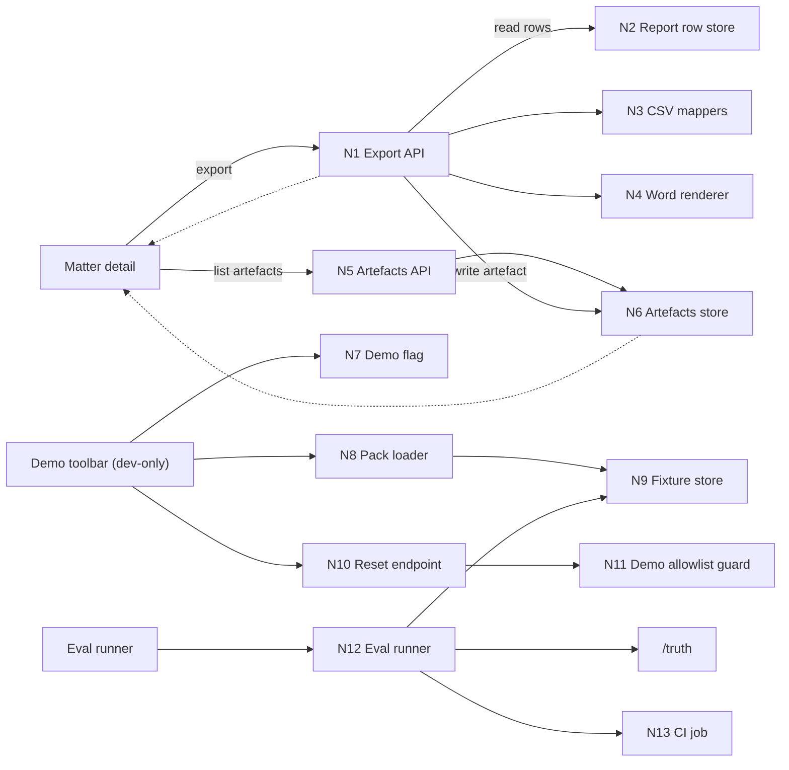

# Breadboard Pack — Initiative 0003: Demo-grade outputs and repeatability

## Context

- Appetite: TBD (slice-by-slice; exports vs eval vs demo controls)
- Problem: report rows are trapped in the UI and regressions slip in unnoticed, making demos brittle.
- Success: we can export credible artefacts (CSV + 1 Word memo), detect regressions via fixtures, and re-run a demo safely.
- Constraints:
  - Keep the core workflow deterministic-ish; avoid building a new "platform".
  - Respect the canonical state model and API contract in `docs/03-architecture/*`.
  - Demo controls must be dev-only or feature-flagged and must not delete non-demo data.

## Current state

### What exists today

- Canonical contracts exist in docs:
  - Export endpoints and error envelope: `docs/03-architecture/50_api_surface.md`
  - Export gating rule: `docs/03-architecture/20_state_model.md`
  - Artefact storage model: `docs/03-architecture/30_data_model.md`
  - Evals posture and metrics: `docs/03-architecture/60_observability_and_evals.md`
- Initiative 3 strategy and seams are documented:
  - `docs/00-strategy/initiatives/003-polishing-for-demo-and-non-func-hardening`
  - `docs/00-strategy/initiatives/initiative-overview-001-002-003.md`

### Current flow (breadboard)

- _Matter detail_
  - report table exists conceptually (rows + statuses + citations)
  - no export affordance and no artefact list
- _Regression safety_
  - no fixture-driven eval runner (conceptual only)
- _Demos_
  - manual "operator knowledge" steps, no safe reset, repeatability depends on luck

## Proposed solution

### Proposed flow (breadboard)

- _Matter detail page_
  - Export menu:
    - Export CSV: requirements / exceptions / survey issues
    - Export Word: single memo template
  - Artefacts list:
    - shows previously exported artefacts with download links
  - Export blocked state:
    - if the selected run contains any `citation_failed` row, export is blocked by default
    - UI explains why (counts) and points to next action (review/fix)
    - optional: demo-only override (spike + explicit perimeter decision)

- _Eval harness (fixtures)_
  - A runner that:
    - loads a fixture pack
    - runs or reads outputs
    - compares against `/truth`
    - emits JSON report + Markdown summary
  - CI runs in report-only mode and stores the report artefact

- _Demo mode (dev-only)_
  - Pack selector that:
    - loads `pack_01_clean` to show the happy path
    - loads `pack_02_missing_rea` to show missing-doc journeys
  - Safe reset:
    - deletes only allowlisted demo matters
    - requires explicit confirmation
  - Demo checklist markdown for the operator

### Elements

- Export menu (CSV + Word)
- Artefacts list (download links)
- CSV mapper with stable column schemas
- Word renderer + single fixed template file
- Export gating UX for `EXPORT_BLOCKED`
- Fixture eval runner + report artefacts
- Demo mode toggle + pack selector + safe reset
- Demo checklist markdown

## UI affordances

| # | Component / place | Affordance | Control | Wires out | Reads |
|---|---|---|---|---|---|
| U1 | Matter detail | Export menu | click | N1 export endpoints | N2 report rows + citations |
| U2 | Matter detail | Export CSV buttons (3) | click | N1 (CSV) | N3 CSV mappers |
| U3 | Matter detail | Export Word button | click | N1 (DOCX) | N4 Word renderer + template |
| U4 | Matter detail | Export blocked banner (EXPORT_BLOCKED) | render |  | N2 run row statuses |
| U5 | Matter detail | Artefacts list | render | N5 artefacts list endpoint | N6 artefacts store |
| U6 | Demo toolbar (dev-only) | Demo mode toggle | click | N7 feature flag |  |
| U7 | Demo toolbar (dev-only) | Pack selector | select | N8 pack loader | N9 fixture store |
| U8 | Demo toolbar (dev-only) | Reset demo data button | click | N10 reset endpoint | N11 demo allowlist guard |
| U9 | Docs | Demo checklist | read |  |  |

## Code affordances

| # | Component / service | Affordance | Control | Wires out / returns |
|---|---|---|---|---|
| N1 | Export API | `POST /export/csv` + `POST /export/docx` | call | returns `{artefact, download_url}` or `EXPORT_BLOCKED` |
| N2 | Report row store | read rows + statuses + citations for a run | read | returns row set |
| N3 | CSV mappers | map row sets to stable CSV schemas | call | returns strings/streams + column headers |
| N4 | Word renderer | fill single template from row sets | call | returns .docx bytes |
| N5 | Artefacts API | `GET /folders/:id/artefacts` | call | returns artefact list |
| N6 | Artefacts store | persist artefact metadata + storage_key | write/read | returns list items |
| N7 | Demo flag | feature flag / env toggle | read | enables demo UI + demo-only endpoints |
| N8 | Pack loader | load fixture pack into system | call | returns folder_id/run_id |
| N9 | Fixture store | seed packs + truth data | read | provides docs + /truth |
| N10 | Reset endpoint | delete demo matters | call | returns success + counts |
| N11 | Demo guard | allowlist demo matter IDs | read | prevents accidental deletion |
| N12 | Eval runner | compare outputs to /truth | call | returns metrics + report artefacts |
| N13 | CI job | run eval + store report | call | publishes report artefact |

## Wiring diagram

- Legend:
  - Solid = calls / triggers / writes
  - Dashed = returns / store reads

## Parts list (BOM)

| Part | Name | Mechanism | Touch points | Notes |
|---|---|---|---|---|
| F1 | Export endpoints | Implement `POST /export/csv` + `POST /export/docx` that read a run’s rows, apply export gating, write an artefact, and return a download URL. | Next.js route handlers; export service; object storage adapter; Zod boundary validation | Keep it synchronous for PoC unless proven too slow. Respect `EXPORT_BLOCKED` default. |
| F2 | CSV schemas + mappers | Define stable column schemas for 3 artefacts and map rows + citations into those schemas. | `packages/core` export module; tests/fixtures | Spike required: practitioner "paste test" to lock schema. |
| F3 | Word renderer + template | Pick one fixed Word template and render a .docx from the report table + deal snapshot. | Template file in repo; docx renderer module | Spike: memo vs objection/cure letter choice. Patch by constraining formatting. |
| F4 | Artefacts list | List previously exported artefacts for a folder and provide download links. | `GET /folders/:id/artefacts`; UI component | Needed for demo repeatability and sharing. |
| F5 | Export UI states | Export menu, blocked banner, loading/error states, and basic "what happened" copy. | Matter detail page UI | Must surface failure modes; never silent failures. |
| F6 | Eval harness (fixtures) | Runner that computes minimal trust metrics vs `/truth` and emits JSON + Markdown summary artefacts per pack. | `fixture:eval` script; report writer | Start report-only; later gate hard trust metrics. |
| F7 | CI integration | Wire eval runner into CI, store artefacts, and publish a summary. | CI config; artifact upload | Keep it light; avoid long runtimes. |
| F8 | Demo mode controls | Feature-flagged demo toolbar with pack selector and safe reset. | Demo-only UI; demo endpoints; allowlist guard | Safety is non-negotiable; demo-only separation must be explicit. |
| F9 | Demo checklist | Human operator demo checklist markdown. | `docs/` markdown | Forces repeatability and reduces tribal knowledge. |

## Fit check: requirements x concept

| Req | Requirement | Status | Fit | Notes |
|---|---|---|---|---|
| R1 | CSV export for 3 artefacts | core goal | ✅ | Direct mapping from report rows to stable CSV schemas. |
| R2 | Word export (single template) | must-have | ⚠️ | Formatting and template choice are the main unknowns. |
| R3 | Eval harness with minimal metrics | must-have | ⚠️ | Needs a tight metric set that correlates with demo readiness. |
| R4 | Demo repeatability controls | must-have | ⚠️ | Reset safety and "demo mode" boundaries need proof. |
| R5 | Export gating matches state model | core goal | ⚠️ | Default is blocked on any `citation_failed`; override decision TBD. |
| R6 | Artefact persistence + listing | must-have | ✅ | Aligns with data model and API surface docs. |

### Readout

- Passes: 2
- Fails: 0
- Undecided: 4

### Unsolved

- R2: Which Word template (memo vs objection/cure letter) best serves the demo story?
- R3: Which 3-5 metrics are predictive enough to catch demo regressions?
- R4: Do we truly need demo mode, and what guardrails make reset provably safe?
- R5: If we allow any export override, how is it scoped (demo-only) and surfaced (warnings)?

## Rabbit holes, cuts, and no-gos

### Rabbit holes

- CSV column expectations from practitioners (import/paste habits).
- Word rendering quirks and formatting drift across Word viewers.
- Metrics that give false confidence or are expensive/flaky to compute.
- Demo reset deleting the wrong data or leaving behind state that breaks repeatability.

### Cuts / scope trims

- No template customisation UI (one fixed template only).
- No Excel formatting beyond CSV.
- CI is report-only until fixture suite stabilises (no early hard gating beyond schema/citation integrity if we can support it).

### Out of bounds / no-gos

- Any export that silently drops `citation_failed` rows without an explicit, visible warning.
- Any reset tool that can delete non-demo data.
- Any feature that depends on external web research during runs.
