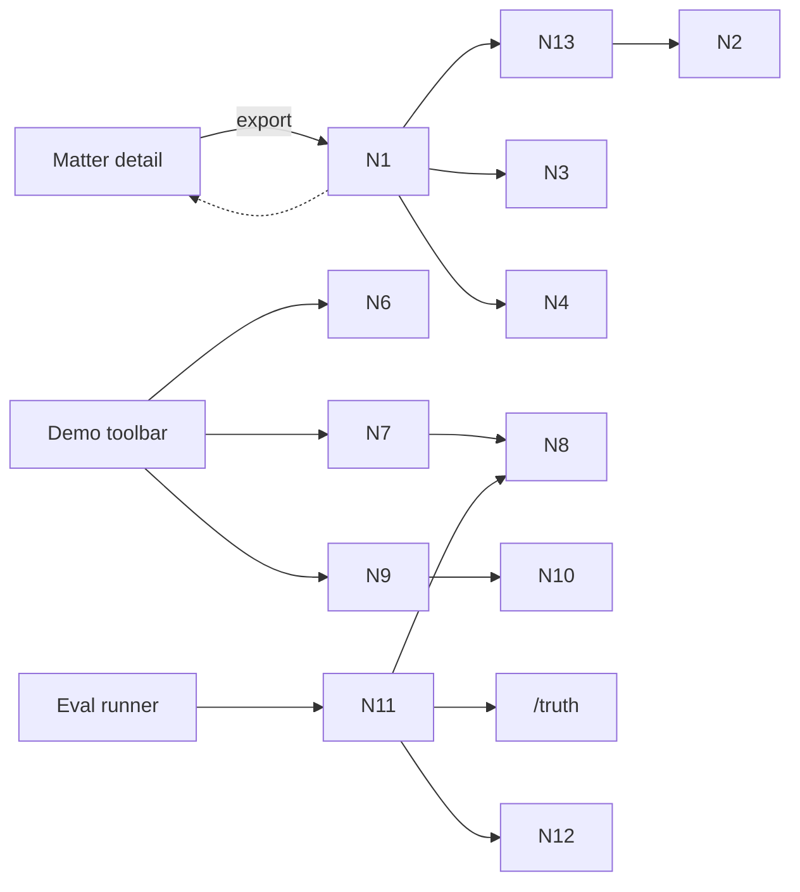

# Breadboard Pack — Demo-grade outputs and repeatability

## Context

- Appetite: TBD
- Problem: Outputs are not exportable, demos are brittle, and regressions go unnoticed.
- Success: CSV + Word exports are usable, eval harness flags regressions, demo can be repeated without cleanup.
- Constraints: Single memo template, minimal metrics, demo mode is dev-only or feature-flagged.
- Export gate: `citation_failed` rows are excluded with a warning banner.

## Current state

### What exists today

- Report rows with citations and statuses (from initiatives 1 and 2).
- Seed packs and /truth for fixtures.
- No export UI, no eval harness, no demo reset path.

### Current flow (breadboard)

- Manual demo steps and ad-hoc sharing.

## Proposed solution

### Proposed flow (breadboard)

- _Matter detail page_
  - Export menu -> CSV exports (requirements, exceptions, survey)
  - Export menu -> Word export (memo template)
  - Warning banner if rows were excluded
- _Eval harness_
  - CLI runner loads pack + outputs JSON + markdown summary
  - CI runs in report-only mode and stores artifacts
- _Demo mode_
  - Toggle demo mode (dev-only)
  - Select pack -> run Quick Start or load seeded rows
  - Reset demo matters with confirmation
  - Follow demo checklist markdown

### Elements

- Export menu + progress state
- CSV mapper + citation formatter
- Docx renderer + template file
- Eval runner script + report artifact
- Demo mode toggle + pack selector
- Reset tool + confirmation UX
- Demo checklist markdown

## UI affordances

| # | Component / place | Affordance | Control | Wires out | Reads |
|---|---|---|---|---|---|
| U1 | Matter detail | Export menu | click | N1 export API | N2 rows + citations |
| U2 | Matter detail | CSV export buttons | click | N1 export API | N3 column map |
| U3 | Matter detail | Word export button | click | N1 export API | N4 docx template |
| U4 | Matter detail | Export status | render |  | N5 export status |
| U5 | Matter detail | Export warning banner | render |  | N13 export filter |
| U6 | Demo toolbar | Demo mode toggle | click | N6 demo flag |  |
| U7 | Demo toolbar | Pack selector | select | N7 pack loader | N8 fixtures |
| U8 | Demo toolbar | Reset demo data | click | N9 reset endpoint | N10 demo guard |
| U9 | Docs | Demo checklist | read |  |  |

## Code affordances

| # | Component / service | Affordance | Control | Wires out / returns |
|---|---|---|---|---|
| N1 | Export API | `POST /exports` | call | returns file URL or download stream |
| N2 | Report row store | query rows + citations | read | returns row set |
| N3 | CSV column mapper | map rows to CSV schema | call | returns stable columns |
| N4 | Docx renderer | fill template | call | returns .docx file |
| N5 | Export status store | status + errors | read/write | returns progress |
| N6 | Demo flag | feature flag | read | enables demo UI |
| N7 | Pack loader | load fixtures | call | returns pack data |
| N8 | Fixture store | seed packs | read | provides docs + truth |
| N9 | Reset endpoint | delete demo matters | call | returns success |
| N10 | Demo guard | allowlist demo IDs | read | prevents accidental delete |
| N11 | Eval runner | compare outputs to /truth | call | returns metrics |
| N12 | CI job | run eval + store artifact | call | publishes report |
| N13 | Export filter | exclude citation_failed rows | call | returns filtered rows + warning |

## Wiring diagram

- Legend:
  - Solid = calls / triggers / writes
  - Dashed = returns / store reads

## Parts list (BOM)

| Part | Name | Mechanism |
|---|---|---|
| F1 | CSV export | Export API + column mapper + citation formatter |
| F2 | Word export | Docx renderer + fixed template |
| F3 | Export UI | Menu, buttons, progress, error state |
| F4 | Eval harness | CLI runner + metrics summary |
| F5 | CI integration | Report-only gate + artifact |
| F6 | Demo mode | Flag + pack selector |
| F7 | Reset tool | Demo-only delete with confirmation |
| F8 | Demo checklist | Markdown steps for operator |

## Fit check: requirements x concept

| Req | Requirement | Status | Fit |
|---|---|---|---|
| R1 | CSV export for 3 artefacts | core goal | ✅ |
| R2 | Word export (memo template) | must-have | ⚠️ (docx formatting risk) |
| R3 | Eval harness with minimal metrics | must-have | ⚠️ (metric selection) |
| R4 | Demo repeatability controls | must-have | ⚠️ (safe reset) |

### Unsolved

- R2: How to keep docx formatting stable across viewers?
- R3: Which minimal metrics are predictive without being a time sink?
- R4: What guardrails guarantee reset safety?

## Rabbit holes, cuts, and no-gos

### Rabbit holes

- CSV column expectations from practitioners.
- Docx formatting quirks across viewers.
- Metrics that overfit and give false confidence.
- Demo reset deleting the wrong data.

### Cuts / scope trims

- No template customization UI.
- No Excel formatting beyond CSV.
- No hard CI gating; report-only for PoC.

### Out of bounds / no-gos

- Production onboarding or multi-tenant demo tooling.
