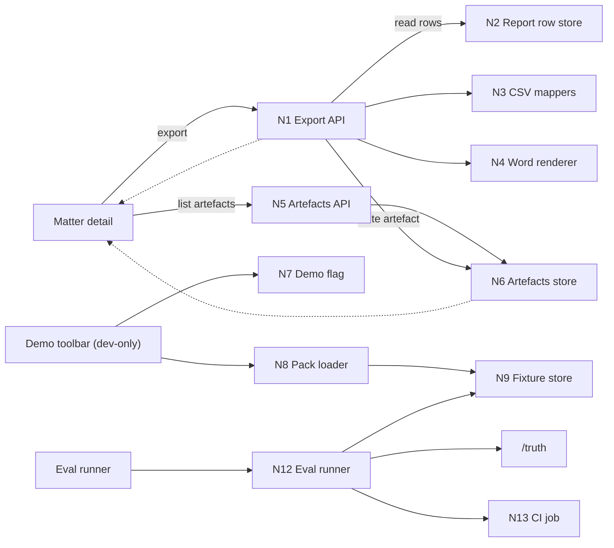
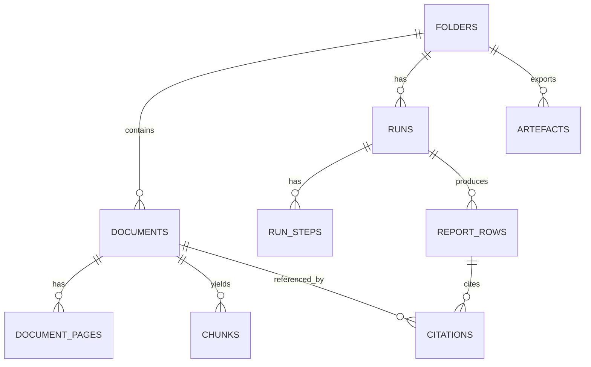

# Oracle Manual Bundle: 0003 Close RH Spikes

Paste this whole message into ChatGPT Pro.

## Prompt
````text
You are reviewing a docs-first shaping packet for Initiative 0003 ("demo-grade outputs and repeatability") in the repo "orbital-poc".

Goal: help me CLOSE the rabbit-hole spikes (risk register RH* items with mitigation = spike) for:
- docs/04-projects/02-features/0003_demo-grade-outputs/

Context:
- Repo is pnpm workspaces + TypeScript, but this request is mainly doc decisions and crisp contracts.
- Canonical architecture contracts + ADRs live in docs/03-architecture/* and MUST WIN if anything conflicts.
- PRDs for slices 0004–0007 exist but are explicitly "NO-GO until spikes close".
- No external web research is allowed inside runs (ADR-0007); base recommendations only on the attached docs.

What I need from you:
1) "Spike closures" (primary output)
   For each spike plan in spike-investigation.md (CSV usability, export gating, Word artefact choice, eval metrics, demo controls/reset safety):
   - Decide/lock the outcome (or explicitly state what cannot be decided without a human stakeholder/practitioner).
   - If you propose an assumption to close the spike, label it "ASSUMPTION" and list what would falsify it.
   - Produce crisp deliverables that close the loop:
     - CSV: propose v1 header list + ordering for each kind (requirements_tracker, exceptions_table, survey_issues) and a deterministic row ordering rule.
     - Export gating: default rule + whether any unsafe_override exists; if it exists, specify exact guardrails + exact UX copy requirements.
     - Word: confirm artefact choice (memo) or justify a change; propose minimal section list + deterministic ordering + citation rendering format.
     - Evals: propose 3-5 hard-gate metrics (aligned to observability/evals docs) + report shape; specify what pack_03_bad_citation minimally contains.
     - Demo controls: decide "toolbar vs checklist-only", and lock reset semantics for slice 1 (prefer no deletion via HTTP).

2) "Doc patch list" (concrete edits)
   Give a file-by-file patch plan (tight, minimal). For each file, list exact edits to make.
   Focus files:
   - docs/04-projects/02-features/0003_demo-grade-outputs/risk-register.md
   - docs/04-projects/02-features/0003_demo-grade-outputs/spike-investigation.md
   - docs/04-projects/02-features/0004_csv-export/prd.md
   - docs/04-projects/02-features/0005_word-export/prd.md
   - docs/04-projects/02-features/0006_eval-harness/prd.md
   - docs/04-projects/02-features/0007_demo-reliability/prd.md

   Specifically: update RH statuses (at least RH1/RH3/RH5/RH7) to "closed" or an explicit alternative state, with the closure decision recorded.
   If any spike cannot be closed without external input, propose the smallest next action to close it (timebox + who + artefact to capture).

3) "Sanity check" (brief)
   Call out any contradictions you notice across the brief/breadboard/risk register/spikes/PRDs and the canonical architecture docs that would prevent a GO decision.

Output format:
- Use headings.
- Prefer tables and bullet lists.
- When proposing doc text changes, include the exact replacement text in fenced code blocks and cite the target file path above the block.
````

## Attached Files
- `docs/04-projects/02-features/0003_demo-grade-outputs/brief.md`
- `docs/04-projects/02-features/0003_demo-grade-outputs/breadboard-pack.md`
- `docs/04-projects/02-features/0003_demo-grade-outputs/risk-register.md`
- `docs/04-projects/02-features/0003_demo-grade-outputs/spike-investigation.md`
- `docs/04-projects/02-features/0003_demo-grade-outputs/tmp-handoffs/handoff_2026-02-07_01-05-10_0003-prd-dossiers.md`
- `docs/04-projects/02-features/0004_csv-export/prd.md`
- `docs/04-projects/02-features/0005_word-export/prd.md`
- `docs/04-projects/02-features/0006_eval-harness/prd.md`
- `docs/04-projects/02-features/0007_demo-reliability/prd.md`
- `docs/04-projects/02-features/0007_demo-reliability/demo-checklist.md`
- `docs/00-strategy/initiatives/prd-slicing-rules.md`
- `docs/03-architecture/DECISIONS.md`
- `docs/03-architecture/20_state_model.md`
- `docs/03-architecture/30_data_model.md`
- `docs/03-architecture/50_api_surface.md`
- `docs/03-architecture/60_observability_and_evals.md`
- `docs/03-architecture/06_frameworks_agents_rag_evals.md`
- `docs/04-projects/AGENTS.md`
- `docs/04-projects/02-features/0003_demo-grade-outputs/tmp-oracle/oracle_response_0003_1.md`
- `docs/04-projects/02-features/0003_demo-grade-outputs/tmp-oracle/oracle_response_0003_2.md`

## File: `docs/04-projects/02-features/0003_demo-grade-outputs/brief.md`
````md
# Brief: Initiative 0003 — Demo-grade outputs and repeatability

## Problem / why now
The PoC’s “trust spine” produces report rows with locked citations and explicit row statuses. But we can’t yet reliably *show, share, or regression-test* those outputs:
- Demos are brittle (manual steps, unknown state, no reset path).
- There’s no export path to produce lawyer-usable artefacts (CSV + a single Word memo).
- Regressions in citations/retrieval/verification can slip in unnoticed until demo day.

This initiative is the finishing layer that makes the PoC **demoable and repeatable** without contaminating the core workflow logic.

## Goals
- **Exports (CSV + Word)** that align with the canonical API and state model:
  - CSV exports for the 3 report artefacts.
  - One Word export (single fixed template).
  - Export creates stored artefacts and returns a download URL.
- **Regression safety** via fixture-driven evals:
  - per-pack report (JSON + Markdown summary)
  - minimal trust metrics (schema + citation integrity + expected failure journeys)
- **Demo repeatability controls** (dev-only / feature-flagged):
  - load known fixture packs
  - “reset” semantics that are demo-safe (see below)
  - a short demo checklist for the human operator

## Definitions (make behaviour explicit)

### “Demo-grade outputs”
For Initiative 0003, “demo-grade outputs” means:
- **Constrained, stable exports** (CSV + one Word artefact) that a practitioner can use as-is for a demo.
- **Stable schemas**: CSV headers + ordering are locked and do not drift silently.
- **Trust posture preserved**: exports fail closed by default (no silent dropping of `citation_failed` rows).

It explicitly does **not** mean: perfect prose, perfect Word formatting, per-firm template customisation, or broad jurisdiction nuance.

### “Repeatability”
For Initiative 0003, “repeatability” means:
- **Export determinism**: for a given `run_id` + `kind`, the exported artefact is deterministic (stable headers/order + deterministic row ordering; no “whatever order the DB returns”).
- **Regression repeatability**: fixture-driven evals are deterministic and produce the same hard-gate pass/fail for the same inputs.
- **Demo repeatability**: an operator can run the same demo twice in a row without manual cleanup and without any capability that could delete non-demo data.

## Non-goals
- Per-firm template customisation or tone tuning.
- Excel formatting beyond CSV.
- Complex scoring models, dashboards, or analytics pipelines.
- Production-grade onboarding, multi-tenant auth, SSO/RBAC, audit dashboards.

## Scope / perimeter (in/out)
In scope:
- CSV exports for `requirements_tracker`, `exceptions_table`, `survey_issues`.
- Word export using **one** fixed template (default: memo).
- Artefact persistence + listing (so exports are retrievable after the fact).
- Eval harness that compares against fixture `/truth` and emits artefacts.
- Demo reliability pack:
  - demo mode flag
  - pack selector
  - demo checklist markdown
  - **Reset (slice 1)**: no deletion via HTTP. “Reset” means creating a fresh demo matter from fixtures.
    - Optional later slice: dev-only destructive reset tool, but only with provable guardrails.

Out of scope (explicit cuts):
- “Closing checklist” export.
- Multiple Word templates or a template editor UI.
- Hard CI gating on nuanced quality metrics (start report-only, then gate later).
- Any workflow that depends on external web research (explicitly out per ADR-0007).
- Any destructive HTTP reset/delete endpoints in the first buildable slice.

## Constraints / dependencies (load-bearing)
- Canonical architecture contracts live in `docs/03-architecture/*` and must win:
  - Export endpoints + error envelope: `docs/03-architecture/50_api_surface.md`
  - Export gating rules: `docs/03-architecture/20_state_model.md`
  - Artefact persistence shape: `docs/03-architecture/30_data_model.md`
  - Evals posture + failure taxonomy: `docs/03-architecture/60_observability_and_evals.md`
- Canonical ADRs live in `docs/03-architecture/DECISIONS.md` (append-only) and apply here:
  - Evidence-first and fail-closed exports (ADR-0001, ADR-0002)
  - Deterministic-ish step boundaries (ADR-0005): keep route handlers thin; long-running export work should live in steps
  - Fixture-driven evals are first-class (ADR-0006)
  - No external web research inside runs (ADR-0007)
- This initiative assumes Initiatives 001 and 002 exist in some form:
  - report rows with `status` and locked citations
  - fixture packs + `/truth` exist (or will be created as part of eval harness work)
- **Load-bearing dependency for exports:** Initiative 002 must persist **structured export payloads** for the 3 artefacts (validated by Zod) in a stable location (recommended: `report_rows.provenance_json.export_payload` with a `schema_version`) so Initiative 003 exports are deterministic and do not parse prose.

## Success (done means)
- From a fixture pack, a demo operator can:
  - export the 3 CSV artefacts and 1 Word memo
  - see exported artefacts listed for the matter and download them
- `fixture:eval` (or equivalent) produces:
  - JSON report + Markdown summary per pack
  - at minimum: schema validity + citation integrity + expected failure journeys
- The demo can be run twice in a row without manual cleanup and without risk to non-demo data.

## Top risks / unknowns (with treatment)
| Risk / unknown | Why it matters | Treatment |
|---|---|---|
| CSV column schema usability | First practitioner reaction can kill the export story | Spike (practitioner paste test) |
| Word template choice (memo vs objection/cure letter) | Storytelling impact for demo audience | Spike (15-minute stakeholder choice) |
| Export behaviour when any row is `citation_failed` | Trust posture vs demo usefulness; needs a crisp default | Patch (follow state model default) + Spike (decide if demo-only override exists) |
| Docx formatting fragility | “Looks broken” erodes trust fast | Patch (keep template simple, constrain layout) |
| Minimal metrics that actually predict demo readiness | Avoid false confidence without building a full eval platform | Spike (3–5 metrics only) |
| Demo reset semantics (no-delete vs destructive tooling) | Accidental deletion is unacceptable | Spike (decide no-delete vs dev-only reset with provable guardrails) |
| Missing structured export payloads (forced prose parsing) | Export work becomes brittle and contaminates workflow logic | Patch dependency into Initiative 002; fail closed until payload exists |

## Open questions
- Export gating UX: if export is blocked (`EXPORT_BLOCKED`), what is the operator path (fix vs override)?
- Export override: do we allow *any* demo-only unsafe override?
  - Slice 1 default: **no override**. If override exists later, it must be demo-only and must label the artefact as unsafe.
- Fixture packs: **in-repo filesystem** for PoC + CI determinism (use `docs/08-example-data/`). Object storage only if needed later.
- Reset semantics: do we ever ship HTTP deletion in the PoC?
  - Slice 1 default: **no deletion via HTTP** (reset = create a fresh demo matter from fixtures).
- What’s the target appetite/timebox for each slice (CSV vs Word vs eval vs demo mode)?

## PRD slicing plan (after spikes)
Per `docs/00-strategy/initiatives/prd-slicing-rules.md`: PRDs come after brief + breadboard + risk register + spikes.

PRD dossiers (drafted as DRAFT/NO-GO until spikes close; names from `docs/00-strategy/initiatives/001-003_handoff.md`):
- `0004_csv-export` (`docs/04-projects/02-features/0004_csv-export/`)
- `0005_word-export` (`docs/04-projects/02-features/0005_word-export/`)
- `0006_eval-harness` (`docs/04-projects/02-features/0006_eval-harness/`)
- `0007_demo-reliability` (`docs/04-projects/02-features/0007_demo-reliability/`)

## Glossary (canonical names)
- **Folder**: API/DB container (UI term: “Matter”).
- **Run**: one Quick Start execution attempt for a folder.
- **Report row**: one question/answer/status (+ citations) produced by a run.
- **Artefact**: an exported file (csv/docx/eval report) stored in object storage with metadata in DB.
- **Fixture pack**: deterministic in-repo demo/eval bundle (docs + `/truth`).

## Shaping decision (GO/NO-GO)
- **GO** when:
  - export API contract is unblocked (supports `kind`, defines artefacts list response)
  - structured export payload shape/location is locked (or “tracker-grade CSVs” are explicitly cut until Initiative 002 provides structure)
  - reset semantics are explicit (default: no destructive HTTP reset in slice 1)
  - spikes are completed (or consciously cut) with written outcomes that update this dossier
- **NO-GO** if export gating remains ambiguous, or if any demo tool could delete non-demo data without provable guardrails.
````

## File: `docs/04-projects/02-features/0003_demo-grade-outputs/breadboard-pack.md`
````md
# Breadboard Pack — Initiative 0003: Demo-grade outputs and repeatability

## Context

- Appetite: TBD (slice-by-slice; exports vs eval vs demo controls)
- Problem: report rows are trapped in the UI and regressions slip in unnoticed, making demos brittle.
- Success: we can export credible artefacts (CSV + 1 Word memo), detect regressions via fixtures, and re-run a demo safely.
- Constraints:
  - Keep the core workflow deterministic-ish; avoid building a new "platform".
  - Respect the canonical state model and API contract in `docs/03-architecture/*`.
  - Demo controls must be dev-only or feature-flagged and must not delete non-demo data.

## Current state

### What exists today

- Canonical contracts exist in docs:
  - Export endpoints and error envelope: `docs/03-architecture/50_api_surface.md`
  - Export gating rule: `docs/03-architecture/20_state_model.md`
  - Artefact storage model: `docs/03-architecture/30_data_model.md`
  - Evals posture and metrics: `docs/03-architecture/60_observability_and_evals.md`
- Initiative 3 strategy and seams are documented:
  - `docs/00-strategy/initiatives/003-polishing-for-demo-and-non-func-hardening.md`
  - `docs/00-strategy/initiatives/initiative-overview-001-002-003.md`

### Current flow (breadboard)

- _Matter detail_
  - report table exists conceptually (rows + statuses + citations)
  - no export affordance and no artefact list
- _Regression safety_
  - no fixture-driven eval runner (conceptual only)
- _Demos_
  - manual "operator knowledge" steps, no safe reset, repeatability depends on luck

## Proposed solution

### Proposed flow (breadboard)

- _Matter detail page_
  - Export menu:
    - Export CSV: requirements / exceptions / survey issues
    - Export Word: single memo template
  - Artefacts list:
    - shows previously exported artefacts with download links
      - note: signed `download_url`s are ephemeral; generate on demand (do not persist)
  - Export blocked state:
    - if the selected run contains any `citation_failed` row, export is blocked by default
    - UI explains why (counts) and points to next action (review/fix)
    - export buttons are disabled until `run.state = completed` (PoC default)
    - optional later slice: demo-only unsafe override (spike + explicit perimeter decision)

- _Eval harness (fixtures)_
  - A runner that:
    - loads a fixture pack
    - **Phase 0 (locked): reads already-produced outputs** for `folder_id/run_id` and compares against `/truth`
    - compares against `/truth`
    - emits JSON report + Markdown summary
  - CI runs in report-only mode and stores the report artefact
  - Explicitly out of scope (Phase 1): orchestrating ingestion + runs inside CI

- _Demo mode (dev-only)_
  - Pack selector that:
    - loads `pack_01_clean` to show the happy path
    - loads `pack_02_missing_rea` to show missing-doc journeys
    - creates a **fresh** demo matter/run per load (no deletion required in slice 1)
  - Demo checklist markdown for the operator

### Elements

- Export menu (CSV + Word)
- Artefacts list (download links)
- CSV mapper with stable column schemas
- Word renderer + single fixed template file
- Export gating UX for `EXPORT_BLOCKED`
- Fixture eval runner + report artefacts
- Demo mode toggle + pack selector (no-delete “reset” in slice 1)
- Demo checklist markdown

## UI affordances

| # | Component / place | Affordance | Control | Wires out | Reads |
|---|---|---|---|---|---|
| U1 | Matter detail | Export menu | click | N1 export endpoints | N2 report rows + citations |
| U2 | Matter detail | Export CSV buttons (3) | click | N1 (CSV) | N3 CSV mappers |
| U3 | Matter detail | Export Word button | click | N1 (DOCX) | N4 Word renderer + template |
| U4 | Matter detail | Export blocked banner (EXPORT_BLOCKED) | render |  | N2 run row statuses |
| U5 | Matter detail | Artefacts list | render | N5 artefacts list endpoint | N6 artefacts store |
| U6 | Demo toolbar (dev-only) | Demo mode toggle | click | N7 feature flag |  |
| U7 | Demo toolbar (dev-only) | Pack selector | select | N8 pack loader | N9 fixture store |
| U8 | Docs | Demo checklist | read |  |  |

## Code affordances

| # | Component / service | Affordance | Control | Wires out / returns |
|---|---|---|---|---|
| N1 | Export API | `POST /export/csv` + `POST /export/docx` | call | supports `kind` (+ optional `unsafe_override`); returns `{artefact: { …, download_url }}` or `EXPORT_BLOCKED` |
| N2 | Report row store | read rows + statuses + citations for a run | read | returns row set |
| N3 | CSV mappers | map **structured export payloads** to stable CSV schemas | call | returns strings/streams + locked column headers |
| N4 | Word renderer | fill single template from row sets | call | returns .docx bytes |
| N5 | Artefacts API | `GET /folders/:id/artefacts` | call | returns artefact list |
| N6 | Artefacts store | persist artefact metadata + storage_key | write/read | returns list items |
| N7 | Demo flag | feature flag / env toggle | read | enables demo UI + demo-only endpoints |
| N8 | Pack loader | load fixture pack into system | call | returns folder_id/run_id |
| N9 | Fixture store | seed packs + truth data (in-repo filesystem under `docs/08-example-data/`) | read | provides docs + /truth |
| N12 | Eval runner | compare outputs to /truth | call | returns metrics + report artefacts |
| N13 | CI job | run eval + store report | call | publishes report artefact |

## Wiring diagram

- Legend:
  - Solid = calls / triggers / writes
  - Dashed = returns / store reads



## Parts list (BOM)

| Part | Name | Mechanism | Touch points | Notes |
|---|---|---|---|---|
| F1 | Export endpoints | Implement `POST /export/csv` + `POST /export/docx` that read a run’s report rows, apply export gating, write an artefact, and return `artefact.download_url`. | Next.js route handlers; export service; object storage adapter; Zod boundary validation | Must support `kind` in request. Export only allowed for `run.state = completed`. Respect `EXPORT_BLOCKED` default when any row is `citation_failed`. Keep route handlers thin; if export generation is slow, run it as a WDK step (ADR-0005). |
| F2 | CSV schemas + mappers | Define stable column schemas for 3 artefacts and map **structured `export_payload`** into those schemas. | `packages/core` export module; tests/fixtures | No prose parsing. Fail closed if `export_payload` missing. Spike required: practitioner "paste test" to lock headers + ordering. Add snapshot tests to prevent drift. |
| F3 | Word renderer + template | Pick one fixed Word template and render a .docx from the report table + deal snapshot. | Template file in repo; docx renderer module | Spike: memo vs objection/cure letter choice. Patch by constraining formatting. |
| F4 | Artefacts list | List previously exported artefacts for a folder and provide download links. | `GET /folders/:id/artefacts`; UI component | Generate fresh signed `download_url` on list (do not persist). Needed for demo repeatability and sharing. |
| F5 | Export UI states | Export menu, blocked banner, loading/error states, and basic "what happened" copy. | Matter detail page UI | Must surface failure modes; never silent failures. |
| F6 | Eval harness (fixtures) | Runner that computes minimal trust metrics vs `/truth` and emits JSON + Markdown summary artefacts per pack. | `fixture:eval` script; report writer | Phase 0: reads existing `folder_id/run_id` outputs + `/truth` (does not orchestrate runs in CI). Start report-only; later gate hard trust metrics. |
| F7 | CI integration | Wire eval runner into CI, store artefacts, and publish a summary. | CI config; artifact upload | Keep it light; avoid long runtimes. |
| F8 | Demo mode controls | Feature-flagged demo toolbar with pack selector (and optional reset decision later). | Demo-only UI; pack loader; (optional dev-only reset tooling) | Slice 1: no destructive reset via HTTP. Safety is non-negotiable; demo-only separation must be explicit. |
| F9 | Demo checklist | Human operator demo checklist markdown. | `docs/` markdown | Forces repeatability and reduces tribal knowledge. |

## Fit check: requirements x concept

| Req | Requirement | Status | Fit | Notes |
|---|---|---|---|---|
| R1 | CSV export for 3 artefacts | core goal | ✅ | Direct mapping from structured export payloads to stable CSV schemas (no prose parsing). |
| R2 | Word export (single template) | must-have | ⚠️ | Formatting and template choice are the main unknowns. |
| R3 | Eval harness with minimal metrics | must-have | ⚠️ | Needs a tight metric set that correlates with demo readiness. |
| R4 | Demo repeatability controls | must-have | ⚠️ | Slice 1 avoids deletion; demo mode boundaries and (optional) later reset guardrails still need proof. |
| R5 | Export gating matches state model | core goal | ⚠️ | Slice 1: blocked on any `citation_failed` and no override. Later override decision is optional. |
| R6 | Artefact persistence + listing | must-have | ✅ | Aligns with data model and API surface docs. |

### Readout

- Passes: 2
- Fails: 0
- Undecided: 4

### Unsolved

- R2: Which Word template (memo vs objection/cure letter) best serves the demo story?
- R3: Which 3-5 metrics are predictive enough to catch demo regressions?
- R4: Do we truly need demo mode UI (vs a fixture loader + checklist), and do we ever ship destructive reset endpoints?
- R5: If we ever allow any export override, how is it scoped (demo-only) and surfaced (unsafe labelling + warnings)?

## Rabbit holes, cuts, and no-gos

### Rabbit holes

- CSV column expectations from practitioners (import/paste habits).
- Word rendering quirks and formatting drift across Word viewers.
- Metrics that give false confidence or are expensive/flaky to compute.
- If we ever add destructive reset: deleting the wrong data or leaving behind state that breaks repeatability.

### Cuts / scope trims

- No template customisation UI (one fixed template only).
- No Excel formatting beyond CSV.
- CI is report-only until fixture suite stabilises (no early hard gating beyond schema/citation integrity if we can support it).

### Out of bounds / no-gos

- Any export that silently drops `citation_failed` rows without an explicit, visible warning.
- Any reset tool that can delete non-demo data.
- Any feature that depends on external web research during runs.
````

## File: `docs/04-projects/02-features/0003_demo-grade-outputs/risk-register.md`
````md
# Risk register (rabbit holes)

Use this during shaping to capture tail risks and choose mitigations.

| ID | Rabbit hole | Type | Why it’s risky | Mitigation | Status |
|---|---|---|---|---|---|
| RH1 | Is the CSV export format actually usable for a paralegal paste/import workflow? | product | If the first practitioner reaction is "this is unusable", exports fail as a demo story. | spike | open |
| RH2 | How do we prevent CSV column ordering drift as schemas evolve? | data | Drift makes exports hard to diff, import, and trust. | patch: lock headers in code, enforce deterministic row/column ordering, snapshot exports per fixture pack; record `schema_version` in artefact metadata | open |
| RH3 | Which Word artefact best supports the demo narrative (memo vs objection/cure letter)? | product | Wrong artefact can make the demo feel contrived or low value. | spike | open |
| RH4 | Docx formatting inconsistencies across viewers (Word, Google Docs, preview) | technical | "Looks broken" erodes trust immediately. | patch | open |
| RH5 | Export behaviour when any row is `citation_failed` (block vs partial export) | design | This is a trust posture decision. Getting it wrong undermines the product promise. | spike | open |
| RH6 | Where do exports live (download-only vs stored artefacts + list)? | dependency | A wrong storage decision creates churn and demo unreliability. | patch: persist artefacts (`storage_key` + metadata); never persist signed URLs; generate fresh `download_url` on demand | open |
| RH7 | Minimal eval metrics: which 3-5 metrics predict demo readiness? | product | Too shallow = false confidence. Too deep = time sink. | spike | open |
| RH8 | Citation integrity checks are expensive/flaky | technical | If the eval harness is brittle, it will be ignored. | patch | open |
| RH9 | CI eval runtime is too slow for iteration | technical | Slow CI creates friction and encourages bypassing tests. | cut | open |
| RH10 | Demo reset tool can delete non-demo data | safety | Data loss is unacceptable even in a PoC. | patch | open |
| RH11 | Demo mode pollutes the real UX or bypasses trust gates | design | Confuses users and creates hidden behaviour paths. | patch | open |
| RH12 | Fixture packs and `/truth` drift without ownership | dependency | Evals become meaningless if fixtures are not maintained. | patch | open |
| RH13 | Do we have structured export payloads (or are we forced to parse prose)? | dependency | Prose parsing is brittle and contaminates workflow logic; export quality will collapse under real inputs. | patch: require Initiative 002 to persist `export_payload` + `schema_version`; fail closed until present (or cut “tracker-grade” CSVs) | open |

## Notes

- Prefer writing rabbit holes as questions.
- If a rabbit hole is really a product decision, treat it as a shaping question (don’t hide it as “tech risk”).
- Spikes must happen before PRDs are sliced (see `docs/00-strategy/initiatives/prd-slicing-rules.md`).
````

## File: `docs/04-projects/02-features/0003_demo-grade-outputs/spike-investigation.md`
````md
# Spike investigation — Initiative 0003: Demo-grade outputs and repeatability

> Status: planned only. No spikes executed yet.
> Note: Thin PRD dossiers (`0004`–`0007`) have been drafted as DRAFT/NO-GO to capture scope, but implementation should not start until these spikes close.

Per `docs/00-strategy/initiatives/prd-slicing-rules.md`: spikes come before PRDs.

## Spike plan — CSV export format usability

## Question

Is the CSV export format usable for a paralegal who needs to paste into an existing tracker?

## Context

- Feature / concept: 3.1 CSV exports (requirements, exceptions, survey issues)
- Related requirement(s): R1
- Why now: Export usability is the core promise for "demo-grade outputs"

## Success criteria

Proof looks like:

- Practitioner can paste/import in **<5 minutes** of cleanup.
- They explicitly sign off (or give a precise change list):
  - required columns present
  - column names acceptable
  - column ordering acceptable
- Output includes:
  - row `status`
  - citations rendered as `filename:page` (and optionally `citation_id` for audit/debug)
- A decision is recorded on the export **source of truth**:
  - PASS only if the CSV can be produced from structured `export_payload` (no prose parsing), or we explicitly cut “tracker-grade CSVs” until Initiative 002 provides structure.

## Timebox

- Start: TBD
- Hard stop: TBD (1-2 hours of practitioner time, max)

## Scope

Include:

- Sample CSVs for requirements, exceptions, and survey issues.
- Citations and row statuses included (as doc name + page, plus status code).

Exclude:

- Any Excel formatting, formulas, or per-firm customisation.

## Approach

- Step 0: Confirm Initiative 002 persists structured `export_payload` + `schema_version` for each artefact in a stable location (recommended: `report_rows.provenance_json.export_payload`).
- Step 1: Generate 3 sample CSVs from `pack_01_clean`.
- Step 2: Hand to a practitioner for a quick paste/import test.
- Step 3: Capture feedback and lock (or revise) the column schema:
  - locked header list + ordering
  - deterministic row ordering rule (sort keys)

## Artefacts

Keep:

- Feedback notes.
- Final column schema (header list + ordering).

Throw away:

- Any prototype formatting beyond CSV.

## Expected outcomes

- If straight shot: lock the column schema and add fixture-based export snapshots.
- If tangle: cut optional columns and re-test with a minimal schema.
- If fog: focus only on requirements CSV first, then expand to the other two.

## Oracle pass

Completed (see `tmp-oracle/oracle_response_0003_1.md` and `tmp-oracle/oracle_response_0003_2.md`).

---

## Spike plan — Export gating behaviour (trust posture vs demo utility)

## Question

When any row is `citation_failed`, do we:
1) block export by default (per state model), and
2) allow a demo-only override (explicit + visibly unsafe)?

## Context

- Feature / concept: 3.1/3.2 exports
- Related requirement(s): R5
- Why now: This is a product trust decision; exporting "partial truth" is dangerous if underspecified.

## Success criteria

Proof looks like:

- A single crisp default that matches `docs/03-architecture/20_state_model.md`.
- If override exists, it is strictly scoped (demo-only) and impossible to trigger accidentally.
- UX copy is unambiguous about what is missing/excluded.
- Export readiness is unambiguous: exports are only allowed when `runs.state = completed` (PoC default).

## Timebox

- Start: TBD
- Hard stop: TBD (30-60 minutes)

## Scope

Include:

- Default behaviour and exact UX messaging for `EXPORT_BLOCKED`.
- Decision on whether override exists, and if so: how it is guarded.

Exclude:

- Any attempt to "fix" citation_failed rows inside export.

## Approach

- Step 1: Restate canonical rule from state model and API surface docs.
- Step 2: Draft 2 options (block-only vs demo-only override) with a concrete UI + API shape.
- Step 3: Choose and lock the perimeter.
- Step 4 (micro contract-lock): update `docs/03-architecture/20_state_model.md` + `docs/03-architecture/50_api_surface.md` to match the decision (no ghost contracts).

## Artefacts

Keep:

- The chosen rule and the UX copy for blocked export.
- If override exists: an explicit guardrail design (demo-only).

Throw away:

- Any design that silently drops `citation_failed` rows.

## Expected outcomes

- If straight shot: implement exactly as specified and write fixture tests for the blocked case.
- If tangle: cut override entirely; ship block-only export.
- If fog: defer exports until trust substrate is stable (unlikely; but call it out).

## Oracle pass

Completed (see `tmp-oracle/oracle_response_0003_1.md` and `tmp-oracle/oracle_response_0003_2.md`).

---

## Spike plan — Word artefact choice (memo vs objection/cure letter)

## Question

Which single Word artefact is most compelling for the demo audience: memo or objection/cure letter?

## Context

- Feature / concept: 3.2 Word export
- Related requirement(s): R2
- Why now: Template choice drives narrative and avoids wasted build effort.

## Success criteria

Proof looks like:

- Stakeholder picks one template in 15 minutes (default assumption: memo).
- We get 3-5 bullet requirements about what "must be in the Word export":
  - section list + must-have fields
  - how citations render (format)
  - how `missing_input` rows appear
- Feasibility proof: a minimal `.docx` renders acceptably (basic visual sanity, not pixel-perfect) in:
  - Word
  - Google Docs
  - macOS Preview (or equivalent)

## Timebox

- Start: TBD
- Hard stop: TBD (15-30 minutes)

## Scope

Include:

- A paper mock outline for each template option (no formatting yet).
- A decision and a list of must-have sections.

Exclude:

- Any attempt at per-firm customisation.
- Any "perfect formatting" work.

## Approach

- Step 1: Draft two 1-page outlines (memo vs objection letter).
- Step 2: Ask stakeholder to choose (and say why).
- Step 3: Lock the template choice and section list.
- Step 4: Generate a minimal docx using the chosen approach and open it in Word + Google Docs + Preview (pass/fail = “not broken”).
  - Optional automation: use `pnpm dlx agent-browser …` (snapshot/refs) or `browser-use …` (persistent session) to script the Google Docs view + screenshot, if it materially saves time.

## Artefacts

Keep:

- Chosen template name + section list.
- Any copy notes that materially affect what we render.

Throw away:

- Any formatting experiments beyond proving feasibility.

## Expected outcomes

- If straight shot: implement the chosen template only.
- If tangle: cut Word export entirely from the first demo-grade slice.
- If fog: pick memo by default (simpler) and move on.

## Oracle pass

Completed (see `tmp-oracle/oracle_response_0003_1.md` and `tmp-oracle/oracle_response_0003_2.md`).

---

## Spike plan — Minimal eval metrics that predict demo readiness

## Question

What 3-5 metrics are predictive enough for demo readiness without becoming a time sink?

## Context

- Feature / concept: 3.3 eval harness
- Related requirement(s): R3
- Why now: We want regression safety without building a full eval platform.

## Success criteria

Proof looks like:

- Metrics set includes the hard gates already defined in `docs/03-architecture/60_observability_and_evals.md`:
  - schema validity (100%)
  - citation integrity (100%)
  - expected failure journeys (must fail in the expected way)
- Runner produces:
  - per-pack JSON report + per-pack Markdown summary
  - a cross-pack summary table
  - non-zero exit code when any hard gate fails (even if CI is report-only initially)
- Metrics can be computed deterministically from fixtures without heavy model calls.

## Timebox

- Start: TBD
- Hard stop: TBD (2-4 hours)

## Scope

Include:

- At least 2 packs (happy path + missing-doc pack).
- At least one negative test pack (bad citation or deliberate failure).

Exclude:

- Complex scoring models or subjective "quality" metrics.
- Large-scale sampling.

## Approach

- Step 1: Implement metric computation on `pack_01_clean`.
- Step 2: Validate that it flags expected failures on `pack_02_missing_rea`.
- Step 3: Add `pack_03_bad_citation` and ensure it fails closed with the expected taxonomy.

## Artefacts

Keep:

- Final metric definitions.
- Example report output (JSON + Markdown).

Throw away:

- Extra metrics that don’t correlate with demo success.

## Expected outcomes

- If straight shot: lock metrics and wire into report-only CI.
- If tangle: cut down to schema validity + citation integrity only.
- If fog: stop and re-scope eval harness to a single "hard gates only" check.

## Oracle pass

Completed (see `tmp-oracle/oracle_response_0003_1.md` and `tmp-oracle/oracle_response_0003_2.md`).

---

## Spike plan — Demo repeatability controls and reset safety

## Question

Do we actually need demo mode, and if we do, what guardrails make reset provably safe?

## Context

- Feature / concept: 3.4 demo reliability pack (pack selector + reset + checklist)
- Related requirement(s): R4
- Why now: Reset is high-risk; demo mode can pollute UX if sloppy.

## Success criteria

Proof looks like:

- First output is a binary decision: **demo mode required vs not required**.
- If demo mode is required:
  - pack loading behaviour is specified (what gets seeded, what gets returned, where packs live)
- Reset semantics are explicit:
  - preferred default: **no deletion via HTTP** in the PoC (reset = create a fresh demo matter from fixtures)
  - if destructive reset is insisted on: guardrails + test plan must prove non-demo data cannot be touched

## Timebox

- Start: TBD
- Hard stop: TBD (2-3 hours)

## Scope

Include:

- Pack selector shape (loads fixture packs only).
- Reset semantics decision (no-delete vs dev-only destructive tooling).

Exclude:

- Production onboarding wizard behaviours.
- Any "admin" surface beyond what demos need.

## Approach

- Step 1: Identify the minimum UI affordances needed for the operator.
- Step 2: Decide "demo mode required?" and lock the perimeter.
- Step 3: If reset is required:
  - choose no-delete semantics (preferred), or
  - draft guardrails (allowlist + confirmation) and a safety test plan
- Step 4: If destructive reset endpoints remain in scope, add a security review step (even for PoC) to confirm the guard can’t be bypassed by naming/user input/query params.

## Artefacts

Keep:

- Guardrails design.
- Demo checklist first draft.

Throw away:

- Any attempts to generalise demo tooling into production onboarding.

## Expected outcomes

- If straight shot: build demo mode behind a feature flag and keep it isolated.
- If tangle: cut demo mode; rely on a written checklist and fixture scripts only.
- If fog: timebox a second spike; otherwise cut to avoid safety risk.

## Oracle pass

Completed (see `tmp-oracle/oracle_response_0003_1.md` and `tmp-oracle/oracle_response_0003_2.md`).
````

## File: `docs/04-projects/02-features/0003_demo-grade-outputs/tmp-handoffs/handoff_2026-02-07_01-05-10_0003-prd-dossiers.md`
````md
Saved handoff: docs/04-projects/02-features/0003_demo-grade-outputs/tmp-handoffs/handoff_2026-02-07_01-05-10_0003-prd-dossiers.md

1) Scope/status
- Goal: turn Initiative 0003 shaping packet into thin PRD dossiers aligned with canonical architecture + ADRs in `docs/03-architecture/DECISIONS.md`.
- Done:
  - Reconciled the 0003 shaping dossier with canonical architecture contracts + ADRs:
    - `docs/04-projects/02-features/0003_demo-grade-outputs/brief.md`
    - `docs/04-projects/02-features/0003_demo-grade-outputs/breadboard-pack.md`
    - `docs/04-projects/02-features/0003_demo-grade-outputs/risk-register.md`
    - `docs/04-projects/02-features/0003_demo-grade-outputs/spike-investigation.md`
  - Created PRD dossiers (each has `prd.md` + `prd.json`):
    - `docs/04-projects/02-features/0004_csv-export/`
    - `docs/04-projects/02-features/0005_word-export/`
    - `docs/04-projects/02-features/0006_eval-harness/`
    - `docs/04-projects/02-features/0007_demo-reliability/`
  - Added a draft demo checklist:
    - `docs/04-projects/02-features/0007_demo-reliability/demo-checklist.md`
  - `prd.json` validation: PASS for all four dossiers (validated against `docs/04-projects/_templates/json-prd.schema.json`).
  - Confirmed `agent-browser` works via `pnpm dlx` (no global install required) and supports `browseruse` provider.
- Pending / blockers:
  - All spikes are still planned only (no practitioner/stakeholder spikes executed yet).
  - `pack_03_bad_citation` fixture pack is referenced in PRD 0006 but not created yet.
  - Dependency not proven: Initiative 002 must persist structured `export_payload` + `schema_version` (exports must not parse prose).

2) Working tree
- `git status -sb`: `## main...origin/main` with untracked handoff notes:
  - `docs/04-projects/02-features/0002_quick-start-engine/tmp-handoffs/handoff_2026-02-07_01-05-12_quick-start-prd-slices.md`
  - `docs/04-projects/02-features/0003_demo-grade-outputs/tmp-handoffs/handoff_2026-02-07_01-05-10_0003-prd-dossiers.md`

3) Branch/PR
- Branch: `main` (up to date with `origin/main`).
- PR: none.
- Latest commit: `5e33d22` (docs-only).

4) Running processes
- No tmux sessions.

5) Tests/checks
- Ran JSON PRD schema validation via python `jsonschema`:
  - `docs/04-projects/02-features/0004_csv-export/prd.json` PASS
  - `docs/04-projects/02-features/0005_word-export/prd.json` PASS
  - `docs/04-projects/02-features/0006_eval-harness/prd.json` PASS
  - `docs/04-projects/02-features/0007_demo-reliability/prd.json` PASS
- No code tests run (repo remains docs-first at this point).

6) Next steps (do these in order)
1. Run the Initiative 0003 spikes and write outcomes back into:
   - `docs/04-projects/02-features/0003_demo-grade-outputs/spike-investigation.md`
2. Update PRDs based on spike outcomes:
   - CSV headers/order + deterministic row ordering rules (0004)
   - Word template choice + section list + citation rendering format + docx viewer sanity notes (0005)
   - Hard gate metric outputs + add `pack_03_bad_citation` (0006)
   - Decide demo toolbar vs checklist-only; keep “no deletion via HTTP” unless explicitly proven safe (0007)
3. If structured export payloads do not exist yet (Initiative 002 gap):
   - Add a thin 0002 slice that persists `report_rows.provenance_json.export_payload` (+ `schema_version`) so exports are deterministic and do not parse prose.

7) Risks/gotchas
- Trust posture is non-negotiable (ADR-0001/0002): do not silently export around `citation_failed`.
- Signed URLs are ephemeral: never persist `download_url` in DB; generate on demand.
- WDK boundaries (ADR-0005): keep route handlers thin; long-running export generation should run as steps if needed.
- Demo “reset” is high-risk: default is no destructive HTTP reset in the first slice; if introduced later it needs provable guardrails + tests + ADR.
````

## File: `docs/04-projects/02-features/0004_csv-export/prd.md`
````md
# PRD: CSV Exports + Artefacts List (Requirements / Exceptions / Survey Issues)

Owner: TBD
Status: DRAFT (NO-GO until spikes close)
Date: 2026-02-07

## Summary

Ship demo-grade CSV exports aligned with canonical architecture contracts:
- 1-click exports for:
  - `requirements_tracker.csv`
  - `exceptions_table.csv`
  - `survey_issues.csv`
- Strict export gating (fail-closed) and clear UI blocked/not-ready states.
- Artefact persistence + artefacts list/download via fresh signed URLs.

This PRD does not include Word export, eval harness, or demo tooling.

## Problem

Report rows are trapped in the UI and demos are brittle. We need a repeatable way to export a practitioner-usable artefact and retrieve it later, without undermining the trust posture (fail-closed on `citation_failed`).

## Goals

- A demo operator can export all 3 CSV artefacts from `docs/08-example-data/pack_01_clean`.
- The export is **deterministic** (locked headers + deterministic row ordering).
- Export is only available when `runs.state = completed`.
- Export is blocked when any row is `citation_failed` (no override in slice 1).
- Exported artefacts are listed for the matter and downloadable via fresh signed URLs.
- Exports include:
  - row status
  - citations rendered as `filename:page` (and optionally `citation_id`)

## Non-goals

- Word export (.docx) (future slice).
- Any unsafe/demo-only override path (future slice decision).
- Eval harness + CI integration (future slice).
- Demo toolbar and any reset/delete UI (future slice).
- Excel formatting beyond CSV.

## Users

- Demo operator (internal): needs one-click export + reliable download.
- Practitioner reviewer (friendly): sanity-checks CSV usability via paste/import.

## Solution

Add/implement the canonical export + artefact listing contract:
- `POST /export/csv` with `kind=requirements_tracker|exceptions_table|survey_issues`
- `GET /folders/:id/artefacts` to list/download previously exported artefacts

Exports must not parse prose. CSV mapping consumes structured `export_payload` persisted by Initiative 002 (recommended: `report_rows.provenance_json.export_payload` with a `schema_version`).

## Scope

In scope:
- Export endpoint + validation (`kind` support, request Zod boundary validation).
- Export gating:
  - `runs.state = completed` required (else `409 CONFLICT`)
  - any `citation_failed` row blocks export (`EXPORT_BLOCKED`)
- CSV schemas v1 for:
  - `requirements_tracker`
  - `exceptions_table`
  - `survey_issues`
  - Each has locked header list + ordering (from CSV usability spike outcome) and deterministic row ordering rule (documented).
- Artefact persistence:
  - persist `storage_key` + metadata (`kind`, `schema_version`, `filename`, `source_run_id`)
  - do not persist signed URLs
- UI:
  - export buttons for the 3 CSV kinds
  - disabled state until run completes
  - blocked banner state for `EXPORT_BLOCKED`
  - artefacts list with working download links
- Logging: export attempt + success/blocked/failure with `trace_id`.

Out of scope:
- Any override behaviour.
- Any destructive reset tooling.

## Breadboard Mapping

From `docs/04-projects/02-features/0003_demo-grade-outputs/breadboard-pack.md`:
- Parts: F1 (export endpoints), F2 (CSV schemas + mappers), F4 (artefacts list), F5 (export UI states)
- Affordances: U1, U2, U4, U5
- Code affordances: N1, N2, N3, N5, N6

## User Stories

### US-001 Export CSV Artefacts
As a demo operator, I can export the requirements tracker, exceptions table, and survey issues CSVs for a completed run so I can share outputs outside the UI.

### US-002 See Blocked/Not-Ready States
As a demo operator, I can clearly see when export is not ready (run still running) or blocked (citation failures) so I don’t create inconsistent artefacts.

### US-003 View And Download Artefacts
As a demo operator, I can see previously exported artefacts for a matter and download them reliably.

## Functional Requirements

- FR-001: `POST /export/csv` accepts `{ folder_id, run_id, kind, unsafe_override }` per `docs/03-architecture/50_api_surface.md`.
- FR-002: Supported CSV `kind` values are exactly: `requirements_tracker`, `exceptions_table`, `survey_issues`.
- FR-003: Export only allowed when `runs.state = completed`; otherwise return `409` with `error.code = "CONFLICT"`.
- FR-004: If any row in the run is `citation_failed`, export returns non-2xx with `error.code = "EXPORT_BLOCKED"`.
- FR-005: CSV mapper consumes structured `export_payload` (no prose parsing). If `export_payload` is missing, export fails closed with a safe error (`CONFLICT`) that points to the dependency on Initiative 002.
- FR-006: CSV headers + ordering are locked; column drift is prevented by snapshot tests against fixture packs.
- FR-007: Artefact metadata includes `kind`, `schema_version`, `filename`, `source_run_id`, `created_at`.
- FR-008: `GET /folders/:id/artefacts` returns a list with fresh `download_url` values (do not persist signed URLs).
- FR-009: UI disables export until run completion, shows blocked banner on `EXPORT_BLOCKED`, and renders artefacts list.
- FR-010: Logging exists for export attempt + success/blocked/fail: `folder_id`, `run_id`, `kind`, `artefact_id` (if created), `trace_id`.
- FR-011: Exports include `status` and citations rendered as `filename:page` (and optionally `citation_id`).

## Acceptance Criteria

- AC-001: From `docs/08-example-data/pack_01_clean`, operator can export all 3 CSV kinds and download them successfully.
- AC-002: If `runs.state != completed`, export button is disabled and API returns `409 CONFLICT` if called anyway.
- AC-003: If any row is `citation_failed`, API returns `EXPORT_BLOCKED` and UI shows blocked banner with counts and next action.
- AC-004: Each CSV output matches the spike-locked header list + ordering and has deterministic row ordering.
- AC-005: From `docs/08-example-data/pack_02_missing_rea`, exports succeed (unless blocked by `citation_failed`) and include `missing_input` rows with the canonical answer preserved.
- AC-006: Artefact is persisted and appears in `GET /folders/:id/artefacts` with a working (fresh) `download_url`.
- AC-007: No signed URLs are persisted; only `storage_key` + metadata are stored.
- AC-008: Export does not parse `report_rows.answer` prose; it uses structured `export_payload` and fails closed if missing.

## Verification Plan

- Fixture packs:
  - `docs/08-example-data/pack_01_clean`
  - `docs/08-example-data/pack_02_missing_rea`
- Contract checks:
  - API request/response shapes match `docs/03-architecture/50_api_surface.md`
  - export gating matches `docs/03-architecture/20_state_model.md`
- Snapshot tests:
  - CSV header list + ordering per kind
  - deterministic row ordering (stable sort) per kind
- Manual smoke:
  - export works twice in a row for the same completed run (each kind)
  - artefact list download links still work after refresh (fresh signed URLs)

## Failure States + UX (no silent failures)

- Run not completed: export disabled; explain “Run still running”.
- Export blocked (`EXPORT_BLOCKED`): show blocked banner with counts and link to review/fix.
- Missing `export_payload`: show a hard error explaining the dependency on Initiative 002 (fail closed; no prose parsing fallback in this slice).
- Storage errors: safe user-facing error; log with `EXPORT_FAIL`.

## Metrics / Logging

- Count export attempts by `kind` + result (`success|blocked|conflict|fail`)
- Attach `trace_id` to UI-visible errors.

## Rollback / Disable Path

- Feature-flag the export UI affordance off by default until end-to-end works on `pack_01_clean`.

## Risks + Dependencies

- Requires structured `export_payload` persisted by Initiative 002 (see `docs/04-projects/02-features/0003_demo-grade-outputs/brief.md`).
- CSV usability is spike-dependent (header list/order).
- Artefacts list must generate fresh signed URLs (expiry handling).

## Open Questions

- What is the exact CSV header list/order per kind (CSV usability spike outcome)?
- Do we ever allow unsafe/demo-only override exports (future slice; currently NO)?
- Do we include `citation_id` as an extra column (in addition to `filename:page`)?

## Links (sources)

- `docs/04-projects/02-features/0003_demo-grade-outputs/brief.md`
- `docs/04-projects/02-features/0003_demo-grade-outputs/breadboard-pack.md`
- `docs/04-projects/02-features/0003_demo-grade-outputs/risk-register.md`
- `docs/04-projects/02-features/0003_demo-grade-outputs/spike-investigation.md`
- `docs/03-architecture/20_state_model.md`
- `docs/03-architecture/30_data_model.md`
- `docs/03-architecture/50_api_surface.md`
- `docs/03-architecture/DECISIONS.md` (ADR-0001, ADR-0002, ADR-0008)
````

## File: `docs/04-projects/02-features/0005_word-export/prd.md`
````md
# PRD: Word Export (.docx) Single Memo Template

Owner: TBD
Status: DRAFT (NO-GO until spikes close)
Date: 2026-02-07

## Summary

Generate one demo-grade Word artefact from a completed Quick Start run:
- `POST /export/docx` with `kind=memo`
- strict export gating (fail-closed on `citation_failed`, no override in this PRD)
- artefact persistence + artefacts list/download (fresh signed URLs)
- minimal docx viewer sanity check across Word + Google Docs + Preview

## Problem

CSV exports cover tracker workflows, but a compelling demo also needs a single narrative artefact that feels like how practitioners communicate: a memo.

We need to export a defensible Word artefact without weakening the trust posture or introducing a long tail of formatting complexity.

## Goals

- From `docs/08-example-data/pack_01_clean`, operator can export `memo.docx` from a completed run and download it successfully.
- Memo includes the spike-locked sections (at minimum):
  - deal snapshot (if available)
  - requirements (B-I)
  - exceptions (B-II summaries + citations)
  - survey issues
- Export is only available when `runs.state = completed`.
- Export is blocked when any row is `citation_failed` (`EXPORT_BLOCKED`), with clear UX.
- Docx renders acceptably (basic “not broken” gate) in:
  - Microsoft Word
  - Google Docs
  - macOS Preview (or equivalent)

## Non-goals

- Multiple templates, template editor UI, or per-firm customisation.
- “Perfect” formatting; this is a demo artefact, not a final deliverable.
- Any unsafe/demo-only override export path.
- Eval harness and CI integration (handled in 0006).
- Demo toolbar and reset tooling (handled in 0007 / future).

## Users

- Demo operator (internal)
- Practitioner reviewer (friendly)

## Solution

Implement the canonical docx export contract from `docs/03-architecture/50_api_surface.md`:
- `POST /export/docx` with `{ folder_id, run_id, kind: "memo", unsafe_override: false }`

Renderer consumes structured export payloads (no prose parsing) plus locked citations and produces a single `.docx` byte stream, stored as an artefact in object storage with metadata in Postgres.

## Scope

In scope:
- API:
  - `POST /export/docx` supports `kind=memo`
  - validates inputs with Zod
  - errors use the standard envelope (ADR-0008)
- Export gating (per `docs/03-architecture/20_state_model.md`):
  - require `runs.state = completed` (else `409 CONFLICT`)
  - block export if any row is `citation_failed` (`EXPORT_BLOCKED`)
  - `unsafe_override` must be `false` (reject `true`)
- Word renderer:
  - one fixed memo template approach (spike outcome)
  - deterministic section ordering and stable formatting rules
  - citations rendered in a consistent format (spike outcome)
- Artefacts:
  - persist `storage_key` + metadata (`kind=memo`, template version id, filename, source_run_id)
  - do not persist signed URLs; generate fresh `download_url` via list endpoint
- UI:
  - “Export memo (Word)” button
  - disabled until run completes
  - blocked banner on `EXPORT_BLOCKED`

Out of scope:
- Any other docx kinds.
- Any editing of the memo in-app.

## Breadboard Mapping

From `docs/04-projects/02-features/0003_demo-grade-outputs/breadboard-pack.md`:
- Parts: F1 (export endpoints), F3 (Word renderer + template), F4 (artefacts list), F5 (export UI states)
- Affordances: U1, U3, U4, U5
- Code affordances: N1, N2, N4, N5, N6

## User Stories

### US-001 Export Memo Docx
As a demo operator, I can export a Word memo from a completed run so I can share a narrative artefact outside the UI.

### US-002 See Not-Ready/Blocked States
As a demo operator, I can see when Word export is not ready or blocked so I don’t create inconsistent artefacts.

### US-003 View And Download Artefacts
As a demo operator, I can see and download the exported memo artefact reliably from the matter.

## Acceptance Criteria

- AC-001: From `docs/08-example-data/pack_01_clean`, operator can export `memo.docx` and download it successfully.
- AC-002: If `runs.state != completed`, export is disabled and API returns `409 CONFLICT` if called anyway.
- AC-003: If any row is `citation_failed`, API returns `EXPORT_BLOCKED` and UI shows blocked banner with counts and next action.
- AC-004: Memo contains the spike-locked sections in deterministic order and renders citations in the agreed format.
- AC-005: Memo renders “not broken” in Word + Google Docs + Preview for the representative sample.
- AC-006: Artefact is persisted and appears in `GET /folders/:id/artefacts` with a fresh signed `download_url`.

## Verification Plan

- Fixture pack: `docs/08-example-data/pack_01_clean`
- Contract checks:
  - request/response shapes match `docs/03-architecture/50_api_surface.md`
  - export gating matches `docs/03-architecture/20_state_model.md`
- Manual viewer sanity:
  - open exported docx in Word, Google Docs, and Preview; capture pass/fail notes in the PR.
  - optional automation: `pnpm dlx agent-browser` (snapshot/refs) or `browser-use` (persistent session) to drive Google Docs upload/view + screenshot if it saves time.

## Risks

- Word formatting drift across viewers (RH4).
- Template choice mismatch with demo story (RH3).

## Open Questions

- Final section list + “must include” bullets (spike outcome).
- Citation rendering format: `DocName p.#` vs `DocName:Page` vs footnotes (spike outcome).

## Links

- `docs/04-projects/02-features/0003_demo-grade-outputs/brief.md`
- `docs/04-projects/02-features/0003_demo-grade-outputs/breadboard-pack.md`
- `docs/04-projects/02-features/0003_demo-grade-outputs/spike-investigation.md`
- `docs/03-architecture/20_state_model.md`
- `docs/03-architecture/30_data_model.md`
- `docs/03-architecture/50_api_surface.md`
- `docs/03-architecture/DECISIONS.md` (ADR-0001, ADR-0002, ADR-0008)
````

## File: `docs/04-projects/02-features/0006_eval-harness/prd.md`
````md
# PRD: Fixture-Driven Eval Harness (Hard Gates + Reports)

Owner: TBD
Status: DRAFT (NO-GO until spikes close)
Date: 2026-02-07

## Summary

Create a lightweight, deterministic eval harness that:
- runs against in-repo fixture packs with `/truth`
- produces per-pack **JSON** + **Markdown** eval reports
- computes and enforces PoC hard gates:
  - schema validity
  - citation integrity
  - expected failure journeys

Optionally wire a report-only CI job that uploads the reports as build artefacts.

## Problem

The PoC’s trust posture depends on deterministic regression detection. Without fixture-driven evals, we will repeatedly discover citation/retrieval regressions during demos.

## Goals

- `fixture:eval` produces per-pack reports (JSON + Markdown) for:
  - `docs/08-example-data/pack_01_clean`
  - `docs/08-example-data/pack_02_missing_rea`
  - `docs/08-example-data/pack_03_bad_citation` (to be added)
- Hard gates align with `docs/03-architecture/60_observability_and_evals.md`:
  - schema validity (100%)
  - citation integrity (100%)
  - expected failure journeys: missing docs -> `missing_input`, bad citation -> `citation_failed`
- Runner exits non-zero when any hard gate fails (even if CI is report-only initially).
- Failure outputs use the canonical failure taxonomy codes.

## Non-goals

- Complex scoring models, dashboards, or “quality” judgement beyond the hard gates.
- Orchestrating ingestion + running workflows inside CI as part of the first slice (keep CI report-only and fast).

## Users

- Developers: need fast feedback loops when changing OCR/chunking/retrieval/verification.
- Demo operator: needs confidence the demo packs still pass.

## Solution

Implement the fixture-driven eval harness described in:
- `docs/03-architecture/60_observability_and_evals.md`
- `docs/03-architecture/06_frameworks_agents_rag_evals.md`
- ADR-0006 in `docs/03-architecture/DECISIONS.md`

Key design constraints:
- Deterministic outputs for a given pack and produced run outputs.
- Citation integrity uses the canonical `snippet_hash` normalization rule from `docs/03-architecture/30_data_model.md`.

## Scope

In scope:
- Add fixture pack `pack_03_bad_citation` under `docs/08-example-data/`:
  - minimally: `/docs`, `/truth`, and the smallest pack needed to reliably create a `citation_failed` row.
- Implement `fixture:eval` (script/command name per repo conventions) that:
  - reads produced outputs for a pack (at minimum: report rows + citations)
  - compares against `/truth`
  - emits:
    - per-pack JSON report
    - per-pack Markdown summary
    - cross-pack summary table
  - returns non-zero exit code when hard gates fail
- Metrics included in the report:
  - hard gates (pass/fail + counts)
  - failure taxonomy counts (aligned to `docs/03-architecture/60_observability_and_evals.md`)
- Optional: CI wiring (report-only) that uploads the JSON/MD outputs as build artefacts.

Out of scope:
- Gating CI on recall thresholds in the first pass (report-only first).
- Automated model calls inside evals beyond what is required to read persisted outputs.

## Breadboard Mapping

From `docs/04-projects/02-features/0003_demo-grade-outputs/breadboard-pack.md`:
- Parts: F6 (eval harness), F7 (CI integration)
- Code affordances: N12, N13

## User Stories

### US-001 Run Fixture Evals Locally
As a developer, I can run `fixture:eval` for a pack and get a deterministic report so I can catch regressions before demos.

### US-002 Enforce Hard Trust Gates
As a developer, I get a clear pass/fail on schema validity, citation integrity, and failure journeys so we never ship a broken trust moment.

### US-003 Publish Eval Reports In CI (Report-Only)
As a developer, CI uploads eval reports so reviewers can see regressions without running the harness locally.

## Acceptance Criteria

- AC-001: `fixture:eval pack_01_clean` produces per-pack JSON + Markdown reports and a summary table.
- AC-002: `fixture:eval pack_02_missing_rea` produces reports and confirms expected `missing_input` journeys.
- AC-003: `fixture:eval pack_03_bad_citation` fails the hard gate for expected failure journey and reports `citation_failed` taxonomy correctly.
- AC-004: Citation integrity checks validate:
  - cited page exists
  - polygons exist
  - `snippet_hash` matches canonical normalization rule
- AC-005: Runner exits non-zero if any hard gate fails.
- AC-006 (optional CI): CI job runs evals and uploads JSON/MD reports as build artefacts, but does not block merges beyond hard gates until explicitly enabled.

## Verification Plan

- Run locally on the 3 packs and inspect outputs:
  - JSON schema is stable and machine-readable
  - Markdown summary is human-scannable
- Validate taxonomy codes match `docs/03-architecture/60_observability_and_evals.md`.
- Confirm `snippet_hash` normalization matches `docs/03-architecture/30_data_model.md` (no duplicate implementations).

## Risks

- Eval runtime too slow and gets ignored (RH9).
- Citation integrity checks become flaky if underlying storage/polygons are unstable (RH8).

## Open Questions

- Where do the “produced outputs” live for eval reads (DB vs exported artefacts vs file snapshots)?
- Do we need a minimal “truth seeding” path to run evals before the full pipeline exists?

## Links

- `docs/04-projects/02-features/0003_demo-grade-outputs/brief.md`
- `docs/04-projects/02-features/0003_demo-grade-outputs/breadboard-pack.md`
- `docs/03-architecture/30_data_model.md`
- `docs/03-architecture/60_observability_and_evals.md`
- `docs/03-architecture/06_frameworks_agents_rag_evals.md`
- `docs/03-architecture/DECISIONS.md` (ADR-0006)
````

## File: `docs/04-projects/02-features/0007_demo-reliability/prd.md`
````md
# PRD: Demo Reliability Pack (Dev-Only) Pack Loader + Checklist

Owner: TBD
Status: DRAFT (NO-GO until spikes close)
Date: 2026-02-07

## Summary

Make demos repeatable without risky deletion:
- Feature-flagged **demo toolbar** (dev-only)
- **Pack selector** that loads `pack_01_clean` and `pack_02_missing_rea` from `docs/08-example-data/`
- “Reset” semantics for slice 1: **no deletion via HTTP**. Running the demo twice means creating a fresh demo matter/run each time.
- A committed **demo checklist** Markdown file that describes the operator steps.

## Problem

Running the same demo twice is currently brittle and depends on manual “operator knowledge”. We need a deterministic operator affordance to load known packs and reach a known UI state quickly, without introducing destructive reset endpoints.

## Goals

- Demo toolbar is only available when a demo flag is enabled (dev-only / feature-flagged).
- Operator can load:
  - `pack_01_clean` (happy path)
  - `pack_02_missing_rea` (missing-doc journey)
- Each load creates a fresh folder (“matter”) and (optionally) starts a Quick Start run.
- Operator can run the demo twice in a row without manual cleanup and without deleting data via HTTP.
- Demo checklist exists as Markdown and matches the actual UI flow.

## Non-goals

- Any destructive reset/delete endpoints in slice 1.
- Production onboarding wizard or general admin tooling.
- External web research (ADR-0007).

## Users

- Demo operator (internal)

## Solution

Add a dev-only demo surface that is isolated and explicit:
- A demo flag controls visibility and availability.
- Pack loading reads fixture packs from the repo (`docs/08-example-data/`) and seeds the system deterministically.
- The UI then navigates the operator to the created matter/run.

Implementation can be a server action or dev-only endpoint, but it must not be reachable when demo mode is off.

## Scope

In scope:
- Demo flag (env/feature flag):
  - when off: demo toolbar does not render and any pack-load action is rejected
- Demo toolbar UI:
  - pack selector for `pack_01_clean` and `pack_02_missing_rea`
  - (optional) “start run” button if auto-run is too slow/fragile
- Pack loader behaviour:
  - reads from `docs/08-example-data/<pack>/`
  - creates a new folder + documents for the selected pack
  - returns `folder_id` (and optionally `run_id` if auto-run starts)
  - deterministic: same pack produces the same seeded state shape
- Demo checklist markdown:
  - stored in this dossier as `demo-checklist.md`

Out of scope:
- Safe deletion/reset endpoints.
- Fixture pack authoring beyond what is required for these two packs (handled elsewhere).

## Breadboard Mapping

From `docs/04-projects/02-features/0003_demo-grade-outputs/breadboard-pack.md`:
- Parts: F8 (demo mode controls), F9 (demo checklist)
- Affordances: U6, U7, U8
- Code affordances: N7, N8, N9

## User Stories

### US-001 Load A Demo Pack
As a demo operator, I can load a known fixture pack and land in the created matter so I can start a demo quickly.

### US-002 Run The Demo Twice Without Cleanup
As a demo operator, I can run the same demo twice in a row without manual cleanup because each run starts from a fresh seeded matter.

### US-003 Follow A Demo Checklist
As a demo operator, I have a short checklist that makes the demo repeatable and reduces tribal knowledge.

## Acceptance Criteria

- AC-001: Demo toolbar does not render unless demo flag is enabled.
- AC-002: With demo flag enabled, operator can load `pack_01_clean`, and the system creates a fresh matter and navigates to it.
- AC-003: Operator can load `pack_02_missing_rea`, and the system creates a fresh matter and navigates to it.
- AC-004: Loading a pack twice creates two distinct matters; no deletion/reset is required to re-run.
- AC-005: Demo checklist exists at `docs/04-projects/02-features/0007_demo-reliability/demo-checklist.md` and matches the operator flow.

## Verification Plan

- Manual smoke in dev:
  - toggle demo flag off -> confirm toolbar absent and pack load rejected
  - toggle demo flag on -> load both packs successfully
  - load pack twice -> confirm two matters exist and demo proceeds

## Risks

- Demo tooling pollutes the real UX or bypasses trust gates (RH11).
- Pack loading becomes nondeterministic or slow and defeats the point.

## Open Questions

- Should pack load auto-start a run, or should it only seed documents and let the operator click “Run Quick Start”?
- What is the minimal demo flag mechanism we standardise on (env var vs feature flag store)?

## Links

- `docs/04-projects/02-features/0003_demo-grade-outputs/brief.md`
- `docs/04-projects/02-features/0003_demo-grade-outputs/breadboard-pack.md`
- `docs/03-architecture/00_overview.md`
- `docs/03-architecture/10_system_architecture.md`
- `docs/03-architecture/DECISIONS.md` (ADR-0007)
````

## File: `docs/04-projects/02-features/0007_demo-reliability/demo-checklist.md`
````md
# Demo Checklist (Draft)

> DRAFT. This checklist is owned by PRD `docs/04-projects/02-features/0007_demo-reliability/prd.md`.

## Preconditions

- Demo mode flag is enabled (dev-only).
- Fixture packs exist in-repo under `docs/08-example-data/`:
  - `pack_01_clean`
  - `pack_02_missing_rea`

## Happy Path Demo (pack_01_clean)

1. Load `pack_01_clean` via the demo toolbar pack selector.
2. Confirm a new matter was created and you are viewing it.
3. Start Quick Start run (if not auto-started).
4. Confirm report rows populate and citations can be opened in the PDF viewer.
5. Export:
   - requirements tracker CSV
   - exceptions table CSV
   - survey issues CSV
   - memo docx (if enabled)
6. Confirm artefacts appear in the artefacts list and download links work.

## Failure Journey Demo (pack_02_missing_rea)

1. Load `pack_02_missing_rea` via the demo toolbar pack selector.
2. Confirm a new matter was created and you are viewing it.
3. Start Quick Start run (if not auto-started).
4. Confirm expected `missing_input` rows appear with the canonical “Not found in provided documents.” answer.
5. Export CSVs (if export gating permits; no unsafe override by default).

## Repeatability (run twice)

1. Load `pack_01_clean` again.
2. Confirm a **new** matter is created (no deletion/reset required).
````

## File: `docs/00-strategy/initiatives/prd-slicing-rules.md`
````md
# PRD slicing rules for this PoC

## Required order (breadboard -> spikes -> PRDs)
1) Brief + perimeter lock.
2) Breadboard pack (places/affordances/parts).
3) Risk register with mitigations.
4) Spikes for any rabbit holes + oracle pass.
5) Only then: slice PRDs from the breadboard parts list.

## Rules of thumb (thin PRDs)
1) One PRD delivers one user-visible affordance or one backend capability with a measurable observable effect.
2) Every PRD must map to breadboard parts (F#) and key affordances (U#/N#).
3) Each PRD must have measurable acceptance criteria tied to at least one synthetic pack.
4) Keep PRDs vertical-ish: UI + a thin API where needed, but avoid building a full platform layer unless it unlocks the next slice.
5) If a PRD introduces a new failure mode, it must also introduce the UX to surface it (no silent failures).
6) Prefer scaffold then replace: ship UI using anchors/truth first, then swap in OCR/retrieval/LLM behind the same contracts.
7) If any spikes remain open, the PRD is NO-GO and acceptance criteria should be marked TODO (do not pretend certainty).

## Examples (good slices)
- Citation chip opens viewer at cited page and overlays highlight polygon (using anchors)
- Citations API returns snippet + hash + polygons for a citation ID
- Verifier fails rows when snippet_hash mismatch is detected
- Commitment parser extracts B-I requirements list into tracker table

## Examples (bad slices)
- Build ingestion pipeline + OCR + retrieval + drafting + verification + export (too many risks bundled)
- Implement multi-agent Copilot (not PoC scope, and not deterministic)
- Add firm template customisation (non-goal)

## Red flags that a PRD is too fat
- PRD exists without a breadboard pack and risk register
- Touches 3+ major subsystems (viewer, OCR, retrieval, export) in one go
- Needs more than 1–2 new schemas
- Acceptance criteria can’t be tested against the packs
- Contains multiple hard risks (survey parsing + verification + matching all together)

## Minimum PRD structure (what every PRD should include)
- User story
- In/out scope
- Breadboard references (parts F# + affordances U#/N#)
- Acceptance criteria (pack + expected observable behaviour)
- Failure states and UX
- Metrics/logging (at least 1 signal)
- Rollback/disable path (feature flag or safe default)
````

## File: `docs/03-architecture/DECISIONS.md`
````md
# Architecture decisions (ADRs)

Append-only log of architecture decisions for Orbital Copilot PoC. Add new ADRs at the end and link the PR.

## ADR format (minimal)

```md
## ADR-0000: Title
- Status: proposed | accepted | superseded | deprecated
- Date: YYYY-MM-DD

Context
- Why are we making this decision?

Decision
- What did we decide?

Consequences
- What does this enable/force?
- What are the risks/trade-offs?

Links
- PR:
- Related docs:
```

---

## ADR-0001: Evidence-first outputs with citation IDs and locking
- Status: accepted
- Date: 2026-02-06

Context
- Trust UX is the product: every material claim needs inspectable evidence.

Decision
- Drafting produces structured rows with **candidate citations as chunk IDs** (no free-text citations).
- We **lock** citations by creating immutable `citations` records containing `{snippet, snippet_hash, geometry}`.
- Report rows refer to citations by `citation_id` only.

Consequences
- We can highlight evidence even if chunking/indexing changes later.
- Provenance is sufficient for debugging and replay without re-running the model.

Links
- Related docs: `docs/03-architecture/40_rag_and_agents.md`, `docs/03-architecture/30_data_model.md`

## ADR-0002: Verification is fail-closed
- Status: accepted
- Date: 2026-02-06

Context
- A plausible answer without valid evidence is worse than “not found”.

Decision
- Any citation lock mismatch or verification failure sets row status to `citation_failed`.
- `citation_failed` rows are non-exportable by default.

Consequences
- Reduces false trust at the cost of more “blocked” outputs early.
- Forces us to invest in retrieval + citation integrity.

Links
- Related docs: `docs/03-architecture/20_state_model.md`, `docs/03-architecture/60_observability_and_evals.md`

## ADR-0003: OCR/layout extraction is the default for all PDFs
- Status: accepted
- Date: 2026-02-06

Context
- Scans are common in CRE diligence packs; highlights require geometry.

Decision
- Every uploaded PDF is processed with OCR/layout extraction and persisted to `document_pages` as canonical text + polygons.

Consequences
- More ingest cost/latency, but consistent highlighting and chunking.
- Enables citation hashing and geometric overlays as first-class features.

Links
- Related docs: `docs/03-architecture/05_tech_stack_and_dev_workflow.md`, `docs/03-architecture/30_data_model.md`

## ADR-0004: Hybrid retrieval returning chunk IDs (lexical + vector)
- Status: accepted
- Date: 2026-02-06

Context
- CRE packs mix boilerplate and highly specific clauses; we need both recall and precision.

Decision
- Retrieval is hybrid (tsvector + embeddings) and returns **chunk IDs** (with scores) rather than prose.
- Optional rerank can be added, but must not change the “IDs-only” contract.

Consequences
- Retrieval becomes measurable (Recall@K, drift detection).
- Downstream steps can be schema-driven and deterministic.

Links
- Related docs: `docs/03-architecture/40_rag_and_agents.md`, `docs/03-architecture/60_observability_and_evals.md`

## ADR-0005: Deterministic-ish orchestration via Workflow DevKit steps
- Status: accepted
- Date: 2026-02-06

Context
- We need resumability, retries, and row-by-row progress without “agent loops”.

Decision
- Quick Start is implemented as a WDK workflow that coordinates explicit steps (`retrieve → draft → lock → verify → write`).
- Use `"use workflow"` / `"use step"` directives to make side-effect boundaries explicit.

Consequences
- Workflows remain predictable; side effects are isolated and observable.
- Keeps WDK integration thin (domain logic stays in `packages/core`).

Links
- Related docs: `docs/03-architecture/06_frameworks_agents_rag_evals.md`, `docs/03-architecture/10_system_architecture.md`

## ADR-0006: Fixture-driven evals are first-class
- Status: accepted
- Date: 2026-02-06

Context
- Demos fail when extraction/retrieval drifts; fixtures let us regress deterministically.

Decision
- Maintain synthetic packs with `/docs`, `/truth`, `/layout`.
- Run `fixture:eval` to produce per-pack eval reports and a cross-pack summary.
- Start as report-only, then gate CI on hard trust metrics (schema + citation integrity).

Consequences
- Faster iteration with fewer demo regressions.
- Forces us to encode “expected failure journeys” as fixtures.

Links
- Related docs: `docs/03-architecture/05_tech_stack_and_dev_workflow.md`, `docs/03-architecture/60_observability_and_evals.md`

## ADR-0007: No external web research inside PoC runs
- Status: accepted
- Date: 2026-02-06

Context
- PoC must be defensible based on provided diligence documents only.

Decision
- Quick Start uses only the uploaded pack for retrieval and reasoning.

Consequences
- Clear provenance and a simpler security posture.
- Some questions will legitimately resolve to `missing_input`.

Links
- Related docs: `docs/03-architecture/00_overview.md`, `docs/03-architecture/06_frameworks_agents_rag_evals.md`

## ADR-0008: Explicit error envelope for APIs
- Status: accepted
- Date: 2026-02-06

Context
- Clients need stable contracts; we must not leak internal errors/provider payloads.

Decision
- Standardise non-2xx responses on a single JSON error envelope with safe `code`, `message`, optional `details`, and optional `trace_id`.

Consequences
- Frontend can implement consistent error handling.
- Makes observability and support workflows simpler.

Links
- Related docs: `docs/03-architecture/50_api_surface.md`, `docs/03-architecture/AGENTS.md`

## ADR-0009: Deployment posture is Hetzner-first (single VM) until proven otherwise
- Status: proposed
- Date: 2026-02-06

Context
- The PoC needs durable orchestration (WDK) and long-running side effects (OCR/embeddings/LLM calls).
- A single-VM deployment reduces moving parts and avoids serverless DB connection pitfalls.

Decision
- Default deployment target is a Hetzner VM running the Next.js server + WDK worker + Postgres (and optionally MinIO).
- Vercel stays optional for later (e.g. preview deploys) once the runtime shape is stable.

Consequences
- Faster path to a stable demo and simpler debugging.
- We own basic ops (TLS, process supervision, backups, monitoring).

Links
- Related docs: `docs/03-architecture/10_system_architecture.md`, `docs/03-architecture/05_tech_stack_and_dev_workflow.md`
- Investigation: `docs/98-tmp/2026-02-06_infra-investigation/deployment.md`

## ADR-0010: Use S3-compatible object storage as the baseline
- Status: proposed
- Date: 2026-02-06

Context
- We need to store raw PDFs and exports and serve pages to pdf.js reliably.
- We want portability between local dev and Hetzner deployment (and optionally Vercel).

Decision
- Use S3-compatible object storage as the baseline contract.
- Local dev: MinIO (or local filesystem for ultra-simple early dev).
- Deployment: prefer managed S3-compatible storage unless explicitly "single VM only".

Consequences
- Standard tooling (AWS SDK) and a clean signed-URL story.
- If we self-host storage (MinIO), we must own backups and durability.

Links
- Related docs: `docs/03-architecture/05_tech_stack_and_dev_workflow.md`
- Investigation: `docs/98-tmp/2026-02-06_infra-investigation/storage.md`

## ADR-0011: Postgres is the primary datastore (local dev; Hetzner in deploy)
- Status: proposed
- Date: 2026-02-06

Context
- Postgres is already the planned "truth store" (rows, runs, steps, citations) and supports pgvector + tsvector.
- The PoC is single-tenant and can start with a single Postgres instance.

Decision
- Local dev: Postgres via Docker Compose mode or Sprite mode.
- Deployment: self-host Postgres on the Hetzner VM with automated backups and monitoring.

Consequences
- Simple data plane and predictable latency.
- If we later put the web/API on Vercel, we must add connection pooling and strict limits.

Links
- Related docs: `docs/03-architecture/05_tech_stack_and_dev_workflow.md`, `docs/03-architecture/30_data_model.md`

## ADR-0012: OCR/layout extraction is abstracted behind a single provider adapter
- Status: proposed
- Date: 2026-02-06

Context
- Highlight overlays require geometry.
- We want to keep the provider choice reversible (Azure Document Intelligence vs AWS Textract).

Decision
- Default provider: Azure Document Intelligence (Layout), unless an AWS-first posture is chosen.
- Implement a single OCR adapter interface returning a canonical per-page schema.

Consequences
- Provider swaps are a bounded change (mostly isolated to the adapter).
- We can tune for cost/quality without rewriting downstream chunking/citations.

Links
- Related docs: `docs/03-architecture/05_tech_stack_and_dev_workflow.md`, `docs/03-architecture/40_rag_and_agents.md`
- Investigation: `docs/98-tmp/2026-02-06_infra-investigation/ocr.md`

## ADR-0013: LLM + embeddings calls go through AI SDK; gateway is default
- Status: proposed
- Date: 2026-02-06

Context
- We need to route between "fast draft" and "strong verify" models and keep observability consistent.
- We want one interface across:
  - streaming UX in Next.js route handlers
  - durable side effects in worker steps (WDK)
- A gateway can simplify auth, provider swaps, and consistent telemetry.

Decision
- Standardize on AI SDK (`ai`) as the only “public API” for LLM + embeddings calls in this repo.
- Default to Vercel AI Gateway (via AI SDK gateway provider) so auth + model routing are consistent across web + worker.
- Keep a small internal router interface (draft, verify, embed) but implement it via AI SDK.
- Direct provider SDKs (OpenAI SDK, Anthropic SDK, etc) are only allowed with an explicit reason (eg missing feature, debugging, or a provider-specific capability).

Consequences
- Consistent auth, retries, and observability patterns for all model calls.
- Model selection becomes an env/config concern (eg `LLM_MODEL_CHAT`, `LLM_MODEL_SUMMARY`, `EMBED_MODEL`), not scattered code changes.
- Gateway auth becomes part of the minimum env contract (eg `AI_GATEWAY_API_KEY` locally/Hetzner; Vercel OIDC where available).

Links
- Related docs: `docs/03-architecture/05_tech_stack_and_dev_workflow.md`
- Investigation: `docs/98-tmp/2026-02-06_infra-investigation/llm-gateways.md`

## ADR-0014: Create a minimal runnable scaffold to validate the architecture
- Status: proposed
- Date: 2026-02-06

Context
- Current repo is docs-first; we need a tracer-bullet implementation to validate the UX (pdf viewer + citations) and workflow plumbing.

Decision
- Add a minimal pnpm workspace scaffold:
  - `apps/web`: Next.js App Router app
  - `packages/core`: Zod schemas + core contracts
  - `docker-compose.yml`: local Postgres (pgvector) (MinIO optional later)
  - wire `pnpm dev`, `pnpm build`, `pnpm test`, `pnpm lint`

Consequences
- Onboarding becomes concrete and repeatable.
- Risk: scaffolding can become premature if we haven't committed to building the PoC; keep it intentionally thin.

Links
- Related docs: `docs/03-architecture/05_tech_stack_and_dev_workflow.md`, `docs/03-architecture/06_frameworks_agents_rag_evals.md`
````

## File: `docs/03-architecture/20_state_model.md`
````md
# State model

This doc defines the state machines and invariants for the PoC. Keep this as the canonical reference and link to it from other docs.

## Principles (why these states exist)
- Prefer monotonic state machines: a state should only move "forward" unless a user explicitly retries/restarts.
- States can be stored for UI convenience, but they must be derivable from persisted facts and remain consistent.
- Fail safe: if we cannot prove an answer is supported by locked evidence, we do not export it (ADR-0002).
- Keep states small and explicit. Avoid "magic" implied meaning in free-form JSON.

## Terminology
- **Folder** is the DB/API name for a workspace container. In the UI we call it a **Matter**.
- A **Run** is one execution of a Quick Start workflow for a folder.
- A **Report row** is the persisted output for a `(run_id, question_id)` pair.
- A **Citation** is an immutable, locked evidence object (snippet + hash + geometry) referenced by `citation_id` (ADR-0001).
- States are stored on rows for convenience, but must remain consistent with the invariants below.

## Version pinning (cross-cutting invariants)
Runs must pin the versions they executed with (see `docs/03-architecture/30_data_model.md`):
- `index_version`: which retrieval substrate (chunks + indices) was used.
- `agent_bundle_version`: prompts + schemas + step logic version (git SHA is fine for PoC).
- `question_set_version`: which question set was used.

Why:
- Replays and evals need to answer: "what code + schema + questions produced this row?"

## Folder state (`folders.state`)
States:
- `empty`
- `ingesting`
- `indexed`
- `ready`
- `failed` (terminal until a new ingest attempt is started)

Invariants (must hold):
- `empty`
  - folder has zero documents
- `ingesting`
  - at least one document is not in terminal ingest state (`parse_status != parsed` OR `ocr_status != done`)
  - OR derived retrieval substrate (chunks/indexes) is not built for `folders.latest_index_version`
- `indexed`
  - all documents are in terminal ingest state (`parse_status = parsed` AND `ocr_status = done`)
  - chunks exist for each document for `folders.latest_index_version`
  - folder is runnable (Quick Start can start), even if some docs are low quality
- `ready`
  - all `indexed` invariants hold
  - AND folder health checks pass (see below)
- `failed`
  - one or more documents have terminal `failed` ingest status OR a folder-level indexing job failed

Folder “ready” health checks (PoC defaults):
- no documents are `parse_status = failed` or `ocr_status = failed`
- for every document: `extraction_quality >= 0.60` (configurable; keep the threshold in eval fixtures)
- for every document: `page_count` is set AND `document_pages` count matches `page_count`

Allowed transitions (monotonic, except for retry):
- `empty` → `ingesting` (first upload starts)
- `ingesting` → `indexed` (all docs ingested + chunked + indexed for latest_index_version)
- `indexed` → `ready` (health checks pass)
- `ingesting|indexed|ready` → `failed` (non-recoverable ingest/index error)
- `failed` → `ingesting` (explicit retry/re-ingest; bumps `latest_index_version`)

Notes:
- Quick Start can start in `indexed` as well as `ready` (the "ready checks" are demo quality gates, not a hard requirement to run).
- `folders.state` should be explainable in the UI. If we introduce a new state, also define:
  - the user-facing label
  - the primary remediation action (retry, re-upload, contact support)

## Document state (`documents.parse_status`, `documents.ocr_status`)
Parse status:
- `queued` → `parsing` → `parsed` | `failed`

OCR status:
- `queued` → `running` → `done` | `failed`

Invariants (must hold):
- If `parse_status` is `parsing|parsed` then `storage_key` must be set and the raw PDF must exist in object storage.
- If `parse_status` is `parsed` then `page_count` must be set (>= 1).
- If `ocr_status` is `done` then `document_pages` must exist for every page with `text` and `layout_json`.
- `extraction_quality` is only meaningful when `ocr_status = done` (else set NULL or 0 and do not use it for decisions).

## Run state
Runs are the execution record for a single Quick Start attempt. Runs must pin the versions they executed with (see `docs/03-architecture/30_data_model.md`).

States:
- `created` (row exists, workflow not started)
- `running` (workflow is active)
- `completed` (workflow finished and wrote a terminal row for every question)
- `partial` (workflow stopped early but wrote at least one row)
- `failed` (workflow stopped early and wrote zero trustworthy rows)
- `cancelled` (optional; user-cancel)

Invariants (must hold):
- `completed`
  - for the question set version used by the run: exactly one `report_rows` record exists per `question_id`
  - every report row is in a terminal status (`needs_review|reviewed|missing_input|citation_failed`)
- `partial`
  - at least one report row exists
  - at least one `question_id` is missing a row (run stopped before finishing)
- `failed`
  - zero report rows exist OR all produced rows are explicitly marked non-exportable (e.g. `citation_failed`)

Allowed transitions:
- `created` → `running`
- `running` → `completed|partial|failed|cancelled`

## Run step state (`run_steps.state`)
Run steps are the durable execution log of side effects (OCR, embed, retrieve, draft, lock, verify, write, export). Steps make retries and resumability observable.

States:
- `queued` (scheduled but not started)
- `running`
- `succeeded` (terminal)
- `failed` (terminal)

Invariants (must hold):
- A step must be idempotent: retries must not duplicate `report_rows` or `citations`.
- A step attempt counter increments on each retry; attempt `1` is the first execution.
- `metrics_json` should be safe and structured (timings, token/cost usage, chunk counts). No raw PDF text.
- `error_json` must be safe to show to a user when needed (no provider payloads; no stack traces).

## Report row state (`report_rows.status`)
Statuses (terminal for the workflow):
- `needs_review` (verification passed; user may review)
- `reviewed` (user confirmed)
- `missing_input` (no supporting evidence in provided docs)
- `citation_failed` (verification failed or citation lock mismatch)

Invariants (must hold):
- Rows are scoped to a run: exactly one row per `(run_id, question_id)`.
- `needs_review|reviewed`
  - row has >= 1 citation
  - every citation is **locked** (stores snippet + hash + geometry) and is associated to this row
- `missing_input`
  - `answer` must be exactly: `Not found in provided documents.`
  - citations list must be empty
  - `notes` (or provenance) must include an actionable missing-doc checklist
- `citation_failed`
  - citations may exist, but the row is non-exportable by default
  - store a safe failure reason code in provenance (e.g. `CITATION_MISMATCH`, `ENTAILMENT_FAIL`)

User-driven transitions:
- `needs_review` → `reviewed` (only via explicit user action)

Export gating (PoC defaults):
- Exports are only allowed when `runs.state = completed` (PoC default).
- If any row in the selected run is `citation_failed`, export returns `EXPORT_BLOCKED` unless `unsafe_override = true` is provided.
  - Unsafe override is intended to be demo-only. See `docs/03-architecture/50_api_surface.md` for the HTTP contract and guardrails.

Notes:
- Do not invent new `report_rows.status` values. If you need additional per-item classification (eg survey issue `unknown`), store it inside the row payload/provenance, not by adding row statuses.
- The UI must reflect gating truthfully: "blocked" is a first-class state, not an exception.

## Suggested invariant checks (SQL; run in debug/evals)
These are optional, but they make "broken windows" obvious.

1) Report rows are 1:1 per run/question
```sql
select run_id, question_id, count(*) as n
from report_rows
group by run_id, question_id
having count(*) > 1;
```

2) `missing_input` rows have no citations and exact string answer
```sql
select rr.id
from report_rows rr
left join citations c on c.report_row_id = rr.id
where rr.status = 'missing_input'
group by rr.id, rr.answer
having rr.answer <> 'Not found in provided documents.' or count(c.id) > 0;
```

3) Export gating sanity: runs marked `completed` must have only terminal row statuses
```sql
select r.id
from runs r
join report_rows rr on rr.run_id = r.id
where r.state = 'completed'
  and rr.status not in ('needs_review', 'reviewed', 'missing_input', 'citation_failed')
group by r.id;
```
````

## File: `docs/03-architecture/30_data_model.md`
````md
# Data model (Postgres + pgvector)

This is the canonical DB shape for the PoC “trust spine”: ingest → retrieve → draft → verify → report rows with locked citations.

Design rules (PoC)
- Postgres is the source of truth for state and auditability (ADR-0011 proposed).
- Prefer append-only records for "what happened" (runs, steps, report_rows, citations, artefacts).
- Citations are immutable once created (ADR-0001).
- Retrieval substrate is versioned. A new ingest/re-index bumps `folders.latest_index_version` and produces new `chunks` rows for that version.
- Everything that materially affects outputs should be pinnable on a run: `index_version`, `agent_bundle_version`, `question_set_version` (`docs/03-architecture/20_state_model.md`).

## ERD


## Encoding conventions (recommended)
- IDs are opaque strings (optionally prefixed, eg `fld_`, `doc_`, `run_`, `row_`, `cit_`).
- Timestamps are `timestamptz` in UTC.
- JSON columns are `jsonb` and must be "safe": no provider payload dumps, no stack traces, no raw PDF bytes.
- Arrays should be explicit JSON arrays; avoid comma-separated strings.

## Trust spine tables (minimum viable)

### `folders`
- `id`, `name`, `state`, `created_at`, `updated_at`
- `latest_index_version` (string; bumps on re-ingest/re-index)

Recommended constraints:
- `state` should be constrained to the folder state machine values (`docs/03-architecture/20_state_model.md`).

### `documents`
- `id`, `folder_id`, `filename`, `mime`, `bytes`
- `sha256` (dedupe), `storage_key`, `page_count`
- `parse_status`, `ocr_status`, `extraction_quality`
- `error_json` (safe ingest failure details)

Recommended constraints:
- FK `documents.folder_id -> folders.id` (ON DELETE CASCADE or RESTRICT; choose intentionally).
- Unique `(documents.folder_id, documents.sha256)` to avoid duplicates within a matter.

### `document_pages`
- `id`, `document_id`, `page_number`
- `text` (canonical)
- `layout_json` (tokens/lines/blocks + polygons)

Recommended constraints:
- FK `document_pages.document_id -> documents.id`.
- Unique `(document_pages.document_id, document_pages.page_number)`.

### `chunks`
- `id`, `document_id`
- `index_version` (string; matches `folders.latest_index_version` at time of build)
- `page_start`, `page_end`, `chunk_index`
- `text`, `metadata_json`, `tsv`, `embedding`
- `snippet_hash` (see “Hashing rule” below)

Notes:
- `tsv` is the lexical index (tsvector). Consider a generated column if you want to avoid drift.
- `embedding` is a pgvector column. It must match the chosen embedding model dimension (open decision; pin in fixtures/evals).

Recommended constraints:
- FK `chunks.document_id -> documents.id`.
- Unique `(chunks.document_id, chunks.index_version, chunks.chunk_index)`.

### `runs`
- `id`, `folder_id`, `type`, `state`
- `index_version` (pins retrieval substrate used by the run)
- `agent_bundle_version` (pins prompts + schemas)
- `question_set_version` (pins the exact question set used by the run; required for “completed” invariants)
- timestamps + `error_json` (safe failure details)

Recommended constraints:
- FK `runs.folder_id -> folders.id`.
- `state` constrained to the run state machine (`docs/03-architecture/20_state_model.md`).
- Consider a partial index for "latest run per folder" queries.

### `run_steps`
- `id`, `run_id`, `step_type`, `state`, `attempt`
- `step_key` (deterministic idempotency key; eg `ingest:doc_123:ocr` or `quick_start:BII-01:verify`)
- `metrics_json`, `error_json`
- timestamps

Recommended constraints:
- FK `run_steps.run_id -> runs.id`.
- Unique `(run_steps.run_id, run_steps.step_key)` so retries short-circuit safely.
- `state` constrained to the step state machine (`docs/03-architecture/20_state_model.md`).

### `report_rows`
- `id`, `folder_id`, `run_id`, `question_id`, `question`
- `answer`, `status`, `notes`
- `provenance_json` (minimum: retrieved chunk IDs + scores, models + prompt hashes, verification verdict + reason codes)
- timestamps

Recommended constraints:
- FK `report_rows.run_id -> runs.id`.
- FK `report_rows.folder_id -> folders.id`.
- Unique `(report_rows.run_id, report_rows.question_id)`.
- `status` constrained to the report row statuses (`docs/03-architecture/20_state_model.md`).

### `citations`
Citations are **locked** and **immutable** once created. They store enough to highlight evidence without re-running retrieval or re-reading chunks.
- `id`, `report_row_id`
- `chunk_id` (nullable; stored for debugging/replay)
- `document_id`, `page_number`
- `polygons`, `snippet`, `snippet_hash`
- `index_version` (string; pins the chunking/indexing version the citation came from)
- timestamps

Recommended constraints:
- FK `citations.report_row_id -> report_rows.id`.
- FK `citations.document_id -> documents.id`.
- `snippet_hash` is required and must be computed with the canonical rule below.

### `artefacts`
- `id`, `folder_id`, `type`, `storage_key`
- `source_run_id`, `metadata_json`
- timestamps

Notes:
- Do not persist signed `download_url` values in the DB; persist `storage_key` + metadata and generate fresh signed URLs on demand.
- Recommended `metadata_json` fields (PoC):
  - `kind` (e.g. `requirements_tracker`, `exceptions_table`, `survey_issues`, `memo`)
  - `filename`
  - `schema_version` (for CSVs)
  - `unsafe` / `unsafe_override` (if demo-only unsafe exports are ever allowed)

## Provenance JSON (recommended shape)
`report_rows.provenance_json` should be structured enough to support:
- replay ("what evidence did we use?")
- debugging ("which step failed, why?")
- evals ("what was Recall@K, what was verified?")

Minimal example (shape only; evolve as needed):
```json
{
  "retrieval": {
    "index_version": "v1",
    "query": "List Schedule B-II exceptions...",
    "chunks": [
      { "chunk_id": "chk_123", "score": 12.34 },
      { "chunk_id": "chk_456", "score": 10.98 }
    ]
  },
  "draft": {
    "model": "anthropic/claude-sonnet-4.5",
    "prompt_hash": "sha256:..."
  },
  "lock": {
    "locked_citation_ids": ["cit_123", "cit_124"]
  },
  "verify": {
    "model": "openai/gpt-5",
    "verdict": "pass",
    "reason_code": null
  }
}
```

## Hashing rule (snippet_hash)
We use `snippet_hash` to detect citation drift.

PoC rule:
- `snippet_hash = sha256(normalise(snippet))`
- `normalise()` must:
  - trim leading/trailing whitespace
  - convert CRLF → LF
  - collapse all whitespace runs to a single space

This rule must be implemented once (e.g. in `packages/core/citations`) and reused everywhere.

## Indices and constraints (recommended)
- Unique and FK constraints:
  - unique `(documents.folder_id, documents.sha256)`
  - unique `(report_rows.run_id, report_rows.question_id)`
  - unique `(chunks.document_id, chunks.index_version, chunks.chunk_index)`
  - unique `(run_steps.run_id, run_steps.step_key)`

- Indexing:
  - GIN on `chunks.tsv`
  - pgvector index on `chunks.embedding`
  - index `citations.report_row_id`
  - index `runs.folder_id`
  - index `documents.folder_id`

## Immutability and replay (important)
- `citations` must be treated as immutable after insert. If you need to "fix" a citation, create a new citation and update the report row to reference the new ID (and record why in provenance).
- Chunk drift is handled by versioning: new chunking/indexing should create a new `index_version`, not mutate existing chunks.
````

## File: `docs/03-architecture/50_api_surface.md`
````md
# API surface (PoC)

This doc is the canonical HTTP contract for the PoC. Keep it small, but explicit.

See also:
- State machines + invariants: `docs/03-architecture/20_state_model.md`
- Persistence + hashing rules: `docs/03-architecture/30_data_model.md`

## Conventions
- All request/response bodies are JSON unless noted.
- IDs are opaque strings.
- Timestamps are ISO 8601.
- For POST endpoints that create work, support an optional `Idempotency-Key` header.

### Versioning (PoC)
For now, paths are unversioned. Treat this document as "v1". If we need breaking changes later, introduce `/v2` explicitly.

### Auth (PoC)
Auth is an open decision (`docs/03-architecture/00_overview.md`). The contract still defines:
- `UNAUTHENTICATED`: missing/invalid auth
- `UNAUTHORISED`: authenticated but not allowed

PoC default assumption: single-tenant; environments may run without auth in local/dev, but production-minded deployments should turn auth on.

### Correlation and tracing
- The server should generate/propagate a `trace_id` per request and include it in the error envelope (and optionally as a response header).
- Workflow runs should record the `trace_id` that created them in `runs`/`run_steps` metadata (implementation detail, but required for debugging).

## Error envelope (required)
All non-2xx responses must use the same envelope (no stack traces, no internal provider payloads):

```json
{
  "error": {
    "code": "VALIDATION_ERROR",
    "message": "Human readable summary",
    "details": { "field": "optional safe detail" },
    "trace_id": "optional-trace-id"
  }
}
```

Minimum error codes (PoC):
- `VALIDATION_ERROR`
- `UNAUTHENTICATED` / `UNAUTHORISED`
- `NOT_FOUND`
- `CONFLICT`
- `RATE_LIMITED`
- `EXPORT_BLOCKED` (default when any row is `citation_failed`)
- `INTERNAL`

## Folder + documents

### GET /folders
List matters (folders). This is the minimal "home screen" API.

Response:
```json
{
  "folders": [
    {
      "id": "fld_123",
      "name": "123 Main St - Title + Survey",
      "state": "ready",
      "latest_index_version": "v1",
      "created_at": "2026-02-07T00:00:00Z"
    }
  ]
}
```

### POST /folders
Create a new matter (folder).

Request:
```json
{ "name": "123 Main St - Title + Survey" }
```

Response:
```json
{
  "folder": {
    "id": "fld_123",
    "name": "123 Main St - Title + Survey",
    "state": "empty",
    "latest_index_version": "v1"
  }
}
```

### GET /folders/:id
Fetch a folder.

Response:
```json
{
  "folder": {
    "id": "fld_123",
    "name": "123 Main St - Title + Survey",
    "state": "ingesting",
    "latest_index_version": "v1",
    "created_at": "2026-02-07T00:00:00Z",
    "updated_at": "2026-02-07T00:01:23Z"
  }
}
```

### POST /folders/:id/documents (init upload)
Initialise a document upload and return a storage target (signed URL or similar).

Request:
```json
{ "filename": "Title Commitment.pdf", "mime": "application/pdf", "bytes": 10485760 }
```

Response (shape only; storage fields depend on provider):
```json
{
  "document": {
    "id": "doc_123",
    "folder_id": "fld_123",
    "filename": "Title Commitment.pdf",
    "parse_status": "queued",
    "ocr_status": "queued"
  },
  "upload": {
    "storage_key": "folders/fld_123/documents/doc_123.pdf",
    "url": "https://…",
    "method": "PUT",
    "headers": { "Content-Type": "application/pdf" }
  }
}
```

### POST /documents/:id/complete
Mark the upload complete and enqueue ingest (parse + OCR + indexing).

Request:
```json
{ "storage_key": "folders/fld_123/documents/doc_123.pdf" }
```

Response:
```json
{ "document": { "id": "doc_123", "parse_status": "queued", "ocr_status": "queued" } }
```

### GET /folders/:id/documents
List documents in a folder.

Response:
```json
{
  "documents": [
    {
      "id": "doc_123",
      "filename": "Title Commitment.pdf",
      "parse_status": "parsed",
      "ocr_status": "done",
      "extraction_quality": 0.82,
      "page_count": 142
    }
  ]
}
```

### GET /documents/:id/render?page=N
Return a signed URL suitable for pdf.js to render page `N` (1-indexed).

Response:
```json
{
  "document_id": "doc_123",
  "page": 1,
  "render_url": "https://…"
}
```

## Runs + report

### POST /folders/:id/runs (Quick Start)
Start a Quick Start run for a folder.

Preconditions:
- Folder state must be `indexed` or `ready`.
  - If `empty|ingesting`, return `409` with `error.code = "CONFLICT"` and a message like: `Folder is not runnable yet.`
  - If `failed`, return `409` with guidance to retry ingest/re-index.

Request:
```json
{ "type": "quick_start_title_survey" }
```

Response:
```json
{
  "run": {
    "id": "run_123",
    "folder_id": "fld_123",
    "state": "running",
    "index_version": "v1",
    "agent_bundle_version": "git:abc123",
    "question_set_version": "qs:v1"
  }
}
```

### GET /runs/:id (progress)
Response:
```json
{
  "run": {
    "id": "run_123",
    "state": "running",
    "index_version": "v1",
    "agent_bundle_version": "git:abc123",
    "question_set_version": "qs:v1",
    "progress": { "questions_total": 42, "questions_done": 11 },
    "failure_counts": { "RETRIEVAL_MISS": 2, "CITATION_MISMATCH": 1 }
  }
}
```

### GET /folders/:id/report?run_id=…
Return report rows for a specific run. If `run_id` is omitted, return the latest run for the folder.

Response:
```json
{
  "run": {
    "id": "run_123",
    "state": "completed",
    "index_version": "v1",
    "agent_bundle_version": "git:abc123",
    "question_set_version": "qs:v1"
  },
  "rows": [
    {
      "id": "row_123",
      "question_id": "BII-01",
      "question": "List Schedule B-II exceptions…",
      "answer": "…",
      "status": "needs_review",
      "citation_ids": ["cit_123", "cit_124"],
      "notes": null
    }
  ]
}
```

## Citations

### GET /citations/:id
Return locked geometry + snippet for a citation ID.

Response:
```json
{
  "citation": {
    "id": "cit_123",
    "document_id": "doc_123",
    "page_number": 12,
    "polygons": [[[0.1, 0.2], [0.4, 0.2], [0.4, 0.25], [0.1, 0.25]]],
    "snippet": "…",
    "snippet_hash": "sha256:…"
  }
}
```

## Export

### POST /export/csv
Export a run to a CSV artefact.

Preconditions:
- `runs.state` must be `completed` (PoC default)
  - else return `409` with `error.code = "CONFLICT"` and a safe message (e.g. `Run is not completed yet.`)
- Default behaviour is to block if any row is `citation_failed`.
  - Return a non-2xx response with `error.code = "EXPORT_BLOCKED"`.

Request:
```json
{
  "folder_id": "fld_123",
  "run_id": "run_123",
  "kind": "requirements_tracker",
  "unsafe_override": false
}
```

Response:
```json
{
  "artefact": {
    "id": "art_123",
    "type": "csv",
    "kind": "requirements_tracker",
    "filename": "requirements_tracker.csv",
    "storage_key": "folders/fld_123/artefacts/art_123.csv",
    "source_run_id": "run_123",
    "created_at": "2026-02-07T00:00:00Z",
    "download_url": "https://…"
  }
}
```

Notes:
- `kind` (CSV) must be one of:
  - `requirements_tracker`
  - `exceptions_table`
  - `survey_issues`
- `unsafe_override` is reserved for demo-only “unsafe” exports. If `unsafe_override=true` is provided when demo mode is not enabled, return `403` with `error.code = "UNAUTHORISED"`.
- If an unsafe export is ever allowed, it must be visibly labelled and recorded in artefact metadata (see `docs/03-architecture/20_state_model.md` + `docs/03-architecture/30_data_model.md`).

### POST /export/docx
Export a run to a Word artefact (.docx).

Preconditions:
- `runs.state` must be `completed` (PoC default) else `409 CONFLICT` as above.
- Default behaviour is to block if any row is `citation_failed` (`EXPORT_BLOCKED`).

Request:
```json
{
  "folder_id": "fld_123",
  "run_id": "run_123",
  "kind": "memo",
  "unsafe_override": false
}
```

Response:
```json
{
  "artefact": {
    "id": "art_456",
    "type": "docx",
    "kind": "memo",
    "filename": "memo.docx",
    "storage_key": "folders/fld_123/artefacts/art_456.docx",
    "source_run_id": "run_123",
    "created_at": "2026-02-07T00:00:00Z",
    "download_url": "https://…"
  }
}
```

### GET /folders/:id/artefacts
List exported artefacts for a folder.

Response:
```json
{
  "artefacts": [
    {
      "id": "art_123",
      "type": "csv",
      "kind": "requirements_tracker",
      "filename": "requirements_tracker.csv",
      "storage_key": "folders/fld_123/artefacts/art_123.csv",
      "source_run_id": "run_123",
      "created_at": "2026-02-07T00:00:00Z",
      "download_url": "https://…"
    }
  ]
}
```

Notes:
- `download_url` values are ephemeral signed URLs. Do not persist them in the DB; generate on demand.
````

## File: `docs/03-architecture/60_observability_and_evals.md`
````md
# Observability and evals

This PoC lives or dies on debuggability and demo reliability. "Trust UX" requires that we can:
- explain what happened (runs + steps + rows)
- prove evidence integrity (citations + hashing)
- detect regressions quickly (fixture-driven evals)

See also:
- Failure-first state rules: `docs/03-architecture/20_state_model.md`
- Data + provenance shape: `docs/03-architecture/30_data_model.md`
- API error envelope + trace_id: `docs/03-architecture/50_api_surface.md`

## Correlation model (what IDs tie the system together)
Use these identifiers consistently across logs, DB provenance, and (where safe) UI debug panels:
- `trace_id`: per inbound request (API) and per workflow start. Include in error envelopes.
- `folder_id`: the Matter.
- `run_id`: one Quick Start attempt.
- `step_key`: deterministic idempotency key for a step execution.
- `question_id`: the row being processed.
- `citation_id`: locked evidence object (user-visible).

Rule of thumb:
- A log line without `{trace_id, run_id, step_key}` is usually not actionable.

## What we log
Run-level:
- run_id, folder_id, state, started/completed timestamps
- index_version, agent_bundle_version, question_set_version
- step timings and retry counts
- failure taxonomy counts (see below)

Row-level:
- question_id
- retrieved chunk IDs (and scores if available)
- verification verdict and reason codes
- final status and citation IDs

LLM calls:
- model, prompt version hash
- tokens, latency, cost
- retrieved chunk IDs used

### Logging safety (non-negotiable)
- Do not log raw PDF bytes.
- Avoid logging full extracted document text.
- For debugging, prefer stable identifiers (`chunk_id`, `citation_id`, `snippet_hash`) over raw content.
- `error_json` must be safe to show to a user when needed (no stack traces, no provider payload dumps).

### Structured log shape (suggested)
Use JSON logs with consistent keys:
```json
{
  "level": "info",
  "event": "run.step.completed",
  "trace_id": "trc_...",
  "folder_id": "fld_...",
  "run_id": "run_...",
  "step_key": "quick_start:BII-01:verify",
  "question_id": "BII-01",
  "duration_ms": 1234,
  "failure_code": null
}
```

## Failure taxonomy
Use these codes in:
- `runs.error_json` / `run_steps.error_json` (safe, human-readable)
- eval reports (`fixture:eval`)
- UI summaries

Baseline codes:
- OCR_FAIL, LAYOUT_FAIL, CHUNKING_FAIL
- RETRIEVAL_MISS, RERANK_BAD
- CITATION_MISMATCH, ENTAILMENT_FAIL, VERIFICATION_FALSE_PASS
- EXPORT_FAIL

Notes:
- `VERIFICATION_FALSE_PASS` is an eval-only "red flag" for cases where verification passes but the golden truth says it should not.
- Prefer adding new codes over reusing an existing code with broader meaning; taxonomy drift makes dashboards useless.

## Baseline metrics + thresholds (PoC defaults)
Start with a small set that directly supports “trust UX”.

Hard gates (must be 100% for a demo pack to pass):
- **Schema validity:** every produced report row validates against the Zod schema.
- **Citation integrity:** for every citation_id used by a `needs_review|reviewed` row:
  - cited page exists
  - polygons exist
  - `snippet_hash` matches canonical snippet hashing rule
- **Failure journeys:** fixture packs designed to fail must fail in the expected way:
  - missing docs → `missing_input`
  - bad citation → `citation_failed`

Report-only (track, don’t gate yet):
- **Retrieval Recall@K** on golden questions (start at K=10). Suggested initial target: `>= 0.85` per pack.
- **Extraction quality distribution:** min/mean/p95 of `documents.extraction_quality` (watch for regressions when changing OCR/layout).
- **End-to-end duration:** ingest time and run time (p50/p95), for demo predictability.
- **Cost per run:** tokens and estimated $ (track before optimising).

## How metrics are used
- Phase 0 (default): `fixture:eval` always produces a JSON report + summary table. CI posts the summary (report-only).
- Phase 1: CI gates on the “hard gates” above (schema + citation integrity + failure journeys).
- Phase 2: CI additionally gates on retrieval Recall@K thresholds once packs and chunking stabilise.

The goal is to move as little as possible into gating until the fixture suite is stable, but never compromise on citation integrity.

## Evals (fixture-driven)
Inputs:
- synthetic packs with `/docs`, `/truth`, `/layout`
- golden questions JSON per pack

Minimum checks:
1) extraction correctness vs `/truth`
2) citation validity: page exists, polygons exist, snippet hash matches
3) retrieval recall@K on golden questions
4) failure journeys:
   - missing docs → `missing_input`
   - bad citation → `citation_failed`

Outputs:
- per-pack eval report JSON
- summary table across packs
- optional CI gate when stable

### Eval report JSON (suggested)
Example shape (not a strict schema yet):
```json
{
  "pack_id": "pack_01_clean",
  "versions": {
    "index_version": "v1",
    "agent_bundle_version": "git:abc123",
    "question_set_version": "qs:v1"
  },
  "hard_gates": {
    "schema_validity": { "pass": true, "failures": 0 },
    "citation_integrity": { "pass": true, "failures": 0 },
    "failure_journeys": { "pass": true, "failures": 0 }
  },
  "metrics": {
    "retrieval_recall_at_k": { "k": 10, "value": 0.9 },
    "run_duration_ms": { "p50": 120000, "p95": 180000 },
    "tokens_total": 123456
  },
  "taxonomy_counts": {
    "RETRIEVAL_MISS": 2,
    "CITATION_MISMATCH": 0
  }
}
```

## Debug playbook (fast path)
When a run fails or export is blocked, prefer a deterministic investigation:
1) Identify the failure taxonomy code and the step_key where it occurred.
2) Inspect the persisted provenance and citations for that row.
3) Use fixtures to reproduce the failure deterministically, then fix the smallest broken link.

Suggested SQL pivots (examples; adapt to actual schema/migrations):
```sql
-- Recent failed steps for a run
select step_key, step_type, state, attempt, error_json
from run_steps
where run_id = 'run_123' and state = 'failed'
order by created_at desc;
```
````

## File: `docs/03-architecture/06_frameworks_agents_rag_evals.md`
````md
# Frameworks, agents, RAG, and evals

This doc answers:
- why we picked Workflow DevKit for orchestration
- what we do (and do not) use agent frameworks for
- where RAG fits in the system
- how evals are wired in for demo reliability

## Framework selection

### Chosen for PoC: Workflow DevKit (WDK)
Why:
- Our core requirement is a durable, resumable, deterministic-ish workflow:
  `retrieve → draft → lock → verify → write` per row
- WDK naturally models this with workflows and steps:
  - workflow is the deterministic controller
  - steps encapsulate non-deterministic side effects (OCR, embeddings, LLM calls, DB writes)
- It supports incremental progress which maps to “table populates row-by-row”

Risk:
- WDK is early-stage, so keep integration thin:
  - keep domain logic in `packages/core`
  - treat WDK as orchestration and durability, not as the place where business rules live

### WDK conventions in this repo
WDK is the durable orchestration runtime we refer to as `workflow` in code. It provides:
- a **workflow** function (deterministic controller) that can be resumed/replayed
- **step** functions that perform side effects (OCR, embeddings, LLM calls, DB writes)
- a Postgres-backed “world” for state, retries, and progress events

Conventions we follow (to keep the integration thin and predictable):
- Workflow entrypoints must start with the directive string literal **`"use workflow"`** as the first statement in the async function body.
- Step implementations must start with **`"use step"`** as the first statement in the async function body.
- Workflows do **not** perform side effects directly (no network/LLM/OCR/DB writes). They only call steps and assemble results.
- Steps are responsible for idempotency (safe re-run). Where the provider call cannot be naturally idempotent, store a deterministic idempotency key in `run_steps` and short-circuit on repeats.
- Step inputs/outputs must be JSON-serialisable and validated with Zod schemas from `packages/core/schemas`.

Why the directives matter:
- they make it obvious (in code review) whether a function is allowed to do side effects
- they reduce drift into “free-running agents” by forcing work to be split into explicit steps

See also: `docs/03-architecture/20_state_model.md` (state invariants) and `docs/03-architecture/30_data_model.md` (provenance + replay).

### Alternatives (when you might choose them)
- Mastra: integrated TS framework for agents, workflows, RAG, evals. Strong if you want one unified AI platform.
  - For this PoC, it risks overreach unless you keep Quick Start as a workflow graph rather than agent loops.
- LangGraph.js: good if you want graphs/state machines as the primary abstraction.
  - In our setup WDK already owns orchestration, so LangGraph can become duplicate complexity.
- OpenAI Agents SDK: good for interactive tool-using assistants.
  - For Quick Start we prefer a strict workflow. Agents SDK can still be used later for a chat slice.

---

## Where “agents” fit in this PoC
We keep the 4-agent mental model as a product narrative, but implement it as constrained functions under the workflow’s control.

### Orchestrator (workflow controller)
- Encoded as the WDK workflow
- Loads question set v1
- Runs per-question loop with strict ordering and budgets
- Owns progress and run steps

### Retrieval agent (evidence gatherer)
- Implemented as a step: `retrieve_evidence_step(question_id, filters)`
- Output: chunk IDs + scores + docs_searched

### Drafting agent (row writer)
- Implemented as a step: `draft_row_step(question_id, evidence_chunk_ids)`
- Output: structured row JSON with candidate citations as chunk IDs (not free text)

### Verification agent (citation QA)
- Implemented as a step: `verify_row_step(row_json, locked_citations)`
- Output: pass/fail + corrected answer if needed
- Fail-closed is the default

Research agent:
- Out of scope for PoC (no external web research)
- If needed, implement as a static internal snippet tool, not web browsing

---

## Where RAG fits (end-to-end)
RAG is the engine inside Quick Start. It spans ingestion and runtime.

### Ingestion (creates retrieval substrate)
- OCR/layout extraction → canonical per-page text + geometry
- Chunking → citable chunks with metadata
- Indexing:
  - lexical search via tsvector
  - semantic search via pgvector embeddings

### Runtime (per question)
1) Retrieve: hybrid search + rerank returns chunk IDs
2) Draft: generate row JSON using only retrieved evidence
3) Lock citations: resolve chunk IDs → authoritative snippet + hash + geometry
4) Verify: hash checks + entailment check
5) Write: store report row + citations + status

Key invariant:
- if we cannot retrieve evidence, the system must output “Not found in provided documents.” and set `missing_input`

---

## Evals (fixture-driven, tied to /truth)
Evals are first-class because trust is the product. The synthetic packs allow repeatable regression testing.

### Minimum eval suite
1) Extraction correctness (per pack)
- Requirements count and key fields match `/truth/expected_requirements_tracker.csv`
- Exceptions count and key fields match `/truth/expected_exceptions_table.csv`
- Survey issues match `/truth/expected_survey_issues.csv` (allow “unknown” where designed)

2) Retrieval quality (golden questions)
- Recall@K: do we retrieve the expected chunk/page for each question in `golden_questions.json`?

3) Citation validity
- Code checks:
  - cited page exists
  - polygons exist
  - snippet_hash matches canonical snippet
- Judge checks (optional but recommended):
  - entailment: snippet supports claim, conservative rubric

4) Failure journeys
- `pack_02_missing_rea` should reliably produce `missing_input` rows with a missing-doc checklist
- at least one deliberately corrupted citation should produce `citation_failed`

### How evals run
- `fixture:eval pack_x` produces:
  - per-pack JSON report with pass/fail and metrics
  - failure taxonomy counts
- `fixture:eval:all` produces a summary table across packs
- CI can start as “report only” then become “gate on thresholds”

---

## What we scaffold vs what must be real
Scaffold early:
- use `/layout/*.anchors.json` for highlighting before OCR geometry is perfect
- seed some rows from `/truth` to validate viewer UX

Must be real early:
- citation object contract and snippet hashing rules
- fail-closed verification and row status transitions
- missing-doc behaviour and explicit “not found” outputs
````

## File: `docs/04-projects/AGENTS.md`
````md
# Projects (dossiers) + delivery

This folder tracks work items once implementation begins.

## Dossier conventions
- Work items live under `docs/04-projects/<lane>/<id>_<slug>/`.
- Within each work item:
  - `prd.md` and `prd.json`, which form handoff between shaping, planning and development.
  - Reviews for a work item live inside the dossier (e.g. `reviews/`).
  - Store oracle bundles + handoff notes in git-tracked dossier tmp folders (synced to GitHub):
    - `tmp-oracle/`
    - `tmp-handoffs/`
  - Store local-only scratch in the dossier’s `throwaway/` folder (gitignored; not synced).
  - Store other tmp files in `tmp/` folder (synced to GitHub).
  - If using file-based todos, store them in the dossier’s `todos/` folder.

## Workflow defaults
- Keep PRs small; one concern per PR.
- Bugs / behaviour changes: add a failing test (or repro) first, then fix to green.
- KISS / YAGNI: ship what the requirement needs, no speculative scaffolding.
- DRY only when it’s real reuse: shared logic belongs in `packages/*` (or shared components).

## Templates
- Treat `docs/04-projects/_templates/` as legacy reference.
- Prefer scaffolding/templates embedded in skills and workflows over copying from `_templates`.
````

## File: `docs/04-projects/02-features/0003_demo-grade-outputs/tmp-oracle/oracle_response_0003_1.md`
````md
I don’t have the actual shaping packet text in this thread, so I can’t do line-level callouts. I’m going to treat this as a gate review: the contradictions/missing decisions that routinely break “demo-grade + repeatability”, plus concrete edits to make in each dossier artefact so it stays consistent with the canonical architecture set (state model, API surface, data model, observability/evals, ADRs) and stays thin-tailed.

## 1) Findings (ordered by severity)

### 1. Repeatability is usually asserted, not defined (BLOCKER)

* **What’s wrong:** “Repeatable” often means three different things in shaping packets:

  1. bitwise identical output, 2) semantically equivalent, 3) “close enough for demo”.
     If the packet doesn’t pin a single definition and metric, everything downstream is hand-wavy.
* **Why it matters:** You cannot design state, caching, evals, or debugging without a measurable definition. And you’ll ship something that *looks* stable until the first rerun in front of a customer.
* **Patch (Brief + ADRs + Spike plans):**

  * **Brief:** add a section **“Definition of repeatability”** with:

    * repeatability window (e.g., “within same prompt pack + model pin”),
    * measurement (e.g., structured JSON equality, or section-level diff thresholds),
    * number of reruns (e.g., 10/10 pass rate on a golden set).
  * **ADRs:** add an ADR “Determinism strategy” that records the chosen approach (pin model, temperature, tool determinism, caching policy).
  * **Spike plans:** add a success criterion that is numeric (see Spike Review section below).

### 2. Output “demo-grade” quality bar is usually unscoped (BLOCKER)

* **What’s wrong:** “Demo-grade outputs” commonly expands to: formatting polish, legal tone, citations, completeness, jurisdiction nuance, edge cases, and UX. That’s a long tail.
* **Why it matters:** You’ll end up optimising prose rather than building a stable, testable pipeline. Repeatability becomes impossible if the output is freeform and not schema-backed.
* **Patch (Brief + Breadboard pack):**

  * **Brief:** define “demo-grade” as *a constrained artefact*:

    * a fixed template,
    * fixed section ordering,
    * fixed citation/quote behaviour,
    * explicit non-goals (no full legal advice, no broad jurisdiction coverage, no perfect completeness).
  * **Breadboard pack:** ensure there is a dedicated **Output Assembly** component (structured schema → renderer). If the breadboard currently implies “LLM writes the final doc directly”, change it to “LLM produces structured fields + deterministic renderer”.

### 3. Export gating and demo reset safety not represented as first-class state transitions (BLOCKER)

* **What’s wrong:** These often appear as UI toggles or “we’ll add a warning modal”, rather than being enforced by the state model + API contract.
* **Why it matters:** You will eventually bypass the UI (API calls, retries, background jobs). If gating/reset is not in state + server-side policy, it will be violated.
* **Patch (State model doc + Data model doc + ADRs + Brief):**

  * **State model:** add explicit states/flags for:

    * `draft_ready`,
    * `export_blocked` / `export_eligible`,
    * `export_acknowledged` (with who/when),
    * `exported` (with artefact id),
    * `reset_epoch` or equivalent to prevent stale exports post-reset.
  * **Data model:** store export acknowledgements and reset events as immutable audit records.
  * **ADRs:** add ADRs for “Export gating policy” and “Demo reset semantics”.
  * **Brief:** call these “non-negotiable” and specify behaviour (no export without acknowledgement; reset wipes all artefacts and disables old links).

### 4. Perimeter likely too wide: “repeatability” gets interpreted as “general agent reliability” (BLOCKER)

* **What’s wrong:** Packets often include agentic loops, open-ended chat, multi-document workflows, or optional integrations “because demo”. That explodes variance and surface area.
* **Why it matters:** Repeatability fails first in tool-calling loops, retrieval variance, and multi-step planning. Also the testing matrix balloons.
* **Patch (Brief + Breadboard pack + Spike plans):**

  * **Brief:** lock to a single workflow: **US CRE Title + Survey Quick Start** with a single output artefact.
  * **Breadboard:** constrain orchestration to a fixed DAG, not an unconstrained agent loop (or hard-cap the loop to a deterministic number of steps).
  * **Spike plans:** explicitly test determinism with tool calls turned on, not just “LLM-only”.

### 5. Canonical API surface drift risk (HIGH)

* **What’s wrong:** Shaping packs frequently propose new “convenience endpoints” (e.g., “/export”, “/reset”, “/rerun-with-seed”) that aren’t in the canonical API surface.
* **Why it matters:** You get architecture divergence before the PoC even exists. Also you create hidden coupling between UI and backend.
* **Patch (Spike plans + Brief):**

  * **Brief:** “Prefer existing API contracts; no new endpoints unless the canonical API cannot express the state transition.”
  * **Spike:** include a “contract mapping” deliverable: each user action maps to an existing API call + state transition.

### 6. State model missing the “repro context” needed for repeatability (HIGH)

* **What’s wrong:** Many state models track `run_id/status/output`, but not the full reproducibility context: model version, prompt pack version, retrieval snapshot, input hashes, tool versions.
* **Why it matters:** You can’t explain or reproduce changes. And you can’t defend a “repeatable” claim.
* **Patch (State model + Data model):**

  * Add immutable fields: `input_bundle_hash`, `prompt_pack_hash/version`, `model_id/version`, `retrieval_config_hash`, `toolchain_version`, `created_at`.
  * Store outputs as versioned artefacts; never “edit in place”.

### 7. Data model probably conflates “draft” with “final” (HIGH)

* **What’s wrong:** If the packet suggests editing generated outputs, or overwriting drafts, it conflicts with reproducibility and audit.
* **Why it matters:** Repeatability becomes meaningless if outputs mutate. Export gating becomes unsafe if “what was exported” can change.
* **Patch (Data model doc + Brief):**

  * **Data model:** enforce immutability of exported artefacts.
  * **Brief:** if edits are needed later, scope them out for this initiative (or treat edits as new artefacts linked to parent).

### 8. Observability/evals are often treated as “nice to have” (HIGH)

* **What’s wrong:** Repeatability without tracing and eval gates is theatre.
* **Why it matters:** Without structured traces and regression evals, you can’t stabilise the system or prove it stayed stable.
* **Patch (Observability/evals doc + Risk register + Spike plans):**

  * Add a minimal eval harness requirement: golden set + rerun comparator + threshold gate.
  * Add tracing requirements: correlated run_id across steps, prompt pack version recorded, export gating events logged.

### 9. Risk register likely misses the top repeatability failure modes (MED)

* **What’s wrong:** Risk registers often focus on generic AI risks, not repeatability-specific ones.
* **Why it matters:** You won’t mitigate the actual causes of demo failure.
* **Patch (Risk register):** ensure explicit risks + mitigations for:

  * LLM nondeterminism even at temperature 0,
  * retrieval nondeterminism (ordering, chunking),
  * tool-call nondeterminism and retries,
  * model/provider silent upgrades,
  * caching causing stale exports or cross-demo leakage,
  * reset incompleteness (artefacts in object storage, logs, caches).

### 10. Spike success criteria likely not tight enough (MED)

* **What’s wrong:** “Investigate repeatability” or “spike export gating” without pass/fail metrics.
* **Why it matters:** Spikes become research projects and don’t collapse uncertainty.
* **Patch (Spike plans):** each spike must end with:

  * a decision,
  * an artefact (ADR update, schema, state transition diagram),
  * a measurable acceptance threshold.

### 11. Naming drift across docs (LOW but corrosive)

* **What’s wrong:** “Run”, “job”, “session”, “workflow”, “report” used interchangeably.
* **Why it matters:** You’ll get mismatched state/data/API semantics.
* **Patch (Brief + canonical docs):**

  * Add a “Glossary” section to the brief and enforce the canonical names.

---

## 2) Perimeter lock recommendation (first buildable slice)

### In scope

* Single workflow: **US CRE Title + Survey Quick Start**.
* Inputs: a constrained doc bundle (whatever the canonical intake supports today, but keep it to 1–3 docs typical for the demo).
* Output: one **fixed-format Quick Start report** generated via **structured schema + deterministic renderer**.
* Repeatability: defined metric + golden set regression gate.
* **Export gating** enforced server-side as a state transition, with audit record.
* **Demo reset** wipes all artefacts for the demo tenant/workspace and invalidates prior export links.

### Out of scope

* Open-ended chat, “agent mode”, or unconstrained iterative loops.
* Multi-workflow support, multi-template support, or jurisdiction expansion.
* External integrations (DMS, email, third-party title systems).
* Human-in-the-loop editing inside the product (treat as future; for demo use “download and edit offline” if you must).
* Any “smart” personalisation or learning across runs (it breaks repeatability and reset).

---

## 3) Spike review

Since I can’t see your planned spike list, here’s the set I would require for Initiative 0003, with tightened questions and success criteria. If you already have equivalents, map yours to these.

### Spike A: Repeatability definition + measurement harness

* **Right question:** “What does repeatability mean for this artefact, and can we measure it automatically?”
* **Tight success criteria:**

  * Define comparator: structured JSON equality, or section-level diff thresholds.
  * Golden set: at least 5 representative input bundles.
  * Run each bundle 10 times. Pass condition: **≥ 9/10** meet threshold for each bundle (or stricter if feasible).
  * Produce an ADR with the agreed metric and threshold.
* **Missing add-on:** If tool-calling/retrieval is in scope, the harness must include it. Not LLM-only.

### Spike B: Determinism strategy (model, prompts, retrieval, tool calls)

* **Right question:** “What are we pinning, and what do we do when the provider still isn’t deterministic?”
* **Tight success criteria:**

  * Decision on: model pinning strategy, prompt pack versioning, retrieval determinism knobs, retry policy.
  * Decide whether a **cache-by-hash** mechanism is required to guarantee repeatability for demos.
  * Document how reset interacts with caches (reset must purge).
  * Output: ADR(s) + updated state/data model fields for reproduc context.

### Spike C: Output schema + deterministic renderer feasibility

* **Right question:** “Can we force the model to produce a stable schema that renders to a demo-grade report?”
* **Tight success criteria:**

  * A single JSON schema for the Quick Start report.
  * Renderer spec: deterministic ordering, stable formatting rules.
  * At least 3 golden inputs successfully produce renderable output with no manual fixes.
  * Any “free text” fields are bounded (max length, controlled headings).

### Spike D: Export gating policy + enforcement

* **Right question:** “How do we make export gating impossible to bypass?”
* **Tight success criteria:**

  * Export requires explicit acknowledgement captured server-side (actor + timestamp + run_id + artefact_id).
  * System prevents export if output is not in `draft_ready` and `export_eligible`.
  * Export event is logged and traceable.
  * Reset invalidates export eligibility for pre-reset artefacts.

### Spike E: Demo reset semantics + completeness test

* **Right question:** “When we reset, what exactly is deleted/invalidated and how do we prove it?”
* **Tight success criteria:**

  * Enumerate all storage locations (DB, object store, caches, indexes, logs with payloads).
  * Define reset scope (tenant/workspace) and irreversibility.
  * Provide a reset checklist test: after reset, previous run artefacts cannot be fetched or exported.
  * Add safety rail: reset requires elevated permission + confirmation.

### Spike F: Observability + eval integration

* **Right question:** “Can we debug variance and enforce regression gates from day one?”
* **Tight success criteria:**

  * Traces include: run_id, input hash, prompt pack version, model id, tool steps, export events.
  * Minimal dashboard/query for: rerun variance, failure modes, latency.
  * Evals can be run locally/CI against the golden set with a clear pass/fail.

**One missing spike I often see:**

### Spike G: Contract mapping to canonical API surface

* **Right question:** “Can every UI action be expressed using existing endpoints and state transitions?”
* **Success criteria:** A mapping table: UIs → API calls → state transitions. And an explicit “no new endpoints” call unless a gap is proven.

---

## 4) PRD slices (AFTER spikes)

Because I can’t see your breadboard numbering, I’m going to use a standard mapping so the slices are explicit. Swap the IDs to match your breadboard pack.

**Assumed breadboard parts**

* **F1** Workflow runner/orchestrator (fixed DAG)
* **F2** State store (runs, artefacts, transitions)
* **F3** Prompt pack + policy layer (versioned)
* **F4** Doc intake + normalisation (whatever canonical intake supports)
* **F5** Structured output builder (schema)
* **F6** Deterministic renderer (report assembly)
* **F7** Export gate + export service
* **F8** Reset service
* **F9** Observability/evals (traces, metrics, golden set runner)

**Assumed affordances**

* **U1** Upload/select input bundle
* **U2** Start Quick Start run
* **U3** View run status + logs (lite)
* **U4** View draft report
* **U5** Export (gated)
* **U6** Demo reset (admin)
* **N1** Repeatability contract
* **N2** Auditability (export + reset)
* **N3** Data deletion guarantees
* **N4** Latency budget (demo-friendly)
* **N5** Deterministic formatting rules

### PRD 0003-01: “Quick Start Run Skeleton (state + fixed DAG)”

**Maps to:** F1, F2, F4 | U1, U2, U3 | N4
**Acceptance criteria:**

1. User can create a run from an input bundle (U1 → U2).
2. Run transitions follow the canonical state model and are persisted (F2).
3. The workflow is a fixed DAG (no open-ended loops) (F1).
4. Each run records immutable `input_bundle_hash` and `created_at` (F2).
5. Status polling/view shows current state and basic step list (U3).
6. Failures are explicit and terminal states are distinguishable (e.g., `failed_validation`, `failed_generation`).
7. No export path exists yet (explicit non-goal, prevents premature bypass).

### PRD 0003-02: “Structured Quick Start Output (schema + deterministic render v0)”

**Maps to:** F5, F6, F2 | U4 | N5
**Acceptance criteria:**

1. There is a single versioned JSON schema for the Quick Start report (F5).
2. The system produces schema-valid output for the golden inputs (F5).
3. Rendering is deterministic: same schema input → identical rendered artefact (F6).
4. Report section ordering is fixed and documented (F6).
5. The rendered artefact is stored as an immutable artefact linked to the run (F2).
6. User can view the draft report (U4).
7. Renderer handles missing optional fields gracefully (no broken layout).

### PRD 0003-03: “Repeatability Gate (golden set + rerun comparator)”

**Maps to:** F3, F5, F9, F2 | N1
**Acceptance criteria:**

1. Prompt pack is versioned and referenced by runs (F3/F2).
2. Runs record `prompt_pack_version/hash` and `model_id/version` (F2).
3. Golden set exists (at least 5 input bundles) and is runnable on demand (F9).
4. Comparator is defined and automated (schema equality or defined diff threshold) (F9).
5. Repeatability target is enforced: rerun 10x per input and report pass rate (F9).
6. Variance is reported with enough detail to debug (which fields/sections differ) (F9).
7. Any caching strategy required for demo repeatability is documented and wired into reset semantics (F2/F9).

### PRD 0003-04: “Export gating (server-side) + audit trail”

**Maps to:** F7, F2 | U5 | N2
**Acceptance criteria:**

1. Export is blocked unless the run is in `draft_ready` and `export_eligible` (F2/F7).
2. Export requires an explicit acknowledgement (U5) stored server-side with actor + timestamp (F2).
3. Export produces a new immutable exported artefact id (F7/F2).
4. Export events are traceable from run → artefact → export record (F2).
5. Export gating cannot be bypassed via direct API calls (policy enforced server-side) (F7).
6. Export logs do not store unsafe payloads, only references/hashes as per canonical observability rules (align to your observability doc).
7. Export behaviour is documented in an ADR (“Export gating policy v1”).

### PRD 0003-05: “Demo reset (safe wipe + invalidation)”

**Maps to:** F8, F2 | U6 | N3, N2
**Acceptance criteria:**

1. Admin can trigger demo reset (U6) with a confirmation step.
2. Reset deletes/invalidates all run artefacts for the demo scope (tenant/workspace as defined) (F8/F2).
3. After reset, prior run ids/artefact ids cannot be fetched or exported (hard invalidation) (F2/F8).
4. Reset events are audit logged (who/when/scope) (F2).
5. Reset purges any repeatability caches tied to the demo scope (F8).
6. Reset leaves the system in a known “clean demo” state with a simple health check.
7. Reset semantics are captured in an ADR (“Demo reset semantics v1”).

### PRD 0003-06: “Observability + eval reporting for demo ops”

**Maps to:** F9, F1, F2 | U3 | N2, N4
**Acceptance criteria:**

1. Every run has correlated trace IDs across steps (F1/F9).
2. Traces include reproduc context: input hash, prompt pack version, model id, tool steps (F9).
3. Export and reset events appear in traces/audit logs (F9/F2).
4. Basic metrics exist: run success rate, step latency, repeatability pass rate (F9).
5. There is a minimal runbook: “How to rerun golden set”, “How to interpret variance”, “How to reset demo safely”.
6. Evals can be executed in CI or a repeatable local process (even if manual at first).
7. Logs follow the canonical redaction/PII handling rules (no raw doc content unless explicitly allowed in the architecture docs).

---

## 5) GO / NO-GO

**NO-GO** as-is (because the packet content isn’t here, and because these are the common blockers that must be explicitly resolved in shaping before you build anything and accidentally expand the perimeter).

**Minimal conditions to flip to GO**

1. Brief explicitly defines **repeatability** (metric + threshold + window) and **demo-grade output** (fixed template + non-goals).
2. Canonical state model and data model include the **repro context** fields (input hash, prompt pack version, model id, retrieval/tooling config hashes).
3. Export gating and demo reset are represented as **server-enforced state transitions** with audit records (not just UX).
4. Spike plans have tight pass/fail success criteria (especially for repeatability and reset completeness).
5. A perimeter lock exists that forbids open-ended agent loops and multi-workflow expansion for this initiative.

If you paste (or upload) the brief, breadboard pack, risk register, spike plans, plus the canonical state/API/data/observability/ADR docs, I can redo the same output with exact contradictions and specific doc edits (section-by-section) rather than gate-style patches.
````

## File: `docs/04-projects/02-features/0003_demo-grade-outputs/tmp-oracle/oracle_response_0003_2.md`
````md
## 1) Findings (ordered by severity)

### 1. Export API contract can’t support the stated UX (3 CSV buttons + optional override)

**What’s wrong**

* `POST /export/csv` in `docs/03-architecture/50_api_surface.md` has no way to specify *which* CSV (`requirements_tracker` vs `exceptions_table` vs `survey_issues`).
* `docs/03-architecture/20_state_model.md` says “unless an explicit override flag is provided”, but the API surface doesn’t define that flag.
* Breadboard N1 implies `{artefact, download_url}` while the API surface nests `download_url` inside `artefact`.

**Why it matters**
You can’t implement U2 (3 CSV buttons) without either inventing new endpoints or inventing new request fields. And the override path is currently a ghost contract, which is exactly how trust gates get bypassed accidentally.

**Concrete patch**

* Patch **`docs/03-architecture/50_api_surface.md`** (Export section) to make the request explicit and minimal, without adding endpoints:

  * `POST /export/csv` request becomes:

    * `{ "folder_id": "...", "run_id": "...", "kind": "requirements_tracker" | "exceptions_table" | "survey_issues", "unsafe_override": false | true }`
  * `POST /export/docx` request becomes:

    * `{ "folder_id": "...", "run_id": "...", "kind": "memo", "unsafe_override": false | true }` (if you truly keep one template, `kind` can be optional, but I’d still include it for future-proofing)
  * Define that `unsafe_override` is **ignored / rejected** unless demo mode is enabled (see Finding 3).
  * Align the response shape with the API doc: `download_url` lives under `artefact`.
* Patch **`docs/04-projects/02-features/0003_demo-grade-outputs/breadboard-pack.md`** N1 row to match the canonical response shape.

---

### 2. The export mappers don’t have a defined “source of truth” shape (risk of brittle parsing)

**What’s wrong**
The shaping packet assumes you can “map row sets to stable CSV schemas” (F2/N3), but the canonical data model only guarantees:

* `report_rows.answer` is a string
* `report_rows.provenance_json` exists but is not specified as an export payload
* `GET /folders/:id/report` returns rows with `answer` + `citation_ids` only

For `exceptions_table` and `requirements_tracker`, “lawyer-usable CSV” usually implies structured fields (instrument ref, recording info, requirement type, etc). If those aren’t already persisted by Initiative 2 in a structured way, Initiative 3 either:

* parses prose back into structure (brittle, contaminates workflow logic), or
* ships weak CSVs that will fail RH1 immediately.

**Why it matters**
This is the highest-probability hidden rework loop: exports look “easy” until you realise you’re missing structured data, then you end up rewriting Initiative 2 outputs to unblock Initiative 3.

**Concrete patch**

* Patch **`docs/04-projects/02-features/0003_demo-grade-outputs/brief.md`** (Constraints/dependencies + Open questions) to add a load-bearing dependency:

  * “Initiative 2 must persist structured export payloads for the 3 artefacts (validated by Zod) in a stable location (recommended: `report_rows.provenance_json.export_payload` with a `schema_version`), so Initiative 3 exports are deterministic and do not parse prose.”
* Patch **`docs/04-projects/02-features/0003_demo-grade-outputs/breadboard-pack.md`** Parts F2/N3 to state explicitly what N3 consumes:

  * “N3 consumes `export_payload` (not `answer` prose) and fails closed if missing.”

If you can’t guarantee structured payloads, then the honest perimeter cut is: **first CSV export is a “report rows CSV” only** (question_id, question, answer, status, citations) and you drop the claim that it mirrors paralegal trackers until Initiative 2 is updated.

---

### 3. Demo reset + demo tooling are specified without a canonical contract, and the tail risk is massive

**What’s wrong**
Breadboard includes:

* N10 reset endpoint
* N11 allowlist guard
* U8 reset button

But `docs/03-architecture/50_api_surface.md` defines no delete/reset endpoints at all. And the shaping docs haven’t locked *how* demo-only boundaries are enforced (beyond “feature flag”).

**Why it matters**
This is the single most dangerous capability in the PoC. If you ship an endpoint that deletes data and the guard is anything less than provably strict, you’ll eventually delete the wrong thing.

**Concrete patch**
Pick one now, and write it down as the perimeter:

**Option A (recommended for thin-tail): no deletion in the first buildable slice**

* “Reset” means: create a new demo matter from fixtures; never delete via HTTP.
* Devs can run a local CLI script to wipe demo data, but it’s not a UI button.
* Patch **`brief.md`** and **`breadboard-pack.md`** to:

  * remove U8/N10/N11 from the first slice
  * keep the checklist (F9) and pack loader (N8) only

**Option B (if you insist on UI reset): add explicit dev-only endpoints + ADR**

* Patch **`docs/03-architecture/50_api_surface.md`** with a small “Dev-only” section (clearly marked non-prod), e.g.:

  * `POST /dev/demo/load_pack` (pack name → returns folder_id/run_id)
  * `POST /dev/demo/reset` (deletes allowlisted demo folders only)
* Patch **`docs/03-architecture/decisions.md`** with an ADR: “Demo-only destructive endpoints are gated by env + allowlist + explicit typed confirmation; never enabled by default.”
* Patch **`breadboard-pack.md`** to show the guardrails as first-class constraints, not “notes”.

---

### 4. Export readiness is underspecified (run state, partial runs, and UX)

**What’s wrong**
Nothing states whether export is allowed when a run is `running`, `partial`, or `failed`. The UI currently implies “export from the selected run”, but there’s no readiness rule.

**Why it matters**
If a demo operator exports mid-run, you’ll generate inconsistent artefacts and then spend time debugging “why are half the rows missing?” That also makes eval runs flaky.

**Concrete patch**

* Patch **`docs/03-architecture/20_state_model.md`** (Export gating section) to add:

  * “Exports are only allowed for `runs.state = completed` (PoC default).”
* Patch **`docs/03-architecture/50_api_surface.md`**:

  * define the error behaviour when run isn’t completed (use `CONFLICT` with a clear message)
* Patch **`breadboard-pack.md`** U1/U2/U3:

  * disable export buttons until run is completed; show copy if not ready.

---

### 5. Artefacts list contract is incomplete (download URLs are ephemeral)

**What’s wrong**
Breadboard expects artefacts list with download links (U5), but API surface doesn’t define the response shape for `GET /folders/:id/artefacts`. Also, storing `download_url` in the DB is a trap because signed URLs expire.

**Why it matters**
You’ll ship something that works once, then links expire, then demos fail (“why is download broken?”). Also you’ll end up inventing an endpoint later under pressure.

**Concrete patch**

* Patch **`docs/03-architecture/50_api_surface.md`** to define `GET /folders/:id/artefacts` response, including:

  * `id`, `format` (`csv`|`docx`|`eval_report`), `kind`, `filename`, `created_at`, `source_run_id`, and a freshly generated `download_url`
* Patch **`docs/03-architecture/30_data_model.md`** artefacts notes:

  * “Do not persist signed URLs; persist only `storage_key` + metadata.”

---

### 6. Export override path is “optional” but not bounded (trust posture risk)

**What’s wrong**
Multiple docs mention a demo-only override as “optional”, but there’s no bounded spec for:

* whether override includes citation_failed rows or excludes them
* what warnings appear
* whether artefacts are watermarked / tagged as unsafe
* how it’s prevented outside demo mode

**Why it matters**
This is exactly where trust gets diluted. A hand-wavy override ends up becoming the default when under demo pressure.

**Concrete patch**

* Patch **`spike-investigation.md`** (Export gating spike) to require an output that includes:

  * exact API field name
  * exact UI copy
  * exact behaviour (block vs export-with-explicit-unsafe labelling)
  * explicit rule: override is impossible unless demo mode is on
* Patch **`brief.md`** to state one of:

  * “No override in PoC exports” (simplest), or
  * “Override exists only in demo mode and produces an UNSAFE artefact type/kind.”

---

### 7. Eval harness scope is still foggy (“runs or reads outputs”)

**What’s wrong**
Breadboard says the runner “runs or reads outputs”. That’s a fork:

* orchestrating ingestion + run in CI is big and brittle early
* reading existing outputs is smaller and still valuable

**Why it matters**
If you don’t lock this, PRD 0006 becomes a platform build by accident.

**Concrete patch**

* Patch **`breadboard-pack.md`** F6/F7 and **`spike-investigation.md`** metrics spike to lock Phase 0:

  * `fixture:eval` consumes an already-produced `folder_id/run_id` plus `/truth` and computes hard gates + report artefacts
  * CI is report-only, uploads JSON+MD as build artefacts
* Make “orchestrate runs in CI” an explicit Phase 1 out-of-scope item.

---

### 8. Fixture pack storage/selection isn’t decided (will leak into every slice)

**What’s wrong**
Brief open question: “filesystem vs object storage?” Breadboard N9 says “fixture store” but doesn’t lock where.

**Why it matters**
CI and demo repeatability depend on this. If it’s not locked, you’ll redesign pack loading mid-build.

**Concrete patch**

* Patch **`brief.md`** Open questions to answer:

  * “Fixture packs live in-repo (filesystem) for PoC and CI determinism; object storage later only if needed.”
* Patch **`breadboard-pack.md`** N9 notes accordingly.

---

### 9. CSV drift treatment is noted but not specified as a mechanism (RH2)

**What’s wrong**
RH2 is “open” with “patch”, but there’s no mechanism.

**Why it matters**
You will ship CSVs that change column order silently. That kills diffs, imports, and trust.

**Concrete patch**

* Patch **`risk-register.md`** RH2 mitigation to:

  * “Lock header lists in code, snapshot exports per fixture pack, and enforce deterministic column/row ordering. Add `schema_version` in metadata_json.”
* Patch **`breadboard-pack.md`** F2 notes to include snapshot tests as non-negotiable.

---

### 10. Word export spike covers “which artefact” but not “can we generate a stable docx across viewers?”

**What’s wrong**
Template choice spike is product-focused, but RH4 is technical (viewer differences). You’ve got a patch note (“keep template simple”) but no proof step.

**Why it matters**
Docx that looks broken in Google Docs is demo death.

**Concrete patch**

* Add a sub-spike (or extend the Word spike) in **`spike-investigation.md`**:

  * Generate a minimal docx with the chosen template approach and open it in Word + Google Docs + Preview. Pass/fail is visual sanity, not perfection.

---

## 2) Perimeter lock recommendation (first buildable slice)

### In scope (first slice I’d lock)

* **CSV export for one artefact first**: `requirements_tracker` only.
* **Strict gating**:

  * export only allowed when `run.state = completed`
  * export blocked if any row is `citation_failed` (no override in slice 1)
* **Artefact persistence + listing** on the matter:

  * create artefact record + storage key
  * list and download from UI
* **UI affordances** on matter detail:

  * one export button, blocked banner, artefacts list
* **Logging**: export success/blocked/fail with trace_id

### Out of scope (for slice 1)

* Word export (docx)
* Eval harness + CI
* Demo toolbar, pack selector, and **any** reset/delete UI
* Any export override path

And if appetite is higher, the only safe expansion for slice 1 is: add the other two CSVs once the structured payload shape is confirmed.

---

## 3) Spike review

### Spike: CSV export format usability

**Right question?** Yes. It’s the fastest way to kill or validate the “lawyer-usable” claim.

**Tighten success criteria**

* Practitioner can paste/import in **<5 minutes** of cleanup.
* They explicitly sign off:

  * required columns present
  * column names acceptable
  * ordering acceptable
* Output includes:

  * row `status`
  * citations as `filename:page` (and optionally `citation_id` for audit)
* Deliverable is a locked header list + ordering + “row ordering rule” (sort key).

**Add**

* Explicitly require a decision on whether the CSV is driven by a structured `export_payload`. If it’s prose-parsing, the spike should fail and trigger a dependency fix in Initiative 2.

---

### Spike: Export gating behaviour (trust posture vs demo utility)

**Right question?** Yes. This is a trust spine decision.

**Tighten success criteria**

* Output must include:

  * the exact API request flag name (or explicit “no override”)
  * the exact UX copy for blocked state
  * the exact behaviour for override (if it exists): include/exclude citation_failed rows, and how they are labelled
* Guardrails requirement if override exists:

  * impossible unless demo mode is enabled
  * artefact metadata marks it as unsafe
  * UI warns loudly and permanently for that artefact

**Missing spike?**

* A micro “contract lock” step: update state model + API surface docs in the same spike outcome so override isn’t hand-wavy.

---

### Spike: Word artefact choice (memo vs objection/cure letter)

**Right question?** Mostly, but it’s already implicitly memo in `initiative-overview-001-002-003.md`.

**Tighten success criteria**

* Decision is made in 15 minutes and recorded as:

  * chosen artefact
  * section list + must-have fields
  * how citations are rendered (format)
  * how missing_input rows appear

**Add**

* Fold in a docx feasibility check (see Finding 10) so you don’t choose a template you can’t render sanely.

---

### Spike: Minimal eval metrics that predict demo readiness

**Right question?** Yes, and it aligns well with `docs/03-architecture/60_observability_and_evals.md`.

**Tighten success criteria**

* Metrics set must include the hard gates already defined in architecture:

  * schema validity (100%)
  * citation integrity (100%)
  * expected failure journeys (must fail in the expected way)
* Runner produces:

  * per-pack JSON + per-pack Markdown summary
  * a cross-pack summary table
  * non-zero exit code when hard gates fail (even if CI is report-only initially)

**Add missing spike**

* Define (and name) the third fixture pack: a deliberate bad-citation pack (e.g. `pack_03_bad_citation`) so the failure-journey gate is real.

---

### Spike: Demo repeatability controls and reset safety

**Right question?** Yes, but it currently mixes two decisions: “do we need demo mode?” and “how do we delete safely?”

**Tighten success criteria**

* First output is a binary decision: **demo mode required vs not required**.
* If demo mode is required:

  * pack loading behaviour is specified (where packs live, what gets seeded, what gets returned)
* For reset:

  * either you explicitly decide “no deletion via UI in PoC” (preferred), or
  * you provide a provable guardrail design and an integration test plan that demonstrates non-demo data cannot be touched.

**Missing spike**

* If you keep reset endpoints: add a security review step (even in PoC) that checks the guard can’t be bypassed by folder naming, user input, or query params.

---

## 4) PRD slices (AFTER spikes)

Below is a thin slicing plan that stays close to the breadboard (F#) and affordances (U#/N#). Names follow the existing handoff numbering, with suffixes to keep slices thin.

### PRD 0004a: CSV export (requirements tracker) + artefact persistence + list

**Maps to**: F1, F2, F4, F5
**Affordances**: U1, U2 (requirements only), U4, U5
**Code**: N1, N2, N3, N5, N6

**Acceptance criteria**

1. From `pack_01_clean`, operator can click “Export Requirements CSV” and receive a stored artefact with a working download link.
2. `POST /export/csv` supports `kind=requirements_tracker` and validates request with Zod; errors use the standard envelope.
3. Export is **blocked** with error code `EXPORT_BLOCKED` if any row in the run is `citation_failed`; UI shows blocked banner with counts and next action.
4. Export returns `CONFLICT` (or equivalent) if `run.state != completed`; UI disables export until completed.
5. Artefact record is persisted (`artefacts` table) with `source_run_id`, `storage_key`, and metadata including `kind` + `schema_version`.
6. `GET /folders/:id/artefacts` returns the new artefact and a fresh `download_url` (not persisted).
7. CSV header list and order match the spike outcome and are snapshot-tested for `pack_01_clean`.
8. Logging exists for export success/blocked/fail including `folder_id`, `run_id`, `kind`, `artefact_id` (if created), and `trace_id`.

---

### PRD 0004b: CSV exports (exceptions + survey issues)

**Maps to**: F2, F5 (and reuses F1/F4 already shipped)
**Affordances**: U2 (remaining two buttons), U4, U5
**Code**: N1, N2, N3

**Acceptance criteria**

1. Operator can export `exceptions_table.csv` and `survey_issues.csv` from `pack_01_clean`.
2. Both exports use the same `POST /export/csv` endpoint with `kind=exceptions_table|survey_issues`.
3. Both CSV schemas are locked (headers + ordering) from the spike and snapshot-tested.
4. Row ordering is deterministic and documented (no “whatever order the DB returns”).
5. Citations render as `filename:page` (plus optional `citation_id`) consistently across all CSVs.
6. Missing input rows (from `pack_02_missing_rea`) export as status `missing_input` with the canonical answer text preserved.
7. Any `citation_failed` in the run blocks export (same behaviour as 0013a).

---

### PRD 0005: Word export (single memo template) + artefact list integration

**Maps to**: F1, F3, F4, F5
**Affordances**: U1, U3, U4, U5
**Code**: N1, N2, N4, N5, N6

**Acceptance criteria**

1. `POST /export/docx` generates a `.docx` memo for `pack_01_clean` and persists it as an artefact with a working download link.
2. The memo includes the spike-locked sections (deal snapshot if available, requirements, exceptions, survey issues) and renders citations in the agreed format.
3. Export is blocked with `EXPORT_BLOCKED` when any row is `citation_failed` (unless the override decision explicitly allows demo-only unsafe export, and then it must be visibly labelled).
4. Document renders acceptably in Word and Google Docs for a representative sample (basic visual sanity gate, not pixel-perfect).
5. Artefact metadata records `kind=memo` and any template version identifier.
6. Failure mode: if template render fails, API returns `INTERNAL` with safe message and logs `EXPORT_FAIL`.

---

### PRD 0006a: Eval harness (hard gates + per-pack reports)

**Maps to**: F6
**Affordances**: (no UI)
**Code**: N12

**Acceptance criteria**

1. `fixture:eval` runs on `pack_01_clean`, `pack_02_missing_rea`, and `pack_03_bad_citation` and produces per-pack JSON + Markdown summary.
2. Hard gates enforced in the report output:

   * schema validity (100%)
   * citation integrity (100%)
   * failure journeys match expectations (`missing_input`, `citation_failed`)
3. Runner exits non-zero if any hard gate fails, but CI may initially be configured report-only (next PRD).
4. Report includes failure taxonomy codes consistent with `docs/03-architecture/60_observability_and_evals.md`.
5. Citation integrity check uses the canonical `snippet_hash` normalisation rule (no duplicate implementations).

---

### PRD 0006b: CI integration for eval reports (report-only first)

**Maps to**: F7
**Affordances**: (no UI)
**Code**: N13

**Acceptance criteria**

1. CI job runs `fixture:eval` and uploads JSON+MD outputs as build artefacts.
2. CI posts (or prints) a concise cross-pack summary table (pass/fail + key counts).
3. CI is report-only initially, but wiring supports flipping to gating on hard gates later without refactor.
4. Runtime is bounded (explicit pack count/time budget); if it exceeds budget, job fails with clear output.
5. Failure output includes traceability: commit hash, agent bundle version, pack name.

---

### PRD 0007: Demo reliability pack (dev-only) with pack loader + checklist (and safe reset decision)

**Maps to**: F8, F9
**Affordances**: U6, U7, (U8 optional per perimeter decision), U9
**Code**: N7, N8, N9, (N10/N11 optional)

**Acceptance criteria**

1. Demo toolbar is available only when demo flag is enabled (dev-only / feature-flagged); otherwise it does not render.
2. Pack selector can load `pack_01_clean` and `pack_02_missing_rea` and lands the operator in the created matter/run context.
3. Pack loader uses the locked fixture storage location (in-repo filesystem for PoC) and is deterministic.
4. Demo checklist exists in `docs/` and covers the exact operator steps to run the demo twice.
5. If reset is included:

   * it cannot delete non-demo data (provable guardrails)
   * requires explicit confirmation (typed or multi-step)
   * logs the deleted IDs + counts
   * has an automated safety test that attempts to delete a non-demo folder and proves it fails
6. If reset is excluded (recommended first pass):

   * “run demo twice” is achieved by creating a fresh demo matter each time (no deletion required)

---

## 5) GO / NO-GO

**NO-GO** to slice PRDs and start build work *as-is*.

**Minimal conditions to flip to GO**

1. Patch the export API contract in `docs/03-architecture/50_api_surface.md`:

   * add `kind` for CSVs
   * define the override flag (or explicitly remove it)
   * define artefacts list response shape
2. Lock the export input shape:

   * confirm where structured export payloads live (recommended: `report_rows.provenance_json.export_payload` + Zod + schema_version), or explicitly cut “tracker-grade CSVs” until Initiative 2 provides structure
3. Make the demo reset decision explicit (no deletion vs dev-only endpoints with provable guardrails) and update breadboard accordingly
4. Complete (or cut) the listed spikes, with written outcomes that directly update the docs (especially gating + CSV schema)

If those four are done, this becomes a clean **GO** with a thin-tailed PRD plan.
````
