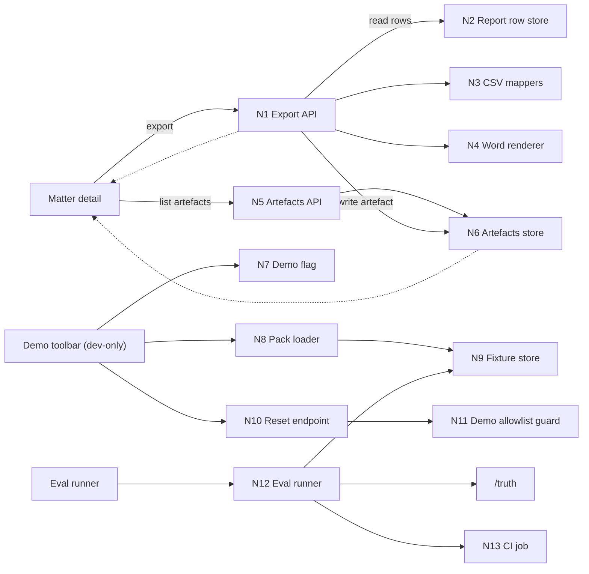
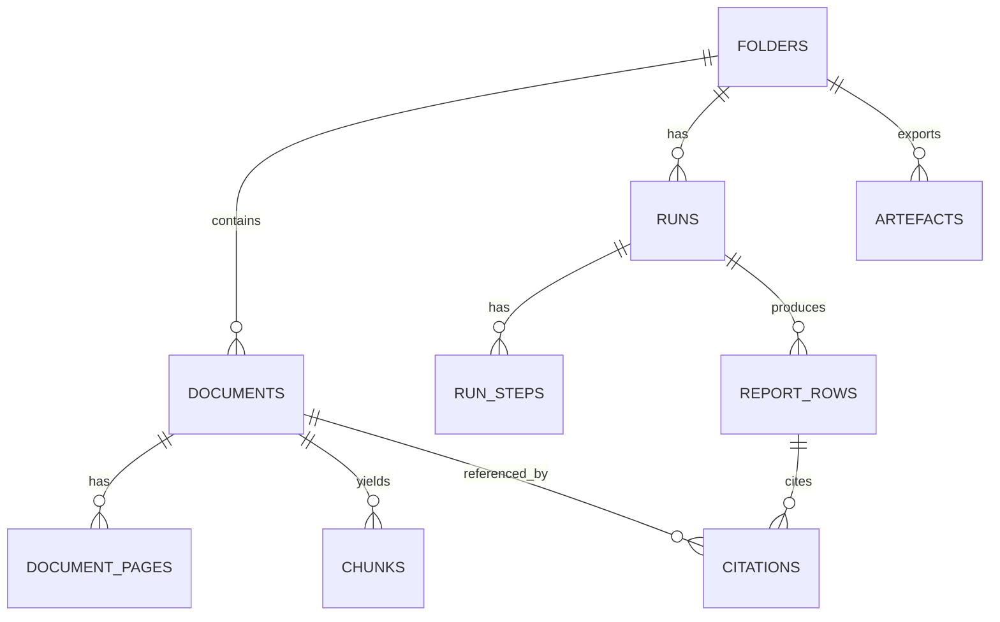

# Oracle Manual Bundle: Initiative 0003 Shape Review

Paste this whole message into ChatGPT Pro.

## Prompt
```
You are reviewing a shaping packet for "Initiative 0003: Demo-grade outputs and repeatability" in the Orbital Copilot PoC (US CRE Title + Survey Quick Start).

Task
- Review the shaping dossier docs (brief, breadboard pack, risk register, spike plans).
- Check consistency with the canonical architecture docs (state model, API surface, data model, observability/evals, ADRs).
- Identify contradictions, missing decisions, and places where the perimeter is too wide.
- Recommend scope cuts or patches to keep the work thin-tailed.
- Propose a post-spike PRD slicing plan (names + ordering) that follows the repo's PRD slicing rules.

Output format (keep it crisp)
1) Findings (ordered by severity)
   - Each finding: what is wrong, why it matters, and a concrete patch suggestion (which doc and what to change).
2) Perimeter lock recommendation
   - A short "in scope / out of scope" you think we should lock for the *first* buildable slice.
3) Spike review
   - For each planned spike: confirm it's the right question, tighten success criteria, and add any missing spike(s).
4) PRD slices (AFTER spikes)
   - 4-8 thin PRDs with suggested names and 5-10 acceptance criteria each.
   - Each PRD must map to breadboard parts (F#) and affordances (U#/N#).
5) GO / NO-GO
   - State GO or NO-GO and the minimal conditions to flip it.

Constraints
- Assume no code exists yet; this is shaping only.
- Prefer contracts that match the existing architecture docs (do not invent new API endpoints unless necessary).
- Treat export gating and demo reset safety as non-negotiable trust/safety decisions.
```

## Attached Files
- `docs/04-projects/02-features/0003_demo-grade-outputs/brief.md`
- `docs/04-projects/02-features/0003_demo-grade-outputs/breadboard-pack.md`
- `docs/04-projects/02-features/0003_demo-grade-outputs/risk-register.md`
- `docs/04-projects/02-features/0003_demo-grade-outputs/spike-investigation.md`
- `docs/00-strategy/initiatives/initiative-overview-001-002-003.md`
- `docs/00-strategy/initiatives/003-polishing-for-demo-and-non-func-hardening`
- `docs/00-strategy/initiatives/prd-slicing-rules.md`
- `docs/00-strategy/initiatives/001-003_handoff.md`
- `docs/03-architecture/AGENTS.md`
- `docs/03-architecture/10_system_architecture.md`
- `docs/03-architecture/20_state_model.md`
- `docs/03-architecture/30_data_model.md`
- `docs/03-architecture/50_api_surface.md`
- `docs/03-architecture/60_observability_and_evals.md`
- `docs/03-architecture/decisions.md`

## File: `docs/04-projects/02-features/0003_demo-grade-outputs/brief.md`
```md
# Brief: Initiative 0003 — Demo-grade outputs and repeatability

## Problem / why now
The PoC’s “trust spine” produces report rows with locked citations and explicit row statuses. But we can’t yet reliably *show, share, or regression-test* those outputs:
- Demos are brittle (manual steps, unknown state, no reset path).
- There’s no export path to produce lawyer-usable artefacts (CSV + a single Word memo).
- Regressions in citations/retrieval/verification can slip in unnoticed until demo day.

This initiative is the finishing layer that makes the PoC **demoable and repeatable** without contaminating the core workflow logic.

## Goals
- **Exports (CSV + Word)** that align with the canonical API and state model:
  - CSV exports for the 3 report artefacts.
  - One Word export (single fixed template).
  - Export creates stored artefacts and returns a download URL.
- **Regression safety** via fixture-driven evals:
  - per-pack report (JSON + Markdown summary)
  - minimal trust metrics (schema + citation integrity + expected failure journeys)
- **Demo repeatability controls** (dev-only / feature-flagged):
  - load known fixture packs
  - safe reset that cannot delete non-demo data
  - a short demo checklist for the human operator

## Non-goals
- Per-firm template customisation or tone tuning.
- Excel formatting beyond CSV.
- Complex scoring models, dashboards, or analytics pipelines.
- Production-grade onboarding, multi-tenant auth, SSO/RBAC, audit dashboards.

## Scope / perimeter (in/out)
In scope:
- CSV exports for `requirements_tracker`, `exceptions_table`, `survey_issues`.
- Word export using **one** fixed template (default: memo).
- Artefact persistence + listing (so exports are retrievable after the fact).
- Eval harness that compares against fixture `/truth` and emits artefacts.
- Demo reliability pack:
  - demo mode flag
  - pack selector
  - safe reset + confirmation
  - demo checklist markdown

Out of scope (explicit cuts):
- “Closing checklist” export.
- Multiple Word templates or a template editor UI.
- Hard CI gating on nuanced quality metrics (start report-only, then gate later).
- Any workflow that depends on external web research (explicitly out per ADR-0007).

## Constraints / dependencies (load-bearing)
- Canonical architecture contracts live in `docs/03-architecture/*` and must win:
  - Export endpoints + error envelope: `docs/03-architecture/50_api_surface.md`
  - Export gating rules: `docs/03-architecture/20_state_model.md`
  - Artefact persistence shape: `docs/03-architecture/30_data_model.md`
  - Evals posture + failure taxonomy: `docs/03-architecture/60_observability_and_evals.md`
- This initiative assumes Initiatives 001 and 002 exist in some form:
  - report rows with `status` and locked citations
  - fixture packs + `/truth` exist (or will be created as part of eval harness work)

## Success (done means)
- From a fixture pack, a demo operator can:
  - export the 3 CSV artefacts and 1 Word memo
  - see exported artefacts listed for the matter and download them
- `fixture:eval` (or equivalent) produces:
  - JSON report + Markdown summary per pack
  - at minimum: schema validity + citation integrity + expected failure journeys
- The demo can be run twice in a row without manual cleanup and without risk to non-demo data.

## Top risks / unknowns (with treatment)
| Risk / unknown | Why it matters | Treatment |
|---|---|---|
| CSV column schema usability | First practitioner reaction can kill the export story | Spike (practitioner paste test) |
| Word template choice (memo vs objection/cure letter) | Storytelling impact for demo audience | Spike (15-minute stakeholder choice) |
| Export behaviour when any row is `citation_failed` | Trust posture vs demo usefulness; needs a crisp default | Patch (follow state model default) + Spike (decide if demo-only override exists) |
| Docx formatting fragility | “Looks broken” erodes trust fast | Patch (keep template simple, constrain layout) |
| Minimal metrics that actually predict demo readiness | Avoid false confidence without building a full eval platform | Spike (3–5 metrics only) |
| Demo reset safety | Accidental deletion is unacceptable | Patch (demo-only allowlist + explicit confirmation) |

## Open questions
- Export gating UX: if export is blocked (`EXPORT_BLOCKED`), what is the operator path (fix vs override)?
- Where do fixture packs live and how are they selected/loaded (filesystem vs object storage)?
- What’s the target appetite/timebox for each slice (CSV vs Word vs eval vs demo mode)?

## PRD slicing plan (after spikes)
Per `docs/00-strategy/initiatives/prd-slicing-rules.md`: PRDs come after brief + breadboard + risk register + spikes.

Planned PRD dossiers (names from `docs/00-strategy/initiatives/001-003_handoff.md`):
- `0013_csv-export`
- `0014_word-export`
- `0015_eval-harness`
- `0016_demo-reliability`

## Shaping decision (GO/NO-GO)
- GO when the listed spikes are completed (or cut), the perimeter is locked, and export gating is unambiguous.
- NO-GO if we cannot define a thin, demo-safe export path without undermining trust defaults.
```

## File: `docs/04-projects/02-features/0003_demo-grade-outputs/breadboard-pack.md`
```md
# Breadboard Pack — Initiative 0003: Demo-grade outputs and repeatability

## Context

- Appetite: TBD (slice-by-slice; exports vs eval vs demo controls)
- Problem: report rows are trapped in the UI and regressions slip in unnoticed, making demos brittle.
- Success: we can export credible artefacts (CSV + 1 Word memo), detect regressions via fixtures, and re-run a demo safely.
- Constraints:
  - Keep the core workflow deterministic-ish; avoid building a new "platform".
  - Respect the canonical state model and API contract in `docs/03-architecture/*`.
  - Demo controls must be dev-only or feature-flagged and must not delete non-demo data.

## Current state

### What exists today

- Canonical contracts exist in docs:
  - Export endpoints and error envelope: `docs/03-architecture/50_api_surface.md`
  - Export gating rule: `docs/03-architecture/20_state_model.md`
  - Artefact storage model: `docs/03-architecture/30_data_model.md`
  - Evals posture and metrics: `docs/03-architecture/60_observability_and_evals.md`
- Initiative 3 strategy and seams are documented:
  - `docs/00-strategy/initiatives/003-polishing-for-demo-and-non-func-hardening`
  - `docs/00-strategy/initiatives/initiative-overview-001-002-003.md`

### Current flow (breadboard)

- _Matter detail_
  - report table exists conceptually (rows + statuses + citations)
  - no export affordance and no artefact list
- _Regression safety_
  - no fixture-driven eval runner (conceptual only)
- _Demos_
  - manual "operator knowledge" steps, no safe reset, repeatability depends on luck

## Proposed solution

### Proposed flow (breadboard)

- _Matter detail page_
  - Export menu:
    - Export CSV: requirements / exceptions / survey issues
    - Export Word: single memo template
  - Artefacts list:
    - shows previously exported artefacts with download links
  - Export blocked state:
    - if the selected run contains any `citation_failed` row, export is blocked by default
    - UI explains why (counts) and points to next action (review/fix)
    - optional: demo-only override (spike + explicit perimeter decision)

- _Eval harness (fixtures)_
  - A runner that:
    - loads a fixture pack
    - runs or reads outputs
    - compares against `/truth`
    - emits JSON report + Markdown summary
  - CI runs in report-only mode and stores the report artefact

- _Demo mode (dev-only)_
  - Pack selector that:
    - loads `pack_01_clean` to show the happy path
    - loads `pack_02_missing_rea` to show missing-doc journeys
  - Safe reset:
    - deletes only allowlisted demo matters
    - requires explicit confirmation
  - Demo checklist markdown for the operator

### Elements

- Export menu (CSV + Word)
- Artefacts list (download links)
- CSV mapper with stable column schemas
- Word renderer + single fixed template file
- Export gating UX for `EXPORT_BLOCKED`
- Fixture eval runner + report artefacts
- Demo mode toggle + pack selector + safe reset
- Demo checklist markdown

## UI affordances

| # | Component / place | Affordance | Control | Wires out | Reads |
|---|---|---|---|---|---|
| U1 | Matter detail | Export menu | click | N1 export endpoints | N2 report rows + citations |
| U2 | Matter detail | Export CSV buttons (3) | click | N1 (CSV) | N3 CSV mappers |
| U3 | Matter detail | Export Word button | click | N1 (DOCX) | N4 Word renderer + template |
| U4 | Matter detail | Export blocked banner (EXPORT_BLOCKED) | render |  | N2 run row statuses |
| U5 | Matter detail | Artefacts list | render | N5 artefacts list endpoint | N6 artefacts store |
| U6 | Demo toolbar (dev-only) | Demo mode toggle | click | N7 feature flag |  |
| U7 | Demo toolbar (dev-only) | Pack selector | select | N8 pack loader | N9 fixture store |
| U8 | Demo toolbar (dev-only) | Reset demo data button | click | N10 reset endpoint | N11 demo allowlist guard |
| U9 | Docs | Demo checklist | read |  |  |

## Code affordances

| # | Component / service | Affordance | Control | Wires out / returns |
|---|---|---|---|---|
| N1 | Export API | `POST /export/csv` + `POST /export/docx` | call | returns `{artefact, download_url}` or `EXPORT_BLOCKED` |
| N2 | Report row store | read rows + statuses + citations for a run | read | returns row set |
| N3 | CSV mappers | map row sets to stable CSV schemas | call | returns strings/streams + column headers |
| N4 | Word renderer | fill single template from row sets | call | returns .docx bytes |
| N5 | Artefacts API | `GET /folders/:id/artefacts` | call | returns artefact list |
| N6 | Artefacts store | persist artefact metadata + storage_key | write/read | returns list items |
| N7 | Demo flag | feature flag / env toggle | read | enables demo UI + demo-only endpoints |
| N8 | Pack loader | load fixture pack into system | call | returns folder_id/run_id |
| N9 | Fixture store | seed packs + truth data | read | provides docs + /truth |
| N10 | Reset endpoint | delete demo matters | call | returns success + counts |
| N11 | Demo guard | allowlist demo matter IDs | read | prevents accidental deletion |
| N12 | Eval runner | compare outputs to /truth | call | returns metrics + report artefacts |
| N13 | CI job | run eval + store report | call | publishes report artefact |

## Wiring diagram

- Legend:
  - Solid = calls / triggers / writes
  - Dashed = returns / store reads



## Parts list (BOM)

| Part | Name | Mechanism | Touch points | Notes |
|---|---|---|---|---|
| F1 | Export endpoints | Implement `POST /export/csv` + `POST /export/docx` that read a run’s rows, apply export gating, write an artefact, and return a download URL. | Next.js route handlers; export service; object storage adapter; Zod boundary validation | Keep it synchronous for PoC unless proven too slow. Respect `EXPORT_BLOCKED` default. |
| F2 | CSV schemas + mappers | Define stable column schemas for 3 artefacts and map rows + citations into those schemas. | `packages/core` export module; tests/fixtures | Spike required: practitioner "paste test" to lock schema. |
| F3 | Word renderer + template | Pick one fixed Word template and render a .docx from the report table + deal snapshot. | Template file in repo; docx renderer module | Spike: memo vs objection/cure letter choice. Patch by constraining formatting. |
| F4 | Artefacts list | List previously exported artefacts for a folder and provide download links. | `GET /folders/:id/artefacts`; UI component | Needed for demo repeatability and sharing. |
| F5 | Export UI states | Export menu, blocked banner, loading/error states, and basic "what happened" copy. | Matter detail page UI | Must surface failure modes; never silent failures. |
| F6 | Eval harness (fixtures) | Runner that computes minimal trust metrics vs `/truth` and emits JSON + Markdown summary artefacts per pack. | `fixture:eval` script; report writer | Start report-only; later gate hard trust metrics. |
| F7 | CI integration | Wire eval runner into CI, store artefacts, and publish a summary. | CI config; artifact upload | Keep it light; avoid long runtimes. |
| F8 | Demo mode controls | Feature-flagged demo toolbar with pack selector and safe reset. | Demo-only UI; demo endpoints; allowlist guard | Safety is non-negotiable; demo-only separation must be explicit. |
| F9 | Demo checklist | Human operator demo checklist markdown. | `docs/` markdown | Forces repeatability and reduces tribal knowledge. |

## Fit check: requirements x concept

| Req | Requirement | Status | Fit | Notes |
|---|---|---|---|---|
| R1 | CSV export for 3 artefacts | core goal | ✅ | Direct mapping from report rows to stable CSV schemas. |
| R2 | Word export (single template) | must-have | ⚠️ | Formatting and template choice are the main unknowns. |
| R3 | Eval harness with minimal metrics | must-have | ⚠️ | Needs a tight metric set that correlates with demo readiness. |
| R4 | Demo repeatability controls | must-have | ⚠️ | Reset safety and "demo mode" boundaries need proof. |
| R5 | Export gating matches state model | core goal | ⚠️ | Default is blocked on any `citation_failed`; override decision TBD. |
| R6 | Artefact persistence + listing | must-have | ✅ | Aligns with data model and API surface docs. |

### Readout

- Passes: 2
- Fails: 0
- Undecided: 4

### Unsolved

- R2: Which Word template (memo vs objection/cure letter) best serves the demo story?
- R3: Which 3-5 metrics are predictive enough to catch demo regressions?
- R4: Do we truly need demo mode, and what guardrails make reset provably safe?
- R5: If we allow any export override, how is it scoped (demo-only) and surfaced (warnings)?

## Rabbit holes, cuts, and no-gos

### Rabbit holes

- CSV column expectations from practitioners (import/paste habits).
- Word rendering quirks and formatting drift across Word viewers.
- Metrics that give false confidence or are expensive/flaky to compute.
- Demo reset deleting the wrong data or leaving behind state that breaks repeatability.

### Cuts / scope trims

- No template customisation UI (one fixed template only).
- No Excel formatting beyond CSV.
- CI is report-only until fixture suite stabilises (no early hard gating beyond schema/citation integrity if we can support it).

### Out of bounds / no-gos

- Any export that silently drops `citation_failed` rows without an explicit, visible warning.
- Any reset tool that can delete non-demo data.
- Any feature that depends on external web research during runs.
```

## File: `docs/04-projects/02-features/0003_demo-grade-outputs/risk-register.md`
```md
# Risk register (rabbit holes)

Use this during shaping to capture tail risks and choose mitigations.

| ID | Rabbit hole | Type | Why it’s risky | Mitigation | Status |
|---|---|---|---|---|---|
| RH1 | Is the CSV export format actually usable for a paralegal paste/import workflow? | product | If the first practitioner reaction is "this is unusable", exports fail as a demo story. | spike | open |
| RH2 | How do we prevent CSV column ordering drift as schemas evolve? | data | Drift makes exports hard to diff, import, and trust. | patch | open |
| RH3 | Which Word artefact best supports the demo narrative (memo vs objection/cure letter)? | product | Wrong artefact can make the demo feel contrived or low value. | spike | open |
| RH4 | Docx formatting inconsistencies across viewers (Word, Google Docs, preview) | technical | "Looks broken" erodes trust immediately. | patch | open |
| RH5 | Export behaviour when any row is `citation_failed` (block vs partial export) | design | This is a trust posture decision. Getting it wrong undermines the product promise. | spike | open |
| RH6 | Where do exports live (download-only vs stored artefacts + list)? | dependency | A wrong storage decision creates churn and demo unreliability. | patch | open |
| RH7 | Minimal eval metrics: which 3-5 metrics predict demo readiness? | product | Too shallow = false confidence. Too deep = time sink. | spike | open |
| RH8 | Citation integrity checks are expensive/flaky | technical | If the eval harness is brittle, it will be ignored. | patch | open |
| RH9 | CI eval runtime is too slow for iteration | technical | Slow CI creates friction and encourages bypassing tests. | cut | open |
| RH10 | Demo reset tool can delete non-demo data | safety | Data loss is unacceptable even in a PoC. | patch | open |
| RH11 | Demo mode pollutes the real UX or bypasses trust gates | design | Confuses users and creates hidden behaviour paths. | patch | open |
| RH12 | Fixture packs and `/truth` drift without ownership | dependency | Evals become meaningless if fixtures are not maintained. | patch | open |

## Notes

- Prefer writing rabbit holes as questions.
- If a rabbit hole is really a product decision, treat it as a shaping question (don’t hide it as “tech risk”).
- Spikes must happen before PRDs are sliced (see `docs/00-strategy/initiatives/prd-slicing-rules.md`).
```

## File: `docs/04-projects/02-features/0003_demo-grade-outputs/spike-investigation.md`
```md
# Spike investigation — Initiative 0003: Demo-grade outputs and repeatability

> Status: planned only. No spikes executed yet.

Per `docs/00-strategy/initiatives/prd-slicing-rules.md`: spikes come before PRDs.

## Spike plan — CSV export format usability

## Question

Is the CSV export format usable for a paralegal who needs to paste into an existing tracker?

## Context

- Feature / concept: 3.1 CSV exports (requirements, exceptions, survey issues)
- Related requirement(s): R1
- Why now: Export usability is the core promise for "demo-grade outputs"

## Success criteria

Proof looks like:

- A paralegal says "yes, I can paste this into our tracker" with minimal cleanup.
- Column names and ordering are judged acceptable (or we get a precise change list).

## Timebox

- Start: TBD
- Hard stop: TBD (1-2 hours of practitioner time, max)

## Scope

Include:

- Sample CSVs for requirements, exceptions, and survey issues.
- Citations and row statuses included (as doc name + page, plus status code).

Exclude:

- Any Excel formatting, formulas, or per-firm customisation.

## Approach

- Step 1: Generate 3 sample CSVs from `pack_01_clean`.
- Step 2: Hand to a practitioner for a quick paste/import test.
- Step 3: Capture feedback and lock (or revise) the column schema.

## Artefacts

Keep:

- Feedback notes.
- Final column schema (header list + ordering).

Throw away:

- Any prototype formatting beyond CSV.

## Expected outcomes

- If straight shot: lock the column schema and add fixture-based export snapshots.
- If tangle: cut optional columns and re-test with a minimal schema.
- If fog: focus only on requirements CSV first, then expand to the other two.

## Oracle pass

Pending (bundle created after shaping; see `tmp/oracle-bundles/`).

---

## Spike plan — Export gating behaviour (trust posture vs demo utility)

## Question

When any row is `citation_failed`, do we:
1) block export by default (per state model), and
2) allow a demo-only override (explicit + visibly unsafe)?

## Context

- Feature / concept: 3.1/3.2 exports
- Related requirement(s): R5
- Why now: This is a product trust decision; exporting "partial truth" is dangerous if underspecified.

## Success criteria

Proof looks like:

- A single crisp default that matches `docs/03-architecture/20_state_model.md`.
- If override exists, it is strictly scoped (demo-only) and impossible to trigger accidentally.
- UX copy is unambiguous about what is missing/excluded.

## Timebox

- Start: TBD
- Hard stop: TBD (30-60 minutes)

## Scope

Include:

- Default behaviour and exact UX messaging for `EXPORT_BLOCKED`.
- Decision on whether override exists, and if so: how it is guarded.

Exclude:

- Any attempt to "fix" citation_failed rows inside export.

## Approach

- Step 1: Restate canonical rule from state model and API surface docs.
- Step 2: Draft 2 options (block-only vs demo-only override) with a concrete UI + API shape.
- Step 3: Choose and lock the perimeter.

## Artefacts

Keep:

- The chosen rule and the UX copy for blocked export.
- If override exists: an explicit guardrail design (demo-only).

Throw away:

- Any design that silently drops `citation_failed` rows.

## Expected outcomes

- If straight shot: implement exactly as specified and write fixture tests for the blocked case.
- If tangle: cut override entirely; ship block-only export.
- If fog: defer exports until trust substrate is stable (unlikely; but call it out).

## Oracle pass

Pending (bundle created after shaping; see `tmp/oracle-bundles/`).

---

## Spike plan — Word artefact choice (memo vs objection/cure letter)

## Question

Which single Word artefact is most compelling for the demo audience: memo or objection/cure letter?

## Context

- Feature / concept: 3.2 Word export
- Related requirement(s): R2
- Why now: Template choice drives narrative and avoids wasted build effort.

## Success criteria

Proof looks like:

- Stakeholder picks one template in 15 minutes.
- We get 3-5 bullet requirements about what "must be in the Word export".

## Timebox

- Start: TBD
- Hard stop: TBD (15-30 minutes)

## Scope

Include:

- A paper mock outline for each template option (no formatting yet).
- A decision and a list of must-have sections.

Exclude:

- Any attempt at per-firm customisation.
- Any "perfect formatting" work.

## Approach

- Step 1: Draft two 1-page outlines (memo vs objection letter).
- Step 2: Ask stakeholder to choose (and say why).
- Step 3: Lock the template choice and section list.

## Artefacts

Keep:

- Chosen template name + section list.
- Any copy notes that materially affect what we render.

Throw away:

- Any formatting experiments beyond proving feasibility.

## Expected outcomes

- If straight shot: implement the chosen template only.
- If tangle: cut Word export entirely from the first demo-grade slice.
- If fog: pick memo by default (simpler) and move on.

## Oracle pass

Pending (bundle created after shaping; see `tmp/oracle-bundles/`).

---

## Spike plan — Minimal eval metrics that predict demo readiness

## Question

What 3-5 metrics are predictive enough for demo readiness without becoming a time sink?

## Context

- Feature / concept: 3.3 eval harness
- Related requirement(s): R3
- Why now: We want regression safety without building a full eval platform.

## Success criteria

Proof looks like:

- A small metric set maps directly to the trust UX:
  - schema validity
  - citation integrity
  - expected failure journeys (missing docs, bad citations)
- Metrics can be computed deterministically from fixtures without heavy model calls.

## Timebox

- Start: TBD
- Hard stop: TBD (2-4 hours)

## Scope

Include:

- At least 2 packs (happy path + missing-doc pack).
- At least one negative test pack (bad citation or deliberate failure).

Exclude:

- Complex scoring models or subjective "quality" metrics.
- Large-scale sampling.

## Approach

- Step 1: Implement metric computation on `pack_01_clean`.
- Step 2: Validate that it flags expected failures on `pack_02_missing_rea`.
- Step 3: Add one deliberate bad-citation fixture and ensure it fails closed.

## Artefacts

Keep:

- Final metric definitions.
- Example report output (JSON + Markdown).

Throw away:

- Extra metrics that don’t correlate with demo success.

## Expected outcomes

- If straight shot: lock metrics and wire into report-only CI.
- If tangle: cut down to schema validity + citation integrity only.
- If fog: stop and re-scope eval harness to a single "hard gates only" check.

## Oracle pass

Pending (bundle created after shaping; see `tmp/oracle-bundles/`).

---

## Spike plan — Demo repeatability controls and reset safety

## Question

Do we actually need demo mode, and if we do, what guardrails make reset provably safe?

## Context

- Feature / concept: 3.4 demo reliability pack (pack selector + reset + checklist)
- Related requirement(s): R4
- Why now: Reset is high-risk; demo mode can pollute UX if sloppy.

## Success criteria

Proof looks like:

- A clear justification for demo mode (or a decision to cut it).
- A reset design that cannot delete non-demo data:
  - demo-only allowlist
  - explicit confirmation flow
  - obvious audit/logging output

## Timebox

- Start: TBD
- Hard stop: TBD (2-3 hours)

## Scope

Include:

- Pack selector shape (loads fixture packs only).
- Reset endpoints shape (demo-only).

Exclude:

- Production onboarding wizard behaviours.
- Any "admin" surface beyond what demos need.

## Approach

- Step 1: Identify the minimum UI affordances needed for the operator.
- Step 2: Draft reset guardrails (allowlist + confirmation).
- Step 3: Decide "demo mode required?" and lock the perimeter.

## Artefacts

Keep:

- Guardrails design.
- Demo checklist first draft.

Throw away:

- Any attempts to generalise demo tooling into production onboarding.

## Expected outcomes

- If straight shot: build demo mode behind a feature flag and keep it isolated.
- If tangle: cut demo mode; rely on a written checklist and fixture scripts only.
- If fog: timebox a second spike; otherwise cut to avoid safety risk.

## Oracle pass

Pending (bundle created after shaping; see `tmp/oracle-bundles/`).
```

## File: `docs/00-strategy/initiatives/initiative-overview-001-002-003.md`
```md
# Initiative map — Orbital Copilot PoC (US CRE Title + Survey Quick Start)

## Assumptions used for this breakdown (can be changed later)
- **Export target:** Title & Survey memo (not objection/cure letter)
- **OCR approach:** OCR everything (consistent geometry)
- **Verification strictness:** Conservative fail-closed
- **Audience:** internal demo + 1 friendly practitioner
- **Timebox:** 2-week PoC mindset (but shaping items are still independent)

## Initiatives
- 001: Trust substrate (citations, viewer, verification, failure states)
- 002: Quick Start engine (Title Commitment + Exception instruments + Survey → 3 artefacts)
- 003: Demo-grade outputs and repeatability (exports, eval harness, regression safety)

# Initiative map — Orbital Copilot PoC (US CRE Title + Survey Quick Start)

## Assumptions used for this breakdown (can be changed later)
- **Export target:** Title & Survey memo (not objection/cure letter)
- **OCR approach:** OCR everything (consistent geometry)
- **Verification strictness:** Conservative fail-closed
- **Audience:** internal demo + 1 friendly practitioner
- **Timebox:** 2-week PoC mindset (but shaping items are still independent)

---

## Initiative 1: Trust substrate (citations, viewer, verification, failure states)

**Objective**  
Deliver the “trust moment” end-to-end: citation chips that jump to highlighted evidence in a PDF viewer, with strict “cite-or-not-found” behaviour and row-level failure states.

**Why it’s coherent**  
This is one tight user promise. If it fails, everything else is noise. Grouping UI + data model + verification here prevents the classic failure mode of building content generation before trust.

**Key dependencies**  
- Minimal “matter” container (folder) + document storage + doc viewer
- Basic persistence for citations and rows (can be lightweight in PoC)

**Primary risks it burns down**  
- Citation correctness (and how we fail)
- Geometry/highlighting reliability (even on ugly PDFs)
- “Not found” and missing-doc journeys actually being usable

---

## Initiative 2: Quick Start engine (Title Commitment + Exception instruments + Survey → 3 artefacts)

**Objective**  
Implement the deterministic-ish pipeline that turns a pack into:
1) B-I Requirements tracker  
2) B-II Exceptions table linked to instruments  
3) Survey reconciliation issues list  
All outputs are evidence-backed and written into the report table.

**Why it’s coherent**  
It’s the core product wedge. And it’s mostly “workflow logic” that can be iterated independently once trust substrate exists.

**Key dependencies**  
- Trust substrate (Initiative 1) for citations, verification, viewer
- Pack ingestion/indexing and retrieval primitives (can start scaffolded)

**Primary risks it burns down**  
- Commitment parsing robustness (Schedule A/B-I/B-II structure varies)
- Linking exceptions → instruments (recording refs and exhibit chase)
- Survey extraction and reconciliation is messy and easy to over-promise

---

## Initiative 3: Demo-grade outputs and repeatability (exports, eval harness, regression safety)

**Objective**  
Make the PoC demoable and testable: exports (CSV + Word), golden-set driven evals, and “demo reliability” controls.

**Why it’s coherent**  
These are finishing moves that protect against context rot and brittle demos. They should not contaminate core workflow logic, but they are essential for confidence.

**Key dependencies**  
- Initiative 1 and 2 outputs exist (rows + citations + statuses)

**Primary risks it burns down**  
- “It works on my laptop” syndrome
- Regression in citations/retrieval that no-one notices until demo day
- Export producing unusable junk that lawyers reject instantly
```

## File: `docs/00-strategy/initiatives/003-polishing-for-demo-and-non-func-hardening`
```md
# Initiative 3: Demo-grade outputs and repeatability (exports, eval harness, regression safety)

## 3.1 Export CSVs for 3 artefacts (requirements, exceptions, survey issues)
**Scope**
Export the report data into lawyer-friendly CSVs that mirror how teams actually work.

**Done means**
- One click exports:
  - `requirements_tracker.csv`
  - `exceptions_table.csv`
  - `survey_issues.csv`
- Exports include citation references (doc name + page) and row status.

**Cut-lines / de-scopes**
- No Excel formatting beyond CSV.
- No “closing checklist” export.

**Risks/unknowns and treatment**
- Exports missing fields lawyers expect: **Spike** (quick practitioner check).

**Suggested spikes**
- “Is CSV export format usable?” Pass if a paralegal says “yes, I can paste this into our tracker”.

**Natural PRD seams**
1) PRD: CSV export endpoint (per artefact)
2) PRD: Column mapping and stable ordering
3) PRD: Export includes citations and statuses

---

## 3.2 Word export (choose 1 template: memo OR objection/cure letter)
**Scope**
Generate one Word artefact from the report table using a single fixed template.

**Done means**
- Export produces a .docx with:
  - deal snapshot (from Schedule A fields if available)
  - requirements section (B-I)
  - exceptions table (B-II summaries + citations)
  - survey issues section
- For rows with `citation_failed`, template either excludes or includes with warning, depending on gate choice.

**Cut-lines / de-scopes**
- No per-firm template customisation.
- No “tone of voice” tuning.

**Risks/unknowns and treatment**
- Word formatting fragility: **Patch** (keep template simple).
- Template choice impacts product story: **Spike** (pick memo vs objection letter).

**Suggested spikes**
- “Which Word artefact is more compelling for the demo audience?” Pass if stakeholder chooses in 15 minutes.

**Natural PRD seams**
1) PRD: Template selection and storage
2) PRD: Docx generation service (from report rows)
3) PRD: Export UI + artefacts list + download link

---

## 3.3 Golden-set eval harness (regression safety on /truth)
**Scope**
Create a lightweight evaluation harness that compares produced outputs to `/truth` and tracks key quality metrics.

**Done means**
- For each pack, run a script that outputs:
  - coverage: % requirements and exceptions rows present
  - citation validity rate
  - missing_input correctness rate (especially pack_02)
- CI gate can be “soft” for PoC (report only) but must exist.

**Cut-lines / de-scopes**
- No elaborate scoring model. Keep it tight: schema + counts + citation checks.

**Risks/unknowns and treatment**
- Eval becomes a time sink: **Cut** (only 3–5 metrics).
- False confidence from shallow metrics: **Patch** (include negative tests).

**Suggested spikes**
- “What minimal metrics predict demo success?” Pass if metrics correlate with 1 practitioner review of 1 pack.

**Natural PRD seams**
1) PRD: Eval runner script (per pack)
2) PRD: Citation validity checker (hash + page + bbox existence)
3) PRD: CI integration (report artefact)

---

## 3.4 Demo reliability pack (guided demo flow + pack selector + reset)
**Scope**
Make it easy to run the same demo twice without fiddling.

**Done means**
- A “Demo mode” can:
  - load `pack_01_clean` and run Quick Start
  - load `pack_02_missing_rea` and show missing-doc flow
  - reset the environment (delete matter) safely
- Demo script checklist exists (human steps).

**Cut-lines / de-scopes**
- Not a full onboarding wizard. This is for demo repeatability.

**Risks/unknowns and treatment**
- Reset/delete risk: **Patch** (guard rails, only demo matters).
- “Demo mode” pollutes product: **Patch** (feature flag).

**Suggested spikes**
- “Do we actually need demo mode?” Pass if we cannot reliably demo twice in a row without it.

**Natural PRD seams**
1) PRD: Pack selector UI (loads from local fixtures)
2) PRD: Environment reset tool (dev only)
3) PRD: Guided demo checklist markdown in repo
```

## File: `docs/00-strategy/initiatives/prd-slicing-rules.md`
```md
# PRD slicing rules for this PoC

## Required order (breadboard -> spikes -> PRDs)
1) Brief + perimeter lock.
2) Breadboard pack (places/affordances/parts).
3) Risk register with mitigations.
4) Spikes for any rabbit holes + oracle pass.
5) Only then: slice PRDs from the breadboard parts list.

## Rules of thumb (thin PRDs)
1) One PRD delivers one user-visible affordance or one backend capability with a measurable observable effect.
2) Every PRD must map to breadboard parts (F#) and key affordances (U#/N#).
3) Each PRD must have measurable acceptance criteria tied to at least one synthetic pack.
4) Keep PRDs vertical-ish: UI + a thin API where needed, but avoid building a full platform layer unless it unlocks the next slice.
5) If a PRD introduces a new failure mode, it must also introduce the UX to surface it (no silent failures).
6) Prefer scaffold then replace: ship UI using anchors/truth first, then swap in OCR/retrieval/LLM behind the same contracts.
7) If any spikes remain open, the PRD is NO-GO and acceptance criteria should be marked TODO (do not pretend certainty).

## Examples (good slices)
- Citation chip opens viewer at cited page and overlays highlight polygon (using anchors)
- Citations API returns snippet + hash + polygons for a citation ID
- Verifier fails rows when snippet_hash mismatch is detected
- Commitment parser extracts B-I requirements list into tracker table

## Examples (bad slices)
- Build ingestion pipeline + OCR + retrieval + drafting + verification + export (too many risks bundled)
- Implement multi-agent Copilot (not PoC scope, and not deterministic)
- Add firm template customisation (non-goal)

## Red flags that a PRD is too fat
- PRD exists without a breadboard pack and risk register
- Touches 3+ major subsystems (viewer, OCR, retrieval, export) in one go
- Needs more than 1–2 new schemas
- Acceptance criteria can’t be tested against the packs
- Contains multiple hard risks (survey parsing + verification + matching all together)

## Minimum PRD structure (what every PRD should include)
- User story
- In/out scope
- Breadboard references (parts F# + affordances U#/N#)
- Acceptance criteria (pack + expected observable behaviour)
- Failure states and UX
- Metrics/logging (at least 1 signal)
- Rollback/disable path (feature flag or safe default)
```

## File: `docs/00-strategy/initiatives/001-003_handoff.md`
```md
# Handoff-ready notes (shaping dossiers)

## Suggested lane + dossier naming
Lane: `docs/04-projects/02-features/`

Naming convention (breadboard dossiers):
- `0001_trust-viewer-basics`
- `0002_citations-click-to-highlight`
- `0003_citation-model-and-api`
- `0004_verification-gate`
- `0005_failure-journeys`
- `0006_provenance-traceability`
- `0007_qset-and-report-schema`
- `0008_commitment-parsing`
- `0009_exception-instrument-matching`
- `0010_survey-parsing`
- `0011_title-survey-reconciliation`
- `0012_run-orchestration`
- `0013_csv-export`
- `0014_word-export`
- `0015_eval-harness`
- `0016_demo-reliability`

(Example sequence, not a commitment.)

---

## Required order per shaping item
1) Brief + perimeter lock.
2) Breadboard pack.
3) Risk register.
4) Spikes (if any) + oracle pass.
5) PRD slicing after spikes, derived from the breadboard parts.

## For each shaping item, required outputs (wf-shape packet)
- `brief.md` (1–2 pager, perimeter locked)
- `breadboard-pack.md` (places/affordances/connections + parts list + rabbit holes + fit check)
- `risk-register.md` (every risk tagged Cut/Patch/Spike/Out-of-bounds)
- `spike-investigation.md` (only if any Spike items exist)
- PRD slice list (record in `brief.md` or `breadboard-pack.md`)
- One or more PRD dossiers created after spikes, each containing `prd.md` + `prd.json` (validated)

---

## Pickup / handoff boundaries (avoid context rot)
When a shaping item is complete, the handoff must include:
- Dossier path
- What’s in scope and explicitly out
- Top 3 risks and their treatments (and spike outcomes)
- PRD slice list and which slices were turned into PRD dossiers
- PRD status (`prd.json` validated y/n)
- Whether wf-plan is needed or we can go straight to wf-develop

Recommended practice:
- Start each shaping item in a fresh thread
- Run `/new` -> `pickup` with the dossier path -> then wf-shape -> then wf-plan/wf-develop
```

## File: `docs/03-architecture/AGENTS.md`
```md
# Architecture

## Purpose
- Boundary rules + security posture. Keep stable.

## Web app patterns (search; don’t assume exact paths)
- Public vs protected routes (often enforced via middleware)
- API split: auth-only routes, versioned routes, webhook routes
- Frontend-only vs backend-only separation (names vary)

## Boundaries (non-negotiable)
- Client-only must not import server-only (and vice versa).
- Validate at boundaries with Zod.
- Never leak internal errors/details to clients.

## Middleware / API security shape (typical)
- Pipeline is usually: rateLimit → cors → sanitise → auth → logging (confirm actual order in code).
- Webhooks: verify signatures before parsing/acting.
- Public endpoints: rate limit + strict validation.

## Docs + decisions
- Artefacts live under `docs/03-architecture/`.
- ADRs: Append to `docs/03-architecture/decisions.md` when you introduce a new cross-cutting pattern (dependency class, boundary rule, auth/security posture). Keep it short and link the PR.
```

## File: `docs/03-architecture/10_system_architecture.md`
```md
# System architecture

## High-level component map (with Workflow DevKit)

```mermaid
flowchart LR
  subgraph FE[Frontend]
    UI[Matter Workspace\nDoc list + Report table + Run progress]
    PDFV[PDF Viewer\npdf.js + highlight overlay]
  end

  subgraph API[API (Next.js route handlers)]
    FOLDERS[Folders API]
    DOCS[Documents API\n(upload + render URL)]
    RUNS[Runs API\n(start + progress)]
    CITS[Citations API\n(resolve citation)]
    EXPORT[Export API]
  end

  subgraph WDK[Workflow DevKit Runtime]
    WF[QuickStartWorkflow\n(use workflow)]
    STEP[Steps\n(use step)\nOCR, embed, retrieve, draft, verify, write]
    WORLD[(WDK Postgres World)]
  end

  subgraph DATA[Data plane]
    PG[(Postgres\nrows + citations + runs\npgvector + tsvector)]
    OBJ[(Object storage\nraw PDFs + exports)]
  end

  subgraph EXT[Providers]
    OCR[Layout OCR]
    LLM[LLM Router]
    EMB[Embeddings]
  end

  UI --> API
  PDFV --> CITS

  API --> PG
  API --> OBJ

  RUNS --> WF
  DOCS --> STEP
  EXPORT --> STEP

  WF --> STEP
  STEP --> WORLD
  WORLD --> PG

  STEP --> OCR
  STEP --> LLM
  STEP --> EMB
  STEP --> OBJ
```

Notes:
- WDK owns durability, retries, and resumability.
- The API is thin and mostly triggers workflows and reads state.
- Domain logic lives in shared packages called by steps.

Conventions:
- The meaning of `(use workflow)` / `(use step)` in the diagram is defined in `docs/03-architecture/06_frameworks_agents_rag_evals.md`.

---

## Key sequences

### Upload → ingest → ready
1) User uploads PDFs
2) Document rows created in Postgres and raw PDFs stored in object storage
3) Ingestion steps run:
   - OCR/layout extraction per page
   - persist canonical text + geometry
   - chunk + embed + index
4) Folder transitions to `ready` when checks pass

### Quick Start run (row-by-row)
Workflow controls a per-question loop:
- retrieve (hybrid)
- draft (structured JSON)
- lock citations (chunk IDs → snippet/hash/geometry)
- verify (fail-closed)
- write row (status + citations)

---

## Deployment posture (PoC)
- Single-tenant environment
- Next.js app plus WDK runtime plus Postgres and object storage
- Minimal observability: structured logs + trace IDs + run failure taxonomy
```

## File: `docs/03-architecture/20_state_model.md`
```md
# State model

This doc defines the state machines and invariants for the PoC. Keep this as the canonical reference and link to it from other docs.

## Terminology
- **Folder** is the DB/API name for a workspace container. In the UI we call it a **Matter**.
- States are stored on rows for convenience, but must remain consistent with the invariants below.

## Folder state (`folders.state`)
States:
- `empty`
- `ingesting`
- `indexed`
- `ready`
- `failed` (terminal until a new ingest attempt is started)

Invariants (must hold):
- `empty`
  - folder has zero documents
- `ingesting`
  - at least one document is not in terminal ingest state (`parse_status != parsed` OR `ocr_status != done`)
  - OR derived retrieval substrate (chunks/indexes) is not built for `folders.latest_index_version`
- `indexed`
  - all documents are in terminal ingest state (`parse_status = parsed` AND `ocr_status = done`)
  - chunks exist for each document for `folders.latest_index_version`
  - folder is runnable (Quick Start can start), even if some docs are low quality
- `ready`
  - all `indexed` invariants hold
  - AND folder health checks pass (see below)
- `failed`
  - one or more documents have terminal `failed` ingest status OR a folder-level indexing job failed

Folder “ready” health checks (PoC defaults):
- no documents are `parse_status = failed` or `ocr_status = failed`
- for every document: `extraction_quality >= 0.60` (configurable; keep the threshold in eval fixtures)
- for every document: `page_count` is set AND `document_pages` count matches `page_count`

Allowed transitions (monotonic, except for retry):
- `empty` → `ingesting` (first upload starts)
- `ingesting` → `indexed` (all docs ingested + chunked + indexed for latest_index_version)
- `indexed` → `ready` (health checks pass)
- `ingesting|indexed|ready` → `failed` (non-recoverable ingest/index error)
- `failed` → `ingesting` (explicit retry/re-ingest; bumps `latest_index_version`)

## Document state (`documents.parse_status`, `documents.ocr_status`)
Parse status:
- `queued` → `parsing` → `parsed` | `failed`

OCR status:
- `queued` → `running` → `done` | `failed`

Invariants (must hold):
- If `parse_status` is `parsing|parsed` then `storage_key` must be set and the raw PDF must exist in object storage.
- If `parse_status` is `parsed` then `page_count` must be set (>= 1).
- If `ocr_status` is `done` then `document_pages` must exist for every page with `text` and `layout_json`.
- `extraction_quality` is only meaningful when `ocr_status = done` (else set NULL or 0 and do not use it for decisions).

## Run state
Runs are the execution record for a single Quick Start attempt. Runs must pin the versions they executed with (see `docs/03-architecture/30_data_model.md`).

States:
- `created` (row exists, workflow not started)
- `running` (workflow is active)
- `completed` (workflow finished and wrote a terminal row for every question)
- `partial` (workflow stopped early but wrote at least one row)
- `failed` (workflow stopped early and wrote zero trustworthy rows)
- `cancelled` (optional; user-cancel)

Invariants (must hold):
- `completed`
  - for the question set version used by the run: exactly one `report_rows` record exists per `question_id`
  - every report row is in a terminal status (`needs_review|reviewed|missing_input|citation_failed`)
- `partial`
  - at least one report row exists
  - at least one `question_id` is missing a row (run stopped before finishing)
- `failed`
  - zero report rows exist OR all produced rows are explicitly marked non-exportable (e.g. `citation_failed`)

Allowed transitions:
- `created` → `running`
- `running` → `completed|partial|failed|cancelled`

## Report row state (`report_rows.status`)
Statuses (terminal for the workflow):
- `needs_review` (verification passed; user may review)
- `reviewed` (user confirmed)
- `missing_input` (no supporting evidence in provided docs)
- `citation_failed` (verification failed or citation lock mismatch)

Invariants (must hold):
- Rows are scoped to a run: exactly one row per `(run_id, question_id)`.
- `needs_review|reviewed`
  - row has >= 1 citation
  - every citation is **locked** (stores snippet + hash + geometry) and is associated to this row
- `missing_input`
  - `answer` must be exactly: `Not found in provided documents.`
  - citations list must be empty
  - `notes` (or provenance) must include an actionable missing-doc checklist
- `citation_failed`
  - citations may exist, but the row is non-exportable by default
  - store a safe failure reason code in provenance (e.g. `CITATION_MISMATCH`, `ENTAILMENT_FAIL`)

User-driven transitions:
- `needs_review` → `reviewed` (only via explicit user action)

Export gating (PoC defaults):
- If any row in the selected run is `citation_failed`, export returns an error unless an explicit override flag is provided.
```

## File: `docs/03-architecture/30_data_model.md`
```md
# Data model (Postgres + pgvector)

This is the canonical DB shape for the PoC “trust spine”: ingest → retrieve → draft → verify → report rows with locked citations.

## ERD


## Trust spine tables (minimum viable)

### `folders`
- `id`, `name`, `state`, `created_at`, `updated_at`
- `latest_index_version` (string; bumps on re-ingest/re-index)

### `documents`
- `id`, `folder_id`, `filename`, `mime`, `bytes`
- `sha256` (dedupe), `storage_key`, `page_count`
- `parse_status`, `ocr_status`, `extraction_quality`
- `error_json` (safe ingest failure details)

### `document_pages`
- `id`, `document_id`, `page_number`
- `text` (canonical)
- `layout_json` (tokens/lines/blocks + polygons)

### `chunks`
- `id`, `document_id`
- `index_version` (string; matches `folders.latest_index_version` at time of build)
- `page_start`, `page_end`, `chunk_index`
- `text`, `metadata_json`, `tsv`, `embedding`
- `snippet_hash` (see “Hashing rule” below)

### `runs`
- `id`, `folder_id`, `type`, `state`
- `index_version` (pins retrieval substrate used by the run)
- `agent_bundle_version` (pins prompts + schemas)
- timestamps + `error_json` (safe failure details)

### `run_steps`
- `id`, `run_id`, `step_type`, `state`, `attempt`
- `metrics_json`, `error_json`
- timestamps

### `report_rows`
- `id`, `folder_id`, `run_id`, `question_id`, `question`
- `answer`, `status`, `notes`
- `provenance_json` (minimum: retrieved chunk IDs + scores, models + prompt hashes, verification verdict + reason codes)
- timestamps

### `citations`
Citations are **locked** and **immutable** once created. They store enough to highlight evidence without re-running retrieval or re-reading chunks.
- `id`, `report_row_id`
- `chunk_id` (nullable; stored for debugging/replay)
- `document_id`, `page_number`
- `polygons`, `snippet`, `snippet_hash`
- `index_version` (string; pins the chunking/indexing version the citation came from)
- timestamps

### `artefacts`
- `id`, `folder_id`, `type`, `storage_key`
- `source_run_id`, `metadata_json`
- timestamps

## Hashing rule (snippet_hash)
We use `snippet_hash` to detect citation drift.

PoC rule:
- `snippet_hash = sha256(normalise(snippet))`
- `normalise()` must:
  - trim leading/trailing whitespace
  - convert CRLF → LF
  - collapse all whitespace runs to a single space

This rule must be implemented once (e.g. in `packages/core/citations`) and reused everywhere.

## Indices and constraints (recommended)
- unique `(documents.folder_id, documents.sha256)` (avoid duplicates within a matter, allow reuse across matters)
- unique `(report_rows.run_id, report_rows.question_id)` (rows are per run)
- unique `(chunks.document_id, chunks.index_version, chunks.chunk_index)`

- GIN on `chunks.tsv`
- pgvector index on `chunks.embedding`
- index `citations.report_row_id`
- index `runs.folder_id`
```

## File: `docs/03-architecture/50_api_surface.md`
```md
# API surface (PoC)

This doc is the canonical HTTP contract for the PoC. Keep it small, but explicit.

## Conventions
- All request/response bodies are JSON unless noted.
- IDs are opaque strings.
- Timestamps are ISO 8601.
- For POST endpoints that create work, support an optional `Idempotency-Key` header.

## Error envelope (required)
All non-2xx responses must use the same envelope (no stack traces, no internal provider payloads):

```json
{
  "error": {
    "code": "VALIDATION_ERROR",
    "message": "Human readable summary",
    "details": { "field": "optional safe detail" },
    "trace_id": "optional-trace-id"
  }
}
```

Minimum error codes (PoC):
- `VALIDATION_ERROR`
- `UNAUTHENTICATED` / `UNAUTHORISED`
- `NOT_FOUND`
- `CONFLICT`
- `RATE_LIMITED`
- `EXPORT_BLOCKED` (default when any row is `citation_failed`)
- `INTERNAL`

## Folder + documents

### POST /folders
Create a new matter (folder).

Request:
```json
{ "name": "123 Main St - Title + Survey" }
```

Response:
```json
{
  "folder": {
    "id": "fld_123",
    "name": "123 Main St - Title + Survey",
    "state": "empty",
    "latest_index_version": "v1"
  }
}
```

### POST /folders/:id/documents (init upload)
Initialise a document upload and return a storage target (signed URL or similar).

Request:
```json
{ "filename": "Title Commitment.pdf", "mime": "application/pdf", "bytes": 10485760 }
```

Response (shape only; storage fields depend on provider):
```json
{
  "document": {
    "id": "doc_123",
    "folder_id": "fld_123",
    "filename": "Title Commitment.pdf",
    "parse_status": "queued",
    "ocr_status": "queued"
  },
  "upload": {
    "storage_key": "folders/fld_123/documents/doc_123.pdf",
    "url": "https://…",
    "method": "PUT",
    "headers": { "Content-Type": "application/pdf" }
  }
}
```

### POST /documents/:id/complete
Mark the upload complete and enqueue ingest (parse + OCR + indexing).

Request:
```json
{ "storage_key": "folders/fld_123/documents/doc_123.pdf" }
```

Response:
```json
{ "document": { "id": "doc_123", "parse_status": "queued", "ocr_status": "queued" } }
```

### GET /folders/:id/documents
List documents in a folder.

Response:
```json
{
  "documents": [
    {
      "id": "doc_123",
      "filename": "Title Commitment.pdf",
      "parse_status": "parsed",
      "ocr_status": "done",
      "extraction_quality": 0.82,
      "page_count": 142
    }
  ]
}
```

### GET /documents/:id/render?page=N
Return a signed URL suitable for pdf.js to render page `N` (1-indexed).

Response:
```json
{
  "document_id": "doc_123",
  "page": 1,
  "render_url": "https://…"
}
```

## Runs + report

### POST /folders/:id/runs (Quick Start)
Start a Quick Start run for a folder.

Request:
```json
{ "type": "quick_start_title_survey" }
```

Response:
```json
{
  "run": {
    "id": "run_123",
    "folder_id": "fld_123",
    "state": "running",
    "index_version": "v1",
    "agent_bundle_version": "git:abc123"
  }
}
```

### GET /runs/:id (progress)
Response:
```json
{
  "run": {
    "id": "run_123",
    "state": "running",
    "progress": { "questions_total": 42, "questions_done": 11 },
    "failure_counts": { "RETRIEVAL_MISS": 2, "CITATION_MISMATCH": 1 }
  }
}
```

### GET /folders/:id/report?run_id=…
Return report rows for a specific run. If `run_id` is omitted, return the latest run for the folder.

Response:
```json
{
  "run_id": "run_123",
  "rows": [
    {
      "id": "row_123",
      "question_id": "BII-01",
      "question": "List Schedule B-II exceptions…",
      "answer": "…",
      "status": "needs_review",
      "citation_ids": ["cit_123", "cit_124"],
      "notes": null
    }
  ]
}
```

## Citations

### GET /citations/:id
Return locked geometry + snippet for a citation ID.

Response:
```json
{
  "citation": {
    "id": "cit_123",
    "document_id": "doc_123",
    "page_number": 12,
    "polygons": [[[0.1, 0.2], [0.4, 0.2], [0.4, 0.25], [0.1, 0.25]]],
    "snippet": "…",
    "snippet_hash": "sha256:…"
  }
}
```

## Export

### POST /export/csv
### POST /export/docx
Export a run. Default behaviour is to block if any row is `citation_failed`.

Request:
```json
{ "folder_id": "fld_123", "run_id": "run_123" }
```

Response:
```json
{
  "artefact": {
    "id": "art_123",
    "type": "csv",
    "storage_key": "folders/fld_123/artefacts/art_123.csv",
    "download_url": "https://…"
  }
}
```

### GET /folders/:id/artefacts
List exported artefacts for a folder.
```

## File: `docs/03-architecture/60_observability_and_evals.md`
```md
# Observability and evals

## What we log
Run-level:
- run_id, folder_id, state, started/completed timestamps
- index_version, agent_bundle_version
- step timings and retry counts
- failure taxonomy counts (see below)

Row-level:
- question_id
- retrieved chunk IDs (and scores if available)
- verification verdict and reason codes
- final status and citation IDs

LLM calls:
- model, prompt version hash
- tokens, latency, cost
- retrieved chunk IDs used

## Failure taxonomy
Use these codes in:
- `runs.error_json` / `run_steps.error_json` (safe, human-readable)
- eval reports (`fixture:eval`)
- UI summaries

Baseline codes:
- OCR_FAIL, LAYOUT_FAIL, CHUNKING_FAIL
- RETRIEVAL_MISS, RERANK_BAD
- CITATION_MISMATCH, ENTAILMENT_FAIL, VERIFICATION_FALSE_PASS
- EXPORT_FAIL

## Baseline metrics + thresholds (PoC defaults)
Start with a small set that directly supports “trust UX”.

Hard gates (must be 100% for a demo pack to pass):
- **Schema validity:** every produced report row validates against the Zod schema.
- **Citation integrity:** for every citation_id used by a `needs_review|reviewed` row:
  - cited page exists
  - polygons exist
  - `snippet_hash` matches canonical snippet hashing rule
- **Failure journeys:** fixture packs designed to fail must fail in the expected way:
  - missing docs → `missing_input`
  - bad citation → `citation_failed`

Report-only (track, don’t gate yet):
- **Retrieval Recall@K** on golden questions (start at K=10). Suggested initial target: `>= 0.85` per pack.
- **Extraction quality distribution:** min/mean/p95 of `documents.extraction_quality` (watch for regressions when changing OCR/layout).
- **End-to-end duration:** ingest time and run time (p50/p95), for demo predictability.

## How metrics are used
- Phase 0 (default): `fixture:eval` always produces a JSON report + summary table. CI posts the summary (report-only).
- Phase 1: CI gates on the “hard gates” above (schema + citation integrity + failure journeys).
- Phase 2: CI additionally gates on retrieval Recall@K thresholds once packs and chunking stabilise.

The goal is to move as little as possible into gating until the fixture suite is stable, but never compromise on citation integrity.

## Evals (fixture-driven)
Inputs:
- synthetic packs with `/docs`, `/truth`, `/layout`
- golden questions JSON per pack

Minimum checks:
1) extraction correctness vs `/truth`
2) citation validity: page exists, polygons exist, snippet hash matches
3) retrieval recall@K on golden questions
4) failure journeys:
   - missing docs → `missing_input`
   - bad citation → `citation_failed`

Outputs:
- per-pack eval report JSON
- summary table across packs
- optional CI gate when stable
```

## File: `docs/03-architecture/decisions.md`
```md
# Architecture decisions (ADRs)

Append-only log of architecture decisions for Orbital Copilot PoC. Add new ADRs at the end and link the PR.

## ADR format (minimal)

```md
## ADR-0000: Title
- Status: proposed | accepted | superseded | deprecated
- Date: YYYY-MM-DD

Context
- Why are we making this decision?

Decision
- What did we decide?

Consequences
- What does this enable/force?
- What are the risks/trade-offs?

Links
- PR:
- Related docs:
```

---

## ADR-0001: Evidence-first outputs with citation IDs and locking
- Status: accepted
- Date: 2026-02-06

Context
- Trust UX is the product: every material claim needs inspectable evidence.

Decision
- Drafting produces structured rows with **candidate citations as chunk IDs** (no free-text citations).
- We **lock** citations by creating immutable `citations` records containing `{snippet, snippet_hash, geometry}`.
- Report rows refer to citations by `citation_id` only.

Consequences
- We can highlight evidence even if chunking/indexing changes later.
- Provenance is sufficient for debugging and replay without re-running the model.

Links
- Related docs: `docs/03-architecture/40_rag_and_agents.md`, `docs/03-architecture/30_data_model.md`

## ADR-0002: Verification is fail-closed
- Status: accepted
- Date: 2026-02-06

Context
- A plausible answer without valid evidence is worse than “not found”.

Decision
- Any citation lock mismatch or verification failure sets row status to `citation_failed`.
- `citation_failed` rows are non-exportable by default.

Consequences
- Reduces false trust at the cost of more “blocked” outputs early.
- Forces us to invest in retrieval + citation integrity.

Links
- Related docs: `docs/03-architecture/20_state_model.md`, `docs/03-architecture/60_observability_and_evals.md`

## ADR-0003: OCR/layout extraction is the default for all PDFs
- Status: accepted
- Date: 2026-02-06

Context
- Scans are common in CRE diligence packs; highlights require geometry.

Decision
- Every uploaded PDF is processed with OCR/layout extraction and persisted to `document_pages` as canonical text + polygons.

Consequences
- More ingest cost/latency, but consistent highlighting and chunking.
- Enables citation hashing and geometric overlays as first-class features.

Links
- Related docs: `docs/03-architecture/05_tech_stack_and_dev_workflow.md`, `docs/03-architecture/30_data_model.md`

## ADR-0004: Hybrid retrieval returning chunk IDs (lexical + vector)
- Status: accepted
- Date: 2026-02-06

Context
- CRE packs mix boilerplate and highly specific clauses; we need both recall and precision.

Decision
- Retrieval is hybrid (tsvector + embeddings) and returns **chunk IDs** (with scores) rather than prose.
- Optional rerank can be added, but must not change the “IDs-only” contract.

Consequences
- Retrieval becomes measurable (Recall@K, drift detection).
- Downstream steps can be schema-driven and deterministic.

Links
- Related docs: `docs/03-architecture/40_rag_and_agents.md`, `docs/03-architecture/60_observability_and_evals.md`

## ADR-0005: Deterministic-ish orchestration via Workflow DevKit steps
- Status: accepted
- Date: 2026-02-06

Context
- We need resumability, retries, and row-by-row progress without “agent loops”.

Decision
- Quick Start is implemented as a WDK workflow that coordinates explicit steps (`retrieve → draft → lock → verify → write`).
- Use `"use workflow"` / `"use step"` directives to make side-effect boundaries explicit.

Consequences
- Workflows remain predictable; side effects are isolated and observable.
- Keeps WDK integration thin (domain logic stays in `packages/core`).

Links
- Related docs: `docs/03-architecture/06_frameworks_agents_rag_evals.md`, `docs/03-architecture/10_system_architecture.md`

## ADR-0006: Fixture-driven evals are first-class
- Status: accepted
- Date: 2026-02-06

Context
- Demos fail when extraction/retrieval drifts; fixtures let us regress deterministically.

Decision
- Maintain synthetic packs with `/docs`, `/truth`, `/layout`.
- Run `fixture:eval` to produce per-pack eval reports and a cross-pack summary.
- Start as report-only, then gate CI on hard trust metrics (schema + citation integrity).

Consequences
- Faster iteration with fewer demo regressions.
- Forces us to encode “expected failure journeys” as fixtures.

Links
- Related docs: `docs/03-architecture/05_tech_stack_and_dev_workflow.md`, `docs/03-architecture/60_observability_and_evals.md`

## ADR-0007: No external web research inside PoC runs
- Status: accepted
- Date: 2026-02-06

Context
- PoC must be defensible based on provided diligence documents only.

Decision
- Quick Start uses only the uploaded pack for retrieval and reasoning.

Consequences
- Clear provenance and a simpler security posture.
- Some questions will legitimately resolve to `missing_input`.

Links
- Related docs: `docs/03-architecture/00_overview.md`, `docs/03-architecture/06_frameworks_agents_rag_evals.md`

## ADR-0008: Explicit error envelope for APIs
- Status: accepted
- Date: 2026-02-06

Context
- Clients need stable contracts; we must not leak internal errors/provider payloads.

Decision
- Standardise non-2xx responses on a single JSON error envelope with safe `code`, `message`, optional `details`, and optional `trace_id`.

Consequences
- Frontend can implement consistent error handling.
- Makes observability and support workflows simpler.

Links
- Related docs: `docs/03-architecture/50_api_surface.md`, `docs/03-architecture/AGENTS.md`

## ADR-0009: Deployment posture is Hetzner-first (single VM) until proven otherwise
- Status: proposed
- Date: 2026-02-06

Context
- The PoC needs durable orchestration (WDK) and long-running side effects (OCR/embeddings/LLM calls).
- A single-VM deployment reduces moving parts and avoids serverless DB connection pitfalls.

Decision
- Default deployment target is a Hetzner VM running the Next.js server + WDK worker + Postgres (and optionally MinIO).
- Vercel stays optional for later (e.g. preview deploys) once the runtime shape is stable.

Consequences
- Faster path to a stable demo and simpler debugging.
- We own basic ops (TLS, process supervision, backups, monitoring).

Links
- Related docs: `docs/03-architecture/10_system_architecture.md`, `docs/03-architecture/05_tech_stack_and_dev_workflow.md`
- Investigation: `docs/98-tmp/2026-02-06_infra-investigation/deployment.md`

## ADR-0010: Use S3-compatible object storage as the baseline
- Status: proposed
- Date: 2026-02-06

Context
- We need to store raw PDFs and exports and serve pages to pdf.js reliably.
- We want portability between local dev and Hetzner deployment (and optionally Vercel).

Decision
- Use S3-compatible object storage as the baseline contract.
- Local dev: MinIO (or local filesystem for ultra-simple early dev).
- Deployment: prefer managed S3-compatible storage unless explicitly "single VM only".

Consequences
- Standard tooling (AWS SDK) and a clean signed-URL story.
- If we self-host storage (MinIO), we must own backups and durability.

Links
- Related docs: `docs/03-architecture/05_tech_stack_and_dev_workflow.md`
- Investigation: `docs/98-tmp/2026-02-06_infra-investigation/storage.md`

## ADR-0011: Postgres is the primary datastore (local compose; Hetzner in deploy)
- Status: proposed
- Date: 2026-02-06

Context
- Postgres is already the planned "truth store" (rows, runs, steps, citations) and supports pgvector + tsvector.
- The PoC is single-tenant and can start with a single Postgres instance.

Decision
- Local dev: Postgres via Docker Compose (or Supabase local).
- Deployment: self-host Postgres on the Hetzner VM with automated backups and monitoring.

Consequences
- Simple data plane and predictable latency.
- If we later put the web/API on Vercel, we must add connection pooling and strict limits.

Links
- Related docs: `docs/03-architecture/05_tech_stack_and_dev_workflow.md`, `docs/03-architecture/30_data_model.md`

## ADR-0012: OCR/layout extraction is abstracted behind a single provider adapter
- Status: proposed
- Date: 2026-02-06

Context
- Highlight overlays require geometry.
- We want to keep the provider choice reversible (Azure Document Intelligence vs AWS Textract).

Decision
- Default provider: Azure Document Intelligence (Layout), unless an AWS-first posture is chosen.
- Implement a single OCR adapter interface returning a canonical per-page schema.

Consequences
- Provider swaps are a bounded change (mostly isolated to the adapter).
- We can tune for cost/quality without rewriting downstream chunking/citations.

Links
- Related docs: `docs/03-architecture/05_tech_stack_and_dev_workflow.md`, `docs/03-architecture/40_rag_and_agents.md`
- Investigation: `docs/98-tmp/2026-02-06_infra-investigation/ocr.md`

## ADR-0013: LLM access is via an internal router; gateway is optional
- Status: proposed
- Date: 2026-02-06

Context
- We need to route between "fast draft" and "strong verify" models and keep observability consistent.
- Introducing a gateway too early can add another debugging layer; but it can also simplify auth and logging.

Decision
- Define a small internal LLM router interface (draft, verify, embed) and keep it provider-agnostic.
- Start with direct provider keys; add a gateway (Vercel AI Gateway, Cloudflare AI Gateway, or LiteLLM Proxy) if/when friction justifies it.

Consequences
- Low lock-in and a clear place to add logging, retries, and budgets.
- Gateway adoption later is additive (swap base URL / auth), not architectural surgery.

Links
- Related docs: `docs/03-architecture/05_tech_stack_and_dev_workflow.md`
- Investigation: `docs/98-tmp/2026-02-06_infra-investigation/llm-gateways.md`

## ADR-0014: Create a minimal runnable scaffold to validate the architecture
- Status: proposed
- Date: 2026-02-06

Context
- Current repo is docs-first; we need a tracer-bullet implementation to validate the UX (pdf viewer + citations) and workflow plumbing.

Decision
- Add a minimal pnpm workspace scaffold:
  - `apps/web`: Next.js App Router app
  - `packages/core`: Zod schemas + core contracts
  - `docker-compose.yml`: local Postgres + MinIO (optional)
  - wire `pnpm dev`, `pnpm build`, `pnpm test`, `pnpm lint`

Consequences
- Onboarding becomes concrete and repeatable.
- Risk: scaffolding can become premature if we haven't committed to building the PoC; keep it intentionally thin.

Links
- Related docs: `docs/03-architecture/05_tech_stack_and_dev_workflow.md`, `docs/03-architecture/06_frameworks_agents_rag_evals.md`

## ADR-0015: Use Vercel for web deployments, keep durable worker off serverless
- Status: proposed
- Date: 2026-02-06

Context
- We want Vercel for fast preview deployments (UI iteration speed).
- The PoC also needs durable/background work (WDK steps for OCR/embeddings/LLM/DB writes) that is easier to run predictably on a VM.

Decision
- Deploy the Next.js web app to Vercel for UI and thin HTTP APIs.
- Run the durable workflow worker on a Hetzner VM.
- Data plane should be reachable from both environments:
  - Postgres: managed (simplest) or Hetzner-hosted (if we also run a backend API on Hetzner and keep DB private).
  - Object storage: S3-compatible.

Consequences
- Best-of-both: fast UI deploys and predictable background execution.
- Adds one operational surface area (Hetzner worker). Keep it minimal: one Compose service and a small deploy script.

Links
- Related docs: `docs/03-architecture/10_system_architecture.md`, `docs/03-architecture/06_frameworks_agents_rag_evals.md`
- Investigation: `docs/98-tmp/2026-02-06_infra-investigation/deployment.md`, `docs/98-tmp/2026-02-06_infra-investigation/recommended-stack.md`
```
