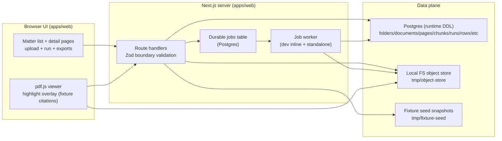

🧿 oracle 0.8.6 — Light on ceremony, heavy on receipts.
[SYSTEM]
You are Oracle, a focused one-shot problem solver. Emphasize direct answers and cite any files referenced.

[USER]
You are reviewing a Next.js (App Router) TypeScript repo: Orbital PoC.

Goal: help us ship a private “demo-prod” deployment (Hetzner + Docker/Compose) that behaves like a real app demo but uses fixture/test data only.

Constraints:
- Runs with NODE_ENV=production.
- Must be private: Basic Auth (or equivalent simple gate).
- Fixture-only posture: do NOT enable arbitrary uploads or real customer data.
- Minimal infra: Docker/Compose (web + worker + db + volumes). Object store is local filesystem volume for the demo.

What happened:
- During demos, certain buttons crashed because signed URL generation requires OBJECT_STORE_SIGNING_SECRET.
- Many pages/routes are currently dev-only via assertDevOnly/assertDevOnlyApi.

What I have drafted:
- A PRD + plan in docs/04-projects/02-features/0007_demo-prod-deploy/* describing:
  - Introducing ORBITAL_MODE=demo-prod to allow selected routes outside dev while keeping real prod locked down.
  - Adding Next middleware Basic Auth and forwarding Authorization header in server-side internal fetches.
  - Enabling fixture PDF routes in demo-prod (but still disabled in real prod).
  - Adding fixture-backed DOCX export fallback so demo feels complete.
  - Docker packaging and compose runbook (web + worker + db + volumes for tmp/object-store and tmp/fixture-seed).

What I need from you (be specific and code-grounded):
1) Validate the proposed approach. What assumptions are wrong or risky given the attached code?
2) Identify missing code changes for demo-prod. Produce an ordered, minimal patch plan:
   - exact files likely to change/add
   - what each change should do
   - pitfalls (auth forwarding, SSRF/origin derivation, volumes/workdir, worker behavior)
3) Identify what can remain dev-only and what must be enabled for a credible demo.
4) Check that the acceptance criteria are testable and propose a concrete verification checklist (commands + URLs).
5) Call out any security footguns we should avoid (even for demo-prod).

Output format:
- “Findings” (bullet list, severity ordered)
- “Patch Plan” (phased, minimal diffs)
- “Demo Route Matrix” (must/optional/disabled)
- “Verification Checklist”
- “Open Questions / Decisions”

### File: docs/04-projects/02-features/0007_demo-prod-deploy/prd.md
```md
# PRD: Demo-Prod Deploy (Private Hetzner "Real App" Demo)

Owner: marc
Status: Draft
Date: 2026-02-09
Slug: demo-prod-deploy

## Introduction / Overview

### Problem
Orbital PoC currently demos best in local development, but the "real app" experience is blocked by intentional dev-only gates (`assertDevOnly*`) and dev-only demo tooling. When attempting a more production-like demo, key user actions can fail (for example, signed URLs require a configured signing secret).

We need a private, production-build deployment suitable for demos without exposing the system publicly or accepting real customer data.

### Goal
Run a private "demo-prod" instance on Hetzner (Docker/Compose) that behaves like a real app, using fixture/test data only, protected by Basic Auth.

### Slice
Introduce a deployable `ORBITAL_MODE=demo-prod` runtime mode that enables the core fixture-based demo journey (viewer + exports) in a production build, while keeping uploads and non-demo surfaces disabled.

### Primary Observable Effect
Before: Outside `NODE_ENV=development`, key pages/routes 404 and demo flows fail; audience cannot use the app end-to-end.  
After: A demo URL (Hetzner) prompts for Basic Auth and then supports: `/matters` -> citation viewer -> CSV/DOCX export + download, all running as `next build` + `next start`.

### In Scope
- Add `ORBITAL_MODE` with explicit `demo-prod` behavior and safe defaults.
- Reframe "dev-only" gates to allow `{dev, demo-prod}` while keeping real prod locked down by default.
- Add Basic Auth protection for demo-prod.
- Ensure internal server-side fetches work under Basic Auth (forward `Authorization`).
- Allow fixture PDF serving in demo-prod (but not real prod).
- Add fixture-backed DOCX export path (so demo feels complete).
- Docker/Compose packaging for Hetzner: `web` + `worker` + `db` + volumes + required env.

## Goals
- Demo-prod runs with `NODE_ENV=production` and `ORBITAL_MODE=demo-prod`.
- Demo-prod is private by default (Basic Auth on all routes including APIs and PDF bytes).
- Demo journey is repeatable with test/fixture data only.
- Demo-prod has an operator-friendly runbook and rollback path.

## User Stories

### US-001: Demo Viewer Can Use The App End-to-End
As a demo viewer, I want to click a citation and see the PDF viewer render and highlight evidence, so that I can trust the system is grounded.

#### Acceptance Criteria
- AC-001: When authenticated, `/matters?pack=pack_01_clean` loads successfully in demo-prod.
- AC-002: Clicking a citation navigates to `/matters/viewer` and loads the PDF content via Range requests.
- AC-003: When a citation is invalid/corrupted, the viewer renders no overlay and shows an explicit failure state (no silent failure).

#### Verification
- Pack/fixture/script: `docs/08-example-data/pack_01_clean` and `tmp/fixture-seed/*/snapshot.json`.
- Automated checks: `pnpm -r typecheck`, `pnpm -r lint`, `pnpm -r test` (where applicable).
- Manual checks:
  - Run demo-prod stack, open `/matters?pack=pack_01_clean`, click `cit_TS-01_1`, confirm viewer loads and renders.

### US-002: Demo Viewer Can Export And Download Outputs
As a demo viewer, I want to export CSV and DOCX outputs and download them, so that I can see what the system produces.

#### Acceptance Criteria
- AC-004: `POST /export/csv` succeeds for fixture packs in demo-prod and returns a working download URL.
- AC-005: `POST /export/docx` succeeds for fixture packs in demo-prod and returns a working download URL.
- AC-006: `GET /folders/:pack_id/artefacts` lists the generated artefacts.
- AC-007: Artefact download routes require Basic Auth and work after authentication.

#### Verification
- Pack/fixture/script: `docs/08-example-data/pack_01_clean`.
- Manual checks:
  - From `/matters?pack=pack_01_clean`, click "Export exceptions" and "Export memo", then download both.

### US-003: Demo Operator Can Deploy And Restart Reliably
As a demo operator, I want a single docker compose command to bring up web + worker + db with persistent volumes, so that demos are repeatable.

#### Acceptance Criteria
- AC-008: `docker compose -f docker-compose.demo-prod.yml up -d` brings up `db`, `web`, and `worker`.
- AC-009: After restarting services, exports still download and review state persists (volumes mounted for `tmp/object-store` and `tmp/fixture-seed`).
- AC-010: If `OBJECT_STORE_SIGNING_SECRET` is missing, the system fails closed with a clear operator-facing error (not a silent partial demo).

#### Verification
- Pack/fixture/script: operator runbook steps + repeated restart verification.
- Manual checks:
  - Bring stack up, run demo steps, restart, re-run demo steps.

## Functional Requirements
- FR-001: The system must support `ORBITAL_MODE` with values `{dev, demo-prod, prod}` and default to locked down when unset.
- FR-002: The system must treat `demo-prod` as production build (`NODE_ENV=production`) while explicitly enabling the demo surfaces.
- FR-003: The system must enforce Basic Auth across pages, APIs, PDF byte endpoints, and artefact downloads in demo-prod.
- FR-004: Server-side internal fetches must forward the `Authorization` header so SSR rendering and route-handler fetches succeed under Basic Auth.
- FR-005: Fixture PDF serving must be enabled in `demo-prod` and disabled in `prod`.
- FR-006: DOCX export must support fixture snapshots (not only DB-backed runs) in demo-prod.
- FR-007: Upload-init and upload-bytes endpoints must remain disabled in demo-prod (fixture-only posture).
- FR-008: Demo-prod must require `DATABASE_URL` and `OBJECT_STORE_SIGNING_SECRET` and must not rely on dev-only fallbacks.
- FR-009: A separate worker process/service must be runnable in demo-prod for durable jobs (no inline draining).
- FR-010: Provide a minimal operator runbook including rollback instructions.

## Non-Goals (Out of Scope)
- Accepting user uploads or real customer data in demo-prod.
- Multi-user accounts, RBAC, or OAuth.
- Full production security hardening (WAF, rate limiting, audit logs) beyond light gating and safe defaults.
- Making DB-backed ingestion / quick-start perfect for the demo (this can remain optional and gated).

## Design Considerations (Optional)
- The demo should clearly communicate "fixture-only" and show a simple "Demo" indicator in UI.
- Keep failure states explicit (auth, worker down, missing secrets).

## Technical Considerations (Optional)
- Recommended: implement Basic Auth in `apps/web/middleware.ts` so all routes are gated consistently.
- Reverse proxy (Caddy/Nginx) can handle TLS termination; ensure forwarded headers do not create an SSRF origin issue.
- Worker separation: run `apps/web/scripts/worker.ts` as a long-running process/service in demo-prod.

## Failure States & UX
- Missing/invalid Basic Auth: return `401` with `WWW-Authenticate` (browser prompt).
- Worker not running: show "Runs/exports may be delayed" as an explicit degraded-mode banner; include an operator hint in logs.
- Missing `OBJECT_STORE_SIGNING_SECRET`: fail closed with an explicit error response (and log).
- DB unavailable: show a safe user-facing error (no stack traces).

## Metrics / Logging
- Success signals:
  - Log a `demo_prod_smoke_passed` event when core routes load (manual-run script can emit).
- Debug signals:
  - Log runtime mode at startup (`ORBITAL_MODE`, commit sha if available).
  - Log 401 rates (basic auth failures) and 5xx rates.

## Rollback / Disable Plan
- Feature flag / mode:
  - `ORBITAL_MODE` unset or set to `prod` locks down demo surfaces.
- Safe fallback behavior:
  - Demo pages and APIs return 404/disabled responses outside `demo-prod` and `dev`.

## Risks & Dependencies
- Risks:
  - Accidental exposure if mode defaults are wrong (mitigate: default locked down; explicit `demo-prod` opt-in).
  - Basic Auth breaks SSR/server-side internal fetches (mitigate: forward `Authorization`).
  - Host-derived origin SSRF risk (mitigate: safe local origin helper).
- Dependencies:
  - Docker packaging + compose file.
  - TLS termination on Hetzner (recommended) to avoid sending Basic Auth over plaintext.

## Success Metrics
- A demo operator can bring the stack up in < 10 minutes and run the full journey without 5xx errors.
- Demo audience can complete viewer + exports in < 5 minutes during a live demo.

## Open Questions
- Q1: Where should Basic Auth be enforced for Hetzner: Next middleware (preferred) or reverse proxy (acceptable)?
- Q2: Do we want to include the DB-backed demo pack loader (`/demo/load-pack`) in demo-prod, or keep the demo fixture-only?
- Q3: Do we require a real domain + TLS for the demo, or is an IP + VPN/SSH tunnel acceptable?

## Sources
- `docs/03-architecture/07_current_poc_runtime.md` (current runtime assumptions)
- `docs/03-architecture/50_api_surface.md` (API/auth intent)
- `docs/04-projects/02-features/0004_csv-export/prd.md` (export behavior)
- `docs/04-projects/02-features/0005_word-export/prd.md` (docx export behavior)
- `docs/04-projects/02-features/0007_demo-prod-deploy/investigation.md` (this investigation)
```

### File: docs/04-projects/02-features/0007_demo-prod-deploy/plan.md
```md
# Plan: Demo-Prod Deploy (Private "Real App" Demo)

Date: 2026-02-09
Owner: marc

## Goal
Deploy Orbital PoC as a private, production-build demo ("demo-prod") that can be shown as a real app:
- Runs with `NODE_ENV=production`
- Uses **fixture/test data only**
- Protected by **Basic Auth**
- Deployable on Hetzner using Docker/Compose

## Non-Goals (For This Slice)
- User uploads / real customer docs
- Multi-user accounts / RBAC
- Production-grade hardening beyond light gating (this is a demo)
- Making DB-backed ingestion + quick-start perfect (can remain optional)

## Key Decision: Introduce `ORBITAL_MODE`
Add an explicit runtime mode to avoid conflating "production build" with "real prod":
- `ORBITAL_MODE=dev` (today: local dev)
- `ORBITAL_MODE=demo-prod` (Hetzner demo)
- `ORBITAL_MODE=prod` (future; locked down by default)

Principle: **default to locked down** when `ORBITAL_MODE` is absent.

## Enablement Matrix (Demo-Prod)

### Must Work (Core Demo Journey)
- `/` landing loads
- `/matters?pack=pack_01_clean` loads (fixture-driven)
- Clicking a citation opens `/matters/viewer` and loads:
  - `GET /citations/:id`
  - `GET /documents/:id/render?page=N` -> signed `render_url`
  - `GET /documents/:id/pdf?...` (Range requests)
- Export and download:
  - `POST /export/csv` -> download link works
  - `POST /export/docx` -> download link works (requires fixture fallback implementation)
  - `GET /folders/:pack_id/artefacts` shows the created exports
  - `GET /artefacts/:id/download` works

### Must Be Disabled (Fixture-Only Posture)
- Create folder (API): `POST /folders`
- Upload init: `POST /folders/:id/documents` (init upload)
- Upload bytes: `PUT /documents/:id/upload`

### Optional (Operator Only, Behind Flags)
- `POST /demo/load-pack` (DB-backed demo pack loader)
- DB-backed pages and run/progress endpoints
- Trace export endpoints (admin-token only)

## Plan (Phased)

### Phase 0: Decisions + Guardrails
- Define `ORBITAL_MODE` semantics, defaults, and what "demo-prod" enables.
- Confirm the demo posture: fixture-only with exports.
- Decide where Basic Auth lives:
  - Preferred: Next middleware so *everything* is consistently gated (pages, APIs, PDF bytes).
  - Alternative: reverse proxy basic auth (Nginx/Caddy) (fine, but internal server fetches still must work).

Deliverable: update dossier PRD and route matrix.

### Phase 1: Runtime Gating Refactor
Implement mode helpers and reframe dev-only gates to allow demo-prod.

Files:
- Add: `apps/web/lib/runtimeMode.server.ts` (mode parsing + helpers)
- Modify:
  - `apps/web/lib/devOnly.ts`
  - `apps/web/lib/devOnlyApi.server.ts`
  - `apps/web/lib/demoMode.server.ts` (demo toolbar should be controlled by mode + explicit operator flag, not dev-only)

Acceptance:
- With `ORBITAL_MODE=demo-prod`, previously dev-only routes become reachable.
- With no `ORBITAL_MODE`, routes remain locked down (not accidentally open).

Rollback:
- Set `ORBITAL_MODE=prod` (or unset) to lock down again.

### Phase 2: Basic Auth Gate (Light Security)
Add Basic Auth for demo-prod, and ensure internal server-side fetches forward auth.

Files:
- Add: `apps/web/middleware.ts` (basic auth enforcement)
- Add: `apps/web/lib/basicAuth.server.ts`
- Fix internal server fetches:
  - `apps/web/app/(app)/matters/viewer/page.tsx` must forward `Authorization`
  - `apps/web/app/(app)/matters/ArtefactsList.tsx` must forward `Authorization`
- Reduce SSRF risk: avoid trusting `Host`/`X-Forwarded-*` for internal fetch origins.
  - Add: `apps/web/lib/safeOrigin.server.ts` and use it.

Acceptance:
- Unauthed `GET /matters` returns `401` with `WWW-Authenticate`.
- After auth, viewer + exports work without 401 loops.

Rollback:
- Remove BASIC_AUTH env vars (auth disabled) or revert middleware.

### Phase 3: Fixture Support In Demo-Prod + DOCX Fixture Fallback
Enable fixture PDF serving in demo-prod and make DOCX export work for fixture runs.

Files:
- Modify:
  - `apps/web/app/(api)/documents/[id]/render/route.ts` (allow fixture in demo-prod)
  - `apps/web/app/(api)/documents/[id]/pdf/route.ts` (allow fixture in demo-prod)
  - `apps/web/app/(api)/export/docx/route.ts` (add fixture snapshot fallback path)

Acceptance:
- A fixture citation can render in viewer in demo-prod.
- `POST /export/docx` succeeds for fixture packs and yields a download URL.

Rollback:
- Gate fixture serving strictly to `{dev, demo-prod}`.

### Phase 4: Docker/Compose Packaging For Hetzner
Package `apps/web` as a production build and provide an operator-friendly compose file.

Files:
- Add: `apps/web/Dockerfile` (multi-stage build, production runtime)
- Add: `docker-compose.demo-prod.yml` (web + worker + db + volumes)
- Optional: reverse proxy service (Caddy/Nginx) for TLS termination.

Critical details:
- Worker must be a separate service using `pnpm --filter @orbital-poc/web worker`.
- Provide volumes for:
  - `tmp/object-store` (artefacts + stored PDFs)
  - `tmp/fixture-seed` (review state)
  - Postgres data
- Require in demo-prod:
  - `DATABASE_URL`
  - `OBJECT_STORE_SIGNING_SECRET` (no dev fallback)
  - `BASIC_AUTH_USER` / `BASIC_AUTH_PASS`

Acceptance:
- `docker compose -f docker-compose.demo-prod.yml up -d` brings up `db`, `web`, and `worker`.
- Demo works after restarts (volumes persist).

Rollback:
- Roll back Docker image tag; volumes remain compatible.

## Verification Ladder (Demo-Prod)
1. Build: `pnpm -r build`
2. Start (docker): `docker compose -f docker-compose.demo-prod.yml up -d`
3. Smoke (manual):
   - Open `/` -> `/matters?pack=pack_01_clean` -> click a citation -> viewer loads
   - Export CSV -> download works
   - Export DOCX -> download works
4. Negative tests:
   - Upload endpoints are disabled (404/403)
   - Missing `OBJECT_STORE_SIGNING_SECRET` fails closed with a clear operator error

## Risks
- Accidental exposure in real prod: mitigated by explicit `ORBITAL_MODE` defaulting to locked down.
- Basic Auth breaks internal server fetches: mitigated by forwarding `Authorization` in server-side fetches.
- Reverse-proxy headers: mitigate by avoiding untrusted host-derived origins for internal requests.
- Worker not running: must surface as an operator-visible degraded mode.

## References
- `docs/03-architecture/07_current_poc_runtime.md`
- `docs/03-architecture/50_api_surface.md`
- `docker-compose.yml` (existing DB service)
- Related dossiers: `docs/04-projects/02-features/0004_csv-export`, `docs/04-projects/02-features/0005_word-export`
```

### File: docs/04-projects/02-features/0007_demo-prod-deploy/investigation.md
```md
# Investigation: Demo-Prod (Beyond Dev-Only)

## Summary
The current Orbital PoC demo experience is not deployable as a "real app" because key UI + API surfaces are intentionally **dev-only** (`assertDevOnly*`) and demo tooling is also dev-only (`DEMO_MODE`). Additionally, several user-visible actions depend on **signed URLs** and will hard-fail unless `OBJECT_STORE_SIGNING_SECRET` is configured (dev-only fallback exists but should not be used in a deployed demo).

## Symptoms
- Clicking certain buttons caused "Application error" and the app appeared to go down during demo.
- Several routes are unreachable outside local development because they `notFound()` / return 404 when `NODE_ENV !== "development"`.

## Investigation Log

### 2026-02-09 - Gating And Modes
**Hypothesis:** dev-only gates prevent a production-like demo deployment.
**Findings:** UI pages and API route handlers call `assertDevOnly()` / `assertDevOnlyApi(...)` which block access unless `NODE_ENV === "development"`.
**Evidence:**
- `apps/web/lib/devOnly.ts`
- `apps/web/lib/devOnlyApi.server.ts`
- Call sites discovered via search (e.g. `apps/web/app/(app)/matters/page.tsx`, `apps/web/app/(api)/export/csv/route.ts`, `apps/web/app/(api)/documents/[id]/pdf/route.ts`)
**Conclusion:** Confirmed. "Full app" behavior is intentionally unavailable outside dev.

### 2026-02-09 - Signed URL Failures
**Hypothesis:** app crashes are caused by missing signed URL secret.
**Findings:** `apps/web/lib/objectStore.server.ts` throws `OBJECT_STORE_SIGNING_SECRET_MISSING` unless `OBJECT_STORE_SIGNING_SECRET` is set, or a dev-only fallback is explicitly enabled with `ALLOW_DEV_OBJECT_STORE_SECRET=1`.
**Evidence:** `apps/web/lib/objectStore.server.ts`
**Conclusion:** Confirmed. Deployed demo-prod must set a real secret.

### 2026-02-09 - Worker Model Outside Dev
**Hypothesis:** background work in production requires a separate worker process.
**Findings:** inline draining (`kickInlineJobWorker`) is dev-only; outside dev a long-running worker must run (`apps/web/scripts/worker.ts`).
**Evidence:** `apps/web/lib/jobs/jobWorker.server.ts`, `apps/web/scripts/worker.ts`
**Conclusion:** Confirmed. A Hetzner demo-prod needs `web` + `worker` processes.

## Root Cause
The PoC is designed to be safe by default:
- dev-only gates intentionally prevent accidental exposure outside local dev
- demo tooling is intentionally dev-only
- signed URL secret is required for any PDF render / artefact download links
- durable jobs require a separate worker outside dev

## Recommendations
1. Introduce an explicit runtime mode `ORBITAL_MODE=demo-prod` and reframe dev-only gates to allow only `dev` + `demo-prod`.
2. Add Basic Auth as a light security gate (prefer Next middleware for end-to-end coverage), and ensure internal server-side fetches forward the `Authorization` header.
3. Keep the demo posture "fixture-only": disable uploads/folder creation in demo-prod, but enable the fixture viewer + exports.
4. Add Docker packaging and a Compose file that runs `web` + `worker` + `db` with persistent volumes for `tmp/object-store` and `tmp/fixture-seed`.

## Preventive Measures
- Default "locked down" mode when `ORBITAL_MODE` is unset (treat as real prod).
- Add an operator-visible banner in demo-prod ("fixture-only demo") and log the runtime mode at startup.
- Add a smoke script/verification checklist for demo-prod (auth, viewer, exports, artefact download).
```

### File: apps/web/lib/devOnly.ts
```ts
import { notFound } from "next/navigation";

export function assertDevOnly(): void {
  if (process.env.NODE_ENV !== "development") notFound();
}
```

### File: apps/web/lib/devOnlyApi.server.ts
```ts
import "server-only";

import { safeErrorEnvelope } from "@orbital-poc/core";

export function assertDevOnlyApi(traceId: string, headers: Headers): Response | null {
  if (process.env.NODE_ENV === "development") return null;
  return Response.json(safeErrorEnvelope({ code: "NOT_FOUND", message: "Not found.", traceId }), {
    status: 404,
    headers,
  });
}
```

### File: apps/web/lib/demoMode.server.ts
```ts
import "server-only";

import { safeErrorEnvelope } from "@orbital-poc/core";

export function isDemoModeEnabled(): boolean {
  // Demo tooling must remain dev-only even if someone mistakenly enables the flag elsewhere.
  if (process.env.NODE_ENV !== "development") return false;
  return process.env.DEMO_MODE === "1";
}

export function assertDemoModeEnabledApi(traceId: string, headers: Headers): Response | null {
  if (isDemoModeEnabled()) return null;
  return Response.json(safeErrorEnvelope({ code: "UNAUTHORISED", message: "Demo mode is disabled.", traceId }), {
    status: 403,
    headers,
  });
}
```

### File: apps/web/lib/objectStore.server.ts
```ts
import "server-only";

import { createHash, createHmac, randomBytes, timingSafeEqual } from "node:crypto";
import fs from "node:fs";
import path from "node:path";

type GlobalObj = typeof globalThis & {
  __orbitalObjectStoreSecret?: string;
};

const STORAGE_KEY_RE = /^folders\/[A-Za-z0-9_-]+\/documents\/[A-Za-z0-9_-]+\.pdf$/;
const ARTEFACT_CSV_KEY_RE = /^folders\/[A-Za-z0-9_-]+\/artefacts\/art_[0-9a-f-]+\.csv$/i;
const ARTEFACT_DOCX_KEY_RE = /^folders\/[A-Za-z0-9_-]+\/artefacts\/art_[0-9a-f-]+\.docx$/i;
const ARTEFACT_META_KEY_RE = /^folders\/[A-Za-z0-9_-]+\/artefacts\/art_[0-9a-f-]+\.meta\.json$/i;

function objectStoreRoot(): string {
  // In Next dev, `process.cwd()` resolves to `apps/web`.
  return path.resolve(process.cwd(), "../../tmp/object-store");
}

export function validateStorageKey(storageKey: string): { ok: true } | { ok: false; reason: string } {
  if (!STORAGE_KEY_RE.test(storageKey)) return { ok: false, reason: "INVALID_STORAGE_KEY" };
  return { ok: true };
}

export function validateArtefactCsvStorageKey(storageKey: string): { ok: true } | { ok: false; reason: string } {
  if (!ARTEFACT_CSV_KEY_RE.test(storageKey)) return { ok: false, reason: "INVALID_STORAGE_KEY" };
  return { ok: true };
}

export function validateArtefactDocxStorageKey(storageKey: string): { ok: true } | { ok: false; reason: string } {
  if (!ARTEFACT_DOCX_KEY_RE.test(storageKey)) return { ok: false, reason: "INVALID_STORAGE_KEY" };
  return { ok: true };
}

export function validateArtefactMetadataStorageKey(storageKey: string): { ok: true } | { ok: false; reason: string } {
  if (!ARTEFACT_META_KEY_RE.test(storageKey)) return { ok: false, reason: "INVALID_STORAGE_KEY" };
  return { ok: true };
}

export function validateArtefactStorageKey(storageKey: string): { ok: true } | { ok: false; reason: string } {
  if (ARTEFACT_CSV_KEY_RE.test(storageKey)) return { ok: true };
  if (ARTEFACT_DOCX_KEY_RE.test(storageKey)) return { ok: true };
  return { ok: false, reason: "INVALID_STORAGE_KEY" };
}

function resolveObjectPath(storageKey: string): string {
  const base = objectStoreRoot();
  const candidate = path.resolve(base, storageKey);
  if (!candidate.startsWith(base + path.sep)) throw new Error("PATH_TRAVERSAL");
  return candidate;
}

function secret(): string {
  const fromEnv = process.env.OBJECT_STORE_SIGNING_SECRET;
  if (fromEnv && fromEnv.trim()) return fromEnv.trim();

  // Fail closed unless explicitly allowed in dev.
  const devFallbackAllowed = process.env.NODE_ENV === "development" && process.env.ALLOW_DEV_OBJECT_STORE_SECRET === "1";
  if (!devFallbackAllowed) {
    throw new Error("OBJECT_STORE_SIGNING_SECRET_MISSING");
  }

  // Dev-only fallback so local upload works out of the box.
  const g = globalThis as GlobalObj;
  if (!g.__orbitalObjectStoreSecret) {
    g.__orbitalObjectStoreSecret = `dev-${randomBytes(32).toString("hex")}`;
  }
  return g.__orbitalObjectStoreSecret;
}

function b64url(input: Buffer): string {
  return input
    .toString("base64")
    .replace(/=/g, "")
    .replace(/\+/g, "-")
    .replace(/\//g, "_");
}

const SIGNATURE_PAYLOAD_VERSION = "v1";

function sign(args: { purpose: string; storageKey: string; expiresAtMs: number }): string {
  const payload = `${SIGNATURE_PAYLOAD_VERSION}\n${args.purpose}\n${args.storageKey}\n${args.expiresAtMs}`;
  const digest = createHmac("sha256", secret()).update(payload).digest();
  return b64url(digest);
}

export function verifySignature(args: { purpose: string; storageKey: string; expiresAtMs: number; sig: string }): boolean {
  const expiresAtMs = args.expiresAtMs;
  if (!Number.isFinite(expiresAtMs)) return false;

  // Defensive-in-depth: signatures are not valid once expired, even if the HMAC matches.
  const now = Date.now();
  if (expiresAtMs < now) return false;

  // Cap far-future signatures so callers can't accidentally mint "near-permanent" URLs.
  const maxFutureMs = 24 * 60 * 60 * 1000;
  if (expiresAtMs > now + maxFutureMs) return false;

  const expected = sign({ purpose: args.purpose, storageKey: args.storageKey, expiresAtMs: args.expiresAtMs });
  const a = Buffer.from(expected);
  const b = Buffer.from(args.sig);
  if (a.length !== b.length) return false;
  return timingSafeEqual(a, b);
}

function createSignedHeaders(args: {
  purpose: string;
  storageKey: string;
  expiresInSeconds?: number;
}): { expires_at_ms: number; signature: string } {
  const expiresInSeconds = args.expiresInSeconds ?? 10 * 60;
  const expiresAtMs = Date.now() + expiresInSeconds * 1000;
  const signature = sign({ purpose: args.purpose, storageKey: args.storageKey, expiresAtMs });
  return { expires_at_ms: expiresAtMs, signature };
}

export function createSignedPutHeaders(args: {
  storageKey: string;
  expiresInSeconds?: number;
}): { expires_at_ms: number; signature: string } {
  return createSignedHeaders({ purpose: "put", ...args });
}

export function createSignedGetHeaders(args: {
  storageKey: string;
  expiresInSeconds?: number;
}): { expires_at_ms: number; signature: string } {
  return createSignedHeaders({ purpose: "get", ...args });
}

export function objectExists(storageKey: string): boolean {
  const p = resolveObjectPath(storageKey);
  return fs.existsSync(p);
}

function sha256Digest(bytes: Uint8Array): string {
  const hash = createHash("sha256").update(bytes).digest("hex");
  return `sha256:${hash}`;
}

async function writeObjectFile(p: string, bytes: Uint8Array, opts?: { writeOnce?: boolean }): Promise<void> {
  fs.mkdirSync(path.dirname(p), { recursive: true });
  if (opts?.writeOnce) {
    await fs.promises.writeFile(p, bytes, { flag: "wx" });
    return;
  }
  await fs.promises.writeFile(p, bytes);
}

export async function putObject(args: {
  storageKey: string;
  bytes: Uint8Array;
}): Promise<{ bytesWritten: number; sha256: string }> {
  const p = resolveObjectPath(args.storageKey);
  await writeObjectFile(p, args.bytes);
  return { bytesWritten: args.bytes.byteLength, sha256: sha256Digest(args.bytes) };
}

export async function putObjectWriteOnce(args: {
  storageKey: string;
  bytes: Uint8Array;
}): Promise<{ bytesWritten: number; sha256: string }> {
  const p = resolveObjectPath(args.storageKey);
  await writeObjectFile(p, args.bytes, { writeOnce: true });
  return { bytesWritten: args.bytes.byteLength, sha256: sha256Digest(args.bytes) };
}

export async function readObject(storageKey: string): Promise<Uint8Array> {
  const p = resolveObjectPath(storageKey);
  const buf = await fs.promises.readFile(p);
  return new Uint8Array(buf);
}

export async function statObject(storageKey: string): Promise<fs.Stats> {
  const p = resolveObjectPath(storageKey);
  return fs.promises.stat(p);
}

export function createObjectReadStream(
  storageKey: string,
  opts?: { start?: number; end?: number },
): fs.ReadStream {
  const p = resolveObjectPath(storageKey);
  return fs.createReadStream(p, opts);
}
```

### File: apps/web/lib/jobs/jobWorker.server.ts
```ts
import "server-only";

import { z } from "zod";

import { claimNextJob, markJobFailed, markJobSucceeded, rescheduleJob, type JobRow } from "./jobQueue.server";
import { processDocumentIngest } from "../ingest/ingestProcessor.server";
import { processQuickStartRun } from "../quickStartRunProcessor.server";

type GlobalJobsWorker = typeof globalThis & {
  __orbitalInlineJobWorker?: { draining: boolean };
};

const g = globalThis as GlobalJobsWorker;
if (!g.__orbitalInlineJobWorker) g.__orbitalInlineJobWorker = { draining: false };

const IngestPayloadSchema = z.object({ document_id: z.string().min(1) });
const RunPayloadSchema = z.object({ run_id: z.string().min(1) });

function safeErrMessage(err: unknown): string {
  if (err instanceof Error) return err.message;
  return String(err);
}

function backoffMs(attempt: number): number {
  // attempt is 1-based and increments when the job is claimed.
  const base = 1_000;
  const max = 30_000;
  const ms = base * Math.pow(2, Math.max(0, attempt - 1));
  return Math.min(max, ms);
}

async function handleJob(job: JobRow): Promise<void> {
  if (job.type === "ingest_document") {
    const parsed = IngestPayloadSchema.safeParse(job.payload_json);
    if (!parsed.success) throw new Error("JOB_PAYLOAD_INVALID");
    await processDocumentIngest(parsed.data.document_id);
    return;
  }

  if (job.type === "execute_run") {
    const parsed = RunPayloadSchema.safeParse(job.payload_json);
    if (!parsed.success) throw new Error("JOB_PAYLOAD_INVALID");
    await processQuickStartRun(parsed.data.run_id);
    return;
  }

  // Should be unreachable due to JobTypeSchema validation in claimNextJob().
  throw new Error(`JOB_TYPE_UNSUPPORTED: ${String((job as { type?: unknown }).type)}`);
}

export async function drainJobsOnce(args: { workerId: string; maxJobs?: number }): Promise<number> {
  const maxJobs = args.maxJobs ?? 50;
  let processed = 0;

  for (let i = 0; i < maxJobs; i += 1) {
    const job = await claimNextJob({ workerId: args.workerId });
    if (!job) return processed;

    try {
      await handleJob(job);
      await markJobSucceeded(job.id);
    } catch (err) {
      const maxAttempts = 3;
      if (job.attempts < maxAttempts) {
        const ms = backoffMs(job.attempts);
        await rescheduleJob({
          jobId: job.id,
          availableAt: new Date(Date.now() + ms),
          error: { code: "JOB_FAILED_RETRYING", message: "Job failed; retry scheduled." },
        });
      } else {
        await markJobFailed({
          jobId: job.id,
          error: { code: "JOB_FAILED", message: "Job failed permanently." },
        });
      }

      // eslint-disable-next-line no-console
      console.error("jobs.worker.job_failed", {
        job_id: job.id,
        job_type: job.type,
        job_key: job.job_key,
        attempts: job.attempts,
        message: safeErrMessage(err),
      });
    }

    processed += 1;
  }

  return processed;
}

export function kickInlineJobWorker(): void {
  if (process.env.NODE_ENV !== "development") return;

  const state = g.__orbitalInlineJobWorker!;
  if (state.draining) return;
  state.draining = true;

  const workerId = `inline:${process.pid}`;
  void drainJobsOnce({ workerId, maxJobs: 100 })
    .catch((err) => {
      // eslint-disable-next-line no-console
      console.error("jobs.worker.drain_failed", { worker_id: workerId, message: safeErrMessage(err) });
    })
    .finally(() => {
      state.draining = false;
    });
}

export async function runContinuousJobWorker(args: {
  workerId: string;
  pollIntervalMs?: number;
  maxJobsPerTick?: number;
}): Promise<never> {
  const pollIntervalMs = args.pollIntervalMs ?? 1_000;
  const maxJobsPerTick = args.maxJobsPerTick ?? 25;

  // eslint-disable-next-line no-console
  console.info("jobs.worker.started", { worker_id: args.workerId, poll_interval_ms: pollIntervalMs });

  while (true) {
    const n = await drainJobsOnce({ workerId: args.workerId, maxJobs: maxJobsPerTick });
    if (n === 0) {
      await new Promise((r) => setTimeout(r, pollIntervalMs));
    }
  }
}
```

### File: apps/web/scripts/worker.ts
```ts
import os from "node:os";

import { runContinuousJobWorker } from "../lib/jobs/jobWorker.server";

function workerId(): string {
  const fromEnv = process.env.ORBITAL_WORKER_ID?.trim();
  if (fromEnv) return fromEnv;
  return `worker:${os.hostname()}:${process.pid}`;
}

process.on("SIGINT", () => process.exit(0));
process.on("SIGTERM", () => process.exit(0));

await runContinuousJobWorker({ workerId: workerId() });
```

### File: docker-compose.yml
```yaml
services:
  db:
    # pgvector baked in so we can `CREATE EXTENSION vector;` without custom builds.
    image: pgvector/pgvector:pg16
    container_name: orbital-poc-db
    environment:
      POSTGRES_DB: orbital
      POSTGRES_USER: orbital
      POSTGRES_PASSWORD: orbital
    ports:
      - "5432:5432"
    volumes:
      - orbital-pgdata:/var/lib/postgresql/data
      - ./scripts/db/init.sql:/docker-entrypoint-initdb.d/01-init.sql:ro
    healthcheck:
      test: ["CMD-SHELL", "pg_isready -U orbital -d orbital"]
      interval: 2s
      timeout: 5s
      retries: 20

volumes:
  orbital-pgdata:
```

### File: docs/03-architecture/07_current_poc_runtime.md
````md
# Current PoC Runtime (Implemented Today)

This document describes what is actually implemented in the repo today. It exists to prevent “docs imply WDK/OCR/RAG exists” confusion while the target architecture continues to evolve.

Target architecture docs remain in `docs/03-architecture/*` (e.g. WDK durable steps, OCR/layout geometry, retrieve/draft/lock pipeline). Treat those as **target** unless this doc says a component exists in the current PoC.

## High-level summary

Current PoC is:
- Next.js App Router (`apps/web`) using Node runtime route handlers
- Postgres via `postgres` driver with runtime DDL (`apps/web/lib/db.server.ts`)
- Local filesystem “object store” under `tmp/object-store` (`apps/web/lib/objectStore.server.ts`)
- Postgres-backed durable jobs for ingest and quick-start runs (`apps/web/lib/jobs/jobQueue.server.ts`) with a worker loop (`apps/web/lib/jobs/jobWorker.server.ts`)
  - In dev (`pnpm dev`): enqueue kicks an inline worker drainer (same process)
  - Outside dev: run a separate worker process (`pnpm --filter @orbital-poc/web worker`)
- PDF extraction via `pdfjs-dist` text extraction (not OCR; no geometry) (`apps/web/lib/ingest/ingestProcessor.server.ts`)
- Fixture-backed “evidence” for demos (seed snapshots under `tmp/fixture-seed`) used by citations, trace export, and spike export flows (`apps/web/lib/fixtureSeed.server.ts`, `scripts/fixtures/seed.ts`)

## Current component map



## What “ingest” means today
- Upload writes the raw PDF to the local FS object store via signed headers.
- Ingest is queued as a durable job (`type="ingest_document"`) and processed by the worker.
- The worker reads the PDF bytes from local FS and extracts per-page text using pdf.js.
- Extracted text is persisted to:
  - `document_pages.text` (per page)
  - `chunks.text` (currently 1 chunk per page)
- Layout/citations geometry is not produced. `document_pages.layout_json.has_geometry = false`.
- `documents.ocr_status` currently represents “extraction done” for this path; extraction method is tracked in `documents.metadata_json`.

Code:
- `apps/web/lib/ingest/ingestQueue.server.ts` (enqueue)
- `apps/web/lib/ingest/ingestProcessor.server.ts` (processing)
- `apps/web/lib/objectStore.server.ts`

## What “Quick Start run” means today
- Runs are executed via a durable job (`type="execute_run"`) processed by the worker.
- Current run implementation writes placeholder terminal `report_rows` for each question.
- It does not do retrieval, drafting, locking citations, or verification against real data.

Code:
- `apps/web/lib/quickStartRunQueue.server.ts` (enqueue)
- `apps/web/lib/quickStartRunProcessor.server.ts` (processing)

## Evidence and citations (current state)
Evidence-first UX exists for fixture packs only:
- `GET /citations/:id` resolves citations from seed snapshots (`tmp/fixture-seed`) and returns polygons/snippets for viewer overlay.
- Trace export (`GET /runs/:id/trace`) is synthesized from seed snapshots; it does not read persisted `runs/run_steps/...` execution artifacts.
- CSV export under `/spikes/export/csv` uses seed snapshots and deterministic integrity checks; it is not the target production export pipeline.

Code:
- `apps/web/lib/fixtureSeed.server.ts`
- `apps/web/app/(api)/citations/[id]/route.ts`
- `apps/web/app/(api)/runs/[id]/trace/route.ts`
- `apps/web/app/(api)/spikes/export/csv/route.ts`
- `scripts/fixtures/seed.ts`

## Environment and gating (current)
- Object store signing:
  - Set `OBJECT_STORE_SIGNING_SECRET` for stable signed URLs.
  - Dev-only escape hatch: set `ALLOW_DEV_OBJECT_STORE_SECRET=1` to use a per-process fallback secret.
- Many API routes are dev-only today via `assertDevOnlyApi()` (returning `404` outside dev):
  - `apps/web/lib/devOnlyApi.server.ts`
- Spike routes are additionally gated by `SPIKES_ENABLED=1`:
  - `apps/web/lib/spikes.server.ts`
- Trace export is gated by `FEATURE_TRACE_EXPORT=1` and an admin token (`ORBITAL_ADMIN_TOKEN`) with an explicit dev-only bypass.

## Known drift vs target architecture
The largest gaps relative to target docs:
- No durable orchestration runtime (WDK not implemented). The current PoC only has a minimal durable job queue (not step-graph workflows).
- No OCR/layout provider and no geometry-backed citations.
- No retrieval/draft/lock pipeline; current runs write placeholder rows.
- “Evidence-first” is implemented for fixture/demo mode, not for real uploaded documents.

If you are implementing features, prefer grounding changes in code reality first (this doc), then updating the target docs as the target evolves.
````

### File: docs/03-architecture/50_api_surface.md
````md
# API surface (PoC)

> Note: This document describes the **target** HTTP contract. For what is implemented today (including dev-only and
> fixture-backed routes), see `docs/03-architecture/07_current_poc_runtime.md`.

This doc is the canonical HTTP contract for the PoC. Keep it small, but explicit.

Important: This is the **target** API surface. During development we may ship dev-only spike endpoints, but they must live under `/spikes/*`, be gated behind `SPIKES_ENABLED=1`, and return `404` unless spikes are explicitly enabled.

See also:
- State machines + invariants: `docs/03-architecture/20_state_model.md`
- Persistence + hashing rules: `docs/03-architecture/30_data_model.md`

## Conventions
- All request/response bodies are JSON unless noted.
- IDs are opaque strings.
- Timestamps are ISO 8601.
- For POST endpoints that create work, support an optional `Idempotency-Key` header.
  - Spike endpoints must live under `/spikes/*` and are never part of the target contract.

### Versioning (PoC)
For now, paths are unversioned. Treat this document as "v1". If we need breaking changes later, introduce `/v2` explicitly.

### Auth (PoC)
Auth is an open decision (`docs/03-architecture/00_overview.md`). The contract still defines:
- `UNAUTHENTICATED`: missing/invalid auth
- `UNAUTHORISED`: authenticated but not allowed

PoC default assumption: single-tenant; environments may run without auth in local/dev, but production-minded deployments should turn auth on.

Non-negotiable rules for shared/demo environments:
- No unauthenticated access to PDFs or extracted text.
- All download/render URLs must be signed with a short TTL.
- Never log auth tokens or signed URLs (server logs, traces, analytics, or error reports).

### Admin token (PoC)
Some developer-facing endpoints are "admin-only" even in a no-auth PoC environment. PoC v1 contract:
- Require `X-Orbital-Admin-Token` header to match env `ORBITAL_ADMIN_TOKEN`.
- If missing/mismatched, return `403` with `error.code = "UNAUTHORISED"` (standard error envelope).

### Correlation and tracing
- The server should generate/propagate a `trace_id` per request and include it in the error envelope and as an `X-Trace-Id` response header.
- Workflow runs should record the `trace_id` that created them in `runs`/`run_steps` metadata (implementation detail, but required for debugging).

## Error envelope (required)
All non-2xx responses must use the same envelope (no stack traces, no internal provider payloads):

```json
{
  "error": {
    "code": "VALIDATION_ERROR",
    "message": "Human readable summary",
    "details": { "field": "optional safe detail" },
    "trace_id": "optional-trace-id"
  }
}
```

Minimum error codes (PoC):
- `VALIDATION_ERROR`
- `UNAUTHENTICATED` / `UNAUTHORISED`
- `NOT_FOUND`
- `CONFLICT`
- `RATE_LIMITED`
- `EXPORT_BLOCKED` (default when any row is `citation_failed`)
- `INTERNAL`

Internal vs external errors:
- External errors are safe for clients and must map to a stable `error.code` above with a human-readable `message`.
- Internal errors (unexpected exceptions, provider failures, stack traces) must be mapped to `error.code = "INTERNAL"` with a safe message. Log the internal detail server-side only (never return it to the client).

HTTP status mapping (PoC default):
- `VALIDATION_ERROR` -> `400`
- `UNAUTHENTICATED` -> `401`
- `UNAUTHORISED` -> `403`
- `NOT_FOUND` -> `404`
- `CONFLICT` -> `409`
- `RATE_LIMITED` -> `429`
- `EXPORT_BLOCKED` -> `409`
- `INTERNAL` -> `500`

## Demo controls (dev-only)

These endpoints are dev-only and must follow the spike endpoint conventions:
- Paths live under `/spikes/*`.
- They are gated behind `SPIKES_ENABLED=1` and return `404` unless spikes are explicitly enabled.

### POST /spikes/demo/load-pack (admin)
Load a known fixture pack from `docs/08-example-data/` and seed a fresh folder ("matter") with documents only.

Access control (PoC v1):
- Requires `X-Orbital-Admin-Token` header matching env `ORBITAL_ADMIN_TOKEN` (see Admin token (PoC) above).

Feature flags:
- Requires `SPIKES_ENABLED=1` and `DEMO_MODE=1`.
  - Otherwise return `404` with `error.code = "NOT_FOUND"`.

Request:
```json
{ "pack_id": "pack_01_clean" }
```

Response:
```json
{ "folder_id": "fld_123" }
```

Notes:
- `pack_id` must be allowlisted. Do not accept filesystem paths.
- Loader must read `docs/08-example-data/<pack_id>/manifest.json` and fail if missing; do not infer pack structure from directory listing.
- Never return local filesystem paths or signed URLs from this endpoint.

## Folder + documents

### GET /folders
List matters (folders). This is the minimal "home screen" API.

Response:
```json
{
  "folders": [
    {
      "id": "fld_123",
      "name": "123 Main St - Title + Survey",
      "state": "ready",
      "latest_index_version": "v1",
      "created_at": "2026-02-07T00:00:00Z"
    }
  ]
}
```

### POST /folders
Create a new matter (folder).

Request:
```json
{ "name": "123 Main St - Title + Survey" }
```

Response:
```json
{
  "folder": {
    "id": "fld_123",
    "name": "123 Main St - Title + Survey",
    "state": "empty",
    "latest_index_version": "v1"
  }
}
```

### GET /folders/:id
Fetch a folder.

Response:
```json
{
  "folder": {
    "id": "fld_123",
    "name": "123 Main St - Title + Survey",
    "state": "ingesting",
    "latest_index_version": "v1",
    "created_at": "2026-02-07T00:00:00Z",
    "updated_at": "2026-02-07T00:01:23Z"
  }
}
```

### POST /folders/:id/documents (init upload)
Initialise a document upload and return a storage target (signed URL or similar).

Request:
```json
{ "filename": "Title Commitment.pdf", "mime": "application/pdf", "bytes": 10485760 }
```

Response (shape only; storage fields depend on provider):
```json
{
  "document": {
    "id": "doc_123",
    "folder_id": "fld_123",
    "filename": "Title Commitment.pdf",
    "parse_status": "queued",
    "ocr_status": "queued"
  },
  "upload": {
    "storage_key": "folders/fld_123/documents/doc_123.pdf",
    "url": "https://…",
    "method": "PUT",
    "headers": { "Content-Type": "application/pdf" }
  }
}
```

### POST /documents/:id/complete
Mark the upload complete and enqueue ingest (parse + OCR + indexing).

Request:
```json
{ "storage_key": "folders/fld_123/documents/doc_123.pdf" }
```

Response:
```json
{ "document": { "id": "doc_123", "parse_status": "queued", "ocr_status": "queued" } }
```

### GET /folders/:id/documents
List documents in a folder.

Response:
```json
{
  "documents": [
    {
      "id": "doc_123",
      "filename": "Title Commitment.pdf",
      "parse_status": "parsed",
      "ocr_status": "done",
      "extraction_quality": 0.82,
      "page_count": 142
    }
  ]
}
```

### GET /documents/:id/render?page=N
Return a signed URL suitable for pdf.js to render the PDF.

Note (PoC v1 semantics):
- `render_url` is a signed URL to the **whole PDF** (what pdf.js loads).
- The `page` query param is **1-indexed** and is used for initial viewer state (and optional validation).
- This endpoint does not rasterise pages server-side.
- If we ever add server-rendered images, introduce a new endpoint (e.g. `/documents/:id/pages/:n.png`) rather than changing this contract.

Response:
```json
{
  "document_id": "doc_123",
  "page": 1,
  "render_url": "https://…"
}
```

## Runs + report

### POST /folders/:id/runs (Quick Start)
Start a Quick Start run for a folder.

Preconditions:
- Folder state must be `indexed` or `ready`.
  - If `empty|ingesting`, return `409` with `error.code = "CONFLICT"` and a message like: `Folder is not runnable yet.`
  - If `failed`, return `409` with guidance to retry ingest/re-index.

Request:
```json
{ "type": "quick_start_title_survey" }
```

Response:
```json
{
  "run": {
    "id": "run_123",
    "folder_id": "fld_123",
    "state": "running",
    "index_version": "v1",
    "agent_bundle_version": "git:abc123",
    "question_set_version": "qs:0002:v1.0:sha256:..."
  }
}
```

### GET /runs/:id (progress)
Response:
```json
{
  "run": {
    "id": "run_123",
    "state": "running",
    "index_version": "v1",
    "agent_bundle_version": "git:abc123",
    "question_set_version": "qs:0002:v1.0:sha256:...",
    "progress": { "questions_total": 9, "questions_done": 3 },
    "failure_counts": { "RETRIEVAL_MISS": 2, "CITATION_MISMATCH": 1 }
  }
}
```

### GET /folders/:id/report?run_id=…
Return report rows for a specific run. If `run_id` is omitted, return the latest run for the folder.

Response:
```json
{
  "run": {
    "id": "run_123",
    "state": "completed",
    "index_version": "v1",
    "agent_bundle_version": "git:abc123",
    "question_set_version": "qs:0002:v1.0:sha256:..."
  },
  "rows": [
    {
      "id": "row_123",
      "question_id": "TS-04",
      "question": "List the recorded exceptions in Schedule B-II.",
      "answer": "Extracted exceptions table (see payload).",
      "status": "needs_review",
      "citation_ids": ["cit_123", "cit_124"],
      "payload_schema_version": "list_payload_v0",
      "payload_json": {
        "kind": "exceptions_table",
        "items": [
          {
            "kind": "exceptions_table_item",
            "item_id": "bii:15",
            "bii_item": 15,
            "type": "Reciprocal Easement Agreement (REA)",
            "instrument_no": "2021-218785",
            "recorded_date": "2021-10-22",
            "doc": "REA.pdf",
            "risk_tags": ["parking", "shared_costs"],
            "match_status": "matched",
            "item_status": "needs_review",
            "citation_ids": ["cit_123"]
          }
        ]
      },
      "notes": null
    }
  ]
}
```

### GET /runs/:id/trace (admin)
Return a minimal, safe-by-default run trace JSON for debugging.

Access control (PoC v1):
- Requires `X-Orbital-Admin-Token` header matching env `ORBITAL_ADMIN_TOKEN` (see Admin token (PoC) above).

Safety:
- No raw PDF bytes.
- Avoid full extracted document text.
- No raw provider payload dumps.
- Prefer opaque IDs + hashes.

Response (shape only; exact contents may evolve but must remain safe):
```json
{
  "trace": {
    "run": {
      "id": "run_123",
      "folder_id": "fld_123",
      "state": "completed",
      "index_version": "v1",
      "agent_bundle_version": "git:abc123",
      "question_set_version": "qs:0002:v1.0:sha256:..."
    },
    "steps": [
      {
        "step_key": "retrieve",
        "step_type": "workflow_step",
        "state": "succeeded",
        "attempt": 1,
        "duration_ms": 123,
        "metrics_json": {},
        "error_json": null
      }
    ],
    "rows": [
      {
        "question_id": "TS-04",
        "status": "needs_review",
        "citation_ids": ["cit_123"],
        "provenance_json": {}
      }
    ]
  }
}
```

## Citations

### GET /citations/:id
Return locked geometry + snippet for a citation ID.

Response:
```json
{
  "citation": {
    "id": "cit_123",
    "document_id": "doc_123",
    "page_number": 12,
    "polygons": [[[0.1, 0.2], [0.4, 0.2], [0.4, 0.25], [0.1, 0.25]]],
    "snippet": "…",
    "snippet_hash": "sha256:…"
  }
}
```

## Export

### POST /export/csv
Export a run to a CSV artefact.

Preconditions:
- `runs.state` must be `completed` (PoC default)
  - else return `409` with `error.code = "CONFLICT"` and a safe message (e.g. `Run is not completed yet.`)
- Default behaviour is to block if any row is `citation_failed`.
  - Return a non-2xx response with `error.code = "EXPORT_BLOCKED"`.

Request:
```json
{
  "folder_id": "fld_123",
  "run_id": "run_123",
  "kind": "requirements_tracker",
  "unsafe_override": false
}
```

Response:
```json
{
  "artefact": {
    "id": "art_123",
    "type": "csv",
    "kind": "requirements_tracker",
    "filename": "requirements_tracker.csv",
    "storage_key": "folders/fld_123/artefacts/art_123.csv",
    "source_run_id": "run_123",
    "created_at": "2026-02-07T00:00:00Z",
    "download_url": "https://…"
  }
}
```

Notes:
- `kind` (CSV) must be one of:
  - `requirements_tracker`
  - `exceptions_table`
  - `survey_issues`
- Naming collision: there is a current dev-only exporter using `/export/csv`. Prefer to keep this as the target path and move the dev-only exporter under `/spikes/export/csv` (or similar), with dev-only gating and `404` outside dev.
- `unsafe_override` is reserved for demo-only "unsafe" exports:
  - Allowed only when `DEMO_MODE=1` and `ALLOW_UNSAFE_EXPORTS=1` and the request includes a valid admin token (see Admin token (PoC) above).
  - Otherwise return `403` with `error.code = "UNAUTHORISED"`.
- If an unsafe export is ever allowed, it must be visibly labelled and recorded in artefact metadata (see `docs/03-architecture/20_state_model.md` + `docs/03-architecture/30_data_model.md`).

### POST /export/docx
Export a run to a Word artefact (.docx).

Preconditions:
- `runs.state` must be `completed` (PoC default) else `409 CONFLICT` as above.
- Default behaviour is to block if any row is `citation_failed` (`EXPORT_BLOCKED`).

Request:
```json
{
  "folder_id": "fld_123",
  "run_id": "run_123",
  "kind": "memo",
  "unsafe_override": false
}
```

Response:
```json
{
  "artefact": {
    "id": "art_456",
    "type": "docx",
    "kind": "memo",
    "filename": "memo.docx",
    "storage_key": "folders/fld_123/artefacts/art_456.docx",
    "source_run_id": "run_123",
    "created_at": "2026-02-07T00:00:00Z",
    "download_url": "https://…"
  }
}
```

Notes:
- `unsafe_override` semantics match `POST /export/csv` (demo-only, gated behind `DEMO_MODE=1` + `ALLOW_UNSAFE_EXPORTS=1` + admin token).

### GET /folders/:id/artefacts
List exported artefacts for a folder.

Response:
```json
{
  "artefacts": [
    {
      "id": "art_123",
      "type": "csv",
      "kind": "requirements_tracker",
      "filename": "requirements_tracker.csv",
      "storage_key": "folders/fld_123/artefacts/art_123.csv",
      "source_run_id": "run_123",
      "created_at": "2026-02-07T00:00:00Z",
      "download_url": "https://…"
    }
  ]
}
```

Notes:
- `download_url` values are ephemeral signed URLs. Do not persist them in the DB; generate on demand.
````
