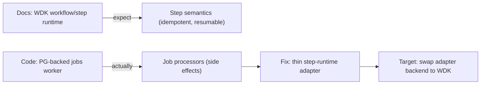

# Drift Item 1: Orchestration Runtime Drift (WDK workflows/steps vs jobs worker)

Assumptions: you're comfortable reading TypeScript/Next.js server code and the architecture docs, but want a clear mental model of what is "target" vs "current" and how to migrate safely.

## Sources (doc vs code)
- Docs (should): `docs/03-architecture/06_frameworks_agents_rag_evals.md`, `docs/03-architecture/10_system_architecture.md`, `docs/03-architecture/DECISIONS.md`
- Code (is): `apps/web/lib/jobs/jobQueue.server.ts`, `apps/web/lib/jobs/jobWorker.server.ts`, `apps/web/lib/quickStartRunProcessor.server.ts`

## 1) Intuition first (plain English)
The docs describe a future where long-running work is broken into explicit "steps" that can be paused, retried, and resumed safely (WDK style).

The code today runs long-running work as "jobs" that call job processors directly. That can work, but it does not automatically give you the safety rails that "step runtimes" promise (idempotency, resumability, explicit state transitions).

So the drift is not "wrong". It is "two different orchestration models", and the docs sometimes read like the target model already exists.

## 2) Metaphor / analogy (mapping)
Think of a kitchen:
- WDK steps are a recipe card with numbered steps. Each step has a clear start/end, and you can pause and resume without guessing what was done.
- The current jobs worker is a chef who knows how to cook and will try to finish the dish, but the "what step are we on?" is mostly in the chef's head (or implicit in code), not in a shared checklist.

Where the metaphor breaks: real systems need concurrency control, retries, and durable state. "Recipe cards" are only useful if the kitchen actually writes on them as it cooks.

## 3) Visual explanation (diagram via beautiful-mermaid)
Mermaid source:


Rendered:
```text
┌─────────────────────────────────┐          ┌──────────────────────────────────────────┐     ┌────────────────────────────────┐     ┌─────────────────────────────────────┐
│                                 │          │                                          │     │                                │     │                                     │
│ Docs: WDK workflow/step runtime ├─expect──►│ "Step semantics (idempotent, resumable)" │     │ Fix: thin step-runtime adapter ├────►│ Target: swap adapter backend to WDK │
│                                 │          │                                          │     │                                │     │                                     │
└─────────────────────────────────┘          └──────────────────────────────────────────┘     └────────────────────────────────┘     └─────────────────────────────────────┘
                                                                                                               ▲
                                                                                                               │
                                                                                                               │
                                                                                                               │
                                                                                                               │
┌─────────────────────────────────┐          ┌──────────────────────────────────────────┐                      │
│                                 │          │                                          │                      │
│   Code: PG-backed jobs worker   ├actually─►│     "Job processors (side effects)"      ├──────────────────────┘
│                                 │          │                                          │
└─────────────────────────────────┘          └──────────────────────────────────────────┘
```

## 4) Step-by-step breakdown
What the docs are trying to guarantee:
- A "run" is a sequence of named steps.
- Each step can be retried without duplicating side effects (idempotent).
- If a worker crashes, the system knows which step to resume.

What the current code guarantees:
- Jobs get enqueued and picked up by a worker loop.
- A processor function runs and may do side effects (write DB rows, call external APIs, etc).
- Retries/resumes are possible, but the semantics are whatever the processor code happens to implement.

Why this matters (failure modes):
- If a job processor does "write X, then write Y", and the worker crashes between them, retries can double-write X unless you designed it not to.
- If you later adopt WDK, you risk a big rewrite because "business logic" is fused to the current job-processing style.

Minimal fix options (from the drift doc), explained:
- Doc-only: add a loud "current runtime uses jobs worker; WDK is target" note (reduces confusion, does not change behavior).
- Code (recommended): add a thin "step runtime" abstraction:
  - Persists `run_steps` transitions (step name, status, attempt, timestamps, maybe idempotency keys).
  - Exposes a small API like `runStep(runId, stepName, fn)` that:
    - Checks if the step already completed.
    - Marks step `running`.
    - Runs `fn`.
    - Marks step `succeeded` (or `failed`).
  - Job processors call into this abstraction.
  - Later: the same interface can be backed by WDK without rewriting domain logic.

Trade-offs:
- You spend a little time now designing and enforcing step semantics.
- You get a much cheaper migration path later, and clearer debugging (you can inspect step history).

## 5) Common misunderstandings
- "Jobs worker" and "step runtime" are mutually exclusive.
  - They can coexist: jobs are just a delivery mechanism; step runtime is the semantic contract.
- "We can add WDK later, it will be easy."
  - It will not be easy if processors encode implicit step boundaries and non-idempotent side effects.
- "Retries are enough."
  - Retries without idempotency often create duplicates or corrupted state.

## 6) Check understanding (teach-back question)
If a worker crashes halfway through a processor, what concrete data would you need in the DB to safely resume without duplicating side effects, and where would you record it: job table, run table, or a `run_steps` table?

