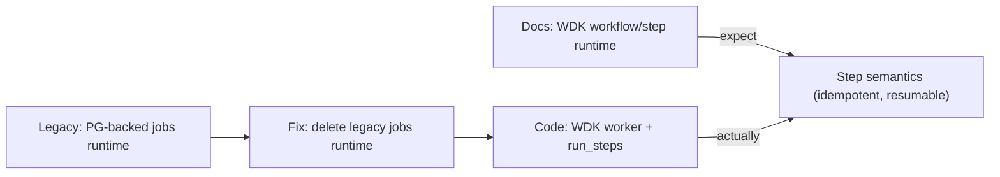

# Drift Item 1: Orchestration Runtime Drift (WDK workflows/steps vs legacy jobs runtime)

Assumptions: you're comfortable reading TypeScript/Next.js server code and the architecture docs, but want a clear mental model of what is "target" vs "current" and how to migrate safely.

## Sources (doc vs code)
- Docs (should): `docs/03-architecture/06_frameworks_agents_rag_evals.md`, `docs/03-architecture/10_system_architecture.md`, `docs/03-architecture/DECISIONS.md`
- Code (is): `apps/web/app/(api)/folders/[id]/runs/route.ts`, `apps/web/workflows/quickStartTitleSurveyWorkflow.server.ts`, `apps/web/lib/wdk/wdkWorker.server.ts`, `apps/web/scripts/worker.ts`, `apps/web/lib/jobs/jobWorker.server.ts`

## 1) Intuition first (plain English)
The docs describe a future where long-running work is broken into explicit "steps" that can be paused, retried, and resumed safely (WDK style).

The code today *does* use WDK steps for key flows (ingest and Quick Start). However, a legacy Postgres-backed "jobs worker" runtime still exists in the repo and is started by the worker script. Even if it is currently unused, its presence keeps dual-runtime confusion alive and makes docs drift more likely.

So the drift is: docs and code are converging on WDK, but the legacy jobs runtime still exists as a competing model and should be removed once it has no producers.

## 2) Metaphor / analogy (mapping)
Think of a kitchen:
- WDK steps are a recipe card with numbered steps. Each step has a clear start/end, and you can pause and resume without guessing what was done.
- The current jobs worker is a chef who knows how to cook and will try to finish the dish, but the "what step are we on?" is mostly in the chef's head (or implicit in code), not in a shared checklist.

Where the metaphor breaks: real systems need concurrency control, retries, and durable state. "Recipe cards" are only useful if the kitchen actually writes on them as it cooks.

## 3) Visual explanation (diagram via beautiful-mermaid)
Mermaid source:


Rendered:
```text
┌─────────────────────────────────┐          ┌──────────────────────────────────────────┐
│                                 │          │                                          │
│ Docs: WDK workflow/step runtime ├─expect──►│ "Step semantics (idempotent, resumable)" │
│                                 │          │                                          │
└─────────────────────────────────┘          └──────────────────────────────────────────┘
                                                     ▲
                                                     │
                                                     │
┌─────────────────────────────────┐          ┌──────────────────────────────────────────┐
│                                 │          │                                          │
│ Code: WDK worker + run_steps    ├actually─►│ "Step semantics (idempotent, resumable)" │
│                                 │          │                                          │
└─────────────────────────────────┘          └──────────────────────────────────────────┘

┌──────────────────────────────────────────┐     ┌───────────────────────────────────────┐
│                                          │     │                                       │
│ Legacy: PG-backed jobs runtime (unused)  ├────►│ Fix: delete legacy jobs runtime       │
│                                          │     │ (and stop starting it in the worker) │
└──────────────────────────────────────────┘     └───────────────────────────────────────┘
```

## 4) Step-by-step breakdown
What the docs are trying to guarantee:
- A "run" is a sequence of named steps.
- Each step can be retried without duplicating side effects (idempotent).
- If a worker crashes, the system knows which step to resume.

What the current code guarantees:
- Ingest and Quick Start are executed via WDK steps persisted in `run_steps` and processed by the WDK worker.
- Retries/resumes are anchored in durable step state (`queued|running|succeeded|failed`), not implicit processor state.
- A legacy jobs worker loop still exists in code and is started by the worker script, but it should be removed once it has no producers.

Why this matters (failure modes):
- Dual-runtime confusion: engineers (and docs) may accidentally reintroduce jobs-based orchestration even after migrating to WDK.
- Operational noise: the worker process does unnecessary work starting a legacy loop that should be idle.

Minimal fix options (now that WDK exists), explained:
- Doc-only: keep `docs/03-architecture/07_current_poc_runtime.md` accurate and loud about “WDK is current; jobs runtime is legacy/unused pending removal”.
- Code (recommended): delete the legacy jobs runtime (`apps/web/lib/jobs/*`, any enqueue surfaces) and stop starting it in the worker script.

Trade-offs:
- You lose a fallback path (intentional). Reintroducing a jobs runtime later should be an explicit decision, not an accidental dependency.

## 5) Common misunderstandings
- "Jobs worker" and "step runtime" are mutually exclusive.
  - They can coexist: jobs are just a delivery mechanism; step runtime is the semantic contract.
- "Leaving legacy runtimes around is harmless."
  - It increases doc drift and makes accidental regressions more likely.
- "Retries are enough."
  - Retries without idempotency often create duplicates or corrupted state.

## 6) Check understanding (teach-back question)
If a worker crashes halfway through a processor, what concrete data would you need in the DB to safely resume without duplicating side effects, and where would you record it: job table, run table, or a `run_steps` table?
