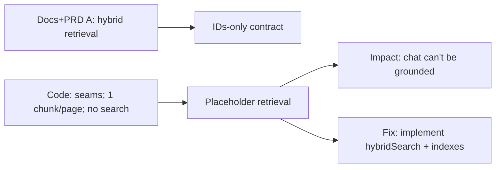

# Drift Item 4: Retrieval Drift (target hybrid retrieval vs placeholder implementation)

Assumptions: you want PRD B chat to be grounded and repeatable, and you're trying to understand why retrieval is the blocking substrate.

## Sources (doc vs code)
- Docs (should): `docs/03-architecture/40_rag_and_agents.md`
- PRD A: `docs/04-projects/02-features/0011_chat_interface/prds/0011a_hybrid-retrieval-v0/prd.md`
- Code (is): `apps/web/lib/retrieval/types.ts`, `apps/web/lib/db/schema/retrieval.server.ts`, `apps/web/lib/ingest/ingestProcessor.server.ts`

## 1) Intuition first (plain English)
Docs/PRD A describe hybrid retrieval: given a question, return the best chunk IDs (and later embeddings/lexical scoring) so downstream systems can fetch sources and cite them.

Code has the seams (types and a minimal schema), but the actual search behavior is not implemented yet, and chunking is currently "one chunk per page".

So chat (PRD B) cannot be reliably grounded because it has nothing trustworthy to retrieve.

## 2) Metaphor / analogy (mapping)
Think of a library:
- Hybrid retrieval is the card catalog: you ask for "bicycles", it returns the exact shelf locations (IDs) to visit.
- Placeholder retrieval is having shelves and books, but no catalog; you can only guess.

Where the metaphor breaks: you can hack a catalog with manual lists for a demo, but you cannot scale that to real usage.

## 3) Visual explanation (diagram via beautiful-mermaid)
Mermaid source:


Rendered:
```text
┌──────────────────────────────────────┐     ┌─────────────────────────┐     ┌───────────────────────────────────────┐
│                                      │     │                         │     │                                       │
│     Docs+PRD A: hybrid retrieval     ├────►│   "IDs-only contract"   │  ┌─►│     Impact: chat can't be grounded    │
│                                      │     │                         │  │  │                                       │
└──────────────────────────────────────┘     └─────────────────────────┘  │  └───────────────────────────────────────┘
                                                                          │
                                                                          │
                                                          ┌───────────────┘
                                                          │
                                                          │
┌──────────────────────────────────────┐     ┌────────────┴────────────┐     ┌───────────────────────────────────────┐
│                                      │     │                         │     │                                       │
│ Code: seams; 1 chunk/page; no search ├────►│ "Placeholder retrieval" ├────►│ Fix: implement hybridSearch + indexes │
│                                      │     │                         │     │                                       │
└──────────────────────────────────────┘     └─────────────────────────┘     └───────────────────────────────────────┘
```

## 4) Step-by-step breakdown
What "IDs-only contract" buys you:
- Retrieval returns stable identifiers for chunks (not large text payloads).
- Everything else (citations, exports, UI) can reference those IDs.
- You can swap retrieval strategies without changing downstream consumers.

What is missing today:
- A `hybridSearch()` implementation that actually returns relevant chunk IDs.
- Chunk metadata needed for good retrieval (lexical index, embeddings, chunk boundaries, versioning).
- Chunking strategy beyond "one page = one chunk" (often too coarse for answers and citations).

Why this matters for chat:
- Without retrieval, chat can only be:
  - fixture-only (sources are hardcoded), or
  - ungrounded (answers without evidence), which conflicts with the trust posture.

Fix options (from drift doc), explained:
- Doc-only: make the dependency explicit:
  - PRD B depends on PRD A, unless chat is explicitly scoped to fixtures first.
- Code: implement PRD A first:
  - Extend chunks schema for tsvector/embedding.
  - Implement `hybridSearch()` with versioned indexes.
  - Add chunker metadata and an `index_version` bump posture so you can reindex safely.

Trade-offs:
- Retrieval work is foundational and can feel "slow", but it prevents building chat on sand.
- A small v0 hybrid retrieval can be enough: prioritize correctness, deterministic IDs, and observability over sophistication.

## 5) Common misunderstandings
- "We can add retrieval after chat UI is done."
  - You can build UI shells, but you cannot validate core behavior (grounded answers, citations) without retrieval.
- "One chunk per page is fine."
  - It can work for a demo, but it inflates context and makes citations vague.
- "Hybrid retrieval means we need perfect embeddings."
  - A v0 can start with lexical search plus scaffolding for embeddings; the key is stable IDs and a contract.

## 6) Check understanding (teach-back question)
If retrieval returns only chunk IDs, what are the minimum additional fields you still need (in DB or elsewhere) to turn an ID into (a) the text shown to the model and (b) a user-visible citation link?

