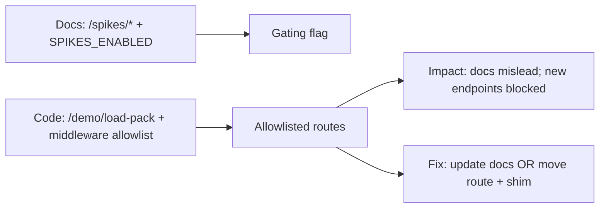

# Drift Item 5: API/Gating Drift (docs `/spikes/*` + `SPIKES_ENABLED` vs code `/demo/load-pack` + allowlisting)

Assumptions: you care about "how do I ship a new API route without demo-prod breaking it" and you want docs that route engineers to the right conventions.

## Sources (doc vs code)
- Docs (should): `docs/03-architecture/50_api_surface.md`
- Code (is): `apps/web/app/(api)/demo/load-pack/route.ts`, `apps/web/middleware.ts`, `apps/web/lib/runtimeMode.ts`

## 1) Intuition first (plain English)
Docs describe a convention: spike endpoints live under `/spikes/*` and are gated by `SPIKES_ENABLED`.

Code currently has a demo endpoint at `/demo/load-pack`, and demo-prod mode uses middleware allowlisting to decide what routes are even reachable.

So if you implement "the documented way", you might ship `/spikes/*` but it still gets blocked by allowlisting, or you might miss the actual route used in production demos.

## 2) Metaphor / analogy (mapping)
Think of building access control:
- Docs describe a keycard lock (`SPIKES_ENABLED`) on a specific room (`/spikes/*`).
- Code has a bouncer list at the front door (middleware allowlist) plus whatever locks exist inside.

Where the metaphor breaks: both can be correct security layers, but the documentation must match the actual door people walk through.

## 3) Visual explanation (diagram via beautiful-mermaid)
Mermaid source:


Rendered:
```text
┌──────────────────────────────────────────────┐     ┌──────────────────────┐     ┌─────────────────────────────────────────────┐
│                                              │     │                      │     │                                             │
│       Docs: /spikes/* + SPIKES_ENABLED       ├────►│    "Gating flag"     │  ┌─►│ Impact: docs mislead; new endpoints blocked │
│                                              │     │                      │  │  │                                             │
└──────────────────────────────────────────────┘     └──────────────────────┘  │  └─────────────────────────────────────────────┘
                                                                               │
                                                                               │
                                                                 ┌─────────────┘
                                                                 │
                                                                 │
┌──────────────────────────────────────────────┐     ┌───────────┴──────────┐     ┌─────────────────────────────────────────────┐
│                                              │     │                      │     │                                             │
│ Code: /demo/load-pack + middleware allowlist ├────►│ "Allowlisted routes" ├────►│    Fix: update docs OR move route + shim    │
│                                              │     │                      │     │                                             │
└──────────────────────────────────────────────┘     └──────────────────────┘     └─────────────────────────────────────────────┘
```

## 4) Step-by-step breakdown
What the docs are trying to achieve:
- Keep experimental endpoints clearly separated ("spikes").
- Provide a simple env-flag gate to avoid accidental exposure.

What the code currently enforces:
- Certain runtime modes (like demo-prod) only allow a small set of routes.
- Middleware allowlisting becomes the first gate you hit.

Why this matters (failure modes):
- Engineers add a new endpoint following docs, but demo-prod rejects it (looks like "route broken").
- Engineers add an endpoint under `/demo/*` because it works, but it is now effectively "promoted operator surface" without that intention being documented.

Fix options, explained:
- Doc-only:
  - Update `docs/03-architecture/50_api_surface.md` to match the implemented route + gating.
  - Or explicitly declare `/demo/*` as promoted operator endpoints (with allowlist rules).
- Code alternative:
  - Move to `/spikes/demo/load-pack` and implement `SPIKES_ENABLED` gating.
  - Keep a compatibility shim route (temporary) so existing demos still work.

Trade-offs:
- Updating docs is fastest, but if you want the `/spikes/*` convention long-term, code should converge on it.
- Moving routes is higher churn; the shim reduces risk.

## 5) Common misunderstandings
- "If the handler exists, the route works."
  - Middleware can block routes before they reach the handler.
- "Flags are enough."
  - Flags are a good second layer, but allowlisting is a different kind of policy (reachability vs behavior).
- "Demo endpoints don't matter."
  - Demo endpoints often become production constraints because they are the paths exercised most frequently.

## 6) Check understanding (teach-back question)
In demo-prod mode, if you add a new API route today, what two separate gating layers might block it before it executes, and where would you look to diagnose each?

