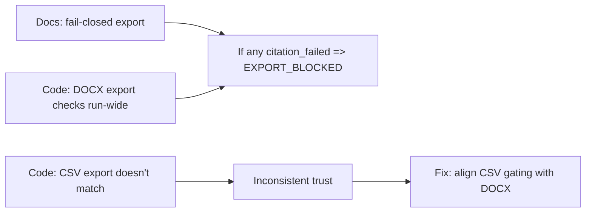

# Drift Item 6: Export Trust Drift (CSV export vs DOCX export gating)

Assumptions: you want a consistent "evidence-first" trust posture across exports before chat adds new surfaces that users will copy/share.

## Sources (doc vs code)
- Docs (should): `docs/03-architecture/20_state_model.md`, `docs/03-architecture/DECISIONS.md`
- Code (is): `apps/web/app/(api)/export/docx/route.ts`, `apps/web/app/(api)/export/csv/route.ts`

## 1) Intuition first (plain English)
Docs say exports should fail closed: if any row/run has `citation_failed`, export should be blocked unless there is an explicit (unsafe) override.

Code enforces this for DOCX export, but CSV export behaves differently: it does not enforce run-wide gating and rejects the unsafe override.

That means the system's trust rules depend on which export format you pick, which is a drift that users will notice.

## 2) Metaphor / analogy (mapping)
Think of a safety checklist:
- Docs say: "If any bolt is missing, you cannot ship the bike."
- DOCX follows the checklist.
- CSV sometimes ships the bike anyway, but also refuses the "I accept risk" waiver.

Where the metaphor breaks: different export formats can have different requirements, but trust posture should not silently change.

## 3) Visual explanation (diagram via beautiful-mermaid)
Mermaid source:


Rendered:
```text
┌───────────────────────────────────┐     ┌────────────────────────────────────────────┐     ┌─────────────────────────────────┐
│                                   │     │                                            │     │                                 │
│      Docs: fail-closed export     ├──┬─►│ "If any citation_failed => EXPORT_BLOCKED" │     │ Fix: align CSV gating with DOCX │
│                                   │  │  │                                            │     │                                 │
└───────────────────────────────────┘  │  └────────────────────────────────────────────┘     └─────────────────────────────────┘
                                       │                                                                      ▲
                                       │                                                                      │
                  ┌────────────────────┘                                                                      │
                  │                                                                                           │
                  │                                                                                           │
┌─────────────────┴─────────────────┐     ┌────────────────────────────────────────────┐                      │
│                                   │     │                                            │                      │
│ Code: DOCX export checks run-wide │     │            "Inconsistent trust"            ├──────────────────────┘
│                                   │     │                                            │
└───────────────────────────────────┘     └────────────────────────────────────────────┘
                                                                 ▲
                                                                 │
                                                                 │
                                                                 │
                                                                 │
┌───────────────────────────────────┐                            │
│                                   │                            │
│   Code: CSV export doesn't match  ├────────────────────────────┘
│                                   │
└───────────────────────────────────┘
```

## 4) Step-by-step breakdown
What "fail closed" is protecting:
- Users should not export content that looks official when citations are missing or failed.
- The system should be consistent: same trust model regardless of export format.

What the code currently does:
- DOCX: checks the run-wide state and blocks appropriately.
- CSV: does not enforce the same run-wide gating and also rejects unsafe override (so behavior is neither "safe" nor "explicitly unsafe").

Why this matters (failure modes):
- Users can bypass evidence constraints by choosing CSV.
- Engineers cannot reason about export posture without checking per-route quirks.
- Chat will add new "copy/export" surfaces; inconsistent gating will leak into user trust.

Fix options:
- Code (recommended): align CSV export gating with DOCX:
  - If any `citation_failed` in the run, return `409 EXPORT_BLOCKED` (same semantics).
  - Keep any explicit override behavior consistent across formats.
- Doc-only alternative: document CSV as an intentional escape hatch.
  - This conflicts with the stated trust posture and is likely to create long-term confusion.

Trade-offs:
- Aligning gating may "break" some demos that rely on CSV exports working; that is usually a good break if the trust model is real.

## 5) Common misunderstandings
- "CSV is just data, it doesn't need trust gating."
  - Users treat exported data as truth; gating is about evidence completeness, not file format.
- "DOCX export is the only one that matters."
  - CSV is often the easiest path to reuse data, so it becomes the most abusable path.
- "Override should never exist."
  - Overrides can be acceptable if they are explicit, logged, and clearly labeled as unsafe.

## 6) Check understanding (teach-back question)
If a run has 100 rows and only 1 row has `citation_failed`, should export be blocked? If yes, how would you explain that to a user in one sentence?

