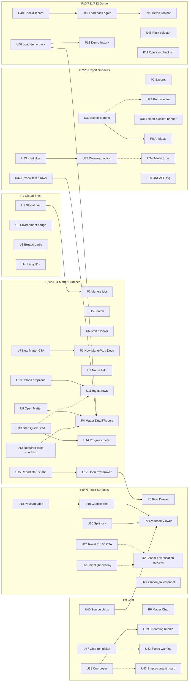

<file_map>
/Users/marc/Code/personal-projects/orbital-poc
├── apps
│   └── web
│       ├── app
│       │   ├── (api)
│       │   │   ├── citations
│       │   │   │   └── [id]
│       │   │   │       └── route.ts * +
│       │   │   ├── demo
│       │   │   │   └── load-pack
│       │   │   │       └── route.ts * +
│       │   │   ├── documents
│       │   │   │   └── [id]
│       │   │   │       ├── complete
│       │   │   │       │   └── route.ts * +
│       │   │   │       ├── upload
│       │   │   │       │   └── route.ts * +
│       │   │   │       ├── pdf
│       │   │   │       └── render
│       │   │   ├── export
│       │   │   │   ├── csv
│       │   │   │   │   ├── download
│       │   │   │   │   └── route.ts * +
│       │   │   │   └── docx
│       │   │   │       └── route.ts * +
│       │   │   ├── folders
│       │   │   │   ├── [id]
│       │   │   │   │   ├── artefacts
│       │   │   │   │   │   └── route.ts * +
│       │   │   │   │   ├── chat
│       │   │   │   │   │   └── route.ts * +
│       │   │   │   │   ├── documents
│       │   │   │   │   │   └── route.ts * +
│       │   │   │   │   ├── report
│       │   │   │   │   │   └── route.ts * +
│       │   │   │   │   └── runs
│       │   │   │   │       └── route.ts * +
│       │   │   │   └── route.ts * +
│       │   │   ├── runs
│       │   │   │   └── [id]
│       │   │   │       ├── trace
│       │   │   │       └── route.ts * +
│       │   │   ├── artefacts
│       │   │   │   └── [id]
│       │   │   │       └── download
│       │   │   └── spikes
│       │   │       ├── export
│       │   │       │   └── csv
│       │   │       ├── local-pdf
│       │   │       ├── retrieval
│       │   │       │   └── hybrid-search
│       │   │       ├── rh4-verify
│       │   │       └── wdk
│       │   │           └── smoke
│       │   │               ├── start
│       │   │               └── state
│       │   ├── (app)
│       │   │   ├── matters
│       │   │   │   ├── [id]
│       │   │   │   │   ├── ChatPanel.tsx * +
│       │   │   │   │   ├── ExportMemoButton.tsx * +
│       │   │   │   │   ├── QuickStartPanel.tsx * +
│       │   │   │   │   └── page.tsx * +
│       │   │   │   ├── viewer
│       │   │   │   │   └── CitationViewerClient.tsx * +
│       │   │   │   ├── ArtefactsList.tsx * +
│       │   │   │   ├── ExportCsvButton.tsx * +
│       │   │   │   ├── MattersToolbar.tsx * +
│       │   │   │   └── page.tsx * +
│       │   │   ├── evidence
│       │   │   │   └── [id]
│       │   │   └── spikes
│       │   │       ├── rh1-pdf-perf
│       │   │       └── rh2-overlay
│       │   ├── ui
│       │   │   └── Alert.tsx * +
│       │   ├── DemoToolbar.tsx * +
│       │   └── layout.tsx * +
│       ├── lib
│       │   ├── chat
│       │   │   └── protocol.ts * +
│       │   ├── db
│       │   │   └── schema
│       │   │       └── core.server.ts * +
│       │   ├── ai
│       │   ├── ingest
│       │   ├── retrieval
│       │   ├── wdk
│       │   └── folderState.server.ts * +
│       ├── public
│       ├── scripts
│       ├── steps
│       ├── test
│       │   ├── fixtures
│       │   └── stubs
│       ├── types
│       └── workflows
├── docs
│   ├── 02-guidelines
│   │   ├── v5-final
│   │   │   ├── tailwind.preset.ts * +
│   │   │   └── tokens.css *
│   │   ├── archive
│   │   ├── inspiration
│   │   │   ├── brand-dna-2026-02-06
│   │   │   │   ├── .firecrawl
│   │   │   │   │   └── brand-dna-2026-02-06
│   │   │   │   │       ├── maps
│   │   │   │   │       └── scrape
│   │   │   │   │           ├── amp
│   │   │   │   │           ├── coinshift
│   │   │   │   │           ├── every
│   │   │   │   │           ├── firecrawl
│   │   │   │   │           ├── parallel
│   │   │   │   │           └── raycast
│   │   │   │   ├── .parallel
│   │   │   │   │   └── brand-dna-2026-02-06
│   │   │   │   └── .probe
│   │   │   │       └── brand-dna-2026-02-06
│   │   │   │           └── out
│   │   │   └── tailwind
│   │   ├── v1-warm-editorial
│   │   ├── v2-refined-neutral
│   │   ├── v3-deep-ink
│   │   └── v4-frost-and-fire
│   ├── 04-projects
│   │   ├── 04-refactors
│   │   │   ├── 0009_user-journey-v2-parity-audit
│   │   │   │   ├── orbital-ui-wireframes
│   │   │   │   │   └── src
│   │   │   │   │       ├── components
│   │   │   │   │       │   ├── demo
│   │   │   │   │       │   │   ├── DemoHistory.tsx * +
│   │   │   │   │       │   │   ├── DemoToolbar.tsx * +
│   │   │   │   │       │   │   └── OperatorChecklist.tsx * +
│   │   │   │   │       │   ├── matter
│   │   │   │   │       │   │   ├── ArtefactsTab.tsx * +
│   │   │   │   │       │   │   ├── ChatTab.tsx * +
│   │   │   │   │       │   │   ├── EvidenceViewer.tsx * +
│   │   │   │   │       │   │   ├── ExportsTab.tsx * +
│   │   │   │   │       │   │   ├── ReportTab.tsx * +
│   │   │   │   │       │   │   └── RowDrawer.tsx * +
│   │   │   │   │       │   ├── ui
│   │   │   │   │       │   │   └── ErrorBanner.tsx * +
│   │   │   │   │       │   └── shell
│   │   │   │   │       ├── pages
│   │   │   │   │       │   ├── MatterDetailPage.tsx * +
│   │   │   │   │       │   ├── MattersListPage.tsx * +
│   │   │   │   │       │   └── NewMatterPage.tsx * +
│   │   │   │   │       └── hooks
│   │   │   │   ├── prds
│   │   │   │   │   ├── 0009a_shell-matters-setup
│   │   │   │   │   │   ├── prd.json *
│   │   │   │   │   │   └── prd.md *
│   │   │   │   │   ├── 0009b_report-triage-and-evidence
│   │   │   │   │   │   ├── prd.json *
│   │   │   │   │   │   └── prd.md *
│   │   │   │   │   ├── 0009c_exports-and-artefacts
│   │   │   │   │   │   ├── prd.json *
│   │   │   │   │   │   └── prd.md *
│   │   │   │   │   ├── 0009d_chat-run-scoping
│   │   │   │   │   │   ├── prd.json *
│   │   │   │   │   │   └── prd.md *
│   │   │   │   │   ├── 0009e_demo-operator-loop
│   │   │   │   │   │   ├── prd.json *
│   │   │   │   │   │   └── prd.md *
│   │   │   │   │   ├── 0009f_error-and-support-patterns
│   │   │   │   │   │   ├── prd.json *
│   │   │   │   │   │   └── prd.md *
│   │   │   │   │   └── 0009g_ui-polish-sweep
│   │   │   │   │       ├── prd.json *
│   │   │   │   │       └── prd.md *
│   │   │   │   ├── user-journeys
│   │   │   │   │   └── orbital-user-journeys-and-magic-patterns-prompts-v2.md *
│   │   │   │   ├── findings.md *
│   │   │   │   ├── prd-overall.json *
│   │   │   │   ├── prd-overall.md *
│   │   │   │   └── spike-investigation.md *
│   │   │   ├── 0001_v5-ui-alignment
│   │   │   ├── 0002_durable-jobs
│   │   │   ├── 0003_wdk-runtime
│   │   │   │   └── prds
│   │   │   │       ├── 0003a_wdk-runtime-skeleton
│   │   │   │       └── 0003b_ingest-to-wdk-cutover
│   │   │   ├── 0004_quick-start-to-wdk
│   │   │   ├── 0005_citations-db-first
│   │   │   ├── 0006_security-audit-remediation
│   │   │   ├── 0007_empty-text-sentinel-chunks
│   │   │   └── 0008_runtime-review-hardening
│   │   ├── 01-experiments-prototypes
│   │   ├── 02-features
│   │   │   ├── 0001_trust-substrate
│   │   │   │   ├── fixtures
│   │   │   │   ├── prds
│   │   │   │   │   ├── 0001a_matter-documents
│   │   │   │   │   ├── 0001b-f_trust-substrate-slices
│   │   │   │   │   ├── 0001b_pdf-viewer
│   │   │   │   │   ├── 0001c_citations-api-locking
│   │   │   │   │   ├── 0001d_citation-chip-highlight
│   │   │   │   │   ├── 0001e_row-status-export-failures
│   │   │   │   │   ├── 0001f_provenance-trace-export
│   │   │   │   │   └── 0001g_render-url-contract-alignment
│   │   │   │   ├── spike-proofs
│   │   │   │   ├── tmp-handoffs
│   │   │   │   └── tmp-oracle
│   │   │   ├── 0002_quick-start-engine
│   │   │   │   ├── prds
│   │   │   │   │   ├── 0002a_run-skeleton
│   │   │   │   │   ├── 0002b_row-payload-contract
│   │   │   │   │   ├── 0002c_commitment-parsing-pack-01-clean
│   │   │   │   │   ├── 0002d_exception-matching-pack-01-02
│   │   │   │   │   ├── 0002e_survey-extraction-pack-01-03
│   │   │   │   │   └── 0002f_reconciliation-honesty-pack-03-07
│   │   │   │   ├── specs
│   │   │   │   ├── spike-proofs
│   │   │   │   ├── tmp-handoffs
│   │   │   │   └── tmp-oracle
│   │   │   ├── 0003_demo-grade-outputs
│   │   │   │   ├── tmp-handoffs
│   │   │   │   └── tmp-oracle
│   │   │   ├── 0004_csv-export
│   │   │   ├── 0005_word-export
│   │   │   ├── 0006_eval-harness
│   │   │   ├── 0007_demo-prod-deploy
│   │   │   │   ├── tmp-handoffs
│   │   │   │   └── tmp-oracle
│   │   │   ├── 0007_demo-reliability
│   │   │   ├── 0008_artefacts-foundation
│   │   │   ├── 0009_contradiction-radar
│   │   │   ├── 0010_cite-capsules
│   │   │   └── 0011_chat_interface
│   │   │       ├── drift-items
│   │   │       ├── prds
│   │   │       │   ├── 0011a_hybrid-retrieval-v0
│   │   │       │   └── 0011b_matter-chat-v0
│   │   │       └── tmp-oracle
│   │   ├── 03-fixes
│   │   │   ├── 0001_drift
│   │   │   └── 0002_arch-drift-guardrails
│   │   ├── 05-migrations
│   │   └── _templates
│   ├── 00-strategy
│   │   └── initiatives
│   │       └── 100_chat_interface
│   ├── 01-insights
│   │   ├── capabilities
│   │   ├── competitors
│   │   ├── customers
│   │   │   ├── product-metrics
│   │   │   └── user-calls
│   │   └── tech-and-market
│   ├── 03-architecture
│   ├── 05-reviews-audits
│   │   ├── code-simplicity
│   │   ├── e2e-testing
│   │   │   ├── 0001_citation-viewer-highlight
│   │   │   ├── 0002_missing-input-checklist
│   │   │   └── 0003_fail-closed-export-gating
│   │   └── security
│   ├── 06-release
│   │   ├── demo-runbook
│   │   │   └── 2026-02-09_orbital-poc-demo
│   │   └── postmortems
│   ├── 08-example-data
│   │   ├── pack_01_clean
│   │   │   ├── docs
│   │   │   ├── layout
│   │   │   └── truth
│   │   ├── pack_02_missing_rea
│   │   │   ├── docs
│   │   │   ├── layout
│   │   │   └── truth
│   │   ├── pack_03_mismatch_and_cert_gap
│   │   │   ├── docs
│   │   │   ├── layout
│   │   │   └── truth
│   │   ├── pack_04_multi_parcel
│   │   │   ├── docs
│   │   │   ├── layout
│   │   │   └── truth
│   │   ├── pack_05_partial_release
│   │   │   ├── docs
│   │   │   ├── layout
│   │   │   └── truth
│   │   ├── pack_06_overlapping_easements
│   │   │   ├── docs
│   │   │   ├── layout
│   │   │   └── truth
│   │   ├── pack_07_scans_rotated_low_quality
│   │   │   ├── docs
│   │   │   ├── layout
│   │   │   └── truth
│   │   ├── pack_08_defined_terms_and_cross_refs
│   │   │   ├── docs
│   │   │   ├── layout
│   │   │   └── truth
│   │   └── pack_09_bad_citation
│   │       ├── docs
│   │       ├── layout
│   │       ├── produced
│   │       └── truth
│   ├── 96-engineering-tutor-learnings
│   ├── 98-tmp
│   │   ├── 2026-02-06_infra-investigation
│   │   ├── handoffs
│   │   └── oracle
│   │       └── oracle-bundles
│   └── 99-archive
├── packages
│   └── core
│       └── src
│           ├── chunking
│           ├── citations
│           ├── exception-matching
│           ├── fixtures
│           ├── geometry
│           ├── missing-docs
│           ├── schemas
│           ├── spikes
│           ├── verify
│           └── safe-error.ts * +
├── .agents
│   ├── backup
│   │   └── 2026-02-08T12-17-42-189Z
│   ├── hooks
│   │   └── git
│   └── skills
│       ├── 00-utilities
│       │   ├── agent-browser
│       │   ├── agentation
│       │   ├── ask-questions-if-underspecified
│       │   ├── beautiful-mermaid
│       │   ├── brand-dna-extractor
│       │   │   ├── assets
│       │   │   │   └── examples
│       │   │   ├── references
│       │   │   └── scripts
│       │   ├── browser-use
│       │   ├── commit
│       │   │   └── references
│       │   ├── create-cli
│       │   │   └── references
│       │   ├── dev-browser
│       │   │   ├── references
│       │   │   ├── scripts
│       │   │   └── src
│       │   │       └── snapshot
│       │   │           └── __tests__
│       │   ├── docs-list
│       │   ├── engineering-tutor
│       │   ├── every-style-editor
│       │   │   └── references
│       │   ├── file-todos
│       │   │   └── assets
│       │   ├── firecrawl
│       │   │   └── rules
│       │   ├── framework-docs-researcher
│       │   ├── handoff
│       │   ├── landpr
│       │   ├── markdown-converter
│       │   ├── nano-banana-pro
│       │   │   └── scripts
│       │   ├── openai-image-gen
│       │   │   └── scripts
│       │   ├── oracle
│       │   ├── parallel-web-tools
│       │   │   ├── assets
│       │   │   ├── references
│       │   │   └── scripts
│       │   ├── pickup
│       │   └── video-transcript-downloader
│       │       └── scripts
│       ├── 02-shape
│       │   ├── breadboarding
│       │   │   ├── references
│       │   │   │   ├── examples
│       │   │   │   └── templates
│       │   │   └── scripts
│       │   ├── brief
│       │   ├── create-json-prd
│       │   │   └── references
│       │   │       └── examples
│       │   ├── create-prd
│       │   │   └── assets
│       │   ├── spike-investigation
│       │   │   └── references
│       │   │       ├── examples
│       │   │       └── templates
│       │   └── wf-shape
│       │       └── references
│       ├── 03-plan
│       │   ├── best-practices-researcher
│       │   ├── bug-reproduction-validator
│       │   ├── deepen-plan
│       │   ├── plan-review
│       │   ├── repo-research-analyst
│       │   ├── reproduce-bug
│       │   ├── spec-flow-analyzer
│       │   ├── triage
│       │   └── wf-plan
│       │       └── references
│       ├── 04-develop
│       │   ├── 00-frontend-general
│       │   │   ├── composition-patterns
│       │   │   │   └── rules
│       │   │   ├── frontend-design
│       │   │   ├── generating-tailwind-brand-config
│       │   │   │   ├── references
│       │   │   │   └── scripts
│       │   │   ├── rams
│       │   │   ├── react-best-practices
│       │   │   │   └── rules
│       │   │   └── web-design-guidelines
│       │   ├── 01-ui-skills-dot-com
│       │   │   ├── 12-principles-of-animation
│       │   │   ├── baseline-ui
│       │   │   ├── canvas-design
│       │   │   ├── design-lab
│       │   │   ├── fixing-accessibility
│       │   │   ├── fixing-metadata
│       │   │   ├── fixing-motion-performance
│       │   │   ├── interaction-design
│       │   │   ├── interface-design
│       │   │   ├── swiftui-ui-patterns
│       │   │   ├── tailwind-css-patterns
│       │   │   ├── ui-ux-pro-max
│       │   │   └── wcag-audit-patterns
│       │   ├── pr-comment-resolver
│       │   ├── use-ai-sdk
│       │   │   └── references
│       │   ├── verify
│       │   ├── wf-develop
│       │   └── wf-ralph
│       │       ├── examples
│       │       └── references
│       ├── 05-review
│       │   ├── agent-native-architecture
│       │   │   └── references
│       │   ├── agent-native-reviewer
│       │   ├── architecture-strategist
│       │   ├── code-simplicity-reviewer
│       │   ├── data-integrity-guardian
│       │   ├── data-migration-expert
│       │   ├── git-history-analyzer
│       │   ├── kieran-python-reviewer
│       │   ├── kieran-typescript-reviewer
│       │   ├── pattern-recognition-specialist
│       │   ├── performance-oracle
│       │   ├── security
│       │   │   ├── security-best-practices
│       │   │   │   ├── agents
│       │   │   │   └── references
│       │   │   ├── security-sentinel
│       │   │   └── security-threat-model
│       │   │       ├── agents
│       │   │       └── references
│       │   ├── security-sentinel
│       │   ├── test-browser
│       │   └── wf-review
│       ├── 06-release
│       │   ├── changelog
│       │   ├── demo-runbook
│       │   │   ├── assets
│       │   │   ├── references
│       │   │   └── scripts
│       │   ├── deployment-verification-agent
│       │   └── wf-release
│       ├── 07-compound
│       │   └── compound-docs
│       │       ├── assets
│       │       └── references
│       ├── 10-audit
│       │   └── agent-native-audit
│       └── 98-skill-maintenance
│           ├── create-agent-skills
│           │   ├── references
│           │   ├── templates
│           │   └── workflows
│           ├── heal-skill
│           ├── modular-skills-architect
│           └── skill-creator
│               └── scripts
├── .claude
│   └── skills
├── .gemini
├── .github
│   └── workflows
├── scripts
│   ├── db
│   ├── fixtures
│   │   └── lib
│   └── oracle
└── tmp
    ├── fixture-eval
    │   ├── pack_01_clean
    │   │   └── exports
    │   ├── pack_02_missing_rea
    │   │   └── exports
    │   ├── pack_03_mismatch_and_cert_gap
    │   │   └── exports
    │   └── snapshots
    │       ├── pack_01_clean
    │       ├── pack_02_missing_rea
    │       └── pack_03_mismatch_and_cert_gap
    └── oracle-home
        └── sessions


(* denotes selected files)
(+ denotes code-map available)
Config: directory-only view; selected files shown.
</file_map>
<file_contents>
# Synthesized Live Contract Digest (2026-02-11)

## Synthesis policy
- Goal: reduce prompt size while preserving implementation-grade detail for spike decisions (SP-0009-01..06).
- Method: keep full planning docs and PRDs in this bundle; replace huge raw app code dumps with a dense contract digest grounded in live source files.
- Exclusions preserved from findings/PRDs: no hardcoded IDs/stats, no unsupported capability claims, no trust claims without source-backed fields, no second-level timers.

## Included sources for this digest
- `apps/web/app/(api)/folders/[id]/chat/route.ts`
- `apps/web/lib/chat/protocol.ts`
- `apps/web/app/(app)/matters/[id]/ChatPanel.tsx`
- `apps/web/app/(api)/folders/[id]/report/route.ts`
- `apps/web/app/(api)/folders/[id]/runs/route.ts`
- `apps/web/app/(api)/runs/[id]/route.ts`
- `apps/web/app/(api)/folders/[id]/documents/route.ts`
- `apps/web/lib/folderState.server.ts`
- `apps/web/lib/db/schema/core.server.ts`
- `apps/web/app/(api)/export/csv/route.ts`
- `apps/web/app/(api)/export/docx/route.ts`
- `packages/core/src/safe-error.ts`
- `apps/web/app/ui/Alert.tsx`
- `apps/web/app/(app)/matters/[id]/page.tsx`
- `apps/web/app/layout.tsx`
- `apps/web/app/DemoToolbar.tsx`

## Global envelope + safety invariants
- Shared safe error envelope shape is currently:
  - `error.code: string`
  - `error.message: string`
  - `error.details?: unknown`
  - `error.trace_id?: string`
- Current envelope does not include `retryable`.
- Current envelope does not include `support_hint`.
- Most API routes use Zod validation and return `VALIDATION_ERROR` with flattened details.
- Several routes gate execution with dev/demo checks (`assertDevOrDemoProdApi` or `assertDevOnlyApi`).
- Exports enforce fail-closed behavior around `citation_failed` rows.

## Data model snapshot (current durable facts)
- Folder state enum: `empty | ingesting | indexed | ready | failed`.
- Document parse status enum: `queued | parsing | parsed | failed`.
- Document OCR status enum: `queued | running | done | failed`.
- Run state enum: `created | running | completed | partial | failed | cancelled`.
- Report row status enum: `needs_review | reviewed | missing_input | citation_failed`.
- Report row check: if status is `missing_input`, answer must be `Not found in provided documents.`
- Citation one-of constraint: exactly one association is set (`report_row_id` xor `chat_message_id`).
- Artefacts table stores `type`, `kind`, `filename`, `storage_key`, optional `source_run_id`, and metadata JSON.

## Folder readiness derivation (`folderState.server.ts`)
- If no docs: folder is `empty`.
- If any doc parse/OCR failed: folder is `failed`.
- If any doc not at terminal success (`parsed` + `done`): folder is `ingesting`.
- If chunks for latest index version are missing for any doc: folder is `ingesting`.
- If extraction quality below `0.6` for any doc: folder is `indexed`.
- If page counts are missing/invalid: folder is `indexed`.
- If `document_pages` counts do not match expected page_count: folder is `indexed`.
- Only when all checks pass: folder is `ready`.

## API contract snapshot

### Chat API (`POST /folders/[id]/chat`)
- Request body currently accepts only:
  - `message: string` (trimmed, min 1, max 4000)
- No `run_id` accepted in request body today.
- Folder is resolved only for latest index version (`folders.latest_index_version`).
- Stream protocol is NDJSON with event union:
  - `meta { trace_id }`
  - `token { token }`
  - `sources { sources: ChatSource[] }`
  - `done { status: "complete" }`
  - `error { status: "citation_failed", code, message }`
- `ChatSource` currently only has:
  - `document_id: string`
  - `page_number: integer`
- Retrieval path:
  - runs `hybridSearch(..., opts: { kFinal: 6 })`
  - on empty hits emits token `Not found in provided documents.` + empty `sources` + `done`
  - otherwise emits model tokens then full `sources` and `done`
- No selected/effective run metadata is emitted.
- No citation/document anchor identifier in stream sources.

### Chat client surface (`ChatPanel.tsx`)
- Sends only `{ message }` to chat API.
- Parses NDJSON stream via `parseChatStreamEvent`.
- Marks terminal states as `complete` or `citation_failed`.
- Renders source chips from `document_id/page_number`.
- Source chips are visual only; no click-through jump contract implemented.
- No run picker in panel.
- No stale/mismatch banner for selected vs effective run.
- Retry path only replays last user message.

### Report API (`GET /folders/[id]/report`)
- Supports optional query `run_id` with validation.
- If `run_id` omitted: defaults to latest run by `created_at DESC`.
- If run not found for folder: `NOT_FOUND`.
- Returns run metadata subset:
  - `id`, `state`, `index_version`, `agent_bundle_version`, `question_set_version`
- Row payload handling is fail-closed:
  - schema/payload mismatch => `INTERNAL`
  - unsupported payload schema version => `INTERNAL`
  - payload schema validation failure => `INTERNAL` with issue summary
- Row response fields include:
  - `id`, `question_id`, `question`, `answer`, `status`, `citation_ids`, `payload_schema_version`, `payload_json`, `notes`, `provenance_json`, `created_at`, `updated_at`
- For `missing_input` rows, `citation_ids` are forced to empty.
- No status-filter query param exists today.

### Runs list/start API (`/folders/[id]/runs`)
- Currently implemented route is `POST` only (start run).
- No `GET` list endpoint exists for run picker UX.
- POST body:
  - `type: "quick_start_title_survey"`
- Supports optional `Idempotency-Key` header with strict format.
- Precondition before run start:
  - refreshes folder state
  - requires folder state `indexed` or `ready`
- Run insert sets:
  - `state = running`
  - `questions_total`
  - `questions_done = 0`
  - versions (`index_version`, `agent_bundle_version`, `question_set_version`)
- Logs/records trace and schedules workflow steps.

### Run detail API (`GET /runs/[id]`)
- Returns:
  - run identifiers + versions
  - progress `{ questions_total, questions_done }`
  - `failure_counts` derived from JSON
- Does not return run `created_at` / `updated_at` timestamps in response.

### Documents API (`/folders/[id]/documents`)
- `GET` lists documents with:
  - `id`, `folder_id`, `filename`, `parse_status`, `ocr_status`, `extraction_quality`, `page_count`, `error_json`, `created_at`
- `POST` initializes upload with:
  - body `filename`, `mime` (PDF literal), `bytes`
  - inserts new document in `queued/queued`
  - returns upload target metadata and signed headers
- This route plus folder-state derivation already provide a rich readiness taxonomy surface.

### Export CSV API (`POST /export/csv`)
- Body fields:
  - `folder_id`, `run_id`, `kind`, `unsafe_override` (default false)
- Unsafe override allowed only under strict dev/demo/admin-token conditions.
- If DB run exists and state is not completed => `CONFLICT`.
- If any report row in run has `citation_failed` and no unsafe override => `EXPORT_BLOCKED` with details.
- Requires exactly one structured payload row for requested kind.
- Requires all cited citation IDs to resolve to locked citations.
- Persists generated CSV artefact with `source_run_id` and metadata.
- Response returns artefact metadata and signed download URL.

### Export DOCX API (`POST /export/docx`)
- Body fields:
  - `folder_id`, `run_id`, `kind: "memo"`, optional `unsafe_override`
- Requires folder exists and run belongs to folder.
- Requires run state `completed`.
- Blocks on citation failures unless unsafe override is explicitly authorized.
- Requires specific report rows to exist (`TS-03`, `TS-04`, `TS-09`) and have list payloads.
- Resolves and verifies all citation IDs used in payloads.
- Builds memo docx with requirements/exceptions/survey issues/missing inputs.
- Persists artefact with `source_run_id` and returns signed download URL.

## UI surface snapshot

### Matter detail page (`(app)/matters/[id]/page.tsx`)
- Fetches folder + docs + latest run (single run summary by latest created).
- Uses latest-run assumption for quick start/export/report links.
- Displays ingest states (`parse_status/ocr_status`) and quality/page metrics.
- Shows run progress with `questions_done/questions_total`.
- Surfaces created/updated timestamps in server-rendered page for latest run.
- Export buttons are wired to latest completed run only.
- Chat panel is present when `CHAT_ENABLED=1`.

### Layout and demo shell
- Root layout conditionally renders `DemoToolbar` when demo mode is enabled.
- `DemoToolbar` can load demo packs and route to created matter.
- Demo toolbar error handling uses safe envelope code/message extraction.

### Alert primitive (`ui/Alert.tsx`)
- Variants: `info | success | warning | destructive`.
- Supports title + icon + content slots.
- Useful baseline for shared error banner parity work, but no built-in support-action slot contract yet.

## Spike-specific implications from live contracts

### SP-0009-01 (selected vs effective run)
- Hard blocker: no run-list GET endpoint for picker UX on `/folders/[id]/runs`.
- Chat endpoint cannot accept selected run context (`run_id`) today.
- Chat stream cannot emit effective run metadata for mismatch banners.
- Report already supports optional `run_id` and latest fallback; this pattern can anchor cross-surface semantics.

### SP-0009-02 (anchor coverage for source jumps)
- Chat sources carry only doc/page, no anchor IDs.
- Chat UI renders chips without click action.
- Citation table supports chat-message association, but chat stream contract does not expose citation IDs.
- Source-jump parity is structurally blocked until chat source payload is extended.

### SP-0009-03 (setup readiness taxonomy)
- Existing documents endpoint + folder-state derivation already encode concrete readiness and failure signals.
- Readiness details are distributed across folder and document fields; no unified setup-readiness DTO yet.
- Quick Start gating today only checks derived folder state (`indexed|ready`).

### SP-0009-04 (support escalation ownership)
- Safe envelope lacks standard `support_hint` metadata.
- No global support target contract in shared UI primitives.
- Existing surfaces show generic retry/refresh language, not owned escalation routing.

### SP-0009-05 (elapsed checklist timing)
- Run detail API omits timestamps even though DB/page have them.
- Matter page can show coarse created/updated timestamps from server query.
- No normalized elapsed-time API contract across report/chat/demo surfaces.

### SP-0009-06 (mandatory polish checks)
- Alert and token/preset systems exist; parity checklist and minimum pass list are not codified in a single mandatory gate.
- UI remains demo-oriented with latest-run assumptions and limited run-scoping controls.

## Decision-test anchors (contract-level)
- Any run-scoping design must define selected/effective run semantics for:
  - Report GET with explicit/implicit run_id.
  - Chat POST input and stream metadata.
  - Export surfaces and artefact provenance.
- Any source-jump design must define minimum required source fields for click-through.
- Any support pattern must define envelope keys + UI ownership + fallback when disabled.
- Any elapsed-time solution must choose source-of-truth timestamps and precision cut line.
- Any polish gate must bind to v5 tokens/preset and explicitly list mandatory checks.

## Open contract gaps to resolve before implementation
- Chat fallback behavior when selected run is stale/missing.
- Whether chat should soft-fallback to latest completed run or hard-fail with deterministic banner.
- Anchor-jump minimum schema (citation_id vs deterministic doc/page hash fallback).
- Ownership for support escalation destination (mailto, internal route, disabled state).
- Canonical run timestamp exposure (run detail endpoint vs shared folder run-list endpoint).
- Final mandatory checklist for `0009g` (what is required vs nice-to-have).


File: /Users/marc/Code/personal-projects/orbital-poc/apps/web/app/(api)/folders/[id]/chat/route.ts
````ts
import { z } from "zod";

import { streamText } from "ai";

import { safeErrorEnvelope } from "@orbital-poc/core";

import { chatModel } from "../../../../../lib/ai/gateway.server";
import { ensureSchema, sql } from "../../../../../lib/db.server";
import { assertDevOrDemoProdApi } from "../../../../../lib/devOnlyApi.server";
import { hybridSearch } from "../../../../../lib/retrieval/types";
import { createTraceContext } from "../../../../../lib/trace.server";
import { MISSING_EVIDENCE_TEXT, type ChatSource } from "../../../../../lib/chat/protocol";

export const runtime = "nodejs";

const ParamsSchema = z.object({
  id: z.string().min(1).max(200),
});

const BodySchema = z.object({
  message: z.string().trim().min(1).max(4000),
});

type FolderRow = {
  latest_index_version: string;
};

type ChunkRow = {
  id: string;
  document_id: string;
  page_start: number | null;
  page_end: number | null;
  text: string;
};

function safeErrMessage(err: unknown): string {
  if (err instanceof Error) return err.message;
  return String(err);
}

function ndjsonStream(args: {
  traceId: string;
  folderId: string;
  message: string;
  indexVersion: string;
  abortSignal: AbortSignal;
}): ReadableStream<Uint8Array> {
  const encoder = new TextEncoder();

  return new ReadableStream<Uint8Array>({
    async start(controller) {
      const send = (evt: unknown) => {
        controller.enqueue(encoder.encode(`${JSON.stringify(evt)}\n`));
      };

      // Ensure the client sees a started stream even if the model call fails
      // before producing any tokens.
      send({ type: "meta", trace_id: args.traceId });

      let terminalSent = false;
      const fail = (opts: { code: string; message: string }) => {
        if (terminalSent) return;
        terminalSent = true;
        send({ type: "error", status: "citation_failed", code: opts.code, message: opts.message });
        controller.close();
      };

      try {
        if (args.abortSignal.aborted) {
          fail({ code: "ABORTED", message: "Chat request was cancelled." });
          return;
        }

        const hits = await hybridSearch({
          folderId: args.folderId,
          indexVersion: args.indexVersion,
          queryText: args.message,
          opts: { kFinal: 6 },
        });

        if (hits.length === 0) {
          send({ type: "token", token: MISSING_EVIDENCE_TEXT });
          send({ type: "sources", sources: [] satisfies ChatSource[] });
          send({ type: "done", status: "complete" });
          controller.close();
          return;
        }

        const chunkIds = hits.map((h) => h.chunk_id);
        const chunkRows = await sql<ChunkRow[]>`
          SELECT id, document_id, page_start, page_end, text
          FROM chunks
          WHERE id = ANY(${chunkIds})
        `;

        const chunkById = new Map<string, ChunkRow>(chunkRows.map((c) => [c.id, c]));
        const sources: ChatSource[] = [];
        const sourceLines: string[] = [];

        hits.forEach((h, idx) => {
          const c = chunkById.get(h.chunk_id);
          const documentId = c?.document_id ?? h.document_id;
          const pageNumber = c?.page_start ?? h.page_start ?? h.page_end ?? 1;
          sources.push({ document_id: documentId, page_number: pageNumber });

          const snippet = (c?.text ?? "").trim().slice(0, 1200);
          sourceLines.push(`[S${idx + 1}] ${documentId} p.${pageNumber}\n${snippet}`);
        });

        const system =
          `Answer using only the provided sources.\n` +
          `If the answer is not supported by the sources, respond exactly with: ${JSON.stringify(MISSING_EVIDENCE_TEXT)}\n` +
          `Be concise.`;

        const user = `Question:\n${args.message}\n\nSources:\n${sourceLines.join("\n\n")}`;

        const result = streamText({
          model: chatModel(),
          system,
          messages: [{ role: "user", content: user }],
          abortSignal: args.abortSignal,
          maxRetries: 1,
        });

        for await (const delta of result.textStream) {
          send({ type: "token", token: delta });
        }

        send({ type: "sources", sources });
        send({ type: "done", status: "complete" });
        controller.close();
      } catch (err) {
        // eslint-disable-next-line no-console
        console.error("chat.stream_failed", { trace_id: args.traceId, message: safeErrMessage(err) });
        fail({ code: "MODEL_STREAM_FAILED", message: "Chat response failed. Please retry." });
      }
    },
  });
}

export async function POST(req: Request, ctx: { params: Promise<Record<string, string | string[] | undefined>> }) {
  const { traceId, headers } = createTraceContext();

  const devGate = assertDevOrDemoProdApi(traceId, headers);
  if (devGate) return devGate;

  const chatEnabled = process.env.CHAT_ENABLED === "1";
  if (!chatEnabled) {
    return Response.json(safeErrorEnvelope({ code: "CHAT_DISABLED", message: "Chat is disabled.", traceId }), {
      status: 404,
      headers,
    });
  }

  const rawParams = await ctx.params;
  const parsedParams = ParamsSchema.safeParse(rawParams);
  if (!parsedParams.success) {
    return Response.json(
      safeErrorEnvelope({
        code: "VALIDATION_ERROR",
        message: "Invalid route params.",
        details: parsedParams.error.flatten(),
        traceId,
      }),
      { status: 400, headers },
    );
  }

  let json: unknown;
  try {
    json = await req.json();
  } catch {
    return Response.json(safeErrorEnvelope({ code: "VALIDATION_ERROR", message: "Invalid JSON body.", traceId }), {
      status: 400,
      headers,
    });
  }

  const parsedBody = BodySchema.safeParse(json);
  if (!parsedBody.success) {
    return Response.json(
      safeErrorEnvelope({
        code: "VALIDATION_ERROR",
        message: "Body did not match schema.",
        details: parsedBody.error.flatten(),
        traceId,
      }),
      { status: 400, headers },
    );
  }

  await ensureSchema();

  const folderId = parsedParams.data.id;
  const folders = await sql<FolderRow[]>`
    SELECT latest_index_version
    FROM folders
    WHERE id = ${folderId}
    LIMIT 1
  `;
  const folder = folders[0] ?? null;
  if (!folder) {
    return Response.json(safeErrorEnvelope({ code: "NOT_FOUND", message: "Folder not found.", traceId }), {
      status: 404,
      headers,
    });
  }

  headers.set("Content-Type", "application/x-ndjson; charset=utf-8");
  return new Response(
    ndjsonStream({
      traceId,
      folderId,
      message: parsedBody.data.message,
      indexVersion: folder.latest_index_version,
      abortSignal: req.signal,
    }),
    {
    status: 200,
    headers,
    },
  );
}
````

File: /Users/marc/Code/personal-projects/orbital-poc/apps/web/lib/chat/protocol.ts
````ts
export const MISSING_EVIDENCE_TEXT = "Not found in provided documents." as const;

export type ChatSource = {
  document_id: string;
  page_number: number;
};

export type ChatStreamEvent =
  | { type: "meta"; trace_id: string }
  | { type: "token"; token: string }
  | { type: "sources"; sources: ChatSource[] }
  | { type: "done"; status: "complete" }
  | { type: "error"; status: "citation_failed"; code: string; message: string };

function isRecord(value: unknown): value is Record<string, unknown> {
  return Boolean(value) && typeof value === "object" && !Array.isArray(value);
}

function isString(value: unknown): value is string {
  return typeof value === "string";
}

function isChatSource(value: unknown): value is ChatSource {
  if (!isRecord(value)) return false;
  return isString(value.document_id) && typeof value.page_number === "number" && Number.isInteger(value.page_number);
}

export function parseChatStreamEvent(line: string): ChatStreamEvent | null {
  let json: unknown;
  try {
    json = JSON.parse(line);
  } catch {
    return null;
  }

  if (!isRecord(json) || !isString(json.type)) return null;

  if (json.type === "meta") {
    if (!isString(json.trace_id)) return null;
    return { type: "meta", trace_id: json.trace_id };
  }

  if (json.type === "token") {
    if (!isString(json.token)) return null;
    return { type: "token", token: json.token };
  }

  if (json.type === "sources") {
    if (!Array.isArray(json.sources)) return null;
    const sources = json.sources.filter(isChatSource);
    // Fail closed: require all sources to pass validation.
    if (sources.length !== json.sources.length) return null;
    return { type: "sources", sources };
  }

  if (json.type === "done") {
    if (json.status !== "complete") return null;
    return { type: "done", status: "complete" };
  }

  if (json.type === "error") {
    if (json.status !== "citation_failed") return null;
    if (!isString(json.code) || !isString(json.message)) return null;
    return { type: "error", status: "citation_failed", code: json.code, message: json.message };
  }

  return null;
}

````

File: /Users/marc/Code/personal-projects/orbital-poc/apps/web/app/(api)/folders/[id]/report/route.ts
````ts
import { z } from "zod";

import { LIST_PAYLOAD_V0_SCHEMA_VERSION, ListPayloadV0Schema, safeErrorEnvelope } from "@orbital-poc/core";

import { ensureSchema, sql } from "../../../../../lib/db.server";
import { assertDevOrDemoProdApi } from "../../../../../lib/devOnlyApi.server";
import { createTraceContext } from "../../../../../lib/trace.server";

export const runtime = "nodejs";

const ParamsSchema = z.object({
  id: z.string().min(1),
});

const RunIdSchema = z.string().trim().min(1).max(200);

type RunRow = {
  id: string;
  state: string;
  index_version: string;
  agent_bundle_version: string;
  question_set_version: string;
};

type ReportRow = {
  id: string;
  question_id: string;
  question: string;
  answer: string;
  status: string;
  notes: string | null;
  provenance_json: unknown;
  payload_schema_version: string | null;
  payload_json: unknown;
  created_at: Date;
  updated_at: Date;
};

function zodIssueSummary(err: unknown): Array<{ code: string; message: string; path: Array<string | number> }> {
  if (!err || typeof err !== "object" || !("issues" in err)) return [];
  const anyErr = err as { issues?: Array<{ code: string; message: string; path: Array<string | number> }> };
  return Array.isArray(anyErr.issues) ? anyErr.issues.map((i) => ({ code: i.code, message: i.message, path: i.path })) : [];
}

function parseRunId(req: Request): string | null {
  const url = new URL(req.url);
  const raw = url.searchParams.get("run_id");
  if (raw === null) return null;
  const parsed = RunIdSchema.safeParse(raw);
  if (!parsed.success) return "__invalid__";
  return parsed.data;
}

export async function GET(req: Request, ctx: { params: Promise<Record<string, string | string[] | undefined>> }) {
  const { traceId, headers } = createTraceContext();
  const devGate = assertDevOrDemoProdApi(traceId, headers);
  if (devGate) return devGate;

  await ensureSchema();

  const rawParams = await ctx.params;
  const parsedParams = ParamsSchema.safeParse(rawParams);
  if (!parsedParams.success) {
    return Response.json(
      safeErrorEnvelope({
        code: "VALIDATION_ERROR",
        message: "Invalid route params.",
        details: parsedParams.error.flatten(),
        traceId,
      }),
      { status: 400, headers },
    );
  }

  const folderId = parsedParams.data.id;
  const folder = await sql<{ id: string }[]>`
    SELECT id
    FROM folders
    WHERE id = ${folderId}
    LIMIT 1
  `;
  if (!folder[0]) {
    return Response.json(safeErrorEnvelope({ code: "NOT_FOUND", message: "Folder not found.", traceId }), {
      status: 404,
      headers,
    });
  }

  const runId = parseRunId(req);
  if (runId === "__invalid__") {
    return Response.json(
      safeErrorEnvelope({ code: "VALIDATION_ERROR", message: "Invalid run_id query param.", traceId }),
      { status: 400, headers },
    );
  }

  let run: RunRow | null = null;
  if (runId) {
    const runs = await sql<RunRow[]>`
      SELECT id, state, index_version, agent_bundle_version, question_set_version
      FROM runs
      WHERE id = ${runId}
        AND folder_id = ${folderId}
      LIMIT 1
    `;
    run = runs[0] ?? null;
  } else {
    const runs = await sql<RunRow[]>`
      SELECT id, state, index_version, agent_bundle_version, question_set_version
      FROM runs
      WHERE folder_id = ${folderId}
      ORDER BY created_at DESC
      LIMIT 1
    `;
    run = runs[0] ?? null;
  }

  if (!run) {
    return Response.json(safeErrorEnvelope({ code: "NOT_FOUND", message: "Run not found.", traceId }), {
      status: 404,
      headers,
    });
  }

  const rows = await sql<ReportRow[]>`
    SELECT id, question_id, question, answer, status, notes, provenance_json, payload_schema_version, payload_json, created_at, updated_at
    FROM report_rows
    WHERE run_id = ${run.id}
    ORDER BY created_at ASC, question_id ASC
  `;

  for (const r of rows) {
    const hasSchema = r.payload_schema_version !== null && String(r.payload_schema_version).trim() !== "";
    const hasPayload = r.payload_json !== null && r.payload_json !== undefined;
    if (hasSchema !== hasPayload) {
      return Response.json(
        safeErrorEnvelope({
          code: "INTERNAL",
          message: "Report row payload is in an inconsistent state.",
          details: { row_id: r.id, question_id: r.question_id },
          traceId,
        }),
        { status: 500, headers },
      );
    }

    if (!hasSchema) continue;

    if (r.payload_schema_version === LIST_PAYLOAD_V0_SCHEMA_VERSION) {
      const parsed = ListPayloadV0Schema.safeParse(r.payload_json);
      if (!parsed.success) {
        return Response.json(
          safeErrorEnvelope({
            code: "INTERNAL",
            message: "Report row payload failed schema validation.",
            details: { row_id: r.id, question_id: r.question_id, issues: zodIssueSummary(parsed.error) },
            traceId,
          }),
          { status: 500, headers },
        );
      }
    } else {
      return Response.json(
        safeErrorEnvelope({
          code: "INTERNAL",
          message: "Report row payload uses an unsupported schema version.",
          details: { row_id: r.id, question_id: r.question_id, payload_schema_version: r.payload_schema_version },
          traceId,
        }),
        { status: 500, headers },
      );
    }
  }

  const rowIds = rows.map((r) => r.id);
  const citations = rowIds.length
    ? await sql<Array<{ id: string; report_row_id: string }>>`
        SELECT id, report_row_id
        FROM citations
        WHERE report_row_id = ANY(${rowIds})
      `
    : [];

  const citationIdsByRow = new Map<string, string[]>();
  for (const c of citations) {
    const existing = citationIdsByRow.get(c.report_row_id);
    if (existing) existing.push(c.id);
    else citationIdsByRow.set(c.report_row_id, [c.id]);
  }

  return Response.json(
    {
      run: {
        id: run.id,
        state: run.state,
        index_version: run.index_version,
        agent_bundle_version: run.agent_bundle_version,
        question_set_version: run.question_set_version,
      },
      rows: rows.map((r) => {
        const cids = citationIdsByRow.get(r.id) ?? [];
        return {
          id: r.id,
          question_id: r.question_id,
          question: r.question,
          answer: r.answer,
          status: r.status,
          citation_ids: r.status === "missing_input" ? [] : cids,
          payload_schema_version: r.payload_schema_version ?? null,
          payload_json: r.payload_json ?? null,
          notes: r.notes ?? null,
          provenance_json: r.provenance_json ?? {},
          created_at: r.created_at.toISOString(),
          updated_at: r.updated_at.toISOString(),
        };
      }),
    },
    { status: 200, headers },
  );
}
````

File: /Users/marc/Code/personal-projects/orbital-poc/apps/web/app/(api)/runs/[id]/route.ts
````ts
import { z } from "zod";

import { safeErrorEnvelope } from "@orbital-poc/core";

import { ensureSchema, sql } from "../../../../lib/db.server";
import { assertDevOrDemoProdApi } from "../../../../lib/devOnlyApi.server";
import { createTraceContext } from "../../../../lib/trace.server";

export const runtime = "nodejs";

const ParamsSchema = z.object({
  id: z.string().min(1).max(200),
});

function asFailureCounts(val: unknown): Record<string, number> {
  if (!val || typeof val !== "object" || Array.isArray(val)) return {};
  const out: Record<string, number> = {};
  for (const [k, v] of Object.entries(val as Record<string, unknown>)) {
    if (typeof k !== "string" || !k) continue;
    if (typeof v === "number" && Number.isFinite(v) && v > 0) out[k] = Math.floor(v);
  }
  return out;
}

export async function GET(_req: Request, ctx: { params: Promise<Record<string, string | string[] | undefined>> }) {
  const { traceId, headers } = createTraceContext();
  const devGate = assertDevOrDemoProdApi(traceId, headers);
  if (devGate) return devGate;

  await ensureSchema();

  const rawParams = await ctx.params;
  const parsedParams = ParamsSchema.safeParse(rawParams);
  if (!parsedParams.success) {
    return Response.json(
      safeErrorEnvelope({
        code: "VALIDATION_ERROR",
        message: "Invalid route params.",
        details: parsedParams.error.flatten(),
        traceId,
      }),
      { status: 400, headers },
    );
  }

  const runId = parsedParams.data.id;
  const runs = await sql<
    Array<{
      id: string;
      state: string;
      index_version: string;
      agent_bundle_version: string;
      question_set_version: string;
      questions_total: number;
      questions_done: number;
      failure_counts_json: unknown;
    }>
  >`
    SELECT id, state, index_version, agent_bundle_version, question_set_version, questions_total, questions_done, failure_counts_json
    FROM runs
    WHERE id = ${runId}
    LIMIT 1
  `;
  const run = runs[0];
  if (!run) {
    return Response.json(safeErrorEnvelope({ code: "NOT_FOUND", message: "Run not found.", traceId }), {
      status: 404,
      headers,
    });
  }

  return Response.json(
    {
      run: {
        id: run.id,
        state: run.state,
        index_version: run.index_version,
        agent_bundle_version: run.agent_bundle_version,
        question_set_version: run.question_set_version,
        progress: {
          questions_total: run.questions_total ?? 0,
          questions_done: run.questions_done ?? 0,
        },
        failure_counts: asFailureCounts(run.failure_counts_json),
      },
    },
    { status: 200, headers },
  );
}
````

File: /Users/marc/Code/personal-projects/orbital-poc/docs/04-projects/04-refactors/0009_user-journey-v2-parity-audit/spike-investigation.md
````md
# Spike Investigation: 0009 User Journey V2 Parity Audit

Owner: marc  
Status: Active (2 resolved, 4 open)  
Date: 2026-02-11

## Purpose

Track high-leverage unknowns and resolved decisions that can cause scope drift or rework across the `0009a`..`0009g` PRD slices.

## Sources

- `docs/04-projects/04-refactors/0009_user-journey-v2-parity-audit/findings.md`
- `docs/04-projects/04-refactors/0009_user-journey-v2-parity-audit/prd-overall.md`
- `docs/04-projects/04-refactors/0009_user-journey-v2-parity-audit/prd-overall.json`

## Spike Backlog

| Spike ID | Question | Affected PRDs | Priority | Status | Recommended Method | Decision Output |
|---|---|---|---|---|---|---|
| SP-0009-01 | What is the exact `selected_run_id` vs `effective_run_id` fallback contract when chat receives stale/missing `run_id`? | `0009c`, `0009d` | P0 | Open | API contract spike with fixtures for valid/missing/stale run IDs + stream metadata assertions | Final request/response contract + mismatch UX copy rules |
| SP-0009-02 | What % of report/chat sources currently have resolvable anchors for jump-to-evidence? | `0009b`, `0009d` | P0 | Open | Data sampling spike on current citation payloads + viewer jump simulation | Anchor coverage metric + enable/disable threshold + fallback copy standard |
| SP-0009-03 | Which document readiness states are required for setup UX without exposing backend pipeline internals? | `0009a` | P0 | Resolved (2026-02-11) | Completed via canonical folder/document state-model review + setup contract alignment. | Locked to canonical states (`empty`,`ingesting`,`indexed`,`ready`,`failed` + parse/ocr progression) in `0009a` PRD JSON. |
| SP-0009-04 | Which endpoint/target should own support escalation from ErrorBanner? | `0009f` | P1 | Resolved (2026-02-11) | Completed via parity-v1 support path decision with safe payload constraints. | Locked to config-driven `mailto` target + fallback guidance in `0009f` PRD JSON; no ticketing endpoint in v1. |
| SP-0009-05 | Are existing run timestamps sufficient for coarse checklist elapsed-time display? | `0009e` | P1 | Open | Telemetry feasibility spike over run metadata and timing edge cases | Go/No-go for minute-level elapsed display and fallback behavior |
| SP-0009-06 | Which UI polish checks are mandatory across all surfaces while preserving wireframe exclusions? | `0009g` | P1 | Open | Design-system audit spike using `v5-final` tokens/preset + parity checklist pass | Mandatory polish checklist and guardrail matrix |

## Exclusion Guardrails (Must Hold During Spikes)

- Do not reintroduce cut wireframe items:
  - `W-C3` hardcoded labels/IDs/dates
  - `W-C4` hardcoded ingest stats
  - `W-C5` unsupported upload capability promises
  - `W-C7` trust claims without source-backed fields
  - `W-C11` second-level precision timers
- Keep implementation design-system-first:
  - Use/extend Orbital components and tokens.
  - Use wireframes and magic patterns as interaction inspiration only.

## Remaining Execution Order

1. SP-0009-01 (chat run-scope contract)
2. SP-0009-02 (anchor coverage threshold)
3. SP-0009-05 (checklist elapsed feasibility)
4. SP-0009-06 (final polish checklist lock)

## Resolved Decisions

- SP-0009-03 resolved in `docs/04-projects/04-refactors/0009_user-journey-v2-parity-audit/prds/0009a_shell-matters-setup/prd.json`.
- SP-0009-04 resolved in `docs/04-projects/04-refactors/0009_user-journey-v2-parity-audit/prds/0009f_error-and-support-patterns/prd.json`.

## Exit Criteria Per Spike

- A one-page decision note is produced with:
  - decision taken
  - alternatives rejected
  - affected PRD/story references
  - explicit cut line
- Relevant PRDs are patched in the same dossier after each spike closes.
````

File: /Users/marc/Code/personal-projects/orbital-poc/docs/04-projects/04-refactors/0009_user-journey-v2-parity-audit/findings.md
````md
# User Journey V2 Parity Audit Findings

Date: 2026-02-11

Source spec:
- `docs/00-strategy/user-journeys/orbital-user-journeys-and-magic-patterns-prompts-v2.md`

Primary implementation surface reviewed:
- `apps/web/app`
- `apps/web/lib`
- `apps/web/app/(api)`

Wireframe reference reviewed (affordances/IA/workflows only):
- `docs/04-projects/04-refactors/0009_user-journey-v2-parity-audit/orbital-ui-wireframes`

## Executive summary

- Weighted alignment to the v2 affordance model: **38.5%**
- Count by affordance status:
  - Implemented: 11
  - Partial: 18
  - Missing: 23
- Core theme:
  - Trust viewer + export safety are relatively mature.
  - Shell/navigation, matter setup, report triage drawer/split-view, and operator workflow are the largest gaps.

## Scope classification legend

- `UI-only`: can be implemented in existing UI with current backend contracts.
- `UI + thin backend`: small API additions/params/fields (low complexity).
- `UI + moderate backend`: new endpoints, non-trivial query/state changes, or schema-level behavior changes.
- `Backend-heavy`: large backend/system work or orchestration-heavy changes.

## U1–U52 parity checklist

| Affordance | Status | Scope classification | Notes |
|---|---|---|---|
| U1 | Missing | UI + moderate backend | No global nav (`Matters`, `Runs`, `Alerts`, `Settings`) surface. |
| U2 | Partial | UI + thin backend | `DEMO MODE` bar exists, but no explicit `demo-dev` / `demo-prod` badge contract. |
| U3 | Missing | UI-only | No breadcrumb chain in app shell. |
| U4 | Partial | UI-only | IDs shown in local views, not sticky shell wayfinding. |
| U5 | Missing | UI + thin backend | No searchable matters list UI. |
| U6 | Missing | UI + thin backend | No saved-view chip model (`Active`, `Needs Attention`, `Demo Packs`). |
| U7 | Missing | UI + thin backend | No `New Matter` CTA in matters list (create API exists). |
| U8 | Missing | UI-only | No matter-row `Open` action in list context. |
| U9 | Missing | UI + thin backend | No matter-name creation form. |
| U10 | Missing | UI + moderate backend | No upload dropzone flow in UI (upload-init API exists). |
| U11 | Partial | UI-only | Ingest status rows exist in matter detail, but not in dedicated setup flow. |
| U12 | Partial | UI + moderate backend | Checklist exists post-run in row context, not pre-run setup gating. |
| U13 | Implemented | N/A | Quick Start start button exists. |
| U14 | Implemented | N/A | Run progress meter exists. |
| U15 | Missing | UI-only | No local row-status tabs (`All`, `Needs Review`, etc.). |
| U16 | Implemented | N/A | Row status chips rendered. |
| U17 | Missing | UI-only | No row drawer open action; rows are inline cards. |
| U18 | Partial | UI-only | Structured payload rendering present, but not in dedicated drawer UX. |
| U19 | Implemented | N/A | Citation chips link to evidence viewer. |
| U20 | Missing | UI + moderate backend | No split-view lock to keep row + viewer visible together. |
| U21 | Missing | UI-only | No explicit PDF loading skeleton state. |
| U22 | Missing | UI-only | No page controls in evidence viewer UI. |
| U23 | Partial | UI-only | Zoom controls exist; verification indicator is implicit/partial. |
| U24 | Partial | UI-only | 100% behavior enforced, but no explicit `Reset to 100% to verify` CTA. |
| U25 | Implemented | N/A | Highlight overlay rendering exists. |
| U26 | Partial | UI + thin backend | Metadata rail lacks full trust context fields in UI. |
| U27 | Partial | UI-only | `citation_failed` panel exists with reason code, but recovery checklist is thin. |
| U28 | Missing | UI + moderate backend | No `Flag citation wrong` action + confirmation flow. |
| U29 | Missing | UI + thin backend | No export run selector (defaults to latest run). |
| U30 | Implemented | N/A | 3 CSV + 1 DOCX export actions are present. |
| U31 | Partial | UI-only | Export blocked copy exists, but not standardized as one shared panel pattern. |
| U32 | Partial | UI-only | “Review failed rows” journey is weak (JSON link, no filtered report UI route). |
| U33 | Missing | UI-only | No artefact kind filter (`csv`, `docx`, `unsafe`). |
| U34 | Partial | UI-only | Artefact row lacks full provenance display (e.g. visible `source_run_id`). |
| U35 | Partial | UI-only | Download actions exist; no explicit loading/freshness feedback pattern. |
| U36 | Partial | UI-only | `UNSAFE` tag exists; no explanatory tooltip pattern. |
| U37 | Missing | UI + moderate backend | No chat run picker / run scoping control. |
| U38 | Implemented | N/A | Message composer exists. |
| U39 | Implemented | N/A | Streaming response state exists. |
| U40 | Missing | UI + moderate backend | Chat source chips are non-clickable; no jump-to-evidence path. |
| U41 | Missing | UI-only | No “sources for selected message” side rail. |
| U42 | Missing | UI + moderate backend | No run scope mismatch warning behavior. |
| U43 | Missing | UI + thin backend | Input is not disabled with guidance when no indexed docs/context. |
| U44 | Implemented | N/A | Persistent `DEMO MODE` bar exists. |
| U45 | Implemented | N/A | Allowlisted pack selector exists. |
| U46 | Implemented | N/A | `Load demo pack` CTA exists. |
| U47 | Partial | UI-only | Fixture context text exists, but not explicit operator checklist banner mode. |
| U48 | Missing | UI + moderate backend | No operator checklist card with step completion + elapsed time. |
| U49 | Partial | UI-only | Repeat-load behavior exists indirectly; no explicit `Load pack again` shortcut affordance. |
| U50 | Partial | UI-only | Safe error envelopes exist, but UI usually hides deterministic incident/tracing code. |
| U51 | Partial | UI-only | Retry exists in chat only; not standardized cross-surface. |
| U52 | Missing | UI + thin backend | No support escalation action pattern. |

## Scope mix across non-implemented affordances

Non-implemented = `Partial + Missing` (41 items total)

- UI-only: 23
- UI + thin backend: 9
- UI + moderate backend: 9
- Backend-heavy: 0

## Backend-moderate deep dive (scope-cut candidates)

Focus: treat `UI + moderate backend` items as primary scope-cut candidates by delivering thin slices first and deferring deeper backend workflows.

| ID | Current parity ask | Thin-slice option (ship first) | Defer/cut lever |
|---|---|---|---|
| U1 | Functional global nav surfaces for `Runs`, `Alerts`, `Settings`. | Show all three in shell as disabled placeholders; keep `Matters` as the only functional destination. | Defer routes, query models, and backend contracts for those tabs. |
| U10 | Upload dropzone setup flow. | Use existing upload-init path with minimal upload UI and status list; avoid complex queue UX. | Defer multi-file orchestration, resumable/chunked behavior, and advanced retry handling. |
| U12 | Pre-run checklist gating before execution. | De-scope pre-run checklist gating for parity v1; keep existing runnable preconditions and simple readiness copy only. | Defer full checklist state machine and any new backend gating contract. |
| U20 | Split-view lock for row + evidence viewer. | Client-side split-view toggle (URL/local state) with no backend persistence. | Defer user/workspace-level saved layout state. |
| U28 | `Flag citation wrong` action + confirmation flow. | UI-only acknowledgement pattern (`Thanks, we’ll investigate`) with no persistence. | Defer citation-flag endpoint and reviewer workflow lifecycle. |
| U37 | Chat run picker and run scoping. | Show active run chip and optional minimal run selector for recent completed runs only. | Defer historical run-scoped retrieval tuning and richer compare behaviors. |
| U40 | Clickable source chips with jump-to-evidence. | Enable jump only when citation anchor mapping exists; when unavailable, show disabled state with friendly hover copy. | Defer robust fallback resolution for missing/mutated anchors. |
| U42 | Run scope mismatch warning. | Warn when message source run differs from currently selected run. | Defer auto-reconcile or cross-run merge behaviors. |
| U48 | Operator checklist card with completion + elapsed time. | Keep checklist card with coarse step states and optional minute-level timing. | Defer second-level precision telemetry and backend duration pipeline. |
| W-A8 | `Review failed rows` deep-link contract with `run_id` + failed filter state. | Implement URL-based deep-link/filter state first. | Defer saved server-side view state and synchronization behaviors. |

### Decision updates (2026-02-11, follow-up)

- `U12`: confirmed de-scope for parity v1 (no pre-run checklist build).
- `U28`: confirmed UI-only acknowledgement pattern for v1 (no backend persistence).
- `U37`: scope locked to `L1` for parity v1; `L2` and `L3` are out-of-scope for this iteration.
- `U40`: confirmed disabled-source friendly hover message when jump is unavailable.
- `U42`: confirmed.
- `U48`: confirmed.
- `W-A8`: confirmed.

### U37 deep scope options (chat run scoping)

| Level | What users get | API/contract impact | Scope |
|---|---|---|---|
| L0 (status quo) | No run picker; chat uses folder latest index implicitly. | None. | Existing |
| L1 (selected for parity v1) | Run chip + simple picker for recent completed runs + mismatch warning badge/copy. | Extend `POST /api/folders/:id/chat` with optional `run_id`; include selected/effective run metadata in stream events. | UI + moderate backend |
| L2 | Strong run isolation with explicit retrieval against selected run index and deterministic source tagging per response. | L1 + stricter run/index binding rules and validation errors when run/index is unavailable. | UI + moderate backend |
| L3 | Multi-run compare/merge experience (diffing answers/sources across runs). | New compare endpoints/state model and more complex retrieval/orchestration semantics. | Backend-heavy (defer) |

Selected cut line: ship `L1` only. `L2` and `L3` are explicitly out-of-scope for parity v1.

## API affordances (breadboard `N*`, light + moderate only)

Focus: add concrete API affordances for all `UI + thin backend` and `UI + moderate backend` items so scope cuts can happen at contract level, not just UI level.

| ID | Related parity items | Component/service | API affordance | Control | Wires out | Scope classification | Thin-slice / cut lever |
|---|---|---|---|---|---|---|---|
| N1 | U5, U6, W-A2 | `GET /api/folders` | Search + saved-view query affordance (`q`, `state`, `view`, `limit`, `cursor`) on matter list. | call/read | SQL filtered matters list for list shell and demo history slice. | UI + thin backend | Ship with `q` + `state` first; defer saved views persistence and server-side presets. |
| N2 | U7, U9 | `POST /api/folders` | Matter creation with explicit name contract. | call/write | Folder row creation returned to list/detail entry points. | UI + thin backend | Use current contract as-is; defer extra metadata fields until needed. |
| N3 | U10, U11, W-A1 | `GET /api/folders/:id/documents` | Documents readiness/read model for setup and documents tab (`parse_status`, `ocr_status`, `page_count`, errors). | call/read | Setup/documents UI state and upload progress list rendering. | UI + thin backend | Add aggregate readiness counts only; defer richer pipeline telemetry. |
| N4 | U10, W-C5 | `POST /api/folders/:id/documents` | Upload-init affordance with capability envelope (accepted MIME and size bounds). | call/write | Creates queued document + signed upload target for client PUT. | UI + thin backend | Keep PDF-only contract explicit; defer multi-mime expansion. |
| N5 | U10, U12 | `PUT /api/documents/:id/upload` + `POST /api/documents/:id/complete` | Upload-complete and ingest-trigger affordance with deterministic state transitions. | call/write | Object-store write-once + ingest enqueue + folder state refresh. | UI + thin backend | Keep two-step flow and idempotent conflict handling; defer resumable/chunked uploads. |
| N6 | W-A3 (U12 de-scoped) | `POST /api/folders/:id/runs` | Run-start readiness affordance via existing preconditions and conflict reasons (no checklist workflow). | call/write | Run creation + workflow scheduling + conflict reason feedback. | UI + thin backend | Keep existing contract and improve reason copy in UI; defer any checklist-state API. |
| N7 | U29, U37, W-A8 | `GET /api/folders/:id/runs` (new) | Run-picker/read affordance for exports/chat/report scoping. | call/read | Lists recent runs and statuses for selectors/chips. | UI + moderate backend | Add newest N runs only; defer pagination/history depth. |
| N8 | U29, U32, W-A8 | `GET /api/folders/:id/report` | Report read affordance with `run_id` + status filter/deep-link echo. | call/read | Returns rows for scoped run and failed-row review jumps. | UI + moderate backend | Add `run_id` + `status` only; defer persisted saved filters. |
| N9 | W-A4 | `PATCH /api/report-rows/:id` (new) | Row decision mutation affordance (`mark_reviewed`, `flag_issue`, optional note). | call/write | Updates row decision state for drawer workflow. | UI + thin backend | Start with single-state transition + note; defer assignment/work queues. |
| N10 | U28 | No new API in v1 | Citation feedback stays UI-only (`Thanks, we’ll investigate`) without persistence. | render | No backend side effects in parity v1. | UI-only | Defer `/api/citations/:id/flags` and downstream triage workflow. |
| N11 | U37, U42 | `POST /api/folders/:id/chat` | Run-scoped chat affordance (optional `run_id`) + stream metadata (`selected_run_id`, `effective_run_id`, mismatch flag). | call/read | Retrieval constrained to selected/effective run with explicit mismatch visibility. | UI + moderate backend | Parity v1 scope lock: recent completed run picker + mismatch metadata only; `L2` strict isolation and `L3` compare are out-of-scope. |
| N12 | U40, W-A10 | `POST /api/folders/:id/chat` + `GET /api/citations/:id` + `GET /api/documents/:id/render` | Click-to-evidence source affordance (source carries citation/document/page anchor). | call/read | Enables chip click from chat response into evidence viewer. | UI + moderate backend | Enable only when anchor exists; show friendly hover copy when disabled; defer fuzzy anchor recovery heuristics. |
| N13 | U33, U34, U35 | `GET /api/folders/:id/artefacts` | Artefact list filter/provenance affordance (`type`, `kind`, `source_run_id`) + freshness hinting. | call/read | Powers artefact filtering and provenance visibility in list UI. | UI + thin backend | Add filter params + response echo; defer advanced sort modes. |
| N14 | U50, U51, U52, W-A12 | Shared error envelope + support action (new endpoint if needed) | Cross-surface deterministic error affordance (`code`, `trace_id`, retryability, support escalation target). | read/call | Standardized `ErrorBanner` behavior and optional support escalation action. | UI + thin backend | Standardize error payload first; defer external ticketing integrations. |
| N15 | W-A11 | `GET /api/folders/:id/report` and/or citation/report payload fields | Trust-footer metadata affordance (`doc_version`, `verified_at`, `loaded_state`). | read | Evidence viewer trust footer rendering and audit context. | UI + thin backend | Add nullable fields first; defer stricter schema evolution/version policy. |
| N16 | U48, W-C11 | `GET /api/runs/:id` | Operator checklist telemetry affordance (`started_at`, `updated_at`, coarse elapsed minutes). | read | Checklist progress card and elapsed-time display. | UI + moderate backend | Expose coarse duration only; defer second-level precision timers. |

### Moderate API cut line (recommended defer-first)

- `N10`: de-scoped in v1 (UI-only acknowledgement).
- `N11`: keep optional `run_id` + explicit mismatch metadata only; `L2`/`L3` out-of-scope.
- `N12`: keep strict anchor-only jumps; defer fuzzy recovery.
- `N16`: keep coarse elapsed timing; defer precision telemetry pipeline.

## Wireframe delta review (`orbital-ui-wireframes`)

Notes:
- This section captures additional planning deltas from wireframes and does not change the U1–U52 score above.
- Design-system visual treatment in wireframes is intentionally excluded from scope.
- Decision record (2026-02-11): keep this as a separate wireframe delta section; keep demo-only deltas in scope; keep `Documents` tab delta only if it remains non-heavy backend work; convert cut/ignore items into cut/adjust guidance where placeholders are intentionally retained.

### 1) Add to findings: extra work to track from wireframes

| ID | Add this to findings/backlog | Why it matters (affordance / IA / workflow) | Scope classification |
|---|---|---|---|
| W-A1 | Add a first-class `Documents` tab workflow (indexed docs list, readiness state, and clear handoff from setup to review), only while this remains thin/moderate backend effort. | Current checklist tracks setup affordances but does not explicitly track ongoing document-library IA after matter creation. | UI + thin backend (defer if it becomes backend-heavy) |
| W-A2 | Add `Demo History` as a demo-only side surface in matters list (recent demo matters with pack + timestamp + reopen action). | Improves operator repeatability and shortens demo reset loops; complements U45–U49. | UI + thin backend |
| W-A3 | Add explicit Quick Start gating reasons (`ready`, `blocked`, `already complete`) with visible reason copy. | Wireframes make run-state transitions clearer than a binary enabled/disabled button, reducing operator confusion. | UI-only |
| W-A4 | Add row-drawer action workflow (`Mark reviewed`, `Flag issue`) as the primary row-resolution path. | U17/U18 focus on opening details; wireframes add the missing “complete the review decision” step inside that context. | UI + thin backend |
| W-A5 | Add row-level metadata contract in drawer (`schema field`, `data type`, `model/version`) for auditability. | Raises trust/readability during review; currently only broad metadata parity is tracked. | UI + thin backend |
| W-A6 | Add explicit “copy extracted answer” affordance in row detail. | Supports operator handoff and QA workflows without forcing export/download detours. | UI-only |
| W-A7 | Add report-table scale behaviors as acceptance criteria (sticky header + predictable dense-row scanning pattern). | Wireframes define a clearer large-list triage IA than current findings notes. | UI-only |
| W-A8 | Add deep-link contract for `Review failed rows` that carries both `run_id` and failed-status filter state. | Avoids context loss between Exports and Report; wireframes imply this linkage but current finding is still generic. | UI + moderate backend |
| W-A9 | Add chat empty-state onboarding with suggested prompts and one-click injection. | Improves discoverability of chat workflow and reduces first-message friction. | UI-only |
| W-A10 | Add evidence-viewer interaction contract beyond controls (Esc close, backdrop close, return-focus target). | Wireframes imply modal workflow expectations that affect usability/accessibility and operator speed. | UI-only |
| W-A11 | Add evidence trust-footer fields as explicit contract (`doc version`, `verification timestamp`, `loaded state`). | Turns “trust posture” into concrete, inspectable metadata rather than implicit UI. | UI + thin backend |
| W-A12 | Add a standardized cross-surface `ErrorBanner` contract with deterministic code + retry + support escalation. | Current U50–U52 findings are fragmented; wireframes suggest a reusable error workflow component. | UI + thin backend |

### 2) Cut down / adjust from wireframes

| ID | Direction | Decision |
|---|---|---|
| W-C1 | De-prioritize | Use wireframe visual styling/microinteractions as rough inspiration only; parity acceptance should stay grounded in our design system and existing app components. |
| W-C2 | Keep placeholder | Keep `Runs`, `Alerts`, and `Settings` visible on the panel with no functionality (disabled placeholder state). |
| W-C3 | Keep cut | Do not ship hardcoded labels/IDs/dates (`run_882`, sample matter IDs, static timestamps, fixture names). |
| W-C4 | Keep cut | Do not hardcode ingest stats (`12 pages`, `All ready`, fixed document counts); bind to backend ingest state. |
| W-C5 | Keep cut | Do not promise dropzone capabilities (`DOCX`, fixed size limits) unless backend contracts confirm support. |
| W-C6 | Keep cut | Treat document canvas/highlight geometry in wireframes as placeholder; bind implementation to real PDF coordinates and citation anchors. |
| W-C7 | Keep cut | Trust claims (`Loaded securely`, version, verification date) must be dynamic and source-backed. |
| W-C8 | Keep with guardrails | Keep hover interactions where useful, but never as the only discovery path; provide keyboard/touch-visible affordances. |
| W-C9 | Improve | Keep open affordances only with clear hierarchy (one primary open pattern and optional secondary shortcut). |
| W-C10 | De-prioritize | Micro-animation flourishes are polish and should not block parity delivery. |
| W-C11 | Keep cut | Avoid second-level precision elapsed timers unless meaningful run telemetry exists. |
| W-C12 | Keep placeholder | Keep sidebar profile/logout block as a placeholder; use a famous lawyer name (`Ruth Bader Ginsburg`) and no real account behavior. |

## Evidence anchors

- `apps/web/app/layout.tsx`
- `apps/web/app/DemoToolbar.tsx`
- `apps/web/app/(app)/matters/page.tsx`
- `apps/web/app/(app)/matters/[id]/page.tsx`
- `apps/web/app/(app)/matters/[id]/ChatPanel.tsx`
- `apps/web/app/(app)/matters/viewer/CitationViewerClient.tsx`
- `apps/web/app/(api)/export/csv/route.ts`
- `apps/web/app/(api)/export/docx/route.ts`
- `apps/web/app/(api)/folders/route.ts`
- `apps/web/app/(api)/folders/[id]/documents/route.ts`
- `apps/web/app/(api)/folders/[id]/runs/route.ts`
- `apps/web/app/(api)/folders/[id]/report/route.ts`
- `apps/web/app/(api)/folders/[id]/chat/route.ts`
- `apps/web/app/(api)/folders/[id]/artefacts/route.ts`
- `apps/web/app/(api)/documents/[id]/upload/route.ts`
- `apps/web/app/(api)/documents/[id]/complete/route.ts`
- `apps/web/app/(api)/runs/[id]/route.ts`
- `apps/web/app/(api)/citations/[id]/route.ts`
- `packages/core/src/safe-error.ts`
- `docs/04-projects/04-refactors/0009_user-journey-v2-parity-audit/orbital-ui-wireframes/src/pages/MattersListPage.tsx`
- `docs/04-projects/04-refactors/0009_user-journey-v2-parity-audit/orbital-ui-wireframes/src/pages/NewMatterPage.tsx`
- `docs/04-projects/04-refactors/0009_user-journey-v2-parity-audit/orbital-ui-wireframes/src/pages/MatterDetailPage.tsx`
- `docs/04-projects/04-refactors/0009_user-journey-v2-parity-audit/orbital-ui-wireframes/src/components/matter/ReportTab.tsx`
- `docs/04-projects/04-refactors/0009_user-journey-v2-parity-audit/orbital-ui-wireframes/src/components/matter/RowDrawer.tsx`
- `docs/04-projects/04-refactors/0009_user-journey-v2-parity-audit/orbital-ui-wireframes/src/components/matter/EvidenceViewer.tsx`
- `docs/04-projects/04-refactors/0009_user-journey-v2-parity-audit/orbital-ui-wireframes/src/components/matter/ChatTab.tsx`
- `docs/04-projects/04-refactors/0009_user-journey-v2-parity-audit/orbital-ui-wireframes/src/components/matter/ExportsTab.tsx`
- `docs/04-projects/04-refactors/0009_user-journey-v2-parity-audit/orbital-ui-wireframes/src/components/matter/ArtefactsTab.tsx`
- `docs/04-projects/04-refactors/0009_user-journey-v2-parity-audit/orbital-ui-wireframes/src/components/demo/OperatorChecklist.tsx`
- `docs/04-projects/04-refactors/0009_user-journey-v2-parity-audit/orbital-ui-wireframes/src/components/demo/DemoToolbar.tsx`
- `docs/04-projects/04-refactors/0009_user-journey-v2-parity-audit/orbital-ui-wireframes/src/components/demo/DemoHistory.tsx`
- `docs/04-projects/04-refactors/0009_user-journey-v2-parity-audit/orbital-ui-wireframes/src/components/ui/ErrorBanner.tsx`
````

File: /Users/marc/Code/personal-projects/orbital-poc/docs/04-projects/04-refactors/0009_user-journey-v2-parity-audit/prd-overall.md
````md
# PRD (Overall): 0009 User Journey V2 Parity Audit

Owner: marc
Status: Draft
Date: 2026-02-11
Slug: 0009-user-journey-v2-parity-audit

## Introduction / Overview

### Problem
The parity audit in `findings.md` shows **38.5% weighted alignment** to the v2 journey affordance model, with **41 non-implemented items** (`Partial + Missing`), concentrated in shell/navigation, matter setup, report triage, run scoping, and operator workflow.

### Goal
Raise journey parity with thin, parallelizable implementation slices that preserve current trust/export strengths while closing the largest affordance gaps.

### Slice
Split the full plan into seven executable PRD slices (`0009a`..`0009g`) so teams can run mostly in parallel with explicit contract dependencies.

### Primary Observable Effect
A new `prds/` tree exists with one `prd.md` + `prd.json` per slice, each constrained to 3-10 stories and wired for parallel execution.

### In Scope
- Decompose the parity plan into execution slices by UI-only, thin backend, and moderate backend boundaries.
- Keep simple UI changes aggregated into fewer stories for faster delivery.
- Split heavier backend work into smaller contract-first stories.
- Identify spike areas that need investigation before build starts.

## Goals

- Convert parity findings into seven implementation-ready PRD slices with clear ownership boundaries.
- Keep each slice at 3-10 stories and suitable for one Ralph loop per story.
- Maximize parallel delivery while preserving deterministic dependencies.
- Preserve v1 cut-line decisions from findings (notably U12, U28, U37 L1-only, U40, U42, U48, W-A8).

## Parallelization Plan

1. Wave 1 (start immediately): `0009a_shell-matters-setup`, `0009f_error-and-support-patterns`
2. Wave 2 (after `0009a` contracts are stable): `0009b_report-triage-and-evidence`, `0009c_exports-and-artefacts`, `0009e_demo-operator-loop`
3. Wave 3 (after run-scope + viewer integration points are ready): `0009d_chat-run-scoping`
4. Wave 4 (final consolidation): `0009g_ui-polish-sweep`

## User Stories

### US-001: Define execution slices with dependency-safe parallelism
As an engineering lead, I want parity work split into thin PRDs so that multiple contributors can implement in parallel without contract collisions.

#### Acceptance Criteria
- AC-001: Seven slice PRDs exist under `prds/` with clear scope boundaries and dependencies.
  - Example: chat and export slices both reuse run-scope contracts without redefining them differently.
  - Negative: no single slice mixes unrelated shell, report, chat, and demo concerns into one oversized scope.
- AC-002: Each slice contains 3-10 stories and includes measurable verification steps.
  - Example: each story has testable acceptance criteria with at least one example and one negative case.
  - Negative: no story is purely narrative or unverifiable.

#### Verification
- Pack/fixture/script: `docs/04-projects/04-refactors/0009_user-journey-v2-parity-audit/findings.md`
- Automated checks: JSON parse + story-count checks for all generated PRD JSON files.
- Manual checks: confirm scope coverage of U1-U52 and W-A*/W-C* decisions across slices.

### US-002: Preserve parity cut-line decisions in executable scope
As a planner, I want scope cuts captured inside the slice PRDs so that teams do not re-open deferred backend-heavy work during implementation.

#### Acceptance Criteria
- AC-003: U12 pre-run checklist gating remains de-scoped in parity v1.
  - Example: readiness copy is in scope, checklist state machine backend work is out of scope.
  - Negative: no slice introduces a new checklist-gating backend contract.
- AC-004: U37 remains L1-only and excludes L2/L3 behavior.
  - Example: run chip + recent completed run picker + mismatch metadata are included.
  - Negative: no multi-run compare/merge UX is included.
- AC-005: U28 remains UI-only acknowledgement in parity v1.
  - Example: "Thanks, we'll investigate" can be shown without persistence.
  - Negative: no citation flag persistence endpoint is required in this cut.

#### Verification
- Pack/fixture/script: `findings.md` decision update block.
- Automated checks: N/A.
- Manual checks: verify each cut appears in relevant slice non-goals/open questions.

### US-003: Identify spike-first risks before implementation loops
As a lead, I want spike candidates called out early so that risky contract assumptions are validated before multiple parallel PR loops start.

#### Acceptance Criteria
- AC-006: At least four concrete spike topics are documented with why/decision needed.
  - Example: run-scoped chat retrieval binding and citation anchor coverage are explicit spikes.
  - Negative: no vague "investigate later" placeholders without decision targets.

#### Verification
- Pack/fixture/script: spike list in this file + `openQuestions` in each slice PRD.
- Automated checks: N/A.
- Manual checks: confirm each spike maps to at least one slice dependency.

## Functional Requirements

- FR-001: Create `prd-overall.md` + `prd-overall.json` at dossier root.
- FR-002: Create seven slice folders under `prds/` named `0009a`..`0009g` with `prd.md` + `prd.json`.
- FR-003: Each slice must include quality gates and dependency notes.
- FR-004: Each slice must preserve findings decisions, cut lines, and wireframe guidance relevant to its scope.

## Non-Goals (Out of Scope)

- Implementing production code in this planning step.
- Re-scoring parity after implementation.
- Extending parity v1 to L2/L3 chat run isolation or multi-run compare.
- Backend-heavy orchestration not explicitly included in `findings.md` moderate/thin scope.

## Technical Considerations

- Shared contracts likely touched by multiple slices: runs list/read model, report filters, chat run metadata, safe error envelope.
- Parallelization works best when shared contracts are landed first or behind additive changes.
- Use existing Next.js + TypeScript + Postgres contracts; avoid speculative new infrastructure.

## Failure States & UX

- Missing or inconsistent run scope metadata across chat/export/report can cause user trust regressions.
- Silent failure paths (citation jump unavailable, no indexed docs for chat, export block reasons) must be surfaced explicitly in UI.

## Metrics / Logging

- Success signals:
  - Parity implemented count across targeted U/W affordances per slice.
  - Slice completion throughput (stories closed per slice).
- Debug signals:
  - Run-scope mismatch event logging.
  - ErrorBanner exposure counts by deterministic error code.

## Rollback / Disable Plan

- Feature flag recommendation per slice where behavior changes are risky (`chat_run_scope_l1`, `operator_checklist_card`, `error_banner_v1`).
- Safe fallback: keep current status-quo UI/contract behavior when slice flags are off.

## Risks & Dependencies

- Risks:
  - Contract drift between chat/export/report run scoping if implemented independently.
  - Evidence jump reliability if anchor mapping coverage is lower than expected.
  - Cross-surface error handling divergence if envelope fields are not standardized first.
- Dependencies:
  - Shared API surfaces in `apps/web/app/(api)` must remain additive and backward-safe during rollout.

## Success Metrics

- All seven slice PRDs and JSON artifacts exist and parse.
- Every slice has 3-10 stories and explicit verification.
- All findings cut-line decisions are represented in slice scopes.

## Open Questions (Spike Candidates)

- SP-0009-01: What is the precise run/index binding behavior for `POST /api/folders/:id/chat` when `run_id` is stale or missing?
- SP-0009-02: What percentage of chat/report citations currently include resolvable document/page anchors for reliable jump-to-evidence?
- SP-0009-05: Are run timestamps sufficient for coarse checklist elapsed minutes, or is additional telemetry needed?

## Resolved Spike Decisions

- SP-0009-03 resolved: setup readiness is locked to canonical folder/document states in parity v1 (`0009a`).
- SP-0009-04 resolved: support escalation is config-driven `mailto` with safe context + fallback instructions in parity v1 (`0009f`).

## Sources

- `docs/04-projects/04-refactors/0009_user-journey-v2-parity-audit/findings.md`
- `docs/04-projects/04-refactors/0009_user-journey-v2-parity-audit/user-journeys/orbital-user-journeys-and-magic-patterns-prompts-v2.md`
- `docs/04-projects/04-refactors/0009_user-journey-v2-parity-audit/orbital-ui-wireframes`
- `docs/02-guidelines/v5-final/design-system.html`
- `docs/02-guidelines/v5-final/tokens.css`
- `docs/02-guidelines/v5-final/tailwind.preset.ts`
````

File: /Users/marc/Code/personal-projects/orbital-poc/docs/04-projects/04-refactors/0009_user-journey-v2-parity-audit/prd-overall.json
````json
{
  "version": 1,
  "project": "0009 User Journey V2 Parity Audit",
  "overview": "Decompose the parity audit findings into seven thin, executable PRD slices that maximize parallel implementation while preserving explicit v1 cut lines and identifying spike-first risks.",
  "goals": [
    "Create seven slice PRDs with clear scope boundaries and dependency edges.",
    "Keep each slice between 3 and 10 stories with measurable acceptance criteria.",
    "Preserve findings cut-line decisions and avoid accidental backend-heavy scope creep.",
    "Document spike topics needed before multi-team implementation starts."
  ],
  "nonGoals": [
    "Implement production code in this planning step.",
    "Expand parity v1 scope to chat L2/L3 or backend-heavy orchestration.",
    "Rework design system styling from wireframes beyond affordance parity."
  ],
  "successMetrics": [
    "All overall and slice PRD markdown/json artifacts exist for seven slices.",
    "All PRD JSON files parse and contain required keys.",
    "Every slice has 3-10 stories and explicit quality gates."
  ],
  "openQuestions": [
    "How should stale or unavailable run_id be handled in run-scoped chat L1?",
    "What fallback is acceptable when citation anchors are missing?"
  ],
  "stack": {
    "framework": "Next.js 15 + React 19 + TypeScript",
    "hosting": "Current app hosting (unchanged by planning scope)",
    "database": "Postgres",
    "auth": "Existing app auth posture (no auth expansion in this scope)"
  },
  "routes": [
    {
      "path": "/matters",
      "name": "Matters List",
      "purpose": "Primary navigation and matter management shell parity."
    },
    {
      "path": "/matters/:id",
      "name": "Matter Detail",
      "purpose": "Report, viewer, exports, artefacts, and chat parity surfaces."
    }
  ],
  "uiNotes": [
    "Aggregate simple UI-only changes into fewer stories per slice.",
    "Keep disabled placeholders for Runs/Alerts/Settings visible per cut-line decision.",
    "Do not ship hardcoded fixture timestamps, IDs, or trust claims."
  ],
  "dataModel": [
    {
      "entity": "Matter",
      "fields": ["id", "name", "state", "created_at", "updated_at"]
    },
    {
      "entity": "Run",
      "fields": ["id", "folder_id", "status", "started_at", "updated_at"]
    },
    {
      "entity": "Report Row",
      "fields": ["id", "run_id", "status", "review_state", "citation_state"]
    }
  ],
  "rules": [
    "Preserve v1 scope cuts: U12 de-scoped gating workflow, U28 UI-only acknowledgement, U37 L1-only.",
    "Use additive API contracts for shared surfaces before behavioral tightening.",
    "No silent failures; user-facing states must explain blocked actions and recovery path."
  ],
  "qualityGates": [
    "pnpm --filter @orbital-poc/web lint",
    "pnpm --filter @orbital-poc/web typecheck",
    "pnpm --filter @orbital-poc/web test",
    "pnpm build"
  ],
  "childPrds": [
    "docs/04-projects/04-refactors/0009_user-journey-v2-parity-audit/prds/0009a_shell-matters-setup/prd.md",
    "docs/04-projects/04-refactors/0009_user-journey-v2-parity-audit/prds/0009b_report-triage-and-evidence/prd.md",
    "docs/04-projects/04-refactors/0009_user-journey-v2-parity-audit/prds/0009c_exports-and-artefacts/prd.md",
    "docs/04-projects/04-refactors/0009_user-journey-v2-parity-audit/prds/0009d_chat-run-scoping/prd.md",
    "docs/04-projects/04-refactors/0009_user-journey-v2-parity-audit/prds/0009e_demo-operator-loop/prd.md",
    "docs/04-projects/04-refactors/0009_user-journey-v2-parity-audit/prds/0009f_error-and-support-patterns/prd.md",
    "docs/04-projects/04-refactors/0009_user-journey-v2-parity-audit/prds/0009g_ui-polish-sweep/prd.md"
  ],
  "parallelizationPlan": [
    {
      "wave": 1,
      "slices": [
        "0009a_shell-matters-setup",
        "0009f_error-and-support-patterns"
      ],
      "notes": "Start immediately; minimal cross-slice dependency risk."
    },
    {
      "wave": 2,
      "slices": [
        "0009b_report-triage-and-evidence",
        "0009c_exports-and-artefacts",
        "0009e_demo-operator-loop"
      ],
      "notes": "Start once shell/setup contracts are stable."
    },
    {
      "wave": 3,
      "slices": [
        "0009d_chat-run-scoping"
      ],
      "notes": "Start after run selector and evidence-viewer integration points are in place."
    },
    {
      "wave": 4,
      "slices": [
        "0009g_ui-polish-sweep"
      ],
      "notes": "Run as final consolidation polish pass after core surfaces are stable."
    }
  ],
  "spikeCandidates": [
    {
      "id": "SP-0009-01",
      "topic": "Run-scoped chat binding",
      "decisionNeeded": "Define selected vs effective run behavior and fallback when run_id is unavailable.",
      "impacts": ["0009c", "0009d"]
    },
    {
      "id": "SP-0009-02",
      "topic": "Citation anchor coverage",
      "decisionNeeded": "Measure anchor availability and choose fallback UX for non-jumpable sources.",
      "impacts": ["0009b", "0009d"]
    },
    {
      "id": "SP-0009-03",
      "topic": "Document readiness model",
      "decisionNeeded": "Lock setup/document states needed for UI without leaking pipeline complexity.",
      "impacts": ["0009a"],
      "status": "resolved",
      "resolution": "Locked to canonical folder/document readiness states in parity v1 (0009a PRD JSON)."
    },
    {
      "id": "SP-0009-04",
      "topic": "Support escalation ownership",
      "decisionNeeded": "Choose endpoint/pattern for escalation action in ErrorBanner.",
      "impacts": ["0009f"],
      "status": "resolved",
      "resolution": "Locked to config-driven mailto escalation + fallback guidance in parity v1 (0009f PRD JSON)."
    },
    {
      "id": "SP-0009-05",
      "topic": "Checklist elapsed telemetry",
      "decisionNeeded": "Confirm coarse elapsed-minute derivation from existing run timestamps.",
      "impacts": ["0009e"]
    }
  ],
  "stories": [
    {
      "id": "US-001",
      "title": "Create seven executable PRD slices",
      "status": "open",
      "dependsOn": [],
      "description": "As an engineering lead, I want parity work broken into seven bounded PRDs so implementation can run in parallel with limited collision risk.",
      "acceptanceCriteria": [
        "Six slice folders under prds/ exist, each with prd.md and prd.json.",
        "Example: report and chat slices can proceed in parallel while sharing additive run contracts.",
        "Negative: no slice exceeds 10 stories or mixes unrelated shell/report/chat/demo concerns."
      ]
    },
    {
      "id": "US-002",
      "title": "Encode findings cut lines into slice scope",
      "status": "open",
      "dependsOn": ["US-001"],
      "description": "As a planner, I want v1 cut-line decisions preserved so teams do not accidentally expand scope during implementation.",
      "acceptanceCriteria": [
        "All relevant slices explicitly preserve U12 de-scope, U28 UI-only acknowledgement, and U37 L1-only decisions.",
        "Example: chat slice states L2/L3 out-of-scope and limits behavior to L1 picker + mismatch metadata.",
        "Negative: no slice introduces deferred backend-heavy compare/orchestration features."
      ]
    },
    {
      "id": "US-003",
      "title": "Identify spike-first unknowns",
      "status": "open",
      "dependsOn": ["US-001"],
      "description": "As a lead, I want high-risk unknowns documented so research can happen before parallel implementation loops diverge.",
      "acceptanceCriteria": [
        "At least four spike candidates are documented with explicit decision points and impacted slices.",
        "Example: run-scoped chat binding is tracked with affected slices and required contract decision.",
        "Negative: spike list must not contain generic placeholders without a decision question."
      ]
    }
  ],
  "sources": [
    "docs/04-projects/04-refactors/0009_user-journey-v2-parity-audit/findings.md",
    "docs/04-projects/04-refactors/0009_user-journey-v2-parity-audit/user-journeys/orbital-user-journeys-and-magic-patterns-prompts-v2.md",
    "docs/02-guidelines/v5-final/design-system.html",
    "docs/02-guidelines/v5-final/tokens.css",
    "docs/02-guidelines/v5-final/tailwind.preset.ts"
  ]
}
````

File: /Users/marc/Code/personal-projects/orbital-poc/docs/04-projects/04-refactors/0009_user-journey-v2-parity-audit/prds/0009a_shell-matters-setup/prd.md
````md
# PRD: Shell, Matters List, and Setup Flow Parity (0009a)

Owner: marc
Status: Draft
Date: 2026-02-11
Slug: shell-matters-setup

## Introduction / Overview

### Problem
Core shell and setup affordances are the largest early-stage parity gap: missing global navigation structure, weak wayfinding, incomplete matter list actions, and no first-class setup/upload workflow.

### Goal
Ship a coherent shell + matters + setup baseline that supports reliable entry into the rest of the matter workflow.

### Slice
Deliver UI shell/navigation and matter setup affordances plus thin backend contracts for list/search, creation, document readiness, and upload completion.

### Primary Observable Effect
Operators can navigate via a stable shell, find/create matters quickly, upload documents through a guided setup flow, and understand run readiness reasons before launching Quick Start.

### In Scope
- U1-U12 (with U12 cut-line: no new pre-run checklist state machine)
- W-A1, W-A2, W-A3
- N1-N6 contracts

## Goals

- Restore app-shell parity signals (nav, env badge behavior, breadcrumb, sticky wayfinding context).
- Enable searchable matter list with saved-view chips and creation/open workflows.
- Provide first-class document setup workflow backed by existing upload-init/upload-complete contracts.
- Surface explicit run readiness reasons without implementing checklist gating backend.

## User Stories

### US-001: App shell navigation and wayfinding baseline
As an operator, I want stable shell wayfinding so I can always see where I am and where core destinations live.

#### Acceptance Criteria
- AC-001: Shell includes `Matters` plus placeholder-disabled `Runs`, `Alerts`, and `Settings` destinations.
  - Example: `Matters` is clickable; other destinations are visible but disabled with placeholder state.
  - Negative: placeholder tabs are not silently hidden.
- AC-002: Breadcrumb chain and sticky context identifier are visible on list/detail surfaces.
  - Example: detail page shows `Matters > {Matter Name}` and sticky matter ID/name in shell context.
  - Negative: local component breadcrumbs without shell-level persistence are insufficient.
- AC-003: Environment badge contract is explicit (`demo-dev` / `demo-prod` copy path from demo mode state).
  - Example: toolbar shows `DEMO MODE · demo-dev` in dev demo context.
  - Negative: no ambiguous generic badge without environment qualifier when mode is known.

#### Verification
- Pack/fixture/script: demo toolbar + matter routes in app shell.
- Automated checks: component tests for nav and breadcrumb rendering.
- Manual checks: navigate list/detail and confirm sticky wayfinding consistency.

### US-002: Matters list search, saved views, and create/open affordances
As an operator, I want list affordances for search, focus filters, create, and open so I can move quickly between matters.

#### Acceptance Criteria
- AC-004: Matters list supports search (`q`) and state/saved-view chips (`Active`, `Needs Attention`, `Demo Packs`).
  - Example: selecting `Needs Attention` filters rows to matters with blocked/incomplete status.
  - Negative: chip changes that only alter UI locally without query/state reflection are insufficient.
- AC-005: List includes primary `New Matter` CTA and row-level `Open` action.
  - Example: clicking `New Matter` opens creation flow with required name field.
  - Negative: creating a nameless matter is rejected with user-visible validation.
- AC-006: Demo-only `Demo History` side surface is available on list with reopen action.
  - Example: recent demo item shows pack + timestamp + reopen action.
  - Negative: history panel does not show hardcoded sample rows when no real demo data exists.

#### Verification
- Pack/fixture/script: matter list route with seeded demo packs.
- Automated checks: list filtering/search tests; create form validation tests.
- Manual checks: search + filter + create + open + demo history reopen walkthrough.

### US-003: Matter setup documents workflow and upload handoff
As an operator, I want a setup/documents workflow so that ingest readiness is obvious before I run extraction.

#### Acceptance Criteria
- AC-007: Matter setup includes first-class documents workflow with indexed docs list and readiness states.
  - Example: documents list shows parse/ocr/readiness statuses from `GET /api/folders/:id/documents`.
  - Negative: static hardcoded ingest counts/states are not allowed.
- AC-008: Upload flow uses existing init/upload/complete contracts and shows status transitions.
  - Example: upload-init returns capability envelope, then complete triggers ingest and row state updates.
  - Negative: UI must not promise unsupported MIME/capabilities beyond current backend contract.
- AC-009: Setup surface clearly hands off from document ingestion to review/run surfaces.
  - Example: after required docs are ready, UI shows explicit next action to start run/review.
  - Negative: setup completion must not rely on hidden implicit transitions.

#### Verification
- Pack/fixture/script: upload workflow in matter setup route.
- Automated checks: API handler tests for readiness payload and upload completion transitions.
- Manual checks: upload PDF and observe state progression until ready.

### US-004: Quick Start readiness reasons and state copy
As an operator, I want explicit run-state reason copy so I know why Quick Start is ready, blocked, or complete.

#### Acceptance Criteria
- AC-010: Quick Start entry shows reasoned states (`ready`, `blocked`, `already complete`).
  - Example: missing indexed docs renders `blocked` with actionable reason text.
  - Negative: binary disabled button with no explanation is not acceptable.
- AC-011: Run start uses existing readiness preconditions contract (no new checklist state machine).
  - Example: API conflict reasons are surfaced in UX copy when run start is denied.
  - Negative: this slice must not introduce new backend checklist persistence.

#### Verification
- Pack/fixture/script: run start flow with ready and blocked fixtures.
- Automated checks: start-run conflict mapping tests.
- Manual checks: verify all three state copies from UI.

## Functional Requirements

- FR-001: Implement shell IA updates for navigation, breadcrumb, and sticky context.
- FR-002: Extend list endpoint usage for `q`, `state`, and `view` filtering affordances.
- FR-003: Ensure create matter contract enforces explicit name.
- FR-004: Surface documents readiness model and upload capability envelope in setup UI.
- FR-005: Keep run-start gating on existing readiness checks only.

## Non-Goals (Out of Scope)

- Building functional `Runs`, `Alerts`, or `Settings` pages.
- Introducing pre-run checklist backend state machine (U12 deferred).
- Multi-file resumable/chunked upload orchestration.

## Design Considerations

- Preserve existing design system components; wireframe styles are reference-only.
- Keep placeholder destinations visibly disabled, not hidden.
- Maintain keyboard/touch discoverability for all primary actions.

## Technical Considerations

- Contracts: `GET/POST /api/folders`, `GET /api/folders/:id/documents`, upload init/complete routes.
- Validation: matter name required; upload errors map to deterministic UI states.
- Backward compatibility: additive API affordances only.

## Failure States & UX

- Upload-init failure -> deterministic error banner with retry.
- Ingest not ready -> blocked run state with actionable message.
- Empty list/search miss -> explicit empty state + clear/reset affordance.

## Metrics / Logging

- Success signals:
  - Matter creation completion rate.
  - Upload completion-to-ready transition rate.
- Debug signals:
  - `matters.list.filter_applied` with `q/state/view`.
  - `setup.upload.failed` with deterministic error code.

## Rollback / Disable Plan

- Feature flag: `shell_setup_parity_v1` (default off until QA).
- Safe fallback behavior: revert to existing shell/list/setup presentation while preserving additive API fields.

## Risks & Dependencies

- Risks:
  - Readiness states may drift from ingest backend reality.
  - Placeholder navigation could be mistaken for broken links without explicit disabled styling.
- Dependencies:
  - Depends on existing folder/documents/upload APIs staying stable.
  - Unblocks report/chat/export slices by normalizing matter setup entry.

## Success Metrics

- U1-U12 baseline affordances are visible and testable in shell + setup surfaces.
- Matter list supports search/filter/create/open with no hardcoded demo placeholders.
- Operators can upload and reach actionable readiness state without ambiguity.

## Open Questions

- SP-0009-03: exact readiness state taxonomy needed from documents endpoint for setup UX.

## Sources

- `docs/04-projects/04-refactors/0009_user-journey-v2-parity-audit/findings.md`
- `docs/04-projects/04-refactors/0009_user-journey-v2-parity-audit/orbital-ui-wireframes/src/pages/MattersListPage.tsx`
- `docs/04-projects/04-refactors/0009_user-journey-v2-parity-audit/orbital-ui-wireframes/src/pages/NewMatterPage.tsx`
````

File: /Users/marc/Code/personal-projects/orbital-poc/docs/04-projects/04-refactors/0009_user-journey-v2-parity-audit/prds/0009a_shell-matters-setup/prd.json
````json
{
  "version": 1,
  "project": "Shell, Matters List, and Setup Flow Parity (0009a)",
  "overview": "Deliver shell/navigation, matters list, and document setup parity affordances with thin backend contracts for filtering, creation, readiness, and upload completion.",
  "goals": [
    "Restore shell wayfinding and navigation parity signals.",
    "Enable searchable, filterable, actionable matters list workflows.",
    "Ship first-class setup/documents flow with deterministic readiness states.",
    "Expose run readiness reasons without introducing checklist-gating backend state."
  ],
  "nonGoals": [
    "Implement functional Runs/Alerts/Settings destinations.",
    "Build pre-run checklist persistence/state machine.",
    "Implement resumable/chunked upload orchestration."
  ],
  "successMetrics": [
    "Operators can search/filter/create/open matters from a single surface.",
    "Document upload flows to readiness with visible state transitions.",
    "Quick Start readiness always includes explicit reason copy."
  ],
  "openQuestions": [],
  "resolvedDecisions": [
    {
      "id": "SP-0009-03",
      "decision": "Lock setup readiness to canonical folder/document states in parity v1.",
      "details": [
        "Folder readiness states exposed in setup UX: empty, ingesting, indexed, ready, failed.",
        "Quick Start remains runnable when folder.state is indexed or ready, and blocked otherwise.",
        "Document ingest rows expose parse/ocr progression only: queued, parsing/running, parsed/done, failed.",
        "Do not expose internal pipeline step internals beyond these states in setup surfaces."
      ]
    }
  ],
  "stack": {
    "framework": "Next.js 15 app router + TypeScript",
    "hosting": "Current web hosting",
    "database": "Postgres",
    "auth": "Existing auth posture"
  },
  "routes": [
    {
      "path": "/matters",
      "name": "Matters List",
      "purpose": "Search/filter/create/open matters with demo history side surface."
    },
    {
      "path": "/matters/:id",
      "name": "Matter Setup",
      "purpose": "Document readiness and upload handoff before run/review actions."
    }
  ],
  "uiNotes": [
    "Keep disabled placeholder tabs visible for Runs/Alerts/Settings.",
    "Do not hardcode ingest counts, IDs, or timestamps.",
    "Keep simple UI affordances aggregated into shared list/setup stories."
  ],
  "dataModel": [
    {
      "entity": "Folder (Matter)",
      "fields": ["id", "name", "state", "created_at", "updated_at"]
    },
    {
      "entity": "Document readiness view",
      "fields": ["id", "filename", "parse_status", "ocr_status", "page_count", "error_code"]
    }
  ],
  "rules": [
    "U12 pre-run checklist state machine remains out-of-scope for parity v1.",
    "Runs/Alerts/Settings remain disabled placeholders in this slice.",
    "Readiness UX must map only canonical folder/document states without adding inferred internal pipeline phases.",
    "Upload capability claims must match backend-supported MIME/size rules."
  ],
  "qualityGates": [
    "pnpm --filter @orbital-poc/web lint",
    "pnpm --filter @orbital-poc/web typecheck",
    "pnpm --filter @orbital-poc/web test",
    "pnpm build"
  ],
  "stories": [
    {
      "id": "US-001",
      "title": "Ship shell wayfinding baseline",
      "status": "open",
      "dependsOn": [],
      "description": "As an operator, I want stable shell navigation and breadcrumb context so I can move through matters confidently.",
      "acceptanceCriteria": [
        "Shell renders Matters as active destination and Runs/Alerts/Settings as clearly disabled placeholders.",
        "Example: matter detail shows breadcrumb `Matters > <Matter Name>` with sticky identifier context.",
        "Negative: placeholder destinations are not hidden or rendered as broken clickable links."
      ]
    },
    {
      "id": "US-002",
      "title": "Enable matters list search/filter/create/open",
      "status": "open",
      "dependsOn": ["US-001"],
      "description": "As an operator, I want list controls for search, saved views, and create/open actions so list triage is fast.",
      "acceptanceCriteria": [
        "List supports `q`, `state`, and `view` inputs and maps them to filtered matter results.",
        "Example: selecting `Needs Attention` and search term updates the list deterministically and preserves query state.",
        "Negative: creating a matter without a name is rejected with user-visible validation feedback."
      ]
    },
    {
      "id": "US-003",
      "title": "Deliver setup documents and upload flow",
      "status": "open",
      "dependsOn": ["US-002"],
      "description": "As an operator, I want setup/document readiness and upload transitions visible so I can prepare matters before running extraction.",
      "acceptanceCriteria": [
        "Setup view consumes document readiness payload with parse/ocr/status signals and updates after upload complete.",
        "Example: upload-init + complete transitions document state from queued to indexed-ready in the UI.",
        "Negative: UI must not advertise unsupported upload MIME or size capabilities."
      ]
    },
    {
      "id": "US-004",
      "title": "Show Quick Start readiness reasons",
      "status": "open",
      "dependsOn": ["US-003"],
      "description": "As an operator, I want explicit run readiness reason copy so I understand ready/blocked/completed states.",
      "acceptanceCriteria": [
        "Quick Start states include ready, blocked, and already-complete copy with actionable reason text.",
        "Example: missing indexed docs displays blocked state with remediation guidance.",
        "Negative: this story does not introduce checklist-gating backend persistence or new state machine APIs."
      ]
    }
  ],
  "sources": [
    "docs/04-projects/04-refactors/0009_user-journey-v2-parity-audit/findings.md",
    "docs/04-projects/04-refactors/0009_user-journey-v2-parity-audit/orbital-ui-wireframes/src/pages/MattersListPage.tsx",
    "docs/04-projects/04-refactors/0009_user-journey-v2-parity-audit/orbital-ui-wireframes/src/pages/NewMatterPage.tsx"
  ]
}
````

File: /Users/marc/Code/personal-projects/orbital-poc/docs/04-projects/04-refactors/0009_user-journey-v2-parity-audit/prds/0009b_report-triage-and-evidence/prd.md
````md
# PRD: Report Triage and Evidence Workflow Parity (0009b)

Owner: marc
Status: Draft
Date: 2026-02-11
Slug: report-triage-and-evidence

## Introduction / Overview

### Problem
Report triage and evidence review remain fragmented: missing row triage tabs, no dedicated row drawer action flow, weak split-view ergonomics, and incomplete trust metadata/recovery UX.

### Goal
Deliver a fast, auditable report review workflow where operators can filter rows, inspect evidence, make decisions, and recover from citation issues without context loss.

### Slice
Implement report triage drawer + evidence viewer parity with thin/moderate backend affordances for review mutations and trust metadata.

### Primary Observable Effect
Operators can move from row list -> row drawer -> evidence viewer -> review decision in one loop, with clear trust and failure states.

### In Scope
- U15, U17-U28
- W-A4, W-A5, W-A6, W-A7, W-A10, W-A11
- N8, N9, N10, N12, N15

## Goals

- Add row triage tabs and high-density report-table scanning patterns.
- Ship dedicated row drawer with decision actions and metadata.
- Make split-view evidence workflow explicit (controls, loading, focus/close behavior).
- Improve trust/failure messaging for citation review and feedback.

## User Stories

### US-001: Report triage tabs and scalable table behavior
As an operator, I want report rows organized by triage tabs so I can focus on unresolved work quickly.

#### Acceptance Criteria
- AC-001: Report supports local row-status tabs (`All`, `Needs Review`, `Reviewed`, `Flagged`) and sticky header scanning pattern.
  - Example: selecting `Needs Review` updates visible rows and keeps tab/filter state in URL.
  - Negative: tab state cannot reset unexpectedly on pagination/sort interaction.
- AC-002: Table behavior is optimized for dense review loops.
  - Example: sticky header stays visible during long-list scroll.
  - Negative: dense mode does not remove critical status or provenance context.

#### Verification
- Pack/fixture/script: report route with mixed row statuses.
- Automated checks: tab/filter state tests.
- Manual checks: scroll/triage behavior on long report tables.

### US-002: Row drawer as primary review decision surface
As an operator, I want a row drawer that centralizes row details and actions so I can complete reviews without context switching.

#### Acceptance Criteria
- AC-003: Rows open into a drawer with structured payload, citation summary, and metadata (`schema field`, `data type`, `model/version`).
  - Example: clicking a row opens drawer while preserving list position.
  - Negative: inline-only cards without drawer action are not acceptable parity.
- AC-004: Drawer supports `Mark reviewed`, `Flag issue`, and `Copy extracted answer` actions.
  - Example: marking reviewed updates row status in table immediately.
  - Negative: mutation errors must not silently fail; user sees deterministic feedback.

#### Verification
- Pack/fixture/script: report rows with mixed confidence/citation states.
- Automated checks: row mutation handler tests.
- Manual checks: open drawer, take action, confirm table state updates.

### US-003: Split-view evidence workflow with explicit controls
As an operator, I want stable split-view evidence controls so I can validate citations while maintaining row context.

#### Acceptance Criteria
- AC-005: Split-view lock keeps row context and evidence viewer visible together.
  - Example: operator can pin split view and navigate row list without closing viewer.
  - Negative: split-view state loss on minor navigation is not acceptable.
- AC-006: Evidence viewer includes loading skeleton, page controls, and explicit `Reset to 100% to verify` behavior.
  - Example: zooming away from 100% reveals reset CTA and returns verification state at 100%.
  - Negative: verification status is never implied without explicit state copy.
- AC-007: Modal interaction contract supports Esc close, backdrop close, and focus return target.
  - Example: closing viewer returns keyboard focus to originating row trigger.
  - Negative: close behavior must not trap keyboard focus.

#### Verification
- Pack/fixture/script: citation viewer highlight fixtures.
- Automated checks: viewer control/state tests.
- Manual checks: keyboard + pointer interaction pass.

### US-004: Trust metadata rail and footer contract
As an operator, I want explicit trust metadata so I can audit why a row is trustworthy.

#### Acceptance Criteria
- AC-008: Metadata rail/footer exposes trust fields (`doc_version`, `verified_at`, `loaded_state`, source provenance).
  - Example: trust footer values are rendered from API payload, not hardcoded literals.
  - Negative: placeholder trust claims without source-backed fields are not allowed.

#### Verification
- Pack/fixture/script: report/citation payload with nullable trust fields.
- Automated checks: payload-to-UI mapping tests.
- Manual checks: verify trust metadata rendering for present/absent values.

### US-005: Citation failure recovery and feedback acknowledgement
As an operator, I want clear recovery actions when citation quality fails so I can continue workflow safely.

#### Acceptance Criteria
- AC-009: `citation_failed` states include deterministic reason code + recovery checklist steps.
  - Example: user sees steps to review failed rows and retry relevant action.
  - Negative: no raw JSON-only dead-end links without actionable UI path.
- AC-010: `Flag citation wrong` is available as a UI-only acknowledgement flow in parity v1.
  - Example: action confirms with "Thanks, we'll investigate" without persistence.
  - Negative: this slice does not require new citation-flag persistence endpoint.

#### Verification
- Pack/fixture/script: rows with `citation_failed` states.
- Automated checks: failure-state rendering tests.
- Manual checks: flag action + recovery checklist walkthrough.

## Functional Requirements

- FR-001: Add report row-status tab/filter model and URL sync.
- FR-002: Add row drawer open interaction and review mutations.
- FR-003: Add split-view lock state + viewer controls/focus behavior.
- FR-004: Expose trust metadata fields from report/citation payloads.
- FR-005: Keep citation flag feedback UI-only for parity v1.

## Non-Goals (Out of Scope)

- Persistent citation dispute workflow/lifecycle.
- Fuzzy anchor recovery heuristics for broken citations.
- Full assignment/queue management for reviewer operations.

## Technical Considerations

- Shared APIs: `GET /api/folders/:id/report`, `PATCH /api/report-rows/:id`, citation/render routes.
- Viewer state should remain client-managed in parity v1 (no backend layout persistence required).
- Trust metadata fields should be nullable and additive.

## Failure States & UX

- Missing anchor -> disabled jump affordance with friendly reason.
- Mutation failure -> deterministic ErrorBanner path.
- Citation failed -> guided recovery checklist and clear escalation path.

## Metrics / Logging

- Success signals:
  - Time-to-review completion per row.
  - Share of rows resolved without leaving report context.
- Debug signals:
  - `report.row_drawer.opened`, `report.row_action.failed`.
  - `viewer.jump.disabled` reasons distribution.

## Rollback / Disable Plan

- Feature flag: `report_evidence_parity_v1`.
- Safe fallback behavior: keep existing inline row review and citation viewer behavior.

## Risks & Dependencies

- Risks:
  - Viewer interaction changes can regress keyboard accessibility.
  - Review mutation contract may conflict with existing row status invariants.
- Dependencies:
  - Depends on setup/data readiness from `0009a`.
  - Supports downstream export/chat trust workflows.

## Success Metrics

- Operators can triage rows via tabs and complete review decisions in drawer.
- Evidence viewer supports explicit verification controls and stable split-view behavior.
- Citation failure handling is actionable and user-visible.

## Open Questions

- SP-0009-02: anchor coverage threshold for reliable jump-to-evidence defaults.

## Sources

- `docs/04-projects/04-refactors/0009_user-journey-v2-parity-audit/findings.md`
- `docs/04-projects/04-refactors/0009_user-journey-v2-parity-audit/orbital-ui-wireframes/src/components/matter/ReportTab.tsx`
- `docs/04-projects/04-refactors/0009_user-journey-v2-parity-audit/orbital-ui-wireframes/src/components/matter/RowDrawer.tsx`
- `docs/04-projects/04-refactors/0009_user-journey-v2-parity-audit/orbital-ui-wireframes/src/components/matter/EvidenceViewer.tsx`
````

File: /Users/marc/Code/personal-projects/orbital-poc/docs/04-projects/04-refactors/0009_user-journey-v2-parity-audit/prds/0009b_report-triage-and-evidence/prd.json
````json
{
  "version": 1,
  "project": "Report Triage and Evidence Workflow Parity (0009b)",
  "overview": "Implement report triage tabs, row drawer decisions, split-view evidence workflow, trust metadata, and citation failure recovery patterns for high-speed operator review.",
  "goals": [
    "Enable row triage tabs with scalable report-table behavior.",
    "Ship drawer-first review decisions with explicit metadata.",
    "Stabilize split-view evidence verification controls and focus behavior.",
    "Improve citation failure and trust-state clarity for operators."
  ],
  "nonGoals": [
    "Persistent citation dispute lifecycle and reviewer assignment queues.",
    "Fuzzy anchor recovery heuristics.",
    "Backend layout persistence for split view."
  ],
  "successMetrics": [
    "Operators can complete row review actions without leaving report context.",
    "Citation verification interactions include explicit controls and states.",
    "Citation failure states provide actionable checklist UX."
  ],
  "openQuestions": [
    "What anchor coverage threshold should gate default source-jump behavior?"
  ],
  "stack": {
    "framework": "Next.js 15 + React 19 + TypeScript",
    "hosting": "Current web hosting",
    "database": "Postgres",
    "auth": "Existing auth posture"
  },
  "routes": [
    {
      "path": "/matters/:id?tab=report",
      "name": "Report",
      "purpose": "Primary row triage and drawer workflow."
    },
    {
      "path": "/matters/:id/viewer",
      "name": "Evidence Viewer",
      "purpose": "Citation verification with split-view support."
    }
  ],
  "uiNotes": [
    "Keep keyboard and touch discoverability for drawer and viewer controls.",
    "Avoid hardcoded trust claims and static provenance values.",
    "Aggregate simple UI improvements into existing review surfaces."
  ],
  "dataModel": [
    {
      "entity": "Report row",
      "fields": ["id", "run_id", "status", "review_state", "decision_note"]
    },
    {
      "entity": "Citation trust metadata",
      "fields": ["citation_id", "doc_version", "verified_at", "loaded_state", "anchor"]
    }
  ],
  "rules": [
    "U28 remains UI-only acknowledgement in parity v1.",
    "Split-view lock state is client-side only in parity v1.",
    "No silent citation failures; recovery steps must be visible."
  ],
  "qualityGates": [
    "pnpm --filter @orbital-poc/web lint",
    "pnpm --filter @orbital-poc/web typecheck",
    "pnpm --filter @orbital-poc/web test",
    "pnpm build"
  ],
  "stories": [
    {
      "id": "US-001",
      "title": "Add report triage tabs and dense scanning behavior",
      "status": "open",
      "dependsOn": [],
      "description": "As an operator, I want row-status tabs and scalable table behavior so I can focus review efforts quickly.",
      "acceptanceCriteria": [
        "Report view supports `All`, `Needs Review`, `Reviewed`, and `Flagged` tab states with URL synchronization.",
        "Example: selecting `Needs Review` filters rows and persists the filter in URL state on refresh.",
        "Negative: tab/filter state must not reset unexpectedly during table interactions."
      ]
    },
    {
      "id": "US-002",
      "title": "Use row drawer as primary review decision surface",
      "status": "open",
      "dependsOn": ["US-001"],
      "description": "As an operator, I want a row drawer with metadata and actions so I can resolve rows without leaving context.",
      "acceptanceCriteria": [
        "Rows open into a drawer with structured payload, citation summary, and metadata fields.",
        "Example: `Mark reviewed` updates row state immediately and confirms success.",
        "Negative: mutation failures must not silently fail or disappear from UI feedback."
      ]
    },
    {
      "id": "US-003",
      "title": "Ship split-view evidence controls and verification states",
      "status": "open",
      "dependsOn": ["US-002"],
      "description": "As an operator, I want explicit viewer controls and split-view lock so citation verification is efficient and reliable.",
      "acceptanceCriteria": [
        "Split-view lock keeps row context and evidence viewer visible together with persistent local state.",
        "Example: viewer shows loading skeleton, page controls, and reset-to-100%-to-verify CTA when zoom != 100%.",
        "Negative: closing viewer must not trap keyboard focus or lose return-focus target."
      ]
    },
    {
      "id": "US-004",
      "title": "Expose trust metadata rail and footer",
      "status": "open",
      "dependsOn": ["US-003"],
      "description": "As an operator, I want source-backed trust metadata so I can understand evidence reliability at a glance.",
      "acceptanceCriteria": [
        "Viewer/report surfaces render `doc_version`, `verified_at`, and `loaded_state` from payload fields.",
        "Example: nullable trust fields render fallback copy while preserving layout consistency.",
        "Negative: hardcoded trust statements are not allowed when source fields are missing."
      ]
    },
    {
      "id": "US-005",
      "title": "Improve citation failure recovery and feedback acknowledgement",
      "status": "open",
      "dependsOn": ["US-002"],
      "description": "As an operator, I want guided failure recovery and UI acknowledgement for incorrect citations so I can continue safely.",
      "acceptanceCriteria": [
        "`citation_failed` states include deterministic reason code and actionable recovery checklist UX.",
        "Example: `Flag citation wrong` confirms with acknowledgement copy without backend persistence.",
        "Negative: slice must not require a new persistent citation-flag API in parity v1."
      ]
    }
  ],
  "sources": [
    "docs/04-projects/04-refactors/0009_user-journey-v2-parity-audit/findings.md",
    "docs/04-projects/04-refactors/0009_user-journey-v2-parity-audit/orbital-ui-wireframes/src/components/matter/ReportTab.tsx",
    "docs/04-projects/04-refactors/0009_user-journey-v2-parity-audit/orbital-ui-wireframes/src/components/matter/RowDrawer.tsx",
    "docs/04-projects/04-refactors/0009_user-journey-v2-parity-audit/orbital-ui-wireframes/src/components/matter/EvidenceViewer.tsx"
  ]
}
````

File: /Users/marc/Code/personal-projects/orbital-poc/docs/04-projects/04-refactors/0009_user-journey-v2-parity-audit/prds/0009c_exports-and-artefacts/prd.md
````md
# PRD: Exports and Artefacts Run-Scoped Parity (0009c)

Owner: marc
Status: Draft
Date: 2026-02-11
Slug: exports-and-artefacts

## Introduction / Overview

### Problem
Export and artefact workflows are partially implemented but lack run scoping controls, deep-link continuity to failed rows, and consistent provenance/filter/freshness affordances.

### Goal
Make exports and artefacts run-aware, review-loop friendly, and transparent about provenance/safety.

### Slice
Deliver run selector contract + export/report deep-link continuity + artefact filtering/provenance/freshness behavior.

### Primary Observable Effect
Operators can select the run they are exporting from, jump directly to failed rows for that run, and inspect/download artefacts with clear type/provenance/safety context.

### In Scope
- U29-U36
- W-A8
- N7, N8, N13

## Goals

- Add reusable run list/read model for export/report scoping.
- Standardize export blocked-state pattern and failed-row deep-link behavior.
- Add artefact kind/type filters and explicit provenance columns.
- Improve download feedback and unsafe-tag explanation UX.

## User Stories

### US-001: Shared run selector contract for export/report
As an operator, I want recent completed runs listed consistently so I can scope exports and report views to the right run.

#### Acceptance Criteria
- AC-001: `GET /api/folders/:id/runs` returns recent run list for selector use (including status and timestamps).
  - Example: selector shows newest completed runs and defaults to latest completed run.
  - Negative: selector does not include runs in unknown/incompatible states without clear label.
- AC-002: `GET /api/folders/:id/report` supports `run_id` + `status` filters with response echo.
  - Example: calling with `run_id=R123&status=failed` returns only failed rows for that run.
  - Negative: omitted `run_id` must not silently bind to stale run selection from prior navigation state.

#### Verification
- Pack/fixture/script: seeded folder with multiple runs and mixed statuses.
- Automated checks: API contract tests for runs list and report filter echo.
- Manual checks: selector changes update report/export context correctly.

### US-002: Export panel run scoping and failed-row deep-link continuity
As an operator, I want export actions scoped to a chosen run and a clear path to review failures.

#### Acceptance Criteria
- AC-003: Export panel includes run selector and explicitly shows currently scoped run.
  - Example: changing run selector updates export action target and blocked-state messaging.
  - Negative: export defaults must not silently ignore user-selected run.
- AC-004: Blocked export uses shared panel pattern with `Review failed rows` deep-link carrying `run_id` + failed filter state.
  - Example: clicking deep-link opens report tab scoped to the same run and failed rows only.
  - Negative: deep-link that drops run context is not acceptable.

#### Verification
- Pack/fixture/script: export gate fixtures (safe vs blocked rows).
- Automated checks: deep-link query generation tests.
- Manual checks: blocked export -> review failed rows loop.

### US-003: Artefact filtering and provenance visibility
As an operator, I want artefact filters and provenance fields so I can find the right downloadable output quickly.

#### Acceptance Criteria
- AC-005: Artefact list supports filters for kind/type (`csv`, `docx`, `unsafe`) and exposes `source_run_id`.
  - Example: selecting `unsafe` filter shows only artefacts tagged unsafe with source run metadata visible.
  - Negative: provenance metadata cannot be hidden when filter is active.
- AC-006: Artefact table preserves primary open hierarchy and avoids duplicated/conflicting open CTAs.
  - Example: one primary download action with optional secondary context action.
  - Negative: multiple equal-weight open buttons causing ambiguous intent are not allowed.

#### Verification
- Pack/fixture/script: artefact list with mixed kinds and source runs.
- Automated checks: filter and provenance rendering tests.
- Manual checks: inspect filter combinations and row-level provenance.

### US-004: Download feedback and unsafe explanation pattern
As an operator, I want clear download state and unsafe context so I can trust export actions.

#### Acceptance Criteria
- AC-007: Downloads show loading/completion/freshness feedback for selected artefacts.
  - Example: clicking download shows progress state then completion hint with freshness timestamp.
  - Negative: silent no-op clicks without feedback are not acceptable.
- AC-008: `UNSAFE` tags include explanatory tooltip/panel pattern.
  - Example: tooltip explains why artefact is unsafe and where to review blocking issues.
  - Negative: unsafe tag without explanation is not acceptable parity.

#### Verification
- Pack/fixture/script: safe + unsafe artefact scenarios.
- Automated checks: download state rendering tests.
- Manual checks: unsafe explanation and recovery navigation.

## Functional Requirements

- FR-001: Add/reuse run selector model for export/report surfaces.
- FR-002: Add report deep-link contract carrying `run_id` and failed status state.
- FR-003: Extend artefacts endpoint and UI for filter/provenance fields.
- FR-004: Standardize export blocked panel and unsafe explanation treatment.

## Non-Goals (Out of Scope)

- Server-side saved view persistence for export/report filters.
- Advanced artefact sorting beyond baseline filters.
- Multi-run comparative export generation.

## Technical Considerations

- Shared contracts with chat slice: run list/read model should remain additive and reusable.
- Ensure run selector supports completed-run prioritization for deterministic operator flow.
- Keep blocked/export safety behavior aligned with existing fail-closed posture.

## Failure States & UX

- Missing run list data -> selector disabled state with deterministic message.
- Export blocked -> standardized panel with deep-link to filtered report.
- Download error -> deterministic error code and retry action.

## Metrics / Logging

- Success signals:
  - Export completion rate by selected run.
  - Failed-row deep-link usage rate.
- Debug signals:
  - `export.blocked.view_failed_rows_clicked`.
  - `artefact.filter.changed` with kind/type payload.

## Rollback / Disable Plan

- Feature flag: `export_artefact_run_scope_v1`.
- Safe fallback behavior: preserve current latest-run export behavior and current artefact list UI.

## Risks & Dependencies

- Risks:
  - Run selector contract divergence across export/report/chat surfaces.
  - Deep-link query mismatch between export panel and report routing.
- Dependencies:
  - Depends on folder/run/report API stability.
  - Provides shared run scoping affordances for chat slice (`0009d`).

## Success Metrics

- Run selector and scoped report deep-link are functional end-to-end.
- Artefact filtering/provenance/safety explanations are visible and testable.
- Export blocked-state loop reliably returns operators to failed rows.

## Open Questions

- Should run selector include non-completed runs in a collapsed advanced state or only completed runs in parity v1?

## Sources

- `docs/04-projects/04-refactors/0009_user-journey-v2-parity-audit/findings.md`
- `docs/04-projects/04-refactors/0009_user-journey-v2-parity-audit/orbital-ui-wireframes/src/components/matter/ExportsTab.tsx`
- `docs/04-projects/04-refactors/0009_user-journey-v2-parity-audit/orbital-ui-wireframes/src/components/matter/ArtefactsTab.tsx`
````

File: /Users/marc/Code/personal-projects/orbital-poc/docs/04-projects/04-refactors/0009_user-journey-v2-parity-audit/prds/0009c_exports-and-artefacts/prd.json
````json
{
  "version": 1,
  "project": "Exports and Artefacts Run-Scoped Parity (0009c)",
  "overview": "Make export and artefact workflows run-aware with deep-link continuity to failed rows, plus clear provenance, safety, and download feedback patterns.",
  "goals": [
    "Introduce shared run selector contracts for export/report surfaces.",
    "Standardize blocked export panel and failed-row deep-link behavior.",
    "Expose artefact filtering and provenance fields clearly.",
    "Improve download and unsafe-tag explanation feedback."
  ],
  "nonGoals": [
    "Server-side persistence of export/report saved filters.",
    "Multi-run comparative export generation.",
    "Advanced sort/ranking models beyond baseline filter behavior."
  ],
  "successMetrics": [
    "Users can scope export actions to a selected run.",
    "Blocked exports deep-link reliably to run-filtered failed rows.",
    "Artefact provenance and safety context is visible at row level."
  ],
  "openQuestions": [
    "Should parity v1 run selector show only completed runs or include in-progress runs with labels?"
  ],
  "stack": {
    "framework": "Next.js 15 + TypeScript",
    "hosting": "Current web hosting",
    "database": "Postgres",
    "auth": "Existing auth posture"
  },
  "routes": [
    {
      "path": "/matters/:id?tab=exports",
      "name": "Exports",
      "purpose": "Run-scoped export actions and blocked-state guidance."
    },
    {
      "path": "/matters/:id?tab=artefacts",
      "name": "Artefacts",
      "purpose": "Filterable output list with provenance and safety context."
    }
  ],
  "uiNotes": [
    "Use one primary open/download affordance per row.",
    "Keep blocked-state messaging explicit and actionable.",
    "Avoid hiding provenance fields when filters are active."
  ],
  "dataModel": [
    {
      "entity": "Run selector option",
      "fields": ["run_id", "status", "started_at", "updated_at"]
    },
    {
      "entity": "Artefact",
      "fields": ["id", "kind", "type", "unsafe", "source_run_id", "created_at"]
    }
  ],
  "rules": [
    "Report deep-link must carry run_id and failed-status filter state.",
    "Unsafe artefacts require explanation UX, not just a badge.",
    "Run selector changes must deterministically update scoped actions."
  ],
  "qualityGates": [
    "pnpm --filter @orbital-poc/web lint",
    "pnpm --filter @orbital-poc/web typecheck",
    "pnpm --filter @orbital-poc/web test",
    "pnpm build"
  ],
  "stories": [
    {
      "id": "US-001",
      "title": "Ship run selector API contract for export/report",
      "status": "open",
      "dependsOn": [],
      "description": "As an operator, I want recent runs available in selectors so export/report actions target the intended run.",
      "acceptanceCriteria": [
        "`GET /api/folders/:id/runs` returns selector-ready runs with status/timestamp fields.",
        "Example: selector defaults to most recent completed run and can switch to another completed run.",
        "Negative: missing run_id in request must not silently reuse stale client-side run state."
      ]
    },
    {
      "id": "US-002",
      "title": "Add run-scoped export panel and failed-row deep-link",
      "status": "open",
      "dependsOn": ["US-001"],
      "description": "As an operator, I want export actions and failure review links bound to the same run so context is preserved.",
      "acceptanceCriteria": [
        "Export panel displays selected run and applies it to all export actions.",
        "Example: blocked export shows `Review failed rows` link to `/matters/:id?tab=report&run_id=<id>&status=failed`.",
        "Negative: deep-link navigation must not drop run scope or status filter."
      ]
    },
    {
      "id": "US-003",
      "title": "Implement artefact filtering and provenance display",
      "status": "open",
      "dependsOn": ["US-001"],
      "description": "As an operator, I want artefact rows filterable by kind/type/safety with visible provenance so I can find reliable outputs quickly.",
      "acceptanceCriteria": [
        "Artefacts support filter inputs for kind/type and unsafe state, and display source_run_id.",
        "Example: filtering to `unsafe` shows only unsafe outputs with source run shown per row.",
        "Negative: provenance fields must not disappear when filters are changed."
      ]
    },
    {
      "id": "US-004",
      "title": "Add download feedback and unsafe explanation pattern",
      "status": "open",
      "dependsOn": ["US-003"],
      "description": "As an operator, I want explicit download state and unsafe explanations so I can trust what I am downloading.",
      "acceptanceCriteria": [
        "Download actions provide loading/completion/freshness feedback states.",
        "Example: clicking download shows pending state then completion with freshness hint.",
        "Negative: unsafe badges without explanatory tooltip/panel are not acceptable."
      ]
    }
  ],
  "sources": [
    "docs/04-projects/04-refactors/0009_user-journey-v2-parity-audit/findings.md",
    "docs/04-projects/04-refactors/0009_user-journey-v2-parity-audit/orbital-ui-wireframes/src/components/matter/ExportsTab.tsx",
    "docs/04-projects/04-refactors/0009_user-journey-v2-parity-audit/orbital-ui-wireframes/src/components/matter/ArtefactsTab.tsx"
  ]
}
````

File: /Users/marc/Code/personal-projects/orbital-poc/docs/04-projects/04-refactors/0009_user-journey-v2-parity-audit/prds/0009d_chat-run-scoping/prd.md
````md
# PRD: Chat Run Scoping and Source Navigation Parity (0009d)

Owner: marc
Status: Draft
Date: 2026-02-11
Slug: chat-run-scoping

## Introduction / Overview

### Problem
Matter chat has composer/streaming basics but lacks explicit run scoping controls, source-to-evidence navigation, mismatch warnings, and no-context guidance.

### Goal
Deliver parity v1 (`L1`) chat scoping and trust affordances without expanding into heavier L2/L3 orchestration.

### Slice
Implement chat run chip/picker, run-scoped request metadata, source-jump behavior, mismatch warning, and empty/disabled guidance.

### Primary Observable Effect
Users can choose a recent completed run for chat context, see selected/effective run metadata, and jump from sources to evidence when anchors exist.

### In Scope
- U37-U43 (U38/U39 already implemented, retained as compatibility constraints)
- W-A9
- N11, N12

## Goals

- Lock scope to `L1` run scoping (selected run + mismatch metadata).
- Provide clickable sources with deterministic disabled behavior when anchors are absent.
- Add selected-message source rail to improve source discoverability.
- Prevent dead-end chat input states when no indexed docs/context exists.

## User Stories

### US-001: Run chip and recent completed run picker
As an operator, I want a run chip and picker in chat so I can control which run context the assistant uses.

#### Acceptance Criteria
- AC-001: Chat surface shows active run chip and selector populated from recent completed runs.
  - Example: selecting run `R123` updates chip and next request payload with `run_id=R123`.
  - Negative: selector must not include unknown runs without clear disabled/unavailable labeling.
- AC-002: Default behavior remains deterministic when no explicit run is selected.
  - Example: chat defaults to latest completed run with visible selected/effective run copy.
  - Negative: implicit run switches without visible metadata are not allowed.

#### Verification
- Pack/fixture/script: folder with multiple completed runs.
- Automated checks: run picker state + payload tests.
- Manual checks: select different runs and verify chip/payload consistency.

### US-002: Backend run-scoped chat metadata contract (L1)
As an operator, I want response metadata about selected/effective run so I can trust scope behavior.

#### Acceptance Criteria
- AC-003: `POST /api/folders/:id/chat` accepts optional `run_id` and returns stream metadata (`selected_run_id`, `effective_run_id`, `scope_mismatch`).
  - Example: stale `run_id` falls back to effective run with mismatch flag surfaced.
  - Negative: request must not silently ignore invalid run without explicit mismatch metadata.
- AC-004: L1 scope boundary is enforced.
  - Example: no multi-run compare semantics are exposed.
  - Negative: L2 strict isolation and L3 compare/merge are out-of-scope.

#### Verification
- Pack/fixture/script: chat requests with valid, stale, and missing `run_id`.
- Automated checks: API contract tests for metadata fields.
- Manual checks: verify mismatch behavior in UI.

### US-003: Source chips jump to evidence with deterministic fallback
As an operator, I want source chips to open evidence directly when possible so I can verify claims quickly.

#### Acceptance Criteria
- AC-005: Source chips are clickable when citation anchor mapping exists and open evidence viewer at target location.
  - Example: clicking source opens viewer on document/page anchor.
  - Negative: chips without anchors must not attempt broken navigation.
- AC-006: Non-jumpable sources show friendly disabled hover/copy.
  - Example: tooltip says source cannot be jumped because anchor is unavailable.
  - Negative: disabled source state must not appear as interactive link.

#### Verification
- Pack/fixture/script: chat messages with mixed jumpable and non-jumpable citations.
- Automated checks: chip enable/disable mapping tests.
- Manual checks: click-through behavior and fallback copy.

### US-004: Selected-message sources rail and mismatch warning UI
As an operator, I want a dedicated sources rail so I can inspect provenance for the selected message.

#### Acceptance Criteria
- AC-007: Selecting a chat message opens/updates a side rail listing that message's sources.
  - Example: side rail updates immediately when selecting a different response message.
  - Negative: rail must not show stale sources from previous selection.
- AC-008: Run mismatch warning appears when selected/effective run diverges.
  - Example: warning banner indicates chat used effective run `R200` instead of selected `R123`.
  - Negative: mismatch state must not be hidden in debug-only logs.

#### Verification
- Pack/fixture/script: chat thread with multiple messages and mixed source sets.
- Automated checks: rail selection/mismatch UI tests.
- Manual checks: message selection and warning behavior.

### US-005: Empty and no-context onboarding states
As an operator, I want guided prompts and disabled-input copy when context is unavailable so I can recover quickly.

#### Acceptance Criteria
- AC-009: Empty chat state provides suggested prompts with one-click injection.
  - Example: clicking suggested prompt inserts text into composer and keeps editability.
  - Negative: suggested prompts cannot auto-send without user confirmation.
- AC-010: Chat input disables with guidance when no indexed docs/context are available.
  - Example: disabled composer explains which setup step is missing.
  - Negative: silent disabled input with no guidance is unacceptable.

#### Verification
- Pack/fixture/script: empty matter + indexed matter scenarios.
- Automated checks: empty/disabled state component tests.
- Manual checks: prompt injection and no-context guidance.

## Functional Requirements

- FR-001: Add run picker UI state and selected/effective run display in chat.
- FR-002: Extend chat API contract to include optional `run_id` and scope metadata.
- FR-003: Add citation source click-to-evidence behavior with deterministic fallback copy.
- FR-004: Add selected-message source rail and mismatch warning surface.
- FR-005: Add empty/no-context onboarding patterns in chat panel.

## Non-Goals (Out of Scope)

- L2 strict run isolation semantics.
- L3 multi-run compare/merge UX.
- Backend-heavy source reconstruction/fuzzy anchor recovery.

## Technical Considerations

- Prefer additive chat stream metadata fields to avoid breaking current stream consumers.
- Reuse run selector endpoint/shape from exports slice where possible.
- Keep source-jump behavior gated by explicit anchor availability.

## Failure States & UX

- Invalid or stale `run_id` -> mismatch warning + effective run disclosure.
- Missing source anchor -> disabled chip + explanatory message.
- No indexed docs -> disabled composer + setup guidance.

## Metrics / Logging

- Success signals:
  - Run picker usage rate in chat.
  - Source chip click-through rate.
- Debug signals:
  - `chat.scope.mismatch` with selected/effective run IDs.
  - `chat.source.jump.unavailable` reason code distribution.

## Rollback / Disable Plan

- Feature flag: `chat_run_scope_l1`.
- Safe fallback behavior: current latest-run implicit chat behavior.

## Risks & Dependencies

- Risks:
  - Scope mismatch copy may be misunderstood without precise wording.
  - Missing anchor rates may reduce perceived usefulness of source chips.
- Dependencies:
  - Depends on run selector contract from `0009c`.
  - Depends on evidence viewer route integration from `0009b`.

## Success Metrics

- Operators can intentionally scope chat to a run and understand effective scope.
- Source chips reliably open evidence when possible and fail gracefully otherwise.
- No-context chat states provide actionable recovery guidance.

## Open Questions

- SP-0009-01: fallback policy when selected run is stale/incomplete.
- SP-0009-02: minimum anchor coverage threshold for enabling jump affordance by default.

## Sources

- `docs/04-projects/04-refactors/0009_user-journey-v2-parity-audit/findings.md`
- `docs/04-projects/04-refactors/0009_user-journey-v2-parity-audit/orbital-ui-wireframes/src/components/matter/ChatTab.tsx`
````

File: /Users/marc/Code/personal-projects/orbital-poc/docs/04-projects/04-refactors/0009_user-journey-v2-parity-audit/prds/0009d_chat-run-scoping/prd.json
````json
{
  "version": 1,
  "project": "Chat Run Scoping and Source Navigation Parity (0009d)",
  "overview": "Implement parity v1 chat run scoping (L1), source-to-evidence navigation, mismatch warnings, and onboarding/disabled states without expanding to L2/L3 complexity.",
  "goals": [
    "Ship active run chip and recent completed run picker in chat.",
    "Extend chat API to return selected/effective run metadata and mismatch signal.",
    "Enable source chips to jump to evidence when anchors are available.",
    "Provide guided empty/no-context chat states."
  ],
  "nonGoals": [
    "L2 strict isolation and L3 multi-run compare behavior.",
    "Fuzzy source-anchor recovery algorithms.",
    "Large backend retrieval orchestration changes outside optional run_id scope."
  ],
  "successMetrics": [
    "Operators can explicitly choose run context for chat.",
    "Mismatch between selected and effective run is always visible.",
    "Source jump success/fallback behavior is deterministic and user-visible."
  ],
  "openQuestions": [
    "What fallback should be used when selected run is stale or unavailable?",
    "What anchor availability threshold justifies enabled source-jump UX by default?"
  ],
  "stack": {
    "framework": "Next.js 15 + TypeScript",
    "hosting": "Current web hosting",
    "database": "Postgres",
    "auth": "Existing auth posture"
  },
  "routes": [
    {
      "path": "/matters/:id?tab=chat",
      "name": "Matter Chat",
      "purpose": "Run-scoped conversation and source review."
    },
    {
      "path": "/matters/:id/viewer",
      "name": "Evidence Viewer",
      "purpose": "Jump target for chat source chips when anchor exists."
    }
  ],
  "uiNotes": [
    "Keep L1 behavior explicit in labels and warnings.",
    "Disabled source chips require friendly explanation copy.",
    "Suggested prompts are insert-only, never auto-send."
  ],
  "dataModel": [
    {
      "entity": "Chat run scope metadata",
      "fields": ["selected_run_id", "effective_run_id", "scope_mismatch"]
    },
    {
      "entity": "Chat source reference",
      "fields": ["citation_id", "document_id", "page", "anchor_state"]
    }
  ],
  "rules": [
    "Scope lock is L1 only for parity v1.",
    "Source jump is enabled only when anchor mapping is present.",
    "No-context states must disable input with recovery guidance."
  ],
  "qualityGates": [
    "pnpm --filter @orbital-poc/web lint",
    "pnpm --filter @orbital-poc/web typecheck",
    "pnpm --filter @orbital-poc/web test",
    "pnpm build"
  ],
  "stories": [
    {
      "id": "US-001",
      "title": "Add active run chip and picker to chat",
      "status": "open",
      "dependsOn": [],
      "description": "As an operator, I want run selection controls in chat so I can choose context intentionally.",
      "acceptanceCriteria": [
        "Chat renders active run chip and a selector seeded from recent completed runs.",
        "Example: selecting run R123 updates chip and outbound request payload to include run_id=R123.",
        "Negative: unknown/incompatible runs are not presented as normal selectable options."
      ]
    },
    {
      "id": "US-002",
      "title": "Extend chat API with run scope metadata",
      "status": "open",
      "dependsOn": ["US-001"],
      "description": "As an operator, I want selected/effective run metadata in chat responses so scope behavior is transparent.",
      "acceptanceCriteria": [
        "`POST /api/folders/:id/chat` accepts optional run_id and emits selected/effective/mismatch metadata.",
        "Example: stale selected run produces mismatch=true and disclosed effective_run_id fallback.",
        "Negative: invalid run_id must not be ignored without explicit mismatch signal."
      ]
    },
    {
      "id": "US-003",
      "title": "Enable source-chip jump to evidence with fallback",
      "status": "open",
      "dependsOn": ["US-002"],
      "description": "As an operator, I want source chips to open evidence directly when possible and fail gracefully when not.",
      "acceptanceCriteria": [
        "Source chips with anchors navigate to evidence viewer target.",
        "Example: clicking a source opens the corresponding document/page highlight.",
        "Negative: source chips without anchors are disabled with explanatory copy and do not navigate."
      ]
    },
    {
      "id": "US-004",
      "title": "Add selected-message sources rail and mismatch warning",
      "status": "open",
      "dependsOn": ["US-002"],
      "description": "As an operator, I want message-specific source rail and mismatch warning UI so provenance and scope are easy to inspect.",
      "acceptanceCriteria": [
        "Selecting a response message updates a side rail with sources for that message only.",
        "Example: mismatch warning shows selected and effective run IDs inline in chat.",
        "Negative: rail content must not remain stale after changing selected message."
      ]
    },
    {
      "id": "US-005",
      "title": "Ship empty and no-context chat onboarding",
      "status": "open",
      "dependsOn": ["US-001"],
      "description": "As an operator, I want onboarding prompts and disabled-input guidance when context is missing.",
      "acceptanceCriteria": [
        "Empty state includes suggested prompts that inject into composer without auto-send.",
        "Example: no indexed docs disables composer and points user to setup action.",
        "Negative: input cannot be silently disabled with no guidance text."
      ]
    }
  ],
  "sources": [
    "docs/04-projects/04-refactors/0009_user-journey-v2-parity-audit/findings.md",
    "docs/04-projects/04-refactors/0009_user-journey-v2-parity-audit/orbital-ui-wireframes/src/components/matter/ChatTab.tsx"
  ]
}
````

File: /Users/marc/Code/personal-projects/orbital-poc/docs/04-projects/04-refactors/0009_user-journey-v2-parity-audit/prds/0009e_demo-operator-loop/prd.md
````md
# PRD: Demo Operator Loop and Checklist Parity (0009e)

Owner: marc
Status: Draft
Date: 2026-02-11
Slug: demo-operator-loop

## Introduction / Overview

### Problem
Demo mode surfaces exist, but operator workflow parity is incomplete: checklist progress/elapsed tracking is missing, fixture context is weak, and repeat-load/reopen loops are not explicit.

### Goal
Strengthen demo-mode operator flow so repeated walkthroughs are deterministic, fast, and auditable.

### Slice
Implement operator checklist card, explicit fixture context/checklist copy, and repeat demo shortcuts (`Load pack again`, demo history reopen).

### Primary Observable Effect
In demo mode, operators can track progress steps with elapsed time, quickly reload packs, and reopen recent demo matters without manual navigation churn.

### In Scope
- U47-U49
- W-A2 (operational behavior), W-A3 (state copy alignment), W-C11
- N16

## Goals

- Add checklist card with coarse step completion and elapsed time.
- Improve fixture context visibility for demo-mode confidence.
- Reduce repeat demo cycle friction with shortcut actions.

## User Stories

### US-001: Operator checklist card with coarse progress and elapsed time
As a demo operator, I want checklist progress and elapsed time so I can track where I am in the walkthrough.

#### Acceptance Criteria
- AC-001: Checklist card shows ordered steps with `todo`, `in_progress`, `done` state badges.
  - Example: run start moves step from `todo` to `in_progress` and completion updates to `done`.
  - Negative: checklist state must not rely on hardcoded static progression.
- AC-002: Elapsed time is displayed at coarse minute-level precision.
  - Example: elapsed shows `7m` from run start timestamp.
  - Negative: second-level precision timers are out of scope in parity v1.

#### Verification
- Pack/fixture/script: demo mode run walkthrough with checklist steps.
- Automated checks: checklist state derivation tests from run metadata.
- Manual checks: run demo flow and verify card progression + elapsed display.

### US-002: Fixture context and guidance banner mode
As a demo operator, I want explicit fixture context so I can explain what demo state is loaded and what to do next.

#### Acceptance Criteria
- AC-003: Demo surfaces show clear fixture context banner (pack name, loaded status, next action guidance).
  - Example: banner updates after load to indicate active pack and recommended next step.
  - Negative: implicit context text hidden in low-salience copy is insufficient.
- AC-004: Quick Start state copy aligns with checklist guidance (`ready`, `blocked`, `already complete`).
  - Example: blocked state banner points to missing prerequisite step.
  - Negative: contradictory checklist and quick-start messaging is not allowed.

#### Verification
- Pack/fixture/script: load different demo packs and observe guidance updates.
- Automated checks: banner state mapping tests.
- Manual checks: compare checklist and quick-start copy consistency.

### US-003: Repeat demo shortcuts (`Load pack again`, reopen recent)
As a demo operator, I want explicit repeat actions so I can rerun demos quickly without setup friction.

#### Acceptance Criteria
- AC-005: Demo toolbar includes `Load pack again` shortcut for currently selected pack.
  - Example: shortcut reruns pack load and resets relevant demo state deterministically.
  - Negative: shortcut must not bypass required readiness resets silently.
- AC-006: Demo history supports reopen action with pack + timestamp context.
  - Example: selecting history item reopens corresponding matter context.
  - Negative: history must not show synthetic fake entries when no real demo runs exist.

#### Verification
- Pack/fixture/script: repeated load/reopen cycles on demo packs.
- Automated checks: demo action handler tests.
- Manual checks: run loop timing and reopen behavior walkthrough.

## Functional Requirements

- FR-001: Add operator checklist card bound to run metadata and coarse elapsed calculation.
- FR-002: Add fixture context banner and action guidance states.
- FR-003: Add deterministic repeat-load and demo-history reopen actions.

## Non-Goals (Out of Scope)

- Precision telemetry pipeline for sub-minute checklist timing.
- New backend-heavy demo orchestration.
- Non-demo production workflow changes.

## Technical Considerations

- Reuse run metadata endpoint for elapsed calculation when possible.
- Keep checklist states derivable from existing run/document signals in parity v1.
- Ensure demo shortcuts remain deterministic and idempotent.

## Failure States & UX

- Pack reload failure -> deterministic banner error with retry.
- Missing run metadata -> checklist card degrades with explicit unavailable state.
- Reopen target missing -> user-visible fallback to matters list with explanation.

## Metrics / Logging

- Success signals:
  - Demo loop completion time reduction.
  - Repeat-load shortcut usage rate.
- Debug signals:
  - `demo.checklist.step_transition`.
  - `demo.pack.reload.failed`.

## Rollback / Disable Plan

- Feature flag: `demo_operator_loop_v1`.
- Safe fallback behavior: existing demo mode toolbar and load flows remain active.

## Risks & Dependencies

- Risks:
  - Checklist derivation may become inconsistent with actual run state transitions.
  - Repeat-load actions may produce confusing state if reset semantics are unclear.
- Dependencies:
  - Depends on demo mode surfaces and run metadata availability.
  - Integrates with matters list surfaces from `0009a`.

## Success Metrics

- Operators can complete demo loops with visible progress and coarse elapsed context.
- Repeat demo actions reduce manual setup effort and navigation churn.

## Open Questions

- SP-0009-05: confirm whether existing run timestamps are sufficient for checklist elapsed computations.

## Sources

- `docs/04-projects/04-refactors/0009_user-journey-v2-parity-audit/findings.md`
- `docs/04-projects/04-refactors/0009_user-journey-v2-parity-audit/orbital-ui-wireframes/src/components/demo/OperatorChecklist.tsx`
- `docs/04-projects/04-refactors/0009_user-journey-v2-parity-audit/orbital-ui-wireframes/src/components/demo/DemoHistory.tsx`
- `docs/04-projects/04-refactors/0009_user-journey-v2-parity-audit/orbital-ui-wireframes/src/components/demo/DemoToolbar.tsx`
````

File: /Users/marc/Code/personal-projects/orbital-poc/docs/04-projects/04-refactors/0009_user-journey-v2-parity-audit/prds/0009e_demo-operator-loop/prd.json
````json
{
  "version": 1,
  "project": "Demo Operator Loop and Checklist Parity (0009e)",
  "overview": "Improve demo-mode operator reliability with checklist progression, coarse elapsed telemetry, fixture context guidance, and repeat-load/reopen shortcuts.",
  "goals": [
    "Add checklist card with deterministic step states.",
    "Expose coarse elapsed-time context for operator pacing.",
    "Provide explicit repeat demo shortcuts and history reopen behavior."
  ],
  "nonGoals": [
    "Second-level precision telemetry.",
    "Backend-heavy demo orchestration redesign.",
    "Non-demo workflow expansion."
  ],
  "successMetrics": [
    "Operators can track checklist progress and elapsed time in demo mode.",
    "Repeat demo load/reopen actions reduce setup friction.",
    "Demo context banners provide clear next-step guidance."
  ],
  "openQuestions": [
    "Are current run timestamps sufficient for coarse elapsed display in all demo scenarios?"
  ],
  "stack": {
    "framework": "Next.js 15 + TypeScript",
    "hosting": "Current web hosting",
    "database": "Postgres",
    "auth": "Existing auth posture"
  },
  "routes": [
    {
      "path": "/matters",
      "name": "Demo Matters Surface",
      "purpose": "Demo history and reopen workflows."
    },
    {
      "path": "/matters/:id",
      "name": "Demo Matter Detail",
      "purpose": "Checklist, context banner, and quick rerun behaviors."
    }
  ],
  "uiNotes": [
    "Checklist timing is coarse minute-level only.",
    "Do not show fake history rows when no demo data exists.",
    "Align quick-start copy with checklist state messaging."
  ],
  "dataModel": [
    {
      "entity": "Demo checklist state",
      "fields": ["step_id", "state", "updated_at", "elapsed_minutes"]
    },
    {
      "entity": "Demo history item",
      "fields": ["matter_id", "pack_name", "loaded_at", "last_run_id"]
    }
  ],
  "rules": [
    "Elapsed time remains coarse (minute-level) in parity v1.",
    "Checklist state must derive from real run/document events.",
    "Repeat-load and reopen actions must remain deterministic and idempotent."
  ],
  "qualityGates": [
    "pnpm --filter @orbital-poc/web lint",
    "pnpm --filter @orbital-poc/web typecheck",
    "pnpm --filter @orbital-poc/web test",
    "pnpm build"
  ],
  "stories": [
    {
      "id": "US-001",
      "title": "Add operator checklist with coarse elapsed",
      "status": "open",
      "dependsOn": [],
      "description": "As a demo operator, I want checklist progress and elapsed context so I can execute demos consistently.",
      "acceptanceCriteria": [
        "Checklist renders ordered steps with todo/in_progress/done states from run signals.",
        "Example: completing run phase updates checklist step and elapsed display to minute precision.",
        "Negative: second-level timers and static placeholder progression are out-of-scope."
      ]
    },
    {
      "id": "US-002",
      "title": "Add explicit fixture context banner guidance",
      "status": "open",
      "dependsOn": ["US-001"],
      "description": "As a demo operator, I want visible fixture context and next-step guidance so state is always clear.",
      "acceptanceCriteria": [
        "Demo banner shows active pack, load state, and next recommended step.",
        "Example: blocked quick-start state indicates missing prerequisite with action hint.",
        "Negative: low-salience hidden copy must not be the only source of demo context."
      ]
    },
    {
      "id": "US-003",
      "title": "Add repeat-load and demo-history reopen shortcuts",
      "status": "open",
      "dependsOn": ["US-002"],
      "description": "As a demo operator, I want quick rerun/reopen actions so repeated demos are fast and predictable.",
      "acceptanceCriteria": [
        "Toolbar includes `Load pack again` and history list includes reopen actions.",
        "Example: reopening a history item restores matter context with pack/timestamp metadata.",
        "Negative: history surface must not fabricate sample entries when no records exist."
      ]
    }
  ],
  "sources": [
    "docs/04-projects/04-refactors/0009_user-journey-v2-parity-audit/findings.md",
    "docs/04-projects/04-refactors/0009_user-journey-v2-parity-audit/orbital-ui-wireframes/src/components/demo/OperatorChecklist.tsx",
    "docs/04-projects/04-refactors/0009_user-journey-v2-parity-audit/orbital-ui-wireframes/src/components/demo/DemoHistory.tsx",
    "docs/04-projects/04-refactors/0009_user-journey-v2-parity-audit/orbital-ui-wireframes/src/components/demo/DemoToolbar.tsx"
  ]
}
````

File: /Users/marc/Code/personal-projects/orbital-poc/docs/04-projects/04-refactors/0009_user-journey-v2-parity-audit/prds/0009f_error-and-support-patterns/prd.md
````md
# PRD: Cross-Surface Error and Support Pattern Parity (0009f)

Owner: marc
Status: Draft
Date: 2026-02-11
Slug: error-and-support-patterns

## Introduction / Overview

### Problem
Error handling is currently fragmented across surfaces: deterministic codes and retry/support guidance are inconsistent, and escalation flows are missing.

### Goal
Standardize fail-loud, user-safe error behavior across matter setup, report, exports, artefacts, and chat.

### Slice
Define shared error envelope behavior and implement reusable `ErrorBanner` UX with retry/support action patterns.

### Primary Observable Effect
Users see consistent, actionable error panels with deterministic codes and recovery/escalation options across all major matter workflows.

### In Scope
- U50-U52
- W-A12
- N14

## Goals

- Standardize deterministic error payload fields used by UI.
- Implement cross-surface reusable ErrorBanner pattern.
- Provide explicit retry and support escalation actions where appropriate.
- Preserve safe error disclosure boundaries (no internal leak).

## User Stories

### US-001: Shared deterministic error envelope contract
As an operator, I want error responses to be consistent so I can understand failures and communicate support details.

#### Acceptance Criteria
- AC-001: Shared envelope includes `code`, `trace_id`, `retryable`, and optional `support_hint`.
  - Example: blocked export error returns deterministic `code` and `trace_id` shown in UI.
  - Negative: raw internal stack/provider payload is never exposed to client.
- AC-002: Envelope contract is used across key routes (chat, report mutations, exports, uploads).
  - Example: each surface maps envelope fields to the same UI banner format.
  - Negative: per-route custom payloads that omit deterministic code are not acceptable.

#### Verification
- Pack/fixture/script: forced error responses across chat/report/export/upload endpoints.
- Automated checks: contract tests for shared error schema.
- Manual checks: inspect UI behavior for each surface.

### US-002: Reusable ErrorBanner component across surfaces
As an operator, I want one consistent error panel pattern so I can recover quickly regardless of where failures occur.

#### Acceptance Criteria
- AC-003: ErrorBanner component supports deterministic title/body/code display and optional retry CTA.
  - Example: chat transient failure shows retry button with same banner structure as export failure.
  - Negative: each surface creating bespoke incompatible banners is not allowed.
- AC-004: ErrorBanner is integrated into matter setup, report drawer actions, exports/artefacts, and chat.
  - Example: report mutation failure and upload failure share same visual/error hierarchy.
  - Negative: any critical surface without banner fallback is incomplete.

#### Verification
- Pack/fixture/script: UI error injection path per major surface.
- Automated checks: component tests + integration smoke tests.
- Manual checks: cross-surface visual/behavioral consistency.

### US-003: Support escalation action pattern
As an operator, I want a support escalation action when retry is insufficient so blockers can be triaged quickly.

#### Acceptance Criteria
- AC-005: Banner supports `Need help?` escalation action with deterministic context payload (`code`, `trace_id`, route).
  - Example: click opens configured support target with prefilled context.
  - Negative: escalation action cannot leak internal sensitive payload beyond safe identifiers.
- AC-006: Escalation target is configurable and can be disabled safely.
  - Example: when support target is unset, banner shows fallback instructions.
  - Negative: dead link or silent no-op escalation action is not acceptable.

#### Verification
- Pack/fixture/script: configured and unconfigured support target scenarios.
- Automated checks: escalation link payload tests.
- Manual checks: escalate from at least two surfaces.

### US-004: Cross-surface retry semantics alignment
As an operator, I want retry behavior to be predictable so I can recover without guessing.

#### Acceptance Criteria
- AC-007: Retry actions appear only for retryable errors and invoke idempotent retry flow.
  - Example: transient chat failure offers retry; validation failure does not.
  - Negative: retry CTA must not appear for non-retryable deterministic validation errors.
- AC-008: Retry interactions are instrumented consistently.
  - Example: retry click emits standard event payload regardless of surface.
  - Negative: missing retry analytics on one surface is not acceptable.

#### Verification
- Pack/fixture/script: retryable and non-retryable error fixtures.
- Automated checks: retry visibility/action tests.
- Manual checks: validate retry matrix across surfaces.

## Functional Requirements

- FR-001: Standardize safe error envelope schema usage in targeted API routes.
- FR-002: Build and integrate reusable ErrorBanner component.
- FR-003: Implement support escalation action strategy and fallback behavior.
- FR-004: Normalize retry behavior by `retryable` flag semantics.

## Non-Goals (Out of Scope)

- Building a full external incident/ticketing platform integration.
- Exposing internal exception payloads to users.
- Replacing backend logging infrastructure.

## Technical Considerations

- Reuse `packages/core/src/safe-error.ts` conventions.
- Keep envelope additive and backward-safe where existing handlers return compatible shapes.
- Ensure support action payload contains only safe identifiers.

## Failure States & UX

- Escalation target unavailable -> fallback support instructions with copyable code/trace.
- Non-retryable failures -> hide retry CTA and show deterministic guidance.
- Unexpected error shape -> fallback generic banner with trace ID only.

## Metrics / Logging

- Success signals:
  - ErrorBanner coverage rate across target surfaces.
  - Retry success rate for retryable errors.
- Debug signals:
  - `error_banner.rendered`, `error_banner.retry_clicked`, `error_banner.support_clicked`.

## Rollback / Disable Plan

- Feature flag: `error_banner_v1`.
- Safe fallback behavior: existing per-surface error messages remain available if integration is rolled back.

## Risks & Dependencies

- Risks:
  - Incomplete envelope adoption causes inconsistent UX.
  - Poor escalation target design could create dead-end support flows.
- Dependencies:
  - Depends on stable safe-error utilities and route-level adoption.
  - Can be implemented largely in parallel with other slices.

## Success Metrics

- Users see deterministic codes and trace IDs on all major failure paths.
- Retry/support actions are consistent and actionable across surfaces.

## Open Questions

- SP-0009-04: choose support escalation ownership/target for parity v1.

## Sources

- `docs/04-projects/04-refactors/0009_user-journey-v2-parity-audit/findings.md`
- `docs/04-projects/04-refactors/0009_user-journey-v2-parity-audit/orbital-ui-wireframes/src/components/ui/ErrorBanner.tsx`
- `packages/core/src/safe-error.ts`
````

File: /Users/marc/Code/personal-projects/orbital-poc/docs/04-projects/04-refactors/0009_user-journey-v2-parity-audit/prds/0009f_error-and-support-patterns/prd.json
````json
{
  "version": 1,
  "project": "Cross-Surface Error and Support Pattern Parity (0009f)",
  "overview": "Standardize deterministic error handling and recovery UX with a reusable ErrorBanner, shared safe-error envelope fields, retry semantics, and support escalation patterns.",
  "goals": [
    "Adopt deterministic safe-error envelope fields across major routes.",
    "Integrate one reusable ErrorBanner pattern across key surfaces.",
    "Provide consistent retry and support escalation interactions.",
    "Preserve safe client disclosure boundaries."
  ],
  "nonGoals": [
    "Building a full external ticketing integration platform.",
    "Exposing internal stack traces/provider payloads to users.",
    "Replacing backend logging/telemetry infrastructure wholesale."
  ],
  "successMetrics": [
    "All targeted surfaces show deterministic code + trace ID on failures.",
    "Retry actions appear only on retryable errors.",
    "Support escalation action is available or gracefully degrades with fallback guidance."
  ],
  "openQuestions": [],
  "resolvedDecisions": [
    {
      "id": "SP-0009-04",
      "decision": "Use a config-driven mailto escalation target in parity v1 (no ticketing endpoint).",
      "details": [
        "ErrorBanner support action opens a configured mailto target with prefilled safe context (`code`, `trace_id`, route).",
        "When no support mailto target is configured, hide external escalation link and show fallback instructions with copyable identifiers.",
        "Do not introduce backend ticket creation or external support integrations in parity v1."
      ]
    }
  ],
  "stack": {
    "framework": "Next.js 15 + TypeScript",
    "hosting": "Current web hosting",
    "database": "Postgres",
    "auth": "Existing auth posture"
  },
  "routes": [
    {
      "path": "/matters/:id",
      "name": "Matter workflows",
      "purpose": "Report/export/chat/setup error presentation surfaces."
    }
  ],
  "uiNotes": [
    "Use one visual and interaction pattern for deterministic error states.",
    "Hide retry action for non-retryable deterministic errors.",
    "Support action must include safe identifiers only."
  ],
  "dataModel": [
    {
      "entity": "Safe error envelope",
      "fields": ["code", "trace_id", "retryable", "message", "support_hint"]
    }
  ],
  "rules": [
    "No internal error payload leakage to client surfaces.",
    "Retry visibility is controlled by `retryable` only.",
    "Support escalation uses configured mailto in parity v1; fallback guidance is required when unset.",
    "Escalation action must degrade gracefully when target is unavailable."
  ],
  "qualityGates": [
    "pnpm --filter @orbital-poc/web lint",
    "pnpm --filter @orbital-poc/web typecheck",
    "pnpm --filter @orbital-poc/web test",
    "pnpm build"
  ],
  "stories": [
    {
      "id": "US-001",
      "title": "Standardize deterministic error envelope adoption",
      "status": "open",
      "dependsOn": [],
      "description": "As an operator, I want consistent error payloads so I can understand and report issues reliably.",
      "acceptanceCriteria": [
        "Targeted API surfaces return envelope with code, trace_id, retryable, and safe message fields.",
        "Example: export failure and chat failure both include deterministic code and trace_id.",
        "Negative: raw stack traces/provider payloads are never returned in client-visible responses."
      ]
    },
    {
      "id": "US-002",
      "title": "Integrate reusable ErrorBanner across surfaces",
      "status": "open",
      "dependsOn": ["US-001"],
      "description": "As an operator, I want one error panel pattern across workflows so recovery is familiar and fast.",
      "acceptanceCriteria": [
        "A reusable ErrorBanner component is integrated into setup, report actions, exports/artefacts, and chat.",
        "Example: report mutation and upload failures share the same banner layout and deterministic code display.",
        "Negative: bespoke one-off banners with inconsistent field mapping are not allowed."
      ]
    },
    {
      "id": "US-003",
      "title": "Add support escalation action pattern",
      "status": "open",
      "dependsOn": ["US-002"],
      "description": "As an operator, I want a support action for non-self-service failures so escalation is immediate.",
      "acceptanceCriteria": [
        "ErrorBanner includes optional support action carrying safe context fields (code, trace_id, route).",
        "Example: clicking support opens configured channel with prefilled deterministic identifiers.",
        "Negative: when support target is unset, action must not silently no-op and must show fallback instructions."
      ]
    },
    {
      "id": "US-004",
      "title": "Normalize retry semantics across surfaces",
      "status": "open",
      "dependsOn": ["US-002"],
      "description": "As an operator, I want retry behavior to be predictable so I can recover from transient failures confidently.",
      "acceptanceCriteria": [
        "Retry CTA renders only for retryable errors and invokes idempotent retry flow per surface.",
        "Example: transient chat error shows retry while validation error hides retry and provides corrective guidance.",
        "Negative: non-retryable errors must not expose retry controls."
      ]
    }
  ],
  "sources": [
    "docs/04-projects/04-refactors/0009_user-journey-v2-parity-audit/findings.md",
    "docs/04-projects/04-refactors/0009_user-journey-v2-parity-audit/orbital-ui-wireframes/src/components/ui/ErrorBanner.tsx",
    "packages/core/src/safe-error.ts"
  ]
}
````

File: /Users/marc/Code/personal-projects/orbital-poc/docs/04-projects/04-refactors/0009_user-journey-v2-parity-audit/prds/0009g_ui-polish-sweep/prd.md
````md
# PRD: UI Polish Sweep (Design-System First) (0009g)

Owner: marc
Status: Draft
Date: 2026-02-11
Slug: ui-polish-sweep

## Introduction / Overview

### Problem
Core parity slices close major affordance gaps, but small UI inconsistencies still create friction: uneven loading/empty/error states, inconsistent action hierarchy, and uneven trust/microcopy clarity across surfaces.

### Goal
Run one focused UI polish sweep that harmonizes high-frequency UI details while preserving parity scope and explicitly avoiding previously excluded wireframe items.

### Slice
Apply cross-surface polish to shell, report/viewer, exports/artefacts, chat, and demo surfaces by extending existing design-system primitives and patterns.

### Primary Observable Effect
The app feels visually and behaviorally cohesive: predictable states, clear primary actions, consistent trust/copy language, and stronger keyboard/touch accessibility.

### In Scope
- UI-only polish pass across slices `0009a`..`0009f`
- Inspiration sources:
  - Magic-pattern affordances in `orbital-user-journeys-and-magic-patterns-prompts-v2.md` (U* contracts)
  - Wireframe interaction patterns in `orbital-ui-wireframes`
  - Brand/system primitives in `docs/02-guidelines/v5-final/*`
- Implementation constraint: **use and extend our own design system** (tokens/components), not wireframe styling copy-over.

## Goals

- Standardize loading/empty/blocked/success states across major matter surfaces.
- Normalize CTA hierarchy and row/action affordances for speed + clarity.
- Tighten interaction/a11y polish (keyboard focus, touch discoverability, hover guardrails).
- Align copy and trust language with deterministic, source-backed UI behavior.

## User Stories

### US-001: Design-system-first polish primitives
As a developer, I want reusable polish primitives built from our existing design system so improvements are consistent and maintainable.

#### Acceptance Criteria
- AC-001: Polish uses `docs/02-guidelines/v5-final/tokens.css` and `docs/02-guidelines/v5-final/tailwind.preset.ts` as the visual baseline.
  - Example: shared spacing/radius/typography/feedback primitives are applied via existing tokenized classes.
  - Negative: no direct wireframe CSS transplant or parallel ad-hoc token set.
- AC-002: Any new UI pattern is added as extension of existing component primitives (buttons/chips/banners/skeleton states).
  - Example: a shared skeleton and empty-state block is reused in report/chat/artefacts.
  - Negative: one-off per-page variants that diverge from system components are not acceptable.

#### Verification
- Pack/fixture/script: component-level snapshots on core surfaces.
- Automated checks: lint/typecheck/tests for shared component updates.
- Manual checks: visual pass across shell/report/chat/export/demo routes.

### US-002: Cross-surface state consistency sweep
As an operator, I want consistent loading/empty/blocked/success states so I can understand system state instantly.

#### Acceptance Criteria
- AC-003: Loading states use a consistent skeleton/progress treatment across report, viewer, exports, artefacts, and chat.
  - Example: all async fetch states render the same loading language and skeleton rhythm.
  - Negative: spinner-only or silent loading states without context are not acceptable.
- AC-004: Empty and blocked states include deterministic guidance and next actions.
  - Example: no indexed docs in chat links to setup action; blocked export links to failed rows.
  - Negative: blank/placeholder UI with no recommended next step is not acceptable.

#### Verification
- Pack/fixture/script: fixture scenarios for empty, loading, blocked, and success states.
- Automated checks: state-component rendering tests.
- Manual checks: walkthrough of each major route state.

### US-003: Interaction hierarchy and accessibility polish
As an operator, I want clear primary actions and accessible interactions so high-speed workflows remain reliable.

#### Acceptance Criteria
- AC-005: Primary vs secondary action hierarchy is consistent (one primary open/download action per context).
  - Example: artefact row has one primary download CTA with clearly secondary alternatives.
  - Negative: competing equal-weight CTAs causing ambiguous action choice are not acceptable.
- AC-006: Hover-only affordances have keyboard/touch-visible equivalents and focus return behavior is preserved.
  - Example: viewer close returns focus to invoking element and key actions are reachable without hover.
  - Negative: required affordance discoverable only by hover is not acceptable.

#### Verification
- Pack/fixture/script: keyboard/touch smoke checklist.
- Automated checks: interaction tests for focus/aria states on updated controls.
- Manual checks: keyboard-only walkthrough on report/viewer/chat flows.

### US-004: Trust copy and exclusion guardrail sweep
As a product team, we want trust language and metadata to stay honest so polish does not introduce misleading UX.

#### Acceptance Criteria
- AC-007: Trust/status text is source-backed and consistent with live payload fields.
  - Example: verification/footer copy only renders when metadata exists, otherwise deterministic fallback copy appears.
  - Negative: hardcoded trust claims, IDs, timestamps, or ingest stats are forbidden.
- AC-008: Explicitly excluded wireframe items remain excluded in polish implementation.
  - Example: no promise of unsupported upload MIME limits; no second-level demo timers.
  - Negative: polish scope must not reintroduce cut items from W-C3/W-C4/W-C5/W-C7/W-C11.

#### Verification
- Pack/fixture/script: UI copy/trust assertions against live fixture payloads.
- Automated checks: tests asserting fallback copy for missing metadata.
- Manual checks: targeted review of excluded-item checklist.

## Functional Requirements

- FR-001: Create and apply a shared polish checklist for all matter surfaces.
- FR-002: Apply v5 token/preset primitives consistently to updated states/components.
- FR-003: Map magic-pattern affordances (U* contracts) to concrete UI polish checks.
- FR-004: Enforce wireframe exclusion guardrails during implementation review.

## Non-Goals (Out of Scope)

- Rebuilding layout architecture or introducing new major features.
- Reversing previously accepted scope cuts.
- Copying wireframe visual styling wholesale.
- Animation-heavy refinements that block parity delivery.

## Design Considerations

- Use `docs/02-guidelines/v5-final/design-system.html` for canonical visual language samples.
- Use wireframes and magic patterns for interaction inspiration, not token/style duplication.
- Keep semantic color intent from v5 final (orange high-signal, cyan user context, semantic success/warning/destructive).

## Technical Considerations

- Prefer shared component updates in app design-system surface over per-route overrides.
- Keep changes additive and low-risk to existing slice logic/contracts.
- Validate any new class patterns against existing Tailwind preset conventions.

## Failure States & UX

- Missing metadata -> deterministic fallback trust copy.
- Missing support/action target -> clear disabled/help state, not silent dead-end.
- Interaction unavailable on touch/keyboard -> provide equivalent visible control.

## Metrics / Logging

- Success signals:
  - Reduced UX inconsistency defects from parity QA pass.
  - Reduced operator misclick/misnavigation in smoke tests.
- Debug signals:
  - UI state transition logs for loading/blocked/retry states.
  - Accessibility regression checklist pass/fail counts.

## Rollback / Disable Plan

- Feature flag: `ui_polish_sweep_v1`.
- Safe fallback behavior: retain functionality from slices `0009a`..`0009f` without polish extensions.

## Risks & Dependencies

- Risks:
  - Over-polishing may create regressions in mature flows if done too early.
  - Inconsistent adoption if shared primitives are bypassed.
- Dependencies:
  - Depends on core slice surfaces being in place (`0009a`..`0009f`).
  - Best scheduled as final consolidation wave.

## Success Metrics

- UI polish checklist passes across shell, report/viewer, exports/artefacts, chat, and demo surfaces.
- No explicitly excluded wireframe items are reintroduced.
- Design-system usage is increased (fewer one-off UI variants).

## Open Questions

- Which two to three highest-impact polish checks should be mandatory in every future parity slice PR?

## Sources

- `docs/04-projects/04-refactors/0009_user-journey-v2-parity-audit/findings.md`
- `docs/04-projects/04-refactors/0009_user-journey-v2-parity-audit/user-journeys/orbital-user-journeys-and-magic-patterns-prompts-v2.md`
- `docs/04-projects/04-refactors/0009_user-journey-v2-parity-audit/orbital-ui-wireframes`
- `docs/02-guidelines/v5-final/design-system.html`
- `docs/02-guidelines/v5-final/tokens.css`
- `docs/02-guidelines/v5-final/tailwind.preset.ts`
````

File: /Users/marc/Code/personal-projects/orbital-poc/docs/04-projects/04-refactors/0009_user-journey-v2-parity-audit/prds/0009g_ui-polish-sweep/prd.json
````json
{
  "version": 1,
  "project": "UI Polish Sweep (Design-System First) (0009g)",
  "overview": "Run a final cross-surface UI polish pass inspired by magic-pattern affordances and wireframes while implementing through Orbital's own design system and v5-final token/preset guidance.",
  "goals": [
    "Standardize loading, empty, blocked, and success states across major surfaces.",
    "Normalize action hierarchy and interaction discoverability.",
    "Strengthen accessibility and focus behavior in high-frequency workflows.",
    "Keep trust copy honest and source-backed while preserving explicit wireframe exclusions."
  ],
  "nonGoals": [
    "Introduce new major product capabilities or backend contracts.",
    "Copy wireframe styling directly into production.",
    "Reopen deferred/cut parity items already excluded in findings.",
    "Block parity delivery on animation-heavy refinements."
  ],
  "successMetrics": [
    "Cross-surface polish checklist passes on shell, report/viewer, exports/artefacts, chat, and demo.",
    "No excluded wireframe items (W-C3/W-C4/W-C5/W-C7/W-C11) are reintroduced.",
    "Updated UI uses shared design-system primitives instead of one-off route-level variants."
  ],
  "openQuestions": [
    "Which small polish checks should become mandatory in future parity PR templates?"
  ],
  "stack": {
    "framework": "Next.js 15 + React 19 + TypeScript",
    "hosting": "Current app hosting",
    "database": "Postgres (no schema changes required)",
    "auth": "No auth changes"
  },
  "routes": [
    {
      "path": "/matters",
      "name": "Matters Shell",
      "purpose": "Shell/list polish and state consistency."
    },
    {
      "path": "/matters/:id",
      "name": "Matter Surfaces",
      "purpose": "Report/viewer/exports/chat/demo polish pass."
    }
  ],
  "uiNotes": [
    "Implement via existing design-system components and tokenized styles.",
    "Use magic-pattern/wireframe sources for interaction inspiration only.",
    "Preserve explicit exclusion decisions from findings wireframe cut list."
  ],
  "dataModel": [
    {
      "entity": "UI state primitives",
      "fields": ["loading_state", "empty_state", "blocked_state", "success_state", "error_state"]
    }
  ],
  "rules": [
    "Use and extend Orbital design system; do not fork visual language from wireframes.",
    "Align polish with v5-final tokens and tailwind preset conventions.",
    "Do not hardcode IDs/dates/stats or unsupported capability claims.",
    "Keep hover affordances optional; keyboard/touch-visible alternatives are required.",
    "Do not introduce second-level timer precision in demo checklist contexts."
  ],
  "qualityGates": [
    "pnpm --filter @orbital-poc/web lint",
    "pnpm --filter @orbital-poc/web typecheck",
    "pnpm --filter @orbital-poc/web test",
    "pnpm build"
  ],
  "inspirationSources": {
    "magicPatterns": [
      "docs/04-projects/04-refactors/0009_user-journey-v2-parity-audit/user-journeys/orbital-user-journeys-and-magic-patterns-prompts-v2.md"
    ],
    "wireframes": [
      "docs/04-projects/04-refactors/0009_user-journey-v2-parity-audit/orbital-ui-wireframes/src/pages/MattersListPage.tsx",
      "docs/04-projects/04-refactors/0009_user-journey-v2-parity-audit/orbital-ui-wireframes/src/pages/MatterDetailPage.tsx",
      "docs/04-projects/04-refactors/0009_user-journey-v2-parity-audit/orbital-ui-wireframes/src/components/matter/ReportTab.tsx",
      "docs/04-projects/04-refactors/0009_user-journey-v2-parity-audit/orbital-ui-wireframes/src/components/matter/ChatTab.tsx",
      "docs/04-projects/04-refactors/0009_user-journey-v2-parity-audit/orbital-ui-wireframes/src/components/ui/ErrorBanner.tsx"
    ],
    "guidelinesV5": [
      "docs/02-guidelines/v5-final/design-system.html",
      "docs/02-guidelines/v5-final/tokens.css",
      "docs/02-guidelines/v5-final/tailwind.preset.ts"
    ]
  },
  "explicitExclusions": [
    "W-C3: no hardcoded labels/IDs/dates/fixture names",
    "W-C4: no hardcoded ingest stats",
    "W-C5: no unsupported dropzone capability promises",
    "W-C7: no trust claims without source-backed fields",
    "W-C11: no second-level precision elapsed timers",
    "W-C10: micro-animation polish must not block parity delivery"
  ],
  "stories": [
    {
      "id": "US-001",
      "title": "Adopt shared design-system polish primitives",
      "status": "open",
      "dependsOn": [],
      "description": "As a developer, I want a shared polish primitive set so UI consistency improves without per-page drift.",
      "acceptanceCriteria": [
        "Polish updates use v5-final token/preset conventions through existing design-system components.",
        "Example: shared skeleton, empty-state, and status-banner patterns are reused across report/chat/artefacts surfaces.",
        "Negative: no direct copy/paste of wireframe-only styles or parallel token definitions."
      ]
    },
    {
      "id": "US-002",
      "title": "Normalize cross-surface state treatment",
      "status": "open",
      "dependsOn": ["US-001"],
      "description": "As an operator, I want loading/empty/blocked/success states to behave consistently so I can recover quickly.",
      "acceptanceCriteria": [
        "All major matter surfaces use consistent state language and visual treatments for loading/empty/blocked/success.",
        "Example: blocked export and no-indexed-docs chat states both include deterministic next-step guidance.",
        "Negative: spinner-only or blank placeholder states without contextual guidance are not acceptable."
      ]
    },
    {
      "id": "US-003",
      "title": "Polish action hierarchy and accessibility",
      "status": "open",
      "dependsOn": ["US-001"],
      "description": "As an operator, I want clear CTA hierarchy and accessible interactions so workflows remain fast and reliable.",
      "acceptanceCriteria": [
        "Each context has one primary action with clear secondary alternatives and preserved focus management.",
        "Example: viewer close returns focus to origin trigger and key actions are reachable without hover.",
        "Negative: required interactions must not be discoverable only via hover."
      ]
    },
    {
      "id": "US-004",
      "title": "Run trust-copy and exclusion guardrail sweep",
      "status": "open",
      "dependsOn": ["US-002", "US-003"],
      "description": "As a product team, we want trust messaging to remain honest and explicitly honor wireframe exclusions.",
      "acceptanceCriteria": [
        "Trust/status copy is source-backed with deterministic fallback text when fields are missing.",
        "Example: metadata footer renders verified values from payload or explicit fallback language.",
        "Negative: no reintroduction of excluded items (hardcoded IDs/stats, unsupported capability claims, precision timers)."
      ]
    }
  ],
  "sources": [
    "docs/04-projects/04-refactors/0009_user-journey-v2-parity-audit/findings.md",
    "docs/04-projects/04-refactors/0009_user-journey-v2-parity-audit/user-journeys/orbital-user-journeys-and-magic-patterns-prompts-v2.md",
    "docs/04-projects/04-refactors/0009_user-journey-v2-parity-audit/orbital-ui-wireframes",
    "docs/02-guidelines/v5-final/design-system.html",
    "docs/02-guidelines/v5-final/tokens.css",
    "docs/02-guidelines/v5-final/tailwind.preset.ts"
  ]
}
````

File: /Users/marc/Code/personal-projects/orbital-poc/docs/04-projects/04-refactors/0009_user-journey-v2-parity-audit/user-journeys/orbital-user-journeys-and-magic-patterns-prompts-v2.md
````md
# Orbital End-State User Journeys + Magic Patterns Prompts (V2, UI Breadboard)

This is a second version of `docs/04-refactor/0009_user-journey-v2-parity-audit/user-journeys/orbital-user-journeys-and-magic-patterns-prompts.md`, reshaped using breadboarding and scoped to UI affordances only.

## Context

- Appetite: Strategy shaping pass (no implementation estimate in this document).
- Problem: The v1 prompt pack is strong on product behavior, but it is not organized as a UI affordance topology that can be built and reviewed in thin slices.
- Success: A UI-only breadboard that maps places, interactions, and transitions for the five core Orbital journeys.
- Constraints:
  - Keep trust and failure posture explicit.
  - Preserve the same core journey coverage as v1.
  - Avoid code-level orchestration details.

## Current state

### What exists today

- v1 defines end-state journeys and five high-quality prompt specs.
- The intended shell and tabs are clear (`Matters`, `Runs`, `Alerts`, `Settings`; `Report`, `Documents`, `Chat`, `Artefacts`).
- Failure cases are well enumerated, but not yet normalized into a single UI affordance inventory.

### Current flow (breadboard)

- _P1 Global Shell_
  - User lands in global navigation.
  - User finds or opens a matter.
  - -> _P2 Matters List_
- _P2 Matters List_
  - User searches/filters, creates or opens matter.
  - -> _P3 New Matter / Add Documents_ or _P4 Matter Detail / Report_
- _P4 Matter Detail / Report_
  - User starts Quick Start, reviews rows.
  - Citation jump opens evidence.
  - -> _P5 Row Drawer_ -> _P6 Evidence Viewer_
- _P4 Matter Detail / Report_
  - User navigates to exports, artefacts, and chat.
  - -> _P7 Exports_ / _P8 Artefacts_ / _P9 Chat_
- _P10 Demo Toolbar_
  - Operator loads allowlisted demo pack.
  - -> _P4 Matter Detail / Operator Checklist_

## Proposed solution

### Places

| Place | Name | Purpose |
|---|---|---|
| P1 | Global Shell | Persistent app frame and environment signposting |
| P2 | Matters List | Entry/discovery for matters |
| P3 | New Matter / Add Documents | Setup and ingest readiness |
| P4 | Matter Detail / Report | Primary review and run execution |
| P5 | Row Drawer | Row-level detail and structured payload rendering |
| P6 | Evidence Viewer | Trust moment: citation to page-level evidence |
| P7 | Exports Panel | Generate CSV/Word outputs from completed runs |
| P8 | Artefacts List | Retrieve generated outputs and provenance |
| P9 | Matter Chat | Streaming Q&A with locked source chips |
| P10 | Demo Toolbar | Demo-only fixture controls |
| P11 | Operator Checklist Mode | Guided operator steps inside matter detail |
| P12 | Demo History | Recent demo matters for repeatability |

### Proposed flow (breadboard)

- _P1 Global Shell_
  - Environment badge indicates `demo-dev` or `demo-prod`.
  - Global nav opens matters and run queues.
  - -> _P2 Matters List_
- _P2 Matters List_
  - User filters by saved view.
  - User creates or opens matter.
  - -> _P3 New Matter / Add Documents_ or _P4 Matter Detail / Report_
- _P3 New Matter / Add Documents_
  - User uploads PDFs and watches ingest readiness.
  - Required docs checklist shows gaps before run.
  - -> _P4 Matter Detail / Report_
- _P4 Matter Detail / Report_
  - User starts Quick Start when matter is runnable.
  - Row statuses and local nav drive triage.
  - Row drawer opens with list payload tables.
  - -> _P5 Row Drawer_ -> _P6 Evidence Viewer_
- _P4 Matter Detail / Report_
  - Tab navigation opens exports, artefacts, and chat surfaces.
  - -> _P7 Exports_ / _P8 Artefacts_ / _P9 Matter Chat_
- _P10 Demo Toolbar_
  - Operator selects allowlisted pack and loads a fresh matter.
  - -> _P4 Matter Detail / Operator Checklist_ and _P12 Demo History_

### Elements

- Stable shell and tab topology.
- Run and row triage controls.
- Evidence split view with verification posture.
- Export and artefact lifecycle affordances.
- Chat with source-to-evidence jump.
- Demo repeatability controls separated from practitioner UI.

## UI affordances

| # | Component / place | Affordance | Control | Wires out | Reads |
|---|---|---|---|---|---|
| U1 | P1 Global Shell | Global nav (`Matters`, `Runs`, `Alerts`, `Settings`) | click | Navigate to top-level surfaces | current route |
| U2 | P1 Global Shell | Environment badge (`demo-dev`, `demo-prod`) | render | Signals runtime posture | environment mode |
| U3 | P1 Global Shell | Breadcrumb chain | click | Navigate to parent place | place context |
| U4 | P1 Global Shell | Sticky object identifiers (`matter_id`, `run_id`) | render | Improves wayfinding | selected object |
| U5 | P2 Matters List | Search input | type | Filters matter rows | query text |
| U6 | P2 Matters List | Saved view chips (`Active`, `Needs Attention`, `Demo Packs`) | click | Applies list preset | list facets |
| U7 | P2 Matters List | `New Matter` CTA | click | Opens P3 | create permission |
| U8 | P2 Matters List | `Open` row action | click | Opens P4 for selected matter | row selection |
| U9 | P3 New Matter | Matter name field | type | Enables create flow | form validity |
| U10 | P3 New Matter | Upload dropzone | click/drag | Adds files for ingest | file constraints |
| U11 | P3 New Matter | Per-file ingest row (state, pages, quality) | render | Shows ingest readiness | ingest status |
| U12 | P3 New Matter | Required docs checklist | render | Highlights missing docs | expected docs |
| U13 | P4 Report | `Quick Start: Title + Survey` start button | click | Starts run progress state | matter runnable state |
| U14 | P4 Report | Run progress meter (`questions_done/questions_total`) | render | Shows incremental advancement | run progress |
| U15 | P4 Report | Local nav tabs (`All`, `Needs Review`, `Citation Failed`, `Missing Input`) | click | Filters report rows | row status counts |
| U16 | P4 Report | Row status chip (`needs_review`, `reviewed`, `missing_input`, `citation_failed`) | render | Drives triage cueing | row status |
| U17 | P4 Report | Row action / open drawer | click | Opens P5 | selected question |
| U18 | P5 Row Drawer | Structured list payload table render | render | Displays list-shaped row payloads | row payload |
| U19 | P5 Row Drawer | Citation chip | click | Opens evidence in P6 | citation metadata |
| U20 | P5 + P6 Split | Split-view lock (keep context visible) | click | Pins row + viewer together | split mode |
| U21 | P6 Evidence Viewer | PDF loading skeleton | render | Indicates loading state | document fetch state |
| U22 | P6 Evidence Viewer | Page controls | click/type | Navigate to citation page | page index |
| U23 | P6 Evidence Viewer | Zoom controls + "verified at 100%" indicator | click/render | Enforces verification posture | zoom level |
| U24 | P6 Evidence Viewer | `Reset to 100% to verify` gate CTA | click | Unlocks highlight rendering | zoom mismatch state |
| U25 | P6 Evidence Viewer | Highlight overlay | render | Shows cited snippet location | citation success state |
| U26 | P6 Evidence Viewer | Metadata rail (doc version, status, verification timestamp) | render | Shows trust context | citation + doc metadata |
| U27 | P6 Evidence Viewer | `citation_failed` panel with reason code and checklist | render | Presents honest recovery path | failure reason |
| U28 | P6 Evidence Viewer | `Flag citation wrong` action + confirmation modal | click | Captures reviewer feedback | citation id |
| U29 | P7 Exports | Run selector (`Latest completed run` default) | click | Sets export source run | run list |
| U30 | P7 Exports | Export buttons (3 CSV + 1 DOCX) | click | Starts export jobs | run completion state |
| U31 | P7 Exports | `Export blocked` banner | render | Prevents unsafe export by default | failed citation count |
| U32 | P7 Exports | `Review failed rows` CTA | click | Returns to P4 filtered on failed rows | selected run |
| U33 | P8 Artefacts | Kind filter (`csv`, `docx`, `unsafe`) | click | Refines artefacts list | filter value |
| U34 | P8 Artefacts | Artefact row (filename, kind, created_at, source_run_id) | render | Shows provenance before download | artefact metadata |
| U35 | P8 Artefacts | Download action (safe loading state) | click | Triggers signed URL retrieval + download | URL freshness state |
| U36 | P8 Artefacts | `UNSAFE` tag + tooltip | hover/render | Explains override risk | artefact safety flag |
| U37 | P9 Matter Chat | Run picker in chat header | click | Changes run scope for chat | selected run |
| U38 | P9 Matter Chat | Message composer | type/submit | Sends question to chat stream | input enabled state |
| U39 | P9 Matter Chat | Streaming assistant bubble (`Generating...`) | render | Shows in-progress answer state | stream state |
| U40 | P9 Matter Chat | Source chips under assistant answer | click | Opens P6 for selected source | source references |
| U41 | P9 Matter Chat | Optional "Sources for selected message" side rail | click/render | Maintains source context | message selection |
| U42 | P9 Matter Chat | Run scope mismatch warning | render | Prevents wrong-run interpretation | active run vs asked context |
| U43 | P9 Matter Chat | Disabled input + guidance when no indexed docs | render | Blocks unsupported chat usage | document readiness |
| U44 | P10 Demo Toolbar | `DEMO MODE` persistent bar | render | Separates demo controls from practitioner flow | demo flag |
| U45 | P10 Demo Toolbar | Pack selector (`pack_01_clean`, `pack_02_missing_rea`) | click | Sets fixture pack target | allowlist |
| U46 | P10 Demo Toolbar | `Load demo pack` CTA | click | Creates fresh demo matter and opens P4 | operator action state |
| U47 | P11 Operator Checklist | Fixture-only banner in matter | render | Confirms synthetic context | matter origin |
| U48 | P11 Operator Checklist | Checklist card with step completion and elapsed time | click/render | Guides demo sequence | run + viewer + report states |
| U49 | P11 Operator Checklist | `Load pack again` shortcut | click | Returns to P10 for repeat run | demo mode |
| U50 | Cross-place | Safe error banner with deterministic incident code | render | Standardized failure communication | error state |
| U51 | Cross-place | Retry action pattern | click | Re-attempts the failed UI operation | retryable state |
| U52 | Cross-place | Support escalation action | click | Routes user to operator/support path | support config |

## Wiring diagram (UI-only)

- Legend:
  - **Solid** = navigation / trigger / user action.
  - **Dashed** = UI-state reads and gating.
- Rendered asset (for Markdown viewers without Mermaid support):
  - 
- ASCII fallback:
  - `docs/04-projects/04-refactors/0009_user-journey-v2-parity-audit/user-journeys/orbital-user-journeys-and-magic-patterns-prompts-v2-wiring.txt`



## Parts list (BOM)

| Part | Name | Mechanism | Touch points | Notes |
|---|---|---|---|---|
| F1 | App shell + wayfinding | Normalize global/matter/local navigation layers with sticky IDs and breadcrumbs | P1, P2, P4, P9 | Creates reliable orientation and reduces context loss |
| F2 | Matter setup readiness | Combine upload flow, ingest state rows, and required-doc checklist into one setup path | P3, U9-U12 | Keeps run gating explicit before Quick Start |
| F3 | Run + row triage surface | Add run controls, progress, status tabs, and drawer entry points | P4, U13-U17 | Core reviewer workflow |
| F4 | Trust moment split view | Keep drawer + viewer visible together with zoom verification gate and failure panel | P5, P6, U19-U28 | High-trust affordance cluster |
| F5 | Export gating UX | Run-scoped export controls with blocked banner and route back to failed rows | P7, U29-U32 | Prevents unsafe default exports |
| F6 | Artefact retrieval UX | Provenance-rich list with unsafe labeling and robust download state | P8, U33-U36 | Makes retrieval deterministic and auditable |
| F7 | Chat with source bridge | Run-scoped chat with streaming and source chips that jump to evidence viewer | P9, U37-U43 | Preserves evidence-first posture in chat |
| F8 | Demo operator lane | Separate demo toolbar/checklist/history and force fresh-matter reruns | P10, P11, P12, U44-U49 | Maintains repeatable demo flow without reset/delete |
| F9 | Cross-surface failure language | Reuse safe error banner, retry, and support affordances across flows | U50-U52 | Shared reliability UX contract |

## Fit check: requirements × concept

| Req | Requirement | Status | Fit | Notes |
|---|---|---|---|---|
| R1 | Matter setup to first Quick Start pass | core goal | ✅ | Covered by F2 + F3 |
| R2 | Citation-to-viewer trust moment with honest failures | core goal | ✅ | Covered by F4 |
| R3 | Export + artefact retrieval with blocked unsafe defaults | core goal | ✅ | Covered by F5 + F6 |
| R4 | Matter chat streaming with evidence source jumps | core goal | ✅ | Covered by F7 |
| R5 | Demo operator repeatability with fresh-matter loop | core goal | ✅ | Covered by F8 |
| R6 | Explicit empty/first-run states across surfaces | must-have | ✅ | Covered by U43 + U50 patterns |
| R7 | Concurrency and stale-state visibility | must-have | ⚠️ | UI warnings specified; final conflict policy copy still open |
| R8 | Integrity failure clarity (`hash_mismatch`, `doc_version_drift`, etc.) | must-have | ✅ | Covered by U27 + standardized failure panel |
| R9 | Signed URL refresh-safe downloads | must-have | ✅ | Covered by U35 with freshness state |
| R10 | Accessibility-safe status signaling (not color-only) | must-have | ⚠️ | Pattern called out, but final visual token decisions remain |
| R11 | Environment and permission boundaries visible in UI | must-have | ✅ | Covered by U2 + U44 + global error patterns |
| R12 | No hidden trust leakage in unsupported answers | must-have | ✅ | Chat and missing-input posture preserved |

### Readout

- Passes: 10
- Fails: 0
- Undecided / partial: 2

### Unsolved

- R7: Should stale-state conflicts auto-refresh in place or force user re-entry to preserve audit clarity?
- R10: Which exact status icon + text pairing becomes the single pattern across all tabs?

### Implications

- Product/UX judgement: stale conflict recovery behavior and accessibility token language.
- Technical unknown: none required to complete this UI-only shaping pass.
- Data/behavior unknown: none blocking this v2 UI affordance model.

## Rabbit holes, cuts, and no-gos

### Rabbit holes

- Over-specifying visual design while shaping interaction topology.
- Blending demo-only controls into practitioner navigation.
- Making chat feel unscoped by hiding run context.

### Cuts / scope trims

- No code affordance inventory in this version.
- No pixel-level component specs.
- No backend orchestration details.

### Out of bounds / no-gos

- No trust posture that permits bypassing verification.
- No reset/delete demo flow to rerun packs.
- No unsafe export as default behavior.

## Magic Patterns Prompt Seeds (UI-affordance-first)

### Prompt A: Matter setup + report triage

```text
Design Orbital's setup-to-report journey as a UI affordance topology.

Must include places P2 -> P3 -> P4 and affordances U5-U17.
Show how U13 is gated by U11/U12 and how U15/U16 drive triage.
Include explicit empty states and safe error pattern U50/U51.
```

### Prompt B: Citation trust moment

```text
Design Orbital's trust moment using split context (P5 + P6).

Must include affordances U19-U28.
Require zoom verification posture (U23/U24), highlight behavior (U25), and citation failure panel (U27).
Keep row context visible while viewer is active (U20).
```

### Prompt C: Exports + artefacts

```text
Design Orbital's output lifecycle with P7 and P8.

Must include U29-U36.
Use blocked-by-default export behavior (U31) and route back to failed rows (U32).
Show provenance and safe download feedback in artefact rows.
```

### Prompt D: Matter chat with source bridge

```text
Design the Chat tab in Orbital with evidence-first affordances.

Must include U37-U43 and preserve tab parity with Report/Documents/Artefacts.
Source chips (U40) must open evidence viewer and run scope warnings (U42) must be explicit.
Unsupported context must disable or constrain input honestly (U43).
```

### Prompt E: Demo operator repeatability

```text
Design demo-only operator controls as a separate UI lane.

Must include P10/P11/P12 and U44-U49.
Keep demo controls isolated from practitioner controls and enforce fresh-matter reruns via U49.
Include environment signposting and fixture-only context banner.
```
````

File: /Users/marc/Code/personal-projects/orbital-poc/docs/02-guidelines/v5-final/tokens.css
````css
/*
 * Orbital Design System — V5 "Final"
 * Near-white cream canvas, pure-black dark mode, Crimson Pro serif.
 * Orange reserved for high-signal moments; cyan user bubbles.
 *
 * Color format: space-separated RGB triplets for Tailwind alpha support.
 *   Usage: rgb(var(--primary) / 0.5)
 */

/* ─── Fixed colour scales (mode-independent) ─── */
:root {
  /* Primary — Orange */
  --primary-50:  255 247 240;
  --primary-100: 254 224 200;
  --primary-200: 253 189 148;
  --primary-300: 252 154 96;
  --primary-400: 252 126 61;
  --primary-500: 251 99 27;     /* brand orange */
  --primary-600: 232 85 16;
  --primary-700: 196 74 14;
  --primary-800: 154 58 11;
  --primary-900: 114 44 9;

  /* Secondary — Cyan */
  --secondary-50:  240 250 254;
  --secondary-100: 220 244 251;
  --secondary-200: 192 240 251;  /* brand cyan */
  --secondary-300: 151 226 245;
  --secondary-400: 109 207 235;
  --secondary-500: 72 184 217;
  --secondary-600: 42 153 187;
  --secondary-700: 29 122 150;
  --secondary-800: 21 92 113;
  --secondary-900: 13 62 77;

  /* Accent — Purple */
  --accent-50:  248 240 255;
  --accent-100: 239 217 255;
  --accent-200: 228 195 255;
  --accent-300: 216 172 255;    /* brand purple */
  --accent-400: 200 143 255;
  --accent-500: 181 114 255;
  --accent-600: 155 79 239;
  --accent-700: 126 56 204;
  --accent-800: 98 43 163;
  --accent-900: 71 32 122;

  /* Semantic — Success (Green) */
  --success-50:  236 249 243;
  --success-100: 209 240 225;
  --success-200: 153 218 188;
  --success-300: 96 196 151;
  --success-400: 59 170 120;
  --success-500: 45 138 95;
  --success-600: 36 114 78;
  --success-700: 28 90 62;
  --success-800: 22 70 48;
  --success-900: 15 48 33;

  /* Semantic — Warning (Amber) */
  --warning-50:  255 249 235;
  --warning-100: 254 237 198;
  --warning-200: 250 214 130;
  --warning-300: 245 191 68;
  --warning-400: 232 166 22;
  --warning-500: 212 146 11;
  --warning-600: 178 120 8;
  --warning-700: 142 96 6;
  --warning-800: 108 73 5;
  --warning-900: 76 52 4;

  /* Semantic — Destructive (Red) */
  --destructive-50:  254 242 242;
  --destructive-100: 252 218 218;
  --destructive-200: 247 175 175;
  --destructive-300: 239 132 132;
  --destructive-400: 232 100 100;
  --destructive-500: 220 74 74;
  --destructive-600: 193 54 54;
  --destructive-700: 160 42 42;
  --destructive-800: 126 33 33;
  --destructive-900: 92 24 24;

  /* Semantic — Info (Blue) */
  --info-50:  236 247 254;
  --info-100: 204 232 248;
  --info-200: 150 203 237;
  --info-300: 96 174 226;
  --info-400: 50 148 212;
  --info-500: 13 110 165;
  --info-600: 10 90 138;
  --info-700: 8 72 110;
  --info-800: 6 55 84;
  --info-900: 4 38 58;
}

/* ─── Light mode (default) ─── */
@layer base {
  :root {
    --background: 255 254 251;        /* #FFFEFB — near-white cream */
    --foreground: 26 26 26;           /* #1A1A1A */
    --card: 255 255 255;
    --card-foreground: 26 26 26;
    --popover: 255 255 255;
    --popover-foreground: 26 26 26;
    --muted: 245 243 240;            /* #F5F3F0 — warm muted */
    --muted-foreground: 122 117 110; /* #7A756E */

    --primary: 251 99 27;            /* #FB631B */
    --primary-foreground: 255 255 255;
    --secondary: 192 240 251;        /* #C0F0FB */
    --secondary-foreground: 26 26 26;
    --accent: 216 172 255;           /* #D8ACFF */
    --accent-foreground: 26 26 26;

    --destructive: 220 74 74;
    --destructive-foreground: 255 255 255;
    --success: 45 138 95;
    --success-foreground: 255 255 255;
    --warning: 212 146 11;
    --warning-foreground: 26 26 26;
    --info: 13 110 165;
    --info-foreground: 255 255 255;

    --border: 232 229 224;           /* #E8E5E0 */
    --input: 232 229 224;
    --ring: 216 172 255;

    /* Chat-specific */
    --user-bubble: 220 244 251;      /* secondary-100 — soft cyan */
    --user-bubble-foreground: 26 26 26;

    /* Sidebar */
    --sidebar: 245 243 240;
    --sidebar-foreground: 26 26 26;
    --sidebar-accent: 255 254 251;
    --sidebar-accent-foreground: 26 26 26;
    --sidebar-border: 232 229 224;
    --sidebar-ring: 216 172 255;

    /* Radius */
    --radius-sm: 6px;
    --radius-md: 8px;
    --radius-lg: 12px;
    --radius-xl: 16px;
    --radius-2xl: 24px;
    --radius-pill: 9999px;
  }

  /* ─── Dark mode ─── */
  .dark {
    --background: 10 10 10;          /* #0A0A0A — pure black */
    --foreground: 245 245 245;       /* #F5F5F5 */
    --card: 23 23 23;               /* #171717 */
    --card-foreground: 245 245 245;
    --popover: 28 28 28;
    --popover-foreground: 245 245 245;
    --muted: 36 36 36;              /* #242424 */
    --muted-foreground: 163 163 163; /* #A3A3A3 */

    --primary: 255 90 20;           /* #FF5A14 — boosted for dark */
    --primary-foreground: 10 10 10;
    --secondary: 192 240 251;
    --secondary-foreground: 10 10 10;
    --accent: 216 172 255;
    --accent-foreground: 10 10 10;

    --destructive: 239 100 100;
    --destructive-foreground: 10 10 10;
    --success: 74 190 133;
    --success-foreground: 10 10 10;
    --warning: 245 178 55;
    --warning-foreground: 10 10 10;
    --info: 70 160 220;
    --info-foreground: 10 10 10;

    --border: 46 46 46;             /* #2E2E2E */
    --input: 46 46 46;
    --ring: 216 172 255;

    /* Chat-specific */
    --user-bubble: 20 38 46;        /* deep teal */
    --user-bubble-foreground: 220 235 240;

    /* Sidebar */
    --sidebar: 18 18 18;
    --sidebar-foreground: 245 245 245;
    --sidebar-accent: 28 28 28;
    --sidebar-accent-foreground: 245 245 245;
    --sidebar-border: 46 46 46;
    --sidebar-ring: 216 172 255;
  }

  html {
    color: rgb(var(--foreground));
    background: rgb(var(--background));
  }
}
````

File: /Users/marc/Code/personal-projects/orbital-poc/docs/02-guidelines/v5-final/tailwind.preset.ts
````ts
/**
 * Orbital Design System — V5 "Final"
 * Warm cream canvas, pure-black dark mode, Crimson Pro serif.
 * Full colour scales (50-900), orange reserved for high-signal.
 */
import type { Config } from "tailwindcss";
import plugin from "tailwindcss/plugin";

export default {
  darkMode: ["class"],
  theme: {
    extend: {
      colors: {
        /* ── Semantic tokens (switch with mode) ── */
        background: "rgb(var(--background) / <alpha-value>)",
        foreground: "rgb(var(--foreground) / <alpha-value>)",
        card: { DEFAULT: "rgb(var(--card) / <alpha-value>)", foreground: "rgb(var(--card-foreground) / <alpha-value>)" },
        popover: { DEFAULT: "rgb(var(--popover) / <alpha-value>)", foreground: "rgb(var(--popover-foreground) / <alpha-value>)" },
        primary: { DEFAULT: "rgb(var(--primary) / <alpha-value>)", foreground: "rgb(var(--primary-foreground) / <alpha-value>)" },
        secondary: { DEFAULT: "rgb(var(--secondary) / <alpha-value>)", foreground: "rgb(var(--secondary-foreground) / <alpha-value>)" },
        accent: { DEFAULT: "rgb(var(--accent) / <alpha-value>)", foreground: "rgb(var(--accent-foreground) / <alpha-value>)" },
        muted: { DEFAULT: "rgb(var(--muted) / <alpha-value>)", foreground: "rgb(var(--muted-foreground) / <alpha-value>)" },
        destructive: { DEFAULT: "rgb(var(--destructive) / <alpha-value>)", foreground: "rgb(var(--destructive-foreground) / <alpha-value>)" },
        success: { DEFAULT: "rgb(var(--success) / <alpha-value>)", foreground: "rgb(var(--success-foreground) / <alpha-value>)" },
        warning: { DEFAULT: "rgb(var(--warning) / <alpha-value>)", foreground: "rgb(var(--warning-foreground) / <alpha-value>)" },
        info: { DEFAULT: "rgb(var(--info) / <alpha-value>)", foreground: "rgb(var(--info-foreground) / <alpha-value>)" },
        border: "rgb(var(--border) / <alpha-value>)",
        input: "rgb(var(--input) / <alpha-value>)",
        ring: "rgb(var(--ring) / <alpha-value>)",
        "user-bubble": { DEFAULT: "rgb(var(--user-bubble) / <alpha-value>)", foreground: "rgb(var(--user-bubble-foreground) / <alpha-value>)" },
        sidebar: {
          DEFAULT: "rgb(var(--sidebar) / <alpha-value>)",
          foreground: "rgb(var(--sidebar-foreground) / <alpha-value>)",
          accent: "rgb(var(--sidebar-accent) / <alpha-value>)",
          "accent-foreground": "rgb(var(--sidebar-accent-foreground) / <alpha-value>)",
          border: "rgb(var(--sidebar-border) / <alpha-value>)",
          ring: "rgb(var(--sidebar-ring) / <alpha-value>)",
        },

        /* ── Fixed colour scales (mode-independent) ── */
        orange: {
          50: "rgb(var(--primary-50) / <alpha-value>)",
          100: "rgb(var(--primary-100) / <alpha-value>)",
          200: "rgb(var(--primary-200) / <alpha-value>)",
          300: "rgb(var(--primary-300) / <alpha-value>)",
          400: "rgb(var(--primary-400) / <alpha-value>)",
          500: "rgb(var(--primary-500) / <alpha-value>)",
          600: "rgb(var(--primary-600) / <alpha-value>)",
          700: "rgb(var(--primary-700) / <alpha-value>)",
          800: "rgb(var(--primary-800) / <alpha-value>)",
          900: "rgb(var(--primary-900) / <alpha-value>)",
        },
        cyan: {
          50: "rgb(var(--secondary-50) / <alpha-value>)",
          100: "rgb(var(--secondary-100) / <alpha-value>)",
          200: "rgb(var(--secondary-200) / <alpha-value>)",
          300: "rgb(var(--secondary-300) / <alpha-value>)",
          400: "rgb(var(--secondary-400) / <alpha-value>)",
          500: "rgb(var(--secondary-500) / <alpha-value>)",
          600: "rgb(var(--secondary-600) / <alpha-value>)",
          700: "rgb(var(--secondary-700) / <alpha-value>)",
          800: "rgb(var(--secondary-800) / <alpha-value>)",
          900: "rgb(var(--secondary-900) / <alpha-value>)",
        },
        purple: {
          50: "rgb(var(--accent-50) / <alpha-value>)",
          100: "rgb(var(--accent-100) / <alpha-value>)",
          200: "rgb(var(--accent-200) / <alpha-value>)",
          300: "rgb(var(--accent-300) / <alpha-value>)",
          400: "rgb(var(--accent-400) / <alpha-value>)",
          500: "rgb(var(--accent-500) / <alpha-value>)",
          600: "rgb(var(--accent-600) / <alpha-value>)",
          700: "rgb(var(--accent-700) / <alpha-value>)",
          800: "rgb(var(--accent-800) / <alpha-value>)",
          900: "rgb(var(--accent-900) / <alpha-value>)",
        },
      },
      borderRadius: {
        "ui-sm": "var(--radius-sm)",
        "ui-md": "var(--radius-md)",
        "ui-lg": "var(--radius-lg)",
        "ui-xl": "var(--radius-xl)",
        "ui-2xl": "var(--radius-2xl)",
        pill: "var(--radius-pill)",
      },
      boxShadow: {
        "ui-sm": "0 1px 3px rgba(0,0,0,0.05)",
        "ui-md": "0 4px 14px rgba(0,0,0,0.07)",
        "ui-lg": "0 8px 28px rgba(0,0,0,0.10)",
      },
      transitionDuration: { micro: "150ms", standard: "200ms", large: "400ms" },
      transitionTimingFunction: { "brand-standard": "cubic-bezier(0.4,0,0.2,1)" },
      fontFamily: {
        sans: ["Inter", "system-ui", "-apple-system", "sans-serif"],
        serif: ["Crimson Pro", "Georgia", "ui-serif", "serif"],
        mono: ["JetBrains Mono", "ui-monospace", "monospace"],
      },
      fontSize: {
        display: ["3rem", { lineHeight: "1.1", letterSpacing: "-0.02em" }],
        "heading-xl": ["2.25rem", { lineHeight: "1.15", letterSpacing: "-0.01em" }],
        "heading-lg": ["1.75rem", { lineHeight: "1.25" }],
        "heading-md": ["1.375rem", { lineHeight: "1.35" }],
        "heading-sm": ["1.125rem", { lineHeight: "1.4" }],
      },
      keyframes: {
        "fade-in": { from: { opacity: "0", transform: "translateY(4px)" }, to: { opacity: "1", transform: "translateY(0)" } },
        shimmer: { "0%": { backgroundPosition: "-200% 0" }, "100%": { backgroundPosition: "200% 0" } },
        spin: { to: { transform: "rotate(360deg)" } },
        pulse: { "0%,80%,100%": { transform: "scale(0.7)", opacity: "0.5" }, "40%": { transform: "scale(1)", opacity: "1" } },
        orbit: { to: { transform: "rotate(360deg)" } },
        "progress-slide": { "0%": { transform: "translateX(-100%)" }, "50%": { transform: "translateX(250%)" }, "100%": { transform: "translateX(-100%)" } },
      },
      animation: {
        "fade-in": "fade-in 200ms cubic-bezier(0.4,0,0.2,1)",
        shimmer: "shimmer 2s linear infinite",
        spin: "spin 0.8s linear infinite",
        pulse: "pulse 1.2s ease-in-out infinite",
        orbit: "orbit 1.5s linear infinite",
        "progress-slide": "progress-slide 1.5s ease-in-out infinite",
      },
    },
  },
  plugins: [
    plugin(({ addUtilities }) => {
      addUtilities({
        ".skeleton": {
          background: "linear-gradient(90deg, rgb(var(--muted)) 25%, rgb(var(--muted) / 0.5) 50%, rgb(var(--muted)) 75%)",
          "background-size": "200% 100%",
          animation: "shimmer 2s linear infinite",
          "border-radius": "var(--radius-md)",
        },
      });
    }),
  ],
} satisfies Config;
````
</file_contents>
<user_instructions>
<taskname="Spike decisions"/>
<task>Produce a spike-resolution dossier for User Journey V2 parity (`0009a`..`0009g`) from the selected planning docs and live code. For each spike in `spike-investigation.md` (SP-0009-01..06), provide at least 2 realistic options, a recommended option, explicit tradeoffs (delivery speed, risk, complexity, UX trust, extensibility), and concrete acceptance/decision tests. Keep recommendations aligned with explicit cut lines and exclusions in `findings.md` and slice PRDs. Include dependency ordering (what must happen first) and what can run in parallel. Call out unresolved ambiguities that should be decided before implementation.</task>

<architecture>
- Dossier and constraints:
  - `docs/04-projects/04-refactors/0009_user-journey-v2-parity-audit/spike-investigation.md`
  - `docs/04-projects/04-refactors/0009_user-journey-v2-parity-audit/findings.md`
  - `docs/04-projects/04-refactors/0009_user-journey-v2-parity-audit/prd-overall.md`
  - `docs/04-projects/04-refactors/0009_user-journey-v2-parity-audit/prd-overall.json`
  - `docs/04-projects/04-refactors/0009_user-journey-v2-parity-audit/prds/*/prd.md` and `prd.json`
- Design guardrails:
  - `docs/04-projects/04-refactors/0009_user-journey-v2-parity-audit/user-journeys/orbital-user-journeys-and-magic-patterns-prompts-v2.md`
  - `docs/02-guidelines/v5-final/tokens.css`
  - `docs/02-guidelines/v5-final/tailwind.preset.ts`
  - Wireframe references (interaction inspiration only): `docs/04-projects/04-refactors/0009_user-journey-v2-parity-audit/orbital-ui-wireframes/src/**`
- Live backend contracts (current state):
  - Chat: `apps/web/app/(api)/folders/[id]/chat/route.ts`, protocol `apps/web/lib/chat/protocol.ts`
  - Runs/report/documents/citations/artefacts/export: `apps/web/app/(api)/folders/[id]/**`, `apps/web/app/(api)/runs/[id]/route.ts`, `apps/web/app/(api)/export/{csv,docx}/route.ts`, `apps/web/app/(api)/documents/[id]/{upload,complete}/route.ts`, `apps/web/app/(api)/citations/[id]/route.ts`
  - Folder/run state model: `apps/web/lib/folderState.server.ts`, `apps/web/lib/db/schema/core.server.ts`
  - Safe error envelope baseline: `packages/core/src/safe-error.ts`
- Live UI surfaces (current state):
  - Shell/demo: `apps/web/app/layout.tsx`, `apps/web/app/DemoToolbar.tsx`
  - Matters/detail/chat/export/quickstart/viewer: `apps/web/app/(app)/matters/**`
  - Existing alert primitive: `apps/web/app/ui/Alert.tsx`
</architecture>

<selected_context>
docs/04-projects/04-refactors/0009_user-journey-v2-parity-audit/spike-investigation.md: definitive spike list, priority, suggested execution order, exclusion guardrails.
docs/04-projects/04-refactors/0009_user-journey-v2-parity-audit/findings.md: parity score, U/W inventory, confirmed cut lines (U12 de-scoped, U28 UI-only, U37 L1-only, U40/U42/U48/W-A8 confirmations), N1..N16 API affordance mapping.
docs/04-projects/04-refactors/0009_user-journey-v2-parity-audit/prds/*/prd.md: per-slice acceptance criteria and open questions linked to spikes.
apps/web/app/(api)/folders/[id]/chat/route.ts: currently accepts only `{message}`; no `run_id`; stream emits `meta(trace_id)`, tokens, `sources[{document_id,page_number}]`, done/error only.
apps/web/lib/chat/protocol.ts: `ChatSource` lacks citation/document anchor identifiers beyond doc/page; no selected/effective run metadata in stream types.
apps/web/app/(app)/matters/[id]/ChatPanel.tsx: source chips are rendered but not clickable jump targets; no run picker; no mismatch banner; no source rail.
apps/web/app/(api)/folders/[id]/report/route.ts: supports optional `run_id` query but no status filter; defaults to latest run when run_id omitted.
apps/web/app/(api)/folders/[id]/runs/route.ts: POST only (start run); no GET list endpoint for run pickers.
apps/web/app/(api)/runs/[id]/route.ts: returns progress/failure counts, but not timestamps.
apps/web/app/(api)/folders/[id]/documents/route.ts + apps/web/lib/folderState.server.ts + apps/web/lib/db/schema/core.server.ts: concrete readiness states exist at doc and folder levels (`empty|ingesting|indexed|ready|failed`, parse/ocr statuses, quality/page checks).
packages/core/src/safe-error.ts + apps/web/app/ui/Alert.tsx: current error envelope exposes `{code,message,details,trace_id}` only; no standard `retryable` or `support_hint`; escalation path not owned yet.
apps/web/app/(api)/export/csv/route.ts and apps/web/app/(api)/export/docx/route.ts: fail-closed export blocking on `citation_failed`; strong details already present for blocked paths.
apps/web/app/(app)/matters/[id]/page.tsx and related components: current UI is demo-oriented, with latest-run assumptions and limited run-scoping controls.
docs/04-projects/04-refactors/0009_user-journey-v2-parity-audit/orbital-ui-wireframes/src/**: reference interaction patterns for report drawer/split-view/chat sources/error banner/demo checklist.
docs/02-guidelines/v5-final/tokens.css + tailwind.preset.ts: required design-system baseline/tokens for polish recommendations.
</selected_context>

<relationships>
- SP-0009-01 (`selected_run_id` vs `effective_run_id`) depends on adding run-list/read contract first; this links `0009c` and `0009d`.
- SP-0009-02 (anchor coverage) links chat/report source models (`0009b`,`0009d`) and citation/viewer contracts; current chat sources lack anchor identifiers.
- SP-0009-03 (setup readiness taxonomy) should align docs endpoint payloads and folder derived states before setup UX criteria in `0009a` are finalized.
- SP-0009-04 (support escalation ownership) depends on shared error envelope decisions in `0009f`; this can run mostly parallel to setup/report/chat.
- SP-0009-05 (elapsed checklist timing) depends on run timestamp availability/contract shape used by demo operator loop (`0009e`).
- SP-0009-06 (mandatory polish checks) should lock after core slice contracts stabilize; uses v5 tokens/preset + exclusion guardrails from findings/PRDs.
- Parallelizable after early contract decisions: `0009b`, `0009c`, `0009e` mostly parallel once `0009a` setup contract and shared run/error decisions are clear.
</relationships>

<ambiguities>
- Exact fallback semantics for stale/missing chat `run_id` are not implemented yet; current chat has no run_id input at all.
- Anchor-jump enable threshold is undefined; current chat source payload lacks anchor-level fields, so clickable source parity is structurally blocked until contract changes.
- Support escalation target remains undecided (`mailto` vs internal route vs disabled fallback) and current safe-error envelope lacks dedicated escalation metadata.
- Coarse elapsed-time source of truth is partially available in DB/UI server queries, but not normalized in run API responses used across surfaces.
- `0009g` mandatory polish checklist needs explicit minimum set; current docs define intent but not final mandatory shortlist.
</ambiguities>

<output_expectations>
- Deliver concise executive recommendation per spike.
- Include options table per spike (>=2 options), recommended path, tradeoff analysis, decision tests/acceptance checks.
- Explicitly map each recommendation to affected PRDs and note exact PRD/AC patches to make next.
- Respect hard exclusions: no hardcoded IDs/stats, no unsupported capability claims, no trust claims without source-backed fields, no second-level timers.
- Provide a dependency-ordered implementation start sequence plus parallel lanes.
</output_expectations>
</user_instructions>
