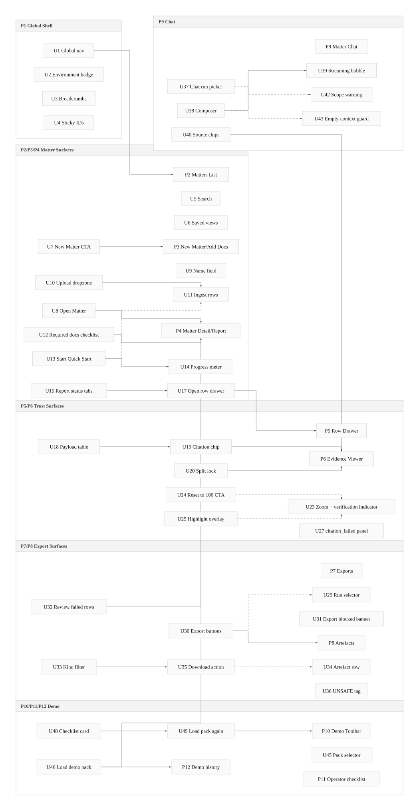
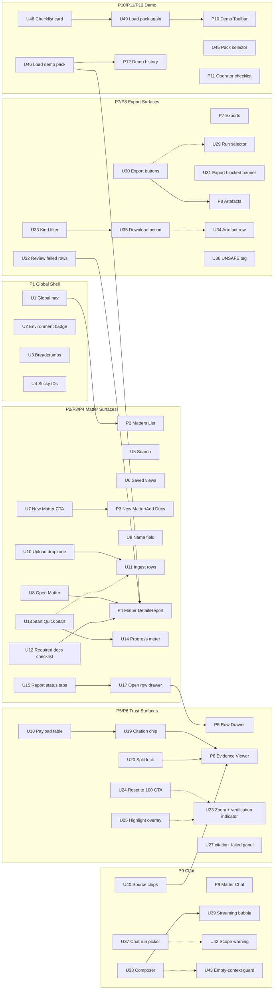

# Orbital End-State User Journeys + Magic Patterns Prompts (V2, UI Breadboard)

This is a second version of `docs/04-refactor/0009_user-journey-v2-parity-audit/user-journeys/orbital-user-journeys-and-magic-patterns-prompts.md`, reshaped using breadboarding and scoped to UI affordances only.

## Context

- Appetite: Strategy shaping pass (no implementation estimate in this document).
- Problem: The v1 prompt pack is strong on product behavior, but it is not organized as a UI affordance topology that can be built and reviewed in thin slices.
- Success: A UI-only breadboard that maps places, interactions, and transitions for the five core Orbital journeys.
- Constraints:
  - Keep trust and failure posture explicit.
  - Preserve the same core journey coverage as v1.
  - Avoid code-level orchestration details.

## Current state

### What exists today

- v1 defines end-state journeys and five high-quality prompt specs.
- The intended shell and tabs are clear (`Matters`, `Runs`, `Alerts`, `Settings`; `Report`, `Documents`, `Chat`, `Artefacts`).
- Failure cases are well enumerated, but not yet normalized into a single UI affordance inventory.

### Current flow (breadboard)

- _P1 Global Shell_
  - User lands in global navigation.
  - User finds or opens a matter.
  - -> _P2 Matters List_
- _P2 Matters List_
  - User searches/filters, creates or opens matter.
  - -> _P3 New Matter / Add Documents_ or _P4 Matter Detail / Report_
- _P4 Matter Detail / Report_
  - User starts Quick Start, reviews rows.
  - Citation jump opens evidence.
  - -> _P5 Row Drawer_ -> _P6 Evidence Viewer_
- _P4 Matter Detail / Report_
  - User navigates to exports, artefacts, and chat.
  - -> _P7 Exports_ / _P8 Artefacts_ / _P9 Chat_
- _P10 Demo Toolbar_
  - Operator loads allowlisted demo pack.
  - -> _P4 Matter Detail / Operator Checklist_

## Proposed solution

### Places

| Place | Name | Purpose |
|---|---|---|
| P1 | Global Shell | Persistent app frame and environment signposting |
| P2 | Matters List | Entry/discovery for matters |
| P3 | New Matter / Add Documents | Setup and ingest readiness |
| P4 | Matter Detail / Report | Primary review and run execution |
| P5 | Row Drawer | Row-level detail and structured payload rendering |
| P6 | Evidence Viewer | Trust moment: citation to page-level evidence |
| P7 | Exports Panel | Generate CSV/Word outputs from completed runs |
| P8 | Artefacts List | Retrieve generated outputs and provenance |
| P9 | Matter Chat | Streaming Q&A with locked source chips |
| P10 | Demo Toolbar | Demo-only fixture controls |
| P11 | Operator Checklist Mode | Guided operator steps inside matter detail |
| P12 | Demo History | Recent demo matters for repeatability |

### Proposed flow (breadboard)

- _P1 Global Shell_
  - Environment badge indicates `demo-dev` or `demo-prod`.
  - Global nav opens matters and run queues.
  - -> _P2 Matters List_
- _P2 Matters List_
  - User filters by saved view.
  - User creates or opens matter.
  - -> _P3 New Matter / Add Documents_ or _P4 Matter Detail / Report_
- _P3 New Matter / Add Documents_
  - User uploads PDFs and watches ingest readiness.
  - Required docs checklist shows gaps before run.
  - -> _P4 Matter Detail / Report_
- _P4 Matter Detail / Report_
  - User starts Quick Start when matter is runnable.
  - Row statuses and local nav drive triage.
  - Row drawer opens with list payload tables.
  - -> _P5 Row Drawer_ -> _P6 Evidence Viewer_
- _P4 Matter Detail / Report_
  - Tab navigation opens exports, artefacts, and chat surfaces.
  - -> _P7 Exports_ / _P8 Artefacts_ / _P9 Matter Chat_
- _P10 Demo Toolbar_
  - Operator selects allowlisted pack and loads a fresh matter.
  - -> _P4 Matter Detail / Operator Checklist_ and _P12 Demo History_

### Elements

- Stable shell and tab topology.
- Run and row triage controls.
- Evidence split view with verification posture.
- Export and artefact lifecycle affordances.
- Chat with source-to-evidence jump.
- Demo repeatability controls separated from practitioner UI.

## UI affordances

| # | Component / place | Affordance | Control | Wires out | Reads |
|---|---|---|---|---|---|
| U1 | P1 Global Shell | Global nav (`Matters`, `Runs`, `Alerts`, `Settings`) | click | Navigate to top-level surfaces | current route |
| U2 | P1 Global Shell | Environment badge (`demo-dev`, `demo-prod`) | render | Signals runtime posture | environment mode |
| U3 | P1 Global Shell | Breadcrumb chain | click | Navigate to parent place | place context |
| U4 | P1 Global Shell | Sticky object identifiers (`matter_id`, `run_id`) | render | Improves wayfinding | selected object |
| U5 | P2 Matters List | Search input | type | Filters matter rows | query text |
| U6 | P2 Matters List | Saved view chips (`Active`, `Needs Attention`, `Demo Packs`) | click | Applies list preset | list facets |
| U7 | P2 Matters List | `New Matter` CTA | click | Opens P3 | create permission |
| U8 | P2 Matters List | `Open` row action | click | Opens P4 for selected matter | row selection |
| U9 | P3 New Matter | Matter name field | type | Enables create flow | form validity |
| U10 | P3 New Matter | Upload dropzone | click/drag | Adds files for ingest | file constraints |
| U11 | P3 New Matter | Per-file ingest row (state, pages, quality) | render | Shows ingest readiness | ingest status |
| U12 | P3 New Matter | Required docs checklist | render | Highlights missing docs | expected docs |
| U13 | P4 Report | `Quick Start: Title + Survey` start button | click | Starts run progress state | matter runnable state |
| U14 | P4 Report | Run progress meter (`questions_done/questions_total`) | render | Shows incremental advancement | run progress |
| U15 | P4 Report | Local nav tabs (`All`, `Needs Review`, `Citation Failed`, `Missing Input`) | click | Filters report rows | row status counts |
| U16 | P4 Report | Row status chip (`needs_review`, `reviewed`, `missing_input`, `citation_failed`) | render | Drives triage cueing | row status |
| U17 | P4 Report | Row action / open drawer | click | Opens P5 | selected question |
| U18 | P5 Row Drawer | Structured list payload table render | render | Displays list-shaped row payloads | row payload |
| U19 | P5 Row Drawer | Citation chip | click | Opens evidence in P6 | citation metadata |
| U20 | P5 + P6 Split | Split-view lock (keep context visible) | click | Pins row + viewer together | split mode |
| U21 | P6 Evidence Viewer | PDF loading skeleton | render | Indicates loading state | document fetch state |
| U22 | P6 Evidence Viewer | Page controls | click/type | Navigate to citation page | page index |
| U23 | P6 Evidence Viewer | Zoom controls + "verified at 100%" indicator | click/render | Enforces verification posture | zoom level |
| U24 | P6 Evidence Viewer | `Reset to 100% to verify` gate CTA | click | Unlocks highlight rendering | zoom mismatch state |
| U25 | P6 Evidence Viewer | Highlight overlay | render | Shows cited snippet location | citation success state |
| U26 | P6 Evidence Viewer | Metadata rail (doc version, status, verification timestamp) | render | Shows trust context | citation + doc metadata |
| U27 | P6 Evidence Viewer | `citation_failed` panel with reason code and checklist | render | Presents honest recovery path | failure reason |
| U28 | P6 Evidence Viewer | `Flag citation wrong` action + confirmation modal | click | Captures reviewer feedback | citation id |
| U29 | P7 Exports | Run selector (`Latest completed run` default) | click | Sets export source run | run list |
| U30 | P7 Exports | Export buttons (3 CSV + 1 DOCX) | click | Starts export jobs | run completion state |
| U31 | P7 Exports | `Export blocked` banner | render | Prevents unsafe export by default | failed citation count |
| U32 | P7 Exports | `Review failed rows` CTA | click | Returns to P4 filtered on failed rows | selected run |
| U33 | P8 Artefacts | Kind filter (`csv`, `docx`, `unsafe`) | click | Refines artefacts list | filter value |
| U34 | P8 Artefacts | Artefact row (filename, kind, created_at, source_run_id) | render | Shows provenance before download | artefact metadata |
| U35 | P8 Artefacts | Download action (safe loading state) | click | Triggers signed URL retrieval + download | URL freshness state |
| U36 | P8 Artefacts | `UNSAFE` tag + tooltip | hover/render | Explains override risk | artefact safety flag |
| U37 | P9 Matter Chat | Run picker in chat header | click | Changes run scope for chat | selected run |
| U38 | P9 Matter Chat | Message composer | type/submit | Sends question to chat stream | input enabled state |
| U39 | P9 Matter Chat | Streaming assistant bubble (`Generating...`) | render | Shows in-progress answer state | stream state |
| U40 | P9 Matter Chat | Source chips under assistant answer | click | Opens P6 for selected source | source references |
| U41 | P9 Matter Chat | Optional "Sources for selected message" side rail | click/render | Maintains source context | message selection |
| U42 | P9 Matter Chat | Run scope mismatch warning | render | Prevents wrong-run interpretation | active run vs asked context |
| U43 | P9 Matter Chat | Disabled input + guidance when no indexed docs | render | Blocks unsupported chat usage | document readiness |
| U44 | P10 Demo Toolbar | `DEMO MODE` persistent bar | render | Separates demo controls from practitioner flow | demo flag |
| U45 | P10 Demo Toolbar | Pack selector (`pack_01_clean`, `pack_02_missing_rea`) | click | Sets fixture pack target | allowlist |
| U46 | P10 Demo Toolbar | `Load demo pack` CTA | click | Creates fresh demo matter and opens P4 | operator action state |
| U47 | P11 Operator Checklist | Fixture-only banner in matter | render | Confirms synthetic context | matter origin |
| U48 | P11 Operator Checklist | Checklist card with step completion and elapsed time | click/render | Guides demo sequence | run + viewer + report states |
| U49 | P11 Operator Checklist | `Load pack again` shortcut | click | Returns to P10 for repeat run | demo mode |
| U50 | Cross-place | Safe error banner with deterministic incident code | render | Standardized failure communication | error state |
| U51 | Cross-place | Retry action pattern | click | Re-attempts the failed UI operation | retryable state |
| U52 | Cross-place | Support escalation action | click | Routes user to operator/support path | support config |

## Wiring diagram (UI-only)

- Legend:
  - **Solid** = navigation / trigger / user action.
  - **Dashed** = UI-state reads and gating.
- Rendered asset (for Markdown viewers without Mermaid support):
  - 
- ASCII fallback:
  - `docs/04-projects/04-refactors/0009_user-journey-v2-parity-audit/user-journeys/orbital-user-journeys-and-magic-patterns-prompts-v2-wiring.txt`



## Parts list (BOM)

| Part | Name | Mechanism | Touch points | Notes |
|---|---|---|---|---|
| F1 | App shell + wayfinding | Normalize global/matter/local navigation layers with sticky IDs and breadcrumbs | P1, P2, P4, P9 | Creates reliable orientation and reduces context loss |
| F2 | Matter setup readiness | Combine upload flow, ingest state rows, and required-doc checklist into one setup path | P3, U9-U12 | Keeps run gating explicit before Quick Start |
| F3 | Run + row triage surface | Add run controls, progress, status tabs, and drawer entry points | P4, U13-U17 | Core reviewer workflow |
| F4 | Trust moment split view | Keep drawer + viewer visible together with zoom verification gate and failure panel | P5, P6, U19-U28 | High-trust affordance cluster |
| F5 | Export gating UX | Run-scoped export controls with blocked banner and route back to failed rows | P7, U29-U32 | Prevents unsafe default exports |
| F6 | Artefact retrieval UX | Provenance-rich list with unsafe labeling and robust download state | P8, U33-U36 | Makes retrieval deterministic and auditable |
| F7 | Chat with source bridge | Run-scoped chat with streaming and source chips that jump to evidence viewer | P9, U37-U43 | Preserves evidence-first posture in chat |
| F8 | Demo operator lane | Separate demo toolbar/checklist/history and force fresh-matter reruns | P10, P11, P12, U44-U49 | Maintains repeatable demo flow without reset/delete |
| F9 | Cross-surface failure language | Reuse safe error banner, retry, and support affordances across flows | U50-U52 | Shared reliability UX contract |

## Fit check: requirements × concept

| Req | Requirement | Status | Fit | Notes |
|---|---|---|---|---|
| R1 | Matter setup to first Quick Start pass | core goal | ✅ | Covered by F2 + F3 |
| R2 | Citation-to-viewer trust moment with honest failures | core goal | ✅ | Covered by F4 |
| R3 | Export + artefact retrieval with blocked unsafe defaults | core goal | ✅ | Covered by F5 + F6 |
| R4 | Matter chat streaming with evidence source jumps | core goal | ✅ | Covered by F7 |
| R5 | Demo operator repeatability with fresh-matter loop | core goal | ✅ | Covered by F8 |
| R6 | Explicit empty/first-run states across surfaces | must-have | ✅ | Covered by U43 + U50 patterns |
| R7 | Concurrency and stale-state visibility | must-have | ⚠️ | UI warnings specified; final conflict policy copy still open |
| R8 | Integrity failure clarity (`hash_mismatch`, `doc_version_drift`, etc.) | must-have | ✅ | Covered by U27 + standardized failure panel |
| R9 | Signed URL refresh-safe downloads | must-have | ✅ | Covered by U35 with freshness state |
| R10 | Accessibility-safe status signaling (not color-only) | must-have | ⚠️ | Pattern called out, but final visual token decisions remain |
| R11 | Environment and permission boundaries visible in UI | must-have | ✅ | Covered by U2 + U44 + global error patterns |
| R12 | No hidden trust leakage in unsupported answers | must-have | ✅ | Chat and missing-input posture preserved |

### Readout

- Passes: 10
- Fails: 0
- Undecided / partial: 2

### Unsolved

- R7: Should stale-state conflicts auto-refresh in place or force user re-entry to preserve audit clarity?
- R10: Which exact status icon + text pairing becomes the single pattern across all tabs?

### Implications

- Product/UX judgement: stale conflict recovery behavior and accessibility token language.
- Technical unknown: none required to complete this UI-only shaping pass.
- Data/behavior unknown: none blocking this v2 UI affordance model.

## Rabbit holes, cuts, and no-gos

### Rabbit holes

- Over-specifying visual design while shaping interaction topology.
- Blending demo-only controls into practitioner navigation.
- Making chat feel unscoped by hiding run context.

### Cuts / scope trims

- No code affordance inventory in this version.
- No pixel-level component specs.
- No backend orchestration details.

### Out of bounds / no-gos

- No trust posture that permits bypassing verification.
- No reset/delete demo flow to rerun packs.
- No unsafe export as default behavior.

## Magic Patterns Prompt Seeds (UI-affordance-first)

### Prompt A: Matter setup + report triage

```text
Design Orbital's setup-to-report journey as a UI affordance topology.

Must include places P2 -> P3 -> P4 and affordances U5-U17.
Show how U13 is gated by U11/U12 and how U15/U16 drive triage.
Include explicit empty states and safe error pattern U50/U51.
```

### Prompt B: Citation trust moment

```text
Design Orbital's trust moment using split context (P5 + P6).

Must include affordances U19-U28.
Require zoom verification posture (U23/U24), highlight behavior (U25), and citation failure panel (U27).
Keep row context visible while viewer is active (U20).
```

### Prompt C: Exports + artefacts

```text
Design Orbital's output lifecycle with P7 and P8.

Must include U29-U36.
Use blocked-by-default export behavior (U31) and route back to failed rows (U32).
Show provenance and safe download feedback in artefact rows.
```

### Prompt D: Matter chat with source bridge

```text
Design the Chat tab in Orbital with evidence-first affordances.

Must include U37-U43 and preserve tab parity with Report/Documents/Artefacts.
Source chips (U40) must open evidence viewer and run scope warnings (U42) must be explicit.
Unsupported context must disable or constrain input honestly (U43).
```

### Prompt E: Demo operator repeatability

```text
Design demo-only operator controls as a separate UI lane.

Must include P10/P11/P12 and U44-U49.
Keep demo controls isolated from practitioner controls and enforce fresh-matter reruns via U49.
Include environment signposting and fixture-only context banner.
```
