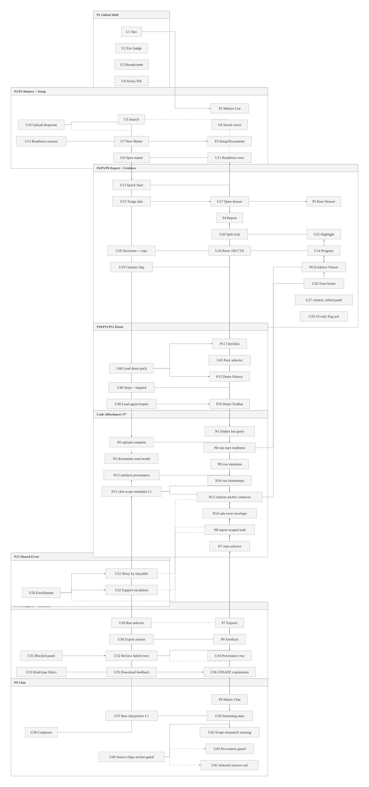

# Orbital End-State User Journeys (V3, Post-0009 Parity)

This is the v3 successor to `orbital-user-journeys-and-magic-patterns-prompts-v2.md`, reworked for the implemented 0009 scope.

## Context

- Appetite: execution-ready journey topology for post-0009 product behavior.
- Problem: v2 represented pre-implementation parity targets; 0009 changed scope and cut-lines in specific areas (setup gating, citation flagging, chat scoping, demo telemetry, and cross-surface errors).
- Success: one current-state journey model that product, design, and engineering can use as a stable parity reference.
- Assumption (explicit per request): all PRDs in `0009_user-journey-v2-parity-audit/prds/` are implemented.
- Scope authority: `prd-overall.md` + `prds/0009a..0009g/prd.md` are canonical; `findings.md` is rationale/history only.

## Current State

### What changed from v2 -> v3

- Shell + matters + setup are now first-class surfaces (search/filter/create/open/upload/readiness reasons).
- Report triage is drawer-first with explicit decision actions and split-view evidence behavior.
- Exports/artefacts are run-scoped and loop back into failed-row triage without dropping context.
- Chat is run-scoped at L1 only (recent completed runs + selected/effective mismatch disclosure).
- Demo loop includes fixture context, checklist progression, and coarse elapsed timing.
- Error handling is standardized via deterministic banner contract (code/trace/retry/support).

### Locked cut-lines retained in v3

- U12 remains cut to readiness reasons/copy only (no pre-run checklist state machine backend).
- U28 remains UI-only acknowledgement flow (no citation flag persistence endpoint).
- U37 remains L1 only (no L2 strict isolation UX or L3 compare/merge).
- U40 remains strict anchor-only clickability; unresolved anchors are explicitly non-clickable.
- U48 remains coarse minute-level elapsed timing only.

## Proposed Solution

### Places

| Place | Name | Purpose |
|---|---|---|
| P1 | Global Shell | Persistent frame: nav, environment posture, breadcrumb, sticky identifiers |
| P2 | Matters List | Discover/filter/open/create matters and access demo history |
| P3 | Matter Setup / Documents | Upload + readiness workflow from ingest to run-ready |
| P4 | Matter Detail / Report | Run execution, triage tabs, row-level review loop |
| P5 | Row Drawer | Primary decision surface (`mark reviewed`, `flag issue`, copy answer) |
| P6 | Evidence Viewer | Citation trust surface with verification, metadata, failure recovery |
| P7 | Exports Panel | Run-scoped exports + blocked-state recovery loop |
| P8 | Artefacts List | Filtered output retrieval with provenance/safety context |
| P9 | Matter Chat | L1 run-scoped chat with source-to-evidence bridge |
| P10 | Demo Toolbar | Demo-only pack controls and load/reload actions |
| P11 | Operator Checklist | Guided demo walkthrough status + elapsed time |
| P12 | Demo History | Recent demo matters with reopen affordance |
| P13 | Cross-Surface Error Layer | Shared deterministic error/retry/support contract |

### Flow (breadboard)

- _P1 Global Shell_
  - User sees explicit environment posture and stable wayfinding.
  - -> _P2 Matters List_
- _P2 Matters List_
  - User searches, filters, creates, opens, or reopens demo matter.
  - -> _P3 Matter Setup / Documents_ or _P4 Matter Detail / Report_
- _P3 Matter Setup / Documents_
  - User uploads docs, tracks parse/OCR/readiness, then transitions to run/review.
  - -> _P4 Matter Detail / Report_
- _P4 Matter Detail / Report_
  - User starts run, triages rows by status tab, opens drawer, records decision.
  - Citation verification loops through viewer with split context.
  - -> _P5 Row Drawer_ -> _P6 Evidence Viewer_
- _P4 Matter Detail / Report_
  - User navigates to exports, artefacts, and chat.
  - -> _P7 Exports_ / _P8 Artefacts_ / _P9 Matter Chat_
- _P7 Exports_
  - If blocked, user deep-links back to failed rows for the same run.
  - -> _P4 Matter Detail / Report (failed filter + run scope)_
- _P9 Matter Chat_
  - User picks a recent completed run, sees selected/effective mismatch when applicable.
  - Source chips jump to evidence only when anchor-ready.
  - -> _P6 Evidence Viewer_
- _P10 Demo Toolbar_
  - Operator loads/reloads allowlisted pack and runs guided checklist.
  - -> _P11 Operator Checklist_ + _P12 Demo History_
- _P13 Cross-Surface Error Layer_
  - Deterministic code + retry + support escalation pattern is reusable across every place.

## UI Affordances

| # | Component / place | Affordance | Control | Wires out | Reads |
|---|---|---|---|---|---|
| U1 | P1 Global Shell | Global nav (`Matters` active; `Runs`/`Alerts`/`Settings` placeholder-disabled) | click | Route navigation | route + feature readiness |
| U2 | P1 Global Shell | Environment badge (`demo-dev`/`demo-prod`) | render | Runtime posture signal | demo mode + environment |
| U3 | P1 Global Shell | Breadcrumb chain | click | Parent/place navigation | location context |
| U4 | P1 Global Shell | Sticky object identifiers (`matter_id`, `run_id`) | render | Persistent wayfinding | selected entities |
| U5 | P2 Matters List | Search input (`q`) | type | List filter query | query text |
| U6 | P2 Matters List | Saved-view chips (`Active`, `Needs Attention`, `Demo Packs`) | click | Applies list preset | list facets |
| U7 | P2 Matters List | `New Matter` CTA | click | Opens matter creation | permission + form state |
| U8 | P2 Matters List | Row `Open` action | click | Opens matter detail | selected matter |
| U9 | P3 Setup/Documents | Required matter name input | type | Enables create flow | form validity |
| U10 | P3 Setup/Documents | Upload dropzone + file picker | drag/click | Upload-init and upload-complete flow | capability envelope |
| U11 | P3 Setup/Documents | Document readiness rows (parse/OCR/page/error) | render | Shows ingest progression | document status model |
| U12 | P3 + P4 | Readiness reasons and next-action copy (`ready`/`blocked`/`already complete`) | render | Guides run/review handoff | folder/run readiness |
| U13 | P4 Report | `Quick Start: Title + Survey` start action | click | Starts run | readiness gate |
| U14 | P4 Report | Run progress meter (`questions_done/questions_total`) | render | Progress visibility | run progress |
| U15 | P4 Report | Triage tabs (`All`, `Needs Review`, `Reviewed`, `Flagged`) | click | Filters row set | status counts |
| U16 | P4 Report | Row status chips | render | Triage cueing | row status |
| U17 | P4 -> P5 | Open row drawer action | click | Opens decision surface | selected row |
| U18 | P5 Row Drawer | Structured payload + decision actions (`mark reviewed`, `flag issue`, `copy extracted answer`) | click/render | Row mutation and copy workflow | row payload + metadata |
| U19 | P5 Row Drawer | Citation chip | click | Opens viewer target | citation metadata |
| U20 | P5 + P6 | Split-view lock | click | Pins drawer + viewer context | split mode |
| U21 | P6 Evidence Viewer | PDF loading skeleton | render | Loading clarity | fetch state |
| U22 | P6 Evidence Viewer | Page controls | click/type | Page navigation | page index |
| U23 | P6 Evidence Viewer | Zoom controls + explicit verification indicator | click/render | Verification posture | zoom level |
| U24 | P6 Evidence Viewer | `Reset to 100% to verify` action | click | Restores verifiable view | zoom mismatch |
| U25 | P6 Evidence Viewer | Highlight overlay | render | Citation snippet location | anchor resolution |
| U26 | P6 Evidence Viewer | Trust rail/footer (`doc_version`, `verified_at`, `loaded_state`) | render | Auditable trust context | citation/doc metadata |
| U27 | P6 Evidence Viewer | `citation_failed` panel with recovery checklist | render | Honest recovery path | failure code |
| U28 | P6 Evidence Viewer | `Flag citation wrong` action with UI-only acknowledgement | click | Shows confirmation feedback | citation id |
| U29 | P7 Exports | Run selector (completed runs only, latest default) | click | Sets export/report scope | runs list |
| U30 | P7 Exports | Export buttons (3 CSV + 1 DOCX) | click | Starts export jobs | run completion + safety gate |
| U31 | P7 Exports | Standard blocked-export panel | render | Fail-closed guidance | failed citation count |
| U32 | P7 -> P4 | `Review failed rows` deep-link (`run_id` + failed filter) | click | Opens scoped report triage | selected run |
| U33 | P8 Artefacts | Filters (`csv`, `docx`, `unsafe`) | click | Refines artefact list | kind/type filter |
| U34 | P8 Artefacts | Artefact row with provenance (`source_run_id`) | render | Audit-friendly retrieval | artefact metadata |
| U35 | P8 Artefacts | Download action with loading/freshness feedback | click | Signed URL retrieval + download | URL freshness |
| U36 | P8 Artefacts | `UNSAFE` label with explanation tooltip/panel | hover/focus | Explains risk and recovery path | safety flag |
| U37 | P9 Chat | Run chip + recent completed run picker (L1) | click | Sends selected `run_id` context | runs list |
| U38 | P9 Chat | Composer | type/submit | Sends chat request | input state |
| U39 | P9 Chat | Streaming assistant state | render | In-progress clarity | stream state |
| U40 | P9 Chat | Source chips strict anchor gating (clickable only when anchor-ready) | click/render | Jumps to evidence or shows disabled reason | anchor state |
| U41 | P9 Chat | Selected-message sources rail | click/render | Displays active message provenance | selected message |
| U42 | P9 Chat | Scope mismatch warning (`selected` vs `effective` run) | render | Trust-preserving disclosure | scope metadata |
| U43 | P9 Chat | Disabled input + setup guidance when no indexed context | render | Prevents dead-end interaction | index readiness |
| U44 | P10 Demo Toolbar | Persistent `DEMO MODE` bar | render | Distinguishes demo lane | demo flag |
| U45 | P10 Demo Toolbar | Allowlisted pack selector | click | Chooses demo fixture | pack allowlist |
| U46 | P10 Demo Toolbar | `Load demo pack` action | click | Creates/opens fresh demo matter | operator action state |
| U47 | P11 Checklist | Fixture context banner (pack + status + next step) | render | Clarifies operator context | active pack + run state |
| U48 | P11 Checklist | Checklist card with `todo/in_progress/done` + minute-level elapsed | render | Guides demo execution | run timestamps |
| U49 | P10/P12 Demo | `Load pack again` + demo-history reopen shortcuts | click | Fast repeat demo loop | selected/recent pack |
| U50 | P13 Cross-surface | Deterministic `ErrorBanner` (`code`, `trace_id`, safe message) | render | Standardized failure communication | safe error envelope |
| U51 | P13 Cross-surface | Retry CTA gated by `retryable` semantics | click | Idempotent retry | retryability flag |
| U52 | P13 Cross-surface | Support escalation action (`Need help?`) with safe context | click | Configured mailto escalation or fallback guidance | support config |

## Code Affordances (Grounded Contract Inventory)

| # | Component / service | Affordance | Control | Wires out |
|---|---|---|---|---|
| N1 | `GET /api/folders` | Search/view list contract (`q`, `state`, `view`, paging) | read | Matters list filtering + demo history support |
| N2 | `POST /api/folders` | Create matter with explicit name validation | write | Matter creation entrypoint |
| N3 | `GET /api/folders/:id/documents` | Documents readiness read model | read | Setup/documents status rendering |
| N4 | `POST /api/folders/:id/documents` | Upload-init capability envelope | write | Signed upload target + queued doc row |
| N5 | `PUT /api/documents/:id/upload` + `POST /api/documents/:id/complete` | Upload completion + ingest trigger | write | Deterministic ingest transitions |
| N6 | `POST /api/folders/:id/runs` | Run-start readiness contract (no checklist state machine) | write | Quick Start start/blocked behavior |
| N7 | `GET /api/folders/:id/runs` | Run selector model (completed runs + timestamps) | read | Export/chat selectors + demo elapsed baseline |
| N8 | `GET /api/folders/:id/report` | Report read model (`run_id`, status filter/deep-link continuity) | read | Report triage + failed-row return loop |
| N9 | `PATCH /api/report-rows/:id` | Row decision mutations (`mark_reviewed`, `flag_issue`, optional note) | write | Drawer action outcomes |
| N10 | Citation flag flow | UI-only acknowledgement path (no persistence endpoint in v3 scope) | render | `Thanks, we'll investigate` confirmation |
| N11 | `POST /api/folders/:id/chat` | L1 run-scoped chat metadata (`selected_run_id`, `effective_run_id`, `scope_mismatch`, `scope_reason`) | write/read | Scoped chat with mismatch disclosure |
| N12 | Citation/source contracts (`/api/citations/:id`, viewer render endpoints) | Strict anchor-ready evidence jump model | read | Report/chat source chips -> evidence viewer |
| N13 | `GET /api/folders/:id/artefacts` | Filter/provenance/freshness model (`kind`, `type`, `source_run_id`) | read | Artefact filtering and retrieval |
| N14 | Shared safe-error contract + support config | Deterministic error envelope + escalation target | read/call | ErrorBanner + retry/support behavior |
| N15 | Report/citation payload trust metadata fields | Trust footer/rail values (`doc_version`, `verified_at`, `loaded_state`) | read | Evidence trust context |
| N16 | `GET /api/runs/:id` | Demo checklist telemetry (`created_at`/`started_at`/`updated_at`) | read | Coarse elapsed timing and step derivation |

## Wiring Diagram (V3)

- Legend:
  - **Solid** = trigger/call/navigation/write.
  - **Dashed** = read/gating/state dependency.
- Rendered asset:
  - 
- ASCII fallback:
  - `docs/04-projects/04-refactors/0009_user-journey-v2-parity-audit/user-journeys/orbital-user-journeys-v3-wiring.txt`

```mermaid
flowchart LR
  subgraph SHELL[P1 Global Shell]
    U1[U1 Nav]
    U2[U2 Env badge]
    U3[U3 Breadcrumb]
    U4[U4 Sticky IDs]
  end

  subgraph MATTERS[P2/P3 Matters + Setup]
    P2[P2 Matters List]
    U5[U5 Search]
    U6[U6 Saved views]
    U7[U7 New Matter]
    U8[U8 Open matter]
    P3[P3 Setup/Documents]
    U10[U10 Upload dropzone]
    U11[U11 Readiness rows]
    U12[U12 Readiness reasons]
  end

  subgraph REPORT[P4/P5/P6 Report + Evidence]
    P4[P4 Report]
    U13[U13 Quick Start]
    U14[U14 Progress]
    U15[U15 Triage tabs]
    U17[U17 Open drawer]
    P5[P5 Row Drawer]
    U18[U18 Decisions + copy]
    U19[U19 Citation chip]
    U20[U20 Split lock]
    P6[P6 Evidence Viewer]
    U24[U24 Reset 100 CTA]
    U25[U25 Highlight]
    U26[U26 Trust footer]
    U27[U27 citation_failed panel]
    U28[U28 UI-only flag ack]
  end

  subgraph OUTPUTS[P7/P8 Exports + Artefacts]
    P7[P7 Exports]
    U29[U29 Run selector]
    U30[U30 Export actions]
    U31[U31 Blocked panel]
    U32[U32 Review failed rows]
    P8[P8 Artefacts]
    U33[U33 Kind/type filters]
    U34[U34 Provenance row]
    U35[U35 Download feedback]
    U36[U36 UNSAFE explanation]
  end

  subgraph CHAT[P9 Chat]
    P9[P9 Matter Chat]
    U37[U37 Run chip/picker L1]
    U38[U38 Composer]
    U39[U39 Streaming state]
    U40[U40 Source chips anchor-gated]
    U41[U41 Selected sources rail]
    U42[U42 Scope mismatch warning]
    U43[U43 No-context guard]
  end

  subgraph DEMO[P10/P11/P12 Demo]
    P10[P10 Demo Toolbar]
    U45[U45 Pack selector]
    U46[U46 Load demo pack]
    P11[P11 Checklist]
    U48[U48 Steps + elapsed]
    U49[U49 Load again/reopen]
    P12[P12 Demo History]
  end

  subgraph ERRORS[P13 Shared Error]
    U50[U50 ErrorBanner]
    U51[U51 Retry by retryable]
    U52[U52 Support escalation]
  end

  subgraph API[Code Affordances N*]
    N1[N1 folders list query]
    N3[N3 documents read model]
    N5[N5 upload complete]
    N6[N6 run start readiness]
    N7[N7 runs selector]
    N8[N8 report scoped read]
    N9[N9 row mutation]
    N11[N11 chat scope metadata L1]
    N12[N12 citation anchor contracts]
    N13[N13 artefacts provenance]
    N14[N14 safe error envelope]
    N16[N16 run timestamps]
  end

  U1 --> P2
  U7 --> P3
  U8 --> P4
  U10 --> N5
  N5 --> U11
  U12 --> U13
  U13 --> N6
  N6 --> U14
  U15 --> U17
  U17 --> P5
  U18 --> N9
  U19 --> N12
  N12 --> P6
  U20 --> P6
  U24 --> U25
  U30 --> N8
  U31 --> U32
  U32 --> P4
  U33 --> N13
  N13 --> U34
  U35 --> U36
  U37 --> N7
  U38 --> N11
  N11 --> U39
  N11 --> U42
  U40 --> N12
  U46 --> P11
  U46 --> P12
  U49 --> P10
  U48 --> N16
  U50 --> U51
  U50 --> U52

  U5 -.-> N1
  U10 -.-> N3
  U29 -.-> N7
  U32 -.-> N8
  U40 -.-> U43
  U40 -.-> U41
  U50 -.-> N14
  U51 -.-> N14
  U52 -.-> N14
```

## Parts List (BOM)

| Part | Name | Mechanism | Touch points | Notes |
|---|---|---|---|---|
| F1 | Shell wayfinding baseline | Global nav + env badge + breadcrumbs + sticky IDs | P1, U1-U4 | Keeps orientation deterministic while non-shipped tabs remain visible placeholders |
| F2 | Matter discovery + setup lane | Search/filter/create/open + upload/readiness loop | P2, P3, U5-U12, N1-N5 | Consolidates entry + ingest flow without adding checklist state machine backend |
| F3 | Run readiness + triage core | Reasoned Quick Start + triage tabs + status model | P4, U13-U17, N6, N8 | Minimizes ambiguity before row-level review |
| F4 | Drawer-first review decisions | Structured payload + mutation actions + copy affordance | P5, U18, N9 | Moves review completion into one surface |
| F5 | Trust viewer loop | Split-view, verification controls, trust footer, failure recovery | P6, U19-U28, N12, N15 | Preserves strict evidence-first behavior; citation flag remains UI-only ack |
| F6 | Run-scoped export loop | Completed-run selector + blocked panel + failed-row deep-link | P7, U29-U32, N7, N8 | Keeps export/report context continuity |
| F7 | Artefact provenance retrieval | Kind/type filters + provenance + safety explanation | P8, U33-U36, N13 | Retrieval becomes auditable and less error-prone |
| F8 | L1 run-scoped chat | Run chip/picker + mismatch disclosure + anchor-gated source jumps | P9, U37-U43, N11, N12 | Explicitly excludes L2/L3 compare/isolation expansions |
| F9 | Demo operator loop | Pack load/reload + checklist + history reopen with coarse elapsed | P10-P12, U44-U49, N16 | Supports deterministic repeat demos without destructive reset workflows |
| F10 | Cross-surface failure language | Shared deterministic ErrorBanner + retry/support semantics | P13, U50-U52, N14 | Unifies fail-loud but safe UX across all lanes |

## Fit Check: Requirements x Concept

| Req | Requirement | Status | Fit | Notes |
|---|---|---|---|---|
| R1 | Shell/navigation parity baseline is explicit and persistent | core goal | ✅ | F1 covers nav/breadcrumb/sticky identifiers |
| R2 | Matter setup through run-ready flow is clear and actionable | core goal | ✅ | F2 + F3 cover upload/readiness/reasoned start |
| R3 | Report triage + evidence validation loop is end-to-end | core goal | ✅ | F3 + F4 + F5 |
| R4 | Export/artefact flows are run-scoped and provenance-safe | core goal | ✅ | F6 + F7 |
| R5 | Chat supports L1 scoping with explicit mismatch disclosure | core goal | ✅ | F8 with explicit L1 boundary |
| R6 | Demo loop is repeatable with checklist and coarse elapsed | core goal | ✅ | F9 |
| R7 | Cross-surface errors are deterministic and actionable | must-have | ✅ | F10 |
| R8 | Trust posture avoids hidden or implicit verification leaps | must-have | ✅ | F5 strict anchor/verification gating |
| R9 | Scope cuts from 0009 are preserved | must-have | ✅ | U12/U28/U37/U40/U48 cut-lines retained |
| R10 | No backend-heavy expansion beyond 0009 boundaries | must-have | ✅ | L2/L3 chat, persistence-heavy citation workflows remain out |

### Readout

- Passes: 10
- Fails: 0
- Undecided / partial: 0

### Unsolved

- None blocking at the journey-model level under the declared assumption that `0009a..0009g` are implemented.

## Rabbit Holes, Cuts, and No-Gos

### Rabbit holes

- Re-expanding chat scope to L2/L3 compare semantics inside parity v3.
- Turning UI-only citation acknowledgement into backend lifecycle design in this document.
- Re-introducing visual-spec details that belong in design-system implementation, not journey topology.

### Cuts / scope trims

- Keep U12 at readiness reasoning/copy; do not model checklist backend orchestration.
- Keep U28 acknowledgement-only; no persistence workflow in v3 journey model.
- Keep U48 elapsed timing coarse (minute-level) and telemetry-light.

### Out of bounds / no-gos

- No hidden fallback behavior without explicit mismatch disclosure in chat scope.
- No fuzzy/page-only source jump semantics presented as equal to anchor-ready evidence jumps.
- No unsafe export as default path.

## Sources

- `docs/04-projects/04-refactors/0009_user-journey-v2-parity-audit/prd-overall.md`
- `docs/04-projects/04-refactors/0009_user-journey-v2-parity-audit/prds/0009a_shell-matters-setup/prd.md`
- `docs/04-projects/04-refactors/0009_user-journey-v2-parity-audit/prds/0009b_report-triage-and-evidence/prd.md`
- `docs/04-projects/04-refactors/0009_user-journey-v2-parity-audit/prds/0009c_exports-and-artefacts/prd.md`
- `docs/04-projects/04-refactors/0009_user-journey-v2-parity-audit/prds/0009d_chat-run-scoping/prd.md`
- `docs/04-projects/04-refactors/0009_user-journey-v2-parity-audit/prds/0009e_demo-operator-loop/prd.md`
- `docs/04-projects/04-refactors/0009_user-journey-v2-parity-audit/prds/0009f_error-and-support-patterns/prd.md`
- `docs/04-projects/04-refactors/0009_user-journey-v2-parity-audit/prds/0009g_ui-polish-sweep/prd.md`
- `docs/04-projects/04-refactors/0009_user-journey-v2-parity-audit/findings.md`
- `apps/web/app/(api)/folders/[id]/runs/route.ts`
- `apps/web/app/(api)/folders/[id]/report/route.ts`
- `apps/web/app/(api)/folders/[id]/chat/route.ts`
- `apps/web/app/(api)/folders/[id]/documents/route.ts`
- `apps/web/app/(api)/folders/[id]/artefacts/route.ts`
- `apps/web/app/(api)/documents/[id]/upload/route.ts`
- `apps/web/app/(api)/documents/[id]/complete/route.ts`
- `apps/web/app/(api)/citations/[id]/route.ts`
- `apps/web/app/(api)/runs/[id]/route.ts`
- `apps/web/app/(api)/demo/load-pack/route.ts`
- `apps/web/app/ui/ErrorBanner.tsx`
