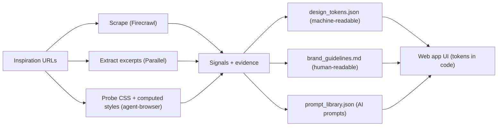

# Brand DNA To Web App Design Language (2026-02-06)

Context: Turned a set of inspiration sites into a composite “design language” that can be implemented in a web app via design tokens.

Source folder:
- `docs/02-guidelines/inspiration/brand-dna-2026-02-06/`

## Mental model (simple)

- `brand_guidelines.md` is the constitution: what we are trying to feel like and why.
- `design_tokens.json` is the parts catalog: colours/type/spacing/radius/motion you can implement.
- `prompt_library.json` is the recipe book: prompts for generating new UI/copy that stays consistent.
- Hidden folders (`.firecrawl`, `.parallel`, `.probe`) are the receipts: evidence that explains where claims came from.

## Diagram (pipeline)

## Implementation posture for web apps

Web app != marketing site:
- Fewer “wow” interactions.
- More clarity, speed, and consistency.
- Motion is mostly transitions and state changes, not animations.

## Common failure modes

- Using too many accents at once (orange + cyan + purple on the same screen).
- Treating tokens as pixel-perfect truth (they’re a “seed”, not a full design system).
- Letting focus rings drift (inconsistent keyboard experience).
- Ignoring theme posture (some sources are dark-first, others light-first).

## Practical next step

Use `docs/02-guidelines/inspiration/brand-dna-2026-02-06/web-app-design-language.md` as the app-facing interpretation, and implement `design_tokens.json` (`composite_tokens`) as CSS variables or a Tailwind theme.

