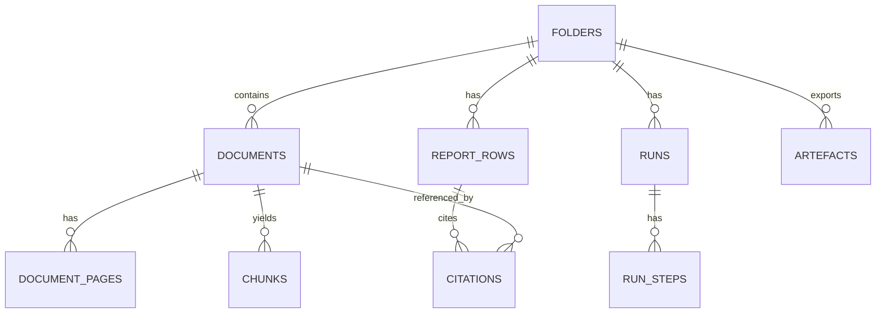

# PROMPT
You are reviewing the attached architecture docs for an "Orbital Copilot" proof-of-concept (PoC) focused on US commercial real estate (CRE) due diligence.

Goal: make the docs internally consistent, DRY, and execution-ready as a shared source of truth for engineers and product.

Constraints:
- PoC-sized but production-minded; avoid overengineering.
- Do not invent code that does not exist; base your suggestions on the docs and the repo conventions provided.
- Prefer explicit contracts + invariants (state transitions, citation locking rules, error envelopes).
- Prefer minimal edits that remove ambiguity and reduce drift.

What to produce:
1) Findings ordered by severity (P0..P3). Each finding must include: file path + line numbers + why it matters.
2) Concrete suggested edits as unified diffs for the markdown files (or clearly delimited replacement sections).
3) Seed ADRs:
   - Provide a minimal ADR format for `docs/03-architecture/decisions.md`.
   - Add initial ADR entries for decisions already implied in the docs (evidence-first, fail-closed verification, OCR-all default, hybrid retrieval, deterministic-ish orchestration via steps, fixture-driven evals, etc).
4) DRY consolidation plan:
   - Identify duplicated content across docs/03-architecture.
   - Recommend which doc becomes canonical for each topic and how others should link to it.

Specific things to address (if applicable):
- Repo hygiene: `docs/03-architecture/.DS_Store` should not be committed; propose deleting it and updating `.gitignore` accordingly.
- `docs/03-architecture/decisions.md` is empty but referenced by docs; fix this.
- Clarify what "Workflow DevKit (WDK)" is and what the "use workflow" convention means in practice.
- Tighten state machine definitions and transitions (folder/document/run/report row) with clear invariants.
- Data model: ensure provenance is sufficient for debugging and replay (e.g. whether citations should store `chunk_id`).
- API surface: add minimal request/response examples and an error envelope contract for the riskiest endpoints.
- Observability/evals: add minimal baseline metrics/thresholds and how they’re used (report-only vs gating).

Return only the review + patches. No marketing copy.

# FILES

----- BEGIN FILE: AGENTS.md -----
# AGENTS.md

## Tooling
- Package manager: pnpm (workspaces)
- Prefer TypeScript for new code unless the repo already uses something else

## Principles
We follow core ideas from *The Pragmatic Programmer* (Andy Hunt, Dave Thomas):

- **Take ownership.** If something’s broken/unclear/risky or “not your job”, act anyway: flag it, fix it, or shape a better path.
- **Keep learning.** Maintain a “knowledge portfolio”. Store learnings in `docs/LEARNINGS.md`.
- **Avoid duplication (DRY).** Duplicate knowledge is as bad as duplicate code. Keep one source of truth and reuse it.
- **Build orthogonally.** Reduce coupling, keep dependencies explicit, and interfaces small.
- **Use tight feedback loops.** Small steps, fast validation. Use tracer bullets (thin end-to-end slices). One concern per commit/PR. Prefer the simplest thing that meets the requirement.
- **Prototype to learn, then bin it (when needed).** Don’t let prototypes silently become production.
- **Make behaviour explicit.** Clear contracts, assert assumptions, fail loudly when they break.
- **Automate boring/error-prone work.** Builds, tests, formatting, releases, setup, checks. If you do it twice, consider scripting it.
- **Keep code easy to change.** Refactor continuously, rename aggressively, optimise for readability.
- **Debug systematically.** Reproduce, isolate, change one thing at a time. Use tools properly.
- **Fix broken windows.** Small messes spread — tidy early.
- **Communicate trade-offs.** Requirements/estimates are conversations. Explain options, risks, and costs plainly.

Vibe: be practical, stay curious, optimise for long-term leverage over short-term heroics.

## Error handling + safety (high level)
- Validate external inputs at boundaries (Zod) and return safe user-facing errors
- Don’t leak internal errors/details to clients
- Unexpected issues: fail loudly (log/throw). Only show user-facing errors when needed

## Compatibility
- Backwards compatibility usually not required

## Agent files
- `AGENTS.md`: Repo‑wide engineering standards, tooling, and verification rules.
- `apps/web/AGENTS.md`: Stack and guardrails for the Next.js web app.
- `docs/AGENTS.md`: Structure and rules for the docs/knowledge hub.
- `docs/02-guidelines/AGENTS.md`: Brand, tone, and  accessibility guidance sources.
- `docs/03-architecture/AGENTS.md`: Architecture boundaries and security posture rules.
- `docs/04-projects/AGENTS.md`: Dossier conventions and delivery workflow for project work.
- `docs/06-release/AGENTS.md`: Release process and changelog/postmortem expectations

## File management
- Store shareable one-off artefacts (e.g. oracle bundles, exports) in `docs/97-throwaway/` (synced to GitHub)
- Store local-only one-off files in root `throwaway/` (not synced to GitHub)
- Store tmp files in root `tmp/` folder (synced to GitHub)

## Core skills to use
- `ask-questions-if-underspecified` skill when unclear
- `oracle` skill for deep research
- `verify` skill for checking code changes

## Canonical instructions + local agent setup
- Canonical skills/commands/hooks live in `marchatton/agent-skills` — fix missing/wrong skills there NOT in this repo
- `.agents/` contains all skills etc in this repo (e.g. `codex`). For other tools, use `iannuttall/dotagents` to symlink `.agents` into tool-specific locations
- `AGENTS.md` is the source of truth; other agent files should be symlinks (don’t fork instructions per tool)

----- END FILE: AGENTS.md -----

----- BEGIN FILE: docs/AGENTS.md -----
# Docs hub

## Purpose
Single place for workflow artefacts + docs outputs.

## Folder structure
- We follow a PARA-inspired technique for knowledge management. Under /docs we have:
  - Projects:
    - `04-projects/`: lanes include experiments-prototypes, features, fixes, refactors and migrations
  - Areas: 
    - `00-strategy/`:  up-to-date product-strategy, roadmap and large initiatives
    - `03-architecture/`: up-to-date system and data architecture 
    - `05-reviews-audits/`: periodic reviews, audits, and systems compliance 
    - `06-release/`: global `CHANGELOG.md` and postmortems etc
    - `97-throwaway/`: shareable one-off artefacts (oracle bundles, exports). Synced to GitHub
    - `98-tmp/`: scratch space (should be moved or deleted). Synced to GitHub
  - Resources:
    - `01-insights/`: reports, summaries and raw transcripts covering customers, competitors, capabilities (internal) and tech-market trends.
    - `08-example-data/` contains worked examples with synthetic yet realistic data.
    - `02-guidelines/`: brand-tone (storytelling and visual) incl inspiration.
  - Archive: 
    - `99-archive/` mirrors the live structure for closed work + old context

## Guidelines
- Keep docs append-only where that’s the existing convention (e.g. `CHANGELOG.md`, `LEARNINGS.md`).
- Knowledge management for projects (`04-projects/`): 
  - Inside a lane (e.g. `docs/04-projects/02-features/`), create a dossier folder. e.g. `docs/04-projects/02-features/0007_bulk-invite-members/`
  - Folder name is: 0001_<slug>/
    - `0001` is lane-local (features count separately from fixes, etc)
    - `<slug>` is kebab-case
    - Every work item has a slug for easy `@slug` tagging in PRDs and discussions.
  - All change types require **both** `prd.md` and `prd.json` (even if tiny).
  - Reviews for a project live inside its dossier (e.g. `reviews/`).

## Archiving rule
- Completed work and old context is manually moved into `docs/99-archive/` which mirrors the live structure.

## Cross-cutting concerns
- Log ADRs by appending to `03-architecture/decisions.md`.
- Synthesis: use `compound` to consolidate learnings.

----- END FILE: docs/AGENTS.md -----

----- BEGIN FILE: apps/web/AGENTS.md -----
# Web app (apps/web)
Next.js App Router web application.

## Stack
- Next.js App Router + TypeScript
- Tailwind + shadcn/ui + Radix (icons: `lucide-react`)
- Forms: React Hook Form + Zod
- Tests: Vitest + Testing Library (MSW for mocks)

## Guardrails (high leverage)
- Server-first: fetch on the server (RSC / route handlers / server actions). Avoid client-side data fetching effects.
- Treat `useEffect` as an escape hatch (imperative interop only) — not for data fetching, derived state, prop→state, or URL sync.
- Never import server-only into client components (use `server-only` / `client-only` boundaries).
- Validate external inputs with Zod and map errors to safe user-facing messages.
- AI SDK flows: use Workflow DevKit (`workflow`) and add `"use workflow"` in async TS fns for durability, reliability, observability.

## Frontend skills
- `frontend-design`: build distinctive UI.
- `web-design-guidelines`: audit UI against web interface guidelines.
- `baseline-ui`: enforce UI baseline; prevent design slop.
- `fixing-accessibility`: a11y fixes and audits.
- `fixing-metadata`: SEO/social metadata fixes.
- `fixing-motion-performance`: animation perf fixes.
- `react-best-practices`: React/Next.js performance best practices.
- `composition-patterns`: React composition patterns for scalable component APIs.
- `test-browser`: browser smoke for changed UI paths.
- `rams`: backup UI critique via the `rams` skill (prefer ui-skills first).

----- END FILE: apps/web/AGENTS.md -----

----- BEGIN FILE: .gitignore -----
# Onboarding defaults
/node_modules/
/throwaway/
/.agents/skills/00-product-sense/

----- END FILE: .gitignore -----

----- BEGIN FILE: docs/03-architecture/AGENTS.md -----
# Architecture

## Purpose
- Boundary rules + security posture. Keep stable.

## Web app patterns (search; don’t assume exact paths)
- Public vs protected routes (often enforced via middleware)
- API split: auth-only routes, versioned routes, webhook routes
- Frontend-only vs backend-only separation (names vary)

## Boundaries (non-negotiable)
- Client-only must not import server-only (and vice versa).
- Validate at boundaries with Zod.
- Never leak internal errors/details to clients.

## Middleware / API security shape (typical)
- Pipeline is usually: rateLimit → cors → sanitise → auth → logging (confirm actual order in code).
- Webhooks: verify signatures before parsing/acting.
- Public endpoints: rate limit + strict validation.

## Docs + decisions
- Artefacts live under `docs/03-architecture/`.
- ADRs: Append to `docs/03-architecture/decisions.md` when you introduce a new cross-cutting pattern (dependency class, boundary rule, auth/security posture). Keep it short and link the PR.

----- END FILE: docs/03-architecture/AGENTS.md -----

----- BEGIN FILE: docs/03-architecture/00_overview.md -----
# Orbital Copilot PoC Architecture
US CRE Title + Survey Quick Start (evidence-first, artefact-first)

## Purpose
Define a production-minded (but PoC-sized) architecture for a law-firm workflow that ingests a US CRE diligence pack and produces defensible artefacts with clause-level evidence.

Optimised for:
- Title commitment (Schedule A / B-I / B-II)
- Exception instruments (easements, REAs, CC&Rs, mortgages, plats)
- ALTA/NSPS survey (draft or final)
- Trust UX: click citation → see highlighted evidence in the PDF

## Product scope (what we will build)
A matter workspace that supports:
1) Upload + ingest a doc pack (PDF-first)
2) Run “Quick Start: Title + Survey”
3) Generate 3 artefacts (as report tables first, export later):
   - Schedule B-I Requirements tracker
   - Schedule B-II Exceptions table (linked to underlying instruments)
   - Survey reconciliation issues list (title ↔ survey)

Every material claim must have citations or “Not found in provided documents.”

## Non-goals (explicit)
- No legal advice / materiality decisions / negotiation posture
- No external web research inside the PoC run
- No integrations (iManage/NetDocs/SharePoint)
- No multi-tenant admin, SSO/RBAC, billing
- No property visualiser / boundary plotting (stretch only)

## Key architectural decisions (PoC defaults)
- Evidence-first with citation locking: citations are IDs, not free text
- Fail-closed verification: citation mismatch → row is `citation_failed`
- Artefacts-first UX: report table is the centre of gravity
- OCR/layout for all PDFs (PoC default): consistent geometry for highlights
- Hybrid retrieval (RAG): lexical + vector search, rerank, then draft from evidence
- Deterministic-ish orchestration: explicit step machine, not free-running agents
- Fixture-driven reliability: synthetic packs + truth files used in CI-style evals

## Where RAG fits
RAG is the engine inside Quick Start:
- Ingestion creates canonical page text + geometry, then chunks + indexes
- Retrieval returns chunk IDs (hybrid lexical + vector)
- Drafting uses only retrieved evidence
- Verification locks citations and fails closed when evidence does not support the claim

## Where evals fit
Evals are first-class because trust is the product:
- Compare outputs against `/truth` in the synthetic packs
- Validate citation integrity (hash + page + geometry)
- Spot retrieval misses and false passes before demos

## Tech stack and framework choices
See:
- `docs/03-architecture/05_tech_stack_and_dev_workflow.md` for stack, dev workflow, and fixtures
- `docs/03-architecture/06_frameworks_agents_rag_evals.md` for framework options and why we chose Workflow DevKit

----- END FILE: docs/03-architecture/00_overview.md -----

----- BEGIN FILE: docs/03-architecture/05_tech_stack_and_dev_workflow.md -----
# Tech stack + dev workflow (PoC)

This doc pins the stack and how we build, run, debug, and regression-test the PoC.

## PoC posture (constraints)
- Single-tenant environment
- PDF-first ingestion (scans are common)
- Trust UX is the product: citations + highlight overlays must work
- Deterministic-ish orchestration (step machine)
- Minimal infra surface area, but production-minded plumbing (jobs, retries, idempotency, traces)

---

## Recommended stack (opinionated)

### Frontend
- Next.js (App Router) for the workspace UI
- Tailwind for styling
- TanStack Table for report table
- pdf.js for PDF rendering + custom highlight overlay layer

### Backend and orchestration
- Next.js route handlers for HTTP APIs (PoC convenience)
- Workflow DevKit (WDK) for durable orchestration
  - Quick Start runs as a workflow
  - Side effects isolated into steps (OCR, embeddings, LLM calls, DB writes)
  - Supports incremental progress updates

### Workers and queue
- Workflow DevKit Postgres World for durability (backed by Postgres)
- Additional worker processes only where needed (eg OCR/embedding throughput)

### Data and storage
- Postgres for:
  - metadata, runs, steps
  - report rows, citations, artefacts
  - lexical search using tsvector
  - embeddings via pgvector
- Object storage for raw PDFs + exported artefacts

### OCR/layout extraction
PoC default: OCR everything for consistent geometry
- Provider: Azure Document Intelligence or AWS Textract (choose one, wrap it)
- Persist: per-page text + geometry in `document_pages`

### LLM layer
- Simple model router (env/config driven):
  - Drafting: fast model
  - Rerank: fast model (or skip early)
  - Verification: stronger model (fail-closed)
  - Vision fallback: only for bad pages if needed
- Prompt versioning stored in git and stamped into runs (`agent_bundle_version`)

### Optional: Vercel AI SDK
We are not relying on chat for the PoC, but AI SDK is useful for:
- consistent tool calling patterns
- future chat slice without rewiring primitives
- streaming UI if we later add “chat with citations”

---

## Dev workflow (how to run locally)

### Local services
- Postgres (docker compose or Supabase local)
- Redis only if you introduce a separate queue outside WDK (prefer not)
- Object storage:
  - local filesystem in dev (if acceptable)
  - or MinIO as an S3-compatible local bucket

### Core commands (fixture-driven)
Synthetic packs are first-class fixtures. Expect scripts like:

- `pnpm fixture:ingest pack_01_clean`
- `pnpm fixture:run pack_01_clean`
- `pnpm fixture:eval pack_01_clean`
- `pnpm fixture:eval:all`
- `pnpm demo:smoke` (ingest + run + eval summary for 1–2 packs)

### What “demo:smoke” must prove
- Run completes on `pack_01_clean`
- Missing-doc flow triggers on `pack_02_missing_rea`
- At least one deliberate bad citation triggers `citation_failed`
- Citation chips open the viewer and highlight evidence

---

## Repo layout (suggested)
```
/apps/web
  /app
  /components
  /viewer (pdf.js + highlight overlay)
  /api (route handlers)
  /workflows (WDK workflow entrypoints)
  /steps (WDK step implementations)

/packages/core
  /schemas (zod JSON contracts)
  /retrieval (hybrid search + rerank)
  /citations (locking + hashing)
  /prompts (drafter/verifier prompts)
  /evals (fixture-based checks)

/docs/03-architecture
/docs/04-projects (shaping dossiers)
```

---

## Guardrails (must exist)
- Schema validation on every drafted row JSON (hard gate)
- Citation locking (chunk_id → snippet/hash/geometry) before verification
- Verification fail-closed by default
- Row statuses persisted and visible (no silent failures)
- “Not found in provided documents.” is a valid output, tracked as `missing_input`

----- END FILE: docs/03-architecture/05_tech_stack_and_dev_workflow.md -----

----- BEGIN FILE: docs/03-architecture/06_frameworks_agents_rag_evals.md -----
# Frameworks, agents, RAG, and evals

This doc answers:
- why we picked Workflow DevKit for orchestration
- what we do (and do not) use agent frameworks for
- where RAG fits in the system
- how evals are wired in for demo reliability

## Framework selection

### Chosen for PoC: Workflow DevKit (WDK)
Why:
- Our core requirement is a durable, resumable, deterministic-ish workflow:
  `retrieve → draft → verify → write` per row
- WDK naturally models this with workflows and steps:
  - workflow is the deterministic controller
  - steps encapsulate non-deterministic side effects (OCR, embeddings, LLM calls, DB writes)
- It supports incremental progress which maps to “table populates row-by-row”

Risk:
- WDK is early-stage, so keep integration thin:
  - keep domain logic in `packages/core`
  - treat WDK as orchestration and durability, not as the place where business rules live

### Alternatives (when you might choose them)
- Mastra: integrated TS framework for agents, workflows, RAG, evals. Strong if you want one unified AI platform.
  - For this PoC, it risks overreach unless you keep Quick Start as a workflow graph rather than agent loops.
- LangGraph.js: good if you want graphs/state machines as the primary abstraction.
  - In our setup WDK already owns orchestration, so LangGraph can become duplicate complexity.
- OpenAI Agents SDK: good for interactive tool-using assistants.
  - For Quick Start we prefer a strict workflow. Agents SDK can still be used later for a chat slice.

---

## Where “agents” fit in this PoC
We keep the 4-agent mental model as a product narrative, but implement it as constrained functions under the workflow’s control.

### Orchestrator (workflow controller)
- Encoded as the WDK workflow
- Loads question set v1
- Runs per-question loop with strict ordering and budgets
- Owns progress and run steps

### Retrieval agent (evidence gatherer)
- Implemented as a step: `retrieve_evidence_step(question_id, filters)`
- Output: chunk IDs + scores + docs_searched

### Drafting agent (row writer)
- Implemented as a step: `draft_row_step(question_id, evidence_chunk_ids)`
- Output: structured row JSON with candidate citations as chunk IDs (not free text)

### Verification agent (citation QA)
- Implemented as a step: `verify_row_step(row_json, locked_citations)`
- Output: pass/fail + corrected answer if needed
- Fail-closed is the default

Research agent:
- Out of scope for PoC (no external web research)
- If needed, implement as a static internal snippet tool, not web browsing

---

## Where RAG fits (end-to-end)
RAG is the engine inside Quick Start. It spans ingestion and runtime.

### Ingestion (creates retrieval substrate)
- OCR/layout extraction → canonical per-page text + geometry
- Chunking → citeable chunks with metadata
- Indexing:
  - lexical search via tsvector
  - semantic search via pgvector embeddings

### Runtime (per question)
1) Retrieve: hybrid search + rerank returns chunk IDs
2) Draft: generate row JSON using only retrieved evidence
3) Lock citations: resolve chunk IDs → authoritative snippet + hash + geometry
4) Verify: hash checks + entailment check
5) Write: store report row + citations + status

Key invariant:
- if we cannot retrieve evidence, the system must output “Not found in provided documents.” and set `missing_input`

---

## Evals (fixture-driven, tied to /truth)
Evals are first-class because trust is the product. The synthetic packs allow repeatable regression testing.

### Minimum eval suite
1) Extraction correctness (per pack)
- Requirements count and key fields match `/truth/expected_requirements_tracker.csv`
- Exceptions count and key fields match `/truth/expected_exceptions_table.csv`
- Survey issues match `/truth/expected_survey_issues.csv` (allow “unknown” where designed)

2) Retrieval quality (golden questions)
- Recall@K: do we retrieve the expected chunk/page for each question in `golden_questions.json`?

3) Citation validity
- Code checks:
  - cited page exists
  - polygons exist
  - snippet_hash matches canonical snippet
- Judge checks (optional but recommended):
  - entailment: snippet supports claim, conservative rubric

4) Failure journeys
- `pack_02_missing_rea` should reliably produce `missing_input` rows with a missing-doc checklist
- at least one deliberately corrupted citation should produce `citation_failed`

### How evals run
- `fixture:eval pack_x` produces:
  - per-pack JSON report with pass/fail and metrics
  - failure taxonomy counts
- `fixture:eval:all` produces a summary table across packs
- CI can start as “report only” then become “gate on thresholds”

---

## What we scaffold vs what must be real
Scaffold early:
- use `/layout/*.anchors.json` for highlighting before OCR geometry is perfect
- seed some rows from `/truth` to validate viewer UX

Must be real early:
- citation object contract and snippet hashing rules
- fail-closed verification and row status transitions
- missing-doc behaviour and explicit “not found” outputs

----- END FILE: docs/03-architecture/06_frameworks_agents_rag_evals.md -----

----- BEGIN FILE: docs/03-architecture/10_system_architecture.md -----
# System architecture

## High-level component map (with Workflow DevKit)

```mermaid
flowchart LR
  subgraph FE[Frontend]
    UI[Matter Workspace\nDoc list + Report table + Run progress]
    PDFV[PDF Viewer\npdf.js + highlight overlay]
  end

  subgraph API[API (Next.js route handlers)]
    FOLDERS[Folders API]
    DOCS[Documents API\n(upload + render URL)]
    RUNS[Runs API\n(start + progress)]
    CITS[Citations API\n(resolve citation)]
    EXPORT[Export API]
  end

  subgraph WDK[Workflow DevKit Runtime]
    WF[QuickStartWorkflow\n(use workflow)]
    STEP[Steps\n(use step)\nOCR, embed, retrieve, draft, verify, write]
    WORLD[(WDK Postgres World)]
  end

  subgraph DATA[Data plane]
    PG[(Postgres\nrows + citations + runs\npgvector + tsvector)]
    OBJ[(Object storage\nraw PDFs + exports)]
  end

  subgraph EXT[Providers]
    OCR[Layout OCR]
    LLM[LLM Router]
    EMB[Embeddings]
  end

  UI --> API
  PDFV --> CITS

  API --> PG
  API --> OBJ

  RUNS --> WF
  DOCS --> STEP
  EXPORT --> STEP

  WF --> STEP
  STEP --> WORLD
  WORLD --> PG

  STEP --> OCR
  STEP --> LLM
  STEP --> EMB
  STEP --> OBJ
```

Notes:
- WDK owns durability, retries, and resumability.
- The API is thin and mostly triggers workflows and reads state.
- Domain logic lives in shared packages called by steps.

---

## Key sequences

### Upload → ingest → ready
1) User uploads PDFs
2) Document rows created in Postgres and raw PDFs stored in object storage
3) Ingestion steps run:
   - OCR/layout extraction per page
   - persist canonical text + geometry
   - chunk + embed + index
4) Folder transitions to `ready` when checks pass

### Quick Start run (row-by-row)
Workflow controls a per-question loop:
- retrieve (hybrid)
- draft (structured JSON)
- lock citations (chunk IDs → snippet/hash/geometry)
- verify (fail-closed)
- write row (status + citations)

---

## Deployment posture (PoC)
- Single-tenant environment
- Next.js app plus WDK runtime plus Postgres and object storage
- Minimal observability: structured logs + trace IDs + run failure taxonomy

----- END FILE: docs/03-architecture/10_system_architecture.md -----

----- BEGIN FILE: docs/03-architecture/20_state_model.md -----
# State model

## Folder (matter) state
- `empty` → `ingesting` → `indexed` → `ready`

Transitions:
- upload doc → `ingesting`
- all docs parsed/indexed → `indexed`
- health checks pass → `ready`

## Document state
Parse status:
- `queued` → `parsing` → `parsed` | `failed`

OCR status:
- `running` → `done` | `failed`

Extraction quality:
- float 0..1

## Run state
- `created` → `running` → `partial` → `completed`
- terminal: `failed` | `cancelled` (optional)

## Report row state
- `needs_review` (verification passed)
- `reviewed` (user confirmed)
- `missing_input` (“Not found in provided documents.”)
- `citation_failed` (verification failed)

Rules:
- `citation_failed` blocks export by default
- missing inputs must be explicit and actionable (missing-doc checklist)

----- END FILE: docs/03-architecture/20_state_model.md -----

----- BEGIN FILE: docs/03-architecture/30_data_model.md -----
# Data model (Postgres + pgvector)

## ERD


## Trust spine tables (minimum viable)

### `folders`
- `id`, `name`, `state`, `created_at`, `latest_index_version`

### `documents`
- `id`, `folder_id`, `filename`, `mime`, `bytes`
- `sha256` (dedupe), `storage_key`, `page_count`
- `parse_status`, `ocr_status`, `extraction_quality`

### `document_pages`
- `document_id`, `page_number`
- `text` (canonical)
- `layout_json` (tokens/lines/blocks + polygons)

### `chunks`
- `id`, `document_id`, `page_start`, `page_end`, `chunk_index`
- `text`, `metadata`, `tsv`, `embedding`, `snippet_hash`

### `runs`
- `id`, `folder_id`, `type`, `state`
- `agent_bundle_version`
- timestamps + error json

### `run_steps`
- `run_id`, `step_type`, `state`
- metrics json, error json

### `report_rows`
- `folder_id`, `run_id`, `question_id`, `question`
- `answer`, `status`, `reviewed`, `notes`
- optional provenance json (retrieved chunk IDs, model/prompt versions)

### `citations`
- `report_row_id`, `document_id`, `page_number`
- `polygons`, `snippet`, `snippet_hash`

### `artefacts`
- `folder_id`, `type`, `storage_key`, `source_run_id`, `metadata`

## Indices and constraints (recommended)
- unique `documents.sha256`
- unique `(report_rows.folder_id, report_rows.question_id)`
- GIN on `chunks.tsv`
- pgvector index on `chunks.embedding`
- index `citations.report_row_id`

----- END FILE: docs/03-architecture/30_data_model.md -----

----- BEGIN FILE: docs/03-architecture/40_rag_and_agents.md -----
# RAG + agents (Quick Start)

## Why RAG exists here
RAG is the mechanism that makes “evidence-first” possible:
- it finds evidence in the pack
- it turns evidence into stable references (chunk IDs)
- it supports citation locking and verification

## Ingestion (RAG substrate)
PoC default: OCR everything for consistent geometry
- store per-page text + polygons (layout_json)
- chunk into citeable units
- index:
  - lexical (tsvector)
  - semantic (pgvector)

## Retrieval (per question)
- hybrid search + filters (doc_type)
- rerank (optional)
- return chunk IDs, not prose

## Drafting (from evidence only)
- drafting step receives evidence snippets and chunk IDs
- outputs structured row JSON with candidate citations as chunk IDs

## Citation locking
- resolve chunk IDs to authoritative citation objects:
  `{doc_id, page, polygons, snippet, snippet_hash}`

## Verification (fail-closed)
- hash checks and entailment judgement
- assign row status:
  - `needs_review`
  - `missing_input`
  - `citation_failed`

## Agent mapping (PoC implementation)
- Orchestrator: WDK workflow controller
- Retrieval: retrieval step(s)
- Drafting: drafting step
- Verification: verification step
- Research: out-of-scope (no external web)

----- END FILE: docs/03-architecture/40_rag_and_agents.md -----

----- BEGIN FILE: docs/03-architecture/50_api_surface.md -----
# API surface (PoC)

## Security posture (PoC)
- All endpoints require workspace auth unless explicitly noted.
- Public endpoints must be rate limited and strictly validated at the boundary (Zod).
- Webhooks (if added) must verify signatures before parsing or acting.

## Folder + docs
- POST /folders
- POST /folders/:id/documents (init upload)
- POST /documents/:id/complete
- GET /folders/:id/documents
- GET /documents/:id/render?page=N

## Runs
- POST /folders/:id/runs (Quick Start)
- GET /runs/:id (progress)
- GET /folders/:id/report (report rows)

## Citations
- GET /citations/:id (geometry + snippet + hash)

## Export
- POST /export/csv
- POST /export/docx
- GET /folders/:id/artefacts

----- END FILE: docs/03-architecture/50_api_surface.md -----

----- BEGIN FILE: docs/03-architecture/60_observability_and_evals.md -----
# Observability and evals

## What we log
Run-level:
- run_id, folder_id, state, started/completed timestamps
- agent_bundle_version
- step timings and retry counts

Row-level:
- question_id
- retrieved chunk IDs
- verification verdict and reasons
- final status and citation IDs

LLM calls:
- model, prompt version hash
- tokens, latency, cost
- retrieved chunk IDs used

## Failure taxonomy
- OCR_FAIL, LAYOUT_FAIL, CHUNKING_FAIL
- RETRIEVAL_MISS, RERANK_BAD
- CITATION_MISMATCH, VERIFICATION_FALSE_PASS
- EXPORT_FAIL

## Evals (fixture-driven)
Inputs:
- synthetic packs with `/docs`, `/truth`, `/layout`
- golden questions JSON per pack

Minimum checks:
1) extraction correctness vs `/truth`
2) citation validity: page exists, polygons exist, snippet hash matches
3) retrieval recall@K on golden questions
4) failure journeys:
   - missing docs → `missing_input`
   - bad citation → `citation_failed`

Outputs:
- per-pack eval report JSON
- summary table across packs
- optional CI gate when stable

----- END FILE: docs/03-architecture/60_observability_and_evals.md -----

----- BEGIN FILE: docs/03-architecture/decisions.md -----

----- END FILE: docs/03-architecture/decisions.md -----

----- BEGIN FILE: docs/03-architecture/.gitkeep -----

----- END FILE: docs/03-architecture/.gitkeep -----
