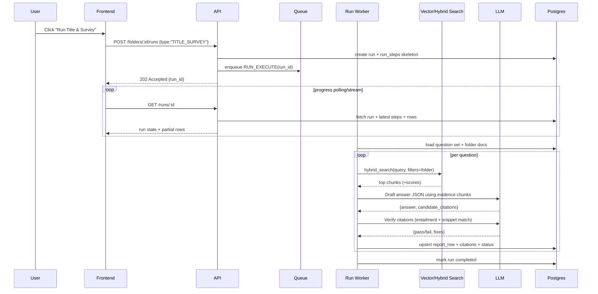
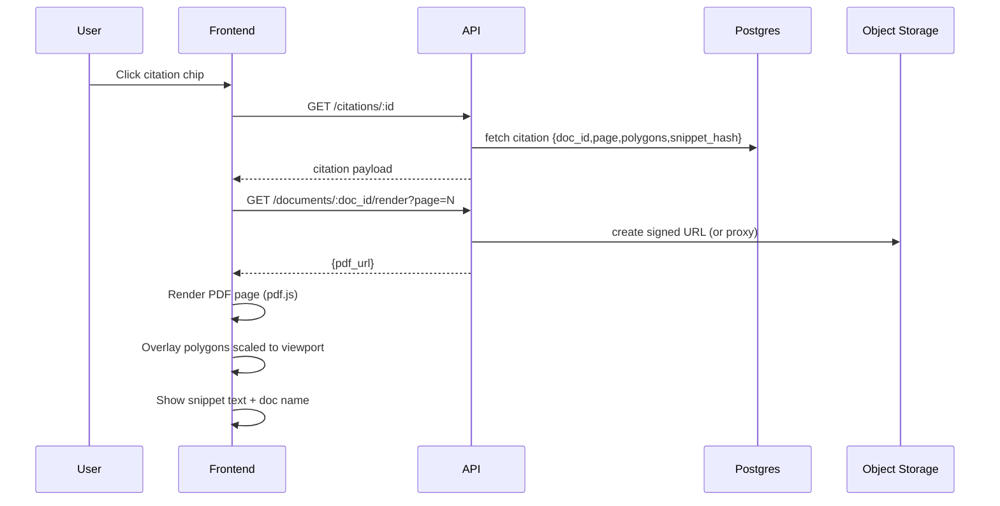

# PROMPT
You are helping with an AI Product Manager interview. Use the attached docs to craft a mini product strategy for a Proof-of-Concept (PoC) of Orbital Copilot tailored to US commercial real estate due diligence documentation packs.

Deliverables:
1) Mini product strategy: internal positioning, target segment(s) with P0/P1/P2, differentiation pillars, and explicit trade-offs/non-goals.
2) 3–5 PoC options with tight, achievable scope. Each option should list: core user story, required capabilities, in/out of scope, and why it’s compelling for a live demo.
3) An options comparison table using: motivation lift, friction removed, anxiety reduced, satisfaction likelihood, feasibility, key risks.
4) A recommended option with “why now,” success metrics (leading/lagging/guardrails), and a 1–2 week validation plan.
5) Call out assumptions or missing info.

Keep it concise and interview-ready. Focus on law-firm CRE diligence workflows (title/survey, leases, zoning/environmental), evidence-first citations, and artifact-first UX.

# FILES

----- BEGIN FILE: docs/01-insights/capabilities/PoC-architecture-brainstorming_chatGPT.md -----
## What Orbital publicly says Copilot does and the underlying need it solves

### The headline promise

Orbital positions Copilot as an “AI real estate lawyer/attorney” that helps law firms speed up property due diligence, with transparency and auditability rather than vibes. ([Orbital Witness Tech Blog][1])

### The “4 agents” approach they describe

Orbital’s tech blog describes Copilot as an **agentic system** with four specialist agents:

* **Orchestration agent**: receives user request, makes a plan, decides which agents to run and in what order
* **Summary agent**: “document analysis end-to-end”
* **Retrieval agent**: searches uploaded files for specific passages answering nuanced questions
* **Research agent**: provides insights into industry standards and compares scenarios to established practices ([Orbital Witness Tech Blog][1])

**Underlying need:** lawyers don’t just want a single chat response. They need multi-step work: plan → gather evidence across many docs → reconcile → output a deliverable they can defend. ([Orbital Witness Tech Blog][1])

### Capabilities they talk about (mapped to needs)

Below is the simplest “capability → need → PoC interpretation” mapping I’d use.

* **Bulk upload + extract insights + accelerate review (claims like “up to 70%”)**
  Need: the doc pack is huge and time is scarce, but errors are expensive.
  PoC: ingestion + indexing + “Title & Survey Quick Start” report table with progress and partial results. ([orbital.tech][2])

* **Answer complex questions with “full transparency” and show how conclusions are reached**
  Need: trust boundary. Lawyers must verify quickly, especially in regulated work.
  PoC: every material answer must have clause-level citations + evidence snippets; otherwise “not found in provided docs”. ([orbital.tech][2])

* **Draft structured deliverables (issue lists, objection letters, memos), customised to firm tone**
  Need: “lovable = artefacts”. Output must drop into Word workflows.
  PoC: generate a structured diligence table + export .docx using a template and the table as data. ([orbital.tech][2])

* **“Restore” documents where OCR fails (blurry scans, handwriting, complex layouts)**
  Need: real estate packs are messy; clean text and layout matter for clause-level work.
  PoC: layout-aware parsing (OCR/provider) + store page text + geometry so citations can highlight. ([orbital.tech][2])

* **Property visualisation (metes & bounds / PLSS) + overlays + exports**
  Need: bridge “words on paper” to physical land risk, earlier in the deal, in one place.
  PoC (stretch): parse legal description segments → approximate polygon on map with citations + big “approximate” disclaimer. ([orbital.tech][3])

* **Not a rebranded ChatGPT: deal with long, interdependent docs and “breadcrumbs” across a pack**
  Need: RAG has to be workflow-aware (definitions, cross-refs, exceptions, exhibits).
  PoC: hybrid retrieval + reranking + multi-hop retrieval + definition resolver tool. ([Orbital Witness Tech Blog][4])

And yes, they’re very explicit that model improvements (especially vision) unlock analysing complex drawings and visual docs directly. ([Orbital Witness Tech Blog][1])

---

## Architecture principles for the PoC

* **Evidence-first**: no evidence, no claim. “Not found” is a valid output.
* **Artefacts-first UX**: report table is the centre of gravity; chat is a tool to update it.
* **KISS / YAGNI**: single-tenant PoC, minimal infra surface area, but production-minded plumbing (jobs, retries, idempotency, traces).
* **Deterministic-ish orchestration**: explicit step machine, structured outputs (JSON schemas), verification pass before marking a row “ready”.
* **Make failure obvious**: per-row status, “missing docs” checklist, citation mismatch errors are surfaced not hidden.

---

# 1) Core user journeys

## Journey A: Upload docs → Index → “Title & Survey” Quick Start → report table

### UX steps

1. User creates a folder/matter.
2. User drags a doc pack into the folder (PDFs mainly).
3. UI shows per-document processing status (queued → parsing → indexed).
4. When folder is “ready”, user clicks **Quick Start: Title & Survey**.
5. UI shows run progress:

   * steps: “Selecting questions” → “Searching documents” → “Drafting answers” → “Verifying citations”
   * table populates incrementally row-by-row
6. User opens any row, sees:

   * answer
   * evidence snippets used (1–3)
   * citation chips (doc, page)
   * confidence/status + review toggle + notes
7. User clicks a citation chip and is taken to the doc viewer at the right page with highlight overlay.

### System actions + state transitions

* Upload triggers `DocumentCreated` events.
* Ingestion worker:

  * stores raw file to object storage
  * extracts text + layout per page
  * chunks with metadata
  * embeds + indexes
* Folder state: `empty → ingesting → indexed → ready`
* Quick Start run:

  * run state: `created → running → partial → completed`
  * report row states: `generated → needs_review → reviewed`

### Output: baseline report schema

Minimum report table columns:

* `question`
* `answer`
* `citations[]` (clickable)
* `confidence/status`
* `reviewed`
* `notes`

---

## Journey B: Click citation → doc viewer jump + highlight

### UX steps

1. User clicks a citation chip (e.g., “Commitment.pdf p. 12”).
2. Viewer opens that PDF page.
3. Highlight overlay is drawn over the exact clause area.
4. Sidebar shows the evidence snippet text + snippet hash (tiny trust signal).
5. User can “copy snippet”, “open surrounding context”, “flag citation wrong”.

### System actions

* UI requests:

  * the PDF render URL (or a signed URL)
  * highlight geometry for that citation (page + polygons)
  * canonical snippet text (for display + mismatch detection)
* Viewer renders page with pdf.js and scales polygons to viewport.

---

## Journey C: Freeform chat with citations and optional report updates

### UX steps

1. User opens chat inside a folder.
2. User asks: “What are the survey exceptions that materially impact the property?”
3. Assistant responds with:

   * concise answer
   * 2–5 citations (chips)
   * “Docs searched” list (doc names)
   * CTA: “Add to report” / “Update row 7”
4. If user confirms or the assistant has permission, it updates report rows (new rows or edits existing).

### System actions

* Chat endpoint streams tokens.
* Tool calls:

  * `search_chunks` (hybrid)
  * `fetch_snippet` (authoritative snippet + geometry)
  * `update_report_rows` (DB write)
  * `create_artefact` (optional docx draft)

---

## Journey D: Export .docx from report table

### UX steps

1. User clicks “Export Word draft”.
2. Chooses a template: “Title & Survey memo (basic)” (PoC has 1 template).
3. Export runs in background, user sees “Generating…”
4. Artefact appears with timestamp + download link.

### System actions

* Export service pulls:

  * report rows + citations
  * optionally embeds evidence excerpts in an appendix
* Generates docx and stores it, records artefact metadata.

---

## Journey E (stretch): Property visualiser from metes-and-bounds / PLSS

### UX steps

1. User opens “Property visualiser”.
2. Picks a source doc (deed / exhibit) and highlights the legal description, or asks “find the legal description”.
3. System extracts segments (bearing/distance) with citations.
4. Viewer shows an approximate polygon on a map + segment list.
5. User clicks a segment → citation jump to source text.

### System actions

* Parsing pipeline:

  * extract candidate spans (RAG)
  * parse bearings/distances
  * build polyline/polygon
  * store geometry + citations
* Big disclaimer everywhere: “approximate, not a survey”.

Orbital’s own positioning of this feature is exactly this “words-to-land” consolidation and early orientation value. ([orbital.tech][3])

---

## Failure journeys you must explicitly design

### Missing docs

* Symptom: required question cannot be answered (“survey not provided”).
* Behaviour:

  * answer = “Not found in provided documents.”
  * status = `missing_input`
  * suggestion = “Upload: Title Commitment, Survey, ALTA endorsement schedule…”

### OCR / extraction failure

* Symptom: document pages produce low-confidence text, or no text.
* Behaviour:

  * mark document `needs_ocr_review`
  * show “text extraction quality” meter per doc
  * allow re-run OCR with stronger mode (expensive)

### Retrieval miss

* Symptom: answer exists but retriever can’t find it.
* Behaviour:

  * fallback strategies: query rewrite, section-targeted search, definition resolver, page-level search
  * if still none: “not found” + log `retrieval_miss`

### Citation mismatch

* Symptom: cited snippet does not entail the claim, or geometry points to wrong place.
* Behaviour:

  * row status = `citation_failed`
  * UI shows “citation check failed”
  * block export unless user overrides (PoC: allow override with checkbox)

---

# 2) System architecture

## High-level component map

### Frontend

* Next.js App Router
* Tailwind for UI
* Doc viewer: PDF.js + highlight overlay layer
* Report table: TanStack Table + inline row drawer
* State:

  * server state: TanStack Query
  * local UI state: Zustand (optional, keep minimal)
  * streaming chat: Vercel AI SDK hooks

### API (single service for PoC)

* Next.js route handlers for:

  * folder CRUD
  * uploads (pre-signed URLs)
  * runs
  * chat streaming
  * citation geometry fetch
  * export triggers

### Worker(s)

* Ingestion worker (queue consumer)
* Run worker (Quick Start pipeline)
* Export worker (docx generation)
* Optional: property visualiser worker

### Storage & search

* Postgres (Supabase) for:

  * metadata
  * report rows
  * run steps
  * citations
  * evals
* Object storage (S3/Supabase Storage) for raw PDFs + artefacts
* Vector store:

  * pgvector in Postgres for PoC (simplest)
  * hybrid search: pgvector + Postgres full-text tsvector
  * optional reranker (LLM or small cross-encoder service)

### Observability

* Structured logs + trace IDs
* Store every LLM call with:

  * model, prompt version, tool calls, retrieved chunk IDs, cost, latency
* Minimal dashboard:

  * run failures by taxonomy
  * avg ingestion time per page
  * citation failure rate

Orbital’s own engineering content strongly signals a real infra posture (Kubernetes/Azure/GitOps/Python/Next.js/Postgres), but for this PoC we’ll keep deployment lighter while keeping the same conceptual separation (web, worker, data). ([Orbital Witness Tech Blog][5])

---

## Mermaid diagram A: Component diagram

```mermaid
flowchart LR
  subgraph FE[Frontend (Next.js + Tailwind)]
    UI[Folder UI / Report UI / Chat UI]
    PDFV[PDF Viewer (pdf.js + highlight overlay)]
  end

  subgraph API[API (Next.js Route Handlers)]
    Folders[Folders API]
    Uploads[Upload API]
    Runs[Runs API]
    Chat[Chat Streaming API]
    CitAPI[Citations API]
    ExportAPI[Export API]
  end

  subgraph Workers[Workers]
    Ingest[Ingestion Worker]
    Runner[Quick Start Run Worker]
    Exporter[Docx Export Worker]
    Vis[Property Visualiser Worker]
  end

  subgraph Data[Data Stores]
    PG[(Postgres + pgvector)]
    OBJ[(Object Storage)]
  end

  subgraph LLM[LLM Providers]
    OAI[OpenAI GPT-5.2 / Thinking]
    CLAUDE[Claude Opus 4.5]
  end

  UI --> API
  PDFV --> CitAPI

  Uploads --> OBJ
  Uploads --> PG

  Ingest --> OBJ
  Ingest --> PG
  Runner --> PG
  Exporter --> PG
  Exporter --> OBJ
  Vis --> PG

  Chat --> LLM
  Runner --> LLM
  Ingest --> LLM

  PG <--> API
  OBJ <--> API
```

---

## Mermaid diagram B: Sequence for “Title & Survey Quick Start”



---

## Mermaid diagram C: Sequence for “Citation click to highlight”



---

# 3) State model and data model

## State machines

### Folder state

* `empty` (no docs)
* `ingesting` (at least one doc queued/processing)
* `indexed` (all docs indexed)
* `ready` (indexed + health checks passed)

Transition triggers:

* upload doc → `ingesting`
* all docs `indexed=true` → `indexed`
* validation pass ok (vector index counts match, page counts match) → `ready`

### Run state

* `created`
* `running`
* `partial` (some rows written)
* `completed`
* `failed`
* `cancelled` (optional)

### Report row state

* `generated` (model produced answer)
* `citation_failed` (verification failed)
* `needs_review` (passes verification but unreviewed)
* `reviewed` (user confirmed)

---

## Concrete schema (Postgres)

### folders

* `id uuid pk`
* `name text`
* `created_at timestamptz`
* `state text` (`empty/ingesting/indexed/ready`)
* `latest_index_version text` (e.g. `idx_2026_01_28_01`)

### documents

* `id uuid pk`
* `folder_id uuid fk`
* `filename text`
* `mime text`
* `bytes int`
* `sha256 text unique` (idempotency)
* `storage_key text`
* `page_count int`
* `parse_status text` (`queued/parsing/parsed/failed`)
* `ocr_status text` (`not_needed/running/done/failed`)
* `extraction_quality float` (0..1)
* `created_at timestamptz`

### document_pages (optional but helps citations)

* `id uuid pk`
* `document_id uuid fk`
* `page_number int`
* `text text` (canonical page text)
* `tokens int`
* `layout_json jsonb` (lines/words + polygons)
* `image_key text null` (optional rendered image tile)
* `created_at timestamptz`

### chunks

* `id uuid pk`
* `document_id uuid fk`
* `page_start int`
* `page_end int`
* `chunk_index int`
* `text text`
* `tsv tsvector` (for full-text search)
* `metadata jsonb` (doc_type, section_heading, parties, dates)
* `snippet_hash text` (stable hash of text)
* `created_at timestamptz`

### embeddings

If using pgvector inline, store on `chunks`:

* `embedding vector(1536/3072/…)`

Or separate:

* `chunk_id uuid pk/fk`
* `embedding vector(...)`

### chats

* `id uuid pk`
* `folder_id uuid fk`
* `title text`
* `created_at timestamptz`

### messages

* `id uuid pk`
* `chat_id uuid fk`
* `role text` (`user/assistant/tool/system`)
* `content text`
* `tool_name text null`
* `tool_payload jsonb null`
* `created_at timestamptz`

### runs

* `id uuid pk`
* `folder_id uuid fk`
* `type text` (`TITLE_SURVEY`)
* `state text`
* `created_at timestamptz`
* `started_at timestamptz null`
* `completed_at timestamptz null`
* `error jsonb null`
* `agent_bundle_version text` (more below)

### run_steps

* `id uuid pk`
* `run_id uuid fk`
* `step_type text` (`plan/retrieve/draft/verify/write`)
* `state text`
* `started_at timestamptz`
* `completed_at timestamptz`
* `metrics jsonb` (latency, tokens, cost)
* `error jsonb null`

### report_rows

* `id uuid pk`
* `folder_id uuid fk`
* `run_id uuid fk null` (row source)
* `question_id text`
* `question text`
* `answer text`
* `status text` (`needs_review/reviewed/citation_failed/missing_input`)
* `confidence float` (0..1)
* `reviewed boolean`
* `notes text null`
* `updated_at timestamptz`

### citations

* `id uuid pk`
* `report_row_id uuid fk`
* `document_id uuid fk`
* `page_number int`
* `polygons jsonb` (list of bounding boxes or polygons)
* `text_offsets jsonb null` (fallback if no polygons)
* `snippet text` (short evidence snippet)
* `snippet_hash text`
* `created_at timestamptz`

### artefacts

* `id uuid pk`
* `folder_id uuid fk`
* `type text` (`docx_report`)
* `storage_key text`
* `created_at timestamptz`
* `source_run_id uuid null`
* `metadata jsonb` (template version etc)

### eval_runs

* `id uuid pk`
* `name text`
* `created_at timestamptz`
* `config jsonb` (models, prompts)
* `results jsonb` (scores + breakdown)

---

## Versioning for auditability (non-negotiable)

Create an `agent_bundle_version` string that’s stamped everywhere:

* `prompts/orchestrator@v3`
* `prompts/drafter@v7`
* `retrieval_pipeline@v4`
* `chunking@v2`
* `embedding_model@text-emb-vX`
* `llm_router@v1`

Store this on:

* `runs.agent_bundle_version`
* `messages.tool_payload` (for chat traces)
* `report_rows` (optional `provenance jsonb`)

This is the minimum you need so you can answer: “what produced this answer and why”.

---

# 4) Data flow and RAG pipeline

## Ingestion pipeline (PDF-first)

### Goals

* Produce **searchable text** and **highlightable geometry**.
* Be robust to messy scans.
* Keep it simple and idempotent.

### Strategy

1. **Upload**

   * store raw PDF in object storage
   * compute `sha256` and dedupe (if same file uploaded twice, reuse processing)

2. **Parse + layout extraction**
   Choose one of:

   * **Option A (simplest for citations): layout OCR for all PDFs**
     Use a layout-aware OCR provider (Azure Document Intelligence / AWS Textract / similar) so every page yields:

     * lines/words with polygons
     * reading order
     * confidence
   * **Option B (cheaper): detect text-layer PDFs, only OCR scans**

     * if PDF has text layer, extract text + coords via pdf.js
     * if scanned, run OCR provider
       This is more engineering because you now support two coordinate systems.

**PoC recommendation:** Option A for consistency. You’re building “trust UX” not optimising OCR cost.

Orbital explicitly calls out that layout structure matters when feeding text into LLMs (headings, clause structure etc). ([microsoft.com][6])

3. **Chunking for legal docs**

* Chunk unit should align to “citeable” structure:

  * prefer clause/section-based splitting if headings detected
  * fallback: sliding window with overlap
* Suggested chunk targets:

  * 350–800 tokens per chunk
  * 10–15% overlap
* Chunk metadata you want early:

  * `doc_type` (commitment, survey, deed, easement, lease…)
  * `section_heading`
  * `page_start/page_end`
  * `detected_parties`, `effective_date` (best effort)

4. **Indexing**

* Store chunks in Postgres with:

  * full text `tsvector` for lexical search
  * `embedding` vector for semantic search
* Build a “document dictionary” table:

  * doc name → doc_type guess
  * page count
  * extraction quality

---

## Retrieval pipeline (hybrid + rerank + multi-hop)

### Baseline retrieval

* Hybrid query:

  * semantic: pgvector cosine similarity
  * lexical: Postgres FTS BM25-ish ranking
* Filter:

  * folder_id
  * doc_type (when known)
  * page ranges (optional)

### Reranking

* Lightweight rerank options:

  * LLM rerank (top 30 → pick top 8 with reasons)
  * or a small cross-encoder reranker service (more work)

**PoC recommendation:** LLM rerank for top-N only. Keep it cheap by using a smaller/faster model.

### Multi-hop retrieval patterns you actually need

* **Definition resolver**: “Defined Terms” lookup.
* **Exception item follow**: commitment exceptions referenced by schedule/endorsement.
* **Exhibit chase**: “See Exhibit B” patterns.

Implement as tools, not as “hope the model does it”:

* `find_defined_term(term, doc_filter?)`
* `follow_reference(ref_string)` (e.g., Exhibit A, Schedule B-II item 12)

---

## Answer synthesis (evidence-first, structured outputs)

### Required behaviour

* If evidence is empty or weak → “Not found in provided documents.”
* Answers are **structured JSON first**, then rendered to UI.
* Citations point to stored chunk/page geometry, not just “doc name”.

### JSON schema for a report row (example)

```json
{
  "question_id": "TS-03",
  "question": "List easements that materially affect the property and whether they appear on the survey.",
  "answer": "The Commitment lists a 20' utility easement along the north boundary (Schedule B-II, Item 12). The survey depicts an overhead utility line within that strip, suggesting it impacts the site. No other material easements were found in the provided documents.",
  "citations": [
    {
      "document_id": "doc_123",
      "page_number": 12,
      "snippet": "Schedule B-II, Item 12: ... 20 foot utility easement along the north line ...",
      "snippet_hash": "sha256:abc..."
    },
    {
      "document_id": "doc_456",
      "page_number": 2,
      "snippet": "Survey shows overhead utility line ... north boundary ...",
      "snippet_hash": "sha256:def..."
    }
  ],
  "confidence": 0.78,
  "status": "needs_review",
  "docs_searched": ["Commitment.pdf", "ALTA_Survey.pdf"]
}
```

---

## Citation correctness (how you stop fake citations)

This is where most PoCs die.

### Technique: “citation locking”

1. Drafting agent proposes citations by chunk IDs (not by free text).
2. System resolves chunk IDs → authoritative snippet text + geometry.
3. Verification agent checks:

   * the snippet actually contains the quoted claim (string/regex checks)
   * entailment: does snippet support the claim?
   * page/geometry is plausible (bbox exists, page exists)
4. If fail:

   * either rewrite answer with correct citations
   * or downgrade row to `citation_failed` / `missing_input`

This is basically “trust UX enforcement” as a pipeline invariant.

---

# 5) Multi-agent design (4 agents)

Orbital publicly describes four agents as Orchestration, Summary, Retrieval, Research. ([Orbital Witness Tech Blog][1])
For the PoC, I’d keep **four**, but shift the 4th into **Verification** because citations are existential. And I’d implement “research/standards” as a tool-backed capability (static KB) inside the drafter.

## Orchestrator Agent (Planner + controller)

**Responsibilities**

* Turn user intent into a plan.
* Decide: Quick Start pipeline vs freeform chat.
* Choose which tools/agents to call and enforce constraints.
* Owns final answer arbitration (but only after verifier passes).

**Inputs**

* user request
* folder metadata (doc types, extraction quality, what’s indexed)
* optional: report table context

**Outputs**

* explicit plan (run steps)
* tool calls
* final user-facing response envelope

**Tool permissions**

* can call: `get_folder_state`, `list_documents`, `start_run`, `search_chunks`, `fetch_snippet`, `update_report_rows`
* cannot: directly draft final legal conclusions without passing verification

**Failure modes**

* infinite loops: cap tool calls and steps
* overreach: tries to answer without evidence, gets blocked by guardrails

**Guardrails**

* “cite-or-not-found”
* “no long reasoning”
* always return “docs searched” list

---

## Retrieval Agent (Evidence gatherer)

**Responsibilities**

* Generate retrieval queries (including rewrites).
* Run hybrid search.
* Do multi-hop retrieval (defined terms, exhibits, schedule references).
* Return ranked evidence bundles.

**Inputs**

* question
* constraints (doc types, jurisdiction, preferred docs)

**Outputs**

* `evidence_bundle`:

  * chunk IDs
  * rationale
  * coverage score
  * doc list searched

**Tools**

* `hybrid_search`
* `find_defined_term`
* `follow_reference`
* `fetch_snippet` (read-only)

**Failure modes**

* pulls irrelevant chunks (mitigate via rerank + filters)
* misses key doc type (mitigate via doc-type classifier and fallback broad search)

---

## Drafting Agent (Report writer)

**Responsibilities**

* Produce structured answers + proposed citations from evidence bundles.
* Keep answers short, lawyer-friendly, and template-like.
* Mark uncertainty explicitly.

**Inputs**

* question
* evidence bundle
* optional: standards KB snippets (ALTA/NSPS basics)

**Outputs**

* JSON row proposal: `answer + candidate citations + confidence + docs_searched`

**Tools**

* none ideally (pure function over evidence)
* optional read-only: `get_standards_snippet(topic)` from static KB

**Failure modes**

* hallucination: blocked because it can only write from evidence
* over-verbosity: enforce max tokens and a style rubric

---

## Verification Agent (Citation + consistency QA)

**Responsibilities**

* Verify that each citation supports the answer.
* Check contradictions across evidence snippets.
* Enforce “not found” if evidence doesn’t support the claim.

**Inputs**

* drafted row JSON
* authoritative snippets fetched by system

**Outputs**

* pass/fail with reasons
* corrected citations (if possible)
* revised answer (if needed)
* status:

  * `needs_review` if pass
  * `citation_failed` if fail
  * `missing_input` if no evidence

**Tools**

* `fetch_snippet` (authoritative)
* `compare_snippets` (entailment/contradiction prompt)
* no write access

**Failure modes**

* too strict, rejects good answers (tune rubric)
* too lax, accepts weak entailment (use conservative thresholds)

---

## Orchestration pattern (safe, deterministic-ish)

Use an explicit state machine, not a “free-running agent loop”.

* Step 1: Orchestrator creates plan: `{questions[], retrieval_settings, drafting_settings, verify_settings}`
* Step 2: For each question:

  * Retrieval Agent gathers evidence
  * Drafting Agent writes row JSON
  * Verification Agent validates
  * System writes row with status
* Step 3: Orchestrator returns run summary and next actions

This is the “human-in-the-loop, evidence-first” pattern that matches Orbital’s own emphasis on transparency and the idea that customers should treat outputs like junior lawyer work that needs checking. ([microsoft.com][6])

---

# 6) API design (REST + streaming)

I’ll describe REST endpoints that map cleanly to Next.js route handlers. You can swap to tRPC if you prefer, but REST is easiest to demo and debug.

## POST /folders

**Request**

```json
{ "name": "Deal - 18 West 18th Street" }
```

**Response**

```json
{ "id": "folder_abc", "state": "empty", "created_at": "2026-01-28T12:00:00Z" }
```

---

## POST /folders/:id/documents (upload init)

**Request**

```json
{
  "filename": "TitleCommitment.pdf",
  "mime": "application/pdf",
  "bytes": 4829931,
  "sha256": "..."
}
```

**Response**

```json
{
  "document_id": "doc_123",
  "upload_url": "https://signed-url...",
  "storage_key": "folders/folder_abc/docs/doc_123.pdf"
}
```

Client uploads directly to storage, then calls:

## POST /documents/:id/complete

**Request**

```json
{ "storage_key": "folders/folder_abc/docs/doc_123.pdf" }
```

**Response**

```json
{ "document_id": "doc_123", "parse_status": "queued" }
```

---

## POST /folders/:id/runs (quick start)

**Request**

```json
{
  "type": "TITLE_SURVEY",
  "settings": {
    "question_set_version": "ts_qset_v1",
    "max_questions": 25
  }
}
```

**Response**

```json
{ "run_id": "run_789", "state": "created" }
```

---

## GET /runs/:id

**Response**

```json
{
  "run_id": "run_789",
  "state": "partial",
  "progress": { "done": 7, "total": 25 },
  "latest_rows": [
    {
      "report_row_id": "row_1",
      "question_id": "TS-01",
      "status": "needs_review",
      "confidence": 0.82
    }
  ],
  "errors": []
}
```

---

## GET /folders/:id/report

**Response**

```json
{
  "folder_id": "folder_abc",
  "rows": [
    {
      "id": "row_1",
      "question": "Identify the insured property and legal description.",
      "answer": "...",
      "status": "needs_review",
      "reviewed": false,
      "citations": [
        { "citation_id": "cit_55", "doc_id": "doc_123", "page": 1 }
      ]
    }
  ]
}
```

---

## POST /chat/stream (SSE or fetch streaming)

Use Vercel AI SDK streaming format.

**Request**

```json
{
  "folder_id": "folder_abc",
  "chat_id": "chat_1",
  "message": "Summarise the title exceptions that affect development.",
  "options": { "update_report": true }
}
```

**Streaming behaviour**

* assistant streams text
* tool call events emitted
* final message includes:

  * `citations[]`
  * `docs_searched[]`
  * optional `report_row_updates[]`

---

## GET /citations/:id

**Response**

```json
{
  "citation_id": "cit_55",
  "document_id": "doc_123",
  "page_number": 12,
  "polygons": [
    [[0.12,0.34],[0.78,0.34],[0.78,0.41],[0.12,0.41]]
  ],
  "snippet": "Schedule B-II, Item 12: ...",
  "snippet_hash": "sha256:abc..."
}
```

---

## GET /documents/:id/render?page=12

**Response**

```json
{
  "document_id": "doc_123",
  "page_number": 12,
  "pdf_url": "https://signed-url...",
  "page_width": 612,
  "page_height": 792
}
```

---

## POST /export/docx

**Request**

```json
{
  "folder_id": "folder_abc",
  "template_id": "title_survey_basic_v1",
  "include_appendix": true
}
```

**Response**

```json
{ "artefact_id": "art_9", "state": "queued" }
```

---

# 7) Framework comparison + recommended stack

## Vercel AI SDK

**Strengths (for this PoC)**

* Streaming chat + tool calls + UI hooks out of the box.
* Dead simple to build an “LLM product” UX quickly (chat + side panels).
* Fits Next.js deployment patterns nicely.

**Weaknesses / risks**

* You still need to engineer the *workflow* and *citation correctness* yourself.
* If you go too “agentic”, you can create spaghetti tool calls unless you enforce step machines.

**PoC pick:** Yes, use it. It’s the fastest path to a credible experience.

---

## LangChain vs LangGraph

**LangChain**

* Strength: lots of RAG primitives and integrations.
* Weakness: can become untyped and magical, harder to audit.

**LangGraph**

* Strength: explicit graphs/state machines, better for deterministic-ish orchestration.
* Weakness: more conceptual overhead, and you can overbuild for a PoC.

**PoC pick:** if you’re disciplined, you don’t need either. Implement the 4-agent pipeline as a typed step machine (it’s ~300–600 lines).
**If you want a framework:** LangGraph is the better fit because you need explicit states and retries.

---

## LlamaIndex

**Strengths**

* Strong document indexing and retrieval abstractions.
* Helpful for quick prototypes.

**Weaknesses**

* You’ll still customise heavily for clause-level citations + geometry + verification.
* Risk of fighting abstractions when you need exact provenance.

**PoC pick:** optional. I’d skip and build minimal RAG yourself to stay in control.

---

## OpenAI Responses / Agents-style APIs

If you’re using OpenAI, the model+tooling story is strong, and GPT‑5.2 supports agentic workflows and long context (docs say 400k context window for GPT‑5.2). ([OpenAI Platform][7])
But you still want your own orchestration and audit trail because the product requirement is trust and traceability.

---

## Backend acceleration: Convex vs Supabase/Postgres vs FastAPI

### Convex

* Strength: real-time state, easy reactive UI, fast iteration.
* Weakness: vector + hybrid search story is not as straightforward as Postgres+pgvector; export jobs and heavy ingestion can get awkward.

### Supabase/Postgres

* Strength: boring, works, easy to host, pgvector + SQL joins are perfect for citations.
* Weakness: you must implement queues/workers yourself.

### FastAPI (custom)

* Strength: Python ecosystem for PDF/OCR is best-in-class.
* Weakness: two-stack complexity if your FE is Next.js.

**PoC pick (fastest credible):**

* **Next.js + Vercel AI SDK + Supabase Postgres (pgvector) + object storage + a simple worker queue.**
* Keep worker in Node/TS if you can, but don’t be dogmatic. If OCR/layout parsing is easier in Python, run a tiny Python worker.

---

## LLM choice for legal diligence (GPT‑5.2 vs Claude Opus 4.5)

### GPT‑5.2 (and GPT‑5.2 Thinking)

* OpenAI describes GPT‑5.2 as a flagship model for coding and agentic tasks with long context, plus “Thinking” variants for deeper reasoning. ([OpenAI Platform][7])
* OpenAI also explicitly positions GPT‑5.2 Thinking as its strongest vision model yet. That matters for scanned PDFs, plats, plans, stamps, messy layouts. ([OpenAI][8])

### Claude Opus 4.5

* Anthropic positions Opus 4.5 as their newest model, strong for agents and deep work. ([Anthropic][9])
* Opus pricing and knobs (like “effort”) may help tune cost/quality tradeoffs. ([Claude API Docs][10])

**PoC recommendation**

* Use a **router**:

  * **Drafting + retrieval rerank**: cheaper/faster model (GPT‑5.2 Instant or similar tier)
  * **Verification**: higher-accuracy model (GPT‑5.2 Thinking or Opus 4.5 with higher effort)
  * **Vision fallback** (bad OCR pages): GPT‑5.2 Thinking
* And keep it configurable per run so you can demo “swap models without rewriting product”, which matches Orbital’s own “swap members in and out as models evolve” philosophy. ([Orbital Witness Tech Blog][1])

---

# 8) Evals and quality system (mandatory)

## What you measure

### 1) Retrieval quality

* **Recall@K** on a golden set (did we retrieve the right clause/chunk?)
* **Doc coverage**: did we search the right doc types?

### 2) Citation validity

* **Snippet match**: cited snippet contains the key phrase/term (code-based)
* **Entailment check**: LLM judge rubric: “Does snippet support claim?” (pass/fail)

### 3) Answer correctness

* Rubric-based judge:

  * correct
  * partially correct
  * incorrect
  * correctly “not found”
* Penalise confident wrong answers more than “not found”.

### 4) Format correctness

* JSON schema validation (hard gate)

### 5) Regression gates

* CI job runs eval pack on every change to:

  * prompts
  * retrieval settings
  * chunking
  * model routing

---

## Golden set creation workflow (practical)

1. Collect 5–10 representative doc packs (public samples are fine for PoC).
2. For each pack, label:

   * 20–40 title/survey questions
   * expected answer bullets
   * the exact clause location (doc/page)
3. Store labels as JSON:

```json
{
  "folder_fixture": "pack_03",
  "question_id": "TS-07",
  "expected": {
    "answer_contains": ["access", "easement"],
    "citations": [{ "doc": "Commitment.pdf", "page": 14 }]
  }
}
```

---

## Automated evaluators

* Code evaluators:

  * schema validation
  * citation page exists
  * snippet hash matches stored text
* LLM judge evaluators:

  * entailment (citation validity)
  * correctness rubric
* Calibrate LLM judge with small human-labelled set (20–50 items).

---

## Point-of-first-failure taxonomy

Log every failure to one bucket:

* `OCR_FAIL`
* `LAYOUT_FAIL`
* `CHUNKING_FAIL`
* `RETRIEVAL_MISS`
* `RERANK_BAD`
* `DRAFT_HALLUCINATION`
* `CITATION_MISMATCH`
* `VERIFICATION_FALSE_PASS`
* `EXPORT_FAIL`

And show a simple dashboard of counts and rates.

---

# 9) Implementation plan (MVP → wow)

## Milestone 1: Folder + documents + viewer (2–4 days)

* Folder list/create
* Upload → storage
* Basic doc list
* PDF viewer (pdf.js) without highlights

## Milestone 2: Ingestion + indexing (3–6 days)

* Worker queue
* OCR/layout extraction pipeline
* Chunk + embed + store in pgvector
* Folder state transitions and progress UI

## Milestone 3: Quick Start report table with citations (4–8 days)

* Fixed question set v1 (25 Qs)
* Run worker generates rows incrementally
* Store citations with polygons/snippet hashes
* Report table UI with row drawer

## Milestone 4: Citation click-to-highlight (2–4 days)

* Citations API returns geometry
* Viewer overlay highlights polygons
* “flag citation wrong” button

## Milestone 5: Chat with tools + update report (3–6 days)

* Vercel AI SDK chat streaming
* Tooling: `search_chunks`, `fetch_snippet`, `update_report_rows`
* “Add to report” action

## Milestone 6: Export .docx (2–4 days)

* Basic doc template
* Export worker generates docx
* Artefact list + download

## Milestone 7 (stretch): Property visualiser (5–10 days)

* Extract legal description span with citations
* Parse bearings/distances (best effort)
* Render on map (Leaflet/Mapbox)
* Segment click → citation jump

Orbital’s own Property Visualizer narrative shows exactly why this is a wow feature for title/survey workflows. ([orbital.tech][3])

---

## Pseudocode skeletons

### Ingestion worker

```ts
async function ingestDocument(documentId: string) {
  const doc = await db.documents.get(documentId);
  if (doc.parse_status === "parsed") return; // idempotent

  await db.documents.update(documentId, { parse_status: "parsing" });

  const pdf = await storage.get(doc.storage_key);

  // 1) Layout extraction (OCR provider)
  const pages = await ocrProvider.analysePdfLayout(pdf);

  // 2) Persist page text + geometry
  for (const page of pages) {
    await db.document_pages.upsert({
      document_id: documentId,
      page_number: page.number,
      text: page.text,
      layout_json: page.layout,
      tokens: estimateTokens(page.text),
    });
  }

  // 3) Chunking
  const chunks = chunkLegal(pages);
  for (const chunk of chunks) {
    const emb = await embed(chunk.text);
    await db.chunks.insert({ ...chunk, embedding: emb, tsv: toTSV(chunk.text) });
  }

  await db.documents.update(documentId, { parse_status: "parsed" });
}
```

### Retrieval tool

```ts
async function search_chunks(folderId: string, query: string, filters?: any) {
  const q1 = await pgvectorSearch(folderId, query, filters);
  const q2 = await fullTextSearch(folderId, query, filters);
  const merged = hybridMerge(q1, q2);
  const reranked = await llmRerank(query, merged.slice(0, 30));
  return reranked.slice(0, 8);
}
```

### 4-agent orchestrator (run worker)

```ts
async function runTitleSurvey(runId: string) {
  const plan = await orchestrator.plan(runId);

  for (const q of plan.questions) {
    const evidence = await retriever.gather({ runId, question: q });
    const draft = await drafter.draft({ question: q, evidence });
    const verdict = await verifier.verify(draft);

    await db.report_rows.upsert(toRow(verdict));
    await db.citations.upsert(toCitations(verdict));
  }

  await db.runs.update(runId, { state: "completed" });
}
```

### Streaming chat endpoint (Next.js + AI SDK)

```ts
export async function POST(req: Request) {
  const { folder_id, message } = await req.json();

  return streamText({
    model: router.pick("chat"),
    messages: buildMessages(folder_id, message),
    tools: {
      search_chunks,
      fetch_snippet,
      update_report_rows,
    },
    onFinish: async (final) => logTrace(final),
  });
}
```

### Docx export service

```ts
async function exportDocx(folderId: string, templateId: string) {
  const rows = await db.report_rows.list(folderId);
  const docxBuffer = await renderDocxTemplate(templateId, rows);
  const key = await storage.put(docxBuffer);
  await db.artefacts.insert({ folder_id: folderId, type: "docx_report", storage_key: key });
}
```

### Eval runner CLI

```py
def run_eval_pack(pack_id, model_config):
    fixtures = load_pack(pack_id)
    results = []
    for item in fixtures:
        out = run_question(item.folder, item.question, model_config)
        results.append(score(out, item.expected))
    write_report(results)
    gate(results)
```

---

# 10) Explicit trade-offs and assumptions

## Assumptions

* Input docs are mostly PDFs, mixed quality, some scanned.
* Clause-level highlighting is feasible via layout extraction geometry.
* PoC can use managed OCR and LLM APIs (no on-prem requirements).
* Single shared PoC environment, no auth/RBAC, no tenancy.

## Trade-offs (deliberate)

* **Use OCR/layout for all PDFs** to simplify highlight geometry and reduce edge cases.
* **Keep vector store in Postgres (pgvector)** to avoid extra infra and make joins easy for citations.
* **Use a strict verification step** even if it slows runs. Trust is the product.
* **No deep customisation / firm templates** beyond one docx template.
* **Research agent**: implemented as a static KB tool (YAGNI) rather than a full web-search agent, to avoid non-grounded external citations.

## Not building (by design)

* Workspaces, SSO, RBAC, multi-tenant admin, billing
* Integrations (iManage, NetDocs, SharePoint)
* Full-blown monitoring UI (but we log traces + run basic dashboards)

---

# Recommended PoC architecture (decisive)

## Stack

* **Frontend:** Next.js (App Router) + Tailwind + TanStack Table + pdf.js viewer + Vercel AI SDK for streaming chat/tool calls
* **Backend:** Next.js route handlers (REST) + a worker process (Node/TS)
* **DB:** Supabase Postgres + pgvector + tsvector
* **Storage:** Supabase Storage or S3 (raw PDFs + docx artefacts)
* **Queue:** Upstash Redis + BullMQ (or Supabase queue equivalent)
* **LLM routing:**

  * GPT‑5.2 Instant for cheap drafting/rewrite/rerank
  * GPT‑5.2 Thinking for verification + vision fallback ([OpenAI][8])
  * optional Claude Opus 4.5 as alternate verifier if you want model diversity ([Anthropic][9])
* **OCR/layout:** Azure Document Intelligence (or Textract), applied consistently to enable highlights
* **Evals:** offline eval runner (Python) + CI gate + stored traces

## Why this is the fastest credible path

* It delivers the core wedge Orbital markets: **Title & Survey report + citations + export + property visualiser stretch**. ([orbital.tech][2])
* It matches the agentic positioning (planner + specialists) while keeping the system deterministic enough to trust. ([Orbital Witness Tech Blog][1])
* It keeps infra boring but real: jobs, retries, idempotency, audit trail.

If you want, I can also give you:

* a concrete **Title & Survey question set v1** (25–40 questions)
* the exact **prompt contracts** for each agent (system prompts + tool schemas)
* and a Next.js repo layout (folders/files) that maps 1:1 to this architecture.

[1]: https://tech.orbitalwitness.com/posts/2025-06-07-road-to-autonomy/ "https://tech.orbitalwitness.com/posts/2025-06-07-road-to-autonomy/"
[2]: https://www.orbital.tech/copilot-us "https://www.orbital.tech/copilot-us"
[3]: https://www.orbital.tech/blog/property-visualizer "https://www.orbital.tech/blog/property-visualizer"
[4]: https://tech.orbitalwitness.com/posts/2024-01-10-we-built-an-ai-agent-that-thinks-like-a-real-estate-lawyer/ "https://tech.orbitalwitness.com/posts/2024-01-10-we-built-an-ai-agent-that-thinks-like-a-real-estate-lawyer/"
[5]: https://tech.orbitalwitness.com/posts/2021-11-12-inside-the-risk-engines-tech-stack/ "https://tech.orbitalwitness.com/posts/2021-11-12-inside-the-risk-engines-tech-stack/"
[6]: https://www.microsoft.com/en/customers/story/19230-orbital-witness-azure "https://www.microsoft.com/en/customers/story/19230-orbital-witness-azure"
[7]: https://platform.openai.com/docs/models/gpt-5.2 "https://platform.openai.com/docs/models/gpt-5.2"
[8]: https://openai.com/index/introducing-gpt-5-2/ "https://openai.com/index/introducing-gpt-5-2/"
[9]: https://www.anthropic.com/news/claude-opus-4-5 "https://www.anthropic.com/news/claude-opus-4-5"
[10]: https://docs.anthropic.com/en/docs/about-claude/pricing "https://docs.anthropic.com/en/docs/about-claude/pricing"
----- END FILE: docs/01-insights/capabilities/PoC-architecture-brainstorming_chatGPT.md -----

----- BEGIN FILE: docs/01-insights/competitors/competitor_overview_claude.md -----
# Orbital.tech faces fragmented but intensifying competition in CRE AI

Commercial real estate due diligence AI is an emerging category where **Orbital.tech's Copilot has carved out a specialized niche**—purpose-built for property diligence workflows—while competing against both general legal AI giants and legacy document review platforms. With **$60M in Series B funding** (January 2026) and strategic investors including First American, JLL Spark, and RELX Ventures, Orbital stands as the clearest category leader in CRE-specific legal AI. However, the competitive landscape is evolving rapidly as well-funded horizontal players like Harvey AI ($1B+ raised, $8B valuation) and Legora ($266M raised, $1.8B valuation) expand their capabilities across practice areas.

The market opportunity is substantial: **legal AI is a $1.5–3B market growing 13–28% CAGR**, and CRE diligence remains significantly underserved by technology. Law firms currently spend weeks on property due diligence using manual checklists and junior associates reviewing PDFs line-by-line—a process Orbital claims to reduce by **70%**.

---

## Orbital.tech: The specialized CRE diligence leader

**Company profile**: Founded in 2017 in London by Will Pearce (CEO), Ed Boulle (CSO), and Francesco Liucci, Orbital (formerly Orbital Witness) has raised **$75M total** including a $60M Series B announced January 2026 led by Brighton Park Capital. The company employs approximately **64 people** and plans to double headcount, with expansion focused on the US market through their New York office.

**Copilot product details**: Launched December 2023, Orbital Copilot is an AI assistant purpose-built for CRE legal teams. Key features include:

- **Document processing**: Handles any PDF including degraded historical documents with proprietary OCR that processes handwritten notes, blurry scans, and complex layouts
- **Legal description visualization**: Converts metes & bounds descriptions into digital property boundary overlays—a differentiator for US title and survey work
- **Automated reporting**: Generates certificates of title, lease abstracts, issue lists, and objection letters in customizable firm templates
- **AI Q&A with citations**: Natural language queries with full source citations and reasoning chains ("explainable AI")
- **Interactive mapping**: Combines document AI with spatial visualization showing title boundaries, easements, and planning constraints

**Target customers and named clients**: Orbital serves **200,000+ transactions annually** across 5,000+ property professionals. Confirmed US clients include Am Law firms Vinson & Elkins, Seyfarth Shaw, BCLP, Goodwin, and Greenberg Traurig, plus title companies Land Services USA and Essex Title. UK clients include Magic Circle firms Clifford Chance and Slaughter & May.

**Security posture**: ISO 27001 certified (UKAS accredited), built on Microsoft Azure with Azure OpenAI (GPT-4). No SOC 2 certification was confirmed in available sources.

**Pricing**: Not publicly disclosed; enterprise model requiring demo/quote.

**UK vs US differences**: The US version emphasizes legal description plotting for metes & bounds surveys, while the UK version includes Land Registry integration. Orbital launched the world's first "AI Reliance Insurance" in the UK (June 2024) with First Title.

---

## Harvey AI: The dominant generalist with no CRE focus

Harvey represents Orbital's most formidable indirect competitor—not because it has CRE-specific capabilities, but because it dominates enterprise legal AI mindshare and could expand into real estate.

**Company profile**: Founded 2022 in San Francisco by Winston Weinberg (ex-O'Melveny litigator) and Gabriel Pereyra (ex-DeepMind). Named after Harvey Specter from "Suits," the company has raised **over $1 billion across seven funding rounds** reaching an **$8 billion valuation** (December 2025 Series F led by Andreessen Horowitz). It employs approximately **340 people** and claims **~$150M ARR** with 500+ enterprise customers.

**Products and features**: Harvey offers five core products—Assistant, Vault, Knowledge, Workflows, and Microsoft Integrations—covering research, document analysis, and drafting. The Vault product can analyze up to **10,000 files per project** with pre-built workflows for lease agreements, though these are general contract workflows rather than CRE-specific.

**CRE capabilities assessment**: **Harvey does NOT have dedicated real estate features**. While Baker McKenzie reportedly used Harvey for commercial lease analysis, this leveraged general contract tools rather than property-specific functionality. Harvey lacks title review, survey analysis, property boundary visualization, and CRE-specific document types.

**Enterprise security**: SOC 2 Type II, ISO 27001, GDPR/CCPA compliant, EU-US Data Privacy Framework certified. Contractually guarantees zero training on customer data.

**Key partnerships**: OpenAI Startup Fund (first investor, co-developed custom case law model), Microsoft Azure, LexisNexis (June 2025 content partnership), PwC strategic alliance.

**Target market**: 50 of Am Law 100 firms, Fortune 500 legal departments, Big Four (PwC exclusive). Minimum estimated spend is **~$288K annually** (20-seat minimum at ~$1,200/seat/month).

**Strengths vs Orbital**: First-mover advantage, massive funding, strongest enterprise relationships, multi-model flexibility (GPT, Claude, Gemini), deepest legal research partnership (LexisNexis).

**Weaknesses vs Orbital**: No CRE-specific features, generalist platform means shallower vertical capabilities, high cost/enterprise-only positioning, no property visualization or title-specific tools.

---

## Legora: Fast-growing European challenger without property focus

Legora (formerly Leya) is Harvey's closest competitor in general legal AI, achieving **unicorn status ($1.8B valuation)** in October 2025—less than 2.5 years after founding.

**Company profile**: Founded 2023 in Stockholm by Max Junestrand (CEO), Sigge Labor (CTO), and August Erséus. Incubated in the basement of Nordic firm Mannheimer Swartling. Raised **$266M total** including $150M Series C (October 2025, Bessemer Venture Partners). Y Combinator W24 batch. Approximately **200 employees** with offices in Stockholm, London, New York, Denver, and Sydney.

**Products and features**: Legora describes itself as a "collaborative AI workspace for lawyers." Key products include Tabular Review (transforms document sets into interactive grids firing "tens of thousands of parallel API calls"), Word Add-in for in-document AI, Playbooks for firm standards, Workflows for multi-step agentic AI, and the upcoming Legora Portal for law firm/client collaboration (Q1 2026 GA).

**CRE capabilities assessment**: **Limited specific real estate capabilities**. Lease agreement analysis is mentioned as a Tabular Review use case, but there are no dedicated property diligence templates, real estate playbooks, or CRE customer case studies visible.

**Enterprise security**: ISO 27001:2022, ISO 42001 (AI governance—one of first legal AI providers globally), SOC 2 Type I & II, GDPR compliant. Built on Microsoft Azure.

**Target market**: 400+ customers across 40+ markets including Linklaters, Cleary Gottlieb, Goodwin Procter, Bird & Bird, and Deloitte Legal UK.

**Competitive positioning**: #2 in legal AI mindshare (17.9% vs Harvey's 29.7% per PeerSpot). Strong European/Nordic presence, native Word integration, and rapid product velocity are key differentiators.

---

## AI due diligence platforms: Kira and Luminance lead on document review

Two established players—Kira Systems (now Litera) and Luminance—offer the strongest competition for document review and due diligence, though neither matches Orbital's CRE specialization.

### Kira Systems (Litera)

**Company profile**: Founded 2011 in Toronto by Noah Waisberg (ex-Weil Gotshal corporate lawyer) and Dr. Alexander Hudek. Acquired by Litera in 2021 (Litera owned by Hg PE with $75B+ AUM). Named **#1 for due diligence contract review** by Legaltech Hub (2024-2025).

**Key capabilities**: **1,400+ pre-trained "smart fields"** covering 40+ legal areas including explicit real estate lease review support. Hybrid AI approach combining proprietary ML with optional GenAI (OpenAI). Processes **450,000+ documents monthly**. Features include Generative Smart Fields (July 2025), Rapid Clause Analysis (August 2024), and Multi-Document Smart Summaries.

**Real estate relevance**: **High**—real estate lease review is a core use case with pre-built smart fields for lease-specific provisions. Property portfolio analysis is mentioned as a primary practice area.

**Market position**: 70% of top 50 global law firms, 64% of Am Law 100, 84% of top 25 M&A firms. SOC 2 Type II certified with multi-region data residency.

**Estimated pricing**: $50,000–$150,000+ annually for mid-sized firms.

### Luminance

**Company profile**: Founded September 2015 in Cambridge, UK by mathematicians Adam Guthrie and Graham Sills. Led by CEO Eleanor Lightbody. Raised **~$165M total** including $75M Series C (February 2025, Point72 Ventures). Approximately 338 employees.

**Key capabilities**: Proprietary Legal LLM trained on **150+ million verified legal documents** combined with supervised/unsupervised ML. Features **1,000+ pre-built concept models**, Auto Mark-Up for compliance, and Autopilot for autonomous NDA negotiation. Analyzes documents in **80+ languages** without translation.

**Real estate relevance**: **High**—property portfolio analysis explicitly listed as use case with lease comparison, critical date tracking, and review workflows. Holland & Knight highlighted using Luminance for real estate reviews. Claims **up to 90% time savings per lease** for due diligence.

**Market position**: 600+ customers in 70 countries including 12 of Global Top 100 law firms and 3 of Big Four.

### Other document review tools

**Eigen Technologies** (acquired by Sirion June 2024): No-code intelligent document processing originally focused on financial services. Used by nearly half of all G-SIBs. **Limited direct CRE capabilities**—focused on banking documents and regulatory compliance.

**Evisort** (acquired by Workday September 2024 for ~$250-300M): AI-native CLM with proprietary contract LLM. Named Gartner Peer Insights "Customers' Choice" 2024. **Minimal direct CRE capabilities**—focused on corporate contract management.

**Ironclad**: CLM leader valued at **$3.2 billion** with $334M raised. Gartner Magic Quadrant Leader 2025. Focused on contract creation/lifecycle rather than document review. **Not designed for diligence** workflows or large-scale document analysis.

---

## CRE-specific proptech and title technology

The title insurance technology segment represents adjacent competition, with several players developing AI capabilities for property transactions.

### Qualia (leading title production platform)

**Company profile**: Founded 2015 in San Francisco, **$1B valuation** (April 2021), raised ~$207M. Acquired RamQuest and E-Closing platforms from Old Republic Title (January 2025).

**AI capabilities**: **Qualia Clear** (September 2025) is their agentic AI system—automating preliminary title exams in minutes, pre-closing verification, and wire fraud detection using Google Gemini. Represents first-mover advantage in agentic AI for title/escrow.

**Competitive positioning**: #1-2 in digital closing market. Primary focus is title production software for title companies rather than legal due diligence for law firms—**different buyer persona than Orbital**.

### Doma (formerly States Title)

**Company profile**: Founded 2016, went public via SPAC at $3B valuation (March 2021), then taken private by Title Resources Group for **~$88M** (October 2024)—significant valuation decline.

**Technology**: Patented Instant Underwriting Technology reduces title processing from 5 days to "as little as one minute." Now operating as technology licensor rather than full-service title company.

**Current status**: Pivoted to B2B technology licensing model. Expanded partnership with Blend Labs (July 2025) for AI-powered instant title decisioning embedded in mortgage platforms.

### Other CRE-specific tools

**Prophia**: Leading CRE lease abstraction AI with real-time stacking plans, encumbrances, lease benchmarks, and CAM reconciliation automation. Human-in-the-loop verification process. Targets commercial asset managers and institutional investors.

**Yardi Smart Lease**: Part of Voyager 8 property management platform. AI-driven lease abstraction pulling terms directly into property management tables with confidence scores.

**DealRoom**: Virtual data room with AI document intelligence that explicitly lists **real estate as industry focus**. Extracts terms, dates, obligations from leases. Starting at $25,000/year—more accessible than enterprise VDRs.

**Datasite**: Premier M&A data room with explicit **real estate solution**—AI folders separating environmental, structural, and legal diligence with blueprint viewer. SOC 2, ISO 27001, FedRAMP certified.

---

## Legal research and CLM platforms with AI capabilities

Established legal technology vendors have added AI features but lack CRE-specific focus.

### Westlaw Precision/CoCounsel (Thomson Reuters)

Acquired Casetext for **$650M** (June 2023), integrating CoCounsel AI assistant. Eight core skills including contract data extraction and compliance checking. Quick Check analyzes briefs for missing cases. All AI responses include footnotes linking to primary sources via KeyCite.

**CRE relevance**: Limited direct focus; Practical Law includes real estate practice guides. General contract analysis applicable to property documents.

### Lexis+ AI/Protégé (LexisNexis)

Multi-model AI approach (Claude 3 and others) with Shepard's Knowledge Graph integration (July 2024). Document upload supporting up to 10 documents at 20MB each. Brief Analysis and contract review for missing clauses.

**Partnership note**: Harvey AI has full LexisNexis content partnership (June 2025), potentially strengthening Harvey's position on legal research.

### CLM platforms

**DocuSign CLM**: Gartner Magic Quadrant Leader for 5 consecutive years. DocuSign Iris AI engine (2024) with 100+ pre-trained extraction models. Acquired Lexion for $165M (2024).

**Icertis**: FedRAMP authorized, used by 1/3 of Fortune 100. Icertis Copilot built on Azure OpenAI. **$250M+ ARR**.

**Agiloft**: Acquired Screens AI (December 2024) for playbook-based review claiming **97.5% accuracy**. Lease agreement analysis explicitly supported. Gartner Leader for 6 consecutive years.

---

## Market context and buyer landscape

### Who buys CRE legal tech

**Law firms**: Real estate practice groups at Am Law/Magic Circle firms represent the primary buyer for sophisticated diligence tools. Orbital's customer base confirms this—Vinson & Elkins, Clifford Chance, BCLP, etc.

**Title companies**: A major market segment with $20B+ in annual premiums. Major underwriters (First American, Fidelity, Stewart) investing heavily in automation, but primarily for title production rather than law firm diligence workflows.

**In-house legal at REITs and PE funds**: High-volume acquisition diligence creates strong demand. Grosvenor Group (Orbital customer/investor) exemplifies this segment.

**Commercial lenders**: Mandate environmental reports, appraisals, title insurance—create downstream demand for faster diligence.

### Pain points driving adoption

CRE due diligence typically spans **30-90 days** reviewing hundreds of documents including titles, surveys, leases, environmental reports, and zoning materials. Current pain points include:

- Teams "reinvent the wheel" without standardized processes
- Manual tracking across spreadsheets and emails becomes "a liability"
- Document review conducted line-by-line by junior associates
- Average due diligence binders have multiple missing documents
- Environmental/property condition reports are "hundreds of pages long"
- Title examination historically takes 1-2 weeks of manual assessment

Deloitte found **75% efficiency improvement** using generative AI versus manual review in due diligence workflows. Orbital claims **70% time savings** on property diligence specifically.

### Market size and trends

The broader legal AI market is estimated at **$1.5-3B (2024)** growing **13-28% CAGR** to $4-10B by 2030, depending on methodology. Contract review/CLM is the fastest-growing segment at **31.8% CAGR**.

AI adoption among legal professionals reached **79% in 2025** (up from 19% in 2023), though firm-wide deployment remains cautious at 21%. Large firms (500+ lawyers) show 47.8% adoption versus 29.5% at smaller firms.

---

## Competitive positioning summary

| Competitor | CRE Focus | Funding | Key Strengths | Key Weaknesses vs Orbital |
|------------|-----------|---------|---------------|---------------------------|
| **Orbital** | ✅ Core | $75M | Purpose-built for CRE, property visualization, title-specific features, strategic investors | Smaller scale, limited non-CRE capabilities |
| **Harvey AI** | ❌ None | $1B+ | Market leader, Am Law penetration, multi-model, LexisNexis partnership | No CRE features, generalist, very expensive |
| **Legora** | ⚠️ Limited | $266M | Fast growth, Word integration, European presence | No property-specific tools |
| **Kira (Litera)** | ✅ High | PE-backed | 14-year track record, 1,400+ smart fields, lease review | Legacy approach, less GenAI native |
| **Luminance** | ✅ High | $165M | Proprietary legal LLM, 80+ languages, property portfolio support | Less US market presence |
| **Qualia** | ✅ Adjacent | $207M | Title production leader, agentic AI, RamQuest acquisition | Different buyer (title cos vs law firms) |

---

## Strategic implications

**Orbital's defensible position**: Purpose-built CRE focus with spatial visualization, legal description plotting, and property-specific document handling creates genuine differentiation. The combination of First American (title underwriter), JLL Spark (CRE services), and RELX (legal data) as strategic investors suggests a unique ecosystem position that horizontal players cannot easily replicate.

**Threat vectors to monitor**: Harvey's LexisNexis partnership could eventually enable real estate content integration. Luminance's explicit property portfolio features and recent funding ($75M February 2025) signal potential CRE expansion. Qualia's agentic AI for title could expand toward law firm workflows.

**Market gap**: No platform provides fully integrated CRE diligence covering legal research, contract analysis, title review, survey analysis, and environmental document processing in a single solution. This represents both Orbital's opportunity and vulnerability—whoever integrates these capabilities first captures the category.

**Accuracy and hallucination concerns remain**: Stanford research found AI legal tools hallucinate 17-33% of the time. Orbital's "explainable AI" with citations and First Title's AI Reliance Insurance position them well against this concern.
----- END FILE: docs/01-insights/competitors/competitor_overview_claude.md -----

----- BEGIN FILE: docs/01-insights/tech-and-market/US-CRE-due-diligence_codex.md -----
## 1. Executive summary

US CRE due diligence (on both purchases and loans) is basically a set of parallel workstreams that all collapse into a small number of hard “go/no-go” questions before closing:

* **Can we insure marketable title (and lien priority if it’s a loan)?** This drives the early **title commitment / pro forma** review, **Schedule B-II exception triage**, objection and cure, and the endorsements ask list. The commitment itself is structured around **Schedule A** (core deal info) and **Schedule B Part I (Requirements)** vs **Schedule B Part II (Exceptions)**, which maps cleanly into a workflow engine.
* **Does the survey corroborate title and surface off-record risk?** ALTA/NSPS standards make the survey a joint “title + field” artefact: the standards require the surveyor to be given the **record description** and the **title commitment / title evidence**, plus copies of recorded documents shown as easements. That creates a natural handoff and dependency: title drives survey content, then survey feeds back into title objections and endorsements.
* **Are leases and tenant rights consistent with the business deal and lender/insurer underwriting?** In day-to-day practice that means **lease abstracts**, a **rent roll tie-out**, and then closing deliverables like **tenant estoppels** and (often in financings) **SNDAs**. These are explicitly called out in financing closing checklists and in practice guidance on estoppel letters.
* **Are zoning and environmental acceptable enough to close and insure?** Zoning diligence commonly shows up as a **zoning compliance report/letter**, and it’s also tied to title endorsements (zoning endorsements typically require a zoning report or verification letter). Environmental diligence is usually a **Phase I ESA** done to meet EPA’s “all appropriate inquiries” framework (often via ASTM), and lenders are sensitive to stale reports and third-party reliance.
* **Can the deal actually close cleanly (conditions satisfied, signatures/authority right, recordation handled, and post-close clean-up done)?** Real workflows run on a **closing checklist** that is circulated, updated, and used to supervise who is doing what (including non-lawyers like clients chasing estoppels). And post-close follow up is explicit: confirm recordation order, collect originals, issue title policies, build the closing binder/transcript.

What’s broadly consistent nationally:

* Title commitment + exception documents + survey + leases + zoning/environmental reports are the **core file artefacts** across most US CRE deals.
* The workflow is **parallel**, with title/survey, leases, zoning, environmental, and entity authority moving at once, then converging into cure + negotiation + closing checklist.

Where practice diverges (and why):

* **Closing mechanics and intermediaries** (escrow vs “table closing” customs) materially affect who collects what, how instructions work, and who disburses/records. California is explicitly “escrow-driven” with escrow instructions functioning as the step-by-step roadmap and conditions precedent to releasing funds/docs.
* **State recording and transfer tax forms / execution formalities** change signature packages and pre-close QC (for example, Florida’s two-witness deed execution requirement, NY’s RP‑5217 filing with deeds, Illinois PTAX-203 filing with deeds).
* **Title insurance regulation and endorsement availability** varies by state and underwriter, which changes what “standard endorsements” means and what evidence underwriting will require.

High-leverage diligence work (the stuff that moves negotiation and risk decisions):

* Title exception triage + survey-driven curatives (access, encroachments, restrictions, liens).
* Lease rights that can blow up value or collateral (termination options, ROFR/option to purchase, exclusives/co-tenancy in retail, self-subordination issues, rent/renewal economics).
* Environmental RECs and reliance/“staleness” management.

---

## 2. Canonical process map

### 2A. Acquisition baseline (asset purchase)

> Notes
>
> * This is the “how it really runs” operating model: triage early, parallel workstreams, then cure + negotiation + closing checklist, then post-close clean-up.
> * Core artefacts for acquisitions (title commitment, ALTA survey, zoning, environmental, leases) are listed in multiple practice checklists.

| Phase          | Step # | Action (verb-first)                                                                                       | Primary owner                                               | Inputs                                                                                   | Tools/systems                                | Output artefact                                                    | Quality bar / escalation trigger                                                            | Typical failure modes                                                                 |
| -------------- | -----: | --------------------------------------------------------------------------------------------------------- | ----------------------------------------------------------- | ---------------------------------------------------------------------------------------- | -------------------------------------------- | ------------------------------------------------------------------ | ------------------------------------------------------------------------------------------- | ------------------------------------------------------------------------------------- |
| Kickoff        |      1 | Stand up the diligence workspace and tracker (deal facts, deadlines, roles)                               | Senior associate + paralegal                                | LOI/PSA (draft or executed), deal email, data room link                                  | DMS, Excel tracker, shared closing checklist | Diligence tracker + request list v1                                | Escalate if PSA deadlines are tight or diligence scope unclear                              | Tracker not aligned to PSA dates; missing owner for a workstream                      |
| Kickoff        |      2 | Issue initial diligence request list to seller/closing agent                                              | Junior + paralegal                                          | Seller DD index, PSA exhibits                                                            | Word (DD request), email                     | DD request list (Word/PDF)                                         | Escalate if seller refuses key deliverables (leases, surveys, title docs)                   | Vague requests; missing “exception documents” list so title review stalls             |
| Kickoff        |      3 | Order title commitment / pro forma and request all exception documents                                    | Paralegal + title officer                                   | Order form; vesting deed; legal description                                              | Title portal, email                          | Title commitment (Schedule A, B-I, B-II) + exception doc set       | Escalate if commitment legal description/insured estate doesn’t match PSA                   | Underlying easements/CC&Rs not provided; bad/stale legal description                  |
| Kickoff        |      4 | Order ALTA/NSPS survey and transmit title evidence + Table A specs                                        | Senior associate (scope) + paralegal (logistics) + surveyor | Record legal description; **title commitment / title evidence**; Table A items requested | Email; surveyor portal                       | Survey contract + survey instructions + Table A list               | Escalate if property is irregular/portfolio/multi-parcel or boundary risk                   | Surveyor not given title docs so easements not plotted; wrong Table A items requested |
| Kickoff        |      5 | Order Phase I ESA (and plan reliance users: buyer, lender if any)                                         | Senior associate + environmental consultant                 | Site info; access; prior reports                                                         | Consultant portal                            | Phase I ESA engagement + scope                                     | Escalate if intended use is higher-risk (industrial) or prior spills                        | Wrong reliance parties; Phase I too old by closing (needs update)                     |
| Kickoff        |      6 | Order zoning report/letter (or zoning compliance report)                                                  | Senior associate + zoning vendor                            | Property address/parcel; intended use                                                    | Vendor portal                                | Zoning report + exhibits                                           | Escalate if nonconforming use/parking suspected                                             | Municipality delays; report doesn’t cover permits/COs                                 |
| Intake         |      7 | Ingest title commitment and capture key fields                                                            | Junior                                                      | Commitment **Schedule A** and **Schedule B-II**                                          | DMS; Excel                                   | Title summary sheet + exception table skeleton                     | Escalate if vesting, insured estate, or legal description conflicts                         | Missed Schedule B-I requirements; missed legal description mismatch                   |
| Intake         |      8 | Ingest exception documents and summarise each recorded instrument                                         | Junior + paralegal                                          | Recorded easements, CC&Rs, plats, REAs, mortgages, etc                                   | PDF tools; Excel                             | Exception abstract table (instrument, burden/benefit, key clauses) | Escalate if access/parking/utility easements restrict operations                            | Missing exhibits/attachments; illegible scans; unrecorded side agreements             |
| Intake         |      9 | Ingest survey draft v1 and reconcile to title                                                             | Senior associate                                            | Survey draft; title commitment; exception docs                                           | PDF markup; survey comment log               | Survey comment memo + delta list                                   | Escalate if encroachment, boundary overlap, gores/gaps                                      | Survey cert missing; easements not shown; monumentation missing                       |
| Intake         |     10 | Ingest leases + rent roll and build lease abstract matrix                                                 | Junior + paralegal                                          | Leases, amendments, rent roll                                                            | Excel abstract matrix                        | Lease abstract matrix v1 + missing-docs list                       | Escalate if major tenant docs missing or amendments absent                                  | Missing amendments/side letters; rent roll not supported by leases                    |
| Review         |     11 | Triage title exceptions into: cure vs insure/endorse vs accept                                            | Senior associate (partner for hard calls)                   | Exception table; commitment B-II                                                         | Excel tracker; Word memo                     | Title issues list + proposed cure/endorsement strategy             | Escalate for (a) access issues, (b) monetary liens, (c) use restrictions, (d) encroachments | Over-objecting (wastes time) or under-objecting (insurability gaps)                   |
| Review         |     12 | Identify Schedule B-I requirements and assign owners to satisfy them                                      | Paralegal + junior                                          | Commitment **Schedule B Part I (Requirements)**                                          | Closing checklist                            | Requirements checklist (payoffs, releases, affidavits)             | Escalate if any requirement is outside seller’s control                                     | Requirements tracked too late; payoffs not ordered early                              |
| Review         |     13 | Review survey against title: access, easements, encroachments, legal description fit                      | Senior associate                                            | Survey; title docs                                                                       | PDF markup                                   | Survey issues log (by Table A item / feature)                      | Escalate for encroachment over lines/easements or lack of access                            | Stale survey; survey not certified to buyer/lender/title company                      |
| Review         |     14 | Review leases for “value killers” and lender/title concerns                                               | Junior (first pass) + senior (final)                        | Leases; rent roll; PSA                                                                   | Excel + memo                                 | Lease issues list (options, ROFR, exclusives, defaults)            | Escalate if tenant has purchase rights, termination, or major landlord obligations          | Missing ROFR/option; misread operating covenant; missed self-subordination clauses    |
| Review         |     15 | Review zoning report for permitted use, compliance, nonconformity, violations                             | Senior associate                                            | Zoning report; COs/permits                                                               | Memo                                         | Zoning summary + risk flags                                        | Escalate if use not permitted or legal nonconforming risks exist                            | Report scope too thin; open permits/violations missed                                 |
| Review         |     16 | Review Phase I ESA for RECs and action plan (Phase II, indemnity, disclosure)                             | Senior associate + environmental consultant                 | Phase I ESA                                                                              | Memo                                         | Environmental issues list + proposed mitigations                   | Escalate on RECs/contamination, especially for industrial                                   | Reliance not in place; report stale; “REC” not translated into deal terms             |
| Issue spotting |     17 | Draft and send title objection / cure request (and endorsement ask list)                                  | Senior associate                                            | Title issues list; schedule B-II; survey issues                                          | Word; email                                  | Title objection letter + cure tracker                              | Escalate if cure is impossible or requires third-party consent                              | Objection letter too generic; doesn’t cite instrument and requested fix               |
| Cure planning  |     18 | Negotiate curatives with seller + title (releases, subordinations, access agreements)                     | Partner + senior associate                                  | Cure tracker; payoff letters; draft releases                                             | Redlines; closing checklist                  | Executable curative document set                                   | Escalate if cure changes business use (eg, access relocation)                               | Waiting on payoffs; release not recordable; wrong legal description                   |
| Cure planning  |     19 | Request endorsements and compile underwriting support (survey, zoning evidence, etc)                      | Senior associate + title officer                            | Endorsement list; survey; zoning letter/report                                           | Title portal                                 | Endorsement request package                                        | Escalate if endorsement not available in state/underwriter                                  | Missing evidence for endorsement; request mismatched to commitment exceptions         |
| Negotiation    |     20 | Feed diligence findings into PSA negotiations (deliverables, reps, special covenants, closing conditions) | Partner + senior associate                                  | Issue logs; cure plan                                                                    | Word redline                                 | PSA redlines + “diligence-driven asks” memo                        | Escalate if material risk can’t be cured (price/terms need shift)                           | Contract doesn’t match cure reality; estoppel conditions not enforceable              |
| Pre-close      |     21 | Obtain updated title (bring-down/update) and confirm Schedule B-I satisfaction path                       | Paralegal + title officer                                   | Updated commitment; marked requirements                                                  | Title portal                                 | Pre-close title status report                                      | Escalate if new liens/recordings appear late                                                | Last-minute liens; failure to get updated payoff                                      |
| Pre-close      |     22 | Finalise survey (final certs, revisions, Table A completion)                                              | Senior associate + surveyor                                 | Survey final; title updates                                                              | Survey portal                                | Final ALTA/NSPS survey                                             | Escalate if final still shows uncured encroachments                                         | “Final” delivered without requested certification or Table A items                    |
| Pre-close      |     23 | Chase and QC tenant estoppels (and SNDAs if financed)                                                     | Client (chase) + junior (QC) + senior (escalations)         | Estoppel form; leases                                                                    | Tracker                                      | Estoppel tracker + QC notes                                        | Escalate if major tenant refuses or discloses disputes/defaults                             | Wrong form used; estoppel conflicts with lease; signatures missing                    |
| Pre-close      |     24 | Build and circulate closing checklist and signature packs                                                 | Paralegal + senior associate                                | All closing deliverables                                                                 | Closing checklist                            | Closing checklist vN + signature packets                           | Escalate if any CP/condition precedent is unassigned                                        | Checklist not circulated; wrong execution blocks by state                             |
| Close          |     25 | Close: execute, fund, record, and confirm title policy issuance path                                      | Partner + title/escrow + paralegal                          | Deed, assignments, settlement statement, wiring, instructions                            | Closing checklist; escrow/title portal       | Closing statement + executed PDFs + recording submission           | Escalate if “good funds” not received or recording held                                     | Wire fraud risk; recording rejected (format/signatures)                               |
| Post-close     |     26 | Confirm recordation, collect recorded docs, issue policies/endorsements, build closing binder             | Paralegal + junior                                          | Recording receipts; final policies                                                       | DMS                                          | Closing binder/transcript + post-close tickler list                | Escalate if policy/endorsement differs from pro forma                                       | Missing recordings; policy doesn’t include negotiated endorsements                    |

---

### 2B. Financing baseline (commercial mortgage loan)

> Notes
>
> * A financing workflow looks like “title + survey + leases + zoning + environmental + organisational docs”, but with stronger focus on lien priority, lender deliverables, and closing conditions. The PLI “Legal Closing Checklist” is basically a real-world map of the financing diligence and closing file.

| Phase         | Step # | Action (verb-first)                                                                                               | Primary owner                                    | Inputs                                                                                            | Tools/systems     | Output artefact                                                           | Quality bar / escalation trigger                                            | Typical failure modes                                                            |
| ------------- | -----: | ----------------------------------------------------------------------------------------------------------------- | ------------------------------------------------ | ------------------------------------------------------------------------------------------------- | ----------------- | ------------------------------------------------------------------------- | --------------------------------------------------------------------------- | -------------------------------------------------------------------------------- |
| Kickoff       |      1 | Stand up lender/borrower closing checklist aligned to commitment conditions                                       | Lender’s counsel (LC) or borrower’s counsel (BC) | Term sheet/commitment; closing date                                                               | Closing checklist | Closing checklist v1 (loan docs + diligence + org docs)                   | Escalate if commitment CPs are unclear or impossible                        | Checklist not aligned to commitment; missed third-party deliverables             |
| Kickoff       |      2 | Order title commitment/pro forma for mortgagee policy + exception documents                                       | TC + LC/BC                                       | Vesting; legal description                                                                        | Title portal      | Title commitment/pro forma + exception docs + legal description in Word   | Escalate if legal description not in Word or inconsistent                   | Missing exception documents; legal description mismatch                          |
| Kickoff       |      3 | Order ALTA/NSPS survey (lender requirements and Table A items)                                                    | BC + surveyor                                    | Title commitment; record description                                                              | Survey portal     | Survey engagement + Table A list                                          | Escalate if multi-parcel or access easements are complex                    | Survey does not meet lender cert requirements                                    |
| Kickoff       |      4 | Order core lender diligence reports (Phase I, zoning, appraisal, engineering)                                     | Lender (L) / LC                                  | Property info                                                                                     | Vendor portals    | Due diligence orders placed                                               | Escalate on “construction” or special asset complexity                      | Reports arrive too late; scope mismatch                                          |
| Intake        |      5 | Collect leases, rent roll, and plan estoppels and SNDAs                                                           | BC (collection) + LC (forms)                     | Leases; rent roll                                                                                 | Tracker           | Tenant status tracker (lease received, estoppel, SNDA)                    | Escalate if anchor/major tenants won’t sign                                 | Underestimating time to obtain tenant signatures                                 |
| Review        |      6 | Review title exceptions for lender “must-haves” (priority, access, restrictions)                                  | LC + title officer                               | Commitment Schedule B-II; exception docs                                                          | Memo + tracker    | Title objection/cure + endorsement request list                           | Escalate if lien priority or access can’t be insured                        | Assuming endorsement solves a curative that underwriting won’t accept            |
| Review        |      7 | Review survey for encroachments, easement plotting, legal description fit                                         | LC/BC + surveyor                                 | Survey drafts                                                                                     | PDF markup        | Survey issues log + required revisions                                    | Escalate on encroachments and boundary risk                                 | Easements not plotted because title docs not delivered                           |
| Review        |      8 | Review Phase I for lender reliance, staleness, and REC response                                                   | LC + environmental consultant                    | Phase I ESA                                                                                       | Memo              | Environmental conditions memo + required conditions (Phase II, indemnity) | Escalate if stale ESA or RECs are material                                  | No reliance letter; lender relies on stale ESA and loses protections             |
| Review        |      9 | Review zoning compliance report and tie to endorsements/loan covenants                                            | LC                                               | Zoning report; permits/COs                                                                        | Memo              | Zoning risk memo + zoning endorsement support package                     | Escalate if use not permitted                                               | Missing municipal verification letter, endorsement can’t be issued               |
| Review        |     10 | Review leases for lender issues (self-subordination, renewal/termination, ROFR/option)                            | LC/BC                                            | Leases; abstracts                                                                                 | Abstract matrix   | Lease memo for lender + tenant deliverables list                          | Escalate if lease grants purchase rights or termination rights              | Lender only does “limited review” and misses title/marketability issue           |
| Review        |     11 | Gather organisational documentation and authority (good standing, foreign qualification, resolutions, incumbency) | BC                                               | Org chart; entity docs                                                                            | Closing checklist | Organisational docs package + borrower closing cert                       | Escalate if signatory authority is unclear or entity not qualified in state | Missing good standing/foreign qualification; wrong resolution format             |
| Cure planning |     12 | Drive cure work to satisfy title requirements and underwriting (payoffs, releases, subordinations)                | LC/BC + TC                                       | Payoff letters; releases                                                                          | Tracker           | Curative documents (recordable)                                           | Escalate if payoff isn’t updated immediately pre-close                      | Old payoff causes underpayment; release not recorded                             |
| Negotiation   |     13 | Negotiate and finalise loan documents and exhibits                                                                | LC + BC                                          | Note; mortgage/deed of trust; assignment of leases and rents; environmental indemnity; guaranties | Word redlines     | Final loan documents + exhibits                                           | Escalate if diligence findings require bespoke covenants                    | Loan docs not aligned to diligence risks (eg, environmental, lease notices)      |
| Pre-close     |     14 | Finalise closing logistics (escrow/closing instructions, wiring, CPL if applicable)                               | LC + TC                                          | Wiring instructions; escrow instruction letter                                                    | Email; portal     | Closing instructions + settlement statement draft                         | Escalate on “good funds” and wire fraud controls                            | Wiring instructions spoofed; no written instructions control                     |
| Pre-close     |     15 | Collect tenant estoppels and SNDAs and QC them against leases                                                     | BC + LC                                          | Executed estoppels; SNDAs                                                                         | Tracker           | Tenant deliverables package                                               | Escalate on tenant disclosures (defaults, offsets)                          | Estoppel contradicts lease; SNDA not fully executed                              |
| Close         |     16 | Close: execute, fund, record mortgage/UCC, and issue title policy (loan)                                          | LC/BC + TC/escrow                                | Executed docs; settlement statement                                                               | Closing checklist | Closing package + recording submissions                                   | Escalate if recording rejected or gap risk unmanaged                        | Recording rejected for formatting; missing state-specific execution requirements |
| Post-close    |     17 | Post-close: confirm recordation order, obtain final policy + endorsements, deliver closing binder                 | Paralegal + junior                               | Recording receipts; final policies                                                                | DMS               | Closing binder/transcript + post-close agreement list                     | Escalate if final policy differs from pro forma                             | Endorsements missing; policy issued with wrong insured/entity name               |

---

## 3. Diligence question bank and checklist

Format below is designed to be “Copilot checkable”: each question points to a document, and the “evidence” is something you can attach or cite in a memo.

### 3.1 Title + survey

> Core source anchors: ALTA commitment structure; ALTA/NSPS survey inputs; common commercial endorsements; practice checklists listing these artefacts.

| Question counsel answers                                                                           | Typical document(s) that answer it                        | Evidence cited/attached                                       | Typical handling path                                            | Escalation triggers                                                         |
| -------------------------------------------------------------------------------------------------- | --------------------------------------------------------- | ------------------------------------------------------------- | ---------------------------------------------------------------- | --------------------------------------------------------------------------- |
| Who is vested owner and what estate is being conveyed/insured?                                     | Title commitment Schedule A                               | Screenshot/quote of Schedule A; vesting deed ref              | PSA reps; deed drafting; title correction                        | Vesting mismatch vs PSA parties; entity name errors                         |
| What are the insurer’s closing conditions (payoffs, releases, affidavits)?                         | Commitment Schedule B Part I (Requirements)               | Requirements checklist with owners and due dates              | Cure work + closing checklist                                    | Any requirement depends on third party (eg, old lender release)             |
| What recorded exceptions will remain on title (easements, CC&Rs, REAs, mineral rights)?            | Commitment Schedule B Part II + exception documents       | Exception table with instrument refs + key terms              | (i) object/cure, (ii) endorse/insure, or (iii) accept/disclose   | Any exception that impairs access, parking, use, or expansion               |
| Are there monetary liens (mortgages, tax liens, mechanics liens)? Can they be released at closing? | Commitment B-II; payoff letters; UCC searches (if entity) | Payoff letter + release form; lien list                       | Cure: payoff + record release; escrow holdback                   | Payoff not updated immediately pre-close; lender unresponsive               |
| Does the legal description “fit” the parcel(s) and match survey?                                   | Commitment legal description + survey                     | Legal description comparison notes; survey match confirmation | Cure: corrected deed/commitment; survey revision                 | “Bad legal description” (doesn’t close / wrong parcel)                      |
| Do we have insured access to a public road (direct or via easement)?                               | Commitment B-II; access easements; survey                 | Map excerpt; easement clause excerpt                          | Cure: access easement; endorsement request                       | No legal access or access is conditional/terminable                         |
| Are easements shown on survey and consistent with record docs?                                     | Survey + title commitment + recorded easements            | “Easements not plotted” list                                  | Survey revision; title/survey reconciliation                     | Survey lacks title info; easements not located/monumented                   |
| Any encroachments (building, fences, parking, improvements) across boundaries or easements?        | Survey (Table A items)                                    | Survey callouts + annotated PDF                               | Cure: boundary agreement, easement, endorsement, risk acceptance | Material encroachment that affects use or lender underwriting               |
| What endorsements are needed and what underwriting evidence is required?                           | Endorsement list/guides; survey; zoning letter/report     | Endorsements request list + evidence checklist                | Request endorsements; provide zoning/survey evidence             | Endorsement unavailable in that state or requires evidence you can’t obtain |
| Do we need (or want) a closing protection letter and written closing instructions?                 | Closing checklist; title/escrow instructions              | CPL request; instruction letter                               | Negotiated closing process controls                              | Late instruction changes; no written instruction trail                      |

---

### 3.2 Recorded instruments bucket (easements, covenants, restrictions, access, encroachments)

> Core source anchors: title commitment exception docs + survey standards requiring use of record documents; common endorsement practice.

Checklist (practical questions):

* **Easements (benefit/burden):**

  * Does any easement **restrict building area**, parking, signage, access, or utilities?
  * Who maintains, who pays, and are there repair/relocation rights?
  * Is the easement **exclusive** or does it grant third parties broad rights?
    Evidence: exception table row, instrument excerpt, and survey depiction (or note “not plotted”).

* **CC&Rs / REAs:**

  * Are there use restrictions (tenant mix, prohibited uses) that conflict with the business plan?
  * Are there approval rights (architectural/operations) held by a third party?
  * Are there shared cost obligations (CAM-like) that should be modelled?
    Evidence: “key covenant” summary and cite the section.

Handling:

* Usually: object and seek cure if it blocks intended use, otherwise disclose and price.
* Sometimes: request endorsements to insure over certain risks where available, but underwriting will want specific evidence (often survey and sometimes zoning evidence).

---

### 3.3 Leases bucket (abstracts, rent roll, estoppels, SNDAs)

> Core source anchors: PLI closing checklist includes leases, rent roll, tenant estoppels and SNDAs; ABA practice guidance on tenant estoppel letters; ACREL SNDA form as market standard template.

| Question counsel answers                                                         | Typical document(s)                                            | Evidence cited/attached            | Typical handling path                                  | Escalation triggers                                    |   |
| -------------------------------------------------------------------------------- | -------------------------------------------------------------- | ---------------------------------- | ------------------------------------------------------ | ------------------------------------------------------ | - |
| Do we have the full lease file (lease + all amendments/side letters)?            | Lease file; seller estoppel package list                       | Missing-docs log                   | PSA deliverable; closing condition                     | Missing amendments for major tenants                   |   |
| Does the rent roll match the leases (base rent, % rent, CAM, term)?              | Rent roll + lease economics clauses                            | Rent roll tie-out worksheet        | PSA adjustment; closing proration; lender underwriting | Rent roll can’t be reconciled; undisclosed concessions |   |
| Any tenant purchase rights or title-affecting rights (ROFR, option to purchase)? | Lease clauses; CT bar guidance for title underwriting concerns | Lease clause excerpt + issue flag  | Must be cleared/waived or accepted as exception        | ROFR/option exists, blocks marketability/insurability  |   |
| Are leases subordinated / self-subordinating?                                    | Lease subordination clause; SNDA                               | Lease clause excerpt               | SNDA / subordination agreement                         | Lease has non-disturbance without lender protections   |   |
| Any termination rights, co-tenancy, exclusives (retail), or early outs?          | Lease; amendments                                              | Lease abstract row + issues memo   | PSA risk allocation; price; estoppel confirmations     | Anchor tenant termination or co-tenancy triggers       |   |
| Are there known defaults, disputes, offsets, or landlord obligations?            | Seller disclosure; estoppel letters                            | Estoppel responses; correspondence | PSA reps; escrow holdback; specific indemnity          | Tenant alleges default/offset in estoppel              |   |
| Are estoppels required (purchase and/or loan)? What form?                        | PSA/loan docs; estoppel form; PLI checklist                    | Estoppel tracker + executed docs   | Condition to closing                                   | Tenant refuses or returns non-conforming estoppel      |   |
| Are SNDAs required (financing, sometimes purchase with assumed debt)?            | Loan closing checklist; SNDA form                              | Executed SNDA + tracker            | Loan condition; lender requirement                     | Key tenant won’t sign SNDA                             |   |

---

### 3.4 Zoning + land use

> Core source anchors: zoning compliance report appears in financing closing checklist; zoning endorsements typically require a zoning report/verification letter; acquisition checklists commonly include zoning certificate/approvals.

Checklist:

* What is the zoning designation and is current/intended use permitted?
* Are improvements compliant (setbacks, height, FAR, parking), or legal nonconforming?
* Any open zoning/building/fire violations (or permit/CO gaps)?
* Do we need a zoning endorsement, and do we have the underwriting evidence?

Handling:

* Often a mix of: covenant/representation in PSA/loan docs, plus endorsement where available, plus risk acceptance if nonconforming but stable.

Needs validation:

* How often your target practice group uses outside zoning vendors vs internal legal analysis varies a lot by firm and deal type.

---

### 3.5 Environmental

> Core source anchors: EPA recognises ASTM-style Phase I to satisfy “all appropriate inquiries” (AAI) for liability defences; lender-focused guidance stresses staleness and reliance letters; financing checklists list Phase I as a core diligence item.

Checklist:

* Do we have a **Phase I ESA** that meets AAI (and is current enough for closing)?
* Any **RECs**? If yes, what is the action plan (Phase II, remediation, indemnity, escrow)?
* Who can rely on the report (buyer, lender)? If the report was commissioned by someone else, do we have a **reliance letter**?
* Does the loan require a standalone **environmental indemnity**? (Common in finance checklists.)

Handling:

* PSA/loan docs: environmental reps, covenants, indemnities, and conditions.
* Operationally: order updates if the report will be stale by closing; track reliance parties explicitly.

---

### 3.6 Entity and signing authority

> Core source anchors: financing closing checklist lists organisational documentation, good standing, foreign qualification, resolutions/incumbency and borrower closing certificate; CLE guidance discusses need for authorising resolutions and incumbency.

Checklist:

* Is the buyer/borrower entity properly formed and in **good standing**?
* If it’s a foreign entity, is it **qualified to do business** in the property state (when required)? (Common checklist item.)
* Are signatories authorised (resolutions/consents, incumbency, secretary’s certificate)?
* Are legal opinions required (formation, authority, enforceability, nonconsolidation for some structures)?

---

### 3.7 Disputes and other risk items (litigation, taxes, utilities, insurance, ADA)

> Source anchors (partial): financing checklists include property tax info and evidence of property/liability insurance; practice materials often carve tax advice out of scope but still track property taxes as a closing item.

Practical checklist (document-grounded):

* **Taxes/assessments:** current tax bills, assessment data, delinquency checks (and proration mechanics).
* **Insurance:** evidence of property/liability insurance, endorsements/requirements per lender.
* **Utilities:** “will-serve” letters show up in construction contexts and some financings.
* **Litigation/claims:** public record searches (financing checklist includes public record searches as organisational documentation).
* **ADA/accessibility:** commonly handled via property condition/engineering consultants rather than pure legal diligence (needs validation by practising teams).

---

### 3.8 Closing outputs

> Core source anchors: closing checklist practice and post-closing follow up are explicit in CLE materials; financing checklist enumerates categories and party responsibilities.

Checklist outputs to track as “must be true at close”:

* All **title requirements** satisfied or waived, and policy/endorsement package matches negotiated pro forma.
* All **recordable instruments** are in recordable form (execution blocks, formatting, state-specific requirements).
* Closing statement/settlement statement finalised and funds disbursed per instructions.
* Post-close: recording confirmed, originals/policies collected, closing binder assembled.

---

## 4. Variations matrix

### 4.1 Deal structure variations (workflow impact)

| Dimension                         | What changes in the workflow                                                                                                                                                                                                                                      | What changes in diligence outputs                                                                                                         |
| --------------------------------- | ----------------------------------------------------------------------------------------------------------------------------------------------------------------------------------------------------------------------------------------------------------------- | ----------------------------------------------------------------------------------------------------------------------------------------- |
| Purchase vs Loan                  | Loan diligence adds a lender underwriting layer: mortgagee policy, lien priority focus, organisational documentation, opinions, and a formal lender-driven closing checklist.                                                                                     | More “conditions precedent” artefacts: borrower closing certificate, opinions, CPL (if used), and explicit tenant estoppel/SNDA tracking. |
| Asset purchase vs Entity purchase | Entity deals expand beyond real estate: you need corporate/entity diligence on the target entity (liabilities, UCC, contracts), and title/survey becomes necessary but not sufficient. **Needs validation** for scope by firm (some teams treat this as M&A-led). | Adds deliverables: entity diligence memo, UCC/litigation searches, consents, and sometimes reps/warranties insurance inputs.              |
| Single asset vs Portfolio         | Portfolio work becomes an operations problem: same checks repeated across assets with multi-state variation, and deadlines are driven by the slowest asset (survey, estoppels, municipal letters).                                                                | Output shifts toward standardised matrices: portfolio title exception matrix, lease abstract at scale, per-asset issues heatmap.          |

---

### 4.2 State examples (NY, CA, TX, FL, IL)

Only “workflow changing” differences listed, and each is tied to a concrete artefact or step.

| State      | What meaningfully changes (workflow)                                                                                                                                                               | Practical Copilot implications                                                                                                                     |
| ---------- | -------------------------------------------------------------------------------------------------------------------------------------------------------------------------------------------------- | -------------------------------------------------------------------------------------------------------------------------------------------------- |
| New York   | **Deed recording package includes Form RP‑5217** when filing a deed with the county clerk.                                                                                                         | Pre-close task node: “Prepare NY RP‑5217” (data extraction from closing docs) and QC fields (tax map identifier formatting etc).                   |
| California | Closing commonly runs through **escrow instructions** that list conditions; escrow closes only when conditions are satisfied, and escrow officer releases funds/docs and records per instructions. | Model “escrow instruction conditions” as structured tasks (each condition has owner, evidence, and completion criteria).                           |
| Texas      | Title/closing practice is tightly linked to Texas-specific title insurance rules and customs around **closing instruction letters** and what escrow/title can commit to.                           | Add a node for “Draft closing instruction letter” and a rule that instructions must not try to create extra-policy coverage (needs lawyer review). |
| Florida    | **Deeds generally require two subscribing witnesses** (with a lease exception), which changes execution QC.                                                                                        | Add state-specific execution checklist: witness lines, remote witnessing rules if used.                                                            |
| Illinois   | When recording a deed/trust document, parties must file **PTAX‑203 with the deed** (or an exemption notation).                                                                                     | Pre-close node: “Prepare IL PTAX‑203 or exemption notation”; validate required attachments and signatures.                                         |

Needs validation (state-level):

* Which states are “attorney closing” vs “escrow/title closing” in CRE is real, but the boundary can be nuanced in commercial deals. For this PoC, I’d operationalise only the differences that show up as required artefacts (like escrow instructions and statutory forms) and validate broader customs with practitioners.

---

## 5. Timeline and parallel work

Below is a realistic sequencing model. Exact turnaround times vary a lot by market, asset type, and vendor capacity, so time ranges are labelled **typical** and should be validated with practising teams.

### 5.1 Acquisition (example: 45–60 day PSA)

Parallel tracks (with dependencies):

**Day 0–3 (Kickoff)**

* Order title commitment + exception docs (Track A).
* Order ALTA/NSPS survey and send title evidence + Table A requirements (Track B).
* Order Phase I ESA (Track C).
* Start lease intake + abstract matrix (Track D).
* Start zoning report/letter (Track E).

**Day 4–14 (First-review window)**

* Receive title commitment and exception docs, populate exception table, triage exceptions.
* Receive survey draft v1 (typical), reconcile to title, issue survey comments.
* Lease abstracts v1 and missing-docs chase.
* Phase I fieldwork + report drafting (typical).
* Zoning vendor work (typical).

**Day 10–25 (Objection + cure planning)**

* Issue title objection/cure letter + endorsement request list.
* Seller/title cure begins (payoffs, releases, subordinations).
* Lease issues fed into PSA and estoppel requirements (if applicable).

**Day 20–45 (Cure + negotiation + pre-close)**

* Updated title (bring-down), confirm cure progress, confirm pro forma policy/endorsements.
* Final survey revisions and certification.
* Chase estoppels (and SNDAs if financed).
* Close checklist runs weekly, then daily.

**Close + 0–30 days post-close**

* Record deed and related instruments; confirm recording order; obtain final title policy/endorsements; assemble closing binder; close out post-close deliverables.

Common bottlenecks (very common in practice):

* Survey revisions when title exception docs arrive late (because survey needs the title evidence).
* Tenant estoppels and SNDAs (signature chase).
* Payoffs/releases (especially if old lenders or recorded lien clean-up).

### 5.2 Financing (example: 60–90 day loan)

Same parallel structure, but lender diligence adds gating:

* Lender diligence reports (Phase I, zoning compliance, appraisal, engineering) are often explicit conditions.
* Organisational docs and opinions can be gating items (and tend to arrive late if not started early).
* Tenant estoppels/SNDAs often become hard CPs for key tenants.

---

## 6. Lawyer deliverables and templates

### 6.1 Title & survey review memo (or title objection letter)

Purpose: document-grounded title risk story + cure strategy.

Outline:

1. Deal snapshot (property, parties, closing date, policy type and amount).
2. Title commitment summary (Schedule A basics, commitment date, proposed insured).
3. Schedule B-I Requirements tracker (what must be satisfied, by whom, by when).
4. Schedule B-II Exceptions table (each exception: instrument ref, type, summary, risk, proposed handling).
5. Survey review (Table A items requested, encroachments, easements plotted vs record, access).
6. Endorsements request list + underwriting evidence checklist.
7. Open items and escalation calls (what needs partner/client decision).

### 6.2 Exception / cure / endorsements tracker (spreadsheet structure)

Suggested columns:

* Exception ID
* Commitment item (B-II item #)
* Instrument type (easement, CC&Rs, mortgage, lease memorandum)
* Recording data (book/page or instrument #, date)
* Affects (access / parking / use / utilities / boundary / monetary lien)
* Proposed disposition (cure / endorse / accept)
* Cure owner (seller, buyer, title)
* Target date
* Evidence received (PDF link)
* Status + comments

(Endorsements tab)

* Endorsement name/number
* Policy type (owner/loan)
* Underwriting evidence required (survey item, zoning letter, etc)
* Requested? Approved? Issued?

### 6.3 Lease abstract matrix + issues log

Lease abstract matrix columns:

* Tenant name; premises; term start/end; renewal options
* Base rent schedule; % rent; CAM/operating expense pass-through
* Use clause; exclusives; co-tenancy; signage
* Assignment/subletting controls; change of control
* Termination rights; go-dark rights (retail)
* Landlord obligations (TI, capex, repairs)
* Default remedies; notice and cure
* Subordination / attornment / SNDA provisions
* ROFR / option to purchase / expansion rights

Issues log columns:

* Issue category (economic, title/marketability, lender)
* Clause cite (section reference)
* What we need (waiver, estoppel disclosure, amendment)
* Who chases it (client vs counsel)

### 6.4 Client diligence memo (acquisition or loan)

Sections (typical):

1. Executive issues summary (top 5 risks and recommended actions)
2. Title and survey
3. Leases and rent roll
4. Zoning and permits
5. Environmental
6. Entity/authority (and opinions if loan)
7. Taxes/insurance and other diligence items
8. Closing conditions and “must-do” list
   Exhibits: exception table, survey issues, lease matrix, key documents.

### 6.5 Closing checklist (what categories sit on it)

A real checklist mirrors these buckets (very close to PLI’s structure):

* Loan documents (note, mortgage/deed of trust, assignment of leases and rents, environmental indemnity, guaranties, UCCs)
* Title insurance and survey (commitment + exception docs; survey; CPL if applicable; settlement statement)
* Other due diligence (Phase I, zoning compliance, appraisals/engineering)
* Tenant status tracker (lease received, estoppel received, SNDA received)
* Organisational documentation (good standing, foreign qualification, resolutions/incumbency)
* Opinion letters (if required)
  And in practice the checklist is actively used to supervise who is doing what, including client-side chases like tenant estoppels.

---

## 7. Copilot-ready “minimum viable” workflows

Goal: smallest workflows that still feel like real diligence, and that are document-grounded and checkable.

### 7.1 Quick start: “Title + Survey”

#### Required input documents (minimum set)

1. Title commitment (PDF), including **Schedule A** and **Schedule B Part I and II**.
2. All exception documents referenced in Schedule B-II (PDFs).
3. ALTA/NSPS survey (draft or final) (PDF).
4. Legal description in editable text (Word). (Often explicitly requested in closing checklists.)
   Optional but high value:

* Pro forma policy / marked commitment; endorsement list; zoning letter/report if seeking zoning endorsement.

#### Fixed question set (Copilot should drive)

* Extract deal facts from Schedule A: proposed insured, estate, property description, policy amount/date.
* From Schedule B-I: list all requirements, classify (payoff, release, affidavit, doc delivery), assign owner.
* From Schedule B-II: for each exception:

  * Identify type (mortgage/lien, easement, CC&Rs, lease memorandum, plat, taxes)
  * Extract recording refs (instrument #, date, book/page)
  * Summarise key burdens/benefits (using exception doc text)
  * Tag risk area (access, parking, use restriction, utility, monetary lien, boundary/encroachment)
* Survey reconciliation:

  * Does survey match legal description?
  * Are all recorded easements shown? (If not, flag “needs surveyor plotting”).
  * Any encroachments or boundary anomalies?
* Output cure/endorsement strategy prompts (not decisions):

  * If monetary lien: “needs payoff + recordable release”
  * If access risk: “needs access easement and/or access endorsement request”
  * If zoning endorsement sought: “needs zoning report/verification letter evidence”

#### Expected outputs (machine-prepared, lawyer-reviewed)

1. **Title exception table** (CSV/Excel)

   * Columns: B-II item #, instrument ref, type, summary, risk tags, proposed disposition, notes
2. **Requirements tracker** (CSV/Excel)

   * Columns: B-I item #, requirement, owner, due date, status
3. **Survey issues list** (table)

   * Columns: issue type, location, reference (sheet/callout), impact, suggested fix
4. **Draft title objection/cure letter** (Word), populated with exception citations and requested action items (lawyer to finalise).
5. **Endorsement request list** with underwriting evidence checklist.

#### What must be lawyer-reviewed vs machine-prepared

Machine-prepared:

* Extraction, classification, summarisation, and first-draft letters/trackers.

Lawyer-reviewed (non-delegable in practice):

* Materiality and negotiation posture (what is “unacceptable”)
* Strategy: cure vs endorse vs accept, and how to paper it in PSA/loan docs
* Final objection letter language and client advice

#### Dependency graph (task-level)

* Parse commitment → request exception docs
* Parse commitment + exception docs → exception table + objections draft
* Provide title evidence to surveyor → survey draft
* Survey draft + title exception docs → survey reconciliation and endorsement evidence pack
* Updated title (bring-down) → final clearance to close

#### Machine-readable workflow spec (JSON)

```json
{
  "workflow_id": "qs_title_survey_v1",
  "name": "Quick Start: Title + Survey",
  "tasks": [
    {
      "id": "t1_ingest_commitment",
      "name": "Ingest title commitment",
      "purpose": "Extract Schedule A/B-I/B-II and build trackers.",
      "inputs": ["title_commitment_pdf"],
      "outputs": ["commitment_structured.json", "requirements_tracker.csv", "exceptions_index.csv"],
      "dependencies": []
    },
    {
      "id": "t2_request_exception_docs",
      "name": "Generate exception-document request list",
      "purpose": "Produce a list of all documents needed to review Schedule B-II.",
      "inputs": ["exceptions_index.csv"],
      "outputs": ["exception_doc_request_list.docx"],
      "dependencies": ["t1_ingest_commitment"]
    },
    {
      "id": "t3_ingest_exception_docs",
      "name": "Ingest and summarise exception documents",
      "purpose": "Create per-exception summaries with clause-level citations.",
      "inputs": ["exception_documents_folder"],
      "outputs": ["exception_summaries.json", "exception_table.csv"],
      "dependencies": ["t2_request_exception_docs"]
    },
    {
      "id": "t4_ingest_survey",
      "name": "Ingest survey and extract survey facts",
      "purpose": "Extract legal description, certifications, and key features (access, easements, encroachments).",
      "inputs": ["alta_nsps_survey_pdf"],
      "outputs": ["survey_extract.json"],
      "dependencies": []
    },
    {
      "id": "t5_reconcile_title_survey",
      "name": "Reconcile title exceptions to survey depiction",
      "purpose": "Flag easements not shown, encroachments, and legal description mismatches.",
      "inputs": ["exception_table.csv", "survey_extract.json", "legal_description.docx"],
      "outputs": ["survey_reconciliation_issues.csv"],
      "dependencies": ["t3_ingest_exception_docs", "t4_ingest_survey"]
    },
    {
      "id": "t6_draft_objection_letter",
      "name": "Draft title objection / cure request letter",
      "purpose": "Create a lawyer-editable objection letter with exception citations and requested curatives.",
      "inputs": ["exception_table.csv", "survey_reconciliation_issues.csv"],
      "outputs": ["title_objection_draft.docx"],
      "dependencies": ["t5_reconcile_title_survey"]
    },
    {
      "id": "t7_build_endorsement_request_list",
      "name": "Build endorsement request list and evidence checklist",
      "purpose": "Suggest commonly requested endorsements and required evidence based on exception types and deal facts.",
      "inputs": ["exception_table.csv", "survey_extract.json"],
      "outputs": ["endorsement_request_list.csv"],
      "dependencies": ["t3_ingest_exception_docs", "t4_ingest_survey"]
    }
  ],
  "extracted_fields": {
    "title_commitment": [
      {"field": "schedule_a.proposed_insured", "example": "ABC Acquisitions LLC"},
      {"field": "schedule_a.insured_estate", "example": "Fee Simple"},
      {"field": "schedule_a.policy_amount", "example": "50000000"},
      {"field": "schedule_b1.requirements[]", "example": "Payoff and release of Mortgage recorded as Instrument 2021-12345"},
      {"field": "schedule_b2.exceptions[]", "example": "Easement recorded as Instrument 1999-98765"}
    ],
    "survey": [
      {"field": "certification.parties", "example": ["Buyer", "Lender", "Title Company"]},
      {"field": "table_a.items", "example": ["1", "2", "3", "4", "6a", "6b", "7a", "8", "9", "11a"]},
      {"field": "encroachments[]", "example": "North fence encroaches 0.7ft over boundary line at NW corner"}
    ]
  },
  "escalation_rules": [
    {"if": "exception_table.csv contains type == 'monetary_lien' AND payoff_letter_missing == true", "then": "flag 'closing_blocker' and notify senior associate"},
    {"if": "survey_reconciliation_issues.csv contains issue == 'no_legal_access'", "then": "flag 'partner_review_required'"},
    {"if": "legal_description_mismatch == true", "then": "flag 'stop_draft_deed' and request corrected legal description"}
  ]
}
```

---

### 7.2 Quick start: “Leases”

#### Required input documents (minimum set)

1. Rent roll (Excel/PDF).
2. All leases and amendments (PDF).
3. Estoppel form (if deal requires) and tracking list.
   Optional:

* SNDA form (if financing), for example an ACREL form baseline.

#### Fixed question set

Per lease:

* Parties, premises, term, renewal options
* Base rent and escalations; % rent (if any)
* CAM/operating expenses and caps
* Use clause + prohibited uses
* Exclusives/co-tenancy (retail heavy)
* Termination rights and landlord/tenant remedies
* Assignment/subletting and change of control
* Tenant purchase rights (ROFR/option)
* Subordination/SNDA language and lender notice requirements

Across portfolio/single asset:

* Rent roll tie-out: do lease economics match rent roll?
* Which tenants require estoppels and SNDAs (and by when)?
* Issues list: missing docs, unusual rights, defaults/disputes disclosed in estoppels.

#### Expected outputs

1. Lease abstract matrix (CSV/Excel)
2. Lease issues log (CSV/Excel) with clause citations
3. Estoppel tracker (tenant, form sent, received, conformity QC, issues)
4. Draft “estoppel request package” emails/letters (machine-prepared)
5. If financing: SNDA tracker + draft SNDA package checklist

#### What must be reviewed by a lawyer

* Any clause that affects value/collateral (termination, purchase rights, exclusives/co-tenancy)
* Any tenant dispute/default disclosure and its impact on reps/closing conditions
* Final positions on what must be amended vs accepted

#### Dependency graph

* Ingest leases + rent roll → lease matrix v1
* Lease matrix v1 → identify “key tenants” and required estoppels/SNDAs
* Estoppels returned → issues log + negotiation asks

#### Machine-readable workflow spec (JSON)

```json
{
  "workflow_id": "qs_leases_v1",
  "name": "Quick Start: Leases",
  "tasks": [
    {
      "id": "l1_ingest_rent_roll",
      "name": "Ingest rent roll",
      "purpose": "Extract tenant list and economics for tie-out.",
      "inputs": ["rent_roll_file"],
      "outputs": ["rent_roll_structured.csv"],
      "dependencies": []
    },
    {
      "id": "l2_ingest_leases",
      "name": "Ingest leases and amendments",
      "purpose": "Extract key lease terms and build abstract matrix.",
      "inputs": ["leases_folder"],
      "outputs": ["lease_abstract_matrix.csv", "lease_term_extractions.json"],
      "dependencies": []
    },
    {
      "id": "l3_tie_out_rent_roll",
      "name": "Tie out rent roll to lease terms",
      "purpose": "Flag mismatches between rent roll and lease economics/term data.",
      "inputs": ["rent_roll_structured.csv", "lease_abstract_matrix.csv"],
      "outputs": ["rent_roll_mismatches.csv"],
      "dependencies": ["l1_ingest_rent_roll", "l2_ingest_leases"]
    },
    {
      "id": "l4_build_issues_log",
      "name": "Build lease issues log",
      "purpose": "Identify high-risk rights and missing documents for lawyer review.",
      "inputs": ["lease_term_extractions.json", "rent_roll_mismatches.csv"],
      "outputs": ["lease_issues_log.csv"],
      "dependencies": ["l3_tie_out_rent_roll"]
    },
    {
      "id": "l5_estoppel_tracker",
      "name": "Create tenant estoppel tracker",
      "purpose": "Generate a tracker of estoppel requirements and status.",
      "inputs": ["rent_roll_structured.csv", "lease_abstract_matrix.csv"],
      "outputs": ["estoppel_tracker.csv", "estoppel_request_emails.docx"],
      "dependencies": ["l2_ingest_leases"]
    },
    {
      "id": "l6_snda_tracker_optional",
      "name": "Create SNDA tracker (if financing)",
      "purpose": "Track SNDA status and required tenants.",
      "inputs": ["lease_abstract_matrix.csv", "snda_form_optional"],
      "outputs": ["snda_tracker.csv"],
      "dependencies": ["l2_ingest_leases"]
    }
  ],
  "extracted_fields": {
    "lease": [
      {"field": "tenant_name", "example": "Anchor Grocery LLC"},
      {"field": "premises_description", "example": "Suite 100, 45,000 RSF"},
      {"field": "term_start", "example": "2021-06-01"},
      {"field": "term_end", "example": "2031-05-31"},
      {"field": "renewal_options", "example": "2 x 5-year options"},
      {"field": "base_rent_schedule", "example": "Year 1: $35/RSF; Year 2: $36/RSF"},
      {"field": "termination_rights", "example": "If co-tenancy not met for 180 days, tenant may terminate"},
      {"field": "rofr_option_purchase", "example": "ROFR on sale of shopping centre"},
      {"field": "subordination_clause", "example": "Lease is subordinate to any mortgage; lender may require SNDA"}
    ],
    "rent_roll": [
      {"field": "tenant_name", "example": "Anchor Grocery LLC"},
      {"field": "current_base_rent", "example": "131250.00"},
      {"field": "lease_expiration", "example": "2031-05-31"}
    ]
  },
  "escalation_rules": [
    {"if": "lease_issues_log.csv contains issue_type in ['ROFR', 'Option to Purchase']", "then": "flag 'title_marketability_risk' and notify partner"},
    {"if": "lease_issues_log.csv contains issue_type == 'Termination Right' AND tenant_is_major == true", "then": "flag 'deal_value_risk'"},
    {"if": "rent_roll_mismatches.csv count > 0", "then": "flag 'needs_client_confirmation'"}
  ]
}
```

---

## 8. Sources

Below are the sources used, with what they support.

### Title, survey, endorsements (core)

* American Land Title Association (ALTA), **ALTA Commitment for Title Insurance (2021 v. 01.00)** (shows Schedule A, Schedule B Part I Requirements, Schedule B Part II Exceptions structure). Supports Sections 1–3, 6–7.
* ALTA + National Society of Professional Surveyors (NSPS), **2021 ALTA/NSPS Land Title Survey Standards** (survey request requirements, Table A items, need to provide title commitment/title evidence and record description). Supports Sections 1–3, 5–7.
* ALTA, **Policy Forms and Related Documents (forms library page)** (policy forms governance and access notes). Supports Section 1 framing.
* ALTA, **Common Commercial Endorsements** (presentation on endorsements, evidence requirements like zoning report/verification letter, survey-related guidance). Supports Sections 1–3, 6–7.

### Practice checklists and CLE materials (workflow reality, closing checklists, roles)

* Thompson Coburn LLP, **Due Diligence Checklist for Commercial Real Estate Acquisitions** (lists typical acquisition diligence artefacts: title, survey, zoning, environmental, leases). Supports Sections 1–3, 5–6.
* Maslon LLP (ALI-ABA Practical Real Estate Lawyer), **A Narrative Real Estate Acquisition Due Diligence Checklist** (deal lawyer-oriented diligence steps and artefacts). Supports Sections 1–3, 5–6.
* Dalton & Tomich, PLC, **Land Use Commercial Real Estate Checklist** (practical sequencing for title, survey, environmental and closing). Supports Sections 1–2, 5.
* Practising Law Institute (PLI), **Commercial Real Estate Financing 2017: Legal Closing Checklist** (explicit financing closing checklist: title commitment/proforma, exception docs, survey, Phase I, zoning compliance report, tenant estoppels and SNDAs, organisational docs, opinions). Supports Sections 1–7.
* Jerry Murphy (CLE outline), **Closing Commercial Real Estate Transactions** (closing checklist practice, allocating responsibility like client chasing estoppels, execution/recording QC, post-closing follow up and closing binder). Supports Sections 1–2, 5–6.
* Connecticut Bar Association (materials PDF), **Commercial Real Estate Transactions (2019)** (lease review for lender and title underwriting concerns; post-closing recordation and issuance of owner/mortgagee policies). Supports Sections 2–6.

### Leases, estoppels, SNDAs

* ABA (Probate & Property magazine), **Tenant Estoppel Letters** (practical role of estoppels in transactions). Supports Sections 1, 3, 7.
* American College of Real Estate Lawyers (ACREL), **SNDA form** (market-standard template reference). Supports Sections 1, 3, 7.

### Environmental (Phase I / AAI / reliance)

* US Environmental Protection Agency / Federal Register, **Final rule recognising ASTM E1527-21 for All Appropriate Inquiries (AAI)** (authoritative AAI framework). Supports Sections 1, 3, 5.
* RumbergerKirk (RLF) PDF, **Commercial Real Estate Loans: Environmental Due Diligence for Lenders** (stale ESA and reliance letter issues). Supports Sections 1, 3, 5.

### State-specific workflow artefacts (execution/recording/escrow)

* Florida Legislature (Online Sunshine), **Florida Statutes § 689.01** (two-witness requirement for instruments conveying real property interests, with lease exception). Supports Section 4.
* New York State Department of Taxation and Finance, **RP‑5217 FAQ** (RP‑5217 required with deed at county clerk). Supports Section 4.
* California Department of Real Estate, **Surviving the Real Estate “Escrow” Process in California** (escrow instructions and escrow officer duties; north/south practice differences). Supports Section 4.
* Illinois Department of Revenue, **PTAX‑203 Instructions** (PTAX‑203 filed with deed or exemption notation). Supports Section 4.

---

## 9. Open validation questions for a practising US CRE lawyer

Use these to sanity-check what varies by firm, market, and deal.

1. For acquisitions, at your firm who “owns” title + survey day-to-day (junior, senior, paralegal), and what’s the partner review threshold?
2. What is your standard approach to Schedule B-II triage (categories you always object to vs usually accept)?
3. Which endorsements are “standard asks” in your market for (a) purchases and (b) loans, and which are underwriter-specific?
4. What evidence do your preferred underwriters routinely require for zoning endorsements in your state(s)?
5. Do you always require an ALTA/NSPS survey, or when do you accept existing surveys (and what certifications must be included)?
6. What is your practical rule on “stale” Phase I ESAs at closing (days/months), and do you require updates?
7. For leases: what tenant threshold triggers full abstracts vs “key terms only”? How do you define “major tenant”?
8. In your experience, what are the top 3 clauses that most often create renegotiations (termination rights, co-tenancy, ROFR, something else)?
9. Who actually chases tenant estoppels in your deals (client, broker, counsel), and what’s your escalation playbook when tenants stall?
10. In financings, how often are SNDAs true closing conditions vs “best efforts”, and for which tenants?
11. What is your standard process for title bring-down / last-minute recording risk (“gap”) management in your market?
12. For multi-state portfolios, what do you standardise vs localise (survey specs, endorsement packages, recording packages)?
13. State-specific: are there any recurring recording rejections in your main jurisdictions (formatting, margins, witness/notary blocks)?
14. How do you divide zoning diligence between lawyers and vendors, and what’s the “minimum acceptable” zoning deliverable?
15. What do clients most often misunderstand about title insurance coverage vs what must be cured in the land records?

If you want, I can turn the two JSON workflow specs into a single combined “workflow pack” schema (common task types, document types, and escalation taxonomy) so it plugs straight into your Copilot PoC design without rework.
----- END FILE: docs/01-insights/tech-and-market/US-CRE-due-diligence_codex.md -----
