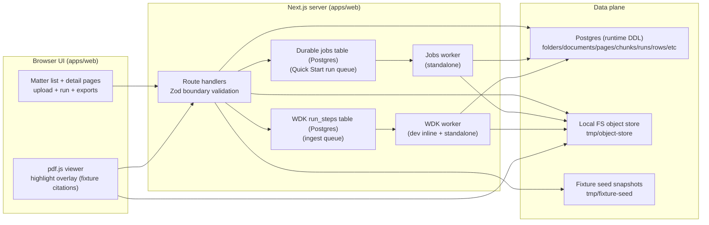

<file_map>
/Users/marc/Code/personal-projects/legaltech-poc
├── apps
│   └── web
│       ├── app
│       │   ├── (api)
│       │   │   ├── folders
│       │   │   │   └── [id]
│       │   │   │       └── runs
│       │   │   │           └── route.ts * +
│       │   │   ├── ...
│       │   ├── (app)
│       │   │   └── ...
│       │   ├── ui
│       │   │   └── ...
│       │   ├── DemoToolbar.tsx +
│       │   ├── globals.css
│       │   ├── head.tsx +
│       │   ├── layout.tsx +
│       │   ├── page.tsx +
│       │   └── tokens.css
│       ├── lib
│       │   ├── ai
│       │   │   └── ...
│       │   ├── db
│       │   │   └── ...
│       │   ├── ingest
│       │   │   └── ...
│       │   ├── jobs
│       │   │   └── ...
│       │   ├── retrieval
│       │   │   └── ...
│       │   ├── wdk
│       │   │   └── ...
│       │   ├── questionSet.server.ts * +
│       │   ├── artefacts.routes.test.ts +
│       │   ├── basicAuth.ts +
│       │   ├── citations.routes.test.ts +
│       │   ├── db.server.ts +
│       │   ├── demoMode.server.ts +
│       │   ├── devOnly.ts +
│       │   ├── devOnlyApi.server.ts +
│       │   ├── exportCsv.routes.test.ts +
│       │   ├── exportCsv.server.test.ts +
│       │   ├── exportCsv.server.ts +
│       │   ├── exportDocx.routes.test.ts +
│       │   ├── fixtureSeed.server.ts +
│       │   ├── folderState.server.ts +
│       │   ├── httpRange.server.test.ts +
│       │   ├── httpRange.server.ts +
│       │   ├── ids.ts +
│       │   ├── memoDocx.server.ts +
│       │   ├── objectStore.server.test.ts +
│       │   ├── objectStore.server.ts +
│       │   ├── overlayHighlight.ts +
│       │   ├── quickStartRunProcessor.server.ts +
│       │   ├── quickStartRunQueue.server.ts +
│       │   ├── runtimeMode.ts +
│       │   ├── safeErrMessage.ts +
│       │   ├── safePdfFilename.server.ts +
│       │   ├── spikes.server.ts +
│       │   ├── trace.server.ts +
│       │   └── validateNormPolygons.ts +
│       ├── steps
│       │   ├── quickStartWriteRowV0.step.server.ts * +
│       │   ├── ingestDocumentProcess.step.server.ts +
│       │   ├── quickStartExecuteV0.step.server.ts +
│       │   ├── quickStartStepHandlers.server.ts +
│       │   ├── wdkSmokeDone.step.server.ts +
│       │   ├── wdkSmokeFlaky.step.server.ts +
│       │   ├── wdkSmokeInit.step.server.ts +
│       │   └── wdkSmokeStepHandlers.server.ts +
│       ├── workflows
│       │   ├── quickStartTitleSurveyWorkflow.server.ts * +
│       │   ├── ingestDocumentWorkflow.server.ts +
│       │   └── wdkSmokeWorkflow.server.ts +
│       ├── scripts
│       │   └── worker.ts +
│       ├── test
│       │   ├── fixtures
│       │   │   └── ...
│       │   ├── stubs
│       │   │   └── ...
│       │   ├── chunksRetrievalSchema.int.test.ts +
│       │   ├── citationsOneOf.int.test.ts +
│       │   ├── demoChecklist.sync.test.ts +
│       │   ├── foldersRunsRoute.wdk.int.test.ts +
│       │   ├── hybridSearchGoldenQuestions.smoke.int.test.ts +
│       │   ├── hybridSearchMerge.test.ts +
│       │   ├── ingestCutoverFlag.test.ts +
│       │   ├── ingestDocumentStepIdempotency.int.test.ts +
│       │   ├── ingestDocumentWorkflow.int.test.ts +
│       │   ├── wdkDirectiveGuardrail.test.ts +
│       │   └── wdkStepQueue.int.test.ts +
│       ├── types
│       │   └── pdfjs-dist.d.ts
│       ├── .env.example
│       ├── .eslintrc.json
│       ├── AGENTS.md
│       ├── Dockerfile
│       ├── middleware.ts +
│       ├── next-env.d.ts
│       ├── next.config.js +
│       ├── package.json
│       ├── postcss.config.js +
│       ├── tailwind.config.ts +
│       ├── tailwind.preset.ts +
│       ├── tsconfig.json
│       ├── tsconfig.tsbuildinfo
│       └── vitest.config.ts +
├── docs
│   ├── 03-architecture
│   │   ├── 07_current_poc_runtime.md *
│   │   ├── 20_state_model.md *
│   │   ├── DECISIONS.md *
│   │   ├── .gitkeep
│   │   ├── 00_overview.md
│   │   ├── 01_onboarding_checklist.md
│   │   ├── 05_tech_stack_and_dev_workflow.md
│   │   ├── 06_frameworks_agents_rag_evals.md
│   │   ├── 10_system_architecture.md
│   │   ├── 30_data_model.md
│   │   ├── 40_rag_and_agents.md
│   │   ├── 50_api_surface.md
│   │   ├── 60_observability_and_evals.md
│   │   ├── AGENTS.md
│   │   └── INVESTIGATION.md
│   ├── 04-projects
│   │   ├── 02-features
│   │   │   ├── 0002_quick-start-engine
│   │   │   │   ├── specs
│   │   │   │   │   ├── comparator_spec_v0.md *
│   │   │   │   │   ├── list_payload_v0.schema.md *
│   │   │   │   │   ├── list_verification_policy_v1.md *
│   │   │   │   │   └── question_set_v1.json *
│   │   │   │   ├── brief.md *
│   │   │   │   ├── investigation-report.md *
│   │   │   │   ├── prd.json *
│   │   │   │   ├── risk-register.md *
│   │   │   │   ├── spike-investigation.md *
│   │   │   │   ├── stuck-extract.md *
│   │   │   │   ├── ...
│   │   │   ├── 0001_trust-substrate
│   │   │   │   └── ...
│   │   │   ├── 0003_demo-grade-outputs
│   │   │   │   └── ...
│   │   │   ├── 0004_csv-export
│   │   │   │   └── ...
│   │   │   ├── 0005_word-export
│   │   │   │   └── ...
│   │   │   ├── 0006_eval-harness
│   │   │   │   └── ...
│   │   │   ├── 0007_demo-prod-deploy
│   │   │   │   └── ...
│   │   │   ├── 0007_demo-reliability
│   │   │   │   └── ...
│   │   │   ├── 0008_artefacts-foundation
│   │   │   │   └── ...
│   │   │   ├── 0009_contradiction-radar
│   │   │   │   └── ...
│   │   │   ├── 0010_cite-capsules
│   │   │   │   └── ...
│   │   │   ├── 0011_chat_interface
│   │   │   │   └── ...
│   │   │   └── .gitkeep
│   │   ├── 04-refactors
│   │   │   ├── 0004_quick-start-to-wdk
│   │   │   │   ├── plan.md *
│   │   │   │   ├── prd.json *
│   │   │   │   ├── ...
│   │   │   ├── 0001_v5-ui-alignment
│   │   │   │   └── ...
│   │   │   ├── 0002_durable-jobs
│   │   │   │   └── ...
│   │   │   ├── 0003_wdk-runtime
│   │   │   │   └── ...
│   │   │   ├── 0005_citations-db-first
│   │   │   │   └── ...
│   │   │   ├── 0006_security-audit-remediation
│   │   │   │   └── ...
│   │   │   ├── 0007_empty-text-sentinel-chunks
│   │   │   │   └── ...
│   │   │   └── .gitkeep
│   │   ├── 01-experiments-prototypes
│   │   │   └── .gitkeep
│   │   ├── 03-fixes
│   │   │   ├── 0001_drift
│   │   │   │   └── ...
│   │   │   ├── 0002_arch-drift-guardrails
│   │   │   │   └── ...
│   │   │   └── .gitkeep
│   │   ├── 05-migrations
│   │   │   └── .gitkeep
│   │   ├── _templates
│   │   │   ├── .gitkeep
│   │   │   ├── README.md
│   │   │   ├── breadboard.md
│   │   │   ├── json-prd.schema.json
│   │   │   ├── pack.md
│   │   │   ├── prd.md
│   │   │   ├── release-checklist.md
│   │   │   └── spike-plan.md
│   │   ├── .gitkeep
│   │   ├── AGENTS.md
│   │   └── README.md
│   ├── 00-strategy
│   │   ├── initiatives
│   │   │   ├── 100_chat_interface
│   │   │   │   └── ...
│   │   │   ├── 001-003_dependency_plan.md
│   │   │   ├── 001-003_handoff.md
│   │   │   ├── 001-trust-substrate.md
│   │   │   ├── 002-quick-start-engine.md
│   │   │   ├── 003-polishing-for-demo-and-non-func-hardening.md
│   │   │   ├── 100_chat_interface
│   │   │   ├── initiative-overview-001-002-003.md
│   │   │   └── prd-slicing-rules.md
│   │   ├── opportunity-solution-tree.md
│   │   ├── product-principles.md
│   │   ├── product-strategy-1-pager.md
│   │   ├── product-strategy-detailed.md
│   │   ├── roadmap.md
│   │   ├── sales-pitch.md
│   │   └── segmentation-notes.md
│   ├── 01-insights
│   │   ├── capabilities
│   │   │   ├── .gitkeep
│   │   │   ├── PoC-architecture-brainstorming2_chatGPT.md
│   │   │   ├── PoC-architecture-brainstorming3_claude.md
│   │   │   ├── PoC-architecture-brainstorming_chatGPT.md
│   │   │   └── README.md
│   │   ├── competitors
│   │   │   ├── .gitkeep
│   │   │   ├── competitor_overview_chatGPT.md
│   │   │   └── competitor_overview_claude.md
│   │   ├── customers
│   │   │   ├── product-metrics
│   │   │   │   └── ...
│   │   │   ├── user-calls
│   │   │   │   └── ...
│   │   │   └── .gitkeep
│   │   ├── tech-and-market
│   │   │   ├── .gitkeep
│   │   │   └── US-CRE-due-diligence_codex.md
│   │   └── .gitkeep
│   ├── 02-guidelines
│   │   ├── archive
│   │   │   ├── brand-preview.html
│   │   │   ├── design-system-v1-warm-light.html
│   │   │   ├── design-system-v2-dark-editorial.html
│   │   │   ├── design-system-v3-orange-energy.html
│   │   │   ├── design-system-v4-soft-cyan.html
│   │   │   ├── design-system-v5-purple-accent.html
│   │   │   └── design-system-v6-earthy-organic.html
│   │   ├── inspiration
│   │   │   ├── brand-dna-2026-02-06
│   │   │   │   └── ...
│   │   │   ├── tailwind
│   │   │   │   └── ...
│   │   │   ├── .gitkeep
│   │   │   ├── README.md
│   │   │   ├── brand_guidelines.md
│   │   │   ├── design_tokens.json
│   │   │   └── prompt_library.json
│   │   ├── v1-warm-editorial
│   │   │   ├── design-system.html
│   │   │   ├── tailwind.preset.ts +
│   │   │   └── tokens.css
│   │   ├── v2-refined-neutral
│   │   │   ├── design-system.html
│   │   │   ├── tailwind.preset.ts +
│   │   │   └── tokens.css
│   │   ├── v3-deep-ink
│   │   │   ├── design-system.html
│   │   │   ├── tailwind.preset.ts +
│   │   │   └── tokens.css
│   │   ├── v4-frost-and-fire
│   │   │   ├── design-system.html
│   │   │   ├── tailwind.preset.ts +
│   │   │   └── tokens.css
│   │   ├── v5-final
│   │   │   ├── design-system.html
│   │   │   ├── tailwind.preset.ts +
│   │   │   └── tokens.css
│   │   ├── .gitkeep
│   │   ├── AGENTS.md
│   │   ├── brand-guidelines.md
│   │   └── brand-tone.md
│   ├── 05-reviews-audits
│   │   ├── code-simplicity
│   │   │   ├── code-simplicity-audit-2026-02-10.md
│   │   │   ├── oracle-bundle_code-simplicity_2026-02-10-2.md
│   │   │   ├── oracle-bundle_code-simplicity_2026-02-10.md
│   │   │   ├── oracle-prompt-20260210-140236.file_map.md
│   │   │   └── oracle-prompt-20260210-140236.md
│   │   ├── e2e-testing
│   │   │   ├── 0001_citation-viewer-highlight
│   │   │   │   └── ...
│   │   │   ├── 0002_missing-input-checklist
│   │   │   │   └── ...
│   │   │   └── 0003_fail-closed-export-gating
│   │   │       └── ...
│   │   ├── security
│   │   │   ├── oracle-bundle_security-audit_2026-02-10.md
│   │   │   ├── oracle-prompt-security-audit-2026-02-10.md
│   │   │   ├── oracle-response-rp.md
│   │   │   ├── oracle-response.md
│   │   │   ├── security_best_practices_report-rp.md
│   │   │   └── security_best_practices_report.md
│   │   ├── .gitkeep
│   │   └── governance.md
│   ├── 06-release
│   │   ├── demo-runbook
│   │   │   └── 2026-02-09_legaltech-poc-demo
│   │   │       └── ...
│   │   ├── postmortems
│   │   │   └── .gitkeep
│   │   ├── .gitkeep
│   │   ├── AGENTS.md
│   │   └── CHANGELOG.md
│   ├── 08-example-data
│   │   ├── pack_01_clean
│   │   │   ├── docs
│   │   │   │   └── ...
│   │   │   ├── layout
│   │   │   │   └── ...
│   │   │   ├── truth
│   │   │   │   └── ...
│   │   │   └── manifest.json
│   │   ├── pack_02_missing_rea
│   │   │   ├── docs
│   │   │   │   └── ...
│   │   │   ├── layout
│   │   │   │   └── ...
│   │   │   ├── truth
│   │   │   │   └── ...
│   │   │   └── manifest.json
│   │   ├── pack_03_mismatch_and_cert_gap
│   │   │   ├── docs
│   │   │   │   └── ...
│   │   │   ├── layout
│   │   │   │   └── ...
│   │   │   ├── truth
│   │   │   │   └── ...
│   │   │   └── manifest.json
│   │   ├── pack_04_multi_parcel
│   │   │   ├── docs
│   │   │   │   └── ...
│   │   │   ├── layout
│   │   │   │   └── ...
│   │   │   ├── truth
│   │   │   │   └── ...
│   │   │   └── manifest.json
│   │   ├── pack_05_partial_release
│   │   │   ├── docs
│   │   │   │   └── ...
│   │   │   ├── layout
│   │   │   │   └── ...
│   │   │   ├── truth
│   │   │   │   └── ...
│   │   │   └── manifest.json
│   │   ├── pack_06_overlapping_easements
│   │   │   ├── docs
│   │   │   │   └── ...
│   │   │   ├── layout
│   │   │   │   └── ...
│   │   │   ├── truth
│   │   │   │   └── ...
│   │   │   └── manifest.json
│   │   ├── pack_07_scans_rotated_low_quality
│   │   │   ├── docs
│   │   │   │   └── ...
│   │   │   ├── layout
│   │   │   │   └── ...
│   │   │   ├── truth
│   │   │   │   └── ...
│   │   │   └── manifest.json
│   │   ├── pack_08_defined_terms_and_cross_refs
│   │   │   ├── docs
│   │   │   │   └── ...
│   │   │   ├── layout
│   │   │   │   └── ...
│   │   │   ├── truth
│   │   │   │   └── ...
│   │   │   └── manifest.json
│   │   ├── pack_09_bad_citation
│   │   │   ├── docs
│   │   │   │   └── ...
│   │   │   ├── layout
│   │   │   │   └── ...
│   │   │   ├── produced
│   │   │   │   └── ...
│   │   │   ├── truth
│   │   │   │   └── ...
│   │   │   └── manifest.json
│   │   ├── README.md
│   │   ├── packs_summary.csv
│   │   └── packs_summary.md
│   ├── 96-engineering-tutor-learnings
│   │   ├── 2026-02-06_brand-dna-web-app-design-language.md
│   │   ├── 2026-02-07_orbital-architecture-decisions-and-overview.md
│   │   ├── 2026-02-07_trust-substrate-verification-overrides-and-rh2-fallbacks.md
│   │   ├── 2026-02-08_adr-0001_evidence-first-outputs-with-citation-ids-and-locking.md
│   │   ├── 2026-02-08_adr-0002_verification-is-fail-closed.md
│   │   ├── 2026-02-08_adr-0003_ocr-layout-extraction-is-the-default-for-all-pdfs.md
│   │   ├── 2026-02-08_adr-0004_hybrid-retrieval-returning-chunk-ids-lexical-vector.md
│   │   ├── 2026-02-08_adr-0005_deterministic-ish-orchestration-via-workflow-devkit-steps.md
│   │   ├── 2026-02-08_adr-0006_fixture-driven-evals-are-first-class.md
│   │   ├── 2026-02-08_adr-0007_no-external-web-research-inside-poc-runs.md
│   │   ├── 2026-02-08_adr-0008_explicit-error-envelope-for-apis.md
│   │   ├── 2026-02-08_adr-0009_deployment-posture-is-hetzner-first-single-vm-until-proven-otherwise.md
│   │   ├── 2026-02-08_adr-0010_use-s3-compatible-object-storage-as-the-baseline.md
│   │   ├── 2026-02-08_adr-0011_postgres-is-the-primary-datastore-local-dev-hetzner-in-deploy.md
│   │   ├── 2026-02-08_adr-0012_ocr-layout-extraction-is-abstracted-behind-a-single-provider-adapter.md
│   │   ├── 2026-02-08_adr-0013_llm-embeddings-calls-go-through-ai-sdk-gateway-is-default.md
│   │   ├── 2026-02-08_adr-0014_create-a-minimal-runnable-scaffold-to-validate-the-architecture.md
│   │   ├── 2026-02-08_adr-0015_deterministic-page-bounded-chunking-line-window-v1-index-version-bump-rules.md
│   │   ├── 2026-02-08_adr-0016_file-backed-immutable-question-sets-with-run-pinning-and-completed-invariants.md
│   │   ├── 2026-02-08_adr-0017_verification-v1-is-integrity-only-no-entailment-model.md
│   │   ├── 2026-02-08_adr-0018_run-trace-export-is-and-is-admin-token-gated.md
│   │   ├── 2026-02-08_adr-0019_unsafe-export-override-is-api-only-and-gated-behind-demo-flags-admin-token.md
│   │   ├── 2026-02-08_adr-0020_rh2-overlay-is-verified-at-100-zoom-only-in-poc-v1-regression-proof-is-artifact-based.md
│   │   ├── 2026-02-08_adr-0021_data-handling-posture-storage-provider-boundaries-and-redaction-defaults.md
│   │   ├── 2026-02-08_adr-0022_docker-compose-and-sprite.md
│   │   ├── 2026-02-08_adr-0022_docker-compose-usage-local-services-and-sprite-as-a-dev-sandbox-both-supported.md
│   │   ├── 2026-02-09_dev-only-vs-demo-mode.md
│   │   ├── 2026-02-10_architecture-drift-0011-chat-interface.md
│   │   └── 2026-02-10_demo-prod-vs-demo-mode.md
│   ├── 98-tmp
│   │   ├── 2026-02-06_infra-investigation
│   │   │   ├── README.md
│   │   │   ├── deployment.md
│   │   │   ├── llm-gateways.md
│   │   │   ├── ocr.md
│   │   │   ├── oracle_bundles.md
│   │   │   ├── recommended-stack.md
│   │   │   └── storage.md
│   │   ├── handoffs
│   │   │   ├── handoff_2026-02-06_17-35-25_shape-split-commits.md
│   │   │   └── handoff_2026-02-09_10-07-28_demo-setup-runbook-app.md
│   │   ├── oracle
│   │   │   ├── oracle-bundles
│   │   │   │   └── ...
│   │   │   ├── oracle-arch-drift.md
│   │   │   └── oracle-prompt_demo-architecture-alignment_2026-02-07.md
│   │   ├── .gitkeep
│   │   ├── README.md
│   │   ├── oracle-03-architecture-review-manual.md
│   │   ├── oracle-prompt_0002-response.md
│   │   ├── oracle-prompt_quick-start_0002_vs_0004_2026-02-10.md
│   │   ├── oracle-prompt_trust-substrate_2026-02-07.md
│   │   └── oracle-prompt_trust-substrate_2026-02-07_v2.md
│   ├── 99-archive
│   │   └── .gitkeep
│   ├── AGENTS.md
│   └── LEARNINGS.md
├── packages
│   ├── core
│   │   ├── src
│   │   │   ├── schemas
│   │   │   │   ├── list_payload_v0.ts * +
│   │   │   │   ├── ...
│   │   │   ├── chunking
│   │   │   │   └── ...
│   │   │   ├── citations
│   │   │   │   └── ...
│   │   │   ├── exception-matching
│   │   │   │   └── ...
│   │   │   ├── fixtures
│   │   │   │   └── ...
│   │   │   ├── geometry
│   │   │   │   └── ...
│   │   │   ├── missing-docs
│   │   │   │   └── ...
│   │   │   ├── spikes
│   │   │   │   └── ...
│   │   │   ├── verify
│   │   │   │   └── ...
│   │   │   ├── index.ts +
│   │   │   ├── safe-error.ts +
│   │   │   └── server.ts +
│   │   ├── package.json
│   │   ├── tsconfig.build.json
│   │   └── tsconfig.json
│   └── .gitkeep
├── .agents
│   ├── backup
│   │   └── 2026-02-08T12-17-42-189Z
│   │       └── manifest.json
│   ├── hooks
│   │   ├── git
│   │   │   ├── commit-msg
│   │   │   ├── post-merge
│   │   │   ├── pre-commit
│   │   │   ├── pre-push
│   │   │   └── prepare-commit-msg
│   │   └── README.md
│   ├── skills
│   │   ├── 00-utilities
│   │   │   ├── agent-browser
│   │   │   │   └── ...
│   │   │   ├── agentation
│   │   │   │   └── ...
│   │   │   ├── ask-questions-if-underspecified
│   │   │   │   └── ...
│   │   │   ├── beautiful-mermaid
│   │   │   │   └── ...
│   │   │   ├── brand-dna-extractor
│   │   │   │   └── ...
│   │   │   ├── browser-use
│   │   │   │   └── ...
│   │   │   ├── commit
│   │   │   │   └── ...
│   │   │   ├── create-cli
│   │   │   │   └── ...
│   │   │   ├── dev-browser
│   │   │   │   └── ...
│   │   │   ├── docs-list
│   │   │   │   └── ...
│   │   │   ├── engineering-tutor
│   │   │   │   └── ...
│   │   │   ├── every-style-editor
│   │   │   │   └── ...
│   │   │   ├── file-todos
│   │   │   │   └── ...
│   │   │   ├── firecrawl
│   │   │   │   └── ...
│   │   │   ├── framework-docs-researcher
│   │   │   │   └── ...
│   │   │   ├── handoff
│   │   │   │   └── ...
│   │   │   ├── landpr
│   │   │   │   └── ...
│   │   │   ├── markdown-converter
│   │   │   │   └── ...
│   │   │   ├── nano-banana-pro
│   │   │   │   └── ...
│   │   │   ├── openai-image-gen
│   │   │   │   └── ...
│   │   │   ├── oracle
│   │   │   │   └── ...
│   │   │   ├── parallel-web-tools
│   │   │   │   └── ...
│   │   │   ├── pickup
│   │   │   │   └── ...
│   │   │   └── video-transcript-downloader
│   │   │       └── ...
│   │   ├── 02-shape
│   │   │   ├── breadboarding
│   │   │   │   └── ...
│   │   │   ├── brief
│   │   │   │   └── ...
│   │   │   ├── create-json-prd
│   │   │   │   └── ...
│   │   │   ├── create-prd
│   │   │   │   └── ...
│   │   │   ├── spike-investigation
│   │   │   │   └── ...
│   │   │   └── wf-shape
│   │   │       └── ...
│   │   ├── 03-plan
│   │   │   ├── best-practices-researcher
│   │   │   │   └── ...
│   │   │   ├── bug-reproduction-validator
│   │   │   │   └── ...
│   │   │   ├── deepen-plan
│   │   │   │   └── ...
│   │   │   ├── plan-review
│   │   │   │   └── ...
│   │   │   ├── repo-research-analyst
│   │   │   │   └── ...
│   │   │   ├── reproduce-bug
│   │   │   │   └── ...
│   │   │   ├── spec-flow-analyzer
│   │   │   │   └── ...
│   │   │   ├── triage
│   │   │   │   └── ...
│   │   │   └── wf-plan
│   │   │       └── ...
│   │   ├── 04-develop
│   │   │   ├── 00-frontend-general
│   │   │   │   └── ...
│   │   │   ├── 01-ui-skills-dot-com
│   │   │   │   └── ...
│   │   │   ├── pr-comment-resolver
│   │   │   │   └── ...
│   │   │   ├── use-ai-sdk
│   │   │   │   └── ...
│   │   │   ├── verify
│   │   │   │   └── ...
│   │   │   ├── wf-develop
│   │   │   │   └── ...
│   │   │   └── wf-ralph
│   │   │       └── ...
│   │   ├── 05-review
│   │   │   ├── agent-native-architecture
│   │   │   │   └── ...
│   │   │   ├── agent-native-reviewer
│   │   │   │   └── ...
│   │   │   ├── architecture-strategist
│   │   │   │   └── ...
│   │   │   ├── code-simplicity-reviewer
│   │   │   │   └── ...
│   │   │   ├── data-integrity-guardian
│   │   │   │   └── ...
│   │   │   ├── data-migration-expert
│   │   │   │   └── ...
│   │   │   ├── git-history-analyzer
│   │   │   │   └── ...
│   │   │   ├── kieran-python-reviewer
│   │   │   │   └── ...
│   │   │   ├── kieran-typescript-reviewer
│   │   │   │   └── ...
│   │   │   ├── pattern-recognition-specialist
│   │   │   │   └── ...
│   │   │   ├── performance-oracle
│   │   │   │   └── ...
│   │   │   ├── security
│   │   │   │   └── ...
│   │   │   ├── security-sentinel
│   │   │   │   └── ...
│   │   │   ├── test-browser
│   │   │   │   └── ...
│   │   │   └── wf-review
│   │   │       └── ...
│   │   ├── 06-release
│   │   │   ├── changelog
│   │   │   │   └── ...
│   │   │   ├── demo-runbook
│   │   │   │   └── ...
│   │   │   ├── deployment-verification-agent
│   │   │   │   └── ...
│   │   │   └── wf-release
│   │   │       └── ...
│   │   ├── 07-compound
│   │   │   └── compound-docs
│   │   │       └── ...
│   │   ├── 10-audit
│   │   │   └── agent-native-audit
│   │   │       └── ...
│   │   └── 98-skill-maintenance
│   │       ├── create-agent-skills
│   │       │   └── ...
│   │       ├── heal-skill
│   │       │   └── ...
│   │       ├── modular-skills-architect
│   │       │   └── ...
│   │       └── skill-creator
│   │           └── ...
│   └── register.json
├── .claude
│   └── skills
├── .gemini
├── .github
│   └── workflows
│       └── fixture-eval-reports.yml
├── scripts
│   ├── db
│   │   └── init.sql
│   ├── fixtures
│   │   ├── lib
│   │   │   ├── args.ts +
│   │   │   ├── csv.ts +
│   │   │   ├── fs.ts +
│   │   │   ├── geometry.ts +
│   │   │   └── snapshot.ts +
│   │   ├── README.md
│   │   ├── assert_citation_integrity.ts +
│   │   ├── assert_row_invariants.ts +
│   │   ├── compare_truth.ts +
│   │   ├── eval.ts +
│   │   ├── export_truth_match.ts +
│   │   ├── seed.ts +
│   │   └── verify_pack_names.ts +
│   ├── oracle
│   │   └── render_manual_bundle.ts +
│   ├── ast-grep.sh
│   ├── build.sh
│   ├── install_codex_skills_copy.sh
│   ├── install_git_hooks.sh
│   ├── knip.sh
│   ├── lint.sh
│   ├── test.sh
│   ├── typecheck.sh
│   ├── us001_render_smoke.ts +
│   ├── us002_smoke.ts +
│   └── verify.sh
├── tmp
│   ├── oracle-home
│   │   └── sessions
│   ├── .gitkeep
│   ├── oracle-prompt_arch-drift-security_2026-02-09.md
│   ├── oracle-prompt_arch-drift-security_2026-02-09_concise.md
│   ├── oracle-prompt_arch-drift-security_2026-02-09_concise_code-excerpts.md
│   └── oracle-prompt_arch-drift-security_2026-02-09_concise_evidence.md
├── .dockerignore
├── .env.example
├── .gitignore
├── .sprite
├── AGENTS.md
├── LICENSE
├── README.md
├── docker-compose.demo-prod.yml
├── docker-compose.yml
├── package.json
├── pnpm-lock.yaml
├── pnpm-workspace.yaml
└── ralph


(* denotes selected files)
(+ denotes code-map available)
Config: depth cap 3.

File: /Users/marc/Code/personal-projects/legaltech-poc/apps/web/lib/wdk/stepQueue.server.ts
Imports:
  - import "server-only";
  - import type { Sql } from "../db.server";
  - import { ensureSchema, sql } from "../db.server";
  - import { newId } from "../ids";
---

Type-aliases:
  - StepState
  - StepRow
  - JsonArg

Functions:
  - L31: function withDb(db?: Sql): Sql
  - L35: export async function scheduleStep(args: { runId: string; stepKey: string; stepType: string; input: unknown; availableAt?: Date; db?: Sql; }): Promise<{ id: string; inserted: boolean }>
  - L103: export async function claimNextStep(args: { workerId: string; runId?: string; db?: Sql }): Promise<StepRow | null>
  - L149: export async function markStepSucceeded(args: { stepId: string; workerId: string; output: unknown; metrics?: unknown; db?: Sql; }): Promise<void>
  - L177: export async function rescheduleStep(args: { stepId: string; workerId: string; availableAt: Date; error: { code: string; message: string }; db?: Sql; }): Promise<void>
  - L204: export async function markStepFailed(args: { stepId: string; workerId: string; error: { code: string; message: string }; db?: Sql; }): Promise<void>
  - L228: export async function requeueStaleRunningSteps(args: { cutoff: Date; limit?: number; db?: Sql }): Promise<{ n: number }>

Exports:
  - export type StepState = "queued" | "running" | "succeeded" | "failed";
  - export type StepRow = {
  - export async function scheduleStep(args: {
  - export async function claimNextStep(args: { workerId: string; runId?: string; db?: Sql }): Promise<StepRow | null> {
  - export async function markStepSucceeded(args: {
  - export async function rescheduleStep(args: {
  - export async function markStepFailed(args: {
  - export async function requeueStaleRunningSteps(args: { cutoff: Date; limit?: number; db?: Sql }): Promise<{ n: number }> {
---


File: /Users/marc/Code/personal-projects/legaltech-poc/apps/web/lib/quickStartRunProcessor.server.ts
Imports:
  - import "server-only";
  - import {
  LIST_PAYLOAD_V0_SCHEMA_VERSION,
  ListPayloadV0KindSchema,
  ListPayloadV0Schema,
  emptyListPayloadV0,
} from "@legaltech-poc/core";
  - import { ensureSchema, sql } from "./db.server";
  - import { newId } from "./ids";
  - import { loadQuestionSetV1 } from "./questionSet.server";
  - import { safeErrMessage } from "./safeErrMessage";
---

Type-aliases:
  - RunRow
  - FailureCounts
  - JsonArg

Functions:
  - L29: function missingInputRow(args: { folderId: string; questionSetVersion: string; questionId: string; question: string })
  - L58: function citationFailedRow(args: { folderId: string; questionSetVersion: string; questionId: string; question: string })
  - L79: function attachListPayloadIfNeeded<T extends { payload_schema_version: string | null; payload_json: unknown | null }>( row: T, question: { response_kind: string; artefact_kind?: string; payload_schema_version?: string }, ): T
  - L102: function asReasonCode(val: unknown): string | null
  - L120: async function recomputeRunProgress(args: { runId: string }): Promise<{ questionsDone: number; failureCounts: FailureCounts }>
  - L144: export async function processQuickStartRun(runId: string): Promise<void>

Exports:
  - export async function processQuickStartRun(runId: string): Promise<void> {
---

</file_map>
<file_contents>
File: /Users/marc/Code/personal-projects/legaltech-poc/apps/web/steps/quickStartWriteRowV0.step.server.ts
```ts
import "server-only";

import { z } from "zod";

import {
  LIST_PAYLOAD_V0_SCHEMA_VERSION,
  ListPayloadV0KindSchema,
  ListPayloadV0Schema,
  emptyListPayloadV0,
} from "@legaltech-poc/core";

import type { Sql } from "../lib/db.server";
import { ensureSchema, sql } from "../lib/db.server";
import { newId } from "../lib/ids";
import { loadQuestionSetV1 } from "../lib/questionSet.server";
import type { StepRow } from "../lib/wdk/stepQueue.server";

const InputSchema = z.object({
  trace_id: z.string().min(1).nullable().optional(),
  question_id: z.string().min(1),
});

type RunRow = {
  id: string;
  folder_id: string;
  state: string;
  question_set_version: string;
  trace_id: string | null;
  questions_total: number;
  questions_done: number;
};

type QuickStartRowStatus = ReturnType<typeof missingInputRow>["status"] | ReturnType<typeof citationFailedRow>["status"];

type JsonArg = Parameters<typeof sql.json>[0];

function withDb(db?: Sql): Sql {
  return db ?? sql;
}

function missingInputRow(args: { folderId: string; questionSetVersion: string; questionId: string; question: string }) {
  return {
    folder_id: args.folderId,
    question_set_version: args.questionSetVersion,
    question_id: args.questionId,
    question: args.question,
    answer: "Not found in provided documents.",
    status: "missing_input" as const,
    citation_ids: [] as string[],
    notes: null as string | null,
    provenance_json: {
      missing_docs_checklist: [
        {
          label: "Upload the referenced document(s)",
          confidence: 1,
          signals: [
            {
              type: "phrase",
              value: args.question,
              source: "system",
            },
          ],
        },
      ],
    },
    payload_schema_version: null as string | null,
    payload_json: null as unknown | null,
  };
}

function citationFailedRow(args: { folderId: string; questionSetVersion: string; questionId: string; question: string }) {
  return {
    folder_id: args.folderId,
    question_set_version: args.questionSetVersion,
    question_id: args.questionId,
    question: args.question,
    answer: "Unable to produce locked citations in this slice.",
    status: "citation_failed" as const,
    citation_ids: [] as string[],
    notes: null as string | null,
    provenance_json: {
      reason_code: "NO_CITATIONS",
      checklist: [
        "Confirm the correct PDFs are uploaded for this folder.",
        "Re-run the workflow after retrieval+locking is implemented.",
      ],
    },
    payload_schema_version: null as string | null,
    payload_json: null as unknown | null,
  };
}

function attachListPayloadIfNeeded<T extends { payload_schema_version: string | null; payload_json: unknown | null }>(
  row: T,
  question: { response_kind: string; artefact_kind?: string; payload_schema_version?: string },
): T {
  if (question.response_kind !== "list_payload") return row;

  if (question.payload_schema_version !== LIST_PAYLOAD_V0_SCHEMA_VERSION) {
    throw new Error(
      `Unsupported payload_schema_version for list_payload: ${String(question.payload_schema_version ?? "null")}`,
    );
  }

  const kind = ListPayloadV0KindSchema.parse(question.artefact_kind);
  const payload = emptyListPayloadV0(kind);
  ListPayloadV0Schema.parse(payload);

  return {
    ...row,
    payload_schema_version: LIST_PAYLOAD_V0_SCHEMA_VERSION,
    payload_json: payload,
  } as T;
}

export async function quickStartWriteRowV0Step(args: { step: StepRow; workerId: string; db?: Sql }): Promise<{
  output: unknown;
  metrics?: unknown;
}> {
  "use step";

  const input = InputSchema.parse(args.step.input_json);
  const s = withDb(args.db);
  if (!args.db) await ensureSchema();

  // eslint-disable-next-line no-console
  console.info("wdk.quick_start.write_row_v0.started", {
    orchestration: "wdk",
    worker_id: args.workerId,
    step_id: args.step.id,
    run_id: args.step.run_id,
    step_key: args.step.step_key,
    step_type: args.step.step_type,
    attempt: args.step.attempt,
    trace_id: input.trace_id ?? null,
    question_id: input.question_id,
  });

  const startedAt = Date.now();

  const runs = await s<RunRow[]>`
    SELECT id, folder_id, state, question_set_version, trace_id, questions_total, questions_done
    FROM runs
    WHERE id = ${args.step.run_id}
    LIMIT 1
  `;
  const run = runs[0];
  if (!run) {
    return { output: { ok: true, skipped: true, reason: "RUN_NOT_FOUND" }, metrics: { duration_ms: 0, wrote: 0 } };
  }

  if (run.state !== "running") {
    return {
      output: { ok: true, skipped: true, reason: "RUN_NOT_RUNNING", state: run.state },
      metrics: { duration_ms: 0, wrote: 0 },
    };
  }

  const { version: currentQuestionSetVersion, questionSet } = await loadQuestionSetV1();
  if (currentQuestionSetVersion !== run.question_set_version) {
    await s`
      UPDATE runs
      SET state = 'failed',
          error_json = ${s.json({
            code: "QUESTION_SET_MISMATCH",
            message: "Pinned question_set_version does not match current question set.",
          } as JsonArg)},
          updated_at = now()
      WHERE id = ${args.step.run_id}
    `;

    const durationMs = Date.now() - startedAt;
    return {
      output: { ok: false, run_id: args.step.run_id, code: "QUESTION_SET_MISMATCH", duration_ms: durationMs },
      metrics: { duration_ms: durationMs, wrote: 0 },
    };
  }

  let q: (typeof questionSet.questions)[number] | null = null;
  for (const candidate of questionSet.questions) {
    if (candidate.question_id === input.question_id) {
      q = candidate;
      break;
    }
  }

  if (!q) {
    await s`
      UPDATE runs
      SET state = 'failed',
          error_json = ${s.json({
            code: "QUESTION_NOT_FOUND",
            message: "Question not found in current question set.",
            details: { question_id: input.question_id },
          } as JsonArg)},
          updated_at = now()
      WHERE id = ${args.step.run_id}
    `;

    const durationMs = Date.now() - startedAt;
    return {
      output: { ok: false, run_id: args.step.run_id, code: "QUESTION_NOT_FOUND", duration_ms: durationMs },
      metrics: { duration_ms: durationMs, wrote: 0 },
    };
  }

  const docCounts = await s<{ n: number }[]>`
    SELECT COUNT(*)::int as n
    FROM documents
    WHERE folder_id = ${run.folder_id}
      AND upload_completed_at IS NOT NULL
      AND parse_status = 'parsed'
      AND ocr_status = 'done'
  `;
  const hasDocs = (docCounts[0]?.n ?? 0) > 0;

  const baseRow = hasDocs
    ? citationFailedRow({
        folderId: run.folder_id,
        questionSetVersion: run.question_set_version,
        questionId: q.question_id,
        question: q.question,
      })
    : missingInputRow({
        folderId: run.folder_id,
        questionSetVersion: run.question_set_version,
        questionId: q.question_id,
        question: q.question,
      });

  let rowWithPayload: typeof baseRow = baseRow;
  try {
    rowWithPayload = attachListPayloadIfNeeded(baseRow, q);
  } catch {
    rowWithPayload = citationFailedRow({
      folderId: run.folder_id,
      questionSetVersion: run.question_set_version,
      questionId: q.question_id,
      question: q.question,
    });
    rowWithPayload.provenance_json = {
      reason_code: "VALIDATION_ERROR",
      checklist: ["Question set payload metadata is invalid for this row."],
    };
  }

  const reasonCode =
    rowWithPayload.status === "citation_failed"
      ? String((rowWithPayload.provenance_json as { reason_code?: unknown }).reason_code ?? "VALIDATION_ERROR")
      : null;

  const traceId = run.trace_id ?? input.trace_id ?? newId("trc");

  async function attemptWrite(
    row: typeof rowWithPayload,
  ): Promise<{ inserted: boolean; status: QuickStartRowStatus; reason_code: string | null }> {
    const rowReasonCode =
      row.status === "citation_failed"
        ? String((row.provenance_json as { reason_code?: unknown }).reason_code ?? "VALIDATION_ERROR")
        : null;

    const inserted = await s.begin(
      async function (tx) {
        const t = tx as unknown as typeof sql;

        const payload = row.payload_json ?? null;
        const payloadJson = payload === null ? null : t.json(payload as JsonArg);

        const insertedRows = await t<{ id: string }[]>`
          INSERT INTO report_rows (
            id,
            run_id,
            folder_id,
            question_set_version,
            question_id,
            question,
            answer,
            status,
            notes,
            provenance_json,
            payload_schema_version,
            payload_json,
            created_at,
            updated_at
          )
          VALUES (
            ${newId("row")},
            ${args.step.run_id},
            ${row.folder_id},
            ${row.question_set_version},
            ${row.question_id},
            ${row.question},
            ${row.answer},
            ${row.status},
            ${row.notes},
            ${t.json(row.provenance_json)},
            ${row.payload_schema_version},
            ${payloadJson},
            now(),
            now()
          )
          ON CONFLICT (run_id, question_id) DO NOTHING
          RETURNING id
        `;

        if (!insertedRows[0]) return false;

        const reasonKey = rowReasonCode ?? "VALIDATION_ERROR";

        await t`
          UPDATE runs
          SET questions_done = LEAST(questions_total, questions_done + 1),
              failure_counts_json = CASE
                WHEN ${row.status} = 'citation_failed' THEN jsonb_set(
                  failure_counts_json,
                  ARRAY[${reasonKey}]::text[],
                  to_jsonb(COALESCE((failure_counts_json->>${reasonKey})::int, 0) + 1),
                  true
                )
                ELSE failure_counts_json
              END,
              updated_at = now()
          WHERE id = ${args.step.run_id}
        `;

        return true;
      },
    );

    return { inserted, status: row.status, reason_code: rowReasonCode };
  }

  let wrote = false;
  let rowStatus = rowWithPayload.status;
  let finalReasonCode = reasonCode;

  try {
    const res = await attemptWrite(rowWithPayload);
    wrote = res.inserted;
    rowStatus = res.status;
    finalReasonCode = res.reason_code;
  } catch (err) {
    // eslint-disable-next-line no-console
    console.error("wdk.quick_start.write_row_v0.write_failed", {
      orchestration: "wdk",
      worker_id: args.workerId,
      step_id: args.step.id,
      run_id: args.step.run_id,
      step_key: args.step.step_key,
      question_id: input.question_id,
      trace_id: traceId,
      message: err instanceof Error ? err.message : String(err),
    });

    const fallback = citationFailedRow({
      folderId: run.folder_id,
      questionSetVersion: run.question_set_version,
      questionId: q.question_id,
      question: q.question,
    });
    fallback.provenance_json = {
      reason_code: "VALIDATION_ERROR",
      checklist: [
        "Retry the run (step idempotency should avoid duplicates).",
        "Inspect server logs using the run_id and trace_id for correlation.",
      ],
    };
    let fallbackWithPayload: typeof fallback = fallback;
    try {
      fallbackWithPayload = attachListPayloadIfNeeded(fallback, q);
    } catch {
      // Keep the fallback row writable even if question metadata is malformed.
    }

    const fallbackRes = await attemptWrite(fallbackWithPayload);
    wrote = fallbackRes.inserted;
    rowStatus = fallbackRes.status;
    finalReasonCode = fallbackRes.reason_code;
  }

  const completed = await s<Array<{ id: string }>>`
    UPDATE runs
    SET state = 'completed',
        updated_at = now()
    WHERE id = ${args.step.run_id}
      AND state = 'running'
      AND questions_done >= questions_total
    RETURNING id
  `;
  if (completed[0]) {
    // eslint-disable-next-line no-console
    console.info("run.completed", { run_id: args.step.run_id, trace_id: run.trace_id ?? null });
  }

  const durationMs = Date.now() - startedAt;

  // eslint-disable-next-line no-console
  console.info("wdk.quick_start.write_row_v0.completed", {
    orchestration: "wdk",
    worker_id: args.workerId,
    step_id: args.step.id,
    run_id: args.step.run_id,
    step_key: args.step.step_key,
    step_type: args.step.step_type,
    attempt: args.step.attempt,
    duration_ms: durationMs,
    trace_id: traceId,
    question_id: input.question_id,
    wrote,
    row_status: rowStatus,
    reason_code: finalReasonCode,
  });

  return {
    output: {
      ok: true,
      run_id: args.step.run_id,
      trace_id: traceId,
      question_id: input.question_id,
      wrote,
      row_status: rowStatus,
      reason_code: finalReasonCode,
      duration_ms: durationMs,
    },
    metrics: { duration_ms: durationMs, wrote: wrote ? 1 : 0 },
  };
}

```

File: /Users/marc/Code/personal-projects/legaltech-poc/apps/web/lib/questionSet.server.ts
```ts
import "server-only";

import { createHash } from "node:crypto";
import fs from "node:fs";
import path from "node:path";

import { z } from "zod";

const QuestionSchema = z.object({
  question_id: z.string().min(1),
  group: z.string().min(1),
  question: z.string().min(1),
  response_kind: z.string().min(1),
  artefact_kind: z.string().min(1).optional(),
  payload_schema_version: z.string().min(1).optional(),
});

const QuestionSetSchema = z.object({
  question_set_id: z.string().min(1),
  question_set_version_format: z.string().min(1),
  questions: z.array(QuestionSchema).min(1),
});

type QuestionSet = z.infer<typeof QuestionSetSchema>;

type GlobalCache = typeof globalThis & {
  __orbitalQuestionSetV1?: Promise<{ questionSet: QuestionSet; version: string }>;
};

function stableStringify(value: unknown): string {
  if (value === null) return "null";
  if (typeof value === "string") return JSON.stringify(value);
  if (typeof value === "number") return Number.isFinite(value) ? String(value) : "null";
  if (typeof value === "boolean") return value ? "true" : "false";
  if (Array.isArray(value)) return `[${value.map(stableStringify).join(",")}]`;
  if (typeof value === "object") {
    const obj = value as Record<string, unknown>;
    const keys = Object.keys(obj).sort();
    return `{${keys.map((k) => `${JSON.stringify(k)}:${stableStringify(obj[k])}`).join(",")}}`;
  }
  // JSON does not support undefined/functions/symbols; treat them as null.
  return "null";
}

function sha256Hex(bytes: string): string {
  return createHash("sha256").update(bytes, "utf8").digest("hex");
}

function questionSetV1Path(): string {
  // Keep the source of truth in docs until we extract it into a dedicated package.
  // In Next dev, `process.cwd()` resolves to `apps/web`, so probe both locations.
  const rel = "docs/04-projects/02-features/0002_quick-start-engine/specs/question_set_v1.json";
  const direct = path.resolve(process.cwd(), rel);
  if (fs.existsSync(direct)) return direct;
  return path.resolve(process.cwd(), "../..", rel);
}

export async function loadQuestionSetV1(): Promise<{ questionSet: QuestionSet; version: string }> {
  const g = globalThis as GlobalCache;
  if (!g.__orbitalQuestionSetV1) {
    g.__orbitalQuestionSetV1 = (async () => {
      const filePath = questionSetV1Path();
      const rawText = fs.readFileSync(filePath, "utf8");
      const rawJson = JSON.parse(rawText) as unknown;
      const parsed = QuestionSetSchema.parse(rawJson);

      // v1 is pinned as 1.0 for the PoC; the hash guards immutability.
      const canonical = stableStringify(rawJson);
      const hex = sha256Hex(canonical);
      const version = `qs:0002:v1.0:sha256:${hex}`;

      return { questionSet: parsed, version };
    })();
  }
  return g.__orbitalQuestionSetV1;
}

```

File: /Users/marc/Code/personal-projects/legaltech-poc/docs/03-architecture/DECISIONS.md
```md
# Architecture decisions (ADRs)

Append-only log of architecture decisions for Orbital Copilot PoC. Add new ADRs at the end and link the PR.
Doc-sync rule: when an ADR is added or changed, update the relevant downstream docs in the same PR (or add a dated note in `docs/03-architecture/INVESTIGATION.md` describing the drift and owner).

## ADR format (minimal)

```md
## ADR-0000: Title
- Status: proposed | accepted | superseded | deprecated
- Date: YYYY-MM-DD

Context
- Why are we making this decision?

Decision
- What did we decide?

Consequences
- What does this enable/force?
- What are the risks/trade-offs?

Links
- PR:
- Related docs:
```

---

## ADR-0001: Evidence-first outputs with citation IDs and locking
- Status: accepted
- Date: 2026-02-06

Context
- Trust UX is the product: every material claim needs inspectable evidence.

Decision
- Drafting produces structured rows with **candidate citations as chunk IDs** (no free-text citations).
- We **lock** citations by creating immutable `citations` records containing `{snippet, snippet_hash, geometry}`.
- Report rows refer to citations by `citation_id` only.

Consequences
- We can highlight evidence even if chunking/indexing changes later.
- Provenance is sufficient for debugging and replay without re-running the model.

Links
- Related docs: `docs/03-architecture/40_rag_and_agents.md`, `docs/03-architecture/30_data_model.md`

## ADR-0002: Verification is fail-closed
- Status: accepted
- Date: 2026-02-06

Context
- A plausible answer without valid evidence is worse than “not found”.

Decision
- Any citation lock mismatch or verification failure sets row status to `citation_failed`.
- `citation_failed` rows are non-exportable by default.

Consequences
- Reduces false trust at the cost of more “blocked” outputs early.
- Forces us to invest in retrieval + citation integrity.

Links
- Related docs: `docs/03-architecture/20_state_model.md`, `docs/03-architecture/60_observability_and_evals.md`

## ADR-0003: OCR/layout extraction is the default for all PDFs
- Status: accepted
- Date: 2026-02-06

Context
- Scans are common in CRE diligence packs; highlights require geometry.

Decision
- Every uploaded PDF is processed with OCR/layout extraction and persisted to `document_pages` as canonical text + polygons.

Consequences
- More ingest cost/latency, but consistent highlighting and chunking.
- Enables citation hashing and geometric overlays as first-class features.

Links
- Related docs: `docs/03-architecture/05_tech_stack_and_dev_workflow.md`, `docs/03-architecture/30_data_model.md`

## ADR-0004: Hybrid retrieval returning chunk IDs (lexical + vector)
- Status: accepted
- Date: 2026-02-06

Context
- CRE packs mix boilerplate and highly specific clauses; we need both recall and precision.

Decision
- Retrieval is hybrid (tsvector + embeddings) and returns **chunk IDs** (with scores) rather than prose.
- Optional rerank can be added, but must not change the “IDs-only” contract.

Consequences
- Retrieval becomes measurable (Recall@K, drift detection).
- Downstream steps can be schema-driven and deterministic.

Links
- Related docs: `docs/03-architecture/40_rag_and_agents.md`, `docs/03-architecture/60_observability_and_evals.md`

## ADR-0005: Deterministic-ish orchestration via Workflow DevKit steps
- Status: accepted
- Date: 2026-02-06

Context
- We need resumability, retries, and row-by-row progress without “agent loops”.

Decision
- Quick Start is implemented as a WDK workflow that coordinates explicit steps (`retrieve → draft → lock → verify → write`).
- Use `"use workflow"` / `"use step"` directives to make side-effect boundaries explicit.

Consequences
- Workflows remain predictable; side effects are isolated and observable.
- Keeps WDK integration thin (domain logic stays in `packages/core`).

Implementation status
- Target posture: WDK workflows/steps.
- Current repo runtime may temporarily diverge (see `docs/03-architecture/07_current_poc_runtime.md`).
- Planned sequencing and closure of this drift: `docs/04-projects/02-features/0011_chat_interface/plan.program-sequencing.md`.

Links
- Related docs: `docs/03-architecture/06_frameworks_agents_rag_evals.md`, `docs/03-architecture/10_system_architecture.md`

## ADR-0006: Fixture-driven evals are first-class
- Status: accepted
- Date: 2026-02-06

Context
- Demos fail when extraction/retrieval drifts; fixtures let us regress deterministically.

Decision
- Maintain synthetic packs with `/docs`, `/truth`, `/layout`.
- Run `fixture:eval` to produce per-pack eval reports and a cross-pack summary.
- Start as report-only, then gate CI on hard trust metrics (schema + citation integrity).

Consequences
- Faster iteration with fewer demo regressions.
- Forces us to encode “expected failure journeys” as fixtures.

Links
- Related docs: `docs/03-architecture/05_tech_stack_and_dev_workflow.md`, `docs/03-architecture/60_observability_and_evals.md`

## ADR-0007: No external web research inside PoC runs
- Status: accepted
- Date: 2026-02-06

Context
- PoC must be defensible based on provided diligence documents only.

Decision
- Quick Start uses only the uploaded pack for retrieval and reasoning.

Consequences
- Clear provenance and a simpler security posture.
- Some questions will legitimately resolve to `missing_input`.

Links
- Related docs: `docs/03-architecture/00_overview.md`, `docs/03-architecture/06_frameworks_agents_rag_evals.md`

## ADR-0008: Explicit error envelope for APIs
- Status: accepted
- Date: 2026-02-06

Context
- Clients need stable contracts; we must not leak internal errors/provider payloads.

Decision
- Standardise non-2xx responses on a single JSON error envelope with safe `code`, `message`, optional `details`, and optional `trace_id`.

Consequences
- Frontend can implement consistent error handling.
- Makes observability and support workflows simpler.

Links
- Related docs: `docs/03-architecture/50_api_surface.md`, `docs/03-architecture/AGENTS.md`

## ADR-0009: Deployment posture is Hetzner-first (single VM) until proven otherwise
- Status: accepted
- Date: 2026-02-06

Context
- The PoC needs durable orchestration (WDK) and long-running side effects (OCR/embeddings/LLM calls).
- A single-VM deployment reduces moving parts and avoids serverless DB connection pitfalls.

Decision
- Default deployment target is a Hetzner VM running the Next.js server + WDK worker + Postgres (and optionally MinIO).
- Vercel stays optional for later once the runtime shape is stable.
- We may deploy the web app (`apps/web`) to Vercel in the future (including preview deployments), while keeping worker + Postgres on the VM.

Consequences
- Faster path to a stable demo and simpler debugging.
- We own basic ops (TLS, process supervision, backups, monitoring).

Links
- Related docs: `docs/03-architecture/10_system_architecture.md`, `docs/03-architecture/05_tech_stack_and_dev_workflow.md`
- Investigation: `docs/98-tmp/2026-02-06_infra-investigation/deployment.md`

## ADR-0010: Use S3-compatible object storage as the baseline
- Status: accepted
- Date: 2026-02-06

Context
- We need to store raw PDFs and exports and serve pages to pdf.js reliably.
- We want portability between local dev and Hetzner deployment (and optionally Vercel).

Decision
- Use S3-compatible object storage as the baseline contract.
- Local dev: MinIO (or local filesystem for ultra-simple early dev).
- Deployment: prefer managed S3-compatible storage unless explicitly "single VM only".

Consequences
- Standard tooling (AWS SDK) and a clean signed-URL story.
- If we self-host storage (MinIO), we must own backups and durability.

Links
- Related docs: `docs/03-architecture/05_tech_stack_and_dev_workflow.md`
- Investigation: `docs/98-tmp/2026-02-06_infra-investigation/storage.md`

## ADR-0011: Postgres is the primary datastore (local dev; Hetzner in deploy)
- Status: accepted
- Date: 2026-02-06

Context
- Postgres is already the planned "truth store" (rows, runs, steps, citations) and supports pgvector + tsvector.
- The PoC is single-tenant and can start with a single Postgres instance.

Decision
- Local dev: Postgres via Docker Compose or Sprite (ADR-0022).
- Deployment: self-host Postgres on the Hetzner VM with automated backups and monitoring.

Consequences
- Simple data plane and predictable latency.
- If we later put the web/API on Vercel, we must add connection pooling and strict limits.

Links
- Related docs: `docs/03-architecture/05_tech_stack_and_dev_workflow.md`, `docs/03-architecture/30_data_model.md`

## ADR-0012: OCR/layout extraction is abstracted behind a single provider adapter
- Status: accepted
- Date: 2026-02-06

Context
- Highlight overlays require geometry.
- We want to keep the provider choice reversible (Azure Document Intelligence vs AWS Textract).

Decision
- Default provider: Azure Document Intelligence (Layout), unless an AWS-first posture is chosen.
- Implement a single OCR adapter interface returning a canonical per-page schema.

Consequences
- Provider swaps are a bounded change (mostly isolated to the adapter).
- We can tune for cost/quality without rewriting downstream chunking/citations.

Links
- Related docs: `docs/03-architecture/05_tech_stack_and_dev_workflow.md`, `docs/03-architecture/40_rag_and_agents.md`
- Investigation: `docs/98-tmp/2026-02-06_infra-investigation/ocr.md`

## ADR-0013: LLM + embeddings calls go through AI SDK; gateway is default
- Status: accepted
- Date: 2026-02-06

Context
- We need to route between "fast draft" and "strong verify" models and keep observability consistent.
- We want one interface across:
  - streaming UX in Next.js route handlers
  - durable side effects in worker steps (WDK)
- A gateway can simplify auth, provider swaps, and consistent telemetry.

Decision
- Standardize on AI SDK (`ai`) as the only “public API” for LLM + embeddings calls in this repo.
- Default to Vercel AI Gateway (via AI SDK gateway provider) so auth + model routing are consistent across web + worker.
- Keep a small internal router interface (draft, verify, embed) but implement it via AI SDK.
- Direct provider SDKs (OpenAI SDK, Anthropic SDK, etc) are only allowed with an explicit reason (eg missing feature, debugging, or a provider-specific capability).

Consequences
- Consistent auth, retries, and observability patterns for all model calls.
- Model selection becomes an env/config concern (eg `LLM_MODEL_CHAT`, `LLM_MODEL_SUMMARY`, `EMBED_MODEL`), not scattered code changes.
- Gateway auth becomes part of the minimum env contract (eg `AI_GATEWAY_API_KEY` locally/Hetzner; Vercel OIDC where available).

Links
- Related docs: `docs/03-architecture/05_tech_stack_and_dev_workflow.md`
- Investigation: `docs/98-tmp/2026-02-06_infra-investigation/llm-gateways.md`

## ADR-0014: Create a minimal runnable scaffold to validate the architecture
- Status: accepted
- Date: 2026-02-06

Context
- Current repo is docs-first; we need a tracer-bullet implementation to validate the UX (pdf viewer + citations) and workflow plumbing.

Decision
- Add a minimal pnpm workspace scaffold:
  - `apps/web`: Next.js App Router app
  - `packages/core`: Zod schemas + core contracts
  - `docker-compose.yml`: local Postgres (pgvector) (MinIO optional later)
  - wire `pnpm dev`, `pnpm build`, `pnpm test`, `pnpm lint`

Consequences
- Onboarding becomes concrete and repeatable.
- Risk: scaffolding can become premature if we haven't committed to building the PoC; keep it intentionally thin.

Links
- Related docs: `docs/03-architecture/05_tech_stack_and_dev_workflow.md`, `docs/03-architecture/06_frameworks_agents_rag_evals.md`


## ADR-0015: Deterministic page-bounded chunking (line window v1) + index_version bump rules
- Status: accepted
- Date: 2026-02-07

Context
- Retrieval returns chunk IDs (ADR-0004) and drafting cites candidate chunk IDs (ADR-0001).
- Click-to-highlight UX requires that chunks map cleanly to page geometry (ADR-0003).
- Without a pinned chunking strategy, “what is a citable unit?” and “when do we bump index_version?” will drift and break evals.

Decision
- Citable unit:
  - Retrieval returns `chunk_id`s only.
  - Drafting outputs `candidate_citation_chunk_ids: string[]` only.
  - Citation locking resolves `chunk_id` -> immutable `citation_id` (ADR-0001).
- Chunk scope (PoC default):
  - Chunks are **page-bounded**: `page_start = page_end = page_number`.
  - A chunk never spans multiple pages.
- Chunk sizing defaults (PoC):
  - Build chunks from OCR/layout “lines” in `document_pages.layout_json`.
  - Hard limits:
    - `max_lines = 20`
    - `max_chars = 1500`
    - `overlap_lines = 4` (overlap is within a page only)
- Boundary rules:
  - Never split inside an OCR line.
  - Prefer splitting on blank lines.
  - Treat section headers as hard boundaries (e.g. lines matching: `/^(SCHEDULE|EXHIBIT|SECTION)\b/i`, or ALL-CAPS lines above a minimum length).
- Chunk metadata (required fields in `chunks.metadata_json`):
  - `chunker_id`: `line_window_v1`
  - `chunk_params`: `{ max_lines, max_chars, overlap_lines, header_regexes_version }`
  - `page_number`
  - `line_start` / `line_end` (inclusive line indices in the canonical OCR line list)
  - Optional: `doc_type`, `section_hint`
- Index version bumping:
  - `index_version` identifies the retrieval substrate for a folder (chunks + indices).
  - We MUST bump `folders.latest_index_version` when ANY of the following changes:
    - OCR canonicalisation schema or adapter version (ADR-0012)
    - chunker_id or chunk_params
    - lexical indexing config (tsvector build rules)
    - embedding model ID or embedding dimension
  - Fail-closed safety:
    - Each chunk row stores the `chunker_id` + `chunk_params` used to build it.
    - The ingestion/indexing pipeline must refuse to write chunks for an existing `index_version` if the current chunker_id/params do not match the stored metadata (failure code: `CHUNKING_FAIL`).

Consequences
- Highlight overlays become straightforward because a citation’s polygons are always on a single page.
- Chunk IDs remain stable within an `index_version`, and drift is handled by versioning rather than mutation.
- Trade-off: cross-page clauses require retrieving multiple chunks; we accept this for PoC simplicity.

Implementation status (2026-02-10)
- This ADR describes the **target** chunking posture once OCR/layout geometry (canonical line lists) exists for real uploads.
- Current PoC reality: ingest writes `chunks` as 1 chunk per page from `document_pages.text` with `has_geometry=false` (see `docs/03-architecture/07_current_poc_runtime.md`).
- Pre-geometry bridge (planned for `0011a`):
  - Implement `char_window_v0` chunking on `document_pages.text` to unblock retrieval/chat before OCR/layout lines exist.
  - This is an explicit v0 exception; when switching to `line_window_v1`, bump `index_version` per the rules above.
- Sequencing: `docs/04-projects/02-features/0011_chat_interface/plan.program-sequencing.md`.

Links
- PR:
- Related docs:
  - `docs/03-architecture/40_rag_and_agents.md`
  - `docs/03-architecture/30_data_model.md`
  - `docs/03-architecture/20_state_model.md`


## ADR-0016: File-backed, immutable question sets with run pinning and completed invariants
- Status: accepted
- Date: 2026-02-07

Context
- Runs must pin `question_set_version` so we can replay and evaluate outputs deterministically (`docs/03-architecture/20_state_model.md`, `docs/03-architecture/30_data_model.md`).
- If question sets are editable in-place, “completed” becomes ambiguous and fixture truth comparisons drift.
- PoC constraint: single-tenant, minimal infra. We want determinism and code review over dynamic configurability.

Decision
- Storage (v1):
  - Question sets live in-repo as JSON files (source of truth), not in the database.
  - Each version is an immutable file. Do not edit an existing version file; create a new version file.
  - Suggested location:
    - `packages/core/question-sets/<question_set_id>/qs_<version>.json`
- File schema (required fields):
  - `question_set_id` (e.g. `quick_start_title_survey`)
  - `question_set_version` (e.g. `qs:quick_start_title_survey:v1`)
  - `created_at` (ISO date)
  - `questions[]` with:
    - `question_id` (stable identifier, e.g. `BII-01`)
    - `question` (string)
    - optional `artefact_kind` (`requirements_tracker|exceptions_table|survey_issues`)
    - optional `row_schema_id` (pins the row payload schema)
- Run pinning:
  - At run creation, the server selects a question set version for the run type and persists:
    - `runs.question_set_version` = the selected version string
  - `runs.question_set_version` MUST NOT change after creation.
- Completed invariants (mechanics):
  - A run can only enter `runs.state = completed` when:
    - For the pinned `question_set_version`, there is exactly one `report_rows` record per `question_id` in that set.
    - Every `report_rows.status` is terminal (`needs_review|reviewed|missing_input|citation_failed`).
  - Any mismatch (missing question IDs, extra rows, or duplicate rows) is a fail-closed run failure (failure code: `INVARIANT_FAIL`).

Consequences
- Deterministic replays: “what questions did we run?” is answerable from the run record.
- Fixtures and eval truth files can stabilise against explicit question IDs.
- Trade-off: no UI-editable question sets in v1. That is intentional.

Links
- PR:
- Related docs:
  - `docs/03-architecture/20_state_model.md`
  - `docs/03-architecture/30_data_model.md`
  - `docs/03-architecture/50_api_surface.md`


## ADR-0017: Verification v1 is integrity-only (no entailment model)
- Status: accepted
- Date: 2026-02-07

Context
- We must fail closed on trust breaks (ADR-0002), but "verification" can mean different things:
  - integrity/invariants (deterministic checks)
  - semantic entailment (model-based "does evidence support the claim?")
- Introducing entailment early expands the failure surface (false blocks / false passes) without fixture-eval confidence.

Decision
- Verification v1 is integrity-only:
  - citation lock integrity (locked `citation_id`s exist and match `snippet_hash` rules)
  - geometry sanity (page bounds, normalised polygon ranges, page identity)
  - row/run invariants required for export gating (ADR-0002)
- We do **not** include an entailment/verifier model in v1.
  - If we add entailment later, it must be fixture-eval'd and introduced behind explicit gates.

Consequences
- Deterministic, cheap verification with clear debug paths.
- Does not catch "valid evidence, wrong interpretation" errors; reviewer inspection remains the semantic backstop.

Links
- PR:
- Related docs:
  - `docs/03-architecture/20_state_model.md`
  - `docs/03-architecture/30_data_model.md`
  - `docs/03-architecture/60_observability_and_evals.md`


## ADR-0018: Run trace export is `GET /runs/:id/trace` and is admin-token gated
- Status: accepted
- Date: 2026-02-07

Context
- When exports are blocked or rows fail closed, we need a deterministic, debuggable trace without re-running workflows.
- PoC environments may run without full auth; trace export must be treated as admin-only by default.

Decision
- Add a developer-facing trace export endpoint:
  - `GET /runs/:id/trace` returns a JSON trace for the run (minimal + safe by default).
- Access control (PoC v1):
  - Require `X-Orbital-Admin-Token` header to match env `ORBITAL_ADMIN_TOKEN`.
  - Missing/mismatched token returns `403` with the standard error envelope (ADR-0008).
- Safety:
  - No raw PDF bytes.
  - Avoid full extracted document text.
  - No raw provider payload dumps.
  - Prefer opaque IDs + hashes.

Consequences
- Debugging is faster and more repeatable (trace + IDs is enough).
- Operators must manage an admin token even in “no auth” PoC environments.

Links
- PR:
- Related docs:
  - `docs/03-architecture/50_api_surface.md`
  - `docs/03-architecture/60_observability_and_evals.md`


## ADR-0019: Unsafe export override is API-only and gated behind demo flags + admin token
- Status: accepted
- Date: 2026-02-07

Context
- Default posture is fail-closed export blocking when trust breaks (ADR-0002).
- Demos sometimes need an explicit "unsafe export" bypass to show the shape of outputs.

Decision
- `unsafe_override=true` is allowed only when ALL are true:
  - `NODE_ENV=development` (dev-only)
  - `DEMO_MODE=1`
  - `ALLOW_UNSAFE_EXPORTS=1`
  - `X-Orbital-Admin-Token` matches env `ORBITAL_ADMIN_TOKEN` (ADR-0018)
- UI policy (PoC v1):
  - No unsafe override affordance in the Trust Substrate UI; unsafe override is API-only.
- Unsafe export labelling:
  - Artefacts created via unsafe override must be visibly labelled (eg filename suffix `.UNSAFE`) and recorded in artefact metadata.

Consequences
- Preserves default trust posture while enabling controlled demo escape hatches.
- Slightly more flag complexity, but failures remain explicit and safe by default.

Links
- PR:
- Related docs:
  - `docs/03-architecture/50_api_surface.md`
  - `docs/03-architecture/20_state_model.md`


## ADR-0020: RH2 overlay is "verified at 100% zoom only" in PoC v1; regression proof is artifact-based
- Status: accepted
- Date: 2026-02-07

Context
- Misaligned highlight overlays are trust leakage (they look "precise" while being wrong).
- Overlay alignment across zoom/rotation/scanned packs can be gnarly; we need an honest fallback.

Decision
- PoC v1 overlay posture:
  - Highlight overlays are treated as verified only at `zoom=100%`.
  - If zoom is not 100%, we do not render the overlay and show an explicit, honest message explaining the constraint.
- Regression posture:
  - Capture proof artifacts (screenshots + bbox/HUD logs) for fixture packs.
  - Automation may be used to produce artifacts, but v1 does not require automated pixel-diff assertions.

Consequences
- Protects the trust moment while keeping RH2 scope bounded.
- Adds some reviewer friction (must go to 100% to inspect the overlay).

Links
- PR:
- Related docs:
  - `docs/04-projects/02-features/0001_trust-substrate/prd-overall.md`
  - `docs/04-projects/02-features/0001_trust-substrate/prds/0001d_citation-chip-highlight/prd.md`


## ADR-0021: Data handling posture (storage, provider boundaries, and redaction defaults)
- Status: proposed
- Date: 2026-02-07

Context
- We need explicit, shared rules for where data lives, what leaves the system, and how we avoid accidental leakage in logs/telemetry.

Decision
- Storage boundaries (PoC v1):
  - Postgres holds product state + auditability primitives: folders, runs, questions, report rows, citations, errors (sanitized), and metadata.
  - Postgres also stores extracted document text (e.g. `document_pages.text`, `chunks.text`, `citations.snippet`) and must be treated as sensitive.
  - Object storage holds raw PDFs and exported artefacts; we do not store signed URLs.
  - Provider request/response payloads are not persisted by default.
- Provider boundaries (data leaving the system):
  - OCR/layout provider receives PDF bytes and returns text + geometry; we do not transmit customer exports or run traces.
  - LLM/embedding providers receive only the minimum required text for the current step (question text + candidate chunk text + limited system instructions).
  - Object storage providers (S3-compatible) only see object bytes and keys.
- Telemetry/logging redaction defaults:
  - Never log raw PDFs, full extracted document text, or full provider payloads.
  - Log only opaque IDs, hashes, counts, timings, and failure codes.
  - Admin tokens and signed URLs are treated as secrets and must never be logged.
- Signed URL posture:
  - Signed URLs are generated on demand with a short TTL (target 5–15 minutes) and are never persisted.
  - Logs may include `storage_key` and expiry metadata, but must not include the signed URL.
- Encryption + backups:
  - Encrypt object storage and database volumes at rest where possible.
  - Backups (DB dumps, object snapshots) are sensitive and must be protected like primary data.
- Admin token handling:
  - `ORBITAL_ADMIN_TOKEN` is env-only, never stored in DB, never returned in responses, and never logged.
  - Token checks gate admin-only endpoints (e.g., trace export) per ADR-0018/0019.

Consequences
- Forces minimal data exposure to providers and logs.
- Requires explicit redaction discipline in logging and telemetry paths.

Links
- PR:
- Related docs:
  - `docs/03-architecture/50_api_surface.md`
  - `docs/03-architecture/60_observability_and_evals.md`
  - `docs/03-architecture/30_data_model.md`

## ADR-0022: Docker Compose usage (local services) and Sprite as a dev sandbox (both supported)
- Status: accepted
- Date: 2026-02-08

Context
- We need a single, boring way to bring up local dependencies (especially Postgres + pgvector) without turning the entire app into a container-first workflow.
- Some contributors may prefer a more isolated local dev sandbox than "run services with compose, run app on host".

Decision
- We support two local dev modes:
  - Docker Compose mode: use Compose for **local dependency services** (currently `docker-compose.yml` provisions Postgres: pg16 + pgvector); run the app/worker on the host for day-to-day development.
  - Sprite mode: use Sprite as a **local dev sandbox** to run the same dev setup in a more isolated/reproducible environment; Docker Compose may not be needed for local services.
- We do not require containerizing the web app / worker for development, but Sprite mode may choose to do so as an implementation detail of the sandbox.

Consequences
- Local onboarding can match preference:
  - Compose is the simplest path when you only need Postgres running quickly.
  - Sprite is the best path when you want stronger isolation/reproducibility.
- We keep production deployment/containerization decisions separate from local dev ergonomics.

Links
- PR:
- Related docs:
  - `docker-compose.yml`
  - `docs/03-architecture/01_onboarding_checklist.md`
  - `docs/03-architecture/05_tech_stack_and_dev_workflow.md`

## ADR-0023: Demo-prod runtime mode (ORBITAL_MODE) + Basic Auth middleware
- Status: proposed
- Date: 2026-02-10

Context
- We want to demo Orbital PoC as a "real app" (production build on Hetzner) without exposing it publicly.
- Today, many routes/pages are intentionally dev-only (`assertDevOnly*`) and demo tooling is also dev-only (`DEMO_MODE=1`), so a production build either fails (missing env) or hides core flows (404).
- We need a posture where "production build" does not imply "public production" while we are still using synthetic/test data and demo-only affordances.

Decision
- Introduce an explicit runtime mode env var:
  - `ORBITAL_MODE=dev`: local development behavior (existing).
  - `ORBITAL_MODE=demo-prod`: production build demo instance (private).
  - `ORBITAL_MODE=prod` (or unset): locked down by default (deny demo-only surfaces).
- In demo-prod:
  - Require Basic Auth on all routes using Next.js middleware (pages, APIs, PDF bytes, artefact downloads).
  - Enable only an allowlisted set of app routes/pages required for the demo journey.
  - Keep demo tooling/escape hatches (e.g. spikes, unsafe overrides) dev-only unless explicitly promoted.
  - Require production-like configuration (no dev fallbacks): `DATABASE_URL`, `OBJECT_STORE_SIGNING_SECRET`, and a separate worker process/service for durable jobs.
- Keep `DEMO_MODE=1` as **dev-only tooling** (toolbar + local pack loader); do not rely on it to represent a deployable demo posture.

Consequences
- We can deploy a private, production-build demo to Hetzner while keeping the default posture fail-closed.
- Demo operators must run the worker service and provide required secrets/env, which makes the demo closer to real runtime behavior.
- Server-side internal fetches must forward `Authorization` (or avoid loopback fetches) so middleware auth does not break SSR/RSC.

Links
- PR:
- Related docs:
  - `docs/04-projects/02-features/0007_demo-prod-deploy/prd.md`
  - `docs/04-projects/02-features/0007_demo-prod-deploy/plan.md`

```

File: /Users/marc/Code/personal-projects/legaltech-poc/apps/web/app/(api)/folders/[id]/runs/route.ts
```ts
import { z } from "zod";

import { safeErrorEnvelope } from "@legaltech-poc/core";

import { ensureSchema, sql } from "../../../../../lib/db.server";
import { assertDevOrDemoProdApi } from "../../../../../lib/devOnlyApi.server";
import { refreshFolderState } from "../../../../../lib/folderState.server";
import { newId } from "../../../../../lib/ids";
import { loadQuestionSetV1 } from "../../../../../lib/questionSet.server";
import { createTraceContext } from "../../../../../lib/trace.server";
import { startQuickStartTitleSurveyWorkflow } from "../../../../../workflows/quickStartTitleSurveyWorkflow.server";

export const runtime = "nodejs";

const ParamsSchema = z.object({
  id: z.string().min(1),
});

const BodySchema = z.object({
  type: z.enum(["quick_start_title_survey"]),
});

const IdempotencyKeySchema = z
  .string()
  .trim()
  .min(1)
  .max(200)
  .regex(/^[A-Za-z0-9._:-]+$/, "Invalid Idempotency-Key");

function agentBundleVersion(): string {
  const configured =
    process.env.ORBITAL_AGENT_BUNDLE_VERSION?.trim() ??
    process.env.AGENT_BUNDLE_VERSION?.trim() ??
    process.env.VERCEL_GIT_COMMIT_SHA?.trim() ??
    "";
  if (!configured) return "git:dev";
  if (/^[a-f0-9]{7,40}$/i.test(configured)) return `git:${configured.slice(0, 7)}`;
  return configured;
}

type RunRow = {
  id: string;
  folder_id: string;
  state: string;
  index_version: string;
  agent_bundle_version: string;
  question_set_version: string;
};

function runResponse(row: RunRow) {
  return {
    run: {
      id: row.id,
      folder_id: row.folder_id,
      state: row.state,
      index_version: row.index_version,
      agent_bundle_version: row.agent_bundle_version,
      question_set_version: row.question_set_version,
    },
  };
}

async function findRunByIdempotencyKey(args: { folderId: string; idempotencyKey: string }): Promise<RunRow | null> {
  const runs = await sql<RunRow[]>`
    SELECT id, folder_id, state, index_version, agent_bundle_version, question_set_version
    FROM runs
    WHERE folder_id = ${args.folderId}
      AND idempotency_key = ${args.idempotencyKey}
    LIMIT 1
  `;
  return runs[0] ?? null;
}

export async function POST(req: Request, ctx: { params: Promise<Record<string, string | string[] | undefined>> }) {
  const { traceId, headers } = createTraceContext();
  const devGate = assertDevOrDemoProdApi(traceId, headers);
  if (devGate) return devGate;

  await ensureSchema();

  const rawParams = await ctx.params;
  const parsedParams = ParamsSchema.safeParse(rawParams);
  if (!parsedParams.success) {
    return Response.json(
      safeErrorEnvelope({
        code: "VALIDATION_ERROR",
        message: "Invalid route params.",
        details: parsedParams.error.flatten(),
        traceId,
      }),
      { status: 400, headers },
    );
  }

  let body: unknown;
  try {
    body = await req.json();
  } catch {
    return Response.json(safeErrorEnvelope({ code: "VALIDATION_ERROR", message: "Invalid JSON body.", traceId }), {
      status: 400,
      headers,
    });
  }

  const parsedBody = BodySchema.safeParse(body);
  if (!parsedBody.success) {
    return Response.json(
      safeErrorEnvelope({
        code: "VALIDATION_ERROR",
        message: "Body did not match schema.",
        details: parsedBody.error.flatten(),
        traceId,
      }),
      { status: 400, headers },
    );
  }

  const rawKey = req.headers.get("Idempotency-Key");
  let idempotencyKey: string | null = null;
  if (rawKey !== null) {
    const parsedKey = IdempotencyKeySchema.safeParse(rawKey);
    if (!parsedKey.success) {
      return Response.json(
        safeErrorEnvelope({
          code: "VALIDATION_ERROR",
          message: "Invalid Idempotency-Key header.",
          details: parsedKey.error.flatten(),
          traceId,
        }),
        { status: 400, headers },
      );
    }
    idempotencyKey = parsedKey.data;

    const existing = await findRunByIdempotencyKey({ folderId: parsedParams.data.id, idempotencyKey });
    if (existing) return Response.json(runResponse(existing), { status: 200, headers });
  }

  const folderId = parsedParams.data.id;
  const folders = await sql<{ id: string; state: string; latest_index_version: string }[]>`
    SELECT id, state, latest_index_version
    FROM folders
    WHERE id = ${folderId}
    LIMIT 1
  `;
  if (!folders[0]) {
    return Response.json(safeErrorEnvelope({ code: "NOT_FOUND", message: "Folder not found.", traceId }), {
      status: 404,
      headers,
    });
  }

  // Keep folder state consistent with latest persisted facts before enforcing runnable preconditions.
  await refreshFolderState(folderId);

  const refreshed = await sql<{ state: string; latest_index_version: string }[]>`
    SELECT state, latest_index_version
    FROM folders
    WHERE id = ${folderId}
    LIMIT 1
  `;
  const folder = refreshed[0];
  if (!folder) {
    return Response.json(safeErrorEnvelope({ code: "NOT_FOUND", message: "Folder not found.", traceId }), {
      status: 404,
      headers,
    });
  }

  if (folder.state !== "indexed" && folder.state !== "ready") {
    const message =
      folder.state === "failed"
        ? "Folder ingest failed. Retry ingest or re-index."
        : "Folder is not runnable yet.";
    return Response.json(safeErrorEnvelope({ code: "CONFLICT", message, traceId }), { status: 409, headers });
  }

  const { version: questionSetVersion, questionSet } = await loadQuestionSetV1();

  const runId = newId("run");
  const indexVersion = folder.latest_index_version;
  const agentVersion = agentBundleVersion();
  const questionsTotal = questionSet.questions.length;

  try {
    await sql`
      INSERT INTO runs (
        id,
        folder_id,
        type,
        state,
        index_version,
        agent_bundle_version,
        question_set_version,
        idempotency_key,
        trace_id,
        questions_total,
        questions_done,
        created_at,
        updated_at
      )
      VALUES (
        ${runId},
        ${folderId},
        ${parsedBody.data.type},
        'running',
        ${indexVersion},
        ${agentVersion},
        ${questionSetVersion},
        ${idempotencyKey},
        ${traceId},
        ${questionsTotal},
        0,
        now(),
        now()
      )
    `;
  } catch (err: unknown) {
    // Idempotency-key races should return the previously created run.
    const code = typeof err === "object" && err ? (err as { code?: unknown }).code : null;
    if (idempotencyKey && code === "23505") {
      const existing = await findRunByIdempotencyKey({ folderId, idempotencyKey });
      if (existing) return Response.json(runResponse(existing), { status: 200, headers });
    }

    // eslint-disable-next-line no-console
    console.error("runs.insert failed", {
      trace_id: traceId,
      folder_id: folderId,
      message: err instanceof Error ? err.message : String(err),
    });

    return Response.json(safeErrorEnvelope({ code: "INTERNAL", message: "Failed to start run.", traceId }), {
      status: 500,
      headers,
    });
  }

  const stepId = newId("stp");
  const stepKey = `quick_start:${questionSetVersion}:start`;
  await sql`
    INSERT INTO run_steps (
      id,
      run_id,
      step_type,
      state,
      attempt,
      step_key,
      trace_id,
      question_id,
      created_at,
      updated_at
    )
    VALUES (
      ${stepId},
      ${runId},
      'workflow_start',
      'succeeded',
      1,
      ${stepKey},
      ${traceId},
      NULL,
      now(),
      now()
    )
    ON CONFLICT (run_id, step_key) DO NOTHING
  `;

  // eslint-disable-next-line no-console
  console.info("run.created", {
    orchestration: "wdk",
    trace_id: traceId,
    folder_id: folderId,
    run_id: runId,
    step_key: stepKey,
    run_type: parsedBody.data.type,
    index_version: indexVersion,
    agent_bundle_version: agentVersion,
    question_set_version: questionSetVersion,
    questions_total: questionsTotal,
  });

  const created: RunRow = {
    id: runId,
    folder_id: folderId,
    state: "running",
    index_version: indexVersion,
    agent_bundle_version: agentVersion,
    question_set_version: questionSetVersion,
  };

  const scheduled = await startQuickStartTitleSurveyWorkflow({
    runId,
    questionSetVersion,
    traceId,
    db: sql,
  });
  const insertedSteps = scheduled.steps.reduce((acc, s) => acc + (s.inserted ? 1 : 0), 0);

  // eslint-disable-next-line no-console
  console.info("wdk.workflow_scheduled", {
    orchestration: "wdk",
    trace_id: traceId,
    run_id: runId,
    workflow_type: parsedBody.data.type,
    step_type: scheduled.stepType,
    steps_total: scheduled.steps.length,
    steps_inserted: insertedSteps,
  });

  return Response.json(runResponse(created), { status: 200, headers });
}

```

File: /Users/marc/Code/personal-projects/legaltech-poc/docs/04-projects/02-features/0002_quick-start-engine/specs/list_payload_v0.schema.md
```md
# List Payload v0 (Initiative 0002)

This is the stable, versioned contract for list-shaped artefacts produced by Initiative 0002:
- Schedule B-I requirements tracker
- Schedule B-II exceptions table
- Survey reconciliation issues list

Row status invariants remain unchanged: report rows can only be `needs_review|reviewed|missing_input|citation_failed`.
Item-level states live inside the payload and must not invent new report-row statuses.

## Schema (Zod-ish / TypeScript)

```ts
// payload_schema_version = "list_payload_v0"

export type ListPayloadV0 = {
  kind: "requirements_tracker" | "exceptions_table" | "survey_issues";
  items: Array<RequirementsItemV0 | ExceptionItemV0 | SurveyIssueItemV0>;
};

export type BaseItemV0 = {
  item_id: string;        // deterministic for diffing + idempotency
  citation_ids: string[]; // locked citations only (ADR-0001)
  notes?: string | null;
};

export type ParcelScopeV0 =
  | { scope: "all" }
  | { scope: "parcels"; parcels: number[]; citation_ids: string[] };

export type RequirementsItemV0 = BaseItemV0 & {
  kind: "requirements_tracker_item";
  bi_item: number;
  requirement: string;
  owner: string;
  item_status: "open" | "closed" | "waived"; // item-level only
  parcel_scope?: ParcelScopeV0;
};

export type ExceptionMatchStatusV0 =
  | "matched"
  | "ambiguous"
  | "missing_doc"
  | "missing_attachment";

export type ExceptionItemV0 = BaseItemV0 & {
  kind: "exceptions_table_item";
  bii_item: number;
  type: string;
  instrument_no?: string | null;
  recorded_date?: string | null; // ISO YYYY-MM-DD
  doc?: string | null;           // expected filename
  risk_tags?: string[];          // normalised lower-case tags
  match_status: ExceptionMatchStatusV0;
  candidates?: Array<{ doc: string; instrument_no?: string | null }>;
  parcel_scope?: ParcelScopeV0;
};

export type SurveyIssueItemV0 = BaseItemV0 & {
  kind: "survey_issue_item";
  issue_type: string; // e.g. encroachment, ocr_quality, missing_input
  description: string;
  impact?: string | null;
  suggested_fix?: string | null;

  // optional linkage for reconciliation
  related_exception_item_id?: string | null;
  item_classification?: "depicted" | "not_depicted" | "unknown"; // item-level only
};
```

## Deterministic `item_id` rules

Keep item IDs boring and stable:
- Requirements: `bi:<bi_item>`
- Exceptions: `bii:<bii_item>`
- Issues:
  - Prefer anchor-derived IDs when available: `issue:<issue_type>:<doc>:<anchor>`
  - Otherwise: `issue:<issue_type>:sha256:<desc_hash_12>`

## Notes

- `citation_ids` must refer only to locked `citations.id` values; never expose chunk IDs to the UI.
- "Missing doc" and "missing attachment" are item-level states (e.g. `match_status`) that may require row-level `missing_input` depending on what the question/row can honestly answer.
- Item payloads must not reuse `report_rows.status` values. Item-level states live in fields like `match_status` and `item_classification`.

## Example payload items

These are illustrative only; truth comparators for packs define the concrete expected columns/values.

### B-I requirement item

```json
{
  "kind": "requirements_tracker_item",
  "item_id": "bi:1",
  "bi_item": 1,
  "requirement": "Payment of the full consideration to the Company for the policy(ies) to be issued and all applicable premiums and charges.",
  "owner": "Buyer",
  "item_status": "open",
  "citation_ids": ["cit_..."]
}
```

### B-II exception item

```json
{
  "kind": "exceptions_table_item",
  "item_id": "bii:15",
  "bii_item": 15,
  "type": "Reciprocal Easement Agreement (REA)",
  "instrument_no": "2021-218785",
  "recorded_date": "2021-10-22",
  "doc": "REA.pdf",
  "risk_tags": ["parking", "shared_costs"],
  "match_status": "matched",
  "citation_ids": ["cit_..."]
}
```

### Survey issue item

```json
{
  "kind": "survey_issue_item",
  "item_id": "issue:encroachment:ALTA_Survey.pdf:SURVEY_ENC_01",
  "issue_type": "encroachment",
  "description": "Chain-link fence encroaches approx. 0.4' over the north boundary line near the NW corner.",
  "impact": "May require cure, endorsement, or risk acceptance.",
  "suggested_fix": "Confirm materiality; consider survey revision, boundary agreement, or endorsement evidence package.",
  "citation_ids": ["cit_..."]
}
```

```

File: /Users/marc/Code/personal-projects/legaltech-poc/docs/04-projects/02-features/0002_quick-start-engine/investigation-report.md
```md
# Investigation: 0002 Quick Start Engine "Stuck Extract"

Date: 2026-02-10

## Summary
The 0002 dossier is intentionally in a NO-GO state: all implementation stories are blocked on closing a set of gating spikes with fixture-verifiable proof artefacts. The immediate gap appears to be that the spike execution harnesses and/or proof outputs have not been produced/committed, leaving risks and GO checklist items open.

## Symptoms
- `prd.json` is `Draft (NO-GO until key spikes close)` and all stories `US-001..US-006` are `open`.
- Multiple gating spikes (SP-2.1, SP-2.2A, SP-2.3A, SP-2.4A, SP-2.5, SP-2.6, SP-2.8, SP-2.11) are required before moving to implementation work.
- The dossier asserts required fixture-verifiable proof artefacts (snapshots/diffs/results) are not yet committed under `spike-proofs/`.

Evidence: `docs/04-projects/02-features/0002_quick-start-engine/stuck-extract.md`.

## Investigation Log

### 2026-02-10 - Phase 1 - Initial Assessment (Docs)
**Hypothesis:** This is primarily a process/verification gap (spikes not executed / proofs not produced), not an implementation bug.
**Findings:** `stuck-extract.md` enumerates explicit spike gates as NO-GO blockers and lists exact expected proof filenames under `spike-proofs/`.
**Evidence:** `docs/04-projects/02-features/0002_quick-start-engine/stuck-extract.md`.
**Conclusion:** Needs system-level context: verify whether spike harness code exists, whether example packs exist, and what concrete missing pieces prevent producing the proofs.

### 2026-02-10 - Phase 2 - Systematic Exploration (Context Builder)
**Hypothesis:** The repo has comparator/validator tooling but lacks an “engine producer” that can emit the required spike snapshot/result/diff artefacts from real extraction logic.
**Findings:** The repo has strong fixture tooling (`scripts/fixtures/*`) and a Quick Start runtime path, but the runtime “write row v0” logic is placeholder and the fixture snapshot generator is truth-driven (seed), not a real extractor.
**Evidence:**
- Required proof artefact names are explicitly specified for spikes like SP-2.2A and SP-2.6. (`docs/04-projects/02-features/0002_quick-start-engine/spike-investigation.md:144`, `docs/04-projects/02-features/0002_quick-start-engine/spike-investigation.md:170`)
- The WDK step writes only `missing_input` or `citation_failed`, and list rows get an empty `list_payload_v0`. (`apps/web/steps/quickStartWriteRowV0.step.server.ts:41`, `apps/web/steps/quickStartWriteRowV0.step.server.ts:71`, `apps/web/steps/quickStartWriteRowV0.step.server.ts:93`)
- Fixture eval prefers `produced/snapshot.json` but otherwise calls the seed script. (`scripts/fixtures/eval.ts:171`)
**Conclusion:** Likely root cause is missing “producer layer” for spikes: a deterministic extractor that emits spike snapshots under `spike-proofs/` to then run comparators and commit `.result.json`/`.diff.json`.

### 2026-02-10 - Phase 4 - Evidence Gathering (Code + Filesystem)
**Hypothesis:** The current Quick Start run path cannot produce the spike proof artefacts because it does not generate locked citations or populated payload items, and there is no script that writes the required proof filenames into `spike-proofs/`.
**Findings:**
- The WDK step `quickStartWriteRowV0Step` chooses between `missing_input` and `citation_failed` based on whether the folder has parsed+OCR’d documents, and it does not emit `needs_review` rows. (`apps/web/steps/quickStartWriteRowV0.step.server.ts:207`, `apps/web/steps/quickStartWriteRowV0.step.server.ts:217`)
- For list payload questions, it attaches `payload_schema_version = list_payload_v0` and uses `emptyListPayloadV0(kind)` which emits `{ kind, items: [] }`. (`apps/web/steps/quickStartWriteRowV0.step.server.ts:93`, `packages/core/src/schemas/list_payload_v0.ts:101`)
- `scripts/fixtures/eval.ts` uses `docs/08-example-data/<pack>/produced/snapshot.json` when present, otherwise it runs `scripts/fixtures/seed.ts` (overwriting) and evaluates the seeded snapshot. (`scripts/fixtures/eval.ts:171`)
- `scripts/fixtures/seed.ts` generates list payload rows by reading truth CSVs (not by parsing commitment/survey content), e.g. TS-03 reads `truth/expected_requirements_tracker.csv` and materializes payload items with citations. (`scripts/fixtures/seed.ts:493`)
- As of 2026-02-10, `docs/04-projects/02-features/0002_quick-start-engine/spike-proofs/` contains only doc notes (README + RH/SP md/txt files) and no `SP-2.*.snapshot.json`/`.result.json`/`.diff.json` artefacts. (Directory listing)
- Only `docs/08-example-data/pack_09_bad_citation/produced/snapshot.json` exists; packs 01/02/03 do not have produced snapshots. (Filesystem search)
- Spec drift exists between the list payload doc and the Zod schema:
  - Doc contract excludes `survey_certification_parties` kind. (`docs/04-projects/02-features/0002_quick-start-engine/specs/list_payload_v0.schema.md:16`)
  - Code includes `survey_certification_parties` kind and defines exception item `item_status` as `needs_review|missing_input`, which the doc does not include. (`packages/core/src/schemas/list_payload_v0.ts:5`, `packages/core/src/schemas/list_payload_v0.ts:44`)
- Question set version drift exists between fixture packs and runtime:
  - Manifest expects `qs:quick_start_title_survey:v1`. (`docs/08-example-data/pack_01_clean/manifest.json:5`)
  - Runtime pins `qs:0002:v1.0:sha256:<hash>`. (`apps/web/lib/questionSet.server.ts:70`)
- “Implemented today” orchestration doc indicates Quick Start is still jobs-based, but the run route handler logs `orchestration: \"wdk\"` and schedules a WDK workflow. (`docs/03-architecture/07_current_poc_runtime.md:16`, `apps/web/app/(api)/folders/[id]/runs/route.ts:270`)
**Conclusion:** Confirmed. The repo has the comparator/validator layer and a truth-driven seeding layer, but it lacks the extraction producer + spike runner that creates the proof artefacts required to flip the dossier to GO.

## Root Cause
The 0002 dossier is stuck in NO-GO because the required gating spikes cannot be closed with fixture-verifiable proof artefacts given the current code:

1) The current Quick Start “write row v0” runtime is intentionally placeholder: it emits `missing_input` or `citation_failed` rows and attaches empty list payloads (no populated items, no locked citations), so it cannot produce truth-comparable outputs for SP-2.2A/SP-2.3A/SP-2.4A/SP-2.6/SP-2.11. (`apps/web/steps/quickStartWriteRowV0.step.server.ts:41`, `apps/web/steps/quickStartWriteRowV0.step.server.ts:217`)

2) The repo has strong tooling to validate/compare snapshots (`scripts/fixtures/assert_row_invariants.ts`, `scripts/fixtures/compare_truth.ts`, etc.), but it does not have a deterministic “producer layer” that generates spike snapshots from real extraction logic and writes the canonical proof filenames under `docs/04-projects/02-features/0002_quick-start-engine/spike-proofs/`. (`docs/04-projects/02-features/0002_quick-start-engine/spike-investigation.md:170`, directory contents)

3) The fixture snapshot generator that does exist (`scripts/fixtures/seed.ts`) is truth-driven: it reads truth CSVs and materializes payload items, which is useful for harnessing/demos but does not close the “parsing/matching baseline” spikes credibly. (`scripts/fixtures/seed.ts:493`)

Contributing factor: contract drift (list payload schema + question set version formats + orchestration doc) increases ambiguity and slows closure, even where tooling exists. (`docs/04-projects/02-features/0002_quick-start-engine/specs/list_payload_v0.schema.md:16`, `packages/core/src/schemas/list_payload_v0.ts:5`, `docs/08-example-data/pack_01_clean/manifest.json:5`, `apps/web/lib/questionSet.server.ts:70`, `docs/03-architecture/07_current_poc_runtime.md:16`, `apps/web/app/(api)/folders/[id]/runs/route.ts:270`)

## Recommendations
1. Decide spike closure strategy explicitly (recommended: offline fixture producer first).
2. Add a small spike runner script that writes canonical proof filenames into `.../spike-proofs/` and invokes existing comparator/validator tooling.
3. Eliminate spec drift now (cheap, high leverage):
   - Reconcile `docs/.../specs/list_payload_v0.schema.md` with `packages/core/src/schemas/list_payload_v0.ts` (kinds, exception item fields).
   - Standardize `question_set_version` format between fixture manifests and runtime (pick hashed pinning as canonical).
   - Update `docs/03-architecture/07_current_poc_runtime.md` to reflect current orchestration reality for Quick Start.
4. For SP-2.8, implement a deterministic Recall@K harness against fixture layout text/anchors (per spike stub) and commit results + misses log.

## Preventive Measures
- Add a “proof artefact presence” check for required spikes so the dossier can’t drift into “docs say required filenames” while nothing generates them.
- Keep a single source of truth for payload schemas: either generate docs from Zod schemas or enforce doc/code consistency via CI.
- When orchestration changes (jobs→WDK), require updating `docs/03-architecture/07_current_poc_runtime.md` in the same PR.

```

File: /Users/marc/Code/personal-projects/legaltech-poc/docs/04-projects/02-features/0002_quick-start-engine/stuck-extract.md
```md
# 0002 Quick Start Engine: Where It’s Stuck + What You Need To Answer (Copy/Paste)

Source-of-truth pointers:
- Consolidated PRD + story list: `docs/04-projects/02-features/0002_quick-start-engine/prd.json`
- GO/NO-GO checklist: `docs/04-projects/02-features/0002_quick-start-engine/brief.md`
- Risk register (what’s still open): `docs/04-projects/02-features/0002_quick-start-engine/risk-register.md`
- Spike instructions + report stubs: `docs/04-projects/02-features/0002_quick-start-engine/spike-investigation.md`
- Proof artefacts folder: `docs/04-projects/02-features/0002_quick-start-engine/spike-proofs/`

Current state (as of PRD date 2026-02-08):
- `prd.json` metadata is `Draft (NO-GO until key spikes close)` and all stories `US-001..US-006` are `status: open`.
- Most gating spikes are still marked `open` in `risk-register.md`.
- Only “docs-level” proof artefacts exist so far (not fixture-verifiable spike outputs).

---

## 1) Which Stories Are Stuck (And Why)

Story list (from `docs/04-projects/02-features/0002_quick-start-engine/prd.json`):
- `US-001` (Slice 0002a Run skeleton): blocked on closing SP-2.1 + SP-2.6 (and likely SP-2.12 if scan packs are in play).
- `US-002` (Slice 0002b Row payload + rendering): blocked on SP-2.7 + SP-2.11 (and SP-2.1).
- `US-003` (Slice 0002c Commitment parsing): blocked on SP-2.8 + SP-2.2A (and depends on `US-002`).
- `US-004` (Slice 0002d Exception matching): blocked on SP-2.3A (and depends on `US-003`).
- `US-005` (Slice 0002e Survey extraction): blocked on SP-2.4A (and depends on `US-002`).
- `US-006` (Slice 0002f Reconciliation honesty): blocked on SP-2.5 (and depends on `US-004` + `US-005`).

Why they’re stuck:
- The dossier defines explicit spike gates as NO-GO blockers in `brief.md` and `plan.md`.
- The risk register entries that correspond to those spike gates are still `open` in `risk-register.md`.
- The required fixture-verifiable proof artefacts (snapshots/diffs/results) have not been committed under `spike-proofs/`.

---

## 2) The Open Questions You Need To Answer (From PRD)

These are literally listed under `openQuestions` in `docs/04-projects/02-features/0002_quick-start-engine/prd.json` and map to spikes:

1. Payload representation decision (SP-2.7)
   - Question: where does the structured list payload live, and how does the API expose it (so UI renders tables without prose parsing)?
   - Where to answer:
     - Spike plan/stub: `docs/04-projects/02-features/0002_quick-start-engine/spike-investigation.md` (SP-2.7)
     - Decision note (already exists): `docs/04-projects/02-features/0002_quick-start-engine/spike-proofs/SP-2.7_decision.md`
     - Schema contract: `docs/04-projects/02-features/0002_quick-start-engine/specs/list_payload_v0.schema.md`
     - Architecture docs (must align): `docs/03-architecture/30_data_model.md`, `docs/03-architecture/50_api_surface.md`
   - What you still need to “close”:
     - Confirm Option 4 is final, and update `risk-register.md` RH-2.2 from `open` -> `closed` (or explicitly justify why it stays open).
     - Ensure `list_verification_policy_v1.md` isn’t contradicting the chosen payload (it currently says partial-failure policy is pending SP-2.11).

2. Retrieval Recall@K baseline (SP-2.8)
   - Question: are we retrieving the right evidence *before* blaming parsing/matching?
   - Where to answer:
     - Spike plan/stub: `docs/04-projects/02-features/0002_quick-start-engine/spike-investigation.md` (SP-2.8)
     - Inputs: `docs/08-example-data/pack_01_clean/truth/golden_questions.json`, `docs/08-example-data/pack_01_clean/layout/*.anchors.json`
   - What you must produce:
     - A written Recall@10 + Recall@25 result + a misses log (add to `spike-proofs/` or fill the report stub with links).
     - A decision: “patch retrieval” vs “accept baseline and move on”.

3. Scan torture honesty policy
   - Question: when do we downgrade to `missing_input` vs emit item-level `unknown` safely?
   - Where to answer:
     - Title parsing scan gate: `docs/04-projects/02-features/0002_quick-start-engine/spike-investigation.md` (SP-2.2C)
     - Survey scan gate: `docs/04-projects/02-features/0002_quick-start-engine/spike-investigation.md` (SP-2.4B)
     - Reconciliation honesty: `docs/04-projects/02-features/0002_quick-start-engine/spike-investigation.md` (SP-2.5)
   - What you must decide/record:
     - The single threshold rule that flips (extract with 0 false positives + citations) vs (emit `missing_input` + remediation checklist).
     - Whether `not_depicted` is safe at all; if not, cut v1 to `depicted|unknown` (SP-2.5 allows this cut, but it must be written down).

4. Human-in-the-loop ambiguity resolution (v1 cut; future semantics)
   - Question: if later allowed, how do we re-verify without mutating immutable citations?
   - Where to answer:
     - The v1 cut note: `docs/04-projects/02-features/0002_quick-start-engine/spike-proofs/RH-2.16_cut_note.md`
     - Optional spike if you un-cut: `docs/04-projects/02-features/0002_quick-start-engine/spike-investigation.md` (SP-2.13)
   - What you need to confirm:
     - For v1: keep it cut (no “choose correct doc” flow). If you change this, you must pick a concrete mechanism (SP-2.13) and update PRDs accordingly.

---

## 3) The Concrete “Answers” Required To Flip From NO-GO -> GO

This is the practical checklist in `docs/04-projects/02-features/0002_quick-start-engine/brief.md` (“GO when all must be true”).
Below is the same list with direct file pointers and the exact outputs expected.

### A) Contracts Frozen (must be true)

- [ ] SP-2.1 Question set v1 is frozen and practitioner-reviewed
  - Files:
    - Question set: `docs/04-projects/02-features/0002_quick-start-engine/specs/question_set_v1.json`
    - Practitioner review writeup: `docs/04-projects/02-features/0002_quick-start-engine/spike-proofs/SP-2.1_practitioner_review.md`
    - Spike plan + report stub to fill: `docs/04-projects/02-features/0002_quick-start-engine/spike-investigation.md` (SP-2.1)
  - You must answer:
    - Who reviewed it, in what context?
    - What `question_set_version` string will runs pin?
    - Biggest gaps + biggest cuts to keep `<=25` questions?

- [ ] SP-2.7 Payload storage decision is locked (Option 4) and architecture docs match
  - Files:
    - Decision: `docs/04-projects/02-features/0002_quick-start-engine/spike-proofs/SP-2.7_decision.md`
    - Schema: `docs/04-projects/02-features/0002_quick-start-engine/specs/list_payload_v0.schema.md`
    - Architecture: `docs/03-architecture/30_data_model.md`, `docs/03-architecture/50_api_surface.md`
  - You must answer:
    - Are we *still* choosing Option 4, and if yes, are the API + DB contracts written down and consistent everywhere?

- [ ] Comparator spec is the single source and spikes reference it
  - File: `docs/04-projects/02-features/0002_quick-start-engine/specs/comparator_spec_v0.md`
  - You must answer:
    - What normalisation rules are in v0 (instrument refs, dates, item numbering)?
    - If you change rules, did you update this spec first (so spikes don’t drift)?

### B) Fixture-Verifiable Spikes Passed (proof artefacts committed)

Note: spike expectations and exact proof artefact filenames are in `spike-investigation.md`.

- [ ] SP-2.8 Retrieval Recall@K measured + decision recorded
  - Where: `docs/04-projects/02-features/0002_quick-start-engine/spike-investigation.md` (SP-2.8)
  - Inputs:
    - `docs/08-example-data/pack_01_clean/truth/golden_questions.json`
    - `docs/08-example-data/pack_01_clean/layout/*.anchors.json`
  - You must answer:
    - Recall@10? Recall@25?
    - What are the misses and why (doc/page)?
    - Patch retrieval now, or accept baseline?

- [ ] SP-2.2A Commitment parsing baseline passes on `pack_01_clean`
  - Where: `docs/04-projects/02-features/0002_quick-start-engine/spike-investigation.md` (SP-2.2A)
  - You must produce (commit to `spike-proofs/`):
    - `SP-2.2A_pack_01_clean.snapshot.json`
    - `SP-2.2A_pack_01_clean.result.json`
    - `SP-2.2A_pack_01_clean.diff.json`
  - You must answer:
    - Did B-I + B-II match truth key fields with 0 false positives?
    - What normalisation decisions were required (and where are they specified)?

- [ ] SP-2.3A Exception matching baseline passes on `pack_01_clean` + missing-doc journey passes on `pack_02_missing_rea`
  - Where: `docs/04-projects/02-features/0002_quick-start-engine/spike-investigation.md` (SP-2.3A)
  - You must produce (commit to `spike-proofs/`):
    - `SP-2.3A_pack_01_02_matching.snapshot.json`
    - `SP-2.3A_pack_01_02_matching.result.json`
  - You must answer:
    - Is there any silent auto-pick? (must be “no”)
    - Is missing REA expressed as item-level `match_status: missing_doc` with checklist that includes `REA.pdf`?

- [ ] SP-2.4A Survey extraction baseline passes on `pack_01_clean` + `pack_03_mismatch_and_cert_gap`
  - Where: `docs/04-projects/02-features/0002_quick-start-engine/spike-investigation.md` (SP-2.4A)
  - You must answer:
    - What issue codes are emitted (e.g. `CERT_MISSING_LENDER`)?
    - Are all extracted parties/callouts backed by lockable citations (no fabrication)?

- [ ] SP-2.5 Reconciliation honesty policy is written + tested (and safe)
  - Where: `docs/04-projects/02-features/0002_quick-start-engine/spike-investigation.md` (SP-2.5)
  - You must answer:
    - What is the hard rule for `not_depicted` (positive evidence of absence), exactly?
    - If that rule is not safe, did you cut v1 to `depicted|unknown` and document it?

- [ ] SP-2.6 Idempotency + snippet_hash stability passes (including negative test)
  - Where: `docs/04-projects/02-features/0002_quick-start-engine/spike-investigation.md` (SP-2.6)
  - You must produce (commit to `spike-proofs/`):
    - `SP-2.6_idempotency_pack_01.json`
    - `SP-2.6_negative_test.json`
  - You must answer:
    - Are two runs with pinned versions byte-identical after normalisation (except IDs/timestamps)?
    - Does the workflow continue after a forced `citation_failed` row and still reach `completed`?

- [ ] SP-2.11 List verification semantics are pinned and consistent with fail-closed + immutable citations
  - Where:
    - Spike plan/stub: `docs/04-projects/02-features/0002_quick-start-engine/spike-investigation.md` (SP-2.11)
    - Policy doc to update: `docs/04-projects/02-features/0002_quick-start-engine/specs/list_verification_policy_v1.md`
  - You must answer:
    - What is the unit of verification (item-level integrity, not just row shell)?
    - What happens on partial failures: strict fail row vs repair/downgrade?
    - If repair is allowed: where does repair happen (draft vs verify) and how do citations remain immutable?

---

## 4) Where To Record “Done” (So The Dossier Stops Being Perma-NO-GO)

When you close a gate/spike, update these in lockstep:
- Fill the spike report stub section in `docs/04-projects/02-features/0002_quick-start-engine/spike-investigation.md`.
- Add/commit the proof artefacts under `docs/04-projects/02-features/0002_quick-start-engine/spike-proofs/`.
- Flip the corresponding risk row(s) in `docs/04-projects/02-features/0002_quick-start-engine/risk-register.md` from `open` -> `closed` (or explicitly justify why it stays open).
- Check the box in `docs/04-projects/02-features/0002_quick-start-engine/brief.md` under “GO when”.

Optional (but helpful):
- Add short links to proof artefacts in `docs/04-projects/02-features/0002_quick-start-engine/plan.md` under the relevant gate rows.

---

## 5) Copy/Paste Status Update (Short Version)

0002 Quick Start Engine is currently NO-GO by design: `prd.json` is `Draft (NO-GO until key spikes close)` and all stories `US-001..US-006` are still `open`.

What’s blocking “GO” is not implementation work; it’s closing the gating spikes with committed proofs:
- SP-2.1 (practitioner question set freeze + `question_set_version`)
- SP-2.8 (retrieval Recall@K baseline + decision)
- SP-2.2A (commitment parsing baseline vs truth on pack_01_clean)
- SP-2.3A (exception matching baseline + missing REA journey on pack_02_missing_rea)
- SP-2.4A (survey extraction baseline + cert gap issue code on pack_03)
- SP-2.5 (reconciliation honesty rules; `not_depicted` safety or cut)
- SP-2.6 (run idempotency + snippet_hash stability + negative test)
- SP-2.11 (list verification semantics: strict vs repair; pinned policy doc)

Pointers:
- GO checklist: `docs/04-projects/02-features/0002_quick-start-engine/brief.md`
- Spike plans + required proof filenames: `docs/04-projects/02-features/0002_quick-start-engine/spike-investigation.md`
- Proof folder: `docs/04-projects/02-features/0002_quick-start-engine/spike-proofs/`


```

File: /Users/marc/Code/personal-projects/legaltech-poc/docs/04-projects/02-features/0002_quick-start-engine/specs/comparator_spec_v0.md
```md
# Comparator Spec v0 (Initiative 0002)

This spec defines the deterministic PASS/FAIL comparison used by Initiative 0002 spikes.

Goals:
- No eyeballing diffs
- One normalisation contract (single source of truth)
- Explicit citation-to-anchor checks (fail-closed)

Truth sources:
- `docs/08-example-data/<pack>/truth/*.csv`
- `docs/08-example-data/<pack>/layout/*.anchors.json`

Tooling:
- Comparator CLI: `scripts/fixtures/compare_truth.ts`
- Row invariant audit CLI: `scripts/fixtures/assert_row_invariants.ts`

## Input artefact: Spike snapshot JSON (shape)

Every spike that claims a truth match must emit a snapshot JSON containing, at minimum:
- Pinned versions: `{ index_version, agent_bundle_version, question_set_version }`
- Report rows for the spike question IDs:
  - `{ question_id, status, answer, citation_ids, payload_schema_version?, payload_json?, provenance_json? }`
- A citation materialisation map:
  - `{ citation_id -> { document_filename, page_number, polygons, snippet_hash } }`

## Normalisation (apply everywhere)

These are logic-level rules; implementers should keep one implementation and reuse it.

- `norm_ws(s)`: trim; CRLF->LF; collapse whitespace runs to a single space
- `norm_int(s)`: parse int; reject non-numeric (hard fail)
- `norm_instrument_no(s)`: uppercase; remove spaces; keep `[A-Z0-9-]` only
- `norm_date(s)`: parse common forms; output ISO `YYYY-MM-DD`; empty => `null`
- `norm_tags(s)`: split on `;`; trim; lowercase; sort; join with `;`

## `normalise_row_for_idempotency_v0()` (SP-2.6)

This is the canonical normalisation used when comparing two runs for idempotency:
- Sort report rows by `question_id`.
- For list payload rows, sort `payload_json.items` by `item_id`.
- Apply `norm_ws` to all human-readable strings that are compared (at minimum: `answer`, and key payload strings like `requirement`, `type`, `description`).
- Sort deterministic lists before comparing (at minimum: `citation_ids`, and derived `snippet_hash` lists).
- Drop non-semantic fields (timestamps, DB IDs other than `question_id` and `item_id`).

## Citation-to-anchor check (measurable, fail-closed)

Truth rows typically reference a `(doc, anchor)` pair via the golden questions and/or expected CSVs.
For each produced item that asserts a concrete field, the comparator must assert that at least one
locked `citation_id` maps to evidence that overlaps the referenced anchor:

Requirements:
- `citation.document_filename == truth.doc`
- `citation.page_number == anchors[truth.anchor].page`
- Citation polygon overlaps the anchor bbox.

Overlap rule (recommended simplest):
- Compute the citation polygon bounding box.
- Compute the bbox center `(cx, cy)`.
- PASS if `(cx, cy)` is inside `anchors[anchor].bbox`.
- Otherwise FAIL.

If a comparator fails due to a citation mismatch, the spike proof output must record that as a
`CITATION_MISMATCH`-class failure (even if the run itself did not set `citation_failed`).

## Item-level status mapping (do not confuse row statuses)

Expected CSVs may include an item-level `status` column. Treat it as item-level only and map:
- `match_status in {missing_doc, missing_attachment}` => `item_status == "missing_input"`
- `match_status in {matched, ambiguous}` => `item_status == "needs_review"`

Report-row statuses remain the fixed set from `docs/03-architecture/20_state_model.md`.

## Deterministic output contract

The comparator must emit:
- `pass: boolean`
- `failing_rows: [...]` (stable ordering)
- A deterministic diff artefact (JSON; optional CSV)

```

File: /Users/marc/Code/personal-projects/legaltech-poc/docs/04-projects/02-features/0002_quick-start-engine/specs/list_verification_policy_v1.md
```md
# List Verification Policy v1 (Initiative 0002)

This doc pins the *intended* verification semantics for list-shaped artefact rows (B-I/B-II/issues).
It should be validated and refined by SP-2.11.

ADR-0017 scope note: v1 verification is **integrity-only**. Semantic correctness is a reviewer responsibility.
Runtime entailment checks are out of scope for v1 (future/eval-only).

Constraints:
- Fail-closed posture (ADR-0002): unsupported claims must not survive.
- Immutable locked citations (ADR-0001): once a `citation_id` exists, it is not mutated.
- Row status invariants remain unchanged (`docs/03-architecture/20_state_model.md`).

## Unit of verification

Verify at the **item** level (integrity-only):
- Any item that contains one or more material claims must have at least one locked citation attached to the same item (`item.citation_ids.length > 0`).
- "Display-only" fields (e.g. `notes`) may be excluded from the definition of a "material claim".
- This check does **not** assert semantic correctness or entailment of the claim by the cited text.

Notes:
- `list_payload_v0` only supports item-level `citation_ids` and does not provide per-field citation attachment. Field-level verification is therefore out of scope for v1 and should be introduced with a schema revision (e.g. `list_payload_v1`) if/when required.

## Partial failures (decision pending SP-2.11)

Two viable policies:

1. **Strict policy (simplest):** any failed integrity check => entire row becomes `citation_failed`.
2. **Repair policy (preferred if safe):** verifier is allowed to downgrade or remove unsupported items (e.g. set `item_classification="unknown"`, drop an item that cannot be backed by citations) and re-verify, so the row can remain verifiable without fabricating claims.

SP-2.11 should choose one policy explicitly and record:
- what counts as a "material claim"
- how downgrades/removals are represented in `payload_json`
- how provenance records downgrade/repair actions (safe reason codes)

## Required provenance (minimum)

When verification runs, provenance must include (safe):
- verifier implementation version (e.g. git SHA) + mode (e.g. `deterministic-only`)
- verdict (`pass|fail`)
- reason code on failure (`CITATION_MISMATCH`, `MISSING_CITATION`, etc)
- optional downgrade/repair actions taken (if policy 2 is chosen)

```

File: /Users/marc/Code/personal-projects/legaltech-poc/docs/04-projects/02-features/0002_quick-start-engine/specs/question_set_v1.json
```json
{
  "question_set_id": "qs_0002_v1",
  "question_set_version_format": "qs:0002:v{major}.{minor}:sha256:{canonical_json_sha256}",
  "questions": [
    {
      "question_id": "TS-01",
      "group": "title_schedule_a",
      "question": "Who is the Proposed Insured?",
      "response_kind": "scalar_text"
    },
    {
      "question_id": "TS-02",
      "group": "title_schedule_a",
      "question": "What is the Insured Estate?",
      "response_kind": "scalar_text"
    },
    {
      "question_id": "TS-03",
      "group": "artefacts",
      "question": "List Schedule B-I requirements.",
      "response_kind": "list_payload",
      "artefact_kind": "requirements_tracker",
      "payload_schema_version": "list_payload_v0"
    },
    {
      "question_id": "TS-04",
      "group": "artefacts",
      "question": "List the recorded exceptions in Schedule B-II.",
      "response_kind": "list_payload",
      "artefact_kind": "exceptions_table",
      "payload_schema_version": "list_payload_v0"
    },
    {
      "question_id": "TS-05",
      "group": "survey",
      "question": "Who is the survey certified to?",
      "response_kind": "scalar_text"
    },
    {
      "question_id": "TS-06",
      "group": "survey",
      "question": "Are there any encroachments or protrusions noted on the survey?",
      "response_kind": "scalar_text"
    },
    {
      "question_id": "TS-07",
      "group": "survey",
      "question": "Does the survey flag any mismatch with the record description?",
      "response_kind": "scalar_text"
    },
    {
      "question_id": "TS-08",
      "group": "reconciliation",
      "question": "Is any referenced exception document missing from the pack?",
      "response_kind": "scalar_text"
    },
    {
      "question_id": "TS-09",
      "group": "artefacts",
      "question": "List survey reconciliation issues and QC flags (title <-> survey), including missing-doc, cert-gap, mismatch, encroachments, and scan-quality warnings.",
      "response_kind": "list_payload",
      "artefact_kind": "survey_issues",
      "payload_schema_version": "list_payload_v0"
    }
  ],
  "list_shaped_question_ids": ["TS-03", "TS-04", "TS-09"],
  "notes": {
    "pinning": {
      "runs.question_set_version": "Set to qs:0002:v1.0:sha256:{canonical_json_sha256} at run start; stored on run; must be returned by GET /runs/:id and in report responses.",
      "canonicalisation": "Before hashing, serialise JSON with stable key ordering and no insignificant whitespace; then sha256 the bytes."
    }
  }
}


```

File: /Users/marc/Code/personal-projects/legaltech-poc/docs/04-projects/02-features/0002_quick-start-engine/spike-investigation.md
```md
# Spike investigation - Quick Start Engine (Initiative 002)

This doc captures planned spikes for the rabbit holes in `risk-register.md`.

How to use:
- Each spike has a plan and a report stub.
- After running a spike: fill in the report stub and update `brief.md`, `breadboard-pack.md`, and `risk-register.md`.
- Keep spikes small: isolate failure modes and use the smallest pack set that proves the point.

Fixture sources:
- Pack list (canonical): `docs/08-example-data/packs_summary.md`
- Truth comparators: `docs/08-example-data/<pack>/truth/*`
- Viewer anchors: `docs/08-example-data/<pack>/layout/*.anchors.json`
- Comparator spec (canonical): `docs/04-projects/02-features/0002_quick-start-engine/specs/comparator_spec_v0.md`
- Spike proof artefacts: `docs/04-projects/02-features/0002_quick-start-engine/spike-proofs/`

## Proof contract (apply to every spike)

From `docs/03-architecture/20_state_model.md`:
- For any row with status `needs_review|reviewed`:
  - Must have `>= 1` locked citation, and verification must pass.
- For any row with status `missing_input`:
  - `answer` must be exactly `Not found in provided documents.`
  - citations must be empty
  - `notes` (or provenance) must include an actionable missing-doc checklist
- For any row with status `citation_failed`:
  - provenance must include a safe reason code from the failure taxonomy (prefer: `CITATION_MISMATCH`, `NO_CITATIONS`, `VALIDATION_ERROR`) (see `docs/03-architecture/60_observability_and_evals.md`)

For list-shaped artefacts (B-I/B-II/issues):
- Any item that asserts a concrete field must include item-level `citation_ids[]` for that field.
- Item-level states (e.g. `match_status`, `depicted/not_depicted/unknown`) must not invent new report-row statuses.

Observability expectations (for spike proof capture):
- Correlate failures using `{trace_id, run_id, step_key, question_id}` (see `docs/03-architecture/60_observability_and_evals.md`).
- Retrieval provenance includes retrieved `chunk_id`s + scores and (where safe) `docs_searched` (see `docs/03-architecture/40_rag_and_agents.md`).
- Step inputs/outputs are JSON-serialisable and validated with Zod at the step boundary (see `docs/03-architecture/06_frameworks_agents_rag_evals.md`).

## Execution harness + comparator (required)

Any spike that claims a truth match must produce these artefacts:
- Snapshot JSON for `{pack_id, run_id}` containing pinned versions `{index_version, agent_bundle_version, question_set_version}`, the relevant report rows (`payload_schema_version`, `payload_json`, `status`, `citation_ids`, `provenance_json`), and a citation materialisation map `{citation_id -> {document_filename,page_number,polygons,snippet_hash}}`.
- Row invariant audit output (SP-2.9).
- Comparator PASS/FAIL result plus deterministic diff artefact (JSON), per `comparator_spec_v0.md`.

Tooling:
- `scripts/fixtures/assert_row_invariants.ts`
- `scripts/fixtures/compare_truth.ts`

## Proof capture tooling (optional, but recommended)

To avoid Playwright/Chrome DevTools for quick UI automation and screenshots, prefer `agent-browser`:
```bash
pnpm dlx agent-browser install
pnpm dlx agent-browser --headed open http://localhost:3000
pnpm dlx agent-browser snapshot -i
pnpm dlx agent-browser screenshot --full docs/04-projects/02-features/0002_quick-start-engine/tmp/run.png
```

Alternative (persistent sessions, index-based): `browser-use`:
```bash
uvx "browser-use[cli]" open http://localhost:3000
uvx "browser-use[cli]" state
uvx "browser-use[cli]" screenshot
```

---

# SP-2.1 Practitioner question set review

## Question
Does question set v1 (<=25) match how a senior associate wants to consume a "first pass" title + survey report?

## Why now
If question set v1 is wrong, Initiative 002 can "work" while producing the wrong artefacts.

## Success criteria (proof)
- Practitioner says: "Yes, I'd use this table as a first pass."
- Questions total: `<=25`.
- 3 (and only 3) list-shaped artefacts:
  - B-I requirements tracker
  - B-II exceptions table
  - Reconciliation issues list
- Any added question must be offset by deletions to stay `<=25`.

## Deliverable
- A committed artefact capturing the frozen question set:
  - `docs/04-projects/02-features/0002_quick-start-engine/specs/question_set_v1.json` (preferred)
  - `docs/04-projects/02-features/0002_quick-start-engine/spike-proofs/SP-2.1_practitioner_review.md`
  - plus a short note of cuts/changes in this spike report stub

## Timebox
- <= 0.5 day (one pass)

## Approach
1. Start from the union of `golden_questions.json` across packs.
2. Present the output shapes (scalar vs list-shaped).
3. Record feedback and apply cuts/reorder/rename (no scope expansion beyond 25).

## Oracle notes
- Pending.

## Report (fill after running)
- Outcome:
- Practitioner notes (paraphrased):
- Question set version chosen:
- Cuts/patches:

---

# SP-2.8 Retrieval Recall@K (golden questions)

## Question
Before tuning parsing/matching, do we reliably retrieve the expected evidence chunks for golden questions (Recall@K)?

## Packs
- `pack_01_clean`

## Success criteria (proof)
- For each question in `docs/08-example-data/pack_01_clean/truth/golden_questions.json`:
  - retrieval returns at least one chunk overlapping the expected anchor page range (use `layout/*.anchors.json`)
- Report Recall@K for K=10 and K=25.
- Record misses with `{question_id, doc, page}` and the top retrieved chunks.

## Timebox
- <= 0.5 day

## Approach
1. Use the current retrieval pipeline with pinned `index_version`.
2. Compute Recall@K against anchors (small helper script is fine).
3. Decide: Patch retrieval vs accept baseline and move on.

## Oracle notes
- Pending.

## Report (fill after running)
- Outcome:
- Recall@10:
- Recall@25:
- Misses logged:
- Cuts/patches:

---

# SP-2.2A Commitment parsing baseline (clean)

## Question
Can we extract Schedule A facts, B-I requirements, and B-II exceptions matching `/truth` key fields on the clean pack?

## Packs
- `pack_01_clean`

## Success criteria (proof)
- Requirements tracker matches `truth/expected_requirements_tracker.csv` on:
  - exact item count
  - exact item numbers (and any truth key fields defined in the comparator)
- Exceptions table matches `truth/expected_exceptions_table.csv` on:
  - exact item count
  - exact item numbers
  - instrument reference fields normalised to a single canonical form (declare the normalisation once)
- Precision rule: 0 false positives (no extra items not present in truth by item number).

## Timebox
- <= 0.5 day

## Approach
1. Use truth CSVs as comparator (diffs, not eyeballing).
2. Record failures precisely (item numbering drift, date formats, instrument ref parsing).
3. Decide: Patch normalisers vs Cut formats.

## Proof artefacts (to commit)
- `docs/04-projects/02-features/0002_quick-start-engine/spike-proofs/SP-2.2A_pack_01_clean.snapshot.json`
- `docs/04-projects/02-features/0002_quick-start-engine/spike-proofs/SP-2.2A_pack_01_clean.result.json`
- `docs/04-projects/02-features/0002_quick-start-engine/spike-proofs/SP-2.2A_pack_01_clean.diff.json`

Notes:
- Snapshot must include rows for `TS-03` (B-I) and `TS-04` (B-II).
- Comparator rules are single-sourced in `docs/04-projects/02-features/0002_quick-start-engine/specs/comparator_spec_v0.md`.

## Oracle notes
- Pending.

## Report (fill after running)
- Outcome:
- Proof links:
- Normalisation decisions:
- Cuts/patches:

---

# SP-2.2B Multi-parcel parsing behaviour

## Question
Can the requirements/exceptions payload represent parcel scoping without inventing new report-row statuses?

## Packs
- `pack_04_multi_parcel`

## Success criteria (proof)
- At least one extracted requirement or exception item is explicitly scoped (e.g. Parcel 2) when truth indicates it.
- No silent “applies to all parcels” default unless evidence says so.
- Any parcel assignment cites item-local text (not headers).

## Timebox
- <= 0.5 day

## Oracle notes
- Pending.

## Report (fill after running)
- Outcome:
- Proof links:
- Payload field chosen for scoping:
- Cuts/patches:

---

# SP-2.2C Scan torture honesty gating

## Question
On scan torture packs, can we avoid hallucinations and still produce a usable row outcome?

## Packs
- `pack_07_scans_rotated_low_quality`

## Success criteria (proof)
Either:
1. Extracts items with 0 false positives and attaches citations, OR
2. The row is `missing_input` with:
  - exact answer string
  - zero citations
  - checklist that calls out low extraction quality remediation (rotate, re-scan, higher DPI, etc.)

And:
- Record a single threshold decision that triggers (1) vs (2) (no new statuses).

## Proof artefacts (to commit)
- `docs/04-projects/02-features/0002_quick-start-engine/spike-proofs/SP-2.2C_pack_07_scans.snapshot.json`
- `docs/04-projects/02-features/0002_quick-start-engine/spike-proofs/SP-2.2C_pack_07_scans.policy.json`

Notes:
- Threshold decision should be recorded as a constant in `SP-2.2C_pack_07_scans.policy.json` (not just prose).

## Timebox
- <= 0.5 day

## Oracle notes
- Pending.

## Report (fill after running)
- Outcome:
- Threshold decision:
- Checklist copy:
- Cuts/patches:

---

# SP-2.3A Matching baseline + missing exception doc

## Question
Can we avoid false matches and surface missing-doc behaviour explicitly?

## Packs
- `pack_01_clean`
- `pack_02_missing_rea`

## Success criteria (proof)
- `pack_01_clean`: for exception items with truth-linked instruments:
  - `match_status: matched` and cites evidence for the match, OR
  - `match_status: ambiguous` with candidates listed (never silent auto-pick)
- `pack_02_missing_rea`:
  - the missing REA is surfaced as item-level `match_status: missing_doc`
  - notes include an actionable missing-doc checklist (include filename `REA.pdf`)
  - only use `missing_input` when an answer truly cannot be supported

## Timebox
- <= 0.5 day

## Proof artefacts (to commit)
- `docs/04-projects/02-features/0002_quick-start-engine/spike-proofs/SP-2.3A_pack_01_02_matching.snapshot.json`
- `docs/04-projects/02-features/0002_quick-start-engine/spike-proofs/SP-2.3A_pack_01_02_matching.result.json`

Notes:
- Missing-doc checklist must include the literal filename `REA.pdf` for `pack_02_missing_rea`.

## Oracle notes
- Pending.

## Report (fill after running)
- Outcome:
- Proof links:
- Matching rules:
- Cuts/patches:

---

# SP-2.3B Overlaps + missing attachment detection

## Question
Can we surface ambiguity and detect missing attachments without fabricating summaries?

## Packs
- `pack_06_overlapping_easements`

## Success criteria (proof)
- At least one ambiguous case is surfaced as:
  - item-level `match_status: ambiguous` with >=2 candidates
  - row remains `needs_review` (with citations) and requires manual resolution later
- Missing attachment is detected and recorded as item-level `match_status: missing_attachment` (or equivalent) with:
  - a citation to the clause referencing the exhibit/attachment
  - checklist includes expected missing attachment filename `Utility_Easement_10ft_ExhibitB.pdf` (from `docs/08-example-data/packs_summary.md`)
  - no fabricated summary of missing content

## Timebox
- <= 0.5 day

## Oracle notes
- Pending.

## Report (fill after running)
- Outcome:
- Proof links:
- Missing-attachment detector rule:
- Cuts/patches:

---

# SP-2.3C Defined terms / exhibit chase boundedness

## Question
Can we follow defined terms / exhibit references in a bounded, deterministic, auditable way?

## Packs
- `pack_08_defined_terms_and_cross_refs`

## Success criteria (proof)
- Reference following is bounded and logged:
  - `max_depth` chosen and recorded (2 or 3)
  - cycles terminate with a reason code like `REFERENCE_CYCLE` in provenance
  - chain recorded in provenance as ordered `{from_ref, to_doc, to_chunk_id}`
- If the definition target cannot be supported with a locked citation, return `missing_input` honestly.

## Timebox
- <= 0.5 day

## Oracle notes
- Pending.

## Report (fill after running)
- Outcome:
- Proof links:
- max_depth:
- Reason codes observed:
- Cuts/patches:

---

# SP-2.4A Survey extraction baseline + cert gap

## Question
Can we reliably extract certification parties and baseline text callouts with citations (and flag cert gaps)?

## Packs
- `pack_01_clean`
- `pack_03_mismatch_and_cert_gap`

## Success criteria (proof)
- Certification extraction outputs a structured set of parties (whatever truth supports), each backed by lockable citations.
- `pack_03_mismatch_and_cert_gap`: missing lender is flagged as a machine-readable issue code (e.g. `CERT_MISSING_LENDER`) with citation to the certification block.

## Timebox
- <= 0.5 day

## Oracle notes
- Pending.

## Report (fill after running)
- Outcome:
- Proof links:
- Issue codes used:
- Cuts/patches:

---

# SP-2.4B Survey scan torture behaviour

## Question
On scan torture, can we avoid made-up callouts and still produce a usable row outcome?

## Packs
- `pack_07_scans_rotated_low_quality`

## Success criteria (proof)
Either:
1. Emits callouts where each has >=1 locked citation, OR
2. Row is `missing_input` with remediation checklist (rotate/re-scan/etc).

## Timebox
- <= 0.5 day

## Oracle notes
- Pending.

## Report (fill after running)
- Outcome:
- Checklist copy:
- Cuts/patches:

---

# SP-2.5 Reconciliation honesty policy (unknown bias)

## Question
Can we keep reconciliation honest by biasing to item-level `unknown` instead of incorrect item-level `not_depicted`?

## Packs
- `pack_03_mismatch_and_cert_gap`
- `pack_07_scans_rotated_low_quality`

## Success criteria (proof)
- Item classification is one of: `depicted|not_depicted|unknown` (item-level only).
- Hard rule: `not_depicted` requires positive evidence of absence (define narrowly and cite it). Otherwise it must be `unknown`.
- If this cannot be made safe, cut v1 to `depicted|unknown` only and document it.

## Timebox
- <= 0.5 day

## Oracle notes
- Pending.

## Report (fill after running)
- Outcome:
- Evidence rules:
- Cut decision (if any):

---

# SP-2.6 Run idempotency + snippet_hash stability

## Question
On restart/retry, do we avoid duplicate rows and keep stable citation `snippet_hash` values (same pinned versions)?

## Packs
- `pack_01_clean`

## Success criteria (proof)
- After two runs with the same pinned versions (`index_version`, `agent_bundle_version`, `question_set_version`), the following are byte-identical after normalisation:
  - row status values
  - payload/answer (canonicalised)
  - ordered list of `citation.snippet_hash` values per row
- Allowed differences: timestamps, run IDs, DB IDs.
- Negative test: deliberately corrupt one locked citation (fixture/test hook) and confirm:
  - affected row becomes `citation_failed` with reason `CITATION_MISMATCH`
  - workflow continues processing remaining questions
  - run can still reach `completed` (exports remain blocked by default)

## Proof artefacts (to commit)
- `docs/04-projects/02-features/0002_quick-start-engine/spike-proofs/SP-2.6_idempotency_pack_01.json`
- `docs/04-projects/02-features/0002_quick-start-engine/spike-proofs/SP-2.6_negative_test.json`

Notes:
- Record the exact normalisation function used as `normalise_row_for_idempotency_v0()` (defined in `docs/04-projects/02-features/0002_quick-start-engine/specs/comparator_spec_v0.md`).

## Timebox
- <= 0.5 day

## Oracle notes
- Pending.

## Report (fill after running)
- Outcome:
- Proof links:
- Normalisation function used (expected: `normalise_row_for_idempotency_v0()`):
- Idempotency keys:

---

# SP-2.7 Payload representation decision (rows vs tables)

## Question
Where do we store and version the structured payload for list-shaped artefacts (B-I/B-II/issues) so UI can render it and evals can compare it?

Constraints:
- Must obey the report-row status invariants in `docs/03-architecture/20_state_model.md`.
- Citations must be lockable/immutable and attached to rows, and ideally to item-level entries.

## Packs
- `pack_01_clean`
- `pack_03_mismatch_and_cert_gap` (issues payload truth)

Notes:
- Multi-parcel scoping is covered separately by SP-2.10.

## Options to decide between
1. Store structured payload in `report_rows.provenance_json` and render from it in UI.
2. Store structured payload as JSON in `report_rows.answer` (string) and treat `answer` as machine-readable.
3. Introduce first-class artefact tables and keep report rows as summaries.
4. Add `report_rows.payload_json` (JSONB) + `payload_schema_version` columns (keep `answer` human-readable and provenance debug-only).

## Current decision (doc-level)
- Chosen: Option 4 (`report_rows.payload_json` + `report_rows.payload_schema_version`).
- Schema: `docs/04-projects/02-features/0002_quick-start-engine/specs/list_payload_v0.schema.md` (`payload_schema_version = list_payload_v0`).

## Success criteria (proof)
- Can represent truth comparators faithfully (key fields + item numbering) for the chosen packs.
- Payload supports:
  - stable `item_id` per item (for diffing + idempotency)
  - item-level `citation_ids[]`
  - item-level states (`match_status`, `depicted/not_depicted/unknown`) without inventing new row statuses
- API response exposes `citation_ids[]` and UI renders from locked citations only (no chunk IDs).

## Timebox
- <= 0.5 day

## Oracle notes
- Pending.

## Report (fill after running)
- Decision:
- Why:
- Schema/UX implications:
- Proof note: `docs/04-projects/02-features/0002_quick-start-engine/spike-proofs/SP-2.7_decision.md`

---

# SP-2.9 Row invariant audit helper

## Question
Can we automatically assert report-row invariants so spikes can’t “pass” while violating the trust spine?

## Packs
- none (validator)

## Success criteria (proof)
A CLI or test helper that given a `run_id` asserts:
- Unique `(run_id, question_id)`
- `missing_input`: exact answer string + zero citations + checklist present
- `needs_review|reviewed`: >=1 locked citation
- `citation_failed`: has reason code

## Timebox
- <= 0.5 day

## Oracle notes
- Pending.

## Report (fill after running)
- Outcome:
- Tool location:
- Usage:

---

# SP-2.10 Multi-parcel scoping representation (focused)

## Question
Do we have a concrete scoping representation and UI rendering that stays within the row invariants?

## Packs
- `pack_04_multi_parcel`

## Success criteria (proof)
- At least one extracted item is scoped and displayed in the UI (e.g. “Parcel 2 only”) without inventing new report-row statuses.
- Item scoping is backed by lockable citations.

## Timebox
- <= 0.5 day

## Oracle notes
- Pending.

## Report (fill after running)
- Outcome:
- Proof links:
- Field + rendering decision:

---

# SP-2.11 Verification semantics for list-shaped rows

## Question
For a list payload (items with multiple claimed fields), what is the smallest safe verification policy that preserves fail-closed posture without creating unnecessary whole-row `citation_failed` outcomes?

## Packs
- `pack_01_clean`

## Success criteria (proof)
- A written v1 verification policy for list payloads that defines:
  - unit of verification (item-level fields, not just the row shell)
  - behavior on partial failures (choose one and justify):
    - downgrade unsupported fields/items to `unknown` (and re-verify), OR
    - fail the entire row as `citation_failed`
  - required provenance fields + reason codes for auditability
- The policy is consistent with the row invariants in `docs/03-architecture/20_state_model.md` and the fail-closed posture in ADR-0002.
- If a “downgrade/repair” path is chosen, the step boundary is explicit: where the repair occurs (draft vs verify) and how citations remain immutable (no mutation of existing `citation_id`s).

## Timebox
- <= 0.5 day

## Oracle notes
- Pending.

## Report (fill after running)
- Outcome:
- Policy chosen:
- Cut/patch decisions:

---

# SP-2.12 Run gating vs folder state (`indexed` runnable + warning UX)

## Question
Can Quick Start run on `indexed` folders even when `ready` health checks fail, with explicit warning UX and no blocking?

## Packs
- `pack_07_scans_rotated_low_quality`

## Success criteria (proof)
- Run start is allowed when `folders.state in {indexed, ready}` (matches `docs/03-architecture/20_state_model.md` and `docs/03-architecture/50_api_surface.md`).
- UI shows an explicit “quality warning” state when folder is `indexed` but not `ready` (e.g. low extraction quality) while still allowing the run to start.
- The warning UX is safe and actionable (no internal errors/provider payloads; points to remediation like re-scan/rotate/re-upload).

## Timebox
- <= 0.25 day

## Oracle notes
- Pending.

## Report (fill after running)
- Outcome:
- Warning copy:
- Cuts/patches:

---

# SP-2.13 Human-in-the-loop ambiguity resolution semantics (optional; v1 cut)

## Question
If/when a user resolves an ambiguous match, how do we re-run verification without mutating immutable citations and without hand-wavy “choose correct doc” behavior?

## Packs
- `pack_06_overlapping_easements`

## Success criteria (proof)
- A concrete mechanism is chosen and documented (one of):
  - new run type (e.g. `quick_start_repair`) that re-runs a single `question_id`, OR
  - a new run with an override that pins the user selection as input
- Existing citations remain immutable; the resolution produces new locked citations and a newly verified output (no in-place mutation).
- UX/auditability: the system can show what changed (original ambiguous output vs resolved output) and why.

## Timebox
- <= 0.5 day

## Oracle notes
- Pending.

## Report (fill after running)
- Outcome:
- Mechanism chosen:
- Data model implications:

```

File: /Users/marc/Code/personal-projects/legaltech-poc/docs/04-projects/04-refactors/0004_quick-start-to-wdk/plan.md
```md
# Plan: Refactor Quick Start To WDK (Workstream C)

Date: 2026-02-10
Status: Draft (planning doc; no implementation implied)
Owner: marc

## Intent
Refactor Quick Start run execution from the durable `jobs` worker to the WDK runtime (Workstream B), so Quick Start is durably orchestrated via workflows + steps.

This closes the biggest runtime drift: two orchestration systems (jobs vs WDK) competing for the same domain problem.

## Dependencies
Hard dependency:
- Workstream B: `docs/04-projects/04-refactors/0003_wdk-runtime/plan.md`
  - WDK worker exists and can execute steps durably
  - WDK world schema decisions are settled (whether `run_steps` is extended or a sibling table exists)

Soft dependencies (can be follow-ups):
- Retrieval substrate (0011a) and DB-first citations (Workstream D/E) are not required to move Quick Start onto WDK.
  - This refactor should preserve current Quick Start behavior (which is placeholder rows and/or missing-input rows today).

Entry criteria (do not start Workstream C PRs until true):
- `pnpm --filter @legaltech-poc/web worker` runs a WDK worker loop (not the legacy jobs worker).
- WDK has a supported way to:
  - start a workflow and persist its run state durably
  - schedule/claim/execute steps durably
  - observe progress via DB rows (at minimum)

## Goal (definition of done)
1. `POST /folders/:id/runs` starts a WDK workflow for Quick Start and returns the created `run` as it does today.
2. Quick Start execution is performed by the WDK worker, not `apps/web/lib/jobs/*`.
3. New Quick Start runs do not create `jobs` rows of type `execute_run`.
4. The existing run state model remains coherent and inspectable:
   - `runs.state` transitions remain correct (`running -> completed|partial|failed`)
   - `runs.questions_total/questions_done` and `failure_counts_json` semantics are preserved
   - idempotency header behavior (`Idempotency-Key`) is preserved
5. Legacy jobs runtime remains present for a short deprecation window, clearly marked as legacy-only, and not used by Quick Start.

## Non-goals (explicit cuts)
- Do not change product semantics (question set, row schemas, status taxonomy, fixture packs).
- Do not implement retrieval/draft/lock/verify logic for Quick Start yet.
- Do not invent a second evidence/citations system.

## Current State (reality check)
Run start:
- API: `apps/web/app/(api)/folders/[id]/runs/route.ts`
  - inserts a `runs` row
  - inserts a `run_steps` row `workflow_start` (succeeded)
  - calls `enqueueQuickStartRun(runId)` (fire-and-forget)
- Queue: `apps/web/lib/quickStartRunQueue.server.ts` enqueues `jobs(type=execute_run, job_key=run:<id>)` and kicks inline drainer in dev
- Worker: `apps/web/lib/jobs/jobWorker.server.ts` handles `execute_run` by calling `processQuickStartRun(runId)`
- Processor: `apps/web/lib/quickStartRunProcessor.server.ts` writes `run_steps(write_row)` and `report_rows`, and finalizes `runs.state`

Polling:
- `GET /runs/:id`: `apps/web/app/(api)/runs/[id]/route.ts`

## Target State
- Quick Start is a WDK workflow type (e.g. `quick_start_title_survey`).
- The WDK worker claims and runs Quick Start steps durably.
- `jobs(type=execute_run)` is no longer written.
- For the deprecation window, the jobs worker can continue to exist for other legacy uses (e.g. ingest) but must be clearly labeled as legacy.

## Design Constraints (to avoid future pain)
- Preserve idempotency:
  - Run-level idempotency remains `(folder_id, idempotency_key)`.
  - Step-level idempotency uses deterministic `step_key` (unique per `run_id`).
- Keep side effects inside steps.
- Keep domain logic testable:
  - Prefer extracting pure functions into `packages/core` when it reduces coupling.
  - Keep WDK wiring inside `apps/web`.

## Plan Overview (PR-by-PR)
This workstream should be landed as small PRs with tight verification loops.

### PR C1: Quick Start WDK workflow skeleton (no cutover)
Goal: Add a WDK workflow + step set for Quick Start without changing behavior.

Changes:
- Add `apps/web/workflows/quickStartTitleSurvey.workflow.ts` (or equivalent) that declares:
  - workflow type: `quick_start_title_survey`
  - input: `{ run_id: string }` (or `{ folder_id, idempotency_key? }` if Workstream B world prefers it)
  - controller: schedules the first step only (tracer bullet)
- Add step(s) in `apps/web/steps/quickStart/*`:
  - `qs_execute_v0` step: calls existing `processQuickStartRun(runId)` as a thin integration slice
- Minimal WDK registry wiring (if Workstream B didn’t already create it):
  - ensure worker can discover workflow + step implementations

Acceptance:
- WDK worker can execute `qs_execute_v0` end-to-end when started manually.
- No route cutover yet.

### PR C2: Feature-flagged cutover for `POST /folders/:id/runs`
Goal: Route starts WDK workflow for Quick Start behind a clearly named flag.

Changes:
- Add an env flag, e.g. `FEATURE_WDK_QUICK_START=1`.
- In `apps/web/app/(api)/folders/[id]/runs/route.ts`:
  - if flag enabled: start the WDK workflow instead of `enqueueQuickStartRun(runId)`
  - else: preserve current job enqueue behavior
- Ensure logs make runtime choice explicit:
  - `run.created` log includes `{ orchestration: 'wdk' | 'jobs' }`
- Add a small test that asserts the branching is correct:
  - WDK flag on: does not call `enqueueQuickStartRun`
  - WDK flag off: still calls `enqueueQuickStartRun`

Acceptance:
- With flag enabled: a run progresses to terminal state with WDK worker running.
- With flag disabled: behavior is unchanged.

### PR C3: Default-on in dev + explicit legacy marking
Goal: Make WDK the default Quick Start runtime in development, and make jobs clearly legacy-only.

Changes:
- Default `FEATURE_WDK_QUICK_START=1` in local dev tooling (document it; do not silently change prod defaults).
- Update code comments and docs to label jobs runtime as legacy:
  - `apps/web/lib/jobs/*` header comment: legacy-only, pending removal
  - `docs/03-architecture/07_current_poc_runtime.md`: Quick Start runs on WDK; jobs may remain only for legacy tasks

Acceptance:
- A contributor following docs runs Quick Start via WDK without confusion.

### PR C4: Remove Quick Start `execute_run` jobs usage (keep ingest as-is)
Goal: Quick Start no longer enqueues durable jobs at all.

Changes:
- Remove `enqueueQuickStartRun()` usage from Quick Start routes.
- Optionally keep `apps/web/lib/quickStartRunQueue.server.ts` for the deprecation window but unused, then delete it.
- Update jobs worker handler map:
  - remove `execute_run` handler (or gate it behind a legacy flag)
- Add a one-time cleanup note:
  - existing `jobs(type=execute_run)` rows in dev DB can be ignored or manually cleared; they should no longer be created

Acceptance:
- `jobs` table can still exist, but Quick Start never writes to it.

### PR C5 (recommended): Move off the monolith processor into per-question WDK steps
Goal: Make the WDK model real: explicit steps, resumability, and controllable progress, instead of a single long `qs_execute_v0` step.

Why:
- A single long step is still a "job" in disguise.
- Per-question steps allow durable progress and safe restarts without re-running the entire processor.

Approach:
- Replace `qs_execute_v0` with a deterministic step graph:
  - Workflow schedules `write_row` steps per question_id.
  - Each step:
    - writes `run_steps(step_type='write_row', step_key=...)` idempotently
    - writes `report_rows` idempotently
    - updates `runs.questions_done` and `failure_counts_json` deterministically
- Convert `processQuickStartRun()` into either:
  - a pure planner that computes per-question intents, or
  - delete it and move logic into a `writeRow` step handler.

Acceptance:
- Killing the worker mid-run and restarting continues the run without duplicating rows.
- `GET /runs/:id` progress updates incrementally as steps complete.

### PR C6: Legacy job runtime deprecation window and removal plan
Goal: Make 4b explicit and enforceable.

Policy (mark clearly):
- Jobs runtime is legacy-only for one deprecation window.
- After the window:
  - delete `apps/web/lib/jobs/*` and `apps/web/lib/*Queue.server.ts` legacy enqueue paths
  - remove `jobs` DDL from `apps/web/lib/db/schema/core.server.ts` (or keep temporarily if ingest hasn’t moved)

Deliverable:
- A short `docs/04-projects/04-refactors/0004_quick-start-to-wdk/deprecation.md` describing:
  - what is legacy
  - how to remove it
  - what must be migrated first (e.g. ingest)

## Verification
Automated (each PR):
- `pnpm --filter @legaltech-poc/web typecheck`
- `pnpm --filter @legaltech-poc/web test`

Manual smoke (PR C2+):
1. Start web: `pnpm dev`
2. Start worker: `pnpm --filter @legaltech-poc/web worker`
3. Trigger a run from the UI or via POST `/folders/:id/runs`.
4. Confirm:
   - run reaches `completed` or `partial`
   - `GET /runs/:id` progress increases over time
   - when WDK mode is enabled, no `jobs(type=execute_run)` row is created

Regression checks:
- Idempotency-Key: repeat `POST /folders/:id/runs` with the same header returns the existing run.
- Folder gating behavior (`indexed|ready` runnable) remains unchanged.

## Risks / Watchouts
- Workstream B schema decisions may require additional changes here (e.g. if `run_steps` is extended for claiming).
- Mixing two runtimes (jobs + WDK) can create confusion; this is why we keep the deprecation window short and clearly documented.
- Refactoring `processQuickStartRun` into per-question steps can accidentally change ordering/timings. This is acceptable as long as:
  - outputs remain terminal-only
  - idempotency and invariants hold

## Open Questions (to settle in PR C1)
- What is the canonical WDK workflow input for Quick Start?
  - Option A: `{ run_id }` (minimal change)
  - Option B: `{ folder_id, run_type, idempotency_key? }` and the workflow creates the `runs` row itself
- Who owns updating `runs.state` to terminal?
  - Option A: step handlers (as today) after each row write
  - Option B: workflow controller finalizes when all step keys exist

```

File: /Users/marc/Code/personal-projects/legaltech-poc/docs/04-projects/04-refactors/0004_quick-start-to-wdk/prd.json
```json
{
  "version": 1,
  "project": "Quick Start to WDK (Workstream C)",
  "overview": "Refactor Quick Start run execution from the legacy durable jobs worker to the WDK runtime so Quick Start runs are WDK-owned, observable via run state, and no longer create execute_run job rows.",
  "goals": [
    "Move Quick Start execution to WDK with minimal product-semantic change.",
    "Preserve run-level idempotency (folder_id + idempotency_key) and step-level idempotency (deterministic step_key).",
    "Make orchestration mode explicit (WDK) via logs and durable DB state.",
    "Remove legacy execute_run job enqueue/handling for Quick Start while allowing jobs to remain temporarily for ingest."
  ],
  "nonGoals": [
    "Implement retrieval/draft/lock/verify for Quick Start.",
    "Migrate ingest to WDK in this workstream.",
    "Change question set, report row schemas, or status taxonomy.",
    "Introduce a second evidence/citations system.",
    "Implement a first-class \"worker not running\" indicator (heartbeat + UI state machine); lack of progress + logs are sufficient for this slice."
  ],
  "successMetrics": [
    "Starting Quick Start progresses under the WDK worker and reaches a terminal run state without relying on the legacy jobs worker.",
    "Starting Quick Start does not create jobs(type=execute_run) rows.",
    "Idempotency-Key behavior remains: repeated POST returns the same run for the same (folder_id, idempotency_key)."
  ],
  "openQuestions": [],
  "stack": {
    "framework": "Next.js (App Router, Node runtime)",
    "packageManager": "pnpm",
    "database": "Postgres (runtime DDL via ensureSchema)",
    "runtime": {
      "target": "WDK worker + workflows/steps",
      "legacy": "Postgres-backed jobs table + worker loop (kept temporarily for ingest)"
    }
  },
  "routes": [
    {
      "path": "/folders/:id/runs",
      "name": "Start Run",
      "purpose": "Create a Quick Start run and start WDK workflow execution"
    },
    {
      "path": "/runs/:id",
      "name": "Run JSON",
      "purpose": "Poll run state and progress"
    }
  ],
  "uiNotes": [
    "No UI change required for this slice; existing Quick Start panel continues to call POST /folders/:id/runs.",
    "If the WDK worker is not running, the run may remain running with no progress; this is acceptable for PoC but must be observable via GET /runs/:id and logs."
  ],
  "qualityGates": [
    "pnpm --filter @legaltech-poc/web typecheck",
    "pnpm --filter @legaltech-poc/web test",
    "pnpm --filter @legaltech-poc/web lint"
  ],
  "verificationPacks": {
    "packs": [
      "pack_01_clean",
      "pack_02_missing_rea"
    ],
    "seedCommandExamples": [
      "pnpm fixture:seed pack_01_clean",
      "pnpm fixture:seed pack_01_clean pack_02_missing_rea --overwrite"
    ]
  },
  "stories": [
    {
      "id": "US-001",
      "title": "Quick Start is executed by a WDK workflow",
      "status": "done",
      "dependsOn": [],
      "description": "As a developer, I want Quick Start run execution to be orchestrated by WDK so that the repo has one durable runtime posture and Quick Start is resumable under the worker.",
      "acceptanceCriteria": [
        "Starting Quick Start schedules a WDK workflow execution with an explicit Quick Start workflow type.",
        "Example: POST /folders/:id/runs returns a run in running state and the WDK worker begins executing WDK steps for that run.",
        "Negative: If the WDK worker is not running, the run does not silently complete in-process via the legacy jobs worker.",
        "The initial WDK step implementation may be a thin integration that calls processQuickStartRun(runId).",
        "Logs clearly indicate orchestration mode (WDK) for the run and step execution."
      ],
      "startedAt": "2026-02-10T14:28:00.661741+00:00",
      "completedAt": "2026-02-10T14:58:35.771432+00:00",
      "updatedAt": "2026-02-10T14:58:35.771391+00:00"
    },
    {
      "id": "US-002",
      "title": "Run-start route uses WDK immediately (no rollout flag)",
      "status": "in_progress",
      "dependsOn": [
        "US-001"
      ],
      "description": "As a developer, I want Quick Start to switch to WDK immediately so that the system stops accumulating drift and the legacy path is removed quickly.",
      "acceptanceCriteria": [
        "POST /folders/:id/runs starts WDK workflow execution unconditionally for Quick Start.",
        "Example: With the WDK worker running, the run progresses to a terminal state.",
        "Negative: The route does not enqueue jobs(type=execute_run) and does not kick the legacy inline jobs worker.",
        "Run idempotency is preserved.",
        "Example: repeating POST /folders/:id/runs with the same Idempotency-Key returns the previously created run.",
        "Negative: duplicate runs are not created for the same (folder_id, idempotency_key)."
      ],
      "startedAt": "2026-02-10T14:58:38.041558+00:00",
      "completedAt": null,
      "updatedAt": "2026-02-10T14:58:38.041576+00:00"
    },
    {
      "id": "US-003",
      "title": "Legacy execute_run jobs path is removed (jobs remain for ingest)",
      "status": "open",
      "dependsOn": [
        "US-002"
      ],
      "description": "As a developer, I want the legacy Quick Start enqueue and worker handler removed so that Quick Start cannot accidentally execute via jobs.",
      "acceptanceCriteria": [
        "Starting Quick Start creates no new jobs(type=execute_run) rows.",
        "Example: after starting a run, there is no execute_run job row for that run.",
        "Negative: there is no remaining code path that enqueues execute_run for Quick Start.",
        "The legacy jobs worker no longer supports the execute_run job type (removed or explicitly rejected).",
        "Any remaining jobs runtime behavior is clearly marked legacy-only in code comments."
      ]
    },
    {
      "id": "US-004",
      "title": "Quick Start uses per-question WDK steps (avoid a single job-like step)",
      "status": "open",
      "dependsOn": [
        "US-003"
      ],
      "description": "As a developer, I want Quick Start to be broken into per-question durable steps so that restarts do not re-run the entire processor and progress is naturally incremental.",
      "acceptanceCriteria": [
        "The workflow schedules deterministic per-question step keys (one per question_id).",
        "Example: killing the worker mid-run and restarting continues without duplicate report_rows.",
        "Negative: already completed question writes are not re-run.",
        "GET /runs/:id progress increments as steps complete."
      ]
    }
  ],
  "functionalRequirements": [
    "Define a Quick Start workflow type in the WDK registry (e.g. quick_start_title_survey).",
    "Implement WDK step(s) for Quick Start execution (initially allowed: one step calls processQuickStartRun(runId); recommended: per-question write_row steps).",
    "Update the run-start route to create/reuse the run row (via idempotency) and start WDK workflow execution with input { run_id }.",
    "Remove execute_run job enqueue surface and worker handler.",
    "Ensure the WDK worker is the only mechanism that can advance Quick Start runs (no silent in-process completion)."
  ],
  "rollback": {
    "strategy": "Code revert (not live)",
    "notes": "If WDK is incomplete, complete Workstream B rather than silently falling back to jobs for Quick Start."
  },
  "metrics": {
    "logging": [
      "run.created includes orchestration=wdk",
      "step-level logs include run_id, step_key, step_type, state"
    ]
  },
  "sources": [
    "docs/04-projects/04-refactors/0004_quick-start-to-wdk/plan.md",
    "docs/04-projects/04-refactors/0003_wdk-runtime/plan.md",
    "apps/web/app/(api)/folders/[id]/runs/route.ts",
    "apps/web/lib/quickStartRunQueue.server.ts",
    "apps/web/lib/jobs/jobWorker.server.ts",
    "apps/web/lib/quickStartRunProcessor.server.ts"
  ]
}

```

File: /Users/marc/Code/personal-projects/legaltech-poc/docs/04-projects/02-features/0002_quick-start-engine/brief.md
```md
# Project Brief (1-2 pager)

**Initiative 002: Quick Start Engine (Title + Survey -> 3 artefacts)**

- Dossier: `docs/04-projects/02-features/0002_quick-start-engine/`
- Status: Draft
- Last updated: 2026-02-07
- Owner:

Source docs (canonical):
- `docs/00-strategy/initiatives/initiative-overview-001-002-003.md`
- `docs/00-strategy/initiatives/002-quick-start-engine.md`
- `docs/03-architecture/00_overview.md`
- `docs/03-architecture/20_state_model.md`
- `docs/03-architecture/30_data_model.md`
- `docs/03-architecture/DECISIONS.md`

Dependencies:
- Initiative 001 ("trust substrate") must exist for citation locking, fail-closed verification, and viewer jump-to-evidence.

---

## Problem

We do not have a deterministic, testable path from a diligence pack (title commitment + exception instruments + survey) to a first-pass report that practitioners can trust. Manual analysis is slow, inconsistent, and difficult to validate against fixture "truth" data.

## Why it matters

This is the product wedge: a fast first pass that is evidence-backed and repeatable. Without a deterministic pipeline and eval anchors, we will drift into demo-only outputs that cannot be hardened.

## What we are building (PoC scope)

A "Quick Start: Title + Survey" run that produces a fixed question set v1 (<=25 rows). Three rows are list-shaped artefacts (rendered as tables in the report UI; export later):
1) Schedule B-I requirements tracker
2) Schedule B-II exceptions table linked to underlying instrument PDFs
3) Survey reconciliation issues list (title <-> survey)

Key trust posture (from `docs/03-architecture/*`):
- Evidence-first: every material claim needs locked citations
- Evidence references are IDs only (ADR-0001): drafting uses candidate `chunk_id`s; rows refer to locked `citation_id`s (no free-text citations)
- Verification is fail-closed: any mismatch -> `citation_failed`
- `missing_input` is a valid output and must follow invariants:
  - `answer` is exactly: `Not found in provided documents.`
  - citations are empty
  - `notes` (or provenance) includes an actionable missing-doc checklist
- Deterministic-ish orchestration via Workflow DevKit (workflow + steps)
- APIs must return the safe error envelope with `trace_id` on non-2xx (ADR-0008); do not leak internal errors/provider payloads

## Acceptance packs (fixtures)

Use fixture packs under `docs/08-example-data/` as the acceptance anchor (see `docs/08-example-data/packs_summary.md`):
- `pack_01_clean` (baseline happy path)
- `pack_02_missing_rea` (missing exception doc -> missing-input journey)
- `pack_03_mismatch_and_cert_gap` (survey cert gap + mismatch flags)
- `pack_04_multi_parcel` (multi-parcel scoping)
- `pack_05_partial_release` (lien/release complexity; needs-review flags)
- `pack_06_overlapping_easements` (disambiguation + missing attachment)
- `pack_07_scans_rotated_low_quality` (OCR torture; extraction-quality metering)
- `pack_08_defined_terms_and_cross_refs` (defined terms + exhibit chase)

## Goals

1. Deterministic, testable outputs for the fixture packs (start with `pack_01_clean` + `pack_02_missing_rea`).
2. Evidence-backed rows: citations are locked and verifiable; no "plausible but unprovable" answers.
3. A run UX that shows progress and produces incremental row updates with correct terminal statuses.

## Non-goals (explicit cuts)

- Freeform chat or open-ended research (no external web research inside runs).
- Legal advice, negotiation posture, or "materiality" decisions.
- Universal coverage of all title company formats or survey styles.
- Geometry overlays for easements (we link to evidence; we do not render corridors).
- Human-in-the-loop ambiguity resolution / selection persistence (v1 shows candidates only; no "choose correct doc" flow).

## Perimeter (in/out)

In scope:
- Question set v1 (<=25) with stable IDs and a stable row schema.
- Commitment parsing for Schedule A / B-I / B-II for fixture packs.
- Exception -> instrument matching with ambiguity surfaced at item-level as `match_status: ambiguous` with candidates listed (never silent).
- Survey extraction focused on certification + text callouts first.
- Reconciliation that prefers item-level `unknown` (row stays `needs_review`) over incorrect item-level `not_depicted`.
- WDK workflow orchestration: `retrieve -> draft -> lock citations -> verify -> write row`.

Out of scope:
- "Research agent" browsing.
- Auto strategy decisions (cure vs endorse vs accept).
- Deep semantic interpretation of easement scope.

## Key flows

See `breadboard-pack.md` for places/affordances/connections.
- Start run -> view run progress -> table populates -> open row drawer -> click citation -> jump to highlighted evidence

## Risks and unknowns (top)

See `risk-register.md` and `spike-investigation.md`.
Biggest items to resolve before PRDs:
- How we represent table-shaped artefacts (B-I/B-II/issues) within the report-row model without breaking status + citation invariants
- Parsing robustness on `pack_07_scans_rotated_low_quality`
- Exception matching + missing-attachment handling on `pack_06_overlapping_easements`
- Reconciliation honesty: bias to item-level `unknown` (row stays `needs_review`) rather than wrong item-level `not_depicted`
- Run idempotency: stable `snippet_hash` + no duplicate rows on restart

## Open questions

- Appetite/timebox for Initiative 002 shaping vs implementation.
- Who is the "practitioner" for the question-set spike (and how quickly can we get feedback)?
- Do we treat B-I/B-II/issues as three "big rows", or do we introduce a first-class "artefact table row" model?
- What is the initial question set v1 derived from (start with `golden_questions.json` per pack, then merge)?

## Shaping decision

- Decision: NO-GO for implementation (pending spikes; `prd.md`/`prd.json` exist as draft scaffolding only)
- GO when (all must be true):

Contracts frozen:
- [ ] Question set v1 frozen: `docs/04-projects/02-features/0002_quick-start-engine/specs/question_set_v1.json` committed, `<=25`, exactly 3 list-shaped rows (`TS-03`, `TS-04`, `TS-09`), practitioner review captured.
- [ ] Payload storage decision frozen: SP-2.7 selects Option 4; `docs/04-projects/02-features/0002_quick-start-engine/specs/list_payload_v0.schema.md` committed; canonical architecture docs updated (`docs/03-architecture/30_data_model.md`, `docs/03-architecture/50_api_surface.md`).
- [ ] Comparator spec v0 exists and all spikes reference it: `docs/04-projects/02-features/0002_quick-start-engine/specs/comparator_spec_v0.md`.

Fixture-verifiable spikes passed (proof artefacts committed):
- [ ] SP-2.8 Retrieval Recall@K baseline on `pack_01_clean` is measured, misses logged, and there is an explicit decision (patch vs accept).
- [ ] SP-2.2A Commitment parsing on `pack_01_clean` passes CSV comparators for requirements + exceptions with 0 false positives.
- [ ] SP-2.3A Exception matching passes on `pack_01_clean` and missing-doc journey passes on `pack_02_missing_rea` (checklist includes `REA.pdf`).
- [ ] SP-2.4A Survey extraction passes on `pack_01_clean` + `pack_03_mismatch_and_cert_gap` (cert gap issue code + citation).
- [ ] SP-2.5 Reconciliation honesty policy is written + tested; `not_depicted` rule is safe (or cut to `depicted|unknown` and documented).
- [ ] SP-2.6 Idempotency + snippet_hash stability passes, including the negative test proving workflow continues and run can reach `completed` with one `citation_failed` row.
- [ ] SP-2.11 List verification semantics are pinned (policy doc committed) and consistent with fail-closed + immutable citations.

Explicit cuts / deferrals recorded:
- [ ] RH-2.16 (human-in-loop ambiguity resolution) is marked cut for v1 in this brief and in `docs/04-projects/02-features/0002_quick-start-engine/risk-register.md`.

```

File: /Users/marc/Code/personal-projects/legaltech-poc/docs/04-projects/02-features/0002_quick-start-engine/risk-register.md
```md
# Risk register (rabbit holes)

Use this during shaping to capture tail risks and choose mitigations (Cut / Patch / Spike / Out-of-bounds).

Key rule (per `docs/00-strategy/initiatives/001-003_dependency_plan.md`):
- Breadboards + risk register + spikes come before PRDs.

| ID | Risk (write as a question) | Type | Why its risky | Treatment | Next step | Status |
|---|---|---|---|---|---|---|
| RH-2.1 | Does question set v1 (<=25) match practitioner expectations? | product | Wrong questions -> wrong artefacts even if extraction is "correct". | Spike | SP-2.1 practitioner review | open |
| RH-2.2 | How do we represent table-shaped artefacts (B-I/B-II/issues) inside the report-row model without breaking status + citation invariants? | design/tech | If we pick the wrong payload model, we either can't render or we lose traceability/citations. | Spike | SP-2.7 validates Option 4 + `list_payload_v0` against truth (see `docs/04-projects/02-features/0002_quick-start-engine/spike-proofs/SP-2.7_decision.md`) | open |
| RH-2.3 | Can commitment parsing match `/truth` key fields across clean + scan packs? | tech | OCR + format variance can silently degrade item extraction. | Spike | SP-2.2 parsing spike on packs incl `pack_07_scans_rotated_low_quality` | open |
| RH-2.4 | Can exception -> instrument matching avoid false matches and surface ambiguity/missing docs explicitly? | tech/data | Silent mismatches undermine trust more than missing outputs. | Spike | SP-2.3 matching spike on `pack_06_overlapping_easements` + `pack_02_missing_rea` | open |
| RH-2.5 | Can survey extraction reliably find certification parties + baseline callouts on scan packs? | tech | Surveys are messy; OCR noise can cause hallucinated callouts if we're not strict. | Spike | SP-2.4 survey spike on `pack_07_scans_rotated_low_quality` | open |
| RH-2.6 | Can reconciliation stay honest (bias to unknown/needs_review instead of incorrect "not depicted")? | product/tech | A confident wrong "not depicted" is worse than an "unknown". | Spike | SP-2.5 reconciliation honesty spike | open |
| RH-2.7 | Run idempotency: do restarts avoid duplicate rows and keep stable `snippet_hash`? | tech | Retries are normal; drift kills trust and breaks evals. | Spike | SP-2.6 idempotency + hashing spike | open |
| RH-2.8 | Missing attachment inside a provided instrument doc: do we detect and flag without blocking the run? | data | Missing exhibits can produce fabricated summaries unless explicitly flagged. | Spike | SP-2.3B overlaps + missing attachment | open |
| RH-2.9 | Too many `citation_failed` rows early: do we have a usable failure UX without "turning off" trust? | product/ux | Fail-closed is required; if UX is unusable, users will demand unsafe shortcuts. | Patch | Draft guidance copy in `docs/04-projects/02-features/0002_quick-start-engine/specs/failure_ux_copy_v0.md`, then wire drawer UX to reason codes + next actions | open |
| RH-2.10 | Pack naming/fixtures drift: are strategy docs and code/evals aligned to `docs/08-example-data/*`? | process | Misnamed packs/truth files cause wasted work and false pass/fail in spikes. | Patch | Audit proof: `docs/04-projects/02-features/0002_quick-start-engine/spike-proofs/RH-2.10_pack_name_audit.txt`; enforced by `scripts/verify.sh` (calls `scripts/fixtures/verify_pack_names.ts`) | closed |
| RH-2.11 | Retrieval recall: do we reliably retrieve the expected evidence chunks for golden questions before drafting? | tech | If retrieval is weak, everything degenerates into `missing_input` (or unsafe guesses), and you'll misdiagnose it as parsing failure. | Spike | SP-2.8 retrieval Recall@K | open |
| RH-2.12 | Run determinism: do runs pin `question_set_version` so “completed” invariants are enforceable and comparisons are stable? | tech/process | If question sets drift, “completed” becomes meaningless and evals become non-reproducible. | Patch | Docs updated; see `docs/04-projects/02-features/0002_quick-start-engine/spike-proofs/RH-2.12_pin_audit.md` | closed |
| RH-2.13 | Per-row failure handling vs run-level failure: can a run still reach `completed` with `citation_failed` rows (and sane UX)? | product/tech | If any per-row failure crashes the whole run, you'll get lots of `partial` runs and unstable evals. | Spike | Fold into SP-2.6: force one row to `citation_failed` and prove workflow continues and run can still reach `completed` | open |
| RH-2.14 | Multi-parcel scoping representation: can payloads represent parcel scoping without inventing new report-row statuses? | domain/design | `pack_04_multi_parcel` forces scoping; if payload can't express it, truth matching and UX will be messy. | Spike | SP-2.10 multi-parcel scoping representation | open |
| RH-2.15 | Bounded exhibit chase: can we follow defined terms/exhibits deterministically (depth, cycles) and log evidence? | tech/domain | Unbounded chase creates nondeterminism; bounded chase needs an explicit contract and reason codes. | Spike | SP-2.3C defined terms / exhibit chase boundedness | open |
| RH-2.16 | Human-in-the-loop ambiguity resolution: if users resolve ambiguity, how do we re-verify without mutating immutable citations? | product/tech | This touches run semantics, verification, and UX; implied “choose correct doc” is a footgun without explicit mechanics. | Cut (v1) | Explicitly cut the "choose correct doc" flow for v1; see `docs/04-projects/02-features/0002_quick-start-engine/spike-proofs/RH-2.16_cut_note.md` | closed |
| RH-2.17 | Verification semantics for list-shaped rows: what gets verified, and what happens on partial item failure? | tech | Without a clear policy, spikes will “pass” while violating trust invariants or failing whole rows unnecessarily. | Spike | SP-2.11 list verification semantics | open |
| RH-2.18 | Run start gating vs folder state: can Quick Start run on `indexed` folders (with warnings) without blocking on `ready`? | product/tech | Scan packs may never be `ready`; if UI blocks runs until `ready`, you can't test scan torture behaviour. | Patch | SP-2.12 run gating vs folder state (`indexed` runnable + warning UX) | open |
| RH-2.19 | Truth comparator normalisation rules: are diff rules defined once (dates, instrument refs, item numbering) so spikes stay crisp? | process/tech | Without a normalisation contract, spikes devolve into arguing about diffs. | Patch | Spec: `docs/04-projects/02-features/0002_quick-start-engine/specs/comparator_spec_v0.md`; tooling: `scripts/fixtures/compare_truth.ts` + `scripts/fixtures/assert_row_invariants.ts` | open |

Notes:
- Status for report rows must follow `docs/03-architecture/20_state_model.md` (do not invent new row statuses).
- "Unknown" belongs as an item-level classification inside a row payload, not as a report-row status.

```

File: /Users/marc/Code/personal-projects/legaltech-poc/packages/core/src/schemas/list_payload_v0.ts
```ts
import { z } from "zod";

export const LIST_PAYLOAD_V0_SCHEMA_VERSION = "list_payload_v0" as const;

export const ListPayloadV0KindSchema = z.enum([
  "requirements_tracker",
  "exceptions_table",
  "survey_issues",
  "survey_certification_parties",
]);

const LockedCitationIdSchema = z.string().min(1);

const BaseItemV0Schema = z
  .object({
    item_id: z.string().min(1), // deterministic for diffing + idempotency
    citation_ids: z.array(LockedCitationIdSchema), // locked citation ids only
    notes: z.string().min(1).nullable().optional(),
  })
  .strict();

const ParcelScopeV0Schema = z.union([
  z.object({ scope: z.literal("all") }).strict(),
  z
    .object({
    scope: z.literal("parcels"),
    parcels: z.array(z.number().int().nonnegative()).min(1),
    citation_ids: z.array(LockedCitationIdSchema),
  })
    .strict(),
]);

const RequirementsItemV0Schema = BaseItemV0Schema.extend({
  kind: z.literal("requirements_tracker_item"),
  bi_item: z.number().int().nonnegative(),
  requirement: z.string().min(1),
  owner: z.string().min(1),
  item_status: z.enum(["open", "closed", "waived"]), // item-level only
  parcel_scope: ParcelScopeV0Schema.optional(),
}).strict();

const ExceptionMatchStatusV0Schema = z.enum(["matched", "ambiguous", "missing_doc", "missing_attachment"]);

const ExceptionItemV0Schema = BaseItemV0Schema.extend({
  kind: z.literal("exceptions_table_item"),
  bii_item: z.number().int().nonnegative(),
  type: z.string().min(1),
  // Item-level only (do not reuse report-row statuses). Comparator expects this field.
  item_status: z.enum(["needs_review", "missing_input"]),
  instrument_no: z.string().min(1).nullable().optional(),
  recorded_date: z
    .string()
    .regex(/^\d{4}-\d{2}-\d{2}$/, "recorded_date must be ISO YYYY-MM-DD")
    .nullable()
    .optional(),
  doc: z.string().min(1).nullable().optional(), // expected filename
  risk_tags: z.array(z.string().min(1)).optional(), // normalised lower-case tags (producer responsibility)
  match_status: ExceptionMatchStatusV0Schema,
  candidates: z
    .array(z.object({ doc: z.string().min(1), instrument_no: z.string().min(1).nullable().optional() }).strict())
    .optional(),
  parcel_scope: ParcelScopeV0Schema.optional(),
}).strict();

const SurveyIssueItemV0Schema = BaseItemV0Schema.extend({
  kind: z.literal("survey_issue_item"),
  issue_type: z.string().min(1),
  // Optional structured code for downstream routing/UX. Example: CERT_MISSING_LENDER.
  issue_code: z
    .string()
    .regex(/^[A-Z][A-Z0-9_]+$/, "issue_code must be SCREAMING_SNAKE_CASE")
    .optional(),
  description: z.string().min(1),
  impact: z.string().min(1).nullable().optional(),
  suggested_fix: z.string().min(1).nullable().optional(),
  related_exception_item_id: z.string().min(1).nullable().optional(),
  item_classification: z.enum(["depicted", "not_depicted", "unknown"]).optional(), // item-level only
}).strict();

const SurveyCertificationPartyItemV0Schema = BaseItemV0Schema.extend({
  kind: z.literal("survey_certification_party_item"),
  party_name: z.string().min(1),
}).strict();

export const ListPayloadV0ItemSchema = z.discriminatedUnion("kind", [
  RequirementsItemV0Schema,
  ExceptionItemV0Schema,
  SurveyIssueItemV0Schema,
  SurveyCertificationPartyItemV0Schema,
]);

export const ListPayloadV0Schema = z
  .object({
  kind: ListPayloadV0KindSchema,
  items: z.array(ListPayloadV0ItemSchema),
  })
  .strict();

export type ListPayloadV0 = z.infer<typeof ListPayloadV0Schema>;

export function emptyListPayloadV0(kind: z.infer<typeof ListPayloadV0KindSchema>): ListPayloadV0 {
  return { kind, items: [] };
}

```

File: /Users/marc/Code/personal-projects/legaltech-poc/docs/04-projects/02-features/0002_quick-start-engine/prd.json
```json
{
  "version": 1,
  "project": "0002 Quick Start Engine (Consolidated)",
  "branchName": "feat/0002-quick-start-engine",
  "description": "Implement the deterministic-ish Quick Start: Title + Survey run that turns a fixture pack into three evidence-backed artefacts: Schedule B-I requirements tracker, Schedule B-II exceptions table (linked to instruments), and a survey reconciliation issues list. This consolidated PRD is intended to be the single Ralph-loop input; slice PRDs remain the thin executable units.",
  "overview": "Implement the deterministic-ish Quick Start: Title + Survey run that turns a fixture pack into three evidence-backed artefacts: Schedule B-I requirements tracker, Schedule B-II exceptions table (linked to instruments), and a survey reconciliation issues list. This consolidated PRD is intended to be a single canonical reference that reassembles the spine plus slice PRDs under prds/.",
  "goals": [
    "Implement a Quick Start run that produces three evidence-backed artefacts from a fixture pack: B-I requirements tracker, B-II exceptions table (linked to instruments), and survey reconciliation issues list.",
    "Maintain the trust posture: evidence-first, fail-closed verification, deterministic orchestration, and fixtures/evals as first-class.",
    "Prove outputs against fixture packs and /truth rather than ad-hoc eyeballing."
  ],
  "nonGoals": [
    "Any external web research inside runs (ADR-0007).",
    "Any approach that weakens fail-closed verification or evidence-first contracts.",
    "Freeform chat or open-ended research agent browsing.",
    "Legal advice, negotiation posture, or materiality decisions.",
    "Universal coverage of all title company formats or survey styles.",
    "Geometry overlays for easements (we link to evidence; we do not render corridors).",
    "Human-in-the-loop ambiguity resolution / selection persistence (v1 shows candidates only; no choose correct doc flow).",
    "Any prose-parsing fallback when structured payload is missing/invalid for list-shaped artefacts."
  ],
  "successMetrics": [
    "Quick Start produces the three artefacts for pack_01_clean with locked citations and deterministic outputs.",
    "Known failure journeys (missing docs, bad citations) are surfaced as missing_input / citation_failed per taxonomy, and exports are blocked by default when citation_failed exists.",
    "Fixture/eval infrastructure supports regression detection vs /truth."
  ],
  "openQuestions": [
    "Payload representation decision (SP-2.7): where structured artefact payload lives and how API exposes it.",
    "Retrieval Recall@K baseline (SP-2.8): are we retrieving the right evidence before drafting?",
    "Scan torture honesty policy: when to downgrade to missing_input vs emit unknown items safely.",
    "Human-in-the-loop ambiguity resolution: if later allowed, it must re-verify and must not mutate immutable citations."
  ],
  "stack": {
    "framework": "Next.js (apps/web) + packages/core + WDK workflows/steps",
    "hosting": "TBD (PoC)",
    "database": "Postgres + pgvector (canonical state) (docs/03-architecture/30_data_model.md)",
    "auth": "TBD / not specified"
  },
  "routes": [],
  "uiNotes": [
    "Quick Start is artefacts-first and should surface deterministic progress and artefacts views.",
    "Exports and trust gates must remain fail-closed by default.",
    "List-shaped artefacts must render from payload_json (no prose parsing fallback).",
    "Ambiguity is surfaced explicitly (candidates shown; no v1 persistence)."
  ],
  "dataModel": [
    {
      "entity": "runs",
      "fields": [
        "index_version",
        "agent_bundle_version",
        "question_set_version",
        "state"
      ]
    },
    {
      "entity": "report_rows",
      "fields": [
        "status",
        "citation_ids",
        "payload_schema_version",
        "payload_json"
      ]
    },
    {
      "entity": "citations",
      "fields": [
        "immutable locked citation_id",
        "document_id",
        "page_number",
        "polygons",
        "snippet_hash"
      ]
    }
  ],
  "importFormat": {
    "description": "Quick Start operates on fixture packs under docs/08-example-data/ and compares key outputs against each pack's /truth.",
    "example": {
      "packId": "pack_01_clean",
      "packsSummary": "docs/08-example-data/packs_summary.md"
    }
  },
  "rules": [
    "Evidence-first (ADR-0001): drafting uses candidate chunk_id values; rows refer to locked citation_id values only.",
    "Verification is fail-closed (ADR-0002): integrity/invariant failures yield citation_failed; blocked from export by default. (ADR-0017: v1 is integrity-only.)",
    "OCR/layout extraction is default for all PDFs (ADR-0003) for geometry highlights.",
    "Retrieval returns IDs (ADR-0004): chunk IDs + scores; provenance stores IDs, not prose.",
    "Orchestration via WDK (ADR-0005): use workflow controller; use step side effects; step idempotency via deterministic step_key.",
    "Fixtures + evals are first-class (ADR-0006): success is measurable vs /truth.",
    "No external web research inside runs (ADR-0007).",
    "APIs use a safe error envelope with trace_id (ADR-0008); never leak internal errors/provider payloads."
  ],
  "qualityGates": [
    "pnpm verify",
    "pnpm fixture:eval:all"
  ],
  "dependencies": [
    "Initiative 0001 trust substrate must exist for citation locking + immutable citations, click-to-jump PDF viewer highlights, report-row status invariants, and export gating UX."
  ],
  "fixtureAnchors": {
    "canonicalPackList": "docs/08-example-data/packs_summary.md",
    "primaryAnchors": [
      "pack_01_clean",
      "pack_02_missing_rea",
      "pack_03_mismatch_and_cert_gap",
      "pack_07_scans_rotated_low_quality"
    ]
  },
  "slicePrds": [
    {
      "path": "docs/04-projects/02-features/0002_quick-start-engine/prds/0002a_run-skeleton/prd.md",
      "summary": "Runs API + version pinning + WDK workflow skeleton + incremental UI progress, with strict invariants."
    },
    {
      "path": "docs/04-projects/02-features/0002_quick-start-engine/prds/0002b_row-payload-contract/prd.md",
      "summary": "Decide and implement list payload storage + schema versioning + UI rendering contract for artefact tables."
    },
    {
      "path": "docs/04-projects/02-features/0002_quick-start-engine/prds/0002c_commitment-parsing-pack-01-clean/prd.md",
      "summary": "Commitment parsing baseline for pack_01_clean producing B-I + B-II payloads matching truth key fields."
    },
    {
      "path": "docs/04-projects/02-features/0002_quick-start-engine/prds/0002d_exception-matching-pack-01-02/prd.md",
      "summary": "Exception to instrument matching baseline + missing-doc journey on pack_02_missing_rea; ambiguity surfaced without silent pick."
    },
    {
      "path": "docs/04-projects/02-features/0002_quick-start-engine/prds/0002e_survey-extraction-pack-01-03/prd.md",
      "summary": "Survey extraction baseline + certification gap issue on pack_03_mismatch_and_cert_gap with locked citations."
    },
    {
      "path": "docs/04-projects/02-features/0002_quick-start-engine/prds/0002f_reconciliation-honesty-pack-03-07/prd.md",
      "summary": "Reconciliation issues list with honesty policy: bias to unknown; not_depicted requires positive evidence of absence."
    }
  ],
  "stories": [
    {
      "id": "US-001",
      "title": "Run Surface Skeleton (Slice 0002a)",
      "status": "open",
      "dependsOn": [],
      "description": "As a user, I can start Quick Start and observe deterministic progress and incremental rows via the canonical run API and WDK workflow skeleton.",
      "acceptanceCriteria": [
        "Example: On fixture packs pack_01_clean and pack_02_missing_rea, Quick Start can start and progress deterministically with incremental UI progress.",
        "Slice is implemented per docs/04-projects/02-features/0002_quick-start-engine/prds/0002a_run-skeleton/prd.md.",
        "Negative: No duplicate rows are produced on retries; step idempotency via step_key and unique (run_id, question_id) is enforced.",
        "Negative: APIs return safe error envelope with trace_id and do not leak internal/provider payloads (ADR-0008)."
      ]
    },
    {
      "id": "US-002",
      "title": "Row Payload Contract + Table Rendering (Slice 0002b)",
      "status": "open",
      "dependsOn": [
        "US-001"
      ],
      "description": "As a user, artefact rows are structured and renderable as deterministic tables from versioned payload_json with item-level locked citations.",
      "acceptanceCriteria": [
        "Example: Artefact rows render as tables in the UI from payload_json with item-level citation chips that jump-to-evidence.",
        "Slice is implemented per docs/04-projects/02-features/0002_quick-start-engine/prds/0002b_row-payload-contract/prd.md.",
        "Negative: No prose parsing fallback exists when payload_json is missing/invalid; the system fails safely and remains honest."
      ]
    },
    {
      "id": "US-003",
      "title": "Commitment Parsing Baseline (Slice 0002c)",
      "status": "open",
      "dependsOn": [
        "US-002"
      ],
      "description": "As a user, pack_01_clean yields B-I requirements and B-II exceptions structured payloads that match truth key fields with locked citations and fail-closed verification.",
      "acceptanceCriteria": [
        "Example: For pack_01_clean, B-I and B-II payloads match /truth key fields per comparator rules.",
        "Slice is implemented per docs/04-projects/02-features/0002_quick-start-engine/prds/0002c_commitment-parsing-pack-01-clean/prd.md.",
        "Negative: 0 false positives by item number; no extra items not present in truth are emitted.",
        "Negative: Verification is fail-closed; mismatches yield citation_failed and exports remain blocked by default."
      ]
    },
    {
      "id": "US-004",
      "title": "Exception to Instrument Matching (Slice 0002d)",
      "status": "open",
      "dependsOn": [
        "US-003"
      ],
      "description": "As a user, exceptions are deterministically linked to instrument PDFs (or surfaced as ambiguous/missing_doc) without silent false matches, proven on pack_01_clean and pack_02_missing_rea.",
      "acceptanceCriteria": [
        "Example: For pack_01_clean, truth-linked exceptions resolve to matched with evidence.",
        "Example: For pack_02_missing_rea, missing REA is surfaced as missing_doc with checklist.",
        "Slice is implemented per docs/04-projects/02-features/0002_quick-start-engine/prds/0002d_exception-matching-pack-01-02/prd.md.",
        "Negative: No silent auto-pick; ambiguous cases remain ambiguous with candidates listed."
      ]
    },
    {
      "id": "US-005",
      "title": "Survey Extraction Baseline + Cert Gap (Slice 0002e)",
      "status": "open",
      "dependsOn": [
        "US-002"
      ],
      "description": "As a user, survey certification parties and supported callouts are extracted with locked citations, and a structured cert gap issue code is emitted for the cert gap pack.",
      "acceptanceCriteria": [
        "Example: For pack_01_clean and pack_03_mismatch_and_cert_gap, survey extraction produces structured outputs with evidence.",
        "Slice is implemented per docs/04-projects/02-features/0002_quick-start-engine/prds/0002e_survey-extraction-pack-01-03/prd.md.",
        "Negative: No fabricated callouts or lender names; when evidence cannot be locked, downgrade safely (unknown/missing_input)."
      ]
    },
    {
      "id": "US-006",
      "title": "Reconciliation Issues Honesty Policy (Slice 0002f)",
      "status": "open",
      "dependsOn": [
        "US-004",
        "US-005"
      ],
      "description": "As a user, reconciliation issues are classified honestly (depicted|not_depicted|unknown) with strict evidence thresholds and actionable guidance under uncertainty.",
      "acceptanceCriteria": [
        "Example: For pack_03_mismatch_and_cert_gap and pack_07_scans_rotated_low_quality, reconciliation issues are generated with classifications and guidance copy.",
        "Slice is implemented per docs/04-projects/02-features/0002_quick-start-engine/prds/0002f_reconciliation-honesty-pack-03-07/prd.md.",
        "Negative: not_depicted requires positive evidence of absence; under uncertainty the system biases to unknown or missing_input."
      ]
    }
  ],
  "userStories": [
    {
      "id": "US-001",
      "title": "Run Surface Skeleton (Slice 0002a)",
      "description": "As a user, I can start Quick Start and observe deterministic progress and incremental rows via the canonical run API and WDK workflow skeleton.",
      "acceptanceCriteria": [
        "Example: On fixture packs pack_01_clean and pack_02_missing_rea, Quick Start can start and progress deterministically with incremental UI progress.",
        "No duplicate rows are produced on retries; step idempotency via step_key and unique (run_id, question_id) is enforced.",
        "APIs return safe error envelope with trace_id and do not leak internal/provider payloads."
      ],
      "priority": 1
    },
    {
      "id": "US-002",
      "title": "Row Payload Contract + Table Rendering (Slice 0002b)",
      "description": "As a user, artefact rows are structured and renderable as deterministic tables from versioned payload_json with item-level locked citations.",
      "acceptanceCriteria": [
        "Artefact rows render as tables in the UI from payload_json with item-level citation chips that jump-to-evidence.",
        "No prose parsing fallback exists when payload_json is missing/invalid; the system fails safely and remains honest."
      ],
      "priority": 2
    },
    {
      "id": "US-003",
      "title": "Commitment Parsing Baseline (Slice 0002c)",
      "description": "As a user, pack_01_clean yields B-I requirements and B-II exceptions structured payloads that match truth key fields with locked citations and fail-closed verification.",
      "acceptanceCriteria": [
        "For pack_01_clean, B-I and B-II payloads match /truth key fields per comparator rules.",
        "0 false positives by item number; no extra items not present in truth are emitted.",
        "Verification is fail-closed; mismatches yield citation_failed and exports remain blocked by default."
      ],
      "priority": 3
    },
    {
      "id": "US-004",
      "title": "Exception to Instrument Matching (Slice 0002d)",
      "description": "As a user, exceptions are deterministically linked to instrument PDFs (or surfaced as ambiguous/missing_doc) without silent false matches, proven on pack_01_clean and pack_02_missing_rea.",
      "acceptanceCriteria": [
        "For pack_01_clean, truth-linked exceptions resolve to matched with evidence.",
        "For pack_02_missing_rea, missing REA is surfaced as missing_doc with checklist.",
        "No silent auto-pick; ambiguous cases remain ambiguous with candidates listed."
      ],
      "priority": 4
    },
    {
      "id": "US-005",
      "title": "Survey Extraction Baseline + Cert Gap (Slice 0002e)",
      "description": "As a user, survey certification parties and supported callouts are extracted with locked citations, and a structured cert gap issue code is emitted for the cert gap pack.",
      "acceptanceCriteria": [
        "For pack_01_clean and pack_03_mismatch_and_cert_gap, survey extraction produces structured outputs with evidence.",
        "No fabricated callouts or lender names; when evidence cannot be locked, downgrade safely (unknown/missing_input)."
      ],
      "priority": 5
    },
    {
      "id": "US-006",
      "title": "Reconciliation Issues Honesty Policy (Slice 0002f)",
      "description": "As a user, reconciliation issues are classified honestly (depicted|not_depicted|unknown) with strict evidence thresholds and actionable guidance under uncertainty.",
      "acceptanceCriteria": [
        "For pack_03_mismatch_and_cert_gap and pack_07_scans_rotated_low_quality, reconciliation issues are generated with classifications and guidance copy.",
        "not_depicted requires positive evidence of absence; under uncertainty the system biases to unknown or missing_input."
      ],
      "priority": 6
    }
  ],
  "metadata": {
    "owner": "",
    "status": "Draft (NO-GO until key spikes close)",
    "date": "2026-02-08",
    "slug": "0002-quick-start-engine",
    "sourceMarkdown": "docs/04-projects/02-features/0002_quick-start-engine/prd.md"
  },
  "sources": [
    "docs/04-projects/02-features/0002_quick-start-engine/prd-overall.md",
    "docs/04-projects/02-features/0002_quick-start-engine/prd-overall.json",
    "docs/04-projects/02-features/0002_quick-start-engine/brief.md",
    "docs/04-projects/02-features/0002_quick-start-engine/breadboard-pack.md",
    "docs/04-projects/02-features/0002_quick-start-engine/risk-register.md",
    "docs/04-projects/02-features/0002_quick-start-engine/spike-investigation.md",
    "docs/04-projects/02-features/0002_quick-start-engine/prds/0002a_run-skeleton/prd.md",
    "docs/04-projects/02-features/0002_quick-start-engine/prds/0002b_row-payload-contract/prd.md",
    "docs/04-projects/02-features/0002_quick-start-engine/prds/0002c_commitment-parsing-pack-01-clean/prd.md",
    "docs/04-projects/02-features/0002_quick-start-engine/prds/0002d_exception-matching-pack-01-02/prd.md",
    "docs/04-projects/02-features/0002_quick-start-engine/prds/0002e_survey-extraction-pack-01-03/prd.md",
    "docs/04-projects/02-features/0002_quick-start-engine/prds/0002f_reconciliation-honesty-pack-03-07/prd.md"
  ]
}


```

File: /Users/marc/Code/personal-projects/legaltech-poc/apps/web/workflows/quickStartTitleSurveyWorkflow.server.ts
```ts
import "server-only";

import { z } from "zod";

import type { Sql } from "../lib/db.server";
import { loadQuestionSetV1 } from "../lib/questionSet.server";
import { scheduleStep } from "../lib/wdk/stepQueue.server";

const ArgsSchema = z.object({
  runId: z.string().min(1),
  questionSetVersion: z.string().min(1),
  traceId: z.string().min(1).nullable().optional(),
  db: z.any().optional(),
});

export type QuickStartScheduledStep = { stepId: string; inserted: boolean; stepKey: string; stepType: string };

export async function startQuickStartTitleSurveyWorkflow(args: {
  runId: string;
  questionSetVersion: string;
  traceId?: string | null;
  db?: Sql;
}): Promise<{ stepType: string; steps: QuickStartScheduledStep[] }> {
  "use workflow";

  const parsed = ArgsSchema.parse({
    runId: args.runId,
    questionSetVersion: args.questionSetVersion,
    traceId: args.traceId ?? null,
    db: args.db,
  });

  const { questionSet } = await loadQuestionSetV1();
  const stepType = "quick_start_title_survey.write_row_v0";

  const steps: QuickStartScheduledStep[] = [];
  for (const q of questionSet.questions) {
    const stepKey = `quick_start:${parsed.questionSetVersion}:question:${q.question_id}:write_row`;
    const scheduled = await scheduleStep({
      runId: parsed.runId,
      stepKey,
      stepType,
      input: { trace_id: parsed.traceId ?? null, question_id: q.question_id },
      db: args.db,
    });
    steps.push({ stepId: scheduled.id, inserted: scheduled.inserted, stepKey, stepType });
  }

  return { stepType, steps };
}

```

File: /Users/marc/Code/personal-projects/legaltech-poc/docs/03-architecture/20_state_model.md
```md
# State model

> Note: This document describes the **target** state model. For what is implemented today, see
> `docs/03-architecture/07_current_poc_runtime.md`.

This doc defines the state machines and invariants for the PoC. Keep this as the canonical reference and link to it from other docs.

## Principles (why these states exist)
- Prefer monotonic state machines: a state should only move "forward" unless a user explicitly retries/restarts.
- States can be stored for UI convenience, but they must be derivable from persisted facts and remain consistent.
- Fail safe: if we cannot prove an answer is supported by locked evidence, we do not export it (ADR-0002).
- Keep states small and explicit. Avoid "magic" implied meaning in free-form JSON.

## Terminology
- **Folder** is the DB/API name for a workspace container. In the UI we call it a **Matter**.
- A **Run** is one execution of a Quick Start workflow for a folder.
- A **Report row** is the persisted output for a `(run_id, question_id)` pair.
- A **Citation** is an immutable, locked evidence object (snippet + hash + geometry) referenced by `citation_id` (ADR-0001).
- States are stored on rows for convenience, but must remain consistent with the invariants below.
- If stored state and derived state disagree, derived state wins (treat stored state as stale and recompute).

## Version pinning (cross-cutting invariants)
Runs must pin the versions they executed with (see `docs/03-architecture/30_data_model.md`):
- `index_version`: which retrieval substrate (chunks + indices) was used.
- `agent_bundle_version`: prompts + schemas + step logic version (git SHA is fine for PoC).
- `question_set_version`: which question set was used.

Why:
- Replays and evals need to answer: "what code + schema + questions produced this row?"

## Folder state (`folders.state`)
States:
- `empty`
- `ingesting`
- `indexed`
- `ready`
- `failed` (terminal until a new ingest attempt is started)

Invariants (must hold):
- `empty`
  - folder has zero documents
- `ingesting`
  - at least one document is not in terminal ingest state (`parse_status != parsed` OR `ocr_status != done`)
  - OR derived retrieval substrate (chunks/indexes) is not built for `folders.latest_index_version`
- `indexed`
  - all documents are in terminal ingest state (`parse_status = parsed` AND `ocr_status = done`)
  - chunks exist for each document for `folders.latest_index_version`
  - folder is runnable (Quick Start can start), even if some docs are low quality
- `ready`
  - all `indexed` invariants hold
  - AND folder health checks pass (see below)
- `failed`
  - one or more documents have terminal `failed` ingest status OR a folder-level indexing job failed

Folder “ready” health checks (PoC defaults):
- no documents are `parse_status = failed` or `ocr_status = failed`
- for every document: `extraction_quality >= 0.60` (configurable; keep the threshold in eval fixtures)
- for every document: `page_count` is set AND `document_pages` count matches `page_count`

Allowed transitions (monotonic, except for retry):
- `empty` → `ingesting` (first upload starts)
- `ingesting` → `indexed` (all docs ingested + chunked + indexed for latest_index_version)
- `indexed` → `ready` (health checks pass)
- `ingesting|indexed|ready` → `failed` (non-recoverable ingest/index error)
- `failed` → `ingesting` (explicit retry/re-ingest; bumps `latest_index_version`)

Notes:
- Quick Start can start in `indexed` as well as `ready` (the "ready checks" are demo quality gates, not a hard requirement to run).
- `folders.state` should be explainable in the UI. If we introduce a new state, also define:
  - the user-facing label
  - the primary remediation action (retry, re-upload, contact support)

## Document state (`documents.parse_status`, `documents.ocr_status`)
Parse status:
- `queued` → `parsing` → `parsed` | `failed`

OCR status:
- `queued` → `running` → `done` | `failed`

Invariants (must hold):
- If `parse_status` is `parsing|parsed` then `storage_key` must be set and the raw PDF must exist in object storage.
- If `parse_status` is `parsed` then `page_count` must be set (>= 1).
- If `ocr_status` is `done` then `document_pages` must exist for every page with `text` and `layout_json`.
- `extraction_quality` is only meaningful when `ocr_status = done` (else set NULL or 0 and do not use it for decisions).

### extraction_quality (PoC definition)
`documents.extraction_quality` is a normalised 0..1 score derived from extraction output.

Current PoC (pdf.js text extraction):
- chars-per-page heuristic (see `documents.metadata_json.extraction_quality_method`, e.g. `pdfjs_text_chars_per_page_v2`)

Target PoC (OCR/layout provider):
- provider mean line confidence (or equivalent), clamped to [0..1]

Rules:
- Only set when `ocr_status = done`.
- Record `extraction_quality_method` (string) in `documents.metadata_json.extraction_quality_method` so we can re-run and compare scores across changes.
- If the method changes, bump `index_version` (ADR-0015) and treat as a fixture-breaking change.

## Run state
Runs are the execution record for a single Quick Start attempt. Runs must pin the versions they executed with (see `docs/03-architecture/30_data_model.md`).

States:
- `created` (row exists, workflow not started)
- `running` (workflow is active)
- `completed` (workflow finished and wrote a terminal row for every question)
- `partial` (workflow stopped early but wrote at least one row)
- `failed` (workflow stopped early and wrote zero trustworthy rows)
- `cancelled` (optional; user-cancel)

Invariants (must hold):
- `completed`
  - for the question set version used by the run: exactly one `report_rows` record exists per `question_id`
  - every report row is in a terminal status (`needs_review|reviewed|missing_input|citation_failed`)
- `partial`
  - at least one report row exists
  - at least one `question_id` is missing a row (run stopped before finishing)
- `failed`
  - zero report rows exist OR all produced rows are explicitly marked non-exportable (e.g. `citation_failed`)

Allowed transitions:
- `created` → `running`
- `running` → `completed|partial|failed|cancelled`

## Run step state (`run_steps.state`)
Run steps are the durable execution log of side effects (OCR, embed, retrieve, draft, lock, verify, write, export). Steps make retries and resumability observable.

States:
- `queued` (scheduled but not started)
- `running`
- `succeeded` (terminal)
- `failed` (terminal)

Invariants (must hold):
- A step must be idempotent: retries must not duplicate `report_rows` or `citations`.
- A step attempt counter increments on each retry; attempt `1` is the first execution.
- `metrics_json` should be safe and structured (timings, token/cost usage, chunk counts). No raw PDF text.
- `error_json` must be safe to show to a user when needed (no provider payloads; no stack traces).

## Report row state (`report_rows.status`)
Statuses (terminal for the workflow):
- `needs_review` (verification passed; user may review)
- `reviewed` (user confirmed)
- `missing_input` (no supporting evidence in provided docs)
- `citation_failed` (verification failed or citation lock mismatch)

Invariants (must hold):
- Rows are scoped to a run: exactly one row per `(run_id, question_id)`.
- `needs_review|reviewed`
  - row has >= 1 citation
  - every citation is **locked** (stores snippet + hash + geometry) and is associated to this row
- `missing_input`
  - `answer` must be exactly: `Not found in provided documents.`
  - citations list must be empty
  - `notes` (or provenance) must include an actionable missing-doc checklist
- `citation_failed`
  - citations may exist, but the row is non-exportable by default
  - store a safe failure reason code in provenance (e.g. `CITATION_MISMATCH`, `VALIDATION_ERROR`, `NO_CITATIONS`)
  - Note (PoC v1): reason codes are integrity-only (ADR-0017). Entailment codes are reserved for a later, gated version.

User-driven transitions:
- `needs_review` → `reviewed` (only via explicit user action)

Export gating (PoC defaults):
- Exports are only allowed when `runs.state = completed` (PoC default).
- If any row in the selected run is `citation_failed`, export returns `EXPORT_BLOCKED` unless `unsafe_override = true` is provided.
  - Unsafe override is intended to be demo-only. See `docs/03-architecture/50_api_surface.md` for the HTTP contract and guardrails.

Notes:
- Do not invent new `report_rows.status` values. If you need additional per-item classification (eg survey issue `unknown`), store it inside the row payload/provenance, not by adding row statuses.
- The UI must reflect gating truthfully: "blocked" is a first-class state, not an exception.

## Suggested invariant checks (SQL; run in debug/evals)
These are optional, but they make "broken windows" obvious.

1) Report rows are 1:1 per run/question
```sql
select run_id, question_id, count(*) as n
from report_rows
group by run_id, question_id
having count(*) > 1;
```

2) `missing_input` rows have no citations and exact string answer
```sql
select rr.id
from report_rows rr
left join citations c on c.report_row_id = rr.id
where rr.status = 'missing_input'
group by rr.id, rr.answer
having rr.answer <> 'Not found in provided documents.' or count(c.id) > 0;
```

3) Export gating sanity: runs marked `completed` must have only terminal row statuses
```sql
select r.id
from runs r
join report_rows rr on rr.run_id = r.id
where r.state = 'completed'
  and rr.status not in ('needs_review', 'reviewed', 'missing_input', 'citation_failed')
group by r.id;
```

```

File: /Users/marc/Code/personal-projects/legaltech-poc/docs/03-architecture/07_current_poc_runtime.md
```md
# Current PoC Runtime (Implemented Today)

This document describes what is actually implemented in the repo today. It exists to prevent “docs imply WDK/OCR/RAG exists” confusion while the target architecture continues to evolve.

Target architecture docs remain in `docs/03-architecture/*` (e.g. WDK durable steps, OCR/layout geometry, retrieve/draft/lock pipeline). Treat those as **target** unless this doc says a component exists in the current PoC.

## High-level summary

Current PoC is:
- Next.js App Router (`apps/web`) using Node runtime route handlers
- Postgres via `postgres` driver with runtime DDL (`apps/web/lib/db.server.ts`)
- Local filesystem “object store” under `tmp/object-store` (`apps/web/lib/objectStore.server.ts`)
- WDK durable workflows/steps for document ingest (`runs` + `run_steps`) with a worker loop (`apps/web/lib/wdk/wdkWorker.server.ts`)
  - In dev (`pnpm dev`): ingest enqueue kicks an inline WDK worker drainer (same process)
  - Outside dev: run the worker process (`pnpm --filter @legaltech-poc/web worker`)
- Postgres-backed durable jobs for Quick Start runs (`apps/web/lib/jobs/jobQueue.server.ts`) with a worker loop (`apps/web/lib/jobs/jobWorker.server.ts`)
  - Today, `pnpm --filter @legaltech-poc/web worker` runs both the jobs worker and the WDK worker (until Quick Start is ported to WDK in refactor 0004).
- PDF extraction via `pdfjs-dist` text extraction (not OCR; no geometry) (`apps/web/lib/ingest/ingestProcessor.server.ts`)
- Fixture-backed “evidence” for demos (seed snapshots under `tmp/fixture-seed`) used by citations, trace export, and spike export flows (`apps/web/lib/fixtureSeed.server.ts`, `scripts/fixtures/seed.ts`)

## Current component map



## What “ingest” means today
- Upload writes the raw PDF to the local FS object store via signed headers.
- Ingest starts a WDK workflow (`runs.type = 'ingest_document'`) and schedules a WDK step (`run_steps.step_type = 'ingest_document.process'`).
- Ingest is processed by the WDK worker; it does not enqueue a legacy `jobs` row.
- The worker reads the PDF bytes from local FS and extracts per-page text using pdf.js.
- Extracted text is persisted to:
  - `document_pages.text` (per page)
  - `chunks.text` (currently 1 chunk per page)
- Layout/citations geometry is not produced. `document_pages.layout_json.has_geometry = false`.
- `documents.ocr_status` currently represents “extraction done” for this path; extraction method is tracked in `documents.metadata_json`.

Code:
- `apps/web/lib/ingest/ingestQueue.server.ts` (start ingest workflow)
- `apps/web/workflows/ingestDocumentWorkflow.server.ts` (workflow start + step scheduling)
- `apps/web/steps/ingestDocumentProcess.step.server.ts` (step handler)
- `apps/web/lib/ingest/ingestProcessor.server.ts` (processing logic)
- `apps/web/lib/objectStore.server.ts`

## What “Quick Start run” means today
- Runs are executed via a durable job (`type="execute_run"`) processed by the worker.
- Current run implementation writes placeholder terminal `report_rows` for each question.
- It does not do retrieval, drafting, locking citations, or verification against real data.

Code:
- `apps/web/lib/quickStartRunQueue.server.ts` (enqueue)
- `apps/web/lib/quickStartRunProcessor.server.ts` (processing)

## Evidence and citations (current state)
Evidence-first UX exists for fixture packs only:
- `GET /citations/:id` resolves citations from seed snapshots (`tmp/fixture-seed`) and returns polygons/snippets for viewer overlay.
- Trace export (`GET /runs/:id/trace`) is synthesized from seed snapshots; it does not read persisted `runs/run_steps/...` execution artifacts.
- CSV export under `/spikes/export/csv` uses seed snapshots and deterministic integrity checks; it is not the target production export pipeline.

Code:
- `apps/web/lib/fixtureSeed.server.ts`
- `apps/web/app/(api)/citations/[id]/route.ts`
- `apps/web/app/(api)/runs/[id]/trace/route.ts`
- `apps/web/app/(api)/spikes/export/csv/route.ts`
- `scripts/fixtures/seed.ts`

## Environment and gating (current)
- Object store signing:
  - Set `OBJECT_STORE_SIGNING_SECRET` for stable signed URLs.
  - Dev-only escape hatch: set `ALLOW_DEV_OBJECT_STORE_SECRET=1` to use a per-process fallback secret.
- Many API routes are dev-only today via `assertDevOnlyApi()` (returning `404` outside dev):
  - `apps/web/lib/devOnlyApi.server.ts`
- Spike routes are additionally gated by `SPIKES_ENABLED=1`:
  - `apps/web/lib/spikes.server.ts`
- Trace export is gated by `FEATURE_TRACE_EXPORT=1` and an admin token (`ORBITAL_ADMIN_TOKEN`) with an explicit dev-only bypass.

## Known drift vs target architecture
The largest gaps relative to target docs:
- WDK exists and is used for ingest, but Quick Start run execution is still jobs-based (until refactor 0004 completes).
- No OCR/layout provider and no geometry-backed citations.
- No retrieval/draft/lock pipeline; current runs write placeholder rows.
- “Evidence-first” is implemented for fixture/demo mode, not for real uploaded documents.

If you are implementing features, prefer grounding changes in code reality first (this doc), then updating the target docs as the target evolves.

## Planned closures (near-term)

This doc stays “implemented today”. For the intended sequence of upcoming refactors/features (including “WDK now”, Quick Start refactor, retrieval, and chat), see:
- `docs/04-projects/02-features/0011_chat_interface/plan.program-sequencing.md`

Key planned closures (not implemented yet, at time of writing):
- Finish retiring the durable jobs worker orchestration once Quick Start is ported to WDK (refactor 0004).
- Make citations DB-backed for real uploaded documents (with fixture fallback only where explicitly gated).
  - Ship behind `FEATURE_CITATIONS_API` (default off until RH3 evidence is recorded).
- Implement hybrid retrieval (lexical + semantic) as the retrieval substrate enabling grounded chat and evidence-first features beyond fixtures.

```
</file_contents>
<user_instructions>
<taskname="Quick Start Oracle"/>

<task>
Rebuild the external-oracle consultation prompt for Quick Start at ~half the size of the prior export.
Target: ~50k–60k tokens total prompt+context.

The oracle must recommend how to proceed given:
- Feature 0002 (Quick Start Engine) is still NO-GO on spikes.
- Refactor 0004 (Quick Start to WDK) PRD/plan was blocked.
- Architecture decisions in docs/03-architecture/DECISIONS.md may force sequencing.

The oracle must compare sequencing options (0002 spikes first vs 0004 refactor first vs hybrid) and propose a concrete plan + cuts.

Answer these explicitly:
1) Given 0002 (feature spikes) vs 0004 (WDK refactor), what sequencing is optimal now?
2) Do any ADRs in DECISIONS.md force the answer?
3) What is the smallest set of deliverables to unblock shipping (scripts/modules + doc drift fixes)?
4) Is it acceptable to close spikes using fixture layout/anchors before runtime retrieval/locking exists?
5) Provide a plan: first 1-3 steps this week, decision points, proof artefacts, and safe cuts.
</task>

<constraints>
- Keep the prompt concise; prefer referencing the included canonical JSON/spec files over repeating them.
- Use the included “current runtime” doc as ground truth for what exists today vs target docs.
- Don’t rely on UI implementation details; context is intentionally backend/spec heavy.
</constraints>

<architecture>
- Target architecture is documented via ADRs in docs/03-architecture/DECISIONS.md and the target state machine in docs/03-architecture/20_state_model.md.
- Current implemented runtime is summarized in docs/03-architecture/07_current_poc_runtime.md.
- Quick Start today is still jobs-based (not WDK) and writes placeholder rows; ingest is already WDK-based.
- 0002 defines the Quick Start Engine feature requirements/contracts; 0004 defines porting Quick Start to WDK.
</architecture>

<selected_context>
docs/03-architecture/DECISIONS.md: ADRs that constrain sequencing (fail-closed verification, hybrid retrieval returning chunk IDs, WDK posture, evidence-first pipeline).
docs/03-architecture/20_state_model.md: Target state machines + invariants (runs/rows/steps/export gating) referenced by ADRs.
docs/03-architecture/07_current_poc_runtime.md: Implemented-today reality check; explicitly notes Quick Start still jobs-based until refactor 0004.

docs/04-projects/02-features/0002_quick-start-engine/brief.md: 0002 framing and intent.
docs/04-projects/02-features/0002_quick-start-engine/investigation-report.md: Summary of spike outcomes and gaps.
docs/04-projects/02-features/0002_quick-start-engine/spike-investigation.md: Detailed spike work; why 0002 is NO-GO.
docs/04-projects/02-features/0002_quick-start-engine/stuck-extract.md: What’s blocking/unresolved.
docs/04-projects/02-features/0002_quick-start-engine/risk-register.md: Risks and mitigations.
docs/04-projects/02-features/0002_quick-start-engine/prd.json: Canonical PRD (use this over any narrative PRD md).
docs/04-projects/02-features/0002_quick-start-engine/specs/comparator_spec_v0.md: Comparator contract.
docs/04-projects/02-features/0002_quick-start-engine/specs/list_payload_v0.schema.md: List payload schema contract.
docs/04-projects/02-features/0002_quick-start-engine/specs/list_verification_policy_v1.md: Verification policy contract.
docs/04-projects/02-features/0002_quick-start-engine/specs/question_set_v1.json: Pinned question set contract.

docs/04-projects/04-refactors/0004_quick-start-to-wdk/prd.json: Canonical 0004 PRD for porting Quick Start to WDK.
docs/04-projects/04-refactors/0004_quick-start-to-wdk/plan.md: 0004 plan, scope, and intended cuts.

apps/web/workflows/quickStartTitleSurveyWorkflow.server.ts: Workflow entrypoint for Quick Start title survey.
apps/web/steps/quickStartWriteRowV0.step.server.ts: Step implementation for writing a Quick Start row.
apps/web/app/(api)/folders/[id]/runs/route.ts: API surface for runs under a folder (runtime behavior checkpoint).
apps/web/lib/questionSet.server.ts: Question set loading/selection (ties to pinned question set json).
packages/core/src/schemas/list_payload_v0.ts: Runtime TS schema corresponding to list_payload_v0 contract.

Auto-added codemaps (signatures only):
- apps/web/lib/quickStartRunProcessor.server.ts
- apps/web/lib/wdk/stepQueue.server.ts
</selected_context>

<relationships>
- docs/03-architecture/DECISIONS.md (ADRs) -> sets target posture: WDK durable workflows/steps + evidence-first + fail-closed export gating.
- docs/03-architecture/07_current_poc_runtime.md -> current divergence: ingest already on WDK, Quick Start still on jobs until 0004.
- 0002 PRD/specs -> define what Quick Start must produce/verify; informs which spikes are still required.
- 0004 PRD/plan -> defines migration path to WDK; informs whether refactor is prerequisite for closing 0002 spikes.
- apps/web/* + packages/core/* -> minimal reality-check that the codebase matches the docs and where the current seams are.
</relationships>

<ambiguities>
- Whether 0002 spikes can be closed “fixture-first” (seed snapshots + overlay anchors) without having full retrieval/lock/verify for real documents is an explicit oracle question.
- 0004 sequencing depends on how strongly ADRs require WDK-first vs allowing a temporary jobs-based bridge.
</ambiguities>

</user_instructions>
