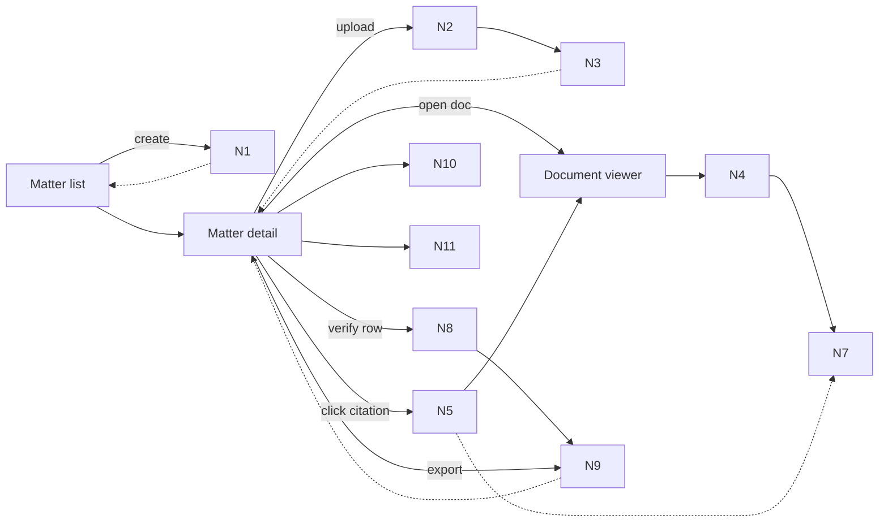

<file_map>
/Users/marc/Code/personal-projects/legaltech-poc
├── docs
│   ├── 03-architecture
│   │   ├── 20_state_model.md *
│   │   ├── 30_data_model.md *
│   │   ├── 50_api_surface.md *
│   │   ├── DECISIONS.md *
│   │   ├── .gitkeep
│   │   ├── 00_overview.md
│   │   ├── 01_onboarding_checklist.md
│   │   ├── 05_tech_stack_and_dev_workflow.md
│   │   ├── 06_frameworks_agents_rag_evals.md
│   │   ├── 10_system_architecture.md
│   │   ├── 40_rag_and_agents.md
│   │   ├── 60_observability_and_evals.md
│   │   ├── AGENTS.md
│   │   └── INVESTIGATION.md
│   ├── 04-projects
│   │   ├── 02-features
│   │   │   ├── 0001_trust-substrate
│   │   │   │   ├── fixtures
│   │   │   │   │   └── rh4_verification_cases.json *
│   │   │   │   ├── prds
│   │   │   │   │   ├── 0001a_matter-documents
│   │   │   │   │   │   ├── prd.json *
│   │   │   │   │   │   └── prd.md *
│   │   │   │   │   ├── 0001b_pdf-viewer
│   │   │   │   │   │   ├── prd.json *
│   │   │   │   │   │   └── prd.md *
│   │   │   │   │   ├── 0001c_citations-api-locking
│   │   │   │   │   │   ├── prd.json *
│   │   │   │   │   │   └── prd.md *
│   │   │   │   │   ├── 0001d_citation-chip-highlight
│   │   │   │   │   │   ├── prd.json *
│   │   │   │   │   │   └── prd.md *
│   │   │   │   │   ├── 0001e_row-status-export-failures
│   │   │   │   │   │   ├── prd.json *
│   │   │   │   │   │   └── prd.md *
│   │   │   │   │   ├── 0001f_provenance-trace-export
│   │   │   │   │   │   ├── prd.json *
│   │   │   │   │   │   └── prd.md *
│   │   │   │   │   └── README.md *
│   │   │   │   ├── spike-proofs
│   │   │   │   │   └── README.md *
│   │   │   │   ├── tmp-handoffs
│   │   │   │   │   ├── handoff_2026-02-05_21-59-05_trust-substrate-shaping.md *
│   │   │   │   │   ├── handoff_2026-02-05_21-59-15_trust-substrate-shaping.md *
│   │   │   │   │   ├── handoff_2026-02-06_17-34-25_trust-substrate-shaping.md *
│   │   │   │   │   ├── handoff_2026-02-07_00-06-57_trust-substrate-shaping.md *
│   │   │   │   │   ├── handoff_2026-02-07_00-50-53_trust-substrate-shaping.md *
│   │   │   │   │   └── handoff_2026-02-07_01-06-00_trust-substrate-shaping-prd-slices.md *
│   │   │   │   ├── tmp-oracle
│   │   │   │   │   └── oracle_response_0001.md *
│   │   │   │   ├── breadboard-pack.md *
│   │   │   │   ├── brief.md *
│   │   │   │   ├── prd-overall.json *
│   │   │   │   ├── prd-overall.md *
│   │   │   │   ├── risk-register.md *
│   │   │   │   └── spike-investigation.md *
│   │   │   ├── 0002_quick-start-engine
│   │   │   │   └── ...
│   │   │   ├── 0003_demo-grade-outputs
│   │   │   │   └── ...
│   │   │   ├── 0004_csv-export
│   │   │   │   └── ...
│   │   │   ├── 0005_word-export
│   │   │   │   └── ...
│   │   │   ├── 0006_eval-harness
│   │   │   │   └── ...
│   │   │   ├── 0007_demo-reliability
│   │   │   │   └── ...
│   │   │   └── .gitkeep
│   │   ├── 01-experiments-prototypes
│   │   │   └── .gitkeep
│   │   ├── 03-fixes
│   │   │   └── .gitkeep
│   │   ├── 04-refactors
│   │   │   └── .gitkeep
│   │   ├── 05-migrations
│   │   │   └── .gitkeep
│   │   ├── _templates
│   │   │   ├── .gitkeep
│   │   │   ├── README.md
│   │   │   ├── breadboard.md
│   │   │   ├── json-prd.schema.json
│   │   │   ├── pack.md
│   │   │   ├── prd.md
│   │   │   ├── release-checklist.md
│   │   │   └── spike-plan.md
│   │   ├── .gitkeep
│   │   ├── AGENTS.md
│   │   └── README.md
│   ├── 00-strategy
│   │   ├── initiatives
│   │   │   ├── 001-003_dependency_plan.md
│   │   │   ├── 001-003_handoff.md
│   │   │   ├── 001-trust-substrate.md
│   │   │   ├── 002-quick-start-engine.md
│   │   │   ├── 003-polishing-for-demo-and-non-func-hardening.md
│   │   │   ├── initiative-overview-001-002-003.md
│   │   │   └── prd-slicing-rules.md
│   │   ├── opportunity-solution-tree.md
│   │   ├── product-principles.md
│   │   ├── product-strategy-1-pager.md
│   │   ├── product-strategy-detailed.md
│   │   ├── roadmap.md
│   │   └── segmentation-notes.md
│   ├── 01-insights
│   │   ├── capabilities
│   │   │   ├── .gitkeep
│   │   │   ├── PoC-architecture-brainstorming2_chatGPT.md
│   │   │   ├── PoC-architecture-brainstorming3_claude.md
│   │   │   ├── PoC-architecture-brainstorming_chatGPT.md
│   │   │   └── README.md
│   │   ├── competitors
│   │   │   ├── .gitkeep
│   │   │   ├── competitor_overview_chatGPT.md
│   │   │   └── competitor_overview_claude.md
│   │   ├── customers
│   │   │   ├── product-metrics
│   │   │   │   └── ...
│   │   │   ├── user-calls
│   │   │   │   └── ...
│   │   │   └── .gitkeep
│   │   ├── tech-and-market
│   │   │   ├── .gitkeep
│   │   │   └── US-CRE-due-diligence_codex.md
│   │   └── .gitkeep
│   ├── 02-guidelines
│   │   ├── archive
│   │   │   ├── brand-preview.html
│   │   │   ├── design-system-v1-warm-light.html
│   │   │   ├── design-system-v2-dark-editorial.html
│   │   │   ├── design-system-v3-orange-energy.html
│   │   │   ├── design-system-v4-soft-cyan.html
│   │   │   ├── design-system-v5-purple-accent.html
│   │   │   └── design-system-v6-earthy-organic.html
│   │   ├── inspiration
│   │   │   ├── brand-dna-2026-02-06
│   │   │   │   └── ...
│   │   │   ├── tailwind
│   │   │   │   └── ...
│   │   │   ├── .gitkeep
│   │   │   ├── README.md
│   │   │   ├── brand_guidelines.md
│   │   │   ├── design_tokens.json
│   │   │   └── prompt_library.json
│   │   ├── .gitkeep
│   │   ├── AGENTS.md
│   │   ├── brand-guidelines.md
│   │   ├── brand-tone.md
│   │   └── design-system-final-v1.html
│   ├── 05-reviews-audits
│   │   ├── .gitkeep
│   │   └── governance.md
│   ├── 06-release
│   │   ├── postmortems
│   │   │   └── .gitkeep
│   │   ├── .gitkeep
│   │   ├── AGENTS.md
│   │   └── CHANGELOG.md
│   ├── 08-example-data
│   │   ├── pack_01_clean
│   │   │   ├── docs
│   │   │   │   └── ...
│   │   │   ├── layout
│   │   │   │   └── ...
│   │   │   ├── truth
│   │   │   │   └── ...
│   │   │   └── manifest.json
│   │   ├── pack_02_missing_rea
│   │   │   ├── docs
│   │   │   │   └── ...
│   │   │   ├── layout
│   │   │   │   └── ...
│   │   │   ├── truth
│   │   │   │   └── ...
│   │   │   └── manifest.json
│   │   ├── pack_03_mismatch_and_cert_gap
│   │   │   ├── docs
│   │   │   │   └── ...
│   │   │   ├── layout
│   │   │   │   └── ...
│   │   │   ├── truth
│   │   │   │   └── ...
│   │   │   └── manifest.json
│   │   ├── pack_04_multi_parcel
│   │   │   ├── docs
│   │   │   │   └── ...
│   │   │   ├── layout
│   │   │   │   └── ...
│   │   │   ├── truth
│   │   │   │   └── ...
│   │   │   └── manifest.json
│   │   ├── pack_05_partial_release
│   │   │   ├── docs
│   │   │   │   └── ...
│   │   │   ├── layout
│   │   │   │   └── ...
│   │   │   ├── truth
│   │   │   │   └── ...
│   │   │   └── manifest.json
│   │   ├── pack_06_overlapping_easements
│   │   │   ├── docs
│   │   │   │   └── ...
│   │   │   ├── layout
│   │   │   │   └── ...
│   │   │   ├── truth
│   │   │   │   └── ...
│   │   │   └── manifest.json
│   │   ├── pack_07_scans_rotated_low_quality
│   │   │   ├── docs
│   │   │   │   └── ...
│   │   │   ├── layout
│   │   │   │   └── ...
│   │   │   ├── truth
│   │   │   │   └── ...
│   │   │   └── manifest.json
│   │   ├── pack_08_defined_terms_and_cross_refs
│   │   │   ├── docs
│   │   │   │   └── ...
│   │   │   ├── layout
│   │   │   │   └── ...
│   │   │   ├── truth
│   │   │   │   └── ...
│   │   │   └── manifest.json
│   │   ├── pack_09_bad_citation
│   │   │   ├── docs
│   │   │   │   └── ...
│   │   │   ├── layout
│   │   │   │   └── ...
│   │   │   ├── produced
│   │   │   │   └── ...
│   │   │   ├── truth
│   │   │   │   └── ...
│   │   │   └── manifest.json
│   │   ├── README.md
│   │   ├── packs_summary.csv
│   │   └── packs_summary.md
│   ├── 96-engineering-tutor-learnings
│   │   ├── 2026-02-06_brand-dna-web-app-design-language.md
│   │   ├── 2026-02-07_orbital-architecture-decisions-and-overview.md
│   │   └── 2026-02-07_trust-substrate-verification-overrides-and-rh2-fallbacks.md
│   ├── 98-tmp
│   │   ├── 2026-02-06_infra-investigation
│   │   │   ├── README.md
│   │   │   ├── deployment.md
│   │   │   ├── llm-gateways.md
│   │   │   ├── ocr.md
│   │   │   ├── oracle_bundles.md
│   │   │   ├── recommended-stack.md
│   │   │   └── storage.md
│   │   ├── handoffs
│   │   │   └── handoff_2026-02-06_17-35-25_shape-split-commits.md
│   │   ├── oracle
│   │   │   └── oracle-bundles
│   │   │       └── ...
│   │   ├── .gitkeep
│   │   ├── README.md
│   │   └── oracle-03-architecture-review-manual.md
│   ├── 99-archive
│   │   └── .gitkeep
│   ├── AGENTS.md
│   └── LEARNINGS.md
├── .agents
│   ├── hooks
│   │   ├── git
│   │   │   ├── commit-msg
│   │   │   ├── post-merge
│   │   │   ├── pre-commit
│   │   │   ├── pre-push
│   │   │   └── prepare-commit-msg
│   │   └── README.md
│   ├── skills
│   │   ├── 00-utilities
│   │   │   ├── agent-browser
│   │   │   │   └── ...
│   │   │   ├── agentation
│   │   │   │   └── ...
│   │   │   ├── ask-questions-if-underspecified
│   │   │   │   └── ...
│   │   │   ├── beautiful-mermaid
│   │   │   │   └── ...
│   │   │   ├── brand-dna-extractor
│   │   │   │   └── ...
│   │   │   ├── browser-use
│   │   │   │   └── ...
│   │   │   ├── commit
│   │   │   │   └── ...
│   │   │   ├── create-cli
│   │   │   │   └── ...
│   │   │   ├── dev-browser
│   │   │   │   └── ...
│   │   │   ├── docs-list
│   │   │   │   └── ...
│   │   │   ├── engineering-tutor
│   │   │   │   └── ...
│   │   │   ├── every-style-editor
│   │   │   │   └── ...
│   │   │   ├── file-todos
│   │   │   │   └── ...
│   │   │   ├── firecrawl
│   │   │   │   └── ...
│   │   │   ├── framework-docs-researcher
│   │   │   │   └── ...
│   │   │   ├── handoff
│   │   │   │   └── ...
│   │   │   ├── landpr
│   │   │   │   └── ...
│   │   │   ├── markdown-converter
│   │   │   │   └── ...
│   │   │   ├── nano-banana-pro
│   │   │   │   └── ...
│   │   │   ├── openai-image-gen
│   │   │   │   └── ...
│   │   │   ├── oracle
│   │   │   │   └── ...
│   │   │   ├── parallel-web-tools
│   │   │   │   └── ...
│   │   │   ├── pickup
│   │   │   │   └── ...
│   │   │   └── video-transcript-downloader
│   │   │       └── ...
│   │   ├── 02-shape
│   │   │   ├── breadboarding
│   │   │   │   └── ...
│   │   │   ├── brief
│   │   │   │   └── ...
│   │   │   ├── create-json-prd
│   │   │   │   └── ...
│   │   │   ├── create-prd
│   │   │   │   └── ...
│   │   │   ├── spike-investigation
│   │   │   │   └── ...
│   │   │   └── wf-shape
│   │   │       └── ...
│   │   ├── 03-plan
│   │   │   ├── best-practices-researcher
│   │   │   │   └── ...
│   │   │   ├── bug-reproduction-validator
│   │   │   │   └── ...
│   │   │   ├── deepen-plan
│   │   │   │   └── ...
│   │   │   ├── plan-review
│   │   │   │   └── ...
│   │   │   ├── repo-research-analyst
│   │   │   │   └── ...
│   │   │   ├── reproduce-bug
│   │   │   │   └── ...
│   │   │   ├── spec-flow-analyzer
│   │   │   │   └── ...
│   │   │   ├── triage
│   │   │   │   └── ...
│   │   │   └── wf-plan
│   │   │       └── ...
│   │   ├── 04-develop
│   │   │   ├── 00-frontend-general
│   │   │   │   └── ...
│   │   │   ├── 01-ui-skills-dot-com
│   │   │   │   └── ...
│   │   │   ├── pr-comment-resolver
│   │   │   │   └── ...
│   │   │   ├── use-ai-sdk
│   │   │   │   └── ...
│   │   │   ├── verify
│   │   │   │   └── ...
│   │   │   ├── wf-develop
│   │   │   │   └── ...
│   │   │   └── wf-ralph
│   │   │       └── ...
│   │   ├── 05-review
│   │   │   ├── agent-native-architecture
│   │   │   │   └── ...
│   │   │   ├── agent-native-reviewer
│   │   │   │   └── ...
│   │   │   ├── architecture-strategist
│   │   │   │   └── ...
│   │   │   ├── code-simplicity-reviewer
│   │   │   │   └── ...
│   │   │   ├── data-integrity-guardian
│   │   │   │   └── ...
│   │   │   ├── data-migration-expert
│   │   │   │   └── ...
│   │   │   ├── git-history-analyzer
│   │   │   │   └── ...
│   │   │   ├── kieran-python-reviewer
│   │   │   │   └── ...
│   │   │   ├── kieran-typescript-reviewer
│   │   │   │   └── ...
│   │   │   ├── pattern-recognition-specialist
│   │   │   │   └── ...
│   │   │   ├── performance-oracle
│   │   │   │   └── ...
│   │   │   ├── security
│   │   │   │   └── ...
│   │   │   ├── security-sentinel
│   │   │   │   └── ...
│   │   │   ├── test-browser
│   │   │   │   └── ...
│   │   │   └── wf-review
│   │   │       └── ...
│   │   ├── 06-release
│   │   │   ├── changelog
│   │   │   │   └── ...
│   │   │   ├── deployment-verification-agent
│   │   │   │   └── ...
│   │   │   └── wf-release
│   │   │       └── ...
│   │   ├── 07-compound
│   │   │   └── compound-docs
│   │   │       └── ...
│   │   ├── 10-audit
│   │   │   └── agent-native-audit
│   │   │       └── ...
│   │   └── 98-skill-maintenance
│   │       ├── create-agent-skills
│   │       │   └── ...
│   │       ├── heal-skill
│   │       │   └── ...
│   │       ├── modular-skills-architect
│   │       │   └── ...
│   │       └── skill-creator
│   │           └── ...
│   └── register.json
├── apps
│   └── web
│       ├── app
│       │   ├── (api)
│       │   │   └── ...
│       │   ├── (app)
│       │   │   └── ...
│       │   ├── globals.css
│       │   ├── layout.tsx +
│       │   └── page.tsx +
│       ├── lib
│       │   ├── devOnly.ts +
│       │   └── fixtureSeed.server.ts +
│       ├── types
│       │   └── pdfjs-dist.d.ts
│       ├── .eslintrc.json
│       ├── AGENTS.md
│       ├── next-env.d.ts
│       ├── next.config.js +
│       ├── package.json
│       ├── postcss.config.js +
│       ├── tailwind.config.ts +
│       ├── tsconfig.json
│       └── tsconfig.tsbuildinfo
├── packages
│   ├── core
│   │   ├── src
│   │   │   ├── citations
│   │   │   │   └── ...
│   │   │   ├── geometry
│   │   │   │   └── ...
│   │   │   ├── missing-docs
│   │   │   │   └── ...
│   │   │   ├── spikes
│   │   │   │   └── ...
│   │   │   ├── verify
│   │   │   │   └── ...
│   │   │   ├── index.ts +
│   │   │   ├── safe-error.ts +
│   │   │   └── server.ts +
│   │   ├── package.json
│   │   ├── tsconfig.build.json
│   │   └── tsconfig.json
│   └── .gitkeep
├── scripts
│   ├── db
│   │   └── init.sql
│   ├── fixtures
│   │   ├── lib
│   │   │   ├── args.ts +
│   │   │   ├── csv.ts +
│   │   │   ├── fs.ts +
│   │   │   ├── geometry.ts +
│   │   │   └── snapshot.ts +
│   │   ├── README.md
│   │   ├── assert_row_invariants.ts +
│   │   ├── compare_truth.ts +
│   │   ├── seed.ts +
│   │   └── verify_pack_names.ts +
│   ├── ast-grep.sh
│   ├── build.sh
│   ├── install_codex_skills_copy.sh
│   ├── install_git_hooks.sh
│   ├── knip.sh
│   ├── lint.sh
│   ├── test.sh
│   ├── typecheck.sh
│   └── verify.sh
├── tmp
│   └── .gitkeep
├── .gitignore
├── AGENTS.md
├── LICENSE
├── README.md
├── docker-compose.yml
├── package.json
├── pnpm-lock.yaml
└── pnpm-workspace.yaml


(* denotes selected files)
(+ denotes code-map available)
Config: depth cap 3.
</file_map>
<file_contents>
File: /Users/marc/Code/personal-projects/legaltech-poc/docs/04-projects/02-features/0001_trust-substrate/brief.md
```md
# Brief: 0001 Trust Substrate (Initiative 1)

## Context (why this, why now)
Trust UX is the product. Before any “Quick Start” generation is credible, we need an evidence layer that:
- stores citations as locked, immutable objects
- lets a reviewer click a citation chip and see the highlighted clause in a PDF viewer
- fails closed when evidence can’t be verified
- makes failure states explicit and actionable

This work is the foundation for Initiatives 002 (Quick Start engine) and 003 (demo-grade outputs). If trust fails, everything else is noise.

## Goals
- A user can create a **Matter** (API/DB: `folder`), upload PDFs, and view them reliably.
- Citations are first-class, immutable objects (`citation_id` references only).
- Clicking a citation opens the right document + page and overlays a highlight polygon with snippet + snippet hash.
- Row-level statuses are terminal for the workflow (`needs_review|reviewed|missing_input|citation_failed`) and export is blocked by default when any row is `citation_failed`.
- Failures are explicit and actionable: missing docs checklist, doc quality warnings, citation mismatch details.
- Minimum viable provenance exists so we can answer: “why did this row exist?”

## Non-goals
- Auth/RBAC, integrations, sharing, multi-tenant admin.
- External web research inside runs.
- A full retrieval/generation “Quick Start” (this dossier establishes the trust primitives it will use).
- Legal/materiality judgement.
- Fancy monitoring dashboards (structured logs + trace IDs only).

## Perimeter lock (in scope)
- **Matter (folder) baseline:** create folder, upload documents, list docs, view PDFs in a viewer with page navigation + zoom.
- **Citation UX scaffold:** seeded report rows + citation chips that jump to viewer and highlight evidence using fixture anchors (`docs/08-example-data/*/layout/*.anchors.json`).
- **Citation contract:** canonical, locked citation object + `GET /citations/:id` (snippet + `snippet_hash` + polygons + page).
- **Row status + gate:** status machine and “export blocked” behaviour when any row is `citation_failed` (code checks first; entailment verifier as a follow-on slice).
- **Failure journeys:** `missing_input` behaviour + missing-doc checklist, extraction quality warnings, citation mismatch UX, “flag citation wrong”.
- **Provenance + trace export:** minimal run trace export (developer-facing; no UI beyond a download button).
- **Fail-closed highlight behaviour:** highlights must only render when citation invariants hold (doc/page/polygons/snippet_hash); otherwise show explicit `citation_failed` and render no “best effort” overlay.

## Explicit out of scope
- Requiring perfect OCR-derived highlight geometry before we can prove the "trust moment".
  - We still treat OCR/layout extraction as the default ingest posture (ADR-0003).
  - For the highlight overlay spike (RH2), we use fixture anchors first to validate the mapping math, then swap to OCR-derived geometry later behind the same contracts.
- Any agent loops or free-form chat.
- Anything that requires per-firm templates or customization.

## Acceptance signals (fixture-driven)
- `pack_01_clean`
  - viewer renders; page nav is responsive
  - seeded row shows citation chips; click chip highlights correct region and shows snippet + `snippet_hash`
  - highlight remains aligned at 50/100/150% zoom (or we explicitly cut to “highlights verified at 100% only”)
- `pack_02_missing_rea`
  - rows that depend on missing docs are `missing_input` and include a missing-doc checklist
  - `missing_input` rows use the exact answer string: `Not found in provided documents.` and have zero citations (state model invariant)
- `pack_07_scans_rotated_low_quality`
  - viewer remains usable on scanned/rotated PDFs
  - doc quality warnings are visible (even if quality is initially stubbed)
  - highlight remains aligned on a rotated/scanned page (or we explicitly cut/patch with an honest evidence fallback)
- One deliberate bad citation (mismatching `snippet_hash`) yields `citation_failed` and export is blocked by default.

## Constraints / guardrails (must align with `docs/03-architecture`)
- Terminology: **Folder** is API/DB; UI calls it **Matter**. (`docs/03-architecture/20_state_model.md`)
- Evidence-first + citation locking (ADR-0001) and fail-closed verification (ADR-0002). (`docs/03-architecture/DECISIONS.md`)
- No external web research (ADR-0007).
- API error envelope; do not leak internals. (`docs/03-architecture/50_api_surface.md`, `docs/03-architecture/AGENTS.md`)
- State invariants are non-negotiable:
  - `missing_input` rows must have answer exactly `Not found in provided documents.` and zero citations.
  - exports are blocked by default when any row is `citation_failed` (and may also require `runs.state = completed`, per API surface).
- Validate inputs at boundaries with Zod; client/server module boundaries must remain clean. (`apps/web/AGENTS.md`)

## Risks / unknowns (treatments)
See `risk-register.md`. Biggest rabbit holes:
- pdf.js performance on scanned packs (`pack_07_scans_rotated_low_quality`)
- highlight overlay coordinate transforms across zoom
- snippet normalisation + stable hashing rules in practice
- verification precision (false passes) vs latency/cost
- missing-doc detection heuristics

## Open questions
- Appetite/timebox: are we shaping the full trust substrate perimeter above, or do we want to cut to “trust moment only” (viewer + click-to-highlight) first?
- Storage access pattern for pdf.js: signed URLs vs proxy endpoint?
- Verification v1: code checks only, or include an entailment model from day one?
- Minimum trace schema: what is required vs nice-to-have?

## PRD slices (drafted; implement after spikes)
Per `docs/00-strategy/initiatives/prd-slicing-rules.md`, slice PRDs are drafted under `prds/`, but implementation should start only once spikes are executed and the perimeter is re-locked:
1) Folder (matter) CRUD + upload + document list (baseline UI)
2) PDF viewer (page nav + zoom) + render URL endpoint
3) Citation chip UI + jump-to-page + highlight overlay (anchors-first)
4) Citation contract: lock + `GET /citations/:id` + snippet hashing util
5) Status machine + export gate + failure journeys UX
6) Provenance + run trace export (developer-facing)

Note:
- Slice PRDs for 0001 live under `prds/` (see `prds/README.md`).

## Shaping decision (GO/NO-GO)
NO-GO until spike items in `spike-investigation.md` are executed and outcomes are recorded, and the perimeter above is re-confirmed based on spike outcomes.

Oracle pass status:
- RH2 (highlight overlay): oracle review captured in `tmp-oracle/oracle_response_0001.md` (2026-02-06). Spike execution still pending.

```

File: /Users/marc/Code/personal-projects/legaltech-poc/docs/04-projects/02-features/0001_trust-substrate/prds/0001c_citations-api-locking/prd.json
```json
{
  "version": 1,
  "project": "0001c-citations-api-locking",
  "overview": "Implement the locked, immutable citation object contract (snippet + snippet_hash + geometry) and a GET /citations/:id API so clients can render evidence without recomputing it.",
  "goals": [
    "Citation payload is sufficient for highlighting and integrity checks.",
    "Hashing is stable and implemented once (no drift between caller sites)."
  ],
  "nonGoals": [
    "Viewer UI and highlight overlays.",
    "Verification/entailment.",
    "Creating citations from chunk IDs via the durable lock step before Quick Start exists (fixture seeding is acceptable for early UI scaffold)."
  ],
  "successMetrics": [
    "Fixture-driven: citations can be fetched for pack_01_clean and snippet_hash is stable across repeated runs (RH3 evidence)."
  ],
  "openQuestions": [],
  "stack": {
    "framework": "Next.js 15 route handlers + packages/core domain logic (TypeScript)",
    "hosting": "Local dev; default deployment target is a Hetzner VM (Vercel optional for previews)",
    "database": "Postgres (pgvector) via Docker Compose",
    "auth": "PoC can run without auth in local/dev; production-minded deployments should enable auth"
  },
  "routes": [
    {
      "path": "/citations/:id",
      "name": "Citations API",
      "purpose": "Fetch a locked citation payload {document_id,page_number,polygons,snippet,snippet_hash} (immutable) for viewer rendering and integrity checks."
    }
  ],
  "uiNotes": [
    "This slice is API/contract focused; UI consumers (viewer, citation chips) rely on citation_id references only.",
    "Do not return signed URLs or transient provider URLs from citation endpoints; only stable IDs and metadata."
  ],
  "dataModel": [
    {
      "entity": "Citation",
      "fields": [
        "id",
        "document_id",
        "page_number",
        "polygons",
        "snippet",
        "snippet_hash",
        "index_version",
        "chunk_id (optional)",
        "created_at"
      ]
    }
  ],
  "importFormat": {
    "description": "Citations may be seeded from fixture packs for early UI scaffold; durable creation from chunk IDs belongs to the workflow lock step.",
    "example": {
      "citation": {
        "document_id": "doc_123",
        "page_number": 1,
        "polygons": [
          [
            [0.1, 0.2],
            [0.4, 0.2],
            [0.4, 0.3],
            [0.1, 0.3]
          ]
        ],
        "snippet": "Proposed Insured: 18W18 Acquisition LLC",
        "snippet_hash": "sha256:<lowercase-hex>"
      }
    }
  },
  "rules": [
    "Citations are immutable after insert; fixing a citation creates a new citation and updates the owning row to reference the new id.",
    "snippet_hash uses the canonical rule: sha256: + sha256_hex(normalise(snippet)) (lowercase hex).",
    "normalise(snippet): trim; CRLF->LF; collapse whitespace runs to a single space.",
    "Boundary validation with Zod and safe error envelope (ADR-0008).",
    "Never return signed URLs or transient provider URLs from citation endpoints."
  ],
  "qualityGates": [
    "pnpm verify",
    "pnpm typecheck"
  ],
  "stories": [
    {
      "id": "US-001",
      "title": "Fetch a locked citation by ID",
      "status": "open",
      "dependsOn": [],
      "description": "As a reviewer, I want to fetch a citation payload so that I can inspect evidence reliably.",
      "acceptanceCriteria": [
        "AC-001: GET /citations/:id returns document_id, page_number, polygons, snippet, and snippet_hash.",
        "AC-002: Errors use the standard error envelope with safe code and message (no leaks).",
        "Example: Fetch a known seeded citation_id from pack_01_clean and confirm the response contains snippet + snippet_hash and geometry.",
        "Negative case: Unknown citation id returns 404 NOT_FOUND using the standard error envelope.",
        "Negative case: Invalid id format returns VALIDATION_ERROR using the standard error envelope."
      ]
    },
    {
      "id": "US-002",
      "title": "Canonical snippet hashing is stable",
      "status": "open",
      "dependsOn": [],
      "description": "As a developer, I want one canonical hashing implementation so that citation integrity checks are reliable.",
      "acceptanceCriteria": [
        "AC-003: normaliseSnippet() + hashSnippet() are implemented once in packages/core and reused everywhere (no duplicate implementations); unit tests cover whitespace invariance per the canonical rule.",
        "AC-004: RH3 harness (packages/core/src/spikes/rh3_snippet_hash_harness.ts) produces identical hashes across two runs (run1 vs run2) using snippets extracted from docs/08-example-data/pack_01_clean/docs/.",
        "Example: A snippet with CRLF newlines and multiple whitespace runs hashes identically to the normalized LF + single-space form.",
        "Negative case: Attempting to introduce a second hashing implementation is blocked by tests or code review (single source of truth)."
      ]
    }
  ],
  "meta": {
    "owner": "marc",
    "status": "Draft (NO-GO until RH3 spike executed)",
    "date": "2026-02-07",
    "slug": "0001c-citations-api-locking",
    "sourceMarkdownPath": "docs/04-projects/02-features/0001_trust-substrate/prds/0001c_citations-api-locking/prd.md"
  },
  "primaryObservableEffect": "Given a citation_id, the client can fetch a stable payload {document_id,page_number,polygons,snippet,snippet_hash} and render evidence without recomputing it.",
  "inScope": [
    "Data model for citations (docs/03-architecture/30_data_model.md): store snippet, snippet_hash, polygons, document_id, page_number, index_version, optional chunk_id; treat citations as immutable after insert.",
    "Canonical hashing util in packages/core: snippet_hash = sha256: + sha256_hex(normalise(snippet)) (lowercase hex).",
    "HTTP API: GET /citations/:id response shape per docs/03-architecture/50_api_surface.md.",
    "Safety: boundary validation with Zod and safe error envelope (ADR-0008)."
  ],
  "functionalRequirements": [
    "FR-001: Citations are immutable once created; fixing creates a new citation and updates the owning row to reference the new id.",
    "FR-002: snippet_hash must use the canonical rule and be persisted on the citation.",
    "FR-003: Store enough geometry to highlight evidence without re-running retrieval or OCR.",
    "FR-004: Never return signed URLs or transient provider URLs from citation endpoints; only stable IDs and metadata."
  ],
  "failureStatesUx": [
    "Citation not found: 404 NOT_FOUND.",
    "Invalid id format: VALIDATION_ERROR.",
    "Unsafe internal failures: INTERNAL with trace_id."
  ],
  "metricsLogging": {
    "events": [
      "citation.fetched",
      "citation.fetch_failed"
    ],
    "metrics": [
      "p50/p95 latency for GET /citations/:id",
      "Hash integrity checks pass/fail counts (in evals later)"
    ]
  },
  "rollbackDisablePlan": [
    "Feature flag: FEATURE_CITATIONS_API (default off until RH3 spike evidence is recorded).",
    "Safe fallback: citation chips/links are hidden and UI explains citations are not enabled."
  ],
  "risksDependencies": {
    "blockedBy": [
      "RH3 snippet normalisation + hash stability"
    ],
    "dependencies": [
      "Postgres schema for citations.",
      "Document/page identity model (document_id, page_number) must be stable."
    ],
    "risks": [
      "Hash drift if canonical normalization is not truly single-sourced.",
      "Geometry schema mismatches could break highlighting consumers."
    ]
  },
  "sources": [
    "docs/04-projects/02-features/0001_trust-substrate/brief.md",
    "docs/04-projects/02-features/0001_trust-substrate/breadboard-pack.md",
    "docs/04-projects/02-features/0001_trust-substrate/risk-register.md",
    "docs/04-projects/02-features/0001_trust-substrate/spike-investigation.md",
    "docs/03-architecture/DECISIONS.md",
    "docs/03-architecture/30_data_model.md",
    "docs/03-architecture/50_api_surface.md"
  ]
}

```

File: /Users/marc/Code/personal-projects/legaltech-poc/docs/04-projects/02-features/0001_trust-substrate/spike-investigation.md
```md
# Spike investigation — Trust substrate

> Status: planned only. No spikes executed yet.
> Oracle pass: RH2 highlight overlay reviewed (2026-02-06). See `tmp-oracle/oracle_response_0001.md`.
> Proof artefacts: commit under `spike-proofs/` and link them from the report stubs at the end of this doc.

## Spike plan — PDF viewer performance on noisy scans

### Question
Can pdf.js render and page-jump on scanned/rotated PDFs (e.g. `docs/08-example-data/pack_07_scans_rotated_low_quality/docs/TitleCommitment_SCANNED_ROTATED.pdf`) without UI freezing?

### Context
- Feature / concept: 1.1 Matter + document viewer baseline
- Related requirement(s): R1
- Why now: baseline UX depends on acceptable navigation performance

### Success criteria
Proof looks like:
- PDFs are served with Range support (`Accept-Ranges: bytes` + `206 Partial Content`). Without this, pdf.js perf numbers are invalid.
- Define `totalMs` as: time from "request page N" to `renderTask.promise` resolve (exclude initial PDF load).
- Serial test (N=20, 100% zoom): `p95(totalMs) < 1000ms` and `max(totalMs) < 1500ms`.
- Spam test (N=30 @ 200ms): viewer remains responsive (no visible freezes; max long task < 250ms) and final requested page completes < 1500ms after its request timestamp.

### Timebox
- Start: TBD
- Hard stop: TBD (2–4 hours)

### Scope
Include:
- Minimal viewer page with pdf.js rendering
- Programmatic page-jump test harness

Exclude:
- Highlight overlays, citations, verification

### Approach
- Step 1: Load the scanned PDF in a minimal viewer page
- Step 2: Implement page-jump control + measure render times
- Step 3: Record timing + responsiveness results

### Artefacts
Keep:
- Notes + timing table
- Minimal viewer branch or snippet

Throw away:
- Any UI polish beyond functional test

### Expected outcomes
- If straight shot: proceed with pdf.js viewer baseline
- If tangle: patch by limiting max page size or adding loading skeletons
- If fog: consider alternative viewer or async render strategy

---

## Spike plan — Highlight overlay transform across zoom

### Question
Can we map anchor geometry to the viewer viewport correctly at 50%, 100%, and 150% zoom?

### Context
- Feature / concept: 1.2 Citation chips -> click-to-highlight
- Related requirement(s): R2
- Why now: highlight alignment is core trust affordance

### Success criteria
Proof looks like:
- Highlight aligns on at least one commitment PDF and one survey PDF
- Alignment remains correct at 50%, 100%, 150% zoom

### Timebox
- Start: TBD
- Hard stop: TBD (4–6 hours)

### Scope
Include:
- One PDF with anchors
- Overlay renderer with bbox/polygon support

Exclude:
- Citation chips UI and data model

### Key decisions (pre-spike)
- Canonical polygon spec (fixtures + locked citations): normalised page coordinates in `[0..1]`, origin top-left, relative to the unrotated page `viewBox`.
- Mapping: normalised -> PDF points via `viewBox` -> viewport CSS pixels via `viewport.convertToViewportPoint()`. Overlay is rendered in `viewport.width/height` CSS pixels (never canvas backing store pixels).
- Fail-closed: if any invariants break (doc mismatch, page out of range, invalid polygons, render URL missing), do not draw a “best effort” highlight.

### Approach (fixture-backed mini-eval)
1. Build a dev-only spike harness route:
   - `apps/web/app/(app)/spikes/rh2-overlay/page.tsx`
   - Controls: pack selector (`pack_01_clean`, `pack_07_scans_rotated_low_quality`), doc selector, page number (1-indexed), anchor id, zoom 50/100/150, rotation 0/90/180/270.
   - Debug HUD: pack/doc/page/anchor, `scale`, `totalRotation`, `viewport.width/height`, `canvas.width/height` and CSS size, `devicePixelRatio`.

2. Implement the pure mapping util (unit-testable):
   - `xPdf = xMin + xNorm * (xMax - xMin)`
   - `yPdf = yMax - yNorm * (yMax - yMin)` (top-left normalised -> bottom-left PDF)
   - `[xCss, yCss] = viewport.convertToViewportPoint(xPdf, yPdf)`

3. Prove alignment at 100% (pack_01):
   - One commitment page anchor + one survey anchor.
   - Evidence: screenshot at 100% with HUD visible.

4. Prove zoom invariance (50/100/150):
   - For each case: screenshot at 50/100/150 with HUD visible.
   - Compute overlay bbox (min/max x/y in CSS px) and assert:
     - `bbox50 ~= bbox100 * 0.5` (within ~1–2 CSS px)
     - `bbox150 ~= bbox100 * 1.5` (within ~1–2 CSS px)

5. Prove rotation correctness (pack_07):
   - Ensure page-intrinsic rotation (`page.rotate`) and user rotation are handled consistently.
   - Evidence: screenshots at rotation=0 and rotation=90 (or whatever reproduces the pack_07 orientation).

6. Prove fail-closed:
   - Inject one deliberate bad anchor (out of `[0..1]`) and one wrong page number.
   - Evidence: screenshot of explicit failure UI + logged safe error code.

### Artefacts
Keep:
- Screenshots (50/100/150 + rotation + fail-closed) with HUD visible.
- A small JSON log dump (bbox numbers + HUD values).
- Notes on pitfalls encountered (DPR, rotation, `viewBox` origin, CSS transforms).

Throw away:
- Full citation UI integration

### Evidence capture tooling (options)
- Manual: Chrome DevTools node screenshots (fastest).
- Automated: Playwright (preferred if already wired in repo).
- `browser-use` (CLI, persistent session): good for scripted screenshots with a stable open->state->click/input loop.
  - Workflow: `open` -> `state` -> act by index -> `screenshot` -> re-`state` after any navigation/submit.
  - Sessions: use `--session rh2` so the browser persists across commands.
  - Example (headful):
    ```bash
    browser-use --session rh2 --browser chromium --headed open http://localhost:3000/spikes/rh2-overlay
    browser-use --session rh2 state
    browser-use --session rh2 screenshot
    ```
  - If `browser-use` is not available locally, follow `.agents/skills/00-utilities/browser-use/SKILL.md` (uvx one-off vs permanent install).
- `agent-browser` (CLI): good for scripted screenshots if installable (snapshot + `@e1` refs). Requires npm install + a Chromium download; can also point at a system Chrome via an executable-path setting. Note: `agent-browser` is not currently installed and npm registry access may be blocked in this environment.

### Expected outcomes
- If straight shot: proceed with overlay layer
- If tangle: cut to “highlight verified at 100% zoom only” (lock zoom while citation is active)
- If fog: patch to “evidence crop card” (render-and-crop bbox instead of live overlay alignment)

### Oracle pass
- Bundle: `tmp-oracle/oracle-bundle_0001_trust-substrate_RH2_highlight-overlay.md`
- Response: `tmp-oracle/oracle_response_0001.md` (coordinate spaces + mapping + spike plan + pitfalls + fallbacks)

---

## Spike plan — Canonical snippet + hash stability

### Question
Does the canonical `normalise()` rule for `snippet_hash` (defined in `docs/03-architecture/30_data_model.md`) produce stable hashes for citations in practice?

### Context
- Feature / concept: 1.3 Citation data model + API
- Related requirement(s): R3
- Why now: hash stability is required for verification and idempotency

### Success criteria
Proof looks like:
- Hash remains stable across two reprocessing runs
- Snippet is human-readable and matches displayed text

### Timebox
- Start: TBD
- Hard stop: TBD (2–4 hours)

### Scope
Include:
- Two PDFs with known snippets
- Implement canonical normalisation once and reuse it everywhere

Exclude:
- LLM verification

### Approach
- Step 1: Extract candidate snippets + normalize
- Step 2: Compute hashes across runs
- Step 3: Compare stability and human readability

### Artefacts
Keep:
- Normalization rules
- Hash stability table

Throw away:
- Any full ingestion pipeline work

### Expected outcomes
- If straight shot: codify normalization + hash util
- If tangle: patch by pinning to anchor_id + snippet_hash (keep both), or by storing chunk_id + index_version as the authoritative reference
- If fog: restrict to anchor JSON only

---

## Spike plan — Verification precision (false passes)

### Question
Can we achieve zero false passes on 20 hand-curated bad examples at acceptable latency?

### Context
- Feature / concept: 1.4 Verification gate
- Related requirement(s): R4
- Why now: trust depends on fail-closed verification

### Success criteria
Proof looks like:
- 0 false passes on curated bad set (N>=20). `UNSURE` counts as `FAIL` (precision-first).
- Latency budget: `p95 <= 8s` per row on dev machine (record p50/p95/max).
- Dataset location: `docs/04-projects/02-features/0001_trust-substrate/fixtures/rh4_verification_cases.json`

### Timebox
- Start: TBD
- Hard stop: TBD (1–2 days)

### Scope
Include:
- Small curated dataset across packs
- One verification prompt + rubric

Exclude:
- Full UI integration

### Approach
- Step 1: Build curated set (good vs bad)
- Step 2: Run verifier and record outcomes
- Step 3: Adjust rubric/prompt for precision

### Artefacts
Keep:
- Curated dataset list
- Prompt + rubric
- Results summary

Throw away:
- Any production infrastructure

### Expected outcomes
- If straight shot: proceed with verifier + gate
- If tangle: patch to stricter heuristic checks before LLM
- If fog: cut verification to code-based checks only

---

## Spike plan — Missing-doc detection heuristics

### Question
Can we reliably detect “referenced but missing” docs in `pack_02_missing_rea` without false flags on `pack_01_clean`?

### Context
- Feature / concept: 1.5 Failure journeys
- Related requirement(s): R5
- Why now: missing-doc UX depends on accurate detection

### Success criteria
Proof looks like:
- Missing docs identified in `pack_02_missing_rea`
- No false missing-doc flags in `pack_01_clean`
 - Heuristic output includes: `{label, confidence, signals[]}` (signals are concrete, showable evidence).
 - Evaluation criteria: FP=0 on `pack_01_clean`; FN=0 for `REA.pdf` on `pack_02_missing_rea` (confidence >= 0.8 to mark missing).

### Timebox
- Start: TBD
- Hard stop: TBD (4–6 hours)

### Scope
Include:
- Simple doc matching heuristics
- Two packs for evaluation

Exclude:
- Full ingestion + retrieval

### Approach
- Step 1: Define matching heuristics (title/filename/token match)
- Step 2: Evaluate against both packs
- Step 3: Record false positives/negatives

### Artefacts
Keep:
- Heuristic definitions + results table

Throw away:
- Production ingestion changes

### Expected outcomes
- If straight shot: implement missing-doc checklist
- If tangle: patch to manual user-confirmed missing docs
- If fog: cut missing-doc detection to admin-only

---

## Spike reports (pending)

No spike reports yet (spikes not executed). After each spike:
- Commit proof artefacts under `spike-proofs/`.
- Fill in the corresponding report stub below.
- Update `risk-register.md` RH status (`closed` / Cut / Patch / Out-of-bounds) with a link to proof.

### RH1 report — pdf.js performance on scanned/rotated PDFs (page jumps, zoom)
- Date:
- Outcome: PASS / FAIL / Cut / Patch
- Environment: browser + OS + machine notes
- Proof (files under `spike-proofs/`):
- Key numbers: p50 / p95 / max totalMs; max long task; notes
- Decision: proceed with slice(s) / cut / patch
- Follow-ups (docs to update):

### RH2 report — highlight overlay coordinate transforms across zoom levels
- Date:
- Outcome: PASS / FAIL / Cut / Patch
- Proof (screenshots + JSON log under `spike-proofs/`):
- Decision: proceed / lock-to-100%-zoom cut / evidence-card patch
- Follow-ups (docs to update):

### RH3 report — snippet normalisation + stable `snippet_hash`
- Date:
- Outcome: PASS / FAIL / Cut / Patch
- Proof (stability table / harness output under `spike-proofs/`):
- Decision:
- Follow-ups (docs to update):

### RH4 report — verification avoids false passes at acceptable latency
- Date:
- Outcome: PASS / FAIL / Cut / Patch
- Proof (results JSON under `spike-proofs/`):
- Key numbers: FP=0 check; p50/p95/max latency; notes
- Decision:
- Follow-ups (docs to update):

### RH5 report — missing-doc detection heuristics reliability
- Date:
- Outcome: PASS / FAIL / Cut / Patch
- Proof (heuristics results under `spike-proofs/`):
- Key numbers: FP/FN table; confidence thresholds; notes
- Decision:
- Follow-ups (docs to update):

## Oracle bundles
Keep oracle bundles/notes in `tmp-oracle/` so they are git-tracked and easy to re-run/review.

- RH1-RH5 closure bundle: `tmp-oracle/oracle-bundle_0001_trust-substrate_RH1-RH5_spike-closure.md`
- RH1-RH5 closure response: `tmp-oracle/oracle-bundle_0001_trust-substrate_RH1-RH5_spike-closure_RESPONSE.md`
- RH2 bundle: `tmp-oracle/oracle-bundle_0001_trust-substrate_RH2_highlight-overlay.md`
- RH2 response: `tmp-oracle/oracle_response_0001.md`

```

File: /Users/marc/Code/personal-projects/legaltech-poc/docs/04-projects/02-features/0001_trust-substrate/spike-proofs/README.md
```md
# Spike Proofs (Initiative 0001)

This folder is a workspace for spike outputs that make pass/fail measurable and reviewable.

Rules:
- Deterministic artefacts when possible (stable key ordering, stable sorting).
- No secrets, provider payload dumps, or stack traces in committed files.
- Prefer JSON for machine diffs; use Markdown for decisions and short write-ups.

Suggested naming:
- `RH1_pdfjs_perf_pack_07_100_serial.json`
- `RH1_pdfjs_perf_pack_07_100_spam.json`
- `RH2_overlay_pack_01_zoom_50.png`
- `RH2_overlay_pack_01_zoom_100.png`
- `RH2_overlay_pack_01_zoom_150.png`
- `RH2_overlay_fail_closed_wrong_page.png`
- `RH3_snippet_hash_stability_pack_01.json`
- `RH4_verification_negative_set_results.json`
- `RH5_missing_doc_heuristics_pack_01_02.json`

```

File: /Users/marc/Code/personal-projects/legaltech-poc/docs/04-projects/02-features/0001_trust-substrate/prds/README.md
```md
# 0001 Trust Substrate: Slice PRDs

Overall PRD (initiative-level overview): `../prd-overall.md`

These are thin slice PRDs derived from the breadboard parts list (`../breadboard-pack.md`) and aligned to the canonical architecture contracts under `docs/03-architecture/`.

Implementation order is expected to follow dependencies and spike closures (see `../spike-investigation.md`).

## Slices
- 0001a Matter + Documents (F1, U1-U4, N1-N3): `0001a_matter-documents/prd.md`
- 0001b PDF Viewer (F2, U7, N4): `0001b_pdf-viewer/prd.md` (blocked by RH1)
- 0001c Citations API + Locking Contract (F4, N5): `0001c_citations-api-locking/prd.md` (blocked by RH3)
- 0001d Citation Chips + Click-to-Highlight (F3, U6-U8, N5-N7): `0001d_citation-chip-highlight/prd.md` (blocked by RH2)
- 0001e Row Statuses + Export Gate + Failure Journeys (F5-F6, U9-U12, N8-N10): `0001e_row-status-export-failures/prd.md` (blocked by RH4/RH5)
- 0001f Provenance + Run Trace Export (F7, U13, N11): `0001f_provenance-trace-export/prd.md`

```

File: /Users/marc/Code/personal-projects/legaltech-poc/docs/04-projects/02-features/0001_trust-substrate/prds/0001e_row-status-export-failures/prd.json
```json
{
  "version": 1,
  "project": "0001e-row-status-export-failures",
  "overview": "Implement report row terminal statuses and explicit failure journeys, plus server-enforced export gating (block on citation_failed by default) so we never export untrusted outputs.",
  "goals": [
    "Make failure states explicit, actionable, and safe.",
    "Never silently export untrusted rows by default."
  ],
  "nonGoals": [
    "Full entailment verifier tuning (beyond the spike and conservative v1 rubric).",
    "Building the entire Quick Start workflow controller (handled in Initiative 0002)."
  ],
  "successMetrics": [
    "pack_02_missing_rea: missing docs -> missing_input with checklist and exact answer string.",
    "pack_01_clean: deliberate bad citation -> citation_failed; export blocked with EXPORT_BLOCKED."
  ],
  "openQuestions": [],
  "stack": {
    "framework": "Next.js 15 (App Router) + React 19 (TypeScript)",
    "hosting": "Local dev; default deployment target is a Hetzner VM (Vercel optional for previews)",
    "database": "Postgres (pgvector) via Docker Compose",
    "auth": "PoC can run without auth in local/dev; production-minded deployments should enable auth"
  },
  "routes": [
    {
      "path": "/matters/:folderId",
      "name": "Matter Detail",
      "purpose": "Render report table with status badges, missing-doc checklist, and export button with gating reasons."
    },
    {
      "path": "/export/csv",
      "name": "CSV Export API",
      "purpose": "Server-enforced export gating: block when any row is citation_failed unless an explicit demo-only unsafe override is enabled."
    }
  ],
  "uiNotes": [
    "Report table shows terminal status badges: needs_review, reviewed, missing_input, citation_failed.",
    "Missing-doc journey: missing_input rows show an actionable checklist with concrete evidence signals.",
    "Citation failure journey: citation_failed rows show explicit safe reason codes and are non-exportable by default.",
    "Export button shows blocked state and why; links to failing rows.",
    "Flag citation wrong action records a safe feedback event."
  ],
  "dataModel": [
    {
      "entity": "ReportRow",
      "fields": [
        "id",
        "folder_id",
        "run_id",
        "question_id",
        "answer",
        "status (needs_review|reviewed|missing_input|citation_failed)",
        "citation_ids[]",
        "provenance_json / notes (missing-doc checklist, reason codes)"
      ]
    },
    {
      "entity": "Run",
      "fields": [
        "id",
        "folder_id",
        "state (running|completed|failed)",
        "trace_id"
      ]
    },
    {
      "entity": "Artefact",
      "fields": [
        "id",
        "folder_id",
        "run_id",
        "kind",
        "schema_version",
        "filename",
        "storage_key",
        "metadata_json (unsafe_override, reason codes)",
        "created_at"
      ]
    }
  ],
  "importFormat": {
    "description": "Fixture packs under docs/08-example-data/ are used to deterministically validate missing-doc and bad-citation journeys.",
    "example": {
      "packs": [
        "pack_01_clean",
        "pack_02_missing_rea"
      ]
    }
  },
  "rules": [
    "Status values are constrained to the state model; do not invent new statuses.",
    "missing_input invariant: answer must be exactly 'Not found in provided documents.' and citations must be empty.",
    "Export gating is server-enforced: block export when any row is citation_failed by default (EXPORT_BLOCKED).",
    "Exports are allowed only when runs.state = completed (PoC default).",
    "Unsafe override is demo-only; when disallowed, return 403 UNAUTHORISED; when allowed, artefact is visibly labelled unsafe and metadata records the override.",
    "All errors use the standard envelope and include trace_id for debugging.",
    "Verification is fail-closed: deterministic integrity checks short-circuit; any UNSURE entailment verdict is treated as FAIL."
  ],
  "qualityGates": [
    "pnpm verify",
    "pnpm typecheck"
  ],
  "stories": [
    {
      "id": "US-001",
      "title": "Missing docs yields missing_input with checklist",
      "status": "open",
      "dependsOn": [],
      "description": "As a reviewer, I want missing inputs to be explicit and actionable so that I can upload the right documents.",
      "acceptanceCriteria": [
        "AC-001: Rows with no supporting evidence resolve to missing_input.",
        "AC-002: missing_input rows must have answer exactly 'Not found in provided documents.', zero citations, and provenance/notes containing a missing-doc checklist with concrete evidence signals ({label, confidence, signals[]}); only show high-confidence candidates by default (confidence >= 0.8).",
        "AC-003: Missing-doc detection flags REA.pdf in pack_02_missing_rea and produces no missing-doc flags in pack_01_clean (FP=0).",
        "Example: On pack_02_missing_rea, open the report table and confirm the missing-doc checklist is visible and actionable for the missing instrument.",
        "Negative case: On pack_01_clean, no rows are marked missing_input due to false missing-doc detection (FP=0)."
      ]
    },
    {
      "id": "US-002",
      "title": "Bad evidence yields citation_failed and blocks export",
      "status": "open",
      "dependsOn": [
        "US-001"
      ],
      "description": "As a reviewer, I want evidence failures to block export so that we don't ship untrusted outputs.",
      "acceptanceCriteria": [
        "AC-004: A deliberate bad citation (snippet_hash mismatch, invalid polygons, or verification fail) yields citation_failed.",
        "AC-004a: Verification is precision-first: deterministic integrity checks short-circuit; any UNSURE entailment verdict is treated as FAIL (fail-closed).",
        "AC-005: Export is blocked by default when any row is citation_failed: POST /export/csv returns non-2xx with error.code=EXPORT_BLOCKED.",
        "AC-006: Unsafe override: when unsafe_override=true is provided and demo mode is not enabled, return 403 UNAUTHORISED; if demo mode allows unsafe export, the artefact is visibly labelled unsafe and metadata records the override.",
        "Example: On pack_01_clean with one deliberately corrupted citation fixture, attempt export and confirm the API returns EXPORT_BLOCKED and UI shows a blocked state.",
        "Negative case: Call POST /export/csv with unsafe_override=true when demo mode is off and confirm 403 UNAUTHORISED (safe envelope)."
      ]
    },
    {
      "id": "US-003",
      "title": "needs_review -> reviewed is explicit and persisted",
      "status": "open",
      "dependsOn": [
        "US-002"
      ],
      "description": "As a reviewer, I want to mark a row as reviewed so that the table reflects what I've checked.",
      "acceptanceCriteria": [
        "AC-007: Rows can transition needs_review -> reviewed only via explicit user action.",
        "AC-008: Status invariants hold: needs_review and reviewed rows have >=1 locked citation (ADR-0001).",
        "Example: Click 'Mark reviewed' on a needs_review row and confirm the status persists after refresh.",
        "Negative case: Attempt to mark reviewed on a row with zero citations is rejected and the UI shows an explicit safe reason."
      ]
    }
  ],
  "meta": {
    "owner": "marc",
    "status": "Draft (NO-GO until RH4/RH5 spikes executed)",
    "date": "2026-02-07",
    "slug": "0001e-row-status-export-failures",
    "sourceMarkdownPath": "docs/04-projects/02-features/0001_trust-substrate/prds/0001e_row-status-export-failures/prd.md"
  },
  "primaryObservableEffect": "On fixture packs, missing docs produce missing_input with an actionable checklist, and a deliberate bad citation produces citation_failed and blocks export with EXPORT_BLOCKED.",
  "inScope": [
    "Status model and invariants per docs/03-architecture/20_state_model.md.",
    "Export contract per docs/03-architecture/50_api_surface.md: exports allowed only when runs.state=completed; block export when any row is citation_failed unless demo-only override is enabled.",
    "UI surfaces: report table shows status badges and gating reasons; Export button shows blocked state; Flag citation wrong records a safe feedback event."
  ],
  "functionalRequirements": [
    "FR-001: Status values are constrained to the state model; do not invent new statuses.",
    "FR-002: Reason codes recorded in provenance align with the failure taxonomy in docs/03-architecture/60_observability_and_evals.md where possible (e.g. CITATION_MISMATCH, ENTAILMENT_FAIL).",
    "FR-003: Export gating must be implemented at the API boundary (server-enforced), not just UI.",
    "FR-004: All errors use the standard envelope and include trace_id for debugging."
  ],
  "failureStatesUx": [
    "Export blocked: show clear blocked state, list count of citation_failed rows, and link to the failing rows.",
    "Unsafe export disallowed: show message that unsafe override is demo-only.",
    "Verification/citation failure: show explicit citation_failed reason and a Flag citation wrong affordance."
  ],
  "metricsLogging": {
    "events": [
      "row.status_changed (from/to + actor)",
      "export.blocked (counts + reason codes)",
      "export.unsafe_override_requested",
      "export.unsafe_override_denied"
    ],
    "metrics": [
      "Blocked export rate (by reason code).",
      "Counts of missing_input and citation_failed per pack."
    ]
  },
  "rollbackDisablePlan": [
    "Feature flag: FEATURE_EXPORTS (default off).",
    "Safe fallback: hide export buttons; keep report table read-only."
  ],
  "risksDependencies": {
    "blockedBy": [
      "RH4 verification precision (false passes) and latency budget",
      "RH5 missing-doc detection heuristics"
    ],
    "dependencies": [
      "Citations are lockable and immutable (ADR-0001).",
      "Report rows persisted per run (runs.state used for export preconditions).",
      "Verification harness dataset: docs/04-projects/02-features/0001_trust-substrate/fixtures/rh4_verification_cases.json"
    ],
    "risks": [
      "False passes undermine trust; treat UNSURE as FAIL and prefer more citation_failed rows.",
      "Missing-doc false positives create user confusion; enforce FP=0 on pack_01_clean."
    ]
  },
  "sources": [
    "docs/04-projects/02-features/0001_trust-substrate/brief.md",
    "docs/04-projects/02-features/0001_trust-substrate/breadboard-pack.md",
    "docs/04-projects/02-features/0001_trust-substrate/risk-register.md",
    "docs/04-projects/02-features/0001_trust-substrate/spike-investigation.md",
    "docs/03-architecture/DECISIONS.md",
    "docs/03-architecture/20_state_model.md",
    "docs/03-architecture/50_api_surface.md",
    "docs/03-architecture/60_observability_and_evals.md"
  ]
}

```

File: /Users/marc/Code/personal-projects/legaltech-poc/docs/04-projects/02-features/0001_trust-substrate/fixtures/rh4_verification_cases.json
```json
[
  {
    "case_id": "good_01",
    "question_id": "TS-01",
    "question": "Who is the Proposed Insured?",
    "answer": "18W18 Acquisition LLC",
    "citations": [
      {
        "document_id": "TitleCommitment.pdf",
        "page_number": 1,
        "polygons": [[[0.1, 0.2], [0.4, 0.2], [0.4, 0.25], [0.1, 0.25]]],
        "snippet": "Proposed Insured: 18W18 Acquisition LLC",
        "snippet_hash": "sha256:5b5c20cf0e7881d25896ed50d7591f527f82790a087d2ae07cd41f00d3d9ed0d"
      }
    ],
    "expected": "pass"
  },
  {
    "case_id": "good_02",
    "question_id": "TS-01",
    "question": "Who is the Proposed Insured?",
    "answer": "18W18 Acquisition LLC",
    "citations": [
      {
        "document_id": "TitleCommitment.pdf",
        "page_number": 1,
        "polygons": [[[0.1, 0.2], [0.4, 0.2], [0.4, 0.25], [0.1, 0.25]]],
        "snippet": "Proposed Insured: 18W18 Acquisition LLC",
        "snippet_hash": "sha256:5b5c20cf0e7881d25896ed50d7591f527f82790a087d2ae07cd41f00d3d9ed0d"
      }
    ],
    "expected": "pass"
  },
  {
    "case_id": "good_03",
    "question_id": "TS-01",
    "question": "Who is the Proposed Insured?",
    "answer": "18W18 Acquisition LLC",
    "citations": [
      {
        "document_id": "TitleCommitment.pdf",
        "page_number": 1,
        "polygons": [[[0.1, 0.2], [0.4, 0.2], [0.4, 0.25], [0.1, 0.25]]],
        "snippet": "Proposed Insured: 18W18 Acquisition LLC",
        "snippet_hash": "sha256:5b5c20cf0e7881d25896ed50d7591f527f82790a087d2ae07cd41f00d3d9ed0d"
      }
    ],
    "expected": "pass"
  },
  {
    "case_id": "good_04",
    "question_id": "TS-01",
    "question": "Who is the Proposed Insured?",
    "answer": "18W18 Acquisition LLC",
    "citations": [
      {
        "document_id": "TitleCommitment.pdf",
        "page_number": 1,
        "polygons": [[[0.1, 0.2], [0.4, 0.2], [0.4, 0.25], [0.1, 0.25]]],
        "snippet": "Proposed Insured: 18W18 Acquisition LLC",
        "snippet_hash": "sha256:5b5c20cf0e7881d25896ed50d7591f527f82790a087d2ae07cd41f00d3d9ed0d"
      }
    ],
    "expected": "pass"
  },
  {
    "case_id": "good_05",
    "question_id": "TS-01",
    "question": "Who is the Proposed Insured?",
    "answer": "18W18 Acquisition LLC",
    "citations": [
      {
        "document_id": "TitleCommitment.pdf",
        "page_number": 1,
        "polygons": [[[0.1, 0.2], [0.4, 0.2], [0.4, 0.25], [0.1, 0.25]]],
        "snippet": "Proposed Insured: 18W18 Acquisition LLC",
        "snippet_hash": "sha256:5b5c20cf0e7881d25896ed50d7591f527f82790a087d2ae07cd41f00d3d9ed0d"
      }
    ],
    "expected": "pass"
  },
  {
    "case_id": "good_06",
    "question_id": "TS-05",
    "question": "Who is the survey certified to?",
    "answer": "18W18 Acquisition LLC",
    "citations": [
      {
        "document_id": "ALTA_Survey.pdf",
        "page_number": 3,
        "polygons": [[[0.1, 0.2], [0.4, 0.2], [0.4, 0.25], [0.1, 0.25]]],
        "snippet": "This survey is certified to: 18W18 Acquisition LLC",
        "snippet_hash": "sha256:ec687a168f1c42bc586c34aecdc8c65ad080289000e42c57202ffb6d4710894f"
      }
    ],
    "expected": "pass"
  },
  {
    "case_id": "good_07",
    "question_id": "TS-05",
    "question": "Who is the survey certified to?",
    "answer": "18W18 Acquisition LLC",
    "citations": [
      {
        "document_id": "ALTA_Survey.pdf",
        "page_number": 3,
        "polygons": [[[0.1, 0.2], [0.4, 0.2], [0.4, 0.25], [0.1, 0.25]]],
        "snippet": "This survey is certified to: 18W18 Acquisition LLC",
        "snippet_hash": "sha256:ec687a168f1c42bc586c34aecdc8c65ad080289000e42c57202ffb6d4710894f"
      }
    ],
    "expected": "pass"
  },
  {
    "case_id": "good_08",
    "question_id": "TS-05",
    "question": "Who is the survey certified to?",
    "answer": "18W18 Acquisition LLC",
    "citations": [
      {
        "document_id": "ALTA_Survey.pdf",
        "page_number": 3,
        "polygons": [[[0.1, 0.2], [0.4, 0.2], [0.4, 0.25], [0.1, 0.25]]],
        "snippet": "This survey is certified to: 18W18 Acquisition LLC",
        "snippet_hash": "sha256:ec687a168f1c42bc586c34aecdc8c65ad080289000e42c57202ffb6d4710894f"
      }
    ],
    "expected": "pass"
  },
  {
    "case_id": "good_09",
    "question_id": "TS-05",
    "question": "Who is the survey certified to?",
    "answer": "18W18 Acquisition LLC",
    "citations": [
      {
        "document_id": "ALTA_Survey.pdf",
        "page_number": 3,
        "polygons": [[[0.1, 0.2], [0.4, 0.2], [0.4, 0.25], [0.1, 0.25]]],
        "snippet": "This survey is certified to: 18W18 Acquisition LLC",
        "snippet_hash": "sha256:ec687a168f1c42bc586c34aecdc8c65ad080289000e42c57202ffb6d4710894f"
      }
    ],
    "expected": "pass"
  },
  {
    "case_id": "good_10",
    "question_id": "TS-05",
    "question": "Who is the survey certified to?",
    "answer": "18W18 Acquisition LLC",
    "citations": [
      {
        "document_id": "ALTA_Survey.pdf",
        "page_number": 3,
        "polygons": [[[0.1, 0.2], [0.4, 0.2], [0.4, 0.25], [0.1, 0.25]]],
        "snippet": "This survey is certified to: 18W18 Acquisition LLC",
        "snippet_hash": "sha256:ec687a168f1c42bc586c34aecdc8c65ad080289000e42c57202ffb6d4710894f"
      }
    ],
    "expected": "pass"
  },
  {
    "case_id": "bad_hash_01",
    "question_id": "TS-01",
    "question": "Who is the Proposed Insured?",
    "answer": "18W18 Acquisition LLC",
    "citations": [
      {
        "document_id": "TitleCommitment.pdf",
        "page_number": 1,
        "polygons": [[[0.1, 0.2], [0.4, 0.2], [0.4, 0.25], [0.1, 0.25]]],
        "snippet": "Proposed Insured: 18W18 Acquisition LLC",
        "snippet_hash": "sha256:5b5c20cf0e7881d25896ed50d7591f527f82790a087d2ae07cd41f00d3d9ed00"
      }
    ],
    "expected": "fail",
    "expected_reason_code": "CITATION_MISMATCH"
  },
  {
    "case_id": "bad_hash_02",
    "question_id": "TS-01",
    "question": "Who is the Proposed Insured?",
    "answer": "18W18 Acquisition LLC",
    "citations": [
      {
        "document_id": "TitleCommitment.pdf",
        "page_number": 1,
        "polygons": [[[0.1, 0.2], [0.4, 0.2], [0.4, 0.25], [0.1, 0.25]]],
        "snippet": "Proposed Insured: 18W18 Acquisition LLC",
        "snippet_hash": "sha256:5b5c20cf0e7881d25896ed50d7591f527f82790a087d2ae07cd41f00d3d9ed00"
      }
    ],
    "expected": "fail",
    "expected_reason_code": "CITATION_MISMATCH"
  },
  {
    "case_id": "bad_hash_03",
    "question_id": "TS-01",
    "question": "Who is the Proposed Insured?",
    "answer": "18W18 Acquisition LLC",
    "citations": [
      {
        "document_id": "TitleCommitment.pdf",
        "page_number": 1,
        "polygons": [[[0.1, 0.2], [0.4, 0.2], [0.4, 0.25], [0.1, 0.25]]],
        "snippet": "Proposed Insured: 18W18 Acquisition LLC",
        "snippet_hash": "sha256:5b5c20cf0e7881d25896ed50d7591f527f82790a087d2ae07cd41f00d3d9ed00"
      }
    ],
    "expected": "fail",
    "expected_reason_code": "CITATION_MISMATCH"
  },
  {
    "case_id": "bad_hash_04",
    "question_id": "TS-01",
    "question": "Who is the Proposed Insured?",
    "answer": "18W18 Acquisition LLC",
    "citations": [
      {
        "document_id": "TitleCommitment.pdf",
        "page_number": 1,
        "polygons": [[[0.1, 0.2], [0.4, 0.2], [0.4, 0.25], [0.1, 0.25]]],
        "snippet": "Proposed Insured: 18W18 Acquisition LLC",
        "snippet_hash": "sha256:5b5c20cf0e7881d25896ed50d7591f527f82790a087d2ae07cd41f00d3d9ed00"
      }
    ],
    "expected": "fail",
    "expected_reason_code": "CITATION_MISMATCH"
  },
  {
    "case_id": "bad_hash_05",
    "question_id": "TS-01",
    "question": "Who is the Proposed Insured?",
    "answer": "18W18 Acquisition LLC",
    "citations": [
      {
        "document_id": "TitleCommitment.pdf",
        "page_number": 1,
        "polygons": [[[0.1, 0.2], [0.4, 0.2], [0.4, 0.25], [0.1, 0.25]]],
        "snippet": "Proposed Insured: 18W18 Acquisition LLC",
        "snippet_hash": "sha256:5b5c20cf0e7881d25896ed50d7591f527f82790a087d2ae07cd41f00d3d9ed00"
      }
    ],
    "expected": "fail",
    "expected_reason_code": "CITATION_MISMATCH"
  },
  {
    "case_id": "bad_nocit_01",
    "question_id": "TS-01",
    "question": "Who is the Proposed Insured?",
    "answer": "18W18 Acquisition LLC",
    "citations": [],
    "expected": "fail",
    "expected_reason_code": "NO_CITATIONS"
  },
  {
    "case_id": "bad_nocit_02",
    "question_id": "TS-01",
    "question": "Who is the Proposed Insured?",
    "answer": "18W18 Acquisition LLC",
    "citations": [],
    "expected": "fail",
    "expected_reason_code": "NO_CITATIONS"
  },
  {
    "case_id": "bad_nocit_03",
    "question_id": "TS-01",
    "question": "Who is the Proposed Insured?",
    "answer": "18W18 Acquisition LLC",
    "citations": [],
    "expected": "fail",
    "expected_reason_code": "NO_CITATIONS"
  },
  {
    "case_id": "bad_nocit_04",
    "question_id": "TS-01",
    "question": "Who is the Proposed Insured?",
    "answer": "18W18 Acquisition LLC",
    "citations": [],
    "expected": "fail",
    "expected_reason_code": "NO_CITATIONS"
  },
  {
    "case_id": "bad_nocit_05",
    "question_id": "TS-01",
    "question": "Who is the Proposed Insured?",
    "answer": "18W18 Acquisition LLC",
    "citations": [],
    "expected": "fail",
    "expected_reason_code": "NO_CITATIONS"
  },
  {
    "case_id": "bad_missing_input_01",
    "question_id": "TS-99",
    "question": "What is the lender name?",
    "answer": "Not found in provided documents.",
    "citations": [
      {
        "document_id": "TitleCommitment.pdf",
        "page_number": 1,
        "polygons": [[[0.1, 0.2], [0.4, 0.2], [0.4, 0.25], [0.1, 0.25]]],
        "snippet": "Lender: Example Bank",
        "snippet_hash": "sha256:9ac8157377dc975de37f929e241ad86f43e2ac338e4b20f31ccb896806f45809"
      }
    ],
    "expected": "fail",
    "expected_reason_code": "MISSING_INPUT_INVARIANT"
  },
  {
    "case_id": "bad_missing_input_02",
    "question_id": "TS-99",
    "question": "What is the lender name?",
    "answer": "Not found in provided documents.",
    "citations": [
      {
        "document_id": "TitleCommitment.pdf",
        "page_number": 1,
        "polygons": [[[0.1, 0.2], [0.4, 0.2], [0.4, 0.25], [0.1, 0.25]]],
        "snippet": "Lender: Example Bank",
        "snippet_hash": "sha256:9ac8157377dc975de37f929e241ad86f43e2ac338e4b20f31ccb896806f45809"
      }
    ],
    "expected": "fail",
    "expected_reason_code": "MISSING_INPUT_INVARIANT"
  },
  {
    "case_id": "bad_missing_input_03",
    "question_id": "TS-99",
    "question": "What is the lender name?",
    "answer": "Not found in provided documents.",
    "citations": [
      {
        "document_id": "TitleCommitment.pdf",
        "page_number": 1,
        "polygons": [[[0.1, 0.2], [0.4, 0.2], [0.4, 0.25], [0.1, 0.25]]],
        "snippet": "Lender: Example Bank",
        "snippet_hash": "sha256:9ac8157377dc975de37f929e241ad86f43e2ac338e4b20f31ccb896806f45809"
      }
    ],
    "expected": "fail",
    "expected_reason_code": "MISSING_INPUT_INVARIANT"
  },
  {
    "case_id": "bad_missing_input_04",
    "question_id": "TS-99",
    "question": "What is the lender name?",
    "answer": "Not found in provided documents.",
    "citations": [
      {
        "document_id": "TitleCommitment.pdf",
        "page_number": 1,
        "polygons": [[[0.1, 0.2], [0.4, 0.2], [0.4, 0.25], [0.1, 0.25]]],
        "snippet": "Lender: Example Bank",
        "snippet_hash": "sha256:9ac8157377dc975de37f929e241ad86f43e2ac338e4b20f31ccb896806f45809"
      }
    ],
    "expected": "fail",
    "expected_reason_code": "MISSING_INPUT_INVARIANT"
  },
  {
    "case_id": "bad_missing_input_05",
    "question_id": "TS-99",
    "question": "What is the lender name?",
    "answer": "Not found in provided documents.",
    "citations": [
      {
        "document_id": "TitleCommitment.pdf",
        "page_number": 1,
        "polygons": [[[0.1, 0.2], [0.4, 0.2], [0.4, 0.25], [0.1, 0.25]]],
        "snippet": "Lender: Example Bank",
        "snippet_hash": "sha256:9ac8157377dc975de37f929e241ad86f43e2ac338e4b20f31ccb896806f45809"
      }
    ],
    "expected": "fail",
    "expected_reason_code": "MISSING_INPUT_INVARIANT"
  },
  {
    "case_id": "bad_semantic_01",
    "question_id": "TS-01",
    "question": "Who is the Proposed Insured?",
    "answer": "ACME Holdings LLC",
    "citations": [
      {
        "document_id": "TitleCommitment.pdf",
        "page_number": 1,
        "polygons": [[[0.1, 0.2], [0.4, 0.2], [0.4, 0.25], [0.1, 0.25]]],
        "snippet": "Proposed Insured: 18W18 Acquisition LLC",
        "snippet_hash": "sha256:5b5c20cf0e7881d25896ed50d7591f527f82790a087d2ae07cd41f00d3d9ed0d"
      }
    ],
    "expected": "pass"
  },
  {
    "case_id": "bad_semantic_02",
    "question_id": "TS-01",
    "question": "Who is the Proposed Insured?",
    "answer": "ACME Holdings LLC",
    "citations": [
      {
        "document_id": "TitleCommitment.pdf",
        "page_number": 1,
        "polygons": [[[0.1, 0.2], [0.4, 0.2], [0.4, 0.25], [0.1, 0.25]]],
        "snippet": "Proposed Insured: 18W18 Acquisition LLC",
        "snippet_hash": "sha256:5b5c20cf0e7881d25896ed50d7591f527f82790a087d2ae07cd41f00d3d9ed0d"
      }
    ],
    "expected": "pass"
  },
  {
    "case_id": "bad_semantic_03",
    "question_id": "TS-01",
    "question": "Who is the Proposed Insured?",
    "answer": "ACME Holdings LLC",
    "citations": [
      {
        "document_id": "TitleCommitment.pdf",
        "page_number": 1,
        "polygons": [[[0.1, 0.2], [0.4, 0.2], [0.4, 0.25], [0.1, 0.25]]],
        "snippet": "Proposed Insured: 18W18 Acquisition LLC",
        "snippet_hash": "sha256:5b5c20cf0e7881d25896ed50d7591f527f82790a087d2ae07cd41f00d3d9ed0d"
      }
    ],
    "expected": "pass"
  },
  {
    "case_id": "bad_semantic_04",
    "question_id": "TS-01",
    "question": "Who is the Proposed Insured?",
    "answer": "ACME Holdings LLC",
    "citations": [
      {
        "document_id": "TitleCommitment.pdf",
        "page_number": 1,
        "polygons": [[[0.1, 0.2], [0.4, 0.2], [0.4, 0.25], [0.1, 0.25]]],
        "snippet": "Proposed Insured: 18W18 Acquisition LLC",
        "snippet_hash": "sha256:5b5c20cf0e7881d25896ed50d7591f527f82790a087d2ae07cd41f00d3d9ed0d"
      }
    ],
    "expected": "pass"
  },
  {
    "case_id": "bad_semantic_05",
    "question_id": "TS-01",
    "question": "Who is the Proposed Insured?",
    "answer": "ACME Holdings LLC",
    "citations": [
      {
        "document_id": "TitleCommitment.pdf",
        "page_number": 1,
        "polygons": [[[0.1, 0.2], [0.4, 0.2], [0.4, 0.25], [0.1, 0.25]]],
        "snippet": "Proposed Insured: 18W18 Acquisition LLC",
        "snippet_hash": "sha256:5b5c20cf0e7881d25896ed50d7591f527f82790a087d2ae07cd41f00d3d9ed0d"
      }
    ],
    "expected": "pass"
  }
]

```

File: /Users/marc/Code/personal-projects/legaltech-poc/docs/04-projects/02-features/0001_trust-substrate/prds/0001b_pdf-viewer/prd.json
```json
{
  "version": 1,
  "project": "0001b-pdf-viewer",
  "overview": "Implement a reliable pdf.js viewer with page navigation and zoom that uses the render_url contract (GET /documents/:id/render?page=N) and remains responsive on scanned/rotated PDFs.",
  "goals": [
    "Viewer works for pack_01_clean and remains usable for pack_07_scans_rotated_low_quality.",
    "Zoom is crisp and stable (no devicePixelRatio drift)."
  ],
  "nonGoals": [
    "Highlight overlays and citation UX.",
    "OCR/layout rendering layers (text selection, annotations) unless needed for baseline usability."
  ],
  "successMetrics": [
    "pack_07_scans_rotated_low_quality is usable: page-jump + zoom without UI freezing; timing evidence recorded (RH1)."
  ],
  "openQuestions": [],
  "stack": {
    "framework": "Next.js 15 (App Router) + React 19 (TypeScript)",
    "hosting": "Local dev; default deployment target is a Hetzner VM (Vercel optional for previews)",
    "database": "Postgres (pgvector) via Docker Compose",
    "auth": "PoC can run without auth in local/dev; production-minded deployments should enable auth"
  },
  "routes": [
    {
      "path": "/matters/:folderId",
      "name": "Matter Detail",
      "purpose": "Open a document into the viewer."
    },
    {
      "path": "/viewer/:documentId",
      "name": "Document Viewer",
      "purpose": "Render a single PDF page via pdf.js with page nav + zoom; accepts searchParams (page, optional citation, optional zoom)."
    },
    {
      "path": "/spikes/rh1-pdf-perf",
      "name": "RH1 PDF Perf Harness (Dev-Only)",
      "purpose": "Run serial/spam page-jump tests and download results JSON for pack_07 scans."
    }
  ],
  "uiNotes": [
    "Viewer renders PDFs via pdf.js and supports page navigation (jump + next/prev) and zoom 50/100/150.",
    "Zoom must re-render (no CSS-scale drift).",
    "Use server-first fetch of render_url (no client-side fetch-by-default).",
    "Failure UI must be explicit and safe (no stack traces).",
    "Feature-flagged rollout: FEATURE_PDF_VIEWER default off until RH1 evidence is recorded."
  ],
  "dataModel": [
    {
      "entity": "Document",
      "fields": [
        "id",
        "folder_id",
        "filename",
        "page_count",
        "storage_key"
      ]
    },
    {
      "entity": "RenderContract",
      "fields": [
        "GET /documents/:id/render?page=N returns render_url",
        "page is 1-indexed and used for initial viewer state/validation"
      ]
    }
  ],
  "importFormat": {
    "description": "Fixture PDFs live under docs/08-example-data/<pack>/docs/ and are used to validate viewer usability and performance.",
    "example": {
      "pack": "pack_07_scans_rotated_low_quality",
      "docsDir": "docs/08-example-data/pack_07_scans_rotated_low_quality/docs/",
      "examplePdf": "TitleCommitment_SCANNED_ROTATED.pdf"
    }
  },
  "rules": [
    "Viewer is a client component; server components fetch render_url server-first.",
    "render_url contract is GET /documents/:id/render?page=N where page is 1-indexed.",
    "PDFs served to pdf.js must support Range requests (Accept-Ranges: bytes and 206 Partial Content).",
    "Cancel in-flight render tasks on navigation to avoid piling up work.",
    "All errors use the standard API error envelope; never leak internals."
  ],
  "qualityGates": [
    "pnpm verify",
    "pnpm typecheck"
  ],
  "stories": [
    {
      "id": "US-001",
      "title": "Open and view a PDF",
      "status": "open",
      "dependsOn": [],
      "description": "As a reviewer, I want to open a PDF so that I can inspect evidence.",
      "acceptanceCriteria": [
        "AC-001: From a Matter, I can open a document viewer route for a selected document.",
        "AC-002: Viewer fetches render_url via GET /documents/:id/render?page=N (1-indexed page) and renders via pdf.js.",
        "AC-003: Viewer shows an explicit error state if render_url is unavailable or the document is not found.",
        "Example: Open commitment and survey PDFs from pack_01_clean and confirm they render in the viewer.",
        "Negative case: Unknown document id returns NOT_FOUND (safe envelope) and the UI shows an explicit error + retry/back affordance."
      ]
    },
    {
      "id": "US-002",
      "title": "Page navigation and zoom stays responsive on scans",
      "status": "open",
      "dependsOn": [
        "US-001"
      ],
      "description": "As a reviewer, I want to page-jump and zoom on scanned PDFs so that I can inspect evidence in low-quality packs.",
      "acceptanceCriteria": [
        "AC-004: PDFs served to pdf.js support Range requests (Accept-Ranges: bytes; Range: bytes=... returns 206 Partial Content). Without this, RH1 perf numbers are invalid.",
        "AC-005: Define totalMs as time from request page N to renderTask.promise resolve (exclude initial PDF load). Serial test (N=20, 100% zoom): p95(totalMs) < 1000ms and max(totalMs) < 1500ms.",
        "AC-006: Spam test (N=30 @ 200ms): viewer remains responsive (maxLongTaskMs < 250ms) and final requested page completes < 1500ms after its request timestamp; intermediate renders are cancelled (>=70% cancellation rate).",
        "AC-007: Zoom 50/100/150 re-renders consistently (no CSS-scaling drift).",
        "Example: Run the RH1 harness on /spikes/rh1-pdf-perf against pack_07 and record a results JSON + summary in spike-investigation.md.",
        "Negative case: If Range support is missing (no Accept-Ranges or Range does not return 206), the harness reports the precondition failure and RH1 is NO-GO."
      ]
    }
  ],
  "meta": {
    "owner": "marc",
    "status": "Draft (NO-GO until RH1 spike executed)",
    "date": "2026-02-07",
    "slug": "0001b-pdf-viewer",
    "sourceMarkdownPath": "docs/04-projects/02-features/0001_trust-substrate/prds/0001b_pdf-viewer/prd.md"
  },
  "primaryObservableEffect": "A user can open a document from a Matter and navigate/zoom without the UI freezing.",
  "inScope": [
    "Viewer route and minimal UI wiring: from Matter detail, open a document in the viewer; server-first fetch of render_url.",
    "API: GET /documents/:id/render?page=N returns {render_url} where page is 1-indexed.",
    "Viewer behaviors: page navigation (jump + next/prev), zoom 50/100/150 (re-render), rotation handling (respect page intrinsic rotation).",
    "Explicit failure UI (safe error codes; no stack traces)."
  ],
  "functionalRequirements": [
    "FR-001: Viewer is a client component; server components fetch data (render_url) server-first.",
    "FR-002: Use viewport CSS pixels (viewport.width/height) for layout; keep canvas backing store scaled by devicePixelRatio for crispness.",
    "FR-003: Handle rotation safely: either omit explicit rotation and let pdf.js apply page.rotate, or compute totalRotation including page.rotate.",
    "FR-004: Use the API error envelope for failures (ADR-0008); never leak internals.",
    "FR-005: Cancel in-flight render tasks on navigation and avoid piling up render work during rapid page jumps.",
    "FR-006: Render a single page at a time in this slice (no continuous scroll)."
  ],
  "failureStatesUx": [
    "Render URL fetch fails: show safe error + retry.",
    "Page out of range: show safe error (VALIDATION_ERROR or equivalent) and allow navigation to a valid page.",
    "pdf.js render error: show safe error and a reload action."
  ],
  "metricsLogging": {
    "events": [
      "viewer.opened",
      "viewer.page.rendered",
      "viewer.page.render_failed"
    ],
    "metrics": [
      "viewer_page_render_ms (p50/p95 per pack)",
      "viewer_page_jump_ms"
    ]
  },
  "rollbackDisablePlan": [
    "Feature flag: FEATURE_PDF_VIEWER (default off until RH1 spike evidence is recorded).",
    "Safe fallback: disable viewer links and show a message that viewer is not enabled."
  ],
  "risksDependencies": {
    "blockedBy": [
      "RH1 pdf.js performance on scanned/rotated PDFs"
    ],
    "dependencies": [
      "Storage render URL contract (signed URLs, S3-compatible storage).",
      "Document ingest provides correct page_count to validate page bounds."
    ],
    "risks": [
      "Performance regressions on scanned packs if Range support or render cancellation is incorrect."
    ]
  },
  "sources": [
    "docs/04-projects/02-features/0001_trust-substrate/brief.md",
    "docs/04-projects/02-features/0001_trust-substrate/breadboard-pack.md",
    "docs/04-projects/02-features/0001_trust-substrate/risk-register.md",
    "docs/04-projects/02-features/0001_trust-substrate/spike-investigation.md",
    "docs/03-architecture/DECISIONS.md",
    "docs/03-architecture/20_state_model.md",
    "docs/03-architecture/50_api_surface.md"
  ]
}

```

File: /Users/marc/Code/personal-projects/legaltech-poc/docs/04-projects/02-features/0001_trust-substrate/prds/0001d_citation-chip-highlight/prd.json
```json
{
  "version": 1,
  "project": "0001d-citation-chip-highlight",
  "overview": "Ship the core trust affordance scaffold: click a citation chip and see the exact clause highlighted in the PDF viewer (anchors-first), with explicit fail-closed behavior (no best-effort highlights).",
  "goals": [
    "Prove the trust moment on fixture packs with evidence capture (screenshots + bbox logs).",
    "Avoid accidental trust leakage (fail-closed overlay)."
  ],
  "nonGoals": [
    "Quick Start runs and workflow orchestration.",
    "Entailment verification (beyond deterministic integrity/fail-closed checks).",
    "Export gating and run completion requirements (handled in 0001e)."
  ],
  "successMetrics": [
    "Evidence captured for RH2: pack_01 + pack_07 screenshots and bbox logs; fail-closed case proven."
  ],
  "openQuestions": [],
  "stack": {
    "framework": "Next.js 15 (App Router) + React 19 (TypeScript) + pdf.js",
    "hosting": "Local dev; default deployment target is a Hetzner VM (Vercel optional for previews)",
    "database": "Postgres (pgvector) via Docker Compose",
    "auth": "PoC can run without auth in local/dev; production-minded deployments should enable auth"
  },
  "routes": [
    {
      "path": "/matters/:folderId",
      "name": "Matter Detail",
      "purpose": "Render seeded report rows and citation chips (derived from citation_id only)."
    },
    {
      "path": "/viewer/:documentId",
      "name": "Document Viewer",
      "purpose": "Accepts searchParams (page, optional citation); fetches citation payload and renders overlay + snippet/hash."
    },
    {
      "path": "/spikes/rh2-overlay",
      "name": "RH2 Overlay Harness (Dev-Only)",
      "purpose": "Fixture-backed mini-eval for highlight alignment at 50/100/150% zoom + rotation + fail-closed cases."
    },
    {
      "path": "/spikes/local-pdf",
      "name": "Local PDF Fixture Route (Dev-Only)",
      "purpose": "Serve fixture PDFs to the RH2 harness for deterministic testing (implementation detail)."
    }
  ],
  "uiNotes": [
    "Report rows render citation chips derived from citation_id values only (no free-text citations).",
    "Clicking a chip navigates to the viewer with document_id and page (1-indexed) and optional citation query.",
    "Viewer overlays locked citation polygon(s) and shows snippet + snippet_hash.",
    "Fail closed: if any invariant fails (doc mismatch, page out of range, invalid polygons, render_url missing), render no overlay and show explicit failure UI.",
    "Honest fallback is allowed if needed: highlights verified at 100% only (cut) or evidence crop card (patch)."
  ],
  "dataModel": [
    {
      "entity": "ReportRow (fixture-backed scaffold)",
      "fields": [
        "id",
        "folder_id",
        "question_id",
        "answer",
        "citation_ids[]"
      ]
    },
    {
      "entity": "Citation",
      "fields": [
        "id",
        "document_id",
        "page_number",
        "polygons (normalized [0..1])",
        "snippet",
        "snippet_hash"
      ]
    }
  ],
  "importFormat": {
    "description": "Anchor fixtures live under docs/08-example-data/*/layout/*.anchors.json and are used to validate overlay mapping math before OCR-derived geometry is wired.",
    "example": {
      "pack": "pack_01_clean",
      "anchorsGlob": "docs/08-example-data/pack_01_clean/layout/*.anchors.json",
      "exampleAnchorId": "SCHED_A_PROPOSED_INSURED"
    }
  },
  "rules": [
    "Store polygons as normalized [0..1] page coordinates, origin top-left, relative to unrotated page viewBox.",
    "Map to viewport CSS pixels via page viewBox -> viewport.convertToViewportPoint(); render overlay sized to viewport.width/height CSS px.",
    "Overlay uses viewport CSS px (not canvas backing store px); do not mix in devicePixelRatio.",
    "Handle rotation correctly; do not override page.rotate accidentally.",
    "Fail-closed overlay: if any invariants fail, render no overlay and show explicit citation_failed UI state."
  ],
  "qualityGates": [
    "pnpm verify",
    "pnpm typecheck"
  ],
  "stories": [
    {
      "id": "US-001",
      "title": "Click citation chip -> open viewer at cited evidence",
      "status": "open",
      "dependsOn": [],
      "description": "As a reviewer, I want to click a citation chip and jump to the cited PDF page so that I can inspect evidence quickly.",
      "acceptanceCriteria": [
        "AC-001: Report rows render citation chips derived from citation_id values (no free-text citations).",
        "AC-002: Clicking a chip navigates to the viewer with the correct document_id and page (1-indexed).",
        "Example: On pack_01_clean, click chips across at least two documents (commitment + survey) and confirm the viewer opens at the correct page.",
        "Negative case: If a row has no citation_ids, no chips render and the UI does not invent citations."
      ]
    },
    {
      "id": "US-002",
      "title": "Evidence highlights align across zoom + rotation",
      "status": "open",
      "dependsOn": [
        "US-001"
      ],
      "description": "As a reviewer, I want the highlight to stay glued to the clause across zoom and rotation so that I can trust what I am seeing.",
      "acceptanceCriteria": [
        "AC-003: Highlight aligns at 100% zoom for at least one commitment anchor and one survey anchor (pack_01).",
        "AC-004: Highlight remains aligned at 50/100/150% zoom and bbox scales with zoom (within ±2% OR ±3 CSS px vs bbox100 * scale) (or an explicit cut is enforced: highlights verified at 100% only).",
        "AC-005: Highlight remains aligned on at least one rotated/scanned page (pack_07) (or an explicit cut/patch is enforced).",
        "AC-006: Fail-closed: deliberate invalid polygon or wrong page yields explicit failure UI and no overlay.",
        "Example: Use /spikes/rh2-overlay to capture screenshots at 50/100/150 with HUD visible for pack_01 anchors and record bbox logs that prove scaling invariance.",
        "Negative case: Inject an out-of-range polygon ([0..1] violated) and confirm the viewer shows citation_failed and renders no overlay."
      ]
    }
  ],
  "meta": {
    "owner": "marc",
    "status": "Draft (NO-GO until RH2 spike executed)",
    "date": "2026-02-07",
    "slug": "0001d-citation-chip-highlight",
    "sourceMarkdownPath": "docs/04-projects/02-features/0001_trust-substrate/prds/0001d_citation-chip-highlight/prd.md"
  },
  "primaryObservableEffect": "On pack_01_clean, a reviewer can click a citation chip and see the correct clause highlighted, including at 50/100/150% zoom (or an honest fallback is enforced).",
  "inScope": [
    "Matter detail UI: seeded report rows table (fixture-backed) and citation chips rendered from citation_id values only (ADR-0001).",
    "Viewer behavior (builds on 0001b): accept searchParams (page, optional citation), fetch GET /citations/:id, and render overlay + snippet/hash.",
    "Highlight overlay mapping: store polygons normalized [0..1], origin top-left; map to viewport CSS pixels via viewBox -> viewport.convertToViewportPoint(); overlay sized to viewport.width/height CSS px.",
    "Fail-closed behavior: if any invariant fails (doc mismatch, page out of range, invalid polygons, render_url missing), render no overlay and show explicit failure UI."
  ],
  "functionalRequirements": [
    "FR-001: Highlight renderer is a pure mapping util (unit-testable) and is reused in viewer overlay rendering.",
    "FR-002: Overlay uses viewport CSS px (not canvas backing store px); do not mix in devicePixelRatio.",
    "FR-003: Handle page rotation correctly (do not override page.rotate accidentally).",
    "FR-004: All failures render explicit user-visible states and log safe reason codes (align with failure taxonomy where possible)."
  ],
  "failureStatesUx": [
    "Invalid citation payload: show citation_failed panel with safe reason code.",
    "Overlay mapping failure: show citation_failed panel and log safe reason codes.",
    "Viewer render failure: show safe error and a retry action."
  ],
  "metricsLogging": {
    "events": [
      "citation_chip.clicked",
      "highlight_overlay.rendered",
      "highlight_overlay.failed (reason_code)"
    ],
    "metrics": [
      "Citation click-to-highlight success rate on fixture packs (target: 100% on pack_01)."
    ]
  },
  "rollbackDisablePlan": [
    "Feature flag: FEATURE_CITATION_HIGHLIGHTS (default off until RH2 evidence is recorded).",
    "Safe fallback: citation chips still navigate to the page but show snippet/hash without overlay (honest highlight not available state)."
  ],
  "risksDependencies": {
    "blockedBy": [
      "RH2 overlay transform across zoom/rotation"
    ],
    "dependencies": [
      "0001b PDF viewer (render URL contract + pdf.js render).",
      "0001c citations API (locked citation payload)."
    ],
    "risks": [
      "Coordinate transform drift across devicePixelRatio/rotation/zoom leading to false trust if not fail-closed."
    ]
  },
  "sources": [
    "docs/04-projects/02-features/0001_trust-substrate/brief.md",
    "docs/04-projects/02-features/0001_trust-substrate/breadboard-pack.md",
    "docs/04-projects/02-features/0001_trust-substrate/risk-register.md",
    "docs/04-projects/02-features/0001_trust-substrate/spike-investigation.md",
    "docs/04-projects/02-features/0001_trust-substrate/tmp-oracle/oracle_response_0001.md",
    "docs/03-architecture/DECISIONS.md",
    "docs/03-architecture/50_api_surface.md"
  ]
}

```

File: /Users/marc/Code/personal-projects/legaltech-poc/docs/04-projects/02-features/0001_trust-substrate/prd-overall.json
```json
{
  "version": 1,
  "project": "0001-trust-substrate",
  "overview": "Establish Orbital's evidence-first trust moment: Matter (Folder) -> citation chip -> PDF viewer -> verified highlight overlay + snippet/hash, with explicit fail-closed behavior and export gating, proven on fixture packs.",
  "goals": [
    "Establish a credible trust moment in fixture packs (pack_01_clean, pack_02_missing_rea, pack_07_scans_rotated_low_quality).",
    "Make trust failures explicit and actionable (no silent failure, no best-effort highlights).",
    "Keep server/client boundaries clean (server-first fetching; viewer is client-only)."
  ],
  "nonGoals": [
    "Auth/RBAC, sharing, multi-tenant admin.",
    "External web research inside runs.",
    "Full Quick Start generation (Initiative 0002).",
    "Legal/materiality judgement.",
    "Requiring perfect OCR-derived highlight geometry before we can prove the trust UX (use fixture anchors first, then swap to OCR-derived geometry behind the same contracts)."
  ],
  "successMetrics": [
    "pack_01_clean: citation click-to-highlight works; a deliberate bad citation blocks export.",
    "pack_02_missing_rea: missing-doc checklist shown; missing_input rows use the exact answer string and have zero citations; export behavior is consistent.",
    "pack_07_scans_rotated_low_quality: viewer remains usable on scanned/rotated PDFs; highlight behavior is honest (aligned or explicitly cut/patch)."
  ],
  "openQuestions": [],
  "stack": {
    "framework": "Next.js 15 (App Router) + React 19 (TypeScript) + pdf.js",
    "hosting": "Local dev; default deployment target is a Hetzner VM (Vercel optional for previews)",
    "database": "Postgres (pgvector) via Docker Compose",
    "auth": "PoC can run without auth in local/dev; production-minded deployments should enable auth"
  },
  "routes": [
    {
      "path": "/matters",
      "name": "Matter List",
      "purpose": "Create and open Matters (Folders)."
    },
    {
      "path": "/matters/:folderId",
      "name": "Matter Detail",
      "purpose": "Upload documents, view doc list/status, view seeded report rows, click citation chips, view export gate and failure journeys."
    },
    {
      "path": "/viewer/:documentId",
      "name": "Document Viewer",
      "purpose": "Render PDF via render_url contract; page nav + zoom; highlight overlay + snippet/hash; fail closed on invariant failures."
    },
    {
      "path": "/spikes/rh1-pdf-perf",
      "name": "RH1 PDF Perf Harness (Dev-Only)",
      "purpose": "Measure page render performance on pack_07 scans (serial + spam tests)."
    },
    {
      "path": "/spikes/rh2-overlay",
      "name": "RH2 Overlay Harness (Dev-Only)",
      "purpose": "Fixture-backed mini-eval for overlay alignment across zoom/rotation + fail-closed cases."
    }
  ],
  "uiNotes": [
    "Terminology: UI calls it a Matter; API/DB calls it a Folder.",
    "Evidence-first: citations are locked objects referenced by citation_id only (ADR-0001).",
    "Fail closed: if any citation invariant fails, render no overlay and show explicit citation_failed UI.",
    "Export is blocked by default when any row is citation_failed.",
    "Accessibility: citation chips must be keyboard navigable; viewer controls accessible; error states readable (no color-only).",
    "Feature flag: FEATURE_TRUST_SUBSTRATE default off until spikes are closed and fixture demos pass."
  ],
  "dataModel": [
    {
      "entity": "Folder (Matter)",
      "fields": [
        "id",
        "name",
        "state",
        "latest_index_version"
      ]
    },
    {
      "entity": "Document",
      "fields": [
        "id",
        "folder_id",
        "filename",
        "storage_key",
        "parse_status",
        "ocr_status",
        "page_count",
        "extraction_quality"
      ]
    },
    {
      "entity": "Citation",
      "fields": [
        "id",
        "document_id",
        "page_number",
        "polygons (normalized [0..1])",
        "snippet",
        "snippet_hash"
      ]
    },
    {
      "entity": "ReportRow",
      "fields": [
        "id",
        "folder_id",
        "run_id",
        "question_id",
        "answer",
        "status (needs_review|reviewed|missing_input|citation_failed)",
        "citation_ids[]",
        "provenance_json"
      ]
    },
    {
      "entity": "Run + RunStep",
      "fields": [
        "runs.state (running|completed|failed)",
        "run_steps.step_key",
        "run_steps.metrics_json",
        "run_steps.error_json",
        "trace_id"
      ]
    },
    {
      "entity": "Artefact",
      "fields": [
        "id",
        "folder_id",
        "kind",
        "schema_version",
        "filename",
        "storage_key",
        "metadata_json"
      ]
    }
  ],
  "importFormat": {
    "description": "Fixture-driven packs live under docs/08-example-data/<pack>/ (PDFs under docs/, anchors under layout/*.anchors.json) and are the single source of truth for deterministic trust UX verification.",
    "example": {
      "packs": [
        "pack_01_clean",
        "pack_02_missing_rea",
        "pack_07_scans_rotated_low_quality"
      ],
      "anchorsGlob": "docs/08-example-data/*/layout/*.anchors.json"
    }
  },
  "rules": [
    "Validate all external inputs at route/API boundaries with Zod and return the standard safe error envelope (no internal leak).",
    "Viewer is client-only; server components fetch render_url and citation payloads server-first.",
    "Citations are immutable locked objects and are fetched via GET /citations/:id.",
    "Canonical polygon spec: store polygons as normalized [0..1] coords (origin top-left, relative to unrotated page viewBox); map to viewport CSS px via viewBox -> viewport.convertToViewportPoint(); render overlay in viewport CSS pixel space.",
    "Fail-closed highlight: if any citation invariants fail (doc mismatch, invalid polygons, wrong page, snippet_hash mismatch), render no overlay and show explicit citation_failed state.",
    "Row status machine blocks export by default when any row is citation_failed; exports are only allowed when runs.state = completed (PoC default).",
    "missing_input invariant: answer is exactly 'Not found in provided documents.' and citations are empty."
  ],
  "qualityGates": [
    "pnpm verify",
    "pnpm typecheck"
  ],
  "stories": [
    {
      "id": "US-001",
      "title": "Matter baseline (Folder CRUD + detail surface)",
      "status": "open",
      "dependsOn": [],
      "description": "As a reviewer, I want to create and open a Matter so that I can review evidence for a specific deal.",
      "acceptanceCriteria": [
        "AC-001: I can create a Matter (API/DB: folder) and see it in a Matter list.",
        "AC-002: I can open a Matter detail page that shows a document list and a seeded report table.",
        "Example: Using pack_01_clean, create a Matter and open /matters/:folderId; seeded report rows render.",
        "Negative case: Opening a non-existent folder id returns NOT_FOUND (safe envelope) and the UI renders an explicit error state."
      ]
    },
    {
      "id": "US-002",
      "title": "Upload PDFs and show ingest status",
      "status": "open",
      "dependsOn": [
        "US-001"
      ],
      "description": "As a reviewer, I want to upload PDFs into a Matter so that the evidence is available in the viewer.",
      "acceptanceCriteria": [
        "AC-003: I can upload a PDF into a Matter and see it appear in the document list.",
        "AC-004: The document list shows ingest status and basic quality metadata fields (even if stubbed).",
        "Example: Upload a clean PDF (pack_01) and a scanned/rotated PDF (pack_07) and confirm both appear and are viewable.",
        "Negative case: Uploading a non-PDF (wrong mime/type) is rejected with VALIDATION_ERROR (safe envelope)."
      ]
    },
    {
      "id": "US-003",
      "title": "View a PDF (page nav + zoom) via render contract",
      "status": "open",
      "dependsOn": [
        "US-002"
      ],
      "description": "As a reviewer, I want a reliable PDF viewer with page navigation and zoom so that I can inspect the underlying evidence.",
      "acceptanceCriteria": [
        "AC-005: Viewer renders the correct PDF and can navigate to any page.",
        "AC-006: Viewer stays responsive on pack_07 scans and meets RH1 thresholds (Range support required; serial N=20 @100%: p95(totalMs) < 1000ms and max(totalMs) < 1500ms; spam N=30 @200ms: maxLongTaskMs < 250ms and final page completes < 1500ms after request). Zoom re-renders (no CSS-scaling drift).",
        "AC-007: Viewer obtains render_url via GET /documents/:id/render?page=N (server contract, 1-indexed page) rather than hardcoding storage paths.",
        "Example: Run /spikes/rh1-pdf-perf against pack_07 and record results JSON + summary stats in spike-investigation.md.",
        "Negative case: If Range support is missing (no Accept-Ranges or Range does not return 206), RH1 is NO-GO and the harness reports the precondition failure."
      ]
    },
    {
      "id": "US-004",
      "title": "Locked citation object + hashing contract",
      "status": "open",
      "dependsOn": [
        "US-003"
      ],
      "description": "As a reviewer, I want each citation to be a locked object with a snippet + snippet_hash so that evidence is immutable and verifiable.",
      "acceptanceCriteria": [
        "AC-008: GET /citations/:id returns locked payload {document_id,page_number,polygons,snippet,snippet_hash}.",
        "AC-009: snippet_hash uses canonical normalisation rules (single implementation reused everywhere) and is stable across repeated processing (RH3).",
        "Example: Open a citation in the UI and confirm snippet + snippet_hash are displayed and match the API payload.",
        "Negative case: If snippet_hash invariants fail (mismatch), the UI renders citation_failed and does not show a highlight overlay."
      ]
    },
    {
      "id": "US-005",
      "title": "Citation chip -> jump-to-highlight (anchors-first, fail-closed)",
      "status": "open",
      "dependsOn": [
        "US-004"
      ],
      "description": "As a reviewer, I want to click a citation chip and see the referenced clause highlighted so that I can trust the report row.",
      "acceptanceCriteria": [
        "AC-010: Clicking a citation chip opens the viewer at the correct document + page.",
        "AC-011: Highlight overlay maps locked polygons to viewport CSS pixels correctly at 50/100/150% zoom (or the UI explicitly enforces the chosen honest fallback).",
        "AC-012: On rotated/scanned pages (pack_07), highlight remains aligned (or the UI explicitly enforces the chosen honest fallback).",
        "AC-013: If citation invariants fail (doc mismatch, invalid polygons, wrong page, snippet_hash mismatch), the UI renders no overlay and shows explicit citation_failed details.",
        "Example: Use /spikes/rh2-overlay to capture screenshots at 50/100/150 with HUD visible for at least two pack_01 anchors.",
        "Negative case: Deliberately inject an invalid polygon or wrong page and confirm fail-closed behavior (no overlay + explicit failure UI)."
      ]
    },
    {
      "id": "US-006",
      "title": "Row status machine + export gate (fail closed)",
      "status": "open",
      "dependsOn": [
        "US-005"
      ],
      "description": "As a reviewer, I want report rows to have terminal statuses and exports to be blocked when evidence fails so that we never ship untrusted output.",
      "acceptanceCriteria": [
        "AC-014: Rows can be in terminal statuses: needs_review|reviewed|missing_input|citation_failed and statuses are visible in the report table.",
        "AC-015: One deliberate bad citation produces citation_failed and export is blocked by default when any row is citation_failed.",
        "Example: In pack_01_clean, a deliberate bad citation yields citation_failed and export attempts return EXPORT_BLOCKED.",
        "Negative case: Exports are not allowed when runs.state != completed (return CONFLICT) and the UI shows not-ready state."
      ]
    },
    {
      "id": "US-007",
      "title": "Failure journeys + provenance export",
      "status": "open",
      "dependsOn": [
        "US-006"
      ],
      "description": "As a reviewer, I want missing-doc and quality failures to be actionable, and as a developer I want a trace export so that failures can be debugged without guesswork.",
      "acceptanceCriteria": [
        "AC-016: In pack_02_missing_rea, rows that depend on missing docs are missing_input and show an actionable missing-doc checklist with concrete evidence signals ({label, confidence, signals[]}); no false missing-doc flags in pack_01_clean (FP=0).",
        "AC-016a: missing_input rows use the exact answer string 'Not found in provided documents.' and have zero citations (state model invariant).",
        "AC-017: The UI can export a minimal run trace JSON (developer-facing) with safe redaction defaults (opaque IDs + hashes, no raw provider payloads).",
        "AC-018: Flag citation wrong action logs a safe feedback event with citation_id + reason code.",
        "Example: In pack_02_missing_rea, verify the missing-doc checklist appears and trace export downloads a safe JSON file.",
        "Negative case: Trace exports never include raw PDF bytes or full extracted document text; unsafe leakage is treated as a blocker."
      ]
    }
  ],
  "meta": {
    "owner": "marc",
    "status": "Draft (Blocked by RH1-RH5 spikes)",
    "date": "2026-02-07",
    "slug": "0001-trust-substrate",
    "sourceMarkdownPath": "docs/04-projects/02-features/0001_trust-substrate/prd-overall.md"
  },
  "dossierContext": {
    "constraints": [
      "No auth/RBAC (local/dev can run without auth).",
      "No external web research (ADR-0007).",
      "Evidence-first + citation locking (ADR-0001) and fail-closed verification (ADR-0002).",
      "API error envelope; do not leak internals (ADR-0008)."
    ],
    "rabbitHoles": [
      "RH1 pdf.js perf on scans",
      "RH2 overlay transforms across zoom/rotation",
      "RH3 snippet hash stability",
      "RH4 verifier precision vs latency/cost",
      "RH5 missing-doc heuristics"
    ]
  },
  "primaryObservableEffect": "Reviewers can open a Matter, inspect documents, click citations to see highlighted evidence, and observe explicit fail-closed states that gate export by default.",
  "inScope": [
    "Matter baseline: create folder, upload PDFs, list docs, open viewer.",
    "PDF viewer: page navigation + zoom (pdf.js).",
    "Citation contract: locked citation object + GET /citations/:id with polygons + snippet + snippet_hash.",
    "Click-to-highlight UX scaffold: seeded report rows + citation chips that jump to viewer and render highlight using fixture anchors.",
    "Row statuses + export gate: export blocked by default when any row is citation_failed.",
    "Failure journeys: missing-doc checklist, citation mismatch details, flag citation wrong.",
    "Provenance: minimal run trace export (developer-facing)."
  ],
  "functionalRequirements": [
    "FR-001: UI calls it a Matter; API/DB remains Folder (folder_id).",
    "FR-002: Validate all external inputs with Zod and return safe error envelope.",
    "FR-003: Viewer is client-only; server components fetch render_url and citation payloads server-first.",
    "FR-004: Store citation polygons as normalized [0..1] page coords (origin top-left, relative to unrotated viewBox); map to viewport CSS px via viewBox -> viewport.convertToViewportPoint().",
    "FR-005: Render highlight overlay in viewport CSS px space (viewport.width/height), not canvas backing store pixels.",
    "FR-006: Fail-closed highlight: if any citation invariants fail, render no overlay and show explicit citation_failed.",
    "FR-007: Row status machine blocks export by default when any row is citation_failed.",
    "FR-007a: Export is only allowed when runs.state = completed (PoC default) and returns EXPORT_BLOCKED when any row is citation_failed unless an explicit demo-only override is enabled.",
    "FR-008: Failure journeys are user-visible (missing docs, citation mismatch details, doc quality warnings).",
    "FR-009: Provenance trace export is minimal and safe (redact by default; hashes/IDs preferred)."
  ],
  "failureStatesUx": [
    "Missing doc(s): row missing_input -> show checklist -> allow upload/retry.",
    "Citation invariant failure (snippet_hash mismatch, invalid polygons, wrong page): row citation_failed -> show details + flag action -> block export by default.",
    "Viewer render failure (render_url unavailable): show explicit error panel with safe error code + retry."
  ],
  "metricsLogging": {
    "successSignals": [
      "citation_click_to_highlight_success_rate (target: 100% on fixture packs)",
      "export_block_rate_due_to_citation_failed (matches deliberate bad fixtures; no false positives on clean fixtures)"
    ],
    "debugSignals": [
      "structured logs for citation_overlay_rendered and citation_overlay_failed (reason code)",
      "viewer_page_render_ms",
      "export_blocked"
    ]
  },
  "rollbackDisablePlan": [
    "Feature flag: FEATURE_TRUST_SUBSTRATE (default off until spikes closed).",
    "Safe fallback: when disabled, hide export and citation highlight features (no partial trust UX)."
  ],
  "risksDependencies": {
    "blockedBy": [
      "RH1 (pdf.js perf on scans)",
      "RH2 (overlay transforms)",
      "RH3 (snippet hash stability)",
      "RH4 (verifier precision/latency)",
      "RH5 (missing-doc heuristics)"
    ],
    "dependencies": [
      "Fixture packs under docs/08-example-data.",
      "API surface contracts under docs/03-architecture/50_api_surface.md.",
      "State model invariants under docs/03-architecture/20_state_model.md."
    ]
  },
  "sources": [
    "docs/04-projects/02-features/0001_trust-substrate/brief.md",
    "docs/04-projects/02-features/0001_trust-substrate/breadboard-pack.md",
    "docs/04-projects/02-features/0001_trust-substrate/risk-register.md",
    "docs/04-projects/02-features/0001_trust-substrate/spike-investigation.md",
    "docs/04-projects/02-features/0001_trust-substrate/tmp-oracle/oracle_response_0001.md",
    "docs/03-architecture/DECISIONS.md",
    "docs/03-architecture/10_system_architecture.md",
    "docs/03-architecture/20_state_model.md",
    "docs/03-architecture/30_data_model.md",
    "docs/03-architecture/50_api_surface.md"
  ],
  "appendix": {
    "rh2MappingSummary": [
      "Store polygons as normalized [0..1] coords (origin top-left).",
      "Convert to PDF points using page viewBox and invert Y into PDF bottom-left origin.",
      "Convert to viewport CSS pixels using viewport.convertToViewportPoint().",
      "Render overlay in viewport CSS pixel space (viewport.width/height), not canvas backing pixels."
    ],
    "rh2HonestFallbacks": [
      "Cut: lock citation highlight to 100% zoom (verified at 100% only).",
      "Patch: evidence crop card (render page offscreen and crop bbox) instead of live overlay alignment."
    ],
    "slicePrds": [
      "docs/04-projects/02-features/0001_trust-substrate/prds/0001a_matter-documents/prd.md",
      "docs/04-projects/02-features/0001_trust-substrate/prds/0001b_pdf-viewer/prd.md",
      "docs/04-projects/02-features/0001_trust-substrate/prds/0001c_citations-api-locking/prd.md",
      "docs/04-projects/02-features/0001_trust-substrate/prds/0001d_citation-chip-highlight/prd.md",
      "docs/04-projects/02-features/0001_trust-substrate/prds/0001e_row-status-export-failures/prd.md",
      "docs/04-projects/02-features/0001_trust-substrate/prds/0001f_provenance-trace-export/prd.md"
    ]
  }
}

```

File: /Users/marc/Code/personal-projects/legaltech-poc/docs/04-projects/02-features/0001_trust-substrate/breadboard-pack.md
```md
# Breadboard Pack — 0001 Trust Substrate

## Context

- Appetite: TBD
- Problem: No baseline surface exists for viewing evidence, attaching citations, verifying claims, or showing failures. Trust must be established before any AI-driven work can be credible.
- Success: Matter + viewer works end-to-end; citations are real; verification is fail-closed; failures and provenance are explicit.
- Constraints: No auth/RBAC, no external web research, no full Quick Start generation (this is the trust substrate it depends on).
  - Highlight overlay spike (RH2) is anchors-first to validate mapping math quickly.
  - OCR/layout extraction remains the default ingest posture for PDFs (ADR-0003).
- Canonical references:
  - State invariants: `docs/03-architecture/20_state_model.md`
  - API contracts: `docs/03-architecture/50_api_surface.md`
  - Trust ADRs: `docs/03-architecture/DECISIONS.md`

## Current state

### What exists today

- Seed packs in `docs/08-example-data`.
- Anchor scaffolding in `docs/08-example-data/*/layout/*.anchors.json`.
- Web app scaffolding exists, but there is no confirmed Matter/Document/Viewer UI or API yet.

### Current flow (breadboard)

- _N/A_ (baseline surface does not exist yet).

## Proposed solution

### Proposed flow (breadboard)

- _Matter list (entry UI; API/DB calls it Folder)_
  - Create matter (folder)
  - -> Matter detail
- _Matter detail_
  - Upload documents
  - Document list + statuses
  - Report rows (seeded)
  - Citation chips
  - -> Document viewer
- _Document viewer_
  - Page navigation + zoom
  - Highlight overlay
  - Snippet + hash display
  - -> Back to Matter detail
- _Verification + failure UX_
  - Status badges per row
  - Export gate (blocked when citation_failed)
  - Missing docs checklist
  - Doc quality warnings
  - Flag citation wrong
- _Trace export (admin)_
  - Export run trace JSON

### Elements

- Matter list + detail views (folder CRUD)
- Upload pipeline + document list with ingest statuses
- PDF viewer (pdf.js) with page nav + zoom
- Citation chips + highlight overlay
- Verification status + export gate
- Failure taxonomy + warnings
- Provenance capture + trace export

## UI affordances

| # | Component / place | Affordance | Control | Wires out | Reads |
|---|---|---|---|---|---|
| U1 | Matter list | Create matter button | click | N1 create matter |  |
| U2 | Matter create modal | Name/description form + submit | type/click | N1 create matter |  |
| U3 | Matter detail | Upload dropzone + progress | drop/click | N2 upload pipeline | N3 doc status |
| U4 | Matter detail | Document list + status pills | click | N4 open viewer | N3 doc status |
| U5 | Matter detail | Report rows table | render |  | N9 row status |
| U6 | Matter detail | Citation chips per row | click | N5 fetch citation + N4 jump to page |  |
| U7 | Viewer | Page nav + zoom | click/scroll | N4 page render | N4 page state |
| U8 | Viewer | Highlight overlay + snippet | render | N7 map bbox to viewport | N5 citation payload |
| U9 | Matter detail | Export button + block state | click | N9 status gate | N9 row status |
| U10 | Matter detail | Missing docs checklist | render |  | N10 failure taxonomy |
| U11 | Matter detail | Doc quality warning | render |  | N3 doc metadata |
| U12 | Matter detail | Flag citation wrong action | click | N10 log feedback | N5 citation payload |
| U13 | Admin/trace | Export trace JSON | click | N11 trace export | N11 provenance store |

## Code affordances

| # | Component / service | Affordance | Control | Wires out / returns |
|---|---|---|---|---|
| N1 | Folders API (Matter CRUD) | `POST /folders` | call | creates `folder_id` |
| N2 | Upload service | init upload + put to storage + complete | call | `POST /folders/:id/documents` → upload target; `POST /documents/:id/complete` enqueues ingest |
| N3 | Documents store | ingest status + quality metadata | read/write | drives list state (`parse_status`, `ocr_status`, `extraction_quality`) |
| N4 | Viewer render contract | render URL + viewer state | call | `GET /documents/:id/render?page=N` returns `render_url`; viewer handles page nav + zoom |
| N5 | Citations API | `GET /citations/:id` | call | locked citation payload `{document_id,page_number,polygons,snippet,snippet_hash}` |
| N6 | Anchor fixture loader | map fixture anchor IDs to polygons | call | returns polygons for highlight scaffold |
| N7 | Highlight renderer | anchor polygons → viewport CSS pixels | call | Maps normalised anchors (`[0..1]`, origin top-left of page viewBox) → PDF points using `viewBox` (invert Y), then uses `viewport.convertToViewportPoint()` to get CSS px. Returns overlay geometry for rendering. |
| N8 | Verification pipeline | code checks + (optional) entailment | call | returns verdict + failure reason code |
| N9 | Row status machine | status invariants + export gate | write | sets row status + blocks export by default on `citation_failed` |
| N10 | Failure logger | taxonomy + structured logs | write | emits safe failure events |
| N11 | Provenance store | minimal trace schema + export | write/call | returns run trace JSON |

## Viewer architecture (Next.js App Router)

This is a minimal, clean server/client boundary that keeps pdf.js imperative work on the client while fetching data server-first.

- `app/(app)/matters/[folderId]/page.tsx` (Server): fetch folder + docs + seeded report rows; render citation chips as `<Link>` to the viewer.
- `app/(app)/viewer/[documentId]/page.tsx` (Server): read `searchParams` (`page`, optional `citation`, optional `zoom`), server-fetch `render_url` and (if present) locked citation payload; pass minimal props to client viewer.
- `PdfViewerClient` (Client): owns pdf.js load/render and page/zoom/rotation state; renders canvas + overlay; surfaces explicit failure states.
- `HighlightOverlaySvg` (Client): maps polygons to viewport CSS pixels (pure util) and renders an `<svg>` overlay sized to `viewport.width/height`.

### Fail-closed behaviour (viewer)
- If a citation is present but any invariants fail (doc mismatch, page out of range, polygons invalid/out of range, `render_url` unavailable), do not render an overlay. Show an explicit `citation_failed` UI state and emit a safe failure log.

## Wiring diagram

- Legend:
  - **Solid** = calls / triggers / writes
  - **Dashed** = returns / store reads



## Parts list (BOM)

| Part | Name | Mechanism |
|---|---|---|
| F1 | Matter + upload baseline | Create matter, upload docs, show status list |
| F2 | PDF viewer | pdf.js viewer with page nav + zoom |
| F3 | Citation UI | Chips + jump-to-page + highlight overlay |
| F4 | Citation model + API | Canonical citation schema + `GET /citations/:id` |
| F5 | Verification gate | Status machine + verifier + export block |
| F6 | Failure UX | Missing docs + quality warnings + flag action |
| F7 | Provenance trace | Capture model/prompt/inputs + trace export |

## Fit check: requirements × concept

| Req | Requirement | Status | Fit |
|---|---|---|---|
| R1 | Matter creation + upload + view | core goal | ✅ |
| R2 | Citation chips + click-to-highlight | core goal | ⚠️ (depends on transform spike) |
| R3 | Canonical citation API | must-have | ✅ |
| R4 | Fail-closed verification | must-have | ⚠️ (depends on verifier spike) |
| R5 | Failure UX (missing docs, quality) | must-have | ⚠️ (depends on heuristics spike) |
| R6 | Provenance + trace export | must-have | ✅ |

### Unsolved

- R2: Can we reliably map anchor geometry across zoom levels?
- R4: Can we achieve high-precision verification without false passes?
- R5: Can missing-doc detection be accurate on noisy packs?

## Rabbit holes, cuts, and no-gos

### Rabbit holes

- PDF highlight coordinate transforms across zoom.
- Snippet canonicalisation + hash stability.
- Verification precision/latency trade-offs.

### Cuts / scope trims

- Do not require perfect OCR-derived highlight geometry before we can prove the trust UX. Use anchor fixtures first, then swap to OCR-derived geometry behind the same contracts.
- No advanced trace UI (endpoint/export only).

### Out of bounds / no-gos

- Auth/RBAC, integrations, external research.

## Optional: Extract vs duplicate analysis

Not applicable (no comparable existing feature).

## PRD slicing (record only; slice PRDs after spikes are closed)
Per `docs/00-strategy/initiatives/prd-slicing-rules.md`, slices should map to parts (F#) and affordances (U#/N#):
- Slice A (F1, U1–U4, N1–N3): Matter (folder) CRUD + upload pipeline + doc list statuses
- Slice B (F2, U7, N4): PDF viewer + render URL contract
- Slice C (F3, U6–U8, N5–N7): Citation chips + jump-to-highlight (anchors-first)
- Slice D (F4, N5): Citation locking + hashing util + citations API
- Slice E (F5–F6, U9–U12, N8–N10): Status machine + export gate + failure journeys
- Slice F (F7, U13, N11): Provenance capture + trace export

Notes:
- A draft `prd-overall.md`/`prd-overall.json` overall (spine) PRD may exist in this dossier for handoff, but implementation should happen via thin slice PRDs once spikes are closed and the perimeter is re-locked.
- Slice PRDs for 0001 live under `prds/` (see `prds/README.md`).

```

File: /Users/marc/Code/personal-projects/legaltech-poc/docs/04-projects/02-features/0001_trust-substrate/risk-register.md
```md
# Risk register (rabbit holes)

Treatments must be one of: `Cut` / `Patch` / `Spike` / `Out-of-bounds`.

| ID | Rabbit hole | Category | Packs to prove | Treatment | Mitigation (concrete) | Status |
|---|---|---|---|---|---|---|
| RH1 | pdf.js performance on scanned/rotated PDFs (page jumps, zoom) | technical | `pack_07_scans_rotated_low_quality` | Spike | Build a minimal viewer + page-jump harness; measure render times; patch with skeletons + progressive rendering if needed. | open |
| RH2 | Highlight overlay coordinate transforms across zoom levels | technical | `pack_01_clean`, `pack_07_scans_rotated_low_quality` | Spike | Pick a single coordinate spec (normalised [0..1], origin top-left) + implement mapping util: norm -> PDF points via page `viewBox` -> `viewport.convertToViewportPoint()`; render overlay in viewport CSS pixels (not canvas backing store). Prove invariance at 50/100/150% zoom + rotation + fail-closed cases. Fallback (Cut): lock citation highlight to 100% zoom. Fallback (Patch): render+crop “evidence card” instead of live overlay alignment. | open |
| RH3 | Snippet normalisation + stable `snippet_hash` rule works in practice | data | `pack_01_clean` | Spike | Implement canonical `normalise()` exactly per `docs/03-architecture/30_data_model.md` (trim; CRLF->LF; collapse whitespace runs to a single space) and reuse it everywhere (ideally `packages/core`). Validate hash stability across repeated runs with the same source snippet. | open |
| RH4 | Verification avoids false passes at acceptable latency/cost | technical | negative set across `pack_01_clean`, `pack_02_missing_rea` | Spike | Start with code checks; if entailment is required, tune for precision-first (0 false passes target) and accept more `citation_failed`. | open |
| RH5 | Missing-doc detection heuristics are reliable (low false positives) | data | `pack_02_missing_rea` vs `pack_01_clean` | Spike | Heuristics: referenced instrument IDs/filenames → docs present; patch with manual confirm UX if heuristics are noisy. | open |
| RH6 | Provenance/log volume and PII risk | security/design | all | Patch | Keep trace schema minimal, safe, and redacted by default; store opaque IDs + hashes, not raw provider payloads. | open |
| RH7 | Storage access pattern for pdf.js (signed URLs vs proxy) | dependency/security | all | Patch | Decide one contract early; prefer signed render URLs (`GET /documents/:id/render?page=N`) and avoid proxying raw PDFs through the app unless needed. | open |
| RH8 | Client/server boundary mistakes with viewer + APIs (Next.js App Router) | architecture | all | Patch | Enforce `client-only`/`server-only` boundaries; viewer is client; APIs validate with Zod and return safe error envelopes. | open |

## Notes
- Per `docs/00-strategy/initiatives/prd-slicing-rules.md`, slice PRDs should not be created until Spike items are closed (or explicitly Cut/Out-of-bounds).
- A draft `prd-overall.md`/`prd-overall.json` overall (spine) PRD can exist pre-spike, but treat it as blocked until spikes are closed and perimeter is re-locked.
- Oracle review is mandatory per Spike (bundle + notes captured in `spike-investigation.md`).

```

File: /Users/marc/Code/personal-projects/legaltech-poc/docs/04-projects/02-features/0001_trust-substrate/prds/0001f_provenance-trace-export/prd.json
```json
{
  "version": 1,
  "project": "0001f-provenance-trace-export",
  "overview": "Implement minimal provenance capture and a downloadable run trace JSON so failures (blocked export, citation_failed, missing_input) can be debugged deterministically without rerunning workflows.",
  "goals": [
    "Make failures debuggable without re-running the workflow.",
    "Keep logs/traces safe (prefer IDs + hashes over raw content)."
  ],
  "nonGoals": [
    "Any monitoring dashboard UI.",
    "Storing raw prompts/document text in trace exports by default."
  ],
  "successMetrics": [
    "A blocked export or failed run can be debugged using only the trace JSON + DB IDs."
  ],
  "openQuestions": [],
  "stack": {
    "framework": "Next.js 15 route handlers + React 19 UI (TypeScript)",
    "hosting": "Local dev; default deployment target is a Hetzner VM (Vercel optional for previews)",
    "database": "Postgres (pgvector) via Docker Compose",
    "auth": "PoC can run without auth in local/dev; production-minded deployments should enable auth"
  },
  "routes": [
    {
      "path": "/matters/:folderId",
      "name": "Matter Detail",
      "purpose": "Expose an Export trace button for a selected run_id (developer-facing)."
    },
    {
      "path": "/runs/:id/trace",
      "name": "Trace Export API",
      "purpose": "Return a safe JSON trace for a selected run_id (admin-only); must use the standard error envelope on failures."
    }
  ],
  "uiNotes": [
    "Developer-facing trace export only (no dashboards).",
    "UI button on Matter detail (or admin panel) downloads a JSON trace for the selected run_id.",
    "Trace export must be safe: no raw PDF bytes, avoid full extracted document text, no provider payload dumps.",
    "Admin-only by default: requires X-Orbital-Admin-Token (PoC contract).",
    "All failures include trace_id in the standard error envelope.",
    "Feature-flagged rollout: FEATURE_TRACE_EXPORT default off."
  ],
  "dataModel": [
    {
      "entity": "ReportRow",
      "fields": [
        "id",
        "run_id",
        "question_id",
        "status",
        "provenance_json (retrieval chunk ids + scores, model ids + prompt hashes, verification verdict + reason codes, citation_ids[])"
      ]
    },
    {
      "entity": "RunStep",
      "fields": [
        "run_id",
        "step_key",
        "step_type",
        "state",
        "attempt",
        "duration_ms",
        "metrics_json (timings, token/cost usage, chunk counts)",
        "error_json (safe; no stack traces/provider payloads)"
      ]
    },
    {
      "entity": "Artefact (download)",
      "fields": [
        "storage_key (persisted)",
        "fresh signed URL generated on demand (never persisted)"
      ]
    }
  ],
  "importFormat": {
    "description": "Not applicable (this slice exports internal provenance/traces).",
    "example": {}
  },
  "rules": [
    "Use consistent identifiers across trace/provenance: trace_id, folder_id, run_id, step_key, question_id, citation_id.",
    "Reason codes align with the failure taxonomy in docs/03-architecture/60_observability_and_evals.md.",
    "Never persist signed download URLs; persist storage keys and generate fresh signed URLs as needed.",
    "Trace exports must be safe by default (no raw PDFs, avoid full doc text, no provider payload dumps)."
  ],
  "qualityGates": [
    "pnpm verify",
    "pnpm typecheck"
  ],
  "stories": [
    {
      "id": "US-001",
      "title": "Download run trace JSON",
      "status": "open",
      "dependsOn": [],
      "description": "As a developer, I want to download a run trace so that I can debug failures deterministically.",
      "acceptanceCriteria": [
        "AC-001: Trace export includes run metadata (run_id, folder_id, state, index_version, agent_bundle_version, question_set_version), step records (step_key, step_type, state, attempt, duration_ms, safe error_json), and per-row provenance (question_id, retrieved {chunk_id, score} list, verification verdict + reason codes, citation_ids).",
        "AC-002: Trace export is safe: no raw PDF bytes, avoid full extracted document text, and no provider payload dumps.",
        "AC-003: Failures return the standard error envelope with trace_id.",
        "Example: Download a trace JSON for a known run_id and spot-check that required keys exist and safety rules hold.",
        "Negative case: Request trace export for an unknown run_id returns NOT_FOUND (safe envelope) and the UI surfaces the trace_id."
      ]
    }
  ],
  "meta": {
    "owner": "marc",
    "status": "Draft",
    "date": "2026-02-07",
    "slug": "0001f-provenance-trace-export",
    "sourceMarkdownPath": "docs/04-projects/02-features/0001_trust-substrate/prds/0001f_provenance-trace-export/prd.md"
  },
  "primaryObservableEffect": "A reviewer/dev can click 'Export trace' and download a safe JSON file that ties together trace_id, run_id, step_key, question_id, and citation_id.",
  "inScope": [
    "Provenance fields per data model: report_rows.provenance_json includes retrieval chunk IDs + scores, model ids + prompt hashes, verification verdict + reason codes, and locked citation IDs.",
    "run_steps.metrics_json includes timings, token/cost usage, chunk counts (no raw PDF text).",
    "run_steps.error_json is safe (no stack traces, no provider payloads).",
    "Correlation identifiers and safety rules per docs/03-architecture/60_observability_and_evals.md.",
    "Trace export affordance: UI button downloads a JSON trace for selected run_id; API path defined during implementation; must use the standard error envelope on failures."
  ],
  "functionalRequirements": [
    "FR-001: Use consistent identifiers across trace/provenance: trace_id, folder_id, run_id, step_key, question_id, citation_id.",
    "FR-002: Reason codes align with the failure taxonomy in docs/03-architecture/60_observability_and_evals.md.",
    "FR-003: Never persist signed download URLs; persist storage keys and generate fresh signed URLs as needed."
  ],
  "failureStatesUx": [
    "Trace export unavailable: show safe error message and the trace_id.",
    "Permission/auth (if enabled): return UNAUTHENTICATED/UNAUTHORISED per API conventions."
  ],
  "metricsLogging": {
    "events": [
      "trace_export.requested",
      "trace_export.succeeded",
      "trace_export.failed"
    ],
    "metrics": [
      "Trace export size (bytes) and latency."
    ]
  },
  "rollbackDisablePlan": [
    "Feature flag: FEATURE_TRACE_EXPORT (default off).",
    "Safe fallback: hide the button; keep debug via DB inspection."
  ],
  "risksDependencies": {
    "dependencies": [
      "Persisted runs, run_steps, and report_rows with provenance fields.",
      "Failure taxonomy doc for reason codes."
    ],
    "risks": [
      "Accidental PII leakage; enforce safety rules and review trace shape carefully."
    ]
  },
  "sources": [
    "docs/04-projects/02-features/0001_trust-substrate/breadboard-pack.md",
    "docs/04-projects/02-features/0001_trust-substrate/brief.md",
    "docs/03-architecture/30_data_model.md",
    "docs/03-architecture/50_api_surface.md",
    "docs/03-architecture/60_observability_and_evals.md"
  ]
}

```

File: /Users/marc/Code/personal-projects/legaltech-poc/docs/04-projects/02-features/0001_trust-substrate/prds/0001a_matter-documents/prd.json
```json
{
  "version": 1,
  "project": "0001a-matter-documents",
  "overview": "Build a stable Matter workspace foundation: create/list/open a Matter (Folder), upload PDFs, and observe ingest status so later trust UX can land on real state.",
  "goals": [
    "Folder and document state machines are monotonic and consistent with invariants.",
    "Failures are visible and actionable (no silent stuck states)."
  ],
  "nonGoals": [
    "PDF viewer UX.",
    "Citation locking + verification.",
    "Quick Start runs/workflows.",
    "Export."
  ],
  "successMetrics": [
    "A fresh Matter can ingest pack_01_clean and pack_07_scans_rotated_low_quality PDFs with clear progress and failure visibility."
  ],
  "openQuestions": [
    "Local dev story for Azure Document Intelligence credentials (env vars, secret management)."
  ],
  "stack": {
    "framework": "Next.js 15 (App Router) + React 19 (TypeScript)",
    "hosting": "Local dev; default deployment target is a Hetzner VM (Vercel optional for previews)",
    "database": "Postgres (pgvector) via Docker Compose",
    "auth": "PoC can run without auth in local/dev; production-minded deployments should enable auth"
  },
  "routes": [
    {
      "path": "/matters",
      "name": "Matter List",
      "purpose": "List and create Matters (Folders)."
    },
    {
      "path": "/matters/:folderId",
      "name": "Matter Detail",
      "purpose": "Upload documents and observe ingest status in a document list."
    }
  ],
  "uiNotes": [
    "Minimal UI (server-first) to exercise Folder/Document APIs: Matter list + Matter detail with upload + document list.",
    "Terminology: UI calls it a Matter; API/DB calls it a Folder.",
    "Feature-flagged rollout: FEATURE_MATTERS default off until end-to-end smoke passes."
  ],
  "dataModel": [
    {
      "entity": "Folder (Matter)",
      "fields": [
        "id",
        "name",
        "state",
        "latest_index_version",
        "created_at",
        "updated_at"
      ]
    },
    {
      "entity": "Document",
      "fields": [
        "id",
        "folder_id",
        "filename",
        "storage_key",
        "parse_status",
        "ocr_status",
        "page_count",
        "extraction_quality",
        "error_json"
      ]
    },
    {
      "entity": "DocumentPage",
      "fields": [
        "id",
        "document_id",
        "page_number",
        "text",
        "layout_json"
      ]
    }
  ],
  "importFormat": {
    "description": "Fixture PDFs live under docs/08-example-data/<pack>/docs/ and are used for deterministic smoke testing of upload + ingest status.",
    "example": {
      "pack": "pack_01_clean",
      "docsDir": "docs/08-example-data/pack_01_clean/docs/"
    }
  },
  "rules": [
    "Validate all external inputs at route boundaries with Zod and return the standard safe error envelope.",
    "Never leak provider payloads/stack traces to clients; persist only safe error_json fields.",
    "Folder state transitions are monotonic and consistent with the state model (empty -> ingesting -> indexed -> ready; failures -> failed)."
  ],
  "qualityGates": [
    "pnpm verify",
    "pnpm typecheck"
  ],
  "stories": [
    {
      "id": "US-001",
      "title": "Create and open a Matter",
      "status": "open",
      "dependsOn": [],
      "description": "As a reviewer, I want to create and open a Matter so that I can review a diligence pack.",
      "acceptanceCriteria": [
        "AC-001: POST /folders creates a folder with state=empty.",
        "AC-002: GET /folders lists folders including state and latest_index_version.",
        "AC-003: GET /folders/:id returns folder state and timestamps.",
        "Example: Create a Matter named 'Pack 01 Clean' and verify it appears in /matters and in GET /folders.",
        "Negative case: POST /folders with missing/empty name returns VALIDATION_ERROR using the standard error envelope.",
        "Verification: Manual smoke: create a Matter, confirm it appears in the list, and open its detail page."
      ]
    },
    {
      "id": "US-002",
      "title": "Upload PDFs and observe ingest status",
      "status": "open",
      "dependsOn": [
        "US-001"
      ],
      "description": "As a reviewer, I want to upload PDFs into a Matter so that the system can ingest them for later evidence workflows.",
      "acceptanceCriteria": [
        "AC-004: POST /folders/:id/documents returns a document record plus an upload target (signed URL + headers + storage_key).",
        "AC-005: POST /documents/:id/complete enqueues ingest and transitions document state out of queued as work starts.",
        "AC-006: GET /folders/:id/documents returns documents with parse_status, ocr_status, page_count (when parsed), and extraction_quality (when ocr done).",
        "AC-007: Folder state transitions are derivable and consistent: empty -> ingesting once first upload completes; ingesting -> indexed once all docs reach terminal ingest state and indexing is built; indexed -> ready once health checks pass; any terminal ingest failure can transition folder to failed.",
        "Example: Upload TitleCommitment.pdf from pack_01_clean and observe parse_status and ocr_status progress to terminal states and page_count/extraction_quality fields populate when ready.",
        "Negative case: POST /documents/:id/complete with wrong/missing storage_key returns VALIDATION_ERROR.",
        "Verification: Upload 2+ PDFs from pack_01_clean and pack_07_scans_rotated_low_quality; confirm statuses progress and failures show a safe error code/message."
      ]
    }
  ],
  "meta": {
    "owner": "marc",
    "status": "Draft (Ready to implement; no open spikes required)",
    "date": "2026-02-07",
    "slug": "0001a-matter-documents",
    "sourceMarkdownPath": "docs/04-projects/02-features/0001_trust-substrate/prds/0001a_matter-documents/prd.md"
  },
  "primaryObservableEffect": "A user can create a Matter and upload PDFs, then watch ingest progress and failures per document.",
  "inScope": [
    "HTTP API endpoints (docs/03-architecture/50_api_surface.md): GET /folders, POST /folders, GET /folders/:id, POST /folders/:id/documents (init upload), POST /documents/:id/complete, GET /folders/:id/documents.",
    "Persist and expose folder/document states per docs/03-architecture/20_state_model.md.",
    "OCR/layout extraction is enqueued as part of ingest (ADR-0003).",
    "Minimal UI (server-first): Matter list + Matter detail with document upload + list."
  ],
  "functionalRequirements": [
    "FR-001: Validate all route params and JSON bodies with Zod; return the standard error envelope (ADR-0008).",
    "FR-002: Store raw PDFs in S3-compatible storage and persist storage_key on the document record.",
    "FR-003: Ingest enqueues parse + OCR/layout extraction and persists per-page records (document_pages) when OCR completes (ADR-0003, data model).",
    "FR-004: Never leak provider payloads/stack traces; store safe error_json fields for documents and use safe error envelopes for clients."
  ],
  "failureStatesUx": [
    "Upload init fails: show error envelope INTERNAL or VALIDATION_ERROR (as appropriate) and allow retry.",
    "Upload complete called with wrong/missing storage_key: return VALIDATION_ERROR.",
    "OCR/layout fails: set documents.ocr_status=failed, persist safe error_json, and reflect folder state failed where required by invariants."
  ],
  "metricsLogging": {
    "events": [
      "folder.created",
      "document.upload.initiated",
      "document.upload.completed",
      "document.ingest.started",
      "document.ingest.completed",
      "document.ingest.failed"
    ],
    "metrics": [
      "Ingest duration per document (p50/p95).",
      "extraction_quality distribution per pack.",
      "Failure taxonomy counts: OCR_FAIL, LAYOUT_FAIL, CHUNKING_FAIL."
    ]
  },
  "rollbackDisablePlan": [
    "Feature flag: FEATURE_MATTERS (default off until end-to-end smoke passes).",
    "Safe fallback: hide upload UI and prevent ingest endpoints from enqueueing work."
  ],
  "risksDependencies": {
    "dependencies": [
      "Postgres schema/migrations (data model).",
      "Object storage contract (signed URLs).",
      "OCR/layout provider adapter."
    ],
    "risks": [
      "Ingest cost/latency on scanned packs; keep work queued and observable."
    ]
  },
  "sources": [
    "docs/04-projects/02-features/0001_trust-substrate/brief.md",
    "docs/04-projects/02-features/0001_trust-substrate/breadboard-pack.md",
    "docs/04-projects/02-features/0001_trust-substrate/risk-register.md",
    "docs/04-projects/02-features/0001_trust-substrate/spike-investigation.md",
    "docs/03-architecture/DECISIONS.md",
    "docs/03-architecture/20_state_model.md",
    "docs/03-architecture/30_data_model.md",
    "docs/03-architecture/50_api_surface.md"
  ]
}

```

File: /Users/marc/Code/personal-projects/legaltech-poc/docs/04-projects/02-features/0001_trust-substrate/prds/0001b_pdf-viewer/prd.md
(lines 1-69: 0001b PRD narrative up to (but excluding) Functional Requirements: viewer goals, scope, user stories with perf acceptance criteria and verification.)
```md
# PRD: 0001b PDF Viewer (Page Nav + Zoom + Render URL Contract)

Owner: marc
Status: Draft (NO-GO until RH1 spike executed)
Date: 2026-02-07
Slug: 0001b-pdf-viewer

## Introduction / Overview

### Problem
Trust UX requires a reliable PDF viewer. If page navigation or zoom is janky (especially on scanned/rotated packs), the evidence layer collapses.

### Goal
Implement a PDF viewer that:
- renders PDFs via pdf.js
- supports page navigation + zoom
- uses the render contract (`GET /documents/:id/render?page=N`) to obtain a signed URL for pdf.js
- remains responsive on scanned/rotated PDFs (`pack_07_scans_rotated_low_quality`)

### Slice
Viewer only. No citations, no highlight overlays, no runs.

### Primary Observable Effect
A user can open a document from a Matter and navigate/zoom without the UI freezing.

### In Scope
- Viewer route and minimal UI wiring:
  - From Matter detail, open a document in the viewer.
  - Server-first fetch of `render_url` (no client-side fetch-by-default).
- API:
  - `GET /documents/:id/render?page=N` returns `{ render_url }` where `page` is 1-indexed (API surface).
- Viewer behaviors:
  - page navigation (jump + next/prev)
  - zoom 50/100/150 (re-render, not CSS-scale)
  - rotation handling (respect page intrinsic rotation)
- Explicit failure UI (safe error codes; no stack traces).

## Goals
- Viewer works for `pack_01_clean` and remains usable for `pack_07_scans_rotated_low_quality`.
- Zoom is crisp and stable (no devicePixelRatio drift).

## User Stories

### US-001: Open and view a PDF
As a reviewer, I want to open a PDF so that I can inspect evidence.

#### Acceptance Criteria
- AC-001: From a Matter, I can open a document viewer route for a selected document.
- AC-002: Viewer fetches `render_url` via `GET /documents/:id/render?page=N` (1-indexed `page`) and renders via pdf.js.
- AC-003: Viewer shows an explicit error state if `render_url` is unavailable or the document is not found.

#### Verification
- Pack/fixture/script: `docs/08-example-data/pack_01_clean/docs/`
- Manual checks: open commitment and survey PDFs; confirm they render.

### US-002: Page navigation and zoom stays responsive on scans
As a reviewer, I want to page-jump and zoom on scanned PDFs so that I can inspect evidence in low-quality packs.

#### Acceptance Criteria
- AC-004: PDFs served to pdf.js support Range requests (`Accept-Ranges: bytes`; `Range: bytes=...` returns `206 Partial Content`). Without this, RH1 perf numbers are invalid.
- AC-005: Define `totalMs` as: time from "request page N" to `renderTask.promise` resolve (exclude initial PDF load). Serial test (N=20, 100% zoom): `p95(totalMs) < 1000ms` and `max(totalMs) < 1500ms`.
- AC-006: Spam test (N=30 @ 200ms): viewer remains responsive (no visible freezes; `maxLongTaskMs < 250ms`) and final requested page completes `< 1500ms` after its request timestamp; intermediate renders are cancelled (>=70% cancellation rate).
- AC-007: Zoom 50/100/150 re-renders consistently (no CSS-scaling drift).

#### Verification
- Pack/fixture/script: `docs/08-example-data/pack_07_scans_rotated_low_quality/docs/`
- Manual checks: use the dev-only RH1 harness route (`/spikes/rh1-pdf-perf`) to run serial + spam tests and download results JSON; capture screenshots with HUD visible.
- Evidence: summary + decision recorded in `docs/04-projects/02-features/0001_trust-substrate/spike-investigation.md` (RH1 report section).


```

(lines 107-119: 0001b PRD tail: open questions + sources pointers.)
```md
## Open Questions
- None. Viewer v1 uses basic loading/skeleton states; zoom is rerender-only (no CSS scaling).

## Sources
- Initiative shaping packet:
  - `docs/04-projects/02-features/0001_trust-substrate/brief.md`
  - `docs/04-projects/02-features/0001_trust-substrate/breadboard-pack.md`
  - `docs/04-projects/02-features/0001_trust-substrate/risk-register.md` (RH1)
  - `docs/04-projects/02-features/0001_trust-substrate/spike-investigation.md` (RH1)
- Canonical architecture/contracts:
  - `docs/03-architecture/DECISIONS.md` (ADR-0008)
  - `docs/03-architecture/50_api_surface.md`
  - `docs/03-architecture/20_state_model.md`

```

File: /Users/marc/Code/personal-projects/legaltech-poc/docs/04-projects/02-features/0001_trust-substrate/prds/0001d_citation-chip-highlight/prd.md
(lines 1-77: 0001d PRD narrative up to (but excluding) Functional Requirements: click-to-highlight UX, mapping expectations, fail-closed AC, verification plan.)
```md
# PRD: 0001d Citation Chips + Click-to-Highlight (Anchors-First, Fail-Closed)

Owner: marc
Status: Draft (NO-GO until RH2 spike executed)
Date: 2026-02-07
Slug: 0001d-citation-chip-highlight

## Introduction / Overview

### Problem
The core trust affordance is: click a citation -> see the exact clause highlighted in the PDF. Without this, "citations" are just metadata.

### Goal
Ship the citation click-to-highlight UX scaffold:
- report rows show citation chips (seeded from fixtures)
- clicking a chip opens the viewer at the cited document/page
- viewer overlays the locked citation polygon(s) and shows snippet + snippet_hash
- fail closed when invariants break (no "best effort" highlights)

### Slice
UI scaffold + overlay rendering only. No Quick Start runs, no entailment verification, no export.

### Primary Observable Effect
On `pack_01_clean`, a reviewer can click a citation chip and see the correct clause highlighted, including at 50/100/150% zoom (or an honest fallback is enforced).

### In Scope
- Matter detail UI:
  - seeded report rows table (fixture-backed)
  - citation chips rendered from `citation_id`s only (ADR-0001)
- Viewer behavior (builds on 0001b):
  - accept `searchParams` (`page`, optional `citation`)
  - fetch `GET /citations/:id` and render overlay + snippet/hash
- Highlight overlay mapping (per RH2 oracle guidance):
  - store polygons normalized `[0..1]`, origin top-left
  - map to viewport CSS pixels via page `viewBox` -> `viewport.convertToViewportPoint()`
  - overlay sized to `viewport.width/height` CSS pixels
- Fail-closed behavior:
  - if any invariant fails (doc mismatch, page out of range, invalid polygons, render_url missing): render no overlay and show explicit failure UI

## Goals
- Prove the trust moment on fixture packs with evidence capture (screenshots + bbox logs).
- Avoid accidental trust leakage (fail-closed overlay).

## User Stories

### US-001: Click citation chip -> open viewer at cited evidence
As a reviewer, I want to click a citation chip and jump to the cited PDF page so that I can inspect evidence quickly.

#### Acceptance Criteria
- AC-001: Report rows render citation chips derived from `citation_id`s (no free-text citations).
- AC-002: Clicking a chip navigates to the viewer with the correct `document_id` and `page` (1-indexed).

#### Verification
- Pack/fixture/script: `docs/08-example-data/pack_01_clean/`
- Manual checks: click chips across at least two documents (commitment + survey).

### US-002: Evidence highlights align across zoom + rotation
As a reviewer, I want the highlight to stay glued to the clause across zoom and rotation so that I can trust what I am seeing.

#### Acceptance Criteria
- AC-003: Highlight aligns at 100% zoom for at least one commitment anchor and one survey anchor (pack_01).
- AC-004: Highlight remains aligned at 50/100/150% zoom and bbox scales with zoom (within ±2% OR ±3 CSS px vs `bbox100 * scale`) (or an explicit cut is enforced: "highlights verified at 100% only").
- AC-005: Highlight remains aligned on at least one rotated/scanned page (pack_07) (or an explicit cut/patch is enforced).
- AC-006: Fail-closed: deliberate invalid polygon or wrong page yields explicit failure UI and no overlay.

#### Verification
- Use the dev-only RH2 harness route (`/spikes/rh2-overlay`) (loads fixture anchors and PDFs via `/spikes/local-pdf`).
- Fixture-backed mini-eval per RH2 spike plan:
  - pack_01 anchors:
    - TitleCommitment: `SCHED_A_PROPOSED_INSURED` (page 1)
    - ALTA_Survey: `SURVEY_CERT_PARTIES` (page 3)
  - screenshots at 50/100/150 with a debug HUD visible
  - bbox logs prove scaling invariance (±2% OR ±3 CSS px)
  - rotation screenshots for pack_07 (rotation 0 and 90; include `page.rotate` in `totalRotation`)
  - fail-closed screenshot + safe error code (invalid polygon injection + wrong page)
- Evidence capture: prefer `browser-use` scripted screenshots (or manual DevTools if faster).


```

(lines 114-126: 0001d PRD tail: open questions + sources pointers.)
```md
## Open Questions
- None. Fallback is "verified at 100% zoom only" (ADR-0020).

## Sources
- Initiative shaping packet:
  - `docs/04-projects/02-features/0001_trust-substrate/brief.md`
  - `docs/04-projects/02-features/0001_trust-substrate/breadboard-pack.md`
  - `docs/04-projects/02-features/0001_trust-substrate/risk-register.md` (RH2)
  - `docs/04-projects/02-features/0001_trust-substrate/spike-investigation.md` (RH2)
  - `docs/04-projects/02-features/0001_trust-substrate/tmp-oracle/oracle_response_0001.md` (RH2 guidance)
- Canonical architecture/contracts:
  - `docs/03-architecture/DECISIONS.md` (ADR-0001, ADR-0002)
  - `docs/03-architecture/50_api_surface.md`

```

File: /Users/marc/Code/personal-projects/legaltech-poc/docs/04-projects/02-features/0001_trust-substrate/prds/0001c_citations-api-locking/prd.md
(lines 1-69: 0001c PRD narrative up to (but excluding) Functional Requirements: locked citation contract + hashing story acceptance criteria + verification.)
```md
# PRD: 0001c Citations API + Locking Contract (snippet + hash + geometry)

Owner: marc
Status: Draft (NO-GO until RH3 spike executed)
Date: 2026-02-07
Slug: 0001c-citations-api-locking

## Introduction / Overview

### Problem
Trust UX needs an immutable, inspectable citation object. Without a locked citation contract (snippet + snippet_hash + geometry), we can't safely highlight evidence or detect drift.

### Goal
Implement the locked citation object contract and API:
- immutable `citations` records (ADR-0001)
- canonical `snippet_hash` rule (data model)
- `GET /citations/:id` returns the locked payload needed for viewer highlight + integrity checks

### Slice
Citation contract only. No viewer UI, no overlays, no verification/entailment.

### Primary Observable Effect
Given a `citation_id`, the client can fetch a stable payload `{document_id,page_number,polygons,snippet,snippet_hash}` and render evidence without recomputing it.

### In Scope
- Data model for citations (see `docs/03-architecture/30_data_model.md`):
  - store `snippet`, `snippet_hash`, `polygons`, `document_id`, `page_number`, `index_version`, optional `chunk_id`
  - treat citations as immutable after insert
- Canonical hashing util:
  - `snippet_hash = "sha256:" + sha256_hex(normalise(snippet))` (lower-case hex)
  - `normalise`: trim; CRLF->LF; collapse whitespace runs to a single space
- HTTP API:
  - `GET /citations/:id` response shape per `docs/03-architecture/50_api_surface.md`
- Safety:
  - boundary validation with Zod and safe error envelope (ADR-0008)

## Goals
- Citation payload is sufficient for highlighting and integrity checks.
- Hashing is stable and implemented once (no drift between caller sites).

## User Stories

### US-001: Fetch a locked citation by ID
As a reviewer, I want to fetch a citation payload so that I can inspect evidence reliably.

#### Acceptance Criteria
- AC-001: `GET /citations/:id` returns:
  - `document_id`
  - `page_number`
  - `polygons`
  - `snippet`
  - `snippet_hash`
- AC-002: Errors use the standard error envelope with safe `code` and `message` (no leaks).

#### Verification
- Manual checks: call the endpoint for a known citation id and confirm fields.

### US-002: Canonical snippet hashing is stable
As a developer, I want one canonical hashing implementation so that citation integrity checks are reliable.

#### Acceptance Criteria
- AC-003: `normaliseSnippet()` + `hashSnippet()` are implemented once in `packages/core` and reused everywhere (no duplicate implementations); unit tests cover whitespace invariance per the canonical rule.
- AC-004: RH3 harness (`packages/core/src/spikes/rh3_snippet_hash_harness.ts`) produces identical hashes across two runs (run1 vs run2) using snippets extracted from `docs/08-example-data/pack_01_clean/docs/`.

#### Verification
- Pack/fixture/script: `docs/08-example-data/pack_01_clean/` (RH3 spike plan).
- Script/harness: `packages/core/src/spikes/rh3_snippet_hash_harness.ts`
- Evidence: RH3 spike report with a stability table (hashes identical run-to-run).


```

(lines 106-118: 0001c PRD tail: open questions + sources pointers.)
```md
## Open Questions
- None for this slice beyond implementation details. Polygon coordinate system is pinned in `docs/03-architecture/30_data_model.md`.

## Sources
- Initiative shaping packet:
  - `docs/04-projects/02-features/0001_trust-substrate/brief.md`
  - `docs/04-projects/02-features/0001_trust-substrate/breadboard-pack.md`
  - `docs/04-projects/02-features/0001_trust-substrate/risk-register.md` (RH3)
  - `docs/04-projects/02-features/0001_trust-substrate/spike-investigation.md` (RH3)
- Canonical architecture/contracts:
  - `docs/03-architecture/DECISIONS.md` (ADR-0001, ADR-0008)
  - `docs/03-architecture/30_data_model.md`
  - `docs/03-architecture/50_api_surface.md`

```

File: /Users/marc/Code/personal-projects/legaltech-poc/docs/04-projects/02-features/0001_trust-substrate/prds/0001f_provenance-trace-export/prd.md
(lines 1-57: 0001f PRD narrative up to (but excluding) Functional Requirements: provenance/trace export goals + user story acceptance criteria start.)
```md
# PRD: 0001f Provenance + Run Trace Export (Developer-Facing)

Owner: marc
Status: Draft
Date: 2026-02-07
Slug: 0001f-provenance-trace-export

## Introduction / Overview

### Problem
This PoC lives or dies on debuggability. When a run fails or export is blocked, we need a deterministic way to answer:
- what happened (runs + steps)
- what evidence was used (chunk_ids + citation_ids)
- why a row landed in its terminal status (reason codes)

### Goal
Implement minimal provenance capture and a downloadable run trace JSON.

### Slice
Developer-facing trace export only. No dashboards.

### Primary Observable Effect
A reviewer/dev can click "Export trace" and download a safe JSON file that ties together `trace_id`, `run_id`, `step_key`, `question_id`, and `citation_id`.

### In Scope
- Provenance fields per data model:
  - `report_rows.provenance_json` includes retrieval chunk IDs + scores, model ids + prompt hashes, verification verdict + reason codes, and locked citation IDs.
  - `run_steps.metrics_json` includes timings, token/cost usage, chunk counts (no raw PDF text).
  - `run_steps.error_json` is safe (no stack traces, no provider payloads).
- Correlation identifiers and safety rules per `docs/03-architecture/60_observability_and_evals.md`.
- A trace export affordance:
  - UI button on Matter detail (or admin panel) downloads a JSON trace for the selected `run_id`.
  - API path to be defined during implementation; must use the standard error envelope on failures.

## Goals
- Make failures debuggable without re-running the workflow.
- Keep logs/traces safe (prefer IDs + hashes over raw content).

## User Stories

### US-001: Download run trace JSON
As a developer, I want to download a run trace so that I can debug failures deterministically.

#### Acceptance Criteria
- AC-001: Trace export includes:
  - run metadata: `run_id`, `folder_id`, `state`, `index_version`, `agent_bundle_version`, `question_set_version`
  - step records: `step_key`, `step_type`, `state`, `attempt`, `duration_ms`, safe `error_json`
  - per-row provenance: `question_id`, retrieved `{chunk_id, score}` list, verification verdict + reason codes, `citation_id`s
- AC-002: Trace export is safe:
  - no raw PDF bytes
  - avoid full extracted document text
  - no provider payload dumps
- AC-003: Failures return the standard error envelope with `trace_id`.

#### Verification
- Manual checks: download trace JSON and spot-check keys + safety rules.


```

(lines 89-99: 0001f PRD tail: open questions + sources pointers.)
```md
## Open Questions
- None. Endpoint is `GET /runs/:id/trace` and is admin-token gated (ADR-0018).

## Sources
- Initiative shaping packet:
  - `docs/04-projects/02-features/0001_trust-substrate/breadboard-pack.md` (U13/N11)
  - `docs/04-projects/02-features/0001_trust-substrate/brief.md`
- Canonical architecture/contracts:
  - `docs/03-architecture/30_data_model.md` (provenance_json, immutability, URLs)
  - `docs/03-architecture/50_api_surface.md` (error envelope, trace_id)
  - `docs/03-architecture/60_observability_and_evals.md`

```

File: /Users/marc/Code/personal-projects/legaltech-poc/docs/04-projects/02-features/0001_trust-substrate/prds/0001a_matter-documents/prd.md
(lines 1-74: 0001a PRD narrative up to (but excluding) Functional Requirements: problem/goal/scope + user stories with acceptance criteria + verification.)
```md
# PRD: 0001a Matter + Documents (Folder CRUD + Upload + Ingest Status)

Owner: marc
Status: Draft (Ready to implement; no open spikes required)
Date: 2026-02-07
Slug: 0001a-matter-documents

## Introduction / Overview

### Problem
We need a stable "Matter workspace" foundation: create a Matter (Folder), upload PDFs, and observe ingest status so the rest of the trust UX has somewhere real to land.

### Goal
Implement Folder + Document APIs and a minimal UI surface that supports:
- create/list/open a Matter
- upload PDFs into a Matter
- observe document ingest state (`parse_status`, `ocr_status`, `extraction_quality`, `page_count`) and derived folder state (`empty|ingesting|indexed|ready|failed`)

### Slice
Folder + document upload/ingest surface only. No viewer, no citations, no runs.

### Primary Observable Effect
- A user can create a Matter and upload PDFs, then watch ingest progress and failures per document.

### In Scope
- HTTP API endpoints from `docs/03-architecture/50_api_surface.md`:
  - `GET /folders`, `POST /folders`, `GET /folders/:id`
  - `POST /folders/:id/documents` (init upload)
  - `POST /documents/:id/complete` (enqueue ingest)
  - `GET /folders/:id/documents`
- Persist and expose folder/document states per `docs/03-architecture/20_state_model.md`.
- OCR/layout extraction is enqueued as part of ingest (ADR-0003).
- Minimal UI (server-first) to exercise the APIs: Matter list + Matter detail with document upload + list.

## Goals
- Folder and document state machines are monotonic and consistent with invariants.
- Failures are visible and actionable (no silent "stuck" states).

## User Stories

### US-001: Create and open a Matter
As a reviewer, I want to create and open a Matter so that I can review a diligence pack.

#### Acceptance Criteria
- AC-001: `POST /folders` creates a folder with `state = empty`.
- AC-002: `GET /folders` lists folders including `state` and `latest_index_version`.
- AC-003: `GET /folders/:id` returns folder state and timestamps.

#### Verification
- Manual checks: create a Matter, confirm it appears in the list, open its detail page.

### US-002: Upload PDFs and observe ingest status
As a reviewer, I want to upload PDFs into a Matter so that the system can ingest them for later evidence workflows.

#### Acceptance Criteria
- AC-004: `POST /folders/:id/documents` returns a `document` record plus an `upload` target (signed URL + headers + storage_key).
- AC-005: `POST /documents/:id/complete` enqueues ingest and transitions document state out of `queued` as work starts.
- AC-006: `GET /folders/:id/documents` returns documents with:
  - `parse_status` (`queued|parsing|parsed|failed`)
  - `ocr_status` (`queued|running|done|failed`)
  - `page_count` set when `parse_status = parsed`
  - `extraction_quality` set when `ocr_status = done`
- AC-007: Folder state transitions are derivable and consistent:
  - `empty` -> `ingesting` once the first document upload is completed
  - `ingesting` -> `indexed` once all documents reach terminal ingest state and indexing for `latest_index_version` is built
  - `indexed` -> `ready` once health checks pass (thresholds defined in state model)
  - any terminal ingest failure can transition folder to `failed`

#### Verification
- Pack/fixture/script: upload PDFs from:
  - `docs/08-example-data/pack_01_clean/docs/`
  - `docs/08-example-data/pack_07_scans_rotated_low_quality/docs/`
- Manual checks: upload 2+ PDFs; confirm statuses progress; confirm failures show a safe error code/message.


```

(lines 116-129: 0001a PRD tail: open questions + sources pointers.)
```md
## Open Questions
- Local dev story for Azure Document Intelligence credentials (env vars, secret management).

## Sources
- Initiative shaping packet:
  - `docs/04-projects/02-features/0001_trust-substrate/brief.md`
  - `docs/04-projects/02-features/0001_trust-substrate/breadboard-pack.md`
  - `docs/04-projects/02-features/0001_trust-substrate/risk-register.md`
  - `docs/04-projects/02-features/0001_trust-substrate/spike-investigation.md`
- Canonical architecture/contracts:
  - `docs/03-architecture/DECISIONS.md` (ADR-0003, ADR-0008)
  - `docs/03-architecture/20_state_model.md`
  - `docs/03-architecture/30_data_model.md`
  - `docs/03-architecture/50_api_surface.md`

```

File: /Users/marc/Code/personal-projects/legaltech-poc/docs/04-projects/02-features/0001_trust-substrate/prds/0001e_row-status-export-failures/prd.md
(lines 1-89: 0001e PRD narrative up to (but excluding) Functional Requirements: row statuses, export gate, failure journeys AC + verification.)
```md
# PRD: 0001e Row Statuses + Export Gate + Failure Journeys (Fail-Closed)

Owner: marc
Status: Draft (NO-GO until RH4/RH5 spikes executed)
Date: 2026-02-07
Slug: 0001e-row-status-export-failures

## Introduction / Overview

### Problem
Trust UX requires explicit failure journeys and hard gating. If we allow export with failed evidence, we create false trust.

### Goal
Implement:
- report row terminal statuses and invariants (`needs_review|reviewed|missing_input|citation_failed`)
- missing-doc journeys (`missing_input` + checklist)
- `citation_failed` journey (explicit reasons, non-exportable)
- export gating per API surface (block on `citation_failed` by default)

### Slice
Row statuses + export gate + failure UX. Not building the full Quick Start workflow.

### Primary Observable Effect
On fixture packs:
- missing docs produce `missing_input` with an actionable checklist
- a deliberate bad citation produces `citation_failed` and blocks export with `EXPORT_BLOCKED`

### In Scope
- Status model and invariants per `docs/03-architecture/20_state_model.md`.
- Export contract per `docs/03-architecture/50_api_surface.md`:
  - exports allowed only when `runs.state = completed` (PoC default)
  - block export when any row is `citation_failed` unless demo-only override is enabled
- UI surfaces:
  - report table shows status badges and gating reasons
  - "Export" button shows blocked state and why
  - "Flag citation wrong" action records a safe feedback event (does not leak internals)

## Goals
- Make failure states explicit, actionable, and safe.
- Never silently export untrusted rows by default.

## User Stories

### US-001: Missing docs yields missing_input with checklist
As a reviewer, I want missing inputs to be explicit and actionable so that I can upload the right documents.

#### Acceptance Criteria
- AC-001: Rows with no supporting evidence resolve to `missing_input`.
- AC-002: `missing_input` rows must have:
  - answer exactly `Not found in provided documents.`
  - zero citations
  - `notes` (or provenance) containing a missing-doc checklist with concrete evidence signals (`{label, confidence, signals[]}`)
  - only show high-confidence candidates by default (`confidence >= 0.8`); do not surface low-confidence guesses as "missing"
- AC-003: Missing-doc detection flags `REA.pdf` in `pack_02_missing_rea` and produces no missing-doc flags in `pack_01_clean` (FP=0).

#### Verification
- Pack/fixture/script: `docs/08-example-data/pack_02_missing_rea/`, `docs/08-example-data/pack_01_clean/`
- Script/harness: `packages/core/src/spikes/rh5_missing_docs_harness.ts`
- Manual checks: open report table and confirm missing-doc checklist is visible and actionable.

### US-002: Bad evidence yields citation_failed and blocks export
As a reviewer, I want evidence failures to block export so that we don't ship untrusted outputs.

#### Acceptance Criteria
- AC-004: A deliberate bad citation (`snippet_hash` mismatch, invalid polygons, or verification fail) yields `citation_failed`.
- AC-004a: Verification is precision-first: deterministic integrity checks short-circuit; any `UNSURE` entailment verdict is treated as `FAIL` (fail-closed).
- AC-005: Export is blocked by default when any row is `citation_failed`:
  - `POST /export/csv` returns non-2xx with `error.code = EXPORT_BLOCKED`
- AC-006: Unsafe override:
  - when `unsafe_override=true` is provided and demo mode is not enabled, return `403 UNAUTHORISED`
  - if demo mode allows unsafe export, the artefact is visibly labelled unsafe and metadata records the override

#### Verification
- Pack/fixture/script: `docs/08-example-data/pack_01_clean/` with one deliberately corrupted citation fixture.
- Dataset (RH4): `docs/04-projects/02-features/0001_trust-substrate/fixtures/rh4_verification_cases.json`
- Script/harness: `packages/core/src/spikes/rh4_verification_harness.ts`
- Manual checks: attempt export; confirm blocked state and API error code.

### US-003: needs_review -> reviewed is explicit and persisted
As a reviewer, I want to mark a row as reviewed so that the table reflects what I've checked.

#### Acceptance Criteria
- AC-007: Rows can transition `needs_review` -> `reviewed` only via explicit user action.
- AC-008: Status invariants hold:
  - `needs_review|reviewed` rows have >=1 locked citation (ADR-0001)

#### Verification
- Manual checks: click "Mark reviewed" on a row and confirm persistence.


```

(lines 132-145: 0001e PRD tail: open questions + sources pointers.)
```md
## Open Questions
- None. Unsafe override is API-only and gated behind demo flags + admin token; no UI affordance (ADR-0019).

## Sources
- Initiative shaping packet:
  - `docs/04-projects/02-features/0001_trust-substrate/brief.md`
  - `docs/04-projects/02-features/0001_trust-substrate/breadboard-pack.md`
  - `docs/04-projects/02-features/0001_trust-substrate/risk-register.md` (RH4/RH5)
  - `docs/04-projects/02-features/0001_trust-substrate/spike-investigation.md` (RH4/RH5)
- Canonical architecture/contracts:
  - `docs/03-architecture/DECISIONS.md` (ADR-0002, ADR-0008)
  - `docs/03-architecture/20_state_model.md`
  - `docs/03-architecture/50_api_surface.md`
  - `docs/03-architecture/60_observability_and_evals.md`

```

File: /Users/marc/Code/personal-projects/legaltech-poc/docs/04-projects/02-features/0001_trust-substrate/tmp-oracle/oracle_response_0001.md
(lines 1-220: Oracle guidance for RH2: pdf.js coordinate spaces + correct mapping (viewBox -> convertToViewportPoint) and minimal Next.js viewer architecture, emphasizing fail-closed highlights.)
```md
## RH2: pdf.js coordinate spaces and the mapping you actually want

You’ve already got the right instinct in the packet: anchors-first, fixture-driven, and **fail closed** if we can’t prove alignment. RH2 is mainly about making sure we never “almost highlight” and accidentally create false trust.

### The 4 coordinate spaces that get people

1. **PDF user space (a.k.a. PDF points)**

* Units are “points” (1/72 inch).
* Origin is **bottom-left**.
* Y axis goes **up**.
* Page size / crop is represented as a `viewBox` like `[xMin, yMin, xMax, yMax]`.

2. **PageViewport space (pdf.js viewport)**

* Created via `page.getViewport({ scale, rotation })`.
* Has:

  * `viewport.width`, `viewport.height` in **CSS pixels** at the chosen scale.
  * `viewport.transform` a 2D transform matrix mapping **PDF points → viewport CSS pixels**.
  * helper fns like `viewport.convertToViewportPoint(xPdf, yPdf)` and `convertToViewportRectangle`. ([DeepWiki][1])
* Crucially, the viewport accounts for scale + rotation and also flips the coordinate system so top-left behaves like canvas/CSS. ([mozilla.github.io][2])

3. **Canvas backing store pixels (device pixels)**

* For sharp rendering, pdf.js commonly does:

  * `canvas.width = viewport.width * devicePixelRatio`
  * `canvas.style.width = viewport.width`
* So the drawing buffer is bigger than its CSS box. That is correct. ([mozilla.github.io][2])

4. **DOM/CSS overlay space**

* Your overlay `<div>`/`<svg>` is positioned in **CSS pixels**.
* If your overlay is aligned to the canvas *CSS size*, you must use `viewport.width/height` (not `canvas.width/height`).

### Rotation, the “gotcha”

`page.getViewport`’s `rotation` parameter defaults to the page’s built-in rotation if omitted. But **if you pass rotation explicitly**, you’re overriding it, so you must include the built-in page rotation in your “total rotation” if you want “what the user sees”. ([comme4000.blob.core.windows.net][3])

Practical rule:

* If you **never** pass `rotation`, pdf.js uses the page’s intrinsic rotation automatically.
* If you **do** pass `rotation`, do `rotation: (page.rotate + userRotation) % 360` (or equivalent).

### The correct mapping: anchor polygons → CSS pixels (zoom + rotation safe)

Your API example polygons look normalised (`0.1`, `0.2`, etc). That’s good for fixture anchors too. The cleanest “anchors-first” spec that stays stable across page sizes is:

* **Store anchor/citation polygons as normalised page coordinates in [0..1], origin top-left, relative to the unrotated page viewBox.**

  * `xNorm = 0` is left edge, `xNorm = 1` is right edge.
  * `yNorm = 0` is top edge, `yNorm = 1` is bottom edge.

Then at render time:

1. Build the viewport for the current zoom/rotation:

* `const viewport = page.getViewport({ scale, rotation: totalRotation })`

2. Convert each normalised point `(xNorm, yNorm)` into **PDF points** `(xPdf, yPdf)` using the page `viewBox`:

* `xPdf = xMin + xNorm * (xMax - xMin)`
* Because your normalised Y is top-left but PDF Y is bottom-left:

  * `yPdf = yMax - yNorm * (yMax - yMin)`

3. Convert PDF points to viewport CSS pixels:

* `[xCss, yCss] = viewport.convertToViewportPoint(xPdf, yPdf)`

4. Render the polygon in an overlay that is exactly `viewport.width × viewport.height` CSS pixels, positioned at `top:0, left:0` over the canvas.

Under the hood, `convertToViewportPoint` is basically applying the viewport transform matrix:

* `xCss = a*xPdf + c*yPdf + e`
* `yCss = b*xPdf + d*yPdf + f`
  where `[a,b,c,d,e,f] = viewport.transform` (rotation + scale + flip + offset). ([mozilla.github.io][2])

#### Minimal TS-ish mapping util (anchors-first)

(Keep this as a pure function so it can live in `packages/core` and be unit tested.)

```ts
type Vec2 = [number, number]; // [x, y]
type Polygon = Vec2[];        // closed or not, doesn't matter for drawing

type ViewBox = [number, number, number, number]; // [xMin, yMin, xMax, yMax]

function normToPdfPoint([xN, yN]: Vec2, viewBox: ViewBox): Vec2 {
  const [xMin, yMin, xMax, yMax] = viewBox;
  const w = xMax - xMin;
  const h = yMax - yMin;

  const xPdf = xMin + xN * w;
  const yPdf = yMax - yN * h; // top-left normalised → bottom-left PDF

  return [xPdf, yPdf];
}

function polygonNormToViewportCss(
  polygon: Polygon,
  viewport: {
    viewBox: ViewBox;
    convertToViewportPoint(x: number, y: number): Vec2;
  }
): Polygon {
  return polygon.map((pN) => {
    const [xPdf, yPdf] = normToPdfPoint(pN, viewport.viewBox);
    return viewport.convertToViewportPoint(xPdf, yPdf);
  });
}
```

If later you decide to store polygons directly in PDF points (totally valid), you drop the `normToPdfPoint` step and just call `convertToViewportPoint`.

### What “correct” looks like at zoom

If the overlay is in viewport CSS pixels, then:

* At 50% (scale 0.5), your mapped CSS points should be ~half of the 100% values.
* At 150% (scale 1.5), they should be ~1.5×.
  Any systematic drift that scales with `devicePixelRatio` means you’re accidentally mixing CSS pixels with backing-store pixels. ([mozilla.github.io][2])

---

## Minimal Next.js App Router architecture (clean boundaries, server-first)

This stays aligned with:

* “viewer is client” (pdf.js is imperative interop)
* “server-first fetching”
* “Zod at boundaries”
* “citation locking + fail closed”
  from your `apps/web/AGENTS.md` and the Trust ADRs.

### Routes (UI)

**Matter detail (report table + citation chips)**

* `app/(app)/matters/[folderId]/page.tsx` (Server Component)

  * fetch folder + docs + seeded report rows (server)
  * render citation chips as `<Link>` to the viewer (no client data fetch needed)

**Viewer**

* `app/(app)/viewer/[documentId]/page.tsx` (Server Component)

  * reads `searchParams`:

    * `page=12`
    * `citation=cit_123` (optional)
    * `zoom=1` (optional for debugging)
  * server-fetch:

    * `render_url` (signed PDF URL) using your render contract (`GET /documents/:id/render?page=N`)
    * if `citation` present: `GET /citations/:id` for locked polygons/snippet/hash
  * passes the minimal props into a client viewer

### Components

**Client**

* `PdfViewerClient` (`"use client"`)

  * owns:

    * pdf.js document load
    * current page, zoom, rotation state
    * imperative rendering to canvas
  * emits:

    * `viewport` object for current page render
    * a stable `pageContainerRef` to attach overlays

* `PdfPageCanvas` (internal to `PdfViewerClient`)

  * renders the page to `<canvas>`
  * sets `canvas.style.width/height = viewport.width/height` (CSS px)
  * sets `canvas.width/height = viewport.width/height * devicePixelRatio` (backing store) ([mozilla.github.io][2])

* `HighlightOverlaySvg`

  * receives:

    * `viewport` (or just `viewport.width/height` + `convertToViewportPoint` + `viewBox`)
    * `citation.polygons`
  * computes CSS points using the pure mapping util
  * renders `<svg width={viewport.width} height={viewport.height}>` absolutely positioned at (0,0) over the canvas

**Server**

* Data access helpers (db, storage signing) are `server-only`
* Route handlers validate inputs with Zod and return the safe error envelope (`docs/03-architecture/50_api_surface.md`)

### Route handlers (API contract preserved)

Use route groups so the API paths can match your spec without polluting the UI tree:

* `app/(api)/citations/[id]/route.ts` → `/citations/:id`
* `app/(api)/documents/[id]/render/route.ts` → `/documents/:id/render`
* etc.

### Fail-closed behaviour in the viewer (important)

If a citation is present in the URL but:

* doc id mismatch
* page out of range
* polygons invalid (NaNs, empty, outside [0..1] if that’s your spec)
* render_url unavailable

Then:

* **do not draw a “best effort” overlay**
* show an explicit “citation_failed” panel (or at spike stage, a clear error block) and log a safe failure event.

That matches ADR-0002 and avoids accidental trust leakage.


```

(lines 223-320: Oracle RH2 spike plan core: harness UI controls, pass/fail checks, evidence capture approach (screenshots/HUD, bbox scaling).)
```md
## RH2 spike plan (anchors-first) with pass/fail checks + evidence capture

You want this to look like a fixture-backed mini-eval, not a vibes-based demo.

### Setup: pick fixtures

Minimum set (matches your success criteria and risk register):

* `pack_01_clean`: one commitment PDF page anchor + one survey PDF page anchor
* `pack_07_scans_rotated_low_quality`: at least one rotated/scanned anchor (even if the anchor is coarser)

### Build a dedicated spike harness page

Create a dev-only route:

* `app/(app)/__spikes/rh2-overlay/page.tsx`

  * gated behind `process.env.NODE_ENV === "development"` so it doesn’t ship accidentally

UI controls:

* pack selector (01 vs 07)
* document selector (commitment vs survey)
* page number selector
* anchor selector (anchor id from `*.anchors.json`)
* zoom buttons: 50%, 100%, 150%
* rotation toggle: 0/90/180/270 (even if you don’t ship rotation controls later, this catches page.rotate edge cases)

And a debug HUD overlay that prints:

* pack/doc/page/anchor id
* `scale`, `totalRotation`
* `viewport.width/height`
* `canvas.width/height` and `canvas.style.width/height`
* `devicePixelRatio`

### Step-by-step execution

1. **Wire pdf.js render (no overlay yet)**

* Render a single page at `scale=1`.
* Confirm:

  * canvas CSS size equals `viewport.width/height`
  * canvas backing store equals `viewport.width/height * dpr`

Evidence:

* screenshot of the spike harness with the debug HUD visible

2. **Load anchors (fixtures) and draw overlay at 100%**

* Parse `*.anchors.json`
* Draw the selected polygon in an SVG overlay
* Confirm visual alignment (manual check) on the chosen clause

Pass/Fail (100%):

* Pass if the polygon cleanly covers the clause (no consistent offset)
* Fail if it is mirrored, flipped vertically, or offset by a fixed amount (usually origin mismatch)

Evidence:

* screenshot at 100% for each doc (commitment + survey)

3. **Zoom invariance test (50% and 150%)**
   For each anchor test case:

* Set zoom to 50%
* Capture screenshot
* Set zoom to 150%
* Capture screenshot
* Toggle back to 100% (this catches state drift bugs)

Pass/Fail (zoom):

* Pass if:

  1. overlay stays glued to the same clause across 50/100/150 (visual)
  2. and the measured geometry scales correctly:

     * `overlayBBoxAt50 ≈ overlayBBoxAt100 * 0.5` (within ~1–2 CSS px)
     * `overlayBBoxAt150 ≈ overlayBBoxAt100 * 1.5` (within ~1–2 CSS px)

How to measure `overlayBBox`:

* compute min/max x/y from mapped CSS points
* log the bbox to console and render it in the HUD as numbers

Evidence:

* 3 screenshots per case: 50/100/150
* plus a small JSON log file dump (or copy/paste) with bbox numbers

4. **Rotation test (especially pack_07)**

* Render the rotated/scanned doc page
* Apply rotation control (or just ensure you’re respecting `page.rotate`)

```

(lines 464-512: Oracle RH2 honest fallbacks/cuts: 100%-only verified highlights or evidence crop card, preserving fail-closed trust posture.)
```md
## Two fallback cuts/patches if overlay alignment gets gnarly but you still need a trust moment

These both preserve the “don’t lie with highlights” principle.

### Fallback 1 (Cut): “Evidence mode” locks zoom to 100% for citations

Behaviour:

* normal viewer can zoom freely
* but when a citation is active (user clicked a chip), you snap to **100%** and disable zoom (or show “Highlight only verified at 100%” and require reset)

Why it works:

* you remove the zoom invariance requirement while still delivering click-to-highlight
* it’s honest and fail-closed (no pretending it works at other zoom levels)

How to message it:

* “Highlight alignment is only verified at 100% zoom in this PoC. Reset zoom to inspect evidence.”

### Fallback 2 (Patch): Evidence crop card (render-and-crop instead of overlay alignment)

Behaviour:

* when a citation is selected:

  * you render the page offscreen at a fixed scale (say 2.0)
  * map polygon → viewport CSS coords
  * compute bbox, crop the rendered canvas to that bbox
  * show a **cropped image** of the clause next to the PDF, plus snippet + snippet_hash

Why it works:

* the trust moment becomes “here is the exact clause image + hash”, which is very legible
* you’re no longer fighting perfect overlay synchronisation with scroll/zoom/rotation in the main viewer
* if cropping fails, you fail closed and show an explicit error

And it still respects citation locking:

* you’re using the locked polygon + snippet/hash, not re-deriving evidence from the PDF text layer.

---

If you implement the mapping exactly as above (normalised top-left → PDF points via viewBox → `convertToViewportPoint`) and keep overlay space in CSS pixels, RH2 usually becomes “boring maths” rather than a rabbit hole. The rest of the work is mostly about not letting any hidden CSS transforms or DPR scaling sneak in.

[1]: https://deepwiki.com/mozilla/pdf.js/3.7-display-utilities "https://deepwiki.com/mozilla/pdf.js/3.7-display-utilities"
[2]: https://mozilla.github.io/pdf.js/examples/ "https://mozilla.github.io/pdf.js/examples/"
[3]: https://comme4000.blob.core.windows.net/cnts/pdf.js-gh-pages/api/draft/PDFPageProxy.html "https://comme4000.blob.core.windows.net/cnts/pdf.js-gh-pages/api/draft/PDFPageProxy.html"
[4]: https://github.com/mozilla/pdf.js/issues/20604 "https://github.com/mozilla/pdf.js/issues/20604"

```

File: /Users/marc/Code/personal-projects/legaltech-poc/docs/04-projects/02-features/0001_trust-substrate/prd-overall.md
(lines 1-131: Overall PRD narrative through user stories and acceptance criteria (pre-Functional Requirements). prd-overall.json is also included for executable detail.)
```md
# PRD (Overall): 0001 Trust Substrate (Evidence Viewer + Click-to-Highlight)

Owner: marc
Status: Draft (Blocked by RH1-RH5 spikes)
Date: 2026-02-07
Slug: 0001-trust-substrate

## Introduction / Overview

### Problem
Orbital's product UX must be trustworthy before any "Quick Start" generation is credible. Today we don't have an evidence layer that can:
- present source PDFs reliably
- lock citations as immutable objects
- let a reviewer click a citation and see the clause highlighted
- fail closed when evidence cannot be verified (no "almost right" trust leakage)
- make failure states explicit and actionable

### Goal
Ship a fixture-driven evidence surface where a reviewer can click a citation chip and see the correct clause highlighted with a snippet + `snippet_hash`, and where failures are explicit and block export by default.

### Slice
This dossier is an initiative-level overall PRD. Implementation should happen via thin slices (see `breadboard-pack.md`), but the end state is a single "trust moment" flow:
Matter (Folder) -> citation chip -> PDF viewer -> verified highlight overlay + snippet/hash, with fail-closed behavior and export gating.

Slice PRDs (implementation-ready):
- See `prds/README.md` for thin slice PRDs derived from the breadboard parts list.

### Primary Observable Effect
- Reviewers can open a Matter, navigate its documents, and inspect evidence.
- Clicking a citation opens the right document/page and overlays a highlight that stays aligned across zoom/rotation (or we explicitly cut/patch with an honest fallback).
- When citation invariants fail, the UI shows `citation_failed`, renders no overlay, and blocks export by default.

### In Scope
- Matter (Folder) baseline: create folder, upload PDFs, list docs, open viewer.
- PDF viewer: page navigation + zoom (pdf.js).
- Citation contract: locked citation object + `GET /citations/:id` with polygons + snippet + `snippet_hash`.
- Click-to-highlight UX scaffold: seeded report rows + citation chips that jump to viewer and render highlight using fixture anchors (`docs/08-example-data/*/layout/*.anchors.json`).
- Row statuses + export gate: export blocked by default when any row is `citation_failed`.
- Failure journeys: missing-doc checklist, citation mismatch details, "flag citation wrong".
- Provenance: minimal run trace export (developer-facing).

## Goals
- Establish a credible "trust moment" in fixture packs (`pack_01_clean`, `pack_02_missing_rea`, `pack_07_scans_rotated_low_quality`).
- Make trust failures explicit and actionable (no silent failure, no best-effort highlights).
- Keep server/client boundaries clean (server-first fetching; viewer is client-only).

## User Stories

### US-001: Matter baseline (Folder CRUD + detail surface)
As a reviewer, I want to create and open a Matter so that I can review evidence for a specific deal.

#### Acceptance Criteria
- AC-001: I can create a Matter (API/DB: `folder`) and see it in a Matter list.
- AC-002: I can open a Matter detail page that shows a document list and a seeded report table.

#### Verification
- Pack/fixture/script: `docs/08-example-data/pack_01_clean/`
- Manual checks: create Matter, open Matter detail, confirm seeded report rows render.

### US-002: Upload PDFs and show ingest status
As a reviewer, I want to upload PDFs into a Matter so that the evidence is available in the viewer.

#### Acceptance Criteria
- AC-003: I can upload a PDF into a Matter and see it appear in the document list.
- AC-004: The document list shows ingest status and basic quality metadata fields (even if stubbed).

#### Verification
- Pack/fixture/script: `docs/08-example-data/pack_01_clean/`, `docs/08-example-data/pack_07_scans_rotated_low_quality/`
- Manual checks: upload both a clean PDF and a scanned/rotated PDF; confirm both are viewable.

### US-003: View a PDF (page nav + zoom) via render contract
As a reviewer, I want a reliable PDF viewer with page navigation and zoom so that I can inspect the underlying evidence.

#### Acceptance Criteria
- AC-005: Viewer renders the correct PDF and can navigate to any page.
- AC-006: Viewer stays responsive on `pack_07` scans and meets RH1 thresholds (Range support required; serial N=20 @100%: `p95(totalMs) < 1000ms` and `max(totalMs) < 1500ms`; spam N=30 @200ms: `maxLongTaskMs < 250ms` and final page completes `< 1500ms` after request). Zoom re-renders (no CSS-scaling drift).
- AC-007: Viewer obtains `render_url` via `GET /documents/:id/render?page=N` (server contract, 1-indexed `page`) rather than hardcoding storage paths.

#### Verification
- Pack/fixture/script: `docs/08-example-data/pack_07_scans_rotated_low_quality/`
- Manual checks: use the dev-only RH1 harness route (`/spikes/rh1-pdf-perf`) to run serial + spam tests, download results JSON, and record summary stats in the RH1 spike report.

### US-004: Locked citation object + hashing contract
As a reviewer, I want each citation to be a locked object with a snippet + `snippet_hash` so that evidence is immutable and verifiable.

#### Acceptance Criteria
- AC-008: `GET /citations/:id` returns locked payload `{document_id,page_number,polygons,snippet,snippet_hash}`.
- AC-009: `snippet_hash` uses canonical normalisation rules (single implementation reused everywhere) and is stable across repeated processing (see RH3).

#### Verification
- Pack/fixture/script: `docs/08-example-data/pack_01_clean/`
- Script/harness: `packages/core/src/spikes/rh3_snippet_hash_harness.ts` (RH3)
- Manual checks: open a citation in UI; confirm snippet and hash are displayed and match API payload.

### US-005: Citation chip -> jump-to-highlight (anchors-first, fail-closed)
As a reviewer, I want to click a citation chip and see the referenced clause highlighted so that I can trust the report row.

#### Acceptance Criteria
- AC-010: Clicking a citation chip opens the viewer at the correct document + page.
- AC-011: Highlight overlay maps locked polygons to viewport CSS pixels correctly at 50/100/150% zoom (or the UI explicitly enforces the chosen honest fallback).
- AC-012: On rotated/scanned pages (`pack_07`), highlight remains aligned (or the UI explicitly enforces the chosen honest fallback).
- AC-013: If citation invariants fail (doc mismatch, invalid polygons, wrong page, `snippet_hash` mismatch), the UI renders no overlay and shows explicit `citation_failed` details.

#### Verification
- Pack/fixture/script: anchors from `docs/08-example-data/*/layout/*.anchors.json`
- Manual checks: use the dev-only RH2 harness route (`/spikes/rh2-overlay`); capture screenshots at 50/100/150 with HUD visible.

### US-006: Row status machine + export gate (fail closed)
As a reviewer, I want report rows to have terminal statuses and exports to be blocked when evidence fails so that we never ship untrusted output.

#### Acceptance Criteria
- AC-014: Rows can be in terminal statuses: `needs_review|reviewed|missing_input|citation_failed` and statuses are visible in the report table.
- AC-015: One deliberate bad citation produces `citation_failed` and export is blocked by default when any row is `citation_failed`.

#### Verification
- Pack/fixture/script: include at least one deliberate bad citation fixture (`snippet_hash` mismatch) in `pack_01_clean` flow.
- Manual checks: verify export is blocked with explicit reason.

### US-007: Failure journeys + provenance export
As a reviewer, I want missing-doc and quality failures to be actionable, and as a developer I want a trace export so that failures can be debugged without guesswork.

#### Acceptance Criteria
- AC-016: In `pack_02_missing_rea`, rows that depend on missing docs are `missing_input` and show an actionable missing-doc checklist with concrete evidence signals (`{label, confidence, signals[]}`); no false missing-doc flags in `pack_01_clean` (FP=0).
- AC-016a: `missing_input` rows use the exact answer string `Not found in provided documents.` and have zero citations (state model invariant).
- AC-017: The UI can export a minimal run trace JSON (developer-facing) with safe redaction defaults (opaque IDs + hashes, no raw provider payloads).
- AC-018: "Flag citation wrong" action logs a safe feedback event with citation_id + reason code.

#### Verification
- Pack/fixture/script: `docs/08-example-data/pack_02_missing_rea/`
- Manual checks: verify missing-doc checklist appears; download trace export; verify feedback action produces a log/event.


```

(lines 183-224: Overall PRD tail: risks/dependencies + open questions + sources.)
```md
## Risks & Dependencies
- Spikes (must close or cut/patch):
  - RH1 pdf.js perf on scans
  - RH2 highlight overlay transforms across zoom/rotation
  - RH3 snippet normalisation/hash stability
  - RH4 verifier precision vs latency/cost:
    - Dataset: `docs/04-projects/02-features/0001_trust-substrate/fixtures/rh4_verification_cases.json` (>=20 bad examples)
    - Pass criteria: `false_passes = 0`; treat `UNSURE` as `FAIL`; `p95 <= 8s` per row on dev machine
  - RH5 missing-doc heuristics false positives (FP=0 on pack_01; flags `REA.pdf` on pack_02; candidates backed by concrete signals)
- Security/design: provenance volume + PII risk (RH6).
- Contract: signed render URLs via `GET /documents/:id/render?page=N` (`docs/03-architecture/50_api_surface.md`).

## Success Metrics
- Fixture-driven demo passes:
  - `pack_01_clean`: citation click-to-highlight works; deliberate bad citation blocks export.
  - `pack_02_missing_rea`: missing-doc checklist shown; export behavior consistent.
  - `pack_07_scans_rotated_low_quality`: viewer remains usable; evidence is inspectable; highlight is honest (aligned or explicitly cut/patch).

## Open Questions
- DECIDED: Cut to the "trust moment" first (thin slices; fixture-driven).
- DECIDED: pdf.js loads PDFs via signed render URLs (`GET /documents/:id/render?page=N`) (see `docs/03-architecture/50_api_surface.md`).
- DECIDED: Verification v1 is integrity/invariant checks only (no entailment model) (ADR-0017).
- DECIDED: RH2 regression proof is artifact-based (screenshots + bbox/HUD logs) with manual review; overlay is "verified at 100% zoom only" (ADR-0020).

## Sources
- `docs/04-projects/02-features/0001_trust-substrate/brief.md`
- `docs/04-projects/02-features/0001_trust-substrate/breadboard-pack.md`
- `docs/04-projects/02-features/0001_trust-substrate/risk-register.md`
- `docs/04-projects/02-features/0001_trust-substrate/spike-investigation.md`
- `docs/04-projects/02-features/0001_trust-substrate/tmp-oracle/oracle_response_0001.md` (RH2)

## Appendix: Shaping Notes (Optional)

### RH2 mapping summary (anchors-first)
- Store polygons as normalised `[0..1]` coords (origin top-left).
- Convert to PDF points using page `viewBox` and invert Y into PDF's bottom-left origin.
- Convert to viewport CSS pixels using `viewport.convertToViewportPoint()`.
- Render overlay in viewport CSS pixel space (`viewport.width/height`), not canvas backing pixels.

### RH2 honest fallbacks (if alignment is too hard)
- Cut: lock citation highlight to 100% zoom ("verified at 100% only").
- Patch: "evidence crop card" (render page offscreen and crop bbox) instead of live overlay alignment.

```

File: /Users/marc/Code/personal-projects/legaltech-poc/docs/03-architecture/20_state_model.md
(lines 134-196: Canonical report_rows status machine + invariants (missing_input exact string + no citations; export gating and unsafe override semantics).)
```md
## Report row state (`report_rows.status`)
Statuses (terminal for the workflow):
- `needs_review` (verification passed; user may review)
- `reviewed` (user confirmed)
- `missing_input` (no supporting evidence in provided docs)
- `citation_failed` (verification failed or citation lock mismatch)

Invariants (must hold):
- Rows are scoped to a run: exactly one row per `(run_id, question_id)`.
- `needs_review|reviewed`
  - row has >= 1 citation
  - every citation is **locked** (stores snippet + hash + geometry) and is associated to this row
- `missing_input`
  - `answer` must be exactly: `Not found in provided documents.`
  - citations list must be empty
  - `notes` (or provenance) must include an actionable missing-doc checklist
- `citation_failed`
  - citations may exist, but the row is non-exportable by default
  - store a safe failure reason code in provenance (e.g. `CITATION_MISMATCH`, `VALIDATION_ERROR`, `NO_CITATIONS`)
  - Note (PoC v1): reason codes are integrity-only (ADR-0017). Entailment codes are reserved for a later, gated version.

User-driven transitions:
- `needs_review` → `reviewed` (only via explicit user action)

Export gating (PoC defaults):
- Exports are only allowed when `runs.state = completed` (PoC default).
- If any row in the selected run is `citation_failed`, export returns `EXPORT_BLOCKED` unless `unsafe_override = true` is provided.
  - Unsafe override is intended to be demo-only. See `docs/03-architecture/50_api_surface.md` for the HTTP contract and guardrails.

Notes:
- Do not invent new `report_rows.status` values. If you need additional per-item classification (eg survey issue `unknown`), store it inside the row payload/provenance, not by adding row statuses.
- The UI must reflect gating truthfully: "blocked" is a first-class state, not an exception.

## Suggested invariant checks (SQL; run in debug/evals)
These are optional, but they make "broken windows" obvious.

1) Report rows are 1:1 per run/question
```sql
select run_id, question_id, count(*) as n
from report_rows
group by run_id, question_id
having count(*) > 1;
```

2) `missing_input` rows have no citations and exact string answer
```sql
select rr.id
from report_rows rr
left join citations c on c.report_row_id = rr.id
where rr.status = 'missing_input'
group by rr.id, rr.answer
having rr.answer <> 'Not found in provided documents.' or count(c.id) > 0;
```

3) Export gating sanity: runs marked `completed` must have only terminal row statuses
```sql
select r.id
from runs r
join report_rows rr on rr.run_id = r.id
where r.state = 'completed'
  and rr.status not in ('needs_review', 'reviewed', 'missing_input', 'citation_failed')
group by r.id;
```

```

File: /Users/marc/Code/personal-projects/legaltech-poc/docs/03-architecture/50_api_surface.md
(lines 30-90: API conventions needed for PRD executability: auth/admin token notes, trace_id, required standard error envelope + error codes/status mapping.)
```md
- All download/render URLs must be signed with a short TTL.
- Never log auth tokens or signed URLs (server logs, traces, analytics, or error reports).

### Admin token (PoC)
Some developer-facing endpoints are "admin-only" even in a no-auth PoC environment. PoC v1 contract:
- Require `X-Orbital-Admin-Token` header to match env `ORBITAL_ADMIN_TOKEN`.
- If missing/mismatched, return `403` with `error.code = "UNAUTHORISED"` (standard error envelope).

### Correlation and tracing
- The server should generate/propagate a `trace_id` per request and include it in the error envelope (and optionally as a response header).
- Workflow runs should record the `trace_id` that created them in `runs`/`run_steps` metadata (implementation detail, but required for debugging).

## Error envelope (required)
All non-2xx responses must use the same envelope (no stack traces, no internal provider payloads):

```json
{
  "error": {
    "code": "VALIDATION_ERROR",
    "message": "Human readable summary",
    "details": { "field": "optional safe detail" },
    "trace_id": "optional-trace-id"
  }
}
```

Minimum error codes (PoC):
- `VALIDATION_ERROR`
- `UNAUTHENTICATED` / `UNAUTHORISED`
- `NOT_FOUND`
- `CONFLICT`
- `RATE_LIMITED`
- `EXPORT_BLOCKED` (default when any row is `citation_failed`)
- `INTERNAL`

Internal vs external errors:
- External errors are safe for clients and must map to a stable `error.code` above with a human-readable `message`.
- Internal errors (unexpected exceptions, provider failures, stack traces) must be mapped to `error.code = "INTERNAL"` with a safe message. Log the internal detail server-side only (never return it to the client).

HTTP status mapping (PoC default):
- `VALIDATION_ERROR` -> `400`
- `UNAUTHENTICATED` -> `401`
- `UNAUTHORISED` -> `403`
- `NOT_FOUND` -> `404`
- `CONFLICT` -> `409`
- `RATE_LIMITED` -> `429`
- `EXPORT_BLOCKED` -> `409`
- `INTERNAL` -> `500`

## Folder + documents

### GET /folders
List matters (folders). This is the minimal "home screen" API.

Response:
```json
{
  "folders": [
    {
      "id": "fld_123",
      "name": "123 Main St - Title + Survey",

```

(lines 190-225: Viewer render contract: GET /documents/:id/render?page=N semantics (signed URL to whole PDF; page is 1-indexed).)
```md
    }
  ]
}
```

### GET /documents/:id/render?page=N
Return a signed URL suitable for pdf.js to render the PDF.

Note (PoC v1 semantics):
- `render_url` is a signed URL to the **whole PDF** (what pdf.js loads).
- The `page` query param is **1-indexed** and is used for initial viewer state (and optional validation).
- This endpoint does not rasterise pages server-side.
- If we ever add server-rendered images, introduce a new endpoint (e.g. `/documents/:id/pages/:n.png`) rather than changing this contract.

Response:
```json
{
  "document_id": "doc_123",
  "page": 1,
  "render_url": "https://…"
}
```

## Runs + report

### POST /folders/:id/runs (Quick Start)
Start a Quick Start run for a folder.

Preconditions:
- Folder state must be `indexed` or `ready`.
  - If `empty|ingesting`, return `409` with `error.code = "CONFLICT"` and a message like: `Folder is not runnable yet.`
  - If `failed`, return `409` with guidance to retry ingest/re-index.

Request:
```json
{ "type": "quick_start_title_survey" }

```

(lines 345-420: Citation + export contracts: GET /citations/:id response shape; POST /export/csv preconditions, EXPORT_BLOCKED default, unsafe_override notes.)
```md
      }
    ]
  }
}
```

## Citations

### GET /citations/:id
Return locked geometry + snippet for a citation ID.

Response:
```json
{
  "citation": {
    "id": "cit_123",
    "document_id": "doc_123",
    "page_number": 12,
    "polygons": [[[0.1, 0.2], [0.4, 0.2], [0.4, 0.25], [0.1, 0.25]]],
    "snippet": "…",
    "snippet_hash": "sha256:…"
  }
}
```

## Export

### POST /export/csv
Export a run to a CSV artefact.

Preconditions:
- `runs.state` must be `completed` (PoC default)
  - else return `409` with `error.code = "CONFLICT"` and a safe message (e.g. `Run is not completed yet.`)
- Default behaviour is to block if any row is `citation_failed`.
  - Return a non-2xx response with `error.code = "EXPORT_BLOCKED"`.

Request:
```json
{
  "folder_id": "fld_123",
  "run_id": "run_123",
  "kind": "requirements_tracker",
  "unsafe_override": false
}
```

Response:
```json
{
  "artefact": {
    "id": "art_123",
    "type": "csv",
    "kind": "requirements_tracker",
    "filename": "requirements_tracker.csv",
    "storage_key": "folders/fld_123/artefacts/art_123.csv",
    "source_run_id": "run_123",
    "created_at": "2026-02-07T00:00:00Z",
    "download_url": "https://…"
  }
}
```

Notes:
- `kind` (CSV) must be one of:
  - `requirements_tracker`
  - `exceptions_table`
  - `survey_issues`
- Naming collision: there is a current dev-only exporter using `/export/csv`. Prefer to keep this as the target path and move the dev-only exporter under `/spikes/export/csv` (or similar), with dev-only gating and `404` outside dev.
- `unsafe_override` is reserved for demo-only "unsafe" exports:
  - Allowed only when `DEMO_MODE=1` and `ALLOW_UNSAFE_EXPORTS=1` and the request includes a valid admin token (see Admin token (PoC) above).
  - Otherwise return `403` with `error.code = "UNAUTHORISED"`.
- If an unsafe export is ever allowed, it must be visibly labelled and recorded in artefact metadata (see `docs/03-architecture/20_state_model.md` + `docs/03-architecture/30_data_model.md`).

### POST /export/docx
Export a run to a Word artefact (.docx).


```

File: /Users/marc/Code/personal-projects/legaltech-poc/docs/03-architecture/30_data_model.md
(lines 120-237: Canonical citations data model: immutability, polygons coordinate system + viewer mapping math, and canonical snippet_hash normalization rule.)
```md
- FK `report_rows.folder_id -> folders.id`.
- Unique `(report_rows.run_id, report_rows.question_id)`.
- `status` constrained to the report row statuses (`docs/03-architecture/20_state_model.md`).

### `citations`
Citations are **locked** and **immutable** once created. They store enough to highlight evidence without re-running retrieval or re-reading chunks.
- `id`, `report_row_id`
- `chunk_id` (nullable; stored for debugging/replay)
- `document_id`, `page_number`
- `polygons`, `snippet`, `snippet_hash`
- `index_version` (string; pins the chunking/indexing version the citation came from)
- timestamps

Recommended constraints:
- FK `citations.report_row_id -> report_rows.id`.
- FK `citations.document_id -> documents.id`.
- `snippet_hash` is required and must be computed with the canonical rule below.
- **Invariant:** exportable citations MUST include valid `polygons`. Missing/invalid polygons fail closed and must set `citation_failed`.

#### Citation polygon coordinate system (polygons)
`citations.polygons` is a list of polygons. Each polygon is a list of points `[x, y]`.

Canonical coordinate space (PoC v1):
- Points are **normalised floats** in the range `[0..1]`.
- Origin is **top-left** of the PDF page’s **viewBox**.
- `x` increases to the right, `y` increases down.
- Points are ordered clockwise (recommended; not required for rendering).
- This coordinate space is independent of zoom. Rendering applies the current pdf.js viewport transform.

Viewer mapping (pdf.js):
- Let `viewBox = [xMin, yMin, xMax, yMax]` from the pdf.js page.
- Convert a point `[xNorm, yNorm]` to PDF points:
  - `xPdf = xMin + xNorm * (xMax - xMin)`
  - `yPdf = yMax - yNorm * (yMax - yMin)` (invert Y because `yNorm` is top-left origin)
- Convert to viewport pixels:
  - `[xPx, yPx] = viewport.convertToViewportPoint(xPdf, yPdf)`

Validation (fail-closed):
- Every point must be within `[0..1]`.
- Polygons must be non-empty.
- If any validation fails (including missing polygons), treat the citation as invalid and fail closed (`citation_failed`).

### `artefacts`
- `id`, `folder_id`, `type`, `storage_key`
- `source_run_id`, `metadata_json`
- timestamps

Notes:
- Do not persist signed `download_url` values in the DB; persist `storage_key` + metadata and generate fresh signed URLs on demand.
- Recommended `metadata_json` fields (PoC):
  - `kind` (e.g. `requirements_tracker`, `exceptions_table`, `survey_issues`, `memo`)
  - `filename`
  - `schema_version` (for CSVs)
  - `unsafe` / `unsafe_override` (if demo-only unsafe exports are ever allowed)

## Provenance JSON (recommended shape)
`report_rows.provenance_json` should be structured enough to support:
- replay ("what evidence did we use?")
- debugging ("which step failed, why?")
- evals ("what was Recall@K, what was verified?")

Minimal example (shape only; evolve as needed):
```json
{
  "retrieval": {
    "index_version": "v1",
    "query": "List Schedule B-II exceptions...",
    "chunks": [
      { "chunk_id": "chk_123", "score": 12.34 },
      { "chunk_id": "chk_456", "score": 10.98 }
    ]
  },
  "draft": {
    "model": "anthropic/claude-sonnet-4.5",
    "prompt_hash": "sha256:..."
  },
  "lock": {
    "locked_citation_ids": ["cit_123", "cit_124"]
  },
  "verify": {
    "model": "openai/gpt-5",
    "verdict": "pass",
    "reason_code": null
  }
}
```

## Hashing rule (snippet_hash)
We use `snippet_hash` to detect citation drift.

PoC rule:
- `snippet_hash = "sha256:" + sha256_hex(normalise(snippet))`
- `sha256_hex(...)` is lower-case hex.
- Input must be UTF-8 text; hashing is performed on UTF-8 bytes after normalisation.
- `normalise()` must:
  - trim leading/trailing whitespace
  - convert CRLF → LF
  - collapse all whitespace (including newlines/tabs) to a single space

This rule must be implemented once (e.g. in `packages/core/citations`) and reused everywhere.

## Indices and constraints (recommended)
- Unique and FK constraints:
  - unique `(documents.folder_id, documents.sha256)`
  - unique `(report_rows.run_id, report_rows.question_id)`
  - unique `(chunks.document_id, chunks.index_version, chunks.chunk_index)`
  - unique `(run_steps.run_id, run_steps.step_key)`

- Indexing:
  - GIN on `chunks.tsv`
  - pgvector index on `chunks.embedding`
  - index `citations.report_row_id`
  - index `runs.folder_id`
  - index `documents.folder_id`

## Immutability and replay (important)
- `citations` must be treated as immutable after insert. If you need to "fix" a citation, create a new citation and update the report row to reference the new ID (and record why in provenance).
- Chunk drift is handled by versioning: new chunking/indexing should create a new `index_version`, not mutate existing chunks.

```

File: /Users/marc/Code/personal-projects/legaltech-poc/docs/03-architecture/DECISIONS.md
(lines 30-90: Core trust ADRs: ADR-0001 (evidence-first citation locking), ADR-0002 (fail-closed), ADR-0003 (OCR/layout default).)
```md
## ADR-0001: Evidence-first outputs with citation IDs and locking
- Status: accepted
- Date: 2026-02-06

Context
- Trust UX is the product: every material claim needs inspectable evidence.

Decision
- Drafting produces structured rows with **candidate citations as chunk IDs** (no free-text citations).
- We **lock** citations by creating immutable `citations` records containing `{snippet, snippet_hash, geometry}`.
- Report rows refer to citations by `citation_id` only.

Consequences
- We can highlight evidence even if chunking/indexing changes later.
- Provenance is sufficient for debugging and replay without re-running the model.

Links
- Related docs: `docs/03-architecture/40_rag_and_agents.md`, `docs/03-architecture/30_data_model.md`

## ADR-0002: Verification is fail-closed
- Status: accepted
- Date: 2026-02-06

Context
- A plausible answer without valid evidence is worse than “not found”.

Decision
- Any citation lock mismatch or verification failure sets row status to `citation_failed`.
- `citation_failed` rows are non-exportable by default.

Consequences
- Reduces false trust at the cost of more “blocked” outputs early.
- Forces us to invest in retrieval + citation integrity.

Links
- Related docs: `docs/03-architecture/20_state_model.md`, `docs/03-architecture/60_observability_and_evals.md`

## ADR-0003: OCR/layout extraction is the default for all PDFs
- Status: accepted
- Date: 2026-02-06

Context
- Scans are common in CRE diligence packs; highlights require geometry.

Decision
- Every uploaded PDF is processed with OCR/layout extraction and persisted to `document_pages` as canonical text + polygons.

Consequences
- More ingest cost/latency, but consistent highlighting and chunking.
- Enables citation hashing and geometric overlays as first-class features.

Links
- Related docs: `docs/03-architecture/05_tech_stack_and_dev_workflow.md`, `docs/03-architecture/30_data_model.md`

## ADR-0004: Hybrid retrieval returning chunk IDs (lexical + vector)
- Status: accepted
- Date: 2026-02-06

Context
- CRE packs mix boilerplate and highly specific clauses; we need both recall and precision.


```

(lines 139-175: Guardrails ADRs used by trust-substrate: ADR-0007 (no external web research) and ADR-0008 (standard API error envelope).)
```md
## ADR-0007: No external web research inside PoC runs
- Status: accepted
- Date: 2026-02-06

Context
- PoC must be defensible based on provided diligence documents only.

Decision
- Quick Start uses only the uploaded pack for retrieval and reasoning.

Consequences
- Clear provenance and a simpler security posture.
- Some questions will legitimately resolve to `missing_input`.

Links
- Related docs: `docs/03-architecture/00_overview.md`, `docs/03-architecture/06_frameworks_agents_rag_evals.md`

## ADR-0008: Explicit error envelope for APIs
- Status: accepted
- Date: 2026-02-06

Context
- Clients need stable contracts; we must not leak internal errors/provider payloads.

Decision
- Standardise non-2xx responses on a single JSON error envelope with safe `code`, `message`, optional `details`, and optional `trace_id`.

Consequences
- Frontend can implement consistent error handling.
- Makes observability and support workflows simpler.

Links
- Related docs: `docs/03-architecture/50_api_surface.md`, `docs/03-architecture/AGENTS.md`

## ADR-0009: Deployment posture is Hetzner-first (single VM) until proven otherwise
- Status: accepted
- Date: 2026-02-06

```

File: /Users/marc/Code/personal-projects/legaltech-poc/docs/04-projects/02-features/0001_trust-substrate/tmp-handoffs/handoff_2026-02-06_17-34-25_trust-substrate-shaping.md
(lines 1-40: Mid shaping handoff excerpt (header + main decisions). Full file omitted for budget.)
```md
# Handoff: 0001 Trust Substrate shaping

## 1) Scope/status
- Goal of this thread: re-run wf-shape for initiative `0001` using `docs/03-architecture/*` + initiative overview context, and delete prior `prd.md`/`prd.json` for `0001` so the packet starts with brief/breadboard/risks/spikes.
- Done:
  - Updated shaping packet docs under `docs/04-projects/02-features/0001_trust-substrate/` to align with architecture contracts (Folders API naming, state model, packs list).
  - Deleted `docs/04-projects/02-features/0001_trust-substrate/prd-overall.md` and `docs/04-projects/02-features/0001_trust-substrate/prd-overall.json`.
  - Created a manual “oracle render” bundle for Spike RH2 (highlight overlay transform) at:
    - `tmp-oracle/oracle-bundle_0001_trust-substrate_RH2_highlight-overlay.md`
- Pending:
  - Execute the spikes in `docs/04-projects/02-features/0001_trust-substrate/spike-investigation.md` (especially RH2).
  - After spikes are closed, slice PRDs per `docs/00-strategy/initiatives/prd-slicing-rules.md`.
- Blockers:
  - `npx -y @steipete/oracle --render` failed due to no npm registry network access (`ENOTFOUND registry.npmjs.org`). Use the manual paste bundle instead.

## 2) Working tree
```
## main...origin/main [ahead 8]
 M .agents/skills/00-utilities/brand-dna-extractor/SKILL.md
 M .agents/skills/00-utilities/brand-dna-extractor/assets/sample_config.json
 M .agents/skills/00-utilities/oracle/SKILL.md
 M .agents/skills/02-shape/wf-shape/SKILL.md
 M .gitignore
 M docs/02-guidelines/AGENTS.md
 M docs/03-architecture/DECISIONS.md
 M docs/AGENTS.md
?? docs/02-guidelines/inspiration/brand-dna-2026-02-06/brand_guidelines.md
?? docs/02-guidelines/inspiration/brand-dna-2026-02-06/design_tokens.json
?? docs/02-guidelines/inspiration/brand-dna-2026-02-06/prompt_library.json
?? docs/02-guidelines/inspiration/brand-dna-2026-02-06/web-app-design-language.md
?? docs/96-engineering-tutor-learnings/
?? docs/97-throwaway/
```

## 3) Branch/PR
- Branch: `main`
- PR: none
- Local commits not pushed: `main...origin/main [ahead 8]`

Commits ahead of origin:

```

File: /Users/marc/Code/personal-projects/legaltech-poc/docs/04-projects/02-features/0001_trust-substrate/tmp-handoffs/handoff_2026-02-07_00-50-53_trust-substrate-shaping.md
(lines 1-27: Later shaping handoff excerpt (header + main decisions). Full file omitted for budget.)
```md
Saved handoff: docs/04-projects/02-features/0001_trust-substrate/tmp-handoffs/handoff_2026-02-07_00-50-53_trust-substrate-shaping.md

- Scope/status:
  - Reconciled 0001 dossier against canonical architecture docs (`docs/03-architecture/*`) and ADRs (`docs/03-architecture/DECISIONS.md`):
    - OCR/layout extraction treated as default ingest posture (ADR-0003), while keeping RH2 highlight spike anchors-first as a scaffold.
    - Added/clarified state model invariants (missing_input exact string + zero citations; export gating references).
    - Updated RH3 risk mitigation to match the canonical snippet_hash normalization rule.
    - Updated RH2 spike plan to prefer `browser-use` for evidence capture (open->state->act->screenshot loop; sessions).
  - Created multiple thin slice PRDs under `prds/` (per breadboard slices) with `prd.md` + `prd.json` each, and added an index at `prds/README.md`.
  - Validated all new `prd.json` files against `docs/04-projects/_templates/json-prd.schema.json` (PASS).

- Slice PRDs created:
  - `prds/0001a_matter-documents/` (ready to implement)
  - `prds/0001b_pdf-viewer/` (NO-GO until RH1)
  - `prds/0001c_citations-api-locking/` (NO-GO until RH3)
  - `prds/0001d_citation-chip-highlight/` (NO-GO until RH2)
  - `prds/0001e_row-status-export-failures/` (NO-GO until RH4/RH5)
  - `prds/0001f_provenance-trace-export/`

- Notes:
  - In this sandboxed environment, `browser-use` was not found on PATH, but the spike plan includes a `uvx --from "browser-use[cli]" ...` fallback for running it one-off.

- Next steps:
  - Execute RH1 and RH2 spikes (viewer perf + overlay mapping) and attach evidence (screenshots + bbox logs).
  - Execute RH3-RH5 spikes and lock perimeter + fallbacks.
  - After spikes, convert NO-GO slice PRDs into implementation-ready PRDs and proceed with wf-plan/wf-develop.


```

File: /Users/marc/Code/personal-projects/legaltech-poc/docs/04-projects/02-features/0001_trust-substrate/tmp-handoffs/handoff_2026-02-07_00-06-57_trust-substrate-shaping.md
(lines 1-27: Later shaping handoff excerpt (header + main decisions). Full file omitted for budget.)
```md
Saved handoff: docs/04-projects/02-features/0001_trust-substrate/tmp-handoffs/handoff_2026-02-07_00-06-57_trust-substrate-shaping.md

- Scope/status:
  - Read the full dossier + prior handoffs.
  - Applied RH2 oracle guidance into shaping artefacts:
    - Updated `brief.md` acceptance signals + fail-closed highlight posture.
    - Updated `breadboard-pack.md` with a minimal Next.js App Router server/client viewer boundary + fail-closed behavior.
    - Updated `risk-register.md` RH2 mitigation with concrete mapping + fallbacks.
    - Updated `spike-investigation.md` RH2 with a fixture-backed mini-eval plan (50/100/150, rotation, fail-closed, evidence capture options).
  - Created `prd.md` + `prd.json` spine for dossier 0001.
  - Validated `prd.json` against `docs/04-projects/_templates/json-prd.schema.json` (PASS via python jsonschema).
  - Added a short learning note to `docs/LEARNINGS.md` re: pdf.js coordinate spaces and overlay alignment pitfalls.

- Oracle:
  - RH2 bundle: `tmp-oracle/oracle-bundle_0001_trust-substrate_RH2_highlight-overlay.md`
  - RH2 response: `tmp-oracle/oracle_response_0001.md` (2026-02-06)

- Browser automation note (RH2 evidence capture):
  - `agent-browser` is not installed locally (`command -v agent-browser` -> not found) and npm registry access may be blocked in this environment.
  - Spike plan includes alternatives (manual screenshots; Playwright if already wired; consider `browser-use` only if install/runtime constraints are workable).

- Next steps:
  - Execute RH1 and RH2 spikes (viewer perf + overlay transform) and record spike reports + evidence.
  - Decide and lock RH2 fallback (full overlay invariance vs "verified at 100% only" vs evidence crop card).
  - Close/patch remaining spikes (RH3-RH5) and re-lock perimeter (GO/NO-GO).
  - Slice thin implementation PRDs from the breadboard parts list per `docs/00-strategy/initiatives/prd-slicing-rules.md`.


```

File: /Users/marc/Code/personal-projects/legaltech-poc/docs/04-projects/02-features/0001_trust-substrate/tmp-handoffs/handoff_2026-02-05_21-59-05_trust-substrate-shaping.md
(lines 1-12: Early shaping handoff excerpt (header + key intent). Full file omitted for budget.)
```md
Saved handoff: docs/04-projects/02-features/0001_trust-substrate/tmp-handoffs/handoff_2026-02-05_21-59-05_trust-substrate-shaping.md

- Scope/status: Completed wf-shape dossier for Initiative 1 (trust substrate). Created brief, PRD, breadboard pack, risk register, spike plan, and PRD JSON. No spikes executed; oracle passes pending for each spike.
- Working tree: `git status -sb` => `## main...origin/main [ahead 1]` (local commit exists ahead of origin).
- Branch/PR: branch `main`. No PR.
- Running processes: none. (No tmux sessions.)
- Tests/checks: Ran basic JSON schema sanity check via python script for `prd.json` (PASS). No app tests run.
- Next steps:
  - Run spikes in `docs/04-projects/02-features/0001_trust-substrate/spike-investigation.md` and add spike reports.
  - Run oracle pass after each spike and update artefacts accordingly.
  - Decide GO/NO-GO based on spike outcomes; then proceed to wf-plan for sub-initiative PRDs.
- Risks/gotchas: Spikes are required to de-risk highlight transforms, snippet hashing, verification precision, missing-doc heuristics, and viewer performance.

```

File: /Users/marc/Code/personal-projects/legaltech-poc/docs/04-projects/02-features/0001_trust-substrate/tmp-handoffs/handoff_2026-02-05_21-59-15_trust-substrate-shaping.md
(lines 1-12: Early shaping handoff excerpt (header + key intent). Full file omitted for budget.)
```md
Saved handoff: docs/04-projects/02-features/0001_trust-substrate/tmp-handoffs/handoff_2026-02-05_21-59-15_trust-substrate-shaping.md

- Scope/status: Completed wf-shape dossier for Initiative 1 (trust substrate). Created brief, PRD, breadboard pack, risk register, spike plan, and PRD JSON. No spikes executed; oracle passes pending for each spike.
- Working tree: git status -sb => ## main...origin/main [ahead 1] (local commit exists ahead of origin).
- Branch/PR: branch main. No PR.
- Running processes: none. (No tmux sessions.)
- Tests/checks: Ran basic JSON schema sanity check via python script for prd.json (PASS). No app tests run.
- Next steps:
  - Run spikes in docs/04-projects/02-features/0001_trust-substrate/spike-investigation.md and add spike reports.
  - Run oracle pass after each spike and update artefacts accordingly.
  - Decide GO/NO-GO based on spike outcomes; then proceed to wf-plan for sub-initiative PRDs.
- Risks/gotchas: Spikes are required to de-risk highlight transforms, snippet hashing, verification precision, missing-doc heuristics, and viewer performance.

```

File: /Users/marc/Code/personal-projects/legaltech-poc/docs/04-projects/02-features/0001_trust-substrate/tmp-handoffs/handoff_2026-02-07_01-06-00_trust-substrate-shaping-prd-slices.md
(lines 1-49: Latest shaping handoff excerpt focusing on PRD slicing intent; full file omitted for budget.)
```md
# Handoff: 0001 Trust Substrate shaping (PRD slices)

## 1) Scope/status
- Scope: shaping dossier `docs/04-projects/02-features/0001_trust-substrate/` into a buildable packet aligned to `docs/03-architecture/*` + `docs/03-architecture/DECISIONS.md`, incorporating the RH2 overlay guidance from `tmp-oracle/`.
- Done: updated shaping artefacts: `brief.md`, `breadboard-pack.md`, `risk-register.md`, `spike-investigation.md`.
- Done: updated initiative PRD spine: `prd.md` + `prd.json`.
- Done: created thin slice PRDs under `prds/` (each with `prd.md` + `prd.json`) plus index: `prds/README.md`.
- Slice status: `0001b_pdf-viewer`: Draft (NO-GO until RH1 spike executed)
- Slice status: `0001c_citations-api-locking`: Draft (NO-GO until RH3 spike executed)
- Slice status: `0001d_citation-chip-highlight`: Draft (NO-GO until RH2 spike executed)
- Slice status: `0001e_row-status-export-failures`: Draft (NO-GO until RH4/RH5 spikes executed)
- Pending: execute spikes RH1-RH5 in `spike-investigation.md` and update GO/NO-GO decisions accordingly.
- Pending: decide next workflow step: `wf-plan` (preferred if multiple slices) vs `wf-develop` (if only doing the smallest slice first).

## 2) Working tree
- Repo: `/Users/marc/Code/personal-projects/legaltech-poc`
- `git status -sb`: `## main...origin/main [ahead 1]`
- Dirty working tree (unrelated dossiers):
- Dirty: modified: `docs/04-projects/02-features/0002_quick-start-engine/tmp-handoffs/handoff_2026-02-07_01-05-12_quick-start-prd-slices.md`
- Dirty: untracked: `docs/04-projects/02-features/0003_demo-grade-outputs/tmp-handoffs/handoff_2026-02-07_01-05-10_0003-prd-dossiers.md`
- Dirty: untracked: `docs/98-tmp/oracle/oracle-bundles/oracle-bundle_next-followups_2026-02-07.md`
- Local commits not pushed: `d50f50e docs(projects): add 0002 handoff note`

## 3) Branch/PR
- Branch: `main` (ahead of `origin/main` by 1 commit)
- PR: none
- CI: not checked in this session

## 4) Running processes
- tmux: none (`tmux ls` -> no sessions)
- Dev servers: none started in this session

## 5) Tests/checks
- Not run in this session.
- Recommended next: run repo verification before/after spike work (see `./scripts/verify_repo.sh`).

## 6) Next steps
1. Start a fresh thread and run `pickup` against `docs/04-projects/02-features/0001_trust-substrate/`.
2. Execute spikes (RH1-RH5) from `spike-investigation.md` and attach evidence (screenshots + notes) into the dossier.
3. For RH2 evidence capture, prefer `browser-use` (persistent open -> state -> act -> screenshot loop); note `browser-use` CLI is not currently on PATH in this environment (`command -v browser-use` -> not found).
4. Update `risk-register.md` treatments (Cut/Patch/Spike/Out-of-bounds) based on spike outcomes and lock perimeter in `brief.md`.
5. Flip slice PRD statuses from Draft/NO-GO once risks are closed; then proceed with `wf-plan` to generate commit-ready plan(s) per slice PRD.

## 7) Risks/gotchas
- Fail-closed is non-negotiable (ADR-0002): never render “best-effort” evidence highlights when invariants fail.
- State model invariant: `missing_input` rows must use answer exactly `Not found in provided documents.` and must have zero citations.
- Canonical `snippet_hash` rule (in `docs/03-architecture/30_data_model.md`) must be implemented once and reused everywhere: `normalise()` = trim leading/trailing whitespace; convert CRLF -> LF; collapse whitespace runs to a single space.
- RH2 overlay gotchas: page numbers are 1-indexed; polygon coordinates should be treated as normalized `[0..1]` top-left, mapped via pdf.js viewport/viewBox conversion; rotation + zoom must be handled or fail closed.
- Tooling: `agent-browser` is also not on PATH in this environment (`command -v agent-browser` -> not found). Use Playwright only if it is already wired in-repo, or install `browser-use` in a non-restricted environment.

```
</file_contents>
<user_instructions>
<taskname="QA trust-substrate PRDs"/>

<task>
Review and QA the shaping packet for feature 0001_trust-substrate so the JSON PRDs are correct, internally consistent, and executable by a coding agent.

Required output format:
1) Prioritized findings list (blockers first).
2) Suggested document/PRD edits (specific, minimally invasive; patch-style rewrites preferred).
3) Final implementation checklist a coding agent can follow safely.
</task>

<architecture>
Key concepts and invariants (source-of-truth excerpts included from architecture docs):
- Evidence-first: rows cite immutable locked citations by citation_id (ADR-0001 in docs/03-architecture/DECISIONS.md).
- Fail-closed: any trust break => report_rows.status=citation_failed; export blocked by default (ADR-0002; docs/03-architecture/20_state_model.md; docs/03-architecture/50_api_surface.md).
- OCR/layout is default ingest posture for PDFs (ADR-0003).
- Citation model: citations immutable; polygons are normalized [0..1], origin top-left of page viewBox; viewer mapping: viewBox -> convertToViewportPoint; snippet_hash canonical normalization rule (docs/03-architecture/30_data_model.md).
- API conventions: standard error envelope, trace_id, render contract GET /documents/:id/render?page=N, GET /citations/:id, POST /export/csv EXPORT_BLOCKED semantics (docs/03-architecture/50_api_surface.md).

Initiative decomposition (in shaping packet):
- Matter/Folder + Documents upload/ingest status (0001a)
- PDF viewer (0001b)
- Citations API + locking + snippet_hash (0001c)
- Citation chips + click-to-highlight overlay (0001d)
- Row statuses + export gate + failure journeys (0001e)
- Provenance + run trace export (0001f)
</architecture>

<selected_context>
Primary shaping docs (full unless noted):
- docs/04-projects/02-features/0001_trust-substrate/brief.md: problem framing, scope/perimeter lock, fixture-driven acceptance signals.
- docs/04-projects/02-features/0001_trust-substrate/breadboard-pack.md: end-to-end flow, affordances, parts list, slicing map.
- docs/04-projects/02-features/0001_trust-substrate/spike-investigation.md: RH1-RH5 spike definitions, success criteria, and report templates.
- docs/04-projects/02-features/0001_trust-substrate/risk-register.md: risks, rabbit holes, treatments.
- docs/04-projects/02-features/0001_trust-substrate/fixtures/rh4_verification_cases.json: RH4 dataset for verifier precision-first eval.
- docs/04-projects/02-features/0001_trust-substrate/prd-overall.json: initiative-level JSON PRD spine (execution oriented).
- docs/04-projects/02-features/0001_trust-substrate/prd-overall.md: sliced to keep intro + user stories AC + risks/open questions; FR/failure/misc sections omitted since prd-overall.json + slice PRDs carry executable detail.

Slice PRDs (JSON is the executable artifact; markdown is included but intentionally sliced to omit long FR/metrics sections to fit budget):
- docs/04-projects/02-features/0001_trust-substrate/prds/0001a_matter-documents/prd.json + prd.md (sliced)
- docs/04-projects/02-features/0001_trust-substrate/prds/0001b_pdf-viewer/prd.json + prd.md (sliced)
- docs/04-projects/02-features/0001_trust-substrate/prds/0001c_citations-api-locking/prd.json + prd.md (sliced)
- docs/04-projects/02-features/0001_trust-substrate/prds/0001d_citation-chip-highlight/prd.json + prd.md (sliced)
- docs/04-projects/02-features/0001_trust-substrate/prds/0001e_row-status-export-failures/prd.json + prd.md (sliced)
- docs/04-projects/02-features/0001_trust-substrate/prds/0001f_provenance-trace-export/prd.json + prd.md (sliced)
- docs/04-projects/02-features/0001_trust-substrate/prds/README.md: slice overview.

Historical handoffs (full; useful for detecting drift/contradictions vs final PRDs):
- docs/04-projects/02-features/0001_trust-substrate/tmp-handoffs/*

Oracle RH2 guidance (sliced):
- docs/04-projects/02-features/0001_trust-substrate/tmp-oracle/oracle_response_0001.md: coordinate space mapping, viewer architecture, spike plan, and honest fallbacks.

Architecture source-of-truth excerpts (sliced):
- docs/03-architecture/DECISIONS.md: ADR-0001/0002/0003/0007/0008.
- docs/03-architecture/20_state_model.md: report_rows terminal statuses + invariants + export gating.
- docs/03-architecture/30_data_model.md: citations schema, polygons coordinate system + mapping, snippet_hash normalization.
- docs/03-architecture/50_api_surface.md: error envelope + contracts for render/citations/export.
</selected_context>

<relationships>
- 0001a (Matter/Docs) depends on API + state model for folder/doc ingest statuses.
- 0001b (Viewer) depends on GET /documents/:id/render?page=N (signed URL to whole PDF) and RH1 perf thresholds.
- 0001c (Citations API/locking) depends on citations immutability + snippet_hash canonical rule; feeds 0001d.
- 0001d (Click-to-highlight) uses citation.polygons mapping spec from data model + RH2 spike proof; must fail closed.
- 0001e (Statuses/export/failures) implements report_rows invariants + POST /export/csv EXPORT_BLOCKED semantics.
- 0001f (Provenance/trace) ties together run_id, step_key, question_id, citation_ids for debuggability.
</relationships>

<ambiguities>
- Several slices are explicitly NO-GO pending RH spikes; check PRDs don’t accidentally assume a solved spike while the packet still marks it open.
- Appetite/timebox is TBD in multiple places; verify scope cuts are crisp enough that a coding agent can proceed without re-shaping.
- Some referenced docs are not included due to token budget (e.g., docs/03-architecture/60_observability_and_evals.md, docs/00-strategy/initiatives/prd-slicing-rules.md, apps/web/AGENTS.md). Call out if missing source-of-truth details from those would block executability.
</ambiguities>

</user_instructions>
