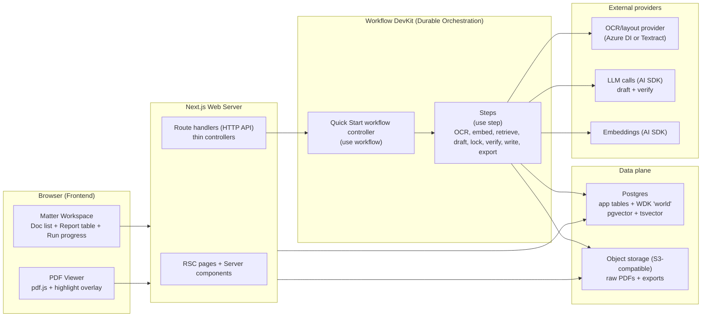
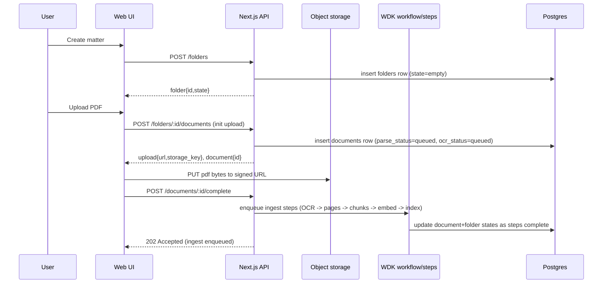
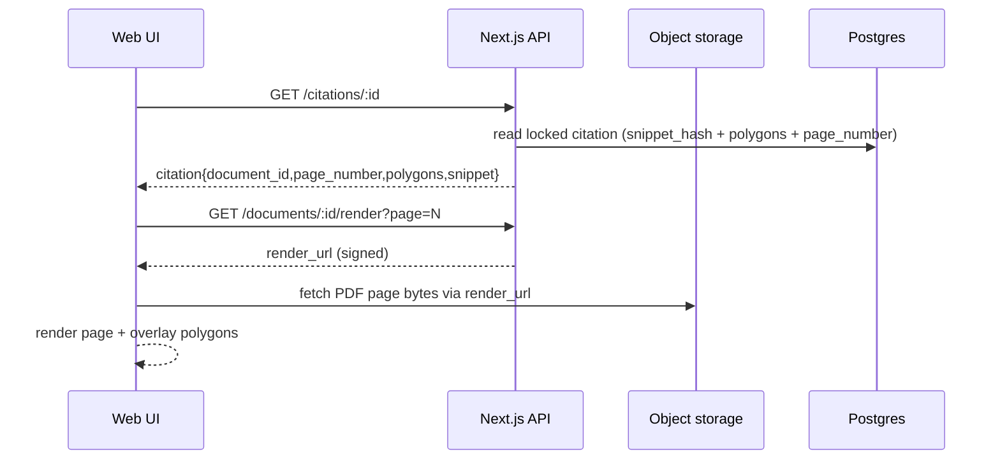
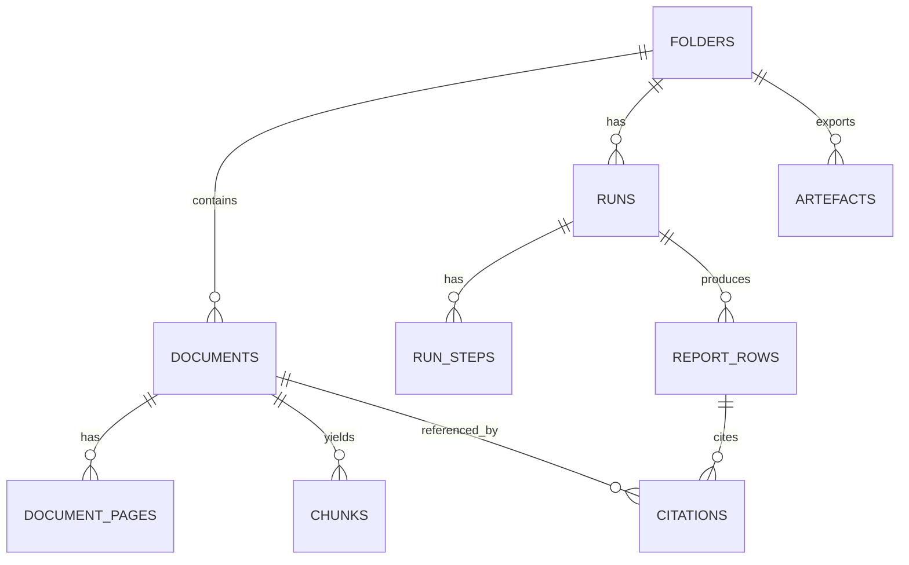
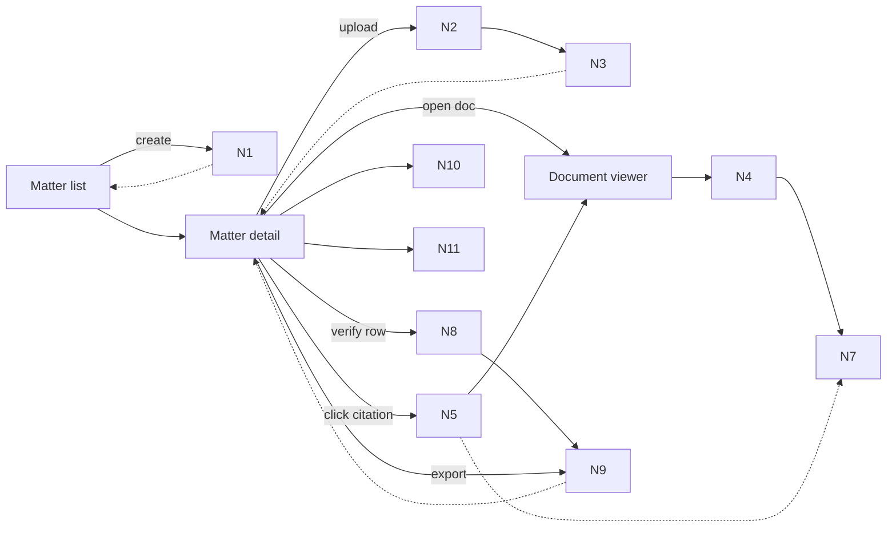
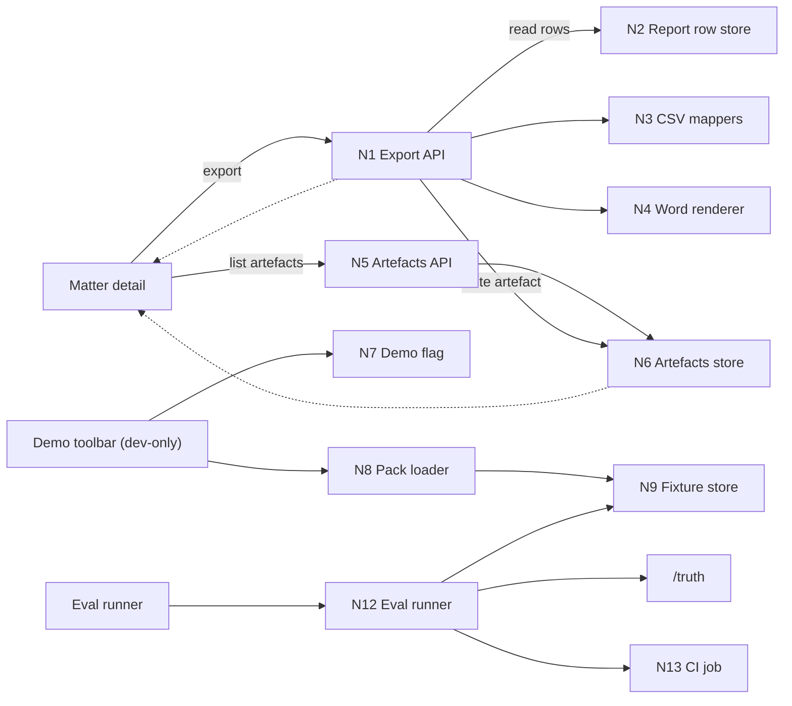

# PROMPT
You are a senior engineer reviewing the Orbital Copilot PoC architecture.

Context
- This repo is currently docs-first: there is no runnable pnpm/Next.js scaffold yet (see onboarding checklist).
- The architecture is evidence-first: every material claim must have locked citations and a fail-closed verification posture.
- Orchestration is intended to be Workflow DevKit (WDK) with strict "use workflow" / "use step" boundaries.

Question
I want an actionable recommendation for the next highest-leverage follow-ups:
1) Write ADR(s) to pin chunking strategy AND question set versioning mechanics.
2) Build a tracer-bullet runnable scaffold (ADR-0014) that validates viewer + citation locking end-to-end.
3) Wire a fixture-driven eval harness early to prevent regressions.

What to do
A) ADR(s): propose concrete decisions (PoC defaults) and produce ADR text in the repo's ADR format. Focus on:
- Chunking: what counts as a citable unit, chunk sizing/overlap defaults, boundary rules, metadata, and how index_version bumping works.
- Question sets: where they live (repo files vs DB), how they are versioned, and exactly how runs pin question_set_version for "completed" invariants.

B) Tracer bullet scaffold:
- Propose the smallest pnpm workspace scaffold that can prove: "click citation -> highlight evidence" and "row statuses obey invariants".
- Include a minimal end-to-end slice plan with milestones and the smallest set of files to create.
- Keep boundaries intact: route handlers thin; side effects in steps; steps are idempotent (step_key).
- It's acceptable to stub expensive parts initially (OCR/layout, embeddings) as long as citation locking + hashing + highlighting are real and testable.

C) Fixture eval harness:
- Propose where fixtures live, what scripts to add (expected command shape), and what the first hard gates/metrics should be.
- Align with the failure taxonomy and suggested eval report JSON shape.
- Ensure the harness can run locally and in CI once code exists.

Also:
- Call out any contradictions or missing pieces across the attached docs that should be resolved before coding.

Output format
- 1-2 paragraph high-level recommendation.
- Then sections A, B, C with concrete bullet lists.
- Include suggested patches/snippets for docs where appropriate (especially `docs/03-architecture/DECISIONS.md`).

Constraints
- PoC, single-tenant, minimal infra.
- No external web research inside PoC runs.
- Avoid introducing unnecessary dependencies.

# FILES

----- BEGIN FILE: AGENTS.md -----
# AGENTS.md

## Tooling
- Package manager: pnpm (workspaces)
- Prefer TypeScript for new code unless the repo already uses something else

## Principles
We follow core ideas from *The Pragmatic Programmer* (Andy Hunt, Dave Thomas):

- **Take ownership.** If something’s broken/unclear/risky or “not your job”, act anyway: flag it, fix it, or shape a better path.
- **Keep learning.** Maintain a “knowledge portfolio”. Store learnings in `docs/LEARNINGS.md`.
- **Avoid duplication (DRY).** Duplicate knowledge is as bad as duplicate code. Keep one source of truth and reuse it.
- **Build orthogonally.** Reduce coupling, keep dependencies explicit, and interfaces small.
- **Use tight feedback loops.** Small steps, fast validation. Use tracer bullets (thin end-to-end slices). One concern per commit/PR. Prefer the simplest thing that meets the requirement.
- **Prototype to learn, then bin it (when needed).** Don’t let prototypes silently become production.
- **Make behaviour explicit.** Clear contracts, assert assumptions, fail loudly when they break.
- **Automate boring/error-prone work.** Builds, tests, formatting, releases, setup, checks. If you do it twice, consider scripting it.
- **Keep code easy to change.** Refactor continuously, rename aggressively, optimise for readability.
- **Debug systematically.** Reproduce, isolate, change one thing at a time. Use tools properly.
- **Fix broken windows.** Small messes spread — tidy early.
- **Communicate trade-offs.** Requirements/estimates are conversations. Explain options, risks, and costs plainly.

Vibe: be practical, stay curious, optimise for long-term leverage over short-term heroics.

## Error handling + safety (high level)
- Validate external inputs at boundaries (Zod) and return safe user-facing errors
- Don’t leak internal errors/details to clients
- Unexpected issues: fail loudly (log/throw). Only show user-facing errors when needed

## Compatibility
- Backwards compatibility usually not required

## Agent files
- `AGENTS.md`: Repo‑wide engineering standards, tooling, and verification rules.
- `apps/web/AGENTS.md`: Stack and guardrails for the Next.js web app.
- `docs/AGENTS.md`: Structure and rules for the docs/knowledge hub, uncluding where to save oracle bundles and handoff notes.
- `docs/02-guidelines/AGENTS.md`: Brand/tone/a11y guidance + Brand DNA outputs (including Tailwind-ready token/preset artefacts).
- `docs/03-architecture/AGENTS.md`: Architecture boundaries and security posture rules.
- `docs/04-projects/AGENTS.md`: Dossier conventions and delivery workflow for project work.
- `docs/06-release/AGENTS.md`: Release process and changelog/postmortem expectations

## Core skills to use
- `ask-questions-if-underspecified` skill when unclear
- `oracle` skill for deep research
- `verify` skill for checking code changes

## Canonical instructions + local agent setup
- Canonical skills/commands/hooks live in `marchatton/agent-skills` — fix/add missing/wrong skills there NOT in this repo
- `.agents/` contains all skills etc in this repo (e.g. `codex`). For other tools, use `iannuttall/dotagents` to symlink `.agents` into tool-specific locations
- `AGENTS.md` is the source of truth; other agent files should be symlinks (don’t fork instructions per tool)
----- END FILE: AGENTS.md -----

----- BEGIN FILE: README.md -----
# orbital-poc
This is a personal project created for educational purposes as part of a job application to Orbital. It is not affiliated with, endorsed by, or connected to Orbital in any way. This is purely a demonstration of technical skills and understanding of the problem domain.

## Start here
- Onboarding checklist: `docs/03-architecture/01_onboarding_checklist.md`
- Architecture overview: `docs/03-architecture/00_overview.md`
- Tech stack + dev workflow: `docs/03-architecture/05_tech_stack_and_dev_workflow.md`
----- END FILE: README.md -----

----- BEGIN FILE: apps/web/AGENTS.md -----
# Web app (apps/web)
Next.js App Router web application.

## Stack
- Next.js App Router + TypeScript
- Tailwind + shadcn/ui + Radix (icons: `lucide-react`)
- Forms: React Hook Form + Zod
- Tests: Vitest + Testing Library (MSW for mocks)

## Guardrails (high leverage)
- Server-first: fetch on the server (RSC / route handlers / server actions). Avoid client-side data fetching effects.
- Treat `useEffect` as an escape hatch (imperative interop only) — not for data fetching, derived state, prop→state, or URL sync.
- Never import server-only into client components (use `server-only` / `client-only` boundaries).
- Validate external inputs with Zod and map errors to safe user-facing messages.
- AI SDK flows: use Workflow DevKit (`workflow`) and add `"use workflow"` in async TS fns for durability, reliability, observability.
  - Conventions for `"use workflow"` / steps are defined in `docs/03-architecture/06_frameworks_agents_rag_evals.md`.

## Frontend skills
- `frontend-design`: build distinctive UI.
- `web-design-guidelines`: audit UI against web interface guidelines.
- `baseline-ui`: enforce UI baseline; prevent design slop.
- `fixing-accessibility`: a11y fixes and audits.
- `fixing-metadata`: SEO/social metadata fixes.
- `fixing-motion-performance`: animation perf fixes.
- `react-best-practices`: React/Next.js performance best practices.
- `composition-patterns`: React composition patterns for scalable component APIs.
- `test-browser`: browser smoke for changed UI paths.
- `rams`: backup UI critique via the `rams` skill (prefer ui-skills first).
----- END FILE: apps/web/AGENTS.md -----

----- BEGIN FILE: docs/03-architecture/00_overview.md -----
# Orbital Copilot PoC Architecture
US CRE Title + Survey Quick Start (evidence-first, artefact-first)

## Purpose
Define a production-minded (but PoC-sized) architecture for a law-firm workflow that ingests a US CRE diligence pack and produces defensible artefacts with clause-level evidence.

Optimised for:
- Title commitment (Schedule A / B-I / B-II)
- Exception instruments (easements, REAs, CC&Rs, mortgages, plats)
- ALTA/NSPS survey (draft or final)
- Trust UX: click citation → see highlighted evidence in the PDF

## Product scope (what we will build)
A matter workspace that supports:
1) Upload + ingest a doc pack (PDF-first)
2) Run “Quick Start: Title + Survey”
3) Generate 3 artefacts (as report tables first, export later):
   - Schedule B-I Requirements tracker
   - Schedule B-II Exceptions table (linked to underlying instruments)
   - Survey reconciliation issues list (title ↔ survey)

Every material claim must have citations or “Not found in provided documents.”

## Non-goals (explicit)
- No legal advice / materiality decisions / negotiation posture
- No external web research inside the PoC run
- No integrations (iManage/NetDocs/SharePoint)
- No multi-tenant admin, SSO/RBAC, billing
- No property visualiser / boundary plotting (stretch only)

## Key architectural decisions (PoC defaults)
- Evidence-first with citation locking: citations are IDs, not free text
- Fail-closed verification: citation mismatch → row is `citation_failed`
- Artefacts-first UX: report table is the centre of gravity
- OCR/layout for all PDFs (PoC default): consistent geometry for highlights
- Hybrid retrieval (RAG): lexical + vector search, rerank, then draft from evidence
- Deterministic-ish orchestration: explicit step machine, not free-running agents
- Fixture-driven reliability: synthetic packs + truth files used in CI-style evals

Canonical ADRs for these defaults live in `docs/03-architecture/DECISIONS.md` (append-only).

## Where RAG fits
RAG is the engine inside Quick Start:
- Ingestion creates canonical page text + geometry, then chunks + indexes
- Retrieval returns chunk IDs (hybrid lexical + vector)
- Drafting uses only retrieved evidence
- Verification locks citations and fails closed when evidence does not support the claim

## Where evals fit
Evals are first-class because trust is the product:
- Compare outputs against `/truth` in the synthetic packs
- Validate citation integrity (hash + page + geometry)
- Spot retrieval misses and false passes before demos

## Tech stack and framework choices
See:
- `docs/03-architecture/05_tech_stack_and_dev_workflow.md` for stack, dev workflow, and fixtures
- `docs/03-architecture/06_frameworks_agents_rag_evals.md` for framework options and why we chose Workflow DevKit

## Open decisions to pin (before implementation)
These should become explicit (ideally as ADRs) before we build the relevant slices:
- Chunking strategy: target chunk size/overlap, boundary rules, and what makes a chunk citable.
- Embeddings: model + dimension (and index parameters) to treat as the default for fixtures/evals.
- Question set v1 storage: file vs DB, version pinning, and edit workflow.
- Auth posture for the PoC: what is (and is not) protected in demo environments.
----- END FILE: docs/03-architecture/00_overview.md -----

----- BEGIN FILE: docs/03-architecture/01_onboarding_checklist.md -----
# Onboarding checklist

Last updated: 2026-02-07

Use this when setting up a new machine, or when onboarding someone new to this repo.

## 0) Repo reality check (do this first)
- [ ] Confirm whether this repo currently contains runnable code.
- [ ] Expected (when implemented): `pnpm-workspace.yaml`, root `package.json`, `apps/web/package.json`, `packages/core/package.json`.
- [ ] If those files are missing, this repo is currently docs-first: you can still contribute to docs/architecture, but you will not be able to run the app yet.

## 1) Accounts and access
- [ ] GitHub access to the repo (SSH recommended).
- [ ] Confirm deployment posture (ADR-0009, proposed): Hetzner-first (single VM) until proven otherwise; Vercel optional for previews/later.
- [ ] Hetzner account + SSH access (if deploying to Hetzner; ADR-0009, proposed).
- [ ] Vercel account (optional; preview deploys and/or later; ADR-0009, proposed).
- [ ] Local Postgres available (Docker Compose or Supabase local; ADR-0011, proposed).
- [ ] Deployment Postgres plan confirmed (self-host on VM unless explicitly choosing managed; ADR-0011, proposed).
- [ ] Local object storage ready: MinIO (or local filesystem for ultra-simple early dev) (ADR-0010, proposed).
- [ ] Deployment object storage ready: managed S3-compatible storage unless explicitly "single VM only" (ADR-0010, proposed).
- [ ] OCR/layout provider credentials ready (OCR/layout is required for PDFs; ADR-0003 accepted; provider default Azure Document Intelligence Layout per ADR-0012, proposed).
- [ ] AI SDK gateway access/keys ready (ADR-0013, proposed). Default is Vercel AI Gateway; direct provider keys only with explicit reason.

## 2) Local tooling
- [ ] Node.js installed (LTS recommended). If `.nvmrc` / `.node-version` appears in the repo later, follow it.
- [ ] pnpm available (prefer Corepack: `corepack enable`).
- [ ] Docker installed (for local Postgres/MinIO).
- [ ] `psql` installed (for DB debugging).
- [ ] Vercel CLI installed (optional; only if you’re using Vercel).
- [ ] Optional: `aws` CLI or `az` CLI (if testing OCR/storage against cloud locally).

## 3) Repo setup (one-time)
- [ ] Install git hooks: `bash scripts/install_git_hooks.sh`
- [ ] Optional (agent tooling): copy repo skills into your agent home: `bash scripts/install_codex_skills_copy.sh`
- [ ] Read `docs/03-architecture/DECISIONS.md` (ADRs). Start with accepted ADRs:
- [ ] ADR-0001 (evidence-first outputs with citation IDs + locking)
- [ ] ADR-0002 (verification is fail-closed)
- [ ] ADR-0003 (OCR/layout extraction default for PDFs)
- [ ] ADR-0004 (hybrid retrieval returns chunk IDs)
- [ ] ADR-0005 (workflow steps: retrieve → draft → lock → verify → write)
- [ ] ADR-0006 (fixture-driven evals)
- [ ] ADR-0007 (no external web research inside PoC runs)
- [ ] ADR-0008 (explicit API error envelope)
- [ ] Read the canonical PoC docs:
- [ ] `docs/03-architecture/00_overview.md`
- [ ] `docs/03-architecture/05_tech_stack_and_dev_workflow.md`
- [ ] `docs/03-architecture/10_system_architecture.md`
- [ ] `docs/03-architecture/20_state_model.md`
- [ ] `docs/03-architecture/30_data_model.md`
- [ ] `docs/03-architecture/40_rag_and_agents.md`
- [ ] `docs/03-architecture/50_api_surface.md`
- [ ] `docs/03-architecture/60_observability_and_evals.md`

## 4) Local services (when code is present)
- [ ] Postgres running locally.
- [ ] `pgvector` available (required for embeddings).
- [ ] Object storage available for PDFs + exports (local filesystem for dev, or MinIO for S3-parity).
- [ ] OCR provider wired (default Azure Document Intelligence Layout; AWS Textract if AWS-first).
- [ ] LLM + embeddings wired via AI SDK (gateway default; direct provider only when intentional).
- [ ] Workflow runner available (Workflow DevKit / worker process; ADR-0005).

## 5) Environment variables (when code is present)
- [ ] Create local env files (never commit secrets): `apps/web/.env.local` (and others as needed).
- [ ] Database connection configured.
- [ ] Object storage credentials + bucket configured.
- [ ] OCR credentials configured.
- [ ] AI Gateway + model selection configured:
  - `AI_GATEWAY_API_KEY` (required locally/Hetzner; Vercel OIDC can work without it)
  - `LLM_MODEL_CHAT`, `LLM_MODEL_SUMMARY`, `EMBED_MODEL`
- [ ] Confirm no secrets use the `NEXT_PUBLIC_` prefix.

## 6) Run locally (when code is present)
- [ ] Install deps: `pnpm install`
- [ ] Start the dev server (see root `package.json` scripts once scaffolded).
- [ ] Smoke test the happy path:
- [ ] Upload a synthetic pack from `docs/08-example-data/`.
- [ ] Run “Quick Start: Title + Survey”.
- [ ] Click a citation chip and confirm the PDF highlight overlay works.
- [ ] Smoke test the failure path (ADR-0002, ADR-0007):
- [ ] Ask at least one question that is not answerable from the uploaded pack.
- [ ] Confirm the run resolves to `missing_input` / a blocked row (eg `citation_failed`), not an uncited answer.

## 7) Deploy (Hetzner-first is proposed; Vercel optional)
- [ ] Confirm deployment target (ADR-0009, proposed).
- [ ] Hetzner: SSH access to the VM.
- [ ] Hetzner: Postgres backups + basic monitoring are in place (ADR-0011, proposed).
- [ ] Hetzner: S3-compatible storage is available (managed preferred; ADR-0010, proposed).
- [ ] Hetzner: runtime shape (web server + workflow worker) is running under process supervision (ADR-0005).
- [ ] Vercel (optional): Create a new Vercel project from this Git repo.
- [ ] Vercel (optional): Set Vercel “Root Directory” to `apps/web` (monorepo setup).
- [ ] Vercel (optional): Configure environment variables for Preview and Production (match local env).
- [ ] Vercel (optional): Connect Postgres (Vercel Postgres or external).
- [ ] Vercel (optional): Connect storage (S3-compatible baseline; ADR-0010, proposed).
- [ ] Vercel (optional): Deploy a Preview build and verify core flows work end-to-end.

## 8) Verification (when code is present)
- [ ] Run `bash scripts/verify.sh` (expects `pnpm lint`, `pnpm test`, `pnpm build` to be wired).
- [ ] Run fixture evals (when wired; ADR-0006). Expected command shape: `pnpm fixture:eval`
- [ ] If you add configs (eslint/vitest/next/tsconfig/etc), wire the corresponding runner:
- [ ] `scripts/lint.sh`
- [ ] `scripts/test.sh`
- [ ] `scripts/build.sh`
- [ ] `scripts/typecheck.sh`

## 9) Contributing hygiene
- [ ] Append non-trivial learnings to `docs/LEARNINGS.md`.
- [ ] ADRs are append-only in `docs/03-architecture/DECISIONS.md` (link the PR).
- [ ] Oracle bundles + handoff notes are committed under dossier `tmp/` (preferred) or `docs/98-tmp/` (when not tied to a dossier).
- [ ] Local-only scratch goes in root `throwaway/`.
----- END FILE: docs/03-architecture/01_onboarding_checklist.md -----

----- BEGIN FILE: docs/03-architecture/05_tech_stack_and_dev_workflow.md -----
# Tech stack + dev workflow (PoC)

This doc pins the stack and how we build, run, debug, and regression-test the PoC.

## PoC posture (constraints)
- Single-tenant environment
- PDF-first ingestion (scans are common)
- Trust UX is the product: citations + highlight overlays must work
- Deterministic-ish orchestration (step machine)
- Minimal infra surface area, but production-minded plumbing (jobs, retries, idempotency, traces)

---

## Recommended stack (opinionated)

### Frontend
- Next.js (App Router) for the workspace UI
- Tailwind for styling
- TanStack Table for report table
- pdf.js for PDF rendering + custom highlight overlay layer

### Backend and orchestration
- Next.js route handlers for HTTP APIs (PoC convenience)
- Workflow DevKit (WDK) for durable orchestration
  - Quick Start runs as a workflow
  - Side effects isolated into steps (OCR, embeddings, LLM calls, DB writes)
  - Supports incremental progress updates

### Workers and queue
- Workflow DevKit Postgres World for durability (backed by Postgres)
- Additional worker processes only where needed (eg OCR/embedding throughput)

### Data and storage
- Postgres for:
  - metadata, runs, steps
  - report rows, citations, artefacts
  - lexical search using tsvector
  - embeddings via pgvector
- Object storage for raw PDFs + exported artefacts

### OCR/layout extraction
PoC default: OCR everything for consistent geometry
- Provider: Azure Document Intelligence or AWS Textract (choose one, wrap it)
- Persist: per-page text + geometry in `document_pages`

### LLM + embeddings
- All model + embeddings calls go through AI SDK (defaulting to Vercel AI Gateway)
- Simple model router (env/config driven):
  - Drafting: fast model
  - Rerank: fast model (or skip early)
  - Verification: stronger model (fail-closed)
  - Vision fallback: only for bad pages if needed
- Model selection is env-driven (eg `LLM_MODEL_CHAT`, `LLM_MODEL_SUMMARY`, `EMBED_MODEL`)
- Prompt versioning stored in git and stamped into runs (`agent_bundle_version`)

---

## LLM + embeddings (AI SDK)

We should treat the **AI SDK** as the only “public API” for model calls in this repo.
No direct provider SDKs sprinkled around (OpenAI SDK, Anthropic SDK, etc) unless we have a very specific reason.

Why this is the default
- One interface for:
  - streaming UI (Next.js route handlers)
  - background/durable workflow steps (worker)
- Easy provider swaps (gateway, direct provider, self-hosted proxy later)
- Keeps auth + retries + observability patterns consistent

### What we use

Packages
- `ai` (AI SDK core, includes the default Vercel AI Gateway provider)
- `@ai-sdk/react` (UI hooks like `useChat`)
- `zod` (tool input schemas, structured validation)

Install
```bash
pnpm add ai @ai-sdk/react zod
```

Optional (only when we intentionally go direct to OpenAI instead of the gateway)

```bash
pnpm add @ai-sdk/openai
```

### Runtime placement (important)

* Vercel “web”

  * Next.js App Router UI
  * Route handlers for streaming UX (chat, explain, etc)
  * Avoid long-running or retry-heavy side effects here

* Hetzner worker

  * Runs WDK steps for OCR / embeddings / LLM calls as side effects
  * Same AI SDK calls as Vercel, but wrapped in durable steps with idempotency

### Auth + env vars

Minimum contract (works locally, on Vercel, and on Hetzner)

* `AI_GATEWAY_API_KEY=...`

Notes

* If deployed on Vercel, the gateway provider can also auth via OIDC automatically (no API key required).
* Local dev with OIDC is fiddly unless you use `vercel dev` (tokens expire and need refresh). For this PoC, the simplest path is: just set `AI_GATEWAY_API_KEY` everywhere.
* Footgun: if `AI_GATEWAY_API_KEY` is present, it’s used even if it’s invalid. So don’t leave a stale key lying around.

Suggested model config (strings are examples, pick from gateway model list)

* `LLM_MODEL_CHAT=anthropic/claude-sonnet-4.5`
* `LLM_MODEL_SUMMARY=openai/gpt-5`
* `EMBED_MODEL=openai/text-embedding-3-large` (or whatever we standardise on)

### “one way to do it” code patterns

#### 1) Streaming chat route (Vercel web)

`apps/web/app/api/chat/route.ts`

```ts
import { streamText, UIMessage, convertToModelMessages } from 'ai';

export async function POST(req: Request) {
  const { messages }: { messages: UIMessage[] } = await req.json();

  const result = streamText({
    // Prefer model ids stored in env vars, this is an example:
    model: process.env.LLM_MODEL_CHAT ?? 'anthropic/claude-sonnet-4.5',
    messages: await convertToModelMessages(messages),
  });

  return result.toUIMessageStreamResponse();
}
```

#### 2) Chat UI hook (client)

```tsx
'use client';

import { useChat } from '@ai-sdk/react';
import { useState } from 'react';

export default function Chat() {
  const [input, setInput] = useState('');
  const { messages, sendMessage } = useChat(); // defaults to POST /api/chat

  return (
    <form
      onSubmit={e => {
        e.preventDefault();
        sendMessage({ text: input });
        setInput('');
      }}
    >
      <input value={input} onChange={e => setInput(e.currentTarget.value)} />
      <div>
        {messages.map(m => (
          <div key={m.id}>
            <strong>{m.role}:</strong>
            {m.parts.map((p, i) => (p.type === 'text' ? <div key={i}>{p.text}</div> : null))}
          </div>
        ))}
      </div>
    </form>
  );
}
```

#### 3) Worker-safe calls (WDK step body)

Rule: worker calls happen inside durable steps.
We add tracing metadata so we can correlate “this model call” to “this workflow step”.

```ts
import { generateText } from 'ai';

export async function runLlmStep(opts: {
  prompt: string;
  workflowRunId: string;
  stepId: string;
}) {
  const result = await generateText({
    model: process.env.LLM_MODEL_SUMMARY ?? 'openai/gpt-5',
    prompt: opts.prompt,
    experimental_telemetry: {
      isEnabled: true,
      functionId: 'wdk.step.llm',
      metadata: {
        workflowRunId: opts.workflowRunId,
        stepId: opts.stepId,
      },
    },
  });

  return { text: result.text, usage: result.usage };
}
```

### Observability

We should enable AI SDK telemetry on:

* worker steps (always)
* web routes (only where it helps, and watch PII)

Notes

* `experimental_telemetry` is opt-in per call.
* If prompts or doc text can contain sensitive info, consider `recordInputs: false` / `recordOutputs: false`.

### Model discovery (dev only)

If you don’t know model ids available via the gateway, you can programmatically list them:

```ts
import { gateway } from 'ai';

const availableModels = await gateway.getAvailableModels();
availableModels.models.forEach(m => console.log(m.id));
```

### Sources

* AI SDK Next.js App Router quickstart

  * [https://ai-sdk.dev/docs/getting-started/nextjs-app-router](https://ai-sdk.dev/docs/getting-started/nextjs-app-router)
* AI Gateway provider behaviour (env vars, OIDC, model discovery)

  * [https://ai-sdk.dev/providers/ai-sdk-providers/ai-gateway](https://ai-sdk.dev/providers/ai-sdk-providers/ai-gateway)
* Telemetry docs (`experimental_telemetry`)

  * [https://ai-sdk.dev/docs/ai-sdk-core/telemetry](https://ai-sdk.dev/docs/ai-sdk-core/telemetry)
* Vercel AI Gateway docs (overview)

  * [https://vercel.com/docs/ai-gateway](https://vercel.com/docs/ai-gateway)

---

## Dev workflow (how to run locally)

### Local services
- Postgres (docker compose or Supabase local)
- Redis only if you introduce a separate queue outside WDK (prefer not)
- Object storage:
  - local filesystem in dev (if acceptable)
  - or MinIO as an S3-compatible local bucket

### Core commands (fixture-driven)
Synthetic packs are first-class fixtures. Expect scripts like:

- `pnpm fixture:ingest pack_01_clean`
- `pnpm fixture:run pack_01_clean`
- `pnpm fixture:eval pack_01_clean`
- `pnpm fixture:eval:all`
- `pnpm demo:smoke` (ingest + run + eval summary for 1–2 packs)

### What “demo:smoke” must prove
- Run completes on `pack_01_clean`
- Missing-doc flow triggers on `pack_02_missing_rea`
- At least one deliberate bad citation triggers `citation_failed`
- Citation chips open the viewer and highlight evidence

---

## Repo layout (suggested)
```
/apps/web
  /app
  /components
  /viewer (pdf.js + highlight overlay)
  /api (route handlers)
  /workflows (WDK workflow entrypoints)
  /steps (WDK step implementations)

/packages/core
  /schemas (zod JSON contracts)
  /retrieval (hybrid search + rerank)
  /citations (locking + hashing)
  /prompts (drafter/verifier prompts)
  /evals (fixture-based checks)

/docs/03-architecture
/docs/04-projects (shaping dossiers)
```

---

## Guardrails (must exist)
- Schema validation on every drafted row JSON (hard gate)
- Citation locking (chunk_id → snippet/hash/geometry) before verification
- Verification fail-closed by default
- Row statuses persisted and visible (no silent failures)
- “Not found in provided documents.” is a valid output, tracked as `missing_input`
----- END FILE: docs/03-architecture/05_tech_stack_and_dev_workflow.md -----

----- BEGIN FILE: docs/03-architecture/06_frameworks_agents_rag_evals.md -----
# Frameworks, agents, RAG, and evals

This doc answers:
- why we picked Workflow DevKit for orchestration
- what we do (and do not) use agent frameworks for
- where RAG fits in the system
- how evals are wired in for demo reliability

## Framework selection

### Chosen for PoC: Workflow DevKit (WDK)
Why:
- Our core requirement is a durable, resumable, deterministic-ish workflow:
  `retrieve → draft → lock → verify → write` per row
- WDK naturally models this with workflows and steps:
  - workflow is the deterministic controller
  - steps encapsulate non-deterministic side effects (OCR, embeddings, LLM calls, DB writes)
- It supports incremental progress which maps to “table populates row-by-row”

Risk:
- WDK is early-stage, so keep integration thin:
  - keep domain logic in `packages/core`
  - treat WDK as orchestration and durability, not as the place where business rules live

### WDK conventions in this repo
WDK is the durable orchestration runtime we refer to as `workflow` in code. It provides:
- a **workflow** function (deterministic controller) that can be resumed/replayed
- **step** functions that perform side effects (OCR, embeddings, LLM calls, DB writes)
- a Postgres-backed “world” for state, retries, and progress events

Conventions we follow (to keep the integration thin and predictable):
- Workflow entrypoints must start with the directive string literal **`"use workflow"`** as the first statement in the async function body.
- Step implementations must start with **`"use step"`** as the first statement in the async function body.
- Workflows do **not** perform side effects directly (no network/LLM/OCR/DB writes). They only call steps and assemble results.
- Steps are responsible for idempotency (safe re-run). Where the provider call cannot be naturally idempotent, store a deterministic idempotency key in `run_steps` and short-circuit on repeats.
- Step inputs/outputs must be JSON-serialisable and validated with Zod schemas from `packages/core/schemas`.

Why the directives matter:
- they make it obvious (in code review) whether a function is allowed to do side effects
- they reduce drift into “free-running agents” by forcing work to be split into explicit steps

See also: `docs/03-architecture/20_state_model.md` (state invariants) and `docs/03-architecture/30_data_model.md` (provenance + replay).

### Alternatives (when you might choose them)
- Mastra: integrated TS framework for agents, workflows, RAG, evals. Strong if you want one unified AI platform.
  - For this PoC, it risks overreach unless you keep Quick Start as a workflow graph rather than agent loops.
- LangGraph.js: good if you want graphs/state machines as the primary abstraction.
  - In our setup WDK already owns orchestration, so LangGraph can become duplicate complexity.
- OpenAI Agents SDK: good for interactive tool-using assistants.
  - For Quick Start we prefer a strict workflow. Agents SDK can still be used later for a chat slice.

---

## Where “agents” fit in this PoC
We keep the 4-agent mental model as a product narrative, but implement it as constrained functions under the workflow’s control.

### Orchestrator (workflow controller)
- Encoded as the WDK workflow
- Loads question set v1
- Runs per-question loop with strict ordering and budgets
- Owns progress and run steps

### Retrieval agent (evidence gatherer)
- Implemented as a step: `retrieve_evidence_step(question_id, filters)`
- Output: chunk IDs + scores + docs_searched

### Drafting agent (row writer)
- Implemented as a step: `draft_row_step(question_id, evidence_chunk_ids)`
- Output: structured row JSON with candidate citations as chunk IDs (not free text)

### Verification agent (citation QA)
- Implemented as a step: `verify_row_step(row_json, locked_citations)`
- Output: pass/fail + corrected answer if needed
- Fail-closed is the default

Research agent:
- Out of scope for PoC (no external web research)
- If needed, implement as a static internal snippet tool, not web browsing

---

## Where RAG fits (end-to-end)
RAG is the engine inside Quick Start. It spans ingestion and runtime.

### Ingestion (creates retrieval substrate)
- OCR/layout extraction → canonical per-page text + geometry
- Chunking → citable chunks with metadata
- Indexing:
  - lexical search via tsvector
  - semantic search via pgvector embeddings

### Runtime (per question)
1) Retrieve: hybrid search + rerank returns chunk IDs
2) Draft: generate row JSON using only retrieved evidence
3) Lock citations: resolve chunk IDs → authoritative snippet + hash + geometry
4) Verify: hash checks + entailment check
5) Write: store report row + citations + status

Key invariant:
- if we cannot retrieve evidence, the system must output “Not found in provided documents.” and set `missing_input`

---

## Evals (fixture-driven, tied to /truth)
Evals are first-class because trust is the product. The synthetic packs allow repeatable regression testing.

### Minimum eval suite
1) Extraction correctness (per pack)
- Requirements count and key fields match `/truth/expected_requirements_tracker.csv`
- Exceptions count and key fields match `/truth/expected_exceptions_table.csv`
- Survey issues match `/truth/expected_survey_issues.csv` (allow “unknown” where designed)

2) Retrieval quality (golden questions)
- Recall@K: do we retrieve the expected chunk/page for each question in `golden_questions.json`?

3) Citation validity
- Code checks:
  - cited page exists
  - polygons exist
  - snippet_hash matches canonical snippet
- Judge checks (optional but recommended):
  - entailment: snippet supports claim, conservative rubric

4) Failure journeys
- `pack_02_missing_rea` should reliably produce `missing_input` rows with a missing-doc checklist
- at least one deliberately corrupted citation should produce `citation_failed`

### How evals run
- `fixture:eval pack_x` produces:
  - per-pack JSON report with pass/fail and metrics
  - failure taxonomy counts
- `fixture:eval:all` produces a summary table across packs
- CI can start as “report only” then become “gate on thresholds”

---

## What we scaffold vs what must be real
Scaffold early:
- use `/layout/*.anchors.json` for highlighting before OCR geometry is perfect
- seed some rows from `/truth` to validate viewer UX

Must be real early:
- citation object contract and snippet hashing rules
- fail-closed verification and row status transitions
- missing-doc behaviour and explicit “not found” outputs
----- END FILE: docs/03-architecture/06_frameworks_agents_rag_evals.md -----

----- BEGIN FILE: docs/03-architecture/10_system_architecture.md -----
# System architecture

This doc is the canonical high-level map of the Orbital Copilot PoC runtime. It should stay stable while code is added.

Goals (PoC)
- Evidence-first UX: click `citation_id` -> see highlighted PDF evidence.
- Deterministic-ish runs: row-by-row progress, resumability, retries, explicit side effects.
- Thin API layer: mostly triggers workflows and reads state.
- Production-minded plumbing, PoC-sized surface area (single-tenant; minimal infra).

Non-goals (for now)
- Multi-tenant admin, SSO/RBAC, billing.
- External web research inside a run (ADR-0007).
- Microservices decomposition (one app + worker is the baseline).

## Glossary
- Folder: DB/API name for a workspace container. UI calls it a Matter.
- Run: one execution of a Quick Start workflow for a folder.
- Step: a single side-effect boundary executed durably by Workflow DevKit (WDK).
- Index version: identifies the retrieval substrate built for a folder (chunks + indices).
- Agent bundle version: pins prompts + schemas + logic used by a run (git SHA is fine for PoC).
- Question set version: pins the question set used by a run (see `docs/03-architecture/20_state_model.md` and `docs/03-architecture/30_data_model.md`).
- Citation locking: resolving candidate chunk IDs into immutable citation records with snippet/hash/geometry (ADR-0001).

## High-level component map

Conventions:
- The meaning of `(use workflow)` / `(use step)` is defined in `docs/03-architecture/06_frameworks_agents_rag_evals.md`.



Notes:
- WDK owns durability, retries, resumability, and step-level progress events (ADR-0005).
- Domain logic should live outside the WDK integration layer (eg `packages/core`) and be called from steps.
- This repo is currently docs-first; once code exists, keep the same conceptual boundaries even if directories differ.

## Ownership and boundaries

### Browser / frontend
Responsibilities:
- Matter workspace UI: upload documents, show ingest/run status, show report rows, show export links.
- PDF rendering with highlight overlay (render page from object storage; overlay locked citation polygons).

Must not:
- Fetch data via client-side effects by default (server-first; see `apps/web/AGENTS.md`).
- Invent trust: the UI should reflect row statuses and export gating rules from `docs/03-architecture/20_state_model.md`.

### Web/API (Next.js route handlers)
Responsibilities:
- Validate external inputs with Zod at the boundary (request bodies, route params).
- Translate domain errors into the safe error envelope (`docs/03-architecture/50_api_surface.md`, ADR-0008).
- Trigger workflows (start run, enqueue ingest/export) and read state for the UI.
- Provide signed URLs for PDF rendering and artefact downloads.

Must not:
- Implement heavy/long-running work inline (OCR, embeddings, LLM calls).
- Leak provider payloads or stack traces to clients.

### Workflow runtime + workers (WDK)
Responsibilities:
- Orchestrate the row-by-row flow for Quick Start:
  `retrieve -> draft -> lock -> verify -> write` (ADR-0005).
- Encapsulate non-deterministic side effects in explicit steps (ADR-0005).
- Guarantee idempotent replays/retries at the step boundary (see `docs/03-architecture/06_frameworks_agents_rag_evals.md`).

### Data plane (Postgres + object storage)
Responsibilities:
- Postgres is the source of truth for state: folders, documents, chunks, runs, steps, report rows, citations, artefacts (`docs/03-architecture/30_data_model.md`).
- Object storage holds raw PDFs and exported artefacts (ADR-0010 proposed).

Invariant:
- A claim is only "exportable" when its citations are locked and verification passes (ADR-0001/0002).

### External providers
Responsibilities:
- OCR/layout provider produces canonical per-page text + geometry (ADR-0003; ADR-0012 proposed).
- LLM + embeddings calls go through AI SDK and are routed/configured via env (ADR-0013 proposed).

## Key sequences

### Create matter -> upload -> ingest -> indexed/ready


State rules live in `docs/03-architecture/20_state_model.md`. Data persistence rules live in `docs/03-architecture/30_data_model.md`.

### View a citation highlight


### Quick Start run (row-by-row)
High-level loop (details in `docs/03-architecture/40_rag_and_agents.md`):
1) Retrieve evidence: hybrid search returns chunk IDs (ADR-0004).
2) Draft structured row JSON from evidence only (candidate citations are chunk IDs).
3) Lock citations: create immutable `citations` rows and replace candidate IDs with `citation_id`s (ADR-0001).
4) Verify: fail-closed; any mismatch sets `citation_failed` (ADR-0002).
5) Write: persist `report_rows` and update progress.

### Export artefacts
Export is a step-driven process (can be immediate or async):
- default is to block export if any row is `citation_failed` unless an explicit override is provided (see `docs/03-architecture/20_state_model.md` and `docs/03-architecture/50_api_surface.md`).

## Deployment topology (PoC)

### Local dev (expected once scaffold exists)
- Web server: Next.js dev server.
- Worker: WDK worker process.
- Postgres: docker compose or Supabase local (ADR-0011 proposed).
- Object storage: local filesystem (ultra-simple) or MinIO for S3 parity (ADR-0010 proposed).

### Single VM (Hetzner-first; ADR-0009 proposed)
Baseline deployment shape:
- One VM running:
  - Next.js server (web/API)
  - WDK worker(s)
  - Postgres (with backups)
  - Optional MinIO (or managed S3-compatible storage)

Rationale:
- Keeps network latencies simple and avoids serverless connection pitfalls while the PoC is stabilising.

### Optional: Vercel for previews (later)
If/when we move web/API to Vercel:
- Keep WDK worker + Postgres off-Vercel (worker on VM or managed runtime).
- Add connection pooling and hard timeouts/limits.

## Scaling and failure modes (design notes)
- Backpressure: ingest and runs should be queued and rate-limited per folder to avoid stampedes (OCR + embeddings are the expensive knobs).
- Retries: step retries must not duplicate `report_rows` or `citations` (idempotency keys in `run_steps`).
- Cost control: cap evidence chunks per question, cap tokens, log usage per run (see `docs/03-architecture/60_observability_and_evals.md`).
- Consistency: the UI should always render from persisted state; do not show "draft" answers without locked citations.

## Open questions to pin (candidate ADRs)
- Chunking strategy: what makes a chunk citable and stable over time (`docs/03-architecture/00_overview.md`).
- Question set storage + versioning and how it is pinned per run (`docs/03-architecture/20_state_model.md`).
- Auth posture for the PoC (what is protected in demo environments) (`docs/03-architecture/00_overview.md`).
----- END FILE: docs/03-architecture/10_system_architecture.md -----

----- BEGIN FILE: docs/03-architecture/20_state_model.md -----
# State model

This doc defines the state machines and invariants for the PoC. Keep this as the canonical reference and link to it from other docs.

## Principles (why these states exist)
- Prefer monotonic state machines: a state should only move "forward" unless a user explicitly retries/restarts.
- States can be stored for UI convenience, but they must be derivable from persisted facts and remain consistent.
- Fail safe: if we cannot prove an answer is supported by locked evidence, we do not export it (ADR-0002).
- Keep states small and explicit. Avoid "magic" implied meaning in free-form JSON.

## Terminology
- **Folder** is the DB/API name for a workspace container. In the UI we call it a **Matter**.
- A **Run** is one execution of a Quick Start workflow for a folder.
- A **Report row** is the persisted output for a `(run_id, question_id)` pair.
- A **Citation** is an immutable, locked evidence object (snippet + hash + geometry) referenced by `citation_id` (ADR-0001).
- States are stored on rows for convenience, but must remain consistent with the invariants below.

## Version pinning (cross-cutting invariants)
Runs must pin the versions they executed with (see `docs/03-architecture/30_data_model.md`):
- `index_version`: which retrieval substrate (chunks + indices) was used.
- `agent_bundle_version`: prompts + schemas + step logic version (git SHA is fine for PoC).
- `question_set_version`: which question set was used.

Why:
- Replays and evals need to answer: "what code + schema + questions produced this row?"

## Folder state (`folders.state`)
States:
- `empty`
- `ingesting`
- `indexed`
- `ready`
- `failed` (terminal until a new ingest attempt is started)

Invariants (must hold):
- `empty`
  - folder has zero documents
- `ingesting`
  - at least one document is not in terminal ingest state (`parse_status != parsed` OR `ocr_status != done`)
  - OR derived retrieval substrate (chunks/indexes) is not built for `folders.latest_index_version`
- `indexed`
  - all documents are in terminal ingest state (`parse_status = parsed` AND `ocr_status = done`)
  - chunks exist for each document for `folders.latest_index_version`
  - folder is runnable (Quick Start can start), even if some docs are low quality
- `ready`
  - all `indexed` invariants hold
  - AND folder health checks pass (see below)
- `failed`
  - one or more documents have terminal `failed` ingest status OR a folder-level indexing job failed

Folder “ready” health checks (PoC defaults):
- no documents are `parse_status = failed` or `ocr_status = failed`
- for every document: `extraction_quality >= 0.60` (configurable; keep the threshold in eval fixtures)
- for every document: `page_count` is set AND `document_pages` count matches `page_count`

Allowed transitions (monotonic, except for retry):
- `empty` → `ingesting` (first upload starts)
- `ingesting` → `indexed` (all docs ingested + chunked + indexed for latest_index_version)
- `indexed` → `ready` (health checks pass)
- `ingesting|indexed|ready` → `failed` (non-recoverable ingest/index error)
- `failed` → `ingesting` (explicit retry/re-ingest; bumps `latest_index_version`)

Notes:
- Quick Start can start in `indexed` as well as `ready` (the "ready checks" are demo quality gates, not a hard requirement to run).
- `folders.state` should be explainable in the UI. If we introduce a new state, also define:
  - the user-facing label
  - the primary remediation action (retry, re-upload, contact support)

## Document state (`documents.parse_status`, `documents.ocr_status`)
Parse status:
- `queued` → `parsing` → `parsed` | `failed`

OCR status:
- `queued` → `running` → `done` | `failed`

Invariants (must hold):
- If `parse_status` is `parsing|parsed` then `storage_key` must be set and the raw PDF must exist in object storage.
- If `parse_status` is `parsed` then `page_count` must be set (>= 1).
- If `ocr_status` is `done` then `document_pages` must exist for every page with `text` and `layout_json`.
- `extraction_quality` is only meaningful when `ocr_status = done` (else set NULL or 0 and do not use it for decisions).

## Run state
Runs are the execution record for a single Quick Start attempt. Runs must pin the versions they executed with (see `docs/03-architecture/30_data_model.md`).

States:
- `created` (row exists, workflow not started)
- `running` (workflow is active)
- `completed` (workflow finished and wrote a terminal row for every question)
- `partial` (workflow stopped early but wrote at least one row)
- `failed` (workflow stopped early and wrote zero trustworthy rows)
- `cancelled` (optional; user-cancel)

Invariants (must hold):
- `completed`
  - for the question set version used by the run: exactly one `report_rows` record exists per `question_id`
  - every report row is in a terminal status (`needs_review|reviewed|missing_input|citation_failed`)
- `partial`
  - at least one report row exists
  - at least one `question_id` is missing a row (run stopped before finishing)
- `failed`
  - zero report rows exist OR all produced rows are explicitly marked non-exportable (e.g. `citation_failed`)

Allowed transitions:
- `created` → `running`
- `running` → `completed|partial|failed|cancelled`

## Run step state (`run_steps.state`)
Run steps are the durable execution log of side effects (OCR, embed, retrieve, draft, lock, verify, write, export). Steps make retries and resumability observable.

States:
- `queued` (scheduled but not started)
- `running`
- `succeeded` (terminal)
- `failed` (terminal)

Invariants (must hold):
- A step must be idempotent: retries must not duplicate `report_rows` or `citations`.
- A step attempt counter increments on each retry; attempt `1` is the first execution.
- `metrics_json` should be safe and structured (timings, token/cost usage, chunk counts). No raw PDF text.
- `error_json` must be safe to show to a user when needed (no provider payloads; no stack traces).

## Report row state (`report_rows.status`)
Statuses (terminal for the workflow):
- `needs_review` (verification passed; user may review)
- `reviewed` (user confirmed)
- `missing_input` (no supporting evidence in provided docs)
- `citation_failed` (verification failed or citation lock mismatch)

Invariants (must hold):
- Rows are scoped to a run: exactly one row per `(run_id, question_id)`.
- `needs_review|reviewed`
  - row has >= 1 citation
  - every citation is **locked** (stores snippet + hash + geometry) and is associated to this row
- `missing_input`
  - `answer` must be exactly: `Not found in provided documents.`
  - citations list must be empty
  - `notes` (or provenance) must include an actionable missing-doc checklist
- `citation_failed`
  - citations may exist, but the row is non-exportable by default
  - store a safe failure reason code in provenance (e.g. `CITATION_MISMATCH`, `ENTAILMENT_FAIL`)

User-driven transitions:
- `needs_review` → `reviewed` (only via explicit user action)

Export gating (PoC defaults):
- Exports are only allowed when `runs.state = completed` (PoC default).
- If any row in the selected run is `citation_failed`, export returns `EXPORT_BLOCKED` unless `unsafe_override = true` is provided.
  - Unsafe override is intended to be demo-only. See `docs/03-architecture/50_api_surface.md` for the HTTP contract and guardrails.

Notes:
- Do not invent new `report_rows.status` values. If you need additional per-item classification (eg survey issue `unknown`), store it inside the row payload/provenance, not by adding row statuses.
- The UI must reflect gating truthfully: "blocked" is a first-class state, not an exception.

## Suggested invariant checks (SQL; run in debug/evals)
These are optional, but they make "broken windows" obvious.

1) Report rows are 1:1 per run/question
```sql
select run_id, question_id, count(*) as n
from report_rows
group by run_id, question_id
having count(*) > 1;
```

2) `missing_input` rows have no citations and exact string answer
```sql
select rr.id
from report_rows rr
left join citations c on c.report_row_id = rr.id
where rr.status = 'missing_input'
group by rr.id, rr.answer
having rr.answer <> 'Not found in provided documents.' or count(c.id) > 0;
```

3) Export gating sanity: runs marked `completed` must have only terminal row statuses
```sql
select r.id
from runs r
join report_rows rr on rr.run_id = r.id
where r.state = 'completed'
  and rr.status not in ('needs_review', 'reviewed', 'missing_input', 'citation_failed')
group by r.id;
```
----- END FILE: docs/03-architecture/20_state_model.md -----

----- BEGIN FILE: docs/03-architecture/30_data_model.md -----
# Data model (Postgres + pgvector)

This is the canonical DB shape for the PoC “trust spine”: ingest → retrieve → draft → verify → report rows with locked citations.

Design rules (PoC)
- Postgres is the source of truth for state and auditability (ADR-0011 proposed).
- Prefer append-only records for "what happened" (runs, steps, report_rows, citations, artefacts).
- Citations are immutable once created (ADR-0001).
- Retrieval substrate is versioned. A new ingest/re-index bumps `folders.latest_index_version` and produces new `chunks` rows for that version.
- Everything that materially affects outputs should be pinnable on a run: `index_version`, `agent_bundle_version`, `question_set_version` (`docs/03-architecture/20_state_model.md`).

## ERD


## Encoding conventions (recommended)
- IDs are opaque strings (optionally prefixed, eg `fld_`, `doc_`, `run_`, `row_`, `cit_`).
- Timestamps are `timestamptz` in UTC.
- JSON columns are `jsonb` and must be "safe": no provider payload dumps, no stack traces, no raw PDF bytes.
- Arrays should be explicit JSON arrays; avoid comma-separated strings.

## Trust spine tables (minimum viable)

### `folders`
- `id`, `name`, `state`, `created_at`, `updated_at`
- `latest_index_version` (string; bumps on re-ingest/re-index)

Recommended constraints:
- `state` should be constrained to the folder state machine values (`docs/03-architecture/20_state_model.md`).

### `documents`
- `id`, `folder_id`, `filename`, `mime`, `bytes`
- `sha256` (dedupe), `storage_key`, `page_count`
- `parse_status`, `ocr_status`, `extraction_quality`
- `error_json` (safe ingest failure details)

Recommended constraints:
- FK `documents.folder_id -> folders.id` (ON DELETE CASCADE or RESTRICT; choose intentionally).
- Unique `(documents.folder_id, documents.sha256)` to avoid duplicates within a matter.

### `document_pages`
- `id`, `document_id`, `page_number`
- `text` (canonical)
- `layout_json` (tokens/lines/blocks + polygons)

Recommended constraints:
- FK `document_pages.document_id -> documents.id`.
- Unique `(document_pages.document_id, document_pages.page_number)`.

### `chunks`
- `id`, `document_id`
- `index_version` (string; matches `folders.latest_index_version` at time of build)
- `page_start`, `page_end`, `chunk_index`
- `text`, `metadata_json`, `tsv`, `embedding`
- `snippet_hash` (see “Hashing rule” below)

Notes:
- `tsv` is the lexical index (tsvector). Consider a generated column if you want to avoid drift.
- `embedding` is a pgvector column. It must match the chosen embedding model dimension (open decision; pin in fixtures/evals).

Recommended constraints:
- FK `chunks.document_id -> documents.id`.
- Unique `(chunks.document_id, chunks.index_version, chunks.chunk_index)`.

### `runs`
- `id`, `folder_id`, `type`, `state`
- `index_version` (pins retrieval substrate used by the run)
- `agent_bundle_version` (pins prompts + schemas)
- `question_set_version` (pins the exact question set used by the run; required for “completed” invariants)
- timestamps + `error_json` (safe failure details)

Recommended constraints:
- FK `runs.folder_id -> folders.id`.
- `state` constrained to the run state machine (`docs/03-architecture/20_state_model.md`).
- Consider a partial index for "latest run per folder" queries.

### `run_steps`
- `id`, `run_id`, `step_type`, `state`, `attempt`
- `step_key` (deterministic idempotency key; eg `ingest:doc_123:ocr` or `quick_start:BII-01:verify`)
- `metrics_json`, `error_json`
- timestamps

Recommended constraints:
- FK `run_steps.run_id -> runs.id`.
- Unique `(run_steps.run_id, run_steps.step_key)` so retries short-circuit safely.
- `state` constrained to the step state machine (`docs/03-architecture/20_state_model.md`).

### `report_rows`
- `id`, `folder_id`, `run_id`, `question_id`, `question`
- `answer`, `status`, `notes`
- `provenance_json` (minimum: retrieved chunk IDs + scores, models + prompt hashes, verification verdict + reason codes)
- timestamps

Recommended constraints:
- FK `report_rows.run_id -> runs.id`.
- FK `report_rows.folder_id -> folders.id`.
- Unique `(report_rows.run_id, report_rows.question_id)`.
- `status` constrained to the report row statuses (`docs/03-architecture/20_state_model.md`).

### `citations`
Citations are **locked** and **immutable** once created. They store enough to highlight evidence without re-running retrieval or re-reading chunks.
- `id`, `report_row_id`
- `chunk_id` (nullable; stored for debugging/replay)
- `document_id`, `page_number`
- `polygons`, `snippet`, `snippet_hash`
- `index_version` (string; pins the chunking/indexing version the citation came from)
- timestamps

Recommended constraints:
- FK `citations.report_row_id -> report_rows.id`.
- FK `citations.document_id -> documents.id`.
- `snippet_hash` is required and must be computed with the canonical rule below.

### `artefacts`
- `id`, `folder_id`, `type`, `storage_key`
- `source_run_id`, `metadata_json`
- timestamps

Notes:
- Do not persist signed `download_url` values in the DB; persist `storage_key` + metadata and generate fresh signed URLs on demand.
- Recommended `metadata_json` fields (PoC):
  - `kind` (e.g. `requirements_tracker`, `exceptions_table`, `survey_issues`, `memo`)
  - `filename`
  - `schema_version` (for CSVs)
  - `unsafe` / `unsafe_override` (if demo-only unsafe exports are ever allowed)

## Provenance JSON (recommended shape)
`report_rows.provenance_json` should be structured enough to support:
- replay ("what evidence did we use?")
- debugging ("which step failed, why?")
- evals ("what was Recall@K, what was verified?")

Minimal example (shape only; evolve as needed):
```json
{
  "retrieval": {
    "index_version": "v1",
    "query": "List Schedule B-II exceptions...",
    "chunks": [
      { "chunk_id": "chk_123", "score": 12.34 },
      { "chunk_id": "chk_456", "score": 10.98 }
    ]
  },
  "draft": {
    "model": "anthropic/claude-sonnet-4.5",
    "prompt_hash": "sha256:..."
  },
  "lock": {
    "locked_citation_ids": ["cit_123", "cit_124"]
  },
  "verify": {
    "model": "openai/gpt-5",
    "verdict": "pass",
    "reason_code": null
  }
}
```

## Hashing rule (snippet_hash)
We use `snippet_hash` to detect citation drift.

PoC rule:
- `snippet_hash = sha256(normalise(snippet))`
- `normalise()` must:
  - trim leading/trailing whitespace
  - convert CRLF → LF
  - collapse all whitespace runs to a single space

This rule must be implemented once (e.g. in `packages/core/citations`) and reused everywhere.

## Indices and constraints (recommended)
- Unique and FK constraints:
  - unique `(documents.folder_id, documents.sha256)`
  - unique `(report_rows.run_id, report_rows.question_id)`
  - unique `(chunks.document_id, chunks.index_version, chunks.chunk_index)`
  - unique `(run_steps.run_id, run_steps.step_key)`

- Indexing:
  - GIN on `chunks.tsv`
  - pgvector index on `chunks.embedding`
  - index `citations.report_row_id`
  - index `runs.folder_id`
  - index `documents.folder_id`

## Immutability and replay (important)
- `citations` must be treated as immutable after insert. If you need to "fix" a citation, create a new citation and update the report row to reference the new ID (and record why in provenance).
- Chunk drift is handled by versioning: new chunking/indexing should create a new `index_version`, not mutate existing chunks.
----- END FILE: docs/03-architecture/30_data_model.md -----

----- BEGIN FILE: docs/03-architecture/40_rag_and_agents.md -----
# RAG + agents (Quick Start)

This doc describes the end-to-end "evidence-first" pipeline for Quick Start. It is intentionally implementation-oriented.

Canonical related docs:
- `docs/03-architecture/06_frameworks_agents_rag_evals.md` (WDK conventions and why)
- `docs/03-architecture/20_state_model.md` (statuses + invariants)
- `docs/03-architecture/30_data_model.md` (tables + hashing + immutability rules)
- `docs/03-architecture/60_observability_and_evals.md` (failure taxonomy + eval posture)

## Why RAG exists here
RAG is the mechanism that makes “evidence-first” possible:
- It finds evidence in the uploaded pack.
- It turns evidence into stable references (chunk IDs).
- It enables citation locking and verification (ADR-0001/0002).

## Non-negotiable invariants (PoC defaults)
- Retrieval returns **IDs**, not prose (ADR-0004). Steps pass around `chunk_id`s and `citation_id`s, not paragraphs.
- Drafting produces structured outputs with **candidate citations as chunk IDs** (ADR-0001).
- Citations are **locked** and **immutable** once created (ADR-0001).
- Verification is **fail-closed** (ADR-0002).
- No external web research inside a run (ADR-0007).

## Ingestion (RAG substrate)
PoC default: OCR everything for consistent geometry
- store per-page text + polygons (`document_pages.layout_json`)
- chunk into citable units
- index:
  - lexical (tsvector)
  - semantic (pgvector)

Implementation notes:
- OCR/layout is abstracted behind one adapter interface (ADR-0012 proposed).
- Chunking must be deterministic for a given `(document_id, index_version)`; if you change chunking logic, bump the folder `index_version`.

## Chunking (what makes a chunk citable)
Chunking is an open decision we should pin, but the baseline requirements are:
- A chunk must map back to a document page range (`page_start`, `page_end`) and stable evidence geometry.
- A chunk must be retrievable by ID alone (no dependency on an LLM re-run).
- Chunk metadata must be sufficient for filtering/rerank later (doc type, section hints, etc).

Minimum metadata (suggested):
- `document_id`, `page_start`, `page_end`, `chunk_index`
- optional `doc_type` (title commitment, survey, instrument, other)
- optional section anchors (eg "Schedule B-II")

## Retrieval (per question)
Contract:
- Input: `{ folder_id, index_version, question_id, question_text, filters? }`
- Output: ordered list of hits `{ chunk_id, score, document_id, page_start, page_end }`

Algorithm (PoC default):
- Hybrid search (tsvector + pgvector) scoped to `index_version`.
- Apply filters (eg doc_type) if present.
- Optional rerank (but preserve the "IDs-only" contract).

Hard rules:
- Return chunk IDs, not prose.
- Include scores for observability/evals (Recall@K and debug).
- Cap K for cost and stability (eg K=10 by default; pin per fixture suite).

## Drafting (from evidence only)
Contract:
- Input: `{ question_id, question_text, evidence: [{chunk_id, snippet, ...}] }`
- Output: structured row JSON:
  - `answer` (string or structured JSON-as-string; decide per artefact)
  - `notes` (optional)
  - `candidate_citation_chunk_ids: string[]`

Hard rules:
- The draft must be derived from the provided evidence only.
- If the evidence set cannot support an answer, the draft must output the exact string:
  `Not found in provided documents.` (and provide an actionable missing-doc checklist in notes/provenance).

## Citation locking (creates immutable citations)
Locking converts "candidate chunk IDs" into immutable citation records.

Contract:
- Input: `{ index_version, candidate_chunk_ids: string[] }`
- Output:
  - `citations[]` persisted: `{ citation_id, document_id, page_number, polygons, snippet, snippet_hash, index_version, chunk_id? }`
  - mapping `chunk_id -> citation_id` used to rewrite the report row

Hard rules:
- `snippet_hash` must follow the canonical hashing rule in `docs/03-architecture/30_data_model.md`.
- Store enough geometry to render highlights without re-running retrieval.
- Do not persist "signed URLs" or transient provider URLs; only keys and stable metadata.

Failure modes:
- `CITATION_MISMATCH`: chunk resolves to a different snippet than expected, or hash check fails.
- `RETRIEVAL_MISS`: candidate chunk IDs do not exist for this `index_version`.

## Verification (fail-closed)
Verification is two layers:
1) Deterministic integrity checks
  - row JSON validates against the Zod schema (hard gate)
  - every `citation_id` resolves and has polygons + snippet_hash
2) Entailment judgement (conservative)
  - cited snippet supports the claim in the answer

Output mapping (see `docs/03-architecture/20_state_model.md`):
- `needs_review`: integrity checks pass and entailment passes.
- `missing_input`: answer is exactly `Not found in provided documents.` and there are zero citations.
- `citation_failed`: anything else that fails (hash mismatch, missing polygons, entailment fail, schema fail).

Reason codes should align with the failure taxonomy in `docs/03-architecture/60_observability_and_evals.md`.

## Agent mapping (PoC implementation)
This is the "4 agents" story implemented as a constrained workflow (ADR-0005):
- Orchestrator: WDK workflow controller (`"use workflow"`)
- Retrieval agent: retrieval step(s) (`"use step"`)
- Drafting agent: drafting step (`"use step"`)
- Verification agent: lock + verify steps (`"use step"`)
- Research agent: out-of-scope (no external web; ADR-0007)

## Idempotency and determinism (step-level rules)
Because WDK can replay/retry, each step must be safely repeatable:
- Use a deterministic `step_key` stored in `run_steps` (see `docs/03-architecture/30_data_model.md`).
- Steps must not create duplicate `report_rows` or `citations`.
- Any "randomness" (sampling temperature, top_p) should be pinned/recorded in provenance.

## Open decisions to pin (candidate ADRs)
- Chunk sizing/overlap and what counts as a "citable unit".
- Whether rerank is enabled by default and what model it uses.
- What the report row payload schemas are for each artefact type (CSV vs JSON vs hybrid).
----- END FILE: docs/03-architecture/40_rag_and_agents.md -----

----- BEGIN FILE: docs/03-architecture/50_api_surface.md -----
# API surface (PoC)

This doc is the canonical HTTP contract for the PoC. Keep it small, but explicit.

See also:
- State machines + invariants: `docs/03-architecture/20_state_model.md`
- Persistence + hashing rules: `docs/03-architecture/30_data_model.md`

## Conventions
- All request/response bodies are JSON unless noted.
- IDs are opaque strings.
- Timestamps are ISO 8601.
- For POST endpoints that create work, support an optional `Idempotency-Key` header.

### Versioning (PoC)
For now, paths are unversioned. Treat this document as "v1". If we need breaking changes later, introduce `/v2` explicitly.

### Auth (PoC)
Auth is an open decision (`docs/03-architecture/00_overview.md`). The contract still defines:
- `UNAUTHENTICATED`: missing/invalid auth
- `UNAUTHORISED`: authenticated but not allowed

PoC default assumption: single-tenant; environments may run without auth in local/dev, but production-minded deployments should turn auth on.

### Correlation and tracing
- The server should generate/propagate a `trace_id` per request and include it in the error envelope (and optionally as a response header).
- Workflow runs should record the `trace_id` that created them in `runs`/`run_steps` metadata (implementation detail, but required for debugging).

## Error envelope (required)
All non-2xx responses must use the same envelope (no stack traces, no internal provider payloads):

```json
{
  "error": {
    "code": "VALIDATION_ERROR",
    "message": "Human readable summary",
    "details": { "field": "optional safe detail" },
    "trace_id": "optional-trace-id"
  }
}
```

Minimum error codes (PoC):
- `VALIDATION_ERROR`
- `UNAUTHENTICATED` / `UNAUTHORISED`
- `NOT_FOUND`
- `CONFLICT`
- `RATE_LIMITED`
- `EXPORT_BLOCKED` (default when any row is `citation_failed`)
- `INTERNAL`

## Folder + documents

### GET /folders
List matters (folders). This is the minimal "home screen" API.

Response:
```json
{
  "folders": [
    {
      "id": "fld_123",
      "name": "123 Main St - Title + Survey",
      "state": "ready",
      "latest_index_version": "v1",
      "created_at": "2026-02-07T00:00:00Z"
    }
  ]
}
```

### POST /folders
Create a new matter (folder).

Request:
```json
{ "name": "123 Main St - Title + Survey" }
```

Response:
```json
{
  "folder": {
    "id": "fld_123",
    "name": "123 Main St - Title + Survey",
    "state": "empty",
    "latest_index_version": "v1"
  }
}
```

### GET /folders/:id
Fetch a folder.

Response:
```json
{
  "folder": {
    "id": "fld_123",
    "name": "123 Main St - Title + Survey",
    "state": "ingesting",
    "latest_index_version": "v1",
    "created_at": "2026-02-07T00:00:00Z",
    "updated_at": "2026-02-07T00:01:23Z"
  }
}
```

### POST /folders/:id/documents (init upload)
Initialise a document upload and return a storage target (signed URL or similar).

Request:
```json
{ "filename": "Title Commitment.pdf", "mime": "application/pdf", "bytes": 10485760 }
```

Response (shape only; storage fields depend on provider):
```json
{
  "document": {
    "id": "doc_123",
    "folder_id": "fld_123",
    "filename": "Title Commitment.pdf",
    "parse_status": "queued",
    "ocr_status": "queued"
  },
  "upload": {
    "storage_key": "folders/fld_123/documents/doc_123.pdf",
    "url": "https://…",
    "method": "PUT",
    "headers": { "Content-Type": "application/pdf" }
  }
}
```

### POST /documents/:id/complete
Mark the upload complete and enqueue ingest (parse + OCR + indexing).

Request:
```json
{ "storage_key": "folders/fld_123/documents/doc_123.pdf" }
```

Response:
```json
{ "document": { "id": "doc_123", "parse_status": "queued", "ocr_status": "queued" } }
```

### GET /folders/:id/documents
List documents in a folder.

Response:
```json
{
  "documents": [
    {
      "id": "doc_123",
      "filename": "Title Commitment.pdf",
      "parse_status": "parsed",
      "ocr_status": "done",
      "extraction_quality": 0.82,
      "page_count": 142
    }
  ]
}
```

### GET /documents/:id/render?page=N
Return a signed URL suitable for pdf.js to render page `N` (1-indexed).

Response:
```json
{
  "document_id": "doc_123",
  "page": 1,
  "render_url": "https://…"
}
```

## Runs + report

### POST /folders/:id/runs (Quick Start)
Start a Quick Start run for a folder.

Preconditions:
- Folder state must be `indexed` or `ready`.
  - If `empty|ingesting`, return `409` with `error.code = "CONFLICT"` and a message like: `Folder is not runnable yet.`
  - If `failed`, return `409` with guidance to retry ingest/re-index.

Request:
```json
{ "type": "quick_start_title_survey" }
```

Response:
```json
{
  "run": {
    "id": "run_123",
    "folder_id": "fld_123",
    "state": "running",
    "index_version": "v1",
    "agent_bundle_version": "git:abc123",
    "question_set_version": "qs:v1"
  }
}
```

### GET /runs/:id (progress)
Response:
```json
{
  "run": {
    "id": "run_123",
    "state": "running",
    "index_version": "v1",
    "agent_bundle_version": "git:abc123",
    "question_set_version": "qs:v1",
    "progress": { "questions_total": 42, "questions_done": 11 },
    "failure_counts": { "RETRIEVAL_MISS": 2, "CITATION_MISMATCH": 1 }
  }
}
```

### GET /folders/:id/report?run_id=…
Return report rows for a specific run. If `run_id` is omitted, return the latest run for the folder.

Response:
```json
{
  "run": {
    "id": "run_123",
    "state": "completed",
    "index_version": "v1",
    "agent_bundle_version": "git:abc123",
    "question_set_version": "qs:v1"
  },
  "rows": [
    {
      "id": "row_123",
      "question_id": "BII-01",
      "question": "List Schedule B-II exceptions…",
      "answer": "…",
      "status": "needs_review",
      "citation_ids": ["cit_123", "cit_124"],
      "notes": null
    }
  ]
}
```

## Citations

### GET /citations/:id
Return locked geometry + snippet for a citation ID.

Response:
```json
{
  "citation": {
    "id": "cit_123",
    "document_id": "doc_123",
    "page_number": 12,
    "polygons": [[[0.1, 0.2], [0.4, 0.2], [0.4, 0.25], [0.1, 0.25]]],
    "snippet": "…",
    "snippet_hash": "sha256:…"
  }
}
```

## Export

### POST /export/csv
Export a run to a CSV artefact.

Preconditions:
- `runs.state` must be `completed` (PoC default)
  - else return `409` with `error.code = "CONFLICT"` and a safe message (e.g. `Run is not completed yet.`)
- Default behaviour is to block if any row is `citation_failed`.
  - Return a non-2xx response with `error.code = "EXPORT_BLOCKED"`.

Request:
```json
{
  "folder_id": "fld_123",
  "run_id": "run_123",
  "kind": "requirements_tracker",
  "unsafe_override": false
}
```

Response:
```json
{
  "artefact": {
    "id": "art_123",
    "type": "csv",
    "kind": "requirements_tracker",
    "filename": "requirements_tracker.csv",
    "storage_key": "folders/fld_123/artefacts/art_123.csv",
    "source_run_id": "run_123",
    "created_at": "2026-02-07T00:00:00Z",
    "download_url": "https://…"
  }
}
```

Notes:
- `kind` (CSV) must be one of:
  - `requirements_tracker`
  - `exceptions_table`
  - `survey_issues`
- `unsafe_override` is reserved for demo-only “unsafe” exports. If `unsafe_override=true` is provided when demo mode is not enabled, return `403` with `error.code = "UNAUTHORISED"`.
- If an unsafe export is ever allowed, it must be visibly labelled and recorded in artefact metadata (see `docs/03-architecture/20_state_model.md` + `docs/03-architecture/30_data_model.md`).

### POST /export/docx
Export a run to a Word artefact (.docx).

Preconditions:
- `runs.state` must be `completed` (PoC default) else `409 CONFLICT` as above.
- Default behaviour is to block if any row is `citation_failed` (`EXPORT_BLOCKED`).

Request:
```json
{
  "folder_id": "fld_123",
  "run_id": "run_123",
  "kind": "memo",
  "unsafe_override": false
}
```

Response:
```json
{
  "artefact": {
    "id": "art_456",
    "type": "docx",
    "kind": "memo",
    "filename": "memo.docx",
    "storage_key": "folders/fld_123/artefacts/art_456.docx",
    "source_run_id": "run_123",
    "created_at": "2026-02-07T00:00:00Z",
    "download_url": "https://…"
  }
}
```

### GET /folders/:id/artefacts
List exported artefacts for a folder.

Response:
```json
{
  "artefacts": [
    {
      "id": "art_123",
      "type": "csv",
      "kind": "requirements_tracker",
      "filename": "requirements_tracker.csv",
      "storage_key": "folders/fld_123/artefacts/art_123.csv",
      "source_run_id": "run_123",
      "created_at": "2026-02-07T00:00:00Z",
      "download_url": "https://…"
    }
  ]
}
```

Notes:
- `download_url` values are ephemeral signed URLs. Do not persist them in the DB; generate on demand.
----- END FILE: docs/03-architecture/50_api_surface.md -----

----- BEGIN FILE: docs/03-architecture/60_observability_and_evals.md -----
# Observability and evals

This PoC lives or dies on debuggability and demo reliability. "Trust UX" requires that we can:
- explain what happened (runs + steps + rows)
- prove evidence integrity (citations + hashing)
- detect regressions quickly (fixture-driven evals)

See also:
- Failure-first state rules: `docs/03-architecture/20_state_model.md`
- Data + provenance shape: `docs/03-architecture/30_data_model.md`
- API error envelope + trace_id: `docs/03-architecture/50_api_surface.md`

## Correlation model (what IDs tie the system together)
Use these identifiers consistently across logs, DB provenance, and (where safe) UI debug panels:
- `trace_id`: per inbound request (API) and per workflow start. Include in error envelopes.
- `folder_id`: the Matter.
- `run_id`: one Quick Start attempt.
- `step_key`: deterministic idempotency key for a step execution.
- `question_id`: the row being processed.
- `citation_id`: locked evidence object (user-visible).

Rule of thumb:
- A log line without `{trace_id, run_id, step_key}` is usually not actionable.

## What we log
Run-level:
- run_id, folder_id, state, started/completed timestamps
- index_version, agent_bundle_version, question_set_version
- step timings and retry counts
- failure taxonomy counts (see below)

Row-level:
- question_id
- retrieved chunk IDs (and scores if available)
- verification verdict and reason codes
- final status and citation IDs

LLM calls:
- model, prompt version hash
- tokens, latency, cost
- retrieved chunk IDs used

### Logging safety (non-negotiable)
- Do not log raw PDF bytes.
- Avoid logging full extracted document text.
- For debugging, prefer stable identifiers (`chunk_id`, `citation_id`, `snippet_hash`) over raw content.
- `error_json` must be safe to show to a user when needed (no stack traces, no provider payload dumps).

### Structured log shape (suggested)
Use JSON logs with consistent keys:
```json
{
  "level": "info",
  "event": "run.step.completed",
  "trace_id": "trc_...",
  "folder_id": "fld_...",
  "run_id": "run_...",
  "step_key": "quick_start:BII-01:verify",
  "question_id": "BII-01",
  "duration_ms": 1234,
  "failure_code": null
}
```

## Failure taxonomy
Use these codes in:
- `runs.error_json` / `run_steps.error_json` (safe, human-readable)
- eval reports (`fixture:eval`)
- UI summaries

Baseline codes:
- OCR_FAIL, LAYOUT_FAIL, CHUNKING_FAIL
- RETRIEVAL_MISS, RERANK_BAD
- CITATION_MISMATCH, ENTAILMENT_FAIL, VERIFICATION_FALSE_PASS
- EXPORT_FAIL

Notes:
- `VERIFICATION_FALSE_PASS` is an eval-only "red flag" for cases where verification passes but the golden truth says it should not.
- Prefer adding new codes over reusing an existing code with broader meaning; taxonomy drift makes dashboards useless.

## Baseline metrics + thresholds (PoC defaults)
Start with a small set that directly supports “trust UX”.

Hard gates (must be 100% for a demo pack to pass):
- **Schema validity:** every produced report row validates against the Zod schema.
- **Citation integrity:** for every citation_id used by a `needs_review|reviewed` row:
  - cited page exists
  - polygons exist
  - `snippet_hash` matches canonical snippet hashing rule
- **Failure journeys:** fixture packs designed to fail must fail in the expected way:
  - missing docs → `missing_input`
  - bad citation → `citation_failed`

Report-only (track, don’t gate yet):
- **Retrieval Recall@K** on golden questions (start at K=10). Suggested initial target: `>= 0.85` per pack.
- **Extraction quality distribution:** min/mean/p95 of `documents.extraction_quality` (watch for regressions when changing OCR/layout).
- **End-to-end duration:** ingest time and run time (p50/p95), for demo predictability.
- **Cost per run:** tokens and estimated $ (track before optimising).

## How metrics are used
- Phase 0 (default): `fixture:eval` always produces a JSON report + summary table. CI posts the summary (report-only).
- Phase 1: CI gates on the “hard gates” above (schema + citation integrity + failure journeys).
- Phase 2: CI additionally gates on retrieval Recall@K thresholds once packs and chunking stabilise.

The goal is to move as little as possible into gating until the fixture suite is stable, but never compromise on citation integrity.

## Evals (fixture-driven)
Inputs:
- synthetic packs with `/docs`, `/truth`, `/layout`
- golden questions JSON per pack

Minimum checks:
1) extraction correctness vs `/truth`
2) citation validity: page exists, polygons exist, snippet hash matches
3) retrieval recall@K on golden questions
4) failure journeys:
   - missing docs → `missing_input`
   - bad citation → `citation_failed`

Outputs:
- per-pack eval report JSON
- summary table across packs
- optional CI gate when stable

### Eval report JSON (suggested)
Example shape (not a strict schema yet):
```json
{
  "pack_id": "pack_01_clean",
  "versions": {
    "index_version": "v1",
    "agent_bundle_version": "git:abc123",
    "question_set_version": "qs:v1"
  },
  "hard_gates": {
    "schema_validity": { "pass": true, "failures": 0 },
    "citation_integrity": { "pass": true, "failures": 0 },
    "failure_journeys": { "pass": true, "failures": 0 }
  },
  "metrics": {
    "retrieval_recall_at_k": { "k": 10, "value": 0.9 },
    "run_duration_ms": { "p50": 120000, "p95": 180000 },
    "tokens_total": 123456
  },
  "taxonomy_counts": {
    "RETRIEVAL_MISS": 2,
    "CITATION_MISMATCH": 0
  }
}
```

## Debug playbook (fast path)
When a run fails or export is blocked, prefer a deterministic investigation:
1) Identify the failure taxonomy code and the step_key where it occurred.
2) Inspect the persisted provenance and citations for that row.
3) Use fixtures to reproduce the failure deterministically, then fix the smallest broken link.

Suggested SQL pivots (examples; adapt to actual schema/migrations):
```sql
-- Recent failed steps for a run
select step_key, step_type, state, attempt, error_json
from run_steps
where run_id = 'run_123' and state = 'failed'
order by created_at desc;
```
----- END FILE: docs/03-architecture/60_observability_and_evals.md -----

----- BEGIN FILE: docs/03-architecture/DECISIONS.md -----
# Architecture decisions (ADRs)

Append-only log of architecture decisions for Orbital Copilot PoC. Add new ADRs at the end and link the PR.

## ADR format (minimal)

```md
## ADR-0000: Title
- Status: proposed | accepted | superseded | deprecated
- Date: YYYY-MM-DD

Context
- Why are we making this decision?

Decision
- What did we decide?

Consequences
- What does this enable/force?
- What are the risks/trade-offs?

Links
- PR:
- Related docs:
```

---

## ADR-0001: Evidence-first outputs with citation IDs and locking
- Status: accepted
- Date: 2026-02-06

Context
- Trust UX is the product: every material claim needs inspectable evidence.

Decision
- Drafting produces structured rows with **candidate citations as chunk IDs** (no free-text citations).
- We **lock** citations by creating immutable `citations` records containing `{snippet, snippet_hash, geometry}`.
- Report rows refer to citations by `citation_id` only.

Consequences
- We can highlight evidence even if chunking/indexing changes later.
- Provenance is sufficient for debugging and replay without re-running the model.

Links
- Related docs: `docs/03-architecture/40_rag_and_agents.md`, `docs/03-architecture/30_data_model.md`

## ADR-0002: Verification is fail-closed
- Status: accepted
- Date: 2026-02-06

Context
- A plausible answer without valid evidence is worse than “not found”.

Decision
- Any citation lock mismatch or verification failure sets row status to `citation_failed`.
- `citation_failed` rows are non-exportable by default.

Consequences
- Reduces false trust at the cost of more “blocked” outputs early.
- Forces us to invest in retrieval + citation integrity.

Links
- Related docs: `docs/03-architecture/20_state_model.md`, `docs/03-architecture/60_observability_and_evals.md`

## ADR-0003: OCR/layout extraction is the default for all PDFs
- Status: accepted
- Date: 2026-02-06

Context
- Scans are common in CRE diligence packs; highlights require geometry.

Decision
- Every uploaded PDF is processed with OCR/layout extraction and persisted to `document_pages` as canonical text + polygons.

Consequences
- More ingest cost/latency, but consistent highlighting and chunking.
- Enables citation hashing and geometric overlays as first-class features.

Links
- Related docs: `docs/03-architecture/05_tech_stack_and_dev_workflow.md`, `docs/03-architecture/30_data_model.md`

## ADR-0004: Hybrid retrieval returning chunk IDs (lexical + vector)
- Status: accepted
- Date: 2026-02-06

Context
- CRE packs mix boilerplate and highly specific clauses; we need both recall and precision.

Decision
- Retrieval is hybrid (tsvector + embeddings) and returns **chunk IDs** (with scores) rather than prose.
- Optional rerank can be added, but must not change the “IDs-only” contract.

Consequences
- Retrieval becomes measurable (Recall@K, drift detection).
- Downstream steps can be schema-driven and deterministic.

Links
- Related docs: `docs/03-architecture/40_rag_and_agents.md`, `docs/03-architecture/60_observability_and_evals.md`

## ADR-0005: Deterministic-ish orchestration via Workflow DevKit steps
- Status: accepted
- Date: 2026-02-06

Context
- We need resumability, retries, and row-by-row progress without “agent loops”.

Decision
- Quick Start is implemented as a WDK workflow that coordinates explicit steps (`retrieve → draft → lock → verify → write`).
- Use `"use workflow"` / `"use step"` directives to make side-effect boundaries explicit.

Consequences
- Workflows remain predictable; side effects are isolated and observable.
- Keeps WDK integration thin (domain logic stays in `packages/core`).

Links
- Related docs: `docs/03-architecture/06_frameworks_agents_rag_evals.md`, `docs/03-architecture/10_system_architecture.md`

## ADR-0006: Fixture-driven evals are first-class
- Status: accepted
- Date: 2026-02-06

Context
- Demos fail when extraction/retrieval drifts; fixtures let us regress deterministically.

Decision
- Maintain synthetic packs with `/docs`, `/truth`, `/layout`.
- Run `fixture:eval` to produce per-pack eval reports and a cross-pack summary.
- Start as report-only, then gate CI on hard trust metrics (schema + citation integrity).

Consequences
- Faster iteration with fewer demo regressions.
- Forces us to encode “expected failure journeys” as fixtures.

Links
- Related docs: `docs/03-architecture/05_tech_stack_and_dev_workflow.md`, `docs/03-architecture/60_observability_and_evals.md`

## ADR-0007: No external web research inside PoC runs
- Status: accepted
- Date: 2026-02-06

Context
- PoC must be defensible based on provided diligence documents only.

Decision
- Quick Start uses only the uploaded pack for retrieval and reasoning.

Consequences
- Clear provenance and a simpler security posture.
- Some questions will legitimately resolve to `missing_input`.

Links
- Related docs: `docs/03-architecture/00_overview.md`, `docs/03-architecture/06_frameworks_agents_rag_evals.md`

## ADR-0008: Explicit error envelope for APIs
- Status: accepted
- Date: 2026-02-06

Context
- Clients need stable contracts; we must not leak internal errors/provider payloads.

Decision
- Standardise non-2xx responses on a single JSON error envelope with safe `code`, `message`, optional `details`, and optional `trace_id`.

Consequences
- Frontend can implement consistent error handling.
- Makes observability and support workflows simpler.

Links
- Related docs: `docs/03-architecture/50_api_surface.md`, `docs/03-architecture/AGENTS.md`

## ADR-0009: Deployment posture is Hetzner-first (single VM) until proven otherwise
- Status: proposed
- Date: 2026-02-06

Context
- The PoC needs durable orchestration (WDK) and long-running side effects (OCR/embeddings/LLM calls).
- A single-VM deployment reduces moving parts and avoids serverless DB connection pitfalls.

Decision
- Default deployment target is a Hetzner VM running the Next.js server + WDK worker + Postgres (and optionally MinIO).
- Vercel stays optional for later (e.g. preview deploys) once the runtime shape is stable.

Consequences
- Faster path to a stable demo and simpler debugging.
- We own basic ops (TLS, process supervision, backups, monitoring).

Links
- Related docs: `docs/03-architecture/10_system_architecture.md`, `docs/03-architecture/05_tech_stack_and_dev_workflow.md`
- Investigation: `docs/98-tmp/2026-02-06_infra-investigation/deployment.md`

## ADR-0010: Use S3-compatible object storage as the baseline
- Status: proposed
- Date: 2026-02-06

Context
- We need to store raw PDFs and exports and serve pages to pdf.js reliably.
- We want portability between local dev and Hetzner deployment (and optionally Vercel).

Decision
- Use S3-compatible object storage as the baseline contract.
- Local dev: MinIO (or local filesystem for ultra-simple early dev).
- Deployment: prefer managed S3-compatible storage unless explicitly "single VM only".

Consequences
- Standard tooling (AWS SDK) and a clean signed-URL story.
- If we self-host storage (MinIO), we must own backups and durability.

Links
- Related docs: `docs/03-architecture/05_tech_stack_and_dev_workflow.md`
- Investigation: `docs/98-tmp/2026-02-06_infra-investigation/storage.md`

## ADR-0011: Postgres is the primary datastore (local compose; Hetzner in deploy)
- Status: proposed
- Date: 2026-02-06

Context
- Postgres is already the planned "truth store" (rows, runs, steps, citations) and supports pgvector + tsvector.
- The PoC is single-tenant and can start with a single Postgres instance.

Decision
- Local dev: Postgres via Docker Compose (or Supabase local).
- Deployment: self-host Postgres on the Hetzner VM with automated backups and monitoring.

Consequences
- Simple data plane and predictable latency.
- If we later put the web/API on Vercel, we must add connection pooling and strict limits.

Links
- Related docs: `docs/03-architecture/05_tech_stack_and_dev_workflow.md`, `docs/03-architecture/30_data_model.md`

## ADR-0012: OCR/layout extraction is abstracted behind a single provider adapter
- Status: proposed
- Date: 2026-02-06

Context
- Highlight overlays require geometry.
- We want to keep the provider choice reversible (Azure Document Intelligence vs AWS Textract).

Decision
- Default provider: Azure Document Intelligence (Layout), unless an AWS-first posture is chosen.
- Implement a single OCR adapter interface returning a canonical per-page schema.

Consequences
- Provider swaps are a bounded change (mostly isolated to the adapter).
- We can tune for cost/quality without rewriting downstream chunking/citations.

Links
- Related docs: `docs/03-architecture/05_tech_stack_and_dev_workflow.md`, `docs/03-architecture/40_rag_and_agents.md`
- Investigation: `docs/98-tmp/2026-02-06_infra-investigation/ocr.md`

## ADR-0013: LLM + embeddings calls go through AI SDK; gateway is default
- Status: proposed
- Date: 2026-02-06

Context
- We need to route between "fast draft" and "strong verify" models and keep observability consistent.
- We want one interface across:
  - streaming UX in Next.js route handlers
  - durable side effects in worker steps (WDK)
- A gateway can simplify auth, provider swaps, and consistent telemetry.

Decision
- Standardize on AI SDK (`ai`) as the only “public API” for LLM + embeddings calls in this repo.
- Default to Vercel AI Gateway (via AI SDK gateway provider) so auth + model routing are consistent across web + worker.
- Keep a small internal router interface (draft, verify, embed) but implement it via AI SDK.
- Direct provider SDKs (OpenAI SDK, Anthropic SDK, etc) are only allowed with an explicit reason (eg missing feature, debugging, or a provider-specific capability).

Consequences
- Consistent auth, retries, and observability patterns for all model calls.
- Model selection becomes an env/config concern (eg `LLM_MODEL_CHAT`, `LLM_MODEL_SUMMARY`, `EMBED_MODEL`), not scattered code changes.
- Gateway auth becomes part of the minimum env contract (eg `AI_GATEWAY_API_KEY` locally/Hetzner; Vercel OIDC where available).

Links
- Related docs: `docs/03-architecture/05_tech_stack_and_dev_workflow.md`
- Investigation: `docs/98-tmp/2026-02-06_infra-investigation/llm-gateways.md`

## ADR-0014: Create a minimal runnable scaffold to validate the architecture
- Status: proposed
- Date: 2026-02-06

Context
- Current repo is docs-first; we need a tracer-bullet implementation to validate the UX (pdf viewer + citations) and workflow plumbing.

Decision
- Add a minimal pnpm workspace scaffold:
  - `apps/web`: Next.js App Router app
  - `packages/core`: Zod schemas + core contracts
  - `docker-compose.yml`: local Postgres + MinIO (optional)
  - wire `pnpm dev`, `pnpm build`, `pnpm test`, `pnpm lint`

Consequences
- Onboarding becomes concrete and repeatable.
- Risk: scaffolding can become premature if we haven't committed to building the PoC; keep it intentionally thin.

Links
- Related docs: `docs/03-architecture/05_tech_stack_and_dev_workflow.md`, `docs/03-architecture/06_frameworks_agents_rag_evals.md`
----- END FILE: docs/03-architecture/DECISIONS.md -----

----- BEGIN FILE: docs/04-projects/02-features/0001_trust-substrate/brief.md -----
# Brief: 0001 Trust Substrate (Initiative 1)

## Context (why this, why now)
Trust UX is the product. Before any “Quick Start” generation is credible, we need an evidence layer that:
- stores citations as locked, immutable objects
- lets a reviewer click a citation chip and see the highlighted clause in a PDF viewer
- fails closed when evidence can’t be verified
- makes failure states explicit and actionable

This work is the foundation for Initiatives 002 (Quick Start engine) and 003 (demo-grade outputs). If trust fails, everything else is noise.

## Goals
- A user can create a **Matter** (API/DB: `folder`), upload PDFs, and view them reliably.
- Citations are first-class, immutable objects (`citation_id` references only).
- Clicking a citation opens the right document + page and overlays a highlight polygon with snippet + snippet hash.
- Row-level statuses are terminal for the workflow (`needs_review|reviewed|missing_input|citation_failed`) and export is blocked by default when any row is `citation_failed`.
- Failures are explicit and actionable: missing docs checklist, doc quality warnings, citation mismatch details.
- Minimum viable provenance exists so we can answer: “why did this row exist?”

## Non-goals
- Auth/RBAC, integrations, sharing, multi-tenant admin.
- External web research inside runs.
- A full retrieval/generation “Quick Start” (this dossier establishes the trust primitives it will use).
- Legal/materiality judgement.
- Fancy monitoring dashboards (structured logs + trace IDs only).

## Perimeter lock (in scope)
- **Matter (folder) baseline:** create folder, upload documents, list docs, view PDFs in a viewer with page navigation + zoom.
- **Citation UX scaffold:** seeded report rows + citation chips that jump to viewer and highlight evidence using fixture anchors (`docs/08-example-data/*/layout/*.anchors.json`).
- **Citation contract:** canonical, locked citation object + `GET /citations/:id` (snippet + `snippet_hash` + polygons + page).
- **Row status + gate:** status machine and “export blocked” behaviour when any row is `citation_failed` (code checks first; entailment verifier as a follow-on slice).
- **Failure journeys:** `missing_input` behaviour + missing-doc checklist, extraction quality warnings, citation mismatch UX, “flag citation wrong”.
- **Provenance + trace export:** minimal run trace export (developer-facing; no UI beyond a download button).
- **Fail-closed highlight behaviour:** highlights must only render when citation invariants hold (doc/page/polygons/snippet_hash); otherwise show explicit `citation_failed` and render no “best effort” overlay.

## Explicit out of scope
- Requiring perfect OCR-derived highlight geometry before we can prove the "trust moment".
  - We still treat OCR/layout extraction as the default ingest posture (ADR-0003).
  - For the highlight overlay spike (RH2), we use fixture anchors first to validate the mapping math, then swap to OCR-derived geometry later behind the same contracts.
- Any agent loops or free-form chat.
- Anything that requires per-firm templates or customization.

## Acceptance signals (fixture-driven)
- `pack_01_clean`
  - viewer renders; page nav is responsive
  - seeded row shows citation chips; click chip highlights correct region and shows snippet + `snippet_hash`
  - highlight remains aligned at 50/100/150% zoom (or we explicitly cut to “highlights verified at 100% only”)
- `pack_02_missing_rea`
  - rows that depend on missing docs are `missing_input` and include a missing-doc checklist
  - `missing_input` rows use the exact answer string: `Not found in provided documents.` and have zero citations (state model invariant)
- `pack_07_scans_rotated_low_quality`
  - viewer remains usable on scanned/rotated PDFs
  - doc quality warnings are visible (even if quality is initially stubbed)
  - highlight remains aligned on a rotated/scanned page (or we explicitly cut/patch with an honest evidence fallback)
- One deliberate bad citation (mismatching `snippet_hash`) yields `citation_failed` and export is blocked by default.

## Constraints / guardrails (must align with `docs/03-architecture`)
- Terminology: **Folder** is API/DB; UI calls it **Matter**. (`docs/03-architecture/20_state_model.md`)
- Evidence-first + citation locking (ADR-0001) and fail-closed verification (ADR-0002). (`docs/03-architecture/DECISIONS.md`)
- No external web research (ADR-0007).
- API error envelope; do not leak internals. (`docs/03-architecture/50_api_surface.md`, `docs/03-architecture/AGENTS.md`)
- State invariants are non-negotiable:
  - `missing_input` rows must have answer exactly `Not found in provided documents.` and zero citations.
  - exports are blocked by default when any row is `citation_failed` (and may also require `runs.state = completed`, per API surface).
- Validate inputs at boundaries with Zod; client/server module boundaries must remain clean. (`apps/web/AGENTS.md`)

## Risks / unknowns (treatments)
See `risk-register.md`. Biggest rabbit holes:
- pdf.js performance on scanned packs (`pack_07_scans_rotated_low_quality`)
- highlight overlay coordinate transforms across zoom
- snippet normalisation + stable hashing rules in practice
- verification precision (false passes) vs latency/cost
- missing-doc detection heuristics

## Open questions
- Appetite/timebox: are we shaping the full trust substrate perimeter above, or do we want to cut to “trust moment only” (viewer + click-to-highlight) first?
- Storage access pattern for pdf.js: signed URLs vs proxy endpoint?
- Verification v1: code checks only, or include an entailment model from day one?
- Minimum trace schema: what is required vs nice-to-have?

## PRD slices (to create only *after* spikes)
Per `docs/00-strategy/initiatives/prd-slicing-rules.md`, we will slice PRDs from the breadboard parts once spikes are closed:
1) Folder (matter) CRUD + upload + document list (baseline UI)
2) PDF viewer (page nav + zoom) + render URL endpoint
3) Citation chip UI + jump-to-page + highlight overlay (anchors-first)
4) Citation contract: lock + `GET /citations/:id` + snippet hashing util
5) Status machine + export gate + failure journeys UX
6) Provenance + run trace export (developer-facing)

Note:
- A draft `prd.md`/`prd.json` spine may exist in this dossier for handoff, but implementation should happen via thin slice PRDs once spikes are closed and the perimeter is re-locked.
- Slice PRDs for 0001 live under `prds/` (see `prds/README.md`).

## Shaping decision (GO/NO-GO)
NO-GO until spike items in `spike-investigation.md` are executed and outcomes are recorded, and the perimeter above is re-confirmed based on spike outcomes.

Oracle pass status:
- RH2 (highlight overlay): oracle review captured in `tmp-oracle/oracle_response_0001.md` (2026-02-06). Spike execution still pending.
----- END FILE: docs/04-projects/02-features/0001_trust-substrate/brief.md -----

----- BEGIN FILE: docs/04-projects/02-features/0001_trust-substrate/breadboard-pack.md -----
# Breadboard Pack — 0001 Trust Substrate

## Context

- Appetite: TBD
- Problem: No baseline surface exists for viewing evidence, attaching citations, verifying claims, or showing failures. Trust must be established before any AI-driven work can be credible.
- Success: Matter + viewer works end-to-end; citations are real; verification is fail-closed; failures and provenance are explicit.
- Constraints: No auth/RBAC, no external web research, no full Quick Start generation (this is the trust substrate it depends on).
  - Highlight overlay spike (RH2) is anchors-first to validate mapping math quickly.
  - OCR/layout extraction remains the default ingest posture for PDFs (ADR-0003).
- Canonical references:
  - State invariants: `docs/03-architecture/20_state_model.md`
  - API contracts: `docs/03-architecture/50_api_surface.md`
  - Trust ADRs: `docs/03-architecture/DECISIONS.md`

## Current state

### What exists today

- Seed packs in `docs/08-example-data`.
- Anchor scaffolding in `docs/08-example-data/*/layout/*.anchors.json`.
- Web app scaffolding exists, but there is no confirmed Matter/Document/Viewer UI or API yet.

### Current flow (breadboard)

- _N/A_ (baseline surface does not exist yet).

## Proposed solution

### Proposed flow (breadboard)

- _Matter list (entry UI; API/DB calls it Folder)_
  - Create matter (folder)
  - -> Matter detail
- _Matter detail_
  - Upload documents
  - Document list + statuses
  - Report rows (seeded)
  - Citation chips
  - -> Document viewer
- _Document viewer_
  - Page navigation + zoom
  - Highlight overlay
  - Snippet + hash display
  - -> Back to Matter detail
- _Verification + failure UX_
  - Status badges per row
  - Export gate (blocked when citation_failed)
  - Missing docs checklist
  - Doc quality warnings
  - Flag citation wrong
- _Trace export (admin)_
  - Export run trace JSON

### Elements

- Matter list + detail views (folder CRUD)
- Upload pipeline + document list with ingest statuses
- PDF viewer (pdf.js) with page nav + zoom
- Citation chips + highlight overlay
- Verification status + export gate
- Failure taxonomy + warnings
- Provenance capture + trace export

## UI affordances

| # | Component / place | Affordance | Control | Wires out | Reads |
|---|---|---|---|---|---|
| U1 | Matter list | Create matter button | click | N1 create matter |  |
| U2 | Matter create modal | Name/description form + submit | type/click | N1 create matter |  |
| U3 | Matter detail | Upload dropzone + progress | drop/click | N2 upload pipeline | N3 doc status |
| U4 | Matter detail | Document list + status pills | click | N4 open viewer | N3 doc status |
| U5 | Matter detail | Report rows table | render |  | N9 row status |
| U6 | Matter detail | Citation chips per row | click | N5 fetch citation + N4 jump to page |  |
| U7 | Viewer | Page nav + zoom | click/scroll | N4 page render | N4 page state |
| U8 | Viewer | Highlight overlay + snippet | render | N7 map bbox to viewport | N5 citation payload |
| U9 | Matter detail | Export button + block state | click | N9 status gate | N9 row status |
| U10 | Matter detail | Missing docs checklist | render |  | N10 failure taxonomy |
| U11 | Matter detail | Doc quality warning | render |  | N3 doc metadata |
| U12 | Matter detail | Flag citation wrong action | click | N10 log feedback | N5 citation payload |
| U13 | Admin/trace | Export trace JSON | click | N11 trace export | N11 provenance store |

## Code affordances

| # | Component / service | Affordance | Control | Wires out / returns |
|---|---|---|---|---|
| N1 | Folders API (Matter CRUD) | `POST /folders` | call | creates `folder_id` |
| N2 | Upload service | init upload + put to storage + complete | call | `POST /folders/:id/documents` → upload target; `POST /documents/:id/complete` enqueues ingest |
| N3 | Documents store | ingest status + quality metadata | read/write | drives list state (`parse_status`, `ocr_status`, `extraction_quality`) |
| N4 | Viewer render contract | render URL + viewer state | call | `GET /documents/:id/render?page=N` returns `render_url`; viewer handles page nav + zoom |
| N5 | Citations API | `GET /citations/:id` | call | locked citation payload `{document_id,page_number,polygons,snippet,snippet_hash}` |
| N6 | Anchor fixture loader | map fixture anchor IDs to polygons | call | returns polygons for highlight scaffold |
| N7 | Highlight renderer | anchor polygons → viewport CSS pixels | call | maps normalised anchors (`[0..1]`, origin top-left) → viewport CSS px via `viewBox` + `viewport.convertToViewportPoint()`; returns overlay geometry for rendering |
| N8 | Verification pipeline | code checks + (optional) entailment | call | returns verdict + failure reason code |
| N9 | Row status machine | status invariants + export gate | write | sets row status + blocks export by default on `citation_failed` |
| N10 | Failure logger | taxonomy + structured logs | write | emits safe failure events |
| N11 | Provenance store | minimal trace schema + export | write/call | returns run trace JSON |

## Viewer architecture (Next.js App Router)

This is a minimal, clean server/client boundary that keeps pdf.js imperative work on the client while fetching data server-first.

- `app/(app)/matters/[folderId]/page.tsx` (Server): fetch folder + docs + seeded report rows; render citation chips as `<Link>` to the viewer.
- `app/(app)/viewer/[documentId]/page.tsx` (Server): read `searchParams` (`page`, optional `citation`, optional `zoom`), server-fetch `render_url` and (if present) locked citation payload; pass minimal props to client viewer.
- `PdfViewerClient` (Client): owns pdf.js load/render and page/zoom/rotation state; renders canvas + overlay; surfaces explicit failure states.
- `HighlightOverlaySvg` (Client): maps polygons to viewport CSS pixels (pure util) and renders an `<svg>` overlay sized to `viewport.width/height`.

### Fail-closed behaviour (viewer)
- If a citation is present but any invariants fail (doc mismatch, page out of range, polygons invalid/out of range, `render_url` unavailable), do not render an overlay. Show an explicit `citation_failed` UI state and emit a safe failure log.

## Wiring diagram

- Legend:
  - **Solid** = calls / triggers / writes
  - **Dashed** = returns / store reads



## Parts list (BOM)

| Part | Name | Mechanism |
|---|---|---|
| F1 | Matter + upload baseline | Create matter, upload docs, show status list |
| F2 | PDF viewer | pdf.js viewer with page nav + zoom |
| F3 | Citation UI | Chips + jump-to-page + highlight overlay |
| F4 | Citation model + API | Canonical citation schema + `GET /citations/:id` |
| F5 | Verification gate | Status machine + verifier + export block |
| F6 | Failure UX | Missing docs + quality warnings + flag action |
| F7 | Provenance trace | Capture model/prompt/inputs + trace export |

## Fit check: requirements × concept

| Req | Requirement | Status | Fit |
|---|---|---|---|
| R1 | Matter creation + upload + view | core goal | ✅ |
| R2 | Citation chips + click-to-highlight | core goal | ⚠️ (depends on transform spike) |
| R3 | Canonical citation API | must-have | ✅ |
| R4 | Fail-closed verification | must-have | ⚠️ (depends on verifier spike) |
| R5 | Failure UX (missing docs, quality) | must-have | ⚠️ (depends on heuristics spike) |
| R6 | Provenance + trace export | must-have | ✅ |

### Unsolved

- R2: Can we reliably map anchor geometry across zoom levels?
- R4: Can we achieve high-precision verification without false passes?
- R5: Can missing-doc detection be accurate on noisy packs?

## Rabbit holes, cuts, and no-gos

### Rabbit holes

- PDF highlight coordinate transforms across zoom.
- Snippet canonicalisation + hash stability.
- Verification precision/latency trade-offs.

### Cuts / scope trims

- Do not require perfect OCR-derived highlight geometry before we can prove the trust UX. Use anchor fixtures first, then swap to OCR-derived geometry behind the same contracts.
- No advanced trace UI (endpoint/export only).

### Out of bounds / no-gos

- Auth/RBAC, integrations, external research.

## Optional: Extract vs duplicate analysis

Not applicable (no comparable existing feature).

## PRD slicing (record only; slice PRDs after spikes are closed)
Per `docs/00-strategy/initiatives/prd-slicing-rules.md`, slices should map to parts (F#) and affordances (U#/N#):
- Slice A (F1, U1–U4, N1–N3): Matter (folder) CRUD + upload pipeline + doc list statuses
- Slice B (F2, U7, N4): PDF viewer + render URL contract
- Slice C (F3, U6–U8, N5–N7): Citation chips + jump-to-highlight (anchors-first)
- Slice D (F4, N5): Citation locking + hashing util + citations API
- Slice E (F5–F6, U9–U12, N8–N10): Status machine + export gate + failure journeys
- Slice F (F7, U13, N11): Provenance capture + trace export

Notes:
- A draft `prd.md`/`prd.json` “spine” may exist in this dossier for handoff, but implementation should happen via thin slice PRDs once spikes are closed and the perimeter is re-locked.
- Slice PRDs for 0001 live under `prds/` (see `prds/README.md`).
----- END FILE: docs/04-projects/02-features/0001_trust-substrate/breadboard-pack.md -----

----- BEGIN FILE: docs/04-projects/02-features/0002_quick-start-engine/brief.md -----
# Project Brief (1-2 pager)

**Initiative 002: Quick Start Engine (Title + Survey -> 3 artefacts)**

- Dossier: `docs/04-projects/02-features/0002_quick-start-engine/`
- Status: Draft
- Last updated: 2026-02-06
- Owner:

Source docs (canonical):
- `docs/00-strategy/initiatives/initiative-overview-001-002-003.md`
- `docs/00-strategy/initiatives/002-quick-start-engine.md`
- `docs/03-architecture/00_overview.md`
- `docs/03-architecture/20_state_model.md`
- `docs/03-architecture/30_data_model.md`
- `docs/03-architecture/DECISIONS.md`

Dependencies:
- Initiative 001 ("trust substrate") must exist for citation locking, fail-closed verification, and viewer jump-to-evidence.

---

## Problem

We do not have a deterministic, testable path from a diligence pack (title commitment + exception instruments + survey) to a first-pass report that practitioners can trust. Manual analysis is slow, inconsistent, and difficult to validate against fixture "truth" data.

## Why it matters

This is the product wedge: a fast first pass that is evidence-backed and repeatable. Without a deterministic pipeline and eval anchors, we will drift into demo-only outputs that cannot be hardened.

## What we are building (PoC scope)

A "Quick Start: Title + Survey" run that produces a fixed question set v1 (<=25 rows). Three rows are list-shaped artefacts (rendered as tables in the report UI; export later):
1) Schedule B-I requirements tracker
2) Schedule B-II exceptions table linked to underlying instrument PDFs
3) Survey reconciliation issues list (title <-> survey)

Key trust posture (from `docs/03-architecture/*`):
- Evidence-first: every material claim needs locked citations
- Evidence references are IDs only (ADR-0001): drafting uses candidate `chunk_id`s; rows refer to locked `citation_id`s (no free-text citations)
- Verification is fail-closed: any mismatch -> `citation_failed`
- `missing_input` is a valid output and must follow invariants:
  - `answer` is exactly: `Not found in provided documents.`
  - citations are empty
  - `notes` (or provenance) includes an actionable missing-doc checklist
- Deterministic-ish orchestration via Workflow DevKit (workflow + steps)
- APIs must return the safe error envelope with `trace_id` on non-2xx (ADR-0008); do not leak internal errors/provider payloads

## Acceptance packs (fixtures)

Use fixture packs under `docs/08-example-data/` as the acceptance anchor (see `docs/08-example-data/packs_summary.md`):
- `pack_01_clean` (baseline happy path)
- `pack_02_missing_rea` (missing exception doc -> missing-input journey)
- `pack_03_mismatch_and_cert_gap` (survey cert gap + mismatch flags)
- `pack_04_multi_parcel` (multi-parcel scoping)
- `pack_05_partial_release` (lien/release complexity; needs-review flags)
- `pack_06_overlapping_easements` (disambiguation + missing attachment)
- `pack_07_scans_rotated_low_quality` (OCR torture; extraction-quality metering)
- `pack_08_defined_terms_and_cross_refs` (defined terms + exhibit chase)

## Goals

1. Deterministic, testable outputs for the fixture packs (start with `pack_01_clean` + `pack_02_missing_rea`).
2. Evidence-backed rows: citations are locked and verifiable; no "plausible but unprovable" answers.
3. A run UX that shows progress and produces incremental row updates with correct terminal statuses.

## Non-goals (explicit cuts)

- Freeform chat or open-ended research (no external web research inside runs).
- Legal advice, negotiation posture, or "materiality" decisions.
- Universal coverage of all title company formats or survey styles.
- Geometry overlays for easements (we link to evidence; we do not render corridors).

## Perimeter (in/out)

In scope:
- Question set v1 (<=25) with stable IDs and a stable row schema.
- Commitment parsing for Schedule A / B-I / B-II for fixture packs.
- Exception -> instrument matching with ambiguity surfaced at item-level as `match_status: ambiguous` with candidates listed (never silent).
- Survey extraction focused on certification + text callouts first.
- Reconciliation that prefers item-level `unknown` (row stays `needs_review`) over incorrect item-level `not_depicted`.
- WDK workflow orchestration: `retrieve -> draft -> lock citations -> verify -> write row`.

Out of scope:
- "Research agent" browsing.
- Auto strategy decisions (cure vs endorse vs accept).
- Deep semantic interpretation of easement scope.

## Key flows

See `breadboard-pack.md` for places/affordances/connections.
- Start run -> view run progress -> table populates -> open row drawer -> click citation -> jump to highlighted evidence

## Risks and unknowns (top)

See `risk-register.md` and `spike-investigation.md`.
Biggest items to resolve before PRDs:
- How we represent table-shaped artefacts (B-I/B-II/issues) within the report-row model without breaking status + citation invariants
- Parsing robustness on `pack_07_scans_rotated_low_quality`
- Exception matching + missing-attachment handling on `pack_06_overlapping_easements`
- Reconciliation honesty: bias to item-level `unknown` (row stays `needs_review`) rather than wrong item-level `not_depicted`
- Run idempotency: stable `snippet_hash` + no duplicate rows on restart

## Open questions

- Appetite/timebox for Initiative 002 shaping vs implementation.
- Who is the "practitioner" for the question-set spike (and how quickly can we get feedback)?
- Do we treat B-I/B-II/issues as three "big rows", or do we introduce a first-class "artefact table row" model?
- What is the initial question set v1 derived from (start with `golden_questions.json` per pack, then merge)?

## Shaping decision

- Decision: NO-GO for implementation (pending spikes; `prd.md`/`prd.json` exist as draft scaffolding only)
- GO when:
  - We have a credible question set v1
  - We have a clear artefact representation decision (rows vs tables)
  - We can pass the fixture-driven spikes on parsing/matching/survey extraction/idempotency
----- END FILE: docs/04-projects/02-features/0002_quick-start-engine/brief.md -----

----- BEGIN FILE: docs/04-projects/02-features/0002_quick-start-engine/breadboard-pack.md -----
# Breadboard Pack - Quick Start Engine (Initiative 002)

This pack is the wiring diagram and parts list for Initiative 002. It is intentionally "how it works" rather than "what to build first" (PRDs come after spikes).

## Context

- Canonical strategy: `docs/00-strategy/initiatives/002-quick-start-engine.md`
- Canonical architecture:
  - `docs/03-architecture/00_overview.md`
  - `docs/03-architecture/06_frameworks_agents_rag_evals.md` (WDK conventions)
  - `docs/03-architecture/20_state_model.md` (status invariants)
  - `docs/03-architecture/30_data_model.md` (citation locking + hashing)
  - `docs/03-architecture/DECISIONS.md` (ADRs)

Dependencies:
- Initiative 001 ("trust substrate") provides viewer, citation locking, and fail-closed verification primitives. Initiative 002 consumes them.

Constraints (non-negotiable):
- No external web research inside runs.
- OCR/layout extraction is the default for all PDFs.
- Draft -> lock citations -> verify is the required trust spine.

Acceptance packs (fixtures):
- `pack_01_clean`
- `pack_02_missing_rea`
- `pack_03_mismatch_and_cert_gap`
- `pack_04_multi_parcel`
- `pack_05_partial_release`
- `pack_06_overlapping_easements`
- `pack_07_scans_rotated_low_quality`
- `pack_08_defined_terms_and_cross_refs`

## Global wiring diagram (reference)

Legend:
- Solid = triggers/writes
- Dashed = reads/observes

```mermaid
flowchart LR
  U[User] -->|Start Quick Start| UI[Quick Start UI\n(Matter workspace)]
  UI -->|POST /folders/:id/runs| API[Runs API\n(Next.js route handler)]

  API -->|start| WF[WDK workflow\nQuickStartTitleSurveyWorkflow]
  WF -->|loop question_id| RET[Step: retrieve_evidence]
  RET --> DRAFT[Step: draft_row_json]
  DRAFT --> LOCK[Step: lock_citations\n(chunk_id -> citation_id)]
  LOCK --> VERIFY[Step: verify_row\n(fail-closed)]
  VERIFY --> WRITE[Step: write_report_row]

  WRITE --> PG[(Postgres\nruns, run_steps,\nreport_rows, citations)]
  UI -. "GET /runs/:id + GET /folders/:id/report?run_id=... (poll/SSE)" .-> API
  API -. read .-> PG

  UI -->|open row drawer| CITS_API[Citations API]
  CITS_API -->|GET /citations/:id| PG
  UI --> PDFV[PDF Viewer\n(pdf.js + highlight overlay)]
```

Notes:
- Ingestion (OCR/layout, chunking, indexing) is a prerequisite substrate and is not redefined here.
- For list-shaped outputs (requirements/exceptions/issues), keep a stable report-row "shell" but attach a structured payload with a stable item-level contract (versioned). Item-level states must not reuse report-row statuses.
- Canonical API contracts live in `docs/03-architecture/50_api_surface.md` (prefer matching those endpoint shapes over inventing new ones here).

---

# Breadboard 2.1 - Question set v1 + report schema freeze

## Goal

Freeze question set v1 (<=25) and a stable row shell schema so we can build deterministic steps and evals without scope creep.

## Places and affordances

- Place: Quick Start setup
  - Affordance: see the question set version and what this run will produce
- Place: Report table
  - Affordance: stable columns (question, status, updated_at) with row drawer for details
- Place: Row drawer
  - Affordance: answer, citations, and a single "Mark as reviewed" action (user-driven transition)

## UI affordances

| # | Place | Affordance | Control | Writes | Reads |
|---|---|---|---|---|---|
| U1 | Setup | Question set version label (pinned per run) | render | - | run record + question set registry |
| U2 | Setup | "Start run" CTA | click | create run | folder state |
| U3 | Table | Row status badge | render | - | report rows |
| U4 | Drawer | Citation list + click-to-jump | click | - | citations |
| U5 | Drawer | Mark as reviewed | click | row status -> reviewed | row |

## Code affordances

| # | Component/service | Affordance | Control | Notes |
|---|---|---|---|---|
| N1 | Question set registry | `getQuestionSetV1()` | read | Start with `golden_questions.json` per pack, then unify. |
| N2 | Row schema validator | `validateRow(row)` | call | Hard gate: invalid schema is a run failure (not silent). |
| N3 | Row renderer | `renderRow(row)` | call | For list-shaped answers, render a table view from structured payload. |
| N4 | Status invariants | `assertRowStatus(row)` | call | Must match `docs/03-architecture/20_state_model.md`. |

## Parts list (BOM)

| Part | Name | Mechanism |
|---|---|---|
| F2.1.1 | Question set v1 | JSON list with stable `question_id`s and a version tag. |
| F2.1.2 | Stable row shell schema | `{question_id, question, answer, citation_ids[], status, notes?, payload_json?, payload_schema_version?, provenance_json}`. |
| F2.1.3 | UI table + row drawer | Fixed columns, drawer detail, mark reviewed action. |

### Row invariants (always enforce)

From `docs/03-architecture/20_state_model.md`:
- `needs_review|reviewed`: row has >= 1 locked citation.
- `missing_input`: `answer` is exactly `Not found in provided documents.` and citations are empty; `notes` (or provenance) includes an actionable missing-doc checklist.
- `citation_failed`: include a safe reason code in provenance (e.g. `CITATION_MISMATCH`, `ENTAILMENT_FAIL`).

### List payload contract v0 (for B-I/B-II/issues)

Regardless of storage location (SP-2.7), list-shaped artefacts should share a stable, versioned item contract:
- `payload_schema_version`: string (e.g. `list_payload_v0`)
- `payload_json.items[]`:
  - `item_id`: string (stable/deterministic for diffing and idempotency)
  - `citation_ids[]`: locked citation IDs for any claimed fields on the item
  - Optional item-level fields:
    - `match_status`: `matched|ambiguous|missing_doc|missing_attachment`
    - `item_classification`: `depicted|not_depicted|unknown`
    - `notes?`
Item-level states do not change the report-row status machine.

## Fit check

| Requirement | Fixture anchor | Fit |
|---|---|---|
| <=25 stable questions | `golden_questions.json` across packs | ⚠️ spike (practitioner alignment) |
| Stable status machine | `docs/03-architecture/20_state_model.md` | ✅ |
| List-shaped outputs renderable | `expected_*` CSVs in `/truth` | ⚠️ design spike (payload representation) |

Cuts / out of bounds:
- No editable question sets in v1.
- No "confidence" used as a correctness signal (only UX hint).

---

# Breadboard 2.2 - Commitment parsing (Schedule A / B-I / B-II extraction)

## Goal

Extract Schedule A facts, B-I requirements list, and B-II exceptions list for fixture packs, matching `/truth` key fields (not wording).

## Places and affordances

- Place: Run progress
  - Affordance: "Parsing commitment" step shows progress and failure reasons
- Place: Requirements tracker (rendered from row payload)
  - Affordance: list of items with `bi_item`, owner placeholder, and citations
- Place: Exceptions table (rendered from row payload)
  - Affordance: list of items with `bii_item`, instrument refs, and citations

## Code affordances

| # | Component/service | Affordance | Control | Notes |
|---|---|---|---|---|
| N1 | Doc classifier | `classifyCommitment(document)` | step | Must be auditable; unknown -> `needs_review` (not silent ignore). |
| N2 | Commitment parser | `parseCommitment(text)` | step | Output is structured and schema-validated. |
| N3 | Item normalizer | `normalizeItemFields()` | pure | Dates, instrument numbers, item numbers. |
| N4 | Citation seeding | `seedSectionCitations()` | step | Allowed only to support section existence (e.g. “Schedule B-II”), never as the sole evidence for item content. If item-local evidence can’t be locked, downgrade the item to `unknown` rather than fabricating fields. |

## Parts list (BOM)

| Part | Name | Mechanism |
|---|---|---|
| F2.2.1 | Schedule A extraction | Proposed insured, insured estate, legal desc basics (as required by question set). |
| F2.2.2 | B-I extraction | `bi_item`, requirement text, owner placeholder. |
| F2.2.3 | B-II extraction | `bii_item`, type, instrument refs (instrument_no, recorded). |
| F2.2.4 | Uncertainty surfacing | When parsing is weak: row status remains `needs_review` with reason code (no hallucinated rows). |

## Fit check

| Requirement | Packs | Fit |
|---|---|---|
| B-I key fields match truth | `pack_01_clean`, `pack_04_multi_parcel` | ⚠️ spike |
| B-II key fields match truth | `pack_01_clean`, `pack_06_overlapping_easements` | ⚠️ spike |
| Works on scan torture pack | `pack_07_scans_rotated_low_quality` | ⚠️ spike (quality gating) |

Cuts / out of bounds:
- Not solving every title company format.
- No semantic interpretation of requirement meaning.

---

# Breadboard 2.3 - Exception instruments matching + per-instrument summary extraction

## Goal

Link exceptions to the correct instrument PDFs, extract short summaries + risk tags with citations, and surface ambiguity or missing docs explicitly.

## Places and affordances

- Place: Exceptions table row
  - Affordance: matched doc name + match state badge (`matched`, `ambiguous`, `missing_doc`)
- Place: Exception detail drawer
  - Affordance: summary, risk tags, citations, and candidate docs when ambiguous (resolution is out of scope for v1)

## Code affordances

| # | Component/service | Affordance | Control | Notes |
|---|---|---|---|---|
| N1 | Instrument matcher | `matchExceptionToDoc(exception, docs)` | step | Uses deterministic heuristics; never auto-picks when confidence is low. |
| N2 | Reference follower | `followReference(refString)` | step | For `pack_08_defined_terms_and_cross_refs` style exhibit chase. |
| N3 | Summary extractor | `summarizeInstrument(doc)` | step | Structured JSON output; citations must be lockable. |
| N4 | Missing attachment detector | `detectMissingAttachment(doc)` | step | For instruments referencing exhibits not present. |

## Parts list (BOM)

| Part | Name | Mechanism |
|---|---|---|
| F2.3.1 | Matching heuristics | instrument number, book/page, filename, and "defined terms" reference chain (bounded). |
| F2.3.2 | Ambiguity UI | Show candidates + guidance (no user selection in v1; keep row `needs_review`). |
| F2.3.3 | Missing-doc journey | If instrument doc absent (e.g. `pack_02_missing_rea`): item is `missing_doc` and row includes a missing-doc checklist. |
| F2.3.4 | Missing-attachment flag | If exhibit referenced but not provided: flag `missing_attachment` and keep going. |

## Fit check

| Requirement | Packs | Fit |
|---|---|---|
| Correct matches on happy path | `pack_01_clean` | ⚠️ spike |
| Disambiguation for overlaps | `pack_06_overlapping_easements` | ⚠️ spike |
| Missing exception doc handled | `pack_02_missing_rea` | ✅ (fixture exists) |
| Exhibit chase bounded | `pack_08_defined_terms_and_cross_refs` | ⚠️ spike |

Cuts / out of bounds:
- No deep semantic "scope" interpretation.
- No materiality scoring.

---

# Breadboard 2.4 - Survey parsing (certification + key callouts) with citations

## Goal

Extract survey certification parties and at least a baseline set of text callouts (encroachments/easements/access) with citations.

## Places and affordances

- Place: Survey extract row
  - Affordance: certification parties + callouts list
- Place: Quality indicator
  - Affordance: extraction quality badge and "needs manual review" when OCR is weak

## Code affordances

| # | Component/service | Affordance | Control | Notes |
|---|---|---|---|---|
| N1 | Survey classifier | `classifySurvey(document)` | step | Must tolerate scan-only PDFs. |
| N2 | Survey parser | `parseSurvey(layout)` | step | Focus on text callouts first; graphics are out of scope. |
| N3 | Quality scorer | `scoreSurveyExtraction()` | pure | Drives `needs_review` and UX copy. |

## Fit check

| Requirement | Packs | Fit |
|---|---|---|
| Certification extracted | `pack_01_clean` | ⚠️ spike |
| Cert gap flagged | `pack_03_mismatch_and_cert_gap` | ⚠️ spike |
| Works on scan torture pack | `pack_07_scans_rotated_low_quality` | ⚠️ spike |

Cuts / out of bounds:
- No property visualizer.
- No attempt to infer geometry-only labels without text support.

---

# Breadboard 2.5 - Title <-> survey reconciliation (honest issues list)

## Goal

Cross-check exception items against survey evidence and produce a reconciliation issues list that prefers "unknown/needs_review" over incorrect "not depicted".

Important alignment:
- The state machine for report rows remains `needs_review|reviewed|missing_input|citation_failed`.
- "depicted/not depicted/unknown" is an item-level classification inside the issues payload, not a new report-row status.

## Places and affordances

- Place: Issues list table (rendered from row payload)
  - Affordance: filters by classification and shows dual citations (instrument + survey)
- Place: Issue detail drawer
  - Affordance: guidance copy for "unknown" and what evidence is missing

## Code affordances

| # | Component/service | Affordance | Control | Notes |
|---|---|---|---|---|
| N1 | Reconciliation rules | `classifyIssue(exception, survey)` | pure | Deterministic rules first; model only as fallback with strict schema. |
| N2 | Evidence thresholding | `evidenceStrength()` | pure | When below threshold -> classify `unknown` and keep row `needs_review`. |
| N3 | Guidance generator | `buildGuidance()` | pure | "What to do next" copy for the drawer. |

## Fit check

| Requirement | Packs | Fit |
|---|---|---|
| Basic issues exist | `pack_01_clean` | ⚠️ spike |
| Mismatch/cert gap triggers issues | `pack_03_mismatch_and_cert_gap` | ⚠️ spike |
| Unknown bias works | `pack_07_scans_rotated_low_quality` | ⚠️ spike |

Cuts / out of bounds:
- No geometry overlays.
- No semantic interpretation of easement scope.

---

# Breadboard 2.6 - Run orchestration + incremental report population (WDK)

## Goal

Implement a WDK workflow that executes deterministic-ish steps per `question_id` and writes terminal report rows incrementally with progress events.

## Places and affordances

- Place: Run progress view
  - Affordance: step indicator and safe restart
- Place: Report table
  - Affordance: rows appear progressively during run

## Code affordances

| # | Component/service | Affordance | Control | Notes |
|---|---|---|---|---|
| N1 | Runs API | `POST /folders/:id/runs` | handler | Pins `index_version` + `agent_bundle_version` + `question_set_version`. Support `Idempotency-Key` and record `trace_id` for correlation (see `docs/03-architecture/50_api_surface.md`, `docs/03-architecture/60_observability_and_evals.md`). |
| N2 | Workflow controller | QuickStart workflow | workflow | Must start with `"use workflow"` and contain no side effects. |
| N3 | Steps | retrieve/draft/lock/verify/write | step | Must start with `"use step"`; steps own idempotency via a deterministic `step_key` stored in `run_steps`. |
| N4 | Row upsert invariant | unique `(run_id, question_id)` | DB constraint | Prevents duplicates on restart. |
| N5 | Status + export gating | fail-closed | policy | `citation_failed` rows are non-exportable by default. |

## Fit check

| Requirement | Packs | Fit |
|---|---|---|
| Rows stream in during run | `pack_01_clean` | ✅ |
| Missing-doc run fails safely | `pack_02_missing_rea` | ✅ |
| Restart is idempotent | any | ⚠️ spike |

Cuts / out of bounds:
- No free-running agent loops.
- No freeform chat.
----- END FILE: docs/04-projects/02-features/0002_quick-start-engine/breadboard-pack.md -----

----- BEGIN FILE: docs/04-projects/02-features/0003_demo-grade-outputs/brief.md -----
# Brief: Initiative 0003 — Demo-grade outputs and repeatability

## Problem / why now
The PoC’s “trust spine” produces report rows with locked citations and explicit row statuses. But we can’t yet reliably *show, share, or regression-test* those outputs:
- Demos are brittle (manual steps, unknown state, no reset path).
- There’s no export path to produce lawyer-usable artefacts (CSV + a single Word memo).
- Regressions in citations/retrieval/verification can slip in unnoticed until demo day.

This initiative is the finishing layer that makes the PoC **demoable and repeatable** without contaminating the core workflow logic.

## Goals
- **Exports (CSV + Word)** that align with the canonical API and state model:
  - CSV exports for the 3 report artefacts.
  - One Word export (single fixed template).
  - Export creates stored artefacts and returns a download URL.
- **Regression safety** via fixture-driven evals:
  - per-pack report (JSON + Markdown summary)
  - minimal trust metrics (schema + citation integrity + expected failure journeys)
- **Demo repeatability controls** (dev-only / feature-flagged):
  - load known fixture packs
  - “reset” semantics that are demo-safe (see below)
  - a short demo checklist for the human operator

## Definitions (make behaviour explicit)

### “Demo-grade outputs”
For Initiative 0003, “demo-grade outputs” means:
- **Constrained, stable exports** (CSV + one Word artefact) that a practitioner can use as-is for a demo.
- **Stable schemas**: CSV headers + ordering are locked and do not drift silently.
- **Trust posture preserved**: exports fail closed by default (no silent dropping of `citation_failed` rows).

It explicitly does **not** mean: perfect prose, perfect Word formatting, per-firm template customisation, or broad jurisdiction nuance.

### “Repeatability”
For Initiative 0003, “repeatability” means:
- **Export determinism**: for a given `run_id` + `kind`, the exported artefact is deterministic (stable headers/order + deterministic row ordering; no “whatever order the DB returns”).
- **Regression repeatability**: fixture-driven evals are deterministic and produce the same hard-gate pass/fail for the same inputs.
- **Demo repeatability**: an operator can run the same demo twice in a row without manual cleanup and without any capability that could delete non-demo data.

## Non-goals
- Per-firm template customisation or tone tuning.
- Excel formatting beyond CSV.
- Complex scoring models, dashboards, or analytics pipelines.
- Production-grade onboarding, multi-tenant auth, SSO/RBAC, audit dashboards.

## Scope / perimeter (in/out)
In scope:
- CSV exports for `requirements_tracker`, `exceptions_table`, `survey_issues`.
- Word export using **one** fixed template (default: memo).
- Artefact persistence + listing (so exports are retrievable after the fact).
- Eval harness that compares against fixture `/truth` and emits artefacts.
- Demo reliability pack:
  - demo mode flag
  - pack selector
  - demo checklist markdown
  - **Reset (slice 1)**: no deletion via HTTP. “Reset” means creating a fresh demo matter from fixtures.
    - Optional later slice: dev-only destructive reset tool, but only with provable guardrails.

Out of scope (explicit cuts):
- “Closing checklist” export.
- Multiple Word templates or a template editor UI.
- Hard CI gating on nuanced quality metrics (start report-only, then gate later).
- Any workflow that depends on external web research (explicitly out per ADR-0007).
- Any destructive HTTP reset/delete endpoints in the first buildable slice.

## Constraints / dependencies (load-bearing)
- Canonical architecture contracts live in `docs/03-architecture/*` and must win:
  - Export endpoints + error envelope: `docs/03-architecture/50_api_surface.md`
  - Export gating rules: `docs/03-architecture/20_state_model.md`
  - Artefact persistence shape: `docs/03-architecture/30_data_model.md`
  - Evals posture + failure taxonomy: `docs/03-architecture/60_observability_and_evals.md`
- Canonical ADRs live in `docs/03-architecture/DECISIONS.md` (append-only) and apply here:
  - Evidence-first and fail-closed exports (ADR-0001, ADR-0002)
  - Deterministic-ish step boundaries (ADR-0005): keep route handlers thin; long-running export work should live in steps
  - Fixture-driven evals are first-class (ADR-0006)
  - No external web research inside runs (ADR-0007)
- This initiative assumes Initiatives 001 and 002 exist in some form:
  - report rows with `status` and locked citations
  - fixture packs + `/truth` exist (or will be created as part of eval harness work)
- **Load-bearing dependency for exports:** Initiative 002 must persist **structured export payloads** for the 3 artefacts (validated by Zod) in a stable location (recommended: `report_rows.provenance_json.export_payload` with a `schema_version`) so Initiative 003 exports are deterministic and do not parse prose.

## Success (done means)
- From a fixture pack, a demo operator can:
  - export the 3 CSV artefacts and 1 Word memo
  - see exported artefacts listed for the matter and download them
- `fixture:eval` (or equivalent) produces:
  - JSON report + Markdown summary per pack
  - at minimum: schema validity + citation integrity + expected failure journeys
- The demo can be run twice in a row without manual cleanup and without risk to non-demo data.

## Top risks / unknowns (with treatment)
| Risk / unknown | Why it matters | Treatment |
|---|---|---|
| CSV column schema usability | First practitioner reaction can kill the export story | Spike (practitioner paste test) |
| Word template choice (memo vs objection/cure letter) | Storytelling impact for demo audience | Spike (15-minute stakeholder choice) |
| Export behaviour when any row is `citation_failed` | Trust posture vs demo usefulness; needs a crisp default | Patch (follow state model default) + Spike (decide if demo-only override exists) |
| Docx formatting fragility | “Looks broken” erodes trust fast | Patch (keep template simple, constrain layout) |
| Minimal metrics that actually predict demo readiness | Avoid false confidence without building a full eval platform | Spike (3–5 metrics only) |
| Demo reset semantics (no-delete vs destructive tooling) | Accidental deletion is unacceptable | Spike (decide no-delete vs dev-only reset with provable guardrails) |
| Missing structured export payloads (forced prose parsing) | Export work becomes brittle and contaminates workflow logic | Patch dependency into Initiative 002; fail closed until payload exists |

## Open questions
- Export gating UX: if export is blocked (`EXPORT_BLOCKED`), what is the operator path (fix vs override)?
- Export override: do we allow *any* demo-only unsafe override?
  - Slice 1 default: **no override**. If override exists later, it must be demo-only and must label the artefact as unsafe.
- Fixture packs: **in-repo filesystem** for PoC + CI determinism (use `docs/08-example-data/`). Object storage only if needed later.
- Reset semantics: do we ever ship HTTP deletion in the PoC?
  - Slice 1 default: **no deletion via HTTP** (reset = create a fresh demo matter from fixtures).
- What’s the target appetite/timebox for each slice (CSV vs Word vs eval vs demo mode)?

## PRD slicing plan (after spikes)
Per `docs/00-strategy/initiatives/prd-slicing-rules.md`: PRDs come after brief + breadboard + risk register + spikes.

Planned PRD dossiers (names from `docs/00-strategy/initiatives/001-003_handoff.md`):
- `0013_csv-export` (`docs/04-projects/02-features/0013_csv-export/`)
- `0014_word-export` (`docs/04-projects/02-features/0014_word-export/`)
- `0015_eval-harness` (`docs/04-projects/02-features/0015_eval-harness/`)
- `0016_demo-reliability` (`docs/04-projects/02-features/0016_demo-reliability/`)

## Glossary (canonical names)
- **Folder**: API/DB container (UI term: “Matter”).
- **Run**: one Quick Start execution attempt for a folder.
- **Report row**: one question/answer/status (+ citations) produced by a run.
- **Artefact**: an exported file (csv/docx/eval report) stored in object storage with metadata in DB.
- **Fixture pack**: deterministic in-repo demo/eval bundle (docs + `/truth`).

## Shaping decision (GO/NO-GO)
- **GO** when:
  - export API contract is unblocked (supports `kind`, defines artefacts list response)
  - structured export payload shape/location is locked (or “tracker-grade CSVs” are explicitly cut until Initiative 002 provides structure)
  - reset semantics are explicit (default: no destructive HTTP reset in slice 1)
  - spikes are completed (or consciously cut) with written outcomes that update this dossier
- **NO-GO** if export gating remains ambiguous, or if any demo tool could delete non-demo data without provable guardrails.
----- END FILE: docs/04-projects/02-features/0003_demo-grade-outputs/brief.md -----

----- BEGIN FILE: docs/04-projects/02-features/0003_demo-grade-outputs/breadboard-pack.md -----
# Breadboard Pack — Initiative 0003: Demo-grade outputs and repeatability

## Context

- Appetite: TBD (slice-by-slice; exports vs eval vs demo controls)
- Problem: report rows are trapped in the UI and regressions slip in unnoticed, making demos brittle.
- Success: we can export credible artefacts (CSV + 1 Word memo), detect regressions via fixtures, and re-run a demo safely.
- Constraints:
  - Keep the core workflow deterministic-ish; avoid building a new "platform".
  - Respect the canonical state model and API contract in `docs/03-architecture/*`.
  - Demo controls must be dev-only or feature-flagged and must not delete non-demo data.

## Current state

### What exists today

- Canonical contracts exist in docs:
  - Export endpoints and error envelope: `docs/03-architecture/50_api_surface.md`
  - Export gating rule: `docs/03-architecture/20_state_model.md`
  - Artefact storage model: `docs/03-architecture/30_data_model.md`
  - Evals posture and metrics: `docs/03-architecture/60_observability_and_evals.md`
- Initiative 3 strategy and seams are documented:
  - `docs/00-strategy/initiatives/003-polishing-for-demo-and-non-func-hardening.md`
  - `docs/00-strategy/initiatives/initiative-overview-001-002-003.md`

### Current flow (breadboard)

- _Matter detail_
  - report table exists conceptually (rows + statuses + citations)
  - no export affordance and no artefact list
- _Regression safety_
  - no fixture-driven eval runner (conceptual only)
- _Demos_
  - manual "operator knowledge" steps, no safe reset, repeatability depends on luck

## Proposed solution

### Proposed flow (breadboard)

- _Matter detail page_
  - Export menu:
    - Export CSV: requirements / exceptions / survey issues
    - Export Word: single memo template
  - Artefacts list:
    - shows previously exported artefacts with download links
      - note: signed `download_url`s are ephemeral; generate on demand (do not persist)
  - Export blocked state:
    - if the selected run contains any `citation_failed` row, export is blocked by default
    - UI explains why (counts) and points to next action (review/fix)
    - export buttons are disabled until `run.state = completed` (PoC default)
    - optional later slice: demo-only unsafe override (spike + explicit perimeter decision)

- _Eval harness (fixtures)_
  - A runner that:
    - loads a fixture pack
    - **Phase 0 (locked): reads already-produced outputs** for `folder_id/run_id` and compares against `/truth`
    - compares against `/truth`
    - emits JSON report + Markdown summary
  - CI runs in report-only mode and stores the report artefact
  - Explicitly out of scope (Phase 1): orchestrating ingestion + runs inside CI

- _Demo mode (dev-only)_
  - Pack selector that:
    - loads `pack_01_clean` to show the happy path
    - loads `pack_02_missing_rea` to show missing-doc journeys
    - creates a **fresh** demo matter/run per load (no deletion required in slice 1)
  - Demo checklist markdown for the operator

### Elements

- Export menu (CSV + Word)
- Artefacts list (download links)
- CSV mapper with stable column schemas
- Word renderer + single fixed template file
- Export gating UX for `EXPORT_BLOCKED`
- Fixture eval runner + report artefacts
- Demo mode toggle + pack selector (no-delete “reset” in slice 1)
- Demo checklist markdown

## UI affordances

| # | Component / place | Affordance | Control | Wires out | Reads |
|---|---|---|---|---|---|
| U1 | Matter detail | Export menu | click | N1 export endpoints | N2 report rows + citations |
| U2 | Matter detail | Export CSV buttons (3) | click | N1 (CSV) | N3 CSV mappers |
| U3 | Matter detail | Export Word button | click | N1 (DOCX) | N4 Word renderer + template |
| U4 | Matter detail | Export blocked banner (EXPORT_BLOCKED) | render |  | N2 run row statuses |
| U5 | Matter detail | Artefacts list | render | N5 artefacts list endpoint | N6 artefacts store |
| U6 | Demo toolbar (dev-only) | Demo mode toggle | click | N7 feature flag |  |
| U7 | Demo toolbar (dev-only) | Pack selector | select | N8 pack loader | N9 fixture store |
| U8 | Docs | Demo checklist | read |  |  |

## Code affordances

| # | Component / service | Affordance | Control | Wires out / returns |
|---|---|---|---|---|
| N1 | Export API | `POST /export/csv` + `POST /export/docx` | call | supports `kind` (+ optional `unsafe_override`); returns `{artefact: { …, download_url }}` or `EXPORT_BLOCKED` |
| N2 | Report row store | read rows + statuses + citations for a run | read | returns row set |
| N3 | CSV mappers | map **structured export payloads** to stable CSV schemas | call | returns strings/streams + locked column headers |
| N4 | Word renderer | fill single template from row sets | call | returns .docx bytes |
| N5 | Artefacts API | `GET /folders/:id/artefacts` | call | returns artefact list |
| N6 | Artefacts store | persist artefact metadata + storage_key | write/read | returns list items |
| N7 | Demo flag | feature flag / env toggle | read | enables demo UI + demo-only endpoints |
| N8 | Pack loader | load fixture pack into system | call | returns folder_id/run_id |
| N9 | Fixture store | seed packs + truth data (in-repo filesystem under `docs/08-example-data/`) | read | provides docs + /truth |
| N12 | Eval runner | compare outputs to /truth | call | returns metrics + report artefacts |
| N13 | CI job | run eval + store report | call | publishes report artefact |

## Wiring diagram

- Legend:
  - Solid = calls / triggers / writes
  - Dashed = returns / store reads



## Parts list (BOM)

| Part | Name | Mechanism | Touch points | Notes |
|---|---|---|---|---|
| F1 | Export endpoints | Implement `POST /export/csv` + `POST /export/docx` that read a run’s report rows, apply export gating, write an artefact, and return `artefact.download_url`. | Next.js route handlers; export service; object storage adapter; Zod boundary validation | Must support `kind` in request. Export only allowed for `run.state = completed`. Respect `EXPORT_BLOCKED` default when any row is `citation_failed`. Keep route handlers thin; if export generation is slow, run it as a WDK step (ADR-0005). |
| F2 | CSV schemas + mappers | Define stable column schemas for 3 artefacts and map **structured `export_payload`** into those schemas. | `packages/core` export module; tests/fixtures | No prose parsing. Fail closed if `export_payload` missing. Spike required: practitioner "paste test" to lock headers + ordering. Add snapshot tests to prevent drift. |
| F3 | Word renderer + template | Pick one fixed Word template and render a .docx from the report table + deal snapshot. | Template file in repo; docx renderer module | Spike: memo vs objection/cure letter choice. Patch by constraining formatting. |
| F4 | Artefacts list | List previously exported artefacts for a folder and provide download links. | `GET /folders/:id/artefacts`; UI component | Generate fresh signed `download_url` on list (do not persist). Needed for demo repeatability and sharing. |
| F5 | Export UI states | Export menu, blocked banner, loading/error states, and basic "what happened" copy. | Matter detail page UI | Must surface failure modes; never silent failures. |
| F6 | Eval harness (fixtures) | Runner that computes minimal trust metrics vs `/truth` and emits JSON + Markdown summary artefacts per pack. | `fixture:eval` script; report writer | Phase 0: reads existing `folder_id/run_id` outputs + `/truth` (does not orchestrate runs in CI). Start report-only; later gate hard trust metrics. |
| F7 | CI integration | Wire eval runner into CI, store artefacts, and publish a summary. | CI config; artifact upload | Keep it light; avoid long runtimes. |
| F8 | Demo mode controls | Feature-flagged demo toolbar with pack selector (and optional reset decision later). | Demo-only UI; pack loader; (optional dev-only reset tooling) | Slice 1: no destructive reset via HTTP. Safety is non-negotiable; demo-only separation must be explicit. |
| F9 | Demo checklist | Human operator demo checklist markdown. | `docs/` markdown | Forces repeatability and reduces tribal knowledge. |

## Fit check: requirements x concept

| Req | Requirement | Status | Fit | Notes |
|---|---|---|---|---|
| R1 | CSV export for 3 artefacts | core goal | ✅ | Direct mapping from structured export payloads to stable CSV schemas (no prose parsing). |
| R2 | Word export (single template) | must-have | ⚠️ | Formatting and template choice are the main unknowns. |
| R3 | Eval harness with minimal metrics | must-have | ⚠️ | Needs a tight metric set that correlates with demo readiness. |
| R4 | Demo repeatability controls | must-have | ⚠️ | Slice 1 avoids deletion; demo mode boundaries and (optional) later reset guardrails still need proof. |
| R5 | Export gating matches state model | core goal | ⚠️ | Slice 1: blocked on any `citation_failed` and no override. Later override decision is optional. |
| R6 | Artefact persistence + listing | must-have | ✅ | Aligns with data model and API surface docs. |

### Readout

- Passes: 2
- Fails: 0
- Undecided: 4

### Unsolved

- R2: Which Word template (memo vs objection/cure letter) best serves the demo story?
- R3: Which 3-5 metrics are predictive enough to catch demo regressions?
- R4: Do we truly need demo mode UI (vs a fixture loader + checklist), and do we ever ship destructive reset endpoints?
- R5: If we ever allow any export override, how is it scoped (demo-only) and surfaced (unsafe labelling + warnings)?

## Rabbit holes, cuts, and no-gos

### Rabbit holes

- CSV column expectations from practitioners (import/paste habits).
- Word rendering quirks and formatting drift across Word viewers.
- Metrics that give false confidence or are expensive/flaky to compute.
- If we ever add destructive reset: deleting the wrong data or leaving behind state that breaks repeatability.

### Cuts / scope trims

- No template customisation UI (one fixed template only).
- No Excel formatting beyond CSV.
- CI is report-only until fixture suite stabilises (no early hard gating beyond schema/citation integrity if we can support it).

### Out of bounds / no-gos

- Any export that silently drops `citation_failed` rows without an explicit, visible warning.
- Any reset tool that can delete non-demo data.
- Any feature that depends on external web research during runs.
----- END FILE: docs/04-projects/02-features/0003_demo-grade-outputs/breadboard-pack.md -----

