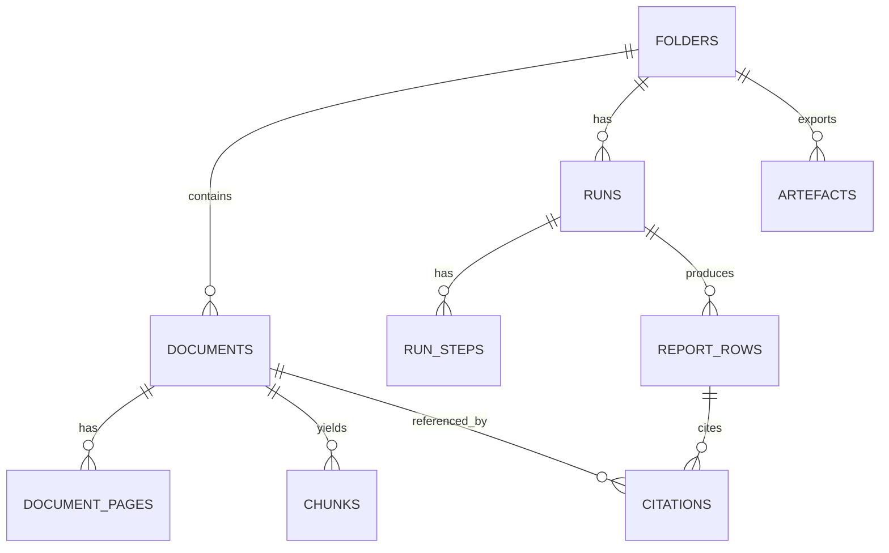

# PROMPT
You are reviewing repo PRD JSON files for Orbital PoC.

Scope:
- Review the attached PRD JSON files (prd*.json) under docs/04-projects/02-features excluding docs/04-projects/02-features/0001_trust-substrate.
- Goal: identify which items in `openQuestions` can be answered now from the repo (especially `docs/03-architecture/DECISIONS.md` and `docs/04-projects/02-features/0002_quick-start-engine/spike-proofs/SP-2.7_decision.md`) and which are still genuinely open.
- Note: `docs/03-architecture/DECISIONS.md` was recently updated; treat it as authoritative.

Deliverable:
For each attached PRD JSON:
1. List its `openQuestions`.
2. For each item, mark `Answered` or `Still Open`.
3. If `Answered`, cite the exact file + section that answers it.
4. Propose minimal edits:
   - updated `openQuestions` arrays
   - optional small structural tweaks (e.g. move dependency statements out of `openQuestions` into a `dependencies` field) while preserving information.

Also:
- Docs mention `fixture:eval` but repo scripts currently use `fixtures:*` (see package.json and scripts/fixtures). Propose a consistent naming approach (scripts + docs) with minimal churn.

Constraints:
- Do not invent new decisions; only resolve questions when backed by the attached sources.
- Do not suggest changes under docs/04-projects/02-features/0001_trust-substrate.

Output format:
- Provide a per-file set of suggested diffs (preferred) or explicit JSON patches.

# FILES

----- BEGIN FILE: package.json -----
{
  "name": "legaltech-poc",
  "private": true,
  "packageManager": "pnpm@10.28.0",
  "scripts": {
    "dev": "pnpm --filter @legaltech-poc/web dev",
    "start": "pnpm --filter @legaltech-poc/web start",
    "build": "pnpm -r build",
    "lint": "pnpm -r lint",
    "test": "pnpm -r test",
    "typecheck": "pnpm -r typecheck",
    "verify": "bash scripts/verify.sh",
    "fixture:seed": "node --experimental-strip-types scripts/fixtures/seed.ts",
    "fixtures:verify-pack-names": "node --experimental-strip-types scripts/fixtures/verify_pack_names.ts",
    "fixtures:assert-row-invariants": "node --experimental-strip-types scripts/fixtures/assert_row_invariants.ts",
    "fixtures:compare-truth": "node --experimental-strip-types scripts/fixtures/compare_truth.ts"
  }
}

----- END FILE: package.json -----

----- BEGIN FILE: scripts/verify.sh -----
#!/usr/bin/env bash
set -euo pipefail

# Keep fixtures and docs aligned (oracle closure criteria RH-2.10).
node --experimental-strip-types scripts/fixtures/verify_pack_names.ts

pnpm -s lint
pnpm -s test
pnpm -s build

echo "Verify OK."

----- END FILE: scripts/verify.sh -----

----- BEGIN FILE: scripts/fixtures/README.md -----
# Fixtures Tooling (Spikes)

This folder contains small, deterministic CLIs used by spikes to turn fixture `/truth` files into PASS/FAIL outcomes.

These scripts are intentionally dependency-light and should run locally.

## Commands

Run with Node's TypeScript stripping:

```bash
node --experimental-strip-types scripts/fixtures/verify_pack_names.ts
node --experimental-strip-types scripts/fixtures/assert_row_invariants.ts --snapshot <snapshot.json>
node --experimental-strip-types scripts/fixtures/compare_truth.ts --snapshot <snapshot.json>
```

Notes:
- `verify_pack_names.ts` treats `docs/08-example-data/packs_summary.md` as canonical and ignores `docs/**/tmp-oracle/**` + `docs/**/tmp-handoffs/**` when scanning docs for pack references.
- `compare_truth.ts` defaults to "auto mode" (only compares datasets present in the snapshot). Force datasets with `--datasets requirements,exceptions,survey_issues,golden_scalar`.
- `assert_row_invariants.ts` can enforce the baseline reason-code taxonomy with `--strict-reason-codes`.

## Snapshot format (expected by these scripts)

These tools assume a snapshot JSON file shaped like:

```json
{
  "meta": {
    "pack_id": "pack_01_clean",
    "run_id": "run_123",
    "index_version": "v1",
    "agent_bundle_version": "git:abc123",
    "question_set_version": "qs:0002:v1.0:sha256:..."
  },
  "rows": [
    {
      "question_id": "TS-03",
      "question": "List Schedule B-I requirements.",
      "answer": "Extracted requirements tracker (see payload).",
      "status": "needs_review",
      "citation_ids": ["cit_123"],
      "notes": null,
      "payload_schema_version": "list_payload_v0",
      "payload_json": { "kind": "requirements_tracker", "items": [] },
      "provenance_json": {}
    }
  ],
  "citations": {
    "cit_123": {
      "document_filename": "TitleCommitment.pdf",
      "page_number": 2,
      "polygons": [[[0.1, 0.2], [0.2, 0.2], [0.2, 0.3], [0.1, 0.3]]],
      "snippet": "…",
      "snippet_hash": "sha256:..."
    }
  }
}
```

## Canonical comparator rules

Comparator behavior is specified in:
- `docs/04-projects/02-features/0002_quick-start-engine/comparator_spec_v0.md`

----- END FILE: scripts/fixtures/README.md -----

----- BEGIN FILE: docs/03-architecture/DECISIONS.md -----
# Architecture decisions (ADRs)

Append-only log of architecture decisions for Orbital Copilot PoC. Add new ADRs at the end and link the PR.

## ADR format (minimal)

```md
## ADR-0000: Title
- Status: proposed | accepted | superseded | deprecated
- Date: YYYY-MM-DD

Context
- Why are we making this decision?

Decision
- What did we decide?

Consequences
- What does this enable/force?
- What are the risks/trade-offs?

Links
- PR:
- Related docs:
```

---

## ADR-0001: Evidence-first outputs with citation IDs and locking
- Status: accepted
- Date: 2026-02-06

Context
- Trust UX is the product: every material claim needs inspectable evidence.

Decision
- Drafting produces structured rows with **candidate citations as chunk IDs** (no free-text citations).
- We **lock** citations by creating immutable `citations` records containing `{snippet, snippet_hash, geometry}`.
- Report rows refer to citations by `citation_id` only.

Consequences
- We can highlight evidence even if chunking/indexing changes later.
- Provenance is sufficient for debugging and replay without re-running the model.

Links
- Related docs: `docs/03-architecture/40_rag_and_agents.md`, `docs/03-architecture/30_data_model.md`

## ADR-0002: Verification is fail-closed
- Status: accepted
- Date: 2026-02-06

Context
- A plausible answer without valid evidence is worse than “not found”.

Decision
- Any citation lock mismatch or verification failure sets row status to `citation_failed`.
- `citation_failed` rows are non-exportable by default.

Consequences
- Reduces false trust at the cost of more “blocked” outputs early.
- Forces us to invest in retrieval + citation integrity.

Links
- Related docs: `docs/03-architecture/20_state_model.md`, `docs/03-architecture/60_observability_and_evals.md`

## ADR-0003: OCR/layout extraction is the default for all PDFs
- Status: accepted
- Date: 2026-02-06

Context
- Scans are common in CRE diligence packs; highlights require geometry.

Decision
- Every uploaded PDF is processed with OCR/layout extraction and persisted to `document_pages` as canonical text + polygons.

Consequences
- More ingest cost/latency, but consistent highlighting and chunking.
- Enables citation hashing and geometric overlays as first-class features.

Links
- Related docs: `docs/03-architecture/05_tech_stack_and_dev_workflow.md`, `docs/03-architecture/30_data_model.md`

## ADR-0004: Hybrid retrieval returning chunk IDs (lexical + vector)
- Status: accepted
- Date: 2026-02-06

Context
- CRE packs mix boilerplate and highly specific clauses; we need both recall and precision.

Decision
- Retrieval is hybrid (tsvector + embeddings) and returns **chunk IDs** (with scores) rather than prose.
- Optional rerank can be added, but must not change the “IDs-only” contract.

Consequences
- Retrieval becomes measurable (Recall@K, drift detection).
- Downstream steps can be schema-driven and deterministic.

Links
- Related docs: `docs/03-architecture/40_rag_and_agents.md`, `docs/03-architecture/60_observability_and_evals.md`

## ADR-0005: Deterministic-ish orchestration via Workflow DevKit steps
- Status: accepted
- Date: 2026-02-06

Context
- We need resumability, retries, and row-by-row progress without “agent loops”.

Decision
- Quick Start is implemented as a WDK workflow that coordinates explicit steps (`retrieve → draft → lock → verify → write`).
- Use `"use workflow"` / `"use step"` directives to make side-effect boundaries explicit.

Consequences
- Workflows remain predictable; side effects are isolated and observable.
- Keeps WDK integration thin (domain logic stays in `packages/core`).

Links
- Related docs: `docs/03-architecture/06_frameworks_agents_rag_evals.md`, `docs/03-architecture/10_system_architecture.md`

## ADR-0006: Fixture-driven evals are first-class
- Status: accepted
- Date: 2026-02-06

Context
- Demos fail when extraction/retrieval drifts; fixtures let us regress deterministically.

Decision
- Maintain synthetic packs with `/docs`, `/truth`, `/layout`.
- Run `fixture:eval` to produce per-pack eval reports and a cross-pack summary.
- Start as report-only, then gate CI on hard trust metrics (schema + citation integrity).

Consequences
- Faster iteration with fewer demo regressions.
- Forces us to encode “expected failure journeys” as fixtures.

Links
- Related docs: `docs/03-architecture/05_tech_stack_and_dev_workflow.md`, `docs/03-architecture/60_observability_and_evals.md`

## ADR-0007: No external web research inside PoC runs
- Status: accepted
- Date: 2026-02-06

Context
- PoC must be defensible based on provided diligence documents only.

Decision
- Quick Start uses only the uploaded pack for retrieval and reasoning.

Consequences
- Clear provenance and a simpler security posture.
- Some questions will legitimately resolve to `missing_input`.

Links
- Related docs: `docs/03-architecture/00_overview.md`, `docs/03-architecture/06_frameworks_agents_rag_evals.md`

## ADR-0008: Explicit error envelope for APIs
- Status: accepted
- Date: 2026-02-06

Context
- Clients need stable contracts; we must not leak internal errors/provider payloads.

Decision
- Standardise non-2xx responses on a single JSON error envelope with safe `code`, `message`, optional `details`, and optional `trace_id`.

Consequences
- Frontend can implement consistent error handling.
- Makes observability and support workflows simpler.

Links
- Related docs: `docs/03-architecture/50_api_surface.md`, `docs/03-architecture/AGENTS.md`

## ADR-0009: Deployment posture is Hetzner-first (single VM) until proven otherwise
- Status: accepted
- Date: 2026-02-06

Context
- The PoC needs durable orchestration (WDK) and long-running side effects (OCR/embeddings/LLM calls).
- A single-VM deployment reduces moving parts and avoids serverless DB connection pitfalls.

Decision
- Default deployment target is a Hetzner VM running the Next.js server + WDK worker + Postgres (and optionally MinIO).
- Vercel stays optional for later once the runtime shape is stable.
- We may deploy the web app (`apps/web`) to Vercel in the future (including preview deployments), while keeping worker + Postgres on the VM.

Consequences
- Faster path to a stable demo and simpler debugging.
- We own basic ops (TLS, process supervision, backups, monitoring).

Links
- Related docs: `docs/03-architecture/10_system_architecture.md`, `docs/03-architecture/05_tech_stack_and_dev_workflow.md`
- Investigation: `docs/98-tmp/2026-02-06_infra-investigation/deployment.md`

## ADR-0010: Use S3-compatible object storage as the baseline
- Status: accepted
- Date: 2026-02-06

Context
- We need to store raw PDFs and exports and serve pages to pdf.js reliably.
- We want portability between local dev and Hetzner deployment (and optionally Vercel).

Decision
- Use S3-compatible object storage as the baseline contract.
- Local dev: MinIO (or local filesystem for ultra-simple early dev).
- Deployment: prefer managed S3-compatible storage unless explicitly "single VM only".

Consequences
- Standard tooling (AWS SDK) and a clean signed-URL story.
- If we self-host storage (MinIO), we must own backups and durability.

Links
- Related docs: `docs/03-architecture/05_tech_stack_and_dev_workflow.md`
- Investigation: `docs/98-tmp/2026-02-06_infra-investigation/storage.md`

## ADR-0011: Postgres is the primary datastore (local compose; Hetzner in deploy)
- Status: accepted
- Date: 2026-02-06

Context
- Postgres is already the planned "truth store" (rows, runs, steps, citations) and supports pgvector + tsvector.
- The PoC is single-tenant and can start with a single Postgres instance.

Decision
- Local dev: Postgres via Docker Compose (or Supabase local).
- Deployment: self-host Postgres on the Hetzner VM with automated backups and monitoring.

Consequences
- Simple data plane and predictable latency.
- If we later put the web/API on Vercel, we must add connection pooling and strict limits.

Links
- Related docs: `docs/03-architecture/05_tech_stack_and_dev_workflow.md`, `docs/03-architecture/30_data_model.md`

## ADR-0012: OCR/layout extraction is abstracted behind a single provider adapter
- Status: accepted
- Date: 2026-02-06

Context
- Highlight overlays require geometry.
- We want to keep the provider choice reversible (Azure Document Intelligence vs AWS Textract).

Decision
- Default provider: Azure Document Intelligence (Layout), unless an AWS-first posture is chosen.
- Implement a single OCR adapter interface returning a canonical per-page schema.

Consequences
- Provider swaps are a bounded change (mostly isolated to the adapter).
- We can tune for cost/quality without rewriting downstream chunking/citations.

Links
- Related docs: `docs/03-architecture/05_tech_stack_and_dev_workflow.md`, `docs/03-architecture/40_rag_and_agents.md`
- Investigation: `docs/98-tmp/2026-02-06_infra-investigation/ocr.md`

## ADR-0013: LLM + embeddings calls go through AI SDK; gateway is default
- Status: accepted
- Date: 2026-02-06

Context
- We need to route between "fast draft" and "strong verify" models and keep observability consistent.
- We want one interface across:
  - streaming UX in Next.js route handlers
  - durable side effects in worker steps (WDK)
- A gateway can simplify auth, provider swaps, and consistent telemetry.

Decision
- Standardize on AI SDK (`ai`) as the only “public API” for LLM + embeddings calls in this repo.
- Default to Vercel AI Gateway (via AI SDK gateway provider) so auth + model routing are consistent across web + worker.
- Keep a small internal router interface (draft, verify, embed) but implement it via AI SDK.
- Direct provider SDKs (OpenAI SDK, Anthropic SDK, etc) are only allowed with an explicit reason (eg missing feature, debugging, or a provider-specific capability).

Consequences
- Consistent auth, retries, and observability patterns for all model calls.
- Model selection becomes an env/config concern (eg `LLM_MODEL_CHAT`, `LLM_MODEL_SUMMARY`, `EMBED_MODEL`), not scattered code changes.
- Gateway auth becomes part of the minimum env contract (eg `AI_GATEWAY_API_KEY` locally/Hetzner; Vercel OIDC where available).

Links
- Related docs: `docs/03-architecture/05_tech_stack_and_dev_workflow.md`
- Investigation: `docs/98-tmp/2026-02-06_infra-investigation/llm-gateways.md`

## ADR-0014: Create a minimal runnable scaffold to validate the architecture
- Status: accepted
- Date: 2026-02-06

Context
- Current repo is docs-first; we need a tracer-bullet implementation to validate the UX (pdf viewer + citations) and workflow plumbing.

Decision
- Add a minimal pnpm workspace scaffold:
  - `apps/web`: Next.js App Router app
  - `packages/core`: Zod schemas + core contracts
  - `docker-compose.yml`: local Postgres + MinIO (optional)
  - wire `pnpm dev`, `pnpm build`, `pnpm test`, `pnpm lint`

Consequences
- Onboarding becomes concrete and repeatable.
- Risk: scaffolding can become premature if we haven't committed to building the PoC; keep it intentionally thin.

Links
- Related docs: `docs/03-architecture/05_tech_stack_and_dev_workflow.md`, `docs/03-architecture/06_frameworks_agents_rag_evals.md`


## ADR-0015: Deterministic page-bounded chunking (line window v1) + index_version bump rules
- Status: accepted
- Date: 2026-02-07

Context
- Retrieval returns chunk IDs (ADR-0004) and drafting cites candidate chunk IDs (ADR-0001).
- Click-to-highlight UX requires that chunks map cleanly to page geometry (ADR-0003).
- Without a pinned chunking strategy, “what is a citable unit?” and “when do we bump index_version?” will drift and break evals.

Decision
- Citable unit:
  - Retrieval returns `chunk_id`s only.
  - Drafting outputs `candidate_citation_chunk_ids: string[]` only.
  - Citation locking resolves `chunk_id` -> immutable `citation_id` (ADR-0001).
- Chunk scope (PoC default):
  - Chunks are **page-bounded**: `page_start = page_end = page_number`.
  - A chunk never spans multiple pages.
- Chunk sizing defaults (PoC):
  - Build chunks from OCR/layout “lines” in `document_pages.layout_json`.
  - Hard limits:
    - `max_lines = 20`
    - `max_chars = 1500`
    - `overlap_lines = 4` (overlap is within a page only)
- Boundary rules:
  - Never split inside an OCR line.
  - Prefer splitting on blank lines.
  - Treat section headers as hard boundaries (e.g. lines matching: `/^(SCHEDULE|EXHIBIT|SECTION)\b/i`, or ALL-CAPS lines above a minimum length).
- Chunk metadata (required fields in `chunks.metadata_json`):
  - `chunker_id`: `line_window_v1`
  - `chunk_params`: `{ max_lines, max_chars, overlap_lines, header_regexes_version }`
  - `page_number`
  - `line_start` / `line_end` (inclusive line indices in the canonical OCR line list)
  - Optional: `doc_type`, `section_hint`
- Index version bumping:
  - `index_version` identifies the retrieval substrate for a folder (chunks + indices).
  - We MUST bump `folders.latest_index_version` when ANY of the following changes:
    - OCR canonicalisation schema or adapter version (ADR-0012)
    - chunker_id or chunk_params
    - lexical indexing config (tsvector build rules)
    - embedding model ID or embedding dimension
  - Fail-closed safety:
    - Each chunk row stores the `chunker_id` + `chunk_params` used to build it.
    - The ingestion/indexing pipeline must refuse to write chunks for an existing `index_version` if the current chunker_id/params do not match the stored metadata (failure code: `CHUNKING_FAIL`).

Consequences
- Highlight overlays become straightforward because a citation’s polygons are always on a single page.
- Chunk IDs remain stable within an `index_version`, and drift is handled by versioning rather than mutation.
- Trade-off: cross-page clauses require retrieving multiple chunks; we accept this for PoC simplicity.

Links
- PR:
- Related docs:
  - `docs/03-architecture/40_rag_and_agents.md`
  - `docs/03-architecture/30_data_model.md`
  - `docs/03-architecture/20_state_model.md`


## ADR-0016: File-backed, immutable question sets with run pinning and completed invariants
- Status: accepted
- Date: 2026-02-07

Context
- Runs must pin `question_set_version` so we can replay and evaluate outputs deterministically (`docs/03-architecture/20_state_model.md`, `docs/03-architecture/30_data_model.md`).
- If question sets are editable in-place, “completed” becomes ambiguous and fixture truth comparisons drift.
- PoC constraint: single-tenant, minimal infra. We want determinism and code review over dynamic configurability.

Decision
- Storage (v1):
  - Question sets live in-repo as JSON files (source of truth), not in the database.
  - Each version is an immutable file. Do not edit an existing version file; create a new version file.
  - Suggested location:
    - `packages/core/question-sets/<question_set_id>/qs_<version>.json`
- File schema (required fields):
  - `question_set_id` (e.g. `quick_start_title_survey`)
  - `question_set_version` (e.g. `qs:quick_start_title_survey:v1`)
  - `created_at` (ISO date)
  - `questions[]` with:
    - `question_id` (stable identifier, e.g. `BII-01`)
    - `question` (string)
    - optional `artefact_kind` (`requirements_tracker|exceptions_table|survey_issues`)
    - optional `row_schema_id` (pins the row payload schema)
- Run pinning:
  - At run creation, the server selects a question set version for the run type and persists:
    - `runs.question_set_version` = the selected version string
  - `runs.question_set_version` MUST NOT change after creation.
- Completed invariants (mechanics):
  - A run can only enter `runs.state = completed` when:
    - For the pinned `question_set_version`, there is exactly one `report_rows` record per `question_id` in that set.
    - Every `report_rows.status` is terminal (`needs_review|reviewed|missing_input|citation_failed`).
  - Any mismatch (missing question IDs, extra rows, or duplicate rows) is a fail-closed run failure (failure code: `INVARIANT_FAIL`).

Consequences
- Deterministic replays: “what questions did we run?” is answerable from the run record.
- Fixtures and eval truth files can stabilise against explicit question IDs.
- Trade-off: no UI-editable question sets in v1. That is intentional.

Links
- PR:
- Related docs:
  - `docs/03-architecture/20_state_model.md`
  - `docs/03-architecture/30_data_model.md`
  - `docs/03-architecture/50_api_surface.md`

----- END FILE: docs/03-architecture/DECISIONS.md -----

----- BEGIN FILE: docs/03-architecture/60_observability_and_evals.md -----
# Observability and evals

This PoC lives or dies on debuggability and demo reliability. "Trust UX" requires that we can:
- explain what happened (runs + steps + rows)
- prove evidence integrity (citations + hashing)
- detect regressions quickly (fixture-driven evals)

See also:
- Failure-first state rules: `docs/03-architecture/20_state_model.md`
- Data + provenance shape: `docs/03-architecture/30_data_model.md`
- API error envelope + trace_id: `docs/03-architecture/50_api_surface.md`

## Correlation model (what IDs tie the system together)
Use these identifiers consistently across logs, DB provenance, and (where safe) UI debug panels:
- `trace_id`: per inbound request (API) and per workflow start. Include in error envelopes.
- `folder_id`: the Matter.
- `run_id`: one Quick Start attempt.
- `step_key`: deterministic idempotency key for a step execution.
- `question_id`: the row being processed.
- `citation_id`: locked evidence object (user-visible).

Rule of thumb:
- A log line without `{trace_id, run_id, step_key}` is usually not actionable.

## What we log
Run-level:
- run_id, folder_id, state, started/completed timestamps
- index_version, agent_bundle_version, question_set_version
- step timings and retry counts
- failure taxonomy counts (see below)

Row-level:
- question_id
- retrieved chunk IDs (and scores if available)
- verification verdict and reason codes
- final status and citation IDs

LLM calls:
- model, prompt version hash
- tokens, latency, cost
- retrieved chunk IDs used

### Logging safety (non-negotiable)
- Do not log raw PDF bytes.
- Avoid logging full extracted document text.
- For debugging, prefer stable identifiers (`chunk_id`, `citation_id`, `snippet_hash`) over raw content.
- `error_json` must be safe to show to a user when needed (no stack traces, no provider payload dumps).

### Structured log shape (suggested)
Use JSON logs with consistent keys:
```json
{
  "level": "info",
  "event": "run.step.completed",
  "trace_id": "trc_...",
  "folder_id": "fld_...",
  "run_id": "run_...",
  "step_key": "quick_start:BII-01:verify",
  "question_id": "BII-01",
  "duration_ms": 1234,
  "failure_code": null
}
```

## Failure taxonomy
Use these codes in:
- `runs.error_json` / `run_steps.error_json` (safe, human-readable)
- eval reports (`fixture:eval`)
- UI summaries

Baseline codes:
- OCR_FAIL, LAYOUT_FAIL, CHUNKING_FAIL
- RETRIEVAL_MISS, RERANK_BAD
- CITATION_MISMATCH, ENTAILMENT_FAIL, VERIFICATION_FALSE_PASS
- EXPORT_FAIL

Notes:
- `VERIFICATION_FALSE_PASS` is an eval-only "red flag" for cases where verification passes but the golden truth says it should not.
- Prefer adding new codes over reusing an existing code with broader meaning; taxonomy drift makes dashboards useless.

## Baseline metrics + thresholds (PoC defaults)
Start with a small set that directly supports “trust UX”.

Hard gates (must be 100% for a demo pack to pass):
- **Schema validity:** every produced report row validates against the Zod schema.
- **Citation integrity:** for every citation_id used by a `needs_review|reviewed` row:
  - cited page exists
  - polygons exist
  - `snippet_hash` matches canonical snippet hashing rule
- **Failure journeys:** fixture packs designed to fail must fail in the expected way:
  - missing docs → `missing_input`
  - bad citation → `citation_failed`

Report-only (track, don’t gate yet):
- **Retrieval Recall@K** on golden questions (start at K=10). Suggested initial target: `>= 0.85` per pack.
- **Extraction quality distribution:** min/mean/p95 of `documents.extraction_quality` (watch for regressions when changing OCR/layout).
- **End-to-end duration:** ingest time and run time (p50/p95), for demo predictability.
- **Cost per run:** tokens and estimated $ (track before optimising).

## How metrics are used
- Phase 0 (default): `fixture:eval` always produces a JSON report + summary table. CI posts the summary (report-only).
- Phase 1: CI gates on the “hard gates” above (schema + citation integrity + failure journeys).
- Phase 2: CI additionally gates on retrieval Recall@K thresholds once packs and chunking stabilise.

The goal is to move as little as possible into gating until the fixture suite is stable, but never compromise on citation integrity.

## Evals (fixture-driven)
Inputs:
- fixture pack manifest at `docs/08-example-data/<pack_id>/manifest.json` (required; eval runners must read manifests, not infer)
- synthetic packs with `/docs`, `/truth`, `/layout`
- golden questions JSON per pack

Minimum checks:
1) extraction correctness vs `/truth`
2) citation validity: page exists, polygons exist, snippet hash matches
3) retrieval recall@K on golden questions
4) failure journeys:
   - missing docs → `missing_input`
   - bad citation → `citation_failed`

Outputs:
- per-pack eval report JSON
- summary table across packs
- optional CI gate when stable

### Eval report JSON (suggested)
Example shape (not a strict schema yet):
```json
{
  "pack_id": "pack_01_clean",
  "versions": {
    "index_version": "v1",
    "agent_bundle_version": "git:abc123",
    "question_set_version": "qs:quick_start_title_survey:v1"
  },
  "hard_gates": {
    "schema_validity": { "pass": true, "failures": 0 },
    "citation_integrity": { "pass": true, "failures": 0 },
    "failure_journeys": { "pass": true, "failures": 0 }
  },
  "metrics": {
    "retrieval_recall_at_k": { "k": 10, "value": 0.9 },
    "run_duration_ms": { "p50": 120000, "p95": 180000 },
    "tokens_total": 123456
  },
  "taxonomy_counts": {
    "RETRIEVAL_MISS": 2,
    "CITATION_MISMATCH": 0
  }
}
```

## Debug playbook (fast path)
When a run fails or export is blocked, prefer a deterministic investigation:
1) Identify the failure taxonomy code and the step_key where it occurred.
2) Inspect the persisted provenance and citations for that row.
3) Use fixtures to reproduce the failure deterministically, then fix the smallest broken link.

Suggested SQL pivots (examples; adapt to actual schema/migrations):
```sql
-- Recent failed steps for a run
select step_key, step_type, state, attempt, error_json
from run_steps
where run_id = 'run_123' and state = 'failed'
order by created_at desc;
```

----- END FILE: docs/03-architecture/60_observability_and_evals.md -----

----- BEGIN FILE: docs/03-architecture/30_data_model.md -----
# Data model (Postgres + pgvector)

This is the canonical DB shape for the PoC “trust spine”: ingest → retrieve → draft → verify → report rows with locked citations.

Design rules (PoC)
- Postgres is the source of truth for state and auditability (ADR-0011 proposed).
- Prefer append-only records for "what happened" (runs, steps, report_rows, citations, artefacts).
- Citations are immutable once created (ADR-0001).
- Retrieval substrate is versioned. A new ingest/re-index bumps `folders.latest_index_version` and produces new `chunks` rows for that version.
- Everything that materially affects outputs should be pinnable on a run: `index_version`, `agent_bundle_version`, `question_set_version` (`docs/03-architecture/20_state_model.md`).

## ERD


## Encoding conventions (recommended)
- IDs are opaque strings (optionally prefixed, eg `fld_`, `doc_`, `run_`, `row_`, `cit_`).
- Timestamps are `timestamptz` in UTC.
- JSON columns are `jsonb` and must be "safe": no provider payload dumps, no stack traces, no raw PDF bytes.
- Arrays should be explicit JSON arrays; avoid comma-separated strings.

## Trust spine tables (minimum viable)

### `folders`
- `id`, `name`, `state`, `created_at`, `updated_at`
- `latest_index_version` (string; bumps on re-ingest/re-index)

Recommended constraints:
- `state` should be constrained to the folder state machine values (`docs/03-architecture/20_state_model.md`).

### `documents`
- `id`, `folder_id`, `filename`, `mime`, `bytes`
- `sha256` (dedupe), `storage_key`, `page_count`
- `parse_status`, `ocr_status`, `extraction_quality`
- `error_json` (safe ingest failure details)

Recommended constraints:
- FK `documents.folder_id -> folders.id` (ON DELETE CASCADE or RESTRICT; choose intentionally).
- Unique `(documents.folder_id, documents.sha256)` to avoid duplicates within a matter.

### `document_pages`
- `id`, `document_id`, `page_number`
- `text` (canonical)
- `layout_json` (tokens/lines/blocks + polygons)

Recommended constraints:
- FK `document_pages.document_id -> documents.id`.
- Unique `(document_pages.document_id, document_pages.page_number)`.

### `chunks`
- `id`, `document_id`
- `index_version` (string; matches `folders.latest_index_version` at time of build)
- `page_start`, `page_end`, `chunk_index`
- `text`, `metadata_json`, `tsv`, `embedding`
- `text_hash` (hash of `chunks.text` using the canonical hashing rule below)

Notes:
- `tsv` is the lexical index (tsvector). Consider a generated column if you want to avoid drift.
- `embedding` is a pgvector column. It must match the chosen embedding model dimension (open decision; pin in fixtures/evals).
- In PoC v1, citation locking uses `chunks.text` as the citation snippet by default, so `citations.snippet_hash` will usually equal `chunks.text_hash`.
- Chunking rules and required metadata fields are pinned in ADR-0015.

Recommended constraints:
- FK `chunks.document_id -> documents.id`.
- Unique `(chunks.document_id, chunks.index_version, chunks.chunk_index)`.

### `runs`
- `id`, `folder_id`, `type`, `state`
- `index_version` (pins retrieval substrate used by the run)
- `agent_bundle_version` (pins prompts + schemas)
- `question_set_version` (pins the exact question set used by the run; required for “completed” invariants)
- timestamps + `error_json` (safe failure details)

Recommended constraints:
- FK `runs.folder_id -> folders.id`.
- `state` constrained to the run state machine (`docs/03-architecture/20_state_model.md`).
- Consider a partial index for "latest run per folder" queries.

### `run_steps`
- `id`, `run_id`, `step_type`, `state`, `attempt`
- `step_key` (deterministic idempotency key; eg `ingest:doc_123:ocr` or `quick_start:BII-01:verify`)
- `metrics_json`, `error_json`
- timestamps

Recommended constraints:
- FK `run_steps.run_id -> runs.id`.
- Unique `(run_steps.run_id, run_steps.step_key)` so retries short-circuit safely.
- `state` constrained to the step state machine (`docs/03-architecture/20_state_model.md`).

### `report_rows`
- `id`, `folder_id`, `run_id`, `question_id`, `question`
- `answer`, `status`, `notes`
- `payload_schema_version` (string, nullable; e.g. `list_payload_v0`)
- `payload_json` (jsonb, nullable; structured row payload for list-shaped artefacts)
- `provenance_json` (minimum: retrieved chunk IDs + scores, models + prompt hashes, verification verdict + reason codes)
- timestamps

Recommended constraints:
- FK `report_rows.run_id -> runs.id`.
- FK `report_rows.folder_id -> folders.id`.
- Unique `(report_rows.run_id, report_rows.question_id)`.
- `status` constrained to the report row statuses (`docs/03-architecture/20_state_model.md`).

### `citations`
Citations are **locked** and **immutable** once created. They store enough to highlight evidence without re-running retrieval or re-reading chunks.
- `id`, `report_row_id`
- `chunk_id` (nullable; stored for debugging/replay)
- `document_id`, `page_number`
- `polygons`, `snippet`, `snippet_hash`
- `index_version` (string; pins the chunking/indexing version the citation came from)
- timestamps

Recommended constraints:
- FK `citations.report_row_id -> report_rows.id`.
- FK `citations.document_id -> documents.id`.
- `snippet_hash` is required and must be computed with the canonical rule below.

#### Citation polygon coordinate system (polygons)
`citations.polygons` is a list of polygons. Each polygon is a list of points `[x, y]`.

Canonical coordinate space (PoC v1):
- Points are **normalised floats** in the range `[0..1]`.
- Origin is **top-left** of the PDF page’s **viewBox**.
- `x` increases to the right, `y` increases down.
- Points are ordered clockwise (recommended; not required for rendering).
- This coordinate space is independent of zoom. Rendering applies the current pdf.js viewport transform.

Viewer mapping (pdf.js):
- Let `viewBox = [xMin, yMin, xMax, yMax]` from the pdf.js page.
- Convert a point `[xNorm, yNorm]` to PDF points:
  - `xPdf = xMin + xNorm * (xMax - xMin)`
  - `yPdf = yMax - yNorm * (yMax - yMin)` (invert Y because `yNorm` is top-left origin)
- Convert to viewport pixels:
  - `[xPx, yPx] = viewport.convertToViewportPoint(xPdf, yPdf)`

Validation (fail-closed):
- Every point must be within `[0..1]`.
- Polygons must be non-empty.
- If any validation fails, treat the citation as invalid and fail closed (`citation_failed`).

### `artefacts`
- `id`, `folder_id`, `type`, `storage_key`
- `source_run_id`, `metadata_json`
- timestamps

Notes:
- Do not persist signed `download_url` values in the DB; persist `storage_key` + metadata and generate fresh signed URLs on demand.
- Recommended `metadata_json` fields (PoC):
  - `kind` (e.g. `requirements_tracker`, `exceptions_table`, `survey_issues`, `memo`)
  - `filename`
  - `schema_version` (for CSVs)
  - `unsafe` / `unsafe_override` (if demo-only unsafe exports are ever allowed)

## Provenance JSON (recommended shape)
`report_rows.provenance_json` should be structured enough to support:
- replay ("what evidence did we use?")
- debugging ("which step failed, why?")
- evals ("what was Recall@K, what was verified?")

Minimal example (shape only; evolve as needed):
```json
{
  "retrieval": {
    "index_version": "v1",
    "query": "List Schedule B-II exceptions...",
    "chunks": [
      { "chunk_id": "chk_123", "score": 12.34 },
      { "chunk_id": "chk_456", "score": 10.98 }
    ]
  },
  "draft": {
    "model": "anthropic/claude-sonnet-4.5",
    "prompt_hash": "sha256:..."
  },
  "lock": {
    "locked_citation_ids": ["cit_123", "cit_124"]
  },
  "verify": {
    "model": "openai/gpt-5",
    "verdict": "pass",
    "reason_code": null
  }
}
```

## Hashing rule (snippet_hash)
We use `snippet_hash` to detect citation drift.

PoC rule:
- `snippet_hash = "sha256:" + sha256_hex(normalise(snippet))`
- `sha256_hex(...)` is lower-case hex.
- `normalise()` must:
  - trim leading/trailing whitespace
  - convert CRLF → LF
  - collapse all whitespace runs to a single space

This rule must be implemented once (e.g. in `packages/core/citations`) and reused everywhere.

## Indices and constraints (recommended)
- Unique and FK constraints:
  - unique `(documents.folder_id, documents.sha256)`
  - unique `(report_rows.run_id, report_rows.question_id)`
  - unique `(chunks.document_id, chunks.index_version, chunks.chunk_index)`
  - unique `(run_steps.run_id, run_steps.step_key)`

- Indexing:
  - GIN on `chunks.tsv`
  - pgvector index on `chunks.embedding`
  - index `citations.report_row_id`
  - index `runs.folder_id`
  - index `documents.folder_id`

## Immutability and replay (important)
- `citations` must be treated as immutable after insert. If you need to "fix" a citation, create a new citation and update the report row to reference the new ID (and record why in provenance).
- Chunk drift is handled by versioning: new chunking/indexing should create a new `index_version`, not mutate existing chunks.

----- END FILE: docs/03-architecture/30_data_model.md -----

----- BEGIN FILE: docs/03-architecture/50_api_surface.md -----
# API surface (PoC)

This doc is the canonical HTTP contract for the PoC. Keep it small, but explicit.

See also:
- State machines + invariants: `docs/03-architecture/20_state_model.md`
- Persistence + hashing rules: `docs/03-architecture/30_data_model.md`

## Conventions
- All request/response bodies are JSON unless noted.
- IDs are opaque strings.
- Timestamps are ISO 8601.
- For POST endpoints that create work, support an optional `Idempotency-Key` header.

### Versioning (PoC)
For now, paths are unversioned. Treat this document as "v1". If we need breaking changes later, introduce `/v2` explicitly.

### Auth (PoC)
Auth is an open decision (`docs/03-architecture/00_overview.md`). The contract still defines:
- `UNAUTHENTICATED`: missing/invalid auth
- `UNAUTHORISED`: authenticated but not allowed

PoC default assumption: single-tenant; environments may run without auth in local/dev, but production-minded deployments should turn auth on.

### Correlation and tracing
- The server should generate/propagate a `trace_id` per request and include it in the error envelope (and optionally as a response header).
- Workflow runs should record the `trace_id` that created them in `runs`/`run_steps` metadata (implementation detail, but required for debugging).

## Error envelope (required)
All non-2xx responses must use the same envelope (no stack traces, no internal provider payloads):

```json
{
  "error": {
    "code": "VALIDATION_ERROR",
    "message": "Human readable summary",
    "details": { "field": "optional safe detail" },
    "trace_id": "optional-trace-id"
  }
}
```

Minimum error codes (PoC):
- `VALIDATION_ERROR`
- `UNAUTHENTICATED` / `UNAUTHORISED`
- `NOT_FOUND`
- `CONFLICT`
- `RATE_LIMITED`
- `EXPORT_BLOCKED` (default when any row is `citation_failed`)
- `INTERNAL`

## Folder + documents

### GET /folders
List matters (folders). This is the minimal "home screen" API.

Response:
```json
{
  "folders": [
    {
      "id": "fld_123",
      "name": "123 Main St - Title + Survey",
      "state": "ready",
      "latest_index_version": "v1",
      "created_at": "2026-02-07T00:00:00Z"
    }
  ]
}
```

### POST /folders
Create a new matter (folder).

Request:
```json
{ "name": "123 Main St - Title + Survey" }
```

Response:
```json
{
  "folder": {
    "id": "fld_123",
    "name": "123 Main St - Title + Survey",
    "state": "empty",
    "latest_index_version": "v1"
  }
}
```

### GET /folders/:id
Fetch a folder.

Response:
```json
{
  "folder": {
    "id": "fld_123",
    "name": "123 Main St - Title + Survey",
    "state": "ingesting",
    "latest_index_version": "v1",
    "created_at": "2026-02-07T00:00:00Z",
    "updated_at": "2026-02-07T00:01:23Z"
  }
}
```

### POST /folders/:id/documents (init upload)
Initialise a document upload and return a storage target (signed URL or similar).

Request:
```json
{ "filename": "Title Commitment.pdf", "mime": "application/pdf", "bytes": 10485760 }
```

Response (shape only; storage fields depend on provider):
```json
{
  "document": {
    "id": "doc_123",
    "folder_id": "fld_123",
    "filename": "Title Commitment.pdf",
    "parse_status": "queued",
    "ocr_status": "queued"
  },
  "upload": {
    "storage_key": "folders/fld_123/documents/doc_123.pdf",
    "url": "https://…",
    "method": "PUT",
    "headers": { "Content-Type": "application/pdf" }
  }
}
```

### POST /documents/:id/complete
Mark the upload complete and enqueue ingest (parse + OCR + indexing).

Request:
```json
{ "storage_key": "folders/fld_123/documents/doc_123.pdf" }
```

Response:
```json
{ "document": { "id": "doc_123", "parse_status": "queued", "ocr_status": "queued" } }
```

### GET /folders/:id/documents
List documents in a folder.

Response:
```json
{
  "documents": [
    {
      "id": "doc_123",
      "filename": "Title Commitment.pdf",
      "parse_status": "parsed",
      "ocr_status": "done",
      "extraction_quality": 0.82,
      "page_count": 142
    }
  ]
}
```

### GET /documents/:id/render?page=N
Return a signed URL suitable for pdf.js to render the PDF.

Note (PoC v1 semantics):
- `render_url` is a signed URL to the **whole PDF** (what pdf.js loads).
- The `page` query param is **1-indexed** and is used for initial viewer state (and optional validation).
- This endpoint does not rasterise pages server-side.
- If we ever add server-rendered images, introduce a new endpoint (e.g. `/documents/:id/pages/:n.png`) rather than changing this contract.

Response:
```json
{
  "document_id": "doc_123",
  "page": 1,
  "render_url": "https://…"
}
```

## Runs + report

### POST /folders/:id/runs (Quick Start)
Start a Quick Start run for a folder.

Preconditions:
- Folder state must be `indexed` or `ready`.
  - If `empty|ingesting`, return `409` with `error.code = "CONFLICT"` and a message like: `Folder is not runnable yet.`
  - If `failed`, return `409` with guidance to retry ingest/re-index.

Request:
```json
{ "type": "quick_start_title_survey" }
```

Response:
```json
{
  "run": {
    "id": "run_123",
    "folder_id": "fld_123",
    "state": "running",
    "index_version": "v1",
    "agent_bundle_version": "git:abc123",
    "question_set_version": "qs:0002:v1.0:sha256:..."
  }
}
```

### GET /runs/:id (progress)
Response:
```json
{
  "run": {
    "id": "run_123",
    "state": "running",
    "index_version": "v1",
    "agent_bundle_version": "git:abc123",
    "question_set_version": "qs:0002:v1.0:sha256:...",
    "progress": { "questions_total": 9, "questions_done": 3 },
    "failure_counts": { "RETRIEVAL_MISS": 2, "CITATION_MISMATCH": 1 }
  }
}
```

### GET /folders/:id/report?run_id=…
Return report rows for a specific run. If `run_id` is omitted, return the latest run for the folder.

Response:
```json
{
  "run": {
    "id": "run_123",
    "state": "completed",
    "index_version": "v1",
    "agent_bundle_version": "git:abc123",
    "question_set_version": "qs:0002:v1.0:sha256:..."
  },
  "rows": [
    {
      "id": "row_123",
      "question_id": "TS-04",
      "question": "List the recorded exceptions in Schedule B-II.",
      "answer": "Extracted exceptions table (see payload).",
      "status": "needs_review",
      "citation_ids": ["cit_123", "cit_124"],
      "payload_schema_version": "list_payload_v0",
      "payload_json": {
        "kind": "exceptions_table",
        "items": [
          {
            "kind": "exceptions_table_item",
            "item_id": "bii:15",
            "bii_item": 15,
            "type": "Reciprocal Easement Agreement (REA)",
            "instrument_no": "2021-218785",
            "recorded_date": "2021-10-22",
            "doc": "REA.pdf",
            "risk_tags": ["parking", "shared_costs"],
            "match_status": "matched",
            "item_status": "needs_review",
            "citation_ids": ["cit_123"]
          }
        ]
      },
      "notes": null
    }
  ]
}
```

## Citations

### GET /citations/:id
Return locked geometry + snippet for a citation ID.

Response:
```json
{
  "citation": {
    "id": "cit_123",
    "document_id": "doc_123",
    "page_number": 12,
    "polygons": [[[0.1, 0.2], [0.4, 0.2], [0.4, 0.25], [0.1, 0.25]]],
    "snippet": "…",
    "snippet_hash": "sha256:…"
  }
}
```

## Export

### POST /export/csv
Export a run to a CSV artefact.

Preconditions:
- `runs.state` must be `completed` (PoC default)
  - else return `409` with `error.code = "CONFLICT"` and a safe message (e.g. `Run is not completed yet.`)
- Default behaviour is to block if any row is `citation_failed`.
  - Return a non-2xx response with `error.code = "EXPORT_BLOCKED"`.

Request:
```json
{
  "folder_id": "fld_123",
  "run_id": "run_123",
  "kind": "requirements_tracker",
  "unsafe_override": false
}
```

Response:
```json
{
  "artefact": {
    "id": "art_123",
    "type": "csv",
    "kind": "requirements_tracker",
    "filename": "requirements_tracker.csv",
    "storage_key": "folders/fld_123/artefacts/art_123.csv",
    "source_run_id": "run_123",
    "created_at": "2026-02-07T00:00:00Z",
    "download_url": "https://…"
  }
}
```

Notes:
- `kind` (CSV) must be one of:
  - `requirements_tracker`
  - `exceptions_table`
  - `survey_issues`
- `unsafe_override` is reserved for demo-only “unsafe” exports. If `unsafe_override=true` is provided when demo mode is not enabled, return `403` with `error.code = "UNAUTHORISED"`.
- If an unsafe export is ever allowed, it must be visibly labelled and recorded in artefact metadata (see `docs/03-architecture/20_state_model.md` + `docs/03-architecture/30_data_model.md`).

### POST /export/docx
Export a run to a Word artefact (.docx).

Preconditions:
- `runs.state` must be `completed` (PoC default) else `409 CONFLICT` as above.
- Default behaviour is to block if any row is `citation_failed` (`EXPORT_BLOCKED`).

Request:
```json
{
  "folder_id": "fld_123",
  "run_id": "run_123",
  "kind": "memo",
  "unsafe_override": false
}
```

Response:
```json
{
  "artefact": {
    "id": "art_456",
    "type": "docx",
    "kind": "memo",
    "filename": "memo.docx",
    "storage_key": "folders/fld_123/artefacts/art_456.docx",
    "source_run_id": "run_123",
    "created_at": "2026-02-07T00:00:00Z",
    "download_url": "https://…"
  }
}
```

### GET /folders/:id/artefacts
List exported artefacts for a folder.

Response:
```json
{
  "artefacts": [
    {
      "id": "art_123",
      "type": "csv",
      "kind": "requirements_tracker",
      "filename": "requirements_tracker.csv",
      "storage_key": "folders/fld_123/artefacts/art_123.csv",
      "source_run_id": "run_123",
      "created_at": "2026-02-07T00:00:00Z",
      "download_url": "https://…"
    }
  ]
}
```

Notes:
- `download_url` values are ephemeral signed URLs. Do not persist them in the DB; generate on demand.

----- END FILE: docs/03-architecture/50_api_surface.md -----

----- BEGIN FILE: docs/04-projects/02-features/0002_quick-start-engine/prd-overall.md -----
# PRD (Overall): 0002 Quick Start Engine (Slices in `prds/`)

Owner:
Status: Draft (NO-GO until key spikes close)
Date: 2026-02-07
Slug: 0002-quick-start-engine

## Summary

Implement the deterministic-ish “Quick Start: Title + Survey” run that turns a fixture pack into three evidence-backed artefacts:
1. Schedule B-I requirements tracker
2. Schedule B-II exceptions table (linked to instruments)
3. Survey reconciliation issues list (title ↔ survey)

This `prd-overall.md` is the initiative-level overall (spine) PRD. Implementation should happen via the thin slice PRDs listed below.

## Non-negotiable constraints (from architecture)

From `docs/03-architecture/*` and `docs/03-architecture/DECISIONS.md`:
- Evidence-first (ADR-0001): drafting uses candidate `chunk_id`s; rows refer to locked `citation_id`s only.
- Verification is fail-closed (ADR-0002): mismatch/entailment fail → `citation_failed`; blocked from export by default.
- OCR/layout extraction is default for all PDFs (ADR-0003) for geometry highlights.
- Retrieval returns IDs (ADR-0004): chunk IDs + scores; provenance stores IDs, not prose.
- Orchestration via WDK (ADR-0005): `"use workflow"` controller; `"use step"` side effects; step idempotency via deterministic `step_key`.
- Fixtures + evals are first-class (ADR-0006): success is measurable vs `/truth`.
- No external web research inside runs (ADR-0007).
- APIs use a safe error envelope with `trace_id` (ADR-0008); never leak internal errors/provider payloads.

## Dependencies

- Initiative 0001 “trust substrate” must exist for:
  - citation locking + immutable citations
  - click-to-jump PDF viewer highlights
  - report-row status invariants and export gating UX

## Acceptance anchors (fixtures)

Canonical pack list: `docs/08-example-data/packs_summary.md`.

Primary near-term anchors for implementation slices:
- `pack_01_clean`
- `pack_02_missing_rea`
- `pack_03_mismatch_and_cert_gap`
- `pack_07_scans_rotated_low_quality`

## Slice PRDs (thin, executable)

1. `prds/0002a_run-skeleton/prd.md`
  - Runs API + version pinning + WDK workflow skeleton + incremental UI progress, with strict invariants.
2. `prds/0002b_row-payload-contract/prd.md`
  - Decide and implement list payload storage + schema versioning + UI rendering contract for artefact tables.
3. `prds/0002c_commitment-parsing-pack-01-clean/prd.md`
  - Commitment parsing baseline for `pack_01_clean` producing B-I + B-II payloads matching truth key fields.
4. `prds/0002d_exception-matching-pack-01-02/prd.md`
  - Exception → instrument matching baseline + missing-doc journey on `pack_02_missing_rea`; ambiguity surfaced without “silent pick”.
5. `prds/0002e_survey-extraction-pack-01-03/prd.md`
  - Survey extraction baseline + certification gap issue on `pack_03_mismatch_and_cert_gap` with locked citations.
6. `prds/0002f_reconciliation-honesty-pack-03-07/prd.md`
  - Reconciliation issues list with an honesty policy (bias to item-level `unknown`; `not_depicted` requires positive evidence of absence).

## Open questions (spike-owned)

- Payload representation decision (SP-2.7): where structured artefact payload lives (and how API exposes it).
- Retrieval Recall@K baseline (SP-2.8): are we retrieving the right evidence before drafting?
- Scan torture honesty policy: when to downgrade to `missing_input` vs emit `unknown` items safely.
- Human-in-the-loop ambiguity resolution: if we later allow selection, it must re-verify and must not mutate immutable citations.

## Sources

- `brief.md`: `docs/04-projects/02-features/0002_quick-start-engine/brief.md`
- `breadboard-pack.md`: `docs/04-projects/02-features/0002_quick-start-engine/breadboard-pack.md`
- `risk-register.md`: `docs/04-projects/02-features/0002_quick-start-engine/risk-register.md`
- `spike-investigation.md`: `docs/04-projects/02-features/0002_quick-start-engine/spike-investigation.md`

----- END FILE: docs/04-projects/02-features/0002_quick-start-engine/prd-overall.md -----

----- BEGIN FILE: docs/04-projects/02-features/0002_quick-start-engine/prd-overall.json -----
{
  "version": 1,
  "project": "0002 Quick Start Engine (Overall)",
  "overview": "Implement the deterministic-ish Quick Start: Title + Survey run that turns a fixture pack into three evidence-backed artefacts: Schedule B-I requirements tracker, Schedule B-II exceptions table (linked to instruments), and a survey reconciliation issues list. This is the initiative-level overall (spine) PRD; implementation is executed via the thin slice PRDs under prds/.",
  "goals": [
    "Implement a Quick Start run that produces three evidence-backed artefacts from a fixture pack: B-I requirements tracker, B-II exceptions table (linked to instruments), and survey reconciliation issues list.",
    "Maintain the trust posture: evidence-first, fail-closed verification, deterministic orchestration, and fixtures/evals as first-class.",
    "Prove outputs against fixture packs and /truth rather than ad-hoc eyeballing."
  ],
  "nonGoals": [
    "Implementing work directly in the overall PRD; implementation happens via slice PRDs listed in prds/.",
    "Any external web research inside runs (ADR-0007).",
    "Any approach that weakens fail-closed verification or evidence-first contracts."
  ],
  "successMetrics": [
    "Quick Start produces the three artefacts for pack_01_clean with locked citations and deterministic outputs.",
    "Known failure journeys (missing docs, bad citations) are surfaced as missing_input / citation_failed per taxonomy, and exports are blocked by default when citation_failed exists.",
    "Fixture/eval infrastructure supports regression detection vs /truth."
  ],
  "openQuestions": [
    "Payload representation decision (SP-2.7): where structured artefact payload lives and how API exposes it.",
    "Retrieval Recall@K baseline (SP-2.8): are we retrieving the right evidence before drafting?",
    "Scan torture honesty policy: when to downgrade to missing_input vs emit unknown items safely.",
    "Human-in-the-loop ambiguity resolution: if later allowed, it must re-verify and must not mutate immutable citations."
  ],
  "stack": {
    "framework": "Next.js (apps/web) + packages/core + WDK workflows/steps",
    "hosting": "TBD (PoC)",
    "database": "Postgres + pgvector (canonical state) (docs/03-architecture/30_data_model.md)",
    "auth": "TBD / not specified"
  },
  "routes": [],
  "uiNotes": [
    "Quick Start is artefacts-first and should surface deterministic progress and artefacts views.",
    "Exports and trust gates must remain fail-closed by default."
  ],
  "dataModel": [
    {
      "entity": "runs",
      "fields": ["index_version", "agent_bundle_version", "question_set_version", "state"]
    },
    {
      "entity": "report_rows",
      "fields": ["status", "citation_ids", "payload_schema_version", "payload_json"]
    },
    {
      "entity": "citations",
      "fields": ["immutable locked citation_id", "document_id", "page_number", "polygons", "snippet_hash"]
    }
  ],
  "importFormat": {
    "description": "Quick Start operates on fixture packs under docs/08-example-data/ and compares key outputs against each pack's /truth.",
    "example": {
      "packId": "pack_01_clean",
      "packsSummary": "docs/08-example-data/packs_summary.md"
    }
  },
  "rules": [
    "Evidence-first (ADR-0001): drafting uses candidate chunk_id values; rows refer to locked citation_id values only.",
    "Verification is fail-closed (ADR-0002): mismatch/entailment fail yields citation_failed; blocked from export by default.",
    "OCR/layout extraction is default for all PDFs (ADR-0003) for geometry highlights.",
    "Retrieval returns IDs (ADR-0004): chunk IDs + scores; provenance stores IDs, not prose.",
    "Orchestration via WDK (ADR-0005): 'use workflow' controller; 'use step' side effects; step idempotency via deterministic step_key.",
    "Fixtures + evals are first-class (ADR-0006): success is measurable vs /truth.",
    "No external web research inside runs (ADR-0007).",
    "APIs use a safe error envelope with trace_id (ADR-0008); never leak internal errors/provider payloads."
  ],
  "qualityGates": [
    "pnpm verify",
    "pnpm fixture:eval:all"
  ],
  "stories": [
    {
      "id": "US-001",
      "title": "Run Surface Skeleton (Slice 0002a)",
      "status": "open",
      "dependsOn": [],
      "description": "As a user, I can start Quick Start and observe deterministic progress and incremental rows via the canonical run API and WDK workflow skeleton.",
      "acceptanceCriteria": [
        "Example: On fixture packs pack_01_clean and pack_02_missing_rea, Quick Start can start and progress deterministically with incremental UI progress.",
        "Slice is implemented per docs/04-projects/02-features/0002_quick-start-engine/prds/0002a_run-skeleton/prd.md.",
        "Negative: No duplicate rows are produced on retries; step idempotency via step_key and unique (run_id, question_id) is enforced.",
        "Negative: APIs return safe error envelope with trace_id and do not leak internal/provider payloads (ADR-0008)."
      ]
    },
    {
      "id": "US-002",
      "title": "Row Payload Contract + Table Rendering (Slice 0002b)",
      "status": "open",
      "dependsOn": ["US-001"],
      "description": "As a user, artefact rows are structured and renderable as deterministic tables from versioned payload_json with item-level locked citations.",
      "acceptanceCriteria": [
        "Example: Artefact rows render as tables in the UI from payload_json with item-level citation chips that jump-to-evidence.",
        "Slice is implemented per docs/04-projects/02-features/0002_quick-start-engine/prds/0002b_row-payload-contract/prd.md.",
        "Negative: No prose parsing fallback exists when payload_json is missing/invalid; the system fails safely and remains honest."
      ]
    },
    {
      "id": "US-003",
      "title": "Commitment Parsing Baseline (Slice 0002c)",
      "status": "open",
      "dependsOn": ["US-002"],
      "description": "As a user, pack_01_clean yields B-I requirements and B-II exceptions structured payloads that match truth key fields with locked citations and fail-closed verification.",
      "acceptanceCriteria": [
        "Example: For pack_01_clean, B-I and B-II payloads match /truth key fields per comparator rules.",
        "Slice is implemented per docs/04-projects/02-features/0002_quick-start-engine/prds/0002c_commitment-parsing-pack-01-clean/prd.md.",
        "Negative: 0 false positives by item number; no extra items not present in truth are emitted.",
        "Negative: Verification is fail-closed; mismatches yield citation_failed and exports remain blocked by default."
      ]
    },
    {
      "id": "US-004",
      "title": "Exception to Instrument Matching (Slice 0002d)",
      "status": "open",
      "dependsOn": ["US-003"],
      "description": "As a user, exceptions are deterministically linked to instrument PDFs (or surfaced as ambiguous/missing_doc) without silent false matches, proven on pack_01_clean and pack_02_missing_rea.",
      "acceptanceCriteria": [
        "Example: For pack_01_clean, truth-linked exceptions resolve to matched with evidence.",
        "Example: For pack_02_missing_rea, missing REA is surfaced as missing_doc with checklist.",
        "Slice is implemented per docs/04-projects/02-features/0002_quick-start-engine/prds/0002d_exception-matching-pack-01-02/prd.md.",
        "Negative: No silent auto-pick; ambiguous cases remain ambiguous with candidates listed."
      ]
    },
    {
      "id": "US-005",
      "title": "Survey Extraction Baseline + Cert Gap (Slice 0002e)",
      "status": "open",
      "dependsOn": ["US-002"],
      "description": "As a user, survey certification parties and supported callouts are extracted with locked citations, and a structured cert gap issue code is emitted for the cert gap pack.",
      "acceptanceCriteria": [
        "Example: For pack_01_clean and pack_03_mismatch_and_cert_gap, survey extraction produces structured outputs with evidence.",
        "Slice is implemented per docs/04-projects/02-features/0002_quick-start-engine/prds/0002e_survey-extraction-pack-01-03/prd.md.",
        "Negative: No fabricated callouts or lender names; when evidence can't be locked, downgrade safely (unknown/missing_input)."
      ]
    },
    {
      "id": "US-006",
      "title": "Reconciliation Issues Honesty Policy (Slice 0002f)",
      "status": "open",
      "dependsOn": ["US-004", "US-005"],
      "description": "As a user, reconciliation issues are classified honestly (depicted|not_depicted|unknown) with strict evidence thresholds and actionable guidance under uncertainty.",
      "acceptanceCriteria": [
        "Example: For pack_03_mismatch_and_cert_gap and pack_07_scans_rotated_low_quality, reconciliation issues are generated with classifications and guidance copy.",
        "Slice is implemented per docs/04-projects/02-features/0002_quick-start-engine/prds/0002f_reconciliation-honesty-pack-03-07/prd.md.",
        "Negative: not_depicted requires positive evidence of absence; under uncertainty the system biases to unknown or missing_input."
      ]
    }
  ],
  "metadata": {
    "owner": "",
    "status": "Draft (NO-GO until key spikes close)",
    "date": "2026-02-07",
    "slug": "0002-quick-start-engine"
  },
  "dependencies": [
    "Initiative 0001 trust substrate must exist for citation locking + immutable citations, click-to-jump PDF viewer highlights, report-row status invariants, and export gating UX."
  ],
  "fixtureAnchors": {
    "canonicalPackList": "docs/08-example-data/packs_summary.md",
    "primaryAnchors": [
      "pack_01_clean",
      "pack_02_missing_rea",
      "pack_03_mismatch_and_cert_gap",
      "pack_07_scans_rotated_low_quality"
    ]
  },
  "slicePrds": [
    {
      "path": "docs/04-projects/02-features/0002_quick-start-engine/prds/0002a_run-skeleton/prd.md",
      "summary": "Runs API + version pinning + WDK workflow skeleton + incremental UI progress, with strict invariants."
    },
    {
      "path": "docs/04-projects/02-features/0002_quick-start-engine/prds/0002b_row-payload-contract/prd.md",
      "summary": "Decide and implement list payload storage + schema versioning + UI rendering contract for artefact tables."
    },
    {
      "path": "docs/04-projects/02-features/0002_quick-start-engine/prds/0002c_commitment-parsing-pack-01-clean/prd.md",
      "summary": "Commitment parsing baseline for pack_01_clean producing B-I + B-II payloads matching truth key fields."
    },
    {
      "path": "docs/04-projects/02-features/0002_quick-start-engine/prds/0002d_exception-matching-pack-01-02/prd.md",
      "summary": "Exception to instrument matching baseline + missing-doc journey on pack_02_missing_rea; ambiguity surfaced without silent pick."
    },
    {
      "path": "docs/04-projects/02-features/0002_quick-start-engine/prds/0002e_survey-extraction-pack-01-03/prd.md",
      "summary": "Survey extraction baseline + certification gap issue on pack_03_mismatch_and_cert_gap with locked citations."
    },
    {
      "path": "docs/04-projects/02-features/0002_quick-start-engine/prds/0002f_reconciliation-honesty-pack-03-07/prd.md",
      "summary": "Reconciliation issues list with honesty policy: bias to unknown; not_depicted requires positive evidence of absence."
    }
  ],
  "sources": [
    "docs/04-projects/02-features/0002_quick-start-engine/brief.md",
    "docs/04-projects/02-features/0002_quick-start-engine/breadboard-pack.md",
    "docs/04-projects/02-features/0002_quick-start-engine/risk-register.md",
    "docs/04-projects/02-features/0002_quick-start-engine/spike-investigation.md"
  ]
}

----- END FILE: docs/04-projects/02-features/0002_quick-start-engine/prd-overall.json -----

----- BEGIN FILE: docs/04-projects/02-features/0002_quick-start-engine/prds/0002a_run-skeleton/prd.md -----
# PRD: Initiative 0002 (Slice 1) Run Skeleton + Version Pinning + Incremental Progress

Owner:
Status: DRAFT (NO-GO until SP-2.1/2.7 contracts are frozen)
Date: 2026-02-07
Slug: 0002-s1-run-skeleton

## Introduction / Overview

### Problem
We need a durable, resumable, observable Quick Start run surface (API + workflow + UI) before we can safely iterate on parsing/matching/extraction logic.

### Goal
Ship the canonical run API + WDK workflow skeleton that:
- pins versions (`index_version`, `agent_bundle_version`, `question_set_version`)
- writes rows incrementally with correct terminal statuses and invariants
- is fully debuggable (trace_id, step_key, reason codes)

### Slice
Implement the *run skeleton* only:
- Question set v1 is loaded and pinned per run.
- Workflow executes the step machine (`retrieve -> draft -> lock -> verify -> write`) but may return placeholder `missing_input` rows until parsing/matching slices ship.

### Primary Observable Effect
On a Matter built from a fixture pack, a user can click "Quick Start: Title + Survey" and see:
- a running progress indicator (questions_total/questions_done)
- rows appearing in the report table as each question completes
- stable, terminal statuses per row

### In Scope
- API endpoints (canonical): `POST /folders/:id/runs`, `GET /runs/:id`, `GET /folders/:id/report?run_id=...`
- Error envelope + `trace_id` on non-2xx (ADR-0008)
- Run + step correlation: `{trace_id, run_id, step_key, question_id}` (observability doc)
- WDK workflow/step boundaries (`"use workflow"`, `"use step"`) and deterministic step idempotency via `step_key`
- Unique `(run_id, question_id)` enforcement (no duplicate rows on retries)

## Goals

- A run can start, progress, and complete deterministically on fixture Matters without producing duplicate rows.
- Every produced row obeys `docs/03-architecture/20_state_model.md` invariants.
- Debugging is possible from persisted state and logs (no “black box” runs).

## User Stories

### US-001: Start Quick Start run and observe progress
As a user, I can start a Quick Start run and watch progress so I know it’s working and can inspect partial results.

#### Acceptance Criteria
- AC-001: `POST /folders/:id/runs` only allows start when `folders.state in {indexed, ready}`; otherwise returns `409` with `error.code="CONFLICT"` and the standard error envelope including `trace_id`.
- AC-002: The created run pins `index_version`, `agent_bundle_version`, and `question_set_version` and returns them in the response.
- AC-003: `GET /runs/:id` returns progress counts and failure taxonomy counts (shape per `docs/03-architecture/50_api_surface.md`).

#### Verification
- Packs: `docs/08-example-data/pack_01_clean`, `docs/08-example-data/pack_02_missing_rea`
- Manual: start run from UI; observe progress updates; refresh mid-run and confirm state is consistent.

### US-002: Rows appear incrementally and always obey invariants
As a user, I can see rows appear in the report table as they finish, and every row is in a terminal status with correct evidence behavior.

#### Acceptance Criteria
- AC-004: `GET /folders/:id/report?run_id=...` returns rows for the selected run; UI never reads Postgres directly.
- AC-005: `completed` runs have exactly one row per `question_id` for the run’s `question_set_version`.
- AC-006: If a row is `missing_input`, `answer` is exactly `Not found in provided documents.`, citations are empty, and `notes` (or provenance) includes an actionable checklist.
- AC-007: If a row is `citation_failed`, provenance includes a safe taxonomy reason code (e.g. `CITATION_MISMATCH`, `ENTAILMENT_FAIL`).
- AC-008: Row-level failures do not crash the run: if a question yields `citation_failed`, the workflow continues and the run can still reach `completed` after writing terminal rows for all questions (exports remain blocked by default).

#### Verification
- Packs: `pack_01_clean`, `pack_02_missing_rea`
- Automated: DB constraint for unique `(run_id, question_id)`; row invariant audit helper (if present).

## Functional Requirements

- FR-001: API layer validates external inputs with Zod and returns the safe error envelope (ADR-0008).
- FR-002: `POST /folders/:id/runs` supports `Idempotency-Key` (for safe retries).
- FR-003: Workflow controller contains no side effects; all side effects occur in steps.
- FR-004: Steps record a deterministic `step_key` in `run_steps` and short-circuit repeats.
- FR-005: Workflow and steps use the WDK directive string literal as the first statement (`"use workflow"`, `"use step"`).
- FR-006: Logs/events are correlate-able with `{trace_id, run_id, step_key, question_id}` and avoid raw PDF/text logging (logging safety rules).

## Non-Goals (Out of Scope)

- Correct parsing/matching/extraction outputs (handled in later slices).
- Any external web research inside runs (ADR-0007).

## Failure States & UX

- Folder not runnable (`empty|ingesting|failed`): disable CTA + show safe error reason (no stack traces).
- Run step failure: run becomes `partial` with a visible failure banner; completed rows remain inspectable.
- Row failure: write a terminal `citation_failed` row with reason code and continue to the next question; run may still reach `completed`.

## Metrics / Logging

- `run_duration_ms` (p50/p95), retries per step, counts by row status, counts by failure taxonomy code.

## Rollback / Disable Plan

- Feature flag: `quick_start_enabled` (default off until slice 2+ ship).

## Sources

- `docs/03-architecture/50_api_surface.md` (canonical endpoints + error envelope)
- `docs/03-architecture/06_frameworks_agents_rag_evals.md` (WDK conventions)
- `docs/03-architecture/20_state_model.md` (row/run invariants)
- `docs/03-architecture/60_observability_and_evals.md` (taxonomy + correlation)
- Dossier breadboard: `docs/04-projects/02-features/0002_quick-start-engine/breadboard-pack.md`

----- END FILE: docs/04-projects/02-features/0002_quick-start-engine/prds/0002a_run-skeleton/prd.md -----

----- BEGIN FILE: docs/04-projects/02-features/0002_quick-start-engine/prds/0002a_run-skeleton/prd.json -----
{
  "version": 1,
  "project": "0002 Quick Start Engine - Slice 1 (Run Skeleton)",
  "overview": "Ship the canonical Quick Start run surface (API + WDK workflow + UI) with version pinning, idempotent steps, incremental progress/rows, and safe error envelopes. Until later extraction slices ship, placeholder missing_input rows are acceptable.",
  "goals": [
    "A run can start, progress, and complete deterministically on fixture Matters without producing duplicate rows.",
    "Pin index_version, agent_bundle_version, and question_set_version per run and return them from the API.",
    "Every produced row obeys docs/03-architecture/20_state_model.md invariants.",
    "Debugging is possible from persisted state and logs (trace_id, step_key, reason codes)."
  ],
  "nonGoals": [
    "Correct parsing/matching/extraction outputs (handled in later slices).",
    "Any external web research inside runs (ADR-0007)."
  ],
  "successMetrics": [
    "Runs can be started, refreshed mid-run, and resumed without duplicated rows.",
    "Row invariants are enforceable and auditable for fixture runs.",
    "Failures are returned via safe error envelopes with trace_id and do not leak provider payloads."
  ],
  "openQuestions": [
    "NO-GO until SP-2.1/2.7 contracts are frozen (see dossier spike investigation)."
  ],
  "qualityGates": [
    "pnpm verify"
  ],
  "stories": [
    {
      "id": "US-001",
      "title": "Start Quick Start run and observe progress",
      "status": "open",
      "dependsOn": [],
      "description": "As a user, I can start a Quick Start run and watch progress so I know it is working and can inspect partial results.",
      "acceptanceCriteria": [
        "Example: When folders.state is indexed or ready, POST /folders/:id/runs creates a run and returns run_id plus pinned index_version, agent_bundle_version, and question_set_version.",
        "Negative: When folders.state is not in {indexed, ready}, POST /folders/:id/runs returns 409 with error.code=CONFLICT using the standard error envelope including trace_id; no run is created.",
        "The created run pins index_version, agent_bundle_version, and question_set_version for the lifetime of the run and returns them in GET /runs/:id.",
        "GET /runs/:id returns progress counts and failure taxonomy counts (shape per docs/03-architecture/50_api_surface.md).",
        "Run/step correlation is available for debugging: {trace_id, run_id, step_key, question_id} is emitted in logs/events and persisted where applicable.",
        "API layer validates external inputs with Zod and returns safe user-facing errors (never internal/provider payload leaks).",
        "POST /folders/:id/runs supports Idempotency-Key for safe retries."
      ]
    },
    {
      "id": "US-002",
      "title": "Rows appear incrementally and always obey invariants",
      "status": "open",
      "dependsOn": [
        "US-001"
      ],
      "description": "As a user, I can see rows appear in the report table as they finish, and every row is in a terminal status with correct evidence behavior.",
      "acceptanceCriteria": [
        "Example: While a run is in progress, GET /folders/:id/report?run_id=... returns rows as each question completes and the UI can render partial results.",
        "Negative: Retrying or restarting a run does not create duplicate rows; uniqueness of (run_id, question_id) is enforced and step idempotency short-circuits repeats via deterministic step_key.",
        "GET /folders/:id/report?run_id=... returns rows for the selected run; UI never reads Postgres directly.",
        "Completed runs have exactly one row per question_id for the run's question_set_version.",
        "If a row is missing_input, answer is exactly Not found in provided documents., citation_ids is empty, and notes or provenance_json includes an actionable checklist.",
        "If a row is citation_failed, provenance_json includes a safe taxonomy reason_code (e.g. CITATION_MISMATCH, ENTAILMENT_FAIL).",
        "Row-level failures do not crash the run: a question that yields citation_failed still allows the workflow to continue and the run can reach completed after writing terminal rows for all questions (exports remain blocked by default)."
      ]
    }
  ],
  "meta": {
    "owner": null,
    "status": "DRAFT (NO-GO until SP-2.1/2.7 contracts are frozen)",
    "date": "2026-02-07",
    "slug": "0002-s1-run-skeleton",
    "sourceMarkdown": "docs/04-projects/02-features/0002_quick-start-engine/prds/0002a_run-skeleton/prd.md"
  },
  "inScope": [
    "API endpoints (canonical): POST /folders/:id/runs, GET /runs/:id, GET /folders/:id/report?run_id=...",
    "Error envelope + trace_id on non-2xx (ADR-0008).",
    "Run + step correlation: {trace_id, run_id, step_key, question_id}.",
    "WDK workflow/step boundaries (use workflow / use step) and deterministic step idempotency via step_key.",
    "Unique (run_id, question_id) enforcement (no duplicate rows on retries).",
    "Question set v1 is loaded and pinned per run.",
    "Workflow executes retrieve -> draft -> lock -> verify -> write; placeholder missing_input rows allowed until later slices ship."
  ],
  "functionalRequirements": [
    "API layer validates external inputs with Zod and returns the safe error envelope (ADR-0008).",
    "POST /folders/:id/runs supports Idempotency-Key (for safe retries).",
    "Workflow controller contains no side effects; all side effects occur in steps.",
    "Steps record a deterministic step_key in run_steps and short-circuit repeats.",
    "Workflow and steps use the WDK directive string literal as the first statement (use workflow / use step).",
    "Logs/events are correlate-able with {trace_id, run_id, step_key, question_id} and avoid raw PDF/text logging."
  ],
  "failureStatesAndUX": [
    "Folder not runnable (empty|ingesting|failed): disable CTA and show safe error reason (no stack traces).",
    "Run step failure: run becomes partial with a visible failure banner; completed rows remain inspectable.",
    "Row failure: write a terminal citation_failed row with reason code and guidance, then continue to the next question; the run can still reach completed."
  ],
  "metricsLogging": [
    "run_duration_ms (p50/p95).",
    "retries per step.",
    "counts by row status.",
    "counts by failure taxonomy code."
  ],
  "rollbackDisablePlan": {
    "featureFlag": "quick_start_enabled",
    "default": "off",
    "notes": "Default off until slice 2+ ship."
  },
  "verificationPlan": {
    "packs": [
      "pack_01_clean",
      "pack_02_missing_rea"
    ],
    "manual": [
      "Start run from UI; observe progress updates; refresh mid-run and confirm state is consistent."
    ],
    "automated": [
      "DB constraint for unique (run_id, question_id).",
      "Row invariant audit helper (if present)."
    ]
  },
  "sources": [
    "docs/03-architecture/50_api_surface.md",
    "docs/03-architecture/06_frameworks_agents_rag_evals.md",
    "docs/03-architecture/20_state_model.md",
    "docs/03-architecture/60_observability_and_evals.md",
    "docs/04-projects/02-features/0002_quick-start-engine/breadboard-pack.md"
  ]
}

----- END FILE: docs/04-projects/02-features/0002_quick-start-engine/prds/0002a_run-skeleton/prd.json -----

----- BEGIN FILE: docs/04-projects/02-features/0002_quick-start-engine/prds/0002b_row-payload-contract/prd.md -----
# PRD: Initiative 0002 (Slice 2) Row Payload Contract + Artefact Table Rendering

Owner:
Status: DRAFT (Blocked until SP-2.7 decision is confirmed)
Date: 2026-02-07
Slug: 0002-s2-row-payload-contract

## Introduction / Overview

### Problem
The Quick Start UX is “artefacts-first”, but the canonical report row model is a flat `{answer, citation_ids[], status}` shell. Without a stable, versioned structured payload contract, we can’t:
- render B-I/B-II/issues as tables deterministically
- diff outputs for evals
- keep item-level evidence honest without inventing new row statuses

### Goal
Introduce a versioned, list-shaped payload contract for artefact rows and make it renderable in the UI from locked citations only.

### Slice
Ship the payload contract + storage + API exposure + UI rendering for list-shaped artefacts.

### Primary Observable Effect
In the report table, list-shaped artefact rows render as tables backed by structured `payload_json` (not prose parsing), with item-level citations that jump-to-evidence.

### In Scope
- A single, stable “list payload v0” schema with:
  - stable `item_id`
  - item-level `citation_ids[]`
  - optional item-level states (`match_status`, `item_classification`) that do not change report-row statuses
  - canonical schema doc: `docs/04-projects/02-features/0002_quick-start-engine/specs/list_payload_v0.schema.md`
- Storage + versioning for structured payload (see Decision below)
- API returns payload + schema version alongside the existing row shell
- UI renders artefact tables from payload (table view + row drawer)

## Decision (proposed for this slice)

Implement Option 4 from SP-2.7:
- Add `report_rows.payload_json` (JSONB) and `report_rows.payload_schema_version` (string)
- Keep `report_rows.answer` as a human-readable summary string
- Keep `report_rows.provenance_json` as debug-only (do not rely on it as a product contract)

If this decision changes during SP-2.7, update this PRD accordingly before implementation.

## Goals

- List-shaped artefacts can be rendered deterministically from structured payload (no prose parsing).
- Payload is stable and versioned for eval comparators and UI.
- Item-level evidence is honest: unsupported fields/items are downgraded (no fabrication).

## User Stories

### US-001: Artefact rows have a versioned list payload
As a user, I want B-I/B-II/issues to be structured so that the UI can render them as tables and evals can compare them reliably.

#### Acceptance Criteria
- AC-001: Artefact rows include `payload_schema_version = "list_payload_v0"` and `payload_json.items[]`.
- AC-002: Each item has a stable `item_id` and item-level `citation_ids[]` for any claimed fields.
- AC-003: Item-level states (e.g. `match_status`, `depicted/not_depicted/unknown`) do not invent new report-row statuses.

#### Verification
- Packs: `pack_01_clean` (seeded payload acceptable for this slice)
- Automated: Zod schema validation for payload_json; JSON round-trip stability.

### US-002: UI renders artefact tables from payload and locked citations
As a user, I can view B-I/B-II/issues as tables, open a row drawer, and click citations to jump to evidence.

#### Acceptance Criteria
- AC-004: UI renders artefact rows from `payload_json` only (no parsing `answer` prose).
- AC-005: Clicking an item’s citation chip uses locked citations (`GET /citations/:id`) and highlights evidence in the viewer (dependency: Initiative 0001).
- AC-006: If payload is missing or invalid, UI shows a safe error state (no internal leak) and the row remains inspectable.

#### Verification
- Manual: seeded fixture run shows tables render; citations click-to-highlight.

## Functional Requirements

- FR-001: Payload schemas live in `packages/core/schemas` (Zod) and are validated at the step boundary (see `docs/03-architecture/06_frameworks_agents_rag_evals.md`).
- FR-002: Add DB columns `report_rows.payload_json` (JSONB) and `report_rows.payload_schema_version` (string).
- FR-003: `GET /folders/:id/report?run_id=...` includes payload fields (nullable) in each row response, without breaking existing clients.
- FR-004: Item-level citations are locked `citation_id`s only; no chunk IDs are exposed to the UI (ADR-0001).
- FR-005: Error handling uses the standard error envelope with `trace_id` (ADR-0008).

## Non-Goals (Out of Scope)

- Defining the final set of fields for each artefact (that’s owned by parsing/matching/survey slices and truth comparators).
- Any human-in-the-loop editing or mutation of row content.

## Failure States & UX

- Invalid payload schema: show “row payload invalid” banner with safe `error.code=INTERNAL` and `trace_id`.
- Missing payload for an artefact row: show “payload not available yet” guidance; do not attempt prose parsing.

## Metrics / Logging

- Count of payload schema validation failures (hard gate in evals).
- UI render failures by payload_schema_version (should be 0 for v0).

## Rollback / Disable Plan

- Feature flag: `artefact_table_rendering_enabled` (default off until seeded payload renders correctly).

## Sources

- SP-2.7: `docs/04-projects/02-features/0002_quick-start-engine/spike-investigation.md`
- State invariants: `docs/03-architecture/20_state_model.md`
- API contract: `docs/03-architecture/50_api_surface.md`
- Evidence-first ADRs: `docs/03-architecture/DECISIONS.md` (ADR-0001, ADR-0002)

----- END FILE: docs/04-projects/02-features/0002_quick-start-engine/prds/0002b_row-payload-contract/prd.md -----

----- BEGIN FILE: docs/04-projects/02-features/0002_quick-start-engine/prds/0002b_row-payload-contract/prd.json -----
{
  "version": 1,
  "project": "0002 Quick Start Engine - Slice 2 (Row Payload Contract)",
  "overview": "Ship a versioned, list-shaped structured payload contract for artefact rows (B-I/B-II/issues), store and validate it, expose via API, and render artefact tables in the UI backed by locked citations only.",
  "goals": [
    "List-shaped artefacts can be rendered deterministically from structured payload (no prose parsing).",
    "Payload is stable and versioned for eval comparators and UI.",
    "Item-level evidence is honest: unsupported fields/items are downgraded (no fabrication)."
  ],
  "nonGoals": [
    "Defining the final set of fields for each artefact (owned by later parsing/matching/survey slices and truth comparators).",
    "Any human-in-the-loop editing or mutation of row content."
  ],
  "successMetrics": [
    "Artefact rows render as tables from payload_json with predictable UI behavior.",
    "Payload schema validation failures are measurable and approach 0 for list_payload_v0.",
    "Payload contract enables stable diffs for evals without relying on answer prose."
  ],
  "openQuestions": [
    "SP-2.7: Confirm the payload representation decision; if it changes, update this PRD before implementation."
  ],
  "qualityGates": [
    "pnpm verify"
  ],
  "stories": [
    {
      "id": "US-001",
      "title": "Artefact rows have a versioned list payload",
      "status": "open",
      "dependsOn": [],
      "description": "As a user, I want B-I/B-II/issues to be structured so the UI can render them as tables and evals can compare them reliably.",
      "acceptanceCriteria": [
        "Example: Artefact rows include payload_schema_version=list_payload_v0 and payload_json.items[].",
        "Example: Each item has a stable item_id and item-level citation_ids[] for any claimed fields.",
        "Negative: payload_schema_version and payload_json are both present or both absent; inconsistent states are rejected/flagged and surfaced via a safe error envelope with trace_id.",
        "Item-level states (e.g. match_status, depicted|not_depicted|unknown) do not invent or reuse report-row statuses.",
        "Keep report_rows.answer as a human-readable summary; provenance_json remains debug-only (not a product contract)."
      ]
    },
    {
      "id": "US-002",
      "title": "UI renders artefact tables from payload and locked citations",
      "status": "open",
      "dependsOn": [
        "US-001"
      ],
      "description": "As a user, I can view B-I/B-II/issues as tables, open a row drawer, and click citations to jump to evidence.",
      "acceptanceCriteria": [
        "Example: UI renders artefact rows from payload_json only and does not parse answer prose for table rendering.",
        "Example: Clicking an item's citation chip fetches locked citations (GET /citations/:id) and highlights evidence in the viewer (dependency: Initiative 0001).",
        "Negative: If payload is missing or invalid, UI shows a safe, non-leaky error state (standard error envelope + trace_id) and the row remains inspectable.",
        "GET /folders/:id/report?run_id=... includes payload fields (nullable) in each row response without breaking existing clients.",
        "Item-level citations sent to the UI are locked citation_id values only; chunk IDs are not exposed."
      ]
    }
  ],
  "meta": {
    "owner": null,
    "status": "DRAFT (Blocked until SP-2.7 decision is confirmed)",
    "date": "2026-02-07",
    "slug": "0002-s2-row-payload-contract",
    "sourceMarkdown": "docs/04-projects/02-features/0002_quick-start-engine/prds/0002b_row-payload-contract/prd.md"
  },
  "decision": {
    "name": "SP-2.7 Option 4 (proposed)",
    "details": [
      "Add report_rows.payload_json (JSONB) and report_rows.payload_schema_version (string).",
      "Keep report_rows.answer as a human-readable summary string.",
      "Keep report_rows.provenance_json as debug-only (do not rely on it as a product contract)."
    ],
    "note": "If SP-2.7 changes, update this PRD before implementation."
  },
  "inScope": [
    "A stable list payload v0 schema with stable item_id and item-level citation_ids[].",
    "Canonical schema doc: docs/04-projects/02-features/0002_quick-start-engine/specs/list_payload_v0.schema.md.",
    "Storage + versioning for structured payload (per SP-2.7 decision).",
    "API returns payload + schema version alongside the existing row shell.",
    "UI renders artefact tables from payload (table view + row drawer)."
  ],
  "functionalRequirements": [
    "Payload schemas live in packages/core/schemas (Zod) and are validated at the step boundary.",
    "Add DB columns report_rows.payload_json (JSONB) and report_rows.payload_schema_version (string).",
    "GET /folders/:id/report?run_id=... includes payload fields (nullable) in each row response without breaking existing clients.",
    "Item-level citations are locked citation_id values only; no chunk IDs are exposed to the UI (ADR-0001).",
    "Error handling uses the standard safe error envelope with trace_id (ADR-0008)."
  ],
  "failureStatesAndUX": [
    "Invalid payload schema: show a row payload invalid banner with safe error.code=INTERNAL and trace_id.",
    "Missing payload for an artefact row: show payload not available yet guidance; do not attempt prose parsing."
  ],
  "metricsLogging": [
    "Count of payload schema validation failures (hard gate in evals).",
    "UI render failures by payload_schema_version (should be 0 for v0)."
  ],
  "rollbackDisablePlan": {
    "featureFlag": "artefact_table_rendering_enabled",
    "default": "off",
    "notes": "Default off until seeded payload renders correctly."
  },
  "sources": [
    "docs/04-projects/02-features/0002_quick-start-engine/spike-investigation.md",
    "docs/03-architecture/20_state_model.md",
    "docs/03-architecture/50_api_surface.md",
    "docs/03-architecture/DECISIONS.md"
  ]
}

----- END FILE: docs/04-projects/02-features/0002_quick-start-engine/prds/0002b_row-payload-contract/prd.json -----

----- BEGIN FILE: docs/04-projects/02-features/0002_quick-start-engine/prds/0002c_commitment-parsing-pack-01-clean/prd.md -----
# PRD: Initiative 0002 (Slice 3) Commitment Parsing Baseline (pack_01_clean)

Owner:
Status: DRAFT (Blocked until Slice 2 payload contract is in place)
Date: 2026-02-07
Slug: 0002-s3-commitment-parsing-pack-01-clean

## Introduction / Overview

### Problem
We need deterministic, fixture-verifiable extraction of commitment structure (B-I requirements + B-II exceptions) before we can claim the Quick Start artefacts are real.

### Goal
For `pack_01_clean`, produce B-I + B-II structured payloads that match `/truth` key fields with locked citations and fail-closed verification.

### Slice
Implement commitment parsing for the clean pack only:
- Identify the commitment doc(s)
- Extract B-I and B-II items into the list payload contract
- Attach lockable citations per item and verify fail-closed

### Primary Observable Effect
On `pack_01_clean`, the report table shows:
- a B-I requirements tracker artefact row with items matching truth key fields
- a B-II exceptions table artefact row with items matching truth key fields
Both rows are `needs_review` with lockable citations; no extra hallucinated items.

### In Scope
- `pack_01_clean` only
- Output comparison vs:
  - `truth/expected_requirements_tracker.csv`
  - `truth/expected_exceptions_table.csv`
- Item normalisation rules for:
  - item numbering
  - instrument reference canonical form (when present in truth)

## Goals

- 0 false positives: never emit an item that is not present in truth by item number.
- Evidence-backed items: claimed fields have lockable citations; verification passes.
- Comparator-driven proof: diffs vs truth are computed, not eyeballed.

## User Stories

### US-001: Extract B-I requirements tracker (clean pack)
As a user, I can see a B-I requirements tracker table derived from the commitment and backed by evidence.

#### Acceptance Criteria
- AC-001: For `pack_01_clean`, extracted requirements item count equals truth item count.
- AC-002: For `pack_01_clean`, every extracted item has the correct truth item number and required key fields as defined by the comparator.
- AC-003: Precision rule: no extra items not present in truth by item number.
- AC-004: Each extracted item has item-level `citation_ids[]` that lock and verify (no header-only evidence for item content).

#### Verification
- Pack: `docs/08-example-data/pack_01_clean`
- Automated: comparator script diffs payload vs `truth/expected_requirements_tracker.csv` (rules single-sourced in `docs/04-projects/02-features/0002_quick-start-engine/specs/comparator_spec_v0.md`); row invariant audit; citation integrity checks.

### US-002: Extract B-II exceptions table (clean pack)
As a user, I can see a B-II exceptions table derived from the commitment and backed by evidence.

#### Acceptance Criteria
- AC-005: For `pack_01_clean`, extracted exceptions item count equals truth item count.
- AC-006: For `pack_01_clean`, every extracted exception has the correct item number and required key fields as defined by the comparator.
- AC-007: Instrument references are normalised to a single canonical form (declared once and reused everywhere).
- AC-008: Each extracted exception item has item-level `citation_ids[]` that lock and verify.

#### Verification
- Pack: `pack_01_clean`
- Automated: comparator script diffs payload vs `truth/expected_exceptions_table.csv` (rules single-sourced in `docs/04-projects/02-features/0002_quick-start-engine/specs/comparator_spec_v0.md`); citation integrity checks.

## Functional Requirements

- FR-001: Retrieval returns chunk IDs + scores (ADR-0004) and stores retrieved IDs/scores in row provenance (debug-only).
- FR-002: Drafting output includes candidate citations as chunk IDs (ADR-0001), which are then locked into immutable citations before verification.
- FR-003: Verification is fail-closed (ADR-0002). Any mismatch yields `citation_failed` with taxonomy reason code.
- FR-004: Step boundaries follow WDK conventions (`"use workflow"`, `"use step"`), and step inputs/outputs are JSON-serialisable and Zod-validated.
- FR-005: The list payload contract from Slice 2 is used (`payload_schema_version=list_payload_v0`, stable `item_id`).
- FR-006: Any model calls (draft/verify/embed) go through AI SDK (gateway default) per ADR-0013 (proposed); do not call provider SDKs directly without an explicit reason.

## Non-Goals (Out of Scope)

- Scan torture behavior (`pack_07_scans_rotated_low_quality`).
- Multi-parcel scoping (`pack_04_multi_parcel`).
- Exception → instrument PDF matching (Slice 4).

## Failure States & UX

- If evidence cannot be locked for an item field, downgrade that field/item to `unknown` rather than fabricating it; keep row `needs_review`.
- If verification fails for the row, row becomes `citation_failed` with reason code and guidance.

## Metrics / Logging

- Comparator pass rate for B-I and B-II on pack_01_clean.
- Failure taxonomy counts (`RETRIEVAL_MISS`, `ENTAILMENT_FAIL`, `CITATION_MISMATCH`).

## Rollback / Disable Plan

- Feature flag: `quick_start_commitment_parsing_enabled` (default off until pack_01_clean passes).

## Sources

- Architecture: `docs/03-architecture/40_rag_and_agents.md`, `docs/03-architecture/20_state_model.md`, `docs/03-architecture/60_observability_and_evals.md`
- Dossier spikes: SP-2.2A in `docs/04-projects/02-features/0002_quick-start-engine/spike-investigation.md`
- Comparator spec: `docs/04-projects/02-features/0002_quick-start-engine/specs/comparator_spec_v0.md`

----- END FILE: docs/04-projects/02-features/0002_quick-start-engine/prds/0002c_commitment-parsing-pack-01-clean/prd.md -----

----- BEGIN FILE: docs/04-projects/02-features/0002_quick-start-engine/prds/0002c_commitment-parsing-pack-01-clean/prd.json -----
{
  "version": 1,
  "project": "0002 Quick Start Engine - Slice 3 (Commitment Parsing pack_01_clean)",
  "overview": "For pack_01_clean, produce Schedule B-I and Schedule B-II structured payloads from the commitment that match /truth key fields, are backed by lockable citations, and are verified fail-closed.",
  "goals": [
    "0 false positives: never emit an item that is not present in truth by item number.",
    "Evidence-backed items: claimed fields have lockable citations; verification passes fail-closed.",
    "Comparator-driven proof: diffs vs truth are computed, not eyeballed."
  ],
  "nonGoals": [
    "Scan torture behavior (pack_07_scans_rotated_low_quality).",
    "Multi-parcel scoping (pack_04_multi_parcel).",
    "Exception to instrument PDF matching (owned by Slice 4)."
  ],
  "successMetrics": [
    "Comparator pass rate for B-I and B-II on pack_01_clean reaches 100% on required key fields.",
    "0 extra items appear vs truth by item number.",
    "Failure taxonomy counts (RETRIEVAL_MISS, ENTAILMENT_FAIL, CITATION_MISMATCH) are measurable and actionable."
  ],
  "openQuestions": [
    "Blocked until Slice 2 payload contract is in place (list_payload_v0)."
  ],
  "qualityGates": [
    "pnpm verify"
  ],
  "stories": [
    {
      "id": "US-001",
      "title": "Extract B-I requirements tracker (clean pack)",
      "status": "open",
      "dependsOn": [],
      "description": "As a user, I can see a B-I requirements tracker table derived from the commitment and backed by evidence.",
      "acceptanceCriteria": [
        "Example: For pack_01_clean, extracted requirements item count equals truth item count (truth/expected_requirements_tracker.csv).",
        "Example: pnpm fixtures:compare-truth -- --snapshot <snapshot_path> --pack pack_01_clean --datasets requirements exits 0.",
        "Negative: Precision rule holds: no extra items not present in truth by item number; comparator reports extra_keys.length=0 and any mismatch fails closed.",
        "For pack_01_clean, every extracted item has the correct truth item number and required key fields as defined by the comparator.",
        "Each extracted item has item-level citation_ids[] that lock and verify (no header-only evidence for item content)."
      ]
    },
    {
      "id": "US-002",
      "title": "Extract B-II exceptions table (clean pack)",
      "status": "open",
      "dependsOn": [],
      "description": "As a user, I can see a B-II exceptions table derived from the commitment and backed by evidence.",
      "acceptanceCriteria": [
        "Example: For pack_01_clean, extracted exceptions item count equals truth item count (truth/expected_exceptions_table.csv).",
        "Example: pnpm fixtures:compare-truth -- --snapshot <snapshot_path> --pack pack_01_clean --datasets exceptions exits 0.",
        "Negative: Instrument references are normalised to a single canonical form; conflicting formats do not create duplicates and do not cause truth mismatches.",
        "For pack_01_clean, every extracted exception has the correct item number and required key fields as defined by the comparator.",
        "Each extracted exception item has item-level citation_ids[] that lock and verify."
      ]
    }
  ],
  "meta": {
    "owner": null,
    "status": "DRAFT (Blocked until Slice 2 payload contract is in place)",
    "date": "2026-02-07",
    "slug": "0002-s3-commitment-parsing-pack-01-clean",
    "sourceMarkdown": "docs/04-projects/02-features/0002_quick-start-engine/prds/0002c_commitment-parsing-pack-01-clean/prd.md"
  },
  "slice": {
    "packs": [
      "pack_01_clean"
    ],
    "comparisonTargets": [
      "truth/expected_requirements_tracker.csv",
      "truth/expected_exceptions_table.csv"
    ],
    "payloadContract": {
      "payload_schema_version": "list_payload_v0",
      "notes": [
        "Use stable item_id for item-level diffing/idempotency.",
        "Attach item-level citation_ids[] for claimed fields."
      ]
    },
    "normalisationRules": [
      "Item numbering is normalised deterministically.",
      "Instrument reference canonical form is declared once and reused everywhere (when present in truth)."
    ]
  },
  "functionalRequirements": [
    "Retrieval returns chunk IDs + scores (ADR-0004) and stores retrieved IDs/scores in row provenance (debug-only).",
    "Drafting output includes candidate citations as chunk IDs (ADR-0001), which are then locked into immutable citations before verification.",
    "Verification is fail-closed (ADR-0002). Any mismatch yields citation_failed with taxonomy reason code.",
    "Step boundaries follow WDK conventions (use workflow / use step) and step inputs/outputs are JSON-serialisable and Zod-validated.",
    "The list payload contract from Slice 2 is used (payload_schema_version=list_payload_v0 with stable item_id).",
    "Any model calls (draft/verify/embed) go through AI SDK (gateway default) per ADR-0013 (proposed)."
  ],
  "failureStatesAndUX": [
    "If evidence cannot be locked for an item field, downgrade that field/item to unknown rather than fabricating it; keep row needs_review.",
    "If verification fails for the row, row becomes citation_failed with a reason code and guidance."
  ],
  "metricsLogging": [
    "Comparator pass rate for B-I and B-II on pack_01_clean.",
    "Failure taxonomy counts (RETRIEVAL_MISS, ENTAILMENT_FAIL, CITATION_MISMATCH)."
  ],
  "rollbackDisablePlan": {
    "featureFlag": "quick_start_commitment_parsing_enabled",
    "default": "off",
    "notes": "Default off until pack_01_clean comparator passes."
  },
  "verificationPlan": {
    "pack": "docs/08-example-data/pack_01_clean",
    "automated": [
      "Comparator script diffs payload vs truth/expected_requirements_tracker.csv and truth/expected_exceptions_table.csv (rules single-sourced in specs/comparator_spec_v0.md).",
      "Row invariant audit.",
      "Citation integrity checks."
    ]
  },
  "sources": [
    "docs/03-architecture/40_rag_and_agents.md",
    "docs/03-architecture/20_state_model.md",
    "docs/03-architecture/60_observability_and_evals.md",
    "docs/04-projects/02-features/0002_quick-start-engine/spike-investigation.md",
    "docs/04-projects/02-features/0002_quick-start-engine/specs/comparator_spec_v0.md"
  ]
}

----- END FILE: docs/04-projects/02-features/0002_quick-start-engine/prds/0002c_commitment-parsing-pack-01-clean/prd.json -----

----- BEGIN FILE: docs/04-projects/02-features/0002_quick-start-engine/prds/0002d_exception-matching-pack-01-02/prd.md -----
# PRD: Initiative 0002 (Slice 4) Exception → Instrument Matching (pack_01_clean + pack_02_missing_rea)

Owner:
Status: DRAFT (Depends on Slice 3 exceptions extraction)
Date: 2026-02-07
Slug: 0002-s4-exception-matching-pack-01-02

## Introduction / Overview

### Problem
Even if we extract a correct B-II exceptions list, it’s not useful unless each exception can be linked to the correct instrument PDF (or explicitly marked missing/ambiguous) without silent false matches.

### Goal
For `pack_01_clean` and `pack_02_missing_rea`, deterministically match exceptions to instrument docs and surface missing/ambiguous states explicitly, backed by locked citations.

### Slice
Implement matching baseline + missing-doc journey:
- Deterministic matching rules (instrument number, book/page, filename hints)
- Item-level `match_status` with candidates (no silent auto-pick)
- Missing-doc checklist behavior for `pack_02_missing_rea`

### Primary Observable Effect
In the B-II exceptions table:
- Each exception item shows a match badge (`matched|ambiguous|missing_doc`) and matched doc name (or candidates list)
- Missing docs show an actionable checklist

### In Scope
- Packs:
  - `pack_01_clean`
  - `pack_02_missing_rea`
- Item-level match states:
  - `matched|ambiguous|missing_doc`
- Candidate display (no selection/persistence in v1)

## Goals

- No silent false matches: ambiguous cases are surfaced, not auto-picked.
- Missing-doc journey is explicit and actionable.
- Matching evidence is inspectable (citations point to the reference fields used for matching).

## User Stories

### US-001: Match exceptions to instrument PDFs (clean pack)
As a user, I can click an exception item and see which instrument it matched to, with evidence.

#### Acceptance Criteria
- AC-001: For `pack_01_clean`, exception items with truth-linked instruments resolve to `match_status=matched`.
- AC-002: Each matched item includes citations that support the match (e.g. instrument no / recording reference).
- AC-003: No silent auto-pick: if >1 candidate matches, the item is `match_status=ambiguous` with candidates listed.

#### Verification
- Pack: `docs/08-example-data/pack_01_clean`
- Automated: spot-check candidate lists vs expected; ensure no items are marked matched when multiple candidates exist.

### US-002: Surface missing-doc journey (pack_02_missing_rea)
As a user, I see missing instrument docs called out explicitly with a checklist so I can fix the pack.

#### Acceptance Criteria
- AC-004: For `pack_02_missing_rea`, exceptions referencing the missing REA are `match_status=missing_doc`.
- AC-005: Row notes include an actionable checklist, including the expected filename when known (e.g. `REA.pdf`).
- AC-006: Row status uses `missing_input` only when an answer truly cannot be supported; otherwise row remains `needs_review` with item-level missing states.

#### Verification
- Pack: `docs/08-example-data/pack_02_missing_rea`
- Manual: verify checklist copy is actionable and specific (no generic “upload doc” only).

## Functional Requirements

- FR-001: Matching runs as a workflow step (`"use step"`) and is idempotent via deterministic `step_key`.
- FR-002: Item-level match state is stored in the list payload (not as a report-row status).
- FR-003: Evidence-first: matching references are backed by locked citations; if citations can’t be locked, downgrade to `ambiguous` or `missing_doc` (no fabricated match).
- FR-004: Errors use the standard error envelope with `trace_id` (ADR-0008) and avoid leaking provider payloads.
- FR-005: Reason codes align with the failure taxonomy when matching fails in a row-blocking way (e.g. `RETRIEVAL_MISS`).

## Non-Goals (Out of Scope)

- Missing attachment detection (`pack_06_overlapping_easements`) and exhibit chase (`pack_08_defined_terms_and_cross_refs`) (handled in later slices/spikes).
- Human-in-the-loop “choose correct doc” persistence (v1 cut; must re-verify and must not mutate immutable citations if added later).

## Failure States & UX

- Ambiguous match: show candidates + guidance; keep row `needs_review`.
- Missing doc: show checklist; keep row inspectable; allow upload + re-run.

## Rollback / Disable Plan

- Feature flag: `exception_matching_enabled` (default off until `pack_01_clean` and `pack_02_missing_rea` pass).

## Sources

- Matching spikes: SP-2.3A in `docs/04-projects/02-features/0002_quick-start-engine/spike-investigation.md`
- State invariants: `docs/03-architecture/20_state_model.md`
- RAG pipeline: `docs/03-architecture/40_rag_and_agents.md`

----- END FILE: docs/04-projects/02-features/0002_quick-start-engine/prds/0002d_exception-matching-pack-01-02/prd.md -----

----- BEGIN FILE: docs/04-projects/02-features/0002_quick-start-engine/prds/0002d_exception-matching-pack-01-02/prd.json -----
{
  "version": 1,
  "project": "0002d Exception to Instrument Matching (pack_01_clean + pack_02_missing_rea)",
  "overview": "After extracting a correct B-II exceptions list, deterministically match each exception to the correct instrument PDF (or explicitly mark missing/ambiguous) without silent false matches, using item-level match_status and locked citations; include a missing-doc checklist journey for pack_02_missing_rea.",
  "goals": [
    "No silent false matches: ambiguous cases are surfaced, not auto-picked.",
    "Missing-doc journey is explicit and actionable.",
    "Matching evidence is inspectable (citations point to the reference fields used for matching)."
  ],
  "nonGoals": [
    "Missing attachment detection (pack_06_overlapping_easements) and exhibit chase (pack_08_defined_terms_and_cross_refs) in this slice.",
    "Human-in-the-loop 'choose correct doc' persistence (v1 cut; must re-verify and must not mutate immutable citations if added later)."
  ],
  "successMetrics": [
    "On pack_01_clean, truth-linked exceptions resolve to match_status=matched with supporting citations.",
    "Ambiguous cases are marked ambiguous with candidates listed (no silent auto-pick).",
    "On pack_02_missing_rea, missing REA is surfaced as match_status=missing_doc with actionable checklist copy."
  ],
  "openQuestions": [],
  "stack": {
    "framework": "Next.js (apps/web) + packages/core + WDK steps/workflows",
    "hosting": "TBD (PoC)",
    "database": "Postgres + pgvector (canonical state)",
    "auth": "TBD / not in scope"
  },
  "routes": [],
  "uiNotes": [
    "In the B-II exceptions table, each exception item shows a match badge (matched|ambiguous|missing_doc) and matched doc name or candidate list.",
    "Missing docs show an actionable checklist in notes/guidance.",
    "No selection/persistence of candidate choice in v1; candidates are display-only."
  ],
  "dataModel": [
    {
      "entity": "list payload items",
      "fields": [
        "match_status: matched|ambiguous|missing_doc",
        "matched_doc_name or candidates[]",
        "item-level citation_ids[] backing match references"
      ]
    }
  ],
  "importFormat": {
    "description": "Slice is proven on pack_01_clean and pack_02_missing_rea.",
    "example": {
      "packs": [
        "docs/08-example-data/pack_01_clean",
        "docs/08-example-data/pack_02_missing_rea"
      ]
    }
  },
  "rules": [
    "Deterministic matching rules (instrument number, book/page, filename hints).",
    "Item-level match_status stored in list payload; do not invent new report-row statuses.",
    "No silent auto-pick: if >1 candidate matches, item is ambiguous and candidates are listed.",
    "Missing-doc checklist behavior for pack_02_missing_rea; include expected filename when known (e.g. REA.pdf).",
    "Evidence-first: matching references are backed by locked citations; if citations can't be locked, downgrade to ambiguous or missing_doc (no fabricated match)."
  ],
  "qualityGates": ["pnpm verify"],
  "stories": [
    {
      "id": "US-001",
      "title": "Match Exceptions To Instrument PDFs (Clean Pack)",
      "status": "open",
      "dependsOn": [],
      "description": "As a user, I can click an exception item and see which instrument it matched to, with evidence.",
      "acceptanceCriteria": [
        "Example: For docs/08-example-data/pack_01_clean, exception items with truth-linked instruments resolve to match_status=matched.",
        "Each matched item includes citations that support the match (e.g. instrument no / recording reference).",
        "No silent auto-pick: if >1 candidate matches, item is match_status=ambiguous with candidates listed.",
        "Negative: No items are marked matched when multiple candidates exist; ambiguous is the safe default."
      ],
      "verification": [
        "Pack: docs/08-example-data/pack_01_clean",
        "Automated: spot-check candidate lists vs expected; ensure no items are marked matched when multiple candidates exist."
      ]
    },
    {
      "id": "US-002",
      "title": "Surface Missing-Doc Journey (pack_02_missing_rea)",
      "status": "open",
      "dependsOn": [],
      "description": "As a user, I see missing instrument docs called out explicitly with a checklist so I can fix the pack.",
      "acceptanceCriteria": [
        "Example: For docs/08-example-data/pack_02_missing_rea, exceptions referencing the missing REA are match_status=missing_doc.",
        "Row notes include an actionable checklist, including the expected filename when known (e.g. REA.pdf).",
        "Row status uses missing_input only when an answer truly cannot be supported; otherwise row remains needs_review with item-level missing states.",
        "Negative: Checklist copy is actionable and specific (no generic 'upload doc' only)."
      ],
      "verification": [
        "Pack: docs/08-example-data/pack_02_missing_rea",
        "Manual: verify checklist copy is actionable and specific."
      ]
    }
  ],
  "metadata": {
    "owner": "",
    "status": "DRAFT (Depends on Slice 3 exceptions extraction)",
    "date": "2026-02-07",
    "slug": "0002-s4-exception-matching-pack-01-02"
  },
  "scope": {
    "inScope": [
      "Packs: pack_01_clean and pack_02_missing_rea.",
      "Item-level match states matched|ambiguous|missing_doc.",
      "Candidate display (no selection/persistence in v1).",
      "Deterministic matching rules; missing-doc checklist journey for pack_02_missing_rea."
    ],
    "outOfScope": [
      "Missing attachment detection and exhibit chase packs in this slice.",
      "Human-in-the-loop selection persistence."
    ]
  },
  "functionalRequirements": [
    "FR-001: Matching runs as a workflow step ('use step') and is idempotent via deterministic step_key.",
    "FR-002: Item-level match state is stored in the list payload (not as a report-row status).",
    "FR-003: Evidence-first: matching references backed by locked citations; if citations can't be locked, downgrade to ambiguous or missing_doc (no fabricated match).",
    "FR-004: Errors use the standard error envelope with trace_id (ADR-0008) and avoid leaking provider payloads.",
    "FR-005: Reason codes align with the failure taxonomy when matching fails in a row-blocking way (e.g. RETRIEVAL_MISS)."
  ],
  "failureStatesUx": [
    "Ambiguous match: show candidates + guidance; keep row needs_review.",
    "Missing doc: show checklist; keep row inspectable; allow upload + re-run."
  ],
  "rollbackDisablePlan": [
    "Feature flag: exception_matching_enabled (default off until pack_01_clean and pack_02_missing_rea pass)."
  ],
  "sources": [
    "docs/04-projects/02-features/0002_quick-start-engine/spike-investigation.md (SP-2.3A)",
    "docs/03-architecture/20_state_model.md",
    "docs/03-architecture/40_rag_and_agents.md"
  ]
}

----- END FILE: docs/04-projects/02-features/0002_quick-start-engine/prds/0002d_exception-matching-pack-01-02/prd.json -----

----- BEGIN FILE: docs/04-projects/02-features/0002_quick-start-engine/prds/0002e_survey-extraction-pack-01-03/prd.md -----
# PRD: Initiative 0002 (Slice 5) Survey Extraction Baseline + Cert Gap (pack_01_clean + pack_03_mismatch_and_cert_gap)

Owner:
Status: DRAFT
Date: 2026-02-07
Slug: 0002-s5-survey-extraction-pack-01-03

## Introduction / Overview

### Problem
Survey reconciliation is only as honest as the underlying survey extraction. If we can’t reliably extract certification parties and baseline text callouts with evidence, reconciliation will drift into hallucinations.

### Goal
For `pack_01_clean` and `pack_03_mismatch_and_cert_gap`, extract:
- certification parties (including lender presence/absence where truth supports it)
- baseline text callouts (where truth supports them)
with locked citations and fail-closed verification.

### Slice
Implement survey extraction baseline:
- Survey doc classification/routing
- Structured output for certification + callouts in list payload
- `CERT_MISSING_LENDER` (or equivalent) issue code for cert gap pack

### Primary Observable Effect
In the survey artefact row drawer:
- certification section shows extracted parties with citations
- issues include a cert gap issue code for `pack_03_mismatch_and_cert_gap` with evidence

### In Scope
- Packs:
  - `pack_01_clean`
  - `pack_03_mismatch_and_cert_gap`
- Outputs compared to `truth/expected_survey_issues.csv` where applicable (key fields, not wording)
  - Comparator rules are single-sourced in `docs/04-projects/02-features/0002_quick-start-engine/specs/comparator_spec_v0.md`.

## Goals

- No invented callouts: if evidence can’t be locked, downgrade or fail safely.
- Cert gap is explicit and machine-readable (issue code), not just prose.
- Outputs are fixture-verifiable and support later reconciliation safely.

## User Stories

### US-001: Extract certification parties with citations
As a user, I can see certification parties (where present) backed by evidence so I can trust the survey extraction.

#### Acceptance Criteria
- AC-001: For `pack_01_clean`, certification parties extracted match truth key fields where truth supports them.
- AC-002: Each extracted party field has lockable citations; row is `needs_review` when verification passes.

#### Verification
- Packs: `pack_01_clean`
- Automated: comparator against truth key fields (rules single-sourced in `docs/04-projects/02-features/0002_quick-start-engine/specs/comparator_spec_v0.md`); citation integrity checks.

### US-002: Flag certification gap as structured issue code
As a user, I see a structured cert gap issue (missing lender) backed by evidence, not a vague note.

#### Acceptance Criteria
- AC-003: For `pack_03_mismatch_and_cert_gap`, missing lender certification is surfaced as a structured issue code (e.g. `CERT_MISSING_LENDER`) with citation to the certification block.
- AC-004: No fabricated “lender name” is emitted when lender is missing; field is absent/unknown.

#### Verification
- Pack: `pack_03_mismatch_and_cert_gap`
- Manual: open row drawer and confirm issue code + evidence jump.

## Functional Requirements

- FR-001: Survey extraction runs in steps (`"use step"`) and records deterministic `step_key` and provenance (retrieved chunk IDs + scores) safely.
- FR-002: Candidate citations are chunk IDs; citations are locked and immutable before verification (ADR-0001).
- FR-003: Verification is fail-closed (ADR-0002) and uses taxonomy reason codes from `docs/03-architecture/60_observability_and_evals.md`.
- FR-004: Model calls (draft/verify/embed) go through AI SDK (ADR-0013 proposed) and do not leak provider payloads to clients/logs.
- FR-005: On low-quality behavior where no citations can be locked, row must fall back safely to `missing_input` with remediation checklist (no invented callouts).

## Non-Goals (Out of Scope)

- Scan torture survey behavior (`pack_07_scans_rotated_low_quality`) beyond the safe fallback policy (handled in a follow-up slice/spike).
- Geometry-only callouts without text support.

## Rollback / Disable Plan

- Feature flag: `survey_extraction_enabled` (default off until `pack_01_clean` and `pack_03_mismatch_and_cert_gap` pass).

## Sources

- Survey spikes: SP-2.4A in `docs/04-projects/02-features/0002_quick-start-engine/spike-investigation.md`
- Architecture: `docs/03-architecture/40_rag_and_agents.md`, `docs/03-architecture/60_observability_and_evals.md`
- Comparator spec: `docs/04-projects/02-features/0002_quick-start-engine/specs/comparator_spec_v0.md`

----- END FILE: docs/04-projects/02-features/0002_quick-start-engine/prds/0002e_survey-extraction-pack-01-03/prd.md -----

----- BEGIN FILE: docs/04-projects/02-features/0002_quick-start-engine/prds/0002e_survey-extraction-pack-01-03/prd.json -----
{
  "version": 1,
  "project": "0002e Survey Extraction Baseline + Cert Gap (pack_01_clean + pack_03_mismatch_and_cert_gap)",
  "overview": "For pack_01_clean and pack_03_mismatch_and_cert_gap, implement deterministic, fixture-verifiable survey extraction into the list payload: certification parties (including lender presence/absence where truth supports it) and baseline text callouts where supported, with locked citations and fail-closed verification; surface a structured cert gap issue code (CERT_MISSING_LENDER or equivalent) for the cert gap pack.",
  "goals": [
    "No invented callouts: if evidence can't be locked, downgrade or fail safely.",
    "Cert gap is explicit and machine-readable (issue code), not just prose.",
    "Outputs are fixture-verifiable and support later reconciliation safely."
  ],
  "nonGoals": [
    "Scan torture survey behavior (pack_07_scans_rotated_low_quality) beyond the safe fallback policy.",
    "Geometry-only callouts without text support."
  ],
  "successMetrics": [
    "For pack_01_clean, extracted certification parties match truth key fields where truth supports them and have lockable citations.",
    "For pack_03_mismatch_and_cert_gap, missing lender certification is surfaced as a structured issue code with evidence.",
    "Under low-quality evidence, the system downgrades to unknown or missing_input safely (no fabricated callouts)."
  ],
  "openQuestions": [],
  "stack": {
    "framework": "Next.js (apps/web) + packages/core + WDK steps/workflows",
    "hosting": "TBD (PoC)",
    "database": "Postgres + pgvector (canonical state)",
    "auth": "TBD / not in scope"
  },
  "routes": [],
  "uiNotes": [
    "In the survey artefact row drawer, certification section shows extracted parties with citations.",
    "Issues include a cert gap structured issue code for pack_03_mismatch_and_cert_gap with evidence jump."
  ],
  "dataModel": [
    {
      "entity": "list payload items (survey)",
      "fields": [
        "certification parties fields",
        "baseline callouts (where supported)",
        "issues[] with issue_code (e.g. CERT_MISSING_LENDER)",
        "item-level citation_ids[]"
      ]
    }
  ],
  "importFormat": {
    "description": "Slice is proven on pack_01_clean and pack_03_mismatch_and_cert_gap; issue outputs may be compared to truth/expected_survey_issues.csv per comparator rules.",
    "example": {
      "packs": [
        "docs/08-example-data/pack_01_clean",
        "docs/08-example-data/pack_03_mismatch_and_cert_gap"
      ],
      "truth": "truth/expected_survey_issues.csv"
    }
  },
  "rules": [
    "Survey doc classification/routing.",
    "Structured output for certification + callouts in list payload.",
    "CERT_MISSING_LENDER (or equivalent) issue code is emitted for cert gap pack.",
    "Comparator rules are single-sourced in docs/04-projects/02-features/0002_quick-start-engine/specs/comparator_spec_v0.md.",
    "Candidate citations are chunk IDs; citations are locked and immutable before verification (ADR-0001).",
    "Verification is fail-closed (ADR-0002) and uses taxonomy reason codes from docs/03-architecture/60_observability_and_evals.md.",
    "On low-quality behavior where no citations can be locked, row falls back safely to missing_input with remediation checklist (no invented callouts)."
  ],
  "qualityGates": ["pnpm verify"],
  "stories": [
    {
      "id": "US-001",
      "title": "Extract Certification Parties With Citations",
      "status": "open",
      "dependsOn": [],
      "description": "As a user, I can see certification parties (where present) backed by evidence so I can trust the survey extraction.",
      "acceptanceCriteria": [
        "Example: For docs/08-example-data/pack_01_clean, certification parties extracted match truth key fields where truth supports them.",
        "Each extracted party field has lockable citations; row is needs_review when verification passes.",
        "Negative: No invented parties or callouts; if evidence can't be locked, downgrade safely (unknown/missing_input) rather than fabricating."
      ],
      "verification": [
        "Packs: pack_01_clean",
        "Automated: comparator against truth key fields (rules in docs/04-projects/02-features/0002_quick-start-engine/specs/comparator_spec_v0.md); citation integrity checks."
      ]
    },
    {
      "id": "US-002",
      "title": "Flag Certification Gap As Structured Issue Code",
      "status": "open",
      "dependsOn": [],
      "description": "As a user, I see a structured cert gap issue (missing lender) backed by evidence, not a vague note.",
      "acceptanceCriteria": [
        "Example: For docs/08-example-data/pack_03_mismatch_and_cert_gap, missing lender certification is surfaced as a structured issue code (e.g. CERT_MISSING_LENDER) with citation to the certification block.",
        "Negative: No fabricated lender name is emitted when lender is missing; field is absent/unknown."
      ],
      "verification": [
        "Pack: pack_03_mismatch_and_cert_gap",
        "Manual: open row drawer and confirm issue code + evidence jump."
      ]
    }
  ],
  "metadata": {
    "owner": "",
    "status": "DRAFT",
    "date": "2026-02-07",
    "slug": "0002-s5-survey-extraction-pack-01-03"
  },
  "scope": {
    "inScope": [
      "Packs: pack_01_clean and pack_03_mismatch_and_cert_gap.",
      "Survey extraction baseline: doc classification/routing, structured outputs for certification + callouts.",
      "Cert gap: emit structured issue code for missing lender with evidence.",
      "Outputs compared to truth/expected_survey_issues.csv where applicable (key fields, not wording)."
    ],
    "outOfScope": [
      "Scan torture beyond safe fallback policy.",
      "Geometry-only callouts without text support."
    ]
  },
  "functionalRequirements": [
    "FR-001: Survey extraction runs in steps ('use step') and records deterministic step_key and provenance (retrieved chunk IDs + scores) safely.",
    "FR-002: Candidate citations are chunk IDs; citations are locked and immutable before verification (ADR-0001).",
    "FR-003: Verification is fail-closed (ADR-0002) and uses taxonomy reason codes from docs/03-architecture/60_observability_and_evals.md.",
    "FR-004: Model calls (draft/verify/embed) go through AI SDK (ADR-0013 proposed) and do not leak provider payloads to clients/logs.",
    "FR-005: On low-quality behavior where no citations can be locked, row must fall back safely to missing_input with remediation checklist (no invented callouts)."
  ],
  "rollbackDisablePlan": [
    "Feature flag: survey_extraction_enabled (default off until pack_01_clean and pack_03_mismatch_and_cert_gap pass)."
  ],
  "sources": [
    "docs/04-projects/02-features/0002_quick-start-engine/spike-investigation.md (SP-2.4A)",
    "docs/03-architecture/40_rag_and_agents.md",
    "docs/03-architecture/60_observability_and_evals.md",
    "docs/04-projects/02-features/0002_quick-start-engine/specs/comparator_spec_v0.md"
  ]
}

----- END FILE: docs/04-projects/02-features/0002_quick-start-engine/prds/0002e_survey-extraction-pack-01-03/prd.json -----

----- BEGIN FILE: docs/04-projects/02-features/0002_quick-start-engine/prds/0002f_reconciliation-honesty-pack-03-07/prd.md -----
# PRD: Initiative 0002 (Slice 6) Reconciliation Issues List Honesty Policy (pack_03_mismatch_and_cert_gap + pack_07_scans_rotated_low_quality)

Owner:
Status: DRAFT (Depends on Slice 4 + Slice 5)
Date: 2026-02-07
Slug: 0002-s6-reconciliation-honesty-pack-03-07

## Introduction / Overview

### Problem
Reconciliation is high-trust and high-risk. A confident but wrong “not depicted” claim is worse than “unknown”. We need an explicit, evidence-thresholded policy that keeps outputs honest under uncertainty.

### Goal
Generate a reconciliation issues list with item-level classifications and strict evidence rules:
- bias to item-level `unknown` when evidence is weak
- only emit item-level `not_depicted` when there is *positive evidence of absence* (narrowly defined and cited)

### Slice
Ship the reconciliation issues list generator + UI guidance copy under the list payload contract, proven on:
- `pack_03_mismatch_and_cert_gap` (forces mismatch issues)
- `pack_07_scans_rotated_low_quality` (forces uncertainty)

### Primary Observable Effect
In the reconciliation issues artefact row drawer:
- issues are classified as `depicted|not_depicted|unknown`
- “unknown” issues include guidance about what evidence is missing
- the row remains `needs_review` (unless it truly must be `missing_input` or `citation_failed`)

### In Scope
- Explicit evidence thresholds and downgrade rules
- Item-level classification only (no new report-row statuses)
- Guidance copy generation for “unknown”

## Goals

- No hallucinated negatives: `not_depicted` is rare and requires strong evidence.
- Under scan/noisy evidence, issues downgrade to `unknown` or `missing_input` safely.
- Outputs remain verifiable (locked citations) and fail-closed.

## User Stories

### US-001: Produce honest reconciliation classifications (unknown bias)
As a user, I can trust that “not depicted” is only emitted when strongly supported, and uncertainty is surfaced as “unknown”.

#### Acceptance Criteria
- AC-001: Reconciliation items use item-level classification `depicted|not_depicted|unknown`.
- AC-002: `not_depicted` requires positive evidence of absence that is narrowly defined and cited (e.g. an explicit survey statement that a condition is absent).
- AC-003: When evidence is weak or ambiguous, items are downgraded to `unknown` (no fabricated “not shown”).

#### Verification
- Packs: `pack_03_mismatch_and_cert_gap`, `pack_07_scans_rotated_low_quality`
- Manual: review a small set of issues and confirm evidence thresholds are applied consistently.

### US-002: Unknown issues are actionable (guidance copy)
As a user, when an issue is “unknown”, I see what evidence is missing and what to do next.

#### Acceptance Criteria
- AC-004: Issue drawer includes guidance copy explaining what evidence is missing (survey callout text, instrument match, etc).
- AC-005: Guidance does not leak internal errors/provider payloads and avoids vague “try again” copy; it points to concrete remediation (upload missing exhibit, improve scan quality, etc).

#### Verification
- Manual: run on `pack_07_scans_rotated_low_quality` and confirm guidance is specific to the observed failure mode.

## Functional Requirements

- FR-001: Reconciliation runs as steps (`"use step"`) and is idempotent; step outputs are JSON-serialisable and Zod-validated.
- FR-002: Issues payload uses list payload contract v0 with stable `item_id` and item-level `citation_ids[]` for claimed fields.
- FR-003: Cross-evidence citations (instrument clause + survey callout) are required for “depicted” classifications when the claim spans both sources; if either can’t be locked, downgrade to `unknown`.
- FR-004: Verification is fail-closed and uses taxonomy reason codes (e.g. `ENTAILMENT_FAIL`, `CITATION_MISMATCH`).
- FR-005: On low-quality scan behavior where no citations can be locked, row must fall back safely to `missing_input` with remediation checklist.
- FR-006: If any model fallback is used, it must run via AI SDK (gateway default) with strict schemas and safe telemetry; determinism-first rules remain the default.

## Non-Goals (Out of Scope)

- Geometry overlays or corridor plotting.
- Human-in-the-loop mutation of existing citations/rows.

## Rollback / Disable Plan

- Feature flag: `reconciliation_enabled` (default off until `pack_03` and `pack_07` pass).

## Sources

- Reconciliation spike: SP-2.5 in `docs/04-projects/02-features/0002_quick-start-engine/spike-investigation.md`
- State invariants: `docs/03-architecture/20_state_model.md`
- Failure taxonomy: `docs/03-architecture/60_observability_and_evals.md`

----- END FILE: docs/04-projects/02-features/0002_quick-start-engine/prds/0002f_reconciliation-honesty-pack-03-07/prd.md -----

----- BEGIN FILE: docs/04-projects/02-features/0002_quick-start-engine/prds/0002f_reconciliation-honesty-pack-03-07/prd.json -----
{
  "version": 1,
  "project": "0002f Reconciliation Issues List Honesty Policy (pack_03_mismatch_and_cert_gap + pack_07_scans_rotated_low_quality)",
  "overview": "Generate a reconciliation issues list under the list payload contract with an explicit honesty policy: bias to item-level unknown when evidence is weak, and only emit item-level not_depicted when there is narrowly-defined positive evidence of absence with citations; include actionable guidance copy for unknown issues.",
  "goals": [
    "No hallucinated negatives: not_depicted is rare and requires strong evidence.",
    "Under scan/noisy evidence, issues downgrade to unknown or missing_input safely.",
    "Outputs remain verifiable (locked citations) and fail-closed."
  ],
  "nonGoals": [
    "Geometry overlays or corridor plotting.",
    "Human-in-the-loop mutation of existing citations/rows."
  ],
  "successMetrics": [
    "On pack_03_mismatch_and_cert_gap, reconciliation issues are emitted with correct classifications and supporting evidence where available.",
    "On pack_07_scans_rotated_low_quality, uncertainty is surfaced as unknown (or missing_input when appropriate) rather than confident-but-wrong not_depicted claims.",
    "Unknown issues include specific, actionable guidance about missing evidence and next steps."
  ],
  "openQuestions": [],
  "stack": {
    "framework": "Next.js (apps/web) + packages/core + WDK steps/workflows",
    "hosting": "TBD (PoC)",
    "database": "Postgres + pgvector (canonical state)",
    "auth": "TBD / not in scope"
  },
  "routes": [],
  "uiNotes": [
    "In the reconciliation issues artefact row drawer, issues are classified as depicted|not_depicted|unknown.",
    "Unknown issues include guidance about what evidence is missing.",
    "Row remains needs_review unless it truly must be missing_input or citation_failed."
  ],
  "dataModel": [
    {
      "entity": "list payload items (reconciliation issues)",
      "fields": [
        "item_classification: depicted|not_depicted|unknown",
        "item-level citation_ids[] for claimed fields",
        "guidance copy for unknown"
      ]
    }
  ],
  "importFormat": {
    "description": "Slice is proven on pack_03_mismatch_and_cert_gap (mismatch issues) and pack_07_scans_rotated_low_quality (uncertainty).",
    "example": {
      "packs": [
        "docs/08-example-data/pack_03_mismatch_and_cert_gap",
        "docs/08-example-data/pack_07_scans_rotated_low_quality"
      ]
    }
  },
  "rules": [
    "Bias to unknown when evidence is weak or ambiguous.",
    "not_depicted requires positive evidence of absence that is narrowly defined and cited (e.g. explicit survey statement that a condition is absent).",
    "Item-level classification only; do not invent new report-row statuses.",
    "Guidance copy for unknown must be specific and actionable.",
    "Cross-evidence citations required for depicted claims that span both sources; if either can't be locked, downgrade to unknown.",
    "Verification is fail-closed and uses taxonomy reason codes (e.g. ENTAILMENT_FAIL, CITATION_MISMATCH).",
    "On low-quality scan behavior where no citations can be locked, row falls back safely to missing_input with remediation checklist."
  ],
  "qualityGates": ["pnpm verify"],
  "stories": [
    {
      "id": "US-001",
      "title": "Produce Honest Reconciliation Classifications (Unknown Bias)",
      "status": "open",
      "dependsOn": [],
      "description": "As a user, I can trust that 'not depicted' is only emitted when strongly supported, and uncertainty is surfaced as 'unknown'.",
      "acceptanceCriteria": [
        "Example: Reconciliation items use item-level classification depicted|not_depicted|unknown.",
        "not_depicted requires positive evidence of absence that is narrowly defined and cited.",
        "When evidence is weak or ambiguous, items are downgraded to unknown (no fabricated 'not shown').",
        "Negative: Under scan/noisy evidence (pack_07_scans_rotated_low_quality), issues must not default to not_depicted without strong evidence; unknown or missing_input is the safe downgrade."
      ],
      "verification": [
        "Packs: pack_03_mismatch_and_cert_gap, pack_07_scans_rotated_low_quality",
        "Manual: review a small set of issues and confirm evidence thresholds are applied consistently."
      ]
    },
    {
      "id": "US-002",
      "title": "Unknown Issues Are Actionable (Guidance Copy)",
      "status": "open",
      "dependsOn": [],
      "description": "As a user, when an issue is 'unknown', I see what evidence is missing and what to do next.",
      "acceptanceCriteria": [
        "Example: Issue drawer includes guidance copy explaining what evidence is missing (survey callout text, instrument match, etc).",
        "Guidance does not leak internal errors/provider payloads and avoids vague 'try again' copy; it points to concrete remediation (upload missing exhibit, improve scan quality, etc).",
        "Negative: If guidance would rely on un-lockable evidence or internal/provider details, it must be replaced with safe, concrete remediation guidance and remain honest about uncertainty."
      ],
      "verification": [
        "Manual: run on pack_07_scans_rotated_low_quality and confirm guidance is specific to the observed failure mode."
      ]
    }
  ],
  "metadata": {
    "owner": "",
    "status": "DRAFT (Depends on Slice 4 + Slice 5)",
    "date": "2026-02-07",
    "slug": "0002-s6-reconciliation-honesty-pack-03-07"
  },
  "scope": {
    "inScope": [
      "Reconciliation issues list generator + UI guidance copy under list payload contract.",
      "Evidence thresholds and downgrade rules.",
      "Item-level classification only (no new report-row statuses).",
      "Guidance copy generation for unknown."
    ],
    "outOfScope": [
      "Geometry overlays or corridor plotting.",
      "Human-in-the-loop mutation of existing citations/rows."
    ]
  },
  "functionalRequirements": [
    "FR-001: Reconciliation runs as steps ('use step') and is idempotent; step IO is JSON-serialisable and Zod-validated.",
    "FR-002: Issues payload uses list payload contract v0 with stable item_id and item-level citation_ids[] for claimed fields.",
    "FR-003: Cross-evidence citations required for depicted classifications when claim spans both sources; if either can't be locked, downgrade to unknown.",
    "FR-004: Verification is fail-closed and uses taxonomy reason codes (ENTAILMENT_FAIL, CITATION_MISMATCH).",
    "FR-005: On low-quality scan behavior where no citations can be locked, row falls back safely to missing_input with remediation checklist.",
    "FR-006: If any model fallback is used, it runs via AI SDK (gateway default) with strict schemas and safe telemetry; determinism-first remains default."
  ],
  "rollbackDisablePlan": [
    "Feature flag: reconciliation_enabled (default off until pack_03 and pack_07 pass)."
  ],
  "sources": [
    "docs/04-projects/02-features/0002_quick-start-engine/spike-investigation.md (SP-2.5)",
    "docs/03-architecture/20_state_model.md",
    "docs/03-architecture/60_observability_and_evals.md"
  ]
}

----- END FILE: docs/04-projects/02-features/0002_quick-start-engine/prds/0002f_reconciliation-honesty-pack-03-07/prd.json -----

----- BEGIN FILE: docs/04-projects/02-features/0002_quick-start-engine/spike-investigation.md -----
# Spike investigation - Quick Start Engine (Initiative 002)

This doc captures planned spikes for the rabbit holes in `risk-register.md`.

How to use:
- Each spike has a plan and a report stub.
- After running a spike: fill in the report stub and update `brief.md`, `breadboard-pack.md`, and `risk-register.md`.
- Keep spikes small: isolate failure modes and use the smallest pack set that proves the point.

Fixture sources:
- Pack list (canonical): `docs/08-example-data/packs_summary.md`
- Truth comparators: `docs/08-example-data/<pack>/truth/*`
- Viewer anchors: `docs/08-example-data/<pack>/layout/*.anchors.json`
- Comparator spec (canonical): `docs/04-projects/02-features/0002_quick-start-engine/specs/comparator_spec_v0.md`
- Spike proof artefacts: `docs/04-projects/02-features/0002_quick-start-engine/spike-proofs/`

## Proof contract (apply to every spike)

From `docs/03-architecture/20_state_model.md`:
- For any row with status `needs_review|reviewed`:
  - Must have `>= 1` locked citation, and verification must pass.
- For any row with status `missing_input`:
  - `answer` must be exactly `Not found in provided documents.`
  - citations must be empty
  - `notes` (or provenance) must include an actionable missing-doc checklist
- For any row with status `citation_failed`:
  - provenance must include a safe reason code from the failure taxonomy (prefer: `RETRIEVAL_MISS`, `CITATION_MISMATCH`, `ENTAILMENT_FAIL`) (see `docs/03-architecture/60_observability_and_evals.md`)

For list-shaped artefacts (B-I/B-II/issues):
- Any item that asserts a concrete field must include item-level `citation_ids[]` for that field.
- Item-level states (e.g. `match_status`, `depicted/not_depicted/unknown`) must not invent new report-row statuses.

Observability expectations (for spike proof capture):
- Correlate failures using `{trace_id, run_id, step_key, question_id}` (see `docs/03-architecture/60_observability_and_evals.md`).
- Retrieval provenance includes retrieved `chunk_id`s + scores and (where safe) `docs_searched` (see `docs/03-architecture/40_rag_and_agents.md`).
- Step inputs/outputs are JSON-serialisable and validated with Zod at the step boundary (see `docs/03-architecture/06_frameworks_agents_rag_evals.md`).

## Execution harness + comparator (required)

Any spike that claims a truth match must produce these artefacts:
- Snapshot JSON for `{pack_id, run_id}` containing pinned versions `{index_version, agent_bundle_version, question_set_version}`, the relevant report rows (`payload_schema_version`, `payload_json`, `status`, `citation_ids`, `provenance_json`), and a citation materialisation map `{citation_id -> {document_filename,page_number,polygons,snippet_hash}}`.
- Row invariant audit output (SP-2.9).
- Comparator PASS/FAIL result plus deterministic diff artefact (JSON), per `comparator_spec_v0.md`.

Tooling:
- `scripts/fixtures/assert_row_invariants.ts`
- `scripts/fixtures/compare_truth.ts`

## Proof capture tooling (optional, but recommended)

To avoid Playwright/Chrome DevTools for quick UI automation and screenshots, prefer `agent-browser`:
```bash
pnpm dlx agent-browser install
pnpm dlx agent-browser --headed open http://localhost:3000
pnpm dlx agent-browser snapshot -i
pnpm dlx agent-browser screenshot --full docs/04-projects/02-features/0002_quick-start-engine/tmp/run.png
```

Alternative (persistent sessions, index-based): `browser-use`:
```bash
uvx "browser-use[cli]" open http://localhost:3000
uvx "browser-use[cli]" state
uvx "browser-use[cli]" screenshot
```

---

# SP-2.1 Practitioner question set review

## Question
Does question set v1 (<=25) match how a senior associate wants to consume a "first pass" title + survey report?

## Why now
If question set v1 is wrong, Initiative 002 can "work" while producing the wrong artefacts.

## Success criteria (proof)
- Practitioner says: "Yes, I'd use this table as a first pass."
- Questions total: `<=25`.
- 3 (and only 3) list-shaped artefacts:
  - B-I requirements tracker
  - B-II exceptions table
  - Reconciliation issues list
- Any added question must be offset by deletions to stay `<=25`.

## Deliverable
- A committed artefact capturing the frozen question set:
  - `docs/04-projects/02-features/0002_quick-start-engine/specs/question_set_v1.json` (preferred)
  - `docs/04-projects/02-features/0002_quick-start-engine/spike-proofs/SP-2.1_practitioner_review.md`
  - plus a short note of cuts/changes in this spike report stub

## Timebox
- <= 0.5 day (one pass)

## Approach
1. Start from the union of `golden_questions.json` across packs.
2. Present the output shapes (scalar vs list-shaped).
3. Record feedback and apply cuts/reorder/rename (no scope expansion beyond 25).

## Oracle notes
- Pending.

## Report (fill after running)
- Outcome:
- Practitioner notes (paraphrased):
- Question set version chosen:
- Cuts/patches:

---

# SP-2.8 Retrieval Recall@K (golden questions)

## Question
Before tuning parsing/matching, do we reliably retrieve the expected evidence chunks for golden questions (Recall@K)?

## Packs
- `pack_01_clean`

## Success criteria (proof)
- For each question in `docs/08-example-data/pack_01_clean/truth/golden_questions.json`:
  - retrieval returns at least one chunk overlapping the expected anchor page range (use `layout/*.anchors.json`)
- Report Recall@K for K=10 and K=25.
- Record misses with `{question_id, doc, page}` and the top retrieved chunks.

## Timebox
- <= 0.5 day

## Approach
1. Use the current retrieval pipeline with pinned `index_version`.
2. Compute Recall@K against anchors (small helper script is fine).
3. Decide: Patch retrieval vs accept baseline and move on.

## Oracle notes
- Pending.

## Report (fill after running)
- Outcome:
- Recall@10:
- Recall@25:
- Misses logged:
- Cuts/patches:

---

# SP-2.2A Commitment parsing baseline (clean)

## Question
Can we extract Schedule A facts, B-I requirements, and B-II exceptions matching `/truth` key fields on the clean pack?

## Packs
- `pack_01_clean`

## Success criteria (proof)
- Requirements tracker matches `truth/expected_requirements_tracker.csv` on:
  - exact item count
  - exact item numbers (and any truth key fields defined in the comparator)
- Exceptions table matches `truth/expected_exceptions_table.csv` on:
  - exact item count
  - exact item numbers
  - instrument reference fields normalised to a single canonical form (declare the normalisation once)
- Precision rule: 0 false positives (no extra items not present in truth by item number).

## Timebox
- <= 0.5 day

## Approach
1. Use truth CSVs as comparator (diffs, not eyeballing).
2. Record failures precisely (item numbering drift, date formats, instrument ref parsing).
3. Decide: Patch normalisers vs Cut formats.

## Proof artefacts (to commit)
- `docs/04-projects/02-features/0002_quick-start-engine/spike-proofs/SP-2.2A_pack_01_clean.snapshot.json`
- `docs/04-projects/02-features/0002_quick-start-engine/spike-proofs/SP-2.2A_pack_01_clean.result.json`
- `docs/04-projects/02-features/0002_quick-start-engine/spike-proofs/SP-2.2A_pack_01_clean.diff.json`

Notes:
- Snapshot must include rows for `TS-03` (B-I) and `TS-04` (B-II).
- Comparator rules are single-sourced in `docs/04-projects/02-features/0002_quick-start-engine/specs/comparator_spec_v0.md`.

## Oracle notes
- Pending.

## Report (fill after running)
- Outcome:
- Proof links:
- Normalisation decisions:
- Cuts/patches:

---

# SP-2.2B Multi-parcel parsing behaviour

## Question
Can the requirements/exceptions payload represent parcel scoping without inventing new report-row statuses?

## Packs
- `pack_04_multi_parcel`

## Success criteria (proof)
- At least one extracted requirement or exception item is explicitly scoped (e.g. Parcel 2) when truth indicates it.
- No silent “applies to all parcels” default unless evidence says so.
- Any parcel assignment cites item-local text (not headers).

## Timebox
- <= 0.5 day

## Oracle notes
- Pending.

## Report (fill after running)
- Outcome:
- Proof links:
- Payload field chosen for scoping:
- Cuts/patches:

---

# SP-2.2C Scan torture honesty gating

## Question
On scan torture packs, can we avoid hallucinations and still produce a usable row outcome?

## Packs
- `pack_07_scans_rotated_low_quality`

## Success criteria (proof)
Either:
1. Extracts items with 0 false positives and attaches citations, OR
2. The row is `missing_input` with:
  - exact answer string
  - zero citations
  - checklist that calls out low extraction quality remediation (rotate, re-scan, higher DPI, etc.)

And:
- Record a single threshold decision that triggers (1) vs (2) (no new statuses).

## Proof artefacts (to commit)
- `docs/04-projects/02-features/0002_quick-start-engine/spike-proofs/SP-2.2C_pack_07_scans.snapshot.json`
- `docs/04-projects/02-features/0002_quick-start-engine/spike-proofs/SP-2.2C_pack_07_scans.policy.json`

Notes:
- Threshold decision should be recorded as a constant in `SP-2.2C_pack_07_scans.policy.json` (not just prose).

## Timebox
- <= 0.5 day

## Oracle notes
- Pending.

## Report (fill after running)
- Outcome:
- Threshold decision:
- Checklist copy:
- Cuts/patches:

---

# SP-2.3A Matching baseline + missing exception doc

## Question
Can we avoid false matches and surface missing-doc behaviour explicitly?

## Packs
- `pack_01_clean`
- `pack_02_missing_rea`

## Success criteria (proof)
- `pack_01_clean`: for exception items with truth-linked instruments:
  - `match_status: matched` and cites evidence for the match, OR
  - `match_status: ambiguous` with candidates listed (never silent auto-pick)
- `pack_02_missing_rea`:
  - the missing REA is surfaced as item-level `match_status: missing_doc`
  - notes include an actionable missing-doc checklist (include filename `REA.pdf`)
  - only use `missing_input` when an answer truly cannot be supported

## Timebox
- <= 0.5 day

## Proof artefacts (to commit)
- `docs/04-projects/02-features/0002_quick-start-engine/spike-proofs/SP-2.3A_pack_01_02_matching.snapshot.json`
- `docs/04-projects/02-features/0002_quick-start-engine/spike-proofs/SP-2.3A_pack_01_02_matching.result.json`

Notes:
- Missing-doc checklist must include the literal filename `REA.pdf` for `pack_02_missing_rea`.

## Oracle notes
- Pending.

## Report (fill after running)
- Outcome:
- Proof links:
- Matching rules:
- Cuts/patches:

---

# SP-2.3B Overlaps + missing attachment detection

## Question
Can we surface ambiguity and detect missing attachments without fabricating summaries?

## Packs
- `pack_06_overlapping_easements`

## Success criteria (proof)
- At least one ambiguous case is surfaced as:
  - item-level `match_status: ambiguous` with >=2 candidates
  - row remains `needs_review` (with citations) and requires manual resolution later
- Missing attachment is detected and recorded as item-level `match_status: missing_attachment` (or equivalent) with:
  - a citation to the clause referencing the exhibit/attachment
  - checklist includes expected missing attachment filename `Utility_Easement_10ft_ExhibitB.pdf` (from `docs/08-example-data/packs_summary.md`)
  - no fabricated summary of missing content

## Timebox
- <= 0.5 day

## Oracle notes
- Pending.

## Report (fill after running)
- Outcome:
- Proof links:
- Missing-attachment detector rule:
- Cuts/patches:

---

# SP-2.3C Defined terms / exhibit chase boundedness

## Question
Can we follow defined terms / exhibit references in a bounded, deterministic, auditable way?

## Packs
- `pack_08_defined_terms_and_cross_refs`

## Success criteria (proof)
- Reference following is bounded and logged:
  - `max_depth` chosen and recorded (2 or 3)
  - cycles terminate with a reason code like `REFERENCE_CYCLE` in provenance
  - chain recorded in provenance as ordered `{from_ref, to_doc, to_chunk_id}`
- If the definition target cannot be supported with a locked citation, return `missing_input` honestly.

## Timebox
- <= 0.5 day

## Oracle notes
- Pending.

## Report (fill after running)
- Outcome:
- Proof links:
- max_depth:
- Reason codes observed:
- Cuts/patches:

---

# SP-2.4A Survey extraction baseline + cert gap

## Question
Can we reliably extract certification parties and baseline text callouts with citations (and flag cert gaps)?

## Packs
- `pack_01_clean`
- `pack_03_mismatch_and_cert_gap`

## Success criteria (proof)
- Certification extraction outputs a structured set of parties (whatever truth supports), each backed by lockable citations.
- `pack_03_mismatch_and_cert_gap`: missing lender is flagged as a machine-readable issue code (e.g. `CERT_MISSING_LENDER`) with citation to the certification block.

## Timebox
- <= 0.5 day

## Oracle notes
- Pending.

## Report (fill after running)
- Outcome:
- Proof links:
- Issue codes used:
- Cuts/patches:

---

# SP-2.4B Survey scan torture behaviour

## Question
On scan torture, can we avoid made-up callouts and still produce a usable row outcome?

## Packs
- `pack_07_scans_rotated_low_quality`

## Success criteria (proof)
Either:
1. Emits callouts where each has >=1 locked citation, OR
2. Row is `missing_input` with remediation checklist (rotate/re-scan/etc).

## Timebox
- <= 0.5 day

## Oracle notes
- Pending.

## Report (fill after running)
- Outcome:
- Checklist copy:
- Cuts/patches:

---

# SP-2.5 Reconciliation honesty policy (unknown bias)

## Question
Can we keep reconciliation honest by biasing to item-level `unknown` instead of incorrect item-level `not_depicted`?

## Packs
- `pack_03_mismatch_and_cert_gap`
- `pack_07_scans_rotated_low_quality`

## Success criteria (proof)
- Item classification is one of: `depicted|not_depicted|unknown` (item-level only).
- Hard rule: `not_depicted` requires positive evidence of absence (define narrowly and cite it). Otherwise it must be `unknown`.
- If this cannot be made safe, cut v1 to `depicted|unknown` only and document it.

## Timebox
- <= 0.5 day

## Oracle notes
- Pending.

## Report (fill after running)
- Outcome:
- Evidence rules:
- Cut decision (if any):

---

# SP-2.6 Run idempotency + snippet_hash stability

## Question
On restart/retry, do we avoid duplicate rows and keep stable citation `snippet_hash` values (same pinned versions)?

## Packs
- `pack_01_clean`

## Success criteria (proof)
- After two runs with the same pinned versions (`index_version`, `agent_bundle_version`, `question_set_version`), the following are byte-identical after normalisation:
  - row status values
  - payload/answer (canonicalised)
  - ordered list of `citation.snippet_hash` values per row
- Allowed differences: timestamps, run IDs, DB IDs.
- Negative test: deliberately corrupt one locked citation (fixture/test hook) and confirm:
  - affected row becomes `citation_failed` with reason `CITATION_MISMATCH`
  - workflow continues processing remaining questions
  - run can still reach `completed` (exports remain blocked by default)

## Proof artefacts (to commit)
- `docs/04-projects/02-features/0002_quick-start-engine/spike-proofs/SP-2.6_idempotency_pack_01.json`
- `docs/04-projects/02-features/0002_quick-start-engine/spike-proofs/SP-2.6_negative_test.json`

Notes:
- Record the exact normalisation function used as `normalise_row_for_idempotency_v0()` (defined in `docs/04-projects/02-features/0002_quick-start-engine/specs/comparator_spec_v0.md`).

## Timebox
- <= 0.5 day

## Oracle notes
- Pending.

## Report (fill after running)
- Outcome:
- Proof links:
- Normalisation function used (expected: `normalise_row_for_idempotency_v0()`):
- Idempotency keys:

---

# SP-2.7 Payload representation decision (rows vs tables)

## Question
Where do we store and version the structured payload for list-shaped artefacts (B-I/B-II/issues) so UI can render it and evals can compare it?

Constraints:
- Must obey the report-row status invariants in `docs/03-architecture/20_state_model.md`.
- Citations must be lockable/immutable and attached to rows, and ideally to item-level entries.

## Packs
- `pack_01_clean`
- `pack_03_mismatch_and_cert_gap` (issues payload truth)

Notes:
- Multi-parcel scoping is covered separately by SP-2.10.

## Options to decide between
1. Store structured payload in `report_rows.provenance_json` and render from it in UI.
2. Store structured payload as JSON in `report_rows.answer` (string) and treat `answer` as machine-readable.
3. Introduce first-class artefact tables and keep report rows as summaries.
4. Add `report_rows.payload_json` (JSONB) + `payload_schema_version` columns (keep `answer` human-readable and provenance debug-only).

## Current decision (doc-level)
- Chosen: Option 4 (`report_rows.payload_json` + `report_rows.payload_schema_version`).
- Schema: `docs/04-projects/02-features/0002_quick-start-engine/specs/list_payload_v0.schema.md` (`payload_schema_version = list_payload_v0`).

## Success criteria (proof)
- Can represent truth comparators faithfully (key fields + item numbering) for the chosen packs.
- Payload supports:
  - stable `item_id` per item (for diffing + idempotency)
  - item-level `citation_ids[]`
  - item-level states (`match_status`, `depicted/not_depicted/unknown`) without inventing new row statuses
- API response exposes `citation_ids[]` and UI renders from locked citations only (no chunk IDs).

## Timebox
- <= 0.5 day

## Oracle notes
- Pending.

## Report (fill after running)
- Decision:
- Why:
- Schema/UX implications:
- Proof note: `docs/04-projects/02-features/0002_quick-start-engine/spike-proofs/SP-2.7_decision.md`

---

# SP-2.9 Row invariant audit helper

## Question
Can we automatically assert report-row invariants so spikes can’t “pass” while violating the trust spine?

## Packs
- none (validator)

## Success criteria (proof)
A CLI or test helper that given a `run_id` asserts:
- Unique `(run_id, question_id)`
- `missing_input`: exact answer string + zero citations + checklist present
- `needs_review|reviewed`: >=1 locked citation
- `citation_failed`: has reason code

## Timebox
- <= 0.5 day

## Oracle notes
- Pending.

## Report (fill after running)
- Outcome:
- Tool location:
- Usage:

---

# SP-2.10 Multi-parcel scoping representation (focused)

## Question
Do we have a concrete scoping representation and UI rendering that stays within the row invariants?

## Packs
- `pack_04_multi_parcel`

## Success criteria (proof)
- At least one extracted item is scoped and displayed in the UI (e.g. “Parcel 2 only”) without inventing new report-row statuses.
- Item scoping is backed by lockable citations.

## Timebox
- <= 0.5 day

## Oracle notes
- Pending.

## Report (fill after running)
- Outcome:
- Proof links:
- Field + rendering decision:

---

# SP-2.11 Verification semantics for list-shaped rows

## Question
For a list payload (items with multiple claimed fields), what is the smallest safe verification policy that preserves fail-closed posture without creating unnecessary whole-row `citation_failed` outcomes?

## Packs
- `pack_01_clean`

## Success criteria (proof)
- A written v1 verification policy for list payloads that defines:
  - unit of verification (item-level fields, not just the row shell)
  - behavior on partial failures (choose one and justify):
    - downgrade unsupported fields/items to `unknown` (and re-verify), OR
    - fail the entire row as `citation_failed`
  - required provenance fields + reason codes for auditability
- The policy is consistent with the row invariants in `docs/03-architecture/20_state_model.md` and the fail-closed posture in ADR-0002.
- If a “downgrade/repair” path is chosen, the step boundary is explicit: where the repair occurs (draft vs verify) and how citations remain immutable (no mutation of existing `citation_id`s).

## Timebox
- <= 0.5 day

## Oracle notes
- Pending.

## Report (fill after running)
- Outcome:
- Policy chosen:
- Cut/patch decisions:

---

# SP-2.12 Run gating vs folder state (`indexed` runnable + warning UX)

## Question
Can Quick Start run on `indexed` folders even when `ready` health checks fail, with explicit warning UX and no blocking?

## Packs
- `pack_07_scans_rotated_low_quality`

## Success criteria (proof)
- Run start is allowed when `folders.state in {indexed, ready}` (matches `docs/03-architecture/20_state_model.md` and `docs/03-architecture/50_api_surface.md`).
- UI shows an explicit “quality warning” state when folder is `indexed` but not `ready` (e.g. low extraction quality) while still allowing the run to start.
- The warning UX is safe and actionable (no internal errors/provider payloads; points to remediation like re-scan/rotate/re-upload).

## Timebox
- <= 0.25 day

## Oracle notes
- Pending.

## Report (fill after running)
- Outcome:
- Warning copy:
- Cuts/patches:

---

# SP-2.13 Human-in-the-loop ambiguity resolution semantics (optional; v1 cut)

## Question
If/when a user resolves an ambiguous match, how do we re-run verification without mutating immutable citations and without hand-wavy “choose correct doc” behavior?

## Packs
- `pack_06_overlapping_easements`

## Success criteria (proof)
- A concrete mechanism is chosen and documented (one of):
  - new run type (e.g. `quick_start_repair`) that re-runs a single `question_id`, OR
  - a new run with an override that pins the user selection as input
- Existing citations remain immutable; the resolution produces new locked citations and a newly verified output (no in-place mutation).
- UX/auditability: the system can show what changed (original ambiguous output vs resolved output) and why.

## Timebox
- <= 0.5 day

## Oracle notes
- Pending.

## Report (fill after running)
- Outcome:
- Mechanism chosen:
- Data model implications:

----- END FILE: docs/04-projects/02-features/0002_quick-start-engine/spike-investigation.md -----

----- BEGIN FILE: docs/04-projects/02-features/0002_quick-start-engine/spike-proofs/SP-2.7_decision.md -----
# SP-2.7 Payload Representation Decision

Decision:
- Option 4: store structured payload in `report_rows.payload_json` (JSONB) + `report_rows.payload_schema_version` (string).
- Keep `report_rows.answer` human-readable and keep `report_rows.provenance_json` debug-only.

Schema:
- `payload_schema_version = "list_payload_v0"`
- Canonical schema doc: `docs/04-projects/02-features/0002_quick-start-engine/specs/list_payload_v0.schema.md`

Docs updated:
- `docs/03-architecture/30_data_model.md` (report_rows includes payload columns)
- `docs/03-architecture/50_api_surface.md` (report rows include payload fields)

Why:
- UI renders tables from a versioned contract (no prose parsing).
- Evals compare stable JSON payloads.
- Provenance stays non-contractual (debug-only).


----- END FILE: docs/04-projects/02-features/0002_quick-start-engine/spike-proofs/SP-2.7_decision.md -----

----- BEGIN FILE: docs/04-projects/02-features/0002_quick-start-engine/specs/list_verification_policy_v1.md -----
# List Verification Policy v1 (Initiative 0002)

This doc pins the *intended* verification semantics for list-shaped artefact rows (B-I/B-II/issues).
It should be validated and refined by SP-2.11.

Constraints:
- Fail-closed posture (ADR-0002): unsupported claims must not survive.
- Immutable locked citations (ADR-0001): once a `citation_id` exists, it is not mutated.
- Row status invariants remain unchanged (`docs/03-architecture/20_state_model.md`).

## Unit of verification

Verify at the **item + field** level:
- Any non-empty scalar field that represents a material claim must be supported by at least one locked citation for that item.
- "Display-only" fields (e.g. `notes`) may be excluded from verification.

## Partial failures (decision pending SP-2.11)

Two viable policies:

1. **Strict policy (simplest):** any failed item/field entailment => entire row becomes `citation_failed`.
2. **Repair policy (preferred if safe):** verifier is allowed to downgrade or remove unsupported fields/items (e.g. set `item_classification="unknown"`, drop `instrument_no` if unsupported) and re-verify, so the row can remain verifiable without fabricating claims.

SP-2.11 should choose one policy explicitly and record:
- what counts as a "material claim"
- how downgrades are represented in `payload_json`
- how provenance records downgrade/repair actions (safe reason codes)

## Required provenance (minimum)

When verification runs, provenance must include (safe):
- verifier model + prompt hash
- verdict (`pass|fail`)
- reason code on failure (`ENTAILMENT_FAIL`, `CITATION_MISMATCH`, etc)
- optional downgrade/repair actions taken (if policy 2 is chosen)


----- END FILE: docs/04-projects/02-features/0002_quick-start-engine/specs/list_verification_policy_v1.md -----

----- BEGIN FILE: docs/04-projects/02-features/0003_demo-grade-outputs/prd.md -----
# PRD: Initiative 0003 (Spine) — Demo-Grade Outputs + Repeatability

Owner: TBD
Status: DRAFT (GO: spike outcomes locked; remaining dependency is Initiative 002 structured row payload persistence: payload_json + payload_schema_version)
Date: 2026-02-07
Slug: 0003-demo-grade-outputs

## Introduction / Overview

### Problem
We can generate report rows with locked citations, but we cannot reliably:
- export practitioner-usable artefacts (CSV + a single Word memo),
- list/retrieve exports after the fact, or
- regression-test outputs against fixtures so demos don't regress.

### Goal
Make the PoC demoable and repeatable by adding constrained exports, fixture-driven evals, and safe demo controls without weakening the trust posture.

### Slice
This is the initiative-level PRD spine. Implementation is split into thin PRD dossiers:
- CSV exports + artefacts list: `docs/04-projects/02-features/0004_csv-export/prd.md`
- Word export: `docs/04-projects/02-features/0005_word-export/prd.md`
- Eval harness: `docs/04-projects/02-features/0006_eval-harness/prd.md`
- Demo reliability pack: `docs/04-projects/02-features/0007_demo-reliability/prd.md`

### Primary Observable Effect
From fixture packs under `docs/08-example-data/`, a demo operator can run a demo twice in a row (no destructive reset via HTTP) and produce/export/download deterministic CSV + Word artefacts, while developers can run deterministic fixture evals that enforce hard trust gates.

### In Scope
- Constrained exports (3 CSV kinds + 1 memo docx) that fail closed by default and respect the canonical state model and API surface.
- Artefact persistence + listing with fresh signed download URLs.
- Fixture-driven eval harness with hard gates and per-pack reports.
- Dev-only/feature-flagged demo controls (pack loader + checklist; no destructive reset via HTTP in slice 1).

## Goals

- Exports are deterministic and trustworthy:
  - stable schemas + deterministic ordering
  - no silent exporting around `citation_failed` rows (ADR-0002)
- Regression safety:
  - fixture-driven hard gates for schema validity, citation integrity, expected failure journeys, and export truth match
- Demo repeatability:
  - load known packs and run the demo twice with no manual cleanup and no risky deletion capability

## User Stories

### US-001: Export Demo-Grade Artefacts
As a demo operator, I want to export the 3 CSV artefacts and a single memo docx from a completed run so I can share outputs outside the UI.

#### Acceptance Criteria
- From `docs/08-example-data/pack_01_clean`, operator can export:
  - requirements tracker CSV
  - exceptions table CSV
  - survey issues CSV
  - memo docx
- Exports are only available when `runs.state = completed`.
- Exports fail closed by default when any row is `citation_failed` (blocked, with clear UX). Demo-only unsafe override exists behind strict guardrails and produces clearly labelled UNSAFE artefacts.

#### Verification
- See PRDs: 0004 and 0005.

### US-002: Detect Regressions With Fixture Evals
As a developer, I want a deterministic eval harness that runs against fixture packs and produces per-pack reports so I can catch regressions before demos.

#### Acceptance Criteria
- `fixture:eval` produces per-pack JSON + Markdown reports for:
  - `docs/08-example-data/pack_01_clean`
  - `docs/08-example-data/pack_02_missing_rea`
- `docs/08-example-data/pack_09_bad_citation`
- Hard gates align with `docs/03-architecture/60_observability_and_evals.md`:
  - schema validity (100%)
  - citation integrity (100%)
  - expected failure journeys (missing docs -> `missing_input`, bad citation -> `citation_failed`)
  - export truth match (CSV outputs match `/truth`)

#### Verification
- See PRD: 0006.

### US-003: Run Demos Twice Safely
As a demo operator, I want to load known fixture packs and re-run the demo twice without manual cleanup and without any destructive reset endpoint that could delete non-demo data.

#### Acceptance Criteria
- Demo toolbar is dev-only / feature-flagged and not reachable when demo mode is off.
- Operator can load `pack_01_clean` and `pack_02_missing_rea`, landing in a freshly created matter each time.
- Loading the same pack twice creates two distinct matters; no deletion/reset via HTTP is required.
- Demo checklist exists and matches the actual operator flow.

#### Verification
- See PRD: 0007.

## Functional Requirements

- FR-001: All implementation must conform to canonical contracts:
  - `docs/03-architecture/20_state_model.md`
  - `docs/03-architecture/30_data_model.md`
  - `docs/03-architecture/50_api_surface.md`
  - `docs/03-architecture/60_observability_and_evals.md`
  - `docs/03-architecture/DECISIONS.md` (ADRs, especially ADR-0001/0002/0005/0006/0008)
- FR-002: Exports must not parse prose from `report_rows.answer` to reconstruct structure.
  - Exports consume a structured row payload persisted by Initiative 002 via `report_rows.payload_schema_version` + `report_rows.payload_json` (see `docs/03-architecture/30_data_model.md`, `docs/03-architecture/50_api_surface.md`).
- FR-003: No destructive reset/delete HTTP endpoints are shipped as part of the first demo repeatability slice.

## Non-Goals (Out of Scope)

- Per-firm template customization, tone tuning, or a template editor UI.
- Excel formatting beyond CSV.
- “Perfect” Word formatting across all documents and viewers.
- Orchestrating ingestion + runs inside CI as part of the first eval harness slice.
- Any workflow that depends on external web research inside runs (ADR-0007).

## Failure States & UX

- Export not ready: run is not completed -> export disabled; API returns `409 CONFLICT` if called anyway.
- Export blocked: any `citation_failed` row -> `EXPORT_BLOCKED` with counts + remediation path; no silent partial export.
- Demo mode off: demo controls not rendered; pack load action rejected.

## Metrics / Logging

- Export attempts by `kind` + result (`success|blocked|conflict|fail`).
- Fixture eval hard gate pass/fail per pack over time.
- Demo pack load events (pack name, created folder_id).

## Rollback / Disable Plan

- Feature-flag export UI affordances and demo toolbar off by default until verified on `pack_01_clean`.
- Evals can run report-only first; CI hard gating only when explicitly enabled.

## Risks & Dependencies

- Dependency: Initiative 002 must persist structured `payload_json` + `payload_schema_version`; otherwise exports must fail closed (or the “tracker-grade CSV” claim must be cut).
- Spike outcomes are locked (assumption-driven where marked); practitioner/stakeholder time can still be used to falsify the assumptions.
- Safety: any future destructive reset tooling must have provable guardrails and an ADR; do not ship casually.

## Success Metrics

- Demo operator can run the same demo twice in a row without manual cleanup and without any risky delete capability.
- Export + download path works end-to-end for fixture packs and is deterministic.
- Fixture hard gates catch at least one intentional regression via a corrupted-citation negative case before demo day.

## Open Questions

- None on spike contracts (locked 2026-02-07).
- Remaining dependency: Initiative 002 must persist `payload_json` + `payload_schema_version` (exports fail closed until present).

## Sources

- Brief: `docs/04-projects/02-features/0003_demo-grade-outputs/brief.md`
- Breadboard: `docs/04-projects/02-features/0003_demo-grade-outputs/breadboard-pack.md`
- Risks: `docs/04-projects/02-features/0003_demo-grade-outputs/risk-register.md`
- Spikes: `docs/04-projects/02-features/0003_demo-grade-outputs/spike-investigation.md`
- Child PRDs:
  - `docs/04-projects/02-features/0004_csv-export/prd.md`
  - `docs/04-projects/02-features/0005_word-export/prd.md`
  - `docs/04-projects/02-features/0006_eval-harness/prd.md`
  - `docs/04-projects/02-features/0007_demo-reliability/prd.md`

----- END FILE: docs/04-projects/02-features/0003_demo-grade-outputs/prd.md -----

----- BEGIN FILE: docs/04-projects/02-features/0003_demo-grade-outputs/prd.json -----
{
  "version": 1,
  "project": "0003 Demo-Grade Outputs + Repeatability (Initiative Spine)",
  "overview": "Make the PoC demoable and repeatable by adding constrained exports (CSV + a single Word memo), artefact persistence + listing, fixture-driven evals with hard trust gates, and safe demo controls that avoid risky deletion, without weakening the trust posture.",
  "goals": [
    "Exports are deterministic and trustworthy: stable schemas + deterministic ordering; no silent exporting around citation_failed rows (ADR-0002).",
    "Regression safety: fixture-driven hard gates for schema validity, citation integrity, expected failure journeys, and export truth match.",
    "Demo repeatability: load known packs and run the demo twice with no manual cleanup and no risky deletion capability."
  ],
  "nonGoals": [
    "Per-firm template customization, tone tuning, or a template editor UI.",
    "Excel formatting beyond CSV.",
    "'Perfect' Word formatting across all documents and viewers.",
    "Orchestrating ingestion + runs inside CI as part of the first eval harness slice.",
    "Any workflow that depends on external web research inside runs (ADR-0007)."
  ],
  "successMetrics": [
    "Demo operator can run the same demo twice in a row without manual cleanup and without any risky delete capability.",
    "Export + download path works end-to-end for fixture packs and is deterministic.",
    "Fixture hard gates catch at least one intentional regression via a corrupted-citation negative case before demo day."
  ],
  "openQuestions": [
    "Remaining dependency: Initiative 002 must persist payload_json + payload_schema_version; exports fail closed until present."
  ],
  "stack": {
    "framework": "Next.js (apps/web) + packages/core",
    "hosting": "TBD (PoC)",
    "database": "Postgres + pgvector (canonical state) + object storage for documents/artefacts",
    "auth": "TBD; demo-only unsafe export override guarded by DEMO_MODE + ALLOW_UNSAFE_EXPORTS"
  },
  "routes": [],
  "uiNotes": [
    "Exports are only available when runs.state = completed.",
    "Exports fail closed by default when any row is citation_failed (blocked with clear UX).",
    "Demo-only unsafe override exists behind strict guardrails and produces clearly labelled UNSAFE artefacts.",
    "Demo toolbar is dev-only / feature-flagged and not reachable when demo mode is off."
  ],
  "dataModel": [
    {
      "entity": "artefacts",
      "fields": ["id", "folder_id", "storage_key", "kind", "filename", "source_run_id", "metadata_json", "created_at"]
    },
    {
      "entity": "report_rows",
      "fields": ["id", "run_id", "status", "payload_schema_version", "payload_json", "citation_ids", "provenance_json"]
    }
  ],
  "importFormat": {
    "description": "Fixture packs under docs/08-example-data/ are used for deterministic demos and evals, with /truth as the source of expected outputs.",
    "example": {
      "pack": "docs/08-example-data/pack_01_clean",
      "truth": "docs/08-example-data/pack_01_clean/truth/"
    }
  },
  "rules": [
    "Conform to canonical contracts: docs/03-architecture/20_state_model.md, docs/03-architecture/30_data_model.md, docs/03-architecture/50_api_surface.md, docs/03-architecture/60_observability_and_evals.md, and relevant ADRs in docs/03-architecture/DECISIONS.md (especially ADR-0001/0002/0005/0006/0008).",
    "Exports must not parse prose from report_rows.answer to reconstruct structure; exports consume structured payload_json + payload_schema_version persisted by Initiative 002.",
    "No destructive reset/delete HTTP endpoints are shipped as part of the first demo repeatability slice.",
    "Feature-flag export UI affordances and demo toolbar off by default until verified on pack_01_clean."
  ],
  "qualityGates": [
    "pnpm verify",
    "pnpm fixture:eval:all"
  ],
  "stories": [
    {
      "id": "US-001",
      "title": "Export Demo-Grade Artefacts",
      "status": "open",
      "dependsOn": [],
      "description": "As a demo operator, I want to export the 3 CSV artefacts and a single memo docx from a completed run so I can share outputs outside the UI.",
      "acceptanceCriteria": [
        "Example: From docs/08-example-data/pack_01_clean, operator can export requirements tracker CSV, exceptions table CSV, survey issues CSV, and memo docx.",
        "Exports are only available when runs.state = completed.",
        "Exports fail closed by default when any row is citation_failed (blocked with clear UX).",
        "Negative: If export is attempted while runs.state != completed, export is disabled and the API returns 409 CONFLICT.",
        "Negative: Demo-only unsafe override (when enabled) produces clearly labelled UNSAFE artefacts and must not silently export around citation_failed evidence."
      ],
      "verification": [
        "See child PRDs: docs/04-projects/02-features/0004_csv-export/prd.md and docs/04-projects/02-features/0005_word-export/prd.md."
      ]
    },
    {
      "id": "US-002",
      "title": "Detect Regressions With Fixture Evals",
      "status": "open",
      "dependsOn": [],
      "description": "As a developer, I want a deterministic eval harness that runs against fixture packs and produces per-pack reports so I can catch regressions before demos.",
      "acceptanceCriteria": [
        "Example: fixture:eval produces per-pack JSON + Markdown reports for docs/08-example-data/pack_01_clean and docs/08-example-data/pack_02_missing_rea.",
        "Example: A deterministic negative case exists that deliberately corrupts one locked citation and fixture:eval reports the expected citation_failed journey for it (CITATION_MISMATCH).",
        "Hard gates align with docs/03-architecture/60_observability_and_evals.md: schema validity (100%), citation integrity (100%), expected failure journeys (missing docs -> missing_input; bad citation -> citation_failed), and export truth match (CSV outputs match /truth).",
        "Negative: Runner exits non-zero when any hard gate fails and outputs are deterministic for the same pack inputs (no flaky ordering/randomness)."
      ],
      "verification": [
        "See child PRD: docs/04-projects/02-features/0006_eval-harness/prd.md."
      ]
    },
    {
      "id": "US-003",
      "title": "Run Demos Twice Safely",
      "status": "open",
      "dependsOn": [],
      "description": "As a demo operator, I want to load known fixture packs and re-run the demo twice without manual cleanup and without any destructive reset endpoint that could delete non-demo data.",
      "acceptanceCriteria": [
        "Example: Demo toolbar is dev-only / feature-flagged and not reachable when demo mode is off.",
        "Example: Operator can load pack_01_clean and pack_02_missing_rea, landing in a freshly created matter each time.",
        "Example: Loading the same pack twice creates two distinct matters; no deletion/reset via HTTP is required.",
        "Negative: No destructive reset/delete HTTP endpoints ship in the first demo repeatability slice.",
        "Demo checklist exists and matches the actual operator flow."
      ],
      "verification": [
        "See child PRD: docs/04-projects/02-features/0007_demo-reliability/prd.md."
      ]
    }
  ],
  "metadata": {
    "owner": "TBD",
    "status": "DRAFT (GO: spike outcomes locked; remaining dependency is Initiative 002 structured row payload persistence: payload_json + payload_schema_version)",
    "date": "2026-02-07",
    "slug": "0003-demo-grade-outputs"
  },
  "slice": {
    "type": "initiative-spine",
    "childPrds": [
      "docs/04-projects/02-features/0004_csv-export/prd.md",
      "docs/04-projects/02-features/0005_word-export/prd.md",
      "docs/04-projects/02-features/0006_eval-harness/prd.md",
      "docs/04-projects/02-features/0007_demo-reliability/prd.md"
    ]
  },
  "primaryObservableEffect": "From fixture packs under docs/08-example-data/, a demo operator can run a demo twice in a row (no destructive reset via HTTP) and produce/export/download deterministic CSV + Word artefacts, while developers can run deterministic fixture evals that enforce hard trust gates.",
  "inScope": [
    "Constrained exports (3 CSV kinds + 1 memo docx) that fail closed by default and respect the canonical state model and API surface.",
    "Artefact persistence + listing with fresh signed download URLs.",
    "Fixture-driven eval harness with hard gates and per-pack reports.",
    "Dev-only/feature-flagged demo controls (pack loader + checklist; no destructive reset via HTTP in slice 1)."
  ],
  "functionalRequirements": [
    "FR-001: Conform to canonical contracts: docs/03-architecture/20_state_model.md, 30_data_model.md, 50_api_surface.md, 60_observability_and_evals.md, and ADRs in docs/03-architecture/DECISIONS.md.",
    "FR-002: Exports must not parse prose from report_rows.answer; exports consume structured payload_json + payload_schema_version persisted by Initiative 002.",
    "FR-003: No destructive reset/delete HTTP endpoints are shipped as part of the first demo repeatability slice."
  ],
  "failureStatesUx": [
    "Export not ready: run not completed -> export disabled; API returns 409 CONFLICT if called.",
    "Export blocked: any citation_failed row -> EXPORT_BLOCKED with counts + remediation; no silent partial export.",
    "Demo mode off: demo controls not rendered; pack load action rejected."
  ],
  "metricsLogging": [
    "Export attempts by kind + result (success|blocked|conflict|fail).",
    "Fixture eval hard gate pass/fail per pack over time.",
    "Demo pack load events (pack name, created folder_id)."
  ],
  "rollbackDisablePlan": [
    "Feature-flag export UI affordances and demo toolbar off by default until verified on pack_01_clean.",
    "Evals can run report-only first; CI hard gating only when explicitly enabled."
  ],
  "risksDependencies": [
    "Dependency: Initiative 002 must persist structured payload_json + payload_schema_version; otherwise exports must fail closed.",
    "Spike outcomes are locked (assumption-driven where marked); stakeholder time can falsify assumptions.",
    "Safety: any future destructive reset tooling must have provable guardrails and an ADR; do not ship casually."
  ],
  "sources": [
    "docs/04-projects/02-features/0003_demo-grade-outputs/brief.md",
    "docs/04-projects/02-features/0003_demo-grade-outputs/breadboard-pack.md",
    "docs/04-projects/02-features/0003_demo-grade-outputs/risk-register.md",
    "docs/04-projects/02-features/0003_demo-grade-outputs/spike-investigation.md",
    "docs/04-projects/02-features/0004_csv-export/prd.md",
    "docs/04-projects/02-features/0005_word-export/prd.md",
    "docs/04-projects/02-features/0006_eval-harness/prd.md",
    "docs/04-projects/02-features/0007_demo-reliability/prd.md"
  ]
}

----- END FILE: docs/04-projects/02-features/0003_demo-grade-outputs/prd.json -----

----- BEGIN FILE: docs/04-projects/02-features/0004_csv-export/prd.md -----
# PRD: CSV Exports + Artefacts List (Requirements / Exceptions / Survey Issues)

Owner: TBD
Status: DRAFT (GO: spike outcomes locked; remaining dependency is Initiative 002 structured row payload persistence: payload_json + payload_schema_version)
Date: 2026-02-07

## Summary

Ship demo-grade CSV exports aligned with canonical architecture contracts:
- 1-click exports for:
  - `requirements_tracker.csv`
  - `exceptions_table.csv`
  - `survey_issues.csv`
- Strict export gating (fail-closed) and clear UI blocked/not-ready states.
- Artefact persistence + artefacts list/download via fresh signed URLs.

This PRD does not include Word export, eval harness, or demo tooling.

## Problem

Report rows are trapped in the UI and demos are brittle. We need a repeatable way to export a practitioner-usable artefact and retrieve it later, without undermining the trust posture (fail-closed on `citation_failed`).

## Goals

- A demo operator can export all 3 CSV artefacts from `docs/08-example-data/pack_01_clean`.
- The export is **deterministic** (locked headers + deterministic row ordering).
- Export is only available when `runs.state = completed`.
- Export is blocked by default when any row is `citation_failed` (unless demo-only `unsafe_override=true` is explicitly used).
- Exported artefacts are listed for the matter and downloadable via fresh signed URLs.
- Exports include:
  - row status
  - citations rendered as `filename:page` plus `citation_ids`

## Locked decisions from spikes (2026-02-07)

### CSV schemas v1 (locked headers + ordering)

requirements_tracker.csv headers (v1):
1) requirement_id
2) requirement_text
3) source_question_id
4) row_status
5) source_answer
6) failure_code
7) citations
8) citation_ids
9) notes

exceptions_table.csv headers (v1):
1) exception_id
2) exception_text
3) source_question_id
4) row_status
5) source_answer
6) failure_code
7) citations
8) citation_ids
9) notes

survey_issues.csv headers (v1):
1) issue_id
2) issue_text
3) source_question_id
4) row_status
5) source_answer
6) failure_code
7) citations
8) citation_ids
9) notes

### Deterministic row ordering (locked)

- Sort rows by:
  1) source_question_id asc
  2) *_id asc
  3) citations asc (tie-breaker)
- Citations within a row are rendered as:
  - citations: unique "filename:page" entries sorted by (filename asc, page asc, citation_id asc) and joined with "; "
  - citation_ids: citation IDs sorted asc and joined with "; "

### Export gating + unsafe override (locked)

- runs.state must be completed, else 409 CONFLICT.
- If any row is citation_failed and unsafe_override != true, return EXPORT_BLOCKED.
- unsafe_override=true is demo-only and requires DEMO_MODE + ALLOW_UNSAFE_EXPORTS; otherwise 403 UNAUTHORISED.
- Unsafe exports must be visibly labelled in filename (e.g. requirements_tracker.UNSAFE.csv) and recorded in artefact metadata_json.
- Under unsafe exports, any exported items derived from a citation_failed report row must:
  - have row_status=citation_failed
  - have failure_code populated from provenance
  - have empty citations and citation_ids (do not export untrusted evidence)
  - have notes prefixed with "UNSAFE: "

## Non-goals

- Word export (.docx) (handled in 0005).
- Eval harness + CI integration (handled in 0006).
- Demo reset/delete UI (handled in 0007; slice 1 has no deletion via HTTP).
- Excel formatting beyond CSV.
- Any prose-parsing fallback if `payload_json` is missing (exports must fail closed).

## Users

- Demo operator (internal): needs one-click export + reliable download.
- Practitioner reviewer (friendly): sanity-checks CSV usability via paste/import.

## Solution

Add/implement the canonical export + artefact listing contract:
- `POST /export/csv` with `kind=requirements_tracker|exceptions_table|survey_issues`
- `GET /folders/:id/artefacts` to list/download previously exported artefacts

Exports must not parse prose. CSV mapping consumes structured row payloads persisted by Initiative 002 via `report_rows.payload_schema_version` + `report_rows.payload_json` (see `docs/03-architecture/30_data_model.md`, `docs/03-architecture/50_api_surface.md`).

## Scope

In scope:
- Export endpoint + validation (`kind` support, request Zod boundary validation).
- Export gating:
  - `runs.state = completed` required (else `409 CONFLICT`)
  - if any row in the run is `citation_failed` and `unsafe_override != true`, export is blocked (`EXPORT_BLOCKED`)
  - `unsafe_override = true` is demo-only and requires `DEMO_MODE` + `ALLOW_UNSAFE_EXPORTS` (else `403 UNAUTHORISED`)
- CSV schemas v1 for:
  - `requirements_tracker`
  - `exceptions_table`
  - `survey_issues`
  - Each has locked header list + ordering (from CSV usability spike outcome) and deterministic row ordering rule (documented).
- Artefact persistence:
  - persist `storage_key` + metadata (`kind`, `schema_version`, `filename`, `source_run_id`)
  - do not persist signed URLs
- UI:
  - export buttons for the 3 CSV kinds
  - disabled state until run completes
  - blocked banner state for `EXPORT_BLOCKED`
  - artefacts list with working download links
- Logging: export attempt + success/blocked/failure with `trace_id`.

Out of scope:
- Any destructive reset tooling.

## Breadboard Mapping

From `docs/04-projects/02-features/0003_demo-grade-outputs/breadboard-pack.md`:
- Parts: F1 (export endpoints), F2 (CSV schemas + mappers), F4 (artefacts list), F5 (export UI states)
- Affordances: U1, U2, U4, U5
- Code affordances: N1, N2, N3, N5, N6

## User Stories

### US-001 Export CSV Artefacts
As a demo operator, I can export the requirements tracker, exceptions table, and survey issues CSVs for a completed run so I can share outputs outside the UI.

### US-002 See Blocked/Not-Ready States
As a demo operator, I can clearly see when export is not ready (run still running) or blocked (citation failures) so I don’t create inconsistent artefacts.

### US-003 View And Download Artefacts
As a demo operator, I can see previously exported artefacts for a matter and download them reliably.

## Functional Requirements

- FR-001: `POST /export/csv` accepts `{ folder_id, run_id, kind, unsafe_override }` per `docs/03-architecture/50_api_surface.md`.
- FR-002: Supported CSV `kind` values are exactly: `requirements_tracker`, `exceptions_table`, `survey_issues`.
- FR-003: Export only allowed when `runs.state = completed`; otherwise return `409` with `error.code = "CONFLICT"`.
- FR-004: If any row in the run is `citation_failed` and `unsafe_override != true`, export returns non-2xx with `error.code = "EXPORT_BLOCKED"`.
- FR-005: If `unsafe_override = true`:
  - when demo mode is not enabled (or `ALLOW_UNSAFE_EXPORTS` is not enabled), return `403` with `error.code = "UNAUTHORISED"`.
  - when allowed, export must label the artefact as unsafe (filename + metadata_json.unsafe_override=true).
- FR-006: CSV mapper consumes structured row payload (`payload_json` + `payload_schema_version`) (no prose parsing). If payload is missing, export fails closed with `409 CONFLICT` and a safe message pointing to the Initiative 002 dependency.
- FR-007: CSV headers + ordering are locked (v1 schemas) and drift is prevented by snapshot tests against fixture packs.
- FR-008: Deterministic row ordering is enforced in code (no DB ordering assumptions).
- FR-009: Artefact metadata includes `kind`, `schema_version`, `filename`, `source_run_id`, `created_at`, and `unsafe_override` (when applicable).
- FR-010: `GET /folders/:id/artefacts` returns a list with fresh `download_url` values (do not persist signed URLs).
- FR-011: UI disables export until run completion, shows blocked banner on `EXPORT_BLOCKED`, and renders artefacts list.
- FR-012: Logging exists for export attempt + success/blocked/fail: `folder_id`, `run_id`, `kind`, `artefact_id` (if created), `trace_id`.
- FR-013: CSV rows include `row_status`, citations as `filename:page`, and `citation_ids`.
- FR-014: For `missing_input`, `source_answer` must be exactly `Not found in provided documents.` and citations columns must be empty.

## Acceptance Criteria

- AC-001: From `docs/08-example-data/pack_01_clean`, operator can export all 3 CSV kinds and download them successfully.
- AC-002: If `runs.state != completed`, export button is disabled and API returns `409 CONFLICT` if called anyway.
- AC-003: If any row is `citation_failed` and `unsafe_override != true`, API returns `EXPORT_BLOCKED` and UI shows blocked banner with counts and next action.
- AC-004: Each CSV output matches the spike-locked header list + ordering and has deterministic row ordering.
- AC-005: From `docs/08-example-data/pack_02_missing_rea`, exports succeed (unless blocked by `citation_failed`) and include `missing_input` rows with the canonical answer preserved.
- AC-006: Artefact is persisted and appears in `GET /folders/:id/artefacts` with a working (fresh) `download_url`.
- AC-007: No signed URLs are persisted; only `storage_key` + metadata are stored.
- AC-008: Export does not parse `report_rows.answer` prose; it uses structured row payload (`payload_json`) and fails closed if missing.
- AC-009: When `DEMO_MODE` and `ALLOW_UNSAFE_EXPORTS` are enabled, operator can export with `unsafe_override=true` and the resulting CSV filename is labelled `*.UNSAFE.csv`.

## Verification Plan

- Fixture packs:
  - `docs/08-example-data/pack_01_clean`
  - `docs/08-example-data/pack_02_missing_rea`
- Contract checks:
  - API request/response shapes match `docs/03-architecture/50_api_surface.md`
  - export gating matches `docs/03-architecture/20_state_model.md`
- Snapshot tests:
  - CSV header list + ordering per kind
  - deterministic row ordering (stable sort) per kind
- Manual smoke:
  - export works twice in a row for the same completed run (each kind)
  - artefact list download links still work after refresh (fresh signed URLs)

## Failure States + UX (no silent failures)

- Run not completed: export disabled; explain “Run still running”.
- Export blocked (`EXPORT_BLOCKED`): show blocked banner with exact copy:
  - Title: `Export blocked`
  - Body: `This run contains {n} row(s) with failed citation verification. Fix the citations or re-run. By default we do not export when any row is citation_failed.`
  - Detail line: `Run must be completed. Exports are only available for completed runs.`
  - CTA (normal): `Review failed rows`
  - Unsafe override CTA (only when `DEMO_MODE && ALLOW_UNSAFE_EXPORTS`):
    - Button label: `Export anyway (UNSAFE)`
    - Confirmation modal title: `Create an unsafe export?`
    - Confirmation body: `This will export even though some rows failed citation verification. The file will be labelled UNSAFE and may contain unverified content. Do not share this outside internal demos.`
    - Confirm button: `I understand, export UNSAFE`
    - Cancel button: `Cancel`
- Missing `payload_json`: show a hard error explaining the dependency on Initiative 002 (fail closed; no prose parsing fallback in this slice).
- Storage errors: safe user-facing error; log with `EXPORT_FAIL`.

## Metrics / Logging

- Count export attempts by `kind` + result (`success|blocked|conflict|fail`)
- Attach `trace_id` to UI-visible errors.

## Rollback / Disable Path

- Feature-flag the export UI affordance off by default until end-to-end works on `pack_01_clean`.

## Risks + Dependencies

- Requires structured row payload (`payload_json` + `payload_schema_version`) persisted by Initiative 002 (see `docs/04-projects/02-features/0003_demo-grade-outputs/brief.md`).
- CSV usability is spike-dependent (header list/order).
- Artefacts list must generate fresh signed URLs (expiry handling).

## Open Questions

- None for slice 0004 (spike outcomes locked).
- Dependency remains: Initiative 002 must persist structured `payload_json` + `payload_schema_version` for all three artefacts.

## Links (sources)

- `docs/04-projects/02-features/0003_demo-grade-outputs/brief.md`
- `docs/04-projects/02-features/0003_demo-grade-outputs/breadboard-pack.md`
- `docs/04-projects/02-features/0003_demo-grade-outputs/risk-register.md`
- `docs/04-projects/02-features/0003_demo-grade-outputs/spike-investigation.md`
- `docs/03-architecture/20_state_model.md`
- `docs/03-architecture/30_data_model.md`
- `docs/03-architecture/50_api_surface.md`
- `docs/03-architecture/DECISIONS.md` (ADR-0001, ADR-0002, ADR-0008)

----- END FILE: docs/04-projects/02-features/0004_csv-export/prd.md -----

----- BEGIN FILE: docs/04-projects/02-features/0004_csv-export/prd.json -----
{
  "version": 1,
  "project": "0004 CSV Exports + Artefacts List (Requirements / Exceptions / Survey Issues)",
  "overview": "Ship deterministic, demo-grade CSV exports (requirements_tracker, exceptions_table, survey_issues) aligned with canonical architecture contracts: strict fail-closed gating (blocked on citation_failed by default with a guarded demo-only unsafe override), artefact persistence + listing, and reliable downloads via fresh signed URLs.",
  "goals": [
    "A demo operator can export all 3 CSV artefacts from docs/08-example-data/pack_01_clean.",
    "Export is deterministic (locked headers + deterministic row ordering).",
    "Export is only available when runs.state = completed.",
    "Export is blocked by default when any row is citation_failed unless demo-only unsafe_override=true is explicitly used.",
    "Exported artefacts are listed for the matter and downloadable via fresh signed URLs.",
    "Exports include row status and citations rendered as filename:page plus citation_ids."
  ],
  "nonGoals": [
    "Word export (.docx) (handled in 0005).",
    "Eval harness + CI integration (handled in 0006).",
    "Demo reset/delete UI (handled in 0007; slice 1 has no deletion via HTTP).",
    "Excel formatting beyond CSV.",
    "Any prose-parsing fallback if payload_json is missing (exports must fail closed).",
    "Any destructive reset tooling."
  ],
  "successMetrics": [
    "From pack_01_clean, exports and downloads work end-to-end for all 3 CSV kinds.",
    "CSV outputs match the spike-locked schemas and deterministic ordering rules.",
    "Default trust posture is preserved: citation_failed blocks exports unless explicitly unsafe in demo mode.",
    "Artefact list produces fresh download URLs and remains refresh-safe."
  ],
  "openQuestions": [
    "Dependency: Initiative 002 must persist structured payload_json + payload_schema_version; exports fail closed until present."
  ],
  "stack": {
    "framework": "Next.js (apps/web) + packages/core",
    "hosting": "TBD (PoC)",
    "database": "Postgres + object storage (artefacts) (see docs/03-architecture/30_data_model.md)",
    "auth": "TBD; demo-only unsafe override guarded by DEMO_MODE + ALLOW_UNSAFE_EXPORTS"
  },
  "routes": [],
  "uiNotes": [
    "UI includes export buttons for the 3 CSV kinds.",
    "UI disables export until run completion.",
    "UI shows a blocked banner on EXPORT_BLOCKED with counts and next action.",
    "UI includes an artefacts list with working download links (fresh signed URLs).",
    "Unsafe override CTA exists only when DEMO_MODE && ALLOW_UNSAFE_EXPORTS and must be clearly labelled UNSAFE."
  ],
  "dataModel": [
    {
      "entity": "artefacts",
      "fields": [
        "id",
        "folder_id",
        "storage_key",
        "kind",
        "schema_version",
        "filename",
        "source_run_id",
        "metadata_json (unsafe_override, etc)",
        "created_at"
      ]
    },
    {
      "entity": "report_rows",
      "fields": [
        "id",
        "run_id",
        "question_id",
        "status",
        "answer",
        "payload_schema_version",
        "payload_json",
        "citation_ids",
        "provenance_json"
      ]
    }
  ],
  "importFormat": {
    "description": "CSV mapper consumes structured artefact row payloads (payload_schema_version + payload_json) plus locked citations; it does not parse report_rows.answer prose.",
    "example": {
      "payload_schema_version": "list_payload_v0",
      "payload_json": { "items": [] }
    }
  },
  "rules": [
    "Exports must not parse prose from report_rows.answer to reconstruct structure; they consume structured row payloads persisted via report_rows.payload_schema_version + report_rows.payload_json.",
    "runs.state must be completed; otherwise export returns 409 CONFLICT.",
    "If any row is citation_failed and unsafe_override != true, export is blocked (EXPORT_BLOCKED).",
    "unsafe_override=true is demo-only and requires DEMO_MODE + ALLOW_UNSAFE_EXPORTS; otherwise 403 UNAUTHORISED.",
    "Unsafe exports must be visibly labelled in filename (e.g. requirements_tracker.UNSAFE.csv) and recorded in artefact metadata_json.unsafe_override=true.",
    "Under unsafe exports, any exported items derived from a citation_failed report row must have row_status=citation_failed, failure_code populated, empty citations/citation_ids, and notes prefixed with 'UNSAFE: '.",
    "Citations rendering in CSV: citations column contains unique filename:page entries sorted by (filename asc, page asc, citation_id asc) joined with '; '; citation_ids column contains citation IDs sorted asc joined with '; '.",
    "Deterministic row ordering: sort by source_question_id asc, then *_id asc, then citations asc as tie-breaker.",
    "Canonical missing_input answer text is preserved: 'Not found in provided documents.'."
  ],
  "qualityGates": ["pnpm verify"],
  "stories": [
    {
      "id": "US-001",
      "title": "Export CSV Artefacts",
      "status": "open",
      "dependsOn": [],
      "description": "As a demo operator, I can export the requirements tracker, exceptions table, and survey issues CSVs for a completed run so I can share outputs outside the UI.",
      "acceptanceCriteria": [
        "Example: From docs/08-example-data/pack_01_clean, operator can export all 3 CSV kinds (requirements_tracker, exceptions_table, survey_issues) and download them successfully.",
        "Each CSV output matches the spike-locked header list + ordering and has deterministic row ordering.",
        "Exports include row_status, citations rendered as filename:page, and citation_ids.",
        "Negative: Export consumes structured row payload (payload_json + payload_schema_version) and fails closed if payload is missing (no prose parsing fallback).",
        "Negative: If runs.state != completed, export is disabled and API returns 409 CONFLICT if called anyway."
      ]
    },
    {
      "id": "US-002",
      "title": "See Not-Ready And Blocked States",
      "status": "open",
      "dependsOn": ["US-001"],
      "description": "As a demo operator, I can clearly see when export is not ready (run still running) or blocked (citation failures) so I don't create inconsistent artefacts.",
      "acceptanceCriteria": [
        "Example: Export buttons are disabled until runs.state=completed; if called anyway, API returns 409 with error.code=CONFLICT.",
        "Example: If any row is citation_failed and unsafe_override != true, API returns error.code=EXPORT_BLOCKED and UI shows a blocked banner with counts and next action.",
        "Negative: unsafe_override=true is demo-only; when DEMO_MODE and ALLOW_UNSAFE_EXPORTS are not enabled, API returns 403 UNAUTHORISED and the UI does not expose an unsafe CTA.",
        "Negative: Unsafe exports are clearly labelled (filename + metadata_json) and do not export untrusted evidence for citation_failed-derived items (citations/citation_ids empty, notes prefixed UNSAFE: )."
      ]
    },
    {
      "id": "US-003",
      "title": "View And Download Artefacts",
      "status": "open",
      "dependsOn": ["US-001"],
      "description": "As a demo operator, I can see previously exported artefacts for a matter and download them reliably.",
      "acceptanceCriteria": [
        "Example: Export persists an artefact record with storage_key, source_run_id, kind, schema_version, and filename; it appears in GET /folders/:id/artefacts.",
        "Example: GET /folders/:id/artefacts includes a fresh signed download_url (not persisted) and download links still work after refresh.",
        "Negative: No signed URLs are persisted; only storage_key + metadata are stored, and download_url is generated on demand."
      ]
    }
  ],
  "metadata": {
    "owner": "TBD",
    "status": "DRAFT (GO: spike outcomes locked; remaining dependency is Initiative 002 structured row payload persistence: payload_json + payload_schema_version)",
    "date": "2026-02-07"
  },
  "lockedDecisions": {
    "csvSchemasV1": {
      "requirements_tracker": {
        "headers": [
          "requirement_id",
          "requirement_text",
          "source_question_id",
          "row_status",
          "source_answer",
          "failure_code",
          "citations",
          "citation_ids",
          "notes"
        ]
      },
      "exceptions_table": {
        "headers": [
          "exception_id",
          "exception_text",
          "source_question_id",
          "row_status",
          "source_answer",
          "failure_code",
          "citations",
          "citation_ids",
          "notes"
        ]
      },
      "survey_issues": {
        "headers": [
          "issue_id",
          "issue_text",
          "source_question_id",
          "row_status",
          "source_answer",
          "failure_code",
          "citations",
          "citation_ids",
          "notes"
        ]
      }
    },
    "deterministicRowOrdering": {
      "sortKeys": [
        "source_question_id asc",
        "*_id asc",
        "citations asc (tie-breaker)"
      ],
      "citationRendering": {
        "citations": "unique filename:page entries sorted by (filename asc, page asc, citation_id asc) joined with '; '",
        "citation_ids": "citation IDs sorted asc joined with '; '"
      }
    },
    "exportGatingAndUnsafeOverride": [
      "runs.state must be completed else 409 CONFLICT.",
      "If any row is citation_failed and unsafe_override != true, return EXPORT_BLOCKED.",
      "unsafe_override=true is demo-only and requires DEMO_MODE + ALLOW_UNSAFE_EXPORTS; otherwise 403 UNAUTHORISED.",
      "Unsafe exports must be labelled in filename (e.g. *.UNSAFE.csv) and recorded in artefact metadata_json.",
      "For citation_failed-derived items under unsafe export: row_status=citation_failed, failure_code populated, citations/citation_ids empty, notes prefixed 'UNSAFE: '."
    ]
  },
  "scope": {
    "inScope": [
      "POST /export/csv with kind=requirements_tracker|exceptions_table|survey_issues; Zod input validation.",
      "Export gating: require runs.state=completed (else 409 CONFLICT); block on citation_failed unless unsafe_override=true.",
      "unsafe_override=true guarded by DEMO_MODE + ALLOW_UNSAFE_EXPORTS; unsafe exports labelled *.UNSAFE.csv and recorded in metadata_json.",
      "CSV schemas v1 with locked header list + ordering and deterministic row ordering rules.",
      "Artefact persistence: persist storage_key + metadata (kind, schema_version, filename, source_run_id); do not persist signed URLs.",
      "GET /folders/:id/artefacts returns list with fresh download_url values.",
      "UI export buttons + disabled/blocked states + artefacts list.",
      "Logging: export attempt + success/blocked/failure with trace_id."
    ],
    "outOfScope": [
      "Any destructive reset tooling.",
      "Any prose-parsing fallback when payload_json is missing."
    ]
  },
  "breadboardMapping": {
    "parts": [
      "F1 (export endpoints)",
      "F2 (CSV schemas + mappers)",
      "F4 (artefacts list)",
      "F5 (export UI states)"
    ],
    "affordances": ["U1", "U2", "U4", "U5"],
    "codeAffordances": ["N1", "N2", "N3", "N5", "N6"]
  },
  "verificationPlan": [
    "Fixture packs: docs/08-example-data/pack_01_clean and docs/08-example-data/pack_02_missing_rea.",
    "Contract checks: API request/response shapes match docs/03-architecture/50_api_surface.md; export gating matches docs/03-architecture/20_state_model.md.",
    "Snapshot tests: CSV headers + ordering per kind; deterministic row ordering per kind.",
    "Manual smoke: export works twice in a row for the same completed run; artefact list download links work after refresh (fresh signed URLs)."
  ],
  "failureStatesUx": [
    "Export not ready: run not completed -> export disabled; API returns 409 CONFLICT if called anyway.",
    "Export blocked: any citation_failed row -> EXPORT_BLOCKED with counts + remediation; no silent partial export.",
    "Missing payload_json: fail closed and explain dependency on Initiative 002 (no prose parsing fallback).",
    "Storage errors: safe user-facing error; log with EXPORT_FAIL."
  ],
  "metricsLogging": [
    "Export attempts by kind + result (success|blocked|conflict|fail).",
    "Trace correlation via trace_id for exports and download URL generation.",
    "Demo pack load events tracked separately (see 0007)."
  ],
  "rollbackDisablePlan": [
    "Feature-flag export UI affordances off by default until verified on pack_01_clean."
  ]
}

----- END FILE: docs/04-projects/02-features/0004_csv-export/prd.json -----

----- BEGIN FILE: docs/04-projects/02-features/0005_word-export/prd.md -----
# PRD: Word Export (.docx) Single Memo Template

Owner: TBD
Status: DRAFT (GO: spike outcomes locked; remaining dependency is Initiative 002 structured row payload persistence: payload_json + payload_schema_version)
Date: 2026-02-07

## Summary

Generate one demo-grade Word artefact from a completed Quick Start run:
- `POST /export/docx` with `kind=memo`
- strict export gating (fail-closed on `citation_failed`, with demo-only unsafe override behind guardrails)
- artefact persistence + artefacts list/download (fresh signed URLs)
- minimal docx viewer sanity check across Word + Google Docs + Preview

## Problem

CSV exports cover tracker workflows, but a compelling demo also needs a single narrative artefact that feels like how practitioners communicate: a memo.

We need to export a defensible Word artefact without weakening the trust posture or introducing a long tail of formatting complexity.

## Goals

- From `docs/08-example-data/pack_01_clean`, operator can export `memo.docx` from a completed run and download it successfully.
- Memo includes the spike-locked sections in deterministic order, with inline citations.
- Export is only available when `runs.state = completed`.
- Export is blocked by default when any row is `citation_failed` (`EXPORT_BLOCKED`), unless demo-only `unsafe_override=true` is explicitly used.
- Docx renders acceptably (basic “not broken” gate) in:
  - Microsoft Word
  - Google Docs
  - macOS Preview (or equivalent)

## Locked decisions from spikes (2026-02-07)

### Artefact choice (locked)

- Single docx kind: `memo`

### Memo sections + ordering (locked)

Deterministic section order:
1) Title: "Memo: Title + Survey Summary"
2) Matter metadata (folder name, run_id, generated_at, versions)
3) Deal snapshot (optional)
4) Requirements
5) Exceptions
6) Survey issues
7) Missing inputs
8) Evidence index (optional)

Item ordering within sections:
- Requirements by requirement_id asc
- Exceptions by exception_id asc
- Survey issues by issue_id asc
- Missing inputs by source_question_id asc

### Citation rendering (locked)

Inline, no footnotes:
- "Sources: <filename>:<page> (<citation_id>); ..."

Viewer sanity constraints:
- Avoid complex tables/text boxes/footnotes. Use headings + bullets only.

## Non-goals

- Multiple templates, template editor UI, or per-firm customisation.
- “Perfect” formatting; this is a demo artefact, not a final deliverable.
- Eval harness and CI integration (handled in 0006).
- Demo toolbar and reset tooling (handled in 0007 / future).

## Users

- Demo operator (internal)
- Practitioner reviewer (friendly)

## Solution

Implement the canonical docx export contract from `docs/03-architecture/50_api_surface.md`:
- `POST /export/docx` with `{ folder_id, run_id, kind: "memo", unsafe_override }`

Renderer consumes structured row payloads (`payload_schema_version` + `payload_json`) (no prose parsing) plus locked citations and produces a single `.docx` byte stream, stored as an artefact in object storage with metadata in Postgres.

## Scope

In scope:
- API:
  - `POST /export/docx` supports `kind=memo`
  - validates inputs with Zod
  - errors use the standard envelope (ADR-0008)
- Export gating (per `docs/03-architecture/20_state_model.md`):
  - require `runs.state = completed` (else `409 CONFLICT`)
  - block export if any row is `citation_failed` unless `unsafe_override = true` is provided
  - `unsafe_override = true` is demo-only and requires DEMO_MODE + ALLOW_UNSAFE_EXPORTS; otherwise return `403 UNAUTHORISED`
  - unsafe exports must be visibly labelled (filename `memo.UNSAFE.docx` + metadata_json.unsafe_override=true)
- Word renderer:
  - one fixed memo template approach (spike outcome)
  - deterministic section ordering and stable formatting rules
  - citations rendered in a consistent format (spike outcome)
- Artefacts:
  - persist `storage_key` + metadata (`kind=memo`, template version id, filename, source_run_id)
  - do not persist signed URLs; generate fresh `download_url` via list endpoint
- UI:
  - “Export memo (Word)” button
  - disabled until run completes
  - blocked banner on `EXPORT_BLOCKED`

Out of scope:
- Any other docx kinds.
- Any editing of the memo in-app.

## Breadboard Mapping

From `docs/04-projects/02-features/0003_demo-grade-outputs/breadboard-pack.md`:
- Parts: F1 (export endpoints), F3 (Word renderer + template), F4 (artefacts list), F5 (export UI states)
- Affordances: U1, U3, U4, U5
- Code affordances: N1, N2, N4, N5, N6

## User Stories

### US-001 Export Memo Docx
As a demo operator, I can export a Word memo from a completed run so I can share a narrative artefact outside the UI.

### US-002 See Not-Ready/Blocked States
As a demo operator, I can see when Word export is not ready or blocked so I don’t create inconsistent artefacts.

### US-003 View And Download Artefacts
As a demo operator, I can see and download the exported memo artefact reliably from the matter.

## Acceptance Criteria

- AC-001: From `docs/08-example-data/pack_01_clean`, operator can export `memo.docx` and download it successfully.
- AC-002: If `runs.state != completed`, export is disabled and API returns `409 CONFLICT` if called anyway.
- AC-003: If any row is `citation_failed` and `unsafe_override != true`, API returns `EXPORT_BLOCKED` and UI shows blocked banner with counts and next action.
- AC-004: Memo contains the spike-locked sections in deterministic order and renders citations in the agreed format.
- AC-005: Memo renders “not broken” in Word + Google Docs + Preview for the representative sample.
- AC-006: Artefact is persisted and appears in `GET /folders/:id/artefacts` with a fresh signed `download_url`.
- AC-007: When `DEMO_MODE` and `ALLOW_UNSAFE_EXPORTS` are enabled, operator can export with `unsafe_override=true` and the resulting filename is labelled `memo.UNSAFE.docx`.

## Verification Plan

- Fixture pack: `docs/08-example-data/pack_01_clean`
- Contract checks:
  - request/response shapes match `docs/03-architecture/50_api_surface.md`
  - export gating matches `docs/03-architecture/20_state_model.md`
- Manual viewer sanity:
  - open exported docx in Word, Google Docs, and Preview; capture pass/fail notes in the PR.
  - optional automation: `pnpm dlx agent-browser` (snapshot/refs) or `browser-use` (persistent session) to drive Google Docs upload/view + screenshot if it saves time.

## Risks

- Word formatting drift across viewers (RH4).
- Template choice mismatch with demo story (RH3).

## Open Questions

- None for slice 0005 (spike outcomes locked).
- Dependency remains: Initiative 002 must persist structured `payload_json` + `payload_schema_version` (no prose parsing).

## Links

- `docs/04-projects/02-features/0003_demo-grade-outputs/brief.md`
- `docs/04-projects/02-features/0003_demo-grade-outputs/breadboard-pack.md`
- `docs/04-projects/02-features/0003_demo-grade-outputs/spike-investigation.md`
- `docs/03-architecture/20_state_model.md`
- `docs/03-architecture/30_data_model.md`
- `docs/03-architecture/50_api_surface.md`
- `docs/03-architecture/DECISIONS.md` (ADR-0001, ADR-0002, ADR-0008)

----- END FILE: docs/04-projects/02-features/0005_word-export/prd.md -----

----- BEGIN FILE: docs/04-projects/02-features/0005_word-export/prd.json -----
{
  "version": 1,
  "project": "0005 Word Export (.docx) Single Memo Template",
  "overview": "Generate one demo-grade Word artefact (memo.docx) from a completed Quick Start run via POST /export/docx kind=memo, with strict fail-closed export gating on citation_failed (demo-only unsafe override behind guardrails), artefact persistence + listing with fresh signed download URLs, and a basic viewer sanity gate across Word/Google Docs/Preview.",
  "goals": [
    "From docs/08-example-data/pack_01_clean, operator can export memo.docx from a completed run and download it successfully.",
    "Memo includes the spike-locked sections in deterministic order, with inline citations.",
    "Export is only available when runs.state = completed.",
    "Export is blocked by default when any row is citation_failed (EXPORT_BLOCKED), unless demo-only unsafe_override=true is explicitly used.",
    "Docx renders acceptably (basic 'not broken' gate) in Microsoft Word, Google Docs, and macOS Preview (or equivalent)."
  ],
  "nonGoals": [
    "Multiple templates, a template editor UI, or per-firm customisation.",
    "'Perfect' formatting; this is a demo artefact, not a final deliverable.",
    "Eval harness and CI integration (handled in 0006).",
    "Demo toolbar and reset tooling (handled in 0007 / future).",
    "Any other docx kinds.",
    "Any editing of the memo in-app."
  ],
  "successMetrics": [
    "For pack_01_clean, memo export/download works end-to-end and content order is deterministic.",
    "Default posture remains fail-closed: citation_failed blocks exports unless explicitly unsafe in demo mode.",
    "Memo renders 'not broken' in Word, Google Docs, and Preview for a representative sample."
  ],
  "openQuestions": [
    "Dependency remains: Initiative 002 must persist structured payload_json + payload_schema_version (no prose parsing)."
  ],
  "stack": {
    "framework": "Next.js (apps/web) + packages/core",
    "hosting": "TBD (PoC)",
    "database": "Postgres + object storage (artefacts) (see docs/03-architecture/30_data_model.md)",
    "auth": "TBD; demo-only unsafe override guarded by DEMO_MODE + ALLOW_UNSAFE_EXPORTS"
  },
  "routes": [],
  "uiNotes": [
    "UI includes an 'Export memo (Word)' button, disabled until run completes.",
    "UI shows a blocked banner on EXPORT_BLOCKED with counts and next action.",
    "Unsafe override CTA exists only when DEMO_MODE && ALLOW_UNSAFE_EXPORTS and must be clearly labelled UNSAFE."
  ],
  "dataModel": [
    {
      "entity": "artefacts",
      "fields": [
        "id",
        "folder_id",
        "storage_key",
        "kind",
        "schema_version/template_version",
        "filename",
        "source_run_id",
        "metadata_json (unsafe_override, etc)",
        "created_at"
      ]
    },
    {
      "entity": "report_rows",
      "fields": [
        "id",
        "run_id",
        "status",
        "payload_schema_version",
        "payload_json",
        "citation_ids"
      ]
    }
  ],
  "importFormat": {
    "description": "Docx renderer consumes structured artefact row payloads (payload_schema_version + payload_json) plus locked citations; it does not parse report_rows.answer prose.",
    "example": {
      "payload_schema_version": "list_payload_v0",
      "payload_json": { "items": [] },
      "citations": [{ "citation_id": "cit_...", "filename": "Commitment.pdf", "page": 1 }]
    }
  },
  "rules": [
    "Export is only allowed when runs.state = completed; otherwise return 409 CONFLICT.",
    "If any row is citation_failed and unsafe_override != true, return EXPORT_BLOCKED and block the export UI.",
    "unsafe_override=true is demo-only and requires DEMO_MODE + ALLOW_UNSAFE_EXPORTS; otherwise return 403 UNAUTHORISED.",
    "Unsafe exports must be visibly labelled in filename (memo.UNSAFE.docx) and recorded in metadata_json.unsafe_override=true.",
    "Renderer uses headings + bullets only; avoid complex tables/text boxes/footnotes. Citations are inline (no footnotes).",
    "Citations render as: Sources: <filename>:<page> (<citation_id>); ..."
  ],
  "qualityGates": ["pnpm verify"],
  "stories": [
    {
      "id": "US-001",
      "title": "Export Memo Docx",
      "status": "open",
      "dependsOn": [],
      "description": "As a demo operator, I can export a Word memo from a completed run so I can share a narrative artefact outside the UI.",
      "acceptanceCriteria": [
        "Example: From docs/08-example-data/pack_01_clean, operator can export memo.docx from a completed run and download it successfully via the artefacts list.",
        "Memo contains the spike-locked sections in deterministic order and renders citations in the agreed inline format.",
        "Memo renders 'not broken' in Microsoft Word, Google Docs, and macOS Preview for a representative sample.",
        "Negative: If runs.state != completed, export is disabled and the API returns 409 CONFLICT if called anyway.",
        "Negative: Export must not parse report_rows.answer prose; it consumes structured payload_json + payload_schema_version and fails closed if missing."
      ]
    },
    {
      "id": "US-002",
      "title": "See Not-Ready/Blocked States",
      "status": "open",
      "dependsOn": ["US-001"],
      "description": "As a demo operator, I can see when Word export is not ready or blocked so I don't create inconsistent artefacts.",
      "acceptanceCriteria": [
        "Example: If any row is citation_failed and unsafe_override != true, API returns EXPORT_BLOCKED and UI shows blocked banner with counts and next action.",
        "Example: Export UI is disabled until run completes.",
        "Negative: unsafe_override=true is demo-only; when DEMO_MODE and ALLOW_UNSAFE_EXPORTS are not enabled, API returns 403 UNAUTHORISED and the UI does not expose the unsafe CTA.",
        "Negative: When unsafe_override=true is allowed, the resulting filename is labelled memo.UNSAFE.docx and metadata_json.unsafe_override=true is persisted."
      ]
    },
    {
      "id": "US-003",
      "title": "View And Download Artefacts",
      "status": "open",
      "dependsOn": ["US-001"],
      "description": "As a demo operator, I can see and download the exported memo artefact reliably from the matter.",
      "acceptanceCriteria": [
        "Example: After export, artefact is persisted and appears in GET /folders/:id/artefacts with a working (fresh) signed download_url.",
        "Negative: Signed URLs are not persisted; download_url is generated on demand and remains refresh-safe (fresh URL after refresh)."
      ]
    }
  ],
  "metadata": {
    "owner": "TBD",
    "status": "DRAFT (GO: spike outcomes locked; remaining dependency is Initiative 002 structured row payload persistence: payload_json + payload_schema_version)",
    "date": "2026-02-07"
  },
  "lockedDecisions": {
    "artefactChoice": "Single docx kind: memo",
    "memoSectionsOrder": [
      "Title: Memo: Title + Survey Summary",
      "Matter metadata (folder name, run_id, generated_at, versions)",
      "Deal snapshot (optional)",
      "Requirements",
      "Exceptions",
      "Survey issues",
      "Missing inputs",
      "Evidence index (optional)"
    ],
    "itemOrderingWithinSections": [
      "Requirements by requirement_id asc",
      "Exceptions by exception_id asc",
      "Survey issues by issue_id asc",
      "Missing inputs by source_question_id asc"
    ],
    "citationRendering": {
      "style": "Inline (no footnotes)",
      "format": "Sources: <filename>:<page> (<citation_id>); ..."
    },
    "viewerSanityConstraints": [
      "Avoid complex tables/text boxes/footnotes.",
      "Use headings + bullets only."
    ]
  },
  "scope": {
    "inScope": [
      "POST /export/docx supports kind=memo and validates inputs with Zod; errors use standard safe envelope (ADR-0008).",
      "Export gating: require runs.state=completed (else 409 CONFLICT); block on any citation_failed unless unsafe_override=true.",
      "unsafe_override=true is demo-only and requires DEMO_MODE + ALLOW_UNSAFE_EXPORTS (else 403 UNAUTHORISED); unsafe exports labelled memo.UNSAFE.docx and recorded in metadata_json.",
      "Word renderer: one fixed memo template, deterministic section ordering, stable formatting rules, consistent citations format.",
      "Artefacts persisted with storage_key + metadata (kind=memo, template version id, filename, source_run_id); do not persist signed URLs; generate fresh download_url via list endpoint.",
      "UI: Export memo button; disabled until run completes; blocked banner on EXPORT_BLOCKED."
    ],
    "outOfScope": [
      "Any other docx kinds.",
      "Any in-app editing of the memo."
    ]
  },
  "breadboardMapping": {
    "parts": [
      "F1 (export endpoints)",
      "F3 (Word renderer + template)",
      "F4 (artefacts list)",
      "F5 (export UI states)"
    ],
    "affordances": ["U1", "U3", "U4", "U5"],
    "codeAffordances": ["N1", "N2", "N4", "N5", "N6"]
  },
  "verificationPlan": [
    "Fixture pack: docs/08-example-data/pack_01_clean.",
    "Contract checks: request/response shapes match docs/03-architecture/50_api_surface.md; export gating matches docs/03-architecture/20_state_model.md.",
    "Manual viewer sanity: open exported docx in Word, Google Docs, and Preview; capture pass/fail notes in the PR.",
    "Optional automation: pnpm dlx agent-browser or browser-use to drive Google Docs upload/view + screenshot."
  ],
  "risks": [
    "Word formatting drift across viewers (RH4).",
    "Template choice mismatch with demo story (RH3)."
  ],
  "links": [
    "docs/04-projects/02-features/0003_demo-grade-outputs/brief.md",
    "docs/04-projects/02-features/0003_demo-grade-outputs/breadboard-pack.md",
    "docs/04-projects/02-features/0003_demo-grade-outputs/spike-investigation.md",
    "docs/03-architecture/20_state_model.md",
    "docs/03-architecture/30_data_model.md",
    "docs/03-architecture/50_api_surface.md",
    "docs/03-architecture/DECISIONS.md (ADR-0001, ADR-0002, ADR-0008)"
  ]
}

----- END FILE: docs/04-projects/02-features/0005_word-export/prd.json -----

----- BEGIN FILE: docs/04-projects/02-features/0006_eval-harness/prd.md -----
# PRD: Fixture-Driven Eval Harness (Hard Gates + Reports)

Owner: TBD
Status: DRAFT (GO: spike outcomes locked; pack_09_bad_citation added)
Date: 2026-02-07

## Summary

Create a lightweight, deterministic eval harness that:
- runs against in-repo fixture packs with `/truth`
- produces per-pack **JSON** + **Markdown** eval reports
- computes and enforces PoC hard gates:
  - schema validity
  - citation integrity
  - expected failure journeys
  - export truth match (CSV outputs match `/truth`)

Optionally wire a report-only CI job that uploads the reports as build artefacts.

## Problem

The PoC’s trust posture depends on deterministic regression detection. Without fixture-driven evals, we will repeatedly discover citation/retrieval regressions during demos.

## Goals

- `fixture:eval` produces per-pack reports (JSON + Markdown) for:
  - `docs/08-example-data/pack_01_clean`
  - `docs/08-example-data/pack_02_missing_rea`
  - `docs/08-example-data/pack_09_bad_citation`
- Hard gates align with `docs/03-architecture/60_observability_and_evals.md` (plus export determinism for Initiative 0003):
  1) schema validity (100%)
  2) citation integrity (100%)
  3) expected failure journeys (must fail in the expected way)
  4) export truth match (CSV outputs match `/truth`)
- Runner exits non-zero when any hard gate fails (relative to the pack’s expected outcomes).
- Failure outputs use the canonical failure taxonomy codes.

## Non-goals

- Complex scoring models, dashboards, or “quality” judgement beyond the hard gates.
- Orchestrating ingestion + running workflows inside CI as part of the first slice (keep CI report-only and fast).

## Users

- Developers: need fast feedback loops when changing OCR/chunking/retrieval/verification.
- Demo operator: needs confidence the demo packs still pass.

## Solution

Implement the fixture-driven eval harness described in:
- `docs/03-architecture/60_observability_and_evals.md`
- `docs/03-architecture/06_frameworks_agents_rag_evals.md`
- ADR-0006 in `docs/03-architecture/DECISIONS.md`

Key design constraints:
- Deterministic outputs for a given pack and produced run outputs.
- Citation integrity uses the canonical `snippet_hash` normalization rule from `docs/03-architecture/30_data_model.md`.
- PoC default: **snapshot-first**. For v1, `fixture:eval` reads file snapshots under each pack’s `/produced/` directory (no DB required). A DB-backed mode can be added later as an optional integration test.

## Scope

In scope:
- Implement `fixture:eval` (script/command name per repo conventions) that:
  - reads produced outputs for a pack from `/produced` snapshots (at minimum: report rows + citations)
  - compares against `/truth`
  - emits:
    - per-pack JSON report
    - per-pack Markdown summary
    - cross-pack summary table
  - returns non-zero exit code when hard gates fail
- Fixture pack `pack_09_bad_citation` under `docs/08-example-data/`:
  - minimally:
    - `/docs/` smallest PDF set required for the pack
    - `/truth/expected_failure_journeys.json` identifying at least one `question_id` expected to be `citation_failed`
    - `/truth/expected_*.csv` files as required by export truth match (can be minimal/empty but must exist)
    - `/produced/report_rows.json` containing at least one row with `status="citation_failed"` and a safe failure reason code
    - `/produced/documents.json` with filenames + page_count so citation checks can validate bounds
    - `/produced/citations.json` if any produced rows reference citations
- Metrics included in the report:
  - hard gates (pass/fail + counts)
  - failure taxonomy counts (aligned to `docs/03-architecture/60_observability_and_evals.md`)
- Optional: CI wiring (report-only) that uploads the JSON/MD outputs as build artefacts.

Out of scope:
- Gating CI on recall thresholds in the first pass (report-only first).
- Automated model calls inside evals beyond what is required to read persisted outputs.

## Breadboard Mapping

From `docs/04-projects/02-features/0003_demo-grade-outputs/breadboard-pack.md`:
- Parts: F6 (eval harness), F7 (CI integration)
- Code affordances: N12, N13

## User Stories

### US-001 Run Fixture Evals Locally
As a developer, I can run `fixture:eval` for a pack and get a deterministic report so I can catch regressions before demos.

### US-002 Enforce Hard Trust Gates
As a developer, I get a clear pass/fail on schema validity, citation integrity, failure journeys, and export truth match so we never ship a broken trust moment.

### US-003 Publish Eval Reports In CI (Report-Only)
As a developer, CI uploads eval reports so reviewers can see regressions without running the harness locally.

## Acceptance Criteria

- AC-001: `fixture:eval pack_01_clean` produces per-pack JSON + Markdown reports and a summary table.
- AC-002: `fixture:eval pack_02_missing_rea` produces reports and confirms expected `missing_input` journeys (answer must be exactly `Not found in provided documents.`).
- AC-003: `fixture:eval pack_09_bad_citation` produces reports and confirms the expected `citation_failed` journey (including a safe failure reason code in provenance / report details).
- AC-004: Citation integrity checks validate (at minimum):
  - cited page exists
  - polygons exist
  - `snippet_hash` matches canonical normalization rule
- AC-005: Export truth match validates that generated CSV outputs match `/truth/expected_*.csv` (normalising line endings to LF), including locked header order and deterministic row ordering.
- AC-006: Runner exits non-zero if any hard gate fails for any pack.
- AC-007 (optional CI): CI job runs evals and uploads JSON/MD reports as build artefacts, but does not block merges beyond hard gates until explicitly enabled.

## Verification Plan

- Run locally on the 3 packs and inspect outputs:
  - JSON schema is stable and machine-readable
  - Markdown summary is human-scannable
- Validate taxonomy codes match `docs/03-architecture/60_observability_and_evals.md`.
- Confirm `snippet_hash` normalization matches `docs/03-architecture/30_data_model.md` (no duplicate implementations).

## Risks

- Eval runtime too slow and gets ignored (RH9).
- Citation integrity checks become flaky if underlying storage/polygons are unstable (RH8).

## Open Questions

- None for slice 0006 (spike outcomes locked).
- Remaining work: wire `fixture:eval` to read pack snapshots under `/produced` and assert failure journeys from `/truth/expected_failure_journeys.json`.

## Links

- `docs/04-projects/02-features/0003_demo-grade-outputs/brief.md`
- `docs/04-projects/02-features/0003_demo-grade-outputs/breadboard-pack.md`
- `docs/03-architecture/30_data_model.md`
- `docs/03-architecture/60_observability_and_evals.md`
- `docs/03-architecture/06_frameworks_agents_rag_evals.md`
- `docs/03-architecture/DECISIONS.md` (ADR-0006)

----- END FILE: docs/04-projects/02-features/0006_eval-harness/prd.md -----

----- BEGIN FILE: docs/04-projects/02-features/0006_eval-harness/prd.json -----
{
  "version": 1,
  "project": "0006 Fixture-Driven Eval Harness (Hard Gates + Reports)",
  "overview": "Create a lightweight, deterministic fixture-driven eval harness (fixture:eval) that reads in-repo pack snapshots and /truth, emits per-pack JSON + Markdown reports plus a cross-pack summary, and enforces hard trust gates (schema validity, citation integrity, expected failure journeys, export truth match).",
  "goals": [
    "fixture:eval produces per-pack reports (JSON + Markdown) for pack_01_clean, pack_02_missing_rea, and pack_09_bad_citation.",
    "Hard gates align with docs/03-architecture/60_observability_and_evals.md plus export determinism: schema validity (100%), citation integrity (100%), expected failure journeys, export truth match.",
    "Runner exits non-zero when any hard gate fails relative to the pack's expected outcomes.",
    "Failure outputs use the canonical failure taxonomy codes."
  ],
  "nonGoals": [
    "Complex scoring models, dashboards, or 'quality' judgement beyond the hard gates.",
    "Orchestrating ingestion + running workflows inside CI as part of the first slice (keep CI report-only and fast)."
  ],
  "successMetrics": [
    "Developers can run evals locally on the 3 packs and get deterministic outputs for the same inputs.",
    "Hard gates reliably catch regressions before demo day (schema/citation/failure-journey/export-truth mismatches).",
    "Reports are machine-readable (JSON) and human-scannable (Markdown), with a cross-pack summary table."
  ],
  "openQuestions": [
    "Script/command naming: implement fixture:eval (and optionally fixture:eval:all) as a pnpm script per repo conventions.",
    "Whether and when to add a DB-backed mode as an optional integration test after snapshot-first v1 ships."
  ],
  "stack": {
    "framework": "Node/TypeScript scripts + packages/core (eval logic) + docs fixture packs",
    "hosting": "N/A (local + CI)",
    "database": "None required for v1 (snapshot-first reads pack /produced); optional later DB-backed mode",
    "auth": "N/A"
  },
  "routes": [],
  "uiNotes": [
    "Primary UX is CLI output + generated Markdown summaries; CI uploads artefacts for reviewers.",
    "CI integration is report-only initially."
  ],
  "dataModel": [
    {
      "entity": "fixture pack snapshots",
      "fields": [
        "docs/08-example-data/<pack>/truth/*",
        "docs/08-example-data/<pack>/produced/report_rows.json",
        "docs/08-example-data/<pack>/produced/documents.json",
        "docs/08-example-data/<pack>/produced/citations.json (when referenced)"
      ]
    }
  ],
  "importFormat": {
    "description": "fixture:eval reads each pack under docs/08-example-data/<pack_id>/, comparing produced outputs under /produced to expectations under /truth.",
    "example": {
      "packId": "pack_01_clean",
      "truth": "docs/08-example-data/pack_01_clean/truth/",
      "produced": "docs/08-example-data/pack_01_clean/produced/"
    }
  },
  "rules": [
    "Deterministic outputs for a given pack and produced run outputs.",
    "Citation integrity uses the canonical snippet_hash normalization rule from docs/03-architecture/30_data_model.md.",
    "PoC default: snapshot-first. v1 reads file snapshots under each pack's /produced directory (no DB required).",
    "Runner returns non-zero exit code when any hard gate fails relative to expected outcomes.",
    "Export truth match normalizes line endings to LF and validates locked header order + deterministic row ordering."
  ],
  "qualityGates": [
    "pnpm verify",
    "pnpm fixture:eval:all"
  ],
  "stories": [
    {
      "id": "US-001",
      "title": "Run Fixture Evals Locally",
      "status": "open",
      "dependsOn": [],
      "description": "As a developer, I can run fixture:eval for a pack and get a deterministic report so I can catch regressions before demos.",
      "acceptanceCriteria": [
        "Example: fixture:eval pack_01_clean produces per-pack JSON + Markdown reports and a cross-pack summary table.",
        "Example: fixture:eval pack_02_missing_rea confirms expected missing_input journeys; answer is exactly 'Not found in provided documents.'.",
        "Example: fixture:eval pack_09_bad_citation confirms the expected citation_failed journey and includes a safe failure reason code in the report details.",
        "Negative: Runner exits non-zero if any hard gate fails for any pack relative to that pack's expected outcomes, and outputs remain deterministic for the same inputs."
      ]
    },
    {
      "id": "US-002",
      "title": "Enforce Hard Trust Gates",
      "status": "open",
      "dependsOn": ["US-001"],
      "description": "As a developer, I get a clear pass/fail on schema validity, citation integrity, failure journeys, and export truth match so we never ship a broken trust moment.",
      "acceptanceCriteria": [
        "Example: Hard gates align with docs/03-architecture/60_observability_and_evals.md: schema validity (100%), citation integrity (100%), expected failure journeys, and export truth match.",
        "Example: Citation integrity checks validate at minimum that cited page exists, polygons exist, and snippet_hash matches the canonical normalization rule.",
        "Example: Export truth match validates generated CSV outputs match /truth/expected_*.csv with normalized LF line endings.",
        "Negative: If any citation integrity or export truth gate fails (e.g. snippet_hash mismatch, out-of-bounds page, missing polygons, CSV header/order drift), fixture:eval reports the failure using canonical taxonomy codes and exits non-zero."
      ]
    },
    {
      "id": "US-003",
      "title": "Publish Eval Reports In CI (Report-Only)",
      "status": "open",
      "dependsOn": ["US-001"],
      "description": "As a developer, CI uploads eval reports so reviewers can see regressions without running the harness locally.",
      "acceptanceCriteria": [
        "Example: CI job runs fixture:eval (or fixture:eval:all) and uploads JSON/MD outputs as build artefacts.",
        "Example: CI prints or posts a concise cross-pack summary table for quick scanning.",
        "Negative: CI remains report-only and fast in the first pass; it does not orchestrate ingestion/runs and does not add additional gating beyond the hard gates until explicitly enabled."
      ]
    }
  ],
  "metadata": {
    "owner": "TBD",
    "status": "DRAFT (GO: spike outcomes locked; pack_09_bad_citation added)",
    "date": "2026-02-07"
  },
  "scope": {
    "inScope": [
      "Implement fixture:eval that reads produced outputs for a pack from /produced snapshots and compares against /truth.",
      "Emit per-pack JSON report, per-pack Markdown summary, and a cross-pack summary table.",
      "Return non-zero exit code when hard gates fail.",
      "Create fixture pack pack_09_bad_citation with minimal docs, truth expectations (expected_failure_journeys.json and expected_*.csv), and produced snapshots (report_rows.json, documents.json, citations.json when referenced).",
      "Include in reports: hard gates (pass/fail + counts) and failure taxonomy counts aligned to docs/03-architecture/60_observability_and_evals.md.",
      "Optional CI wiring (report-only) that uploads JSON/MD outputs as build artefacts."
    ],
    "outOfScope": [
      "Gating CI on recall thresholds in the first pass (report-only first).",
      "Automated model calls inside evals beyond what is required to read persisted outputs."
    ]
  },
  "breadboardMapping": {
    "parts": ["F6 (eval harness)", "F7 (CI integration)"],
    "codeAffordances": ["N12", "N13"]
  },
  "verificationPlan": [
    "Run locally on pack_01_clean, pack_02_missing_rea, and pack_09_bad_citation and inspect JSON + Markdown outputs.",
    "Validate taxonomy codes match docs/03-architecture/60_observability_and_evals.md.",
    "Confirm snippet_hash normalization matches docs/03-architecture/30_data_model.md (single source of truth)."
  ],
  "risks": [
    "Eval runtime too slow and gets ignored (RH9).",
    "Citation integrity checks become flaky if underlying storage/polygons are unstable (RH8)."
  ],
  "links": [
    "docs/04-projects/02-features/0003_demo-grade-outputs/brief.md",
    "docs/04-projects/02-features/0003_demo-grade-outputs/breadboard-pack.md",
    "docs/03-architecture/30_data_model.md",
    "docs/03-architecture/60_observability_and_evals.md",
    "docs/03-architecture/06_frameworks_agents_rag_evals.md",
    "docs/03-architecture/DECISIONS.md (ADR-0006)"
  ]
}

----- END FILE: docs/04-projects/02-features/0006_eval-harness/prd.json -----

----- BEGIN FILE: docs/04-projects/02-features/0007_demo-reliability/prd.md -----
# PRD: Demo Reliability Pack (Dev-Only) Pack Loader + Checklist

Owner: TBD
Status: DRAFT (GO: spike outcomes locked)
Date: 2026-02-07

## Summary

Make demos repeatable without risky deletion:
- Feature-flagged **demo toolbar** (dev-only)
- **Pack selector** that loads `pack_01_clean` and `pack_02_missing_rea` from `docs/08-example-data/`
- “Reset” semantics for slice 1: **no deletion via HTTP**. Running the demo twice means creating a fresh demo matter/run each time.
- A committed **demo checklist** Markdown file that describes the operator steps.

## Problem

Running the same demo twice is currently brittle and depends on manual “operator knowledge”. We need a deterministic operator affordance to load known packs and reach a known UI state quickly, without introducing destructive reset endpoints.

## Goals

- Demo toolbar is only available when a demo flag is enabled (dev-only / feature-flagged).
- Operator can load:
  - `pack_01_clean` (happy path)
  - `pack_02_missing_rea` (missing-doc journey)
- Each load creates a fresh folder (“matter”) seeded with documents only (operator clicks “Run Quick Start” to start a run).
- Operator can run the demo twice in a row without manual cleanup and without deleting data via HTTP.
- Demo checklist exists as Markdown and matches the actual UI flow.

## Non-goals

- Any destructive reset/delete endpoints in slice 1.
- Production onboarding wizard or general admin tooling.
- External web research (ADR-0007).

## Users

- Demo operator (internal)

## Solution

Add a dev-only demo surface that is isolated and explicit:

- Demo toolbar (dev-only) is controlled by a demo flag (PoC default: env var `DEMO_MODE=1`).
- Pack loading reads fixture packs from `docs/08-example-data/` and seeds the system deterministically.
- Pack loader is allowlisted to known pack IDs only.
- Slice 1 reset semantics: no deletion via HTTP. Running the demo twice means loading the pack again, which creates a fresh matter each time.
- Pack loader seeds documents only by default and does not auto-start runs (operator clicks “Run Quick Start”).

## Scope

In scope:
- Demo flag (env/feature flag):
  - when off: demo toolbar does not render and any pack-load action is rejected
- Demo toolbar UI:
  - pack selector for `pack_01_clean` and `pack_02_missing_rea`
- Pack loader behaviour:
  - reads from `docs/08-example-data/<pack>/`
  - pack_id must be allowlisted (no free-form filesystem paths; reject path traversal)
  - creates a new folder + documents for the selected pack
  - creates a new folder name with a demo prefix (recommended): `DEMO: <pack_id> <timestamp>`
  - returns `folder_id`
  - deterministic: same pack produces the same seeded state shape
- Demo checklist markdown:
  - stored in this dossier as `demo-checklist.md`

Out of scope:
- Safe deletion/reset endpoints.
- Fixture pack authoring beyond what is required for these two packs (handled elsewhere).

## Breadboard Mapping

From `docs/04-projects/02-features/0003_demo-grade-outputs/breadboard-pack.md`:
- Parts: F8 (demo mode controls), F9 (demo checklist)
- Affordances: U6, U7, U8
- Code affordances: N7, N8, N9

## User Stories

### US-001 Load A Demo Pack
As a demo operator, I can load a known fixture pack and land in the created matter so I can start a demo quickly.

### US-002 Run The Demo Twice Without Cleanup
As a demo operator, I can run the same demo twice in a row without manual cleanup because each run starts from a fresh seeded matter.

### US-003 Follow A Demo Checklist
As a demo operator, I have a short checklist that makes the demo repeatable and reduces tribal knowledge.

## Acceptance Criteria

- AC-001: Demo toolbar does not render unless demo flag is enabled.
- AC-002: With demo flag enabled, operator can load `pack_01_clean`, and the system creates a fresh matter and navigates to it.
- AC-003: Operator can load `pack_02_missing_rea`, and the system creates a fresh matter and navigates to it.
- AC-004: Loading a pack twice creates two distinct matters; no deletion/reset is required to re-run.
- AC-005: Demo checklist exists at `docs/04-projects/02-features/0007_demo-reliability/demo-checklist.md` and matches the operator flow.

## Verification Plan

- Manual smoke in dev:
  - toggle demo flag off -> confirm toolbar absent and pack load rejected
  - toggle demo flag on -> load both packs successfully
  - load pack twice -> confirm two matters exist and demo proceeds

## Risks

- Demo tooling pollutes the real UX or bypasses trust gates (RH11).
- Pack loading becomes nondeterministic or slow and defeats the point.

## Open Questions

- None for slice 0007 (spike outcomes locked).

## Links

- `docs/04-projects/02-features/0003_demo-grade-outputs/brief.md`
- `docs/04-projects/02-features/0003_demo-grade-outputs/breadboard-pack.md`
- `docs/03-architecture/00_overview.md`
- `docs/03-architecture/10_system_architecture.md`
- `docs/03-architecture/DECISIONS.md` (ADR-0007)

----- END FILE: docs/04-projects/02-features/0007_demo-reliability/prd.md -----

----- BEGIN FILE: docs/04-projects/02-features/0007_demo-reliability/prd.json -----
{
  "version": 1,
  "project": "0007 Demo Reliability Pack (Dev-Only): Pack Loader + Checklist",
  "overview": "Make demos repeatable without risky deletion by adding a dev-only, feature-flagged demo toolbar with a pack loader for pack_01_clean and pack_02_missing_rea, plus a committed operator checklist.",
  "goals": [
    "Demo toolbar is only available when a demo flag is enabled (dev-only / feature-flagged).",
    "Operator can load pack_01_clean (happy path) and pack_02_missing_rea (missing-doc journey).",
    "Each load creates a fresh folder (matter) seeded with documents only; operator manually starts runs.",
    "Operator can run the demo twice in a row without manual cleanup and without deleting data via HTTP.",
    "Demo checklist exists as Markdown and matches the actual UI flow."
  ],
  "nonGoals": [
    "Any destructive reset/delete endpoints in slice 1.",
    "Production onboarding wizard or general admin tooling.",
    "External web research (ADR-0007)."
  ],
  "successMetrics": [
    "In dev with demo mode enabled, loading pack_01_clean and pack_02_missing_rea consistently creates new matters and navigates to them.",
    "Loading the same pack twice produces two distinct matters with no deletion/reset endpoint involved.",
    "Demo checklist reduces operator tribal knowledge and stays aligned with the real UI flow."
  ],
  "openQuestions": [],
  "stack": {
    "framework": "Next.js (apps/web) + packages/core",
    "hosting": "TBD (PoC)",
    "database": "Postgres (canonical state) + object storage for documents/artefacts (see docs/03-architecture/30_data_model.md)",
    "auth": "TBD / not in scope for this slice"
  },
  "routes": [],
  "uiNotes": [
    "Demo toolbar is dev-only / feature-flagged and must not render when demo mode is off.",
    "Pack selector supports only pack_01_clean and pack_02_missing_rea.",
    "Pack load seeds documents only and does not auto-start runs; operator clicks Run Quick Start."
  ],
  "dataModel": [
    {
      "entity": "folders",
      "fields": ["id", "name", "state", "created_at", "updated_at"]
    },
    {
      "entity": "documents",
      "fields": [
        "id",
        "folder_id",
        "filename",
        "mime",
        "bytes",
        "sha256",
        "storage_key",
        "page_count"
      ]
    }
  ],
  "importFormat": {
    "description": "Fixture packs live under docs/08-example-data/<pack_id>/ and are used as the source for demo seeding.",
    "example": {
      "packId": "pack_01_clean",
      "sourcePath": "docs/08-example-data/pack_01_clean/"
    }
  },
  "rules": [
    "Slice 1 reset semantics: no deletion via HTTP. Re-running the demo means loading the pack again to create a fresh matter.",
    "Pack loading is allowlisted by pack_id only; reject free-form filesystem paths and path traversal attempts.",
    "Deterministic seeding: the same pack produces the same seeded state shape."
  ],
  "qualityGates": ["pnpm verify"],
  "stories": [
    {
      "id": "US-001",
      "title": "Load A Demo Pack",
      "status": "open",
      "dependsOn": [],
      "description": "As a demo operator, I can load a known fixture pack and land in the created matter so I can start a demo quickly.",
      "acceptanceCriteria": [
        "Example: With demo mode enabled, operator can load pack_01_clean from the demo toolbar, the system creates a fresh matter seeded with documents, and the UI navigates to it.",
        "Example: With demo mode enabled, operator can load pack_02_missing_rea and the system creates a fresh matter seeded with documents and navigates to it.",
        "Negative: Demo toolbar does not render unless the demo flag is enabled, and any pack-load action is rejected when demo mode is off.",
        "Negative: pack_id is allowlisted to known values only (pack_01_clean, pack_02_missing_rea); reject free-form paths and path traversal attempts."
      ]
    },
    {
      "id": "US-002",
      "title": "Run The Demo Twice Without Cleanup",
      "status": "open",
      "dependsOn": ["US-001"],
      "description": "As a demo operator, I can run the same demo twice in a row without manual cleanup because each run starts from a fresh seeded matter.",
      "acceptanceCriteria": [
        "Example: Loading the same pack twice creates two distinct matters; operator can run Quick Start in each without manual cleanup.",
        "Negative: No deletion/reset endpoint is introduced or required to re-run; the system must not delete or reset data via HTTP as part of this slice."
      ]
    },
    {
      "id": "US-003",
      "title": "Follow A Demo Checklist",
      "status": "open",
      "dependsOn": ["US-001"],
      "description": "As a demo operator, I have a short checklist that makes the demo repeatable and reduces tribal knowledge.",
      "acceptanceCriteria": [
        "Example: A demo checklist exists at docs/04-projects/02-features/0007_demo-reliability/demo-checklist.md and matches the actual operator flow in the UI.",
        "Negative: The checklist path and content must remain in sync with the UI; if demo flow changes, checklist is updated as part of the same change."
      ]
    }
  ],
  "metadata": {
    "owner": "TBD",
    "status": "DRAFT (GO: spike outcomes locked)",
    "date": "2026-02-07"
  },
  "scope": {
    "inScope": [
      "Demo flag (env/feature flag): when off, demo toolbar does not render and pack-load action is rejected.",
      "Demo toolbar UI: pack selector for pack_01_clean and pack_02_missing_rea.",
      "Pack loader reads from docs/08-example-data/<pack>/, allowlists pack_id, and rejects path traversal.",
      "Pack loader creates a new folder + documents for selected pack; recommended folder name prefix: DEMO: <pack_id> <timestamp>; returns folder_id.",
      "Deterministic seeding: same pack produces same seeded state shape.",
      "Pack loader seeds documents only and does not auto-start runs.",
      "Demo checklist markdown stored in this dossier as demo-checklist.md."
    ],
    "outOfScope": [
      "Safe deletion/reset endpoints.",
      "Fixture pack authoring beyond what is required for pack_01_clean and pack_02_missing_rea."
    ]
  },
  "breadboardMapping": {
    "parts": ["F8 (demo mode controls)", "F9 (demo checklist)"],
    "affordances": ["U6", "U7", "U8"],
    "codeAffordances": ["N7", "N8", "N9"]
  },
  "verificationPlan": [
    "Manual smoke in dev: toggle demo flag off and confirm toolbar absent and pack load rejected.",
    "Manual smoke in dev: toggle demo flag on and load both packs successfully.",
    "Manual smoke in dev: load the same pack twice and confirm two matters exist and demo proceeds."
  ],
  "risks": [
    "Demo tooling pollutes the real UX or bypasses trust gates (RH11).",
    "Pack loading becomes nondeterministic or slow and defeats the point."
  ],
  "links": [
    "docs/04-projects/02-features/0003_demo-grade-outputs/brief.md",
    "docs/04-projects/02-features/0003_demo-grade-outputs/breadboard-pack.md",
    "docs/03-architecture/00_overview.md",
    "docs/03-architecture/10_system_architecture.md",
    "docs/03-architecture/DECISIONS.md (ADR-0007)"
  ]
}

----- END FILE: docs/04-projects/02-features/0007_demo-reliability/prd.json -----
