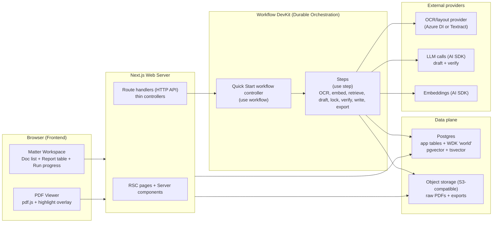
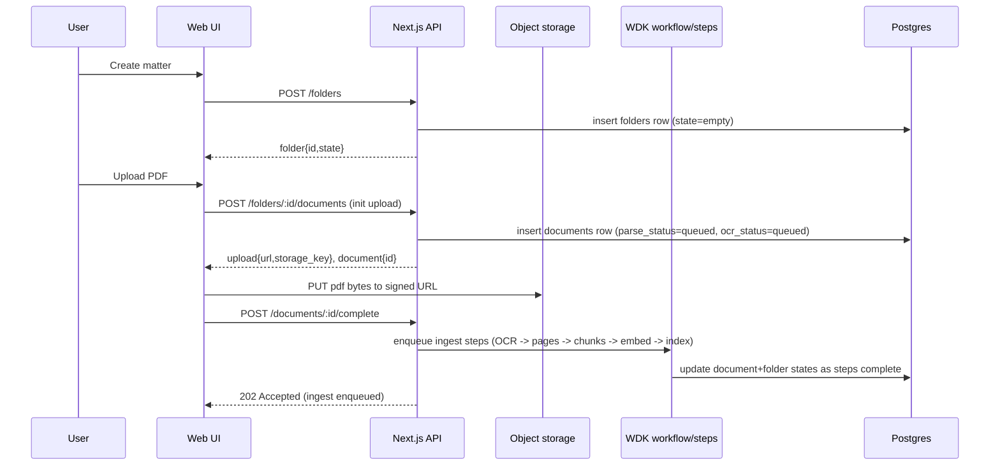
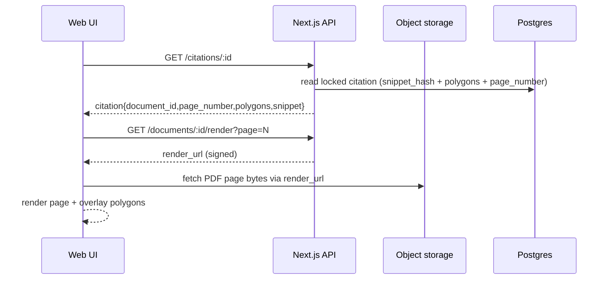
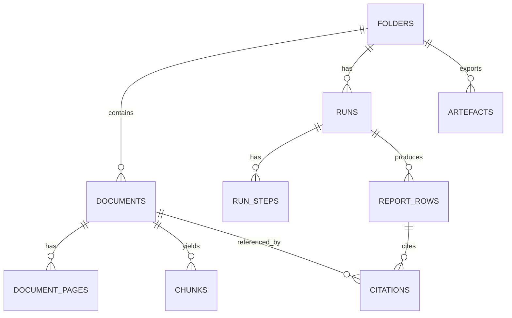

<file_map>
/Users/marc/Code/personal-projects/legaltech-poc
├── apps
│   └── web
│       ├── app
│       │   ├── (api)
│       │   │   ├── export
│       │   │   │   └── csv
│       │   │   │       └── route.ts * +
│       │   │   ├── ...
│       │   ├── (app)
│       │   │   ├── matters
│       │   │   │   ├── ExportCsvButton.tsx * +
│       │   │   │   ├── MattersToolbar.tsx * +
│       │   │   │   └── page.tsx * +
│       │   │   ├── ...
│       │   ├── globals.css *
│       │   ├── layout.tsx * +
│       │   └── page.tsx * +
│       ├── lib
│       │   ├── devOnly.ts * +
│       │   └── fixtureSeed.server.ts * +
│       ├── types
│       │   └── pdfjs-dist.d.ts *
│       ├── .eslintrc.json *
│       ├── AGENTS.md *
│       ├── next-env.d.ts *
│       ├── next.config.js * +
│       ├── package.json *
│       ├── postcss.config.js * +
│       ├── tailwind.config.ts * +
│       ├── tsconfig.json *
│       └── tsconfig.tsbuildinfo
├── docs
│   ├── 03-architecture
│   │   ├── .gitkeep *
│   │   ├── 00_overview.md *
│   │   ├── 01_onboarding_checklist.md *
│   │   ├── 05_tech_stack_and_dev_workflow.md *
│   │   ├── 06_frameworks_agents_rag_evals.md *
│   │   ├── 10_system_architecture.md *
│   │   ├── 20_state_model.md *
│   │   ├── 30_data_model.md *
│   │   ├── 40_rag_and_agents.md *
│   │   ├── 50_api_surface.md *
│   │   ├── 60_observability_and_evals.md *
│   │   ├── AGENTS.md *
│   │   └── DECISIONS.md *
│   ├── 04-projects
│   │   ├── 02-features
│   │   │   ├── 0001_trust-substrate
│   │   │   │   ├── prds
│   │   │   │   │   └── 0001d_citation-chip-highlight
│   │   │   │   │       └── prd.md *
│   │   │   │   ├── prd-overall.md *
│   │   │   │   ├── ...
│   │   │   ├── 0002_quick-start-engine
│   │   │   │   └── ...
│   │   │   ├── 0003_demo-grade-outputs
│   │   │   │   └── ...
│   │   │   ├── 0004_csv-export
│   │   │   │   └── ...
│   │   │   ├── 0005_word-export
│   │   │   │   └── ...
│   │   │   ├── 0006_eval-harness
│   │   │   │   └── ...
│   │   │   ├── 0007_demo-reliability
│   │   │   │   └── ...
│   │   │   └── .gitkeep
│   │   ├── 01-experiments-prototypes
│   │   │   └── .gitkeep
│   │   ├── 03-fixes
│   │   │   └── .gitkeep
│   │   ├── 04-refactors
│   │   │   └── .gitkeep
│   │   ├── 05-migrations
│   │   │   └── .gitkeep
│   │   ├── _templates
│   │   │   ├── .gitkeep
│   │   │   ├── README.md
│   │   │   ├── breadboard.md
│   │   │   ├── json-prd.schema.json
│   │   │   ├── pack.md
│   │   │   ├── prd.md
│   │   │   ├── release-checklist.md
│   │   │   └── spike-plan.md
│   │   ├── .gitkeep
│   │   ├── AGENTS.md
│   │   └── README.md
│   ├── 08-example-data
│   │   ├── pack_01_clean
│   │   │   ├── truth
│   │   │   │   ├── golden_questions.json *
│   │   │   │   ├── ...
│   │   │   ├── docs
│   │   │   │   └── ...
│   │   │   ├── layout
│   │   │   │   └── ...
│   │   │   └── manifest.json *
│   │   ├── pack_02_missing_rea
│   │   │   ├── docs
│   │   │   │   └── ...
│   │   │   ├── layout
│   │   │   │   └── ...
│   │   │   ├── truth
│   │   │   │   └── ...
│   │   │   └── manifest.json
│   │   ├── pack_03_mismatch_and_cert_gap
│   │   │   ├── docs
│   │   │   │   └── ...
│   │   │   ├── layout
│   │   │   │   └── ...
│   │   │   ├── truth
│   │   │   │   └── ...
│   │   │   └── manifest.json
│   │   ├── pack_04_multi_parcel
│   │   │   ├── docs
│   │   │   │   └── ...
│   │   │   ├── layout
│   │   │   │   └── ...
│   │   │   ├── truth
│   │   │   │   └── ...
│   │   │   └── manifest.json
│   │   ├── pack_05_partial_release
│   │   │   ├── docs
│   │   │   │   └── ...
│   │   │   ├── layout
│   │   │   │   └── ...
│   │   │   ├── truth
│   │   │   │   └── ...
│   │   │   └── manifest.json
│   │   ├── pack_06_overlapping_easements
│   │   │   ├── docs
│   │   │   │   └── ...
│   │   │   ├── layout
│   │   │   │   └── ...
│   │   │   ├── truth
│   │   │   │   └── ...
│   │   │   └── manifest.json
│   │   ├── pack_07_scans_rotated_low_quality
│   │   │   ├── docs
│   │   │   │   └── ...
│   │   │   ├── layout
│   │   │   │   └── ...
│   │   │   ├── truth
│   │   │   │   └── ...
│   │   │   └── manifest.json
│   │   ├── pack_08_defined_terms_and_cross_refs
│   │   │   ├── docs
│   │   │   │   └── ...
│   │   │   ├── layout
│   │   │   │   └── ...
│   │   │   ├── truth
│   │   │   │   └── ...
│   │   │   └── manifest.json
│   │   ├── pack_09_bad_citation
│   │   │   ├── docs
│   │   │   │   └── ...
│   │   │   ├── layout
│   │   │   │   └── ...
│   │   │   ├── produced
│   │   │   │   └── ...
│   │   │   ├── truth
│   │   │   │   └── ...
│   │   │   └── manifest.json
│   │   ├── README.md *
│   │   ├── packs_summary.csv
│   │   └── packs_summary.md
│   ├── 98-tmp
│   │   ├── 2026-02-06_infra-investigation
│   │   │   ├── README.md *
│   │   │   ├── deployment.md *
│   │   │   ├── llm-gateways.md *
│   │   │   ├── ocr.md *
│   │   │   ├── storage.md *
│   │   │   ├── oracle_bundles.md
│   │   │   └── recommended-stack.md
│   │   ├── handoffs
│   │   │   └── handoff_2026-02-06_17-35-25_shape-split-commits.md
│   │   ├── oracle
│   │   │   └── oracle-bundles
│   │   │       └── ...
│   │   ├── .gitkeep
│   │   ├── README.md
│   │   └── oracle-03-architecture-review-manual.md
│   ├── 00-strategy
│   │   ├── initiatives
│   │   │   ├── 001-003_dependency_plan.md
│   │   │   ├── 001-003_handoff.md
│   │   │   ├── 001-trust-substrate.md
│   │   │   ├── 002-quick-start-engine.md
│   │   │   ├── 003-polishing-for-demo-and-non-func-hardening.md
│   │   │   ├── initiative-overview-001-002-003.md
│   │   │   └── prd-slicing-rules.md
│   │   ├── opportunity-solution-tree.md
│   │   ├── product-principles.md
│   │   ├── product-strategy-1-pager.md
│   │   ├── product-strategy-detailed.md
│   │   ├── roadmap.md
│   │   └── segmentation-notes.md
│   ├── 01-insights
│   │   ├── capabilities
│   │   │   ├── .gitkeep
│   │   │   ├── PoC-architecture-brainstorming2_chatGPT.md
│   │   │   ├── PoC-architecture-brainstorming3_claude.md
│   │   │   ├── PoC-architecture-brainstorming_chatGPT.md
│   │   │   └── README.md
│   │   ├── competitors
│   │   │   ├── .gitkeep
│   │   │   ├── competitor_overview_chatGPT.md
│   │   │   └── competitor_overview_claude.md
│   │   ├── customers
│   │   │   ├── product-metrics
│   │   │   │   └── ...
│   │   │   ├── user-calls
│   │   │   │   └── ...
│   │   │   └── .gitkeep
│   │   ├── tech-and-market
│   │   │   ├── .gitkeep
│   │   │   └── US-CRE-due-diligence_codex.md
│   │   └── .gitkeep
│   ├── 02-guidelines
│   │   ├── archive
│   │   │   ├── design-system-v1-warm-light.html
│   │   │   ├── design-system-v2-dark-editorial.html
│   │   │   ├── design-system-v3-orange-energy.html
│   │   │   ├── design-system-v4-soft-cyan.html
│   │   │   ├── design-system-v5-purple-accent.html
│   │   │   └── design-system-v6-earthy-organic.html
│   │   ├── inspiration
│   │   │   ├── brand-dna-2026-02-06
│   │   │   │   └── ...
│   │   │   ├── tailwind
│   │   │   │   └── ...
│   │   │   ├── .gitkeep
│   │   │   ├── README.md
│   │   │   ├── brand_guidelines.md
│   │   │   ├── design_tokens.json
│   │   │   └── prompt_library.json
│   │   ├── .gitkeep
│   │   ├── AGENTS.md
│   │   ├── brand-guidelines.md
│   │   ├── brand-tone.md
│   │   └── design-system-v7-refined.html
│   ├── 05-reviews-audits
│   │   ├── .gitkeep
│   │   └── governance.md
│   ├── 06-release
│   │   ├── postmortems
│   │   │   └── .gitkeep
│   │   ├── .gitkeep
│   │   ├── AGENTS.md
│   │   └── CHANGELOG.md
│   ├── 96-engineering-tutor-learnings
│   │   ├── 2026-02-06_brand-dna-web-app-design-language.md
│   │   ├── 2026-02-07_orbital-architecture-decisions-and-overview.md
│   │   └── 2026-02-07_trust-substrate-verification-overrides-and-rh2-fallbacks.md
│   ├── 99-archive
│   │   └── .gitkeep
│   ├── AGENTS.md
│   └── LEARNINGS.md
├── packages
│   ├── core
│   │   ├── src
│   │   │   ├── citations
│   │   │   │   ├── snippet.test.ts * +
│   │   │   │   └── snippet.ts * +
│   │   │   ├── geometry
│   │   │   │   ├── anchors.ts * +
│   │   │   │   ├── mapToViewport.test.ts * +
│   │   │   │   └── mapToViewport.ts * +
│   │   │   ├── missing-docs
│   │   │   │   ├── detectMissingDocs.ts * +
│   │   │   │   └── schemas.ts * +
│   │   │   ├── verify
│   │   │   │   ├── verifier.schemas.ts * +
│   │   │   │   └── verifier.ts * +
│   │   │   ├── spikes
│   │   │   │   └── ...
│   │   │   ├── index.ts * +
│   │   │   ├── safe-error.ts * +
│   │   │   └── server.ts * +
│   │   ├── package.json *
│   │   ├── tsconfig.build.json
│   │   └── tsconfig.json
│   └── .gitkeep
├── scripts
│   ├── fixtures
│   │   ├── lib
│   │   │   ├── args.ts * +
│   │   │   ├── csv.ts * +
│   │   │   ├── fs.ts * +
│   │   │   ├── geometry.ts * +
│   │   │   └── snapshot.ts * +
│   │   ├── README.md *
│   │   ├── assert_row_invariants.ts * +
│   │   ├── verify_pack_names.ts * +
│   │   ├── compare_truth.ts +
│   │   └── seed.ts +
│   ├── db
│   │   └── init.sql
│   ├── build.sh *
│   ├── lint.sh *
│   ├── test.sh *
│   ├── typecheck.sh *
│   ├── verify.sh *
│   ├── ast-grep.sh
│   ├── install_codex_skills_copy.sh
│   ├── install_git_hooks.sh
│   └── knip.sh
├── .agents
│   ├── hooks
│   │   ├── git
│   │   │   ├── commit-msg
│   │   │   ├── post-merge
│   │   │   ├── pre-commit
│   │   │   ├── pre-push
│   │   │   └── prepare-commit-msg
│   │   └── README.md
│   ├── skills
│   │   ├── 00-utilities
│   │   │   ├── agent-browser
│   │   │   │   └── ...
│   │   │   ├── agentation
│   │   │   │   └── ...
│   │   │   ├── ask-questions-if-underspecified
│   │   │   │   └── ...
│   │   │   ├── beautiful-mermaid
│   │   │   │   └── ...
│   │   │   ├── brand-dna-extractor
│   │   │   │   └── ...
│   │   │   ├── browser-use
│   │   │   │   └── ...
│   │   │   ├── commit
│   │   │   │   └── ...
│   │   │   ├── create-cli
│   │   │   │   └── ...
│   │   │   ├── dev-browser
│   │   │   │   └── ...
│   │   │   ├── docs-list
│   │   │   │   └── ...
│   │   │   ├── engineering-tutor
│   │   │   │   └── ...
│   │   │   ├── every-style-editor
│   │   │   │   └── ...
│   │   │   ├── file-todos
│   │   │   │   └── ...
│   │   │   ├── firecrawl
│   │   │   │   └── ...
│   │   │   ├── framework-docs-researcher
│   │   │   │   └── ...
│   │   │   ├── handoff
│   │   │   │   └── ...
│   │   │   ├── landpr
│   │   │   │   └── ...
│   │   │   ├── markdown-converter
│   │   │   │   └── ...
│   │   │   ├── nano-banana-pro
│   │   │   │   └── ...
│   │   │   ├── openai-image-gen
│   │   │   │   └── ...
│   │   │   ├── oracle
│   │   │   │   └── ...
│   │   │   ├── parallel-web-tools
│   │   │   │   └── ...
│   │   │   ├── pickup
│   │   │   │   └── ...
│   │   │   └── video-transcript-downloader
│   │   │       └── ...
│   │   ├── 02-shape
│   │   │   ├── breadboarding
│   │   │   │   └── ...
│   │   │   ├── brief
│   │   │   │   └── ...
│   │   │   ├── create-json-prd
│   │   │   │   └── ...
│   │   │   ├── create-prd
│   │   │   │   └── ...
│   │   │   ├── spike-investigation
│   │   │   │   └── ...
│   │   │   └── wf-shape
│   │   │       └── ...
│   │   ├── 03-plan
│   │   │   ├── best-practices-researcher
│   │   │   │   └── ...
│   │   │   ├── bug-reproduction-validator
│   │   │   │   └── ...
│   │   │   ├── deepen-plan
│   │   │   │   └── ...
│   │   │   ├── plan-review
│   │   │   │   └── ...
│   │   │   ├── repo-research-analyst
│   │   │   │   └── ...
│   │   │   ├── reproduce-bug
│   │   │   │   └── ...
│   │   │   ├── spec-flow-analyzer
│   │   │   │   └── ...
│   │   │   ├── triage
│   │   │   │   └── ...
│   │   │   └── wf-plan
│   │   │       └── ...
│   │   ├── 04-develop
│   │   │   ├── 00-frontend-general
│   │   │   │   └── ...
│   │   │   ├── 01-ui-skills-dot-com
│   │   │   │   └── ...
│   │   │   ├── pr-comment-resolver
│   │   │   │   └── ...
│   │   │   ├── use-ai-sdk
│   │   │   │   └── ...
│   │   │   ├── verify
│   │   │   │   └── ...
│   │   │   ├── wf-develop
│   │   │   │   └── ...
│   │   │   └── wf-ralph
│   │   │       └── ...
│   │   ├── 05-review
│   │   │   ├── agent-native-architecture
│   │   │   │   └── ...
│   │   │   ├── agent-native-reviewer
│   │   │   │   └── ...
│   │   │   ├── architecture-strategist
│   │   │   │   └── ...
│   │   │   ├── code-simplicity-reviewer
│   │   │   │   └── ...
│   │   │   ├── data-integrity-guardian
│   │   │   │   └── ...
│   │   │   ├── data-migration-expert
│   │   │   │   └── ...
│   │   │   ├── git-history-analyzer
│   │   │   │   └── ...
│   │   │   ├── kieran-python-reviewer
│   │   │   │   └── ...
│   │   │   ├── kieran-typescript-reviewer
│   │   │   │   └── ...
│   │   │   ├── pattern-recognition-specialist
│   │   │   │   └── ...
│   │   │   ├── performance-oracle
│   │   │   │   └── ...
│   │   │   ├── security
│   │   │   │   └── ...
│   │   │   ├── security-sentinel
│   │   │   │   └── ...
│   │   │   ├── test-browser
│   │   │   │   └── ...
│   │   │   └── wf-review
│   │   │       └── ...
│   │   ├── 06-release
│   │   │   ├── changelog
│   │   │   │   └── ...
│   │   │   ├── deployment-verification-agent
│   │   │   │   └── ...
│   │   │   └── wf-release
│   │   │       └── ...
│   │   ├── 07-compound
│   │   │   └── compound-docs
│   │   │       └── ...
│   │   ├── 10-audit
│   │   │   └── agent-native-audit
│   │   │       └── ...
│   │   └── 98-skill-maintenance
│   │       ├── create-agent-skills
│   │       │   └── ...
│   │       ├── heal-skill
│   │       │   └── ...
│   │       ├── modular-skills-architect
│   │       │   └── ...
│   │       └── skill-creator
│   │           └── ...
│   └── register.json
├── tmp
│   └── .gitkeep
├── docker-compose.yml *
├── package.json *
├── pnpm-workspace.yaml *
├── .gitignore
├── AGENTS.md
├── LICENSE
├── README.md
├── brand-preview.html
└── pnpm-lock.yaml


(* denotes selected files)
(+ denotes code-map available)
Config: depth cap 3.

File: /Users/marc/Code/personal-projects/legaltech-poc/scripts/fixtures/seed.ts
Imports:
  - import fs from "node:fs";
  - import path from "node:path";
  - import { AnchorFileSchema, anchorBoxToPolygons, type AnchorBox } from "../../packages/core/src/geometry/anchors.ts";
  - import { hashSnippet } from "../../packages/core/src/citations/snippet.ts";
  - import { parseArgs, getBoolArg, getStringArg } from "./lib/args.ts";
---

Type-aliases:
  - FixtureManifest
  - GoldenQuestion
  - SeedSnapshot

Functions:
  - L57: function isRecord(val: unknown): val is Record<string, unknown>
  - L61: function asNonEmptyString(val: unknown): string | null
  - L67: function readJsonFile(filePath: string): unknown
  - L72: function writeJsonFile(filePath: string, value: unknown)
  - L77: function loadManifest(packRoot: string): FixtureManifest
  - L102: function loadGoldenQuestions(packRoot: string): GoldenQuestion[]
  - L135: function anchorsPathFor(manifest: FixtureManifest, packRoot: string, docFilename: string): string | null
  - L141: function loadAnchorBbox(args: { manifest: FixtureManifest; packRoot: string; docFilename: string; anchorId: string; }): { ok: true; anchor: AnchorBox }
  - L156: function snippetFor(q: GoldenQuestion, c: { doc: string; anchor: string }): string
  - L161: function seedPack(packId: string, opts: { outRoot: string; overwrite: boolean; includeBadCitationRow: boolean })
  - L278: function main()
---


File: /Users/marc/Code/personal-projects/legaltech-poc/apps/web/app/(app)/spikes/rh2-overlay/Rh2OverlayClient.tsx
Imports:
  - import { useEffect, useMemo, useRef, useState } from "react";
  - import {
  anchorBoxToPolygons,
  bboxFromCssPolygons,
  mapNormPolygonsToViewportCss,
  type CssPolygons,
  type NormPoint,
  type NormPolygons,
  type ViewBox,
} from "@legaltech-poc/core";
  - import { useRouter } from "next/navigation";
---

Type-aliases:
  - Props
  - PdfJsModule

Functions:
  - L33: function validateNormPolygons(polygons: NormPolygons): string | null
  - L45: export function Rh2OverlayClient(props: Props)

Exports:
  - export function Rh2OverlayClient(props: Props) {
---

</file_map>
<file_contents>
File: /Users/marc/Code/personal-projects/legaltech-poc/docs/03-architecture/DECISIONS.md
```md
# Architecture decisions (ADRs)

Append-only log of architecture decisions for Orbital Copilot PoC. Add new ADRs at the end and link the PR.

## ADR format (minimal)

```md
## ADR-0000: Title
- Status: proposed | accepted | superseded | deprecated
- Date: YYYY-MM-DD

Context
- Why are we making this decision?

Decision
- What did we decide?

Consequences
- What does this enable/force?
- What are the risks/trade-offs?

Links
- PR:
- Related docs:
```

---

## ADR-0001: Evidence-first outputs with citation IDs and locking
- Status: accepted
- Date: 2026-02-06

Context
- Trust UX is the product: every material claim needs inspectable evidence.

Decision
- Drafting produces structured rows with **candidate citations as chunk IDs** (no free-text citations).
- We **lock** citations by creating immutable `citations` records containing `{snippet, snippet_hash, geometry}`.
- Report rows refer to citations by `citation_id` only.

Consequences
- We can highlight evidence even if chunking/indexing changes later.
- Provenance is sufficient for debugging and replay without re-running the model.

Links
- Related docs: `docs/03-architecture/40_rag_and_agents.md`, `docs/03-architecture/30_data_model.md`

## ADR-0002: Verification is fail-closed
- Status: accepted
- Date: 2026-02-06

Context
- A plausible answer without valid evidence is worse than “not found”.

Decision
- Any citation lock mismatch or verification failure sets row status to `citation_failed`.
- `citation_failed` rows are non-exportable by default.

Consequences
- Reduces false trust at the cost of more “blocked” outputs early.
- Forces us to invest in retrieval + citation integrity.

Links
- Related docs: `docs/03-architecture/20_state_model.md`, `docs/03-architecture/60_observability_and_evals.md`

## ADR-0003: OCR/layout extraction is the default for all PDFs
- Status: accepted
- Date: 2026-02-06

Context
- Scans are common in CRE diligence packs; highlights require geometry.

Decision
- Every uploaded PDF is processed with OCR/layout extraction and persisted to `document_pages` as canonical text + polygons.

Consequences
- More ingest cost/latency, but consistent highlighting and chunking.
- Enables citation hashing and geometric overlays as first-class features.

Links
- Related docs: `docs/03-architecture/05_tech_stack_and_dev_workflow.md`, `docs/03-architecture/30_data_model.md`

## ADR-0004: Hybrid retrieval returning chunk IDs (lexical + vector)
- Status: accepted
- Date: 2026-02-06

Context
- CRE packs mix boilerplate and highly specific clauses; we need both recall and precision.

Decision
- Retrieval is hybrid (tsvector + embeddings) and returns **chunk IDs** (with scores) rather than prose.
- Optional rerank can be added, but must not change the “IDs-only” contract.

Consequences
- Retrieval becomes measurable (Recall@K, drift detection).
- Downstream steps can be schema-driven and deterministic.

Links
- Related docs: `docs/03-architecture/40_rag_and_agents.md`, `docs/03-architecture/60_observability_and_evals.md`

## ADR-0005: Deterministic-ish orchestration via Workflow DevKit steps
- Status: accepted
- Date: 2026-02-06

Context
- We need resumability, retries, and row-by-row progress without “agent loops”.

Decision
- Quick Start is implemented as a WDK workflow that coordinates explicit steps (`retrieve → draft → lock → verify → write`).
- Use `"use workflow"` / `"use step"` directives to make side-effect boundaries explicit.

Consequences
- Workflows remain predictable; side effects are isolated and observable.
- Keeps WDK integration thin (domain logic stays in `packages/core`).

Links
- Related docs: `docs/03-architecture/06_frameworks_agents_rag_evals.md`, `docs/03-architecture/10_system_architecture.md`

## ADR-0006: Fixture-driven evals are first-class
- Status: accepted
- Date: 2026-02-06

Context
- Demos fail when extraction/retrieval drifts; fixtures let us regress deterministically.

Decision
- Maintain synthetic packs with `/docs`, `/truth`, `/layout`.
- Run `fixture:eval` to produce per-pack eval reports and a cross-pack summary.
- Start as report-only, then gate CI on hard trust metrics (schema + citation integrity).

Consequences
- Faster iteration with fewer demo regressions.
- Forces us to encode “expected failure journeys” as fixtures.

Links
- Related docs: `docs/03-architecture/05_tech_stack_and_dev_workflow.md`, `docs/03-architecture/60_observability_and_evals.md`

## ADR-0007: No external web research inside PoC runs
- Status: accepted
- Date: 2026-02-06

Context
- PoC must be defensible based on provided diligence documents only.

Decision
- Quick Start uses only the uploaded pack for retrieval and reasoning.

Consequences
- Clear provenance and a simpler security posture.
- Some questions will legitimately resolve to `missing_input`.

Links
- Related docs: `docs/03-architecture/00_overview.md`, `docs/03-architecture/06_frameworks_agents_rag_evals.md`

## ADR-0008: Explicit error envelope for APIs
- Status: accepted
- Date: 2026-02-06

Context
- Clients need stable contracts; we must not leak internal errors/provider payloads.

Decision
- Standardise non-2xx responses on a single JSON error envelope with safe `code`, `message`, optional `details`, and optional `trace_id`.

Consequences
- Frontend can implement consistent error handling.
- Makes observability and support workflows simpler.

Links
- Related docs: `docs/03-architecture/50_api_surface.md`, `docs/03-architecture/AGENTS.md`

## ADR-0009: Deployment posture is Hetzner-first (single VM) until proven otherwise
- Status: accepted
- Date: 2026-02-06

Context
- The PoC needs durable orchestration (WDK) and long-running side effects (OCR/embeddings/LLM calls).
- A single-VM deployment reduces moving parts and avoids serverless DB connection pitfalls.

Decision
- Default deployment target is a Hetzner VM running the Next.js server + WDK worker + Postgres (and optionally MinIO).
- Vercel stays optional for later once the runtime shape is stable.
- We may deploy the web app (`apps/web`) to Vercel in the future (including preview deployments), while keeping worker + Postgres on the VM.

Consequences
- Faster path to a stable demo and simpler debugging.
- We own basic ops (TLS, process supervision, backups, monitoring).

Links
- Related docs: `docs/03-architecture/10_system_architecture.md`, `docs/03-architecture/05_tech_stack_and_dev_workflow.md`
- Investigation: `docs/98-tmp/2026-02-06_infra-investigation/deployment.md`

## ADR-0010: Use S3-compatible object storage as the baseline
- Status: accepted
- Date: 2026-02-06

Context
- We need to store raw PDFs and exports and serve pages to pdf.js reliably.
- We want portability between local dev and Hetzner deployment (and optionally Vercel).

Decision
- Use S3-compatible object storage as the baseline contract.
- Local dev: MinIO (or local filesystem for ultra-simple early dev).
- Deployment: prefer managed S3-compatible storage unless explicitly "single VM only".

Consequences
- Standard tooling (AWS SDK) and a clean signed-URL story.
- If we self-host storage (MinIO), we must own backups and durability.

Links
- Related docs: `docs/03-architecture/05_tech_stack_and_dev_workflow.md`
- Investigation: `docs/98-tmp/2026-02-06_infra-investigation/storage.md`

## ADR-0011: Postgres is the primary datastore (local compose; Hetzner in deploy)
- Status: accepted
- Date: 2026-02-06

Context
- Postgres is already the planned "truth store" (rows, runs, steps, citations) and supports pgvector + tsvector.
- The PoC is single-tenant and can start with a single Postgres instance.

Decision
- Local dev: Postgres via Docker Compose (or Supabase local).
- Deployment: self-host Postgres on the Hetzner VM with automated backups and monitoring.

Consequences
- Simple data plane and predictable latency.
- If we later put the web/API on Vercel, we must add connection pooling and strict limits.

Links
- Related docs: `docs/03-architecture/05_tech_stack_and_dev_workflow.md`, `docs/03-architecture/30_data_model.md`

## ADR-0012: OCR/layout extraction is abstracted behind a single provider adapter
- Status: accepted
- Date: 2026-02-06

Context
- Highlight overlays require geometry.
- We want to keep the provider choice reversible (Azure Document Intelligence vs AWS Textract).

Decision
- Default provider: Azure Document Intelligence (Layout), unless an AWS-first posture is chosen.
- Implement a single OCR adapter interface returning a canonical per-page schema.

Consequences
- Provider swaps are a bounded change (mostly isolated to the adapter).
- We can tune for cost/quality without rewriting downstream chunking/citations.

Links
- Related docs: `docs/03-architecture/05_tech_stack_and_dev_workflow.md`, `docs/03-architecture/40_rag_and_agents.md`
- Investigation: `docs/98-tmp/2026-02-06_infra-investigation/ocr.md`

## ADR-0013: LLM + embeddings calls go through AI SDK; gateway is default
- Status: accepted
- Date: 2026-02-06

Context
- We need to route between "fast draft" and "strong verify" models and keep observability consistent.
- We want one interface across:
  - streaming UX in Next.js route handlers
  - durable side effects in worker steps (WDK)
- A gateway can simplify auth, provider swaps, and consistent telemetry.

Decision
- Standardize on AI SDK (`ai`) as the only “public API” for LLM + embeddings calls in this repo.
- Default to Vercel AI Gateway (via AI SDK gateway provider) so auth + model routing are consistent across web + worker.
- Keep a small internal router interface (draft, verify, embed) but implement it via AI SDK.
- Direct provider SDKs (OpenAI SDK, Anthropic SDK, etc) are only allowed with an explicit reason (eg missing feature, debugging, or a provider-specific capability).

Consequences
- Consistent auth, retries, and observability patterns for all model calls.
- Model selection becomes an env/config concern (eg `LLM_MODEL_CHAT`, `LLM_MODEL_SUMMARY`, `EMBED_MODEL`), not scattered code changes.
- Gateway auth becomes part of the minimum env contract (eg `AI_GATEWAY_API_KEY` locally/Hetzner; Vercel OIDC where available).

Links
- Related docs: `docs/03-architecture/05_tech_stack_and_dev_workflow.md`
- Investigation: `docs/98-tmp/2026-02-06_infra-investigation/llm-gateways.md`

## ADR-0014: Create a minimal runnable scaffold to validate the architecture
- Status: accepted
- Date: 2026-02-06

Context
- Current repo is docs-first; we need a tracer-bullet implementation to validate the UX (pdf viewer + citations) and workflow plumbing.

Decision
- Add a minimal pnpm workspace scaffold:
  - `apps/web`: Next.js App Router app
  - `packages/core`: Zod schemas + core contracts
  - `docker-compose.yml`: local Postgres + MinIO (optional)
  - wire `pnpm dev`, `pnpm build`, `pnpm test`, `pnpm lint`

Consequences
- Onboarding becomes concrete and repeatable.
- Risk: scaffolding can become premature if we haven't committed to building the PoC; keep it intentionally thin.

Links
- Related docs: `docs/03-architecture/05_tech_stack_and_dev_workflow.md`, `docs/03-architecture/06_frameworks_agents_rag_evals.md`


## ADR-0015: Deterministic page-bounded chunking (line window v1) + index_version bump rules
- Status: accepted
- Date: 2026-02-07

Context
- Retrieval returns chunk IDs (ADR-0004) and drafting cites candidate chunk IDs (ADR-0001).
- Click-to-highlight UX requires that chunks map cleanly to page geometry (ADR-0003).
- Without a pinned chunking strategy, “what is a citable unit?” and “when do we bump index_version?” will drift and break evals.

Decision
- Citable unit:
  - Retrieval returns `chunk_id`s only.
  - Drafting outputs `candidate_citation_chunk_ids: string[]` only.
  - Citation locking resolves `chunk_id` -> immutable `citation_id` (ADR-0001).
- Chunk scope (PoC default):
  - Chunks are **page-bounded**: `page_start = page_end = page_number`.
  - A chunk never spans multiple pages.
- Chunk sizing defaults (PoC):
  - Build chunks from OCR/layout “lines” in `document_pages.layout_json`.
  - Hard limits:
    - `max_lines = 20`
    - `max_chars = 1500`
    - `overlap_lines = 4` (overlap is within a page only)
- Boundary rules:
  - Never split inside an OCR line.
  - Prefer splitting on blank lines.
  - Treat section headers as hard boundaries (e.g. lines matching: `/^(SCHEDULE|EXHIBIT|SECTION)\b/i`, or ALL-CAPS lines above a minimum length).
- Chunk metadata (required fields in `chunks.metadata_json`):
  - `chunker_id`: `line_window_v1`
  - `chunk_params`: `{ max_lines, max_chars, overlap_lines, header_regexes_version }`
  - `page_number`
  - `line_start` / `line_end` (inclusive line indices in the canonical OCR line list)
  - Optional: `doc_type`, `section_hint`
- Index version bumping:
  - `index_version` identifies the retrieval substrate for a folder (chunks + indices).
  - We MUST bump `folders.latest_index_version` when ANY of the following changes:
    - OCR canonicalisation schema or adapter version (ADR-0012)
    - chunker_id or chunk_params
    - lexical indexing config (tsvector build rules)
    - embedding model ID or embedding dimension
  - Fail-closed safety:
    - Each chunk row stores the `chunker_id` + `chunk_params` used to build it.
    - The ingestion/indexing pipeline must refuse to write chunks for an existing `index_version` if the current chunker_id/params do not match the stored metadata (failure code: `CHUNKING_FAIL`).

Consequences
- Highlight overlays become straightforward because a citation’s polygons are always on a single page.
- Chunk IDs remain stable within an `index_version`, and drift is handled by versioning rather than mutation.
- Trade-off: cross-page clauses require retrieving multiple chunks; we accept this for PoC simplicity.

Links
- PR:
- Related docs:
  - `docs/03-architecture/40_rag_and_agents.md`
  - `docs/03-architecture/30_data_model.md`
  - `docs/03-architecture/20_state_model.md`


## ADR-0016: File-backed, immutable question sets with run pinning and completed invariants
- Status: accepted
- Date: 2026-02-07

Context
- Runs must pin `question_set_version` so we can replay and evaluate outputs deterministically (`docs/03-architecture/20_state_model.md`, `docs/03-architecture/30_data_model.md`).
- If question sets are editable in-place, “completed” becomes ambiguous and fixture truth comparisons drift.
- PoC constraint: single-tenant, minimal infra. We want determinism and code review over dynamic configurability.

Decision
- Storage (v1):
  - Question sets live in-repo as JSON files (source of truth), not in the database.
  - Each version is an immutable file. Do not edit an existing version file; create a new version file.
  - Suggested location:
    - `packages/core/question-sets/<question_set_id>/qs_<version>.json`
- File schema (required fields):
  - `question_set_id` (e.g. `quick_start_title_survey`)
  - `question_set_version` (e.g. `qs:quick_start_title_survey:v1`)
  - `created_at` (ISO date)
  - `questions[]` with:
    - `question_id` (stable identifier, e.g. `BII-01`)
    - `question` (string)
    - optional `artefact_kind` (`requirements_tracker|exceptions_table|survey_issues`)
    - optional `row_schema_id` (pins the row payload schema)
- Run pinning:
  - At run creation, the server selects a question set version for the run type and persists:
    - `runs.question_set_version` = the selected version string
  - `runs.question_set_version` MUST NOT change after creation.
- Completed invariants (mechanics):
  - A run can only enter `runs.state = completed` when:
    - For the pinned `question_set_version`, there is exactly one `report_rows` record per `question_id` in that set.
    - Every `report_rows.status` is terminal (`needs_review|reviewed|missing_input|citation_failed`).
  - Any mismatch (missing question IDs, extra rows, or duplicate rows) is a fail-closed run failure (failure code: `INVARIANT_FAIL`).

Consequences
- Deterministic replays: “what questions did we run?” is answerable from the run record.
- Fixtures and eval truth files can stabilise against explicit question IDs.
- Trade-off: no UI-editable question sets in v1. That is intentional.

Links
- PR:
- Related docs:
  - `docs/03-architecture/20_state_model.md`
  - `docs/03-architecture/30_data_model.md`
  - `docs/03-architecture/50_api_surface.md`


## ADR-0017: Verification v1 is integrity-only (no entailment model)
- Status: accepted
- Date: 2026-02-07

Context
- We must fail closed on trust breaks (ADR-0002), but "verification" can mean different things:
  - integrity/invariants (deterministic checks)
  - semantic entailment (model-based "does evidence support the claim?")
- Introducing entailment early expands the failure surface (false blocks / false passes) without fixture-eval confidence.

Decision
- Verification v1 is integrity-only:
  - citation lock integrity (locked `citation_id`s exist and match `snippet_hash` rules)
  - geometry sanity (page bounds, normalised polygon ranges, page identity)
  - row/run invariants required for export gating (ADR-0002)
- We do **not** include an entailment/verifier model in v1.
  - If we add entailment later, it must be fixture-eval'd and introduced behind explicit gates.

Consequences
- Deterministic, cheap verification with clear debug paths.
- Does not catch "valid evidence, wrong interpretation" errors; reviewer inspection remains the semantic backstop.

Links
- PR:
- Related docs:
  - `docs/03-architecture/20_state_model.md`
  - `docs/03-architecture/30_data_model.md`
  - `docs/03-architecture/60_observability_and_evals.md`


## ADR-0018: Run trace export is `GET /runs/:id/trace` and is admin-token gated
- Status: accepted
- Date: 2026-02-07

Context
- When exports are blocked or rows fail closed, we need a deterministic, debuggable trace without re-running workflows.
- PoC environments may run without full auth; trace export must be treated as admin-only by default.

Decision
- Add a developer-facing trace export endpoint:
  - `GET /runs/:id/trace` returns a JSON trace for the run (minimal + safe by default).
- Access control (PoC v1):
  - Require `X-Orbital-Admin-Token` header to match env `ORBITAL_ADMIN_TOKEN`.
  - Missing/mismatched token returns `403` with the standard error envelope (ADR-0008).
- Safety:
  - No raw PDF bytes.
  - Avoid full extracted document text.
  - No raw provider payload dumps.
  - Prefer opaque IDs + hashes.

Consequences
- Debugging is faster and more repeatable (trace + IDs is enough).
- Operators must manage an admin token even in “no auth” PoC environments.

Links
- PR:
- Related docs:
  - `docs/03-architecture/50_api_surface.md`
  - `docs/03-architecture/60_observability_and_evals.md`


## ADR-0019: Unsafe export override is API-only and gated behind demo flags + admin token
- Status: accepted
- Date: 2026-02-07

Context
- Default posture is fail-closed export blocking when trust breaks (ADR-0002).
- Demos sometimes need an explicit "unsafe export" bypass to show the shape of outputs.

Decision
- `unsafe_override=true` is allowed only when ALL are true:
  - `DEMO_MODE=1`
  - `ALLOW_UNSAFE_EXPORTS=1`
  - `X-Orbital-Admin-Token` matches env `ORBITAL_ADMIN_TOKEN` (ADR-0018)
- UI policy (PoC v1):
  - No unsafe override affordance in the Trust Substrate UI; unsafe override is API-only.
- Unsafe export labelling:
  - Artefacts created via unsafe override must be visibly labelled (eg filename suffix `.UNSAFE`) and recorded in artefact metadata.

Consequences
- Preserves default trust posture while enabling controlled demo escape hatches.
- Slightly more flag complexity, but failures remain explicit and safe by default.

Links
- PR:
- Related docs:
  - `docs/03-architecture/50_api_surface.md`
  - `docs/03-architecture/20_state_model.md`


## ADR-0020: RH2 overlay is "verified at 100% zoom only" in PoC v1; regression proof is artifact-based
- Status: accepted
- Date: 2026-02-07

Context
- Misaligned highlight overlays are trust leakage (they look "precise" while being wrong).
- Overlay alignment across zoom/rotation/scanned packs can be gnarly; we need an honest fallback.

Decision
- PoC v1 overlay posture:
  - Highlight overlays are treated as verified only at `zoom=100%`.
  - If zoom is not 100%, we do not render the overlay and show an explicit, honest message explaining the constraint.
- Regression posture:
  - Capture proof artifacts (screenshots + bbox/HUD logs) for fixture packs.
  - Automation may be used to produce artifacts, but v1 does not require automated pixel-diff assertions.

Consequences
- Protects the trust moment while keeping RH2 scope bounded.
- Adds some reviewer friction (must go to 100% to inspect the overlay).

Links
- PR:
- Related docs:
  - `docs/04-projects/02-features/0001_trust-substrate/prd-overall.md`
  - `docs/04-projects/02-features/0001_trust-substrate/prds/0001d_citation-chip-highlight/prd.md`

```

File: /Users/marc/Code/personal-projects/legaltech-poc/docs/03-architecture/06_frameworks_agents_rag_evals.md
```md
# Frameworks, agents, RAG, and evals

This doc answers:
- why we picked Workflow DevKit for orchestration
- what we do (and do not) use agent frameworks for
- where RAG fits in the system
- how evals are wired in for demo reliability

## Framework selection

### Chosen for PoC: Workflow DevKit (WDK)
Why:
- Our core requirement is a durable, resumable, deterministic-ish workflow:
  `retrieve → draft → lock → verify → write` per row
- WDK naturally models this with workflows and steps:
  - workflow is the deterministic controller
  - steps encapsulate non-deterministic side effects (OCR, embeddings, LLM calls, DB writes)
- It supports incremental progress which maps to “table populates row-by-row”

Risk:
- WDK is early-stage, so keep integration thin:
  - keep domain logic in `packages/core`
  - treat WDK as orchestration and durability, not as the place where business rules live

### WDK conventions in this repo
WDK is the durable orchestration runtime we refer to as `workflow` in code. It provides:
- a **workflow** function (deterministic controller) that can be resumed/replayed
- **step** functions that perform side effects (OCR, embeddings, LLM calls, DB writes)
- a Postgres-backed “world” for state, retries, and progress events

Conventions we follow (to keep the integration thin and predictable):
- Workflow entrypoints must start with the directive string literal **`"use workflow"`** as the first statement in the async function body.
- Step implementations must start with **`"use step"`** as the first statement in the async function body.
- Workflows do **not** perform side effects directly (no network/LLM/OCR/DB writes). They only call steps and assemble results.
- Steps are responsible for idempotency (safe re-run). Where the provider call cannot be naturally idempotent, store a deterministic idempotency key in `run_steps` and short-circuit on repeats.
- Step inputs/outputs must be JSON-serialisable and validated with Zod schemas from `packages/core/schemas`.

Why the directives matter:
- they make it obvious (in code review) whether a function is allowed to do side effects
- they reduce drift into “free-running agents” by forcing work to be split into explicit steps

See also: `docs/03-architecture/20_state_model.md` (state invariants) and `docs/03-architecture/30_data_model.md` (provenance + replay).

### Alternatives (when you might choose them)
- Mastra: integrated TS framework for agents, workflows, RAG, evals. Strong if you want one unified AI platform.
  - For this PoC, it risks overreach unless you keep Quick Start as a workflow graph rather than agent loops.
- LangGraph.js: good if you want graphs/state machines as the primary abstraction.
  - In our setup WDK already owns orchestration, so LangGraph can become duplicate complexity.
- OpenAI Agents SDK: good for interactive tool-using assistants.
  - For Quick Start we prefer a strict workflow. Agents SDK can still be used later for a chat slice.

---

## Where “agents” fit in this PoC
We keep the 4-agent mental model as a product narrative, but implement it as constrained functions under the workflow’s control.

### Orchestrator (workflow controller)
- Encoded as the WDK workflow
- Loads question set v1
- Runs per-question loop with strict ordering and budgets
- Owns progress and run steps

### Retrieval agent (evidence gatherer)
- Implemented as a step: `retrieve_evidence_step(question_id, filters)`
- Output: chunk IDs + scores + docs_searched

### Drafting agent (row writer)
- Implemented as a step: `draft_row_step(question_id, evidence_chunk_ids)`
- Output: structured row JSON with candidate citations as chunk IDs (not free text)

### Verification agent (citation QA)
- Implemented as a step: `verify_row_step(row_json, locked_citations)`
- Output: pass/fail + corrected answer if needed
- Fail-closed is the default

Research agent:
- Out of scope for PoC (no external web research)
- If needed, implement as a static internal snippet tool, not web browsing

---

## Where RAG fits (end-to-end)
RAG is the engine inside Quick Start. It spans ingestion and runtime.

### Ingestion (creates retrieval substrate)
- OCR/layout extraction → canonical per-page text + geometry
- Chunking → citable chunks with metadata
- Indexing:
  - lexical search via tsvector
  - semantic search via pgvector embeddings

### Runtime (per question)
1) Retrieve: hybrid search + rerank returns chunk IDs
2) Draft: generate row JSON using only retrieved evidence
3) Lock citations: resolve chunk IDs → authoritative snippet + hash + geometry
4) Verify: hash checks + entailment check
5) Write: store report row + citations + status

Key invariant:
- if we cannot retrieve evidence, the system must output “Not found in provided documents.” and set `missing_input`

---

## Evals (fixture-driven, tied to /truth)
Evals are first-class because trust is the product. The synthetic packs allow repeatable regression testing.

### Minimum eval suite
1) Extraction correctness (per pack)
- Requirements count and key fields match `/truth/expected_requirements_tracker.csv`
- Exceptions count and key fields match `/truth/expected_exceptions_table.csv`
- Survey issues match `/truth/expected_survey_issues.csv` (allow “unknown” where designed)

2) Retrieval quality (golden questions)
- Recall@K: do we retrieve the expected chunk/page for each question in `golden_questions.json`?

3) Citation validity
- Code checks:
  - cited page exists
  - polygons exist
  - snippet_hash matches canonical snippet
- Judge checks (optional but recommended):
  - entailment: snippet supports claim, conservative rubric

4) Failure journeys
- `pack_02_missing_rea` should reliably produce `missing_input` rows with a missing-doc checklist
- at least one deliberately corrupted citation should produce `citation_failed`

### How evals run
- `fixture:eval pack_x` produces:
  - per-pack JSON report with pass/fail and metrics
  - failure taxonomy counts
- `fixture:eval:all` produces a summary table across packs
- CI can start as “report only” then become “gate on thresholds”

---

## What we scaffold vs what must be real
Scaffold early:
- use `/layout/*.anchors.json` for highlighting before OCR geometry is perfect
- seed some rows from `/truth` to validate viewer UX

Must be real early:
- citation object contract and snippet hashing rules
- fail-closed verification and row status transitions
- missing-doc behaviour and explicit “not found” outputs

```

File: /Users/marc/Code/personal-projects/legaltech-poc/docs/03-architecture/10_system_architecture.md
```md
# System architecture

This doc is the canonical high-level map of the Orbital Copilot PoC runtime. It should stay stable while code is added.

Goals (PoC)
- Evidence-first UX: click `citation_id` -> see highlighted PDF evidence.
- Deterministic-ish runs: row-by-row progress, resumability, retries, explicit side effects.
- Thin API layer: mostly triggers workflows and reads state.
- Production-minded plumbing, PoC-sized surface area (single-tenant; minimal infra).

Non-goals (for now)
- Multi-tenant admin, SSO/RBAC, billing.
- External web research inside a run (ADR-0007).
- Microservices decomposition (one app + worker is the baseline).

## Glossary
- Folder: DB/API name for a workspace container. UI calls it a Matter.
- Run: one execution of a Quick Start workflow for a folder.
- Step: a single side-effect boundary executed durably by Workflow DevKit (WDK).
- Index version: identifies the retrieval substrate built for a folder (chunks + indices).
- Agent bundle version: pins prompts + schemas + logic used by a run (git SHA is fine for PoC).
- Question set version: pins the question set used by a run (see `docs/03-architecture/20_state_model.md` and `docs/03-architecture/30_data_model.md`).
- Citation locking: resolving candidate chunk IDs into immutable citation records with snippet/hash/geometry (ADR-0001).

## High-level component map

Conventions:
- The meaning of `(use workflow)` / `(use step)` is defined in `docs/03-architecture/06_frameworks_agents_rag_evals.md`.



Notes:
- WDK owns durability, retries, resumability, and step-level progress events (ADR-0005).
- Domain logic should live outside the WDK integration layer (eg `packages/core`) and be called from steps.
- This repo is currently docs-first; once code exists, keep the same conceptual boundaries even if directories differ.

## Ownership and boundaries

### Browser / frontend
Responsibilities:
- Matter workspace UI: upload documents, show ingest/run status, show report rows, show export links.
- PDF rendering with highlight overlay (render page from object storage; overlay locked citation polygons).

Must not:
- Fetch data via client-side effects by default (server-first; see `apps/web/AGENTS.md`).
- Invent trust: the UI should reflect row statuses and export gating rules from `docs/03-architecture/20_state_model.md`.

### Web/API (Next.js route handlers)
Responsibilities:
- Validate external inputs with Zod at the boundary (request bodies, route params).
- Translate domain errors into the safe error envelope (`docs/03-architecture/50_api_surface.md`, ADR-0008).
- Trigger workflows (start run, enqueue ingest/export) and read state for the UI.
- Provide signed URLs for PDF rendering and artefact downloads.

Must not:
- Implement heavy/long-running work inline (OCR, embeddings, LLM calls).
- Leak provider payloads or stack traces to clients.

### Workflow runtime + workers (WDK)
Responsibilities:
- Orchestrate the row-by-row flow for Quick Start:
  `retrieve -> draft -> lock -> verify -> write` (ADR-0005).
- Encapsulate non-deterministic side effects in explicit steps (ADR-0005).
- Guarantee idempotent replays/retries at the step boundary (see `docs/03-architecture/06_frameworks_agents_rag_evals.md`).

### Data plane (Postgres + object storage)
Responsibilities:
- Postgres is the source of truth for state: folders, documents, chunks, runs, steps, report rows, citations, artefacts (`docs/03-architecture/30_data_model.md`).
- Object storage holds raw PDFs and exported artefacts (ADR-0010 proposed).

Invariant:
- A claim is only "exportable" when its citations are locked and verification passes (ADR-0001/0002).

### External providers
Responsibilities:
- OCR/layout provider produces canonical per-page text + geometry (ADR-0003; ADR-0012 proposed).
- LLM + embeddings calls go through AI SDK and are routed/configured via env (ADR-0013 proposed).

## Key sequences

### Create matter -> upload -> ingest -> indexed/ready


State rules live in `docs/03-architecture/20_state_model.md`. Data persistence rules live in `docs/03-architecture/30_data_model.md`.

### View a citation highlight


### Quick Start run (row-by-row)
High-level loop (details in `docs/03-architecture/40_rag_and_agents.md`):
1) Retrieve evidence: hybrid search returns chunk IDs (ADR-0004).
2) Draft structured row JSON from evidence only (candidate citations are chunk IDs).
3) Lock citations: create immutable `citations` rows and replace candidate IDs with `citation_id`s (ADR-0001).
4) Verify: fail-closed; any mismatch sets `citation_failed` (ADR-0002).
5) Write: persist `report_rows` and update progress.

### Export artefacts
Export is a step-driven process (can be immediate or async):
- default is to block export if any row is `citation_failed` unless an explicit override is provided (see `docs/03-architecture/20_state_model.md` and `docs/03-architecture/50_api_surface.md`).

## Deployment topology (PoC)

### Local dev (expected once scaffold exists)
- Web server: Next.js dev server.
- Worker: WDK worker process.
- Postgres: docker compose or Supabase local (ADR-0011 proposed).
- Object storage: local filesystem (ultra-simple) or MinIO for S3 parity (ADR-0010 proposed).

### Single VM (Hetzner-first; ADR-0009 proposed)
Baseline deployment shape:
- One VM running:
  - Next.js server (web/API)
  - WDK worker(s)
  - Postgres (with backups)
  - Optional MinIO (or managed S3-compatible storage)

Rationale:
- Keeps network latencies simple and avoids serverless connection pitfalls while the PoC is stabilising.

### Optional: Vercel for previews (later)
If/when we move web/API to Vercel:
- Keep WDK worker + Postgres off-Vercel (worker on VM or managed runtime).
- Add connection pooling and hard timeouts/limits.

## Scaling and failure modes (design notes)
- Backpressure: ingest and runs should be queued and rate-limited per folder to avoid stampedes (OCR + embeddings are the expensive knobs).
- Retries: step retries must not duplicate `report_rows` or `citations` (idempotency keys in `run_steps`).
- Cost control: cap evidence chunks per question, cap tokens, log usage per run (see `docs/03-architecture/60_observability_and_evals.md`).
- Consistency: the UI should always render from persisted state; do not show "draft" answers without locked citations.

## Open questions to pin (candidate ADRs)
- Chunking strategy: what makes a chunk citable and stable over time (`docs/03-architecture/00_overview.md`).
- Question set storage + versioning and how it is pinned per run (`docs/03-architecture/20_state_model.md`).
- Auth posture for the PoC (what is protected in demo environments) (`docs/03-architecture/00_overview.md`).

```

File: /Users/marc/Code/personal-projects/legaltech-poc/docs/03-architecture/50_api_surface.md
```md
# API surface (PoC)

This doc is the canonical HTTP contract for the PoC. Keep it small, but explicit.

See also:
- State machines + invariants: `docs/03-architecture/20_state_model.md`
- Persistence + hashing rules: `docs/03-architecture/30_data_model.md`

## Conventions
- All request/response bodies are JSON unless noted.
- IDs are opaque strings.
- Timestamps are ISO 8601.
- For POST endpoints that create work, support an optional `Idempotency-Key` header.

### Versioning (PoC)
For now, paths are unversioned. Treat this document as "v1". If we need breaking changes later, introduce `/v2` explicitly.

### Auth (PoC)
Auth is an open decision (`docs/03-architecture/00_overview.md`). The contract still defines:
- `UNAUTHENTICATED`: missing/invalid auth
- `UNAUTHORISED`: authenticated but not allowed

PoC default assumption: single-tenant; environments may run without auth in local/dev, but production-minded deployments should turn auth on.

### Admin token (PoC)
Some developer-facing endpoints are "admin-only" even in a no-auth PoC environment. PoC v1 contract:
- Require `X-Orbital-Admin-Token` header to match env `ORBITAL_ADMIN_TOKEN`.
- If missing/mismatched, return `403` with `error.code = "UNAUTHORISED"` (standard error envelope).

### Correlation and tracing
- The server should generate/propagate a `trace_id` per request and include it in the error envelope (and optionally as a response header).
- Workflow runs should record the `trace_id` that created them in `runs`/`run_steps` metadata (implementation detail, but required for debugging).

## Error envelope (required)
All non-2xx responses must use the same envelope (no stack traces, no internal provider payloads):

```json
{
  "error": {
    "code": "VALIDATION_ERROR",
    "message": "Human readable summary",
    "details": { "field": "optional safe detail" },
    "trace_id": "optional-trace-id"
  }
}
```

Minimum error codes (PoC):
- `VALIDATION_ERROR`
- `UNAUTHENTICATED` / `UNAUTHORISED`
- `NOT_FOUND`
- `CONFLICT`
- `RATE_LIMITED`
- `EXPORT_BLOCKED` (default when any row is `citation_failed`)
- `INTERNAL`

## Folder + documents

### GET /folders
List matters (folders). This is the minimal "home screen" API.

Response:
```json
{
  "folders": [
    {
      "id": "fld_123",
      "name": "123 Main St - Title + Survey",
      "state": "ready",
      "latest_index_version": "v1",
      "created_at": "2026-02-07T00:00:00Z"
    }
  ]
}
```

### POST /folders
Create a new matter (folder).

Request:
```json
{ "name": "123 Main St - Title + Survey" }
```

Response:
```json
{
  "folder": {
    "id": "fld_123",
    "name": "123 Main St - Title + Survey",
    "state": "empty",
    "latest_index_version": "v1"
  }
}
```

### GET /folders/:id
Fetch a folder.

Response:
```json
{
  "folder": {
    "id": "fld_123",
    "name": "123 Main St - Title + Survey",
    "state": "ingesting",
    "latest_index_version": "v1",
    "created_at": "2026-02-07T00:00:00Z",
    "updated_at": "2026-02-07T00:01:23Z"
  }
}
```

### POST /folders/:id/documents (init upload)
Initialise a document upload and return a storage target (signed URL or similar).

Request:
```json
{ "filename": "Title Commitment.pdf", "mime": "application/pdf", "bytes": 10485760 }
```

Response (shape only; storage fields depend on provider):
```json
{
  "document": {
    "id": "doc_123",
    "folder_id": "fld_123",
    "filename": "Title Commitment.pdf",
    "parse_status": "queued",
    "ocr_status": "queued"
  },
  "upload": {
    "storage_key": "folders/fld_123/documents/doc_123.pdf",
    "url": "https://…",
    "method": "PUT",
    "headers": { "Content-Type": "application/pdf" }
  }
}
```

### POST /documents/:id/complete
Mark the upload complete and enqueue ingest (parse + OCR + indexing).

Request:
```json
{ "storage_key": "folders/fld_123/documents/doc_123.pdf" }
```

Response:
```json
{ "document": { "id": "doc_123", "parse_status": "queued", "ocr_status": "queued" } }
```

### GET /folders/:id/documents
List documents in a folder.

Response:
```json
{
  "documents": [
    {
      "id": "doc_123",
      "filename": "Title Commitment.pdf",
      "parse_status": "parsed",
      "ocr_status": "done",
      "extraction_quality": 0.82,
      "page_count": 142
    }
  ]
}
```

### GET /documents/:id/render?page=N
Return a signed URL suitable for pdf.js to render the PDF.

Note (PoC v1 semantics):
- `render_url` is a signed URL to the **whole PDF** (what pdf.js loads).
- The `page` query param is **1-indexed** and is used for initial viewer state (and optional validation).
- This endpoint does not rasterise pages server-side.
- If we ever add server-rendered images, introduce a new endpoint (e.g. `/documents/:id/pages/:n.png`) rather than changing this contract.

Response:
```json
{
  "document_id": "doc_123",
  "page": 1,
  "render_url": "https://…"
}
```

## Runs + report

### POST /folders/:id/runs (Quick Start)
Start a Quick Start run for a folder.

Preconditions:
- Folder state must be `indexed` or `ready`.
  - If `empty|ingesting`, return `409` with `error.code = "CONFLICT"` and a message like: `Folder is not runnable yet.`
  - If `failed`, return `409` with guidance to retry ingest/re-index.

Request:
```json
{ "type": "quick_start_title_survey" }
```

Response:
```json
{
  "run": {
    "id": "run_123",
    "folder_id": "fld_123",
    "state": "running",
    "index_version": "v1",
    "agent_bundle_version": "git:abc123",
    "question_set_version": "qs:0002:v1.0:sha256:..."
  }
}
```

### GET /runs/:id (progress)
Response:
```json
{
  "run": {
    "id": "run_123",
    "state": "running",
    "index_version": "v1",
    "agent_bundle_version": "git:abc123",
    "question_set_version": "qs:0002:v1.0:sha256:...",
    "progress": { "questions_total": 9, "questions_done": 3 },
    "failure_counts": { "RETRIEVAL_MISS": 2, "CITATION_MISMATCH": 1 }
  }
}
```

### GET /folders/:id/report?run_id=…
Return report rows for a specific run. If `run_id` is omitted, return the latest run for the folder.

Response:
```json
{
  "run": {
    "id": "run_123",
    "state": "completed",
    "index_version": "v1",
    "agent_bundle_version": "git:abc123",
    "question_set_version": "qs:0002:v1.0:sha256:..."
  },
  "rows": [
    {
      "id": "row_123",
      "question_id": "TS-04",
      "question": "List the recorded exceptions in Schedule B-II.",
      "answer": "Extracted exceptions table (see payload).",
      "status": "needs_review",
      "citation_ids": ["cit_123", "cit_124"],
      "payload_schema_version": "list_payload_v0",
      "payload_json": {
        "kind": "exceptions_table",
        "items": [
          {
            "kind": "exceptions_table_item",
            "item_id": "bii:15",
            "bii_item": 15,
            "type": "Reciprocal Easement Agreement (REA)",
            "instrument_no": "2021-218785",
            "recorded_date": "2021-10-22",
            "doc": "REA.pdf",
            "risk_tags": ["parking", "shared_costs"],
            "match_status": "matched",
            "item_status": "needs_review",
            "citation_ids": ["cit_123"]
          }
        ]
      },
      "notes": null
    }
  ]
}
```

### GET /runs/:id/trace (admin)
Return a minimal, safe-by-default run trace JSON for debugging.

Access control (PoC v1):
- Requires `X-Orbital-Admin-Token` header matching env `ORBITAL_ADMIN_TOKEN` (see Admin token (PoC) above).

Safety:
- No raw PDF bytes.
- Avoid full extracted document text.
- No raw provider payload dumps.
- Prefer opaque IDs + hashes.

Response (shape only; exact contents may evolve but must remain safe):
```json
{
  "trace": {
    "run": {
      "id": "run_123",
      "folder_id": "fld_123",
      "state": "completed",
      "index_version": "v1",
      "agent_bundle_version": "git:abc123",
      "question_set_version": "qs:0002:v1.0:sha256:..."
    },
    "steps": [
      {
        "step_key": "retrieve",
        "step_type": "workflow_step",
        "state": "completed",
        "attempt": 1,
        "duration_ms": 123,
        "metrics_json": {},
        "error_json": null
      }
    ],
    "rows": [
      {
        "question_id": "TS-04",
        "status": "needs_review",
        "citation_ids": ["cit_123"],
        "provenance_json": {}
      }
    ]
  }
}
```

## Citations

### GET /citations/:id
Return locked geometry + snippet for a citation ID.

Response:
```json
{
  "citation": {
    "id": "cit_123",
    "document_id": "doc_123",
    "page_number": 12,
    "polygons": [[[0.1, 0.2], [0.4, 0.2], [0.4, 0.25], [0.1, 0.25]]],
    "snippet": "…",
    "snippet_hash": "sha256:…"
  }
}
```

## Export

### POST /export/csv
Export a run to a CSV artefact.

Preconditions:
- `runs.state` must be `completed` (PoC default)
  - else return `409` with `error.code = "CONFLICT"` and a safe message (e.g. `Run is not completed yet.`)
- Default behaviour is to block if any row is `citation_failed`.
  - Return a non-2xx response with `error.code = "EXPORT_BLOCKED"`.

Request:
```json
{
  "folder_id": "fld_123",
  "run_id": "run_123",
  "kind": "requirements_tracker",
  "unsafe_override": false
}
```

Response:
```json
{
  "artefact": {
    "id": "art_123",
    "type": "csv",
    "kind": "requirements_tracker",
    "filename": "requirements_tracker.csv",
    "storage_key": "folders/fld_123/artefacts/art_123.csv",
    "source_run_id": "run_123",
    "created_at": "2026-02-07T00:00:00Z",
    "download_url": "https://…"
  }
}
```

Notes:
- `kind` (CSV) must be one of:
  - `requirements_tracker`
  - `exceptions_table`
  - `survey_issues`
- `unsafe_override` is reserved for demo-only "unsafe" exports:
  - Allowed only when `DEMO_MODE=1` and `ALLOW_UNSAFE_EXPORTS=1` and the request includes a valid admin token (see Admin token (PoC) above).
  - Otherwise return `403` with `error.code = "UNAUTHORISED"`.
- If an unsafe export is ever allowed, it must be visibly labelled and recorded in artefact metadata (see `docs/03-architecture/20_state_model.md` + `docs/03-architecture/30_data_model.md`).

### POST /export/docx
Export a run to a Word artefact (.docx).

Preconditions:
- `runs.state` must be `completed` (PoC default) else `409 CONFLICT` as above.
- Default behaviour is to block if any row is `citation_failed` (`EXPORT_BLOCKED`).

Request:
```json
{
  "folder_id": "fld_123",
  "run_id": "run_123",
  "kind": "memo",
  "unsafe_override": false
}
```

Response:
```json
{
  "artefact": {
    "id": "art_456",
    "type": "docx",
    "kind": "memo",
    "filename": "memo.docx",
    "storage_key": "folders/fld_123/artefacts/art_456.docx",
    "source_run_id": "run_123",
    "created_at": "2026-02-07T00:00:00Z",
    "download_url": "https://…"
  }
}
```

Notes:
- `unsafe_override` semantics match `POST /export/csv` (demo-only, gated behind `DEMO_MODE=1` + `ALLOW_UNSAFE_EXPORTS=1` + admin token).

### GET /folders/:id/artefacts
List exported artefacts for a folder.

Response:
```json
{
  "artefacts": [
    {
      "id": "art_123",
      "type": "csv",
      "kind": "requirements_tracker",
      "filename": "requirements_tracker.csv",
      "storage_key": "folders/fld_123/artefacts/art_123.csv",
      "source_run_id": "run_123",
      "created_at": "2026-02-07T00:00:00Z",
      "download_url": "https://…"
    }
  ]
}
```

Notes:
- `download_url` values are ephemeral signed URLs. Do not persist them in the DB; generate on demand.

```

File: /Users/marc/Code/personal-projects/legaltech-poc/docs/03-architecture/AGENTS.md
```md
# Architecture

## Purpose
- Boundary rules + security posture. Keep stable.

## Web app patterns (search; don’t assume exact paths)
- Public vs protected routes (often enforced via middleware)
- API split: auth-only routes, versioned routes, webhook routes
- Frontend-only vs backend-only separation (names vary)

## Boundaries (non-negotiable)
- Client-only must not import server-only (and vice versa).
- Validate at boundaries with Zod.
- Never leak internal errors/details to clients.

## Middleware / API security shape (typical)
- Pipeline is usually: rateLimit → cors → sanitise → auth → logging (confirm actual order in code).
- Webhooks: verify signatures before parsing/acting.
- Public endpoints: rate limit + strict validation.

## Docs + decisions
- Artefacts live under `docs/03-architecture/`.
- ADRs: Append to `docs/03-architecture/DECISIONS.md` when you introduce a new cross-cutting pattern (dependency class, boundary rule, auth/security posture). Keep it short and link the PR.

```

File: /Users/marc/Code/personal-projects/legaltech-poc/docs/03-architecture/30_data_model.md
```md
# Data model (Postgres + pgvector)

This is the canonical DB shape for the PoC “trust spine”: ingest → retrieve → draft → verify → report rows with locked citations.

Design rules (PoC)
- Postgres is the source of truth for state and auditability (ADR-0011 proposed).
- Prefer append-only records for "what happened" (runs, steps, report_rows, citations, artefacts).
- Citations are immutable once created (ADR-0001).
- Retrieval substrate is versioned. A new ingest/re-index bumps `folders.latest_index_version` and produces new `chunks` rows for that version.
- Everything that materially affects outputs should be pinnable on a run: `index_version`, `agent_bundle_version`, `question_set_version` (`docs/03-architecture/20_state_model.md`).

## ERD


## Encoding conventions (recommended)
- IDs are opaque strings (optionally prefixed, eg `fld_`, `doc_`, `run_`, `row_`, `cit_`).
- Timestamps are `timestamptz` in UTC.
- JSON columns are `jsonb` and must be "safe": no provider payload dumps, no stack traces, no raw PDF bytes.
- Arrays should be explicit JSON arrays; avoid comma-separated strings.

## Trust spine tables (minimum viable)

### `folders`
- `id`, `name`, `state`, `created_at`, `updated_at`
- `latest_index_version` (string; bumps on re-ingest/re-index)

Recommended constraints:
- `state` should be constrained to the folder state machine values (`docs/03-architecture/20_state_model.md`).

### `documents`
- `id`, `folder_id`, `filename`, `mime`, `bytes`
- `sha256` (dedupe), `storage_key`, `page_count`
- `parse_status`, `ocr_status`, `extraction_quality`
- `error_json` (safe ingest failure details)

Recommended constraints:
- FK `documents.folder_id -> folders.id` (ON DELETE CASCADE or RESTRICT; choose intentionally).
- Unique `(documents.folder_id, documents.sha256)` to avoid duplicates within a matter.

### `document_pages`
- `id`, `document_id`, `page_number`
- `text` (canonical)
- `layout_json` (tokens/lines/blocks + polygons)

Recommended constraints:
- FK `document_pages.document_id -> documents.id`.
- Unique `(document_pages.document_id, document_pages.page_number)`.

### `chunks`
- `id`, `document_id`
- `index_version` (string; matches `folders.latest_index_version` at time of build)
- `page_start`, `page_end`, `chunk_index`
- `text`, `metadata_json`, `tsv`, `embedding`
- `text_hash` (hash of `chunks.text` using the canonical hashing rule below)

Notes:
- `tsv` is the lexical index (tsvector). Consider a generated column if you want to avoid drift.
- `embedding` is a pgvector column. It must match the chosen embedding model dimension (open decision; pin in fixtures/evals).
- In PoC v1, citation locking uses `chunks.text` as the citation snippet by default, so `citations.snippet_hash` will usually equal `chunks.text_hash`.
- Chunking rules and required metadata fields are pinned in ADR-0015.

Recommended constraints:
- FK `chunks.document_id -> documents.id`.
- Unique `(chunks.document_id, chunks.index_version, chunks.chunk_index)`.

### `runs`
- `id`, `folder_id`, `type`, `state`
- `index_version` (pins retrieval substrate used by the run)
- `agent_bundle_version` (pins prompts + schemas)
- `question_set_version` (pins the exact question set used by the run; required for “completed” invariants)
- timestamps + `error_json` (safe failure details)

Recommended constraints:
- FK `runs.folder_id -> folders.id`.
- `state` constrained to the run state machine (`docs/03-architecture/20_state_model.md`).
- Consider a partial index for "latest run per folder" queries.

### `run_steps`
- `id`, `run_id`, `step_type`, `state`, `attempt`
- `step_key` (deterministic idempotency key; eg `ingest:doc_123:ocr` or `quick_start:BII-01:verify`)
- `metrics_json`, `error_json`
- timestamps

Recommended constraints:
- FK `run_steps.run_id -> runs.id`.
- Unique `(run_steps.run_id, run_steps.step_key)` so retries short-circuit safely.
- `state` constrained to the step state machine (`docs/03-architecture/20_state_model.md`).

### `report_rows`
- `id`, `folder_id`, `run_id`, `question_id`, `question`
- `answer`, `status`, `notes`
- `payload_schema_version` (string, nullable; e.g. `list_payload_v0`)
- `payload_json` (jsonb, nullable; structured row payload for list-shaped artefacts)
- `provenance_json` (minimum: retrieved chunk IDs + scores, models + prompt hashes, verification verdict + reason codes)
- timestamps

Recommended constraints:
- FK `report_rows.run_id -> runs.id`.
- FK `report_rows.folder_id -> folders.id`.
- Unique `(report_rows.run_id, report_rows.question_id)`.
- `status` constrained to the report row statuses (`docs/03-architecture/20_state_model.md`).

### `citations`
Citations are **locked** and **immutable** once created. They store enough to highlight evidence without re-running retrieval or re-reading chunks.
- `id`, `report_row_id`
- `chunk_id` (nullable; stored for debugging/replay)
- `document_id`, `page_number`
- `polygons`, `snippet`, `snippet_hash`
- `index_version` (string; pins the chunking/indexing version the citation came from)
- timestamps

Recommended constraints:
- FK `citations.report_row_id -> report_rows.id`.
- FK `citations.document_id -> documents.id`.
- `snippet_hash` is required and must be computed with the canonical rule below.

#### Citation polygon coordinate system (polygons)
`citations.polygons` is a list of polygons. Each polygon is a list of points `[x, y]`.

Canonical coordinate space (PoC v1):
- Points are **normalised floats** in the range `[0..1]`.
- Origin is **top-left** of the PDF page’s **viewBox**.
- `x` increases to the right, `y` increases down.
- Points are ordered clockwise (recommended; not required for rendering).
- This coordinate space is independent of zoom. Rendering applies the current pdf.js viewport transform.

Viewer mapping (pdf.js):
- Let `viewBox = [xMin, yMin, xMax, yMax]` from the pdf.js page.
- Convert a point `[xNorm, yNorm]` to PDF points:
  - `xPdf = xMin + xNorm * (xMax - xMin)`
  - `yPdf = yMax - yNorm * (yMax - yMin)` (invert Y because `yNorm` is top-left origin)
- Convert to viewport pixels:
  - `[xPx, yPx] = viewport.convertToViewportPoint(xPdf, yPdf)`

Validation (fail-closed):
- Every point must be within `[0..1]`.
- Polygons must be non-empty.
- If any validation fails, treat the citation as invalid and fail closed (`citation_failed`).

### `artefacts`
- `id`, `folder_id`, `type`, `storage_key`
- `source_run_id`, `metadata_json`
- timestamps

Notes:
- Do not persist signed `download_url` values in the DB; persist `storage_key` + metadata and generate fresh signed URLs on demand.
- Recommended `metadata_json` fields (PoC):
  - `kind` (e.g. `requirements_tracker`, `exceptions_table`, `survey_issues`, `memo`)
  - `filename`
  - `schema_version` (for CSVs)
  - `unsafe` / `unsafe_override` (if demo-only unsafe exports are ever allowed)

## Provenance JSON (recommended shape)
`report_rows.provenance_json` should be structured enough to support:
- replay ("what evidence did we use?")
- debugging ("which step failed, why?")
- evals ("what was Recall@K, what was verified?")

Minimal example (shape only; evolve as needed):
```json
{
  "retrieval": {
    "index_version": "v1",
    "query": "List Schedule B-II exceptions...",
    "chunks": [
      { "chunk_id": "chk_123", "score": 12.34 },
      { "chunk_id": "chk_456", "score": 10.98 }
    ]
  },
  "draft": {
    "model": "anthropic/claude-sonnet-4.5",
    "prompt_hash": "sha256:..."
  },
  "lock": {
    "locked_citation_ids": ["cit_123", "cit_124"]
  },
  "verify": {
    "model": "openai/gpt-5",
    "verdict": "pass",
    "reason_code": null
  }
}
```

## Hashing rule (snippet_hash)
We use `snippet_hash` to detect citation drift.

PoC rule:
- `snippet_hash = "sha256:" + sha256_hex(normalise(snippet))`
- `sha256_hex(...)` is lower-case hex.
- `normalise()` must:
  - trim leading/trailing whitespace
  - convert CRLF → LF
  - collapse all whitespace runs to a single space

This rule must be implemented once (e.g. in `packages/core/citations`) and reused everywhere.

## Indices and constraints (recommended)
- Unique and FK constraints:
  - unique `(documents.folder_id, documents.sha256)`
  - unique `(report_rows.run_id, report_rows.question_id)`
  - unique `(chunks.document_id, chunks.index_version, chunks.chunk_index)`
  - unique `(run_steps.run_id, run_steps.step_key)`

- Indexing:
  - GIN on `chunks.tsv`
  - pgvector index on `chunks.embedding`
  - index `citations.report_row_id`
  - index `runs.folder_id`
  - index `documents.folder_id`

## Immutability and replay (important)
- `citations` must be treated as immutable after insert. If you need to "fix" a citation, create a new citation and update the report row to reference the new ID (and record why in provenance).
- Chunk drift is handled by versioning: new chunking/indexing should create a new `index_version`, not mutate existing chunks.

```

File: /Users/marc/Code/personal-projects/legaltech-poc/docs/03-architecture/01_onboarding_checklist.md
```md
# Onboarding checklist

Last updated: 2026-02-07

Use this when setting up a new machine, or when onboarding someone new to this repo.

## 0) Repo reality check (do this first)
- [ ] Confirm whether this repo currently contains runnable code.
- [ ] Expected (when implemented): `pnpm-workspace.yaml`, root `package.json`, `apps/web/package.json`, `packages/core/package.json`.
- [ ] If those files are missing, this repo is currently docs-first: you can still contribute to docs/architecture, but you will not be able to run the app yet.

## 1) Accounts and access
- [ ] GitHub access to the repo (SSH recommended).
- [ ] Confirm deployment posture (ADR-0009, proposed): Hetzner-first (single VM) until proven otherwise; Vercel optional for previews/later.
- [ ] Hetzner account + SSH access (if deploying to Hetzner; ADR-0009, proposed).
- [ ] Vercel account (optional; preview deploys and/or later; ADR-0009, proposed).
- [ ] Local Postgres available (Docker Compose or Supabase local; ADR-0011, proposed).
- [ ] Deployment Postgres plan confirmed (self-host on VM unless explicitly choosing managed; ADR-0011, proposed).
- [ ] Local object storage ready: MinIO (or local filesystem for ultra-simple early dev) (ADR-0010, proposed).
- [ ] Deployment object storage ready: managed S3-compatible storage unless explicitly "single VM only" (ADR-0010, proposed).
- [ ] OCR/layout provider credentials ready (OCR/layout is required for PDFs; ADR-0003 accepted; provider default Azure Document Intelligence Layout per ADR-0012, proposed).
- [ ] AI SDK gateway access/keys ready (ADR-0013, proposed). Default is Vercel AI Gateway; direct provider keys only with explicit reason.

## 2) Local tooling
- [ ] Node.js installed (LTS recommended). If `.nvmrc` / `.node-version` appears in the repo later, follow it.
- [ ] pnpm available (prefer Corepack: `corepack enable`).
- [ ] Docker installed (for local Postgres/MinIO).
- [ ] `psql` installed (for DB debugging).
- [ ] Vercel CLI installed (optional; only if you’re using Vercel).
- [ ] Optional: `aws` CLI or `az` CLI (if testing OCR/storage against cloud locally).

## 3) Repo setup (one-time)
- [ ] Install git hooks: `bash scripts/install_git_hooks.sh`
- [ ] Optional (agent tooling): copy repo skills into your agent home: `bash scripts/install_codex_skills_copy.sh`
- [ ] Read `docs/03-architecture/DECISIONS.md` (ADRs). Start with accepted ADRs:
- [ ] ADR-0001 (evidence-first outputs with citation IDs + locking)
- [ ] ADR-0002 (verification is fail-closed)
- [ ] ADR-0003 (OCR/layout extraction default for PDFs)
- [ ] ADR-0004 (hybrid retrieval returns chunk IDs)
- [ ] ADR-0005 (workflow steps: retrieve → draft → lock → verify → write)
- [ ] ADR-0006 (fixture-driven evals)
- [ ] ADR-0007 (no external web research inside PoC runs)
- [ ] ADR-0008 (explicit API error envelope)
- [ ] Read the canonical PoC docs:
- [ ] `docs/03-architecture/00_overview.md`
- [ ] `docs/03-architecture/05_tech_stack_and_dev_workflow.md`
- [ ] `docs/03-architecture/10_system_architecture.md`
- [ ] `docs/03-architecture/20_state_model.md`
- [ ] `docs/03-architecture/30_data_model.md`
- [ ] `docs/03-architecture/40_rag_and_agents.md`
- [ ] `docs/03-architecture/50_api_surface.md`
- [ ] `docs/03-architecture/60_observability_and_evals.md`

## 4) Local services (when code is present)
- [ ] Postgres running locally.
- [ ] `pgvector` available (required for embeddings).
- [ ] Object storage available for PDFs + exports (local filesystem for dev, or MinIO for S3-parity).
- [ ] OCR provider wired (default Azure Document Intelligence Layout; AWS Textract if AWS-first).
- [ ] LLM + embeddings wired via AI SDK (gateway default; direct provider only when intentional).
- [ ] Workflow runner available (Workflow DevKit / worker process; ADR-0005).

## 5) Environment variables (when code is present)
- [ ] Create local env files (never commit secrets): `apps/web/.env.local` (and others as needed).
- [ ] Database connection configured.
- [ ] Object storage credentials + bucket configured.
- [ ] OCR credentials configured.
- [ ] AI Gateway + model selection configured:
  - `AI_GATEWAY_API_KEY` (required locally/Hetzner; Vercel OIDC can work without it)
  - `LLM_MODEL_CHAT`, `LLM_MODEL_SUMMARY`, `EMBED_MODEL`
- [ ] Confirm no secrets use the `NEXT_PUBLIC_` prefix.

## 6) Run locally (when code is present)
- [ ] Install deps: `pnpm install`
- [ ] Start the dev server (see root `package.json` scripts once scaffolded).
- [ ] Smoke test the happy path:
- [ ] Upload a synthetic pack from `docs/08-example-data/`.
- [ ] Run “Quick Start: Title + Survey”.
- [ ] Click a citation chip and confirm the PDF highlight overlay works.
- [ ] Smoke test the failure path (ADR-0002, ADR-0007):
- [ ] Ask at least one question that is not answerable from the uploaded pack.
- [ ] Confirm the run resolves to `missing_input` / a blocked row (eg `citation_failed`), not an uncited answer.

## 6a) ADR-0014 tracer bullet (minimal runnable scaffold)
Once the ADR-0014 scaffold code is present, this is the fastest end-to-end slice to validate the “trust moment” (citation chip → viewer → highlight overlay) without wiring OCR, embeddings, or LLM credentials.

Prereqs:
- [ ] Postgres is running locally and `pgvector` is available (e.g. via `docker compose` once scaffolded).
- [ ] Database env var is set (expected shape: `DATABASE_URL=postgresql://...`).
- [ ] PDF access is configured for the viewer (expected default for the tracer bullet: serve PDFs directly from fixture files on disk; no MinIO required).
- [ ] Fixture packs exist under `docs/08-example-data/` (at minimum: `pack_01_clean`, `pack_02_missing_rea`).

Run it:
- [ ] Start local services: `docker compose up -d`
- [ ] Install deps: `pnpm install`
- [ ] Seed fixtures:
  - [ ] `pnpm fixture:seed pack_01_clean`
  - [ ] `pnpm fixture:seed pack_02_missing_rea`
- [ ] Start dev server: `pnpm dev`
- [ ] Open the UI: `http://localhost:3000/matters`

What it must prove:
- [ ] Clicking a citation chip opens the correct document + page and renders a highlight overlay from locked polygons.
- [ ] Snippet + `snippet_hash` are visible in the viewer (hashing per `docs/03-architecture/30_data_model.md`).
- [ ] Fail-closed viewer: deliberately bad/invalid citations show an explicit error state and render no overlay.
- [ ] Export is blocked when any row is `citation_failed` (API surface `EXPORT_BLOCKED`).

## 7) Deploy (Hetzner-first is proposed; Vercel optional)
- [ ] Confirm deployment target (ADR-0009, proposed).
- [ ] Hetzner: SSH access to the VM.
- [ ] Hetzner: Postgres backups + basic monitoring are in place (ADR-0011, proposed).
- [ ] Hetzner: S3-compatible storage is available (managed preferred; ADR-0010, proposed).
- [ ] Hetzner: runtime shape (web server + workflow worker) is running under process supervision (ADR-0005).
- [ ] Vercel (optional): Create a new Vercel project from this Git repo.
- [ ] Vercel (optional): Set Vercel “Root Directory” to `apps/web` (monorepo setup).
- [ ] Vercel (optional): Configure environment variables for Preview and Production (match local env).
- [ ] Vercel (optional): Connect Postgres (Vercel Postgres or external).
- [ ] Vercel (optional): Connect storage (S3-compatible baseline; ADR-0010, proposed).
- [ ] Vercel (optional): Deploy a Preview build and verify core flows work end-to-end.

## 8) Verification (when code is present)
- [ ] Run `bash scripts/verify.sh` (expects `pnpm lint`, `pnpm test`, `pnpm build` to be wired).
- [ ] Run fixture evals (when wired; ADR-0006). Expected command shape: `pnpm fixture:eval`
- [ ] If you add configs (eslint/vitest/next/tsconfig/etc), wire the corresponding runner:
- [ ] `scripts/lint.sh`
- [ ] `scripts/test.sh`
- [ ] `scripts/build.sh`
- [ ] `scripts/typecheck.sh`

## 9) Contributing hygiene
- [ ] Append non-trivial learnings to `docs/LEARNINGS.md`.
- [ ] ADRs are append-only in `docs/03-architecture/DECISIONS.md` (link the PR).
- [ ] Oracle bundles + handoff notes are committed under dossier `tmp/` (preferred) or `docs/98-tmp/` (when not tied to a dossier).
- [ ] Local-only scratch goes in root `throwaway/`.

```

File: /Users/marc/Code/personal-projects/legaltech-poc/docs/03-architecture/40_rag_and_agents.md
```md
# RAG + agents (Quick Start)

This doc describes the end-to-end "evidence-first" pipeline for Quick Start. It is intentionally implementation-oriented.

Canonical related docs:
- `docs/03-architecture/06_frameworks_agents_rag_evals.md` (WDK conventions and why)
- `docs/03-architecture/20_state_model.md` (statuses + invariants)
- `docs/03-architecture/30_data_model.md` (tables + hashing + immutability rules)
- `docs/03-architecture/60_observability_and_evals.md` (failure taxonomy + eval posture)

## Why RAG exists here
RAG is the mechanism that makes “evidence-first” possible:
- It finds evidence in the uploaded pack.
- It turns evidence into stable references (chunk IDs).
- It enables citation locking and verification (ADR-0001/0002).

## Non-negotiable invariants (PoC defaults)
- Retrieval returns **IDs**, not prose (ADR-0004). Steps pass around `chunk_id`s and `citation_id`s, not paragraphs.
- Drafting produces structured outputs with **candidate citations as chunk IDs** (ADR-0001).
- Citations are **locked** and **immutable** once created (ADR-0001).
- Verification is **fail-closed** (ADR-0002).
- No external web research inside a run (ADR-0007).

## Ingestion (RAG substrate)
PoC default: OCR everything for consistent geometry
- store per-page text + polygons (`document_pages.layout_json`)
- chunk into citable units
- index:
  - lexical (tsvector)
  - semantic (pgvector)

Implementation notes:
- OCR/layout is abstracted behind one adapter interface (ADR-0012 proposed).
- Chunking must be deterministic for a given `(document_id, index_version)`; if you change chunking logic, bump the folder `index_version`.

## Chunking (what makes a chunk citable)
Chunking strategy is pinned in ADR-0015. Baseline requirements still apply:
- A chunk must map back to a document page range (`page_start`, `page_end`) and stable evidence geometry.
- A chunk must be retrievable by ID alone (no dependency on an LLM re-run).
- Chunk metadata must be sufficient for filtering/rerank later (doc type, section hints, etc).

PoC defaults (ADR-0015):
- Page-bounded chunks only (`page_start = page_end = page_number`).
- Chunk sizing: `max_lines = 20` OR `max_chars = 1500` (whichever comes first), with `overlap_lines = 4` (within a page only).
- Boundary rules: never split inside an OCR line; prefer splitting on blank lines; treat section headers as hard boundaries.
- Required metadata (store on the chunk row, e.g. `chunks.metadata_json`):
  - `chunker_id` (e.g. `line_window_v1`)
  - `chunk_params` (max_lines/max_chars/overlap_lines + header regex version)
  - `page_number`
  - `line_start` / `line_end` (inclusive line indices in the canonical OCR line list)
  - optional `doc_type`, `section_hint`

## Retrieval (per question)
Contract:
- Input: `{ folder_id, index_version, question_id, question_text, filters? }`
- Output: ordered list of hits `{ chunk_id, score, document_id, page_start, page_end }`

Algorithm (PoC default):
- Hybrid search (tsvector + pgvector) scoped to `index_version`.
- Apply filters (eg doc_type) if present.
- Optional rerank (but preserve the "IDs-only" contract).

Hard rules:
- Return chunk IDs, not prose.
- Include scores for observability/evals (Recall@K and debug).
- Cap K for cost and stability (eg K=10 by default; pin per fixture suite).

## Drafting (from evidence only)
Contract:
- Input: `{ question_id, question_text, evidence: [{chunk_id, snippet, ...}] }`
- Output: structured row JSON:
  - `answer` (string or structured JSON-as-string; decide per artefact)
  - `notes` (optional)
  - `candidate_citation_chunk_ids: string[]`

Hard rules:
- The draft must be derived from the provided evidence only.
- If the evidence set cannot support an answer, the draft must output the exact string:
  `Not found in provided documents.` (and provide an actionable missing-doc checklist in notes/provenance).

## Citation locking (creates immutable citations)
Locking converts "candidate chunk IDs" into immutable citation records.

Contract:
- Input: `{ index_version, candidate_chunk_ids: string[] }`
- Output:
  - `citations[]` persisted: `{ citation_id, document_id, page_number, polygons, snippet, snippet_hash, index_version, chunk_id? }`
  - mapping `chunk_id -> citation_id` used to rewrite the report row

Hard rules:
- `snippet_hash` must follow the canonical hashing rule in `docs/03-architecture/30_data_model.md`.
- Store enough geometry to render highlights without re-running retrieval.
- Do not persist "signed URLs" or transient provider URLs; only keys and stable metadata.

Failure modes:
- `CITATION_MISMATCH`: chunk resolves to a different snippet than expected, or hash check fails.
- `RETRIEVAL_MISS`: candidate chunk IDs do not exist for this `index_version`.

## Verification (fail-closed)
Verification is two layers:
1) Deterministic integrity checks
  - row JSON validates against the Zod schema (hard gate)
  - every `citation_id` resolves and has polygons + snippet_hash
2) Entailment judgement (conservative)
  - cited snippet supports the claim in the answer

Output mapping (see `docs/03-architecture/20_state_model.md`):
- `needs_review`: integrity checks pass and entailment passes.
- `missing_input`: answer is exactly `Not found in provided documents.` and there are zero citations.
- `citation_failed`: anything else that fails (hash mismatch, missing polygons, entailment fail, schema fail).

Reason codes should align with the failure taxonomy in `docs/03-architecture/60_observability_and_evals.md`.

## Agent mapping (PoC implementation)
This is the "4 agents" story implemented as a constrained workflow (ADR-0005):
- Orchestrator: WDK workflow controller (`"use workflow"`)
- Retrieval agent: retrieval step(s) (`"use step"`)
- Drafting agent: drafting step (`"use step"`)
- Verification agent: lock + verify steps (`"use step"`)
- Research agent: out-of-scope (no external web; ADR-0007)

## Idempotency and determinism (step-level rules)
Because WDK can replay/retry, each step must be safely repeatable:
- Use a deterministic `step_key` stored in `run_steps` (see `docs/03-architecture/30_data_model.md`).
- Steps must not create duplicate `report_rows` or `citations`.
- Any "randomness" (sampling temperature, top_p) should be pinned/recorded in provenance.

## Open decisions to pin (candidate ADRs)
- Whether rerank is enabled by default and what model it uses.
- What the report row payload schemas are for each artefact type (CSV vs JSON vs hybrid).

```

File: /Users/marc/Code/personal-projects/legaltech-poc/docs/03-architecture/20_state_model.md
```md
# State model

This doc defines the state machines and invariants for the PoC. Keep this as the canonical reference and link to it from other docs.

## Principles (why these states exist)
- Prefer monotonic state machines: a state should only move "forward" unless a user explicitly retries/restarts.
- States can be stored for UI convenience, but they must be derivable from persisted facts and remain consistent.
- Fail safe: if we cannot prove an answer is supported by locked evidence, we do not export it (ADR-0002).
- Keep states small and explicit. Avoid "magic" implied meaning in free-form JSON.

## Terminology
- **Folder** is the DB/API name for a workspace container. In the UI we call it a **Matter**.
- A **Run** is one execution of a Quick Start workflow for a folder.
- A **Report row** is the persisted output for a `(run_id, question_id)` pair.
- A **Citation** is an immutable, locked evidence object (snippet + hash + geometry) referenced by `citation_id` (ADR-0001).
- States are stored on rows for convenience, but must remain consistent with the invariants below.

## Version pinning (cross-cutting invariants)
Runs must pin the versions they executed with (see `docs/03-architecture/30_data_model.md`):
- `index_version`: which retrieval substrate (chunks + indices) was used.
- `agent_bundle_version`: prompts + schemas + step logic version (git SHA is fine for PoC).
- `question_set_version`: which question set was used.

Why:
- Replays and evals need to answer: "what code + schema + questions produced this row?"

## Folder state (`folders.state`)
States:
- `empty`
- `ingesting`
- `indexed`
- `ready`
- `failed` (terminal until a new ingest attempt is started)

Invariants (must hold):
- `empty`
  - folder has zero documents
- `ingesting`
  - at least one document is not in terminal ingest state (`parse_status != parsed` OR `ocr_status != done`)
  - OR derived retrieval substrate (chunks/indexes) is not built for `folders.latest_index_version`
- `indexed`
  - all documents are in terminal ingest state (`parse_status = parsed` AND `ocr_status = done`)
  - chunks exist for each document for `folders.latest_index_version`
  - folder is runnable (Quick Start can start), even if some docs are low quality
- `ready`
  - all `indexed` invariants hold
  - AND folder health checks pass (see below)
- `failed`
  - one or more documents have terminal `failed` ingest status OR a folder-level indexing job failed

Folder “ready” health checks (PoC defaults):
- no documents are `parse_status = failed` or `ocr_status = failed`
- for every document: `extraction_quality >= 0.60` (configurable; keep the threshold in eval fixtures)
- for every document: `page_count` is set AND `document_pages` count matches `page_count`

Allowed transitions (monotonic, except for retry):
- `empty` → `ingesting` (first upload starts)
- `ingesting` → `indexed` (all docs ingested + chunked + indexed for latest_index_version)
- `indexed` → `ready` (health checks pass)
- `ingesting|indexed|ready` → `failed` (non-recoverable ingest/index error)
- `failed` → `ingesting` (explicit retry/re-ingest; bumps `latest_index_version`)

Notes:
- Quick Start can start in `indexed` as well as `ready` (the "ready checks" are demo quality gates, not a hard requirement to run).
- `folders.state` should be explainable in the UI. If we introduce a new state, also define:
  - the user-facing label
  - the primary remediation action (retry, re-upload, contact support)

## Document state (`documents.parse_status`, `documents.ocr_status`)
Parse status:
- `queued` → `parsing` → `parsed` | `failed`

OCR status:
- `queued` → `running` → `done` | `failed`

Invariants (must hold):
- If `parse_status` is `parsing|parsed` then `storage_key` must be set and the raw PDF must exist in object storage.
- If `parse_status` is `parsed` then `page_count` must be set (>= 1).
- If `ocr_status` is `done` then `document_pages` must exist for every page with `text` and `layout_json`.
- `extraction_quality` is only meaningful when `ocr_status = done` (else set NULL or 0 and do not use it for decisions).

## Run state
Runs are the execution record for a single Quick Start attempt. Runs must pin the versions they executed with (see `docs/03-architecture/30_data_model.md`).

States:
- `created` (row exists, workflow not started)
- `running` (workflow is active)
- `completed` (workflow finished and wrote a terminal row for every question)
- `partial` (workflow stopped early but wrote at least one row)
- `failed` (workflow stopped early and wrote zero trustworthy rows)
- `cancelled` (optional; user-cancel)

Invariants (must hold):
- `completed`
  - for the question set version used by the run: exactly one `report_rows` record exists per `question_id`
  - every report row is in a terminal status (`needs_review|reviewed|missing_input|citation_failed`)
- `partial`
  - at least one report row exists
  - at least one `question_id` is missing a row (run stopped before finishing)
- `failed`
  - zero report rows exist OR all produced rows are explicitly marked non-exportable (e.g. `citation_failed`)

Allowed transitions:
- `created` → `running`
- `running` → `completed|partial|failed|cancelled`

## Run step state (`run_steps.state`)
Run steps are the durable execution log of side effects (OCR, embed, retrieve, draft, lock, verify, write, export). Steps make retries and resumability observable.

States:
- `queued` (scheduled but not started)
- `running`
- `succeeded` (terminal)
- `failed` (terminal)

Invariants (must hold):
- A step must be idempotent: retries must not duplicate `report_rows` or `citations`.
- A step attempt counter increments on each retry; attempt `1` is the first execution.
- `metrics_json` should be safe and structured (timings, token/cost usage, chunk counts). No raw PDF text.
- `error_json` must be safe to show to a user when needed (no provider payloads; no stack traces).

## Report row state (`report_rows.status`)
Statuses (terminal for the workflow):
- `needs_review` (verification passed; user may review)
- `reviewed` (user confirmed)
- `missing_input` (no supporting evidence in provided docs)
- `citation_failed` (verification failed or citation lock mismatch)

Invariants (must hold):
- Rows are scoped to a run: exactly one row per `(run_id, question_id)`.
- `needs_review|reviewed`
  - row has >= 1 citation
  - every citation is **locked** (stores snippet + hash + geometry) and is associated to this row
- `missing_input`
  - `answer` must be exactly: `Not found in provided documents.`
  - citations list must be empty
  - `notes` (or provenance) must include an actionable missing-doc checklist
- `citation_failed`
  - citations may exist, but the row is non-exportable by default
  - store a safe failure reason code in provenance (e.g. `CITATION_MISMATCH`, `ENTAILMENT_FAIL`)

User-driven transitions:
- `needs_review` → `reviewed` (only via explicit user action)

Export gating (PoC defaults):
- Exports are only allowed when `runs.state = completed` (PoC default).
- If any row in the selected run is `citation_failed`, export returns `EXPORT_BLOCKED` unless `unsafe_override = true` is provided.
  - Unsafe override is intended to be demo-only. See `docs/03-architecture/50_api_surface.md` for the HTTP contract and guardrails.

Notes:
- Do not invent new `report_rows.status` values. If you need additional per-item classification (eg survey issue `unknown`), store it inside the row payload/provenance, not by adding row statuses.
- The UI must reflect gating truthfully: "blocked" is a first-class state, not an exception.

## Suggested invariant checks (SQL; run in debug/evals)
These are optional, but they make "broken windows" obvious.

1) Report rows are 1:1 per run/question
```sql
select run_id, question_id, count(*) as n
from report_rows
group by run_id, question_id
having count(*) > 1;
```

2) `missing_input` rows have no citations and exact string answer
```sql
select rr.id
from report_rows rr
left join citations c on c.report_row_id = rr.id
where rr.status = 'missing_input'
group by rr.id, rr.answer
having rr.answer <> 'Not found in provided documents.' or count(c.id) > 0;
```

3) Export gating sanity: runs marked `completed` must have only terminal row statuses
```sql
select r.id
from runs r
join report_rows rr on rr.run_id = r.id
where r.state = 'completed'
  and rr.status not in ('needs_review', 'reviewed', 'missing_input', 'citation_failed')
group by r.id;
```

```

File: /Users/marc/Code/personal-projects/legaltech-poc/docs/03-architecture/05_tech_stack_and_dev_workflow.md
```md
# Tech stack + dev workflow (PoC)

This doc pins the stack and how we build, run, debug, and regression-test the PoC.

## PoC posture (constraints)
- Single-tenant environment
- PDF-first ingestion (scans are common)
- Trust UX is the product: citations + highlight overlays must work
- Deterministic-ish orchestration (step machine)
- Minimal infra surface area, but production-minded plumbing (jobs, retries, idempotency, traces)

---

## Recommended stack (opinionated)

### Frontend
- Next.js (App Router) for the workspace UI
- Tailwind for styling
- TanStack Table for report table
- pdf.js for PDF rendering + custom highlight overlay layer

### Backend and orchestration
- Next.js route handlers for HTTP APIs (PoC convenience)
- Workflow DevKit (WDK) for durable orchestration
  - Quick Start runs as a workflow
  - Side effects isolated into steps (OCR, embeddings, LLM calls, DB writes)
  - Supports incremental progress updates

### Workers and queue
- Workflow DevKit Postgres World for durability (backed by Postgres)
- Additional worker processes only where needed (eg OCR/embedding throughput)

### Data and storage
- Postgres for:
  - metadata, runs, steps
  - report rows, citations, artefacts
  - lexical search using tsvector
  - embeddings via pgvector
- Object storage for raw PDFs + exported artefacts

### OCR/layout extraction
PoC default: OCR everything for consistent geometry
- Provider: Azure Document Intelligence or AWS Textract (choose one, wrap it)
- Persist: per-page text + geometry in `document_pages`

### LLM + embeddings
- All model + embeddings calls go through AI SDK (defaulting to Vercel AI Gateway)
- Simple model router (env/config driven):
  - Drafting: fast model
  - Rerank: fast model (or skip early)
  - Verification: stronger model (fail-closed)
  - Vision fallback: only for bad pages if needed
- Model selection is env-driven (eg `LLM_MODEL_CHAT`, `LLM_MODEL_SUMMARY`, `EMBED_MODEL`)
- Prompt versioning stored in git and stamped into runs (`agent_bundle_version`)

---

## LLM + embeddings (AI SDK)

We should treat the **AI SDK** as the only “public API” for model calls in this repo.
No direct provider SDKs sprinkled around (OpenAI SDK, Anthropic SDK, etc) unless we have a very specific reason.

Why this is the default
- One interface for:
  - streaming UI (Next.js route handlers)
  - background/durable workflow steps (worker)
- Easy provider swaps (gateway, direct provider, self-hosted proxy later)
- Keeps auth + retries + observability patterns consistent

### What we use

Packages
- `ai` (AI SDK core, includes the default Vercel AI Gateway provider)
- `@ai-sdk/react` (UI hooks like `useChat`)
- `zod` (tool input schemas, structured validation)

Install
```bash
pnpm add ai @ai-sdk/react zod
```

Optional (only when we intentionally go direct to OpenAI instead of the gateway)

```bash
pnpm add @ai-sdk/openai
```

### Runtime placement (important)

* Vercel “web”

  * Next.js App Router UI
  * Route handlers for streaming UX (chat, explain, etc)
  * Avoid long-running or retry-heavy side effects here

* Hetzner worker

  * Runs WDK steps for OCR / embeddings / LLM calls as side effects
  * Same AI SDK calls as Vercel, but wrapped in durable steps with idempotency

### Auth + env vars

Minimum contract (works locally, on Vercel, and on Hetzner)

* `AI_GATEWAY_API_KEY=...`

Notes

* If deployed on Vercel, the gateway provider can also auth via OIDC automatically (no API key required).
* Local dev with OIDC is fiddly unless you use `vercel dev` (tokens expire and need refresh). For this PoC, the simplest path is: just set `AI_GATEWAY_API_KEY` everywhere.
* Footgun: if `AI_GATEWAY_API_KEY` is present, it’s used even if it’s invalid. So don’t leave a stale key lying around.

Suggested model config (strings are examples, pick from gateway model list)

* `LLM_MODEL_CHAT=anthropic/claude-sonnet-4.5`
* `LLM_MODEL_SUMMARY=openai/gpt-5`
* `EMBED_MODEL=openai/text-embedding-3-large` (or whatever we standardise on)

### “one way to do it” code patterns

#### 1) Streaming chat route (Vercel web)

`apps/web/app/api/chat/route.ts`

```ts
import { streamText, UIMessage, convertToModelMessages } from 'ai';

export async function POST(req: Request) {
  const { messages }: { messages: UIMessage[] } = await req.json();

  const result = streamText({
    // Prefer model ids stored in env vars, this is an example:
    model: process.env.LLM_MODEL_CHAT ?? 'anthropic/claude-sonnet-4.5',
    messages: await convertToModelMessages(messages),
  });

  return result.toUIMessageStreamResponse();
}
```

#### 2) Chat UI hook (client)

```tsx
'use client';

import { useChat } from '@ai-sdk/react';
import { useState } from 'react';

export default function Chat() {
  const [input, setInput] = useState('');
  const { messages, sendMessage } = useChat(); // defaults to POST /api/chat

  return (
    <form
      onSubmit={e => {
        e.preventDefault();
        sendMessage({ text: input });
        setInput('');
      }}
    >
      <input value={input} onChange={e => setInput(e.currentTarget.value)} />
      <div>
        {messages.map(m => (
          <div key={m.id}>
            <strong>{m.role}:</strong>
            {m.parts.map((p, i) => (p.type === 'text' ? <div key={i}>{p.text}</div> : null))}
          </div>
        ))}
      </div>
    </form>
  );
}
```

#### 3) Worker-safe calls (WDK step body)

Rule: worker calls happen inside durable steps.
We add tracing metadata so we can correlate “this model call” to “this workflow step”.

```ts
import { generateText } from 'ai';

export async function runLlmStep(opts: {
  prompt: string;
  workflowRunId: string;
  stepId: string;
}) {
  const result = await generateText({
    model: process.env.LLM_MODEL_SUMMARY ?? 'openai/gpt-5',
    prompt: opts.prompt,
    experimental_telemetry: {
      isEnabled: true,
      functionId: 'wdk.step.llm',
      metadata: {
        workflowRunId: opts.workflowRunId,
        stepId: opts.stepId,
      },
    },
  });

  return { text: result.text, usage: result.usage };
}
```

### Observability

We should enable AI SDK telemetry on:

* worker steps (always)
* web routes (only where it helps, and watch PII)

Notes

* `experimental_telemetry` is opt-in per call.
* If prompts or doc text can contain sensitive info, consider `recordInputs: false` / `recordOutputs: false`.

### Model discovery (dev only)

If you don’t know model ids available via the gateway, you can programmatically list them:

```ts
import { gateway } from 'ai';

const availableModels = await gateway.getAvailableModels();
availableModels.models.forEach(m => console.log(m.id));
```

### Sources

* AI SDK Next.js App Router quickstart

  * [https://ai-sdk.dev/docs/getting-started/nextjs-app-router](https://ai-sdk.dev/docs/getting-started/nextjs-app-router)
* AI Gateway provider behaviour (env vars, OIDC, model discovery)

  * [https://ai-sdk.dev/providers/ai-sdk-providers/ai-gateway](https://ai-sdk.dev/providers/ai-sdk-providers/ai-gateway)
* Telemetry docs (`experimental_telemetry`)

  * [https://ai-sdk.dev/docs/ai-sdk-core/telemetry](https://ai-sdk.dev/docs/ai-sdk-core/telemetry)
* Vercel AI Gateway docs (overview)

  * [https://vercel.com/docs/ai-gateway](https://vercel.com/docs/ai-gateway)

---

## Dev workflow (how to run locally)

### Local services
- Postgres (docker compose or Supabase local)
- Redis only if you introduce a separate queue outside WDK (prefer not)
- Object storage:
  - local filesystem in dev (if acceptable)
  - or MinIO as an S3-compatible local bucket

### Core commands (fixture-driven)
Synthetic packs are first-class fixtures. Expect scripts like:

- `pnpm fixture:ingest pack_01_clean`
- `pnpm fixture:run pack_01_clean`
- `pnpm fixture:eval pack_01_clean`
- `pnpm fixture:eval:all`
- `pnpm demo:smoke` (ingest + run + eval summary for 1–2 packs)

### What “demo:smoke” must prove
- Run completes on `pack_01_clean`
- Missing-doc flow triggers on `pack_02_missing_rea`
- At least one deliberate bad citation triggers `citation_failed`
- Citation chips open the viewer and highlight evidence

---

## Repo layout (suggested)
```
/apps/web
  /app
  /components
  /viewer (pdf.js + highlight overlay)
  /api (route handlers)
  /workflows (WDK workflow entrypoints)
  /steps (WDK step implementations)

/packages/core
  /schemas (zod JSON contracts)
  /retrieval (hybrid search + rerank)
  /citations (locking + hashing)
  /prompts (drafter/verifier prompts)
  /evals (fixture-based checks)

/docs/03-architecture
/docs/04-projects (shaping dossiers)
```

---

## Guardrails (must exist)
- Schema validation on every drafted row JSON (hard gate)
- Citation locking (chunk_id → snippet/hash/geometry) before verification
- Verification fail-closed by default
- Row statuses persisted and visible (no silent failures)
- “Not found in provided documents.” is a valid output, tracked as `missing_input`

```

File: /Users/marc/Code/personal-projects/legaltech-poc/docs/03-architecture/00_overview.md
```md
# Orbital Copilot PoC Architecture
US CRE Title + Survey Quick Start (evidence-first, artefact-first)

## Purpose
Define a production-minded (but PoC-sized) architecture for a law-firm workflow that ingests a US CRE diligence pack and produces defensible artefacts with clause-level evidence.

Optimised for:
- Title commitment (Schedule A / B-I / B-II)
- Exception instruments (easements, REAs, CC&Rs, mortgages, plats)
- ALTA/NSPS survey (draft or final)
- Trust UX: click citation → see highlighted evidence in the PDF

## Product scope (what we will build)
A matter workspace that supports:
1) Upload + ingest a doc pack (PDF-first)
2) Run “Quick Start: Title + Survey”
3) Generate 3 artefacts (as report tables first, export later):
   - Schedule B-I Requirements tracker
   - Schedule B-II Exceptions table (linked to underlying instruments)
   - Survey reconciliation issues list (title ↔ survey)

Every material claim must have citations or “Not found in provided documents.”

## Non-goals (explicit)
- No legal advice / materiality decisions / negotiation posture
- No external web research inside the PoC run
- No integrations (iManage/NetDocs/SharePoint)
- No multi-tenant admin, SSO/RBAC, billing
- No property visualiser / boundary plotting (stretch only)

## Key architectural decisions (PoC defaults)
- Evidence-first with citation locking: citations are IDs, not free text
- Fail-closed verification: citation mismatch → row is `citation_failed`
- Artefacts-first UX: report table is the centre of gravity
- OCR/layout for all PDFs (PoC default): consistent geometry for highlights
- Hybrid retrieval (RAG): lexical + vector search, rerank, then draft from evidence
- Deterministic-ish orchestration: explicit step machine, not free-running agents
- Fixture-driven reliability: synthetic packs + truth files used in CI-style evals

Canonical ADRs for these defaults live in `docs/03-architecture/DECISIONS.md` (append-only).

## Where RAG fits
RAG is the engine inside Quick Start:
- Ingestion creates canonical page text + geometry, then chunks + indexes
- Retrieval returns chunk IDs (hybrid lexical + vector)
- Drafting uses only retrieved evidence
- Verification locks citations and fails closed when evidence does not support the claim

## Where evals fit
Evals are first-class because trust is the product:
- Compare outputs against `/truth` in the synthetic packs
- Validate citation integrity (hash + page + geometry)
- Spot retrieval misses and false passes before demos

## Tech stack and framework choices
See:
- `docs/03-architecture/05_tech_stack_and_dev_workflow.md` for stack, dev workflow, and fixtures
- `docs/03-architecture/06_frameworks_agents_rag_evals.md` for framework options and why we chose Workflow DevKit

## Open decisions to pin (before implementation)
These should become explicit (ideally as ADRs) before we build the relevant slices:
- Chunking strategy: target chunk size/overlap, boundary rules, and what makes a chunk citable.
- Embeddings: model + dimension (and index parameters) to treat as the default for fixtures/evals.
- Question set v1 storage: file vs DB, version pinning, and edit workflow.
- Auth posture for the PoC: what is (and is not) protected in demo environments.

```

File: /Users/marc/Code/personal-projects/legaltech-poc/docs/03-architecture/.gitkeep
```

```

File: /Users/marc/Code/personal-projects/legaltech-poc/docs/03-architecture/60_observability_and_evals.md
```md
# Observability and evals

This PoC lives or dies on debuggability and demo reliability. "Trust UX" requires that we can:
- explain what happened (runs + steps + rows)
- prove evidence integrity (citations + hashing)
- detect regressions quickly (fixture-driven evals)

See also:
- Failure-first state rules: `docs/03-architecture/20_state_model.md`
- Data + provenance shape: `docs/03-architecture/30_data_model.md`
- API error envelope + trace_id: `docs/03-architecture/50_api_surface.md`

## Correlation model (what IDs tie the system together)
Use these identifiers consistently across logs, DB provenance, and (where safe) UI debug panels:
- `trace_id`: per inbound request (API) and per workflow start. Include in error envelopes.
- `folder_id`: the Matter.
- `run_id`: one Quick Start attempt.
- `step_key`: deterministic idempotency key for a step execution.
- `question_id`: the row being processed.
- `citation_id`: locked evidence object (user-visible).

Rule of thumb:
- A log line without `{trace_id, run_id, step_key}` is usually not actionable.

## What we log
Run-level:
- run_id, folder_id, state, started/completed timestamps
- index_version, agent_bundle_version, question_set_version
- step timings and retry counts
- failure taxonomy counts (see below)

Row-level:
- question_id
- retrieved chunk IDs (and scores if available)
- verification verdict and reason codes
- final status and citation IDs

LLM calls:
- model, prompt version hash
- tokens, latency, cost
- retrieved chunk IDs used

### Logging safety (non-negotiable)
- Do not log raw PDF bytes.
- Avoid logging full extracted document text.
- For debugging, prefer stable identifiers (`chunk_id`, `citation_id`, `snippet_hash`) over raw content.
- `error_json` must be safe to show to a user when needed (no stack traces, no provider payload dumps).

### Structured log shape (suggested)
Use JSON logs with consistent keys:
```json
{
  "level": "info",
  "event": "run.step.completed",
  "trace_id": "trc_...",
  "folder_id": "fld_...",
  "run_id": "run_...",
  "step_key": "quick_start:BII-01:verify",
  "question_id": "BII-01",
  "duration_ms": 1234,
  "failure_code": null
}
```

## Failure taxonomy
Use these codes in:
- `runs.error_json` / `run_steps.error_json` (safe, human-readable)
- eval reports (`fixture:eval`)
- UI summaries

Baseline codes:
- OCR_FAIL, LAYOUT_FAIL, CHUNKING_FAIL
- RETRIEVAL_MISS, RERANK_BAD
- CITATION_MISMATCH, ENTAILMENT_FAIL, VERIFICATION_FALSE_PASS
- EXPORT_FAIL

Notes:
- `VERIFICATION_FALSE_PASS` is an eval-only "red flag" for cases where verification passes but the golden truth says it should not.
- Prefer adding new codes over reusing an existing code with broader meaning; taxonomy drift makes dashboards useless.

## Baseline metrics + thresholds (PoC defaults)
Start with a small set that directly supports “trust UX”.

Hard gates (must be 100% for a demo pack to pass):
- **Schema validity:** every produced report row validates against the Zod schema.
- **Citation integrity:** for every citation_id used by a `needs_review|reviewed` row:
  - cited page exists
  - polygons exist
  - `snippet_hash` matches canonical snippet hashing rule
- **Failure journeys:** fixture packs designed to fail must fail in the expected way:
  - missing docs → `missing_input`
  - bad citation → `citation_failed`

Report-only (track, don’t gate yet):
- **Retrieval Recall@K** on golden questions (start at K=10). Suggested initial target: `>= 0.85` per pack.
- **Extraction quality distribution:** min/mean/p95 of `documents.extraction_quality` (watch for regressions when changing OCR/layout).
- **End-to-end duration:** ingest time and run time (p50/p95), for demo predictability.
- **Cost per run:** tokens and estimated $ (track before optimising).

## How metrics are used
- Phase 0 (default): `fixture:eval` always produces a JSON report + summary table. CI posts the summary (report-only).
- Phase 1: CI gates on the “hard gates” above (schema + citation integrity + failure journeys).
- Phase 2: CI additionally gates on retrieval Recall@K thresholds once packs and chunking stabilise.

The goal is to move as little as possible into gating until the fixture suite is stable, but never compromise on citation integrity.

## Evals (fixture-driven)
Inputs:
- fixture pack manifest at `docs/08-example-data/<pack_id>/manifest.json` (required; eval runners must read manifests, not infer)
- synthetic packs with `/docs`, `/truth`, `/layout`
- golden questions JSON per pack

Minimum checks:
1) extraction correctness vs `/truth`
2) citation validity: page exists, polygons exist, snippet hash matches
3) retrieval recall@K on golden questions
4) failure journeys:
   - missing docs → `missing_input`
   - bad citation → `citation_failed`

Outputs:
- per-pack eval report JSON
- summary table across packs
- optional CI gate when stable

### Eval report JSON (suggested)
Example shape (not a strict schema yet):
```json
{
  "pack_id": "pack_01_clean",
  "versions": {
    "index_version": "v1",
    "agent_bundle_version": "git:abc123",
    "question_set_version": "qs:quick_start_title_survey:v1"
  },
  "hard_gates": {
    "schema_validity": { "pass": true, "failures": 0 },
    "citation_integrity": { "pass": true, "failures": 0 },
    "failure_journeys": { "pass": true, "failures": 0 }
  },
  "metrics": {
    "retrieval_recall_at_k": { "k": 10, "value": 0.9 },
    "run_duration_ms": { "p50": 120000, "p95": 180000 },
    "tokens_total": 123456
  },
  "taxonomy_counts": {
    "RETRIEVAL_MISS": 2,
    "CITATION_MISMATCH": 0
  }
}
```

## Debug playbook (fast path)
When a run fails or export is blocked, prefer a deterministic investigation:
1) Identify the failure taxonomy code and the step_key where it occurred.
2) Inspect the persisted provenance and citations for that row.
3) Use fixtures to reproduce the failure deterministically, then fix the smallest broken link.

Suggested SQL pivots (examples; adapt to actual schema/migrations):
```sql
-- Recent failed steps for a run
select step_key, step_type, state, attempt, error_json
from run_steps
where run_id = 'run_123' and state = 'failed'
order by created_at desc;
```

```

File: /Users/marc/Code/personal-projects/legaltech-poc/docs/98-tmp/2026-02-06_infra-investigation/storage.md
```md
# Object storage options (PDFs + exports)

Date: 2026-02-06

What we need
- Store raw PDFs and exported artefacts (CSV/DOCX/etc).
- Generate URLs for pdf.js to render pages (signed URLs or a proxy endpoint).
- Work both locally and on a Hetzner-hosted deployment.

## Options

### 1) Local filesystem (dev only)
Pros
- simplest for local iteration

Cons
- not portable to serverless; not safe across multiple instances
- you must handle serving/streaming PDFs yourself

### 2) S3-compatible (recommended baseline)
Examples
- MinIO (self-host) for local dev and "single-box" Hetzner deployments
- Cloudflare R2 / AWS S3 / Backblaze B2 (managed)

Pros
- standard API (AWS SDK); easiest path to "signed URL" rendering
- portable between Vercel/Hetzner

Cons
- credentials + buckets to manage

### 3) Hetzner Object Storage
Pros
- S3-compatible managed object storage in the Hetzner ecosystem
- Simple if you're already running the rest of the backend on Hetzner

Cons
- Currently in EU locations (FSN1, HEL1, NBG1), so latency/data residency may matter.
- Still a managed service dependency; review S3 compatibility and presigned URL behavior.

### 4) Vercel Blob
Pros
- very convenient if all-in on Vercel

Cons
- tighter Vercel coupling; less attractive if primary runtime is Hetzner

## Recommendation

Recommended default (PoC)
- Local dev: MinIO (or local filesystem if you want absolute simplicity).
- Deployment: managed S3-compatible store (Cloudflare R2 / AWS S3 / Hetzner Object Storage) unless you explicitly want "everything on one VM".

If you want "single VM only"
- Run MinIO on the Hetzner VM with a mounted volume, plus automated backups.

## Sources
- Hetzner Object Storage overview (locations, pricing): https://docs.hetzner.com/storage/object-storage/overview/
- Hetzner Object Storage S3 compatibility: https://docs.hetzner.com/storage/object-storage/s3-api/s3-api-compatibility/
- Presigned URLs: https://docs.hetzner.com/storage/object-storage/api-usage/presigned-urls/

```

File: /Users/marc/Code/personal-projects/legaltech-poc/docs/98-tmp/2026-02-06_infra-investigation/llm-gateways.md
```md
# LLM gateway options (PoC)

Date: 2026-02-06

Decision framing
- For this PoC, a gateway is primarily about: simplifying auth, enabling provider swaps, and getting basic logging/cost visibility.
- Keep a thin internal "LLM router" interface either way. A gateway should be a config change, not a rewrite.

## Option categories

1) No gateway (direct provider keys)
- Lowest moving parts.
- You own retries, observability, and any multi-provider routing.

2) Managed gateway (SaaS)
- Centralized logging + governance without self-hosting.
- Trade-off: vendor dependency and another layer when debugging.

3) Self-hosted gateway (proxy)
- One endpoint + unified auth, but you own the proxy.

## Practical gateways worth considering

### Vercel AI Gateway (managed)
What it is
- A unified gateway (200+ models) and an OpenAI-compatible API.

Useful specifics
- OpenAI-compatible base URL: `https://ai-gateway.vercel.sh/v1`.
- Auth methods: API keys (work anywhere) and OIDC tokens (Vercel-native).
- Endpoints include `GET /models`, `POST /chat/completions`, and `POST /embeddings`.
- Pricing: pay-as-you-go credits with no markup; free tier includes $5/month credits until you make your first payment.
- BYOK: you can add provider keys at the team level and gateway can retry with system credentials if your key fails.

Docs
- https://vercel.com/docs/ai-gateway
- https://vercel.com/docs/ai-gateway/openai-compat
- https://vercel.com/docs/ai-gateway/pricing
- https://vercel.com/docs/ai-gateway/authentication-and-byok

### Cloudflare AI Gateway (managed)
What it is
- A gateway focused on observability and controls (caching, rate limiting, and reliability patterns).

Docs
- https://developers.cloudflare.com/ai-gateway/
- https://developers.cloudflare.com/ai-gateway/features/
- https://www.cloudflare.com/developer-platform/products/ai-gateway/

### Portkey AI Gateway (managed or self-hosted)
What it is
- A gateway product with a broad enterprise feature surface (routing, retries, cache, budgets, etc).

Useful specifics
- Open source gateway: `npx @portkey-ai/gateway`.

Docs
- https://portkey.ai/docs/product/ai-gateway

### Helicone AI Gateway (self-hosted)
What it is
- An open-source Rust proxy with caching/routing/observability integration.

Useful specifics
- Quickstart (per Helicone): `npx @helicone/ai-gateway` or Docker.

Docs
- https://www.helicone.ai/blog/introducing-ai-gateway
- https://www.helicone.ai/changelog/20250619-ai-gateway-launch

### LiteLLM Proxy (self-hosted)
What it is
- An OpenAI-compatible proxy that unifies many providers, with spend tracking/budgets and load balancing.

Useful specifics
- Quickstart: `pip install 'litellm[proxy]'` then run `litellm ...`.

Docs
- https://docs.litellm.ai/docs/proxy/quick_start

### OpenRouter (managed aggregator)
What it is
- A unified API for many models with an OpenAI-compatible endpoint.

Useful specifics
- OpenAI SDK base URL: `https://openrouter.ai/api/v1`.

Docs
- https://openrouter.ai/docs/quick-start

## Recommendation (default for this repo)

If you are already using Vercel for deployments:
- Default to Vercel AI Gateway for speed (single key, OpenAI-compatible drop-in, no-markup credits).
- Keep an internal router interface anyway, so you can move to direct keys or a self-hosted proxy later.

If you want minimal vendor coupling:
- Start with direct provider keys behind the internal router.

```

File: /Users/marc/Code/personal-projects/legaltech-poc/docs/98-tmp/2026-02-06_infra-investigation/ocr.md
```md
# OCR/layout extraction options

Date: 2026-02-06

What we need
- Reliable OCR for scanned PDFs.
- Geometry (bounding boxes/polygons) suitable for highlight overlays in pdf.js.
- Consistent per-page text + geometry persisted to `document_pages` (per architecture docs).

## Candidates

### Azure Document Intelligence (Layout)
Pros
- Strong "layout" extraction posture (text + structure + geometry).
- Straightforward API.

Cons
- Azure dependency; pricing is per-page and can add up.

### AWS Textract
Pros
- Mature OCR + structured extraction; good geometry.
- Fits well if you already run on AWS.

Cons
- AWS dependency; pricing per-page.

## Recommendation

Recommended default
- Pick the provider you already have billing + IAM set up for.
- If starting from scratch: default to Azure Document Intelligence (Layout) and keep the interface thin so swapping to Textract is easy later.

Implementation rule (non-negotiable)
- Wrap OCR behind a single adapter interface and return one canonical internal schema (`page_text`, `polygons`, `confidence`, `provider_meta`).

## Sources
- Azure Document Intelligence pricing: https://azure.microsoft.com/en-us/pricing/details/ai-document-intelligence/
- AWS Textract pricing: https://aws.amazon.com/textract/pricing/
- Azure Document Intelligence Layout model: https://learn.microsoft.com/en-us/azure/ai-services/document-intelligence/prebuilt/layout?view=doc-intel-4.0.0
- AWS Textract docs: https://docs.aws.amazon.com/textract/latest/dg/what-is.html

```

File: /Users/marc/Code/personal-projects/legaltech-poc/docs/98-tmp/2026-02-06_infra-investigation/README.md
```md
# Infra investigation (PoC)

Date: 2026-02-06

Goal
- Pick pragmatic defaults for a "production-minded PoC" that can run locally and (optionally) on a single Hetzner VM.
- Keep portability: avoid hard-locking to Vercel-only services unless the upside is clear.

Docs
- LLM gateways: `docs/98-tmp/2026-02-06_infra-investigation/llm-gateways.md`
- Object storage: `docs/98-tmp/2026-02-06_infra-investigation/storage.md`
- OCR/layout extraction: `docs/98-tmp/2026-02-06_infra-investigation/ocr.md`
- Deployment posture: `docs/98-tmp/2026-02-06_infra-investigation/deployment.md`

Next action
- Confirm the deployment target (Hetzner-first vs Vercel web + Hetzner workers) and which managed services you want to depend on.

```

File: /Users/marc/Code/personal-projects/legaltech-poc/docs/98-tmp/2026-02-06_infra-investigation/deployment.md
```md
# Deployment posture (Vercel vs Hetzner)

Date: 2026-02-06

Terminology (avoid "client vs Vercel" confusion)
- Client = the browser (React client components). It can only talk to your system over HTTP.
- Vercel "web" = server compute too (Next.js server components + route handlers run on Vercel).
- Hetzner = a VM where you can run long-lived processes (workers) and private services.

Constraint reminders (from the architecture docs)
- Workflow runtime wants durability + retries + resumability (WDK + Postgres world).
- OCR/embedding/LLM calls are side effects; they should run in steps with idempotency.
- PDFs + exports need an object store.

## Deployment options

### Option A: Hetzner-first (single VM, Docker Compose)
Shape
- Run: Next.js server, WDK worker, Postgres, and optionally MinIO on one VM.

Pros
- simplest operational story for long-running workflows
- avoids serverless DB connection pitfalls
- easiest to reason about observability in one place

Cons
- you own TLS, deploys, process supervision, backups
- no Vercel preview deploy UX

### Option B1: Vercel app (UI + server APIs) + Hetzner worker + managed data plane
Shape
- Deploy `apps/web` to Vercel for UI + route handlers.
- Run WDK worker on Hetzner.
- Use managed Postgres + managed S3-compatible object storage reachable from both Vercel and Hetzner.

Pros
- great frontend deploy UX (preview deploys)
- keeps the durable workflow runtime out of serverless

Cons
- Postgres connections from Vercel need pooling/limits
- more moving parts across networks (latency, security groups)

Notes
- This is usually the "simplest" Vercel + worker split because you don't have to expose a self-hosted DB to the public internet.

### Option B2: Vercel UI + Hetzner backend (API + worker + DB)
Shape
- Deploy `apps/web` to Vercel for UI (SSR/RSC is fine).
- Run a backend API + WDK worker + Postgres on Hetzner.
- Keep Postgres private to the backend network.

Pros
- DB stays private; easiest security story for a self-hosted Postgres.
- Worker and DB are co-located (low latency, simpler debugging).

Cons
- You own backend deploys/ops.
- Either the browser calls the Hetzner API directly (CORS/auth), or Vercel route handlers proxy to it (more moving parts).

### Option C: All-in Vercel (including DB/storage)
Shape
- Vercel for web + Postgres + Blob.

Pros
- lowest ops

Cons
- depends on whether WDK can run cleanly in this posture; background/long-running work is the hard part
- strongest vendor coupling

## Recommendation

Recommended default (PoC)
- If the goal is "get to a stable demo fastest": Option A (Hetzner-first Compose).
- If the goal is "share preview URLs constantly": Option B1, with explicit connection pooling.
- If you explicitly want Postgres on Hetzner and private: Option B2.

```

File: /Users/marc/Code/personal-projects/legaltech-poc/docs/04-projects/02-features/0001_trust-substrate/prd-overall.md
```md
# PRD (Overall): 0001 Trust Substrate (Evidence Viewer + Click-to-Highlight)

Owner: marc
Status: Draft (Blocked by RH1-RH5 spikes)
Date: 2026-02-07
Slug: 0001-trust-substrate

## Introduction / Overview

### Problem
Orbital's product UX must be trustworthy before any "Quick Start" generation is credible. Today we don't have an evidence layer that can:
- present source PDFs reliably
- lock citations as immutable objects
- let a reviewer click a citation and see the clause highlighted
- fail closed when evidence cannot be verified (no "almost right" trust leakage)
- make failure states explicit and actionable

### Goal
Ship a fixture-driven evidence surface where a reviewer can click a citation chip and see the correct clause highlighted with a snippet + `snippet_hash`, and where failures are explicit and block export by default.

### Slice
This dossier is an initiative-level overall PRD. Implementation should happen via thin slices (see `breadboard-pack.md`), but the end state is a single "trust moment" flow:
Matter (Folder) -> citation chip -> PDF viewer -> verified highlight overlay + snippet/hash, with fail-closed behavior and export gating.

Slice PRDs (implementation-ready):
- See `prds/README.md` for thin slice PRDs derived from the breadboard parts list.

### Primary Observable Effect
- Reviewers can open a Matter, navigate its documents, and inspect evidence.
- Clicking a citation opens the right document/page and overlays a highlight that stays aligned across zoom/rotation (or we explicitly cut/patch with an honest fallback).
- When citation invariants fail, the UI shows `citation_failed`, renders no overlay, and blocks export by default.

### In Scope
- Matter (Folder) baseline: create folder, upload PDFs, list docs, open viewer.
- PDF viewer: page navigation + zoom (pdf.js).
- Citation contract: locked citation object + `GET /citations/:id` with polygons + snippet + `snippet_hash`.
- Click-to-highlight UX scaffold: seeded report rows + citation chips that jump to viewer and render highlight using fixture anchors (`docs/08-example-data/*/layout/*.anchors.json`).
- Row statuses + export gate: export blocked by default when any row is `citation_failed`.
- Failure journeys: missing-doc checklist, citation mismatch details, "flag citation wrong".
- Provenance: minimal run trace export (developer-facing).

## Goals
- Establish a credible "trust moment" in fixture packs (`pack_01_clean`, `pack_02_missing_rea`, `pack_07_scans_rotated_low_quality`).
- Make trust failures explicit and actionable (no silent failure, no best-effort highlights).
- Keep server/client boundaries clean (server-first fetching; viewer is client-only).

## User Stories

### US-001: Matter baseline (Folder CRUD + detail surface)
As a reviewer, I want to create and open a Matter so that I can review evidence for a specific deal.

#### Acceptance Criteria
- AC-001: I can create a Matter (API/DB: `folder`) and see it in a Matter list.
- AC-002: I can open a Matter detail page that shows a document list and a seeded report table.

#### Verification
- Pack/fixture/script: `docs/08-example-data/pack_01_clean/`
- Manual checks: create Matter, open Matter detail, confirm seeded report rows render.

### US-002: Upload PDFs and show ingest status
As a reviewer, I want to upload PDFs into a Matter so that the evidence is available in the viewer.

#### Acceptance Criteria
- AC-003: I can upload a PDF into a Matter and see it appear in the document list.
- AC-004: The document list shows ingest status and basic quality metadata fields (even if stubbed).

#### Verification
- Pack/fixture/script: `docs/08-example-data/pack_01_clean/`, `docs/08-example-data/pack_07_scans_rotated_low_quality/`
- Manual checks: upload both a clean PDF and a scanned/rotated PDF; confirm both are viewable.

### US-003: View a PDF (page nav + zoom) via render contract
As a reviewer, I want a reliable PDF viewer with page navigation and zoom so that I can inspect the underlying evidence.

#### Acceptance Criteria
- AC-005: Viewer renders the correct PDF and can navigate to any page.
- AC-006: Viewer stays responsive on `pack_07` scans and meets RH1 thresholds (Range support required; serial N=20 @100%: `p95(totalMs) < 1000ms` and `max(totalMs) < 1500ms`; spam N=30 @200ms: `maxLongTaskMs < 250ms` and final page completes `< 1500ms` after request). Zoom re-renders (no CSS-scaling drift).
- AC-007: Viewer obtains `render_url` via `GET /documents/:id/render?page=N` (server contract, 1-indexed `page`) rather than hardcoding storage paths.

#### Verification
- Pack/fixture/script: `docs/08-example-data/pack_07_scans_rotated_low_quality/`
- Manual checks: use the dev-only RH1 harness route (`/spikes/rh1-pdf-perf`) to run serial + spam tests, download results JSON, and record summary stats in the RH1 spike report.

### US-004: Locked citation object + hashing contract
As a reviewer, I want each citation to be a locked object with a snippet + `snippet_hash` so that evidence is immutable and verifiable.

#### Acceptance Criteria
- AC-008: `GET /citations/:id` returns locked payload `{document_id,page_number,polygons,snippet,snippet_hash}`.
- AC-009: `snippet_hash` uses canonical normalisation rules (single implementation reused everywhere) and is stable across repeated processing (see RH3).

#### Verification
- Pack/fixture/script: `docs/08-example-data/pack_01_clean/`
- Script/harness: `packages/core/src/spikes/rh3_snippet_hash_harness.ts` (RH3)
- Manual checks: open a citation in UI; confirm snippet and hash are displayed and match API payload.

### US-005: Citation chip -> jump-to-highlight (anchors-first, fail-closed)
As a reviewer, I want to click a citation chip and see the referenced clause highlighted so that I can trust the report row.

#### Acceptance Criteria
- AC-010: Clicking a citation chip opens the viewer at the correct document + page.
- AC-011: Highlight overlay maps locked polygons to viewport CSS pixels correctly at 50/100/150% zoom (or the UI explicitly enforces the chosen honest fallback).
- AC-012: On rotated/scanned pages (`pack_07`), highlight remains aligned (or the UI explicitly enforces the chosen honest fallback).
- AC-013: If citation invariants fail (doc mismatch, invalid polygons, wrong page, `snippet_hash` mismatch), the UI renders no overlay and shows explicit `citation_failed` details.

#### Verification
- Pack/fixture/script: anchors from `docs/08-example-data/*/layout/*.anchors.json`
- Manual checks: use the dev-only RH2 harness route (`/spikes/rh2-overlay`); capture screenshots at 50/100/150 with HUD visible.

### US-006: Row status machine + export gate (fail closed)
As a reviewer, I want report rows to have terminal statuses and exports to be blocked when evidence fails so that we never ship untrusted output.

#### Acceptance Criteria
- AC-014: Rows can be in terminal statuses: `needs_review|reviewed|missing_input|citation_failed` and statuses are visible in the report table.
- AC-015: One deliberate bad citation produces `citation_failed` and export is blocked by default when any row is `citation_failed`.

#### Verification
- Pack/fixture/script: include at least one deliberate bad citation fixture (`snippet_hash` mismatch) in `pack_01_clean` flow.
- Manual checks: verify export is blocked with explicit reason.

### US-007: Failure journeys + provenance export
As a reviewer, I want missing-doc and quality failures to be actionable, and as a developer I want a trace export so that failures can be debugged without guesswork.

#### Acceptance Criteria
- AC-016: In `pack_02_missing_rea`, rows that depend on missing docs are `missing_input` and show an actionable missing-doc checklist with concrete evidence signals (`{label, confidence, signals[]}`); no false missing-doc flags in `pack_01_clean` (FP=0).
- AC-016a: `missing_input` rows use the exact answer string `Not found in provided documents.` and have zero citations (state model invariant).
- AC-017: The UI can export a minimal run trace JSON (developer-facing) with safe redaction defaults (opaque IDs + hashes, no raw provider payloads).
- AC-018: "Flag citation wrong" action logs a safe feedback event with citation_id + reason code.

#### Verification
- Pack/fixture/script: `docs/08-example-data/pack_02_missing_rea/`
- Manual checks: verify missing-doc checklist appears; download trace export; verify feedback action produces a log/event.

## Functional Requirements

- FR-001: The UI must call the entity a "Matter", but API/DB terminology remains "Folder" (`folder_id`).
- FR-002: All external inputs at route/API boundaries must be validated with Zod and return the safe error envelope (no internal leak).
- FR-003: The PDF viewer must render in a client component; server components fetch `render_url` and citation payloads server-first.
- FR-004: Canonical polygon coordinate spec:
  - store citation polygons as normalised `[0..1]` page coordinates, origin top-left, relative to unrotated page `viewBox`.
  - map to viewport CSS pixels via `viewBox` -> `viewport.convertToViewportPoint()`.
- FR-005: Highlight overlay must be rendered in viewport CSS pixel space (`viewport.width/height`), not canvas backing store pixels.
- FR-006: Fail-closed highlight: if any citation invariants fail, render no overlay and show explicit `citation_failed` state.
- FR-007: Row status machine must block export by default when any row is `citation_failed`.
- FR-007a: Export is only allowed when `runs.state = completed` (PoC default), and returns `EXPORT_BLOCKED` when any row is `citation_failed` unless an explicit demo-only override is enabled.
- FR-008: Failure journeys must be user-visible (missing docs, citation mismatch details, doc quality warnings).
- FR-009: Provenance trace export must be minimal and safe (redact by default; hashes/IDs preferred).

## Non-Goals (Out of Scope)
- Auth/RBAC, sharing, multi-tenant admin.
- External web research inside runs.
- Full Quick Start generation (Initiative 0002).
- Legal/materiality judgement.
- Requiring perfect OCR-derived highlight geometry before we can prove the trust UX.
  - OCR/layout extraction remains the default ingest posture for PDFs (ADR-0003).
  - We use fixture anchors first to validate highlight overlay mapping, then swap to OCR-derived geometry behind the same contracts.

## Design Considerations (Optional)
- Viewer UI states: loading skeleton, render error, page-out-of-range, citation_failed panel, citation details panel (snippet + hash).
- Accessibility: citation chips must be keyboard navigable; viewer controls must be accessible; error states must be readable (no color-only).

## Technical Considerations (Optional)
- Viewer architecture: see `breadboard-pack.md` and oracle notes `tmp-oracle/oracle_response_0001.md` (RH2).
- Coordinate math: treat `devicePixelRatio`, `page.rotate`, and non-zero `viewBox` origins as first-class (common drift sources).
- Evidence capture for RH2: prefer automation only if installable in this environment; otherwise commit manual screenshots with HUD visible.

## Failure States & UX

No silent failures. Examples:
- Missing doc(s): detect -> row `missing_input` -> show checklist -> allow upload/retry.
- Citation invariant failure (`snippet_hash` mismatch, invalid polygons, wrong page): detect -> row `citation_failed` -> show details + "flag citation wrong" -> block export by default.
- Viewer render failure (`render_url` unavailable): show explicit error panel with safe error code + retry.

## Metrics / Logging
- Success signals:
  - `citation_click_to_highlight_success_rate` (target: 100% on fixture packs)
  - `export_block_rate_due_to_citation_failed` (should match deliberate bad fixtures; no false positives on clean fixtures)
- Debug signals:
  - structured logs for `citation_overlay_rendered`, `citation_overlay_failed` (reason code), `viewer_page_render_ms`, `export_blocked`

## Rollback / Disable Plan
- Feature flag: `FEATURE_TRUST_SUBSTRATE` (default: off until spikes closed)
- Safe fallback behavior: when disabled, hide export and citation highlight features (no partial trust UX).

## Risks & Dependencies
- Spikes (must close or cut/patch):
  - RH1 pdf.js perf on scans
  - RH2 highlight overlay transforms across zoom/rotation
  - RH3 snippet normalisation/hash stability
  - RH4 verifier precision vs latency/cost:
    - Dataset: `docs/04-projects/02-features/0001_trust-substrate/fixtures/rh4_verification_cases.json` (>=20 bad examples)
    - Pass criteria: `false_passes = 0`; treat `UNSURE` as `FAIL`; `p95 <= 8s` per row on dev machine
  - RH5 missing-doc heuristics false positives (FP=0 on pack_01; flags `REA.pdf` on pack_02; candidates backed by concrete signals)
- Security/design: provenance volume + PII risk (RH6).
- Contract: signed render URLs via `GET /documents/:id/render?page=N` (`docs/03-architecture/50_api_surface.md`).

## Success Metrics
- Fixture-driven demo passes:
  - `pack_01_clean`: citation click-to-highlight works; deliberate bad citation blocks export.
  - `pack_02_missing_rea`: missing-doc checklist shown; export behavior consistent.
  - `pack_07_scans_rotated_low_quality`: viewer remains usable; evidence is inspectable; highlight is honest (aligned or explicitly cut/patch).

## Open Questions
- DECIDED: Cut to the "trust moment" first (thin slices; fixture-driven).
- DECIDED: pdf.js loads PDFs via signed render URLs (`GET /documents/:id/render?page=N`) (see `docs/03-architecture/50_api_surface.md`).
- DECIDED: Verification v1 is integrity/invariant checks only (no entailment model) (ADR-0017).
- DECIDED: RH2 regression proof is artifact-based (screenshots + bbox/HUD logs) with manual review; overlay is "verified at 100% zoom only" (ADR-0020).

## Sources
- `docs/04-projects/02-features/0001_trust-substrate/brief.md`
- `docs/04-projects/02-features/0001_trust-substrate/breadboard-pack.md`
- `docs/04-projects/02-features/0001_trust-substrate/risk-register.md`
- `docs/04-projects/02-features/0001_trust-substrate/spike-investigation.md`
- `docs/04-projects/02-features/0001_trust-substrate/tmp-oracle/oracle_response_0001.md` (RH2)

## Appendix: Shaping Notes (Optional)

### RH2 mapping summary (anchors-first)
- Store polygons as normalised `[0..1]` coords (origin top-left).
- Convert to PDF points using page `viewBox` and invert Y into PDF's bottom-left origin.
- Convert to viewport CSS pixels using `viewport.convertToViewportPoint()`.
- Render overlay in viewport CSS pixel space (`viewport.width/height`), not canvas backing pixels.

### RH2 honest fallbacks (if alignment is too hard)
- Cut: lock citation highlight to 100% zoom ("verified at 100% only").
- Patch: "evidence crop card" (render page offscreen and crop bbox) instead of live overlay alignment.

```

File: /Users/marc/Code/personal-projects/legaltech-poc/docs/04-projects/02-features/0001_trust-substrate/prds/0001d_citation-chip-highlight/prd.md
```md
# PRD: 0001d Citation Chips + Click-to-Highlight (Anchors-First, Fail-Closed)

Owner: marc
Status: Draft (NO-GO until RH2 spike executed)
Date: 2026-02-07
Slug: 0001d-citation-chip-highlight

## Introduction / Overview

### Problem
The core trust affordance is: click a citation -> see the exact clause highlighted in the PDF. Without this, "citations" are just metadata.

### Goal
Ship the citation click-to-highlight UX scaffold:
- report rows show citation chips (seeded from fixtures)
- clicking a chip opens the viewer at the cited document/page
- viewer overlays the locked citation polygon(s) and shows snippet + snippet_hash
- fail closed when invariants break (no "best effort" highlights)

### Slice
UI scaffold + overlay rendering only. No Quick Start runs, no entailment verification, no export.

### Primary Observable Effect
On `pack_01_clean`, a reviewer can click a citation chip and see the correct clause highlighted, including at 50/100/150% zoom (or an honest fallback is enforced).

### In Scope
- Matter detail UI:
  - seeded report rows table (fixture-backed)
  - citation chips rendered from `citation_id`s only (ADR-0001)
- Viewer behavior (builds on 0001b):
  - accept `searchParams` (`page`, optional `citation`)
  - fetch `GET /citations/:id` and render overlay + snippet/hash
- Highlight overlay mapping (per RH2 oracle guidance):
  - store polygons normalized `[0..1]`, origin top-left
  - map to viewport CSS pixels via page `viewBox` -> `viewport.convertToViewportPoint()`
  - overlay sized to `viewport.width/height` CSS pixels
- Fail-closed behavior:
  - if any invariant fails (doc mismatch, page out of range, invalid polygons, render_url missing): render no overlay and show explicit failure UI

## Goals
- Prove the trust moment on fixture packs with evidence capture (screenshots + bbox logs).
- Avoid accidental trust leakage (fail-closed overlay).

## User Stories

### US-001: Click citation chip -> open viewer at cited evidence
As a reviewer, I want to click a citation chip and jump to the cited PDF page so that I can inspect evidence quickly.

#### Acceptance Criteria
- AC-001: Report rows render citation chips derived from `citation_id`s (no free-text citations).
- AC-002: Clicking a chip navigates to the viewer with the correct `document_id` and `page` (1-indexed).

#### Verification
- Pack/fixture/script: `docs/08-example-data/pack_01_clean/`
- Manual checks: click chips across at least two documents (commitment + survey).

### US-002: Evidence highlights align across zoom + rotation
As a reviewer, I want the highlight to stay glued to the clause across zoom and rotation so that I can trust what I am seeing.

#### Acceptance Criteria
- AC-003: Highlight aligns at 100% zoom for at least one commitment anchor and one survey anchor (pack_01).
- AC-004: Highlight remains aligned at 50/100/150% zoom and bbox scales with zoom (within ±2% OR ±3 CSS px vs `bbox100 * scale`) (or an explicit cut is enforced: "highlights verified at 100% only").
- AC-005: Highlight remains aligned on at least one rotated/scanned page (pack_07) (or an explicit cut/patch is enforced).
- AC-006: Fail-closed: deliberate invalid polygon or wrong page yields explicit failure UI and no overlay.

#### Verification
- Use the dev-only RH2 harness route (`/spikes/rh2-overlay`) (loads fixture anchors and PDFs via `/spikes/local-pdf`).
- Fixture-backed mini-eval per RH2 spike plan:
  - pack_01 anchors:
    - TitleCommitment: `SCHED_A_PROPOSED_INSURED` (page 1)
    - ALTA_Survey: `SURVEY_CERT_PARTIES` (page 3)
  - screenshots at 50/100/150 with a debug HUD visible
  - bbox logs prove scaling invariance (±2% OR ±3 CSS px)
  - rotation screenshots for pack_07 (rotation 0 and 90; include `page.rotate` in `totalRotation`)
  - fail-closed screenshot + safe error code (invalid polygon injection + wrong page)
- Evidence capture: prefer `browser-use` scripted screenshots (or manual DevTools if faster).

## Functional Requirements
- FR-001: Highlight renderer is a pure mapping util (unit-testable) and is reused in viewer overlay rendering.
- FR-002: Overlay uses viewport CSS px (not canvas backing store px); do not mix in `devicePixelRatio`.
- FR-003: Handle page rotation correctly (do not override `page.rotate` accidentally).
- FR-004: All failures render explicit user-visible states and log safe reason codes (align with failure taxonomy where possible).

## Non-Goals (Out of Scope)
- Entailment verification (beyond deterministic integrity/fail-closed checks).
- Export gating and run completion requirements (handled in 0001e).

## Failure States & UX
- Invalid citation payload: show `citation_failed` panel with safe reason code.
- Overlay mapping failure: show `citation_failed` panel and log `CITATION_MISMATCH`-style codes where applicable.
- Viewer render failure: show safe error and a retry action.

## Metrics / Logging
- Events:
  - `citation_chip.clicked`
  - `highlight_overlay.rendered`
  - `highlight_overlay.failed` (reason_code)
- Metrics:
  - citation click-to-highlight success rate on fixture packs (target: 100% on pack_01)

## Rollback / Disable Plan
- Feature flag: `FEATURE_CITATION_HIGHLIGHTS` (default off until RH2 evidence is recorded).
- Safe fallback: citation chips still navigate to the page but show snippet/hash without overlay (honest "highlight not available" state).

## Risks & Dependencies
- Blocked by RH2: overlay transform across zoom/rotation.
- Dependencies:
  - 0001b PDF viewer (render URL contract + pdf.js render)
  - 0001c citations API (locked citation payload)

## Success Metrics
- Evidence captured for RH2: pack_01 + pack_07 screenshots and bbox logs; fail-closed case proven.

## Open Questions
- None. Fallback is "verified at 100% zoom only" (ADR-0020).

## Sources
- Initiative shaping packet:
  - `docs/04-projects/02-features/0001_trust-substrate/brief.md`
  - `docs/04-projects/02-features/0001_trust-substrate/breadboard-pack.md`
  - `docs/04-projects/02-features/0001_trust-substrate/risk-register.md` (RH2)
  - `docs/04-projects/02-features/0001_trust-substrate/spike-investigation.md` (RH2)
  - `docs/04-projects/02-features/0001_trust-substrate/tmp-oracle/oracle_response_0001.md` (RH2 guidance)
- Canonical architecture/contracts:
  - `docs/03-architecture/DECISIONS.md` (ADR-0001, ADR-0002)
  - `docs/03-architecture/50_api_surface.md`

```

File: /Users/marc/Code/personal-projects/legaltech-poc/apps/web/app/(app)/matters/ExportCsvButton.tsx
```tsx
"use client";

import { useState } from "react";

type Props = {
  packId: string;
};

type ExportState =
  | { kind: "idle" }
  | { kind: "loading" }
  | { kind: "blocked"; message: string }
  | { kind: "error"; message: string }
  | { kind: "downloaded"; message: string };

export function ExportCsvButton(props: Props) {
  const [state, setState] = useState<ExportState>({ kind: "idle" });

  async function run() {
    setState({ kind: "loading" });

    let res: Response;
    try {
      res = await fetch("/export/csv", {
        method: "POST",
        headers: { "Content-Type": "application/json" },
        body: JSON.stringify({ pack_id: props.packId }),
      });
    } catch (err) {
      const message = err instanceof Error ? err.message : String(err);
      setState({ kind: "error", message });
      return;
    }

    if (!res.ok) {
      const json = await res.json().catch(() => null);
      const code = json?.error?.code ? String(json.error.code) : "UNKNOWN_ERROR";
      const message = json?.error?.message ? String(json.error.message) : `Request failed (${res.status})`;
      setState({ kind: code === "EXPORT_BLOCKED" ? "blocked" : "error", message: `${code}: ${message}` });
      return;
    }

    const blob = await res.blob();
    const url = URL.createObjectURL(blob);
    const a = document.createElement("a");
    a.href = url;
    a.download = `${props.packId}.csv`;
    a.click();
    URL.revokeObjectURL(url);
    setState({ kind: "downloaded", message: "Downloaded CSV." });
  }

  return (
    <div className="grid justify-items-end gap-2">
      <button
        className="rounded bg-slate-900 px-3 py-2 text-xs font-medium text-white hover:bg-slate-800 disabled:cursor-not-allowed disabled:opacity-60"
        type="button"
        onClick={run}
        disabled={state.kind === "loading"}
      >
        {state.kind === "loading" ? "Exporting…" : "Export CSV"}
      </button>

      {state.kind === "blocked" ? (
        <div className="text-xs font-medium text-red-700">{state.message}</div>
      ) : state.kind === "error" ? (
        <div className="text-xs font-medium text-red-700">{state.message}</div>
      ) : state.kind === "downloaded" ? (
        <div className="text-xs font-medium text-emerald-700">{state.message}</div>
      ) : null}
    </div>
  );
}

```

File: /Users/marc/Code/personal-projects/legaltech-poc/apps/web/app/(app)/matters/MattersToolbar.tsx
```tsx
"use client";

import { useEffect, useMemo, useState } from "react";

import { useRouter } from "next/navigation";

type Props = {
  packIds: string[];
  selectedPackId: string;
};

export function MattersToolbar(props: Props) {
  const router = useRouter();
  const [pack, setPack] = useState(props.selectedPackId);

  const hasSeeded = props.packIds.length > 0;
  const options = useMemo(
    () => (hasSeeded ? props.packIds : [props.selectedPackId]),
    [hasSeeded, props.packIds, props.selectedPackId],
  );

  // Keep local state aligned when navigating (back/forward, etc).
  useEffect(() => {
    setPack(props.selectedPackId);
  }, [props.selectedPackId]);

  return (
    <section className="rounded border border-slate-200 bg-white p-4">
      <div className="flex flex-wrap items-end gap-3">
        <label className="grid gap-1 text-sm">
          <span className="text-slate-600">Seeded pack</span>
          <select
            className="min-w-64 rounded border border-slate-300 bg-white p-2"
            value={pack}
            onChange={(e) => {
              const next = e.currentTarget.value;
              setPack(next);
              router.push(`/matters?${new URLSearchParams({ pack: next }).toString()}`);
            }}
          >
            {options.map((id) => (
              <option key={id} value={id}>
                {id}
              </option>
            ))}
          </select>
        </label>

        {!hasSeeded ? (
          <div className="text-xs text-slate-600">
            No seeded packs found. Run <code className="font-mono">pnpm fixture:seed pack_01_clean</code>.
          </div>
        ) : null}
      </div>
    </section>
  );
}

```

File: /Users/marc/Code/personal-projects/legaltech-poc/apps/web/app/(app)/matters/page.tsx
```tsx
import { z } from "zod";

import { assertDevOnly } from "../../../lib/devOnly";
import { listSeededPackIds, loadSeedSnapshot } from "../../../lib/fixtureSeed.server";

import { ExportCsvButton } from "./ExportCsvButton";
import { MattersToolbar } from "./MattersToolbar";

export const runtime = "nodejs";
export const dynamic = "force-dynamic";

const SearchSchema = z.object({
  pack: z
    .string()
    .regex(/^pack_\\d{2}_[a-z0-9_]+$/i)
    .optional(),
});

function statusClass(status: string): string {
  if (status === "reviewed") return "bg-emerald-50 text-emerald-800 ring-emerald-200";
  if (status === "needs_review") return "bg-amber-50 text-amber-800 ring-amber-200";
  if (status === "missing_input") return "bg-slate-100 text-slate-800 ring-slate-200";
  if (status === "citation_failed") return "bg-red-50 text-red-800 ring-red-200";
  return "bg-slate-100 text-slate-800 ring-slate-200";
}

export default async function MattersPage(props: {
  searchParams?: Promise<Record<string, string | string[] | undefined>>;
}) {
  assertDevOnly();

  const searchParams = (await props.searchParams) ?? {};
  const seeded = listSeededPackIds();
  const parsed = SearchSchema.safeParse(searchParams);
  const selected = parsed.success ? parsed.data.pack : undefined;
  const packId = selected ?? seeded[0] ?? "pack_01_clean";

  const snapshot = loadSeedSnapshot(packId);

  return (
    <main className="mx-auto max-w-5xl p-6">
      <h1 className="text-2xl font-semibold">Matters</h1>
      <p className="mt-2 text-slate-700">
        Tracer-bullet UI: rows with citation chips that open a PDF viewer + highlight overlay (fail-closed on invalid
        citations).
      </p>

      <div className="mt-6">
        <MattersToolbar packIds={seeded} selectedPackId={packId} />
      </div>

      {!snapshot ? (
        <section className="mt-6 rounded border border-slate-200 bg-white p-4">
          <div className="text-sm font-medium text-slate-900">No seeded data for {packId}</div>
          <p className="mt-2 text-sm text-slate-700">Seed it locally, then refresh this page:</p>
          <pre className="mt-3 overflow-auto rounded bg-slate-950 p-3 text-xs text-slate-100">
            {`pnpm fixture:seed ${packId}`}
          </pre>
        </section>
      ) : (
        <>
          <section className="mt-6 flex flex-wrap items-center gap-3 rounded border border-slate-200 bg-white p-4">
            <div className="text-sm text-slate-700">
              <span className="font-medium text-slate-900">pack_id:</span> {snapshot.meta.pack_id}
            </div>
            <div className="text-sm text-slate-700">
              <span className="font-medium text-slate-900">run_id:</span> {String(snapshot.meta.run_id ?? "(none)")}
            </div>
            <div className="ml-auto">
              <ExportCsvButton packId={packId} />
            </div>
          </section>

          <section className="mt-6 grid gap-4">
            {snapshot.rows.map((row) => (
              <div key={row.question_id} className="rounded border border-slate-200 bg-white p-4">
                <div className="flex flex-wrap items-center gap-2">
                  <div className="rounded bg-slate-100 px-2 py-0.5 font-mono text-xs text-slate-800">
                    {row.question_id}
                  </div>
                  <div className="text-sm font-semibold text-slate-900">{row.question}</div>
                  <div
                    className={`rounded-full px-2 py-0.5 text-xs font-medium ring-1 ring-inset ${statusClass(
                      row.status,
                    )}`}
                  >
                    {row.status}
                  </div>
                </div>

                <div className="mt-2 text-sm text-slate-700">{row.answer}</div>

                <div className="mt-3 flex flex-wrap items-center gap-2">
                  {row.citation_ids.length ? (
                    row.citation_ids.map((cid) => (
                      <a
                        key={cid}
                        className="rounded-full bg-slate-900 px-3 py-1 text-xs font-medium text-white hover:bg-slate-800"
                        href={`/matters/viewer?${new URLSearchParams({ pack: packId, citation: cid }).toString()}`}
                      >
                        {cid}
                      </a>
                    ))
                  ) : (
                    <div className="text-xs text-slate-500">(no citations)</div>
                  )}
                </div>
              </div>
            ))}
          </section>
        </>
      )}
    </main>
  );
}

```

File: /Users/marc/Code/personal-projects/legaltech-poc/apps/web/app/(api)/export/csv/route.ts
```ts
import { z } from "zod";

import { safeErrorEnvelope } from "@legaltech-poc/core";

import { loadSeedSnapshot } from "../../../../lib/fixtureSeed.server";

export const runtime = "nodejs";

const BodySchema = z.object({
  pack_id: z
    .string()
    .min(1)
    .regex(/^pack_\\d{2}_[a-z0-9_]+$/i),
});

function csvEscape(val: unknown): string {
  const s = val === null || val === undefined ? "" : String(val);
  const needsQuotes = /[",\n\r]/.test(s);
  const escaped = s.replace(/"/g, '""');
  return needsQuotes ? `"${escaped}"` : escaped;
}

export async function POST(req: Request): Promise<Response> {
  if (process.env.NODE_ENV !== "development") return new Response(null, { status: 404 });

  let body: unknown;
  try {
    body = await req.json();
  } catch {
    return Response.json(safeErrorEnvelope({ code: "VALIDATION_ERROR", message: "Invalid JSON body." }), {
      status: 400,
    });
  }

  const parsed = BodySchema.safeParse(body);
  if (!parsed.success) {
    return Response.json(
      safeErrorEnvelope({
        code: "VALIDATION_ERROR",
        message: "Body did not match schema.",
        details: parsed.error.flatten(),
      }),
      { status: 400 },
    );
  }

  const snapshot = loadSeedSnapshot(parsed.data.pack_id);
  if (!snapshot) {
    return Response.json(safeErrorEnvelope({ code: "NOT_FOUND", message: "Seed snapshot not found." }), {
      status: 404,
    });
  }

  const failed = snapshot.rows.filter((r) => r.status === "citation_failed").length;
  if (failed > 0) {
    return Response.json(
      safeErrorEnvelope({
        code: "EXPORT_BLOCKED",
        message: `Export blocked: ${failed} row(s) are citation_failed.`,
        details: { citation_failed_count: failed },
      }),
      { status: 409 },
    );
  }

  const header = ["question_id", "question", "answer", "status", "citation_ids"].join(",");
  const lines = snapshot.rows.map((r) =>
    [
      csvEscape(r.question_id),
      csvEscape(r.question),
      csvEscape(r.answer),
      csvEscape(r.status),
      csvEscape(r.citation_ids.join(" ")),
    ].join(","),
  );
  const csv = [header, ...lines].join("\n") + "\n";

  return new Response(csv, {
    status: 200,
    headers: {
      "Content-Type": "text/csv; charset=utf-8",
      "Content-Disposition": `attachment; filename="${parsed.data.pack_id}.csv"`,
      "Cache-Control": "no-store",
    },
  });
}


```

File: /Users/marc/Code/personal-projects/legaltech-poc/apps/web/app/layout.tsx
```tsx
import type { ReactNode } from "react";

import "./globals.css";

export const metadata = {
  title: "Orbital PoC",
  description: "Orbital Copilot PoC",
};

export default function RootLayout(props: { children: ReactNode }) {
  return (
    <html lang="en">
      <body>{props.children}</body>
    </html>
  );
}


```

File: /Users/marc/Code/personal-projects/legaltech-poc/apps/web/app/page.tsx
```tsx
export default function HomePage() {
  return (
    <main className="mx-auto max-w-3xl p-6">
      <h1 className="text-2xl font-semibold">Orbital PoC</h1>
      <p className="mt-2 text-slate-700">
        Dev-only spike harness routes live under <code>/spikes</code>.
      </p>

      <ul className="mt-6 list-disc pl-5 text-slate-800">
        <li>
          <a className="underline" href="/matters">
            Matters: tracer bullet (citation chips → viewer → overlay)
          </a>
        </li>
        <li>
          <a className="underline" href="/spikes/rh1-pdf-perf">
            RH1: pdf.js perf harness
          </a>
        </li>
        <li>
          <a className="underline" href="/spikes/rh2-overlay">
            RH2: highlight overlay harness
          </a>
        </li>
      </ul>
    </main>
  );
}

```

File: /Users/marc/Code/personal-projects/legaltech-poc/apps/web/app/globals.css
```css
@tailwind base;
@tailwind components;
@tailwind utilities;

html,
body {
  height: 100%;
}

body {
  color: #0f172a;
  background: #f8fafc;
}


```

File: /Users/marc/Code/personal-projects/legaltech-poc/apps/web/lib/devOnly.ts
```ts
import { notFound } from "next/navigation";

export function assertDevOnly(): void {
  if (process.env.NODE_ENV !== "development") notFound();
}


```

File: /Users/marc/Code/personal-projects/legaltech-poc/apps/web/lib/fixtureSeed.server.ts
```ts
import "server-only";

import fs from "node:fs";
import path from "node:path";

import { z } from "zod";

const SeedStatusSchema = z.enum(["needs_review", "reviewed", "missing_input", "citation_failed"]);

export const SeedCitationSchema = z.object({
  document_filename: z.string().min(1),
  page_number: z.number().int().positive(),
  polygons: z
    .array(
      z
        .array(z.tuple([z.number().min(0).max(1), z.number().min(0).max(1)]).readonly())
        .min(3),
    )
    .min(1),
  snippet: z.string(),
  snippet_hash: z.string().min(1),
});

export type SeedCitation = z.infer<typeof SeedCitationSchema>;

export const SeedSnapshotSchema = z.object({
  meta: z
    .object({
      pack_id: z.string().min(1),
    })
    .passthrough(),
  rows: z.array(
    z
      .object({
        question_id: z.string().min(1),
        question: z.string().min(1),
        answer: z.string(),
        status: SeedStatusSchema,
        citation_ids: z.array(z.string().min(1)),
        notes: z.string().nullable().optional(),
      })
      .passthrough(),
  ),
  citations: z.record(z.string().min(1), SeedCitationSchema),
});

export type SeedSnapshot = z.infer<typeof SeedSnapshotSchema>;

function seedRoot(): string {
  // In Next dev, `process.cwd()` resolves to `apps/web`.
  return path.resolve(process.cwd(), "../../tmp/fixture-seed");
}

export function listSeededPackIds(): string[] {
  const root = seedRoot();
  if (!fs.existsSync(root)) return [];

  const entries = fs.readdirSync(root, { withFileTypes: true });
  return entries
    .filter((e) => e.isDirectory() && /^pack_\\d{2}_[a-z0-9_]+$/i.test(e.name))
    .map((e) => e.name)
    .sort();
}

export function seedSnapshotPath(packId: string): string {
  return path.join(seedRoot(), packId, "snapshot.json");
}

export function loadSeedSnapshot(packId: string): SeedSnapshot | null {
  const filePath = seedSnapshotPath(packId);
  if (!fs.existsSync(filePath)) return null;

  const raw = fs.readFileSync(filePath, "utf8");
  const parsed = SeedSnapshotSchema.safeParse(JSON.parse(raw));
  if (!parsed.success) {
    // Keep errors explicit in dev; this is a dev-only tracer bullet.
    throw new Error(`Invalid seed snapshot (${filePath}): ${parsed.error.message}`);
  }
  return parsed.data;
}


```

File: /Users/marc/Code/personal-projects/legaltech-poc/apps/web/types/pdfjs-dist.d.ts
```ts
declare module "pdfjs-dist/build/pdf.mjs" {
  // pdfjs-dist doesn't currently ship TS types for the ESM entrypoint path.
  // We treat it as `any` and cast at the import site where needed.
  const mod: any;
  export = mod;
}

declare module "pdfjs-dist/build/pdf.worker.mjs" {
  const workerSrc: string;
  export default workerSrc;
}


```

File: /Users/marc/Code/personal-projects/legaltech-poc/apps/web/.eslintrc.json
```json
{
  "extends": ["next/core-web-vitals", "next/typescript"],
  "overrides": [
    {
      "files": [
        "app/(app)/__spikes/**/*.{ts,tsx}",
        "app/(api)/__spikes/**/*.{ts,tsx}"
      ],
      "rules": {
        "@typescript-eslint/no-explicit-any": "off",
        "@typescript-eslint/no-unused-vars": "off"
      }
    }
  ]
}

```

File: /Users/marc/Code/personal-projects/legaltech-poc/apps/web/AGENTS.md
```md
# Web app (apps/web)
Next.js App Router web application.

## Stack
- Next.js App Router + TypeScript
- Tailwind + shadcn/ui + Radix (icons: `lucide-react`)
- Forms: React Hook Form + Zod
- Tests: Vitest + Testing Library (MSW for mocks)

## Guardrails (high leverage)
- Server-first: fetch on the server (RSC / route handlers / server actions). Avoid client-side data fetching effects.
- Treat `useEffect` as an escape hatch (imperative interop only) — not for data fetching, derived state, prop→state, or URL sync.
- Never import server-only into client components (use `server-only` / `client-only` boundaries).
- Validate external inputs with Zod and map errors to safe user-facing messages.
- AI SDK flows: use Workflow DevKit (`workflow`) and add `"use workflow"` in async TS fns for durability, reliability, observability.
  - Conventions for `"use workflow"` / steps are defined in `docs/03-architecture/06_frameworks_agents_rag_evals.md`.

## Frontend skills
- `generating-tailwind-brand-config` for brand tokens/config
- `baseline-ui`, `interface-design`, `frontend-design` and `web-design-guidelines` for UI 
- `interaction-design`, `12-principles-of-animation` and `fixing-motion-performance` for motion
- `fixing-accessibility`, `wcag-audit-patterns` and  for a11y/UX
- `tailwind-css-patterns`, `composition-patterns` and `react-best-practices` for styling/structure/perf/critique. Additionally, you can also use `rams`

```

File: /Users/marc/Code/personal-projects/legaltech-poc/apps/web/next-env.d.ts
```ts
/// <reference types="next" />
/// <reference types="next/image-types/global" />
/// <reference path="./.next/types/routes.d.ts" />

// NOTE: This file should not be edited
// see https://nextjs.org/docs/app/api-reference/config/typescript for more information.

```

File: /Users/marc/Code/personal-projects/legaltech-poc/apps/web/next.config.js
```js
/** @type {import('next').NextConfig} */
const path = require("node:path");

const nextConfig = {
  reactStrictMode: true,
  // Ensure Next's output file tracing is rooted at the monorepo, not an inferred dir.
  // This avoids picking up unrelated lockfiles on the machine.
  outputFileTracingRoot: path.join(__dirname, "../.."),
  transpilePackages: ["@legaltech-poc/core"],
};

module.exports = nextConfig;

```

File: /Users/marc/Code/personal-projects/legaltech-poc/apps/web/package.json
```json
{
  "name": "@legaltech-poc/web",
  "private": true,
  "version": "0.0.0",
  "scripts": {
    "dev": "next dev",
    "build": "next build",
    "start": "next start",
    "lint": "next lint",
    "test": "echo \"(no tests yet)\"",
    "typecheck": "tsc -p tsconfig.json --noEmit"
  },
  "dependencies": {
    "@legaltech-poc/core": "workspace:*",
    "next": "^15.0.0",
    "pdfjs-dist": "^4.0.0",
    "react": "^19.0.0",
    "react-dom": "^19.0.0",
    "zod": "^3.24.0"
  },
  "devDependencies": {
    "@types/node": "^20.0.0",
    "@types/react": "^19.0.0",
    "@types/react-dom": "^19.0.0",
    "autoprefixer": "^10.0.0",
    "eslint": "^9.0.0",
    "eslint-config-next": "^15.0.0",
    "postcss": "^8.0.0",
    "tailwindcss": "^3.0.0",
    "typescript": "^5.0.0"
  }
}


```

File: /Users/marc/Code/personal-projects/legaltech-poc/apps/web/postcss.config.js
```js
module.exports = {
  plugins: {
    tailwindcss: {},
    autoprefixer: {},
  },
};


```

File: /Users/marc/Code/personal-projects/legaltech-poc/apps/web/tailwind.config.ts
```ts
import type { Config } from "tailwindcss";

export default {
  content: ["./app/**/*.{ts,tsx}"],
  theme: {
    extend: {},
  },
  plugins: [],
} satisfies Config;


```

File: /Users/marc/Code/personal-projects/legaltech-poc/apps/web/tsconfig.json
```json
{
  "compilerOptions": {
    "target": "ES2022",
    "lib": [
      "dom",
      "dom.iterable",
      "es2022"
    ],
    "allowJs": false,
    "skipLibCheck": true,
    "strict": true,
    "noEmit": true,
    "esModuleInterop": true,
    "module": "esnext",
    "moduleResolution": "bundler",
    "resolveJsonModule": true,
    "isolatedModules": true,
    "jsx": "preserve",
    "incremental": true,
    "plugins": [
      {
        "name": "next"
      }
    ]
  },
  "include": [
    "**/*.ts",
    "**/*.tsx",
    "**/*.d.ts",
    "next-env.d.ts",
    ".next/types/**/*.ts"
  ],
  "exclude": [
    "node_modules"
  ]
}

```

File: /Users/marc/Code/personal-projects/legaltech-poc/packages/core/src/verify/verifier.ts
```ts
import { performance } from "node:perf_hooks";

import { hashSnippet } from "../citations/snippet";
import { VerifyInputSchema, type VerifyInput, type VerifyResult } from "./verifier.schemas";

export type EntailmentVerdict = "PASS" | "FAIL" | "UNSURE";

export type EntailmentVerifier = (input: {
  question: string;
  answer: string;
  citations: Array<{ snippet: string }>;
}) => Promise<{ verdict: EntailmentVerdict; reason?: string }>;

export type VerifierMode = "deterministic-only" | "entailment";

export async function verifyRow(
  input: VerifyInput,
  opts: { mode: VerifierMode; entailment?: EntailmentVerifier },
): Promise<VerifyResult> {
  const t0 = performance.now();

  // Schema validates basic shape; deterministic checks enforce invariants.
  const parsed = VerifyInputSchema.safeParse(input);
  if (!parsed.success) {
    return {
      verdict: "fail",
      reason_code: "VALIDATION_ERROR",
      reason: "Input did not match VerifyInput schema.",
      timings_ms: { total: performance.now() - t0, deterministic: performance.now() - t0 },
    };
  }

  const tDetStart = performance.now();

  if (parsed.data.answer === "Not found in provided documents." && parsed.data.citations.length !== 0) {
    return {
      verdict: "fail",
      reason_code: "MISSING_INPUT_INVARIANT",
      reason: "missing_input answers must have zero citations.",
      timings_ms: { total: performance.now() - t0, deterministic: performance.now() - t0 },
    };
  }

  if (parsed.data.answer !== "Not found in provided documents." && parsed.data.citations.length === 0) {
    return {
      verdict: "fail",
      reason_code: "NO_CITATIONS",
      reason: "Non-missing_input answers must include at least one citation.",
      timings_ms: { total: performance.now() - t0, deterministic: performance.now() - t0 },
    };
  }

  for (const cit of parsed.data.citations) {
    const computed = hashSnippet(cit.snippet);
    if (computed !== cit.snippet_hash) {
      return {
        verdict: "fail",
        reason_code: "CITATION_MISMATCH",
        reason: "snippet_hash did not match the canonical hash of snippet.",
        timings_ms: { total: performance.now() - t0, deterministic: performance.now() - t0 },
      };
    }
  }

  const tDetEnd = performance.now();

  if (opts.mode === "deterministic-only") {
    return {
      verdict: "pass",
      reason_code: "DETERMINISTIC_ONLY",
      timings_ms: { total: performance.now() - t0, deterministic: tDetEnd - tDetStart },
    };
  }

  if (!opts.entailment) {
    return {
      verdict: "fail",
      reason_code: "ENTAILMENT_NOT_CONFIGURED",
      reason: "Entailment verifier is required in entailment mode.",
      timings_ms: { total: performance.now() - t0, deterministic: tDetEnd - tDetStart },
    };
  }

  const tEntStart = performance.now();
  const entailment = await opts.entailment({
    question: parsed.data.question,
    answer: parsed.data.answer,
    citations: parsed.data.citations.map((c) => ({ snippet: c.snippet })),
  });
  const tEntEnd = performance.now();

  if (entailment.verdict === "PASS") {
    return {
      verdict: "pass",
      reason_code: "ENTAILMENT_PASS",
      timings_ms: {
        total: performance.now() - t0,
        deterministic: tDetEnd - tDetStart,
        entailment: tEntEnd - tEntStart,
      },
    };
  }

  return {
    verdict: "fail",
    reason_code: entailment.verdict === "FAIL" ? "ENTAILMENT_FAIL" : "ENTAILMENT_UNSURE",
    reason: entailment.reason,
    timings_ms: {
      total: performance.now() - t0,
      deterministic: tDetEnd - tDetStart,
      entailment: tEntEnd - tEntStart,
    },
  };
}


```

File: /Users/marc/Code/personal-projects/legaltech-poc/packages/core/src/verify/verifier.schemas.ts
```ts
import { z } from "zod";

export const VerifyCitationSchema = z.object({
  document_id: z.string().min(1),
  page_number: z.number().int().positive(),
  snippet: z.string(),
  snippet_hash: z.string().min(1),
  polygons: z
    .array(
      z
        .array(z.tuple([z.number().min(0).max(1), z.number().min(0).max(1)]).readonly())
        .min(3),
    )
    .min(1)
    .optional(),
});

export type VerifyCitation = z.infer<typeof VerifyCitationSchema>;

export const VerifyInputSchema = z.object({
  case_id: z.string().min(1),
  question_id: z.string().min(1),
  question: z.string().min(1),
  answer: z.string(),
  citations: z.array(VerifyCitationSchema),
});

export type VerifyInput = z.infer<typeof VerifyInputSchema>;

export const VerifyVerdictSchema = z.enum(["pass", "fail"]);

export const VerifyResultSchema = z.object({
  verdict: VerifyVerdictSchema,
  reason_code: z.string().min(1),
  reason: z.string().optional(),
  timings_ms: z
    .object({
      total: z.number().nonnegative(),
      deterministic: z.number().nonnegative(),
      entailment: z.number().nonnegative().optional(),
    })
    .passthrough(),
});

export type VerifyResult = z.infer<typeof VerifyResultSchema>;

```

File: /Users/marc/Code/personal-projects/legaltech-poc/packages/core/src/missing-docs/schemas.ts
```ts
import { z } from "zod";

export const MissingDocSignalSchema = z.object({
  type: z.enum(["file_ref", "acronym", "phrase"]),
  value: z.string().min(1),
  source: z.string().min(1),
  page: z.number().int().positive().optional(),
});

export type MissingDocSignal = z.infer<typeof MissingDocSignalSchema>;

export const MissingDocCandidateSchema = z.object({
  label: z.string().min(1),
  confidence: z.number().min(0).max(1),
  signals: z.array(MissingDocSignalSchema),
});

export type MissingDocCandidate = z.infer<typeof MissingDocCandidateSchema>;

export const DetectMissingDocsResultSchema = z.object({
  pack_id: z.string().min(1),
  missing_docs: z.array(MissingDocCandidateSchema),
  candidates_low_confidence: z.array(MissingDocCandidateSchema).optional(),
});

export type DetectMissingDocsResult = z.infer<typeof DetectMissingDocsResultSchema>;


```

File: /Users/marc/Code/personal-projects/legaltech-poc/packages/core/src/missing-docs/detectMissingDocs.ts
```ts
import type { DetectMissingDocsResult, MissingDocCandidate, MissingDocSignal } from "./schemas";

const PHRASE_TO_ACRONYM: ReadonlyArray<[phrase: RegExp, acronym: string]> = [
  [/\\bReciprocal\\s+Easement\\s+Agreement\\b/i, "REA"],
];

function filenameTokenSet(filename: string): Set<string> {
  const stem = filename.replace(/\\.[^.]+$/, "");
  const tokens = stem.split(/[^A-Za-z0-9]+/g).filter(Boolean);
  return new Set(tokens.map((t) => t.toUpperCase()));
}

export function detectMissingDocs(args: {
  packId: string;
  providedFilenames: string[];
  referenceText: string;
  referenceSource: { source: string; page?: number };
}): DetectMissingDocsResult {
  const providedTokens = args.providedFilenames.map((f) => ({
    filename: f,
    tokens: filenameTokenSet(f),
  }));

  const signals: MissingDocSignal[] = [];

  // 1) Direct file references like "REA.pdf"
  for (const match of args.referenceText.matchAll(/\\b([A-Za-z0-9_-]+\\.(?:pdf|PDF))\\b/g)) {
    signals.push({
      type: "file_ref",
      value: match[1],
      source: args.referenceSource.source,
      page: args.referenceSource.page,
    });
  }

  // 2) Acronyms in parentheses like "(REA)"
  for (const match of args.referenceText.matchAll(/\\(([A-Z]{2,6})\\)/g)) {
    signals.push({
      type: "acronym",
      value: match[1],
      source: args.referenceSource.source,
      page: args.referenceSource.page,
    });
  }

  // 3) Known phrases -> acronym
  for (const [re, acronym] of PHRASE_TO_ACRONYM) {
    if (re.test(args.referenceText)) {
      signals.push({
        type: "phrase",
        value: re.source.replace(/\\\\b/g, ""),
        source: args.referenceSource.source,
        page: args.referenceSource.page,
      });
      signals.push({
        type: "acronym",
        value: acronym,
        source: args.referenceSource.source,
        page: args.referenceSource.page,
      });
    }
  }

  const byLabel = new Map<string, MissingDocCandidate>();

  const recordCandidate = (label: string, confidence: number, signal: MissingDocSignal) => {
    const existing = byLabel.get(label);
    if (!existing) {
      byLabel.set(label, { label, confidence, signals: [signal] });
      return;
    }
    existing.confidence = Math.max(existing.confidence, confidence);
    existing.signals.push(signal);
  };

  const hasFilenameOrToken = (acronym: string) =>
    args.providedFilenames.some((f) => f.toUpperCase() === `${acronym}.PDF`) ||
    providedTokens.some(({ tokens }) => tokens.has(acronym.toUpperCase()));

  for (const s of signals) {
    if (s.type === "file_ref") {
      const label = s.value;
      const stem = label.replace(/\\.[^.]+$/, "").toUpperCase();
      if (!hasFilenameOrToken(stem)) recordCandidate(label, 0.95, s);
      continue;
    }

    if (s.type === "acronym") {
      const acronym = s.value.toUpperCase();
      if (!hasFilenameOrToken(acronym)) recordCandidate(`${acronym}.pdf`, 0.8, s);
      continue;
    }

    if (s.type === "phrase") {
      // Phrase alone shouldn't create a missing-doc claim; it only boosts confidence via acronym signal.
      continue;
    }
  }

  const missing_docs: MissingDocCandidate[] = [];
  const candidates_low_confidence: MissingDocCandidate[] = [];

  for (const cand of byLabel.values()) {
    if (cand.confidence >= 0.8) missing_docs.push(cand);
    else candidates_low_confidence.push(cand);
  }

  return {
    pack_id: args.packId,
    missing_docs,
    candidates_low_confidence: candidates_low_confidence.length ? candidates_low_confidence : undefined,
  };
}


```

File: /Users/marc/Code/personal-projects/legaltech-poc/packages/core/src/citations/snippet.ts
```ts
import { createHash } from "node:crypto";

export function normaliseSnippet(input: string): string {
  return input.replace(/\r\n/g, "\n").trim().replace(/\s+/g, " ");
}

export function hashSnippet(snippet: string): string {
  const normalised = normaliseSnippet(snippet);
  const bytes = new TextEncoder().encode(normalised);
  const hashHex = createHash("sha256").update(bytes).digest("hex");
  return `sha256:${hashHex}`;
}


```

File: /Users/marc/Code/personal-projects/legaltech-poc/packages/core/src/citations/snippet.test.ts
```ts
import { describe, expect, it } from "vitest";

import { hashSnippet, normaliseSnippet } from "./snippet";

describe("normaliseSnippet", () => {
  it("trims, normalises CRLF to LF, and collapses whitespace runs", () => {
    expect(normaliseSnippet("  A\r\nB   C\tD  ")).toBe("A B C D");
  });
});

describe("hashSnippet", () => {
  it("is invariant to whitespace variants (per canonical rule)", () => {
    const a = hashSnippet("A\r\nB");
    const b = hashSnippet("A\nB");
    const c = hashSnippet("A    B");
    const d = hashSnippet("A\tB");
    const e = hashSnippet("  A  B  ");

    expect(a).toBe(b);
    expect(b).toBe(c);
    expect(c).toBe(d);
    expect(d).toBe(e);
  });
});


```

File: /Users/marc/Code/personal-projects/legaltech-poc/packages/core/src/geometry/anchors.ts
```ts
import { z } from "zod";

export const AnchorBoxSchema = z.object({
  page: z.number().int().positive(),
  bbox: z.tuple([
    z.number().min(0).max(1),
    z.number().min(0).max(1),
    z.number().min(0).max(1),
    z.number().min(0).max(1),
  ]),
}).superRefine((val, ctx) => {
  const [xMin, yMin, xMax, yMax] = val.bbox;
  if (xMin > xMax) ctx.addIssue({ code: z.ZodIssueCode.custom, message: "bbox xMin > xMax", path: ["bbox"] });
  if (yMin > yMax) ctx.addIssue({ code: z.ZodIssueCode.custom, message: "bbox yMin > yMax", path: ["bbox"] });
});

export type AnchorBox = z.infer<typeof AnchorBoxSchema>;

export const AnchorFileSchema = z.record(z.string().min(1), AnchorBoxSchema);
export type AnchorFile = z.infer<typeof AnchorFileSchema>;

export type NormPoint = readonly [xNorm: number, yNorm: number];
export type NormPolygon = readonly NormPoint[];
export type NormPolygons = readonly NormPolygon[];

export function anchorBoxToPolygons(anchor: AnchorBox): NormPolygons {
  const [xMin, yMin, xMax, yMax] = anchor.bbox;

  // Canonical spec: normalised [0..1], origin top-left.
  const polygon: NormPolygon = [
    [xMin, yMin],
    [xMax, yMin],
    [xMax, yMax],
    [xMin, yMax],
  ];

  return [polygon];
}

```

File: /Users/marc/Code/personal-projects/legaltech-poc/packages/core/src/geometry/mapToViewport.ts
```ts
import type { NormPolygons } from "./anchors";

export type ViewBox = readonly [xMin: number, yMin: number, xMax: number, yMax: number];

export type CssPoint = readonly [x: number, y: number];
export type CssPolygon = readonly CssPoint[];
export type CssPolygons = readonly CssPolygon[];

export interface PdfJsViewportLike {
  readonly width: number;
  readonly height: number;
  convertToViewportPoint(xPdf: number, yPdf: number): [number, number];
}

export function mapNormPointToPdfPoint(point: readonly [number, number], viewBox: ViewBox): [number, number] {
  const [xNorm, yNorm] = point;
  const [xMin, yMin, xMax, yMax] = viewBox;

  const xPdf = xMin + xNorm * (xMax - xMin);
  const yPdf = yMax - yNorm * (yMax - yMin);

  return [xPdf, yPdf];
}

export function mapNormPolygonsToViewportCss(args: {
  polygons: NormPolygons;
  viewBox: ViewBox;
  viewport: PdfJsViewportLike;
}): CssPolygons {
  const { polygons, viewBox, viewport } = args;

  return polygons.map((poly) =>
    poly.map((p) => {
      const [xPdf, yPdf] = mapNormPointToPdfPoint(p, viewBox);
      const [xCss, yCss] = viewport.convertToViewportPoint(xPdf, yPdf);
      return [xCss, yCss] as const;
    }),
  );
}

export function bboxFromCssPolygons(polygons: CssPolygons): {
  minX: number;
  minY: number;
  maxX: number;
  maxY: number;
  width: number;
  height: number;
} | null {
  let minX = Number.POSITIVE_INFINITY;
  let minY = Number.POSITIVE_INFINITY;
  let maxX = Number.NEGATIVE_INFINITY;
  let maxY = Number.NEGATIVE_INFINITY;

  let points = 0;
  for (const poly of polygons) {
    for (const [x, y] of poly) {
      points += 1;
      minX = Math.min(minX, x);
      minY = Math.min(minY, y);
      maxX = Math.max(maxX, x);
      maxY = Math.max(maxY, y);
    }
  }

  if (points === 0) return null;

  return { minX, minY, maxX, maxY, width: maxX - minX, height: maxY - minY };
}


```

File: /Users/marc/Code/personal-projects/legaltech-poc/packages/core/src/geometry/mapToViewport.test.ts
```ts
import { describe, expect, it } from "vitest";

import { bboxFromCssPolygons, mapNormPointToPdfPoint, mapNormPolygonsToViewportCss } from "./mapToViewport";

describe("mapNormPointToPdfPoint", () => {
  it("maps top-left normalised points to PDF points with Y inversion", () => {
    const viewBox: [number, number, number, number] = [0, 0, 100, 100];

    expect(mapNormPointToPdfPoint([0, 0], viewBox)).toEqual([0, 100]);
    expect(mapNormPointToPdfPoint([0, 1], viewBox)).toEqual([0, 0]);
    expect(mapNormPointToPdfPoint([1, 0], viewBox)).toEqual([100, 100]);
    expect(mapNormPointToPdfPoint([1, 1], viewBox)).toEqual([100, 0]);
  });
});

describe("mapNormPolygonsToViewportCss", () => {
  it("maps via viewport.convertToViewportPoint()", () => {
    const viewBox: [number, number, number, number] = [0, 0, 100, 100];
    const viewport = {
      width: 100,
      height: 100,
      convertToViewportPoint: (x: number, y: number) => [x, y] as [number, number],
    };

    const mapped = mapNormPolygonsToViewportCss({
      polygons: [
        [
          [0.1, 0.2],
          [0.2, 0.2],
          [0.2, 0.3],
          [0.1, 0.3],
        ],
      ],
      viewBox,
      viewport,
    });

    // yPdf = 100 - yNorm*100
    expect(mapped[0][0]).toEqual([10, 80]);
    expect(mapped[0][1]).toEqual([20, 80]);
    expect(mapped[0][2]).toEqual([20, 70]);
    expect(mapped[0][3]).toEqual([10, 70]);

    const bbox = bboxFromCssPolygons(mapped);
    expect(bbox).toEqual({ minX: 10, minY: 70, maxX: 20, maxY: 80, width: 10, height: 10 });
  });
});


```

File: /Users/marc/Code/personal-projects/legaltech-poc/packages/core/src/safe-error.ts
```ts
export type SafeErrorEnvelope = {
  error: {
    code: string;
    message: string;
    details?: unknown;
    trace_id?: string;
  };
};

export function safeErrorEnvelope(opts: {
  code: string;
  message: string;
  details?: unknown;
  traceId?: string;
}): SafeErrorEnvelope {
  return {
    error: {
      code: opts.code,
      message: opts.message,
      details: opts.details,
      trace_id: opts.traceId,
    },
  };
}


```

File: /Users/marc/Code/personal-projects/legaltech-poc/packages/core/src/index.ts
```ts
export * from "./geometry/anchors";
export * from "./geometry/mapToViewport";
export * from "./missing-docs/detectMissingDocs";
export * from "./missing-docs/schemas";
export * from "./safe-error";
export * from "./spikes/rh1.schemas";
export * from "./verify/verifier.schemas";

```

File: /Users/marc/Code/personal-projects/legaltech-poc/packages/core/src/server.ts
```ts
export * from "./citations/snippet";
export * from "./verify/verifier";


```

File: /Users/marc/Code/personal-projects/legaltech-poc/packages/core/package.json
```json
{
  "name": "@legaltech-poc/core",
  "private": true,
  "version": "0.0.0",
  "type": "module",
  "main": "./src/index.ts",
  "types": "./src/index.ts",
  "exports": {
    ".": "./src/index.ts",
    "./server": "./src/server.ts",
    "./citations/snippet": "./src/citations/snippet.ts",
    "./geometry/anchors": "./src/geometry/anchors.ts",
    "./geometry/mapToViewport": "./src/geometry/mapToViewport.ts",
    "./missing-docs/detectMissingDocs": "./src/missing-docs/detectMissingDocs.ts",
    "./missing-docs/schemas": "./src/missing-docs/schemas.ts",
    "./safe-error": "./src/safe-error.ts",
    "./spikes/rh1.schemas": "./src/spikes/rh1.schemas.ts",
    "./verify/verifier": "./src/verify/verifier.ts",
    "./verify/verifier.schemas": "./src/verify/verifier.schemas.ts"
  },
  "scripts": {
    "build": "tsc -p tsconfig.build.json",
    "typecheck": "tsc -p tsconfig.json --noEmit",
    "test": "vitest run",
    "lint": "echo \"(lint skipped)\""
  },
  "dependencies": {
    "ai": "^4.0.0",
    "pdfjs-dist": "^4.0.0",
    "zod": "^3.24.0"
  },
  "devDependencies": {
    "@types/node": "^20.0.0",
    "typescript": "^5.0.0",
    "vitest": "^2.0.0"
  }
}

```

File: /Users/marc/Code/personal-projects/legaltech-poc/scripts/fixtures/lib/snapshot.ts
```ts
import type { NormPolygons } from "./geometry.ts";

export type SnapshotMeta = {
  pack_id: string;
  run_id?: string;
  index_version?: string;
  agent_bundle_version?: string;
  question_set_version?: string;
  generated_at?: string;
};

export type SnapshotRow = {
  id?: string;
  question_id: string;
  question?: string;
  answer: string;
  status: "needs_review" | "reviewed" | "missing_input" | "citation_failed";
  citation_ids: string[];
  notes?: string | null;
  payload_schema_version?: string | null;
  payload_json?: unknown;
  provenance_json?: unknown;
};

export type SnapshotCitation = {
  document_filename: string;
  page_number: number;
  polygons: NormPolygons;
  snippet: string;
  snippet_hash: string;
};

export type SpikeSnapshot = {
  meta: SnapshotMeta;
  rows: SnapshotRow[];
  citations: Record<string, SnapshotCitation>;
};

export function isRecord(val: unknown): val is Record<string, unknown> {
  return !!val && typeof val === "object" && !Array.isArray(val);
}

export function assertIsSnapshot(val: unknown): SpikeSnapshot {
  if (!isRecord(val)) throw new Error("Snapshot must be an object");
  const meta = val.meta;
  if (!isRecord(meta)) throw new Error("Snapshot.meta must be an object");
  if (typeof meta.pack_id !== "string" || !meta.pack_id) throw new Error("Snapshot.meta.pack_id must be a string");

  const rows = val.rows;
  if (!Array.isArray(rows)) throw new Error("Snapshot.rows must be an array");

  const citations = val.citations;
  if (!isRecord(citations)) throw new Error("Snapshot.citations must be an object map");

  // We do light validation here; deeper validation happens in invariant/comparator scripts.
  return val as SpikeSnapshot;
}

```

File: /Users/marc/Code/personal-projects/legaltech-poc/scripts/fixtures/lib/args.ts
```ts
export type ParsedArgs = {
  _: string[];
  [key: string]: string | boolean | string[];
};

function pushValue(obj: ParsedArgs, key: string, value: string | boolean) {
  const existing = obj[key];
  if (existing === undefined) {
    obj[key] = value;
    return;
  }
  if (Array.isArray(existing)) {
    existing.push(String(value));
    return;
  }
  obj[key] = [String(existing), String(value)];
}

export function parseArgs(argv: string[]): ParsedArgs {
  const out: ParsedArgs = { _: [] };

  for (let i = 0; i < argv.length; i++) {
    const arg = argv[i];
    if (arg === "--") {
      out._.push(...argv.slice(i + 1));
      break;
    }

    if (!arg.startsWith("--")) {
      out._.push(arg);
      continue;
    }

    const eq = arg.indexOf("=");
    if (eq !== -1) {
      const key = arg.slice(2, eq);
      const value = arg.slice(eq + 1);
      pushValue(out, key, value);
      continue;
    }

    const key = arg.slice(2);
    const next = argv[i + 1];
    if (next === undefined || next.startsWith("--")) {
      pushValue(out, key, true);
      continue;
    }

    pushValue(out, key, next);
    i++;
  }

  return out;
}

export function getStringArg(args: ParsedArgs, key: string): string | undefined {
  const val = args[key];
  if (val === undefined) return undefined;
  if (Array.isArray(val)) return val[val.length - 1];
  if (typeof val === "boolean") return val ? "true" : "false";
  return val;
}

export function getBoolArg(args: ParsedArgs, key: string): boolean {
  const val = args[key];
  if (val === undefined) return false;
  if (Array.isArray(val)) return Boolean(val[val.length - 1]);
  if (typeof val === "boolean") return val;
  return val === "true";
}

export function requireStringArg(args: ParsedArgs, key: string): string {
  const val = getStringArg(args, key);
  if (!val) throw new Error(`Missing required arg --${key}`);
  return val;
}


```

File: /Users/marc/Code/personal-projects/legaltech-poc/scripts/fixtures/lib/geometry.ts
```ts
export type BBox = readonly [xMin: number, yMin: number, xMax: number, yMax: number];
export type NormPoint = readonly [x: number, y: number];
export type NormPolygon = readonly NormPoint[];
export type NormPolygons = readonly NormPolygon[];

export function bboxContainsPoint(bbox: BBox, point: NormPoint): boolean {
  const [xMin, yMin, xMax, yMax] = bbox;
  const [x, y] = point;
  return x >= xMin && x <= xMax && y >= yMin && y <= yMax;
}

export function bboxCenter(bbox: BBox): NormPoint {
  const [xMin, yMin, xMax, yMax] = bbox;
  return [(xMin + xMax) / 2, (yMin + yMax) / 2] as const;
}

export function polygonsToBBox(polygons: NormPolygons): BBox | null {
  let xMin = Infinity;
  let yMin = Infinity;
  let xMax = -Infinity;
  let yMax = -Infinity;

  let sawPoint = false;
  for (const poly of polygons) {
    for (const [x, y] of poly) {
      sawPoint = true;
      xMin = Math.min(xMin, x);
      yMin = Math.min(yMin, y);
      xMax = Math.max(xMax, x);
      yMax = Math.max(yMax, y);
    }
  }

  if (!sawPoint) return null;
  return [xMin, yMin, xMax, yMax] as const;
}


```

File: /Users/marc/Code/personal-projects/legaltech-poc/scripts/fixtures/lib/csv.ts
```ts
export type CsvTable = {
  headers: string[];
  rows: Array<Record<string, string>>;
};

function parseCsvToRows(text: string): string[][] {
  const rows: string[][] = [];
  let row: string[] = [];
  let field = "";
  let inQuotes = false;

  const pushField = () => {
    row.push(field);
    field = "";
  };

  const pushRow = () => {
    // Ignore a trailing empty line.
    if (row.length === 1 && row[0] === "" && rows.length > 0) {
      row = [];
      return;
    }
    rows.push(row);
    row = [];
  };

  for (let i = 0; i < text.length; i++) {
    const c = text[i];

    if (inQuotes) {
      if (c === "\"") {
        const next = text[i + 1];
        if (next === "\"") {
          field += "\"";
          i++;
          continue;
        }
        inQuotes = false;
        continue;
      }
      field += c;
      continue;
    }

    if (c === "\"") {
      inQuotes = true;
      continue;
    }

    if (c === ",") {
      pushField();
      continue;
    }

    if (c === "\n") {
      pushField();
      pushRow();
      continue;
    }

    if (c === "\r") {
      continue;
    }

    field += c;
  }

  if (inQuotes) throw new Error("CSV parse error: unterminated quote");

  if (field.length || row.length) {
    pushField();
    pushRow();
  }

  return rows;
}

export function parseCsv(text: string): CsvTable {
  const rows = parseCsvToRows(text);
  if (!rows.length) throw new Error("CSV parse error: empty input");

  const headers = rows[0].map((h) => h.trim());
  if (!headers.length || headers.some((h) => !h)) throw new Error("CSV parse error: invalid headers");

  const outRows: Array<Record<string, string>> = [];
  for (let i = 1; i < rows.length; i++) {
    const r = rows[i];
    if (!r.length || r.every((v) => v === "")) continue;
    if (r.length !== headers.length) {
      throw new Error(`CSV parse error: row ${i + 1} has ${r.length} fields, expected ${headers.length}`);
    }
    const obj: Record<string, string> = {};
    for (let j = 0; j < headers.length; j++) {
      obj[headers[j]] = r[j];
    }
    outRows.push(obj);
  }

  return { headers, rows: outRows };
}


```

File: /Users/marc/Code/personal-projects/legaltech-poc/scripts/fixtures/lib/fs.ts
```ts
import { readdir } from "node:fs/promises";
import { join } from "node:path";

export async function walkFiles(
  rootDir: string,
  opts?: {
    includeExtensions?: string[];
    excludeDirNames?: string[];
  },
): Promise<string[]> {
  const includeExt = opts?.includeExtensions?.map((e) => e.toLowerCase());
  const excludeDirs = new Set((opts?.excludeDirNames ?? []).map((d) => d.toLowerCase()));

  const out: string[] = [];

  const visit = async (dir: string) => {
    const entries = await readdir(dir, { withFileTypes: true });
    for (const ent of entries) {
      const full = join(dir, ent.name);
      if (ent.isDirectory()) {
        if (excludeDirs.has(ent.name.toLowerCase())) continue;
        await visit(full);
        continue;
      }
      if (!ent.isFile()) continue;
      if (includeExt) {
        const dot = ent.name.lastIndexOf(".");
        const ext = dot === -1 ? "" : ent.name.slice(dot).toLowerCase();
        if (!includeExt.includes(ext)) continue;
      }
      out.push(full);
    }
  };

  await visit(rootDir);
  return out;
}

```

File: /Users/marc/Code/personal-projects/legaltech-poc/scripts/fixtures/assert_row_invariants.ts
```ts
import { readFile, writeFile } from "node:fs/promises";
import { resolve } from "node:path";

import { parseArgs, getStringArg, requireStringArg } from "./lib/args.ts";
import { assertIsSnapshot, isRecord } from "./lib/snapshot.ts";

type InvariantError = {
  kind: string;
  question_id?: string;
  message: string;
  details?: unknown;
};

function extractReasonCode(provenance: unknown): string | null {
  if (!provenance) return null;
  if (!isRecord(provenance)) return null;

  const direct = provenance.reason_code;
  if (typeof direct === "string" && direct.trim()) return direct.trim();

  const verify = provenance.verify;
  if (isRecord(verify) && typeof verify.reason_code === "string" && verify.reason_code.trim()) return verify.reason_code.trim();

  const v = provenance.verification;
  if (isRecord(v) && typeof v.reason_code === "string" && v.reason_code.trim()) return v.reason_code.trim();

  return null;
}

function hasChecklist(row: { notes?: string | null; provenance_json?: unknown }): boolean {
  if (typeof row.notes === "string" && row.notes.trim().length > 0) return true;
  const prov = row.provenance_json;
  if (!prov || !isRecord(prov)) return false;

  const checklist = prov.checklist;
  if (Array.isArray(checklist) && checklist.some((x) => typeof x === "string" && x.trim().length > 0)) return true;

  const missing = prov.missing_docs_checklist;
  if (Array.isArray(missing) && missing.some((x) => typeof x === "string" && x.trim().length > 0)) return true;

  return false;
}

async function main() {
  const args = parseArgs(process.argv.slice(2));
  const snapshotPath = resolve(requireStringArg(args, "snapshot"));
  const outPath = getStringArg(args, "out") ? resolve(getStringArg(args, "out")!) : undefined;

  const snapshotRaw = JSON.parse(await readFile(snapshotPath, "utf8")) as unknown;
  const snapshot = assertIsSnapshot(snapshotRaw);

  const errors: InvariantError[] = [];

  // Unique question_id
  const seen = new Set<string>();
  for (const row of snapshot.rows) {
    if (!row || typeof row !== "object") {
      errors.push({ kind: "row_invalid", message: "Row must be an object", details: row });
      continue;
    }
    const qid = (row as any).question_id;
    if (typeof qid !== "string" || !qid.trim()) {
      errors.push({ kind: "row_invalid", message: "Row.question_id must be a non-empty string", details: row });
      continue;
    }
    if (seen.has(qid)) errors.push({ kind: "duplicate_question_id", question_id: qid, message: "Duplicate question_id in snapshot" });
    seen.add(qid);
  }

  const allowedStatuses = new Set(["needs_review", "reviewed", "missing_input", "citation_failed"]);
  const strictReasonCodes = new Set([
    // Baseline taxonomy (docs/03-architecture/60_observability_and_evals.md)
    "OCR_FAIL",
    "LAYOUT_FAIL",
    "CHUNKING_FAIL",
    "RETRIEVAL_MISS",
    "RERANK_BAD",
    "CITATION_MISMATCH",
    "ENTAILMENT_FAIL",
    "VERIFICATION_FALSE_PASS",
    "EXPORT_FAIL",
  ]);
  const enforceStrictReasonCodes = Boolean(args["strict-reason-codes"]);

  for (const row of snapshot.rows) {
    const qid = row.question_id;
    if (!allowedStatuses.has(row.status)) {
      errors.push({
        kind: "status_invalid",
        question_id: qid,
        message: `Invalid row status: ${String(row.status)}`,
        details: { status: row.status },
      });
    }

    if (!Array.isArray(row.citation_ids) || row.citation_ids.some((x) => typeof x !== "string")) {
      errors.push({
        kind: "citation_ids_invalid",
        question_id: qid,
        message: "Row.citation_ids must be a string[]",
        details: { citation_ids: row.citation_ids },
      });
    }

    if ((row.status === "needs_review" || row.status === "reviewed") && row.citation_ids.length < 1) {
      errors.push({
        kind: "missing_citations",
        question_id: qid,
        message: "needs_review|reviewed rows must have >= 1 locked citation_id",
      });
    }

    if (row.status === "missing_input") {
      if (row.answer !== "Not found in provided documents.") {
        errors.push({
          kind: "missing_input_answer_mismatch",
          question_id: qid,
          message: "missing_input rows must use exact answer string",
          details: { answer: row.answer },
        });
      }
      if (row.citation_ids.length !== 0) {
        errors.push({
          kind: "missing_input_has_citations",
          question_id: qid,
          message: "missing_input rows must have zero citations",
          details: { citation_ids: row.citation_ids },
        });
      }
      if (!hasChecklist(row)) {
        errors.push({
          kind: "missing_input_missing_checklist",
          question_id: qid,
          message: "missing_input rows must include an actionable checklist (notes or provenance_json.checklist[])",
        });
      }
    }

    if (row.status === "citation_failed") {
      const reasonCode = extractReasonCode(row.provenance_json);
      if (!reasonCode) {
        errors.push({
          kind: "citation_failed_missing_reason_code",
          question_id: qid,
          message: "citation_failed rows must include a safe reason_code in provenance",
        });
      } else if (!/^[A-Z][A-Z0-9_]+$/.test(reasonCode)) {
        errors.push({
          kind: "citation_failed_invalid_reason_code",
          question_id: qid,
          message: `Invalid reason_code format: ${reasonCode}`,
          details: { reason_code: reasonCode },
        });
      } else if (enforceStrictReasonCodes && !strictReasonCodes.has(reasonCode)) {
        errors.push({
          kind: "citation_failed_unknown_reason_code",
          question_id: qid,
          message: `Unknown reason_code (strict mode): ${reasonCode}`,
          details: { reason_code: reasonCode, allowed: Array.from(strictReasonCodes) },
        });
      }
    }

    const hasSchema = row.payload_schema_version !== undefined && row.payload_schema_version !== null && row.payload_schema_version !== "";
    const hasPayload = row.payload_json !== undefined && row.payload_json !== null;
    if (hasSchema !== hasPayload) {
      errors.push({
        kind: "payload_fields_inconsistent",
        question_id: qid,
        message: "payload_schema_version and payload_json must be both present or both absent",
        details: { payload_schema_version: row.payload_schema_version, payload_json_present: hasPayload },
      });
    }
  }

  const result = {
    pass: errors.length === 0,
    snapshot_path: snapshotPath,
    pack_id: snapshot.meta.pack_id,
    error_count: errors.length,
    errors,
  };

  if (outPath) {
    await writeFile(outPath, JSON.stringify(result, null, 2) + "\n", "utf8");
  }

  // Human summary
  if (result.pass) {
    process.stdout.write(`PASS row invariants (${snapshot.meta.pack_id})\n`);
    process.exit(0);
  }

  process.stdout.write(`FAIL row invariants (${snapshot.meta.pack_id}) - ${errors.length} error(s)\n`);
  for (const e of errors.slice(0, 20)) {
    process.stdout.write(`- ${e.question_id ?? "(no question_id)"}: ${e.kind}: ${e.message}\n`);
  }
  if (errors.length > 20) process.stdout.write(`(showing first 20)\n`);
  process.exit(1);
}

main().catch((err) => {
  process.stderr.write(String(err?.stack ?? err) + "\n");
  process.exit(2);
});

```

File: /Users/marc/Code/personal-projects/legaltech-poc/scripts/fixtures/README.md
```md
# Fixtures Tooling (Spikes)

This folder contains small, deterministic CLIs used by spikes to turn fixture `/truth` files into PASS/FAIL outcomes.

These scripts are intentionally dependency-light and should run locally.

## Commands

Run with Node's TypeScript stripping:

```bash
node --experimental-strip-types scripts/fixtures/seed.ts pack_01_clean
node --experimental-strip-types scripts/fixtures/verify_pack_names.ts
node --experimental-strip-types scripts/fixtures/assert_row_invariants.ts --snapshot <snapshot.json>
node --experimental-strip-types scripts/fixtures/compare_truth.ts --snapshot <snapshot.json>
```

Notes:
- `verify_pack_names.ts` treats `docs/08-example-data/packs_summary.md` as canonical and ignores `docs/**/tmp-oracle/**` + `docs/**/tmp-handoffs/**` when scanning docs for pack references.
- `compare_truth.ts` defaults to "auto mode" (only compares datasets present in the snapshot). Force datasets with `--datasets requirements,exceptions,survey_issues,golden_scalar`.
- `assert_row_invariants.ts` can enforce the baseline reason-code taxonomy with `--strict-reason-codes`.

## Snapshot format (expected by these scripts)

These tools assume a snapshot JSON file shaped like:

```json
{
  "meta": {
    "pack_id": "pack_01_clean",
    "run_id": "run_123",
    "index_version": "v1",
    "agent_bundle_version": "git:abc123",
    "question_set_version": "qs:0002:v1.0:sha256:..."
  },
  "rows": [
    {
      "question_id": "TS-03",
      "question": "List Schedule B-I requirements.",
      "answer": "Extracted requirements tracker (see payload).",
      "status": "needs_review",
      "citation_ids": ["cit_123"],
      "notes": null,
      "payload_schema_version": "list_payload_v0",
      "payload_json": { "kind": "requirements_tracker", "items": [] },
      "provenance_json": {}
    }
  ],
  "citations": {
    "cit_123": {
      "document_filename": "TitleCommitment.pdf",
      "page_number": 2,
      "polygons": [[[0.1, 0.2], [0.2, 0.2], [0.2, 0.3], [0.1, 0.3]]],
      "snippet": "…",
      "snippet_hash": "sha256:..."
    }
  }
}
```

## Canonical comparator rules

Comparator behavior is specified in:
- `docs/04-projects/02-features/0002_quick-start-engine/comparator_spec_v0.md`

```

File: /Users/marc/Code/personal-projects/legaltech-poc/scripts/fixtures/verify_pack_names.ts
```ts
import { readFile } from "node:fs/promises";
import { basename, resolve } from "node:path";

import { parseArgs, getStringArg } from "./lib/args.ts";
import { walkFiles } from "./lib/fs.ts";

function extractCanonicalPackIds(packsSummaryMd: string): string[] {
  const ids = new Set<string>();
  for (const m of packsSummaryMd.matchAll(/`(pack_\d{2}_[a-z0-9_]+)`/gi)) {
    ids.add(m[1]);
  }
  return Array.from(ids).sort();
}

async function main() {
  const args = parseArgs(process.argv.slice(2));
  const docsRoot = resolve(getStringArg(args, "docs-root") ?? "docs");
  const packsSummaryPath = resolve(getStringArg(args, "packs-summary") ?? "docs/08-example-data/packs_summary.md");

  const summaryText = await readFile(packsSummaryPath, "utf8");
  const canonical = extractCanonicalPackIds(summaryText);
  const canonicalSet = new Set(canonical);

  if (!canonical.length) {
    throw new Error(`No canonical pack IDs found in ${basename(packsSummaryPath)}`);
  }

  const errors: string[] = [];

  // 1) Directory check: every pack in packs_summary has a folder.
  for (const id of canonical) {
    const dir = resolve(`docs/08-example-data/${id}`);
    try {
      // eslint-disable-next-line no-await-in-loop
      await readFile(resolve(dir, "manifest.json"), "utf8");
    } catch {
      errors.push(`Missing pack folder or manifest.json for ${id} (expected docs/08-example-data/${id}/manifest.json)`);
    }
  }

  // 2) Reference check: scan docs/*.md (excluding tmp-oracle) for pack_* mentions.
  const mdFiles = await walkFiles(docsRoot, {
    includeExtensions: [".md"],
    excludeDirNames: ["tmp-oracle", "tmp-handoffs"],
  });

  const mentionRe = /\bpack_\d{2}_[a-z0-9_]+\b/gi;
  for (const file of mdFiles) {
    // Exclude the packs_summary itself (it is the source of truth).
    if (resolve(file) === packsSummaryPath) continue;

    // eslint-disable-next-line no-await-in-loop
    const text = await readFile(file, "utf8");
    const matches = text.match(mentionRe) ?? [];
    for (const m of matches) {
      const id = m;
      if (!canonicalSet.has(id)) {
        errors.push(`Non-canonical pack reference: ${id} in ${file}`);
      }
    }
  }

  if (!errors.length) {
    process.stdout.write(`PASS verify_pack_names (packs=${canonical.length})\n`);
    process.exit(0);
  }

  process.stdout.write(`FAIL verify_pack_names - ${errors.length} error(s)\n`);
  for (const e of errors.slice(0, 50)) process.stdout.write(`- ${e}\n`);
  if (errors.length > 50) process.stdout.write("(showing first 50)\n");
  process.exit(1);
}

main().catch((err) => {
  process.stderr.write(String(err?.stack ?? err) + "\n");
  process.exit(2);
});

```

File: /Users/marc/Code/personal-projects/legaltech-poc/scripts/verify.sh
```sh
#!/usr/bin/env bash
set -euo pipefail

# Keep fixtures and docs aligned (oracle closure criteria RH-2.10).
node --experimental-strip-types scripts/fixtures/verify_pack_names.ts

pnpm -s lint
pnpm -s test
pnpm -s build

echo "Verify OK."

```

File: /Users/marc/Code/personal-projects/legaltech-poc/scripts/test.sh
```sh
#!/usr/bin/env bash
set -euo pipefail

root_dir="$(cd "$(dirname "${BASH_SOURCE[0]}")/.." && pwd)"

patterns=(
  "vitest.config.*"
  "jest.config.*"
  "playwright.config.*"
  "cypress.config.*"
  "ava.config.*"
  ".mocharc.*"
  "mocha.opts"
  "karma.conf.*"
)

expected="vitest.config.*, jest.config.*, playwright.config.*, cypress.config.*, ava.config.*, .mocharc.*, mocha.opts, karma.conf.*"

shopt -s nullglob
found=()
for pattern in "${patterns[@]}"; do
  for path in "${root_dir}/${pattern}"; do
    if [ -f "${path}" ]; then
      found+=("${path#${root_dir}/}")
    fi
  done
done

if [ "${#found[@]}" -eq 0 ]; then
  echo "Tests skipped: no config found."
  echo "Expected one of: ${expected}"
  exit 0
fi

echo "Test config detected but no runner wired:"
printf -- "- %s\n" "${found[@]}"
echo "Update scripts/test.sh to run the chosen tool."
exit 1

```

File: /Users/marc/Code/personal-projects/legaltech-poc/scripts/typecheck.sh
```sh
#!/usr/bin/env bash
set -euo pipefail

root_dir="$(cd "$(dirname "${BASH_SOURCE[0]}")/.." && pwd)"

patterns=(
  "tsconfig.json"
  "tsconfig.*.json"
)

expected="tsconfig.json, tsconfig.*.json"

shopt -s nullglob
found=()
for pattern in "${patterns[@]}"; do
  for path in "${root_dir}/${pattern}"; do
    if [ -f "${path}" ]; then
      found+=("${path#${root_dir}/}")
    fi
  done
done

if [ "${#found[@]}" -eq 0 ]; then
  echo "Typecheck skipped: no config found."
  echo "Expected one of: ${expected}"
  exit 0
fi

echo "Typecheck config detected but no runner wired:"
printf -- "- %s\n" "${found[@]}"
echo "Update scripts/typecheck.sh to run the chosen tool."
exit 1

```

File: /Users/marc/Code/personal-projects/legaltech-poc/scripts/build.sh
```sh
#!/usr/bin/env bash
set -euo pipefail

root_dir="$(cd "$(dirname "${BASH_SOURCE[0]}")/.." && pwd)"

patterns=(
  "vite.config.*"
  "webpack.config.*"
  "rollup.config.*"
  "parcel.config.*"
  ".parcelrc"
  "esbuild.config.*"
  "tsup.config.*"
  "next.config.*"
  "nuxt.config.*"
  "astro.config.*"
  "svelte.config.*"
  "gulpfile.*"
  "turbo.json"
  "nx.json"
)

expected="vite.config.*, webpack.config.*, rollup.config.*, parcel.config.*, .parcelrc, esbuild.config.*, tsup.config.*, next.config.*, nuxt.config.*, astro.config.*, svelte.config.*, gulpfile.*, turbo.json, nx.json"

shopt -s nullglob
found=()
for pattern in "${patterns[@]}"; do
  for path in "${root_dir}/${pattern}"; do
    if [ -f "${path}" ]; then
      found+=("${path#${root_dir}/}")
    fi
  done
done

if [ "${#found[@]}" -eq 0 ]; then
  echo "Build skipped: no config found."
  echo "Expected one of: ${expected}"
  exit 0
fi

echo "Build config detected but no runner wired:"
printf -- "- %s\n" "${found[@]}"
echo "Update scripts/build.sh to run the chosen tool."
exit 1

```

File: /Users/marc/Code/personal-projects/legaltech-poc/scripts/lint.sh
```sh
#!/usr/bin/env bash
set -euo pipefail

root_dir="$(cd "$(dirname "${BASH_SOURCE[0]}")/.." && pwd)"

patterns=(
  ".eslintrc"
  ".eslintrc.*"
  "eslint.config.*"
  ".stylelintrc"
  ".stylelintrc.*"
  "stylelint.config.*"
  ".markdownlint.*"
  ".markdownlint-cli2.*"
)

expected=".eslintrc*, eslint.config.*, .stylelintrc*, stylelint.config.*, .markdownlint*, .markdownlint-cli2.*"

shopt -s nullglob
found=()
for pattern in "${patterns[@]}"; do
  for path in "${root_dir}/${pattern}"; do
    if [ -f "${path}" ]; then
      found+=("${path#${root_dir}/}")
    fi
  done
done

if [ "${#found[@]}" -eq 0 ]; then
  echo "Lint skipped: no config found."
  echo "Expected one of: ${expected}"
  exit 0
fi

echo "Lint config detected but no runner wired:"
printf -- "- %s\n" "${found[@]}"
echo "Update scripts/lint.sh to run the chosen tool."
exit 1

```

File: /Users/marc/Code/personal-projects/legaltech-poc/docker-compose.yml
```yml
services:
  db:
    # pgvector baked in so we can `CREATE EXTENSION vector;` without custom builds.
    image: pgvector/pgvector:pg16
    container_name: legaltech-poc-db
    environment:
      POSTGRES_DB: orbital
      POSTGRES_USER: orbital
      POSTGRES_PASSWORD: orbital
    ports:
      - "5432:5432"
    volumes:
      - orbital-pgdata:/var/lib/postgresql/data
      - ./scripts/db/init.sql:/docker-entrypoint-initdb.d/01-init.sql:ro
    healthcheck:
      test: ["CMD-SHELL", "pg_isready -U orbital -d orbital"]
      interval: 2s
      timeout: 5s
      retries: 20

volumes:
  orbital-pgdata:

```

File: /Users/marc/Code/personal-projects/legaltech-poc/package.json
```json
{
  "name": "legaltech-poc",
  "private": true,
  "packageManager": "pnpm@10.28.0",
  "scripts": {
    "dev": "pnpm --filter @legaltech-poc/web dev",
    "start": "pnpm --filter @legaltech-poc/web start",
    "build": "pnpm -r build",
    "lint": "pnpm -r lint",
    "test": "pnpm -r test",
    "typecheck": "pnpm -r typecheck",
    "verify": "bash scripts/verify.sh",
    "fixture:seed": "node --experimental-strip-types scripts/fixtures/seed.ts",
    "fixtures:verify-pack-names": "node --experimental-strip-types scripts/fixtures/verify_pack_names.ts",
    "fixtures:assert-row-invariants": "node --experimental-strip-types scripts/fixtures/assert_row_invariants.ts",
    "fixtures:compare-truth": "node --experimental-strip-types scripts/fixtures/compare_truth.ts"
  }
}

```

File: /Users/marc/Code/personal-projects/legaltech-poc/pnpm-workspace.yaml
```yaml
packages:
  - "apps/*"
  - "packages/*"


```

File: /Users/marc/Code/personal-projects/legaltech-poc/docs/08-example-data/README.md
```md
# Fixture packs (schema v1)

Each fixture pack lives at:
`docs/08-example-data/<pack_id>/`

Required files:
- `manifest.json` (required; loaders/evals must read this and must not infer file paths)
- `docs/` (one or more source documents, typically PDFs)
- `truth/` (expected outputs for evals)
- `layout/` (optional early; anchor/layout JSON used for highlight overlay spikes and seeded chunking)

## `manifest.json` (schema v1)

Example:

```json
{
  "pack_id": "pack_01_clean",
  "schema_version": "fixture_pack_v1",
  "default_run_type": "quick_start_title_survey",
  "expected_question_set_version": "qs:quick_start_title_survey:v1",
  "documents": [
    {
      "filename": "TitleCommitment.pdf",
      "role": "title_commitment",
      "layout_file": "layout/TitleCommitment.layout.json",
      "anchors_file": "layout/TitleCommitment.anchors.json"
    }
  ],
  "layout": {
    "polygon_space": "page_viewbox_norm_v1"
  },
  "truth": {
    "requirements_tracker_csv": "truth/expected_requirements_tracker.csv",
    "exceptions_table_csv": "truth/expected_exceptions_table.csv",
    "survey_issues_csv": "truth/expected_survey_issues.csv",
    "golden_questions_json": "truth/golden_questions.json"
  }
}
```

## Anchors + layout JSON

Coordinate system:
- Anchor/layout `bbox` values are normalised floats in `[0..1]`.
- Origin is top-left of the PDF page viewBox.
- Mapping and validation rules are defined in `docs/03-architecture/30_data_model.md` (citation polygon coordinate system).


```

File: /Users/marc/Code/personal-projects/legaltech-poc/docs/08-example-data/pack_01_clean/manifest.json
```json
{
  "pack_id": "pack_01_clean",
  "schema_version": "fixture_pack_v1",
  "default_run_type": "quick_start_title_survey",
  "expected_question_set_version": "qs:quick_start_title_survey:v1",
  "documents": [
    {
      "filename": "ALTA_Survey.pdf",
      "role": "alta_survey",
      "layout_file": "layout/ALTA_Survey.layout.json",
      "anchors_file": "layout/ALTA_Survey.anchors.json"
    },
    {
      "filename": "ALTA_Survey_SCANNED.pdf",
      "role": "alta_survey_scanned"
    },
    {
      "filename": "CCRs.pdf",
      "role": "ccrs",
      "layout_file": "layout/CCRs.layout.json",
      "anchors_file": "layout/CCRs.anchors.json"
    },
    {
      "filename": "Ingress_Egress_Easement.pdf",
      "role": "ingress_egress_easement",
      "layout_file": "layout/Ingress_Egress_Easement.layout.json",
      "anchors_file": "layout/Ingress_Egress_Easement.anchors.json"
    },
    {
      "filename": "Legal_Description.docx",
      "role": "legal_description"
    },
    {
      "filename": "Memorandum_of_Lease.pdf",
      "role": "memorandum_of_lease",
      "layout_file": "layout/Memorandum_of_Lease.layout.json",
      "anchors_file": "layout/Memorandum_of_Lease.anchors.json"
    },
    {
      "filename": "REA.pdf",
      "role": "rea",
      "layout_file": "layout/REA.layout.json",
      "anchors_file": "layout/REA.anchors.json"
    },
    {
      "filename": "TitleCommitment.pdf",
      "role": "title_commitment",
      "layout_file": "layout/TitleCommitment.layout.json",
      "anchors_file": "layout/TitleCommitment.anchors.json"
    },
    {
      "filename": "TitleCommitment_SCANNED.pdf",
      "role": "titlecommitment_scanned"
    },
    {
      "filename": "Utility_Easement.pdf",
      "role": "utility_easement",
      "layout_file": "layout/Utility_Easement.layout.json",
      "anchors_file": "layout/Utility_Easement.anchors.json"
    }
  ],
  "layout": {
    "polygon_space": "page_viewbox_norm_v1"
  },
  "truth": {
    "requirements_tracker_csv": "truth/expected_requirements_tracker.csv",
    "exceptions_table_csv": "truth/expected_exceptions_table.csv",
    "survey_issues_csv": "truth/expected_survey_issues.csv",
    "golden_questions_json": "truth/golden_questions.json"
  }
}

```

File: /Users/marc/Code/personal-projects/legaltech-poc/docs/08-example-data/pack_01_clean/truth/golden_questions.json
```json
[
  {
    "question_id": "TS-01",
    "question": "Who is the Proposed Insured?",
    "expected_answer_contains": [
      "18W18 Acquisition LLC"
    ],
    "expected_citations": [
      {
        "doc": "TitleCommitment.pdf",
        "anchor": "SCHED_A_PROPOSED_INSURED"
      }
    ]
  },
  {
    "question_id": "TS-02",
    "question": "What is the Insured Estate?",
    "expected_answer_contains": [
      "Fee Simple"
    ],
    "expected_citations": [
      {
        "doc": "TitleCommitment.pdf",
        "anchor": "SCHED_A_INSURED_ESTATE"
      }
    ]
  },
  {
    "question_id": "TS-03",
    "question": "List Schedule B-I requirements.",
    "expected_answer_contains": [
      "1"
    ],
    "expected_citations": [
      {
        "doc": "TitleCommitment.pdf",
        "anchor": "SCHEDULE_BI_HEADER"
      }
    ]
  },
  {
    "question_id": "TS-04",
    "question": "List the recorded exceptions in Schedule B-II.",
    "expected_answer_contains": [
      "12",
      "Utility Easement"
    ],
    "expected_citations": [
      {
        "doc": "TitleCommitment.pdf",
        "anchor": "SCHEDULE_BII_HEADER"
      }
    ]
  },
  {
    "question_id": "TS-05",
    "question": "Who is the survey certified to?",
    "expected_answer_contains": [
      "18W18 Acquisition LLC"
    ],
    "expected_citations": [
      {
        "doc": "ALTA_Survey.pdf",
        "anchor": "SURVEY_CERT_PARTIES"
      }
    ]
  },
  {
    "question_id": "TS-06",
    "question": "Are there any encroachments or protrusions noted on the survey?",
    "expected_answer_contains": [
      "encroaches"
    ],
    "expected_citations": [
      {
        "doc": "ALTA_Survey.pdf",
        "anchor": "SURVEY_ENC_01"
      }
    ]
  }
]
```
</file_contents>
<user_instructions>
<taskname="Arch docs review"/>

<task>
Review `docs/03-architecture/` for clarity, completeness, and internal consistency, and sanity-check it against the repo/code included in this context.

Deliverable:
- Findings grouped by file (most severe first).
- For each finding: why it matters, and concrete proposed edits (suggested text/section moves/ADRs/diagrams).
- Call out security/privacy/data-handling assumptions that should be explicit.

Constraints:
- pragmatic guidance over theory
- validate boundaries with Zod; never leak provider payloads/stack traces to clients
- use a safe error envelope; fail loudly internally for unexpected issues
</task>

<architecture>
Docs describe an evidence-first PoC (“trust UX”) for US CRE title + survey workflows:
- Next.js UI + thin HTTP route handlers
- durable orchestration via Workflow DevKit (WDK) with explicit step boundaries
- Postgres as truth store (+ `tsvector`/`pgvector`) and S3-compatible object storage
- OCR/layout extraction persisted per page for geometry
- hybrid retrieval returns IDs; drafting cites chunk IDs; citations are locked to immutable `citation_id`s
- verification is fail-closed; export is gated when trust breaks
- fixture-driven evals are first-class
</architecture>

<selected_context>
Architecture docs (full text):
- `docs/03-architecture/00_overview.md`, `10_system_architecture.md`, `20_state_model.md`, `30_data_model.md`, `40_rag_and_agents.md`, `50_api_surface.md`, `60_observability_and_evals.md`
- plus onboarding/stack/framework docs and the ADR log: `docs/03-architecture/DECISIONS.md`

Linked/adjacent docs referenced by ADRs/PRDs:
- `docs/98-tmp/2026-02-06_infra-investigation/deployment.md`
- `docs/98-tmp/2026-02-06_infra-investigation/storage.md`
- `docs/98-tmp/2026-02-06_infra-investigation/ocr.md`
- `docs/98-tmp/2026-02-06_infra-investigation/llm-gateways.md`
- Trust Substrate PRD context: `docs/04-projects/02-features/0001_trust-substrate/prd-overall.md` and `docs/04-projects/02-features/0001_trust-substrate/prds/0001d_citation-chip-highlight/prd.md`

Code reality to compare against the docs:
- Hashing: `packages/core/src/citations/snippet.ts`
- Polygon mapping (pdf.js viewport CSS px): `packages/core/src/geometry/mapToViewport.ts`
- Deterministic verifier (and optional entailment mode): `packages/core/src/verify/verifier.ts`
- Missing-doc heuristics: `packages/core/src/missing-docs/detectMissingDocs.ts`
- Safe error envelope: `packages/core/src/safe-error.ts`
- Example API boundary + Zod: `apps/web/app/(api)/export/csv/route.ts` (dev-only)
- Next.js guardrails: `apps/web/AGENTS.md`
- Fixture invariants + taxonomy alignment: `scripts/fixtures/assert_row_invariants.ts`, `scripts/fixtures/verify_pack_names.ts`

Example fixture pack schema artifacts:
- `docs/08-example-data/pack_01_clean/manifest.json`
- `docs/08-example-data/pack_01_clean/truth/golden_questions.json`
</selected_context>

<relationships>
- `30_data_model.md` hashing rule ↔ `packages/core/src/citations/snippet.ts`.
- `30_data_model.md` polygon coordinate spec ↔ `packages/core/src/geometry/mapToViewport.ts`.
- `50_api_surface.md` error envelope ↔ `packages/core/src/safe-error.ts` and usage at API boundaries.
- ADR-0017 (deterministic-only verification) ↔ `packages/core/src/verify/verifier.ts` (mode selection).
- Failure taxonomy (`60_observability_and_evals.md`) ↔ codes enforced/used in `scripts/fixtures/assert_row_invariants.ts`.
</relationships>

<ambiguities>
- The docs specify WDK workflows/steps + a broad HTTP API surface; this context does not include any WDK/workflow implementation or most HTTP endpoints, so "docs vs implementation" checks are necessarily partial.
- Only `pack_01_clean` fixture schema artifacts are included; other packs referenced in docs/PRDs are not.
</ambiguities>

</user_instructions>
