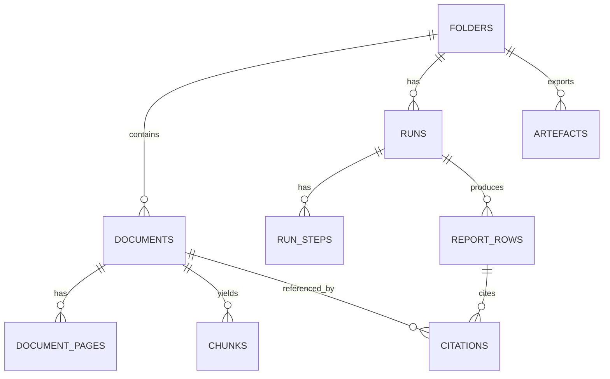
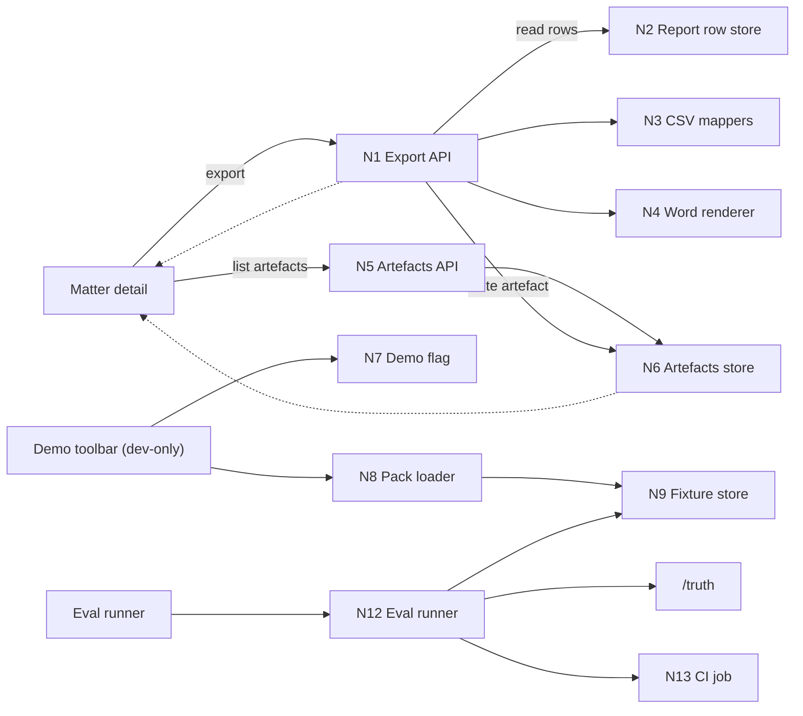
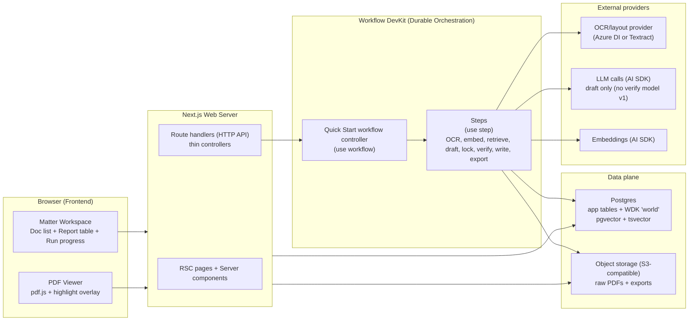
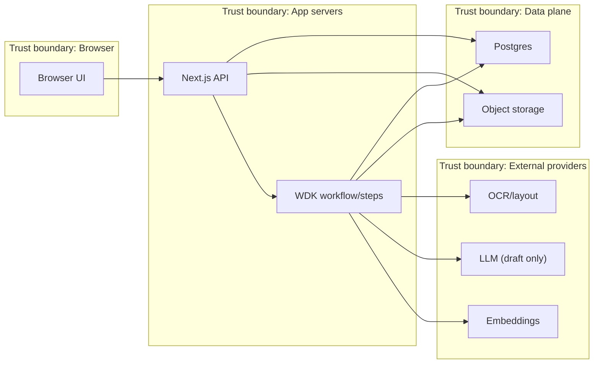
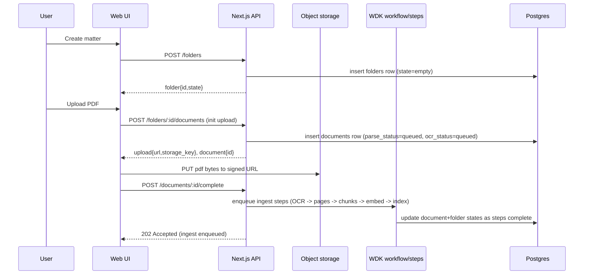
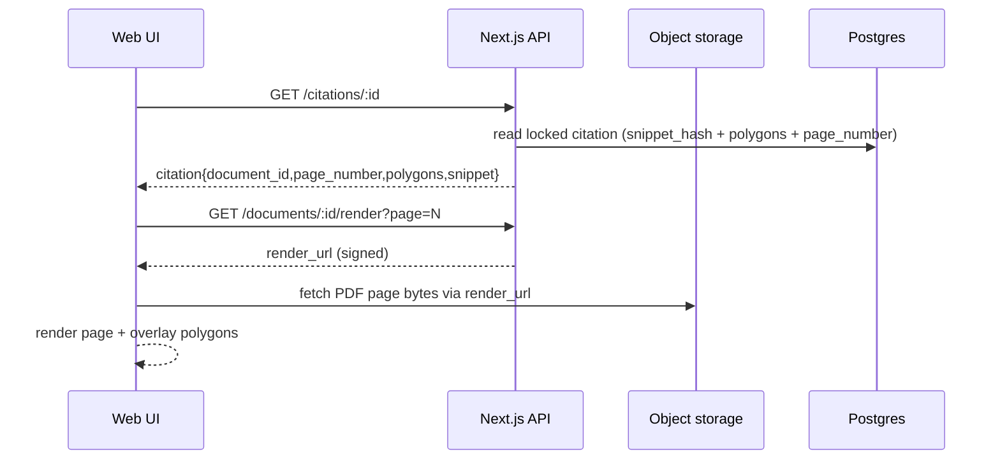

<file_map>
/Users/marc/Code/personal-projects/legaltech-poc
├── docs
│   ├── 03-architecture
│   │   ├── 00_overview.md *
│   │   ├── 05_tech_stack_and_dev_workflow.md *
│   │   ├── 06_frameworks_agents_rag_evals.md *
│   │   ├── 10_system_architecture.md *
│   │   ├── 20_state_model.md *
│   │   ├── 30_data_model.md *
│   │   ├── 40_rag_and_agents.md *
│   │   ├── 50_api_surface.md *
│   │   ├── 60_observability_and_evals.md *
│   │   ├── DECISIONS.md *
│   │   ├── .gitkeep
│   │   ├── 01_onboarding_checklist.md
│   │   ├── AGENTS.md
│   │   └── INVESTIGATION.md
│   ├── 04-projects
│   │   ├── 02-features
│   │   │   ├── 0002_quick-start-engine
│   │   │   │   ├── prds
│   │   │   │   │   └── 0002b_row-payload-contract
│   │   │   │   │       └── prd.md *
│   │   │   │   ├── specs
│   │   │   │   │   ├── failure_ux_copy_v0.md *
│   │   │   │   │   ├── list_payload_v0.schema.md *
│   │   │   │   │   └── list_verification_policy_v1.md *
│   │   │   │   ├── ...
│   │   │   ├── 0003_demo-grade-outputs
│   │   │   │   ├── breadboard-pack.md *
│   │   │   │   ├── brief.md *
│   │   │   │   ├── prd.md *
│   │   │   │   ├── risk-register.md *
│   │   │   │   ├── spike-investigation.md *
│   │   │   │   ├── ...
│   │   │   ├── 0004_csv-export
│   │   │   │   ├── prd.md *
│   │   │   │   ├── ...
│   │   │   ├── 0005_word-export
│   │   │   │   ├── prd.md *
│   │   │   │   ├── ...
│   │   │   ├── 0006_eval-harness
│   │   │   │   ├── prd.md *
│   │   │   │   ├── ...
│   │   │   ├── 0007_demo-reliability
│   │   │   │   ├── demo-checklist.md *
│   │   │   │   ├── prd.md *
│   │   │   │   ├── ...
│   │   │   ├── 0001_trust-substrate
│   │   │   │   └── ...
│   │   │   └── .gitkeep
│   │   ├── 01-experiments-prototypes
│   │   │   └── .gitkeep
│   │   ├── 03-fixes
│   │   │   └── .gitkeep
│   │   ├── 04-refactors
│   │   │   └── .gitkeep
│   │   ├── 05-migrations
│   │   │   └── .gitkeep
│   │   ├── _templates
│   │   │   ├── .gitkeep
│   │   │   ├── README.md
│   │   │   ├── breadboard.md
│   │   │   ├── json-prd.schema.json
│   │   │   ├── pack.md
│   │   │   ├── prd.md
│   │   │   ├── release-checklist.md
│   │   │   └── spike-plan.md
│   │   ├── .gitkeep
│   │   ├── AGENTS.md
│   │   └── README.md
│   ├── 00-strategy
│   │   ├── initiatives
│   │   │   ├── 001-003_dependency_plan.md
│   │   │   ├── 001-003_handoff.md
│   │   │   ├── 001-trust-substrate.md
│   │   │   ├── 002-quick-start-engine.md
│   │   │   ├── 003-polishing-for-demo-and-non-func-hardening.md
│   │   │   ├── initiative-overview-001-002-003.md
│   │   │   └── prd-slicing-rules.md
│   │   ├── opportunity-solution-tree.md
│   │   ├── product-principles.md
│   │   ├── product-strategy-1-pager.md
│   │   ├── product-strategy-detailed.md
│   │   ├── roadmap.md
│   │   └── segmentation-notes.md
│   ├── 01-insights
│   │   ├── capabilities
│   │   │   ├── .gitkeep
│   │   │   ├── PoC-architecture-brainstorming2_chatGPT.md
│   │   │   ├── PoC-architecture-brainstorming3_claude.md
│   │   │   ├── PoC-architecture-brainstorming_chatGPT.md
│   │   │   └── README.md
│   │   ├── competitors
│   │   │   ├── .gitkeep
│   │   │   ├── competitor_overview_chatGPT.md
│   │   │   └── competitor_overview_claude.md
│   │   ├── customers
│   │   │   ├── product-metrics
│   │   │   │   └── ...
│   │   │   ├── user-calls
│   │   │   │   └── ...
│   │   │   └── .gitkeep
│   │   ├── tech-and-market
│   │   │   ├── .gitkeep
│   │   │   └── US-CRE-due-diligence_codex.md
│   │   └── .gitkeep
│   ├── 02-guidelines
│   │   ├── archive
│   │   │   ├── brand-preview.html
│   │   │   ├── design-system-v1-warm-light.html
│   │   │   ├── design-system-v2-dark-editorial.html
│   │   │   ├── design-system-v3-orange-energy.html
│   │   │   ├── design-system-v4-soft-cyan.html
│   │   │   ├── design-system-v5-purple-accent.html
│   │   │   └── design-system-v6-earthy-organic.html
│   │   ├── inspiration
│   │   │   ├── brand-dna-2026-02-06
│   │   │   │   └── ...
│   │   │   ├── tailwind
│   │   │   │   └── ...
│   │   │   ├── .gitkeep
│   │   │   ├── README.md
│   │   │   ├── brand_guidelines.md
│   │   │   ├── design_tokens.json
│   │   │   └── prompt_library.json
│   │   ├── .gitkeep
│   │   ├── AGENTS.md
│   │   ├── brand-guidelines.md
│   │   ├── brand-tone.md
│   │   └── design-system-final-v1.html
│   ├── 05-reviews-audits
│   │   ├── .gitkeep
│   │   └── governance.md
│   ├── 06-release
│   │   ├── postmortems
│   │   │   └── .gitkeep
│   │   ├── .gitkeep
│   │   ├── AGENTS.md
│   │   └── CHANGELOG.md
│   ├── 08-example-data
│   │   ├── pack_01_clean
│   │   │   ├── docs
│   │   │   │   └── ...
│   │   │   ├── layout
│   │   │   │   └── ...
│   │   │   ├── truth
│   │   │   │   └── ...
│   │   │   └── manifest.json
│   │   ├── pack_02_missing_rea
│   │   │   ├── docs
│   │   │   │   └── ...
│   │   │   ├── layout
│   │   │   │   └── ...
│   │   │   ├── truth
│   │   │   │   └── ...
│   │   │   └── manifest.json
│   │   ├── pack_03_mismatch_and_cert_gap
│   │   │   ├── docs
│   │   │   │   └── ...
│   │   │   ├── layout
│   │   │   │   └── ...
│   │   │   ├── truth
│   │   │   │   └── ...
│   │   │   └── manifest.json
│   │   ├── pack_04_multi_parcel
│   │   │   ├── docs
│   │   │   │   └── ...
│   │   │   ├── layout
│   │   │   │   └── ...
│   │   │   ├── truth
│   │   │   │   └── ...
│   │   │   └── manifest.json
│   │   ├── pack_05_partial_release
│   │   │   ├── docs
│   │   │   │   └── ...
│   │   │   ├── layout
│   │   │   │   └── ...
│   │   │   ├── truth
│   │   │   │   └── ...
│   │   │   └── manifest.json
│   │   ├── pack_06_overlapping_easements
│   │   │   ├── docs
│   │   │   │   └── ...
│   │   │   ├── layout
│   │   │   │   └── ...
│   │   │   ├── truth
│   │   │   │   └── ...
│   │   │   └── manifest.json
│   │   ├── pack_07_scans_rotated_low_quality
│   │   │   ├── docs
│   │   │   │   └── ...
│   │   │   ├── layout
│   │   │   │   └── ...
│   │   │   ├── truth
│   │   │   │   └── ...
│   │   │   └── manifest.json
│   │   ├── pack_08_defined_terms_and_cross_refs
│   │   │   ├── docs
│   │   │   │   └── ...
│   │   │   ├── layout
│   │   │   │   └── ...
│   │   │   ├── truth
│   │   │   │   └── ...
│   │   │   └── manifest.json
│   │   ├── pack_09_bad_citation
│   │   │   ├── docs
│   │   │   │   └── ...
│   │   │   ├── layout
│   │   │   │   └── ...
│   │   │   ├── produced
│   │   │   │   └── ...
│   │   │   ├── truth
│   │   │   │   └── ...
│   │   │   └── manifest.json
│   │   ├── README.md
│   │   ├── packs_summary.csv
│   │   └── packs_summary.md
│   ├── 96-engineering-tutor-learnings
│   │   ├── 2026-02-06_brand-dna-web-app-design-language.md
│   │   ├── 2026-02-07_orbital-architecture-decisions-and-overview.md
│   │   └── 2026-02-07_trust-substrate-verification-overrides-and-rh2-fallbacks.md
│   ├── 98-tmp
│   │   ├── 2026-02-06_infra-investigation
│   │   │   ├── README.md
│   │   │   ├── deployment.md
│   │   │   ├── llm-gateways.md
│   │   │   ├── ocr.md
│   │   │   ├── oracle_bundles.md
│   │   │   ├── recommended-stack.md
│   │   │   └── storage.md
│   │   ├── handoffs
│   │   │   └── handoff_2026-02-06_17-35-25_shape-split-commits.md
│   │   ├── oracle
│   │   │   └── oracle-bundles
│   │   │       └── ...
│   │   ├── .gitkeep
│   │   ├── README.md
│   │   ├── oracle-03-architecture-review-manual.md
│   │   └── oracle-prompt_trust-substrate_2026-02-07_v2.md
│   ├── 99-archive
│   │   └── .gitkeep
│   ├── AGENTS.md
│   └── LEARNINGS.md
├── .agents
│   ├── hooks
│   │   ├── git
│   │   │   ├── commit-msg
│   │   │   ├── post-merge
│   │   │   ├── pre-commit
│   │   │   ├── pre-push
│   │   │   └── prepare-commit-msg
│   │   └── README.md
│   ├── skills
│   │   ├── 00-utilities
│   │   │   ├── agent-browser
│   │   │   │   └── ...
│   │   │   ├── agentation
│   │   │   │   └── ...
│   │   │   ├── ask-questions-if-underspecified
│   │   │   │   └── ...
│   │   │   ├── beautiful-mermaid
│   │   │   │   └── ...
│   │   │   ├── brand-dna-extractor
│   │   │   │   └── ...
│   │   │   ├── browser-use
│   │   │   │   └── ...
│   │   │   ├── commit
│   │   │   │   └── ...
│   │   │   ├── create-cli
│   │   │   │   └── ...
│   │   │   ├── dev-browser
│   │   │   │   └── ...
│   │   │   ├── docs-list
│   │   │   │   └── ...
│   │   │   ├── engineering-tutor
│   │   │   │   └── ...
│   │   │   ├── every-style-editor
│   │   │   │   └── ...
│   │   │   ├── file-todos
│   │   │   │   └── ...
│   │   │   ├── firecrawl
│   │   │   │   └── ...
│   │   │   ├── framework-docs-researcher
│   │   │   │   └── ...
│   │   │   ├── handoff
│   │   │   │   └── ...
│   │   │   ├── landpr
│   │   │   │   └── ...
│   │   │   ├── markdown-converter
│   │   │   │   └── ...
│   │   │   ├── nano-banana-pro
│   │   │   │   └── ...
│   │   │   ├── openai-image-gen
│   │   │   │   └── ...
│   │   │   ├── oracle
│   │   │   │   └── ...
│   │   │   ├── parallel-web-tools
│   │   │   │   └── ...
│   │   │   ├── pickup
│   │   │   │   └── ...
│   │   │   └── video-transcript-downloader
│   │   │       └── ...
│   │   ├── 02-shape
│   │   │   ├── breadboarding
│   │   │   │   └── ...
│   │   │   ├── brief
│   │   │   │   └── ...
│   │   │   ├── create-json-prd
│   │   │   │   └── ...
│   │   │   ├── create-prd
│   │   │   │   └── ...
│   │   │   ├── spike-investigation
│   │   │   │   └── ...
│   │   │   └── wf-shape
│   │   │       └── ...
│   │   ├── 03-plan
│   │   │   ├── best-practices-researcher
│   │   │   │   └── ...
│   │   │   ├── bug-reproduction-validator
│   │   │   │   └── ...
│   │   │   ├── deepen-plan
│   │   │   │   └── ...
│   │   │   ├── plan-review
│   │   │   │   └── ...
│   │   │   ├── repo-research-analyst
│   │   │   │   └── ...
│   │   │   ├── reproduce-bug
│   │   │   │   └── ...
│   │   │   ├── spec-flow-analyzer
│   │   │   │   └── ...
│   │   │   ├── triage
│   │   │   │   └── ...
│   │   │   └── wf-plan
│   │   │       └── ...
│   │   ├── 04-develop
│   │   │   ├── 00-frontend-general
│   │   │   │   └── ...
│   │   │   ├── 01-ui-skills-dot-com
│   │   │   │   └── ...
│   │   │   ├── pr-comment-resolver
│   │   │   │   └── ...
│   │   │   ├── use-ai-sdk
│   │   │   │   └── ...
│   │   │   ├── verify
│   │   │   │   └── ...
│   │   │   ├── wf-develop
│   │   │   │   └── ...
│   │   │   └── wf-ralph
│   │   │       └── ...
│   │   ├── 05-review
│   │   │   ├── agent-native-architecture
│   │   │   │   └── ...
│   │   │   ├── agent-native-reviewer
│   │   │   │   └── ...
│   │   │   ├── architecture-strategist
│   │   │   │   └── ...
│   │   │   ├── code-simplicity-reviewer
│   │   │   │   └── ...
│   │   │   ├── data-integrity-guardian
│   │   │   │   └── ...
│   │   │   ├── data-migration-expert
│   │   │   │   └── ...
│   │   │   ├── git-history-analyzer
│   │   │   │   └── ...
│   │   │   ├── kieran-python-reviewer
│   │   │   │   └── ...
│   │   │   ├── kieran-typescript-reviewer
│   │   │   │   └── ...
│   │   │   ├── pattern-recognition-specialist
│   │   │   │   └── ...
│   │   │   ├── performance-oracle
│   │   │   │   └── ...
│   │   │   ├── security
│   │   │   │   └── ...
│   │   │   ├── security-sentinel
│   │   │   │   └── ...
│   │   │   ├── test-browser
│   │   │   │   └── ...
│   │   │   └── wf-review
│   │   │       └── ...
│   │   ├── 06-release
│   │   │   ├── changelog
│   │   │   │   └── ...
│   │   │   ├── deployment-verification-agent
│   │   │   │   └── ...
│   │   │   └── wf-release
│   │   │       └── ...
│   │   ├── 07-compound
│   │   │   └── compound-docs
│   │   │       └── ...
│   │   ├── 10-audit
│   │   │   └── agent-native-audit
│   │   │       └── ...
│   │   └── 98-skill-maintenance
│   │       ├── create-agent-skills
│   │       │   └── ...
│   │       ├── heal-skill
│   │       │   └── ...
│   │       ├── modular-skills-architect
│   │       │   └── ...
│   │       └── skill-creator
│   │           └── ...
│   └── register.json
├── apps
│   └── web
│       ├── app
│       │   ├── (api)
│       │   │   └── ...
│       │   ├── (app)
│       │   │   └── ...
│       │   ├── globals.css
│       │   ├── layout.tsx +
│       │   └── page.tsx +
│       ├── lib
│       │   ├── devOnly.ts +
│       │   └── fixtureSeed.server.ts +
│       ├── types
│       │   └── pdfjs-dist.d.ts
│       ├── .eslintrc.json
│       ├── AGENTS.md
│       ├── next-env.d.ts
│       ├── next.config.js +
│       ├── package.json
│       ├── postcss.config.js +
│       ├── tailwind.config.ts +
│       ├── tsconfig.json
│       └── tsconfig.tsbuildinfo
├── packages
│   ├── core
│   │   ├── src
│   │   │   ├── citations
│   │   │   │   └── ...
│   │   │   ├── geometry
│   │   │   │   └── ...
│   │   │   ├── missing-docs
│   │   │   │   └── ...
│   │   │   ├── spikes
│   │   │   │   └── ...
│   │   │   ├── verify
│   │   │   │   └── ...
│   │   │   ├── index.ts +
│   │   │   ├── safe-error.ts +
│   │   │   └── server.ts +
│   │   ├── package.json
│   │   ├── tsconfig.build.json
│   │   └── tsconfig.json
│   └── .gitkeep
├── scripts
│   ├── db
│   │   └── init.sql
│   ├── fixtures
│   │   ├── lib
│   │   │   ├── args.ts +
│   │   │   ├── csv.ts +
│   │   │   ├── fs.ts +
│   │   │   ├── geometry.ts +
│   │   │   └── snapshot.ts +
│   │   ├── README.md
│   │   ├── assert_row_invariants.ts +
│   │   ├── compare_truth.ts +
│   │   ├── seed.ts +
│   │   └── verify_pack_names.ts +
│   ├── ast-grep.sh
│   ├── build.sh
│   ├── install_codex_skills_copy.sh
│   ├── install_git_hooks.sh
│   ├── knip.sh
│   ├── lint.sh
│   ├── test.sh
│   ├── typecheck.sh
│   └── verify.sh
├── tmp
│   └── .gitkeep
├── .gitignore
├── AGENTS.md
├── LICENSE
├── README.md
├── docker-compose.yml
├── package.json
├── pnpm-lock.yaml
└── pnpm-workspace.yaml


(* denotes selected files)
(+ denotes code-map available)
Config: depth cap 3.
</file_map>
<file_contents>
File: /Users/marc/Code/personal-projects/legaltech-poc/docs/03-architecture/00_overview.md
```md
# Orbital Copilot PoC Architecture
US CRE Title + Survey Quick Start (evidence-first, artefact-first)

## Purpose
Define a production-minded (but PoC-sized) architecture for a law-firm workflow that ingests a US CRE diligence pack and produces defensible artefacts with clause-level evidence.

Optimised for:
- Title commitment (Schedule A / B-I / B-II)
- Exception instruments (easements, REAs, CC&Rs, mortgages, plats)
- ALTA/NSPS survey (draft or final)
- Trust UX: click citation → see highlighted evidence in the PDF

## Product scope (what we will build)
A matter workspace that supports:
1) Upload + ingest a doc pack (PDF-first)
2) Run “Quick Start: Title + Survey”
3) Generate 3 artefacts (as report tables first, export later):
   - Schedule B-I Requirements tracker
   - Schedule B-II Exceptions table (linked to underlying instruments)
   - Survey reconciliation issues list (title ↔ survey)

Every material claim must have citations or “Not found in provided documents.”

## Non-goals (explicit)
- No legal advice / materiality decisions / negotiation posture
- No external web research inside the PoC run
- No integrations (iManage/NetDocs/SharePoint)
- No multi-tenant admin, SSO/RBAC, billing
- No property visualiser / boundary plotting (stretch only)

## Key architectural decisions (PoC defaults)
- Evidence-first with citation locking: citations are IDs, not free text
- Fail-closed verification: citation mismatch → row is `citation_failed`
- Artefacts-first UX: report table is the centre of gravity
- OCR/layout for all PDFs (PoC default): consistent geometry for highlights
- Deterministic page-bounded chunking + `index_version` bump rules (ADR-0015)
- File-backed, immutable question sets with run pinning (ADR-0016)
- Hybrid retrieval (RAG): lexical + vector search, rerank, then draft from evidence
- Deterministic-ish orchestration: explicit step machine, not free-running agents
- Fixture-driven reliability: synthetic packs + truth files used in CI-style evals
- Verification v1 is integrity-only (no entailment model) (ADR-0017)

Canonical ADRs for these defaults live in `docs/03-architecture/DECISIONS.md` (append-only).

## Where RAG fits
RAG is the engine inside Quick Start:
- Ingestion creates canonical page text + geometry, then chunks + indexes
- Retrieval returns chunk IDs (hybrid lexical + vector)
- Drafting uses only retrieved evidence
- Verification locks citations and fails closed on integrity/invariant failures. Semantic correctness is a reviewer responsibility in v1 (ADR-0017).

## Where evals fit
Evals are first-class because trust is the product:
- Compare outputs against `/truth` in the synthetic packs
- Validate citation integrity (hash + page + geometry)
- Spot retrieval misses and false passes before demos

## Tech stack and framework choices
See:
- `docs/03-architecture/05_tech_stack_and_dev_workflow.md` for stack, dev workflow, and fixtures
- `docs/03-architecture/06_frameworks_agents_rag_evals.md` for framework options and why we chose Workflow DevKit

## Security and data handling (PoC, explicit)
- Raw PDFs are stored in object storage; extracted text + geometry are stored in Postgres (sensitive).
- OCR/LLM/embeddings calls may transmit document content to third-party providers; this must be disclosed and gated by config.
- Client responses never include provider payloads or stack traces (safe error envelope).
- Internal logs should include `trace_id` + stack traces for unexpected failures, but must not include raw PDFs or full extracted text. Prefer IDs + hashes.

## Open decisions to pin (before implementation)
These should become explicit (ideally as ADRs) before we build the relevant slices:
- Embeddings: model + dimension (and index parameters) to treat as the default for fixtures/evals.
- Auth posture for the PoC: what is (and is not) protected in demo environments.
- Data handling posture: retention, provider data policies, telemetry redaction defaults.

```

File: /Users/marc/Code/personal-projects/legaltech-poc/docs/04-projects/02-features/0006_eval-harness/prd.md
```md
# PRD: Fixture-Driven Eval Harness (Hard Gates + Reports)

Owner: TBD
Status: DRAFT (GO: spike outcomes locked; pack_09_bad_citation added)
Date: 2026-02-07

## Summary

Create a lightweight, deterministic eval harness that:
- runs against in-repo fixture packs with `/truth`
- produces per-pack **JSON** + **Markdown** eval reports
- computes and enforces PoC hard gates:
  - schema validity
  - citation integrity
  - expected failure journeys
  - export truth match (CSV outputs match `/truth`)

Optionally wire a report-only CI job that uploads the reports as build artefacts.

## Problem

The PoC’s trust posture depends on deterministic regression detection. Without fixture-driven evals, we will repeatedly discover citation/retrieval regressions during demos.

## Goals

- `fixture:eval` produces per-pack reports (JSON + Markdown) for:
  - `docs/08-example-data/pack_01_clean`
  - `docs/08-example-data/pack_02_missing_rea`
  - `docs/08-example-data/pack_09_bad_citation`
- Hard gates align with `docs/03-architecture/60_observability_and_evals.md` (plus export determinism for Initiative 0003):
  1) schema validity (100%)
  2) citation integrity (100%)
  3) expected failure journeys (must fail in the expected way)
  4) export truth match (CSV outputs match `/truth`)
- Runner exits non-zero when any hard gate fails (relative to the pack’s expected outcomes).
- Failure outputs use the canonical failure taxonomy codes.

## Non-goals

- Complex scoring models, dashboards, or “quality” judgement beyond the hard gates.
- Orchestrating ingestion + running workflows inside CI as part of the first slice (keep CI report-only and fast).

## Users

- Developers: need fast feedback loops when changing OCR/chunking/retrieval/verification.
- Demo operator: needs confidence the demo packs still pass.

## Solution

Implement the fixture-driven eval harness described in:
- `docs/03-architecture/60_observability_and_evals.md`
- `docs/03-architecture/06_frameworks_agents_rag_evals.md`
- ADR-0006 in `docs/03-architecture/DECISIONS.md`

Key design constraints:
- Deterministic outputs for a given pack and produced run outputs.
- Citation integrity uses the canonical `snippet_hash` normalization rule from `docs/03-architecture/30_data_model.md`.
- PoC default: **snapshot-first**. For v1, `fixture:eval` reads file snapshots under each pack’s `/produced/` directory (no DB required). A DB-backed mode can be added later as an optional integration test.

## Scope

In scope:
- Implement `fixture:eval` (script/command name per repo conventions) that:
  - reads produced outputs for a pack from `/produced` snapshots (at minimum: report rows + citations)
  - compares against `/truth`
  - emits:
    - per-pack JSON report
    - per-pack Markdown summary
    - cross-pack summary table
  - returns non-zero exit code when hard gates fail
- Fixture pack `pack_09_bad_citation` under `docs/08-example-data/`:
  - minimally:
    - `/docs/` smallest PDF set required for the pack
    - `/truth/expected_failure_journeys.json` identifying at least one `question_id` expected to be `citation_failed`
    - `/truth/expected_*.csv` files as required by export truth match (can be minimal/empty but must exist)
    - `/produced/report_rows.json` containing at least one row with `status="citation_failed"` and a safe failure reason code
    - `/produced/documents.json` with filenames + page_count so citation checks can validate bounds
    - `/produced/citations.json` if any produced rows reference citations
- Metrics included in the report:
  - hard gates (pass/fail + counts)
  - failure taxonomy counts (aligned to `docs/03-architecture/60_observability_and_evals.md`)
- Optional: CI wiring (report-only) that uploads the JSON/MD outputs as build artefacts.

Out of scope:
- Gating CI on recall thresholds in the first pass (report-only first).
- Automated model calls inside evals beyond what is required to read persisted outputs.

## Breadboard Mapping

From `docs/04-projects/02-features/0003_demo-grade-outputs/breadboard-pack.md`:
- Parts: F6 (eval harness), F7 (CI integration)
- Code affordances: N12, N13

## User Stories

### US-001 Run Fixture Evals Locally
As a developer, I can run `fixture:eval` for a pack and get a deterministic report so I can catch regressions before demos.

### US-002 Enforce Hard Trust Gates
As a developer, I get a clear pass/fail on schema validity, citation integrity, failure journeys, and export truth match so we never ship a broken trust moment.

### US-003 Publish Eval Reports In CI (Report-Only)
As a developer, CI uploads eval reports so reviewers can see regressions without running the harness locally.

## Acceptance Criteria

- AC-001: `fixture:eval pack_01_clean` produces per-pack JSON + Markdown reports and a summary table.
- AC-002: `fixture:eval pack_02_missing_rea` produces reports and confirms expected `missing_input` journeys (answer must be exactly `Not found in provided documents.`).
- AC-003: `fixture:eval pack_09_bad_citation` produces reports and confirms the expected `citation_failed` journey (including a safe failure reason code in provenance / report details).
- AC-004: Citation integrity checks validate (at minimum):
  - cited page exists
  - polygons exist
  - `snippet_hash` matches canonical normalization rule
- AC-005: Export truth match validates that generated CSV outputs match `/truth/expected_*.csv` (normalising line endings to LF), including locked header order and deterministic row ordering.
- AC-006: Runner exits non-zero if any hard gate fails for any pack.
- AC-007 (optional CI): CI job runs evals and uploads JSON/MD reports as build artefacts, but does not block merges beyond hard gates until explicitly enabled.

## Verification Plan

- Run locally on the 3 packs and inspect outputs:
  - JSON schema is stable and machine-readable
  - Markdown summary is human-scannable
- Validate taxonomy codes match `docs/03-architecture/60_observability_and_evals.md`.
- Confirm `snippet_hash` normalization matches `docs/03-architecture/30_data_model.md` (no duplicate implementations).

## Risks

- Eval runtime too slow and gets ignored (RH9).
- Citation integrity checks become flaky if underlying storage/polygons are unstable (RH8).

## Open Questions

- None for slice 0006 (spike outcomes locked).
- Remaining work: wire `fixture:eval` to read pack snapshots under `/produced` and assert failure journeys from `/truth/expected_failure_journeys.json`.

## Links

- `docs/04-projects/02-features/0003_demo-grade-outputs/brief.md`
- `docs/04-projects/02-features/0003_demo-grade-outputs/breadboard-pack.md`
- `docs/03-architecture/30_data_model.md`
- `docs/03-architecture/60_observability_and_evals.md`
- `docs/03-architecture/06_frameworks_agents_rag_evals.md`
- `docs/03-architecture/DECISIONS.md` (ADR-0006)

```

File: /Users/marc/Code/personal-projects/legaltech-poc/docs/04-projects/02-features/0002_quick-start-engine/specs/list_verification_policy_v1.md
```md
# List Verification Policy v1 (Initiative 0002)

This doc pins the *intended* verification semantics for list-shaped artefact rows (B-I/B-II/issues).
It should be validated and refined by SP-2.11.

ADR-0017 scope note: v1 verification is **integrity-only**. Semantic correctness is a reviewer responsibility.
Runtime entailment checks are out of scope for v1 (future/eval-only).

Constraints:
- Fail-closed posture (ADR-0002): unsupported claims must not survive.
- Immutable locked citations (ADR-0001): once a `citation_id` exists, it is not mutated.
- Row status invariants remain unchanged (`docs/03-architecture/20_state_model.md`).

## Unit of verification

Verify at the **item + field** level (integrity-only):
- Any non-empty scalar field that represents a material claim must have at least one locked citation attached to the same item.
- "Display-only" fields (e.g. `notes`) may be excluded from verification.
- This check does **not** assert semantic correctness or entailment of the claim by the cited text.

## Partial failures (decision pending SP-2.11)

Two viable policies:

1. **Strict policy (simplest):** any failed integrity check => entire row becomes `citation_failed`.
2. **Repair policy (preferred if safe):** verifier is allowed to downgrade or remove unsupported fields/items (e.g. set `item_classification="unknown"`, drop `instrument_no` if unsupported) and re-verify, so the row can remain verifiable without fabricating claims.

SP-2.11 should choose one policy explicitly and record:
- what counts as a "material claim"
- how downgrades are represented in `payload_json`
- how provenance records downgrade/repair actions (safe reason codes)

## Required provenance (minimum)

When verification runs, provenance must include (safe):
- verifier implementation version (e.g. git SHA) + mode (e.g. `deterministic-only`)
- verdict (`pass|fail`)
- reason code on failure (`CITATION_MISMATCH`, `MISSING_CITATION`, etc)
- optional downgrade/repair actions taken (if policy 2 is chosen)

```

File: /Users/marc/Code/personal-projects/legaltech-poc/docs/03-architecture/30_data_model.md
```md
# Data model (Postgres + pgvector)

This is the canonical DB shape for the PoC “trust spine”: ingest → retrieve → draft → verify → report rows with locked citations.

Design rules (PoC)
- Postgres is the source of truth for state and auditability (ADR-0011 accepted).
- Prefer append-only records for "what happened" (runs, steps, report_rows, citations, artefacts).
- Citations are immutable once created (ADR-0001).
- Retrieval substrate is versioned. A new ingest/re-index bumps `folders.latest_index_version` and produces new `chunks` rows for that version.
- Everything that materially affects outputs should be pinnable on a run: `index_version`, `agent_bundle_version`, `question_set_version` (`docs/03-architecture/20_state_model.md`).

## ERD


## Encoding conventions (recommended)
- IDs are opaque strings (optionally prefixed, eg `fld_`, `doc_`, `run_`, `row_`, `cit_`).
- Timestamps are `timestamptz` in UTC.
- JSON columns are `jsonb` and must be "safe": no provider payload dumps, no stack traces, no raw PDF bytes.
- Arrays should be explicit JSON arrays; avoid comma-separated strings.

## Data sensitivity (explicit)
This system stores extracted document text in Postgres (e.g. `document_pages.text`, `chunks.text`, `citations.snippet`) and raw PDFs in object storage.
Treat both as confidential customer data.

Minimum PoC posture:
- Encrypt storage and database volumes at rest where possible.
- Backups are sensitive (DB dumps contain extracted text).
- Do not log raw extracted text or raw PDF bytes.
- Provider calls (OCR/LLM/embeddings) may transmit document content externally; disclose and gate by config.

## Trust spine tables (minimum viable)

### `folders`
- `id`, `name`, `state`, `created_at`, `updated_at`
- `latest_index_version` (string; bumps on re-ingest/re-index)

Recommended constraints:
- `state` should be constrained to the folder state machine values (`docs/03-architecture/20_state_model.md`).

### `documents`
- `id`, `folder_id`, `filename`, `mime`, `bytes`
- `sha256` (dedupe), `storage_key`, `page_count`
- `parse_status`, `ocr_status`, `extraction_quality`
- `metadata_json` (jsonb; safe document metadata for provenance and evals)
- `error_json` (safe ingest failure details)

Recommended constraints:
- FK `documents.folder_id -> folders.id` (ON DELETE CASCADE or RESTRICT; choose intentionally).
- Unique `(documents.folder_id, documents.sha256)` to avoid duplicates within a matter.
  - Recommended `documents.metadata_json` fields (PoC):
    - `extraction_quality_method` (string; versioned name of the quality scoring method used)

### `document_pages`
- `id`, `document_id`, `page_number`
- `text` (canonical)
- `layout_json` (tokens/lines/blocks + polygons)

Recommended constraints:
- FK `document_pages.document_id -> documents.id`.
- Unique `(document_pages.document_id, document_pages.page_number)`.

### `chunks`
- `id`, `document_id`
- `index_version` (string; matches `folders.latest_index_version` at time of build)
- `page_start`, `page_end`, `chunk_index`
- `text`, `metadata_json`, `tsv`, `embedding`
- `text_hash` (hash of `chunks.text` using the canonical hashing rule below)

Notes:
- `tsv` is the lexical index (tsvector). Consider a generated column if you want to avoid drift.
- `embedding` is a pgvector column. It must match the chosen embedding model dimension (open decision; pin in fixtures/evals).
- In PoC v1, citation locking uses `chunks.text` as the citation snippet by default, so `citations.snippet_hash` will usually equal `chunks.text_hash`.
- Chunking rules and required metadata fields are pinned in ADR-0015.

Recommended constraints:
- FK `chunks.document_id -> documents.id`.
- Unique `(chunks.document_id, chunks.index_version, chunks.chunk_index)`.

### `runs`
- `id`, `folder_id`, `type`, `state`
- `index_version` (pins retrieval substrate used by the run)
- `agent_bundle_version` (pins prompts + schemas)
- `question_set_version` (pins the exact question set used by the run; required for “completed” invariants)
- timestamps + `error_json` (safe failure details)

Recommended constraints:
- FK `runs.folder_id -> folders.id`.
- `state` constrained to the run state machine (`docs/03-architecture/20_state_model.md`).
- Consider a partial index for "latest run per folder" queries.

### `run_steps`
- `id`, `run_id`, `step_type`, `state`, `attempt`
- `step_key` (deterministic idempotency key; eg `ingest:doc_123:ocr` or `quick_start:BII-01:verify`)
- `metrics_json`, `error_json`
- timestamps

Recommended constraints:
- FK `run_steps.run_id -> runs.id`.
- Unique `(run_steps.run_id, run_steps.step_key)` so retries short-circuit safely.
- `state` constrained to the step state machine (`docs/03-architecture/20_state_model.md`).

### `report_rows`
- `id`, `folder_id`, `run_id`, `question_id`, `question`
- `answer`, `status`, `notes`
- `payload_schema_version` (string, nullable; e.g. `list_payload_v0`)
- `payload_json` (jsonb, nullable; structured row payload for list-shaped artefacts)
- `provenance_json` (minimum: retrieved chunk IDs + scores, models + prompt hashes, verification verdict + reason codes)
- timestamps

Recommended constraints:
- FK `report_rows.run_id -> runs.id`.
- FK `report_rows.folder_id -> folders.id`.
- Unique `(report_rows.run_id, report_rows.question_id)`.
- `status` constrained to the report row statuses (`docs/03-architecture/20_state_model.md`).

### `citations`
Citations are **locked** and **immutable** once created. They store enough to highlight evidence without re-running retrieval or re-reading chunks.
- `id`, `report_row_id`
- `chunk_id` (nullable; stored for debugging/replay)
- `document_id`, `page_number`
- `polygons`, `snippet`, `snippet_hash`
- `index_version` (string; pins the chunking/indexing version the citation came from)
- timestamps

Recommended constraints:
- FK `citations.report_row_id -> report_rows.id`.
- FK `citations.document_id -> documents.id`.
- `snippet_hash` is required and must be computed with the canonical rule below.
- **Invariant:** exportable citations MUST include valid `polygons`. Missing/invalid polygons fail closed and must set `citation_failed`.

#### Citation polygon coordinate system (polygons)
`citations.polygons` is a list of polygons. Each polygon is a list of points `[x, y]`.

Canonical coordinate space (PoC v1):
- Points are **normalised floats** in the range `[0..1]`.
- Origin is **top-left** of the PDF page’s **viewBox**.
- `x` increases to the right, `y` increases down.
- Points are ordered clockwise (recommended; not required for rendering).
- This coordinate space is independent of zoom. Rendering applies the current pdf.js viewport transform.

Viewer mapping (pdf.js):
- Let `viewBox = [xMin, yMin, xMax, yMax]` from the pdf.js page.
- Convert a point `[xNorm, yNorm]` to PDF points:
  - `xPdf = xMin + xNorm * (xMax - xMin)`
  - `yPdf = yMax - yNorm * (yMax - yMin)` (invert Y because `yNorm` is top-left origin)
- Convert to viewport pixels:
  - `[xPx, yPx] = viewport.convertToViewportPoint(xPdf, yPdf)`

Validation (fail-closed):
- Every point must be within `[0..1]`.
- Polygons must be non-empty.
- If any validation fails (including missing polygons), treat the citation as invalid and fail closed (`citation_failed`).

### `artefacts`
- `id`, `folder_id`, `type`, `storage_key`
- `source_run_id`, `metadata_json`
- timestamps

Notes:
- Do not persist signed `download_url` values in the DB; persist `storage_key` + metadata and generate fresh signed URLs on demand.
- Recommended `metadata_json` fields (PoC):
  - `kind` (e.g. `requirements_tracker`, `exceptions_table`, `survey_issues`, `memo`)
  - `filename`
  - `schema_version` (for CSVs)
  - `unsafe` / `unsafe_override` (if demo-only unsafe exports are ever allowed)

## Provenance JSON (recommended shape)
`report_rows.provenance_json` should be structured enough to support:
- replay ("what evidence did we use?")
- debugging ("which step failed, why?")
- evals ("what was Recall@K, what was verified?")

Minimal example (shape only; evolve as needed):
```json
{
  "retrieval": {
    "index_version": "v1",
    "query": "List Schedule B-II exceptions...",
    "chunks": [
      { "chunk_id": "chk_123", "score": 12.34 },
      { "chunk_id": "chk_456", "score": 10.98 }
    ]
  },
  "draft": {
    "model": "anthropic/claude-sonnet-4.5",
    "prompt_hash": "sha256:..."
  },
  "lock": {
    "locked_citation_ids": ["cit_123", "cit_124"]
  },
  "verify": {
    "model": "openai/gpt-5",
    "verdict": "pass",
    "reason_code": null
  }
}
```

## Hashing rule (snippet_hash)
We use `snippet_hash` to detect citation drift.

PoC rule:
- `snippet_hash = "sha256:" + sha256_hex(normalise(snippet))`
- `sha256_hex(...)` is lower-case hex.
- Input must be UTF-8 text; hashing is performed on UTF-8 bytes after normalisation.
- `normalise()` must:
  - trim leading/trailing whitespace
  - convert CRLF → LF
  - collapse all whitespace (including newlines/tabs) to a single space

This rule must be implemented once (e.g. in `packages/core/citations`) and reused everywhere.

## Indices and constraints (recommended)
- Unique and FK constraints:
  - unique `(documents.folder_id, documents.sha256)`
  - unique `(report_rows.run_id, report_rows.question_id)`
  - unique `(chunks.document_id, chunks.index_version, chunks.chunk_index)`
  - unique `(run_steps.run_id, run_steps.step_key)`

- Indexing:
  - GIN on `chunks.tsv`
  - pgvector index on `chunks.embedding`
  - index `citations.report_row_id`
  - index `runs.folder_id`
  - index `documents.folder_id`

## Immutability and replay (important)
- `citations` must be treated as immutable after insert. If you need to "fix" a citation, create a new citation and update the report row to reference the new ID (and record why in provenance).
- Chunk drift is handled by versioning: new chunking/indexing should create a new `index_version`, not mutate existing chunks.

```

File: /Users/marc/Code/personal-projects/legaltech-poc/docs/04-projects/02-features/0002_quick-start-engine/prds/0002b_row-payload-contract/prd.md
```md
# PRD: Initiative 0002 (Slice 2) Row Payload Contract + Artefact Table Rendering

Owner:
Status: DRAFT (Blocked until SP-2.7 decision is confirmed)
Date: 2026-02-07
Slug: 0002-s2-row-payload-contract

## Introduction / Overview

### Problem
The Quick Start UX is “artefacts-first”, but the canonical report row model is a flat `{answer, citation_ids[], status}` shell. Without a stable, versioned structured payload contract, we can’t:
- render B-I/B-II/issues as tables deterministically
- diff outputs for evals
- keep item-level evidence honest without inventing new row statuses

### Goal
Introduce a versioned, list-shaped payload contract for artefact rows and make it renderable in the UI from locked citations only.

### Slice
Ship the payload contract + storage + API exposure + UI rendering for list-shaped artefacts.

### Primary Observable Effect
In the report table, list-shaped artefact rows render as tables backed by structured `payload_json` (not prose parsing), with item-level citations that jump-to-evidence.

### In Scope
- A single, stable “list payload v0” schema with:
  - stable `item_id`
  - item-level `citation_ids[]`
  - optional item-level states (`match_status`, `item_classification`) that do not change report-row statuses
  - canonical schema doc: `docs/04-projects/02-features/0002_quick-start-engine/specs/list_payload_v0.schema.md`
- Storage + versioning for structured payload (see Decision below)
- API returns payload + schema version alongside the existing row shell
- UI renders artefact tables from payload (table view + row drawer)

## Decision (proposed for this slice)

Implement Option 4 from SP-2.7:
- Add `report_rows.payload_json` (JSONB) and `report_rows.payload_schema_version` (string)
- Keep `report_rows.answer` as a human-readable summary string
- Keep `report_rows.provenance_json` as debug-only (do not rely on it as a product contract)

If this decision changes during SP-2.7, update this PRD accordingly before implementation.

## Goals

- List-shaped artefacts can be rendered deterministically from structured payload (no prose parsing).
- Payload is stable and versioned for eval comparators and UI.
- Item-level evidence is honest: unsupported fields/items are downgraded (no fabrication).

## User Stories

### US-001: Artefact rows have a versioned list payload
As a user, I want B-I/B-II/issues to be structured so that the UI can render them as tables and evals can compare them reliably.

#### Acceptance Criteria
- AC-001: Artefact rows include `payload_schema_version = "list_payload_v0"` and `payload_json.items[]`.
- AC-002: Each item has a stable `item_id` and item-level `citation_ids[]` for any claimed fields.
- AC-003: Item-level states (e.g. `match_status`, `depicted/not_depicted/unknown`) do not invent new report-row statuses.

#### Verification
- Packs: `pack_01_clean` (seeded payload acceptable for this slice)
- Automated: Zod schema validation for payload_json; JSON round-trip stability.

### US-002: UI renders artefact tables from payload and locked citations
As a user, I can view B-I/B-II/issues as tables, open a row drawer, and click citations to jump to evidence.

#### Acceptance Criteria
- AC-004: UI renders artefact rows from `payload_json` only (no parsing `answer` prose).
- AC-005: Clicking an item’s citation chip uses locked citations (`GET /citations/:id`) and highlights evidence in the viewer (dependency: Initiative 0001).
- AC-006: If payload is missing or invalid, UI shows a safe error state (no internal leak) and the row remains inspectable.

#### Verification
- Manual: seeded fixture run shows tables render; citations click-to-highlight.

## Functional Requirements

- FR-001: Payload schemas live in `packages/core/schemas` (Zod) and are validated at the step boundary (see `docs/03-architecture/06_frameworks_agents_rag_evals.md`).
- FR-002: Add DB columns `report_rows.payload_json` (JSONB) and `report_rows.payload_schema_version` (string).
- FR-003: `GET /folders/:id/report?run_id=...` includes payload fields (nullable) in each row response, without breaking existing clients.
- FR-004: Item-level citations are locked `citation_id`s only; no chunk IDs are exposed to the UI (ADR-0001).
- FR-005: Error handling uses the standard error envelope with `trace_id` (ADR-0008).

## Non-Goals (Out of Scope)

- Defining the final set of fields for each artefact (that’s owned by parsing/matching/survey slices and truth comparators).
- Any human-in-the-loop editing or mutation of row content.

## Failure States & UX

- Invalid payload schema: show “row payload invalid” banner with safe `error.code=INTERNAL` and `trace_id`.
- Missing payload for an artefact row: show “payload not available yet” guidance; do not attempt prose parsing.

## Metrics / Logging

- Count of payload schema validation failures (hard gate in evals).
- UI render failures by payload_schema_version (should be 0 for v0).

## Rollback / Disable Plan

- Feature flag: `artefact_table_rendering_enabled` (default off until seeded payload renders correctly).

## Sources

- SP-2.7: `docs/04-projects/02-features/0002_quick-start-engine/spike-investigation.md`
- State invariants: `docs/03-architecture/20_state_model.md`
- API contract: `docs/03-architecture/50_api_surface.md`
- Evidence-first ADRs: `docs/03-architecture/DECISIONS.md` (ADR-0001, ADR-0002)

```

File: /Users/marc/Code/personal-projects/legaltech-poc/docs/04-projects/02-features/0004_csv-export/prd.md
```md
# PRD: CSV Exports + Artefacts List (Requirements / Exceptions / Survey Issues)

Owner: TBD
Status: DRAFT (GO: spike outcomes locked; remaining dependency is Initiative 002 structured row payload persistence: payload_json + payload_schema_version)
Date: 2026-02-07

## Summary

Ship demo-grade CSV exports aligned with canonical architecture contracts:
- 1-click exports for:
  - `requirements_tracker.csv`
  - `exceptions_table.csv`
  - `survey_issues.csv`
- Strict export gating (fail-closed) and clear UI blocked/not-ready states.
- Artefact persistence + artefacts list/download via fresh signed URLs.

This PRD does not include Word export, eval harness, or demo tooling.

## Problem

Report rows are trapped in the UI and demos are brittle. We need a repeatable way to export a practitioner-usable artefact and retrieve it later, without undermining the trust posture (fail-closed on `citation_failed`).

## Goals

- A demo operator can export all 3 CSV artefacts from `docs/08-example-data/pack_01_clean`.
- The export is **deterministic** (locked headers + deterministic row ordering).
- Export is only available when `runs.state = completed`.
- Export is blocked by default when any row is `citation_failed` (unless demo-only `unsafe_override=true` is explicitly used).
- Exported artefacts are listed for the matter and downloadable via fresh signed URLs.
- Exports include:
  - row status
  - citations rendered as `filename:page` plus `citation_ids`

## Locked decisions from spikes (2026-02-07)

### CSV schemas v1 (locked headers + ordering)

requirements_tracker.csv headers (v1):
1) requirement_id
2) requirement_text
3) source_question_id
4) row_status
5) source_answer
6) failure_code
7) citations
8) citation_ids
9) notes

exceptions_table.csv headers (v1):
1) exception_id
2) exception_text
3) source_question_id
4) row_status
5) source_answer
6) failure_code
7) citations
8) citation_ids
9) notes

survey_issues.csv headers (v1):
1) issue_id
2) issue_text
3) source_question_id
4) row_status
5) source_answer
6) failure_code
7) citations
8) citation_ids
9) notes

### Deterministic row ordering (locked)

- Sort rows by:
  1) source_question_id asc
  2) *_id asc
  3) citations asc (tie-breaker)
- Citations within a row are rendered as:
  - citations: unique "filename:page" entries sorted by (filename asc, page asc, citation_id asc) and joined with "; "
  - citation_ids: citation IDs sorted asc and joined with "; "

### Export gating + unsafe override (locked)

- runs.state must be completed, else 409 CONFLICT.
- If any row is citation_failed and unsafe_override != true, return EXPORT_BLOCKED.
- unsafe_override=true is demo-only and requires DEMO_MODE + ALLOW_UNSAFE_EXPORTS; otherwise 403 UNAUTHORISED.
- Unsafe exports must be visibly labelled in filename (e.g. requirements_tracker.UNSAFE.csv) and recorded in artefact metadata_json.
- Under unsafe exports, any exported items derived from a citation_failed report row must:
  - have row_status=citation_failed
  - have failure_code populated from provenance
  - have empty citations and citation_ids (do not export untrusted evidence)
  - have notes prefixed with "UNSAFE: "

## Non-goals

- Word export (.docx) (handled in 0005).
- Eval harness + CI integration (handled in 0006).
- Demo reset/delete UI (handled in 0007; slice 1 has no deletion via HTTP).
- Excel formatting beyond CSV.
- Any prose-parsing fallback if `payload_json` is missing (exports must fail closed).

## Users

- Demo operator (internal): needs one-click export + reliable download.
- Practitioner reviewer (friendly): sanity-checks CSV usability via paste/import.

## Solution

Add/implement the canonical export + artefact listing contract:
- `POST /export/csv` with `kind=requirements_tracker|exceptions_table|survey_issues`
- `GET /folders/:id/artefacts` to list/download previously exported artefacts

Exports must not parse prose. CSV mapping consumes structured row payloads persisted by Initiative 002 via `report_rows.payload_schema_version` + `report_rows.payload_json` (see `docs/03-architecture/30_data_model.md`, `docs/03-architecture/50_api_surface.md`).

## Scope

In scope:
- Export endpoint + validation (`kind` support, request Zod boundary validation).
- Export gating:
  - `runs.state = completed` required (else `409 CONFLICT`)
  - if any row in the run is `citation_failed` and `unsafe_override != true`, export is blocked (`EXPORT_BLOCKED`)
  - `unsafe_override = true` is demo-only and requires `DEMO_MODE` + `ALLOW_UNSAFE_EXPORTS` (else `403 UNAUTHORISED`)
- CSV schemas v1 for:
  - `requirements_tracker`
  - `exceptions_table`
  - `survey_issues`
  - Each has locked header list + ordering (from CSV usability spike outcome) and deterministic row ordering rule (documented).
- Artefact persistence:
  - persist `storage_key` + metadata (`kind`, `schema_version`, `filename`, `source_run_id`)
  - do not persist signed URLs
- UI:
  - export buttons for the 3 CSV kinds
  - disabled state until run completes
  - blocked banner state for `EXPORT_BLOCKED`
  - artefacts list with working download links
- Logging: export attempt + success/blocked/failure with `trace_id`.

Out of scope:
- Any destructive reset tooling.

## Breadboard Mapping

From `docs/04-projects/02-features/0003_demo-grade-outputs/breadboard-pack.md`:
- Parts: F1 (export endpoints), F2 (CSV schemas + mappers), F4 (artefacts list), F5 (export UI states)
- Affordances: U1, U2, U4, U5
- Code affordances: N1, N2, N3, N5, N6

## User Stories

### US-001 Export CSV Artefacts
As a demo operator, I can export the requirements tracker, exceptions table, and survey issues CSVs for a completed run so I can share outputs outside the UI.

### US-002 See Blocked/Not-Ready States
As a demo operator, I can clearly see when export is not ready (run still running) or blocked (citation failures) so I don’t create inconsistent artefacts.

### US-003 View And Download Artefacts
As a demo operator, I can see previously exported artefacts for a matter and download them reliably.

## Functional Requirements

- FR-001: `POST /export/csv` accepts `{ folder_id, run_id, kind, unsafe_override }` per `docs/03-architecture/50_api_surface.md`.
- FR-002: Supported CSV `kind` values are exactly: `requirements_tracker`, `exceptions_table`, `survey_issues`.
- FR-003: Export only allowed when `runs.state = completed`; otherwise return `409` with `error.code = "CONFLICT"`.
- FR-004: If any row in the run is `citation_failed` and `unsafe_override != true`, export returns non-2xx with `error.code = "EXPORT_BLOCKED"`.
- FR-005: If `unsafe_override = true`:
  - when demo mode is not enabled (or `ALLOW_UNSAFE_EXPORTS` is not enabled), return `403` with `error.code = "UNAUTHORISED"`.
  - when allowed, export must label the artefact as unsafe (filename + metadata_json.unsafe_override=true).
- FR-006: CSV mapper consumes structured row payload (`payload_json` + `payload_schema_version`) (no prose parsing). If payload is missing, export fails closed with `409 CONFLICT` and a safe message pointing to the Initiative 002 dependency.
- FR-007: CSV headers + ordering are locked (v1 schemas) and drift is prevented by snapshot tests against fixture packs.
- FR-008: Deterministic row ordering is enforced in code (no DB ordering assumptions).
- FR-009: Artefact metadata includes `kind`, `schema_version`, `filename`, `source_run_id`, `created_at`, and `unsafe_override` (when applicable).
- FR-010: `GET /folders/:id/artefacts` returns a list with fresh `download_url` values (do not persist signed URLs).
- FR-011: UI disables export until run completion, shows blocked banner on `EXPORT_BLOCKED`, and renders artefacts list.
- FR-012: Logging exists for export attempt + success/blocked/fail: `folder_id`, `run_id`, `kind`, `artefact_id` (if created), `trace_id`.
- FR-013: CSV rows include `row_status`, citations as `filename:page`, and `citation_ids`.
- FR-014: For `missing_input`, `source_answer` must be exactly `Not found in provided documents.` and citations columns must be empty.

## Acceptance Criteria

- AC-001: From `docs/08-example-data/pack_01_clean`, operator can export all 3 CSV kinds and download them successfully.
- AC-002: If `runs.state != completed`, export button is disabled and API returns `409 CONFLICT` if called anyway.
- AC-003: If any row is `citation_failed` and `unsafe_override != true`, API returns `EXPORT_BLOCKED` and UI shows blocked banner with counts and next action.
- AC-004: Each CSV output matches the spike-locked header list + ordering and has deterministic row ordering.
- AC-005: From `docs/08-example-data/pack_02_missing_rea`, exports succeed (unless blocked by `citation_failed`) and include `missing_input` rows with the canonical answer preserved.
- AC-006: Artefact is persisted and appears in `GET /folders/:id/artefacts` with a working (fresh) `download_url`.
- AC-007: No signed URLs are persisted; only `storage_key` + metadata are stored.
- AC-008: Export does not parse `report_rows.answer` prose; it uses structured row payload (`payload_json`) and fails closed if missing.
- AC-009: When `DEMO_MODE` and `ALLOW_UNSAFE_EXPORTS` are enabled, operator can export with `unsafe_override=true` and the resulting CSV filename is labelled `*.UNSAFE.csv`.

## Verification Plan

- Fixture packs:
  - `docs/08-example-data/pack_01_clean`
  - `docs/08-example-data/pack_02_missing_rea`
- Contract checks:
  - API request/response shapes match `docs/03-architecture/50_api_surface.md`
  - export gating matches `docs/03-architecture/20_state_model.md`
- Snapshot tests:
  - CSV header list + ordering per kind
  - deterministic row ordering (stable sort) per kind
- Manual smoke:
  - export works twice in a row for the same completed run (each kind)
  - artefact list download links still work after refresh (fresh signed URLs)

## Failure States + UX (no silent failures)

- Run not completed: export disabled; explain “Run still running”.
- Export blocked (`EXPORT_BLOCKED`): show blocked banner with exact copy:
  - Title: `Export blocked`
  - Body: `This run contains {n} row(s) with failed citation verification. Fix the citations or re-run. By default we do not export when any row is citation_failed.`
  - Detail line: `Run must be completed. Exports are only available for completed runs.`
  - CTA (normal): `Review failed rows`
  - Unsafe override CTA (only when `DEMO_MODE && ALLOW_UNSAFE_EXPORTS`):
    - Button label: `Export anyway (UNSAFE)`
    - Confirmation modal title: `Create an unsafe export?`
    - Confirmation body: `This will export even though some rows failed citation verification. The file will be labelled UNSAFE and may contain unverified content. Do not share this outside internal demos.`
    - Confirm button: `I understand, export UNSAFE`
    - Cancel button: `Cancel`
- Missing `payload_json`: show a hard error explaining the dependency on Initiative 002 (fail closed; no prose parsing fallback in this slice).
- Storage errors: safe user-facing error; log with `EXPORT_FAIL`.

## Metrics / Logging

- Count export attempts by `kind` + result (`success|blocked|conflict|fail`)
- Attach `trace_id` to UI-visible errors.

## Rollback / Disable Path

- Feature-flag the export UI affordance off by default until end-to-end works on `pack_01_clean`.

## Risks + Dependencies

- Requires structured row payload (`payload_json` + `payload_schema_version`) persisted by Initiative 002 (see `docs/04-projects/02-features/0003_demo-grade-outputs/brief.md`).
- CSV usability is spike-dependent (header list/order).
- Artefacts list must generate fresh signed URLs (expiry handling).

## Open Questions

- None for slice 0004 (spike outcomes locked).
- Dependency remains: Initiative 002 must persist structured `payload_json` + `payload_schema_version` for all three artefacts.

## Links (sources)

- `docs/04-projects/02-features/0003_demo-grade-outputs/brief.md`
- `docs/04-projects/02-features/0003_demo-grade-outputs/breadboard-pack.md`
- `docs/04-projects/02-features/0003_demo-grade-outputs/risk-register.md`
- `docs/04-projects/02-features/0003_demo-grade-outputs/spike-investigation.md`
- `docs/03-architecture/20_state_model.md`
- `docs/03-architecture/30_data_model.md`
- `docs/03-architecture/50_api_surface.md`
- `docs/03-architecture/DECISIONS.md` (ADR-0001, ADR-0002, ADR-0008)

```

File: /Users/marc/Code/personal-projects/legaltech-poc/docs/04-projects/02-features/0007_demo-reliability/prd.md
```md
# PRD: Demo Reliability Pack (Dev-Only) Pack Loader + Checklist

Owner: TBD
Status: DRAFT (GO: spike outcomes locked)
Date: 2026-02-07

## Summary

Make demos repeatable without risky deletion:
- Feature-flagged **demo toolbar** (dev-only)
- **Pack selector** that loads `pack_01_clean` and `pack_02_missing_rea` from `docs/08-example-data/`
- “Reset” semantics for slice 1: **no deletion via HTTP**. Running the demo twice means creating a fresh demo matter/run each time.
- A committed **demo checklist** Markdown file that describes the operator steps.

## Problem

Running the same demo twice is currently brittle and depends on manual “operator knowledge”. We need a deterministic operator affordance to load known packs and reach a known UI state quickly, without introducing destructive reset endpoints.

## Goals

- Demo toolbar is only available when a demo flag is enabled (dev-only / feature-flagged).
- Operator can load:
  - `pack_01_clean` (happy path)
  - `pack_02_missing_rea` (missing-doc journey)
- Each load creates a fresh folder (“matter”) seeded with documents only (operator clicks “Run Quick Start” to start a run).
- Operator can run the demo twice in a row without manual cleanup and without deleting data via HTTP.
- Demo checklist exists as Markdown and matches the actual UI flow.

## Non-goals

- Any destructive reset/delete endpoints in slice 1.
- Production onboarding wizard or general admin tooling.
- External web research (ADR-0007).

## Users

- Demo operator (internal)

## Solution

Add a dev-only demo surface that is isolated and explicit:

- Demo toolbar (dev-only) is controlled by a demo flag (PoC default: env var `DEMO_MODE=1`).
- Pack loading reads fixture packs from `docs/08-example-data/` and seeds the system deterministically.
- Pack loader is allowlisted to known pack IDs only.
- Slice 1 reset semantics: no deletion via HTTP. Running the demo twice means loading the pack again, which creates a fresh matter each time.
- Pack loader seeds documents only by default and does not auto-start runs (operator clicks “Run Quick Start”).

## Scope

In scope:
- Demo flag (env/feature flag):
  - when off: demo toolbar does not render and any pack-load action is rejected
- Demo toolbar UI:
  - pack selector for `pack_01_clean` and `pack_02_missing_rea`
- Pack loader behaviour:
  - reads from `docs/08-example-data/<pack>/`
  - pack_id must be allowlisted (no free-form filesystem paths; reject path traversal)
  - creates a new folder + documents for the selected pack
  - creates a new folder name with a demo prefix (recommended): `DEMO: <pack_id> <timestamp>`
  - returns `folder_id`
  - deterministic: same pack produces the same seeded state shape
- Demo checklist markdown:
  - stored in this dossier as `demo-checklist.md`

Out of scope:
- Safe deletion/reset endpoints.
- Fixture pack authoring beyond what is required for these two packs (handled elsewhere).

## Breadboard Mapping

From `docs/04-projects/02-features/0003_demo-grade-outputs/breadboard-pack.md`:
- Parts: F8 (demo mode controls), F9 (demo checklist)
- Affordances: U6, U7, U8
- Code affordances: N7, N8, N9

## User Stories

### US-001 Load A Demo Pack
As a demo operator, I can load a known fixture pack and land in the created matter so I can start a demo quickly.

### US-002 Run The Demo Twice Without Cleanup
As a demo operator, I can run the same demo twice in a row without manual cleanup because each run starts from a fresh seeded matter.

### US-003 Follow A Demo Checklist
As a demo operator, I have a short checklist that makes the demo repeatable and reduces tribal knowledge.

## Acceptance Criteria

- AC-001: Demo toolbar does not render unless demo flag is enabled.
- AC-002: With demo flag enabled, operator can load `pack_01_clean`, and the system creates a fresh matter and navigates to it.
- AC-003: Operator can load `pack_02_missing_rea`, and the system creates a fresh matter and navigates to it.
- AC-004: Loading a pack twice creates two distinct matters; no deletion/reset is required to re-run.
- AC-005: Demo checklist exists at `docs/04-projects/02-features/0007_demo-reliability/demo-checklist.md` and matches the operator flow.

## Verification Plan

- Manual smoke in dev:
  - toggle demo flag off -> confirm toolbar absent and pack load rejected
  - toggle demo flag on -> load both packs successfully
  - load pack twice -> confirm two matters exist and demo proceeds

## Risks

- Demo tooling pollutes the real UX or bypasses trust gates (RH11).
- Pack loading becomes nondeterministic or slow and defeats the point.

## Open Questions

- None for slice 0007 (spike outcomes locked).

## Links

- `docs/04-projects/02-features/0003_demo-grade-outputs/brief.md`
- `docs/04-projects/02-features/0003_demo-grade-outputs/breadboard-pack.md`
- `docs/03-architecture/00_overview.md`
- `docs/03-architecture/10_system_architecture.md`
- `docs/03-architecture/DECISIONS.md` (ADR-0007)

```

File: /Users/marc/Code/personal-projects/legaltech-poc/docs/03-architecture/05_tech_stack_and_dev_workflow.md
```md
# Tech stack + dev workflow (PoC)

This doc pins the stack and how we build, run, debug, and regression-test the PoC.

## PoC posture (constraints)
- Single-tenant environment
- PDF-first ingestion (scans are common)
- Trust UX is the product: citations + highlight overlays must work
- Deterministic-ish orchestration (step machine)
- Minimal infra surface area, but production-minded plumbing (jobs, retries, idempotency, traces)

---

## Recommended stack (opinionated)

### Frontend
- Next.js (App Router) for the workspace UI
- Tailwind for styling
- TanStack Table for report table
- pdf.js for PDF rendering + custom highlight overlay layer
  - PDF source must support byte-range requests (Range/Accept-Ranges) for fast page rendering.
  - Signed URLs must allow Range headers and have short TTL. Default to a privacy-first cache posture (e.g. `Cache-Control: private, no-store`) unless we explicitly choose otherwise.

### Backend and orchestration
- Next.js route handlers for HTTP APIs (PoC convenience)
- Workflow DevKit (WDK) for durable orchestration
  - Quick Start runs as a workflow
  - Side effects isolated into steps (OCR, embeddings, LLM calls, DB writes)
  - Supports incremental progress updates

### Workers and queue
- Workflow DevKit Postgres World for durability (backed by Postgres)
- Additional worker processes only where needed (eg OCR/embedding throughput)

### Data and storage
- Postgres for:
  - metadata, runs, steps
  - report rows, citations, artefacts
  - lexical search using tsvector
  - embeddings via pgvector
- Object storage for raw PDFs + exported artefacts
  - Must support Range requests for pdf.js rendering.
  - Signed URL + caching posture must be deliberate (sensitive documents). If we enable caching for performance, prefer `private` and keep TTLs short.

### OCR/layout extraction
PoC default: OCR everything for consistent geometry
- Provider: Azure Document Intelligence or AWS Textract (choose one, wrap it)
- Persist: per-page text + geometry in `document_pages`

### LLM + embeddings
- All model + embeddings calls go through AI SDK (defaulting to Vercel AI Gateway)
- Simple model router (env/config driven):
  - Drafting: fast model
  - Rerank: fast model (or skip early)
  - Verification: integrity-only checks (no verify model in PoC v1; ADR-0017)
  - Vision fallback: only for bad pages if needed
- Model selection is env-driven (eg `LLM_MODEL_CHAT`, `LLM_MODEL_SUMMARY`, `EMBED_MODEL`)
- Prompt versioning stored in git and stamped into runs (`agent_bundle_version`)

---

## LLM + embeddings (AI SDK)

We should treat the **AI SDK** as the only “public API” for model calls in this repo.
No direct provider SDKs sprinkled around (OpenAI SDK, Anthropic SDK, etc) unless we have a very specific reason.

Why this is the default
- One interface for:
  - streaming UI (Next.js route handlers)
  - background/durable workflow steps (worker)
- Easy provider swaps (gateway, direct provider, self-hosted proxy later)
- Keeps auth + retries + observability patterns consistent

### What we use

Packages
- `ai` (AI SDK core, includes the default Vercel AI Gateway provider)
- `@ai-sdk/react` (UI hooks like `useChat`)
- `zod` (tool input schemas, structured validation)

Install
```bash
pnpm add ai @ai-sdk/react zod
```

Optional (only when we intentionally go direct to OpenAI instead of the gateway)

```bash
pnpm add @ai-sdk/openai
```

### Runtime placement (important)

* Vercel “web”

  * Next.js App Router UI
  * Route handlers for streaming UX (chat, explain, etc)
  * Avoid long-running or retry-heavy side effects here

* Hetzner worker

  * Runs WDK steps for OCR / embeddings / LLM calls as side effects
  * Same AI SDK calls as Vercel, but wrapped in durable steps with idempotency

### Auth + env vars

Minimum contract (works locally, on Vercel, and on Hetzner)

* `AI_GATEWAY_API_KEY=...`

Notes

* If deployed on Vercel, the gateway provider can also auth via OIDC automatically (no API key required).
* Local dev with OIDC is fiddly unless you use `vercel dev` (tokens expire and need refresh). For this PoC, the simplest path is: just set `AI_GATEWAY_API_KEY` everywhere.
* Footgun: if `AI_GATEWAY_API_KEY` is present, it’s used even if it’s invalid. So don’t leave a stale key lying around.

Suggested model config (strings are examples, pick from gateway model list)

* `LLM_MODEL_CHAT=anthropic/claude-sonnet-4.5`
* `LLM_MODEL_SUMMARY=openai/gpt-5`
* `EMBED_MODEL=openai/text-embedding-3-large` (or whatever we standardise on)

### “one way to do it” code patterns

#### 1) Streaming chat route (Vercel web)

`apps/web/app/api/chat/route.ts`

```ts
import { streamText, UIMessage, convertToModelMessages } from 'ai';

export async function POST(req: Request) {
  const { messages }: { messages: UIMessage[] } = await req.json();

  const result = streamText({
    // Prefer model ids stored in env vars, this is an example:
    model: process.env.LLM_MODEL_CHAT ?? 'anthropic/claude-sonnet-4.5',
    messages: await convertToModelMessages(messages),
  });

  return result.toUIMessageStreamResponse();
}
```

#### 2) Chat UI hook (client)

```tsx
'use client';

import { useChat } from '@ai-sdk/react';
import { useState } from 'react';

export default function Chat() {
  const [input, setInput] = useState('');
  const { messages, sendMessage } = useChat(); // defaults to POST /api/chat

  return (
    <form
      onSubmit={e => {
        e.preventDefault();
        sendMessage({ text: input });
        setInput('');
      }}
    >
      <input value={input} onChange={e => setInput(e.currentTarget.value)} />
      <div>
        {messages.map(m => (
          <div key={m.id}>
            <strong>{m.role}:</strong>
            {m.parts.map((p, i) => (p.type === 'text' ? <div key={i}>{p.text}</div> : null))}
          </div>
        ))}
      </div>
    </form>
  );
}
```

#### 3) Worker-safe calls (WDK step body)

Rule: worker calls happen inside durable steps.
We add tracing metadata so we can correlate “this model call” to “this workflow step”.

```ts
import { generateText } from 'ai';

export async function runLlmStep(opts: {
  prompt: string;
  workflowRunId: string;
  stepId: string;
}) {
  const result = await generateText({
    model: process.env.LLM_MODEL_SUMMARY ?? 'openai/gpt-5',
    prompt: opts.prompt,
    experimental_telemetry: {
      isEnabled: true,
      functionId: 'wdk.step.llm',
      metadata: {
        workflowRunId: opts.workflowRunId,
        stepId: opts.stepId,
      },
    },
  });

  return { text: result.text, usage: result.usage };
}
```

### Observability

We should enable AI SDK telemetry on:

* worker steps (always)
* web routes (only where it helps, and watch PII)

Notes

* `experimental_telemetry` is opt-in per call.
* If prompts or doc text can contain sensitive info, consider `recordInputs: false` / `recordOutputs: false`.

### Model discovery (dev only)

If you don’t know model ids available via the gateway, you can programmatically list them:

```ts
import { gateway } from 'ai';

const availableModels = await gateway.getAvailableModels();
availableModels.models.forEach(m => console.log(m.id));
```

### Sources

* AI SDK Next.js App Router quickstart

  * [https://ai-sdk.dev/docs/getting-started/nextjs-app-router](https://ai-sdk.dev/docs/getting-started/nextjs-app-router)
* AI Gateway provider behaviour (env vars, OIDC, model discovery)

  * [https://ai-sdk.dev/providers/ai-sdk-providers/ai-gateway](https://ai-sdk.dev/providers/ai-sdk-providers/ai-gateway)
* Telemetry docs (`experimental_telemetry`)

  * [https://ai-sdk.dev/docs/ai-sdk-core/telemetry](https://ai-sdk.dev/docs/ai-sdk-core/telemetry)
* Vercel AI Gateway docs (overview)

  * [https://vercel.com/docs/ai-gateway](https://vercel.com/docs/ai-gateway)

---

## Dev workflow (how to run locally)

### Local services
- Postgres (docker compose or Supabase local)
- Redis only if you introduce a separate queue outside WDK (prefer not)
- Object storage:
  - local filesystem in dev (if acceptable)
  - or MinIO as an S3-compatible local bucket

### Core commands (fixture-driven)
Synthetic packs are first-class fixtures. Current scripts:

- `pnpm fixture:seed pack_01_clean`
- `pnpm fixtures:verify-pack-names`
- `pnpm fixtures:assert-row-invariants -- --snapshot <snapshot.json>`
- `pnpm fixtures:compare-truth -- --snapshot <snapshot.json>` (auto mode compares datasets present in the snapshot)
- `pnpm verify` (runs `scripts/verify.sh`)

Planned commands (not wired yet):

- `pnpm fixture:ingest pack_01_clean`
- `pnpm fixture:run pack_01_clean`
- `pnpm fixture:eval pack_01_clean`
- `pnpm fixture:eval:all`
- `pnpm demo:smoke` (ingest + run + eval summary for 1–2 packs)

### What “demo:smoke” must prove
- Run completes on `pack_01_clean`
- Missing-doc flow triggers on `pack_02_missing_rea`
- At least one deliberate bad citation triggers `citation_failed`
- Citation chips open the viewer and highlight evidence

---

## Repo layout (suggested)
```
/apps/web
  /app
  /components
  /viewer (pdf.js + highlight overlay)
  /api (route handlers)
  /workflows (WDK workflow entrypoints)
  /steps (WDK step implementations)

/packages/core
  /schemas (zod JSON contracts)
  /retrieval (hybrid search + rerank)
  /citations (locking + hashing)
  /prompts (drafter/verifier prompts)
  /evals (fixture-based checks)

/docs/03-architecture
/docs/04-projects (shaping dossiers)
```

---

## Guardrails (must exist)
- Schema validation on every drafted row JSON (hard gate)
- Citation locking (chunk_id → snippet/hash/geometry) before verification
- Integrity checks fail-closed by default (ADR-0017; no verify model in PoC v1)
- Row statuses persisted and visible (no silent failures)
- “Not found in provided documents.” is a valid output, tracked as `missing_input`

```

File: /Users/marc/Code/personal-projects/legaltech-poc/docs/03-architecture/50_api_surface.md
```md
# API surface (PoC)

This doc is the canonical HTTP contract for the PoC. Keep it small, but explicit.

Important: This is the **target** API surface. During development we may ship dev-only spike endpoints, but they must live under `/spikes/*`, be gated behind `SPIKES_ENABLED=1`, and return `404` unless spikes are explicitly enabled.

See also:
- State machines + invariants: `docs/03-architecture/20_state_model.md`
- Persistence + hashing rules: `docs/03-architecture/30_data_model.md`

## Conventions
- All request/response bodies are JSON unless noted.
- IDs are opaque strings.
- Timestamps are ISO 8601.
- For POST endpoints that create work, support an optional `Idempotency-Key` header.
  - Spike endpoints must live under `/spikes/*` and are never part of the target contract.

### Versioning (PoC)
For now, paths are unversioned. Treat this document as "v1". If we need breaking changes later, introduce `/v2` explicitly.

### Auth (PoC)
Auth is an open decision (`docs/03-architecture/00_overview.md`). The contract still defines:
- `UNAUTHENTICATED`: missing/invalid auth
- `UNAUTHORISED`: authenticated but not allowed

PoC default assumption: single-tenant; environments may run without auth in local/dev, but production-minded deployments should turn auth on.

Non-negotiable rules for shared/demo environments:
- No unauthenticated access to PDFs or extracted text.
- All download/render URLs must be signed with a short TTL.
- Never log auth tokens or signed URLs (server logs, traces, analytics, or error reports).

### Admin token (PoC)
Some developer-facing endpoints are "admin-only" even in a no-auth PoC environment. PoC v1 contract:
- Require `X-Orbital-Admin-Token` header to match env `ORBITAL_ADMIN_TOKEN`.
- If missing/mismatched, return `403` with `error.code = "UNAUTHORISED"` (standard error envelope).

### Correlation and tracing
- The server should generate/propagate a `trace_id` per request and include it in the error envelope and as an `X-Trace-Id` response header.
- Workflow runs should record the `trace_id` that created them in `runs`/`run_steps` metadata (implementation detail, but required for debugging).

## Error envelope (required)
All non-2xx responses must use the same envelope (no stack traces, no internal provider payloads):

```json
{
  "error": {
    "code": "VALIDATION_ERROR",
    "message": "Human readable summary",
    "details": { "field": "optional safe detail" },
    "trace_id": "optional-trace-id"
  }
}
```

Minimum error codes (PoC):
- `VALIDATION_ERROR`
- `UNAUTHENTICATED` / `UNAUTHORISED`
- `NOT_FOUND`
- `CONFLICT`
- `RATE_LIMITED`
- `EXPORT_BLOCKED` (default when any row is `citation_failed`)
- `INTERNAL`

Internal vs external errors:
- External errors are safe for clients and must map to a stable `error.code` above with a human-readable `message`.
- Internal errors (unexpected exceptions, provider failures, stack traces) must be mapped to `error.code = "INTERNAL"` with a safe message. Log the internal detail server-side only (never return it to the client).

HTTP status mapping (PoC default):
- `VALIDATION_ERROR` -> `400`
- `UNAUTHENTICATED` -> `401`
- `UNAUTHORISED` -> `403`
- `NOT_FOUND` -> `404`
- `CONFLICT` -> `409`
- `RATE_LIMITED` -> `429`
- `EXPORT_BLOCKED` -> `409`
- `INTERNAL` -> `500`

## Folder + documents

### GET /folders
List matters (folders). This is the minimal "home screen" API.

Response:
```json
{
  "folders": [
    {
      "id": "fld_123",
      "name": "123 Main St - Title + Survey",
      "state": "ready",
      "latest_index_version": "v1",
      "created_at": "2026-02-07T00:00:00Z"
    }
  ]
}
```

### POST /folders
Create a new matter (folder).

Request:
```json
{ "name": "123 Main St - Title + Survey" }
```

Response:
```json
{
  "folder": {
    "id": "fld_123",
    "name": "123 Main St - Title + Survey",
    "state": "empty",
    "latest_index_version": "v1"
  }
}
```

### GET /folders/:id
Fetch a folder.

Response:
```json
{
  "folder": {
    "id": "fld_123",
    "name": "123 Main St - Title + Survey",
    "state": "ingesting",
    "latest_index_version": "v1",
    "created_at": "2026-02-07T00:00:00Z",
    "updated_at": "2026-02-07T00:01:23Z"
  }
}
```

### POST /folders/:id/documents (init upload)
Initialise a document upload and return a storage target (signed URL or similar).

Request:
```json
{ "filename": "Title Commitment.pdf", "mime": "application/pdf", "bytes": 10485760 }
```

Response (shape only; storage fields depend on provider):
```json
{
  "document": {
    "id": "doc_123",
    "folder_id": "fld_123",
    "filename": "Title Commitment.pdf",
    "parse_status": "queued",
    "ocr_status": "queued"
  },
  "upload": {
    "storage_key": "folders/fld_123/documents/doc_123.pdf",
    "url": "https://…",
    "method": "PUT",
    "headers": { "Content-Type": "application/pdf" }
  }
}
```

### POST /documents/:id/complete
Mark the upload complete and enqueue ingest (parse + OCR + indexing).

Request:
```json
{ "storage_key": "folders/fld_123/documents/doc_123.pdf" }
```

Response:
```json
{ "document": { "id": "doc_123", "parse_status": "queued", "ocr_status": "queued" } }
```

### GET /folders/:id/documents
List documents in a folder.

Response:
```json
{
  "documents": [
    {
      "id": "doc_123",
      "filename": "Title Commitment.pdf",
      "parse_status": "parsed",
      "ocr_status": "done",
      "extraction_quality": 0.82,
      "page_count": 142
    }
  ]
}
```

### GET /documents/:id/render?page=N
Return a signed URL suitable for pdf.js to render the PDF.

Note (PoC v1 semantics):
- `render_url` is a signed URL to the **whole PDF** (what pdf.js loads).
- The `page` query param is **1-indexed** and is used for initial viewer state (and optional validation).
- This endpoint does not rasterise pages server-side.
- If we ever add server-rendered images, introduce a new endpoint (e.g. `/documents/:id/pages/:n.png`) rather than changing this contract.

Response:
```json
{
  "document_id": "doc_123",
  "page": 1,
  "render_url": "https://…"
}
```

## Runs + report

### POST /folders/:id/runs (Quick Start)
Start a Quick Start run for a folder.

Preconditions:
- Folder state must be `indexed` or `ready`.
  - If `empty|ingesting`, return `409` with `error.code = "CONFLICT"` and a message like: `Folder is not runnable yet.`
  - If `failed`, return `409` with guidance to retry ingest/re-index.

Request:
```json
{ "type": "quick_start_title_survey" }
```

Response:
```json
{
  "run": {
    "id": "run_123",
    "folder_id": "fld_123",
    "state": "running",
    "index_version": "v1",
    "agent_bundle_version": "git:abc123",
    "question_set_version": "qs:0002:v1.0:sha256:..."
  }
}
```

### GET /runs/:id (progress)
Response:
```json
{
  "run": {
    "id": "run_123",
    "state": "running",
    "index_version": "v1",
    "agent_bundle_version": "git:abc123",
    "question_set_version": "qs:0002:v1.0:sha256:...",
    "progress": { "questions_total": 9, "questions_done": 3 },
    "failure_counts": { "RETRIEVAL_MISS": 2, "CITATION_MISMATCH": 1 }
  }
}
```

### GET /folders/:id/report?run_id=…
Return report rows for a specific run. If `run_id` is omitted, return the latest run for the folder.

Response:
```json
{
  "run": {
    "id": "run_123",
    "state": "completed",
    "index_version": "v1",
    "agent_bundle_version": "git:abc123",
    "question_set_version": "qs:0002:v1.0:sha256:..."
  },
  "rows": [
    {
      "id": "row_123",
      "question_id": "TS-04",
      "question": "List the recorded exceptions in Schedule B-II.",
      "answer": "Extracted exceptions table (see payload).",
      "status": "needs_review",
      "citation_ids": ["cit_123", "cit_124"],
      "payload_schema_version": "list_payload_v0",
      "payload_json": {
        "kind": "exceptions_table",
        "items": [
          {
            "kind": "exceptions_table_item",
            "item_id": "bii:15",
            "bii_item": 15,
            "type": "Reciprocal Easement Agreement (REA)",
            "instrument_no": "2021-218785",
            "recorded_date": "2021-10-22",
            "doc": "REA.pdf",
            "risk_tags": ["parking", "shared_costs"],
            "match_status": "matched",
            "item_status": "needs_review",
            "citation_ids": ["cit_123"]
          }
        ]
      },
      "notes": null
    }
  ]
}
```

### GET /runs/:id/trace (admin)
Return a minimal, safe-by-default run trace JSON for debugging.

Access control (PoC v1):
- Requires `X-Orbital-Admin-Token` header matching env `ORBITAL_ADMIN_TOKEN` (see Admin token (PoC) above).

Safety:
- No raw PDF bytes.
- Avoid full extracted document text.
- No raw provider payload dumps.
- Prefer opaque IDs + hashes.

Response (shape only; exact contents may evolve but must remain safe):
```json
{
  "trace": {
    "run": {
      "id": "run_123",
      "folder_id": "fld_123",
      "state": "completed",
      "index_version": "v1",
      "agent_bundle_version": "git:abc123",
      "question_set_version": "qs:0002:v1.0:sha256:..."
    },
    "steps": [
      {
        "step_key": "retrieve",
        "step_type": "workflow_step",
        "state": "succeeded",
        "attempt": 1,
        "duration_ms": 123,
        "metrics_json": {},
        "error_json": null
      }
    ],
    "rows": [
      {
        "question_id": "TS-04",
        "status": "needs_review",
        "citation_ids": ["cit_123"],
        "provenance_json": {}
      }
    ]
  }
}
```

## Citations

### GET /citations/:id
Return locked geometry + snippet for a citation ID.

Response:
```json
{
  "citation": {
    "id": "cit_123",
    "document_id": "doc_123",
    "page_number": 12,
    "polygons": [[[0.1, 0.2], [0.4, 0.2], [0.4, 0.25], [0.1, 0.25]]],
    "snippet": "…",
    "snippet_hash": "sha256:…"
  }
}
```

## Export

### POST /export/csv
Export a run to a CSV artefact.

Preconditions:
- `runs.state` must be `completed` (PoC default)
  - else return `409` with `error.code = "CONFLICT"` and a safe message (e.g. `Run is not completed yet.`)
- Default behaviour is to block if any row is `citation_failed`.
  - Return a non-2xx response with `error.code = "EXPORT_BLOCKED"`.

Request:
```json
{
  "folder_id": "fld_123",
  "run_id": "run_123",
  "kind": "requirements_tracker",
  "unsafe_override": false
}
```

Response:
```json
{
  "artefact": {
    "id": "art_123",
    "type": "csv",
    "kind": "requirements_tracker",
    "filename": "requirements_tracker.csv",
    "storage_key": "folders/fld_123/artefacts/art_123.csv",
    "source_run_id": "run_123",
    "created_at": "2026-02-07T00:00:00Z",
    "download_url": "https://…"
  }
}
```

Notes:
- `kind` (CSV) must be one of:
  - `requirements_tracker`
  - `exceptions_table`
  - `survey_issues`
- Naming collision: there is a current dev-only exporter using `/export/csv`. Prefer to keep this as the target path and move the dev-only exporter under `/spikes/export/csv` (or similar), with dev-only gating and `404` outside dev.
- `unsafe_override` is reserved for demo-only "unsafe" exports:
  - Allowed only when `DEMO_MODE=1` and `ALLOW_UNSAFE_EXPORTS=1` and the request includes a valid admin token (see Admin token (PoC) above).
  - Otherwise return `403` with `error.code = "UNAUTHORISED"`.
- If an unsafe export is ever allowed, it must be visibly labelled and recorded in artefact metadata (see `docs/03-architecture/20_state_model.md` + `docs/03-architecture/30_data_model.md`).

### POST /export/docx
Export a run to a Word artefact (.docx).

Preconditions:
- `runs.state` must be `completed` (PoC default) else `409 CONFLICT` as above.
- Default behaviour is to block if any row is `citation_failed` (`EXPORT_BLOCKED`).

Request:
```json
{
  "folder_id": "fld_123",
  "run_id": "run_123",
  "kind": "memo",
  "unsafe_override": false
}
```

Response:
```json
{
  "artefact": {
    "id": "art_456",
    "type": "docx",
    "kind": "memo",
    "filename": "memo.docx",
    "storage_key": "folders/fld_123/artefacts/art_456.docx",
    "source_run_id": "run_123",
    "created_at": "2026-02-07T00:00:00Z",
    "download_url": "https://…"
  }
}
```

Notes:
- `unsafe_override` semantics match `POST /export/csv` (demo-only, gated behind `DEMO_MODE=1` + `ALLOW_UNSAFE_EXPORTS=1` + admin token).

### GET /folders/:id/artefacts
List exported artefacts for a folder.

Response:
```json
{
  "artefacts": [
    {
      "id": "art_123",
      "type": "csv",
      "kind": "requirements_tracker",
      "filename": "requirements_tracker.csv",
      "storage_key": "folders/fld_123/artefacts/art_123.csv",
      "source_run_id": "run_123",
      "created_at": "2026-02-07T00:00:00Z",
      "download_url": "https://…"
    }
  ]
}
```

Notes:
- `download_url` values are ephemeral signed URLs. Do not persist them in the DB; generate on demand.

```

File: /Users/marc/Code/personal-projects/legaltech-poc/docs/04-projects/02-features/0003_demo-grade-outputs/prd.md
```md
# PRD: Initiative 0003 (Spine) — Demo-Grade Outputs + Repeatability

Owner: TBD
Status: DRAFT (GO: spike outcomes locked; remaining dependency is Initiative 002 structured row payload persistence: payload_json + payload_schema_version)
Date: 2026-02-07
Slug: 0003-demo-grade-outputs

## Introduction / Overview

### Problem
We can generate report rows with locked citations, but we cannot reliably:
- export practitioner-usable artefacts (CSV + a single Word memo),
- list/retrieve exports after the fact, or
- regression-test outputs against fixtures so demos don't regress.

### Goal
Make the PoC demoable and repeatable by adding constrained exports, fixture-driven evals, and safe demo controls without weakening the trust posture.

### Slice
This is the initiative-level PRD spine. Implementation is split into thin PRD dossiers:
- CSV exports + artefacts list: `docs/04-projects/02-features/0004_csv-export/prd.md`
- Word export: `docs/04-projects/02-features/0005_word-export/prd.md`
- Eval harness: `docs/04-projects/02-features/0006_eval-harness/prd.md`
- Demo reliability pack: `docs/04-projects/02-features/0007_demo-reliability/prd.md`

### Primary Observable Effect
From fixture packs under `docs/08-example-data/`, a demo operator can run a demo twice in a row (no destructive reset via HTTP) and produce/export/download deterministic CSV + Word artefacts, while developers can run deterministic fixture evals that enforce hard trust gates.

### In Scope
- Constrained exports (3 CSV kinds + 1 memo docx) that fail closed by default and respect the canonical state model and API surface.
- Artefact persistence + listing with fresh signed download URLs.
- Fixture-driven eval harness with hard gates and per-pack reports.
- Dev-only/feature-flagged demo controls (pack loader + checklist; no destructive reset via HTTP in slice 1).

## Goals

- Exports are deterministic and trustworthy:
  - stable schemas + deterministic ordering
  - no silent exporting around `citation_failed` rows (ADR-0002)
- Regression safety:
  - fixture-driven hard gates for schema validity, citation integrity, expected failure journeys, and export truth match
- Demo repeatability:
  - load known packs and run the demo twice with no manual cleanup and no risky deletion capability

## User Stories

### US-001: Export Demo-Grade Artefacts
As a demo operator, I want to export the 3 CSV artefacts and a single memo docx from a completed run so I can share outputs outside the UI.

#### Acceptance Criteria
- From `docs/08-example-data/pack_01_clean`, operator can export:
  - requirements tracker CSV
  - exceptions table CSV
  - survey issues CSV
  - memo docx
- Exports are only available when `runs.state = completed`.
- Exports fail closed by default when any row is `citation_failed` (blocked, with clear UX). Demo-only unsafe override exists behind strict guardrails and produces clearly labelled UNSAFE artefacts.

#### Verification
- See PRDs: 0004 and 0005.

### US-002: Detect Regressions With Fixture Evals
As a developer, I want a deterministic eval harness that runs against fixture packs and produces per-pack reports so I can catch regressions before demos.

#### Acceptance Criteria
- `fixture:eval` produces per-pack JSON + Markdown reports for:
  - `docs/08-example-data/pack_01_clean`
  - `docs/08-example-data/pack_02_missing_rea`
- `docs/08-example-data/pack_09_bad_citation`
- Hard gates align with `docs/03-architecture/60_observability_and_evals.md`:
  - schema validity (100%)
  - citation integrity (100%)
  - expected failure journeys (missing docs -> `missing_input`, bad citation -> `citation_failed`)
  - export truth match (CSV outputs match `/truth`)

#### Verification
- See PRD: 0006.

### US-003: Run Demos Twice Safely
As a demo operator, I want to load known fixture packs and re-run the demo twice without manual cleanup and without any destructive reset endpoint that could delete non-demo data.

#### Acceptance Criteria
- Demo toolbar is dev-only / feature-flagged and not reachable when demo mode is off.
- Operator can load `pack_01_clean` and `pack_02_missing_rea`, landing in a freshly created matter each time.
- Loading the same pack twice creates two distinct matters; no deletion/reset via HTTP is required.
- Demo checklist exists and matches the actual operator flow.

#### Verification
- See PRD: 0007.

## Functional Requirements

- FR-001: All implementation must conform to canonical contracts:
  - `docs/03-architecture/20_state_model.md`
  - `docs/03-architecture/30_data_model.md`
  - `docs/03-architecture/50_api_surface.md`
  - `docs/03-architecture/60_observability_and_evals.md`
  - `docs/03-architecture/DECISIONS.md` (ADRs, especially ADR-0001/0002/0005/0006/0008)
- FR-002: Exports must not parse prose from `report_rows.answer` to reconstruct structure.
  - Exports consume a structured row payload persisted by Initiative 002 via `report_rows.payload_schema_version` + `report_rows.payload_json` (see `docs/03-architecture/30_data_model.md`, `docs/03-architecture/50_api_surface.md`).
- FR-003: No destructive reset/delete HTTP endpoints are shipped as part of the first demo repeatability slice.

## Non-Goals (Out of Scope)

- Per-firm template customization, tone tuning, or a template editor UI.
- Excel formatting beyond CSV.
- “Perfect” Word formatting across all documents and viewers.
- Orchestrating ingestion + runs inside CI as part of the first eval harness slice.
- Any workflow that depends on external web research inside runs (ADR-0007).

## Failure States & UX

- Export not ready: run is not completed -> export disabled; API returns `409 CONFLICT` if called anyway.
- Export blocked: any `citation_failed` row -> `EXPORT_BLOCKED` with counts + remediation path; no silent partial export.
- Demo mode off: demo controls not rendered; pack load action rejected.

## Metrics / Logging

- Export attempts by `kind` + result (`success|blocked|conflict|fail`).
- Fixture eval hard gate pass/fail per pack over time.
- Demo pack load events (pack name, created folder_id).

## Rollback / Disable Plan

- Feature-flag export UI affordances and demo toolbar off by default until verified on `pack_01_clean`.
- Evals can run report-only first; CI hard gating only when explicitly enabled.

## Risks & Dependencies

- Dependency: Initiative 002 must persist structured `payload_json` + `payload_schema_version`; otherwise exports must fail closed (or the “tracker-grade CSV” claim must be cut).
- Spike outcomes are locked (assumption-driven where marked); practitioner/stakeholder time can still be used to falsify the assumptions.
- Safety: any future destructive reset tooling must have provable guardrails and an ADR; do not ship casually.

## Success Metrics

- Demo operator can run the same demo twice in a row without manual cleanup and without any risky delete capability.
- Export + download path works end-to-end for fixture packs and is deterministic.
- Fixture hard gates catch at least one intentional regression via a corrupted-citation negative case before demo day.

## Open Questions

- None on spike contracts (locked 2026-02-07).
- Remaining dependency: Initiative 002 must persist `payload_json` + `payload_schema_version` (exports fail closed until present).

## Sources

- Brief: `docs/04-projects/02-features/0003_demo-grade-outputs/brief.md`
- Breadboard: `docs/04-projects/02-features/0003_demo-grade-outputs/breadboard-pack.md`
- Risks: `docs/04-projects/02-features/0003_demo-grade-outputs/risk-register.md`
- Spikes: `docs/04-projects/02-features/0003_demo-grade-outputs/spike-investigation.md`
- Child PRDs:
  - `docs/04-projects/02-features/0004_csv-export/prd.md`
  - `docs/04-projects/02-features/0005_word-export/prd.md`
  - `docs/04-projects/02-features/0006_eval-harness/prd.md`
  - `docs/04-projects/02-features/0007_demo-reliability/prd.md`

```

File: /Users/marc/Code/personal-projects/legaltech-poc/docs/04-projects/02-features/0003_demo-grade-outputs/brief.md
```md
# Brief: Initiative 0003 — Demo-grade outputs and repeatability

## Problem / why now
The PoC’s “trust spine” produces report rows with locked citations and explicit row statuses. But we can’t yet reliably *show, share, or regression-test* those outputs:
- Demos are brittle (manual steps, unknown state, no reset path).
- There’s no export path to produce lawyer-usable artefacts (CSV + a single Word memo).
- Regressions in citations/retrieval/verification can slip in unnoticed until demo day.

This initiative is the finishing layer that makes the PoC **demoable and repeatable** without contaminating the core workflow logic.

## Goals
- **Exports (CSV + Word)** that align with the canonical API and state model:
  - CSV exports for the 3 report artefacts.
  - One Word export (single fixed template).
  - Export creates stored artefacts and returns a download URL.
- **Regression safety** via fixture-driven evals:
  - per-pack report (JSON + Markdown summary)
  - minimal trust metrics (schema + citation integrity + expected failure journeys)
- **Demo repeatability controls** (dev-only / feature-flagged):
  - load known fixture packs
  - “reset” semantics that are demo-safe (see below)
  - a short demo checklist for the human operator

## Definitions (make behaviour explicit)

### “Demo-grade outputs”
For Initiative 0003, “demo-grade outputs” means:
- **Constrained, stable exports** (CSV + one Word artefact) that a practitioner can use as-is for a demo.
- **Stable schemas**: CSV headers + ordering are locked and do not drift silently.
- **Trust posture preserved**: exports fail closed by default (no silent dropping of `citation_failed` rows).

It explicitly does **not** mean: perfect prose, perfect Word formatting, per-firm template customisation, or broad jurisdiction nuance.

### “Repeatability”
For Initiative 0003, “repeatability” means:
- **Export determinism**: for a given `run_id` + `kind`, the exported artefact is deterministic (stable headers/order + deterministic row ordering; no “whatever order the DB returns”).
- **Regression repeatability**: fixture-driven evals are deterministic and produce the same hard-gate pass/fail for the same inputs.
- **Demo repeatability**: an operator can run the same demo twice in a row without manual cleanup and without any capability that could delete non-demo data.

## Non-goals
- Per-firm template customisation or tone tuning.
- Excel formatting beyond CSV.
- Complex scoring models, dashboards, or analytics pipelines.
- Production-grade onboarding, multi-tenant auth, SSO/RBAC, audit dashboards.

## Scope / perimeter (in/out)
In scope:
- CSV exports for `requirements_tracker`, `exceptions_table`, `survey_issues`.
- Word export using **one** fixed template (default: memo).
- Artefact persistence + listing (so exports are retrievable after the fact).
- Eval harness that compares against fixture `/truth` and emits artefacts.
- Demo reliability pack:
  - demo mode flag
  - pack selector
  - demo checklist markdown
  - **Reset (slice 1)**: no deletion via HTTP. “Reset” means creating a fresh demo matter from fixtures.
    - Optional later slice: dev-only destructive reset tool, but only with provable guardrails.

Out of scope (explicit cuts):
- “Closing checklist” export.
- Multiple Word templates or a template editor UI.
- Hard CI gating on nuanced quality metrics (start report-only, then gate later).
- Any workflow that depends on external web research (explicitly out per ADR-0007).
- Any destructive HTTP reset/delete endpoints in the first buildable slice.

## Constraints / dependencies (load-bearing)
- Canonical architecture contracts live in `docs/03-architecture/*` and must win:
  - Export endpoints + error envelope: `docs/03-architecture/50_api_surface.md`
  - Export gating rules: `docs/03-architecture/20_state_model.md`
  - Artefact persistence shape: `docs/03-architecture/30_data_model.md`
  - Evals posture + failure taxonomy: `docs/03-architecture/60_observability_and_evals.md`
- Canonical ADRs live in `docs/03-architecture/DECISIONS.md` (append-only) and apply here:
  - Evidence-first and fail-closed exports (ADR-0001, ADR-0002)
  - Deterministic-ish step boundaries (ADR-0005): keep route handlers thin; long-running export work should live in steps
  - Fixture-driven evals are first-class (ADR-0006)
  - No external web research inside runs (ADR-0007)
- This initiative assumes Initiatives 001 and 002 exist in some form:
  - report rows with `status` and locked citations
  - fixture packs + `/truth` exist (or will be created as part of eval harness work)
- **Load-bearing dependency for exports:** Initiative 002 must persist a versioned, structured row payload for the 3 list-shaped artefact rows via `report_rows.payload_schema_version` + `report_rows.payload_json` (see `docs/03-architecture/30_data_model.md`, `docs/03-architecture/50_api_surface.md`). Initiative 003 exports must map from this payload and must not parse `report_rows.answer` prose.
  - Terminology note: the oracle bundle used `export_payload` as a generic term for “structured row payload used for exports”. In this repo, that concept is already named/located as `payload_json` + `payload_schema_version`, so `export_payload` is treated as terminology drift rather than a contract to implement.

## Success (done means)
- From a fixture pack, a demo operator can:
  - export the 3 CSV artefacts and 1 Word memo
  - see exported artefacts listed for the matter and download them
- `fixture:eval` (or equivalent) produces:
  - JSON report + Markdown summary per pack
  - at minimum: schema validity + citation integrity + expected failure journeys + export truth match
- The demo can be run twice in a row without manual cleanup and without risk to non-demo data.

## Top risks / unknowns (with treatment)
| Risk / unknown | Why it matters | Treatment |
|---|---|---|
| CSV column schema usability | First practitioner reaction can kill the export story | CLOSED (ASSUMPTION): lock CSV schemas v1 (headers + ordering) + deterministic row ordering + citations format. Falsifier: practitioner paste/import test cannot be done in <5 minutes or requests column/order changes. |
| Word template choice (memo vs objection/cure letter) | Storytelling impact for demo audience | CLOSED (ASSUMPTION): ship single Word artefact = memo with fixed section list + deterministic ordering + inline citation rendering. Falsifier: stakeholder insists on letter format and provides must-have requirements. |
| Export behaviour when any row is `citation_failed` | Trust posture vs demo usefulness; needs a crisp default | CLOSED: default block export when any row is `citation_failed`. Demo-only unsafe_override exists behind `DEMO_MODE` + `ALLOW_UNSAFE_EXPORTS` and produces clearly labelled UNSAFE artefacts. |
| Docx formatting fragility | “Looks broken” erodes trust fast | Patch (keep template simple, constrain layout) |
| Minimal metrics that actually predict demo readiness | Avoid false confidence without building a full eval platform | CLOSED: hard gates = schema validity, citation integrity, failure journeys, export truth match. |
| Demo reset semantics (no-delete vs destructive tooling) | Accidental deletion is unacceptable | CLOSED: toolbar + checklist. No deletion via HTTP. Reset = load pack again to create a fresh matter. Pack loader seeds documents only and does not auto-start runs by default. |
| Missing structured row payloads (forced prose parsing) | Export work becomes brittle and contaminates workflow logic | Patch dependency into Initiative 002; fail closed until payload exists |

## Open questions
- None on spike contracts (locked 2026-02-07).
- Remaining dependency: Initiative 002 must persist structured `payload_json` + `payload_schema_version` (exports fail closed until present).
- `docs/08-example-data/pack_09_bad_citation/` added (minimal) for deterministic `citation_failed` failure journeys in eval harness.

## PRD slicing plan (after spikes)
Per `docs/00-strategy/initiatives/prd-slicing-rules.md`: PRDs come after brief + breadboard + risk register + spikes.

PRD dossiers (drafted as DRAFT; spike outcomes locked 2026-02-07; remaining dependency is Initiative 002 structured row payload persistence: `payload_json` + `payload_schema_version`):
- `0004_csv-export` (`docs/04-projects/02-features/0004_csv-export/`)
- `0005_word-export` (`docs/04-projects/02-features/0005_word-export/`)
- `0006_eval-harness` (`docs/04-projects/02-features/0006_eval-harness/`)
- `0007_demo-reliability` (`docs/04-projects/02-features/0007_demo-reliability/`)

## Glossary (canonical names)
- **Folder**: API/DB container (UI term: “Matter”).
- **Run**: one Quick Start execution attempt for a folder.
- **Report row**: one question/answer/status (+ citations) produced by a run.
- **Artefact**: an exported file (csv/docx/eval report) stored in object storage with metadata in DB.
- **Fixture pack**: deterministic in-repo demo/eval bundle (docs + `/truth`).

## Shaping decision (GO/NO-GO)
- **GO** when:
  - export API contract is unblocked (supports `kind`, defines artefacts list response)
  - structured export payload shape/location is locked (or “tracker-grade CSVs” are explicitly cut until Initiative 002 provides structure)
  - reset semantics are explicit (default: no destructive HTTP reset in slice 1)
  - spikes are completed (or consciously cut) with written outcomes that update this dossier
- **NO-GO** if export gating remains ambiguous, or if any demo tool could delete non-demo data without provable guardrails.

```

File: /Users/marc/Code/personal-projects/legaltech-poc/docs/03-architecture/60_observability_and_evals.md
```md
# Observability and evals

This PoC lives or dies on debuggability and demo reliability. "Trust UX" requires that we can:
- explain what happened (runs + steps + rows)
- prove evidence integrity (citations + hashing)
- detect regressions quickly (fixture-driven evals)

See also:
- Failure-first state rules: `docs/03-architecture/20_state_model.md`
- Data + provenance shape: `docs/03-architecture/30_data_model.md`
- API error envelope + trace_id: `docs/03-architecture/50_api_surface.md`

## Correlation model (what IDs tie the system together)
Use these identifiers consistently across logs, DB provenance, and (where safe) UI debug panels:
- `trace_id`: per inbound request (API) and per workflow start. Include in error envelopes.
- `folder_id`: the Matter.
- `run_id`: one Quick Start attempt.
- `step_key`: deterministic idempotency key for a step execution.
- `question_id`: the row being processed.
- `citation_id`: locked evidence object (user-visible).

Rule of thumb:
- A log line without `{trace_id, run_id, step_key}` is usually not actionable.

## What we log
Run-level:
- run_id, folder_id, state, started/completed timestamps
- index_version, agent_bundle_version, question_set_version
- step timings and retry counts
- failure taxonomy counts (see below)

Row-level:
- question_id
- retrieved chunk IDs (and scores if available)
- verification verdict and reason codes
- final status and citation IDs

LLM calls:
- model, prompt version hash
- tokens, latency, cost
- retrieved chunk IDs used

### Logging safety (non-negotiable)
- Do not log raw PDF bytes.
- Avoid logging full extracted document text.
- For debugging, prefer stable identifiers (`chunk_id`, `citation_id`, `snippet_hash`) over raw content.
- `error_json` must be safe to show to a user when needed (no stack traces, no provider payload dumps).

### Telemetry redaction defaults
Default to redacting or hashing all user content and model I/O in logs, traces, and exports.
- Always redact: raw document text, extracted OCR text, model prompts, model responses, embeddings, provider headers, auth tokens, file paths, and any user PII.
- Prefer: stable identifiers, snippet hashes, page numbers, and aggregate metrics.
- If a snippet is required for debugging, include the minimum excerpt and attach a `snippet_hash` so it can be verified offline.

### Trace export redaction rules
Trace exports are shareable artifacts and must be safe-by-default.
- Redaction profile: `default` (no raw content, no prompts, no model outputs).
- Allowed fields: ids (`trace_id`, `run_id`, `step_key`, `question_id`), timings, counts, code enums (`failure_code`, `reason_code`), and hashes.
- Optional “debug” profile (explicitly gated): allow short snippets only if a reviewer opts in and the export is stored in a restricted location.

### Structured log shape (suggested)
Use JSON logs with consistent keys:
```json
{
  "level": "info",
  "event": "run.step.completed",
  "trace_id": "trc_...",
  "folder_id": "fld_...",
  "run_id": "run_...",
  "step_key": "quick_start:BII-01:verify",
  "question_id": "BII-01",
  "duration_ms": 1234,
  "failure_code": null
}
```

## Failure taxonomy (tiers + code sources)
We track two tiers to avoid mixing step failures with row verification outcomes.

Tier 1: step-level `failure_code`
- Scope: `run_steps.error_json` + run-level counters.
- Meaning: a step execution failed or produced unusable output.
- Examples (current): `OCR_FAIL`, `LAYOUT_FAIL`, `CHUNKING_FAIL`, `RETRIEVAL_MISS`, `RERANK_BAD`, `EXPORT_FAIL`.

Tier 2: row-level `reason_code`
- Scope: `report_rows.provenance_json.reason_code` when `row_status=citation_failed`.
- Meaning: deterministic verification failed for that row (safe for UI + exports).
- Current verifier/fixture codes (v1):
  - `VALIDATION_ERROR` (bad input or malformed row payloads)
  - `MISSING_INPUT_INVARIANT` (missing_input answers must have zero citations)
  - `NO_CITATIONS` (row has no evidence)
  - `CITATION_MISMATCH` (snippet/hash mismatch or wrong snippet)
  - `NO_ANCHORS_FILE` (fixture anchor list missing)
  - `ANCHOR_NOT_FOUND` (fixture anchor missing)

Mapping rules (to prevent drift):
- `failure_code` is for step execution failures (Tier 1). It must never be stored in row provenance.
- `reason_code` is for row-level verification outcomes (Tier 2). It must never be used as a step failure counter.

Reserved (not baseline; future use only):
- Entailment codes (`ENTAILMENT_*`) are explicitly reserved for a future semantic verifier and should not be used as baseline fixtures or dashboards.
- `VERIFICATION_FALSE_PASS` is eval-only and should never appear in row provenance.

Notes:
- Prefer adding new codes over reusing an existing code with broader meaning; taxonomy drift makes dashboards useless.

## Baseline metrics + thresholds (PoC defaults)
Start with a small set that directly supports “trust UX”.

Hard gates (must be 100% for a demo pack to pass):
- **Schema validity:** every produced report row validates against the Zod schema.
- **Citation integrity:** for every citation_id used by a `needs_review|reviewed` row:
  - cited page exists
  - polygons exist
  - `snippet_hash` matches canonical snippet hashing rule
- **Failure journeys:** fixture packs designed to fail must fail in the expected way:
  - missing docs → `missing_input`
  - bad citation → `citation_failed`

Report-only (track, don’t gate yet):
- **Retrieval Recall@K** on golden questions (start at K=10). Suggested initial target: `>= 0.85` per pack.
- **Extraction quality distribution:** min/mean/p95 of `documents.extraction_quality` (watch for regressions when changing OCR/layout).
- **End-to-end duration:** ingest time and run time (p50/p95), for demo predictability.
- **Cost per run:** tokens and estimated $ (track before optimising).

## How metrics are used
- Phase 0 (default): `fixture:eval` always produces a JSON report + summary table. CI posts the summary (report-only).
- Phase 1: CI gates on the “hard gates” above (schema + citation integrity + failure journeys).
- Phase 2: CI additionally gates on retrieval Recall@K thresholds once packs and chunking stabilise.

The goal is to move as little as possible into gating until the fixture suite is stable, but never compromise on citation integrity.

## Evals (fixture-driven)
Inputs:
- fixture pack manifest at `docs/08-example-data/<pack_id>/manifest.json` (required; eval runners must read manifests, not infer)
- synthetic packs with `/docs`, `/truth`, `/layout`
- golden questions JSON per pack

Minimum checks:
1) extraction correctness vs `/truth`
2) citation validity: page exists, polygons exist, snippet hash matches
3) retrieval recall@K on golden questions
4) failure journeys:
   - missing docs → `missing_input`
   - bad citation → `citation_failed`

Outputs:
- per-pack eval report JSON
- summary table across packs
- optional CI gate when stable

### Eval report JSON (suggested)
Example shape (not a strict schema yet):
```json
{
  "pack_id": "pack_01_clean",
  "versions": {
    "index_version": "v1",
    "agent_bundle_version": "git:abc123",
    "question_set_version": "qs:quick_start_title_survey:v1"
  },
  "hard_gates": {
    "schema_validity": { "pass": true, "failures": 0 },
    "citation_integrity": { "pass": true, "failures": 0 },
    "failure_journeys": { "pass": true, "failures": 0 }
  },
  "metrics": {
    "retrieval_recall_at_k": { "k": 10, "value": 0.9 },
    "run_duration_ms": { "p50": 120000, "p95": 180000 },
    "tokens_total": 123456
  },
  "taxonomy_counts": {
    "RETRIEVAL_MISS": 2,
    "CITATION_MISMATCH": 0
  }
}
```

## Alignment checklist (docs + scripts)
These references should match the tiered taxonomy and v1 reason codes above:
- `packages/core/src/verify/verifier.ts`
- `packages/core/src/verify/verifier.schemas.ts`
- `scripts/fixtures/assert_row_invariants.ts`
- `scripts/fixtures/seed.ts`
- `docs/03-architecture/20_state_model.md`
- `docs/03-architecture/30_data_model.md`
- `docs/03-architecture/40_rag_and_agents.md`
- `docs/03-architecture/50_api_surface.md`
- `docs/04-projects/02-features/0002_quick-start-engine/specs/failure_ux_copy_v0.md`
- `docs/04-projects/02-features/0002_quick-start-engine/specs/list_verification_policy_v1.md`
- `docs/04-projects/02-features/0002_quick-start-engine/breadboard-pack.md`
- `docs/04-projects/02-features/0002_quick-start-engine/spike-investigation.md`
- `docs/04-projects/02-features/0003_demo-grade-outputs/prd.md`
- `docs/04-projects/02-features/0004_csv-export/prd.md`
- `docs/08-example-data/pack_09_bad_citation/truth/expected_failure_journeys.json`

## Debug playbook (fast path)
When a run fails or export is blocked, prefer a deterministic investigation:
1) Identify the failure taxonomy code and the step_key where it occurred.
2) Inspect the persisted provenance and citations for that row.
3) Use fixtures to reproduce the failure deterministically, then fix the smallest broken link.

Suggested SQL pivots (examples; adapt to actual schema/migrations):
```sql
-- Recent failed steps for a run
select step_key, step_type, state, attempt, error_json
from run_steps
where run_id = 'run_123' and state = 'failed'
order by created_at desc;
```

```

File: /Users/marc/Code/personal-projects/legaltech-poc/docs/04-projects/02-features/0003_demo-grade-outputs/risk-register.md
```md
# Risk register (rabbit holes)

Use this during shaping to capture tail risks and choose mitigations.

| ID | Rabbit hole | Type | Why it’s risky | Mitigation | Status |
|---|---|---|---|---|---|
| RH1 | Is the CSV export format actually usable for a paralegal paste/import workflow? | product | If the first practitioner reaction is "this is unusable", exports fail as a demo story. | CLOSED (ASSUMPTION): lock CSV schemas v1 (headers + ordering) + deterministic row ordering + citations format. Falsifier: practitioner paste/import test cannot be done in <5 minutes or requests column/order changes. | closed (assumption) |
| RH2 | How do we prevent CSV column ordering drift as schemas evolve? | data | Drift makes exports hard to diff, import, and trust. | CLOSED (decision): lock headers in code; enforce deterministic row ordering; snapshot exports per fixture pack; record `schema_version` in artefact metadata. | closed |
| RH3 | Which Word artefact best supports the demo narrative (memo vs objection/cure letter)? | product | Wrong artefact can make the demo feel contrived or low value. | CLOSED (ASSUMPTION): ship single Word artefact = `memo` with fixed section list + deterministic ordering + inline citation rendering. Falsifier: stakeholder insists on letter format and provides must-have requirements. | closed (assumption) |
| RH4 | Docx formatting inconsistencies across viewers (Word, Google Docs, preview) | technical | "Looks broken" erodes trust immediately. | patch: constrain docx formatting (headings + bullets only), avoid complex tables/footnotes; add viewer sanity check (Word + Google Docs + Preview) as a release gate for memo v1 | open |
| RH5 | Export behaviour when any row is `citation_failed` (block vs partial export) | design | This is a trust posture decision. Getting it wrong undermines the product promise. | CLOSED: default block export (`EXPORT_BLOCKED`) when any row is `citation_failed`. Demo-only `unsafe_override` exists behind strict guardrails and produces clearly labelled UNSAFE artefacts. | closed |
| RH6 | Where do exports live (download-only vs stored artefacts + list)? | dependency | A wrong storage decision creates churn and demo unreliability. | patch: persist artefacts (`storage_key` + metadata); never persist signed URLs; generate fresh `download_url` on demand | open |
| RH7 | Minimal eval metrics: which 3-5 metrics predict demo readiness? | product | Too shallow = false confidence. Too deep = time sink. | CLOSED: hard gates = schema validity, citation integrity, failure journeys, export truth match. Report shape locked (per-pack JSON + MD + cross-pack summary). `pack_09_bad_citation` minimal contents locked. | closed |
| RH8 | Citation integrity checks are expensive/flaky | technical | If the eval harness is brittle, it will be ignored. | patch | open |
| RH9 | CI eval runtime is too slow for iteration | technical | Slow CI creates friction and encourages bypassing tests. | cut | open |
| RH10 | Demo reset tool can delete non-demo data | safety | Data loss is unacceptable even in a PoC. | CLOSED (perimeter): slice 1 has no destructive HTTP reset/delete endpoints. “Reset” = create a fresh demo matter from fixtures. | closed |
| RH11 | Demo mode pollutes the real UX or bypasses trust gates | design | Confuses users and creates hidden behaviour paths. | patch | open |
| RH12 | Fixture packs and `/truth` drift without ownership | dependency | Evals become meaningless if fixtures are not maintained. | patch | open |
| RH13 | Do we have structured row payloads (or are we forced to parse prose)? | dependency | Prose parsing is brittle and contaminates workflow logic; export quality will collapse under real inputs. | patch: require Initiative 002 to persist `payload_json` + `payload_schema_version`; fail closed until present (or cut “tracker-grade” CSVs) | open |

## Notes

- Prefer writing rabbit holes as questions.
- If a rabbit hole is really a product decision, treat it as a shaping question (don’t hide it as “tech risk”).
- Spikes must happen before PRDs are sliced (see `docs/00-strategy/initiatives/prd-slicing-rules.md`).
- Status reflects “decision closure”, not implementation status.

```

File: /Users/marc/Code/personal-projects/legaltech-poc/docs/03-architecture/DECISIONS.md
```md
# Architecture decisions (ADRs)

Append-only log of architecture decisions for Orbital Copilot PoC. Add new ADRs at the end and link the PR.
Doc-sync rule: when an ADR is added or changed, update the relevant downstream docs in the same PR (or add a dated note in `docs/03-architecture/INVESTIGATION.md` describing the drift and owner).

## ADR format (minimal)

```md
## ADR-0000: Title
- Status: proposed | accepted | superseded | deprecated
- Date: YYYY-MM-DD

Context
- Why are we making this decision?

Decision
- What did we decide?

Consequences
- What does this enable/force?
- What are the risks/trade-offs?

Links
- PR:
- Related docs:
```

---

## ADR-0001: Evidence-first outputs with citation IDs and locking
- Status: accepted
- Date: 2026-02-06

Context
- Trust UX is the product: every material claim needs inspectable evidence.

Decision
- Drafting produces structured rows with **candidate citations as chunk IDs** (no free-text citations).
- We **lock** citations by creating immutable `citations` records containing `{snippet, snippet_hash, geometry}`.
- Report rows refer to citations by `citation_id` only.

Consequences
- We can highlight evidence even if chunking/indexing changes later.
- Provenance is sufficient for debugging and replay without re-running the model.

Links
- Related docs: `docs/03-architecture/40_rag_and_agents.md`, `docs/03-architecture/30_data_model.md`

## ADR-0002: Verification is fail-closed
- Status: accepted
- Date: 2026-02-06

Context
- A plausible answer without valid evidence is worse than “not found”.

Decision
- Any citation lock mismatch or verification failure sets row status to `citation_failed`.
- `citation_failed` rows are non-exportable by default.

Consequences
- Reduces false trust at the cost of more “blocked” outputs early.
- Forces us to invest in retrieval + citation integrity.

Links
- Related docs: `docs/03-architecture/20_state_model.md`, `docs/03-architecture/60_observability_and_evals.md`

## ADR-0003: OCR/layout extraction is the default for all PDFs
- Status: accepted
- Date: 2026-02-06

Context
- Scans are common in CRE diligence packs; highlights require geometry.

Decision
- Every uploaded PDF is processed with OCR/layout extraction and persisted to `document_pages` as canonical text + polygons.

Consequences
- More ingest cost/latency, but consistent highlighting and chunking.
- Enables citation hashing and geometric overlays as first-class features.

Links
- Related docs: `docs/03-architecture/05_tech_stack_and_dev_workflow.md`, `docs/03-architecture/30_data_model.md`

## ADR-0004: Hybrid retrieval returning chunk IDs (lexical + vector)
- Status: accepted
- Date: 2026-02-06

Context
- CRE packs mix boilerplate and highly specific clauses; we need both recall and precision.

Decision
- Retrieval is hybrid (tsvector + embeddings) and returns **chunk IDs** (with scores) rather than prose.
- Optional rerank can be added, but must not change the “IDs-only” contract.

Consequences
- Retrieval becomes measurable (Recall@K, drift detection).
- Downstream steps can be schema-driven and deterministic.

Links
- Related docs: `docs/03-architecture/40_rag_and_agents.md`, `docs/03-architecture/60_observability_and_evals.md`

## ADR-0005: Deterministic-ish orchestration via Workflow DevKit steps
- Status: accepted
- Date: 2026-02-06

Context
- We need resumability, retries, and row-by-row progress without “agent loops”.

Decision
- Quick Start is implemented as a WDK workflow that coordinates explicit steps (`retrieve → draft → lock → verify → write`).
- Use `"use workflow"` / `"use step"` directives to make side-effect boundaries explicit.

Consequences
- Workflows remain predictable; side effects are isolated and observable.
- Keeps WDK integration thin (domain logic stays in `packages/core`).

Links
- Related docs: `docs/03-architecture/06_frameworks_agents_rag_evals.md`, `docs/03-architecture/10_system_architecture.md`

## ADR-0006: Fixture-driven evals are first-class
- Status: accepted
- Date: 2026-02-06

Context
- Demos fail when extraction/retrieval drifts; fixtures let us regress deterministically.

Decision
- Maintain synthetic packs with `/docs`, `/truth`, `/layout`.
- Run `fixture:eval` to produce per-pack eval reports and a cross-pack summary.
- Start as report-only, then gate CI on hard trust metrics (schema + citation integrity).

Consequences
- Faster iteration with fewer demo regressions.
- Forces us to encode “expected failure journeys” as fixtures.

Links
- Related docs: `docs/03-architecture/05_tech_stack_and_dev_workflow.md`, `docs/03-architecture/60_observability_and_evals.md`

## ADR-0007: No external web research inside PoC runs
- Status: accepted
- Date: 2026-02-06

Context
- PoC must be defensible based on provided diligence documents only.

Decision
- Quick Start uses only the uploaded pack for retrieval and reasoning.

Consequences
- Clear provenance and a simpler security posture.
- Some questions will legitimately resolve to `missing_input`.

Links
- Related docs: `docs/03-architecture/00_overview.md`, `docs/03-architecture/06_frameworks_agents_rag_evals.md`

## ADR-0008: Explicit error envelope for APIs
- Status: accepted
- Date: 2026-02-06

Context
- Clients need stable contracts; we must not leak internal errors/provider payloads.

Decision
- Standardise non-2xx responses on a single JSON error envelope with safe `code`, `message`, optional `details`, and optional `trace_id`.

Consequences
- Frontend can implement consistent error handling.
- Makes observability and support workflows simpler.

Links
- Related docs: `docs/03-architecture/50_api_surface.md`, `docs/03-architecture/AGENTS.md`

## ADR-0009: Deployment posture is Hetzner-first (single VM) until proven otherwise
- Status: accepted
- Date: 2026-02-06

Context
- The PoC needs durable orchestration (WDK) and long-running side effects (OCR/embeddings/LLM calls).
- A single-VM deployment reduces moving parts and avoids serverless DB connection pitfalls.

Decision
- Default deployment target is a Hetzner VM running the Next.js server + WDK worker + Postgres (and optionally MinIO).
- Vercel stays optional for later once the runtime shape is stable.
- We may deploy the web app (`apps/web`) to Vercel in the future (including preview deployments), while keeping worker + Postgres on the VM.

Consequences
- Faster path to a stable demo and simpler debugging.
- We own basic ops (TLS, process supervision, backups, monitoring).

Links
- Related docs: `docs/03-architecture/10_system_architecture.md`, `docs/03-architecture/05_tech_stack_and_dev_workflow.md`
- Investigation: `docs/98-tmp/2026-02-06_infra-investigation/deployment.md`

## ADR-0010: Use S3-compatible object storage as the baseline
- Status: accepted
- Date: 2026-02-06

Context
- We need to store raw PDFs and exports and serve pages to pdf.js reliably.
- We want portability between local dev and Hetzner deployment (and optionally Vercel).

Decision
- Use S3-compatible object storage as the baseline contract.
- Local dev: MinIO (or local filesystem for ultra-simple early dev).
- Deployment: prefer managed S3-compatible storage unless explicitly "single VM only".

Consequences
- Standard tooling (AWS SDK) and a clean signed-URL story.
- If we self-host storage (MinIO), we must own backups and durability.

Links
- Related docs: `docs/03-architecture/05_tech_stack_and_dev_workflow.md`
- Investigation: `docs/98-tmp/2026-02-06_infra-investigation/storage.md`

## ADR-0011: Postgres is the primary datastore (local compose; Hetzner in deploy)
- Status: accepted
- Date: 2026-02-06

Context
- Postgres is already the planned "truth store" (rows, runs, steps, citations) and supports pgvector + tsvector.
- The PoC is single-tenant and can start with a single Postgres instance.

Decision
- Local dev: Postgres via Docker Compose (or Supabase local).
- Deployment: self-host Postgres on the Hetzner VM with automated backups and monitoring.

Consequences
- Simple data plane and predictable latency.
- If we later put the web/API on Vercel, we must add connection pooling and strict limits.

Links
- Related docs: `docs/03-architecture/05_tech_stack_and_dev_workflow.md`, `docs/03-architecture/30_data_model.md`

## ADR-0012: OCR/layout extraction is abstracted behind a single provider adapter
- Status: accepted
- Date: 2026-02-06

Context
- Highlight overlays require geometry.
- We want to keep the provider choice reversible (Azure Document Intelligence vs AWS Textract).

Decision
- Default provider: Azure Document Intelligence (Layout), unless an AWS-first posture is chosen.
- Implement a single OCR adapter interface returning a canonical per-page schema.

Consequences
- Provider swaps are a bounded change (mostly isolated to the adapter).
- We can tune for cost/quality without rewriting downstream chunking/citations.

Links
- Related docs: `docs/03-architecture/05_tech_stack_and_dev_workflow.md`, `docs/03-architecture/40_rag_and_agents.md`
- Investigation: `docs/98-tmp/2026-02-06_infra-investigation/ocr.md`

## ADR-0013: LLM + embeddings calls go through AI SDK; gateway is default
- Status: accepted
- Date: 2026-02-06

Context
- We need to route between "fast draft" and "strong verify" models and keep observability consistent.
- We want one interface across:
  - streaming UX in Next.js route handlers
  - durable side effects in worker steps (WDK)
- A gateway can simplify auth, provider swaps, and consistent telemetry.

Decision
- Standardize on AI SDK (`ai`) as the only “public API” for LLM + embeddings calls in this repo.
- Default to Vercel AI Gateway (via AI SDK gateway provider) so auth + model routing are consistent across web + worker.
- Keep a small internal router interface (draft, verify, embed) but implement it via AI SDK.
- Direct provider SDKs (OpenAI SDK, Anthropic SDK, etc) are only allowed with an explicit reason (eg missing feature, debugging, or a provider-specific capability).

Consequences
- Consistent auth, retries, and observability patterns for all model calls.
- Model selection becomes an env/config concern (eg `LLM_MODEL_CHAT`, `LLM_MODEL_SUMMARY`, `EMBED_MODEL`), not scattered code changes.
- Gateway auth becomes part of the minimum env contract (eg `AI_GATEWAY_API_KEY` locally/Hetzner; Vercel OIDC where available).

Links
- Related docs: `docs/03-architecture/05_tech_stack_and_dev_workflow.md`
- Investigation: `docs/98-tmp/2026-02-06_infra-investigation/llm-gateways.md`

## ADR-0014: Create a minimal runnable scaffold to validate the architecture
- Status: accepted
- Date: 2026-02-06

Context
- Current repo is docs-first; we need a tracer-bullet implementation to validate the UX (pdf viewer + citations) and workflow plumbing.

Decision
- Add a minimal pnpm workspace scaffold:
  - `apps/web`: Next.js App Router app
  - `packages/core`: Zod schemas + core contracts
  - `docker-compose.yml`: local Postgres + MinIO (optional)
  - wire `pnpm dev`, `pnpm build`, `pnpm test`, `pnpm lint`

Consequences
- Onboarding becomes concrete and repeatable.
- Risk: scaffolding can become premature if we haven't committed to building the PoC; keep it intentionally thin.

Links
- Related docs: `docs/03-architecture/05_tech_stack_and_dev_workflow.md`, `docs/03-architecture/06_frameworks_agents_rag_evals.md`


## ADR-0015: Deterministic page-bounded chunking (line window v1) + index_version bump rules
- Status: accepted
- Date: 2026-02-07

Context
- Retrieval returns chunk IDs (ADR-0004) and drafting cites candidate chunk IDs (ADR-0001).
- Click-to-highlight UX requires that chunks map cleanly to page geometry (ADR-0003).
- Without a pinned chunking strategy, “what is a citable unit?” and “when do we bump index_version?” will drift and break evals.

Decision
- Citable unit:
  - Retrieval returns `chunk_id`s only.
  - Drafting outputs `candidate_citation_chunk_ids: string[]` only.
  - Citation locking resolves `chunk_id` -> immutable `citation_id` (ADR-0001).
- Chunk scope (PoC default):
  - Chunks are **page-bounded**: `page_start = page_end = page_number`.
  - A chunk never spans multiple pages.
- Chunk sizing defaults (PoC):
  - Build chunks from OCR/layout “lines” in `document_pages.layout_json`.
  - Hard limits:
    - `max_lines = 20`
    - `max_chars = 1500`
    - `overlap_lines = 4` (overlap is within a page only)
- Boundary rules:
  - Never split inside an OCR line.
  - Prefer splitting on blank lines.
  - Treat section headers as hard boundaries (e.g. lines matching: `/^(SCHEDULE|EXHIBIT|SECTION)\b/i`, or ALL-CAPS lines above a minimum length).
- Chunk metadata (required fields in `chunks.metadata_json`):
  - `chunker_id`: `line_window_v1`
  - `chunk_params`: `{ max_lines, max_chars, overlap_lines, header_regexes_version }`
  - `page_number`
  - `line_start` / `line_end` (inclusive line indices in the canonical OCR line list)
  - Optional: `doc_type`, `section_hint`
- Index version bumping:
  - `index_version` identifies the retrieval substrate for a folder (chunks + indices).
  - We MUST bump `folders.latest_index_version` when ANY of the following changes:
    - OCR canonicalisation schema or adapter version (ADR-0012)
    - chunker_id or chunk_params
    - lexical indexing config (tsvector build rules)
    - embedding model ID or embedding dimension
  - Fail-closed safety:
    - Each chunk row stores the `chunker_id` + `chunk_params` used to build it.
    - The ingestion/indexing pipeline must refuse to write chunks for an existing `index_version` if the current chunker_id/params do not match the stored metadata (failure code: `CHUNKING_FAIL`).

Consequences
- Highlight overlays become straightforward because a citation’s polygons are always on a single page.
- Chunk IDs remain stable within an `index_version`, and drift is handled by versioning rather than mutation.
- Trade-off: cross-page clauses require retrieving multiple chunks; we accept this for PoC simplicity.

Links
- PR:
- Related docs:
  - `docs/03-architecture/40_rag_and_agents.md`
  - `docs/03-architecture/30_data_model.md`
  - `docs/03-architecture/20_state_model.md`


## ADR-0016: File-backed, immutable question sets with run pinning and completed invariants
- Status: accepted
- Date: 2026-02-07

Context
- Runs must pin `question_set_version` so we can replay and evaluate outputs deterministically (`docs/03-architecture/20_state_model.md`, `docs/03-architecture/30_data_model.md`).
- If question sets are editable in-place, “completed” becomes ambiguous and fixture truth comparisons drift.
- PoC constraint: single-tenant, minimal infra. We want determinism and code review over dynamic configurability.

Decision
- Storage (v1):
  - Question sets live in-repo as JSON files (source of truth), not in the database.
  - Each version is an immutable file. Do not edit an existing version file; create a new version file.
  - Suggested location:
    - `packages/core/question-sets/<question_set_id>/qs_<version>.json`
- File schema (required fields):
  - `question_set_id` (e.g. `quick_start_title_survey`)
  - `question_set_version` (e.g. `qs:quick_start_title_survey:v1`)
  - `created_at` (ISO date)
  - `questions[]` with:
    - `question_id` (stable identifier, e.g. `BII-01`)
    - `question` (string)
    - optional `artefact_kind` (`requirements_tracker|exceptions_table|survey_issues`)
    - optional `row_schema_id` (pins the row payload schema)
- Run pinning:
  - At run creation, the server selects a question set version for the run type and persists:
    - `runs.question_set_version` = the selected version string
  - `runs.question_set_version` MUST NOT change after creation.
- Completed invariants (mechanics):
  - A run can only enter `runs.state = completed` when:
    - For the pinned `question_set_version`, there is exactly one `report_rows` record per `question_id` in that set.
    - Every `report_rows.status` is terminal (`needs_review|reviewed|missing_input|citation_failed`).
  - Any mismatch (missing question IDs, extra rows, or duplicate rows) is a fail-closed run failure (failure code: `INVARIANT_FAIL`).

Consequences
- Deterministic replays: “what questions did we run?” is answerable from the run record.
- Fixtures and eval truth files can stabilise against explicit question IDs.
- Trade-off: no UI-editable question sets in v1. That is intentional.

Links
- PR:
- Related docs:
  - `docs/03-architecture/20_state_model.md`
  - `docs/03-architecture/30_data_model.md`
  - `docs/03-architecture/50_api_surface.md`


## ADR-0017: Verification v1 is integrity-only (no entailment model)
- Status: accepted
- Date: 2026-02-07

Context
- We must fail closed on trust breaks (ADR-0002), but "verification" can mean different things:
  - integrity/invariants (deterministic checks)
  - semantic entailment (model-based "does evidence support the claim?")
- Introducing entailment early expands the failure surface (false blocks / false passes) without fixture-eval confidence.

Decision
- Verification v1 is integrity-only:
  - citation lock integrity (locked `citation_id`s exist and match `snippet_hash` rules)
  - geometry sanity (page bounds, normalised polygon ranges, page identity)
  - row/run invariants required for export gating (ADR-0002)
- We do **not** include an entailment/verifier model in v1.
  - If we add entailment later, it must be fixture-eval'd and introduced behind explicit gates.

Consequences
- Deterministic, cheap verification with clear debug paths.
- Does not catch "valid evidence, wrong interpretation" errors; reviewer inspection remains the semantic backstop.

Links
- PR:
- Related docs:
  - `docs/03-architecture/20_state_model.md`
  - `docs/03-architecture/30_data_model.md`
  - `docs/03-architecture/60_observability_and_evals.md`


## ADR-0018: Run trace export is `GET /runs/:id/trace` and is admin-token gated
- Status: accepted
- Date: 2026-02-07

Context
- When exports are blocked or rows fail closed, we need a deterministic, debuggable trace without re-running workflows.
- PoC environments may run without full auth; trace export must be treated as admin-only by default.

Decision
- Add a developer-facing trace export endpoint:
  - `GET /runs/:id/trace` returns a JSON trace for the run (minimal + safe by default).
- Access control (PoC v1):
  - Require `X-Orbital-Admin-Token` header to match env `ORBITAL_ADMIN_TOKEN`.
  - Missing/mismatched token returns `403` with the standard error envelope (ADR-0008).
- Safety:
  - No raw PDF bytes.
  - Avoid full extracted document text.
  - No raw provider payload dumps.
  - Prefer opaque IDs + hashes.

Consequences
- Debugging is faster and more repeatable (trace + IDs is enough).
- Operators must manage an admin token even in “no auth” PoC environments.

Links
- PR:
- Related docs:
  - `docs/03-architecture/50_api_surface.md`
  - `docs/03-architecture/60_observability_and_evals.md`


## ADR-0019: Unsafe export override is API-only and gated behind demo flags + admin token
- Status: accepted
- Date: 2026-02-07

Context
- Default posture is fail-closed export blocking when trust breaks (ADR-0002).
- Demos sometimes need an explicit "unsafe export" bypass to show the shape of outputs.

Decision
- `unsafe_override=true` is allowed only when ALL are true:
  - `DEMO_MODE=1`
  - `ALLOW_UNSAFE_EXPORTS=1`
  - `X-Orbital-Admin-Token` matches env `ORBITAL_ADMIN_TOKEN` (ADR-0018)
- UI policy (PoC v1):
  - No unsafe override affordance in the Trust Substrate UI; unsafe override is API-only.
- Unsafe export labelling:
  - Artefacts created via unsafe override must be visibly labelled (eg filename suffix `.UNSAFE`) and recorded in artefact metadata.

Consequences
- Preserves default trust posture while enabling controlled demo escape hatches.
- Slightly more flag complexity, but failures remain explicit and safe by default.

Links
- PR:
- Related docs:
  - `docs/03-architecture/50_api_surface.md`
  - `docs/03-architecture/20_state_model.md`


## ADR-0020: RH2 overlay is "verified at 100% zoom only" in PoC v1; regression proof is artifact-based
- Status: accepted
- Date: 2026-02-07

Context
- Misaligned highlight overlays are trust leakage (they look "precise" while being wrong).
- Overlay alignment across zoom/rotation/scanned packs can be gnarly; we need an honest fallback.

Decision
- PoC v1 overlay posture:
  - Highlight overlays are treated as verified only at `zoom=100%`.
  - If zoom is not 100%, we do not render the overlay and show an explicit, honest message explaining the constraint.
- Regression posture:
  - Capture proof artifacts (screenshots + bbox/HUD logs) for fixture packs.
  - Automation may be used to produce artifacts, but v1 does not require automated pixel-diff assertions.

Consequences
- Protects the trust moment while keeping RH2 scope bounded.
- Adds some reviewer friction (must go to 100% to inspect the overlay).

Links
- PR:
- Related docs:
  - `docs/04-projects/02-features/0001_trust-substrate/prd-overall.md`
  - `docs/04-projects/02-features/0001_trust-substrate/prds/0001d_citation-chip-highlight/prd.md`


## ADR-0021: Data handling posture (storage, provider boundaries, and redaction defaults)
- Status: proposed
- Date: 2026-02-07

Context
- We need explicit, shared rules for where data lives, what leaves the system, and how we avoid accidental leakage in logs/telemetry.

Decision
- Storage boundaries (PoC v1):
  - Postgres holds product state + auditability primitives: folders, runs, questions, report rows, citations, errors (sanitized), and metadata.
  - Postgres also stores extracted document text (e.g. `document_pages.text`, `chunks.text`, `citations.snippet`) and must be treated as sensitive.
  - Object storage holds raw PDFs and exported artefacts; we do not store signed URLs.
  - Provider request/response payloads are not persisted by default.
- Provider boundaries (data leaving the system):
  - OCR/layout provider receives PDF bytes and returns text + geometry; we do not transmit customer exports or run traces.
  - LLM/embedding providers receive only the minimum required text for the current step (question text + candidate chunk text + limited system instructions).
  - Object storage providers (S3-compatible) only see object bytes and keys.
- Telemetry/logging redaction defaults:
  - Never log raw PDFs, full extracted document text, or full provider payloads.
  - Log only opaque IDs, hashes, counts, timings, and failure codes.
  - Admin tokens and signed URLs are treated as secrets and must never be logged.
- Signed URL posture:
  - Signed URLs are generated on demand with a short TTL (target 5–15 minutes) and are never persisted.
  - Logs may include `storage_key` and expiry metadata, but must not include the signed URL.
- Encryption + backups:
  - Encrypt object storage and database volumes at rest where possible.
  - Backups (DB dumps, object snapshots) are sensitive and must be protected like primary data.
- Admin token handling:
  - `ORBITAL_ADMIN_TOKEN` is env-only, never stored in DB, never returned in responses, and never logged.
  - Token checks gate admin-only endpoints (e.g., trace export) per ADR-0018/0019.

Consequences
- Forces minimal data exposure to providers and logs.
- Requires explicit redaction discipline in logging and telemetry paths.

Links
- PR:
- Related docs:
  - `docs/03-architecture/50_api_surface.md`
  - `docs/03-architecture/60_observability_and_evals.md`
  - `docs/03-architecture/30_data_model.md`

```

File: /Users/marc/Code/personal-projects/legaltech-poc/docs/04-projects/02-features/0003_demo-grade-outputs/breadboard-pack.md
```md
# Breadboard Pack — Initiative 0003: Demo-grade outputs and repeatability

## Context

- Appetite: TBD (slice-by-slice; exports vs eval vs demo controls)
- Problem: report rows are trapped in the UI and regressions slip in unnoticed, making demos brittle.
- Success: we can export credible artefacts (CSV + 1 Word memo), detect regressions via fixtures, and re-run a demo safely.
- Constraints:
  - Keep the core workflow deterministic-ish; avoid building a new "platform".
  - Respect the canonical state model and API contract in `docs/03-architecture/*`.
  - Demo controls must be dev-only or feature-flagged and must not delete non-demo data.

## Current state

### What exists today

- Canonical contracts exist in docs:
  - Export endpoints and error envelope: `docs/03-architecture/50_api_surface.md`
  - Export gating rule: `docs/03-architecture/20_state_model.md`
  - Artefact storage model: `docs/03-architecture/30_data_model.md`
  - Evals posture and metrics: `docs/03-architecture/60_observability_and_evals.md`
- Initiative 3 strategy and seams are documented:
  - `docs/00-strategy/initiatives/003-polishing-for-demo-and-non-func-hardening.md`
  - `docs/00-strategy/initiatives/initiative-overview-001-002-003.md`

### Current flow (breadboard)

- _Matter detail_
  - report table exists conceptually (rows + statuses + citations)
  - no export affordance and no artefact list
- _Regression safety_
  - no fixture-driven eval runner (conceptual only)
- _Demos_
  - manual "operator knowledge" steps, no safe reset, repeatability depends on luck

## Proposed solution

### Proposed flow (breadboard)

- _Matter detail page_
  - Export menu:
    - Export CSV: requirements / exceptions / survey issues
    - Export Word: single memo template
  - Artefacts list:
    - shows previously exported artefacts with download links
      - note: signed `download_url`s are ephemeral; generate on demand (do not persist)
  - Export blocked state:
    - if the selected run contains any `citation_failed` row, export is blocked by default
    - UI explains why (counts) and points to next action (review/fix)
    - export buttons are disabled until `run.state = completed` (PoC default)
    - optional later slice: demo-only unsafe override (spike + explicit perimeter decision)

- _Eval harness (fixtures)_
  - A runner that:
    - loads a fixture pack
    - **Phase 0 (locked): reads already-produced outputs** for `folder_id/run_id` and compares against `/truth`
    - compares against `/truth`
    - emits JSON report + Markdown summary
  - CI runs in report-only mode and stores the report artefact
  - Explicitly out of scope (Phase 1): orchestrating ingestion + runs inside CI

- _Demo mode (dev-only)_
  - Pack selector that:
    - loads `pack_01_clean` to show the happy path
    - loads `pack_02_missing_rea` to show missing-doc journeys
    - creates a **fresh** demo matter/run per load (no deletion required in slice 1)
  - Demo checklist markdown for the operator

### Elements

- Export menu (CSV + Word)
- Artefacts list (download links)
- CSV mapper with stable column schemas
- Word renderer + single fixed template file
- Export gating UX for `EXPORT_BLOCKED`
- Fixture eval runner + report artefacts
- Demo mode toggle + pack selector (no-delete “reset” in slice 1)
- Demo checklist markdown

## UI affordances

| # | Component / place | Affordance | Control | Wires out | Reads |
|---|---|---|---|---|---|
| U1 | Matter detail | Export menu | click | N1 export endpoints | N2 report rows + citations |
| U2 | Matter detail | Export CSV buttons (3) | click | N1 (CSV) | N3 CSV mappers |
| U3 | Matter detail | Export Word button | click | N1 (DOCX) | N4 Word renderer + template |
| U4 | Matter detail | Export blocked banner (EXPORT_BLOCKED) | render |  | N2 run row statuses |
| U5 | Matter detail | Artefacts list | render | N5 artefacts list endpoint | N6 artefacts store |
| U6 | Demo toolbar (dev-only) | Demo mode toggle | click | N7 feature flag |  |
| U7 | Demo toolbar (dev-only) | Pack selector | select | N8 pack loader | N9 fixture store |
| U8 | Docs | Demo checklist | read |  |  |

## Code affordances

| # | Component / service | Affordance | Control | Wires out / returns |
|---|---|---|---|---|
| N1 | Export API | `POST /export/csv` + `POST /export/docx` | call | supports `kind` (+ optional `unsafe_override`); returns `{artefact: { …, download_url }}` or `EXPORT_BLOCKED` |
| N2 | Report row store | read rows + statuses + citations for a run | read | returns row set |
| N3 | CSV mappers | map **structured export payloads** to stable CSV schemas | call | returns strings/streams + locked column headers |
| N4 | Word renderer | fill single template from row sets | call | returns .docx bytes |
| N5 | Artefacts API | `GET /folders/:id/artefacts` | call | returns artefact list |
| N6 | Artefacts store | persist artefact metadata + storage_key | write/read | returns list items |
| N7 | Demo flag | feature flag / env toggle | read | enables demo UI + demo-only endpoints |
| N8 | Pack loader | load fixture pack into system | call | returns folder_id/run_id |
| N9 | Fixture store | seed packs + truth data (in-repo filesystem under `docs/08-example-data/`) | read | provides docs + /truth |
| N12 | Eval runner | compare outputs to /truth | call | returns metrics + report artefacts |
| N13 | CI job | run eval + store report | call | publishes report artefact |

## Wiring diagram

- Legend:
  - Solid = calls / triggers / writes
  - Dashed = returns / store reads



## Parts list (BOM)

| Part | Name | Mechanism | Touch points | Notes |
|---|---|---|---|---|
| F1 | Export endpoints | Implement `POST /export/csv` + `POST /export/docx` that read a run’s report rows, apply export gating, write an artefact, and return `artefact.download_url`. | Next.js route handlers; export service; object storage adapter; Zod boundary validation | Must support `kind` in request. Export only allowed for `run.state = completed`. Respect `EXPORT_BLOCKED` default when any row is `citation_failed`. Keep route handlers thin; if export generation is slow, run it as a WDK step (ADR-0005). |
| F2 | CSV schemas + mappers | Define stable column schemas for 3 artefacts and map structured row payloads (`payload_schema_version` + `payload_json`) into those schemas. | `packages/core` export module; tests/fixtures | No prose parsing. Fail closed if row payload is missing. CSV schemas v1 (headers + ordering) + deterministic row ordering + citations format are locked (assumption-driven; practitioner paste test is the falsifier). Add snapshot tests to prevent drift. |
| F3 | Word renderer + template | Pick one fixed Word template and render a .docx from the report table + deal snapshot. | Template file in repo; docx renderer module | Locked: memo v1 with deterministic section ordering + inline citation rendering. Patch by constraining formatting. |
| F4 | Artefacts list | List previously exported artefacts for a folder and provide download links. | `GET /folders/:id/artefacts`; UI component | Generate fresh signed `download_url` on list (do not persist). Needed for demo repeatability and sharing. |
| F5 | Export UI states | Export menu, blocked banner, loading/error states, and basic "what happened" copy. | Matter detail page UI | Must surface failure modes; never silent failures. |
| F6 | Eval harness (fixtures) | Runner that computes minimal trust metrics vs `/truth` and emits JSON + Markdown summary artefacts per pack. | `fixture:eval` script; report writer | Phase 0: reads pack snapshots under `/produced` + `/truth` (does not orchestrate runs in CI). Start report-only; later gate hard trust metrics. |
| F7 | CI integration | Wire eval runner into CI, store artefacts, and publish a summary. | CI config; artifact upload | Keep it light; avoid long runtimes. |
| F8 | Demo mode controls | Feature-flagged demo toolbar with pack selector (and optional reset decision later). | Demo-only UI; pack loader; (optional dev-only reset tooling) | Slice 1: no destructive reset via HTTP. Pack loader is allowlisted and seeds documents only; no auto-start run by default. Safety is non-negotiable; demo-only separation must be explicit. |
| F9 | Demo checklist | Human operator demo checklist markdown. | `docs/` markdown | Forces repeatability and reduces tribal knowledge. |

## Fit check: requirements x concept

| Req | Requirement | Status | Fit | Notes |
|---|---|---|---|---|
| R1 | CSV export for 3 artefacts | core goal | ✅ | Direct mapping from structured row payloads (`payload_json`) to stable CSV schemas (no prose parsing). |
| R2 | Word export (single template) | must-have | ✅ | Template choice locked: memo. Remaining risk is docx formatting drift across viewers (RH4). |
| R3 | Eval harness with minimal metrics | must-have | ✅ | Hard gates locked: schema validity, citation integrity, failure journeys, export truth match. Report shape locked (per-pack JSON+MD + cross-pack summary). |
| R4 | Demo repeatability controls | must-have | ✅ | Toolbar + checklist locked. Slice 1: no deletion via HTTP. Pack loader seeds documents only; no auto-start run by default. |
| R5 | Export gating matches state model | core goal | ✅ | Default block export when any row is `citation_failed`. Demo-only unsafe_override exists behind strict guardrails and labels artefacts UNSAFE. |
| R6 | Artefact persistence + listing | must-have | ✅ | Aligns with data model and API surface docs. |

### Readout

- Passes: 6
- Fails: 0
- Undecided: 0

### Unsolved

- None on spike contracts (locked 2026-02-07).
- Dependency: Initiative 002 must persist `payload_json` + `payload_schema_version` (exports fail closed until present).
- Eval harness: `docs/08-example-data/pack_09_bad_citation/` added (minimal) for deterministic `citation_failed` journey enforcement.

## Rabbit holes, cuts, and no-gos

### Rabbit holes

- CSV column expectations from practitioners (import/paste habits).
- Word rendering quirks and formatting drift across Word viewers.
- Metrics that give false confidence or are expensive/flaky to compute.
- If we ever add destructive reset: deleting the wrong data or leaving behind state that breaks repeatability.

### Cuts / scope trims

- No template customisation UI (one fixed template only).
- No Excel formatting beyond CSV.
- CI is report-only until fixture suite stabilises (no early hard gating beyond schema/citation integrity if we can support it).

### Out of bounds / no-gos

- Any export that silently drops `citation_failed` rows without an explicit, visible warning.
- Any reset tool that can delete non-demo data.
- Any feature that depends on external web research during runs.

```

File: /Users/marc/Code/personal-projects/legaltech-poc/docs/04-projects/02-features/0003_demo-grade-outputs/spike-investigation.md
```md
# Spike investigation — Initiative 0003: Demo-grade outputs and repeatability

> Status: outcomes locked (assumption-driven where explicitly marked).
> Note: Practitioner/stakeholder time can still be used to falsify the assumptions, but the contracts below are now the working v1.

Per `docs/00-strategy/initiatives/prd-slicing-rules.md`: spikes come before PRDs.

## Locked outcomes (2026-02-07)

### CSV export format usability (RH1) — CLOSED (ASSUMPTION)

ASSUMPTION:
- The v1 CSV schemas below are usable enough for demo paste/import (<5 minutes of cleanup).

Falsified if:
- Practitioner says columns or ordering are unusable, or citations format needs a different shape.

Deliverables (locked):
- CSV schemas v1 (headers + ordering):
  - requirements_tracker.csv:
    1) requirement_id
    2) requirement_text
    3) source_question_id
    4) row_status
    5) source_answer
    6) failure_code
    7) citations
    8) citation_ids
    9) notes
  - exceptions_table.csv:
    1) exception_id
    2) exception_text
    3) source_question_id
    4) row_status
    5) source_answer
    6) failure_code
    7) citations
    8) citation_ids
    9) notes
  - survey_issues.csv:
    1) issue_id
    2) issue_text
    3) source_question_id
    4) row_status
    5) source_answer
    6) failure_code
    7) citations
    8) citation_ids
    9) notes

- Deterministic row ordering rule (all kinds):
  - sort by source_question_id asc
  - then by *_id asc
  - tie-breaker: citations asc
  - citations within a row sorted by (document.filename asc, page_number asc, citation_id asc)

- Citation rendering:
  - citations = unique doc/page pairs as "filename:page" joined by "; "
  - citation_ids = all citation IDs joined by "; "

Smallest falsification action:
- 60 minute practitioner paste/import test using sample exports from pack_01_clean.

### Export gating behaviour (RH5) — CLOSED

Default rule (locked):
- Exports allowed only when runs.state = completed.
- If any row is citation_failed and unsafe_override != true, return EXPORT_BLOCKED.

Unsafe override (locked, demo-only):
- unsafe_override exists but is guarded by DEMO_MODE + ALLOW_UNSAFE_EXPORTS.
- If unsafe_override=true when not allowed, return 403 UNAUTHORISED.
- Unsafe artefacts must be visibly labelled in filename and metadata_json.

UX copy (locked, required strings):
- Blocked banner title: "Export blocked"
- Body: "This run contains {n} row(s) with failed citation verification. Fix the citations or re-run. By default we do not export when any row is citation_failed."
- Demo-only button label: "Export anyway (UNSAFE)"
- Confirmation title: "Create an unsafe export?"
- Confirmation body: "This will export even though some rows failed citation verification. The file will be labelled UNSAFE and may contain unverified content. Do not share this outside internal demos."
- Confirm button: "I understand, export UNSAFE"

### Word artefact choice (RH3) — CLOSED (ASSUMPTION)

Outcome (locked):
- Single Word artefact kind = memo.

ASSUMPTION:
- Memo is the best demo narrative artefact.

Falsified if:
- Stakeholder explicitly requires objection/cure letter and provides must-have sections.

Deliverables (locked):
- Memo deterministic section order:
  1) Title
  2) Matter metadata (folder name, run_id, generated_at, versions)
  3) Deal snapshot (optional)
  4) Requirements
  5) Exceptions
  6) Survey issues
  7) Missing inputs
  8) Evidence index (optional)

- Citation rendering:
  - Inline, no footnotes:
    - "Sources: <filename>:<page> (<citation_id>); ..."

### Minimal eval metrics (RH7) — CLOSED

Hard-gate metrics (locked):
1) schema_validity (100%)
2) citation_integrity (100%)
3) failure_journeys (expected failures match)
4) export_truth_match (CSV outputs match /truth)

Report shape (locked):
- per-pack JSON + per-pack Markdown summary + cross-pack summary table

pack_09_bad_citation (locked minimum):
- pack folder contains /docs, /truth (expected failure journeys), and /produced snapshots with at least one citation_failed row.

### Demo repeatability controls and reset safety — CLOSED

Outcome (locked):
- Demo toolbar (dev-only) + checklist.
- Slice 1 reset semantics: no deletion via HTTP. Reset means loading the pack again to create a fresh matter.
- Pack loader does not auto-start runs by default (operator clicks Run Quick Start).

---

## Spike plan — CSV export format usability

## Question

Is the CSV export format usable for a paralegal who needs to paste into an existing tracker?

## Context

- Feature / concept: 3.1 CSV exports (requirements, exceptions, survey issues)
- Related requirement(s): R1
- Why now: Export usability is the core promise for "demo-grade outputs"

## Success criteria

Proof looks like:

- Practitioner can paste/import in **<5 minutes** of cleanup.
- They explicitly sign off (or give a precise change list):
  - required columns present
  - column names acceptable
  - column ordering acceptable
- Output includes:
  - row `status`
  - citations rendered as `filename:page` (and optionally `citation_id` for audit/debug)
- A decision is recorded on the export **source of truth**:
  - PASS only if the CSV can be produced from structured row payloads (`payload_schema_version` + `payload_json`) (no prose parsing), or we explicitly cut “tracker-grade CSVs” until Initiative 002 provides structure.

## Timebox

- Start: TBD
- Hard stop: TBD (1-2 hours of practitioner time, max)

## Scope

Include:

- Sample CSVs for requirements, exceptions, and survey issues.
- Citations and row statuses included (as doc name + page, plus status code).

Exclude:

- Any Excel formatting, formulas, or per-firm customisation.

## Approach

- Step 0: Confirm Initiative 002 persists structured `payload_json` + `payload_schema_version` for each artefact row (see `docs/03-architecture/50_api_surface.md`).
- Step 1: Generate 3 sample CSVs from `pack_01_clean`.
- Step 2: Hand to a practitioner for a quick paste/import test.
- Step 3: Capture feedback and lock (or revise) the column schema:
  - locked header list + ordering
  - deterministic row ordering rule (sort keys)

## Artefacts

Keep:

- Feedback notes.
- Final column schema (header list + ordering).

Throw away:

- Any prototype formatting beyond CSV.

## Expected outcomes

- If straight shot: lock the column schema and add fixture-based export snapshots.
- If tangle: cut optional columns and re-test with a minimal schema.
- If fog: focus only on requirements CSV first, then expand to the other two.

## Oracle pass

Completed (see `tmp-oracle/oracle_response_0003_1.md` and `tmp-oracle/oracle_response_0003_2.md`).

---

```

File: /Users/marc/Code/personal-projects/legaltech-poc/docs/04-projects/02-features/0007_demo-reliability/demo-checklist.md
```md
# Demo Checklist (Draft)

> DRAFT. This checklist is owned by PRD `docs/04-projects/02-features/0007_demo-reliability/prd.md`.

## Preconditions

- Demo mode flag is enabled (dev-only).
- Fixture packs exist in-repo under `docs/08-example-data/`:
  - `pack_01_clean`
  - `pack_02_missing_rea`

## Happy Path Demo (pack_01_clean)

1. Load `pack_01_clean` via the demo toolbar pack selector.
2. Confirm a new matter was created and you are viewing it.
3. Start Quick Start run (if not auto-started).
4. Confirm report rows populate and citations can be opened in the PDF viewer.
5. Export:
   - requirements tracker CSV
   - exceptions table CSV
   - survey issues CSV
   - memo docx (if enabled)
6. Confirm artefacts appear in the artefacts list and download links work.

## Failure Journey Demo (pack_02_missing_rea)

1. Load `pack_02_missing_rea` via the demo toolbar pack selector.
2. Confirm a new matter was created and you are viewing it.
3. Start Quick Start run (if not auto-started).
4. Confirm expected `missing_input` rows appear with the canonical “Not found in provided documents.” answer.
5. Export CSVs (if export gating permits; no unsafe override by default).

## Repeatability (run twice)

1. Load `pack_01_clean` again.
2. Confirm a **new** matter is created (no deletion/reset required).


```

File: /Users/marc/Code/personal-projects/legaltech-poc/docs/03-architecture/10_system_architecture.md
```md
# System architecture

This doc is the canonical high-level map of the Orbital Copilot PoC runtime. It should stay stable while code is added.

Goals (PoC)
- Evidence-first UX: click `citation_id` -> see highlighted PDF evidence.
- Deterministic-ish runs: row-by-row progress, resumability, retries, explicit side effects.
- Thin API layer: mostly triggers workflows and reads state.
- Production-minded plumbing, PoC-sized surface area (single-tenant; minimal infra).

Non-goals (for now)
- Multi-tenant admin, SSO/RBAC, billing.
- External web research inside a run (ADR-0007).
- Microservices decomposition (one app + worker is the baseline).

## Glossary
- Folder: DB/API name for a workspace container. UI calls it a Matter.
- Run: one execution of a Quick Start workflow for a folder.
- Step: a single side-effect boundary executed durably by Workflow DevKit (WDK).
- Index version: identifies the retrieval substrate built for a folder (chunks + indices).
- Agent bundle version: pins prompts + schemas + logic used by a run (git SHA is fine for PoC).
- Question set version: pins the question set used by a run (see `docs/03-architecture/20_state_model.md` and `docs/03-architecture/30_data_model.md`).
- Citation locking: resolving candidate chunk IDs into immutable citation records with snippet/hash/geometry (ADR-0001).

## High-level component map

Conventions:
- The meaning of `(use workflow)` / `(use step)` is defined in `docs/03-architecture/06_frameworks_agents_rag_evals.md`.



Notes:
- WDK owns durability, retries, resumability, and step-level progress events (ADR-0005).
- Domain logic should live outside the WDK integration layer (eg `packages/core`) and be called from steps.
- This repo started docs-first; keep the same conceptual boundaries even if directories differ.

## Data flow + trust boundaries



Safety notes:
- Provider calls are adapted and mediated; persist only canonical outputs, never raw provider payloads.
- Signed URLs are short-lived; only storage keys and stable metadata are persisted.
- Export is gated on locked citations + fail-closed verification (ADR-0001/0002).

## Ownership and boundaries

### Browser / frontend
Responsibilities:
- Matter workspace UI: upload documents, show ingest/run status, show report rows, show export links.
- PDF rendering with highlight overlay (render page from object storage; overlay locked citation polygons).

Must not:
- Fetch data via client-side effects by default (server-first; see `apps/web/AGENTS.md`).
- Invent trust: the UI should reflect row statuses and export gating rules from `docs/03-architecture/20_state_model.md`.

### Web/API (Next.js route handlers)
Responsibilities:
- Validate external inputs with Zod at the boundary (request bodies, route params).
- Translate domain errors into the safe error envelope (`docs/03-architecture/50_api_surface.md`, ADR-0008).
- Trigger workflows (start run, enqueue ingest/export) and read state for the UI.
- Provide signed URLs for PDF rendering and artefact downloads.

Must not:
- Implement heavy/long-running work inline (OCR, embeddings, LLM calls).
- Leak provider payloads or stack traces to clients.

### Workflow runtime + workers (WDK)
Responsibilities:
- Orchestrate the row-by-row flow for Quick Start:
  `retrieve -> draft -> lock -> verify -> write` (ADR-0005).
- Encapsulate non-deterministic side effects in explicit steps (ADR-0005).
- Guarantee idempotent replays/retries at the step boundary (see `docs/03-architecture/06_frameworks_agents_rag_evals.md`).

### Data plane (Postgres + object storage)
Responsibilities:
- Postgres is the source of truth for state: folders, documents, chunks, runs, steps, report rows, citations, artefacts (`docs/03-architecture/30_data_model.md`).
- Object storage holds raw PDFs and exported artefacts (ADR-0010).

Invariant:
- A claim is only "exportable" when its citations are locked and verification passes (ADR-0001/0002).

### External providers
Responsibilities:
- OCR/layout provider produces canonical per-page text + geometry (ADR-0003; ADR-0012).
- LLM + embeddings calls go through AI SDK and are routed/configured via env (ADR-0013).
- Verification v1 is integrity-only (no entailment model); do not call a "verify" model in PoC v1 (ADR-0017).

## Key sequences

### Create matter -> upload -> ingest -> indexed/ready


State rules live in `docs/03-architecture/20_state_model.md`. Data persistence rules live in `docs/03-architecture/30_data_model.md`.

### View a citation highlight


### Quick Start run (row-by-row)
High-level loop (details in `docs/03-architecture/40_rag_and_agents.md`):
1) Retrieve evidence: hybrid search returns chunk IDs (ADR-0004).
2) Draft structured row JSON from evidence only (candidate citations are chunk IDs).
3) Lock citations: create immutable `citations` rows and replace candidate IDs with `citation_id`s (ADR-0001).
4) Verify: fail-closed; any mismatch sets `citation_failed` (ADR-0002).
5) Write: persist `report_rows` and update progress.

### Export artefacts
Export is a step-driven process (can be immediate or async):
- default is to block export if any row is `citation_failed` unless an explicit override is provided (see `docs/03-architecture/20_state_model.md` and `docs/03-architecture/50_api_surface.md`).

## Deployment topology (PoC)

### Local dev (expected once scaffold exists)
- Web server: Next.js dev server.
- Worker: WDK worker process.
- Postgres: docker compose or Supabase local (ADR-0011).
- Object storage: local filesystem (ultra-simple) or MinIO for S3 parity (ADR-0010).

### Single VM (Hetzner-first; ADR-0009)
Baseline deployment shape:
- One VM running:
  - Next.js server (web/API)
  - WDK worker(s)
  - Postgres (with backups)
  - Optional MinIO (or managed S3-compatible storage)

Rationale:
- Keeps network latencies simple and avoids serverless connection pitfalls while the PoC is stabilising.

### Optional: Vercel for previews (later)
If/when we move web/API to Vercel:
- Keep WDK worker + Postgres off-Vercel (worker on VM or managed runtime).
- Add connection pooling and hard timeouts/limits.

## Scaling and failure modes (design notes)
- Backpressure: ingest and runs should be queued and rate-limited per folder to avoid stampedes (OCR + embeddings are the expensive knobs).
- Retries: step retries must not duplicate `report_rows` or `citations` (idempotency keys in `run_steps`).
- Cost control: cap evidence chunks per question, cap tokens, log usage per run (see `docs/03-architecture/60_observability_and_evals.md`).
- Consistency: the UI should always render from persisted state; do not show "draft" answers without locked citations.

## Open questions to pin (candidate ADRs)
- Embeddings posture: model choice, dimension standardization, and re-embed triggers (`docs/03-architecture/00_overview.md`).
- Auth posture for the PoC (what is protected in demo environments) (`docs/03-architecture/00_overview.md`).
- Data handling posture: retention windows, export redaction defaults, and log/snapshot hygiene (`docs/03-architecture/00_overview.md`).

```

File: /Users/marc/Code/personal-projects/legaltech-poc/docs/03-architecture/20_state_model.md
```md
# State model

This doc defines the state machines and invariants for the PoC. Keep this as the canonical reference and link to it from other docs.

## Principles (why these states exist)
- Prefer monotonic state machines: a state should only move "forward" unless a user explicitly retries/restarts.
- States can be stored for UI convenience, but they must be derivable from persisted facts and remain consistent.
- Fail safe: if we cannot prove an answer is supported by locked evidence, we do not export it (ADR-0002).
- Keep states small and explicit. Avoid "magic" implied meaning in free-form JSON.

## Terminology
- **Folder** is the DB/API name for a workspace container. In the UI we call it a **Matter**.
- A **Run** is one execution of a Quick Start workflow for a folder.
- A **Report row** is the persisted output for a `(run_id, question_id)` pair.
- A **Citation** is an immutable, locked evidence object (snippet + hash + geometry) referenced by `citation_id` (ADR-0001).
- States are stored on rows for convenience, but must remain consistent with the invariants below.
- If stored state and derived state disagree, derived state wins (treat stored state as stale and recompute).

## Version pinning (cross-cutting invariants)
Runs must pin the versions they executed with (see `docs/03-architecture/30_data_model.md`):
- `index_version`: which retrieval substrate (chunks + indices) was used.
- `agent_bundle_version`: prompts + schemas + step logic version (git SHA is fine for PoC).
- `question_set_version`: which question set was used.

Why:
- Replays and evals need to answer: "what code + schema + questions produced this row?"

## Folder state (`folders.state`)
States:
- `empty`
- `ingesting`
- `indexed`
- `ready`
- `failed` (terminal until a new ingest attempt is started)

Invariants (must hold):
- `empty`
  - folder has zero documents
- `ingesting`
  - at least one document is not in terminal ingest state (`parse_status != parsed` OR `ocr_status != done`)
  - OR derived retrieval substrate (chunks/indexes) is not built for `folders.latest_index_version`
- `indexed`
  - all documents are in terminal ingest state (`parse_status = parsed` AND `ocr_status = done`)
  - chunks exist for each document for `folders.latest_index_version`
  - folder is runnable (Quick Start can start), even if some docs are low quality
- `ready`
  - all `indexed` invariants hold
  - AND folder health checks pass (see below)
- `failed`
  - one or more documents have terminal `failed` ingest status OR a folder-level indexing job failed

Folder “ready” health checks (PoC defaults):
- no documents are `parse_status = failed` or `ocr_status = failed`
- for every document: `extraction_quality >= 0.60` (configurable; keep the threshold in eval fixtures)
- for every document: `page_count` is set AND `document_pages` count matches `page_count`

Allowed transitions (monotonic, except for retry):
- `empty` → `ingesting` (first upload starts)
- `ingesting` → `indexed` (all docs ingested + chunked + indexed for latest_index_version)
- `indexed` → `ready` (health checks pass)
- `ingesting|indexed|ready` → `failed` (non-recoverable ingest/index error)
- `failed` → `ingesting` (explicit retry/re-ingest; bumps `latest_index_version`)

Notes:
- Quick Start can start in `indexed` as well as `ready` (the "ready checks" are demo quality gates, not a hard requirement to run).
- `folders.state` should be explainable in the UI. If we introduce a new state, also define:
  - the user-facing label
  - the primary remediation action (retry, re-upload, contact support)

## Document state (`documents.parse_status`, `documents.ocr_status`)
Parse status:
- `queued` → `parsing` → `parsed` | `failed`

OCR status:
- `queued` → `running` → `done` | `failed`

Invariants (must hold):
- If `parse_status` is `parsing|parsed` then `storage_key` must be set and the raw PDF must exist in object storage.
- If `parse_status` is `parsed` then `page_count` must be set (>= 1).
- If `ocr_status` is `done` then `document_pages` must exist for every page with `text` and `layout_json`.
- `extraction_quality` is only meaningful when `ocr_status = done` (else set NULL or 0 and do not use it for decisions).

### extraction_quality (PoC definition)
`documents.extraction_quality` is a normalised 0..1 score derived from OCR/layout output.

PoC default (until pinned):
- provider mean line confidence (or equivalent), clamped to [0..1]

Rules:
- Only set when `ocr_status = done`.
- Record `extraction_quality_method` (string) in `documents.metadata_json.extraction_quality_method` so we can re-run and compare scores across changes.
- If the method changes, bump `index_version` (ADR-0015) and treat as a fixture-breaking change.

## Run state
Runs are the execution record for a single Quick Start attempt. Runs must pin the versions they executed with (see `docs/03-architecture/30_data_model.md`).

States:
- `created` (row exists, workflow not started)
- `running` (workflow is active)
- `completed` (workflow finished and wrote a terminal row for every question)
- `partial` (workflow stopped early but wrote at least one row)
- `failed` (workflow stopped early and wrote zero trustworthy rows)
- `cancelled` (optional; user-cancel)

Invariants (must hold):
- `completed`
  - for the question set version used by the run: exactly one `report_rows` record exists per `question_id`
  - every report row is in a terminal status (`needs_review|reviewed|missing_input|citation_failed`)
- `partial`
  - at least one report row exists
  - at least one `question_id` is missing a row (run stopped before finishing)
- `failed`
  - zero report rows exist OR all produced rows are explicitly marked non-exportable (e.g. `citation_failed`)

Allowed transitions:
- `created` → `running`
- `running` → `completed|partial|failed|cancelled`

## Run step state (`run_steps.state`)
Run steps are the durable execution log of side effects (OCR, embed, retrieve, draft, lock, verify, write, export). Steps make retries and resumability observable.

States:
- `queued` (scheduled but not started)
- `running`
- `succeeded` (terminal)
- `failed` (terminal)

Invariants (must hold):
- A step must be idempotent: retries must not duplicate `report_rows` or `citations`.
- A step attempt counter increments on each retry; attempt `1` is the first execution.
- `metrics_json` should be safe and structured (timings, token/cost usage, chunk counts). No raw PDF text.
- `error_json` must be safe to show to a user when needed (no provider payloads; no stack traces).

## Report row state (`report_rows.status`)
Statuses (terminal for the workflow):
- `needs_review` (verification passed; user may review)
- `reviewed` (user confirmed)
- `missing_input` (no supporting evidence in provided docs)
- `citation_failed` (verification failed or citation lock mismatch)

Invariants (must hold):
- Rows are scoped to a run: exactly one row per `(run_id, question_id)`.
- `needs_review|reviewed`
  - row has >= 1 citation
  - every citation is **locked** (stores snippet + hash + geometry) and is associated to this row
- `missing_input`
  - `answer` must be exactly: `Not found in provided documents.`
  - citations list must be empty
  - `notes` (or provenance) must include an actionable missing-doc checklist
- `citation_failed`
  - citations may exist, but the row is non-exportable by default
  - store a safe failure reason code in provenance (e.g. `CITATION_MISMATCH`, `VALIDATION_ERROR`, `NO_CITATIONS`)
  - Note (PoC v1): reason codes are integrity-only (ADR-0017). Entailment codes are reserved for a later, gated version.

User-driven transitions:
- `needs_review` → `reviewed` (only via explicit user action)

Export gating (PoC defaults):
- Exports are only allowed when `runs.state = completed` (PoC default).
- If any row in the selected run is `citation_failed`, export returns `EXPORT_BLOCKED` unless `unsafe_override = true` is provided.
  - Unsafe override is intended to be demo-only. See `docs/03-architecture/50_api_surface.md` for the HTTP contract and guardrails.

Notes:
- Do not invent new `report_rows.status` values. If you need additional per-item classification (eg survey issue `unknown`), store it inside the row payload/provenance, not by adding row statuses.
- The UI must reflect gating truthfully: "blocked" is a first-class state, not an exception.

## Suggested invariant checks (SQL; run in debug/evals)
These are optional, but they make "broken windows" obvious.

1) Report rows are 1:1 per run/question
```sql
select run_id, question_id, count(*) as n
from report_rows
group by run_id, question_id
having count(*) > 1;
```

2) `missing_input` rows have no citations and exact string answer
```sql
select rr.id
from report_rows rr
left join citations c on c.report_row_id = rr.id
where rr.status = 'missing_input'
group by rr.id, rr.answer
having rr.answer <> 'Not found in provided documents.' or count(c.id) > 0;
```

3) Export gating sanity: runs marked `completed` must have only terminal row statuses
```sql
select r.id
from runs r
join report_rows rr on rr.run_id = r.id
where r.state = 'completed'
  and rr.status not in ('needs_review', 'reviewed', 'missing_input', 'citation_failed')
group by r.id;
```

```

File: /Users/marc/Code/personal-projects/legaltech-poc/docs/03-architecture/06_frameworks_agents_rag_evals.md
```md
# Frameworks, agents, RAG, and evals

This doc answers:
- why we picked Workflow DevKit for orchestration
- what we do (and do not) use agent frameworks for
- where RAG fits in the system
- how evals are wired in for demo reliability

## Framework selection

### Chosen for PoC: Workflow DevKit (WDK)
Why:
- Our core requirement is a durable, resumable, deterministic-ish workflow:
  `retrieve → draft → lock → verify → write` per row
- WDK naturally models this with workflows and steps:
  - workflow is the deterministic controller
  - steps encapsulate non-deterministic side effects (OCR, embeddings, LLM calls, DB writes)
- It supports incremental progress which maps to “table populates row-by-row”

Risk:
- WDK is early-stage, so keep integration thin:
  - keep domain logic in `packages/core`
  - treat WDK as orchestration and durability, not as the place where business rules live

### WDK conventions in this repo
WDK is the durable orchestration runtime we refer to as `workflow` in code. It provides:
- a **workflow** function (deterministic controller) that can be resumed/replayed
- **step** functions that perform side effects (OCR, embeddings, LLM calls, DB writes)
- a Postgres-backed “world” for state, retries, and progress events

Conventions we follow (to keep the integration thin and predictable):
- Workflow entrypoints must start with the directive string literal **`"use workflow"`** as the first statement in the async function body.
- Step implementations must start with **`"use step"`** as the first statement in the async function body.
- Workflows do **not** perform side effects directly (no network/LLM/OCR/DB writes). They only call steps and assemble results.
- Steps are responsible for idempotency (safe re-run). Where the provider call cannot be naturally idempotent, store a deterministic idempotency key in `run_steps` and short-circuit on repeats.
- Step inputs/outputs must be JSON-serialisable and validated with Zod schemas from `packages/core/schemas`.

Why the directives matter:
- they make it obvious (in code review) whether a function is allowed to do side effects
- they reduce drift into “free-running agents” by forcing work to be split into explicit steps

See also: `docs/03-architecture/20_state_model.md` (state invariants) and `docs/03-architecture/30_data_model.md` (provenance + replay).

### Alternatives (when you might choose them)
- Mastra: integrated TS framework for agents, workflows, RAG, evals. Strong if you want one unified AI platform.
  - For this PoC, it risks overreach unless you keep Quick Start as a workflow graph rather than agent loops.
- LangGraph.js: good if you want graphs/state machines as the primary abstraction.
  - In our setup WDK already owns orchestration, so LangGraph can become duplicate complexity.
- OpenAI Agents SDK: good for interactive tool-using assistants.
  - For Quick Start we prefer a strict workflow. Agents SDK can still be used later for a chat slice.

---

## Where “agents” fit in this PoC
We keep the 4-agent mental model as a product narrative, but implement it as constrained functions under the workflow’s control.

### Orchestrator (workflow controller)
- Encoded as the WDK workflow
- Loads question set v1
- Runs per-question loop with strict ordering and budgets
- Owns progress and run steps

### Retrieval agent (evidence gatherer)
- Implemented as a step: `retrieve_evidence_step(question_id, filters)`
- Output: chunk IDs + scores + docs_searched

### Drafting agent (row writer)
- Implemented as a step: `draft_row_step(question_id, evidence_chunk_ids)`
- Output: structured row JSON with candidate citations as chunk IDs (not free text)

### Verification agent (citation QA)
- Implemented as a step: `verify_row_step(row_json, locked_citations)`
- Output: pass/fail + reason codes (integrity-only in v1)
- Fail-closed is the default

Research agent:
- Out of scope for PoC (no external web research)
- If needed, implement as a static internal snippet tool, not web browsing

---

## Where RAG fits (end-to-end)
RAG is the engine inside Quick Start. It spans ingestion and runtime.

### Ingestion (creates retrieval substrate)
- OCR/layout extraction → canonical per-page text + geometry
- Chunking → citable chunks with metadata
- Indexing:
  - lexical search via tsvector
  - semantic search via pgvector embeddings

### Runtime (per question)
1) Retrieve: hybrid search + rerank returns chunk IDs (IDs-only contract)
2) Hydrate: resolve chunk IDs → authoritative snippet + hash + geometry
3) Draft: generate row JSON using only hydrated evidence (no free-text citations)
4) Lock citations: map draft citations → locked citation IDs + hashes
5) Verify: deterministic integrity checks (hash + geometry + invariants) (ADR-0017)
6) Write: store report row + citations + status

Key invariant:
- if we cannot retrieve evidence, the system must output “Not found in provided documents.” and set `missing_input`

---

## Evals (fixture-driven, tied to /truth)
Evals are first-class because trust is the product. The synthetic packs allow repeatable regression testing.

### Minimum eval suite
1) Extraction correctness (per pack)
- Requirements count and key fields match `/truth/expected_requirements_tracker.csv`
- Exceptions count and key fields match `/truth/expected_exceptions_table.csv`
- Survey issues match `/truth/expected_survey_issues.csv` (allow “unknown” where designed)

2) Retrieval quality (golden questions)
- Recall@K: do we retrieve the expected chunk/page for each question in `golden_questions.json`?

3) Citation validity
- Code checks:
  - cited page exists
  - polygons exist
  - snippet_hash matches canonical snippet
- Judge checks (eval-only, not part of runtime verification):
  - entailment: snippet supports claim, conservative rubric

4) Failure journeys
- `pack_02_missing_rea` should reliably produce `missing_input` rows with a missing-doc checklist
- at least one deliberately corrupted citation should produce `citation_failed`

### How evals run
- `fixture:eval pack_x` produces:
  - per-pack JSON report with pass/fail and metrics
  - failure taxonomy counts
- `fixture:eval:all` produces a summary table across packs
- CI can start as “report only” then become “gate on thresholds”

---

## What we scaffold vs what must be real
Scaffold early:
- use `/layout/*.anchors.json` for highlighting before OCR geometry is perfect
- seed some rows from `/truth` to validate viewer UX

Must be real early:
- citation object contract and snippet hashing rules
- fail-closed verification and row status transitions
- missing-doc behaviour and explicit “not found” outputs

```

File: /Users/marc/Code/personal-projects/legaltech-poc/docs/04-projects/02-features/0002_quick-start-engine/specs/failure_ux_copy_v0.md
```md
# Failure UX Copy v0 (Initiative 0002)

This doc defines safe, consistent drawer copy for failure and "needs review" reasons.

Constraints:
- Never suggest disabling verification or "trusting the model".
- Show a reason code (safe taxonomy) and an actionable next step.
- Do not leak provider payloads or internal stack traces.

## Reason code -> guidance (draft)

| Reason code | What it means | What to do next (user-facing) |
| --- | --- | --- |
| `RETRIEVAL_MISS` | We could not retrieve relevant evidence chunks for this question. | Confirm the relevant document is present in the pack, then retry. If it is present, re-run indexing or adjust retrieval settings. |
| `LOW_EXTRACTION_QUALITY` | The document scan/OCR quality is too low to extract evidence safely. | Provide a higher-quality scan (higher DPI, less skew), rotate if needed, or supply a text-native PDF. Then retry. |
| `NO_CITATIONS` | A non-missing answer was produced without any locked citations. | Re-run the question and confirm evidence is being retrieved and locked. If it persists, treat as a bug (the system must fail closed). |
| `CITATION_MISMATCH` | Evidence integrity failed (e.g. snippet hash mismatch, missing/invalid geometry). | Open the citation and confirm what it actually says. Re-run; if it persists, treat as a bug in citation locking. |
| `MISSING_INPUT_INVARIANT` | The row violated missing-input invariants (e.g. missing_input answer with citations). | Retry. If it persists, treat as a bug and include the reason code + trace_id. |
| `VALIDATION_ERROR` | The row failed schema validation (malformed output). | Retry. If it persists, treat as a bug and include the reason code + trace_id. |
| `REFERENCE_CYCLE` | A cross-reference chain contained a cycle (non-terminating). | Review the referenced docs manually; consider bounding the chase depth or adding a specific doc to break the cycle. |
| `MISSING_DOC` | A referenced instrument document is not present in the pack. | Request/upload the missing document (the drawer should name the expected filename). Then retry. |
| `MISSING_ATTACHMENT` | An exhibit/attachment is referenced but not included in the provided instrument PDF(s). | Request/upload the missing exhibit/attachment. Do not infer its contents from context. |

## Drawer affordances (draft)

- Always show:
  - `status`
  - reason code (when present)
  - a short explanation
  - next action checklist (when applicable)

## Notes

- For `missing_input`, the answer string must be exactly: `Not found in provided documents.` and citations must be empty.

```

File: /Users/marc/Code/personal-projects/legaltech-poc/docs/04-projects/02-features/0005_word-export/prd.md
```md
# PRD: Word Export (.docx) Single Memo Template

Owner: TBD
Status: DRAFT (GO: spike outcomes locked; remaining dependency is Initiative 002 structured row payload persistence: payload_json + payload_schema_version)
Date: 2026-02-07

## Summary

Generate one demo-grade Word artefact from a completed Quick Start run:
- `POST /export/docx` with `kind=memo`
- strict export gating (fail-closed on `citation_failed`, with demo-only unsafe override behind guardrails)
- artefact persistence + artefacts list/download (fresh signed URLs)
- minimal docx viewer sanity check across Word + Google Docs + Preview

## Problem

CSV exports cover tracker workflows, but a compelling demo also needs a single narrative artefact that feels like how practitioners communicate: a memo.

We need to export a defensible Word artefact without weakening the trust posture or introducing a long tail of formatting complexity.

## Goals

- From `docs/08-example-data/pack_01_clean`, operator can export `memo.docx` from a completed run and download it successfully.
- Memo includes the spike-locked sections in deterministic order, with inline citations.
- Export is only available when `runs.state = completed`.
- Export is blocked by default when any row is `citation_failed` (`EXPORT_BLOCKED`), unless demo-only `unsafe_override=true` is explicitly used.
- Docx renders acceptably (basic “not broken” gate) in:
  - Microsoft Word
  - Google Docs
  - macOS Preview (or equivalent)

## Locked decisions from spikes (2026-02-07)

### Artefact choice (locked)

- Single docx kind: `memo`

### Memo sections + ordering (locked)

Deterministic section order:
1) Title: "Memo: Title + Survey Summary"
2) Matter metadata (folder name, run_id, generated_at, versions)
3) Deal snapshot (optional)
4) Requirements
5) Exceptions
6) Survey issues
7) Missing inputs
8) Evidence index (optional)

Item ordering within sections:
- Requirements by requirement_id asc
- Exceptions by exception_id asc
- Survey issues by issue_id asc
- Missing inputs by source_question_id asc

### Citation rendering (locked)

Inline, no footnotes:
- "Sources: <filename>:<page> (<citation_id>); ..."

Viewer sanity constraints:
- Avoid complex tables/text boxes/footnotes. Use headings + bullets only.

## Non-goals

- Multiple templates, template editor UI, or per-firm customisation.
- “Perfect” formatting; this is a demo artefact, not a final deliverable.
- Eval harness and CI integration (handled in 0006).
- Demo toolbar and reset tooling (handled in 0007 / future).

## Users

- Demo operator (internal)
- Practitioner reviewer (friendly)

## Solution

Implement the canonical docx export contract from `docs/03-architecture/50_api_surface.md`:
- `POST /export/docx` with `{ folder_id, run_id, kind: "memo", unsafe_override }`

Renderer consumes structured row payloads (`payload_schema_version` + `payload_json`) (no prose parsing) plus locked citations and produces a single `.docx` byte stream, stored as an artefact in object storage with metadata in Postgres.

## Scope

In scope:
- API:
  - `POST /export/docx` supports `kind=memo`
  - validates inputs with Zod
  - errors use the standard envelope (ADR-0008)
- Export gating (per `docs/03-architecture/20_state_model.md`):
  - require `runs.state = completed` (else `409 CONFLICT`)
  - block export if any row is `citation_failed` unless `unsafe_override = true` is provided
  - `unsafe_override = true` is demo-only and requires DEMO_MODE + ALLOW_UNSAFE_EXPORTS; otherwise return `403 UNAUTHORISED`
  - unsafe exports must be visibly labelled (filename `memo.UNSAFE.docx` + metadata_json.unsafe_override=true)
- Word renderer:
  - one fixed memo template approach (spike outcome)
  - deterministic section ordering and stable formatting rules
  - citations rendered in a consistent format (spike outcome)
- Artefacts:
  - persist `storage_key` + metadata (`kind=memo`, template version id, filename, source_run_id)
  - do not persist signed URLs; generate fresh `download_url` via list endpoint
- UI:
  - “Export memo (Word)” button
  - disabled until run completes
  - blocked banner on `EXPORT_BLOCKED`

Out of scope:
- Any other docx kinds.
- Any editing of the memo in-app.

## Breadboard Mapping

From `docs/04-projects/02-features/0003_demo-grade-outputs/breadboard-pack.md`:
- Parts: F1 (export endpoints), F3 (Word renderer + template), F4 (artefacts list), F5 (export UI states)
- Affordances: U1, U3, U4, U5
- Code affordances: N1, N2, N4, N5, N6

## User Stories

### US-001 Export Memo Docx
As a demo operator, I can export a Word memo from a completed run so I can share a narrative artefact outside the UI.

### US-002 See Not-Ready/Blocked States
As a demo operator, I can see when Word export is not ready or blocked so I don’t create inconsistent artefacts.

### US-003 View And Download Artefacts
As a demo operator, I can see and download the exported memo artefact reliably from the matter.

## Acceptance Criteria

- AC-001: From `docs/08-example-data/pack_01_clean`, operator can export `memo.docx` and download it successfully.
- AC-002: If `runs.state != completed`, export is disabled and API returns `409 CONFLICT` if called anyway.
- AC-003: If any row is `citation_failed` and `unsafe_override != true`, API returns `EXPORT_BLOCKED` and UI shows blocked banner with counts and next action.
- AC-004: Memo contains the spike-locked sections in deterministic order and renders citations in the agreed format.
- AC-005: Memo renders “not broken” in Word + Google Docs + Preview for the representative sample.
- AC-006: Artefact is persisted and appears in `GET /folders/:id/artefacts` with a fresh signed `download_url`.
- AC-007: When `DEMO_MODE` and `ALLOW_UNSAFE_EXPORTS` are enabled, operator can export with `unsafe_override=true` and the resulting filename is labelled `memo.UNSAFE.docx`.

## Verification Plan

- Fixture pack: `docs/08-example-data/pack_01_clean`
- Contract checks:
  - request/response shapes match `docs/03-architecture/50_api_surface.md`
  - export gating matches `docs/03-architecture/20_state_model.md`
- Manual viewer sanity:
  - open exported docx in Word, Google Docs, and Preview; capture pass/fail notes in the PR.
  - optional automation: `pnpm dlx agent-browser` (snapshot/refs) or `browser-use` (persistent session) to drive Google Docs upload/view + screenshot if it saves time.

## Risks

- Word formatting drift across viewers (RH4).
- Template choice mismatch with demo story (RH3).

## Open Questions

- None for slice 0005 (spike outcomes locked).
- Dependency remains: Initiative 002 must persist structured `payload_json` + `payload_schema_version` (no prose parsing).

## Links

- `docs/04-projects/02-features/0003_demo-grade-outputs/brief.md`
- `docs/04-projects/02-features/0003_demo-grade-outputs/breadboard-pack.md`
- `docs/04-projects/02-features/0003_demo-grade-outputs/spike-investigation.md`
- `docs/03-architecture/20_state_model.md`
- `docs/03-architecture/30_data_model.md`
- `docs/03-architecture/50_api_surface.md`
- `docs/03-architecture/DECISIONS.md` (ADR-0001, ADR-0002, ADR-0008)

```

File: /Users/marc/Code/personal-projects/legaltech-poc/docs/03-architecture/40_rag_and_agents.md
```md
# RAG + agents (Quick Start)

This doc describes the end-to-end "evidence-first" pipeline for Quick Start. It is intentionally implementation-oriented.

Canonical related docs:
- `docs/03-architecture/06_frameworks_agents_rag_evals.md` (WDK conventions and why)
- `docs/03-architecture/20_state_model.md` (statuses + invariants)
- `docs/03-architecture/30_data_model.md` (tables + hashing + immutability rules)
- `docs/03-architecture/60_observability_and_evals.md` (failure taxonomy + eval posture)

## Why RAG exists here
RAG is the mechanism that makes “evidence-first” possible:
- It finds evidence in the uploaded pack.
- It turns evidence into stable references (chunk IDs).
- It enables citation locking and verification (ADR-0001/0002).

## Non-negotiable invariants (PoC defaults)
- Retrieval returns **IDs**, not prose (ADR-0004). Steps pass around `chunk_id`s and `citation_id`s, not paragraphs.
- Drafting produces structured outputs with **candidate citations as chunk IDs** (ADR-0001).
- Citations are **locked** and **immutable** once created (ADR-0001).
- Verification is **fail-closed** (ADR-0002).
- No external web research inside a run (ADR-0007).

## Ingestion (RAG substrate)
PoC default: OCR everything for consistent geometry
- store per-page text + polygons (`document_pages.layout_json`)
- chunk into citable units
- index:
  - lexical (tsvector)
  - semantic (pgvector)

Implementation notes:
- OCR/layout is abstracted behind one adapter interface (ADR-0012; accepted).
- Chunking must be deterministic for a given `(document_id, index_version)`; if you change chunking logic, bump the folder `index_version`.

## Chunking (what makes a chunk citable)
Chunking strategy is pinned in ADR-0015. Baseline requirements still apply:
- A chunk must map back to a document page range (`page_start`, `page_end`) and stable evidence geometry.
- A chunk must be retrievable by ID alone (no dependency on an LLM re-run).
- Chunk metadata must be sufficient for filtering/rerank later (doc type, section hints, etc).

PoC defaults (ADR-0015):
- Page-bounded chunks only (`page_start = page_end = page_number`).
- Chunk sizing: `max_lines = 20` OR `max_chars = 1500` (whichever comes first), with `overlap_lines = 4` (within a page only).
- Boundary rules: never split inside an OCR line; prefer splitting on blank lines; treat section headers as hard boundaries.
- Required metadata (store on the chunk row, e.g. `chunks.metadata_json`):
  - `chunker_id` (e.g. `line_window_v1`)
  - `chunk_params` (max_lines/max_chars/overlap_lines + header regex version)
  - `page_number`
  - `line_start` / `line_end` (inclusive line indices in the canonical OCR line list)
  - optional `doc_type`, `section_hint`

## Retrieval (per question)
Contract:
- Input: `{ folder_id, index_version, question_id, question_text, filters? }`
- Output: ordered list of hits `{ chunk_id, score, document_id, page_start, page_end }`

Algorithm (PoC default):
- Hybrid search (tsvector + pgvector) scoped to `index_version`.
- Apply filters (eg doc_type) if present.
- Optional rerank (but preserve the "IDs-only" contract).

Hard rules:
- Return chunk IDs, not prose.
- Include scores for observability/evals (Recall@K and debug).
- Cap K for cost and stability (eg K=10 by default; pin per fixture suite).

## Hydration (IDs -> evidence)
Retrieval produces IDs only. Hydration resolves those IDs into evidence payloads for drafting.

Contract:
- Input: `{ index_version, hits: [{chunk_id, score}] }`
- Output: `evidence: [{ chunk_id, document_id, page_start, page_end, snippet, polygons, snippet_hash? }]`

Hard rules:
- Hydration is read-only and deterministic for a given `index_version`.
- The hydrated `snippet` must come from the canonical chunk store (not an LLM).

## Drafting (from hydrated evidence only)
Contract:
- Input: `{ question_id, question_text, evidence: HydratedEvidence[] }`
- Output: structured row JSON:
  - `answer` (string or structured JSON-as-string; decide per artefact)
  - `notes` (optional)
  - `candidate_citation_chunk_ids: string[]`

Hard rules:
- The draft must be derived from the provided evidence only.
- If the evidence set cannot support an answer, the draft must output the exact string:
  `Not found in provided documents.` (and provide an actionable missing-doc checklist in notes/provenance).

## Citation locking (creates immutable citations)
Locking converts "candidate chunk IDs" into immutable citation records.

Contract:
- Input: `{ index_version, candidate_chunk_ids: string[] }`
- Output:
  - `citations[]` persisted: `{ citation_id, document_id, page_number, polygons, snippet, snippet_hash, index_version, chunk_id? }`
  - mapping `chunk_id -> citation_id` used to rewrite the report row

Hard rules:
- `snippet_hash` must follow the canonical hashing rule in `docs/03-architecture/30_data_model.md`.
- Store enough geometry to render highlights without re-running retrieval.
- Do not persist "signed URLs" or transient provider URLs; only keys and stable metadata.

Failure modes:
- `CITATION_MISMATCH`: chunk resolves to a different snippet than expected, or hash check fails.
- `RETRIEVAL_MISS`: candidate chunk IDs do not exist for this `index_version`.

## Verification (fail-closed)
PoC v1 verification is integrity-only (ADR-0017). No entailment model or runtime verifier is called.

Deterministic integrity checks (runtime):
- row JSON validates against the Zod schema (hard gate)
- every `citation_id` resolves and has polygons + snippet_hash

Output mapping (see `docs/03-architecture/20_state_model.md`):
- `needs_review`: integrity checks pass.
- `missing_input`: answer is exactly `Not found in provided documents.` and there are zero citations.
- `citation_failed`: anything else that fails (hash mismatch, missing polygons, schema fail).

Reason codes should align with the failure taxonomy in `docs/03-architecture/60_observability_and_evals.md`.

## Agent mapping (PoC implementation)
This is the "4 agents" story implemented as a constrained workflow (ADR-0005):
- Orchestrator: WDK workflow controller (`"use workflow"`)
- Retrieval agent: retrieval step(s) (`"use step"`)
- Drafting agent: drafting step (`"use step"`)
- Verification agent: lock + verify steps (`"use step"`)
- Research agent: out-of-scope (no external web; ADR-0007)

## Idempotency and determinism (step-level rules)
Because WDK can replay/retry, each step must be safely repeatable:
- Use a deterministic `step_key` stored in `run_steps` (see `docs/03-architecture/30_data_model.md`).
- Steps must not create duplicate `report_rows` or `citations`.
- Any "randomness" (sampling temperature, top_p) should be pinned/recorded in provenance.

## Open decisions to pin (candidate ADRs)
- Whether rerank is enabled by default and what model it uses.
- What the report row payload schemas are for each artefact type (CSV vs JSON vs hybrid).

```

File: /Users/marc/Code/personal-projects/legaltech-poc/docs/04-projects/02-features/0002_quick-start-engine/specs/list_payload_v0.schema.md
```md
# List Payload v0 (Initiative 0002)

This is the stable, versioned contract for list-shaped artefacts produced by Initiative 0002:
- Schedule B-I requirements tracker
- Schedule B-II exceptions table
- Survey reconciliation issues list

Row status invariants remain unchanged: report rows can only be `needs_review|reviewed|missing_input|citation_failed`.
Item-level states live inside the payload and must not invent new report-row statuses.

## Schema (Zod-ish / TypeScript)

```ts
// payload_schema_version = "list_payload_v0"

export type ListPayloadV0 = {
  kind: "requirements_tracker" | "exceptions_table" | "survey_issues";
  items: Array<RequirementsItemV0 | ExceptionItemV0 | SurveyIssueItemV0>;
};

export type BaseItemV0 = {
  item_id: string;        // deterministic for diffing + idempotency
  citation_ids: string[]; // locked citations only (ADR-0001)
  notes?: string | null;
};

export type ParcelScopeV0 =
  | { scope: "all" }
  | { scope: "parcels"; parcels: number[]; citation_ids: string[] };

export type RequirementsItemV0 = BaseItemV0 & {
  kind: "requirements_tracker_item";
  bi_item: number;
  requirement: string;
  owner: string;
  item_status: "open" | "closed" | "waived"; // item-level only
  parcel_scope?: ParcelScopeV0;
};

export type ExceptionMatchStatusV0 =
  | "matched"
  | "ambiguous"
  | "missing_doc"
  | "missing_attachment";

export type ExceptionItemV0 = BaseItemV0 & {
  kind: "exceptions_table_item";
  bii_item: number;
  type: string;
  instrument_no?: string | null;
  recorded_date?: string | null; // ISO YYYY-MM-DD
  doc?: string | null;           // expected filename
  risk_tags?: string[];          // normalised lower-case tags
  match_status: ExceptionMatchStatusV0;
  candidates?: Array<{ doc: string; instrument_no?: string | null }>;
  parcel_scope?: ParcelScopeV0;

  // Truth CSVs include an item-level "status". Keep this item-level and map from match_status.
  item_status: "needs_review" | "missing_input";
};

export type SurveyIssueItemV0 = BaseItemV0 & {
  kind: "survey_issue_item";
  issue_type: string; // e.g. encroachment, ocr_quality, missing_input
  description: string;
  impact?: string | null;
  suggested_fix?: string | null;

  // optional linkage for reconciliation
  related_exception_item_id?: string | null;
  item_classification?: "depicted" | "not_depicted" | "unknown"; // item-level only
};
```

## Deterministic `item_id` rules

Keep item IDs boring and stable:
- Requirements: `bi:<bi_item>`
- Exceptions: `bii:<bii_item>`
- Issues:
  - Prefer anchor-derived IDs when available: `issue:<issue_type>:<doc>:<anchor>`
  - Otherwise: `issue:<issue_type>:sha256:<desc_hash_12>`

## Notes

- `citation_ids` must refer only to locked `citations.id` values; never expose chunk IDs to the UI.
- "Missing doc" and "missing attachment" are item-level states (e.g. `match_status`) that may require row-level `missing_input` depending on what the question/row can honestly answer.

## Example payload items

These are illustrative only; truth comparators for packs define the concrete expected columns/values.

### B-I requirement item

```json
{
  "kind": "requirements_tracker_item",
  "item_id": "bi:1",
  "bi_item": 1,
  "requirement": "Payment of the full consideration to the Company for the policy(ies) to be issued and all applicable premiums and charges.",
  "owner": "Buyer",
  "item_status": "open",
  "citation_ids": ["cit_..."]
}
```

### B-II exception item

```json
{
  "kind": "exceptions_table_item",
  "item_id": "bii:15",
  "bii_item": 15,
  "type": "Reciprocal Easement Agreement (REA)",
  "instrument_no": "2021-218785",
  "recorded_date": "2021-10-22",
  "doc": "REA.pdf",
  "risk_tags": ["parking", "shared_costs"],
  "match_status": "matched",
  "item_status": "needs_review",
  "citation_ids": ["cit_..."]
}
```

### Survey issue item

```json
{
  "kind": "survey_issue_item",
  "item_id": "issue:encroachment:ALTA_Survey.pdf:SURVEY_ENC_01",
  "issue_type": "encroachment",
  "description": "Chain-link fence encroaches approx. 0.4' over the north boundary line near the NW corner.",
  "impact": "May require cure, endorsement, or risk acceptance.",
  "suggested_fix": "Confirm materiality; consider survey revision, boundary agreement, or endorsement evidence package.",
  "citation_ids": ["cit_..."]
}
```

```
</file_contents>
<user_instructions>
<taskname=Oracle bundle review/>

<task>
Create an oracle-ready review bundle that validates the 0003 spine + its child feature dossiers (0004/0005/0006/0007) are consistent with the canonical architecture docs and ADRs.

Do NOT implement code. Focus on doc consistency, boundaries/contracts, and proposed doc edits.

Required checks:
1) Extract key architecture principles/boundaries/contracts from `docs/03-architecture/*` (especially `docs/03-architecture/DECISIONS.md`).
2) For each feature dossier, check: terminology mismatches, conflicting assumptions, missing constraints, duplicated/divergent sources of truth, and implicit architectural decisions that should become new ADRs.
3) Identify explicit diffs: doc sections to edit/move/merge/delete; call out exact file paths and suggested headings.
4) Produce a minimal reconciliation plan: smallest doc edits to align everything, plus proposed DECISIONS.md updates.

Constraints:
- Prefer one source of truth (DRY). Feature docs should reference architecture docs; only restate when a feature-specific exception is needed.
- Be explicit about open questions and propose decision candidates.

Output format:
- Findings grouped by severity (Blocker / Important / Nice-to-have)
- Per-feature alignment table (feature -> aligned? -> issues -> proposed fix)
- Proposed changes list with file paths
- Proposed `docs/03-architecture/DECISIONS.md` updates (new decision titles + short rationale)
</task>

<architecture>
Canonical architecture references (source of truth):
- `docs/03-architecture/DECISIONS.md`: accepted/proposed ADRs. Key ones for these features: ADR-0001 (citation locking), ADR-0002 (fail-closed), ADR-0006 (fixtures/evals), ADR-0008 (error envelope), ADR-0015 (chunking + index_version bump), ADR-0016 (immutable question sets), ADR-0017 (integrity-only verification), ADR-0018/0019 (admin trace + unsafe export override gating), ADR-0021 (data handling posture proposed).
- `docs/03-architecture/10_system_architecture.md`: component boundaries (UI vs API vs WDK steps vs Postgres vs object storage), trust boundaries, and sequences.
- `docs/03-architecture/20_state_model.md`: state machines + invariants, export gating rules, canonical row statuses, exact `missing_input` string.
- `docs/03-architecture/30_data_model.md`: Postgres tables as truth store, immutable citations, artefacts metadata, canonical `snippet_hash` normalisation rule.
- `docs/03-architecture/40_rag_and_agents.md`: RAG pipeline contracts and invariants (IDs-only, lock, verify), reason codes alignment.
- `docs/03-architecture/50_api_surface.md`: target HTTP endpoints + request/response shapes, error envelope, admin token rules, unsafe export gating semantics.
- `docs/03-architecture/60_observability_and_evals.md`: failure taxonomy tiers, hard gates, fixture eval expectations.
Supportive context:
- `docs/03-architecture/00_overview.md`, `docs/03-architecture/05_tech_stack_and_dev_workflow.md`, `docs/03-architecture/06_frameworks_agents_rag_evals.md`.
</architecture>

<selected_context>
Architecture (canonical):
- `docs/03-architecture/DECISIONS.md`: ADRs and the doc-sync rule.
- `docs/03-architecture/50_api_surface.md`: export endpoints (`POST /export/csv`, `POST /export/docx`, `GET /folders/:id/artefacts`), error envelope, admin token and unsafe override gating.
- `docs/03-architecture/20_state_model.md`: run/row states, invariants, export blocking, exact missing_input answer text.
- `docs/03-architecture/30_data_model.md`: `report_rows.payload_json/payload_schema_version`, citation immutability, artefacts metadata, snippet_hash normalisation.
- `docs/03-architecture/60_observability_and_evals.md`: hard gates, taxonomy (Tier 1 vs Tier 2), fixture-eval posture.
- `docs/03-architecture/10_system_architecture.md`, `docs/03-architecture/40_rag_and_agents.md`, `docs/03-architecture/00_overview.md`, `docs/03-architecture/05_tech_stack_and_dev_workflow.md`, `docs/03-architecture/06_frameworks_agents_rag_evals.md`.

Feature spine + dossiers (review targets):
- `docs/04-projects/02-features/0003_demo-grade-outputs/prd.md`: spine PRD that points to child dossiers 0004/0005/0006/0007 and asserts conformance to canonical contracts.
- `docs/04-projects/02-features/0003_demo-grade-outputs/brief.md`: initiative framing.
- `docs/04-projects/02-features/0003_demo-grade-outputs/breadboard-pack.md`: breadboard mapping for outputs/repeatability.
- `docs/04-projects/02-features/0003_demo-grade-outputs/risk-register.md`, `docs/04-projects/02-features/0003_demo-grade-outputs/spike-investigation.md`.
- `docs/04-projects/02-features/0004_csv-export/prd.md`: CSV export schemas, deterministic ordering, export gating, unsafe export labeling rules.
- `docs/04-projects/02-features/0005_word-export/prd.md`: docx memo template, section ordering, citation rendering, export gating.
- `docs/04-projects/02-features/0006_eval-harness/prd.md`: fixture eval harness, hard gates, snapshots under `/produced`.
- `docs/04-projects/02-features/0007_demo-reliability/prd.md`: dev-only demo toolbar + pack loader, no deletion/reset via HTTP in slice 1.
- `docs/04-projects/02-features/0007_demo-reliability/demo-checklist.md`: operator checklist.

Dependency context (for payload contract and verification policy referenced by 0003/0004/0005):
- `docs/04-projects/02-features/0002_quick-start-engine/prds/0002b_row-payload-contract/prd.md`: structured row payload persistence (`payload_json` + `payload_schema_version`) as a dependency.
- `docs/04-projects/02-features/0002_quick-start-engine/specs/list_payload_v0.schema.md`: canonical list payload schema shape.
- `docs/04-projects/02-features/0002_quick-start-engine/specs/list_verification_policy_v1.md`: verification policy details used by runtime/evals.
- `docs/04-projects/02-features/0002_quick-start-engine/specs/failure_ux_copy_v0.md`: canonical user-facing copy for failure/blocked states.
</selected_context>

<relationships>
- 0003 spine -> delegates detailed requirements to 0004/0005/0006/0007.
- 0004/0005 export contracts -> must match `docs/03-architecture/50_api_surface.md` and gating in `docs/03-architecture/20_state_model.md` + ADR-0019.
- 0006 eval harness -> must match hard gates + taxonomy in `docs/03-architecture/60_observability_and_evals.md` + ADR-0006.
- Export implementations in feature docs depend on structured payload persistence in `docs/03-architecture/30_data_model.md` and 0002b payload contract.
</relationships>

<ambiguities>
- Several feature docs describe unsafe export gating primarily in terms of `DEMO_MODE` + `ALLOW_UNSAFE_EXPORTS`. The canonical API contract also requires an admin token (`X-Orbital-Admin-Token`) per ADR-0018/0019 and `docs/03-architecture/50_api_surface.md`. Confirm and reconcile.
- Feature docs sometimes restate canonical rules (export gating, missing_input exact string, error envelope, taxonomy). Identify where to replace restatement with a single reference to avoid drift.
</ambiguities>
</user_instructions>
