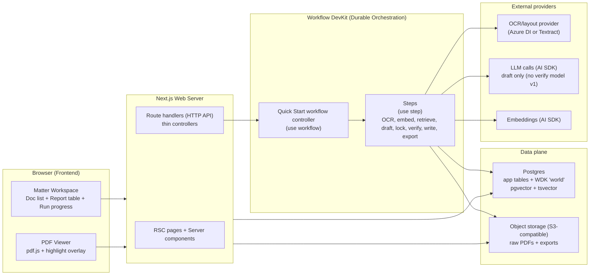
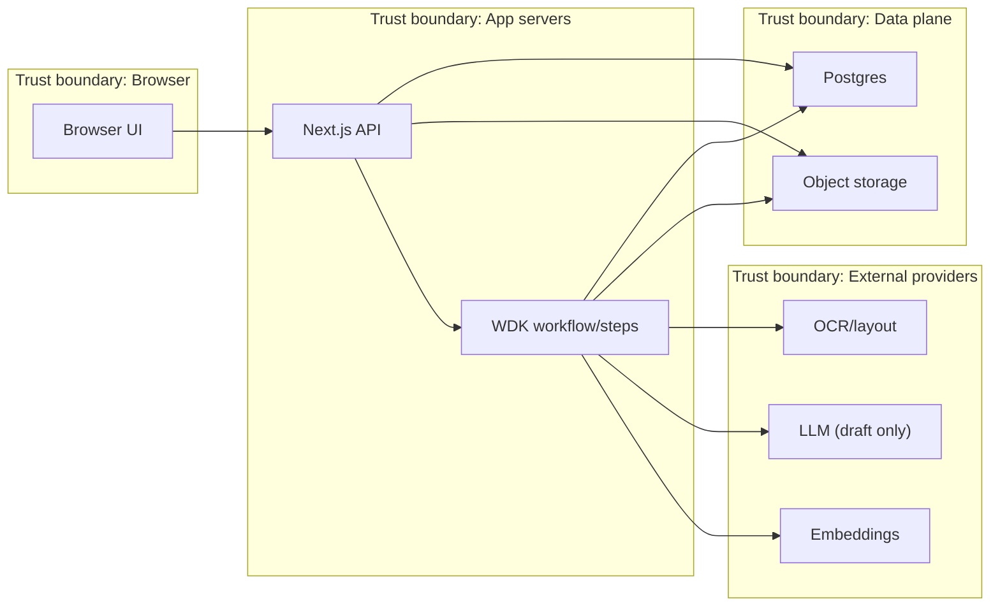

<user_instructions>
<taskname="Arch drift audit"/>

<task>
Produce the requested deliverables:
1) Architecture Drift Report comparing `docs/03-architecture/*` vs actual implementation.
2) Prioritized action plan (Docs updates, Code refactors, Security fixes, Simplifications).
3) Security audit report (threat-model-lite + OWASP-ish scan) with finding IDs, file+line, evidence snippet, impact, exploit sketch, minimal-diff fix.
4) YAGNI/minimalism review using the `## Simplification Analysis` format.

This repo is a PoC; docs describe a target WDK-based architecture. The current code is a smaller in-process queue based scaffold; call drift explicitly.
</task>

<architecture>
Documented target (canonical docs):
- WDK durable orchestration: workflow controller + step boundaries for OCR/embed/retrieve/draft/lock/verify/write/export.
- Postgres + object storage as data plane; citations locked+immutable with snippet hashing and geometry.
- Thin Next.js route handlers validating inputs (Zod) + safe error envelope.

Actual implementation (current code):
- Next.js App Router with Node runtime route handlers under `apps/web/app/(api)/**/route.ts`.
- Durable-ish behavior is implemented via in-memory queues (not WDK):
  - `apps/web/lib/ingest/ingestQueue.server.ts` for ingest.
  - `apps/web/lib/quickStartRunQueue.server.ts` for “Quick Start run” placeholder rows.
- Data plane is Postgres + local filesystem “object store”:
  - Schema is created at runtime in `apps/web/lib/db.server.ts` (tables: folders, documents, document_pages, chunks, runs, run_steps, report_rows, citations, artefacts).
  - Object storage is `../../tmp/object-store` with path traversal protections + HMAC signatures in `apps/web/lib/objectStore.server.ts`.
- Shared core package provides snippet hashing + verifier:
  - `packages/core/src/citations/snippet.ts` defines `normaliseSnippet()` + `hashSnippet()`.
  - `packages/core/src/verify/verifier.ts` exposes `verifyRow()` with modes `deterministic-only` or `entailment` (docs claim PoC v1 is integrity-only; call drift).
</architecture>

<selected_context>
Docs (architecture claims):
- `docs/03-architecture/10_system_architecture.md`: target component map + trust boundaries + key sequences.
- `docs/03-architecture/20_state_model.md`: state machines + invariants, export gating rules.
- `docs/03-architecture/30_data_model.md`: canonical ERD/tables + citation immutability + snippet_hash rule.
- `docs/03-architecture/40_rag_and_agents.md`: retrieval/draft/lock/verify contracts + ADR alignment.
- `docs/03-architecture/50_api_surface.md`: HTTP contract, error envelope, admin token, spikes gating.
- `docs/03-architecture/60_observability_and_evals.md`: taxonomy, trace export redaction expectations.
- `docs/03-architecture/DECISIONS.md`: ADRs that harden “evidence-first” invariants.
- `docs/04-projects/03-fixes/0001_drift/arch_prd_impl_drift.md`: prior drift notes.

Web/API implementation (trust boundary + input validation + auth-ish gates):
- `apps/web/app/(api)/folders/route.ts`, `apps/web/app/(api)/folders/[id]/route.ts`, `apps/web/app/(api)/folders/[id]/documents/route.ts`, `apps/web/app/(api)/folders/[id]/runs/route.ts`, `apps/web/app/(api)/folders/[id]/report/route.ts`, `apps/web/app/(api)/folders/[id]/artefacts/route.ts`.
- Upload/render: `apps/web/app/(api)/documents/[id]/upload/route.ts`, `apps/web/app/(api)/documents/[id]/complete/route.ts`, `apps/web/app/(api)/documents/[id]/render/route.ts`, `apps/web/app/(api)/documents/[id]/pdf/route.ts`.
- Evidence/trace: `apps/web/app/(api)/citations/[id]/route.ts`, `apps/web/app/(api)/runs/[id]/route.ts`, `apps/web/app/(api)/runs/[id]/trace/route.ts`.
- Exports: `apps/web/app/(api)/export/csv/route.ts`, `apps/web/app/(api)/export/csv/download/route.ts`, spike exporter `apps/web/app/(api)/spikes/export/csv/route.ts`.
- Demo/spikes: `apps/web/app/(api)/demo/load-pack/route.ts`, `apps/web/app/(api)/spikes/*`.

Server-side runtime modules (data plane, orchestration scaffold):
- `apps/web/lib/db.server.ts`: Postgres client + `ensureSchema()` DDL (note: citations table differs from docs; uses `polygons_json`, missing `index_version`, etc.).
- `apps/web/lib/objectStore.server.ts`: local fs object store; signed header generation + signature verification; strict storage_key regexes.
- `apps/web/lib/ingest/ingestQueue.server.ts`: pdf.js text extraction (not OCR provider), no geometry; chunks 1 per page; heuristic extraction_quality; writes document_pages + chunks.
- `apps/web/lib/quickStartRunQueue.server.ts`: in-memory run queue that currently writes `missing_input` or placeholder `citation_failed` rows (no retrieval/draft/lock pipeline yet).
- `apps/web/lib/folderState.server.ts`: derives folder states from DB facts.
- `apps/web/lib/questionSet.server.ts`: loads question set v1 from disk and hashes to a version string.
- `apps/web/lib/devOnlyApi.server.ts`, `apps/web/lib/demoMode.server.ts`, `apps/web/lib/spikes.server.ts`: gating helpers.
- `apps/web/lib/trace.server.ts`: creates `traceId` + response headers.

Core shared logic (hashing + verification + schemas):
- `packages/core/src/citations/snippet.ts`, `packages/core/src/verify/verifier.ts`, `packages/core/src/verify/verifier.schemas.ts`, `packages/core/src/safe-error.ts`, `packages/core/src/schemas/list_payload_v0.ts`.

Fixture utilities (used by docs/taxonomy alignment checks):
- `scripts/fixtures/assert_row_invariants.ts`, `scripts/fixtures/assert_citation_integrity.ts`, `scripts/fixtures/lib/*`, `scripts/fixtures/README.md`.

UI touchpoints (to understand end-to-end flows; not exhaustive):
- `apps/web/app/(app)/matters/actions.ts`, `apps/web/app/(app)/matters/QuickStartPanel.tsx`, `apps/web/app/(app)/matters/ExportCsvButton.tsx`, `apps/web/app/(app)/matters/ExportTraceButton.tsx`, `apps/web/app/(app)/matters/ArtefactsList.tsx`.
</selected_context>

<relationships>
- Schema/state backbone: `apps/web/lib/db.server.ts` tables are read/updated by route handlers + queues; folder state derived in `apps/web/lib/folderState.server.ts`.
- Upload flow:
  - init upload and metadata in folder/document routes (see `apps/web/app/(api)/folders/[id]/documents/route.ts`), then bytes PUT to `apps/web/app/(api)/documents/[id]/upload/route.ts` using HMAC signature headers from `apps/web/lib/objectStore.server.ts`.
  - completion triggers ingest queue via `apps/web/app/(api)/documents/[id]/complete/route.ts` -> `apps/web/lib/ingest/ingestQueue.server.ts`.
- Ingest writes `document_pages` + `chunks` (1 chunk per page, `hashSnippet(text)` for `text_hash`) and updates `documents.parse_status/ocr_status`.
- Quick Start run flow:
  - run creation endpoint(s) insert `runs` then enqueue `apps/web/lib/quickStartRunQueue.server.ts`.
  - queue writes `report_rows` + `run_steps` but does not implement retrieval/draft/lock/citations yet.
- Trace export:
  - `apps/web/app/(api)/runs/[id]/trace/route.ts` reads seeded snapshots (dev-only) and uses `packages/core/src/verify/verifier.ts:verifyRow()` in `deterministic-only` mode.
</relationships>

<ambiguities>
- WDK/workflow runtime described in docs does not appear in the selected code; current queues are process-memory only. Treat this as either (a) docs are aspirational/target state, or (b) a missing implementation slice.
- Docs specify OCR/layout providers and geometry-backed citations; current ingest uses pdf.js text extraction with `has_geometry: false` and cannot produce polygon highlights.
- Docs specify spikes gating with `SPIKES_ENABLED=1` and explicit admin token; current code often uses `assertDevOnlyApi()` (404 outside `NODE_ENV=development`) plus optional env flags per endpoint. Call drift and recommend a consistent policy.
</ambiguities>

<notes>
Omitted (not selected to stay under token budget): heavier fixture runner scripts like `scripts/fixtures/eval.ts`, `scripts/fixtures/compare_truth.ts`, `scripts/fixtures/seed.ts`, `scripts/fixtures/export_truth_match.ts` are present in repo but not fully included (some may appear as codemaps only).
</notes>

</user_instructions>


# Evidence Excerpts (Selected)

These are small, high-signal excerpts from the canonical docs and the current implementation to enable more concrete drift/security analysis without pasting the entire repo.

## docs/03-architecture/10_system_architecture.md (excerpt)

```md
# System architecture

This doc is the canonical high-level map of the Orbital Copilot PoC runtime. It should stay stable while code is added.

Goals (PoC)
- Evidence-first UX: click `citation_id` -> see highlighted PDF evidence.
- Deterministic-ish runs: row-by-row progress, resumability, retries, explicit side effects.
- Thin API layer: mostly triggers workflows and reads state.
- Production-minded plumbing, PoC-sized surface area (single-tenant; minimal infra).

Non-goals (for now)
- Multi-tenant admin, SSO/RBAC, billing.
- External web research inside a run (ADR-0007).
- Microservices decomposition (one app + worker is the baseline).

## Glossary
- Folder: DB/API name for a workspace container. UI calls it a Matter.
- Run: one execution of a Quick Start workflow for a folder.
- Step: a single side-effect boundary executed durably by Workflow DevKit (WDK).
- Index version: identifies the retrieval substrate built for a folder (chunks + indices).
- Agent bundle version: pins prompts + schemas + logic used by a run (git SHA is fine for PoC).
- Question set version: pins the question set used by a run (see `docs/03-architecture/20_state_model.md` and `docs/03-architecture/30_data_model.md`).
- Citation locking: resolving candidate chunk IDs into immutable citation records with snippet/hash/geometry (ADR-0001).

## High-level component map

Conventions:
- The meaning of `(use workflow)` / `(use step)` is defined in `docs/03-architecture/06_frameworks_agents_rag_evals.md`.



Notes:
- WDK owns durability, retries, resumability, and step-level progress events (ADR-0005).
- Domain logic should live outside the WDK integration layer (eg `packages/core`) and be called from steps.
- This repo started docs-first; keep the same conceptual boundaries even if directories differ.

## Data flow + trust boundaries



Safety notes:
- Provider calls are adapted and mediated; persist only canonical outputs, never raw provider payloads.
- Signed URLs are short-lived; only storage keys and stable metadata are persisted.
- Export is gated on locked citations + fail-closed verification (ADR-0001/0002).

## Ownership and boundaries

### Browser / frontend
Responsibilities:
- Matter workspace UI: upload documents, show ingest/run status, show report rows, show export links.
- PDF rendering with highlight overlay (render page from object storage; overlay locked citation polygons).

Must not:
- Fetch data via client-side effects by default (server-first; see `apps/web/AGENTS.md`).
- Invent trust: the UI should reflect row statuses and export gating rules from `docs/03-architecture/20_state_model.md`.

### Web/API (Next.js route handlers)
Responsibilities:
- Validate external inputs with Zod at the boundary (request bodies, route params).
- Translate domain errors into the safe error envelope (`docs/03-architecture/50_api_surface.md`, ADR-0008).
- Trigger workflows (start run, enqueue ingest/export) and read state for the UI.
- Provide signed URLs for PDF rendering and artefact downloads.

Must not:
- Implement heavy/long-running work inline (OCR, embeddings, LLM calls).
- Leak provider payloads or stack traces to clients.

### Workflow runtime + workers (WDK)
Responsibilities:
- Orchestrate the row-by-row flow for Quick Start:
  `retrieve -> draft -> lock -> verify -> write` (ADR-0005).
- Encapsulate non-deterministic side effects in explicit steps (ADR-0005).
- Guarantee idempotent replays/retries at the step boundary (see `docs/03-architecture/06_frameworks_agents_rag_evals.md`).

### Data plane (Postgres + object storage)
Responsibilities:
- Postgres is the source of truth for state: folders, documents, chunks, runs, steps, report rows, citations, artefacts (`docs/03-architecture/30_data_model.md`).
- Object storage holds raw PDFs and exported artefacts (ADR-0010).

Invariant:
- A claim is only "exportable" when its citations are locked and verification passes (ADR-0001/0002).

### External providers
Responsibilities:
- OCR/layout provider produces canonical per-page text + geometry (ADR-0003; ADR-0012).
- LLM + embeddings calls go through AI SDK and are routed/configured via env (ADR-0013).
- Verification v1 is integrity-only (no entailment model); do not call a "verify" model in PoC v1 (ADR-0017).


```

## docs/03-architecture/30_data_model.md (citations + hashing excerpt)

```md

Recommended constraints:
- FK `report_rows.run_id -> runs.id`.
- FK `report_rows.folder_id -> folders.id`.
- Unique `(report_rows.run_id, report_rows.question_id)`.
- `status` constrained to the report row statuses (`docs/03-architecture/20_state_model.md`).

### `citations`
Citations are **locked** and **immutable** once created. They store enough to highlight evidence without re-running retrieval or re-reading chunks.
- `id`, `report_row_id`
- `chunk_id` (nullable; stored for debugging/replay)
- `document_id`, `page_number`
- `polygons`, `snippet`, `snippet_hash`
- `index_version` (string; pins the chunking/indexing version the citation came from)
- timestamps

Recommended constraints:
- FK `citations.report_row_id -> report_rows.id`.
- FK `citations.document_id -> documents.id`.
- `snippet_hash` is required and must be computed with the canonical rule below.
- **Invariant:** exportable citations MUST include valid `polygons`. Missing/invalid polygons fail closed and must set `citation_failed`.

#### Citation polygon coordinate system (polygons)
`citations.polygons` is a list of polygons. Each polygon is a list of points `[x, y]`.

Canonical coordinate space (PoC v1):
- Points are **normalised floats** in the range `[0..1]`.
- Origin is **top-left** of the PDF page’s **viewBox**.
- `x` increases to the right, `y` increases down.
- Points are ordered clockwise (recommended; not required for rendering).
- This coordinate space is independent of zoom. Rendering applies the current pdf.js viewport transform.

Viewer mapping (pdf.js):
- Let `viewBox = [xMin, yMin, xMax, yMax]` from the pdf.js page.
- Convert a point `[xNorm, yNorm]` to PDF points:
  - `xPdf = xMin + xNorm * (xMax - xMin)`
  - `yPdf = yMax - yNorm * (yMax - yMin)` (invert Y because `yNorm` is top-left origin)
- Convert to viewport pixels:
  - `[xPx, yPx] = viewport.convertToViewportPoint(xPdf, yPdf)`

Validation (fail-closed):
- Every point must be within `[0..1]`.
- Polygons must be non-empty.
- If any validation fails (including missing polygons), treat the citation as invalid and fail closed (`citation_failed`).

### `artefacts`
- `id`, `folder_id`, `type`, `storage_key`
- `source_run_id`, `metadata_json`
- timestamps

Notes:
- Do not persist signed `download_url` values in the DB; persist `storage_key` + metadata and generate fresh signed URLs on demand.
- Recommended `metadata_json` fields (PoC):
  - `kind` (e.g. `requirements_tracker`, `exceptions_table`, `survey_issues`, `memo`)
  - `filename`
  - `schema_version` (for CSVs)
  - `unsafe` / `unsafe_override` (if demo-only unsafe exports are ever allowed)

## Provenance JSON (recommended shape)
`report_rows.provenance_json` should be structured enough to support:
- replay ("what evidence did we use?")
- debugging ("which step failed, why?")
- evals ("what was Recall@K, what was verified?")

Minimal example (shape only; evolve as needed):
```json
{
  "retrieval": {
    "index_version": "v1",
    "query": "List Schedule B-II exceptions...",
    "chunks": [
      { "chunk_id": "chk_123", "score": 12.34 },
      { "chunk_id": "chk_456", "score": 10.98 }
    ]
  },
  "draft": {
    "model": "anthropic/claude-sonnet-4.5",
    "prompt_hash": "sha256:..."
  },
  "lock": {
    "locked_citation_ids": ["cit_123", "cit_124"]
  },
  "verify": {
    "model": "openai/gpt-5",
    "verdict": "pass",
    "reason_code": null
  }
}
```

## Hashing rule (snippet_hash)
We use `snippet_hash` to detect citation drift.

PoC rule:
- `snippet_hash = "sha256:" + sha256_hex(normalise(snippet))`
- `sha256_hex(...)` is lower-case hex.
- Input must be UTF-8 text; hashing is performed on UTF-8 bytes after normalisation.
- `normalise()` must:
  - trim leading/trailing whitespace
  - convert CRLF → LF
  - collapse all whitespace (including newlines/tabs) to a single space

This rule must be implemented once (e.g. in `packages/core/citations`) and reused everywhere.

## Indices and constraints (recommended)
- Unique and FK constraints:
  - unique `(documents.folder_id, documents.sha256)`
  - unique `(report_rows.run_id, report_rows.question_id)`
  - unique `(chunks.document_id, chunks.index_version, chunks.chunk_index)`
  - unique `(run_steps.run_id, run_steps.step_key)`

- Indexing:
  - GIN on `chunks.tsv`
  - pgvector index on `chunks.embedding`
  - index `citations.report_row_id`
  - index `runs.folder_id`
  - index `documents.folder_id`

```

## docs/03-architecture/50_api_surface.md (auth/admin token/error envelope/spikes excerpt)

```md
# API surface (PoC)

This doc is the canonical HTTP contract for the PoC. Keep it small, but explicit.

Important: This is the **target** API surface. During development we may ship dev-only spike endpoints, but they must live under `/spikes/*`, be gated behind `SPIKES_ENABLED=1`, and return `404` unless spikes are explicitly enabled.

See also:
- State machines + invariants: `docs/03-architecture/20_state_model.md`
- Persistence + hashing rules: `docs/03-architecture/30_data_model.md`

## Conventions
- All request/response bodies are JSON unless noted.
- IDs are opaque strings.
- Timestamps are ISO 8601.
- For POST endpoints that create work, support an optional `Idempotency-Key` header.
  - Spike endpoints must live under `/spikes/*` and are never part of the target contract.

### Versioning (PoC)
For now, paths are unversioned. Treat this document as "v1". If we need breaking changes later, introduce `/v2` explicitly.

### Auth (PoC)
Auth is an open decision (`docs/03-architecture/00_overview.md`). The contract still defines:
- `UNAUTHENTICATED`: missing/invalid auth
- `UNAUTHORISED`: authenticated but not allowed

PoC default assumption: single-tenant; environments may run without auth in local/dev, but production-minded deployments should turn auth on.

Non-negotiable rules for shared/demo environments:
- No unauthenticated access to PDFs or extracted text.
- All download/render URLs must be signed with a short TTL.
- Never log auth tokens or signed URLs (server logs, traces, analytics, or error reports).

### Admin token (PoC)
Some developer-facing endpoints are "admin-only" even in a no-auth PoC environment. PoC v1 contract:
- Require `X-Orbital-Admin-Token` header to match env `ORBITAL_ADMIN_TOKEN`.
- If missing/mismatched, return `403` with `error.code = "UNAUTHORISED"` (standard error envelope).

### Correlation and tracing
- The server should generate/propagate a `trace_id` per request and include it in the error envelope and as an `X-Trace-Id` response header.
- Workflow runs should record the `trace_id` that created them in `runs`/`run_steps` metadata (implementation detail, but required for debugging).

## Error envelope (required)
All non-2xx responses must use the same envelope (no stack traces, no internal provider payloads):

```json
{
  "error": {
    "code": "VALIDATION_ERROR",
    "message": "Human readable summary",
    "details": { "field": "optional safe detail" },
    "trace_id": "optional-trace-id"
  }
}
```

Minimum error codes (PoC):
- `VALIDATION_ERROR`
- `UNAUTHENTICATED` / `UNAUTHORISED`
- `NOT_FOUND`
- `CONFLICT`
- `RATE_LIMITED`
- `EXPORT_BLOCKED` (default when any row is `citation_failed`)
- `INTERNAL`

Internal vs external errors:
- External errors are safe for clients and must map to a stable `error.code` above with a human-readable `message`.
- Internal errors (unexpected exceptions, provider failures, stack traces) must be mapped to `error.code = "INTERNAL"` with a safe message. Log the internal detail server-side only (never return it to the client).

HTTP status mapping (PoC default):
- `VALIDATION_ERROR` -> `400`
- `UNAUTHENTICATED` -> `401`
- `UNAUTHORISED` -> `403`
- `NOT_FOUND` -> `404`
- `CONFLICT` -> `409`
- `RATE_LIMITED` -> `429`
- `EXPORT_BLOCKED` -> `409`
- `INTERNAL` -> `500`

## Demo controls (dev-only)

These endpoints are dev-only and must follow the spike endpoint conventions:
- Paths live under `/spikes/*`.
- They are gated behind `SPIKES_ENABLED=1` and return `404` unless spikes are explicitly enabled.

### POST /spikes/demo/load-pack (admin)
Load a known fixture pack from `docs/08-example-data/` and seed a fresh folder ("matter") with documents only.

Access control (PoC v1):
- Requires `X-Orbital-Admin-Token` header matching env `ORBITAL_ADMIN_TOKEN` (see Admin token (PoC) above).

Feature flags:
- Requires `SPIKES_ENABLED=1` and `DEMO_MODE=1`.
  - Otherwise return `404` with `error.code = "NOT_FOUND"`.

Request:
```json
{ "pack_id": "pack_01_clean" }
```

Response:
```json
{ "folder_id": "fld_123" }
```

Notes:
- `pack_id` must be allowlisted. Do not accept filesystem paths.
- Loader must read `docs/08-example-data/<pack_id>/manifest.json` and fail if missing; do not infer pack structure from directory listing.
- Never return local filesystem paths or signed URLs from this endpoint.

## Folder + documents

### GET /folders
List matters (folders). This is the minimal "home screen" API.

Response:
```json
{
  "folders": [
    {
      "id": "fld_123",

```

## apps/web/lib/db.server.ts (citations DDL excerpt, with line numbers)

```ts
   220	      notes TEXT NULL,
   221	      provenance_json JSONB NOT NULL DEFAULT '{}'::jsonb,
   222	      payload_schema_version TEXT NULL,
   223	      payload_json JSONB NULL,
   224	      created_at TIMESTAMPTZ NOT NULL DEFAULT now(),
   225	      updated_at TIMESTAMPTZ NOT NULL DEFAULT now(),
   226	      UNIQUE (run_id, question_id),
   227	      CHECK (status <> 'missing_input' OR answer = 'Not found in provided documents.')
   228	    );
   229	  `;
   230	
   231	  // Enforce row uniqueness even if an older dev DB pre-dates the table constraint.
   232	  await sql`
   233	    CREATE UNIQUE INDEX IF NOT EXISTS report_rows_run_question_uidx
   234	    ON report_rows(run_id, question_id);
   235	  `;
   236	
   237	  await sql`
   238	    CREATE INDEX IF NOT EXISTS report_rows_folder_run_idx
   239	    ON report_rows(folder_id, run_id);
   240	  `;
   241	
   242	  // Locked citations associated to a report row. In this slice we may emit zero citations.
   243	  await sql`
   244	    CREATE TABLE IF NOT EXISTS citations (
   245	      id TEXT PRIMARY KEY,
   246	      report_row_id TEXT NOT NULL REFERENCES report_rows(id) ON DELETE CASCADE,
   247	      document_id TEXT NOT NULL,
   248	      page_number INT NOT NULL,
   249	      snippet TEXT NOT NULL,
   250	      snippet_hash TEXT NOT NULL,
   251	      polygons_json JSONB NOT NULL,
   252	      locked_at TIMESTAMPTZ NOT NULL DEFAULT now(),
   253	      created_at TIMESTAMPTZ NOT NULL DEFAULT now()
   254	    );
   255	  `;
   256	
   257	  await sql`
   258	    CREATE INDEX IF NOT EXISTS citations_report_row_idx
   259	    ON citations(report_row_id);
   260	  `;
   261	
   262	  // Exported artefacts (CSV, docx, etc).
   263	  // Signed download URLs are generated at read-time and are never persisted.
   264	  await sql`
   265	    CREATE TABLE IF NOT EXISTS artefacts (
   266	      id TEXT PRIMARY KEY,
   267	      folder_id TEXT NOT NULL REFERENCES folders(id) ON DELETE CASCADE,
   268	      type TEXT NOT NULL,
   269	      kind TEXT NOT NULL,
   270	      filename TEXT NOT NULL,
   271	      storage_key TEXT NOT NULL UNIQUE,
   272	      source_run_id TEXT NULL,
   273	      metadata_json JSONB NOT NULL DEFAULT '{}'::jsonb,
   274	      created_at TIMESTAMPTZ NOT NULL DEFAULT now(),
   275	      updated_at TIMESTAMPTZ NOT NULL DEFAULT now()

```

## apps/web/lib/objectStore.server.ts (signature verification excerpt, with line numbers)

```ts
    40	
    41	export function validateArtefactStorageKey(storageKey: string): { ok: true } | { ok: false; reason: string } {
    42	  if (ARTEFACT_CSV_KEY_RE.test(storageKey)) return { ok: true };
    43	  if (ARTEFACT_DOCX_KEY_RE.test(storageKey)) return { ok: true };
    44	  return { ok: false, reason: "INVALID_STORAGE_KEY" };
    45	}
    46	
    47	function resolveObjectPath(storageKey: string): string {
    48	  const base = objectStoreRoot();
    49	  const candidate = path.resolve(base, storageKey);
    50	  if (!candidate.startsWith(base + path.sep)) throw new Error("PATH_TRAVERSAL");
    51	  return candidate;
    52	}
    53	
    54	function secret(): string {
    55	  const fromEnv = process.env.OBJECT_STORE_SIGNING_SECRET;
    56	  if (fromEnv && fromEnv.trim()) return fromEnv.trim();
    57	
    58	  // Fail closed outside dev: signing must be explicitly configured.
    59	  if (process.env.NODE_ENV !== "development") {
    60	    throw new Error("OBJECT_STORE_SIGNING_SECRET_MISSING");
    61	  }
    62	
    63	  // Dev-only fallback so local upload works out of the box.
    64	  const g = globalThis as GlobalObj;
    65	  if (!g.__orbitalObjectStoreSecret) {
    66	    g.__orbitalObjectStoreSecret = `dev-${randomBytes(32).toString("hex")}`;
    67	  }
    68	  return g.__orbitalObjectStoreSecret;
    69	}
    70	
    71	function b64url(input: Buffer): string {
    72	  return input
    73	    .toString("base64")
    74	    .replace(/=/g, "")
    75	    .replace(/\+/g, "-")
    76	    .replace(/\//g, "_");
    77	}
    78	
    79	const SIGNATURE_PAYLOAD_VERSION = "v1";
    80	
    81	function sign(args: { purpose: string; storageKey: string; expiresAtMs: number }): string {
    82	  const payload = `${SIGNATURE_PAYLOAD_VERSION}\n${args.purpose}\n${args.storageKey}\n${args.expiresAtMs}`;
    83	  const digest = createHmac("sha256", secret()).update(payload).digest();
    84	  return b64url(digest);
    85	}
    86	
    87	export function verifySignature(args: { purpose: string; storageKey: string; expiresAtMs: number; sig: string }): boolean {
    88	  const expected = sign({ purpose: args.purpose, storageKey: args.storageKey, expiresAtMs: args.expiresAtMs });
    89	  const a = Buffer.from(expected);
    90	  const b = Buffer.from(args.sig);
    91	  if (a.length !== b.length) return false;
    92	  return timingSafeEqual(a, b);
    93	}
    94	
    95	function createSignedHeaders(args: {
    96	  purpose: string;
    97	  storageKey: string;
    98	  expiresInSeconds?: number;
    99	}): { expires_at_ms: number; signature: string } {
   100	  const expiresInSeconds = args.expiresInSeconds ?? 10 * 60;
   101	  const expiresAtMs = Date.now() + expiresInSeconds * 1000;
   102	  const signature = sign({ purpose: args.purpose, storageKey: args.storageKey, expiresAtMs });
   103	  return { expires_at_ms: expiresAtMs, signature };
   104	}
   105	
   106	export function createSignedPutHeaders(args: {
   107	  storageKey: string;
   108	  expiresInSeconds?: number;
   109	}): { expires_at_ms: number; signature: string } {
   110	  return createSignedHeaders({ purpose: "put", ...args });
   111	}
   112	
   113	export function createSignedGetHeaders(args: {
   114	  storageKey: string;
   115	  expiresInSeconds?: number;
   116	}): { expires_at_ms: number; signature: string } {
   117	  return createSignedHeaders({ purpose: "get", ...args });
   118	}
   119	
   120	export function objectExists(storageKey: string): boolean {
   121	  const p = resolveObjectPath(storageKey);
   122	  return fs.existsSync(p);
   123	}
   124	
   125	function sha256Digest(bytes: Uint8Array): string {
   126	  const hash = createHash("sha256").update(bytes).digest("hex");
   127	  return `sha256:${hash}`;
   128	}
   129	
   130	async function writeObjectFile(p: string, bytes: Uint8Array, opts?: { writeOnce?: boolean }): Promise<void> {
   131	  fs.mkdirSync(path.dirname(p), { recursive: true });
   132	  if (opts?.writeOnce) {
   133	    await fs.promises.writeFile(p, bytes, { flag: "wx" });
   134	    return;
   135	  }
   136	  await fs.promises.writeFile(p, bytes);
   137	}
   138	
   139	export async function putObject(args: {
   140	  storageKey: string;

```

## apps/web/lib/ingest/ingestQueue.server.ts (chunk write + text_hash excerpt, with line numbers)

```ts
   240	  // 0.60 "ready" threshold; scans with little/no text should remain low.
   241	  const extractionQuality = Math.max(0, Math.min(1, avgCharsPerPage / 600));
   242	  const extractionQualityMethod = "pdfjs_text_chars_per_page_v2";
   243	
   244	  const folders = await sql<{ latest_index_version: string }[]>`
   245	    SELECT latest_index_version
   246	    FROM folders
   247	    WHERE id = ${doc.folder_id}
   248	    LIMIT 1
   249	  `;
   250	  const indexVersion = folders[0]?.latest_index_version ?? "v1";
   251	
   252	  try {
   253	    await sql.begin(async (tx) => {
   254	      // postgres.js TransactionSql types lose call signatures; cast for tagged template usage.
   255	      const t = tx as unknown as typeof sql;
   256	
   257	      await t`DELETE FROM document_pages WHERE document_id = ${documentId}`;
   258	      for (const p of pages) {
   259	        await t`
   260	          INSERT INTO document_pages (id, document_id, page_number, text, layout_json, created_at, updated_at)
   261	          VALUES (
   262	            ${newId("pg")},
   263	            ${documentId},
   264	            ${p.page_number},
   265	            ${p.text},
   266	            ${t.json(p.layout_json)},
   267	            now(),
   268	            now()
   269	          )
   270	        `;
   271	      }
   272	
   273	      await t`
   274	        UPDATE documents
   275	        SET ocr_status = 'done',
   276	            extraction_quality = ${extractionQuality},
   277	            metadata_json = jsonb_set(metadata_json, '{extraction_quality_method}', to_jsonb(${extractionQualityMethod}::text), true),
   278	            updated_at = now()
   279	        WHERE id = ${documentId}
   280	      `;
   281	
   282	      await t`
   283	        DELETE FROM chunks
   284	        WHERE document_id = ${documentId}
   285	          AND index_version = ${indexVersion}
   286	      `;
   287	
   288	      // Minimal chunking: one chunk per page.
   289	      for (let i = 0; i < pages.length; i++) {
   290	        const p = pages[i]!;
   291	        const textHash = hashSnippet(p.text);
   292	        await t`
   293	          INSERT INTO chunks (
   294	            id,
   295	            document_id,
   296	            index_version,
   297	            chunk_index,
   298	            page_start,
   299	            page_end,
   300	            text,
   301	            metadata_json,
   302	            text_hash,
   303	            created_at
   304	          )
   305	          VALUES (
   306	            ${newId("chk")},
   307	            ${documentId},
   308	            ${indexVersion},
   309	            ${i},
   310	            ${p.page_number},
   311	            ${p.page_number},
   312	            ${p.text},
   313	            ${t.json({ page_number: p.page_number })},
   314	            ${textHash},
   315	            now()
   316	          )
   317	        `;
   318	      }
   319	    });
   320	  } catch {

```
